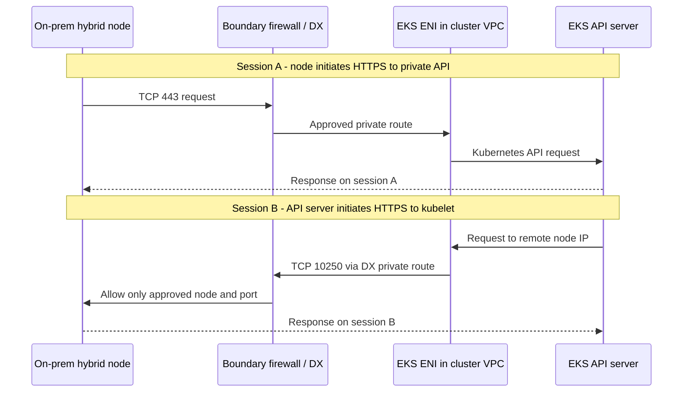

# Reviewing Hybrid Nodes Network Separation with Security Teams

> **Last Updated**: September 16, 2026

An AWS control plane connecting to on-premises infrastructure through Direct Connect (DX) does not, by itself, establish a network-separation violation. Equally, **“we use a private endpoint, therefore we comply” is not a valid conclusion.** The review needs to establish which management connections cross trust boundaries, how they are controlled, and what data they can carry.

This article supports a technical review of **a conventional routed Hybrid Nodes deployment with a private-only Kubernetes API endpoint and DX private routing**. It is not a compliance determination or approval for a customer's industry, system classification, or internal policy. “Potentially acceptable” below means the organization's policy permits controlled management communication between networks. No customer account, DX connection, firewall, or cluster was inspected for this article.

## An explanation to give the security team

> EKS Hybrid Nodes connects on-premises nodes to an AWS-managed Kubernetes control plane. The design under review disables public access to the Kubernetes API and uses approved private routes and boundary firewalls. Connections initiated by the control plane traverse the EKS ENIs in the cluster VPC and are restricted to approved nodes on kubelet TCP 10250 and, where used, approved webhook destinations and ports. API and kubelet authentication and authorization, restricted operator permissions, and audit records are applied together.
>
> The security case therefore depends on **restricting and verifying which identities can perform which operations on which resources**, rather than assuming that AWS or an endpoint is trusted. This architecture includes management connections between networks. A requirement for complete disconnection or a blanket ban on connections initiated from the cloud is incompatible with this design as described.

Use “restricted” and “applied” in a submission only when configuration and test evidence support those claims. At design time, say “planned and subject to verification.” AWS's [Hybrid Nodes networking requirements](https://docs.aws.amazon.com/eks/latest/userguide/hybrid-nodes-networking.html) explicitly list inbound TCP 10250 and required webhook ports for the on-premises firewall.

## Three different meanings of “endpoint”

| Component | Purpose | What it does not establish |
|---|---|---|
| **Kubernetes API private endpoint** | Private HTTPS TCP 443 access to the cluster API for kubelets, Pods, and approved operators | It does not eliminate control-plane connections toward on-premises infrastructure or prevent data movement through authorized API operations |
| **EKS control-plane ENIs in the cluster VPC** | Network attachment between the API server and VPC / remote node and Pod networks, subject to attached security groups and routing | An ENI is not a DLP appliance, a certified cross-domain solution, or an application-command approval system |
| **Interface VPC endpoints / PrivateLink for AWS services** | Private-address access to the corresponding AWS service API, such as `eks`, `ssm`, or `rolesanywhere` | `com.amazonaws.<region>.eks` does not relay the Kubernetes API or control-plane-to-kubelet connections |

AWS describes the Kubernetes API private endpoint as distinct from a traditional AWS API PrivateLink endpoint; it does not appear in the VPC console's endpoint list. The `eks` interface endpoint serves the **AWS EKS management API**, including `DescribeCluster`. Confusing these endpoints can lead to the false claim that an endpoint policy controls the TCP 10250 connection. [Cluster endpoint](https://docs.aws.amazon.com/eks/latest/userguide/cluster-endpoint.html), [EKS PrivateLink](https://docs.aws.amazon.com/eks/latest/userguide/vpc-interface-endpoints.html)

`endpointPrivateAccess=true` alone does not mean private-only. This article also assumes `endpointPublicAccess=false`. With both public and private access enabled, hybrid nodes can resolve the cluster hostname to public IPs. `publicAccessCidrs` does not restrict the private endpoint; cluster security groups, routing, and firewalls control the private path. [Endpoint access modes](https://docs.aws.amazon.com/eks/latest/userguide/cluster-endpoint.html)

## Which side initiates each connection?

The diagram shows requests on **two separate TCP sessions**. Reverse arrows do not mean that responses on an existing outbound connection support every operation. The boundary firewall is a customer-designed control; DX does not automatically supply it.

Dashed responses traverse the approved path in reverse. The drawing does not introduce a proxy that changes TLS termination. Actual routing depends on VPC route tables, the chosen VGW or TGW/DX gateway configuration, and on-premises routing and firewalls. [AWS packet-flow reference](https://docs.aws.amazon.com/eks/latest/userguide/hybrid-nodes-concepts-traffic-flows.html)

| Connection initiator → destination | Destination port | Purpose and review scope |
|---|---|---|
| Hybrid kubelet → Kubernetes API private endpoint | TCP 443 | Cluster management, including node status and Pod specifications |
| API server → hybrid node kubelet | TCP 10250 | A separate connection used for operations such as `logs`, `exec`, `attach`, `cp`, and `port-forward` |
| API server → on-premises webhook / aggregated API backend | Actual backend TCP port | Separate approval when these components run on-premises; distinguish the Service port from the actual destination port |
| Hybrid node → selected SSM or IAM Roles Anywhere endpoint | TCP 443 | Node temporary-credential issuance and renewal; review permissions and connectivity for any SSM management features as well |
| Pod → Kubernetes API / required AWS services | Commonly TCP 443 | CNI SNAT affects the source address visible at a firewall and the return path |
| DNS client → approved resolver | UDP/TCP 53 | Define DNS paths separately, accounting for CoreDNS placement and DNS forwarding |
| Applications, CNI, and monitoring components | Feature-specific | Maintain a separate flow inventory rather than approving these collectively as management traffic |

This table is not a complete firewall policy for every CNI and application. Use [Network Configuration](02-network-configuration.md) and [AWS's ongoing-operation requirements](https://docs.aws.amazon.com/eks/latest/userguide/hybrid-nodes-networking.html) for details. Webhook port `8443` is an example, not a request to allow every port at or above `8443`.

**Allowing stateful return traffic for node-initiated TCP 443 does not allow a new inbound TCP 10250 connection.** Describing this architecture as an outbound-only agent tunnel creates both operational and security errors. Security groups are stateful; network ACLs are stateless and need separate return-traffic consideration. If NAT or inspection devices intervene, verify the addresses visible at each boundary and the symmetric return path. [Hybrid traffic flows](https://docs.aws.amazon.com/eks/latest/userguide/hybrid-nodes-concepts-traffic-flows.html), [Security groups and network ACLs](https://aws.amazon.com/vpc/faqs/)

## Turn network-separation policy into design requirements

First obtain the customer's actual policy statement. This table checks **technical compatibility with requirements**, not the interpretation of legislation or regulatory exemptions.

| Customer requirement | Assessment of this design |
|---|---|
| No internet exposure; approved private management connections between networks are allowed | A candidate for review. Demonstrate public API disablement, private paths for required services, least privilege, firewall controls, and records |
| Physical disconnection prevents real-time communication with an external control plane | Conflicts with Hybrid Nodes connectivity requirements. Consider locating the control plane inside the permitted internal boundary |
| Only responses to internally initiated sessions are allowed; all new cloud-initiated connections are prohibited | Conflicts with the kubelet and webhook flows of a conventional routed Hybrid Nodes deployment |
| Workload domains require independent administrative authority as well as separate networks | Do not conclude from VLANs or namespaces alone. Review the shared cluster administrator and control plane; separate clusters where needed |
| Kubernetes objects, Secrets, and operational logs must also remain exclusively on-premises | Identify data that conflicts with an AWS-hosted control plane. Node placement alone cannot satisfy the requirement |
| Connections require a specified cross-domain appliance and approval process | Do not presume DX or PrivateLink replaces that appliance or process. Confirm applicability and functional compatibility |

[Restricted-Internet Setup](03-airgap-setup.md) distinguishes internet restriction from complete disconnection from AWS. Hybrid Nodes requires reliable bidirectional connectivity. [Hybrid Nodes overview](https://docs.aws.amazon.com/eks/latest/userguide/hybrid-nodes-overview.html)

## Apply each control at the right boundary

### Routing and network access

Remote node and Pod CIDRs tell EKS about the destination networks. Registering them does not complete on-premises routes, firewalls, or isolation policies. Inspect EKS-created cluster SG inbound rules too, including stale rules after a CIDR reduction. AWS explicitly states that removing remote networks does not automatically remove their security group rules. [Networking and SG configuration](https://docs.aws.amazon.com/eks/latest/userguide/hybrid-nodes-networking.html)

Present the rule as **verified EKS ENI source-address range → designated hybrid node addresses → TCP 10250**. ENI IPs can change, so do not freeze today's `/32` list permanently. Where feasible, dedicated control-plane subnets narrow address ownership; maintain an allowlist update and revalidation process for ENI replacement and cluster updates. Allowing a whole shared subnet can include other resources in that source range: record this residual risk. [EKS ENI lifecycle and network planning](https://docs.aws.amazon.com/eks/latest/userguide/hybrid-nodes-networking.html)

Review cluster SG egress, VPC/TGW routes, and on-premises boundary and host firewalls together. An SG ID is not an identity carried to an on-premises firewall. A route also does not establish authorization for an API operation. Limit propagation and access to unrelated business-network prefixes, and verify denial of destinations outside the approved set. These are design recommendations, not claims about controls already applied to a customer environment.

### Encryption, identity, and authorization

**DX does not encrypt traffic in transit by default.** Preserve TLS and authentication checks for the Kubernetes API and kubelet HTTPS connections. If link encryption is required, review supported IPsec over DX or MACsec options and their coverage. MACsec protects supported DX links; its scope differs from application end-to-end TLS. DX usage alone does not prove encryption of every application or overlay flow. [DX encryption](https://docs.aws.amazon.com/directconnect/latest/UserGuide/encryption-in-transit.html)

A private IP address does not establish the caller's permissions. Review operator IAM identities, EKS access entries/access policies and Kubernetes RBAC, node identities, and kubelet authentication and authorization separately. Do not resolve connectivity problems by disabling TLS verification or enabling anonymous/AlwaysAllow kubelet access. Direct kubelet access is a separate authorization path and must not be treated as equivalent to an API-server-mediated operation. [EKS access management](https://docs.aws.amazon.com/eks/latest/userguide/access-entries.html), [Kubelet authentication and authorization](https://kubernetes.io/docs/reference/access-authn-authz/kubelet-authn-authz/)

An AWS service endpoint policy filters that service's API calls through that endpoint. It does not grant IAM permissions or replace Kubernetes RBAC. When SSM is used, review authorization for management features such as Run Command and Session Manager. A node initiating HTTPS does not remove the possibility of externally directed management commands. [Endpoint access control](https://docs.aws.amazon.com/vpc/latest/privatelink/vpc-endpoints-access.html), [SSM access control](https://docs.aws.amazon.com/systems-manager/latest/userguide/security-iam.html)

### Data and administrative boundaries

Hybrid Nodes does not automatically replicate all business datasets processed by on-premises Pods into AWS. However, the AWS control plane manages Kubernetes API objects. Sensitive content placed in Pod specifications, ConfigMaps, or Kubernetes Secrets becomes managed data too. `logs` transfers application output, while `exec`, `cp`, and `port-forward` can provide authorized users with data-access paths. Do not claim that management traffic can never contain business data. Encryption of API data at rest does not change its storage location or prevent movement through authorized reads. [Hybrid networking concepts](https://docs.aws.amazon.com/eks/latest/userguide/hybrid-nodes-concepts-networking.html), [EKS API data encryption](https://docs.aws.amazon.com/eks/latest/userguide/envelope-encryption.html)

Review `pods/log`, `pods/exec`, `pods/attach`, `pods/portforward`, `nodes/proxy`, and workload creation/modification permissions together. Restricting `exec` alone is insufficient if a principal can create new Pods or privileged/hostPath workloads that access the data another way. Pod security and admission policies and host-access restrictions complement RBAC. Namespaces and NetworkPolicy alone do not create an independent security boundary against a shared cluster administrator. [Kubernetes RBAC good practices](https://kubernetes.io/docs/concepts/security/rbac-good-practices/)

In particular, do not classify `get nodes/proxy` as read-only. It can authorize container command execution through the kubelet API, and that access can bypass Kubernetes audit and admission paths. Collecting API audit alone does not establish coverage of every administrator operation. [Node proxy permission risks](https://kubernetes.io/docs/concepts/security/rbac-good-practices/#access-to-proxy-subresource-of-nodes)

Classify business data, API objects, streamed logs, audit logs, images/artifacts, and credentials separately. Record storage locations, transfer destinations, access permissions, and retention. Include application egress and SSM management paths to establish the actual scope of an “on-premises-only data” statement.

## Evidence to attach to the security review

These are **evidence requirements**, not completed inspection results. Do not attach customer identifiers, tokens, Secret values, or real business logs to public documentation.

| Review question | Evidence | Acceptance criteria |
|---|---|---|
| Is private-only access actually applied? | Target-cluster endpoint settings, on-premises DNS answers, DX routing, and boundary flow records | Public access disabled and actual private addresses and paths verified; DNS success alone is insufficient |
| What can AWS reach internally? | ENI/subnet ownership, remote CIDRs, VPC/TGW and on-premises routes, and matched SG/firewall rules | Only approved nodes, backends, and ports allowed; restrictions on other business domains demonstrated |
| Are allowed and forbidden operations distinguished? | Successful `logs` and approved management operations using synthetic data in an isolated test environment; denied unauthorized identities and destinations | Connectivity and authorization tested separately; a network failure is not a substitute for an authorization-denial test |
| Who performed which API operation, and when? | EKS Kubernetes audit/authentication records, CloudTrail for AWS management APIs, and correlated timestamps | Distinguish the two API layers and trace test identity, time, operation, target, and result |
| What crossed the boundary? | VPC Flow Logs, on-premises firewall records, and a separate data-flow inventory | Present IP/port/allow-deny evidence alongside data classification; do not claim Flow Logs attest TLS payloads or command bodies |
| Do boundaries survive change and failure? | Revalidation and recovery plans for ENI replacement, route changes, DX/VPN failover, and credential renewal/expiry | Backup paths preserve policy; untested failover is not labeled safe |

Enable the required EKS control-plane log types; Kubernetes audit and CloudTrail have different roles. Audit logs record API events according to the audit policy and level, not every `exec` input/output or `port-forward` payload. Design retention, access controls, and sensitive-data handling alongside collection. [Control-plane logs](https://docs.aws.amazon.com/eks/latest/userguide/control-plane-logs.html), [EKS auditing](https://docs.aws.amazon.com/eks/latest/best-practices/auditing-and-logging.html), [EKS CloudTrail](https://docs.aws.amazon.com/eks/latest/userguide/logging-using-cloudtrail.html), [Flow Logs limitations](https://docs.aws.amazon.com/vpc/latest/userguide/flow-logs.html)

Perform validation against approved non-production targets using synthetic data. Establishing the boundary does not require scanning an entire business network, broadly opening production firewalls, or extracting customer data through `logs` or `cp`.

## Questions security teams commonly ask

### “Does opening 10250 allow all of AWS to access internal servers?”

A correctly restricted design allows verified cluster ENI source ranges and authenticated callers, not the entire AWS address space. An IP allowlist alone still does not prove cluster identity, and shared-subnet exposure or excessive administrator permissions remain risks. Present network restrictions together with TLS, authentication, and authorization evidence.

### “Does moving webhooks to AWS eliminate inbound connections?”

It can reduce direct connections to on-premises webhooks. The kubelet TCP 10250 requirement remains separate, and cloud-hosted webhooks may have other dependencies. See [AWS's webhook guidance](https://docs.aws.amazon.com/eks/latest/userguide/hybrid-nodes-webhooks.html) for cloud-node placement options.

### “Does Hybrid Nodes Gateway make the design outbound-only?”

[Hybrid Nodes Gateway](10-hybrid-nodes-gateway.md) uses Cilium VTEP/VXLAN to support hybrid Pod connectivity. It is neither a disconnected-cluster product nor a one-way security gateway. Review gateway and tunnel outer addresses/ports and inner Pod flows separately; do not copy this article's direct-routing table unchanged. [AWS Gateway overview](https://aws.amazon.com/blogs/containers/simplify-hybrid-kubernetes-networking-with-amazon-eks-hybrid-nodes-gateway/)

### “Can we state that this does not violate network-separation requirements?”

Not from the connection method alone. If the applicable policy permits controlled management connectivity and evidence and organizational approval cover the connections, permissions, and data boundary, record the **review scope and conditions** with the conclusion. Do not relabel a prohibited connection as permissible merely because it uses DX or a private endpoint.

## Further reading

- [Network configuration and endpoint details](02-network-configuration.md)
- [Restricted internet access versus complete disconnection](03-airgap-setup.md)
- [Operations and maintenance](08-operations.md)
- [Network-separation security review quiz](../quizzes/eks-hybrid-nodes/11-network-separation-security-quiz.md)

< [Hybrid Nodes contents](README.md) | [Previous: Hybrid Nodes Gateway](10-hybrid-nodes-gateway.md) >
