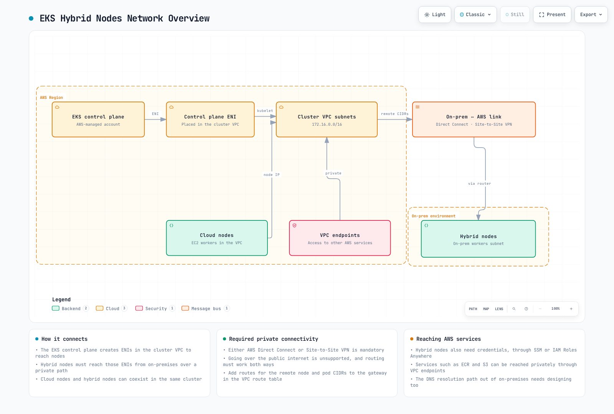

# EKS Hybrid Nodes

> **Supported Versions**: Current EKS-supported versions; examples reviewed for EKS 1.36 / nodeadm 1.0.20
> **Last Updated**: September 13, 2026

Amazon EKS Hybrid Nodes connects customer-operated on-premises or edge nodes to an AWS-managed EKS control plane. You continue to operate the hosts, operating systems, connectivity and workloads. This guide distinguishes supported interfaces from example configurations; it is not evidence that a particular on-premises production deployment has been tested.

## Table of Contents

1. [Prerequisites and System Requirements](01-prerequisites.md)
2. [Network Configuration](02-network-configuration.md)
3. [Air-Gap Environment Setup (S3 + VPC Endpoints)](03-airgap-setup.md)
4. [Node Bootstrap](04-node-bootstrap.md)
5. [GPU Server Integration](05-gpu-integration.md)
6. [Workload Placement Strategies](06-workload-placement.md)
7. [Node Lifecycle Management](07-node-lifecycle.md)
8. [Operations and Maintenance](08-operations.md)
9. [Bare Metal Server OS Installation and Migration Guide](09-bare-metal-os-setup.md)
10. [Hybrid Nodes Gateway](10-hybrid-nodes-gateway.md)

## What Are Hybrid Nodes?

Hybrid Nodes can share a cluster with ordinary AWS compute nodes. Registering a cloud machine as a **hybrid** node is a different matter: AWS does not support hybrid-node infrastructure in AWS Regions, Local Zones, Outposts or other clouds, and EC2 use still incurs hybrid fees.



[🔍 View interactive diagram](https://www.atomai.click/kubernetes-docs/archmaps/en-eks-hybrid-nodes-highlevel-0.html)

The following diagram shows the network prerequisites including VPC, subnets, Transit Gateway/Virtual Private Gateway, and Remote Node/Pod CIDR connectivity.


[🔍 View interactive diagram](https://www.atomai.click/kubernetes-docs/archmaps/en-eks-hybrid-nodes-prereq-0.html)

The diagrams illustrate private connectivity and routing, not automatic creation of every on-premises route, firewall rule or AWS service endpoint.

## Use Cases and Data Boundaries

On-premises GPUs, large local datasets, edge processing and existing hardware can be reasons to use Hybrid Nodes. Data-locality requirements still need application, storage, egress and logging controls. Kubernetes API objects and control-plane metadata are managed in AWS; a node selector alone does not establish data sovereignty or regulatory compliance.

Use the actual hybrid compute label and an explicitly maintained organization label for placement, rather than assuming an AWS zone named `on-premises` exists:

```yaml
# Pod spec fragment; set organization labels through the node owner.
nodeSelector:
  eks.amazonaws.com/compute-type: hybrid
  example.com/data-location: on-premises
```

This fragment does not create a label, a complete application, a security boundary or a data-retention policy. Validate image/runtime compatibility and actual data paths.

## Architecture and Ownership

| Component | Location | Responsibility |
|-----------|----------|----------------|
| EKS API server, etcd, controllers, scheduler | AWS | AWS-managed control plane |
| nodeadm | On-premises supported Linux host | Installation/bootstrap/upgrade CLI; not the long-running node agent |
| kubelet / containerd | On-premises | Node agent / CRI runtime, operated by the host owner |
| Cilium or Calico | On-premises and cluster | Compatible CNI configuration; VPC CNI does not manage hybrid nodes |
| SSM Agent or Roles Anywhere signing helper | On-premises | Obtains temporary credentials from the corresponding AWS service |
| SSM / IAM Roles Anywhere service | AWS | Credential service, not a local offline CA substitute |
| VPN / Direct Connect and routing | Both environments | Bidirectional connectivity; Direct Connect alone does not imply encryption |

Bottlerocket's supported VMware variants use their own bootstrap path and do not use nodeadm. For other supported hosts, `nodeadm install` installs dependencies and `nodeadm init` configures/joins the node. SSM-based new installations/upgrades require **nodeadm 1.0.19 or later** because of SSM signing-key changes; the reviewed current release is **1.0.20**.

## Constraints to Plan Around

- **Connected environment:** Reliable private bidirectional connectivity to AWS is required. Hybrid Nodes is not intended for disconnected/intermittent DDIL operation. “Air-gap” in this guide means restricted internet access with required AWS connectivity, not isolation from AWS.
- **Addresses:** IPv4 RFC1918 or CGNAT ranges, with no overlap between remote node/Pod, VPC and service CIDRs. Up to **15 node CIDRs and 15 Pod CIDRs per cluster** are supported.
- **Authentication:** Use `API` or `API_AND_CONFIG_MAP` and prepare the Hybrid Nodes IAM role/access entries.
- **API endpoint:** AWS recommends public-only or private-only. With both enabled, nodes outside the VPC resolve public endpoint addresses; that **can** prevent joining if the expected path/access rules are private. It is not a universal API prohibition. Even a public API endpoint does not remove the private control-plane-to-node connectivity requirement.
- **Regions:** Available except AWS GovCloud (US) and AWS China Regions, according to the current overview.
- **Host support:** Review the OS, architecture, CNI and kernel together. AL2023 is for on-premises virtualized environments, not a generic bare-metal recommendation.
- **Charges:** Hybrid fees use reported vCPU-hours while nodes are attached. Hyperthreaded bare-metal cores can report two vCPUs. Idle workloads do not automatically stop node charges; cluster and other service fees are separate.

## Credential Providers

Both providers need access to AWS service endpoints to refresh credentials. A local CA does not let IAM Roles Anywhere issue AWS credentials offline. Prefer one provider consistently across the fleet unless there is a reviewed reason to mix them.

| Topic | SSM hybrid activations | IAM Roles Anywhere |
|-------|------------------------|--------------------|
| Bootstrap | Activation ID/code and prepared SSM-trusting role | PKI, per-node certificate/key, trust anchor, profile and role |
| Naming | SSM-generated `mi-...` name | Custom node name bound to the certificate identity |
| Session duration | Fixed one hour, refreshed by SSM | Default one hour; supported request/profile durations 15 minutes–12 hours, subject to effective duration and role maximum |
| Disconnection | Cannot refresh; retry backoff can delay reconnection after network recovery | Cannot obtain new credentials offline; credential-process obtains them on demand when connectivity returns |
| Scale / cost | No SSM node-registration or per-node management charge; feature-usage pricing is separate | Review IAM Roles Anywhere quotas and PKI operating requirements |
| Typical choice | No existing PKI; simpler registration | Existing PKI and managed certificate lifecycle |

**Pricing checked September 13, 2026:** SSM removed the Advanced Instances Tier effective June 30, 2026. Consult [current SSM pricing](https://aws.amazon.com/systems-manager/pricing/) for Session Manager and Run Command usage terms; [EKS Hybrid Nodes vCPU charges](https://aws.amazon.com/eks/pricing/) remain separate.

The Roles Anywhere profile must accept a custom role session name, and the trust policy must bind it to the chosen certificate attribute. Its effective session duration must **not exceed** the IAM role maximum; equality is allowed by the CreateSession API. The [prerequisites](01-prerequisites.md) detail these contracts and secure preparation.

## Example Workloads

1. Local GPU training or inference with a verified runtime and recovery plan.
2. Local data processing with separately reviewed AWS metadata/telemetry/egress paths.
3. Factory/edge applications with reliable connectivity and tested disconnection behavior.
4. Media processing near large existing datasets.

## Next Steps

Start with the [Prerequisites and System Requirements](01-prerequisites.md) to ensure your environment is ready for EKS Hybrid Nodes.

## Quiz

To test your understanding of EKS Hybrid Nodes, try the following quiz:

* [EKS Hybrid Nodes Prerequisites Quiz](../quizzes/eks-hybrid-nodes/01-prerequisites-quiz.md)
* [EKS Hybrid Nodes Network Configuration Quiz](../quizzes/eks-hybrid-nodes/02-network-configuration-quiz.md)
* [EKS Hybrid Nodes Air-Gap Environment Setup Quiz](../quizzes/eks-hybrid-nodes/03-airgap-setup-quiz.md)
* [EKS Hybrid Nodes Node Bootstrapping Quiz](../quizzes/eks-hybrid-nodes/04-node-bootstrap-quiz.md)
* [EKS Hybrid Nodes GPU Integration Quiz](../quizzes/eks-hybrid-nodes/05-gpu-integration-quiz.md)
* [EKS Hybrid Nodes Workload Placement Quiz](../quizzes/eks-hybrid-nodes/06-workload-placement-quiz.md)
* [Node Lifecycle Management Quiz](../quizzes/eks-hybrid-nodes/07-node-lifecycle-quiz.md)
* [EKS Hybrid Nodes Operations Quiz](../quizzes/eks-hybrid-nodes/08-operations-quiz.md)
* [Bare Metal Server OS Installation and Migration Quiz](../quizzes/eks-hybrid-nodes/09-bare-metal-os-setup-quiz.md)
* [EKS Hybrid Nodes Gateway Quiz](../quizzes/eks-hybrid-nodes/10-hybrid-nodes-gateway-quiz.md)

## Related Documents

* [EKS Resiliency Guide](../eks/10-eks-resiliency.md) - High availability configuration in hybrid environments
* [EKS Cost Optimization](../eks/07-eks-cost-optimization.md) - Cost management strategies
* [EKS Monitoring and Logging](../eks/06-eks-monitoring-logging.md) - Integrated monitoring configuration

## Official Documentation

* [AWS EKS Hybrid Nodes Official Documentation](https://docs.aws.amazon.com/eks/latest/userguide/hybrid-nodes-overview.html)
* [nodeadm User Guide](https://docs.aws.amazon.com/eks/latest/userguide/hybrid-nodes-nodeadm.html)
* [Harbor Official Documentation](https://goharbor.io/docs/)
* [NVIDIA GPU Operator Documentation](https://docs.nvidia.com/datacenter/cloud-native/gpu-operator/overview.html)
* [Hybrid Nodes Networking Guide](https://docs.aws.amazon.com/eks/latest/userguide/hybrid-nodes-networking.html)
* [Hybrid Nodes CNI Configuration](https://docs.aws.amazon.com/eks/latest/userguide/hybrid-nodes-cni.html)
* [Hybrid Nodes Troubleshooting](https://docs.aws.amazon.com/eks/latest/userguide/hybrid-nodes-troubleshooting.html)

* [Hybrid operating-system compatibility](https://docs.aws.amazon.com/eks/latest/userguide/hybrid-nodes-os.html)
* [Hybrid credentials and IAM role](https://docs.aws.amazon.com/eks/latest/userguide/hybrid-nodes-creds.html)
* [Host credentials during network disconnection](https://docs.aws.amazon.com/eks/latest/best-practices/hybrid-nodes-host-creds.html)
* [IAM Roles Anywhere CreateSession semantics](https://docs.aws.amazon.com/rolesanywhere/latest/userguide/authentication-create-session.html)
* [EKS pricing](https://aws.amazon.com/eks/pricing/)
