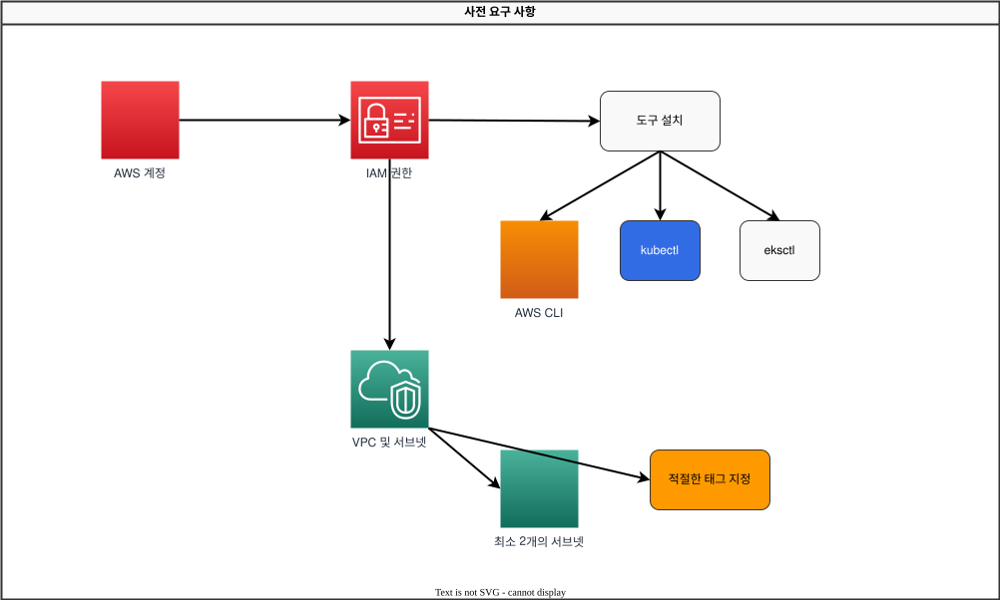

# EKS Cluster Creation - Part 1

There are several ways to create an Amazon EKS cluster. In this chapter, we will learn how to create an EKS cluster using various tools and methods.

## Table of Contents

1. [Prerequisites](#prerequisites)
2. [Creating a Cluster Using eksctl](#creating-a-cluster-using-eksctl)
3. [Creating a Cluster Using AWS Management Console](#creating-a-cluster-using-aws-management-console)
4. [Creating a Cluster Using AWS CLI](#creating-a-cluster-using-aws-cli)
5. [Creating a Cluster Using Terraform](#creating-a-cluster-using-terraform)

## Prerequisites

Before creating an EKS cluster, the following prerequisites are required:



### 1. AWS Account

A valid AWS account is required. If you don't have an AWS account, you can sign up at the [AWS website](https://aws.amazon.com/).

### 2. IAM Permissions

The following IAM permissions are required to create and manage an EKS cluster:

- `eks:*`
- `ec2:*`
- `iam:*`
- `cloudformation:*`

If you have administrator permissions, no additional permission settings are required. Otherwise, you need to attach the following IAM policy to the user or role:

```json
{
  "Version": "2012-10-17",
  "Statement": [
    {
      "Effect": "Allow",
      "Action": [
        "eks:*",
        "ec2:*",
        "iam:*",
        "cloudformation:*"
      ],
      "Resource": "*"
    }
  ]
}
```

### 3. Tool Installation

The following tools must be installed to create and manage an EKS cluster:

#### AWS CLI

AWS CLI is a unified tool for controlling AWS services from the command line.

**macOS**:
```bash
curl "https://awscli.amazonaws.com/AWSCLIV2.pkg" -o "AWSCLIV2.pkg"
sudo installer -pkg AWSCLIV2.pkg -target /
```

**Linux**:
```bash
curl "https://awscli.amazonaws.com/awscli-exe-linux-x86_64.zip" -o "awscliv2.zip"
unzip awscliv2.zip
sudo ./aws/install
```

**Windows**:
```
https://awscli.amazonaws.com/AWSCLIV2.msi
```

After installing AWS CLI, run the following command to configure credentials:
```bash
aws configure
```

#### kubectl

kubectl is a command-line tool for communicating with Kubernetes clusters.

**macOS**:
```bash
curl -LO "https://dl.k8s.io/release/$(curl -L -s https://dl.k8s.io/release/stable.txt)/bin/darwin/amd64/kubectl"
chmod +x ./kubectl
sudo mv ./kubectl /usr/local/bin/kubectl
```

**Linux**:
```bash
curl -LO "https://dl.k8s.io/release/$(curl -L -s https://dl.k8s.io/release/stable.txt)/bin/linux/amd64/kubectl"
chmod +x ./kubectl
sudo mv ./kubectl /usr/local/bin/kubectl
```

**Windows**:
```bash
curl -LO "https://dl.k8s.io/release/v1.26.0/bin/windows/amd64/kubectl.exe"
```

#### eksctl

eksctl is a simple CLI tool for creating and managing EKS clusters.

**macOS**:
```bash
brew tap weaveworks/tap
brew install weaveworks/tap/eksctl
```

Or:
```bash
curl --silent --location "https://github.com/weaveworks/eksctl/releases/latest/download/eksctl_$(uname -s)_amd64.tar.gz" | tar xz -C /tmp
sudo mv /tmp/eksctl /usr/local/bin
```

**Linux**:
```bash
curl --silent --location "https://github.com/weaveworks/eksctl/releases/latest/download/eksctl_$(uname -s)_amd64.tar.gz" | tar xz -C /tmp
sudo mv /tmp/eksctl /usr/local/bin
```

**Windows**:
```bash
# PowerShell
$version = (Invoke-WebRequest -Uri "https://api.github.com/repos/weaveworks/eksctl/releases/latest" | ConvertFrom-Json).tag_name
Invoke-WebRequest -Uri "https://github.com/weaveworks/eksctl/releases/download/$version/eksctl_Windows_amd64.zip" -OutFile eksctl.zip
Expand-Archive -Path eksctl.zip -DestinationPath $env:USERPROFILE\.eksctl\bin
$env:PATH += ";$env:USERPROFILE\.eksctl\bin"
```

### 4. VPC and Subnets

An EKS cluster requires a VPC and subnets. You can use an existing VPC or create a new one. The VPC for an EKS cluster must meet the following requirements:


- At least 2 subnets must be in different availability zones.
- Subnets must have internet access (through a NAT gateway or internet gateway).
- Subnets must have sufficient IP addresses.
- Subnets must have appropriate tags.

#### VPC Tags for EKS Cluster

The following tags must be applied to enable the EKS cluster to use the VPC and subnets correctly:

**VPC Tags**:
- `kubernetes.io/cluster/<cluster-name>`: `shared` or `owned`

**Public Subnet Tags**:
- `kubernetes.io/cluster/<cluster-name>`: `shared` or `owned`
- `kubernetes.io/role/elb`: `1`

**Private Subnet Tags**:
- `kubernetes.io/cluster/<cluster-name>`: `shared` or `owned`
- `kubernetes.io/role/internal-elb`: `1`

## Quiz

To test what you learned in this chapter, try the [EKS Cluster Creation - Part 1 Quiz](../quizzes/eks/02-eks-cluster-creation-part1-quiz.md).
