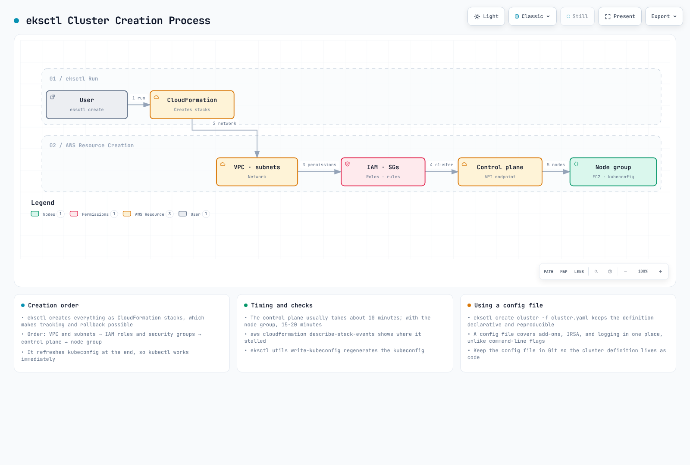
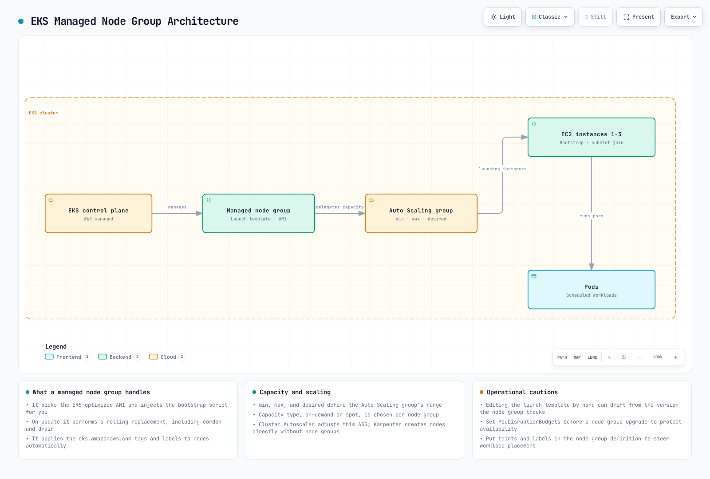
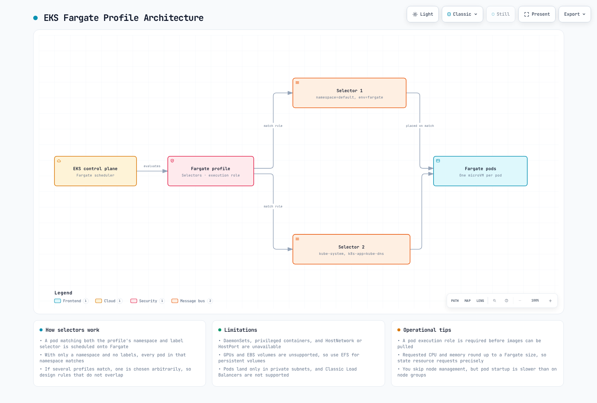

# Part 2: Creating Clusters with eksctl

> **Last Updated**: September 11, 2026

Use the [Part 1 prerequisites](02-eks-cluster-creation-part1.md), a dedicated training account/cluster and a private temporary kubeconfig (`EKS_KUBECONFIG`). Examples are alternatives, not one sequential script. Set `EKS_CLUSTER_NAME`/`EKS_REGION` to the reviewed target and use existing approved identities. Commands that create AWS resources incur charges; this review did not provision them. The examples were checked against eksctl 0.230.0 and EKS 1.36.

## Creating a Cluster Using eksctl

eksctl provides a command-line and declarative configuration interface for EKS. eksctl uses CloudFormation to create EKS clusters and related resources.

The following diagram shows the EKS cluster creation process using eksctl:



[🔍 View interactive diagram](https://www.atomai.click/kubernetes-docs/archmaps/en-eks-02-eks-cluster-creation-part2-0.html)

This illustrates a new-VPC workflow. Existing VPCs can be reused, timings are variable, and writing kubeconfig does not by itself establish authorization or readiness.

### Basic Cluster Creation

Create the basic cluster from a reviewed configuration file:

```bash
eksctl create cluster --config-file cluster.yaml --kubeconfig "${EKS_KUBECONFIG:?}"
```

Read and edit `cluster.yaml` below before running this command. It explicitly selects EKS 1.36, AL2023, existing VPC subnets and node-group capacities. Replace the example identifiers and documentation CIDR with actual approved values. These are selected settings, not claims about every eksctl version's defaults.

### Creating a Cluster Using a Configuration File

For more complex configurations, you can define the cluster using a YAML file:

```yaml
# cluster.yaml
apiVersion: eksctl.io/v1alpha5
kind: ClusterConfig
metadata:
  name: my-cluster
  region: us-west-2
  version: '1.36'
vpc:
  id: vpc-12345678
  subnets:
    private:
      us-west-2a:
        id: subnet-12345678
      us-west-2b:
        id: subnet-87654321
    public:
      us-west-2a:
        id: subnet-23456789
      us-west-2b:
        id: subnet-98765432
  clusterEndpoints:
    privateAccess: true
    publicAccess: true
  publicAccessCIDRs:
  - 203.0.113.10/32
managedNodeGroups:
- name: ng-1
  instanceType: m5.large
  desiredCapacity: 2
  minSize: 1
  maxSize: 3
  privateNetworking: true
  volumeSize: 80
  volumeType: gp3
  amiFamily: AmazonLinux2023
  disableIMDSv1: true
- name: ng-2
  instanceType: c5.xlarge
  desiredCapacity: 2
  privateNetworking: true
  spot: true
  amiFamily: AmazonLinux2023
  disableIMDSv1: true
cloudWatch:
  clusterLogging:
    enableTypes:
    - api
    - audit
    - authenticator
    - controllerManager
    - scheduler
fargateProfiles:
- name: fp-default
  selectors:
  - namespace: default
    labels:
      env: fargate
iam:
  withOIDC: true
accessConfig:
  authenticationMode: API
```

To create a cluster using this configuration file, run the following command:

```bash
eksctl create cluster -f cluster.yaml --kubeconfig "${EKS_KUBECONFIG:?}"
```

The configuration above demonstrates EC2 nodes and an optional application Fargate profile. CoreDNS stays on EC2; moving it to Fargate requires reviewing CoreDNS compute settings as well as the profile.


The configuration removes blanket add-on permissions from node roles. Review the CNI IRSA and policies generated by eksctl when `iam.withOIDC` is enabled, and configure separate roles for other AWS-integrated controllers. Inspect the actual add-on configuration and any conventional node-role CNI fallback. API authentication still requires appropriate EKS access entries/policies for operators. Min/max node counts do not install Cluster Autoscaler.

### Creating Managed Node Groups

The following diagram shows the managed node group architecture for an EKS cluster:



[🔍 View interactive diagram](https://www.atomai.click/kubernetes-docs/archmaps/en-eks-02-eks-cluster-creation-part2-1.html)

The infrastructure actor is the AWS EKS managed node-group service and its Auto Scaling group. The diagram illustrates EKS-selected AMI defaults; custom AMIs require their own reviewed bootstrap configuration. Kubernetes schedules Pods onto the resulting nodes.

To add a managed node group to an existing cluster, run the following command:

```bash
eksctl create nodegroup \
  --cluster my-cluster \
  --region us-west-2 \
  --name my-nodegroup \
  --node-type m5.large \
  --nodes 3 \
  --nodes-min 1 \
  --nodes-max 5 \
  --managed --node-ami-family AmazonLinux2023 --node-private-networking
```

Or you can use a configuration file:

```yaml
# nodegroup.yaml
apiVersion: eksctl.io/v1alpha5
kind: ClusterConfig

metadata:
  name: my-cluster
  region: us-west-2

managedNodeGroups:
  - name: my-nodegroup
    instanceType: m5.large
    desiredCapacity: 3
    minSize: 1
    maxSize: 5
    volumeSize: 80
    volumeType: gp3
    amiFamily: AmazonLinux2023
    privateNetworking: true
    disableIMDSv1: true
    ssh:
      allow: false
```

```bash
eksctl create nodegroup -f nodegroup.yaml
```

### Creating Fargate Profiles

A profile selects matching Pods; it does not create Pods or scale application replicas. Verify private subnets, the Fargate Pod execution role and supported workload features. An application profile does not automatically move CoreDNS to Fargate. The CLI and file examples below are alternatives.

Fargate profiles select Pods by namespace and labels. For overlapping profiles, explicitly select a matching profile with `eks.amazonaws.com/fargate-profile`; AWS documents alphanumeric profile-name selection when multiple profiles match. Startup latency depends on the image, capacity and environment.

<!-- Audit asset repair pending: Correct overlapping-profile selection and remove unmeasured startup comparison. Restore this embed/link after parent repairs the asset.


[🔍 View interactive diagram](https://www.atomai.click/kubernetes-docs/archmaps/en-eks-02-eks-cluster-creation-part2-2.html)
-->

To create a Fargate profile, run the following command:

```bash
eksctl create fargateprofile \
  --cluster my-cluster \
  --region us-west-2 \
  --name my-fargate-profile \
  --namespace default \
  --labels env=fargate
```

Or you can use a configuration file:

```yaml
# fargate.yaml
apiVersion: eksctl.io/v1alpha5
kind: ClusterConfig

metadata:
  name: my-cluster
  region: us-west-2

fargateProfiles:
- name: my-fargate-profile
  selectors:
    - namespace: default
      labels:
        env: fargate
```

```bash
eksctl create fargateprofile -f fargate.yaml
```

### Updating a Cluster

Upgrade one supported minor at a time. Review EKS upgrade insights, removed APIs, kubelet skew, add-ons, capacity and workload disruption first. EKS support is independent of upstream releases. The first eksctl upgrade command previews the change; `--approve` starts it.

```bash
aws eks describe-cluster-versions --region "${EKS_REGION:?}" --output table
aws eks describe-cluster --name "${EKS_CLUSTER_NAME:?}" --region "$EKS_REGION" \
  --query 'cluster.{version:version,status:status}' --output table

# Select the next supported minor after compatibility/readiness review.
eksctl upgrade cluster --name "$EKS_CLUSTER_NAME" --region "$EKS_REGION" \
  --version "${NEXT_MINOR_VERSION:?}"

# This separate command actually starts the reviewed control-plane upgrade.
eksctl upgrade cluster --name "$EKS_CLUSTER_NAME" --region "$EKS_REGION" \
  --version "$NEXT_MINOR_VERSION" --approve
```

Wait for the control plane update to succeed, then update compatible add-ons and managed node groups in the reviewed order. This node-group command applies the EKS-selected AMI update; custom AMIs require a reviewed version of the same launch template. Managed node updates replace instances and are separate from control-plane updates. PDBs and spare capacity help control disruption but do not guarantee availability.

```bash
# After control-plane completion and add-on/workload compatibility checks.
eksctl upgrade nodegroup --cluster "${EKS_CLUSTER_NAME:?}" \
  --region "${EKS_REGION:?}" --name "${EKS_NODEGROUP_NAME:?}" --wait
```

### Deleting a Cluster

Record the intended lab cluster ARN after creation as `EKS_EXPECTED_CLUSTER_ARN`. Before deletion, remove lab LoadBalancer Services/Ingresses while their controllers still run, wait for AWS cleanup, and inspect PVC reclaim policies and retained data. Confirm that the cluster contains only resources you intend to remove. The ARN check below verifies the recorded account/Region/name; it is not a backup or an immutable creation identifier.

```bash
if CURRENT_CLUSTER_ARN=$(aws eks describe-cluster \
  --name "${EKS_CLUSTER_NAME:?}" --region "${EKS_REGION:?}" \
  --query cluster.arn --output text) &&
  [ "$CURRENT_CLUSTER_ARN" = "${EKS_EXPECTED_CLUSTER_ARN:?Recorded lab cluster ARN required}" ]; then
  eksctl delete cluster --name "$EKS_CLUSTER_NAME" --region "$EKS_REGION" --wait
else
  printf '%s\n' 'Cluster lookup/identity mismatch; no deletion attempted.' >&2
fi
```

Inspect CloudFormation deletion events and retained/independently created resources afterward. An existing shared VPC is not owned by this example. Use the [complete cleanup guide](02-eks-cluster-creation-part5.md) for lifecycle dependencies.

## EKS Cluster Lifecycle Management

The lifecycle includes creation, configuration, operation, reviewed upgrades and eventual cleanup. Remove application load-balancer resources while their controllers still run, then remove node groups/profiles and the cluster. Remove a dedicated VPC only after its dependent resources are gone.

<!-- Audit asset repair pending: Correct upgrade target/approval and resource cleanup order; VPC comes after dependencies are removed. Restore this embed/link after parent repairs the asset.


[🔍 View interactive diagram](https://www.atomai.click/kubernetes-docs/archmaps/en-eks-02-eks-cluster-creation-part2-3.html)
-->

## Quiz

To test what you learned in this chapter, try the [EKS Cluster Creation - Part 2 Quiz](../quizzes/eks/02-eks-cluster-creation-part2-quiz.md).

## References

- [eksctl schema](https://schema.eksctl.io/)
- [EKS versions](https://docs.aws.amazon.com/eks/latest/userguide/kubernetes-versions.html)
- [AL2023](https://docs.aws.amazon.com/eks/latest/userguide/al2023.html)
- [Fargate profiles](https://docs.aws.amazon.com/eks/latest/userguide/fargate-profile.html)
- [Upgrade EKS](https://docs.aws.amazon.com/eks/latest/userguide/update-cluster.html)
- [Managed node updates](https://docs.aws.amazon.com/eks/latest/userguide/managed-node-update-behavior.html)
