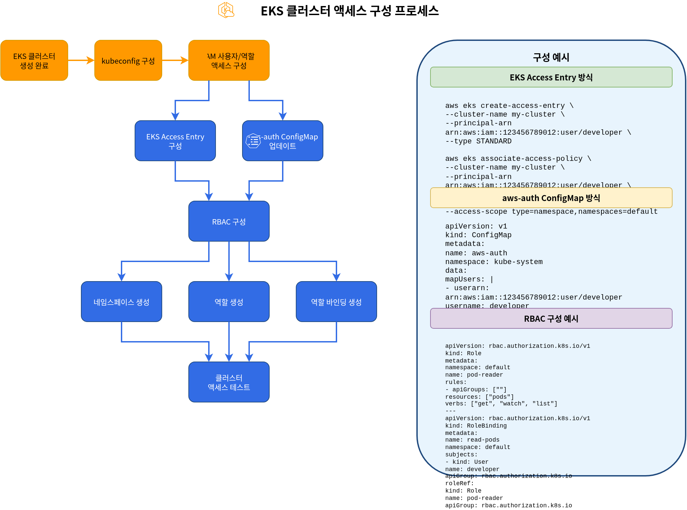
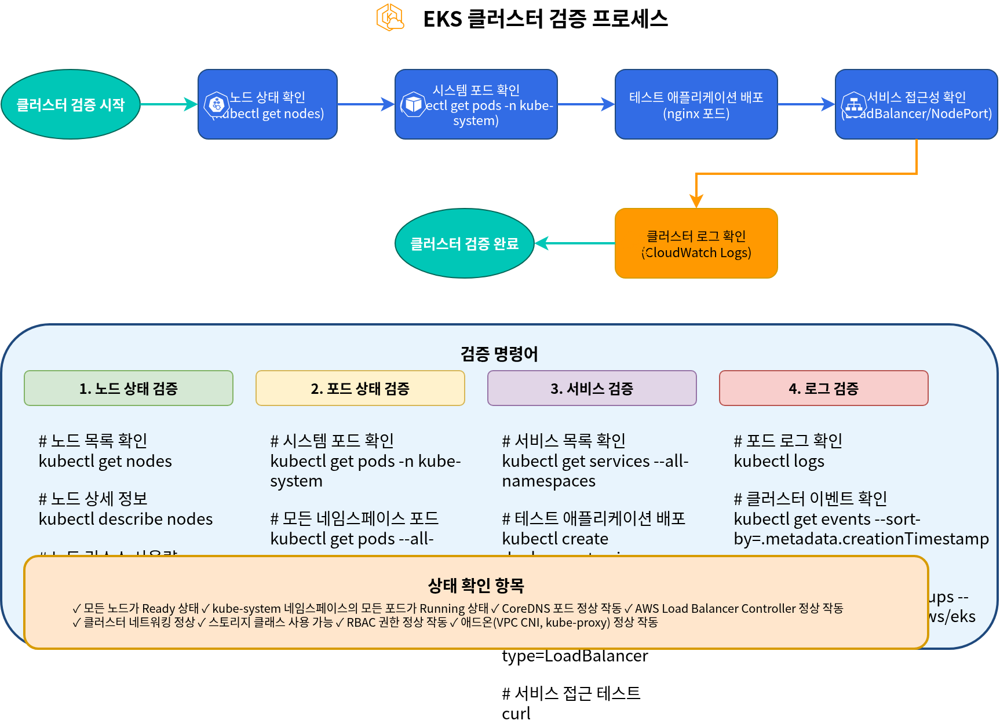
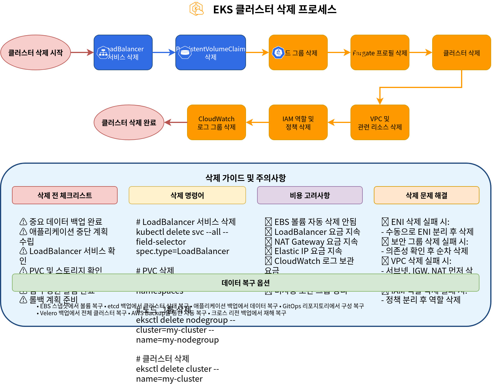

# EKS Cluster Creation - Part 5

## Configuring Cluster Access

After creating an EKS cluster, configuration is required to access the cluster. In this section, we will learn how to configure cluster access.

### Cluster Access Configuration Process



### kubeconfig Configuration

You need to configure the kubeconfig file to access an EKS cluster. You can configure kubeconfig using AWS CLI:

```bash
aws eks update-kubeconfig \
  --name my-cluster \
  --region us-west-2
```

This command updates the `~/.kube/config` file to enable access to the EKS cluster.

### Configuring IAM User and Role Access

By default, only the IAM entity (user or role) that created the EKS cluster can access the cluster. There are two methods to grant cluster access to other IAM users or roles: the traditional aws-auth ConfigMap method and the new EKS Access Entry method.


    class B1,B2,C,D k8sComponent;
```

#### Method 1: EKS Access Entry (Recommended)

EKS Access Entry is a new method that replaces the aws-auth ConfigMap, providing a more stable and easier-to-manage approach.

1. Enable Access Entry for the cluster:

```bash
aws eks update-cluster-config \
  --name my-cluster \
  --region us-west-2 \
  --access-config authenticationMode=API_AND_CONFIG_MAP
```

2. Create Access Entry for an IAM role:

```bash
aws eks create-access-entry \
  --cluster-name my-cluster \
  --principal-arn arn:aws:iam::123456789012:role/MyRole \
  --username my-role \
  --kubernetes-groups system:masters
```

3. Create Access Entry for an IAM user:

```bash
aws eks create-access-entry \
  --cluster-name my-cluster \
  --principal-arn arn:aws:iam::123456789012:user/my-user \
  --username my-user \
  --kubernetes-groups system:masters
```

4. List Access Entries:

```bash
aws eks list-access-entries --cluster-name my-cluster
```

5. Describe Access Entry details:

```bash
aws eks describe-access-entry \
  --cluster-name my-cluster \
  --principal-arn arn:aws:iam::123456789012:user/my-user
```

#### Method 2: aws-auth ConfigMap (Legacy)

The aws-auth ConfigMap is the traditional method and is still supported, but using Access Entry is recommended for new clusters.

1. Get the current `aws-auth` ConfigMap:

```bash
kubectl get configmap aws-auth -n kube-system -o yaml > aws-auth.yaml
```

2. Edit the `aws-auth.yaml` file to add users or roles:

```yaml
apiVersion: v1
kind: ConfigMap
metadata:
  name: aws-auth
  namespace: kube-system
data:
  mapRoles: |
    - rolearn: arn:aws:iam::123456789012:role/EKSNodeRole
      username: system:node:{{EC2PrivateDNSName}}
      groups:
        - system:bootstrappers
        - system:nodes
    # Additional role
    - rolearn: arn:aws:iam::123456789012:role/MyRole
      username: my-role
      groups:
        - system:masters
  mapUsers: |
    # IAM user
    - userarn: arn:aws:iam::123456789012:user/my-user
      username: my-user
      groups:
        - system:masters
```

3. Apply the updated ConfigMap:

```bash
kubectl apply -f aws-auth.yaml
```

> **Note**: EKS Access Entry was introduced in 2023, and using Access Entry is recommended for new clusters. Existing clusters can be migrated to a hybrid mode that supports both methods.

### RBAC Configuration

You can control access to resources within the cluster using Kubernetes Role-Based Access Control (RBAC).

1. Create namespace:

```bash
kubectl create namespace dev
```

2. Create role:

```yaml
# role.yaml
apiVersion: rbac.authorization.k8s.io/v1
kind: Role
metadata:
  namespace: dev
  name: developer
rules:
- apiGroups: [""]
  resources: ["pods", "services", "configmaps", "secrets"]
  verbs: ["get", "list", "watch", "create", "update", "patch", "delete"]
- apiGroups: ["apps"]
  resources: ["deployments", "statefulsets", "daemonsets"]
  verbs: ["get", "list", "watch", "create", "update", "patch", "delete"]
```

```bash
kubectl apply -f role.yaml
```

3. Create role binding:

```yaml
# rolebinding.yaml
apiVersion: rbac.authorization.k8s.io/v1
kind: RoleBinding
metadata:
  name: developer-binding
  namespace: dev
subjects:
- kind: User
  name: my-user
  apiGroup: rbac.authorization.k8s.io
roleRef:
  kind: Role
  name: developer
  apiGroup: rbac.authorization.k8s.io
```

```bash
kubectl apply -f rolebinding.yaml
```

## Cluster Validation

After creating an EKS cluster, you need to verify that the cluster is working correctly. In this section, we will learn how to validate the cluster.

### Cluster Validation Process



### Verify Nodes

Verify the nodes in the cluster:

```bash
kubectl get nodes
```

Verify that all nodes are in `Ready` state.

### Verify System Pods

Verify the pods in the kube-system namespace:

```bash
kubectl get pods -n kube-system
```

Verify that all system pods are in `Running` state.

### Deploy Test Application

Deploy a simple test application to verify that the cluster is working correctly:

```yaml
# nginx.yaml
apiVersion: apps/v1
kind: Deployment
metadata:
  name: nginx
spec:
  replicas: 3
  selector:
    matchLabels:
      app: nginx
  template:
    metadata:
      labels:
        app: nginx
    spec:
      containers:
      - name: nginx
        image: nginx:latest
        ports:
        - containerPort: 80
---
apiVersion: v1
kind: Service
metadata:
  name: nginx
spec:
  type: LoadBalancer
  ports:
  - port: 80
    targetPort: 80
  selector:
    app: nginx
```

```bash
kubectl apply -f nginx.yaml
```

Verify the deployment and service status:

```bash
kubectl get deployments
kubectl get pods
kubectl get services
```

Verify that you can access the application using the LoadBalancer service's external IP:

```bash
curl http://<EXTERNAL-IP>
```

### Verify Cluster Logs

Verify cluster logs in CloudWatch Logs:

```bash
aws logs describe-log-groups \
  --log-group-name-prefix /aws/eks/my-cluster
```

## Cluster Upgrade

To keep an EKS cluster up to date, regular upgrades are required. In this section, we will learn how to upgrade a cluster.

### Cluster Upgrade Process


### Control Plane Upgrade

To upgrade the EKS control plane, follow these steps:

1. Check available Kubernetes versions:

```bash
aws eks describe-addon-versions \
  --kubernetes-version 1.27 \
  --query "addons[].addonVersions[].compatibilities[].clusterVersion"
```

2. Upgrade the cluster:

```bash
aws eks update-cluster-version \
  --name my-cluster \
  --kubernetes-version 1.27
```

3. Check upgrade status:

```bash
aws eks describe-update \
  --name my-cluster \
  --update-id <UPDATE-ID>
```

### Node Upgrade

After upgrading the control plane, nodes must also be upgraded:

#### Managed Node Group Upgrade

```bash
aws eks update-nodegroup-version \
  --cluster-name my-cluster \
  --nodegroup-name my-nodegroup
```

#### Self-Managed Node Upgrade

For self-managed nodes, you need to create a new node group, migrate workloads, and then delete the old node group.

### Add-on Upgrade

To upgrade EKS add-ons, follow these steps:

1. Check available add-on versions:

```bash
aws eks describe-addon-versions \
  --addon-name vpc-cni \
  --kubernetes-version 1.27
```

2. Upgrade the add-on:

```bash
aws eks update-addon \
  --cluster-name my-cluster \
  --addon-name vpc-cni \
  --addon-version <VERSION>
```

## Cluster Deletion

When an EKS cluster is no longer needed, you can delete it to save costs. In this section, we will learn how to delete a cluster.

### Cluster Deletion Process



### Resource Cleanup

Before deleting a cluster, you must clean up all resources created in the cluster:

1. Delete LoadBalancer services:

```bash
kubectl get services --all-namespaces -o json | jq -r '.items[] | select(.spec.type == "LoadBalancer") | .metadata.name + " " + .metadata.namespace' | while read name namespace; do
  kubectl delete service $name -n $namespace
done
```

2. Delete PersistentVolumeClaims:

```bash
kubectl delete pvc --all --all-namespaces
```

### Delete Cluster Using eksctl

If you created the cluster using eksctl, you can delete it with the following command:

```bash
eksctl delete cluster --name my-cluster --region us-west-2
```

### Delete Cluster Using AWS CLI

To delete a cluster using AWS CLI, follow these steps:

1. Delete node group:

```bash
aws eks delete-nodegroup \
  --cluster-name my-cluster \
  --nodegroup-name my-nodegroup
```

2. Delete Fargate profile:

```bash
aws eks delete-fargate-profile \
  --cluster-name my-cluster \
  --fargate-profile-name my-fargate-profile
```

3. Delete cluster:

```bash
aws eks delete-cluster \
  --name my-cluster
```

### Clean Up Related Resources

After deleting the EKS cluster, the following related resources may remain:

1. VPC and related resources:

```bash
aws ec2 delete-vpc --vpc-id vpc-xxxxxxxxxxxxxxxxx
```

2. IAM roles and policies:

```bash
aws iam detach-role-policy \
  --role-name EKSClusterRole \
  --policy-arn arn:aws:iam::aws:policy/AmazonEKSClusterPolicy

aws iam delete-role --role-name EKSClusterRole

aws iam detach-role-policy \
  --role-name EKSNodeRole \
  --policy-arn arn:aws:iam::aws:policy/AmazonEKSWorkerNodePolicy

aws iam detach-role-policy \
  --role-name EKSNodeRole \
  --policy-arn arn:aws:iam::aws:policy/AmazonEKS_CNI_Policy

aws iam detach-role-policy \
  --role-name EKSNodeRole \
  --policy-arn arn:aws:iam::aws:policy/AmazonEC2ContainerRegistryReadOnly

aws iam delete-role --role-name EKSNodeRole
```

3. CloudWatch log groups:

```bash
aws logs delete-log-group \
  --log-group-name /aws/eks/my-cluster/cluster
```

## Quiz

To test what you learned in this chapter, try the [EKS Cluster Creation - Part 5 Quiz](../quizzes/eks/02-eks-cluster-creation-part5-quiz.md).
