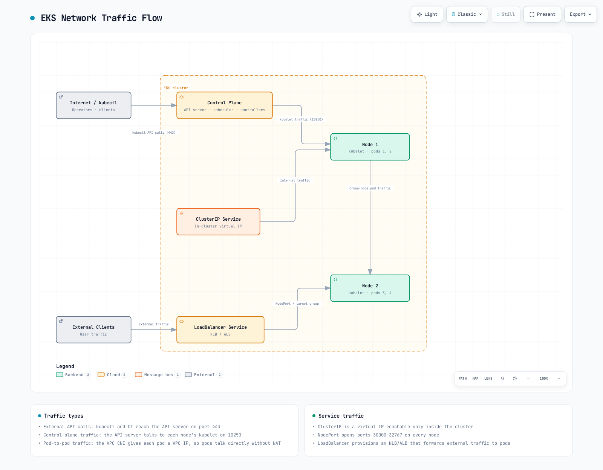
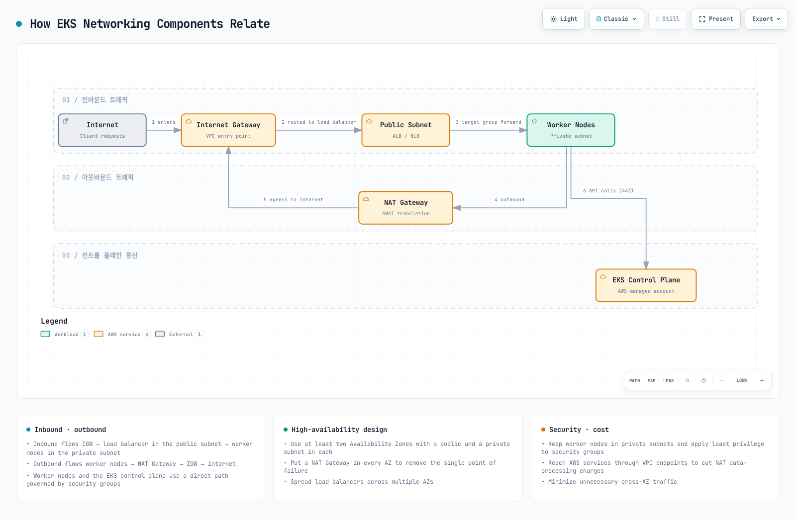
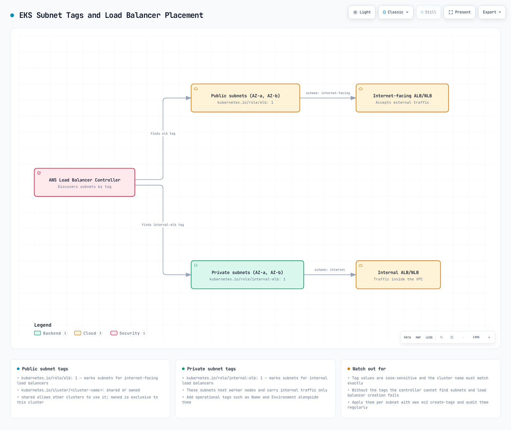
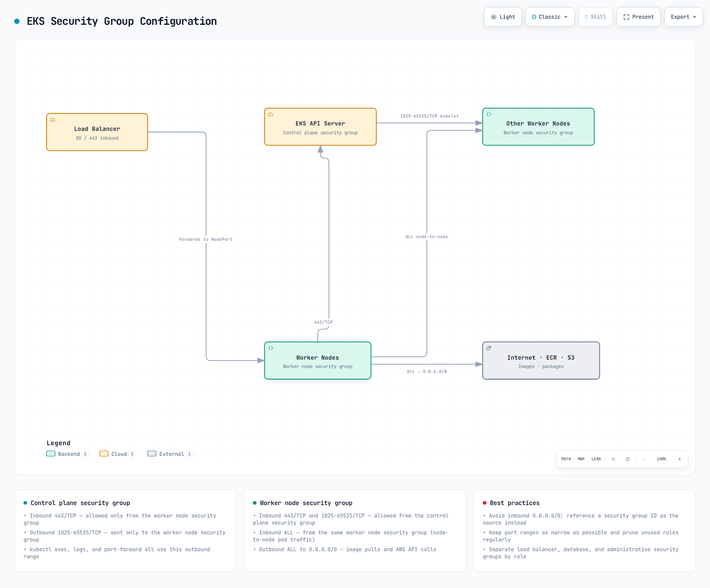

# EKS Networking

## Overview

Amazon EKS networking is a core component that manages communication for Kubernetes clusters. This document covers basic concepts of EKS networking, VPC configuration, subnet design, and security group configuration.

## EKS Networking Architecture

The EKS networking architecture consists of the following components:


[🔍 View interactive diagram](https://www.atomai.click/kubernetes-docs/archmaps/en-eks-03-eks-networking-part1-0.html)

1. **VPC (Virtual Private Cloud)**: Isolated network environment where the EKS cluster runs
2. **Subnets**: Units that divide IP address ranges within the VPC
3. **Route Tables**: Rule sets that determine network traffic paths
4. **Internet Gateway**: Component that enables communication between VPC and the internet
5. **NAT Gateway**: Component that allows resources in private subnets to access the internet
6. **Security Groups**: Instance-level virtual firewalls
7. **Network ACLs**: Subnet-level virtual firewalls
8. **CNI (Container Network Interface)**: Plugin that manages container networking

### EKS Networking Flow

Network traffic flows in an EKS cluster as follows:



[🔍 View interactive diagram](https://www.atomai.click/kubernetes-docs/archmaps/en-eks-03-eks-networking-part1-1.html)

1. **Pod-to-Pod Communication**: Communication between pods on the same node or different nodes
2. **Pod-to-Service Communication**: Communication between pods and services within the cluster
3. **Internal to External Cluster Communication**: Communication between internal cluster resources and external resources
4. **Control Plane to Node Communication**: Communication between EKS control plane and worker nodes

### Relationship Between EKS Networking Components



[🔍 View interactive diagram](https://www.atomai.click/kubernetes-docs/archmaps/en-eks-03-eks-networking-part1-2.html)

## VPC Requirements

A VPC for an EKS cluster must meet the following requirements:


[🔍 View interactive diagram](https://www.atomai.click/kubernetes-docs/archmaps/en-eks-03-eks-networking-part1-3.html)

1. **Subnets**: Must have subnets in at least 2 availability zones
2. **IP Addresses**: Must provide a sufficient number of IP addresses
3. **DNS Hostnames**: DNS hostnames and DNS resolution must be enabled
4. **Internet Access**: Nodes must be able to access the internet (through NAT gateway or internet gateway)

### VPC CIDR Planning

Considerations when planning VPC CIDR blocks:


[🔍 View interactive diagram](https://www.atomai.click/kubernetes-docs/archmaps/en-eks-03-eks-networking-part1-4.html)

1. **Cluster Size**: Expected number of nodes and pods
2. **IP Address Requirements**: Number of IP addresses needed for each node and pod
3. **Future Expansion**: Room for future expansion
4. **Integration with Existing Networks**: Avoiding overlap with existing networks

Common VPC CIDR block sizes:

* Small clusters: /24 (256 IP addresses)
* Medium clusters: /20 (4,096 IP addresses)
* Large clusters: /16 (65,536 IP addresses)

### Subnet Design


[🔍 View interactive diagram](https://www.atomai.click/kubernetes-docs/archmaps/en-eks-03-eks-networking-part1-5.html)

Best practices for subnet design for EKS clusters:

1. **Public Subnets**: Subnets directly connected to the internet gateway
   * Use: Public load balancers, NAT gateways, bastion hosts
   * Typical size: /24 (256 IP addresses)
2. **Private Subnets**: Subnets not directly connected to the internet gateway
   * Use: EKS worker nodes, internal load balancers
   * Typical size: /22 (1,024 IP addresses)
3. **Availability Zone Distribution**: Distribute subnets across multiple availability zones
   * Use at least 2 availability zones
   * Place public and private subnets in each availability zone

Example subnet design:

| Subnet Type | Availability Zone | CIDR Block  | Use                          |
| ----------- | ----------------- | ----------- | ---------------------------- |
| Public      | us-west-2a        | 10.0.0.0/24 | Load balancers, NAT gateways |
| Public      | us-west-2b        | 10.0.1.0/24 | Load balancers, NAT gateways |
| Private     | us-west-2a        | 10.0.2.0/22 | EKS worker nodes             |
| Private     | us-west-2b        | 10.0.6.0/22 | EKS worker nodes             |

### Subnet Tags



[🔍 View interactive diagram](https://www.atomai.click/kubernetes-docs/archmaps/en-eks-03-eks-networking-part1-6.html)

EKS uses specific tags on subnets to automatically discover resources:

1. **Public Subnet Tags**:
   * `kubernetes.io/role/elb`: Set value to `1` for use with internet-facing load balancers
   * `kubernetes.io/cluster/<cluster-name>`: Set value to `shared` or `owned`
2. **Private Subnet Tags**:
   * `kubernetes.io/role/internal-elb`: Set value to `1` for use with internal load balancers
   * `kubernetes.io/cluster/<cluster-name>`: Set value to `shared` or `owned`

Example:

```bash
aws ec2 create-tags \
  --resources subnet-xxxxxxxxxxxxxxxxx \
  --tags Key=kubernetes.io/cluster/my-cluster,Value=shared Key=kubernetes.io/role/elb,Value=1
```

### Security Group Configuration



[🔍 View interactive diagram](https://www.atomai.click/kubernetes-docs/archmaps/en-eks-03-eks-networking-part1-7.html)

EKS clusters have two main security groups:

1. **Cluster Security Group (Control Plane)**:
   * Inbound rules:
     * 443/TCP: Allow traffic from worker node security group
   * Outbound rules:
     * 1025-65535/TCP: Allow traffic to worker node security group
2. **Node Security Group (Worker Nodes)**:
   * Inbound rules:
     * 443/TCP: Allow traffic from cluster security group
     * 1025-65535/TCP: Allow traffic from cluster security group
     * ALL: Allow traffic within the same security group
   * Outbound rules:
     * ALL: Allow traffic to all destinations

## Conclusion

In this document, we learned about basic concepts of EKS networking and VPC configuration. In the next document, we will cover more advanced networking topics such as services, load balancing, and network policies.

## Quiz

To test what you learned in this chapter, try the [EKS Networking - Part 1 Quiz](../quizzes/eks/03-eks-networking-part1-quiz.md).
