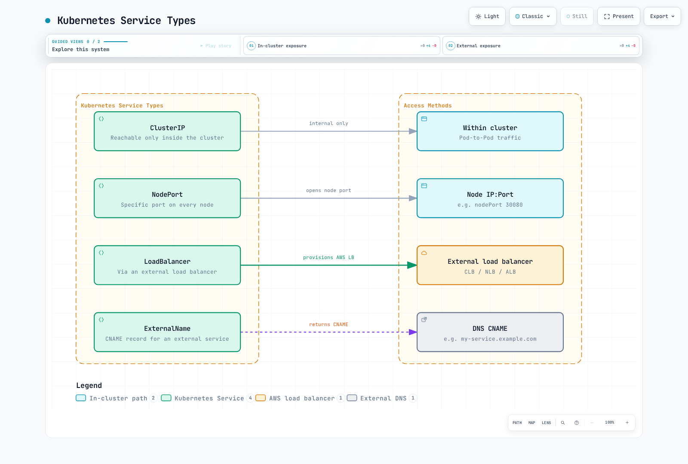
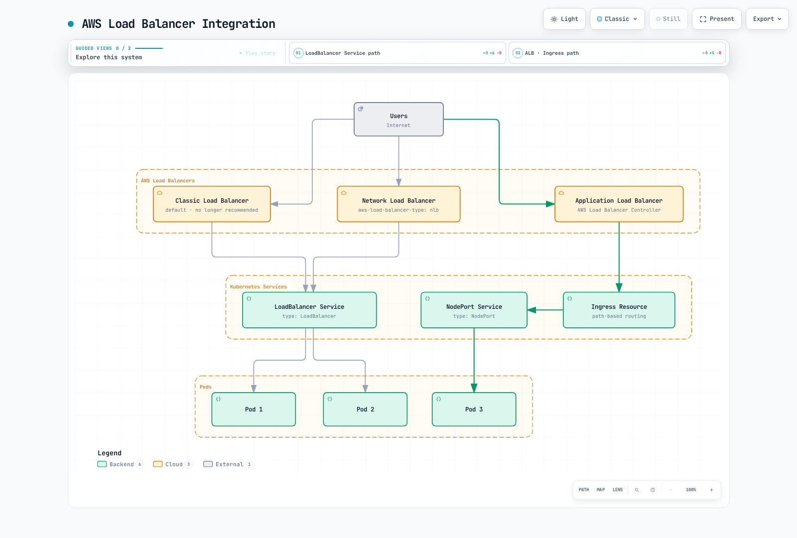
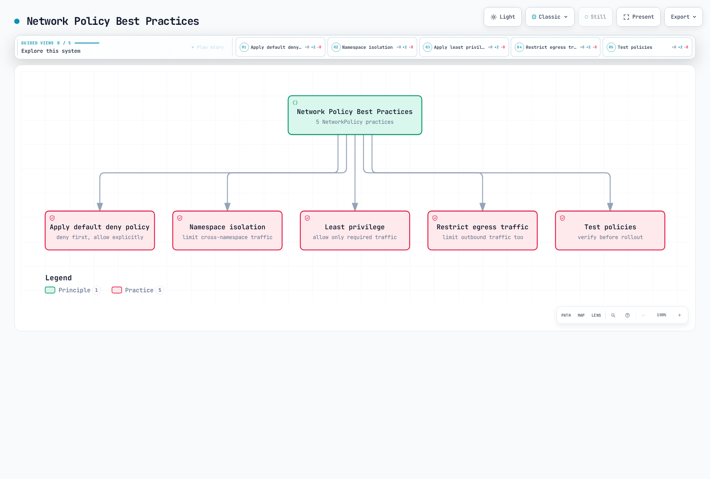
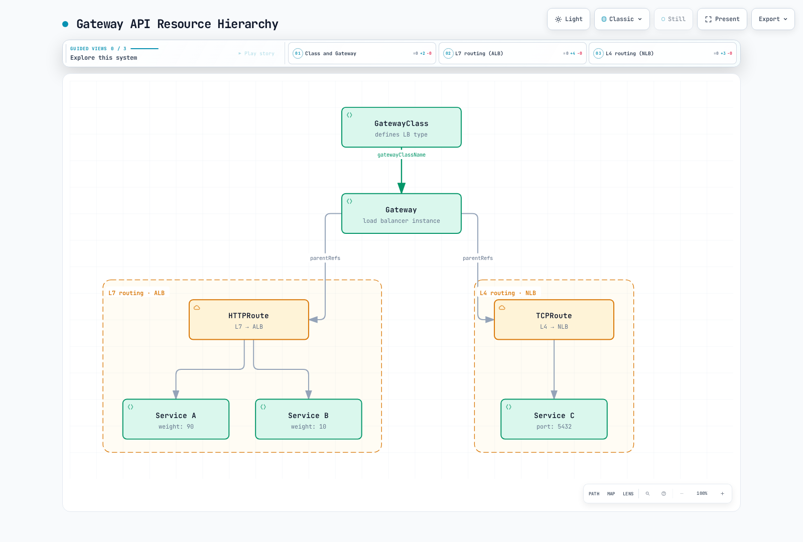

# EKS Networking - Part 2: Services, Load Balancing, and Network Policies

## Overview

In this document, we will learn about services, load balancing, and network policies in Amazon EKS. We cover how to expose applications through Kubernetes services, integration with AWS load balancers, and how to control pod-to-pod communication using network policies.

## Kubernetes Service Types

Kubernetes provides the following service types:



[🔍 View interactive diagram](https://www.atomai.click/kubernetes-docs/archmaps/en-eks-03-eks-networking-part2-0.html)

1. **ClusterIP**: Service accessible only within the cluster
2. **NodePort**: Service accessible through a specific port on all nodes
3. **LoadBalancer**: Service accessible through an external load balancer
4. **ExternalName**: Provides CNAME record for external services

### ClusterIP Service

A ClusterIP service is accessible only within the cluster. This is the default service type.

```yaml
apiVersion: v1
kind: Service
metadata:
  name: my-service
spec:
  selector:
    app: my-app
  ports:
  - port: 80
    targetPort: 8080
  type: ClusterIP
```

### NodePort Service

A NodePort service is accessible through a specific port on all nodes.

```yaml
apiVersion: v1
kind: Service
metadata:
  name: my-service
spec:
  selector:
    app: my-app
  ports:
  - port: 80
    targetPort: 8080
    nodePort: 30080
  type: NodePort
```

### LoadBalancer Service

A LoadBalancer service is accessible through an external load balancer. In EKS, this integrates with AWS load balancers (CLB, NLB, ALB).

```yaml
apiVersion: v1
kind: Service
metadata:
  name: my-service
spec:
  selector:
    app: my-app
  ports:
  - port: 80
    targetPort: 8080
  type: LoadBalancer
```

### ExternalName Service

An ExternalName service provides a CNAME record for external services.

```yaml
apiVersion: v1
kind: Service
metadata:
  name: my-service
spec:
  type: ExternalName
  externalName: my-service.example.com
```

## AWS Load Balancer Integration

EKS integrates Kubernetes services with AWS load balancers to make applications accessible from outside.



[🔍 View interactive diagram](https://www.atomai.click/kubernetes-docs/archmaps/en-eks-03-eks-networking-part2-1.html)

### Classic Load Balancer (CLB)

By default, services set to `type: LoadBalancer` create a Classic Load Balancer. However, CLB is no longer recommended, and using NLB or ALB is preferred.

```yaml
apiVersion: v1
kind: Service
metadata:
  name: my-service
spec:
  selector:
    app: my-app
  ports:
  - port: 80
    targetPort: 8080
  type: LoadBalancer
```

### Network Load Balancer (NLB)

To use NLB, you need to add specific annotations to the service:

```yaml
apiVersion: v1
kind: Service
metadata:
  name: my-service
  annotations:
    service.beta.kubernetes.io/aws-load-balancer-type: nlb
spec:
  selector:
    app: my-app
  ports:
  - port: 80
    targetPort: 8080
  type: LoadBalancer
```

Additional NLB configuration options:

```yaml
metadata:
  annotations:
    # Create internal NLB
    service.beta.kubernetes.io/aws-load-balancer-internal: "true"

    # Enable cross-zone load balancing
    service.beta.kubernetes.io/aws-load-balancer-cross-zone-load-balancing-enabled: "true"

    # Specify target type (instance or ip)
    service.beta.kubernetes.io/aws-load-balancer-target-group-attributes: preserve_client_ip.enabled=true

    # Enable TCP proxy protocol
    service.beta.kubernetes.io/aws-load-balancer-proxy-protocol: "*"
```

### Application Load Balancer (ALB)

To use ALB, you need to install the AWS Load Balancer Controller and use Ingress resources:


[🔍 View interactive diagram](https://www.atomai.click/kubernetes-docs/archmaps/en-eks-03-eks-networking-part2-2.html)

1. Install AWS Load Balancer Controller:

```bash
# Download IAM policy
curl -o iam-policy.json https://raw.githubusercontent.com/kubernetes-sigs/aws-load-balancer-controller/main/docs/install/iam_policy.json

# Create IAM policy
aws iam create-policy \
  --policy-name AWSLoadBalancerControllerIAMPolicy \
  --policy-document file://iam-policy.json

# Create IAM role and attach policy (using eksctl)
eksctl create iamserviceaccount \
  --cluster=my-cluster \
  --namespace=kube-system \
  --name=aws-load-balancer-controller \
  --attach-policy-arn=arn:aws:iam::123456789012:policy/AWSLoadBalancerControllerIAMPolicy \
  --approve

# Add Helm repository
helm repo add eks https://aws.github.io/eks-charts
helm repo update

# Install AWS Load Balancer Controller
helm install aws-load-balancer-controller eks/aws-load-balancer-controller \
  -n kube-system \
  --set clusterName=my-cluster \
  --set serviceAccount.create=false \
  --set serviceAccount.name=aws-load-balancer-controller
```

2. Create Ingress resource:

```yaml
apiVersion: networking.k8s.io/v1
kind: Ingress
metadata:
  name: my-ingress
  annotations:
    kubernetes.io/ingress.class: alb
    alb.ingress.kubernetes.io/scheme: internet-facing
    alb.ingress.kubernetes.io/target-type: ip
spec:
  rules:
  - http:
      paths:
      - path: /
        pathType: Prefix
        backend:
          service:
            name: my-service
            port:
              number: 80
```

Additional ALB configuration options:

```yaml
metadata:
  annotations:
    # Create internal ALB
    alb.ingress.kubernetes.io/scheme: internal

    # Specify SSL certificate
    alb.ingress.kubernetes.io/certificate-arn: arn:aws:acm:region:account-id:certificate/certificate-id

    # HTTPS redirect
    alb.ingress.kubernetes.io/actions.ssl-redirect: '{"Type": "redirect", "RedirectConfig": {"Protocol": "HTTPS", "Port": "443", "StatusCode": "HTTP_301"}}'

    # Specify target type (instance or ip)
    alb.ingress.kubernetes.io/target-type: ip

    # Specify security groups
    alb.ingress.kubernetes.io/security-groups: sg-xxxx,sg-yyyy
```

### Service and Load Balancer Best Practices


[🔍 View interactive diagram](https://www.atomai.click/kubernetes-docs/archmaps/en-eks-03-eks-networking-part2-3.html)

1. **Use ClusterIP for internal services**: Use ClusterIP type for services accessed only within the cluster.
2. **Use LoadBalancer or Ingress for external services**: Use LoadBalancer type or Ingress resources for services that need external access.
3. **Use ALB**: Use ALB when features like path-based routing, SSL termination, and authentication are needed.
4. **Use NLB**: Use NLB when TCP/UDP traffic, high performance, and static IP are needed.
5. **Use internal load balancers**: Use internal load balancers for services accessed only within the cluster.
6. **Enable cross-zone load balancing**: Enable cross-zone load balancing for high availability.
7. **Select appropriate target type**: Choose `ip` target type to use pod IPs directly as targets, or `instance` target type to use node IPs as targets.

## Network Policies

Network policies are used to control pod-to-pod communication. To use network policies in EKS, you need to install a CNI plugin that supports network policies (e.g., Calico, Cilium).


[🔍 View interactive diagram](https://www.atomai.click/kubernetes-docs/archmaps/en-eks-03-eks-networking-part2-4.html)

### Installing Calico

Calico is a widely used CNI plugin for implementing network policies in EKS:

```bash
# Install Calico
kubectl apply -f https://docs.projectcalico.org/manifests/calico-vxlan.yaml

# Check Calico status
kubectl get pods -n kube-system -l k8s-app=calico-node
```

### Default Network Policy

By default, without network policies, all pods can communicate with each other. When network policies are applied, only explicitly allowed traffic is permitted.

### Namespace Isolation Policy

A policy that allows communication only between pods within a specific namespace:

```yaml
apiVersion: networking.k8s.io/v1
kind: NetworkPolicy
metadata:
  name: namespace-isolation
  namespace: my-namespace
spec:
  podSelector: {}
  policyTypes:
  - Ingress
  ingress:
  - from:
    - podSelector: {}
```

### Specific Pod Communication Allow Policy

A policy that allows communication only between pods with specific labels:

```yaml
apiVersion: networking.k8s.io/v1
kind: NetworkPolicy
metadata:
  name: allow-frontend-to-backend
  namespace: my-namespace
spec:
  podSelector:
    matchLabels:
      app: backend
  policyTypes:
  - Ingress
  ingress:
  - from:
    - podSelector:
        matchLabels:
          app: frontend
    ports:
    - protocol: TCP
      port: 80
```

### External Traffic Restriction Policy

A policy that allows traffic only from specific IP ranges:

```yaml
apiVersion: networking.k8s.io/v1
kind: NetworkPolicy
metadata:
  name: allow-external-traffic
  namespace: my-namespace
spec:
  podSelector:
    matchLabels:
      app: web
  policyTypes:
  - Ingress
  ingress:
  - from:
    - ipBlock:
        cidr: 192.168.1.0/24
        except:
        - 192.168.1.10/32
    ports:
    - protocol: TCP
      port: 80
```

### Egress Traffic Restriction Policy

A policy that allows egress traffic only to specific destinations:

```yaml
apiVersion: networking.k8s.io/v1
kind: NetworkPolicy
metadata:
  name: limit-egress-traffic
  namespace: my-namespace
spec:
  podSelector:
    matchLabels:
      app: web
  policyTypes:
  - Egress
  egress:
  - to:
    - podSelector:
        matchLabels:
          app: db
    ports:
    - protocol: TCP
      port: 5432
  - to:
    - ipBlock:
        cidr: 0.0.0.0/0
        except:
        - 10.0.0.0/8
        - 172.16.0.0/12
        - 192.168.0.0/16
    ports:
    - protocol: TCP
      port: 443
```

### Network Policy Best Practices



[🔍 View interactive diagram](https://www.atomai.click/kubernetes-docs/archmaps/en-eks-03-eks-networking-part2-5.html)

1. **Apply default deny policy**: Deny all traffic by default and explicitly allow only necessary traffic.
2. **Namespace isolation**: Enhance security by restricting communication between namespaces.
3. **Apply principle of least privilege**: Allow only the minimum necessary communication.
4. **Restrict egress traffic**: Enhance security by restricting traffic going out from pods.
5. **Test policies**: Test network policies before applying them to prevent unintended communication blocking.

---

## Gateway API

> **Supported Versions**: AWS Load Balancer Controller v2.13.0+
> **Last Updated**: February 19, 2026

### Overview

Gateway API is Kubernetes' next-generation service networking API that overcomes the limitations of traditional Ingress resources and provides richer routing capabilities. AWS Load Balancer Controller supports Gateway API, enabling L4 (NLB) and L7 (ALB) routing configuration through Gateway resources.



[🔍 View interactive diagram](https://www.atomai.click/kubernetes-docs/archmaps/en-eks-03-eks-networking-part2-6.html)

### Prerequisites

1. **AWS Load Balancer Controller v2.13.0 or later** installed
2. **Feature Gates enabled**: Add `--feature-gates=EnableGatewayAPI=true` flag when deploying the controller
3. **Gateway API CRD installation**:

```bash
# Install Standard CRDs
kubectl apply -f https://github.com/kubernetes-sigs/gateway-api/releases/download/v1.2.1/standard-install.yaml

# Install Experimental CRDs (TCPRoute, etc.)
kubectl apply -f https://github.com/kubernetes-sigs/gateway-api/releases/download/v1.2.1/experimental-install.yaml

# Install AWS LBC-specific CRDs
kubectl apply -f https://raw.githubusercontent.com/kubernetes-sigs/aws-load-balancer-controller/main/config/crd/gateway-api/crds.yaml
```

### GatewayClass and Gateway Setup

GatewayClass defines the type of load balancer, and Gateway represents the actual load balancer instance.

```yaml
# GatewayClass definition
apiVersion: gateway.networking.k8s.io/v1
kind: GatewayClass
metadata:
  name: amazon-alb
spec:
  controllerName: gateway.k8s.aws/alb

---
# Gateway definition (L7 - ALB)
apiVersion: gateway.networking.k8s.io/v1
kind: Gateway
metadata:
  name: my-hotel-gateway
  namespace: default
spec:
  gatewayClassName: amazon-alb
  listeners:
  - name: http
    protocol: HTTP
    port: 80
  - name: https
    protocol: HTTPS
    port: 443
    tls:
      mode: Terminate
      certificateRefs:
      - kind: Secret
        name: my-tls-secret
```

### HTTPRoute Example (L7 → ALB)

HTTPRoute defines rules for routing HTTP/HTTPS traffic to services. HTTPRoutes attached to a Gateway distribute traffic through an ALB.

```yaml
apiVersion: gateway.networking.k8s.io/v1
kind: HTTPRoute
metadata:
  name: app-route
  namespace: default
spec:
  parentRefs:
  - name: my-hotel-gateway
    sectionName: http
  hostnames:
  - "app.example.com"
  rules:
  - matches:
    - path:
        type: PathPrefix
        value: /api
    backendRefs:
    - name: api-service
      port: 80
      weight: 90
    - name: api-service-v2
      port: 80
      weight: 10
  - matches:
    - path:
        type: PathPrefix
        value: /
    backendRefs:
    - name: frontend-service
      port: 80
```

### TCPRoute Example (L4 → NLB)

TCPRoute handles TCP traffic and provides L4-level load balancing through an NLB.

```yaml
# GatewayClass for NLB
apiVersion: gateway.networking.k8s.io/v1
kind: GatewayClass
metadata:
  name: amazon-nlb
spec:
  controllerName: gateway.k8s.aws/nlb

---
# NLB Gateway
apiVersion: gateway.networking.k8s.io/v1
kind: Gateway
metadata:
  name: my-nlb-gateway
spec:
  gatewayClassName: amazon-nlb
  listeners:
  - name: tcp
    protocol: TCP
    port: 5432

---
# TCPRoute
apiVersion: gateway.networking.k8s.io/v1alpha2
kind: TCPRoute
metadata:
  name: db-route
spec:
  parentRefs:
  - name: my-nlb-gateway
    sectionName: tcp
  rules:
  - backendRefs:
    - name: postgres-service
      port: 5432
```

### QUIC/HTTP3 Support

ALBs created through Gateway API automatically support the QUIC/HTTP3 protocol. When an HTTPS listener is configured, the ALB automatically handles QUIC protocol upgrades.

```yaml
apiVersion: gateway.networking.k8s.io/v1
kind: Gateway
metadata:
  name: quic-gateway
  annotations:
    gateway.k8s.aws/quic-enabled: "true"
spec:
  gatewayClassName: amazon-alb
  listeners:
  - name: https
    protocol: HTTPS
    port: 443
    tls:
      mode: Terminate
      certificateRefs:
      - kind: Secret
        name: tls-cert
```

### Certificate Discovery

AWS Load Balancer Controller supports two certificate discovery methods:

1. **Static certificate reference**: Directly specified in the Gateway's `tls.certificateRefs`
2. **Hostname-based auto-discovery**: Automatically searches ACM for matching certificates based on the HTTPRoute's `hostnames` field

```yaml
# Hostname-based auto-discovery example
apiVersion: gateway.networking.k8s.io/v1
kind: HTTPRoute
metadata:
  name: auto-cert-route
spec:
  parentRefs:
  - name: my-gateway
  hostnames:
  - "secure.example.com"  # Auto-discovers matching certificate from ACM
  rules:
  - backendRefs:
    - name: secure-service
      port: 443
```

### Security Groups

Load balancers created through Gateway API automatically have security groups created:

- **Frontend security group**: Allows inbound traffic from clients to the load balancer
- **Backend security group**: Allows traffic from the load balancer to target pods

Custom security groups can also be specified through Gateway annotations:

```yaml
apiVersion: gateway.networking.k8s.io/v1
kind: Gateway
metadata:
  name: custom-sg-gateway
  annotations:
    gateway.k8s.aws/security-group-ids: sg-0123456789abcdef0,sg-0987654321fedcba0
spec:
  gatewayClassName: amazon-alb
  listeners:
  - name: http
    protocol: HTTP
    port: 80
```

### Out-of-Band Target Groups

Using `TargetGroupName` backendRef allows connecting pre-existing target groups to Gateway API routing. This is useful for integration with existing infrastructure or migration scenarios.

```yaml
apiVersion: gateway.networking.k8s.io/v1
kind: HTTPRoute
metadata:
  name: oob-route
spec:
  parentRefs:
  - name: my-gateway
  rules:
  - backendRefs:
    - group: gateway.k8s.aws
      kind: TargetGroupBinding
      name: existing-target-group
```

### Gateway API vs Ingress Comparison

| Feature | Ingress | Gateway API |
|---------|---------|-------------|
| Routing Model | Host/Path based | Host/Path/Header/Query based |
| Protocol Support | HTTP/HTTPS | HTTP, HTTPS, TCP, TLS, gRPC |
| Traffic Splitting | Annotation based | Native weight-based |
| Role Separation | Single resource | GatewayClass/Gateway/Route separation |
| Extensibility | Limited via annotations | Extensible via Policy attachment |
| L4 Load Balancing | Not supported | TCPRoute/UDPRoute supported |

## Quiz

To test what you learned in this chapter, try the [Topic Quiz](../quizzes/eks/03-eks-networking-part2-quiz.md).
