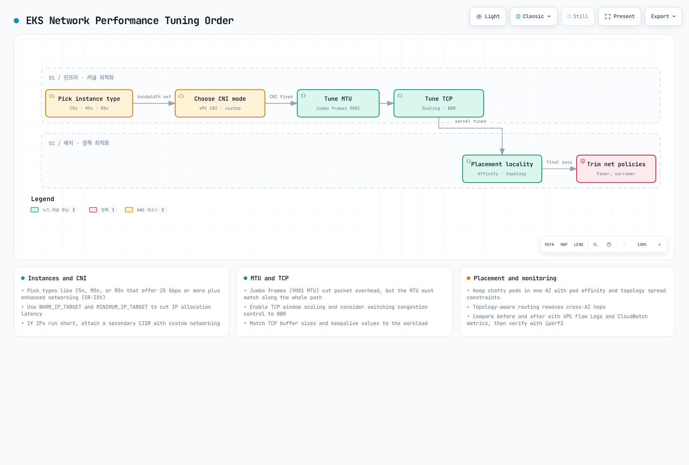
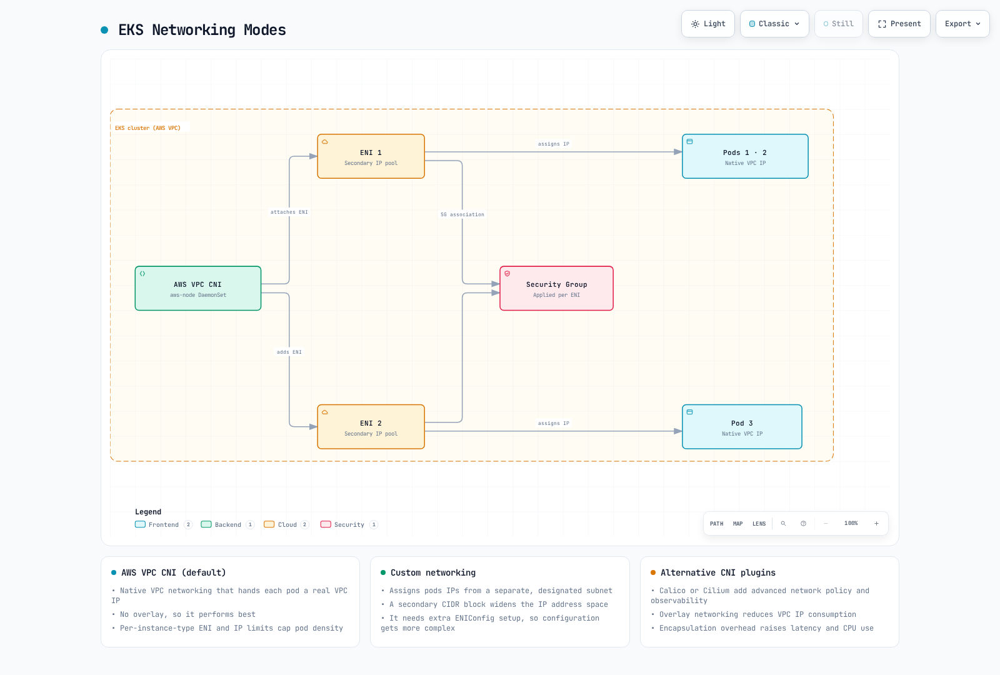
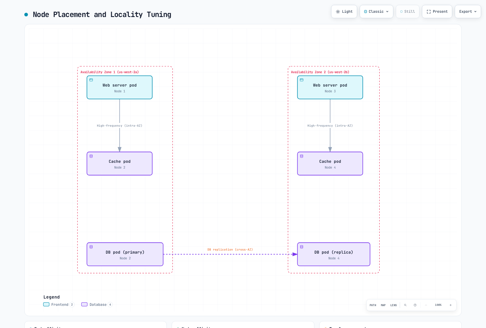
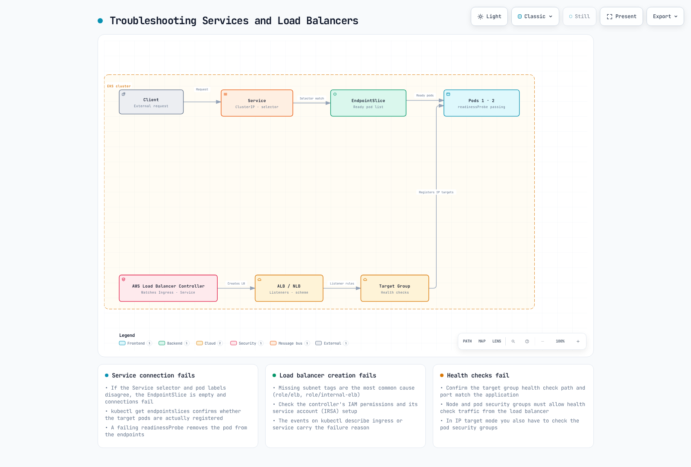

# Part 3: Troubleshooting

## Overview

This document covers performance optimization, troubleshooting methods, and advanced use cases for Amazon EKS networking. We will discuss how to optimize network performance, resolve common networking issues, and leverage advanced networking features.

## Network Performance Optimization

There are several strategies for optimizing network performance in EKS clusters.



[🔍 View interactive diagram](https://www.atomai.click/kubernetes-docs/archmaps/en-eks-03-eks-networking-part3-0.html)

### Instance Type Selection

Network performance varies significantly depending on the instance type. For network-intensive workloads, it is recommended to choose instance types that support enhanced networking.

1. **Enhanced Networking Support Instances**:
   * Instance types such as C5, M5, and R5 support enhanced networking.
   * These instances provide higher bandwidth, lower latency, and lower jitter.
2. **Network Bandwidth**:
   * Larger instance sizes provide higher network bandwidth.
   * For example, m5.large provides up to 10Gbps, while m5.24xlarge provides up to 25Gbps of network bandwidth.
3. **Elastic Network Adapter (ENA)**:
   * ENA supports network bandwidth up to 100Gbps.
   * Most modern instance types support ENA.

### Cluster Networking Modes

EKS supports multiple networking modes, each with different performance characteristics.



[🔍 View interactive diagram](https://www.atomai.click/kubernetes-docs/archmaps/en-eks-03-eks-networking-part3-1.html)

1. **AWS VPC CNI (Default)**:
   * Assigns VPC IP addresses directly to pods.
   * Excellent performance as it uses native VPC networking.
   * Each node has a limit on the number of IP addresses it can assign.
2. **Custom Networking**:
   * Allows assigning IP addresses from specific subnets to pods.
   * Can expand IP address space using secondary CIDR blocks.
   * Provides finer control over network topology.
3. **Alternative CNI Plugins**:
   * Alternative CNI plugins such as Calico and Cilium can be used.
   * These plugins provide additional features (e.g., network policies, encryption) but may have performance overhead.

### MTU Optimization

MTU (Maximum Transmission Unit) is an important factor affecting network performance.

1. **Default MTU Settings**:
   * The default MTU for AWS VPC CNI is 9001.
   * Some network paths may require a smaller MTU.
2. **MTU Adjustment**:
   * The MTU setting of AWS VPC CNI can be adjusted:

```bash
kubectl set env daemonset aws-node -n kube-system ENI_MTU=9001
```

3. **Jumbo Frames**:
   * Using jumbo frames (MTU > 1500) can improve network performance.
   * All network components including VPC, subnets, security groups, and load balancers must support jumbo frames.

### TCP Optimization

TCP settings can be optimized to improve network performance.

1. **TCP Early Demux**:
   * TCP early demux can improve performance but may cause issues in some networking modes.
   * It can be disabled if necessary:

```bash
kubectl set env daemonset aws-node -n kube-system DISABLE_TCP_EARLY_DEMUX=true
```

2. **TCP Keepalive Settings**:
   * TCP keepalive settings can be adjusted to optimize connection maintenance and reuse.
   * This is particularly useful for workloads that handle many short connections.

```bash
# System-level TCP keepalive settings
sysctl -w net.ipv4.tcp_keepalive_time=60
sysctl -w net.ipv4.tcp_keepalive_intvl=15
sysctl -w net.ipv4.tcp_keepalive_probes=6
```

3. **TCP Buffer Size**:
   * TCP buffer size can be adjusted to optimize throughput.
   * It is recommended to set buffer size according to the Bandwidth Delay Product (BDP).

```bash
# System-level TCP buffer settings
sysctl -w net.core.rmem_max=16777216
sysctl -w net.core.wmem_max=16777216
sysctl -w net.ipv4.tcp_rmem="4096 87380 16777216"
sysctl -w net.ipv4.tcp_wmem="4096 65536 16777216"
```

### Node Placement and Locality

Network performance can be improved by optimizing node placement and locality.



[🔍 View interactive diagram](https://www.atomai.click/kubernetes-docs/archmaps/en-eks-03-eks-networking-part3-2.html)

1. **Availability Zone Locality**:
   * Place frequently communicating pods in the same availability zone to reduce latency.
   * Use pod affinity and anti-affinity to control pod placement.

```yaml
apiVersion: apps/v1
kind: Deployment
metadata:
  name: web-server
spec:
  replicas: 3
  selector:
    matchLabels:
      app: web
  template:
    metadata:
      labels:
        app: web
    spec:
      affinity:
        podAffinity:
          preferredDuringSchedulingIgnoredDuringExecution:
          - weight: 100
            podAffinityTerm:
              labelSelector:
                matchExpressions:
                - key: app
                  operator: In
                  values:
                  - cache
              topologyKey: topology.kubernetes.io/zone
```

2. **Node Locality**:
   * Place frequently communicating pods on the same node to reduce network hops.
   * This is particularly useful for latency-sensitive applications.

```yaml
apiVersion: apps/v1
kind: Deployment
metadata:
  name: web-server
spec:
  replicas: 3
  selector:
    matchLabels:
      app: web
  template:
    metadata:
      labels:
        app: web
    spec:
      affinity:
        podAffinity:
          preferredDuringSchedulingIgnoredDuringExecution:
          - weight: 100
            podAffinityTerm:
              labelSelector:
                matchExpressions:
                - key: app
                  operator: In
                  values:
                  - cache
              topologyKey: kubernetes.io/hostname
```

3. **Topology Aware Hints**:
   * Use topology aware hints to keep service traffic within the same zone.
   * This reduces data transfer costs between availability zones and improves latency.

```yaml
apiVersion: v1
kind: Service
metadata:
  name: my-service
  annotations:
    service.kubernetes.io/topology-aware-hints: "auto"
spec:
  selector:
    app: my-app
  ports:
  - port: 80
    targetPort: 8080
  type: ClusterIP
```

### Network Policy Optimization

Network policies enhance security but can impact performance.

1. **Minimize Number of Policies**:
   * Apply only the minimum necessary network policies.
   * Too many policies can cause performance degradation.
2. **Optimize Policy Scope**:
   * Use specific policies rather than broad policies.
   * Use label selectors to limit policy scope.
3. **Consider Policy Evaluation Order**:
   * Network policies are evaluated cumulatively.
   * Define the most frequently used rules first to optimize evaluation performance.

## Networking Troubleshooting

Let's explore common networking issues that can occur in EKS clusters and how to resolve them.


[🔍 View interactive diagram](https://www.atomai.click/kubernetes-docs/archmaps/en-eks-03-eks-networking-part3-3.html)

### Pod Networking Issues


[🔍 View interactive diagram](https://www.atomai.click/kubernetes-docs/archmaps/en-eks-03-eks-networking-part3-4.html)

1. **Pod IP Assignment Failure**:
   * Symptom: Pod stuck in `ContainerCreating` state
   * Cause: Node has insufficient available IP addresses
   * Solution:
     * Check node status: `kubectl describe node <node-name>`
     * Check AWS VPC CNI logs: `kubectl logs -n kube-system -l k8s-app=aws-node`
     * Increase WARM\_IP\_TARGET: `kubectl set env daemonset aws-node -n kube-system WARM_IP_TARGET=10`
     * Upgrade node instance type: Change to an instance type that supports more ENIs and IP addresses
2. **Pod-to-Pod Communication Issues**:
   * Symptom: Pod cannot communicate with other pods
   * Cause: Network policies, security groups, routing issues, etc.
   * Solution:
     * Check network policies: `kubectl get networkpolicy`
     * Check security group rules: Use AWS console or AWS CLI
     * Test network connectivity from within the pod:

```bash
kubectl exec -it <pod-name> -- ping <target-pod-ip>
kubectl exec -it <pod-name> -- curl <target-service-name>
kubectl exec -it <pod-name> -- traceroute <target-pod-ip>
```

3. **DNS Resolution Issues**:
   * Symptom: Pod cannot resolve service names
   * Cause: CoreDNS issues, network policies, security groups, etc.
   * Solution:
     * Check CoreDNS pod status: `kubectl get pods -n kube-system -l k8s-app=kube-dns`
     * Check CoreDNS logs: `kubectl logs -n kube-system -l k8s-app=kube-dns`
     * Check DNS configuration: `kubectl exec -it <pod-name> -- cat /etc/resolv.conf`
     * Test DNS queries:

```bash
kubectl exec -it <pod-name> -- nslookup kubernetes.default.svc.cluster.local
kubectl exec -it <pod-name> -- dig kubernetes.default.svc.cluster.local
```

### Service and Load Balancing Issues



[🔍 View interactive diagram](https://www.atomai.click/kubernetes-docs/archmaps/en-eks-03-eks-networking-part3-5.html)

1. **Service Connection Issues**:
   * Symptom: Cannot connect to pods through the service
   * Cause: Service selector, pod status, endpoints, etc.
   * Solution:
     * Check service status: `kubectl describe service <service-name>`
     * Check endpoints: `kubectl get endpoints <service-name>`
     * Check pod status: `kubectl get pods -l <selector-label>`
     * Check service DNS: `kubectl exec -it <pod-name> -- nslookup <service-name>`
2. **Load Balancer Issues**:
   * Symptom: Cannot connect to load balancer from external
   * Cause: Security groups, subnet tags, health checks, etc.
   * Solution:
     * Check load balancer status: Use AWS console or AWS CLI
     * Check security group rules: Verify inbound traffic is allowed
     * Check subnet tags: Verify appropriate tags exist
     * Check health check configuration: Health check path, port, etc.
3. **Ingress Issues**:
   * Symptom: Cannot connect to service through Ingress
   * Cause: Ingress controller, annotations, certificates, etc.
   * Solution:
     * Check Ingress status: `kubectl describe ingress <ingress-name>`
     * Check Ingress controller logs: `kubectl logs -n kube-system -l app.kubernetes.io/name=aws-load-balancer-controller`
     * Check ALB status: Use AWS console or AWS CLI
     * Check target group status: Verify targets are healthy

## Quiz

To test what you've learned in this chapter, try the [topic quiz](../quizzes/eks/03-eks-networking-part3-quiz.md).
