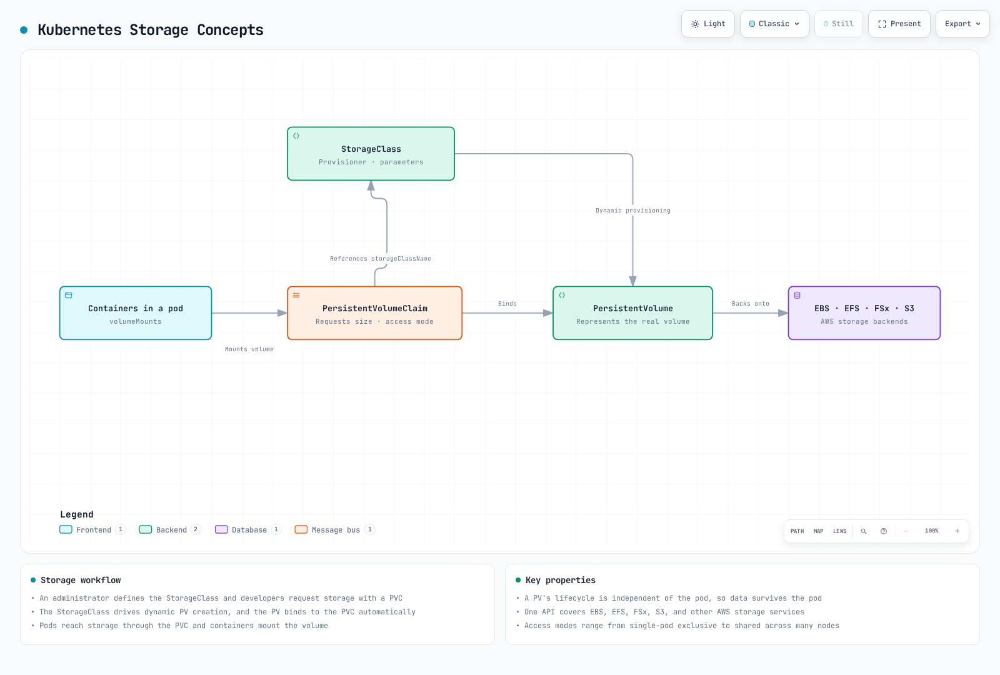
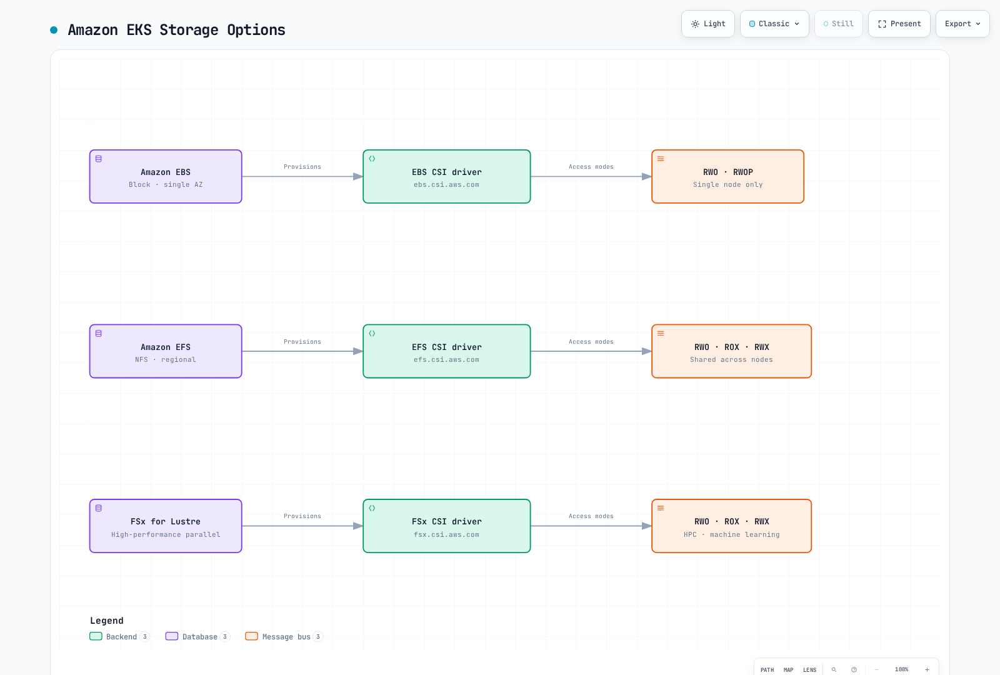
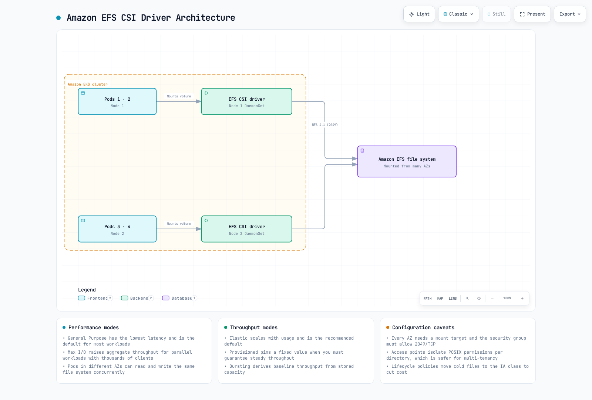

# EKS Storage

> **Last Updated**: September 11, 2026

When running applications on Amazon EKS, there are various storage options for storing and managing data. This document covers the basic concepts of EKS storage and how to use Amazon EBS (Elastic Block Store) and Amazon EFS (Elastic File System).

## Table of Contents

1. [Kubernetes Storage Basic Concepts](04-eks-storage-part1.md#kubernetes-storage-basic-concepts)
2. [Amazon EKS Storage Options Overview](04-eks-storage-part1.md#amazon-eks-storage-options-overview)
3. [Storage with Amazon EBS](04-eks-storage-part1.md#storage-with-amazon-ebs)
4. [Storage with Amazon EFS](04-eks-storage-part1.md#storage-with-amazon-efs)
5. [Storage Classes and Dynamic Provisioning](04-eks-storage-part1.md#storage-classes-and-dynamic-provisioning)

## Kubernetes Storage Basic Concepts

Let's first understand the key concepts for managing storage in Kubernetes.



[🔍 View interactive diagram](https://www.atomai.click/kubernetes-docs/archmaps/en-eks-04-eks-storage-part1-0.html)

### Volume

A volume exposes storage to containers as a filesystem mount, or as a raw block device where supported. Its lifetime depends on the volume type: `emptyDir` survives container restarts but is removed with its Pod; a PVC-backed persistent volume has a separately managed lifecycle. Deleting a Pod does not universally delete the backing data.

### Persistent Volume (PV)

A persistent volume is a piece of cluster storage that is provisioned by an administrator or dynamically provisioned through a storage class. PV objects are independent of Pods, but PVC ownership and reclaim policies govern retention. For example, generic ephemeral-volume PVCs can be garbage-collected with their owning Pod.

### Persistent Volume Claim (PVC)

A persistent volume claim is a user's request for storage. A PVC requests storage with a specific size and access mode, and this request is bound to an appropriate PV.

A PVC is namespaced and normally binds one PV; multiple Pods in that namespace may use the claim if the access mode and backend permit. Binding does not itself grant application-level file permissions or guarantee available capacity/performance.

### StorageClass

A storage class describes the "class" of storage offered by the administrator. Using storage classes allows PVs to be dynamically provisioned when PVCs are created.

### Access Modes

Kubernetes supports the following access modes:

* **ReadWriteOnce (RWO)**: Can be mounted as read/write by a single node
* **ReadOnlyMany (ROX)**: Can be mounted as read-only by many nodes
* **ReadWriteMany (RWX)**: Can be mounted as read/write by many nodes
* **ReadWriteOncePod (RWOP)**: Restricts read/write use to one Pod cluster-wide for compatible CSI stacks; introduced in 1.22 and stable since 1.29

**RWO means one node, not one Pod**: several Pods on that node can share the PVC. RWOP is a separate constraint and requires compatible CSI sidecars. Other access modes primarily participate in matching/mount capabilities; use read-only mount flags, filesystem permissions and service authorization where needed. RWX does not make concurrent writes application-safe.

## Amazon EKS Storage Options Overview

In Amazon EKS, you can leverage various AWS storage services to provide storage for containerized applications.



[🔍 View interactive diagram](https://www.atomai.click/kubernetes-docs/archmaps/en-eks-04-eks-storage-part1-1.html)

### Main Storage Options

1. **Amazon EBS (Elastic Block Store)**
   * AZ-scoped network block storage; ordinary gp3 filesystem volumes use one-node attachment (RWO or compatible RWOP)
   * High-performance, durable block storage
   * Suitable for databases, stateful applications
2. **Amazon EFS (Elastic File System)**
   * Fully managed NFS file system
   * Can be mounted simultaneously from multiple nodes (RWX)
   * Suitable for workloads requiring shared file systems
3. **Amazon FSx for Lustre**
   * High-performance file system
   * Suitable for machine learning, HPC, big data analytics
   * Can be mounted simultaneously from multiple nodes (RWX)
4. **Amazon S3 (Simple Storage Service)**
   * Object storage
   * Accessible through the S3 API or the official Mountpoint for Amazon S3 CSI driver (static buckets and a limited POSIX interface); S3 Files is a separate shared-filesystem option using EFS CSI 3.0+
   * Suitable for large-scale data storage
5. **EC2 Instance Store (Local NVMe)**
   * Ephemeral local NVMe storage physically attached to the EC2 instance, offering very low latency
   * The EC2 Instance Store CSI driver became an EKS add-on on May 5, 2026. It manages local NVMe storage as Kubernetes PVs, but a PV object does not make instance-store data durable across node loss/termination. Verify the instance, OS and add-on compatibility before installation
   * Suitable for AI/ML ephemeral data processing, Spark/Hadoop local caching, high-throughput log processing, and database cache tiers
   * Cost: plan the compatible EC2 instance and associated AWS resources; the local storage is tied to the chosen instance ([source](https://aws.amazon.com/about-aws/whats-new/2026/05/ec2-csi-eks/))

### Storage Options Comparison

Performance depends on size, throughput/IOPS mode, client/network limits and workload. The following is a capability comparison, not a measured ranking.

| Option | Interface | Typical use | Key constraint |
|---|---|---|---|
| EBS | Block/filesystem | Databases, per-replica state | Ordinary volumes stay in one AZ; attachment and consistency rules apply |
| EFS | Shared NFS filesystem | Shared files | Regional/One Zone, throughput, POSIX identity and mount-target paths differ |
| FSx for Lustre | Parallel filesystem | HPC/ML datasets | Client/kernel support, deployment type, size and provisioned throughput |
| S3 + Mountpoint CSI | Object/file interface | Large object datasets | Static bucket provisioning; not all POSIX operations |
| S3 Files + EFS CSI | Shared filesystem backed by S3 | File-based access to S3 data | Separate service/IAM configuration; EFS CSI 3.0+ and compute restrictions |
| EC2 Instance Store CSI | Local block/filesystem | Rebuildable cache/scratch | Data tied to node/local media lifetime |

See [Mountpoint CSI](https://docs.aws.amazon.com/eks/latest/userguide/s3-csi.html) and [S3 Files](https://docs.aws.amazon.com/eks/latest/userguide/s3files-csi.html) for their different semantics and controller/node IAM requirements. Neither is an automatic replacement for a transactional database filesystem.

## Storage with Amazon EBS

Amazon EBS provides block-level storage volumes that can be attached to EC2 instances. In EKS, you can mount EBS volumes to Kubernetes pods through the EBS CSI (Container Storage Interface) driver.

<!-- Diagram repair pending: controller attach versus node mount path; see batch report.


[🔍 View interactive diagram](https://www.atomai.click/kubernetes-docs/archmaps/en-eks-04-eks-storage-part1-2.html)
-->

### Installing EBS CSI Driver

For ordinary Linux EC2 nodes, install a compatible EBS CSI add-on through the infrastructure owner. Auto Mode manages block storage with `ebs.csi.eks.amazonaws.com`; standard `ebs.csi.aws.com` volumes are separate, and migration uses snapshots rather than editing a bound PVC’s provisioner. EBS cannot be mounted by Fargate Pods or Hybrid Nodes. The EBS controller can run on Fargate, but its node plugin cannot; that is a different deployment/identity design.

The shared workflow below supports EBS or EFS. Set `CSI_ADDON_NAME=aws-ebs-csi-driver` for this section, inspect the catalog, and choose an exact compatible add-on version. The AWS API does not use the literal string `latest` as an add-on version. `eksctl --version latest` is a separate tool convenience, not an AWS API value.
```bash
set -euo pipefail
: "${CLUSTER_NAME:?Set the existing cluster name}"
: "${AWS_REGION:?Set the cluster Region}"
: "${CSI_ADDON_NAME:?Use aws-ebs-csi-driver or aws-efs-csi-driver}"
case "$CSI_ADDON_NAME" in
  aws-ebs-csi-driver|aws-efs-csi-driver) ;;
  *) echo "Unexpected add-on"; exit 1 ;;
esac
KUBERNETES_VERSION=$(aws eks describe-cluster --region "$AWS_REGION" --name "$CLUSTER_NAME" \
  --query cluster.version --output text)
CLUSTER_ENDPOINT=$(aws eks describe-cluster --region "$AWS_REGION" --name "$CLUSTER_NAME" \
  --query cluster.endpoint --output text)
CURRENT_ENDPOINT=$(kubectl config view --minify -o jsonpath='{.clusters[0].cluster.server}')
test "$CURRENT_ENDPOINT" = "$CLUSTER_ENDPOINT" || { echo "kubeconfig points to another cluster"; exit 1; }
aws eks describe-addon-versions --region "$AWS_REGION" --addon-name "$CSI_ADDON_NAME" \
  --kubernetes-version "$KUBERNETES_VERSION" --output json > csi-addon-versions.json
aws eks list-addons --region "$AWS_REGION" --cluster-name "$CLUSTER_NAME" --output json
```
Before installation, prepare the exact `kube-system/ebs-csi-controller-sa` Pod Identity role/trust and the Pod Identity agent on supported compute. Review `AmazonEBSCSIDriverPolicyV2` or a scoped policy and any required customer-key KMS permissions. An IRSA deployment instead uses a correctly scoped OIDC trust and `--service-account-role-arn`; do not combine identity options blindly. The code stops for an existing installation; use that owner’s update/adoption process rather than overwriting it.
```bash
set -euo pipefail
: "${CSI_ADDON_VERSION:?Choose a reviewed compatible version from csi-addon-versions.json}"
: "${CSI_ROLE_ARN:?Set the prepared Pod Identity role ARN}"
: "${CLUSTER_NAME:?Run the inspection step first}"
: "${AWS_REGION:?Run the inspection step first}"
: "${CSI_ADDON_NAME:?Run the inspection step first}"
case "$CSI_ADDON_NAME" in
  aws-ebs-csi-driver) CSI_SA=ebs-csi-controller-sa; CSI_PREFIX=ebs-csi ;;
  aws-efs-csi-driver) CSI_SA=efs-csi-controller-sa; CSI_PREFIX=efs-csi ;;
  *) echo "Unexpected add-on"; exit 1 ;;
esac
python3 - "$CSI_ADDON_NAME" "$CSI_ADDON_VERSION" <<'PY'
import json, sys
with open("csi-addon-versions.json") as stream:
    catalog = json.load(stream)
versions = [v["addonVersion"] for a in catalog["addons"]
            if a["addonName"] == sys.argv[1] for v in a["addonVersions"]]
if sys.argv[2] not in versions:
    raise SystemExit("Version not present in the inspected compatible catalog")
PY
aws eks list-addons --region "$AWS_REGION" --cluster-name "$CLUSTER_NAME" \
  --output json > csi-existing-addons.json
python3 - "$CSI_ADDON_NAME" <<'PY'
import json, sys
with open("csi-existing-addons.json") as stream:
    names = json.load(stream)["addons"]
if sys.argv[1] in names:
    raise SystemExit("Existing add-on: use its owner's update procedure")
PY
EXISTING_CSI=$(kubectl -n kube-system get "deployment/$CSI_PREFIX-controller" \
  "daemonset/$CSI_PREFIX-node" --ignore-not-found -o name)
test -z "$EXISTING_CSI" || { echo "Existing CSI installation: review its owner"; exit 1; }
aws eks describe-addon-configuration --region "$AWS_REGION" \
  --addon-name "$CSI_ADDON_NAME" --addon-version "$CSI_ADDON_VERSION"
aws eks create-addon --region "$AWS_REGION" --cluster-name "$CLUSTER_NAME" \
  --addon-name "$CSI_ADDON_NAME" --addon-version "$CSI_ADDON_VERSION" \
  --pod-identity-associations "serviceAccount=$CSI_SA,roleArn=$CSI_ROLE_ARN" \
  --resolve-conflicts NONE
aws eks wait addon-active --region "$AWS_REGION" --cluster-name "$CLUSTER_NAME" \
  --addon-name "$CSI_ADDON_NAME"
```
Add-on Active does not prove that an application can attach, mount, write and restore a volume. Validate those operations in a dedicated environment. This chapter’s AWS commands create resources when run; the audit performed local checks only.

### Creating EBS Storage Class

Create a storage class for dynamic provisioning of EBS volumes. Here we use the gp3 volume type.

Use the same `storage-demo` namespace for this chapter’s namespaced examples. Create a new namespace exclusively for the exercise; stop if it already exists until its owner is reviewed. StorageClasses and snapshot classes are cluster-scoped and also need ownership review. The shown versions are examples, not production sizing.
```yaml
apiVersion: v1
kind: Namespace
metadata:
  name: storage-demo
  labels:
    pod-security.kubernetes.io/enforce: restricted
    pod-security.kubernetes.io/enforce-version: v1.36
```
Save the namespace manifest as `storage-demo-namespace.yaml` **before** running the create command. Preserve data deliberately: the examples use `Retain`, which can leave chargeable AWS resources after PVC deletion.
```bash
kubectl create -f storage-demo-namespace.yaml
```


```yaml
apiVersion: storage.k8s.io/v1
kind: StorageClass
metadata:
  name: ebs-gp3
provisioner: ebs.csi.aws.com
volumeBindingMode: WaitForFirstConsumer
reclaimPolicy: Retain
allowVolumeExpansion: true
parameters:
  type: gp3
  encrypted: 'true'
  csi.storage.k8s.io/fstype: ext4
```

### Creating Persistent Volume Claim (PVC)

Create a PVC to be used by your application.

```yaml
apiVersion: v1
kind: PersistentVolumeClaim
metadata:
  name: ebs-claim
  namespace: storage-demo
spec:
  accessModes:
  - ReadWriteOnce
  storageClassName: ebs-gp3
  resources:
    requests:
      storage: 10Gi
```

### Using PVC in a Pod

Mount the created PVC in a pod.

```yaml
apiVersion: v1
kind: Pod
metadata:
  name: app-with-ebs
  namespace: storage-demo
spec:
  automountServiceAccountToken: false
  securityContext:
    runAsNonRoot: true
    runAsUser: 1000
    runAsGroup: 1000
    fsGroup: 1000
    seccompProfile:
      type: RuntimeDefault
  containers:
  - name: app
    image: busybox:1.37.0
    command:
    - sh
    - -c
    args:
    - test -w /data && touch /data/demo-marker && sync && sleep 3600
    securityContext:
      allowPrivilegeEscalation: false
      readOnlyRootFilesystem: true
      capabilities:
        drop:
        - ALL
    resources:
      requests:
        cpu: 10m
        memory: 16Mi
      limits:
        cpu: 100m
        memory: 64Mi
    volumeMounts:
    - name: data
      mountPath: /data
  volumes:
  - name: data
    persistentVolumeClaim:
      claimName: ebs-claim
```

### EBS Volume Snapshots

Prepare the snapshot CRDs, a compatible snapshot controller and the driver’s snapshotter component before using these resources. Use their managed owner or a reviewed pinned release, not floating `master` manifests. The class driver must match the volume’s provisioner. A snapshot is a point-in-time block copy; quiesce/flush the application or use its supported backup protocol when consistency requires it.
```yaml
apiVersion: snapshot.storage.k8s.io/v1
kind: VolumeSnapshotClass
metadata:
  name: ebs-snapshot-retain
driver: ebs.csi.aws.com
deletionPolicy: Retain
```

```yaml
apiVersion: snapshot.storage.k8s.io/v1
kind: VolumeSnapshot
metadata:
  name: ebs-snapshot
  namespace: storage-demo
  labels:
    storage-demo: ebs
spec:
  volumeSnapshotClassName: ebs-snapshot-retain
  source:
    persistentVolumeClaimName: ebs-claim
```

```bash
set -euo pipefail
kubectl -n storage-demo wait --for=jsonpath='{.status.readyToUse}'=true \
  volumesnapshot/ebs-snapshot --timeout=300s
kubectl -n storage-demo get volumesnapshot ebs-snapshot -o yaml
```
For restore, create a new PVC in the snapshot’s namespace with a size at least `status.restoreSize`, then create a consumer and verify the restored data. This 20 Gi request assumes the snapshot is no larger. `WaitForFirstConsumer` can legitimately keep the restore PVC Pending until scheduling. Snapshot `deletionPolicy` is separate from PV `reclaimPolicy`; Retain leaves the backend snapshot for controlled cleanup.
```yaml
apiVersion: v1
kind: PersistentVolumeClaim
metadata:
  name: ebs-restored
  namespace: storage-demo
spec:
  accessModes:
  - ReadWriteOnce
  storageClassName: ebs-gp3
  resources:
    requests:
      storage: 20Gi
  dataSource:
    name: ebs-snapshot
    kind: VolumeSnapshot
    apiGroup: snapshot.storage.k8s.io
```


### EBS Volume Expansion

The StorageClass must allow expansion and the driver/filesystem must support it. For this 10 Gi example, increase only the PVC request to 20 Gi through its owner. Do not shrink it or manually edit PV capacity to imitate a resize. Verify PVC conditions/capacity and the mounted filesystem; `FileSystemResizePending` can require the documented remount/restart path.
```bash
set -euo pipefail
kubectl -n storage-demo get pvc ebs-claim -o yaml
kubectl -n storage-demo patch pvc ebs-claim --type merge \
  -p '{"spec":{"resources":{"requests":{"storage":"20Gi"}}}}'
kubectl -n storage-demo describe pvc ebs-claim
```

### EBS Volume Types and Performance

Amazon EBS provides various volume types:

| Volume Type | Description              | Use Cases                                   |
| ----------- | ------------------------ | ------------------------------------------- |
| gp3         | General Purpose SSD      | Suitable for most workloads, cost-effective |
| io2         | Provisioned IOPS SSD     | High-performance databases                  |
| st1         | Throughput Optimized HDD | Big data, log processing                    |
| sc1         | Cold HDD                 | Infrequently accessed data                  |

gp3 is a common starting point, but choose size, IOPS and throughput for the workload and instance EBS limits. Ordinary gp3 filesystem volumes are not shared multi-node filesystems. EBS CSI 1.66.0 has an io2 **raw-block** Multi-Attach path for `ReadWriteMany`; it requires compatible nodes and application-level coordination/fencing and does not make ext4/XFS safe for concurrent independent mounts. RWOP is distinct from RWO, and CSI sidecar compatibility matters.

## Storage with Amazon EFS

Amazon EFS is a fully managed NFS file system that can be accessed simultaneously from multiple EC2 instances. In EKS, you can mount EFS file systems to multiple pods simultaneously through the EFS CSI driver.



[🔍 View interactive diagram](https://www.atomai.click/kubernetes-docs/archmaps/en-eks-04-eks-storage-part1-3.html)

### Installing EFS CSI Driver

On supported Linux EC2 compute, use the earlier add-on workflow with `CSI_ADDON_NAME=aws-efs-csi-driver`, the compatible EFS add-on version and a prepared role for `kube-system/efs-csi-controller-sa`. Review `AmazonEFSCSIDriverPolicy` or a scoped equivalent. Fargate mounts EFS through its managed integration and supports static, not dynamic, provisioning. The managed EFS CSI support matrix excludes Windows/Hybrid Nodes. S3 Files uses EFS CSI 3.0+ but has separate controller **and node** IAM requirements and does not support Fargate.

### Creating EFS File System

Dynamic `efs-ap` provisioning creates access points in an **existing** filesystem. Create that filesystem and mount targets through the network/storage owner. This optional CLI example creates a new encrypted Regional filesystem and one mount target in each of **two distinct AZs**. Choose the subnets actually used by the clients; for additional AZs, extend the design with one target per AZ, not every subnet. Use an existing owner’s workflow instead if the filesystem is already managed by IaC.

Prepare operator permissions, correct Region/account, reachable client SGs and DNS/NFS paths first. The script captures returned IDs instead of searching ambiguous Name tags, validates VPC/AZ choices before writes, and keeps creation records on partial failure. A stable unique creation token belongs to this request; an existing-token response is not permission to adopt/change another filesystem. Review/reconcile partial resources rather than blindly rerunning creation.
```bash
set -euo pipefail
umask 077
: "${CLUSTER_NAME:?Set the cluster name}"
: "${AWS_REGION:?Set the Region}"
: "${EFS_CREATION_TOKEN:?Set a unique, stable token for this new filesystem}"
: "${EFS_SUBNET_A:?Set the first approved subnet}"
: "${EFS_SUBNET_B:?Set a subnet in a different AZ}"
: "${NFS_CLIENT_SG_ID:?Set the SG of the actual NFS clients}"
EFS_SETUP_DIR=$(mktemp -d -t eks-efs-setup.XXXXXX)
printf 'Creation records: %s\n' "$EFS_SETUP_DIR"
VPC_ID=$(aws eks describe-cluster --region "$AWS_REGION" --name "$CLUSTER_NAME" \
  --query cluster.resourcesVpcConfig.vpcId --output text)
aws ec2 describe-subnets --region "$AWS_REGION" \
  --subnet-ids "$EFS_SUBNET_A" "$EFS_SUBNET_B" --output json > "$EFS_SETUP_DIR/subnets.json"
aws ec2 describe-security-groups --region "$AWS_REGION" \
  --group-ids "$NFS_CLIENT_SG_ID" --output json > "$EFS_SETUP_DIR/client-sg.json"
python3 - "$EFS_SETUP_DIR" "$VPC_ID" "$EFS_CREATION_TOKEN" <<'PY'
import json, pathlib, sys
root, vpc, token = pathlib.Path(sys.argv[1]), sys.argv[2], sys.argv[3]
subnets = json.loads((root / "subnets.json").read_text())["Subnets"]
groups = json.loads((root / "client-sg.json").read_text())["SecurityGroups"]
if not 1 <= len(token) <= 64 or not token.isascii():
    raise SystemExit("Creation token must contain 1–64 ASCII characters")
if len(subnets) != 2 or len({s["SubnetId"] for s in subnets}) != 2:
    raise SystemExit("Exactly two distinct subnets are required")
if any(s["VpcId"] != vpc for s in subnets) or len({s["AvailabilityZoneId"] for s in subnets}) != 2:
    raise SystemExit("Subnets must be in the cluster VPC and different AZs")
if len(groups) != 1 or groups[0]["VpcId"] != vpc:
    raise SystemExit("The NFS client SG must belong to the cluster VPC")
PY
aws efs create-file-system --region "$AWS_REGION" --creation-token "$EFS_CREATION_TOKEN" \
  --performance-mode generalPurpose --throughput-mode elastic --encrypted \
  --tags Key=Name,Value=eks-storage-demo --output json > "$EFS_SETUP_DIR/filesystem-created.json"
EFS_FS_ID=$(python3 - "$EFS_SETUP_DIR/filesystem-created.json" <<'PY'
import json, sys
with open(sys.argv[1]) as stream:
    print(json.load(stream)["FileSystemId"])
PY
)
test -n "$EFS_FS_ID"
FS_READY=false
for ((attempt=0; attempt<60; attempt++)); do
  STATE=$(aws efs describe-file-systems --region "$AWS_REGION" --file-system-id "$EFS_FS_ID" \
    --query 'FileSystems[0].LifeCycleState' --output text)
  case "$STATE" in
    available) FS_READY=true; break ;;
    creating) sleep 5 ;;
    *) echo "Unexpected filesystem state: $STATE"; exit 1 ;;
  esac
done
test "$FS_READY" = true || { echo "Filesystem readiness timed out"; exit 1; }
aws ec2 create-security-group --region "$AWS_REGION" --group-name "efs-nfs-$EFS_FS_ID" \
  --description "NFS clients for $EFS_FS_ID" --vpc-id "$VPC_ID" \
  --output json > "$EFS_SETUP_DIR/sg-created.json"
EFS_SG_ID=$(python3 - "$EFS_SETUP_DIR/sg-created.json" <<'PY'
import json, sys
with open(sys.argv[1]) as stream:
    print(json.load(stream)["GroupId"])
PY
)
test -n "$EFS_SG_ID"
aws ec2 authorize-security-group-ingress --region "$AWS_REGION" --group-id "$EFS_SG_ID" \
  --protocol tcp --port 2049 --source-group "$NFS_CLIENT_SG_ID"
for SUBNET_ID in "$EFS_SUBNET_A" "$EFS_SUBNET_B"; do
  aws efs create-mount-target --region "$AWS_REGION" --file-system-id "$EFS_FS_ID" \
    --subnet-id "$SUBNET_ID" --security-groups "$EFS_SG_ID" --output json \
    > "$EFS_SETUP_DIR/mount-target-$SUBNET_ID.json"
done
TARGETS_READY=false
for ((attempt=0; attempt<60; attempt++)); do
  aws efs describe-mount-targets --region "$AWS_REGION" --file-system-id "$EFS_FS_ID" \
    --output json > "$EFS_SETUP_DIR/mount-targets.json"
  STATE=$(python3 - "$EFS_SETUP_DIR/mount-targets.json" <<'PY'
import json, sys
with open(sys.argv[1]) as stream:
    targets = json.load(stream)["MountTargets"]
states = [t["LifeCycleState"] for t in targets]
if any(s not in ("creating", "available") for s in states):
    raise SystemExit("Unexpected mount-target state")
print("available" if len(states) == 2 and all(s == "available" for s in states) else "creating")
PY
)
  if test "$STATE" = available; then TARGETS_READY=true; break; fi
  sleep 5
done
test "$TARGETS_READY" = true || { echo "Mount-target readiness timed out"; exit 1; }
printf 'Filesystem: %s\nMount-target SG: %s\nCreation records: %s\n' "$EFS_FS_ID" "$EFS_SG_ID" "$EFS_SETUP_DIR"
```
The example uses bounded Describe polling for lifecycle readiness. The controller’s CSI IAM role is not a general filesystem-provisioning role. NFS ingress uses the actual client SG; confirm whether the mount traffic comes from node or Pod ENIs in the selected design.

### Creating EFS Storage Class

Create a storage class for using EFS. Replace the filesystem ID with the captured ID. This example deliberately enforces UID/GID1000 at the access point and keeps unique directories; choose identities for your trust boundary. TLS is enabled. An `iam` mount option uses the **CSI node Pod’s identity**, not automatically the application ServiceAccount. Controller provisioning permissions and client mount permissions are separate.

```yaml
apiVersion: storage.k8s.io/v1
kind: StorageClass
metadata:
  name: efs-sc
provisioner: efs.csi.aws.com
reclaimPolicy: Retain
mountOptions:
- tls
parameters:
  provisioningMode: efs-ap
  fileSystemId: fs-0123456789abcdef0
  directoryPerms: '750'
  uid: '1000'
  gid: '1000'
  basePath: /storage-demo
  ensureUniqueDirectory: 'true'
```

### Creating Persistent Volume Claim (PVC)

Create a PVC for using EFS. The `5Gi` request is Kubernetes binding metadata, not an EFS directory quota or allocated capacity. Growth still needs throughput/IOPS, access-point quota and cost planning.

```yaml
apiVersion: v1
kind: PersistentVolumeClaim
metadata:
  name: efs-claim
  namespace: storage-demo
spec:
  accessModes:
  - ReadWriteMany
  storageClassName: efs-sc
  resources:
    requests:
      storage: 5Gi
```

### Using EFS PVC in a Pod

Mount the created PVC in a pod.

```yaml
apiVersion: v1
kind: Pod
metadata:
  name: app-with-efs
  namespace: storage-demo
spec:
  automountServiceAccountToken: false
  securityContext:
    runAsNonRoot: true
    runAsUser: 1000
    runAsGroup: 1000
    fsGroup: 1000
    seccompProfile:
      type: RuntimeDefault
  containers:
  - name: app
    image: busybox:1.37.0
    command:
    - sh
    - -c
    args:
    - test -w /shared-data && touch /shared-data/demo-marker && sync && sleep 3600
    securityContext:
      allowPrivilegeEscalation: false
      readOnlyRootFilesystem: true
      capabilities:
        drop:
        - ALL
    resources:
      requests:
        cpu: 10m
        memory: 16Mi
      limits:
        cpu: 100m
        memory: 64Mi
    volumeMounts:
    - name: data
      mountPath: /shared-data
  volumes:
  - name: data
    persistentVolumeClaim:
      claimName: efs-claim
```

### EFS Access Points

An access point sets the presented root directory and enforced POSIX identity. It is not a complete namespace isolation boundary by itself: enforce the intended access point/TLS/client permissions with the filesystem’s IAM policy and network controls. Do not enable `reuseAccessPoint` on a class shared by mutually untrusted tenants; in the reviewed driver its reuse token uses the PVC name, not the namespace, and can point two claims at the same data.

This static example explicitly binds one PVC to a pre-existing access point, with `storageClassName: ""` to opt out of dynamic/default provisioning. It is an alternative to the earlier dynamic claim. The access point’s root directory and POSIX permissions must already be suitable. A consumer must reference `efs-static-claim` in `storage-demo`:
```yaml
apiVersion: v1
kind: PersistentVolume
metadata:
  name: efs-static-pv
spec:
  capacity:
    storage: 5Gi
  volumeMode: Filesystem
  accessModes:
  - ReadWriteMany
  persistentVolumeReclaimPolicy: Retain
  storageClassName: ''
  mountOptions:
  - tls
  csi:
    driver: efs.csi.aws.com
    volumeHandle: fs-0123456789abcdef0::fsap-0123456789abcdef0
---
apiVersion: v1
kind: PersistentVolumeClaim
metadata:
  name: efs-static-claim
  namespace: storage-demo
spec:
  accessModes:
  - ReadWriteMany
  storageClassName: ''
  volumeName: efs-static-pv
  resources:
    requests:
      storage: 5Gi
```


### EFS Performance Modes and Throughput Modes

- **General Purpose** is AWS’s recommended performance mode for all filesystems. **Max I/O** is a previous-generation mode with higher per-operation latency and cannot be combined with Elastic throughput or One Zone filesystems.
- **Elastic** adjusts throughput to demand, **Provisioned** reserves selected throughput, and **Bursting** depends on stored data/credits. Choose explicitly; console/API defaults should not be treated as one universal default.
- Regional and One Zone have different failure/availability properties. Elastic throughput is currently supported for One Zone too; that does not remove its single-AZ durability considerations.
- Measure the actual access pattern and client limits. These descriptions do not establish a latency/throughput benchmark for the sample.

## Storage Classes and Dynamic Provisioning

Using Kubernetes storage classes allows persistent volumes to be dynamically provisioned. In EKS, you can configure storage classes for various AWS storage services.


[🔍 View interactive diagram](https://www.atomai.click/kubernetes-docs/archmaps/en-eks-04-eks-storage-part1-4.html)

### Volume Binding Modes

The `volumeBindingMode` field in a storage class determines how PVs are bound when PVCs are created:

* **Immediate**: Provisions and binds PV immediately when PVC is created.
* **WaitForFirstConsumer**: Delays PV provisioning until a pod tries to use the PVC.

For ordinary AZ-scoped EBS volumes, prefer `WaitForFirstConsumer` so scheduler constraints participate in provisioning/binding. EBS is network-attached block storage, not physical instance-store media; the driver’s separate pre-attached node-local cache mode is a different feature. Do not set `spec.nodeName` to bypass the scheduler for a pending delayed-binding PVC; use scheduler constraints such as nodeSelector instead.

### Setting Default Storage Class

A default class applies when a PVC omits storageClassName; explicit `storageClassName: ""` opts out. Review existing defaults through their owner. Multiple defaults are allowed during transitions, with the most recently created default selected, but leave one intended default afterwards. This does not migrate existing bound volumes. The repeated class examples below are alternatives, not a sequence of parameter mutations.

```yaml
apiVersion: storage.k8s.io/v1
kind: StorageClass
metadata:
  name: ebs-gp3
  annotations:
    storageclass.kubernetes.io/is-default-class: 'true'
provisioner: ebs.csi.aws.com
volumeBindingMode: WaitForFirstConsumer
reclaimPolicy: Retain
allowVolumeExpansion: true
parameters:
  type: gp3
  encrypted: 'true'
  csi.storage.k8s.io/fstype: ext4
```

### Storage Class Examples

**1. EBS gp3 Storage Class**

```yaml
apiVersion: storage.k8s.io/v1
kind: StorageClass
metadata:
  name: ebs-gp3
provisioner: ebs.csi.aws.com
volumeBindingMode: WaitForFirstConsumer
reclaimPolicy: Retain
allowVolumeExpansion: true
parameters:
  type: gp3
  encrypted: 'true'
  csi.storage.k8s.io/fstype: ext4
  iops: '3000'
  throughput: '125'
```

**2. EFS Storage Class**

```yaml
apiVersion: storage.k8s.io/v1
kind: StorageClass
metadata:
  name: efs-sc
provisioner: efs.csi.aws.com
reclaimPolicy: Retain
mountOptions:
- tls
parameters:
  provisioningMode: efs-ap
  fileSystemId: fs-0123456789abcdef0
  directoryPerms: '750'
  uid: '1000'
  gid: '1000'
  basePath: /storage-demo
  ensureUniqueDirectory: 'true'
```

**3. FSx for Lustre Storage Class**

Prepare the supported FSx CSI/controller IAM role, Lustre client/kernel and network path first. This minimal SCRATCH_2 class intentionally omits persistent-only throughput and backup settings. Use disposable/recoverable data; Retain does not turn scratch storage into a durable backup. In CSI 1.10.0, `s3ImportPath` is a valid optional parameter when the chosen FSx deployment supports that integration.

```yaml
apiVersion: storage.k8s.io/v1
kind: StorageClass
metadata:
  name: fsx-lustre
provisioner: fsx.csi.aws.com
reclaimPolicy: Retain
parameters:
  subnetId: subnet-0123456789abcdef0
  securityGroupIds: sg-0123456789abcdef0
  deploymentType: SCRATCH_2
  dataCompressionType: NONE
```

### Reclaim Policies

The reclaim policy of a persistent volume determines how the PV and its data are handled when the PVC is deleted:

* **Delete**: After claim release/protection, the provisioner attempts backend cleanup according to the driver. For EBS this deletes the volume; EFS dynamic provisioning usually deletes the access point, not the filesystem or files by default. The EFS controller’s `deleteAccessPointRootDir` setting changes that behavior.
* **Retain**: When PVC is deleted, the PV and data are retained. Administrator must manually clean up.
* **Recycle**: Deprecated policy, use dynamic provisioning and storage classes instead.

The StorageClass field is **`reclaimPolicy`**; **`persistentVolumeReclaimPolicy`** belongs to a PV’s spec. A class sets the initial policy for newly provisioned PVs; changing it does not automatically rewrite existing PV policies. Review each actual PV and backup before deleting claims:

```yaml
apiVersion: storage.k8s.io/v1
kind: StorageClass
metadata:
  name: ebs-gp3-retain
provisioner: ebs.csi.aws.com
volumeBindingMode: WaitForFirstConsumer
reclaimPolicy: Retain
allowVolumeExpansion: true
parameters:
  type: gp3
  encrypted: 'true'
  csi.storage.k8s.io/fstype: ext4
```

Official references: [EBS CSI](https://docs.aws.amazon.com/eks/latest/userguide/ebs-csi.html), [EFS CSI](https://docs.aws.amazon.com/eks/latest/userguide/efs-csi.html), [snapshot controller](https://docs.aws.amazon.com/eks/latest/userguide/csi-snapshot-controller.html), [EFS performance](https://docs.aws.amazon.com/efs/latest/ug/performance.html), [Kubernetes PVs](https://kubernetes.io/docs/concepts/storage/persistent-volumes/).

## Conclusion

In Amazon EKS, you can configure storage solutions that meet your application requirements using various storage options. This document covered basic concepts and configuration methods focusing on EBS and EFS. The next document will cover advanced storage configurations using FSx for Lustre and S3.

## Quiz

To test what you've learned in this chapter, try the [topic quiz](../quizzes/eks/04-eks-storage-part1-quiz.md).
