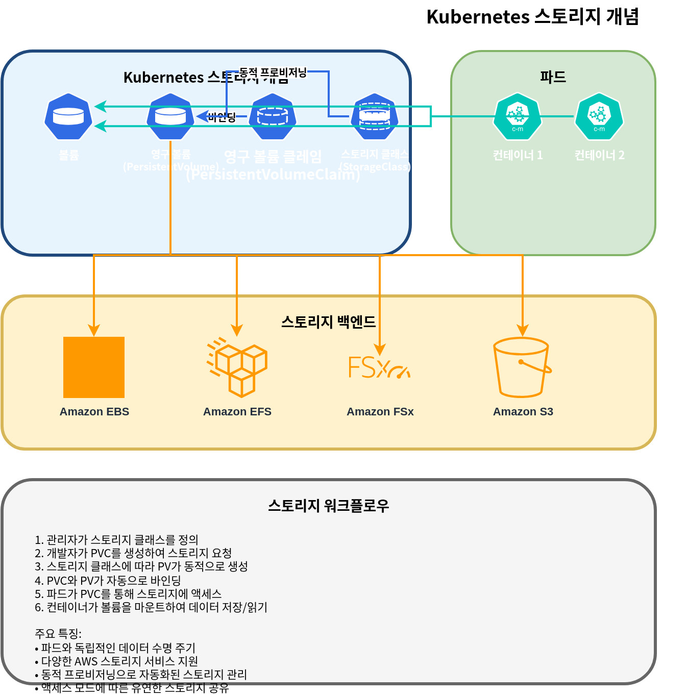
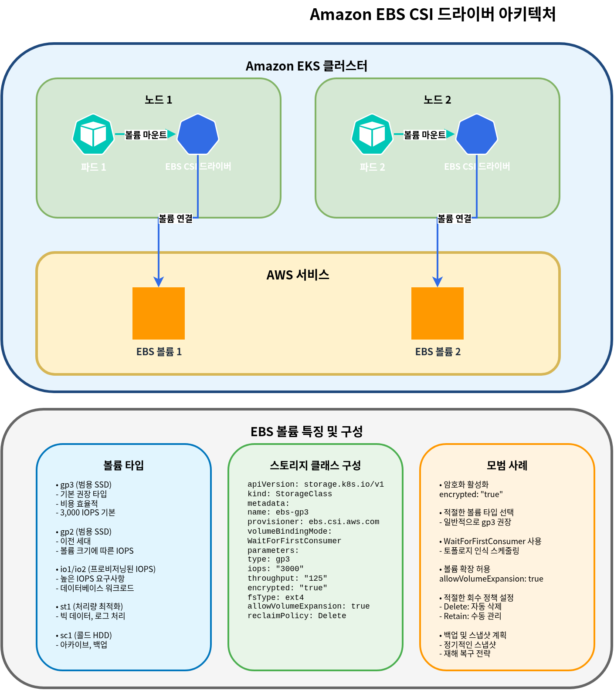

# Amazon EKS Storage - Part 1: Basic Concepts, EBS, EFS

When running applications on Amazon EKS, there are various storage options for storing and managing data. This document covers the basic concepts of EKS storage and how to use Amazon EBS (Elastic Block Store) and Amazon EFS (Elastic File System).

## Table of Contents

1. [Kubernetes Storage Basic Concepts](#kubernetes-storage-basic-concepts)
2. [Amazon EKS Storage Options Overview](#amazon-eks-storage-options-overview)
3. [Storage with Amazon EBS](#storage-with-amazon-ebs)
4. [Storage with Amazon EFS](#storage-with-amazon-efs)
5. [Storage Classes and Dynamic Provisioning](#storage-classes-and-dynamic-provisioning)

## Kubernetes Storage Basic Concepts

Let's first understand the key concepts for managing storage in Kubernetes.



### Volume

A volume is a directory that can be mounted to containers within a pod, and data persists even if the container restarts. The lifetime of a volume is the same as the pod's lifetime, and when the pod is deleted, the volume is also deleted.

### Persistent Volume (PV)

A persistent volume is a piece of cluster storage that is provisioned by an administrator or dynamically provisioned through a storage class. PVs have a lifecycle independent of pods, and PVs persist even when pods are deleted.

### Persistent Volume Claim (PVC)

A persistent volume claim is a user's request for storage. A PVC requests storage with a specific size and access mode, and this request is bound to an appropriate PV.

### StorageClass

A storage class describes the "class" of storage offered by the administrator. Using storage classes allows PVs to be dynamically provisioned when PVCs are created.

### Access Modes

Kubernetes supports the following access modes:

- **ReadWriteOnce (RWO)**: Can be mounted as read/write by a single node
- **ReadOnlyMany (ROX)**: Can be mounted as read-only by many nodes
- **ReadWriteMany (RWX)**: Can be mounted as read/write by many nodes
- **ReadWriteOncePod (RWOP)**: Can be mounted as read/write by only a single pod (Kubernetes 1.22+)

## Amazon EKS Storage Options Overview

In Amazon EKS, you can leverage various AWS storage services to provide storage for containerized applications.


### Main Storage Options

1. **Amazon EBS (Elastic Block Store)**
   - Block storage, mountable to a single node (RWO)
   - High-performance, durable block storage
   - Suitable for databases, stateful applications

2. **Amazon EFS (Elastic File System)**
   - Fully managed NFS file system
   - Can be mounted simultaneously from multiple nodes (RWX)
   - Suitable for workloads requiring shared file systems

3. **Amazon FSx for Lustre**
   - High-performance file system
   - Suitable for machine learning, HPC, big data analytics
   - Can be mounted simultaneously from multiple nodes (RWX)

4. **Amazon S3 (Simple Storage Service)**
   - Object storage
   - Cannot be directly mounted as a volume, but accessible through S3 API
   - Suitable for large-scale data storage

### Storage Options Comparison

| Storage Option | Type | Access Mode | Performance | Use Cases |
|---------------|------|-------------|-------------|-----------|
| Amazon EBS | Block | RWO | High | Databases, stateful applications |
| Amazon EFS | File | RWX | Medium | Shared files, web servers, CMS |
| FSx for Lustre | File | RWX | Very High | HPC, ML training, big data |
| Amazon S3 | Object | API Access | Medium | Backup, archive, static content |

## Storage with Amazon EBS

Amazon EBS provides block-level storage volumes that can be attached to EC2 instances. In EKS, you can mount EBS volumes to Kubernetes pods through the EBS CSI (Container Storage Interface) driver.



### Installing EBS CSI Driver

To use EBS volumes in EKS, you need to install the EBS CSI driver. This driver is provided as an Amazon EKS add-on.

```bash
# Install EBS CSI driver
eksctl create addon --name aws-ebs-csi-driver --cluster my-cluster --version latest

# Or using AWS CLI
aws eks create-addon --cluster-name my-cluster --addon-name aws-ebs-csi-driver --addon-version latest
```

### Creating EBS Storage Class

Create a storage class for dynamic provisioning of EBS volumes. Here we use the gp3 volume type.

```yaml
apiVersion: storage.k8s.io/v1
kind: StorageClass
metadata:
  name: ebs-gp3
provisioner: ebs.csi.aws.com
volumeBindingMode: WaitForFirstConsumer
parameters:
  type: gp3
  encrypted: "true"
  fsType: ext4
```

### Creating Persistent Volume Claim (PVC)

Create a PVC to be used by your application.

```yaml
apiVersion: v1
kind: PersistentVolumeClaim
metadata:
  name: ebs-claim
spec:
  accessModes:
    - ReadWriteOnce
  storageClassName: ebs-gp3
  resources:
    requests:
      storage: 10Gi
```

### Using PVC in a Pod

Mount the created PVC in a pod.

```yaml
apiVersion: v1
kind: Pod
metadata:
  name: app-with-ebs
spec:
  containers:
  - name: app
    image: nginx
    volumeMounts:
    - mountPath: "/data"
      name: ebs-volume
  volumes:
  - name: ebs-volume
    persistentVolumeClaim:
      claimName: ebs-claim
```

### EBS Volume Snapshots

You can create snapshots of EBS volumes to backup data.

```yaml
apiVersion: snapshot.storage.k8s.io/v1
kind: VolumeSnapshot
metadata:
  name: ebs-snapshot
spec:
  volumeSnapshotClassName: csi-aws-vsc
  source:
    persistentVolumeClaimName: ebs-claim
```

### EBS Volume Expansion

You can expand the size of EBS volumes as needed.

```yaml
apiVersion: v1
kind: PersistentVolumeClaim
metadata:
  name: ebs-claim
spec:
  accessModes:
    - ReadWriteOnce
  storageClassName: ebs-gp3
  resources:
    requests:
      storage: 20Gi  # Expanded from 10Gi to 20Gi
```

### EBS Volume Types and Performance

Amazon EBS provides various volume types:

| Volume Type | Description | Use Cases |
|-------------|-------------|-----------|
| gp3 | General Purpose SSD | Suitable for most workloads, cost-effective |
| io2 | Provisioned IOPS SSD | High-performance databases |
| st1 | Throughput Optimized HDD | Big data, log processing |
| sc1 | Cold HDD | Infrequently accessed data |

For EKS, the gp3 volume type is recommended. gp3 is cost-effective while providing consistent performance.

## Storage with Amazon EFS

Amazon EFS is a fully managed NFS file system that can be accessed simultaneously from multiple EC2 instances. In EKS, you can mount EFS file systems to multiple pods simultaneously through the EFS CSI driver.


### Installing EFS CSI Driver

To use EFS in EKS, you need to install the EFS CSI driver.

```bash
# Install EFS CSI driver
eksctl create addon --name aws-efs-csi-driver --cluster my-cluster --version latest

# Or using AWS CLI
aws eks create-addon --cluster-name my-cluster --addon-name aws-efs-csi-driver --addon-version latest
```

### Creating EFS File System

Create an EFS file system using AWS Management Console, AWS CLI, or AWS CloudFormation.

```bash
# Create EFS file system using AWS CLI
aws efs create-file-system \
  --performance-mode generalPurpose \
  --throughput-mode bursting \
  --encrypted \
  --tags Key=Name,Value=MyEFSFileSystem

# Save file system ID
EFS_FS_ID=$(aws efs describe-file-systems --query "FileSystems[?Name=='MyEFSFileSystem'].FileSystemId" --output text)

# Get EKS cluster VPC ID
VPC_ID=$(aws eks describe-cluster --name my-cluster --query "cluster.resourcesVpcConfig.vpcId" --output text)

# Create security group
aws ec2 create-security-group \
  --group-name MyEFSSecurityGroup \
  --description "Security group for EFS mount targets" \
  --vpc-id $VPC_ID

SG_ID=$(aws ec2 describe-security-groups \
  --filters Name=group-name,Values=MyEFSSecurityGroup \
  --query "SecurityGroups[0].GroupId" --output text)

# Allow NFS traffic
aws ec2 authorize-security-group-ingress \
  --group-id $SG_ID \
  --protocol tcp \
  --port 2049 \
  --cidr 10.0.0.0/16

# Get subnet IDs
SUBNET_IDS=$(aws ec2 describe-subnets \
  --filters "Name=vpc-id,Values=$VPC_ID" \
  --query "Subnets[*].SubnetId" --output text)

# Create mount target in each subnet
for SUBNET_ID in $SUBNET_IDS; do
  aws efs create-mount-target \
    --file-system-id $EFS_FS_ID \
    --subnet-id $SUBNET_ID \
    --security-groups $SG_ID
done
```

### Creating EFS Storage Class

Create a storage class for using EFS.

```yaml
apiVersion: storage.k8s.io/v1
kind: StorageClass
metadata:
  name: efs-sc
provisioner: efs.csi.aws.com
parameters:
  provisioningMode: efs-ap
  fileSystemId: fs-0123456789abcdef0  # Created EFS file system ID
  directoryPerms: "700"
```

### Creating Persistent Volume Claim (PVC)

Create a PVC for using EFS.

```yaml
apiVersion: v1
kind: PersistentVolumeClaim
metadata:
  name: efs-claim
spec:
  accessModes:
    - ReadWriteMany  # Can read/write simultaneously from multiple nodes
  storageClassName: efs-sc
  resources:
    requests:
      storage: 5Gi
```

### Using EFS PVC in a Pod

Mount the created PVC in a pod.

```yaml
apiVersion: v1
kind: Pod
metadata:
  name: app-with-efs
spec:
  containers:
  - name: app
    image: nginx
    volumeMounts:
    - mountPath: "/shared-data"
      name: efs-volume
  volumes:
  - name: efs-volume
    persistentVolumeClaim:
      claimName: efs-claim
```

### EFS Access Points

Using EFS access points allows you to restrict access to specific directories and set user and group permissions.

```yaml
apiVersion: v1
kind: PersistentVolume
metadata:
  name: efs-pv
spec:
  capacity:
    storage: 5Gi
  volumeMode: Filesystem
  accessModes:
    - ReadWriteMany
  persistentVolumeReclaimPolicy: Retain
  storageClassName: efs-sc
  csi:
    driver: efs.csi.aws.com
    volumeHandle: fs-0123456789abcdef0::fsap-0123456789abcdef0
    # volumeHandle format: {EFS file system ID}::{EFS access point ID}
```

### EFS Performance Modes and Throughput Modes

Amazon EFS provides two performance modes and three throughput modes:

**Performance Modes**:
- **General Purpose**: Recommended for most workloads
- **Max I/O**: Suitable for workloads requiring high parallel processing

**Throughput Modes**:
- **Bursting**: Default mode, provides burst credits based on file system size
- **Provisioned**: Use when consistent throughput is needed
- **Elastic**: Automatically adjusts throughput based on workload (recommended)

## Storage Classes and Dynamic Provisioning

Using Kubernetes storage classes allows persistent volumes to be dynamically provisioned. In EKS, you can configure storage classes for various AWS storage services.


### Volume Binding Modes

The `volumeBindingMode` field in a storage class determines how PVs are bound when PVCs are created:

- **Immediate**: Provisions and binds PV immediately when PVC is created.
- **WaitForFirstConsumer**: Delays PV provisioning until a pod tries to use the PVC.

For node-local storage like EBS, it is recommended to use `WaitForFirstConsumer`. This ensures the volume is created in the same availability zone as the node where the pod is scheduled.

### Setting Default Storage Class

Setting a specific storage class as default allows that storage class to be used even when the storage class is not specified in the PVC.

```yaml
apiVersion: storage.k8s.io/v1
kind: StorageClass
metadata:
  name: ebs-gp3
  annotations:
    storageclass.kubernetes.io/is-default-class: "true"
provisioner: ebs.csi.aws.com
volumeBindingMode: WaitForFirstConsumer
parameters:
  type: gp3
  encrypted: "true"
```

### Storage Class Examples

**1. EBS gp3 Storage Class**

```yaml
apiVersion: storage.k8s.io/v1
kind: StorageClass
metadata:
  name: ebs-gp3
provisioner: ebs.csi.aws.com
volumeBindingMode: WaitForFirstConsumer
parameters:
  type: gp3
  encrypted: "true"
  iops: "3000"
  throughput: "125"
```

**2. EFS Storage Class**

```yaml
apiVersion: storage.k8s.io/v1
kind: StorageClass
metadata:
  name: efs-sc
provisioner: efs.csi.aws.com
parameters:
  provisioningMode: efs-ap
  fileSystemId: fs-0123456789abcdef0
  directoryPerms: "700"
```

**3. FSx for Lustre Storage Class**

```yaml
apiVersion: storage.k8s.io/v1
kind: StorageClass
metadata:
  name: fsx-lustre
provisioner: fsx.csi.aws.com
parameters:
  subnetId: subnet-0123456789abcdef0
  securityGroupIds: sg-0123456789abcdef0
  deploymentType: SCRATCH_2
  automaticBackupRetentionDays: "0"
  dailyAutomaticBackupStartTime: "00:00"
  perUnitStorageThroughput: "200"
  dataCompressionType: "NONE"
```

### Reclaim Policies

The reclaim policy of a persistent volume determines how the PV and its data are handled when the PVC is deleted:

- **Delete**: When PVC is deleted, the PV and its data are also deleted.
- **Retain**: When PVC is deleted, the PV and data are retained. Administrator must manually clean up.
- **Recycle**: Deprecated policy, use dynamic provisioning and storage classes instead.

You can set the reclaim policy using the `persistentVolumeReclaimPolicy` field in the storage class:

```yaml
apiVersion: storage.k8s.io/v1
kind: StorageClass
metadata:
  name: ebs-gp3-retain
provisioner: ebs.csi.aws.com
volumeBindingMode: WaitForFirstConsumer
reclaimPolicy: Retain
parameters:
  type: gp3
  encrypted: "true"
```

## Conclusion

In Amazon EKS, you can configure storage solutions that meet your application requirements using various storage options. This document covered basic concepts and configuration methods focusing on EBS and EFS. The next document will cover advanced storage configurations using FSx for Lustre and S3.

## Quiz

To test what you've learned in this chapter, try the [topic quiz](../quizzes/eks/04-eks-storage-part1-quiz.md).
