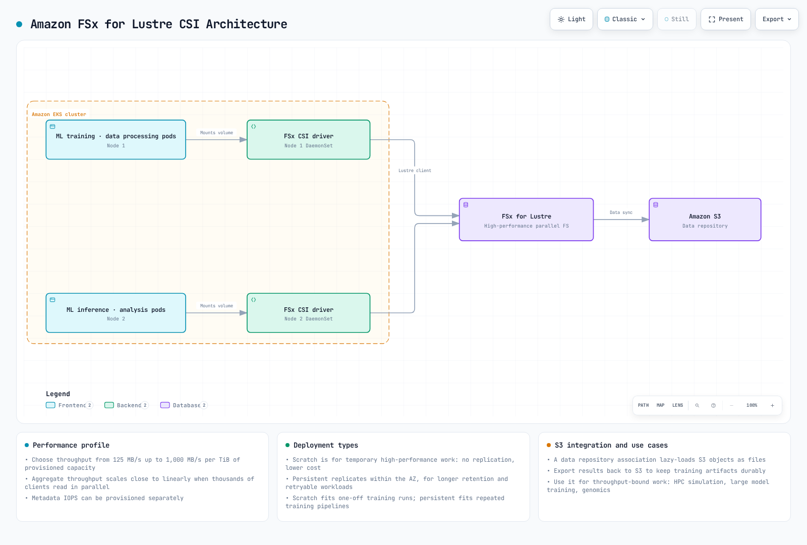
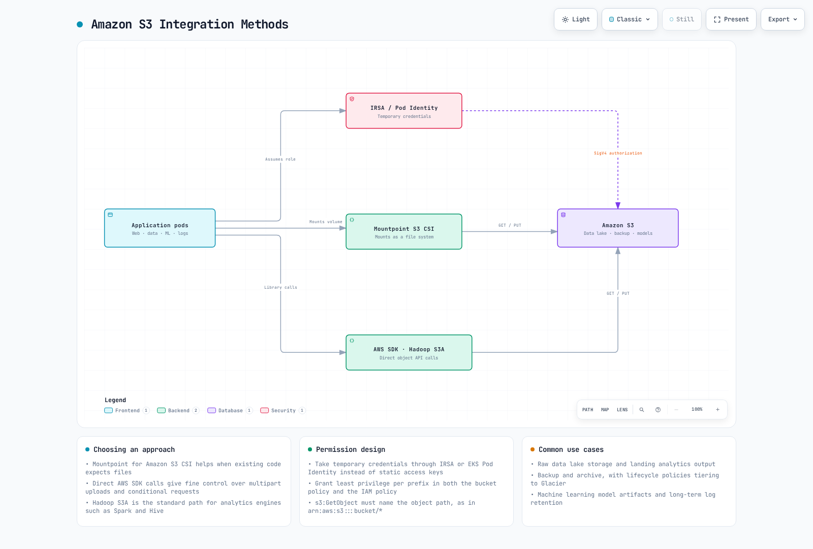
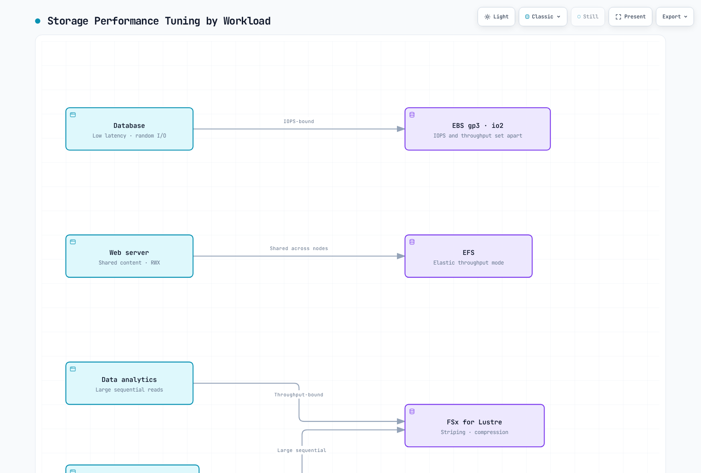

# Part 2: Storage Classes

> **Last Updated**: September 11, 2026

This document is the second part of the Amazon EKS storage series, covering FSx for Lustre, Amazon S3, snapshots, volume expansion, and performance optimization.

## Table of Contents

1. [Amazon FSx for Lustre](04-eks-storage-part2.md#amazon-fsx-for-lustre)
2. [Amazon S3 Storage Integration](04-eks-storage-part2.md#amazon-s3-storage-integration)
3. [Snapshots and Backups](04-eks-storage-part2.md#snapshots-and-backups)
4. [Volume Expansion and Resizing](04-eks-storage-part2.md#volume-expansion-and-resizing)
5. [Volume Cloning](04-eks-storage-part2.md#volume-cloning)
6. [Multi-Attach EBS](04-eks-storage-part2.md#multi-attach-ebs)
7. [Mountpoint for S3 CSI Deep Dive](04-eks-storage-part2.md#mountpoint-for-s3-csi-deep-dive)
8. [Storage Performance Optimization](04-eks-storage-part2.md#storage-performance-optimization)

## Amazon FSx for Lustre

FSx for Lustre is a parallel filesystem for supported HPC/ML/analytics workloads. Performance depends on the deployment/storage type, capacity, provisioned throughput, clients and network; a small example filesystem does not deliver every advertised aggregate maximum.

The diagram illustrates optional S3 data-repository integration. Import/export policies, tasks and permissions must be configured; creating a CSI volume alone does not establish automatic bidirectional synchronization.



[🔍 View interactive diagram](https://www.atomai.click/kubernetes-docs/archmaps/en-eks-04-eks-storage-part2-0.html)

### Installing FSx for Lustre CSI Driver

Use the infrastructure owner’s supported EKS add-on or published Helm release. For the managed add-on example below, set `CSI_ADDON_NAME=aws-fsx-csi-driver`. Prepare a role for `kube-system/fsx-csi-controller-sa` with reviewed FSx driver permissions and Pod Identity trust/agent. IRSA is also supported with an OIDC trust and the corresponding add-on role option. The Pod Identity agent is required for that identity method, not for IRSA. Fargate is not a supported FSx CSI node environment; verify the Linux kernel/Lustre client and actual compute support.

A role created with `eksctl --role-only` is not a Kubernetes ServiceAccount. The managed add-on creates its account; a Helm installation must create or reference the actual account and attach the intended identity. Do not use role-only creation plus `serviceAccount.create=false` without preparing that account.
```bash
set -euo pipefail
: "${CLUSTER_NAME:?Set the existing cluster name}"
: "${AWS_REGION:?Set the cluster Region}"
: "${CSI_ADDON_NAME:?Use aws-fsx-csi-driver}"
case "$CSI_ADDON_NAME" in
  aws-fsx-csi-driver) ;;
  *) echo "Unexpected add-on"; exit 1 ;;
esac
KUBERNETES_VERSION=$(aws eks describe-cluster --region "$AWS_REGION" --name "$CLUSTER_NAME" \
  --query cluster.version --output text)
CLUSTER_ENDPOINT=$(aws eks describe-cluster --region "$AWS_REGION" --name "$CLUSTER_NAME" \
  --query cluster.endpoint --output text)
CURRENT_ENDPOINT=$(kubectl config view --minify -o jsonpath='{.clusters[0].cluster.server}')
test "$CURRENT_ENDPOINT" = "$CLUSTER_ENDPOINT" || { echo "kubeconfig points to another cluster"; exit 1; }
aws eks describe-addon-versions --region "$AWS_REGION" --addon-name "$CSI_ADDON_NAME" \
  --kubernetes-version "$KUBERNETES_VERSION" --output json > csi-addon-versions.json
aws eks list-addons --region "$AWS_REGION" --cluster-name "$CLUSTER_NAME" --output json
```

```bash
set -euo pipefail
: "${CSI_ADDON_VERSION:?Choose a reviewed compatible version from csi-addon-versions.json}"
: "${CSI_ROLE_ARN:?Set the prepared Pod Identity role ARN}"
: "${CLUSTER_NAME:?Run the inspection step first}"
: "${AWS_REGION:?Run the inspection step first}"
: "${CSI_ADDON_NAME:?Run the inspection step first}"
case "$CSI_ADDON_NAME" in
  aws-fsx-csi-driver) CSI_SA=fsx-csi-controller-sa; CSI_PREFIX=fsx-csi ;;
  *) echo "Unexpected add-on"; exit 1 ;;
esac
python3 - "$CSI_ADDON_NAME" "$CSI_ADDON_VERSION" <<'PY'
import json, sys
with open("csi-addon-versions.json") as stream:
    catalog = json.load(stream)
versions = [v["addonVersion"] for a in catalog["addons"]
            if a["addonName"] == sys.argv[1] for v in a["addonVersions"]]
if sys.argv[2] not in versions:
    raise SystemExit("Version not present in the inspected compatible catalog")
PY
aws eks list-addons --region "$AWS_REGION" --cluster-name "$CLUSTER_NAME" \
  --output json > csi-existing-addons.json
python3 - "$CSI_ADDON_NAME" <<'PY'
import json, sys
with open("csi-existing-addons.json") as stream:
    names = json.load(stream)["addons"]
if sys.argv[1] in names:
    raise SystemExit("Existing add-on: use its owner's update procedure")
PY
EXISTING_CSI=$(kubectl -n kube-system get "deployment/$CSI_PREFIX-controller" \
  "daemonset/$CSI_PREFIX-node" --ignore-not-found -o name)
test -z "$EXISTING_CSI" || { echo "Existing CSI installation: review its owner"; exit 1; }
aws eks describe-addon-configuration --region "$AWS_REGION" \
  --addon-name "$CSI_ADDON_NAME" --addon-version "$CSI_ADDON_VERSION"
aws eks create-addon --region "$AWS_REGION" --cluster-name "$CLUSTER_NAME" \
  --addon-name "$CSI_ADDON_NAME" --addon-version "$CSI_ADDON_VERSION" \
  --pod-identity-associations "serviceAccount=$CSI_SA,roleArn=$CSI_ROLE_ARN" \
  --resolve-conflicts NONE
aws eks wait addon-active --region "$AWS_REGION" --cluster-name "$CLUSTER_NAME" \
  --addon-name "$CSI_ADDON_NAME"
```
This workflow stops for existing installations; migrate/update through their owner. Add-on Active is not proof of successful filesystem mounting. The examples below reuse the dedicated `storage-demo` namespace from Part1 and require reviewed cluster-scoped resource names.

### Creating FSx for Lustre File System

**Choose dynamic or static provisioning.** Dynamic provisioning creates a filesystem from the PVC; do not first create another filesystem expecting the dynamic class to adopt it. The following optional manual workflow is for the static path. Select an approved subnet in a supported AZ and a preconfigured Lustre SG with the required client/filesystem traffic rules. Do not choose `Subnets[0]` or assume that TCP988 alone completes every supported design. This bounded example requires the cluster VPC; connected-VPC designs need separate routing/security review. It creates billable resources when run and preserves returned IDs on failure.
```bash
set -euo pipefail
: "${CLUSTER_NAME:?Set the existing cluster}"
: "${AWS_REGION:?Set the filesystem Region}"
: "${FSX_SUBNET_ID:?Select an approved subnet in a supported AZ}"
: "${FSX_SECURITY_GROUP_ID:?Set the reviewed Lustre filesystem SG}"
: "${FSX_CREATION_TOKEN:?Set a unique stable token for this new filesystem}"
FSX_SETUP_DIR=$(mktemp -d -t eks-fsx-setup.XXXXXX)
printf 'Creation records: %s\n' "$FSX_SETUP_DIR"
VPC_ID=$(aws eks describe-cluster --region "$AWS_REGION" --name "$CLUSTER_NAME" \
  --query cluster.resourcesVpcConfig.vpcId --output text)
aws ec2 describe-subnets --region "$AWS_REGION" --subnet-ids "$FSX_SUBNET_ID" \
  --output json > "$FSX_SETUP_DIR/subnet.json"
aws ec2 describe-security-groups --region "$AWS_REGION" --group-ids "$FSX_SECURITY_GROUP_ID" \
  --output json > "$FSX_SETUP_DIR/sg.json"
python3 - "$FSX_SETUP_DIR" "$VPC_ID" <<'PY'
import pathlib, json, sys
root, vpc = pathlib.Path(sys.argv[1]), sys.argv[2]
subnets = json.loads((root / "subnet.json").read_text())["Subnets"]
groups = json.loads((root / "sg.json").read_text())["SecurityGroups"]
if len(subnets) != 1 or len(groups) != 1 or subnets[0]["VpcId"] != vpc or groups[0]["VpcId"] != vpc:
    raise SystemExit("This example requires one subnet and SG in the cluster VPC")
PY
aws fsx create-file-system --region "$AWS_REGION" --file-system-type LUSTRE \
  --client-request-token "$FSX_CREATION_TOKEN" --storage-capacity 1200 --storage-type SSD \
  --subnet-ids "$FSX_SUBNET_ID" --security-group-ids "$FSX_SECURITY_GROUP_ID" \
  --lustre-configuration DeploymentType=SCRATCH_2,DataCompressionType=NONE \
  --tags Key=Name,Value=eks-lustre-demo --output json > "$FSX_SETUP_DIR/created.json"
FSX_FILE_SYSTEM_ID=$(python3 - "$FSX_SETUP_DIR/created.json" <<'PY'
import json, sys
with open(sys.argv[1]) as stream:
    print(json.load(stream)["FileSystem"]["FileSystemId"])
PY
)
FSX_READY=false
for ((attempt=0; attempt<60; attempt++)); do
  STATE=$(aws fsx describe-file-systems --region "$AWS_REGION" --file-system-ids "$FSX_FILE_SYSTEM_ID" \
    --query 'FileSystems[0].Lifecycle' --output text)
  case "$STATE" in
    AVAILABLE) FSX_READY=true; break ;;
    CREATING) sleep 10 ;;
    *) echo "Unexpected filesystem state: $STATE"; exit 1 ;;
  esac
done
test "$FSX_READY" = true || { echo "Filesystem creation still pending; inspect recorded ID"; exit 1; }
aws fsx describe-file-systems --region "$AWS_REGION" --file-system-ids "$FSX_FILE_SYSTEM_ID" \
  --query 'FileSystems[0].{Id:FileSystemId,State:Lifecycle,DNS:DNSName,MountName:LustreConfiguration.MountName,CapacityGiB:StorageCapacity}' \
  --output json > "$FSX_SETUP_DIR/available.json"
cat "$FSX_SETUP_DIR/available.json"
```


### Creating FSx for Lustre Storage Class

For the **dynamic** path, provide the real subnet and security group in the class. Capacity comes from the PVC request, not an ignored `storageCapacity` class parameter. SCRATCH_2 must not be combined with persistent-only per-unit throughput/backup settings. The returned mount name belongs in a static PV’s volumeAttributes, not a `mountName` class parameter.
```yaml
apiVersion: storage.k8s.io/v1
kind: StorageClass
metadata:
  name: fsx-lustre-sc
provisioner: fsx.csi.aws.com
reclaimPolicy: Retain
parameters:
  subnetId: subnet-0123456789abcdef0
  securityGroupIds: sg-0123456789abcdef0
  deploymentType: SCRATCH_2
  dataCompressionType: NONE
```


### Creating PVC and Mounting to Pod

This read-only consumer verifies only that the mount is accessible. It is not a GPU workload or throughput benchmark; a CUDA image is unnecessary for this check. Prepare filesystem permissions for UID/GID1000 and the actual client network path.
```yaml
apiVersion: v1
kind: PersistentVolumeClaim
metadata:
  name: fsx-claim
  namespace: storage-demo
spec:
  accessModes:
  - ReadWriteMany
  storageClassName: fsx-lustre-sc
  resources:
    requests:
      storage: 1200Gi
```

```yaml
apiVersion: v1
kind: Pod
metadata:
  name: app-with-fsx
  namespace: storage-demo
spec:
  automountServiceAccountToken: false
  securityContext:
    runAsNonRoot: true
    runAsUser: 1000
    runAsGroup: 1000
    fsGroup: 1000
    seccompProfile:
      type: RuntimeDefault
  containers:
  - name: app
    image: busybox:1.37.0
    command:
    - sh
    - -c
    args:
    - test -r /data && sleep 3600
    securityContext:
      allowPrivilegeEscalation: false
      readOnlyRootFilesystem: true
      capabilities:
        drop:
        - ALL
    resources:
      requests:
        cpu: 10m
        memory: 16Mi
      limits:
        cpu: 100m
        memory: 64Mi
    volumeMounts:
    - name: data
      mountPath: /data
      readOnly: true
  volumes:
  - name: data
    persistentVolumeClaim:
      claimName: fsx-claim
```


### Static Provisioning for FSx for Lustre Mount

Use the existing filesystem’s actual ID, DNSName, MountName and capacity. This is an alternative to the dynamic PVC. Replace the placeholders below from the lookup, then bind the reserved static PV/PVC; `storageClassName: ""` prevents default dynamic provisioning. A consumer must use `fsx-static-claim`.
```bash
set -euo pipefail
: "${AWS_REGION:?Set the filesystem Region}"
: "${FSX_FILE_SYSTEM_ID:?Set the owned existing filesystem ID}"
aws fsx describe-file-systems --region "$AWS_REGION" --file-system-ids "$FSX_FILE_SYSTEM_ID" \
  --query 'FileSystems[0].{Id:FileSystemId,State:Lifecycle,DNS:DNSName,MountName:LustreConfiguration.MountName,CapacityGiB:StorageCapacity}' \
  --output json
```

```yaml
apiVersion: v1
kind: PersistentVolume
metadata:
  name: fsx-lustre-static
spec:
  capacity:
    storage: 1200Gi
  volumeMode: Filesystem
  accessModes:
  - ReadWriteMany
  persistentVolumeReclaimPolicy: Retain
  storageClassName: ''
  claimRef:
    namespace: storage-demo
    name: fsx-static-claim
  csi:
    driver: fsx.csi.aws.com
    volumeHandle: fs-0123456789abcdef0
    volumeAttributes:
      dnsname: replace-with-filesystem-dns.example.internal
      mountname: replace-with-mountname
---
apiVersion: v1
kind: PersistentVolumeClaim
metadata:
  name: fsx-static-claim
  namespace: storage-demo
spec:
  accessModes:
  - ReadWriteMany
  storageClassName: ''
  volumeName: fsx-lustre-static
  resources:
    requests:
      storage: 1200Gi
```


### FSx for Lustre Deployment Types

- **SCRATCH_1/SCRATCH_2** are for temporary, reproducible data. Scratch does not provide persistent deployment replication/recovery simply because it is mounted as a PV; SCRATCH_2 adds different burst/performance and encryption characteristics.
- **PERSISTENT_1/PERSISTENT_2** provide persistent deployment choices with different storage/throughput/latency capabilities. PERSISTENT_2 is not available in every Region/AZ configuration.
- Match throughput fields to the selected deployment/storage type. PERSISTENT_2 SSD supports125/250/500/1000MB/s/TiB choices; other deployment/storage combinations differ. Retain is a Kubernetes lifecycle policy, not a data-durability upgrade for scratch storage.

### FSx for Lustre Configuration for vLLM

vLLM is an LLM inference/serving project, not “Vector Language Model”. The following is an illustrative model-file storage allocation, not an optimized or measured vLLM deployment. Model loading also depends on file format, CPU deserialization, cache state and GPU initialization. Compression can add overhead for already compressed data; measure it.
```yaml
apiVersion: storage.k8s.io/v1
kind: StorageClass
metadata:
  name: fsx-lustre-vllm
provisioner: fsx.csi.aws.com
reclaimPolicy: Retain
parameters:
  subnetId: subnet-0123456789abcdef0
  securityGroupIds: sg-0123456789abcdef0
  deploymentType: PERSISTENT_2
  dataCompressionType: LZ4
  perUnitStorageThroughput: '1000'
---
apiVersion: v1
kind: PersistentVolumeClaim
metadata:
  name: vllm-models
  namespace: storage-demo
spec:
  accessModes:
  - ReadWriteMany
  storageClassName: fsx-lustre-vllm
  resources:
    requests:
      storage: 4800Gi
```

## Amazon S3 Storage Integration

S3 is object storage. Applications can use its API directly, Hadoop can use S3A, and Mountpoint CSI can expose an existing bucket through a filesystem interface with documented limits. These paths are not interchangeable POSIX filesystems. S3 Files, covered in Part1, is another integration with its own EFS CSI requirements.



[🔍 View interactive diagram](https://www.atomai.click/kubernetes-docs/archmaps/en-eks-04-eks-storage-part2-1.html)

### Pod Identity or IRSA for S3 Access

Reuse the dedicated `storage-demo` namespace from Part1. Prepare an existing bucket, Region and an IAM role scoped to the intended bucket/prefix. This example policy permits listing one bucket and reading only `training/`; it grants no writes. SSE-KMS objects also require the appropriate key policy and scoped KMS decrypt permission. Bucket policies, endpoints and cross-account trust can impose additional restrictions.

```json
{
  "Version": "2012-10-17",
  "Statement": [
    {
      "Sid": "ListOneBucket",
      "Effect": "Allow",
      "Action": [
        "s3:ListBucket"
      ],
      "Resource": "arn:aws:s3:::replace-with-owned-data-bucket"
    },
    {
      "Sid": "ReadTrainingPrefix",
      "Effect": "Allow",
      "Action": [
        "s3:GetObject"
      ],
      "Resource": "arn:aws:s3:::replace-with-owned-data-bucket/training/*"
    }
  ]
}
```

The ServiceAccount below illustrates **IRSA**: replace the example ARN with the prepared role whose OIDC trust permits only this cluster, `system:serviceaccount:storage-demo:s3-access-sa`, and the STS audience. The annotation alone does not create that role/trust. For **EKS Pod Identity**, omit the IRSA annotation and create the reviewed association for this same application account with a supported agent; do not configure both as an accidental fallback. No static AWS keys belong in the manifest.

```yaml
apiVersion: v1
kind: ServiceAccount
metadata:
  name: s3-access-sa
  namespace: storage-demo
  annotations:
    eks.amazonaws.com/role-arn: arn:aws:iam::111122223333:role/storage-demo-s3-reader
```

### Pod Configuration for S3 Access

This bounded, read-only listing Job uses the official AWS CLI image and the prepared account. Replace the bucket/Region before use. Its private writable directories support an unprivileged CLI process; an exit status alone is not proof that the application can read every intended object. Check the Job/logs and a representative authorized object separately.

```yaml
apiVersion: batch/v1
kind: Job
metadata:
  name: s3-read-check
  namespace: storage-demo
spec:
  backoffLimit: 0
  activeDeadlineSeconds: 120
  template:
    spec:
      serviceAccountName: s3-access-sa
      restartPolicy: Never
      securityContext:
        runAsNonRoot: true
        runAsUser: 1000
        runAsGroup: 1000
        fsGroup: 1000
        seccompProfile:
          type: RuntimeDefault
      containers:
      - name: reader
        image: public.ecr.aws/aws-cli/aws-cli:2.36.43
        command:
        - aws
        args:
        - s3api
        - list-objects-v2
        - --bucket
        - replace-with-owned-data-bucket
        - --prefix
        - training/
        - --max-items
        - '5'
        env:
        - name: AWS_REGION
          value: us-west-2
        - name: AWS_EC2_METADATA_DISABLED
          value: 'true'
        securityContext:
          allowPrivilegeEscalation: false
          readOnlyRootFilesystem: true
          capabilities:
            drop:
            - ALL
        resources:
          requests:
            cpu: 100m
            memory: 128Mi
          limits:
            cpu: 500m
            memory: 256Mi
        volumeMounts:
        - name: private-home
          mountPath: /root
        - name: tmp
          mountPath: /tmp
      volumes:
      - name: private-home
        emptyDir: {}
      - name: tmp
        emptyDir: {}
```

### Hadoop S3A Access

S3A is Hadoop’s `s3a://` filesystem implementation, not a Kubernetes volume mount. Hadoop3.5.0 uses AWS SDK for Java v2. Build and review an image containing matching `hadoop-common`/`hadoop-aws` versions and their compatible shaded SDK bundle; the placeholder below is not a published ready-to-run image. Its contract includes `hadoop` on PATH, `/opt/hadoop/etc/hadoop`, and UID1000 support. Merge `hadoop-aws` with any other required optional tools. The v2 default credentials provider supports the selected workload identity when the bundled SDK supports it; do not reuse a v1 `com.amazonaws` provider class.

```yaml
apiVersion: v1
kind: ConfigMap
metadata:
  name: hadoop-s3a-config
  namespace: storage-demo
data:
  core-site.xml: |
    <?xml version="1.0" encoding="UTF-8"?>
    <configuration>
      <property>
        <name>fs.s3a.aws.credentials.provider</name>
        <value>software.amazon.awssdk.auth.credentials.DefaultCredentialsProvider</value>
      </property>
      <property>
        <name>fs.s3a.endpoint.region</name>
        <value>us-west-2</value>
      </property>
    </configuration>
---
apiVersion: batch/v1
kind: Job
metadata:
  name: hadoop-s3a-read-check
  namespace: storage-demo
spec:
  backoffLimit: 0
  activeDeadlineSeconds: 120
  template:
    spec:
      serviceAccountName: s3-access-sa
      restartPolicy: Never
      securityContext:
        runAsNonRoot: true
        runAsUser: 1000
        runAsGroup: 1000
        fsGroup: 1000
        seccompProfile:
          type: RuntimeDefault
      containers:
      - name: hadoop
        image: registry.example.com/reviewed-hadoop-s3a:3.5.0
        command:
        - hadoop
        args:
        - fs
        - -ls
        - s3a://replace-with-owned-data-bucket/training/
        env:
        - name: AWS_REGION
          value: us-west-2
        - name: AWS_EC2_METADATA_DISABLED
          value: 'true'
        - name: HADOOP_CONF_DIR
          value: /opt/hadoop/etc/hadoop
        - name: HADOOP_OPTIONAL_TOOLS
          value: hadoop-aws
        securityContext:
          allowPrivilegeEscalation: false
          readOnlyRootFilesystem: true
          capabilities:
            drop:
            - ALL
        resources:
          requests:
            cpu: 100m
            memory: 128Mi
          limits:
            cpu: 500m
            memory: 256Mi
        volumeMounts:
        - name: tmp
          mountPath: /tmp
        - name: hadoop-config
          mountPath: /opt/hadoop/etc/hadoop/core-site.xml
          subPath: core-site.xml
          readOnly: true
      volumes:
      - name: tmp
        emptyDir: {}
      - name: hadoop-config
        configMap:
          name: hadoop-s3a-config
```

Mounting one ConfigMap key with subPath preserves the image’s other Hadoop configuration files. A subPath mount does not receive live ConfigMap updates; recreate the Job after configuration changes.

### Mounting an Existing Bucket with Mountpoint CSI

The reviewed upstream pair is CSI2.8.0 with bundled Mountpoint1.23.0. Standalone Mountpoint1.24.0 does not automatically change the CSI image. Check the actual EKS add-on version and compute compatibility: this upstream CSI release requires Kubernetes1.31+ and no longer supports AL2/Ubuntu22.04. Prefer the existing infrastructure owner; do not install Helm over a managed add-on or an existing driver.

For a separately owned Helm installation, render the **published chart** for review first; use the actual cluster version in `--kube-version`. A Git checkout’s chart is not the supported distribution and its publication guard must not be bypassed. Review privileged node components, CRD ownership and the `mount-s3` namespace before deploying through the chosen owner:

```bash
set -euo pipefail
helm repo add aws-mountpoint-s3-csi-driver https://awslabs.github.io/mountpoint-s3-csi-driver
helm repo update aws-mountpoint-s3-csi-driver
helm template aws-mountpoint-s3-csi-driver \
  aws-mountpoint-s3-csi-driver/aws-mountpoint-s3-csi-driver \
  --version 2.8.0 --namespace kube-system --kube-version 1.36.0 --include-crds \
  > s3-driver-review.yaml
```

The published chart creates `s3-csi-driver-sa` and `s3-csi-driver-controller-sa` by default. The following PV explicitly selects **pod-level credentials** from `s3-access-sa`; driver-level credentials are ignored for this volume. Both IRSA and EKS Pod Identity are supported here. Readiness requires the actual driver/identity installation, not just successful Helm rendering.

Mountpoint CSI uses **static provisioning** of an existing bucket, not the dynamic StorageClass shown in older examples. Keep both storageClassName fields empty and use explicit PV/PVC prebinding plus a cluster-unique volumeHandle. The capacity fields satisfy Kubernetes binding metadata; they do not create or limit S3 bucket capacity. Replace the bucket, prefix and Region together. Read-only mount and IAM permissions provide separate controls:

```yaml
apiVersion: v1
kind: PersistentVolume
metadata:
  name: s3-training-pv
spec:
  capacity:
    storage: 1Ti
  volumeMode: Filesystem
  accessModes:
  - ReadOnlyMany
  persistentVolumeReclaimPolicy: Retain
  storageClassName: ''
  claimRef:
    namespace: storage-demo
    name: training-data
  mountOptions:
  - read-only
  - region us-west-2
  - prefix training/
  - allow-other
  - uid 1000
  - gid 1000
  - dir-mode 0750
  - file-mode 0440
  csi:
    driver: s3.csi.aws.com
    volumeHandle: storage-demo-s3-training-v1
    volumeAttributes:
      bucketName: replace-with-owned-data-bucket
      authenticationSource: pod
      stsRegion: us-west-2
---
apiVersion: v1
kind: PersistentVolumeClaim
metadata:
  name: training-data
  namespace: storage-demo
spec:
  accessModes:
  - ReadOnlyMany
  storageClassName: ''
  volumeName: s3-training-pv
  resources:
    requests:
      storage: 1Ti
```


```yaml
apiVersion: v1
kind: Pod
metadata:
  name: app-with-s3
  namespace: storage-demo
spec:
  serviceAccountName: s3-access-sa
  securityContext:
    runAsNonRoot: true
    runAsUser: 1000
    runAsGroup: 1000
    seccompProfile:
      type: RuntimeDefault
  containers:
  - name: reader
    image: busybox:1.37.0
    command:
    - sh
    - -c
    args:
    - ls -la /data && sleep 3600
    securityContext:
      allowPrivilegeEscalation: false
      readOnlyRootFilesystem: true
      capabilities:
        drop:
        - ALL
    resources:
      requests:
        cpu: 10m
        memory: 16Mi
      limits:
        cpu: 100m
        memory: 64Mi
    volumeMounts:
    - name: data
      mountPath: /data
      readOnly: true
  volumes:
  - name: data
    persistentVolumeClaim:
      claimName: training-data
      readOnly: true
```

The mount options map filesystem ownership to UID/GID1000; they do not change S3 object ownership. `allow-other` permits that application UID to reach a mount created by the driver. Application containers need no AWS CLI or FUSE privilege for this mounted read path.

### S3 Use Cases

Data lakes, model repositories, archives, static assets and audit objects can use S3. Choose API access when the application needs object versions, conditional requests or capabilities outside Mountpoint’s filesystem contract. A writable database directory that requires random updates and POSIX locks needs a different storage design.

## Snapshots and Backups

CSI snapshots require support from the specific driver/backend; a PVC alone does not imply snapshot support. The following EBS example captures a block-volume point in time. Quiesce/flush applications or use database-aware backup/WAL archiving when required. A successful snapshot is not proof of application consistency or database point-in-time recovery.


[🔍 View interactive diagram](https://www.atomai.click/kubernetes-docs/archmaps/en-eks-04-eks-storage-part2-2.html)

### Preparing the Snapshot Controller

Inspect the existing snapshot CRDs, controller owner and CSI snapshotter first. Use the compatible EKS add-on or a reviewed pinned external-snapshotter release; do not apply floating master CRDs over an existing installation. External-snapshotter8.6.0 is a reviewed upstream reference, not an automatic upgrade target for every add-on. Part1’s driver and namespace prerequisites also apply.

```bash
set -euo pipefail
kubectl get crd volumesnapshots.snapshot.storage.k8s.io \
  volumesnapshotcontents.snapshot.storage.k8s.io volumesnapshotclasses.snapshot.storage.k8s.io
kubectl -n storage-demo get pvc ebs-claim -o yaml
```

### Creating the Class and Snapshot

The class driver must match the PV driver. This manually managed class uses Retain; removal of its Kubernetes snapshot does not automatically remove the retained EBS snapshot. Track ownership and cost, and do not confuse this policy with the Velero lifecycle below. Empty snapshotter-secret parameters are unnecessary for this EBS example.

```yaml
apiVersion: snapshot.storage.k8s.io/v1
kind: VolumeSnapshotClass
metadata:
  name: ebs-snapshot-class
driver: ebs.csi.aws.com
deletionPolicy: Retain
```


```yaml
apiVersion: snapshot.storage.k8s.io/v1
kind: VolumeSnapshot
metadata:
  name: ebs-part2-snapshot
  namespace: storage-demo
  labels:
    storage-demo: ebs
spec:
  volumeSnapshotClassName: ebs-snapshot-class
  source:
    persistentVolumeClaimName: ebs-claim
```


```bash
set -euo pipefail
kubectl -n storage-demo wait --for=jsonpath='{.status.readyToUse}'=true \
  volumesnapshot/ebs-part2-snapshot --timeout=300s
kubectl -n storage-demo get volumesnapshot ebs-part2-snapshot -o yaml
```

### Restoring into a New PVC

After `readyToUse=true`, inspect restoreSize and the bound content/driver. Use a separate name in the same namespace with capacity at least restoreSize. This20Gi example assumes the snapshot is no larger. Keep the live claim untouched; WaitForFirstConsumer can leave the candidate Pending until a compatible consumer is scheduled. Validate restored data with an isolated, compatible application before a controlled cutover.

```yaml
apiVersion: v1
kind: PersistentVolumeClaim
metadata:
  name: ebs-part2-restored
  namespace: storage-demo
spec:
  accessModes:
  - ReadWriteOnce
  storageClassName: ebs-gp3
  resources:
    requests:
      storage: 20Gi
  dataSource:
    name: ebs-part2-snapshot
    kind: VolumeSnapshot
    apiGroup: snapshot.storage.k8s.io
```

### Scheduling Backups with Velero

The reviewed pair is Velero1.18.2 with AWS plugin1.14.2. Verify the CLI release checksum and plugin compatibility before installation. CSI support is integrated into Velero, but `EnableCSI` is still required for this path; do not add the old separate CSI plugin. Prepare a private backup bucket/prefix, network access, scoped IAM/KMS permissions and an IRSA role for `velero/velero`. The following renders a new-install manifest for review without creating resources:

```bash
set -euo pipefail
: "${BACKUP_BUCKET:?Set the existing private backup bucket}"
: "${VELERO_ROLE_ARN:?Set the reviewed IRSA role for system:serviceaccount:velero:velero}"
: "${AWS_REGION:?Set the bucket/snapshot Region for this example}"
velero install --provider aws \
  --plugins velero/velero-plugin-for-aws:v1.14.2 \
  --bucket "$BACKUP_BUCKET" --prefix eks-storage-demo \
  --backup-location-config "region=$AWS_REGION" \
  --snapshot-location-config "region=$AWS_REGION" \
  --features EnableCSI --no-secret \
  --sa-annotations "eks.amazonaws.com/role-arn=$VELERO_ROLE_ARN" \
  --dry-run -o yaml > velero-review.yaml
```

Use an actual valid kubeconfig even for this CLI dry-run; rendering is not an authorization or backup test. Do not overwrite an existing Velero/CRD installation. The default ServiceAccount is created with the IRSA annotation; using `--service-account-name` instead selects an already existing account and ignores `--sa-annotations`. Pod Identity is an alternative with its own association/agent setup. No static credential file is needed.

For CSI class selection, label only one default class per driver, or select a class using the supported backup/schedule annotation. Review the following class together with existing classes:

```yaml
apiVersion: snapshot.storage.k8s.io/v1
kind: VolumeSnapshotClass
metadata:
  name: ebs-velero-snapshots
  labels:
    velero.io/csi-volumesnapshot-class: 'true'
driver: ebs.csi.aws.com
deletionPolicy: Retain
```

**Velero owns the lifecycle of its CSI backup snapshots.** When the backup expires or is deleted, Velero changes the VolumeSnapshotContent deletion policy to Delete and removes the snapshot even if the original class used Retain. Set backup TTL and any independent retention/archive procedure deliberately. A Velero backup in S3 does not necessarily contain all volume bytes: CSI snapshots, filesystem backup and data movers are different paths. FSx CSI1.10.0, for example, does not implement CSI snapshots; use a supported FSx/application backup strategy.

```bash
set -euo pipefail
velero schedule create storage-demo-daily --schedule="0 1 * * *" \
  --include-namespaces=storage-demo --ttl=168h0m0s -o yaml > velero-schedule-review.yaml
```

The schedule command also emits YAML only. Deploy the reviewed schedule through its owner, then inspect actual Backup phase, errors, snapshot/data-mover completion and restore tests. Scheduled snapshots do not by themselves provide arbitrary database PITR.

For recovery, choose an actual verified backup rather than a hard-coded historical timestamp. Even with `-o yaml`, this command performs API discovery and reads the selected Backup, so it requires read access to the intended cluster. This manifest preview limits the requested resource types and maps the namespace; inspect dependencies and plugin restore actions before submission. Confirm the destination namespace is isolated, names do not conflict, and storage class/CSI driver/KMS/AZ mappings are valid. It is not a complete production recovery runbook:

```bash
set -euo pipefail
: "${VERIFIED_BACKUP:?Choose an actual completed backup after checking its contents/errors}"
velero restore create storage-demo-recovery-review --from-backup "$VERIFIED_BACKUP" \
  --namespace-mappings storage-demo:storage-recovery \
  --include-namespaces storage-demo \
  --include-resources persistentvolumes,persistentvolumeclaims,volumesnapshots.snapshot.storage.k8s.io,volumesnapshotcontents.snapshot.storage.k8s.io \
  --restore-volumes=true -o yaml > velero-restore-review.yaml
```

Start restored workloads only after the candidate data passes application checks, and keep a rollback path. Cross-cluster CSI restore requires a matching driver name and accessible snapshots/keys; namespace mapping alone does not make cloud resources portable.

## Volume Expansion and Resizing


[🔍 View interactive diagram](https://www.atomai.click/kubernetes-docs/archmaps/en-eks-04-eks-storage-part2-3.html)

Use a class with `allowVolumeExpansion: true` and a supporting CSI driver/filesystem. Keep the bound claim’s existing storageClassName; it is not a resize switch. This example reuses Part1’s `ebs-gp3` and increases only the claim request. Check current request/capacity first so an already larger claim is not shrunk.
```yaml
apiVersion: storage.k8s.io/v1
kind: StorageClass
metadata:
  name: ebs-gp3
provisioner: ebs.csi.aws.com
volumeBindingMode: WaitForFirstConsumer
reclaimPolicy: Retain
allowVolumeExpansion: true
parameters:
  type: gp3
  encrypted: 'true'
  csi.storage.k8s.io/fstype: ext4
```

```bash
set -euo pipefail
kubectl -n storage-demo get pvc ebs-claim -o yaml
kubectl -n storage-demo patch pvc ebs-claim --type merge \
  -p '{"spec":{"resources":{"requests":{"storage":"20Gi"}}}}'
kubectl -n storage-demo describe pvc ebs-claim
```
CSI handles backend and filesystem expansion where supported. Inspect PVC conditions, controller/node logs and mounted capacity. Follow the driver’s documented remount/restart path if needed; do not run `resize2fs` against a guessed `/dev/xvdf` inside an application container. Never edit PV capacity to bypass resizing. Plan quota/cost caps and avoid repeated automated growth while a prior resize is pending.

## Volume Cloning

Current EBS CSI supports PVC cloning through `dataSource` and the CSI clone capability; EBS CSI1.66.0 uses native EBS volume copy (`CopyVolumes`), not an assumed hidden snapshot. Check the deployed driver/add-on support before using it. The target is independent, but availability and fully initialized performance are different states.


For the ordinary PVC dataSource workflow, use a bound source in the same namespace, compatible volume mode/driver, and a request at least as large as the source. Set storageClassName explicitly; omission uses default-class rules rather than automatically inheriting the source. Native EBS copies stay in the source AZ. They are crash-consistent unless the application is quiesced/flushed appropriately. Only one copy from a source can initialize at a time, and account/Region quotas apply.

This dedicated training source avoids launching an unverified database clone in a production namespace. Replace the example AZ in **both** writer and reader with an actual supported AZ. The seed Job consumes the source PVC, creates one marker without overwriting an existing marker, then exits:
```yaml
apiVersion: v1
kind: PersistentVolumeClaim
metadata:
  name: ebs-clone-source
  namespace: storage-demo
spec:
  accessModes:
  - ReadWriteOnce
  storageClassName: ebs-gp3
  resources:
    requests:
      storage: 10Gi
---
apiVersion: batch/v1
kind: Job
metadata:
  name: ebs-clone-seed
  namespace: storage-demo
spec:
  backoffLimit: 0
  template:
    metadata:
      labels:
        app: ebs-clone-seed
    spec:
      restartPolicy: Never
      automountServiceAccountToken: false
      nodeSelector:
        topology.kubernetes.io/zone: us-west-2a
      securityContext:
        runAsNonRoot: true
        runAsUser: 1000
        runAsGroup: 1000
        fsGroup: 1000
        seccompProfile:
          type: RuntimeDefault
      containers:
      - name: writer
        image: busybox:1.37.0
        command:
        - sh
        - -c
        args:
        - |
          set -eu
          (set -C; printf 'clone-demo\n' > /data/seed.txt)
          sync
        securityContext:
          allowPrivilegeEscalation: false
          readOnlyRootFilesystem: true
          capabilities:
            drop:
            - ALL
        resources:
          requests:
            cpu: 10m
            memory: 16Mi
          limits:
            cpu: 100m
            memory: 64Mi
        volumeMounts:
        - name: data
          mountPath: /data
      volumes:
      - name: data
        persistentVolumeClaim:
          claimName: ebs-clone-source
```

```bash
kubectl -n storage-demo wait --for=condition=complete job/ebs-clone-seed --timeout=300s
kubectl -n storage-demo get pvc ebs-clone-source -o yaml
```
Create the separate clone and its read-only consumer after the seed Job completes. The marker check demonstrates what to validate; this review did not execute a cloud copy. Copying a database does not reset existing database passwords, and the target must use a compatible database version if later started as a database.
```yaml
apiVersion: v1
kind: PersistentVolumeClaim
metadata:
  name: ebs-clone
  namespace: storage-demo
spec:
  accessModes:
  - ReadWriteOnce
  storageClassName: ebs-gp3
  resources:
    requests:
      storage: 10Gi
  dataSource:
    kind: PersistentVolumeClaim
    name: ebs-clone-source
---
apiVersion: v1
kind: Pod
metadata:
  name: app-with-clone
  namespace: storage-demo
spec:
  automountServiceAccountToken: false
  securityContext:
    runAsNonRoot: true
    runAsUser: 1000
    runAsGroup: 1000
    fsGroup: 1000
    seccompProfile:
      type: RuntimeDefault
  containers:
  - name: app
    image: busybox:1.37.0
    command:
    - sh
    - -c
    args:
    - test "$(cat /data/seed.txt)" = clone-demo && sleep 3600
    securityContext:
      allowPrivilegeEscalation: false
      readOnlyRootFilesystem: true
      capabilities:
        drop:
        - ALL
    resources:
      requests:
        cpu: 10m
        memory: 16Mi
      limits:
        cpu: 100m
        memory: 64Mi
    volumeMounts:
    - name: data
      mountPath: /data
      readOnly: true
  volumes:
  - name: data
    persistentVolumeClaim:
      claimName: ebs-clone
  nodeSelector:
    topology.kubernetes.io/zone: us-west-2a
```
| Property | PVC/native volume copy | Snapshot restore |
|---|---|---|
| Source | Existing volume/PVC | Retained point-in-time snapshot |
| Readiness | Available before background initialization finishes | Depends on snapshot/restore and initialization state |
| Placement | Native EBS copy remains in source AZ | A new restored volume can target another permitted AZ |
| Consistency | Application quiescing may be required | Application-aware backup may be required |
| Namespace | Ordinary PVC dataSource is same-namespace | Snapshot objects are namespaced; cross-namespace/cluster import needs an explicit supported workflow |
| Cost/retention | Copy operation and new volume charges; independent lifecycle | Snapshot storage plus restored-volume charges; separate deletion policies |

Do not infer speed, storage overhead or RPO from “one step” versus “two steps”. Native volume copies do not support fast snapshot restore or provisioned initialization rates; use the actual copy initialization guidance.

## Multi-Attach EBS

The EC2 service supports Multi-Attach for eligible io1/io2 volumes, up to16 compatible Nitro instances in one AZ, with volume-type/Region restrictions. The **EBS CSI1.66.0 dynamic path supports io2 + ReadWriteMany + volumeMode: Block** and enables Multi-Attach from that capability. `multiAttachEnabled` is not a supported StorageClass switch in this path. RWOP is a one-Pod constraint and is not the Multi-Attach access mode.


A shared block device supplies no application write coordination. Ordinary ext4/XFS must not be independently mounted read/write by multiple nodes; use an appropriate coordinated application/clustered filesystem and fencing design. io2 supports NVMe reservation fencing, but the application must use it correctly. The following attachment-only demonstration does **no device I/O or formatting**. Its matching labels/anti-affinity require two suitable nodes in the volume’s AZ. Real workloads need reviewed device access and coordination, not this sleeping container:
```yaml
apiVersion: storage.k8s.io/v1
kind: StorageClass
metadata:
  name: ebs-io2-multi-attach
provisioner: ebs.csi.aws.com
volumeBindingMode: WaitForFirstConsumer
reclaimPolicy: Retain
allowVolumeExpansion: true
parameters:
  type: io2
  iops: '10000'
  encrypted: 'true'
---
apiVersion: v1
kind: PersistentVolumeClaim
metadata:
  name: shared-block-pvc
  namespace: storage-demo
spec:
  accessModes:
  - ReadWriteMany
  volumeMode: Block
  storageClassName: ebs-io2-multi-attach
  resources:
    requests:
      storage: 100Gi
---
apiVersion: v1
kind: Pod
metadata:
  name: shared-block-a
  namespace: storage-demo
  labels:
    app: shared-block-demo
spec:
  automountServiceAccountToken: false
  securityContext:
    runAsNonRoot: true
    runAsUser: 1000
    runAsGroup: 1000
    seccompProfile:
      type: RuntimeDefault
  affinity:
    podAntiAffinity:
      requiredDuringSchedulingIgnoredDuringExecution:
      - labelSelector:
          matchLabels:
            app: shared-block-demo
        topologyKey: kubernetes.io/hostname
  containers:
  - name: attachment-only
    image: busybox:1.37.0
    command:
    - sleep
    - '3600'
    securityContext:
      allowPrivilegeEscalation: false
      readOnlyRootFilesystem: true
      capabilities:
        drop:
        - ALL
    resources:
      requests:
        cpu: 10m
        memory: 16Mi
      limits:
        cpu: 100m
        memory: 64Mi
    volumeDevices:
    - name: shared
      devicePath: /dev/ebs-shared
  volumes:
  - name: shared
    persistentVolumeClaim:
      claimName: shared-block-pvc
---
apiVersion: v1
kind: Pod
metadata:
  name: shared-block-b
  namespace: storage-demo
  labels:
    app: shared-block-demo
spec:
  automountServiceAccountToken: false
  securityContext:
    runAsNonRoot: true
    runAsUser: 1000
    runAsGroup: 1000
    seccompProfile:
      type: RuntimeDefault
  affinity:
    podAntiAffinity:
      requiredDuringSchedulingIgnoredDuringExecution:
      - labelSelector:
          matchLabels:
            app: shared-block-demo
        topologyKey: kubernetes.io/hostname
  containers:
  - name: attachment-only
    image: busybox:1.37.0
    command:
    - sleep
    - '3600'
    securityContext:
      allowPrivilegeEscalation: false
      readOnlyRootFilesystem: true
      capabilities:
        drop:
        - ALL
    resources:
      requests:
        cpu: 10m
        memory: 16Mi
      limits:
        cpu: 100m
        memory: 64Mi
    volumeDevices:
    - name: shared
      devicePath: /dev/ebs-shared
  volumes:
  - name: shared
    persistentVolumeClaim:
      claimName: shared-block-pvc
```
io2 Multi-Attach volumes support size/IOPS modification under the service’s conditions; the blanket “no online resize” claim is incorrect. io1 modification support differs. Enabling/disabling Multi-Attach requires an unattached volume, and CSI/filesystem/application support still determines a safe resize procedure. A shared-volume failure can affect all attached instances. Retain and attachment settings are not a backup strategy.

## Mountpoint for S3 CSI Deep Dive

The following behavior is checked against the Mountpoint1.23.0 bundled with CSI2.8.0. Verify the version actually installed before adopting newer standalone options.


### Performance Characteristics

Sequential large-object reads and new sequential writes are common fits; Mountpoint automatically prefetches. Random range reads are supported, but object size, request rate, network, cache state and application concurrency determine results. Arbitrary in-place random writes are unsupported, not merely a slow optimization choice.

**Historical figures, unverified:** the previous English text listed the following aggregate numbers without reproducible setup or a traceable source. They are preserved as historical claims, not current service limits, measured results from this review, or sizing guarantees.

| Historical operation | Original claim |
|---|---|
| Sequential read, large files | Up to100Gbps aggregate |
| Sequential write, new files | Up to50Gbps aggregate |
| Small random reads | Higher latency/lower throughput, workload-dependent |

The earlier qualitative “excellent/good/moderate” ranking likewise was not a controlled benchmark.

### Filesystem and Consistency Limits

- S3 provides strong read/list consistency. Mountpoint caching can intentionally retain stale metadata/content or negative entries until their TTL; do not describe S3 itself as eventually consistent.
- New files are written sequentially. Replacing an existing object requires `allow-overwrite` and a truncating open; arbitrary random updates remain unsupported.
- S3 Express One Zone directory buckets in Availability Zones support append with `incremental-upload` and atomic individual-file rename. General purpose buckets do not support file rename through this Mountpoint version; directory rename is unsupported. Directory buckets in Local Zones have different feature support. Replacement rename also requires overwrite permission/options.
- Deletion is opt-in through `allow-delete` and IAM permission; the read-only examples enable neither. Append is not a universal “create a new object version” operation.
- Hard/symbolic links, chmod/chown, extended attributes, POSIX locks, device files and ordinary sparse-file semantics are not supported. Do not base database correctness on these missing operations.

### Cache Settings

Place Mountpoint CLI options under **PV.spec.mountOptions**, not StorageClass parameters. Values are option strings such as `metadata-ttl 300`. Mountpoint1.23 uses seconds for metadata TTL, **MiB** for standalone `max-cache-size`, and **bytes** for read/write-part-size;8MiB is8,388,608bytes. The previous prefetch-bytes/read-ahead/max-read-parallelism/max-cache-size-mb/cache-block-size examples are not valid1.23 CLI flags.

CSI v2 creates cache storage for its **Mountpoint Pod**, normally in `mount-s3`. An application Pod’s emptyDir does not become that cache. This alternative static PV uses a10Gi disk-backed emptyDir cache, with the driver enforcing its size limit; Memory would mean tmpfs RAM, not NVMe. Replace the actual bucket/prefix/Region and use its separate prebound PVC:

```yaml
apiVersion: v1
kind: PersistentVolume
metadata:
  name: s3-training-cached-pv
spec:
  capacity:
    storage: 1Ti
  volumeMode: Filesystem
  accessModes:
  - ReadOnlyMany
  persistentVolumeReclaimPolicy: Retain
  storageClassName: ''
  claimRef:
    namespace: storage-demo
    name: training-data-cached
  mountOptions:
  - read-only
  - region us-west-2
  - prefix training/
  - allow-other
  - uid 1000
  - gid 1000
  - dir-mode 0750
  - file-mode 0440
  - metadata-ttl 300
  - read-part-size 8388608
  csi:
    driver: s3.csi.aws.com
    volumeHandle: storage-demo-s3-training-cached-v1
    volumeAttributes:
      bucketName: replace-with-owned-data-bucket
      authenticationSource: pod
      stsRegion: us-west-2
      cache: emptyDir
      cacheEmptyDirSizeLimit: 10Gi
      cacheEmptyDirMedium: ''
---
apiVersion: v1
kind: PersistentVolumeClaim
metadata:
  name: training-data-cached
  namespace: storage-demo
spec:
  accessModes:
  - ReadOnlyMany
  storageClassName: ''
  volumeName: s3-training-cached-pv
  resources:
    requests:
      storage: 1Ti
```

A300-second TTL can hide external changes for that period; use immutable/versioned dataset prefixes when that matters. Cached content is plaintext on local storage, so include node/storage access in the threat model. Budget cache capacity, eviction and Mountpoint Pod memory separately from training containers. An ephemeral PVC cache is another supported option with `cache: ephemeral`, its storage class and request fields; evaluate its lifecycle and cost. Do not pass a legacy host cache path and assume CSI v2 still uses it.

### Large Dataset Training Example

This is an **unexecuted integration template**, not an optimized p4d benchmark. Prepare a reviewed GPU-compatible image containing `/opt/training/train.py`, four schedulable GPUs/device plugins, the account and cached data PVC above, and a writable RWX `reviewed-model-output-rwx` PVC accessible to UID/GID1000. The script must implement the shown arguments and create its distinct output directory. Resolve all placeholders before deployment.

```yaml
apiVersion: batch/v1
kind: Job
metadata:
  name: s3-sharded-training
  namespace: storage-demo
spec:
  completions: 4
  parallelism: 4
  completionMode: Indexed
  backoffLimit: 0
  activeDeadlineSeconds: 7200
  template:
    spec:
      serviceAccountName: s3-access-sa
      restartPolicy: Never
      securityContext:
        runAsNonRoot: true
        runAsUser: 1000
        runAsGroup: 1000
        fsGroup: 1000
        seccompProfile:
          type: RuntimeDefault
      containers:
      - name: trainer
        image: registry.example.com/reviewed-trainer:replace-me
        command:
        - sh
        - -c
        args:
        - exec python /opt/training/train.py --data-dir=/data --shard-index="$JOB_COMPLETION_INDEX"
          --shard-count=4 --output-dir="/models/$JOB_COMPLETION_INDEX"
        env:
        - name: JOB_COMPLETION_INDEX
          valueFrom:
            fieldRef:
              fieldPath: metadata.annotations['batch.kubernetes.io/job-completion-index']
        resources:
          requests:
            cpu: '4'
            memory: 16Gi
            nvidia.com/gpu: 1
          limits:
            cpu: '8'
            memory: 32Gi
            nvidia.com/gpu: 1
        securityContext:
          allowPrivilegeEscalation: false
          readOnlyRootFilesystem: true
          capabilities:
            drop:
            - ALL
        volumeMounts:
        - name: data
          mountPath: /data
          readOnly: true
        - name: output
          mountPath: /models
        - name: tmp
          mountPath: /tmp
      volumes:
      - name: data
        persistentVolumeClaim:
          claimName: training-data-cached
          readOnly: true
      - name: output
        persistentVolumeClaim:
          claimName: reviewed-model-output-rwx
      - name: tmp
        emptyDir: {}
```

The four indexed completions are independent data shards, one GPU each. They do not establish distributed training rendezvous, gradient synchronization or exactly-once side effects. Make output handling retry-safe. The earlier4-GPU/8-GPU examples were different illustrative layouts, not comparative measurements; select actual hardware/resources from measured requirements.

### Choosing S3, EFS or FSx

| Consideration | Mountpoint/S3 | EFS | FSx for Lustre |
|---|---|---|---|
| Interface | Object-backed filesystem subset | Managed NFS filesystem | Parallel Lustre filesystem |
| Common fit | Large immutable input datasets | Shared application files | Supported HPC/ML parallel I/O |
| Writes | Documented sequential/overwrite and bucket-specific append limits | Filesystem writes with application coordination | Filesystem writes with application coordination |
| Sizing evidence | Request mix, cache, network and object layout | Performance/throughput mode, clients and access pattern | Deployment, capacity, throughput, clients and striping |
| Cost/concurrency | Measure requests, transfer, cache and client limits | Measure throughput/storage/client limits | Measure allocation/throughput/client limits |

No universal low/medium/high cost or unlimited-client ranking follows from the service name.

## Storage Performance Optimization

Let's explore various strategies for optimizing storage performance in EKS.



[🔍 View interactive diagram](https://www.atomai.click/kubernetes-docs/archmaps/en-eks-04-eks-storage-part2-4.html)

### EBS Performance Optimization

Choose the volume type and provisioned IOPS/throughput from measured workload requirements and instance EBS limits. The earlier16,000IOPS/1,000MiB/s values are still valid configuration examples, but not current universal gp3 maxima: Regional gp3 supports up to80,000IOPS/2,000MiB/s subject to size/IOPS constraints, with lower Outposts limits. Do not assume maximum provisioning is necessary or sufficient.

Empty volumes need no initialization. Snapshot-restored volumes and native copies can incur initialization latency; the procedures differ. **Writing zeros destroys existing data and is not a safe initialization procedure.** Identify the exact volume first. For snapshot restores, assess supported provisioned initialization rates, fast snapshot restore or the documented read-based procedure; those acceleration features do not apply to native copies. The following only inspects metadata in an authorized node environment:
```bash
lsblk -o NAME,SERIAL,SIZE,TYPE,MOUNTPOINT
```

### EFS Performance Optimization

AWS recommends General Purpose performance mode, including highly concurrent workloads; Max I/O is a previous-generation choice with higher operation latency. Match throughput mode to observed demand. Configure mount options in a StorageClass or PV, not under `Pod.spec.volumes`.

This is an alternative class for new claims. The EFS helper’s recommended1MiB RPC sizes, hard mount, timeouts and noresvport are a starting point, not a benchmark. `retrans=2` triggers further recovery after retries; a hard mount does not abandon requests after two attempts. Prepare the filesystem ID and access-point identity as in Part1:
```yaml
apiVersion: storage.k8s.io/v1
kind: StorageClass
metadata:
  name: efs-tuned
provisioner: efs.csi.aws.com
reclaimPolicy: Retain
mountOptions:
- tls
- rsize=1048576
- wsize=1048576
- hard
- timeo=600
- retrans=2
- noresvport
parameters:
  provisioningMode: efs-ap
  fileSystemId: fs-0123456789abcdef0
  directoryPerms: '750'
  uid: '1000'
  gid: '1000'
  basePath: /storage-demo
  ensureUniqueDirectory: 'true'
```

### FSx for Lustre Performance Optimization

Select deployment/storage/throughput and client capacity together. Plan Lustre striping from file sizes, concurrency and measured bottlenecks; more stripes are not always faster. Use supported PV/StorageClass mount options and choose one atime policy rather than conflicting `noatime` and `relatime`. Compression effects depend on the data. `s3ImportPath` is a supported CSI parameter, but import/export availability and automation depend on the selected FSx integration.

### Storage Optimization for vLLM Workloads

Reuse the earlier explicit class/PVC allocation instead of a class-only `storageCapacity` field. Benchmark cold/warm model loading, metadata access, CPU/GPU initialization and concurrent consumers. Quantization/sharding change model memory/compute behavior as well as file layout and are not automatic storage optimizations. EFA only helps a supported filesystem/client or communication stack; selecting an EFA-capable GPU instance alone does not accelerate every storage path.

## Conclusion

This document covered FSx for Lustre, S3, snapshots, volume expansion, and performance optimization in Amazon EKS. Each storage option has different characteristics and use cases, so it is important to select and optimize the appropriate storage solution for your application requirements.

The next part will cover monitoring, troubleshooting, cost optimization, and security for EKS storage.

## References

* [Amazon FSx for Lustre CSI Driver](https://github.com/kubernetes-sigs/aws-fsx-csi-driver)
* [Amazon S3 CSI Driver](https://github.com/awslabs/mountpoint-s3-csi-driver)
* [Kubernetes Volume Snapshots](https://kubernetes.io/docs/concepts/storage/volume-snapshots/)
* [Velero Backup and Restore](https://velero.io/docs/)
* [Amazon EKS Storage Best Practices](https://docs.aws.amazon.com/eks/latest/best-practices/storage.html)

* [Mountpoint CSI2.8 configuration](https://github.com/awslabs/mountpoint-s3-csi-driver/blob/v2.8.0/docs/CONFIGURATION.md)
* [Mountpoint CSI2.8 cache](https://github.com/awslabs/mountpoint-s3-csi-driver/blob/v2.8.0/docs/CACHING.md)
* [Mountpoint1.23 filesystem semantics](https://github.com/awslabs/mountpoint-s3/blob/mountpoint-s3-1.23.0/doc/SEMANTICS.md)
* [Hadoop3.5 S3A authentication](https://hadoop.apache.org/docs/r3.5.0/hadoop-aws/tools/hadoop-aws/index.html)
* [Velero1.18 CSI snapshot lifecycle](https://velero.io/docs/v1.18/csi/)
* [Velero AWS plugin compatibility](https://github.com/velero-io/velero-plugin-for-aws)
* [EBS native copy](https://docs.aws.amazon.com/ebs/latest/userguide/ebs-copying-volume.html)
* [EBS Multi-Attach](https://docs.aws.amazon.com/ebs/latest/userguide/ebs-volumes-multi.html)
* [FSx CSI add-on identities](https://docs.aws.amazon.com/eks/latest/userguide/fsx-csi-create.html)

## Quiz

To test what you've learned in this chapter, try the [topic quiz](../quizzes/eks/04-eks-storage-part2-quiz.md).
