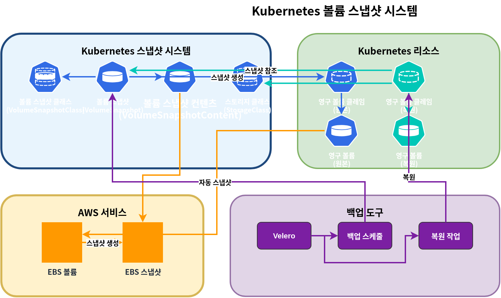
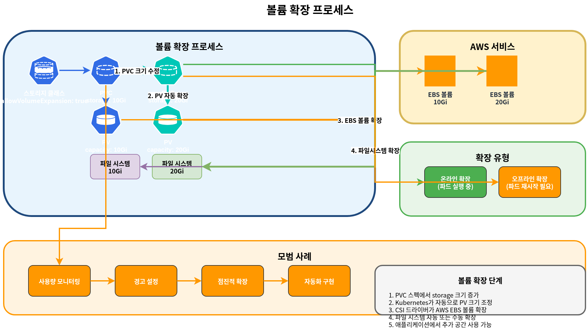

# Amazon EKS Storage - Part 2: FSx for Lustre, S3, Snapshots, Volume Expansion, Performance Optimization

This document is the second part of the Amazon EKS storage series, covering FSx for Lustre, Amazon S3, snapshots, volume expansion, and performance optimization.

## Table of Contents

1. [Amazon FSx for Lustre](#amazon-fsx-for-lustre)
2. [Amazon S3 Storage Integration](#amazon-s3-storage-integration)
3. [Snapshots and Backups](#snapshots-and-backups)
4. [Volume Expansion and Resizing](#volume-expansion-and-resizing)
5. [Volume Cloning](#volume-cloning)
6. [Multi-Attach EBS](#multi-attach-ebs)
7. [Mountpoint for S3 CSI Deep Dive](#mountpoint-for-s3-csi-deep-dive)
8. [Storage Performance Optimization](#storage-performance-optimization)

## Amazon FSx for Lustre

Amazon FSx for Lustre is a high-performance file system for compute-intensive workloads such as high-performance computing (HPC), machine learning, and big data processing. Lustre is a parallel distributed file system that provides high throughput and low latency accessible simultaneously from thousands of clients.


### Installing FSx for Lustre CSI Driver

Follow these steps to install the FSx for Lustre CSI driver:

1. Create IAM role:

```bash
eksctl create iamserviceaccount \
  --name fsx-csi-controller-sa \
  --namespace kube-system \
  --cluster my-cluster \
  --attach-policy-arn arn:aws:iam::aws:policy/AmazonFSxFullAccess \
  --approve \
  --role-only \
  --role-name AmazonEKS_FSx_Lustre_CSI_DriverRole
```

2. Install driver using Helm:

```bash
helm repo add aws-fsx-csi-driver https://kubernetes-sigs.github.io/aws-fsx-csi-driver/
helm repo update
helm upgrade -i aws-fsx-csi-driver aws-fsx-csi-driver/aws-fsx-csi-driver \
  --namespace kube-system \
  --set controller.serviceAccount.create=false \
  --set controller.serviceAccount.name=fsx-csi-controller-sa
```

### Creating FSx for Lustre File System

You can use AWS CLI to create an FSx for Lustre file system:

```bash
# Get VPC ID and subnet ID of EKS cluster
VPC_ID=$(aws eks describe-cluster \
  --name my-cluster \
  --query "cluster.resourcesVpcConfig.vpcId" \
  --output text)

SUBNET_ID=$(aws ec2 describe-subnets \
  --filters "Name=vpc-id,Values=$VPC_ID" \
  --query "Subnets[0].SubnetId" \
  --output text)

# Create security group
SECURITY_GROUP_ID=$(aws ec2 create-security-group \
  --group-name FsxLustreSecurityGroup \
  --description "Security group for FSx Lustre file system" \
  --vpc-id $VPC_ID \
  --output text)

# Allow Lustre traffic
aws ec2 authorize-security-group-ingress \
  --group-id $SECURITY_GROUP_ID \
  --protocol tcp \
  --port 988 \
  --cidr $VPC_CIDR

# Create FSx for Lustre file system
FILE_SYSTEM_ID=$(aws fsx create-file-system \
  --file-system-type LUSTRE \
  --storage-capacity 1200 \
  --subnet-ids $SUBNET_ID \
  --lustre-configuration DeploymentType=SCRATCH_2,PerUnitStorageThroughput=125 \
  --security-group-ids $SECURITY_GROUP_ID \
  --tags Key=Name,Value=MyLustreFileSystem \
  --query "FileSystem.FileSystemId" \
  --output text)
```

### Creating FSx for Lustre Storage Class

Create a storage class that uses FSx for Lustre:

```yaml
apiVersion: storage.k8s.io/v1
kind: StorageClass
metadata:
  name: fsx-lustre-sc
provisioner: fsx.csi.aws.com
parameters:
  deploymentType: SCRATCH_2
  storageCapacity: "1200"
  perUnitStorageThroughput: "125"
  automaticBackupRetentionDays: "0"
  dailyAutomaticBackupStartTime: "00:00"
  copyTagsToBackups: "false"
  dataCompressionType: "NONE"
  driveCacheType: "NONE"
  storageType: "SSD"
  mountName: "fsx-lustre-fs"
```

### Creating PVC and Mounting to Pod

1. Create PVC:

```yaml
apiVersion: v1
kind: PersistentVolumeClaim
metadata:
  name: fsx-claim
spec:
  accessModes:
    - ReadWriteMany
  storageClassName: fsx-lustre-sc
  resources:
    requests:
      storage: 1200Gi
```

2. Mount PVC to pod:

```yaml
apiVersion: v1
kind: Pod
metadata:
  name: app-with-fsx
spec:
  containers:
  - name: app
    image: nvidia/cuda:11.6.0-base-ubuntu20.04
    command: ["sleep", "infinity"]
    volumeMounts:
    - mountPath: "/data"
      name: fsx-volume
  volumes:
  - name: fsx-volume
    persistentVolumeClaim:
      claimName: fsx-claim
```

### Static Provisioning for FSx for Lustre Mount

You can also statically mount an already created FSx for Lustre file system:

```yaml
apiVersion: v1
kind: PersistentVolume
metadata:
  name: fsx-lustre-pv
spec:
  capacity:
    storage: 1200Gi
  volumeMode: Filesystem
  accessModes:
    - ReadWriteMany
  persistentVolumeReclaimPolicy: Retain
  storageClassName: fsx-lustre-sc
  csi:
    driver: fsx.csi.aws.com
    volumeHandle: fs-0123456789abcdef0
    volumeAttributes:
      dnsname: fs-0123456789abcdef0.fsx.us-west-2.amazonaws.com
      mountname: fsx
```

### FSx for Lustre Deployment Types

FSx for Lustre offers various deployment types to meet different workload requirements:

1. **Scratch File Systems**:
   - **Scratch 1**: Cost-optimized file system for short-term storage and processing
   - **Scratch 2**: Provides higher burst throughput and better data durability than Scratch 1

2. **Persistent File Systems**:
   - **Persistent 1**: File system for long-term storage and throughput-critical workloads
   - **Persistent 2**: Provides higher throughput than Persistent 1

### FSx for Lustre Configuration for vLLM

Consider the following configuration to optimize FSx for Lustre for large-scale AI workloads like vLLM (Vector Language Model):

```yaml
apiVersion: storage.k8s.io/v1
kind: StorageClass
metadata:
  name: fsx-lustre-vllm
provisioner: fsx.csi.aws.com
parameters:
  deploymentType: PERSISTENT_2
  storageCapacity: "4800"  # 4.8TB
  perUnitStorageThroughput: "1000"  # 1000 MB/s per TiB
  dataCompressionType: "LZ4"  # Enable data compression
  mountName: "vllm-models"
```

This configuration provides the following benefits:
- High throughput reduces model loading time
- Data compression improves storage efficiency
- Simultaneous access to the same model files from multiple nodes

## Amazon S3 Storage Integration

Amazon S3 is an object storage service that can store and retrieve unlimited amounts of data. In Kubernetes, S3 cannot be directly mounted as a volume, but there are various ways to integrate with S3.


### IRSA Setup for S3 Access

Set up IAM Roles for Service Accounts (IRSA) for pods to access S3:

```bash
eksctl create iamserviceaccount \
  --name s3-access-sa \
  --namespace default \
  --cluster my-cluster \
  --attach-policy-arn arn:aws:iam::aws:policy/AmazonS3ReadOnlyAccess \
  --approve
```

### Pod Configuration for S3 Access

Pod using service account to access S3:

```yaml
apiVersion: v1
kind: Pod
metadata:
  name: s3-access-pod
spec:
  serviceAccountName: s3-access-sa
  containers:
  - name: app
    image: amazon/aws-cli:latest
    command: ["sleep", "infinity"]
```

### S3A File System Mount

You can use the Hadoop S3A file system to access S3 in a manner similar to HDFS:

```yaml
apiVersion: v1
kind: Pod
metadata:
  name: hadoop-s3a-pod
spec:
  serviceAccountName: s3-access-sa
  containers:
  - name: hadoop
    image: apache/hadoop:3.3.1
    env:
    - name: HADOOP_HOME
      value: /opt/hadoop
    - name: HADOOP_CONF_DIR
      value: /opt/hadoop/etc/hadoop
    - name: AWS_REGION
      value: us-west-2
    command: ["sleep", "infinity"]
    volumeMounts:
    - name: hadoop-config
      mountPath: /opt/hadoop/etc/hadoop
  volumes:
  - name: hadoop-config
    configMap:
      name: hadoop-config
---
apiVersion: v1
kind: ConfigMap
metadata:
  name: hadoop-config
data:
  core-site.xml: |
    <?xml version="1.0" encoding="UTF-8"?>
    <configuration>
      <property>
        <name>fs.s3a.aws.credentials.provider</name>
        <value>com.amazonaws.auth.WebIdentityTokenCredentialsProvider</value>
      </property>
      <property>
        <name>fs.s3a.endpoint</name>
        <value>s3.us-west-2.amazonaws.com</value>
      </property>
    </configuration>
```

### Mounting S3 Bucket with CSI Driver

You can mount S3 buckets as Kubernetes volumes using the [AWS S3 CSI driver](https://github.com/awslabs/mountpoint-s3-csi-driver):

1. Install driver:

```bash
helm repo add aws-mountpoint-s3-csi-driver https://awslabs.github.io/mountpoint-s3-csi-driver
helm repo update
helm upgrade --install aws-mountpoint-s3-csi-driver aws-mountpoint-s3-csi-driver/aws-mountpoint-s3-csi-driver \
  --namespace kube-system \
  --set controller.serviceAccount.create=false \
  --set controller.serviceAccount.name=s3-csi-controller-sa
```

2. Create storage class:

```yaml
apiVersion: storage.k8s.io/v1
kind: StorageClass
metadata:
  name: s3-sc
provisioner: s3.csi.aws.com
parameters:
  bucketName: my-eks-bucket
  mountOptions: "--cache-control-max-ttl 0"
```

3. Create PVC and pod:

```yaml
apiVersion: v1
kind: PersistentVolumeClaim
metadata:
  name: s3-claim
spec:
  accessModes:
    - ReadWriteMany
  storageClassName: s3-sc
  resources:
    requests:
      storage: 1Gi
---
apiVersion: v1
kind: Pod
metadata:
  name: app-with-s3
spec:
  serviceAccountName: s3-access-sa
  containers:
  - name: app
    image: nginx
    volumeMounts:
    - mountPath: "/data"
      name: s3-volume
  volumes:
  - name: s3-volume
    persistentVolumeClaim:
      claimName: s3-claim
```

### S3 Use Cases

Amazon S3 is suitable for the following use cases:

1. **Data Lake**: Central repository for large-scale data analytics
2. **Backup and Archive**: Long-term data retention
3. **Static Web Content**: Serving static content such as images, videos, documents
4. **ML Model Repository**: Storing trained model files
5. **Logs and Audit Data**: Storing log files and audit data

## Snapshots and Backups

In Kubernetes, you can use volume snapshots to backup and restore PV data.



### Installing Volume Snapshot Controller

Install the snapshot controller to use volume snapshot functionality:

```bash
kubectl apply -f https://raw.githubusercontent.com/kubernetes-csi/external-snapshotter/master/client/config/crd/snapshot.storage.k8s.io_volumesnapshotclasses.yaml
kubectl apply -f https://raw.githubusercontent.com/kubernetes-csi/external-snapshotter/master/client/config/crd/snapshot.storage.k8s.io_volumesnapshotcontents.yaml
kubectl apply -f https://raw.githubusercontent.com/kubernetes-csi/external-snapshotter/master/client/config/crd/snapshot.storage.k8s.io_volumesnapshots.yaml

kubectl apply -f https://raw.githubusercontent.com/kubernetes-csi/external-snapshotter/master/deploy/kubernetes/snapshot-controller/rbac-snapshot-controller.yaml
kubectl apply -f https://raw.githubusercontent.com/kubernetes-csi/external-snapshotter/master/deploy/kubernetes/snapshot-controller/setup-snapshot-controller.yaml
```

### Creating Volume Snapshot Class

Create a snapshot class for EBS volumes:

```yaml
apiVersion: snapshot.storage.k8s.io/v1
kind: VolumeSnapshotClass
metadata:
  name: ebs-snapshot-class
driver: ebs.csi.aws.com
deletionPolicy: Delete
parameters:
  csi.storage.k8s.io/snapshotter-secret-name: ""
  csi.storage.k8s.io/snapshotter-secret-namespace: ""
```

### Creating Volume Snapshot

Create a snapshot of the PVC:

```yaml
apiVersion: snapshot.storage.k8s.io/v1
kind: VolumeSnapshot
metadata:
  name: ebs-volume-snapshot
spec:
  volumeSnapshotClassName: ebs-snapshot-class
  source:
    persistentVolumeClaimName: ebs-claim
```

### Restoring PVC from Snapshot

Create a new PVC from a snapshot:

```yaml
apiVersion: v1
kind: PersistentVolumeClaim
metadata:
  name: ebs-claim-restored
spec:
  accessModes:
    - ReadWriteOnce
  storageClassName: ebs-gp3
  resources:
    requests:
      storage: 10Gi
  dataSource:
    name: ebs-volume-snapshot
    kind: VolumeSnapshot
    apiGroup: snapshot.storage.k8s.io
```

### Automating Regular Snapshots

You can automate regular backups and restores using [Velero](https://velero.io/):

1. Install Velero:

```bash
# Install Velero CLI
brew install velero

# Install Velero server
velero install \
  --provider aws \
  --plugins velero/velero-plugin-for-aws:v1.5.0 \
  --bucket velero-backup-bucket \
  --backup-location-config region=us-west-2 \
  --snapshot-location-config region=us-west-2 \
  --secret-file ./credentials-velero
```

2. Create backup schedule:

```bash
velero schedule create daily-backup \
  --schedule="0 1 * * *" \
  --include-namespaces=default,app-namespace
```

3. Restore to a specific point in time:

```bash
velero restore create --from-backup daily-backup-20250710010000
```

## Volume Expansion and Resizing

In Kubernetes, you can expand PVC size to increase storage capacity.



### Enabling Volume Expansion

Enable volume expansion in the storage class:

```yaml
apiVersion: storage.k8s.io/v1
kind: StorageClass
metadata:
  name: ebs-gp3-expandable
provisioner: ebs.csi.aws.com
parameters:
  type: gp3
allowVolumeExpansion: true
```

### Expanding PVC Size

Expand the PVC size:

```yaml
apiVersion: v1
kind: PersistentVolumeClaim
metadata:
  name: ebs-claim
spec:
  accessModes:
    - ReadWriteOnce
  storageClassName: ebs-gp3-expandable
  resources:
    requests:
      storage: 20Gi  # Expanded from original 10Gi to 20Gi
```

### File System Expansion

After volume expansion, you may need to expand the file system:

1. Online expansion (when pod is running):
   - EBS CSI driver automatically expands the file system.

2. Offline expansion (when manual expansion is required):
   - Connect to the pod and run file system expansion command:

```bash
# For ext4 file system
resize2fs /dev/xvdf

# For xfs file system
xfs_growfs /data
```

### Volume Resizing Best Practices

1. **Set appropriate initial size**: Set initial volume size slightly larger than needed
2. **Set up monitoring**: Monitor volume usage and set up alerts
3. **Gradual expansion**: Gradually expand volume size as needed
4. **Plan for downtime**: Some file system expansions may require downtime
5. **Consider automation**: Implement automatic expansion policies

## Volume Cloning

Volume cloning allows you to create a new PVC from an existing PVC without going through the snapshot process. This is useful for creating test environments, debugging production data issues, or quickly provisioning new workloads with existing data.

### EBS CSI Volume Cloning Concept

The EBS CSI driver supports PVC cloning using the `dataSource` field. When you clone a volume, the CSI driver creates a new EBS volume from a snapshot of the source volume, but this process is abstracted away from the user.

Key characteristics of volume cloning:
- The clone is independent of the source PVC
- Changes to the clone do not affect the source
- The clone inherits the storage class of the source unless specified otherwise
- Both source and clone must be in the same namespace

### Using the dataSource Field

To create a clone, specify the source PVC in the `dataSource` field:

```yaml
apiVersion: v1
kind: PersistentVolumeClaim
metadata:
  name: ebs-clone
spec:
  accessModes:
    - ReadWriteOnce
  storageClassName: ebs-gp3
  resources:
    requests:
      storage: 10Gi
  dataSource:
    kind: PersistentVolumeClaim
    name: ebs-source-pvc
```

### Clone vs Snapshot Comparison

| Feature | Volume Clone | Volume Snapshot |
|---------|--------------|-----------------|
| Creation Speed | Fast (single step) | Two steps (create snapshot, then restore) |
| Storage Overhead | Immediate full copy | Incremental storage |
| Cross-Namespace | No | Yes (with VolumeSnapshotContent) |
| Point-in-Time | At clone creation | Any saved snapshot |
| Use Case | Quick duplication | Backup and recovery |

### Volume Clone YAML Example

Complete example for cloning a database volume:

```yaml
# Source PVC (existing)
apiVersion: v1
kind: PersistentVolumeClaim
metadata:
  name: postgres-data
  namespace: production
spec:
  accessModes:
    - ReadWriteOnce
  storageClassName: ebs-gp3
  resources:
    requests:
      storage: 100Gi
---
# Clone for testing
apiVersion: v1
kind: PersistentVolumeClaim
metadata:
  name: postgres-data-test
  namespace: production
spec:
  accessModes:
    - ReadWriteOnce
  storageClassName: ebs-gp3
  resources:
    requests:
      storage: 100Gi
  dataSource:
    kind: PersistentVolumeClaim
    name: postgres-data
---
# Pod using the cloned volume
apiVersion: v1
kind: Pod
metadata:
  name: postgres-test
  namespace: production
spec:
  containers:
  - name: postgres
    image: postgres:15
    volumeMounts:
    - mountPath: /var/lib/postgresql/data
      name: postgres-storage
    env:
    - name: POSTGRES_PASSWORD
      value: testpassword
  volumes:
  - name: postgres-storage
    persistentVolumeClaim:
      claimName: postgres-data-test
```

## Multi-Attach EBS

Multi-Attach enables a single EBS volume to be attached to multiple EC2 instances simultaneously. This feature is available for io1 and io2 Block Express volumes and is useful for clustered applications that require shared storage with high performance.

### io1/io2 Block Express Multi-Attachment

Multi-Attach is supported only on Provisioned IOPS SSD volumes:
- **io1**: Up to 16 simultaneous attachments
- **io2 Block Express**: Up to 16 simultaneous attachments with higher performance

Requirements:
- Instances must be in the same Availability Zone as the volume
- Instances must be Nitro-based EC2 instances
- Volume must use Block device mode (not Filesystem mode)

### Why Not ReadWriteMany?

EBS Multi-Attach does not support `ReadWriteMany` access mode in the traditional sense because:

1. **Block Mode Required**: Multi-Attach works only with raw block devices, not mounted filesystems
2. **No Filesystem Coordination**: EBS does not provide filesystem-level coordination
3. **Application Responsibility**: The application must handle concurrent access and data integrity

The Kubernetes access mode for Multi-Attach EBS is `ReadWriteOncePod` or through Block volumeMode with application-level coordination (like clustered databases or OCFS2/GFS2).

### Limitations

- **Same AZ Only**: All attached instances must be in the same Availability Zone
- **Block Mode Only**: Cannot be used as a shared filesystem without cluster-aware filesystem
- **Nitro Instances**: Only supported on Nitro-based instance types
- **No Online Resize**: Cannot resize while attached to multiple instances
- **Application Coordination**: Applications must implement their own locking/coordination

### Multi-Attach Use Cases and YAML Example

Common use cases:
- Clustered databases (Oracle RAC, SQL Server FCI)
- High-availability applications with shared state
- Distributed storage systems

```yaml
apiVersion: storage.k8s.io/v1
kind: StorageClass
metadata:
  name: ebs-io2-multi-attach
provisioner: ebs.csi.aws.com
parameters:
  type: io2
  iops: "64000"
  multiAttachEnabled: "true"
volumeBindingMode: WaitForFirstConsumer
---
apiVersion: v1
kind: PersistentVolumeClaim
metadata:
  name: shared-block-pvc
spec:
  accessModes:
    - ReadWriteMany
  volumeMode: Block
  storageClassName: ebs-io2-multi-attach
  resources:
    requests:
      storage: 100Gi
---
apiVersion: apps/v1
kind: StatefulSet
metadata:
  name: clustered-app
spec:
  serviceName: clustered-app
  replicas: 2
  selector:
    matchLabels:
      app: clustered-app
  template:
    metadata:
      labels:
        app: clustered-app
    spec:
      affinity:
        podAntiAffinity:
          requiredDuringSchedulingIgnoredDuringExecution:
          - labelSelector:
              matchLabels:
                app: clustered-app
            topologyKey: kubernetes.io/hostname
      containers:
      - name: app
        image: my-clustered-app:latest
        volumeDevices:
        - name: shared-block
          devicePath: /dev/xvda
      volumes:
      - name: shared-block
        persistentVolumeClaim:
          claimName: shared-block-pvc
```

## Mountpoint for S3 CSI Deep Dive

Mountpoint for Amazon S3 is a file client that translates file system operations into S3 object API calls, allowing applications to access S3 buckets through a POSIX-like interface. The Mountpoint for S3 CSI driver integrates this capability with Kubernetes.

### Performance Characteristics

Mountpoint for S3 is optimized for specific access patterns:

**Sequential Read Optimization**:
- Excellent performance for large sequential reads
- Automatic prefetching for predictable access patterns
- Throughput scales with object size
- Ideal for data analytics and ML training workloads

**Random Write Limitations**:
- S3 is an object store, not a block store
- Random writes require rewriting entire objects
- Append operations create new object versions
- Not suitable for database workloads or applications requiring random I/O

Performance benchmarks (approximate):
| Operation | Performance |
|-----------|-------------|
| Sequential Read (large files) | Up to 100 Gbps aggregate |
| Sequential Write (new files) | Up to 50 Gbps aggregate |
| Random Read (small files) | Higher latency, lower throughput |
| Random Write | Not recommended |

### Limitations

Mountpoint for S3 has several POSIX compatibility limitations:

- **No hard links**: Hard links are not supported
- **No symbolic links**: Symbolic links are not supported
- **No chmod/chown**: File permissions cannot be changed after creation
- **No file locking**: Advisory and mandatory locks are not available
- **No sparse files**: Sparse file operations are not supported
- **No extended attributes**: xattr operations are not supported
- **Eventual consistency**: List operations may not immediately reflect recent writes
- **No rename across directories**: Rename is only supported within the same directory
- **No append to existing files**: Must rewrite the entire object

### Cache Settings

Mountpoint for S3 provides caching options to improve performance:

**Metadata Cache**:
```yaml
parameters:
  mountOptions: "--metadata-ttl 60"  # Cache metadata for 60 seconds
```

**Data Cache** (for read-heavy workloads):
```yaml
parameters:
  mountOptions: "--cache /tmp/s3-cache --max-cache-size 10737418240"  # 10GB cache
```

Complete cache configuration example:
```yaml
apiVersion: storage.k8s.io/v1
kind: StorageClass
metadata:
  name: s3-cached
provisioner: s3.csi.aws.com
parameters:
  bucketName: my-ml-data-bucket
  mountOptions: |
    --metadata-ttl 300
    --cache /tmp/mountpoint-cache
    --max-cache-size 53687091200
    --read-part-size 8388608
    --prefetch-bytes 20971520
```

### Large Dataset Training Scenario Example

Mountpoint for S3 is ideal for ML training workloads that read large datasets:

```yaml
apiVersion: storage.k8s.io/v1
kind: StorageClass
metadata:
  name: s3-ml-training
provisioner: s3.csi.aws.com
parameters:
  bucketName: ml-training-datasets
  mountOptions: |
    --read-part-size 8388608
    --prefetch-bytes 52428800
    --metadata-ttl 3600
    --cache /tmp/s3-cache
    --max-cache-size 107374182400
---
apiVersion: v1
kind: PersistentVolumeClaim
metadata:
  name: training-data
spec:
  accessModes:
    - ReadOnlyMany
  storageClassName: s3-ml-training
  resources:
    requests:
      storage: 1Ti
---
apiVersion: batch/v1
kind: Job
metadata:
  name: ml-training-job
spec:
  parallelism: 4
  template:
    spec:
      serviceAccountName: ml-training-sa
      containers:
      - name: trainer
        image: pytorch/pytorch:2.0.1-cuda11.7-cudnn8-runtime
        resources:
          limits:
            nvidia.com/gpu: 1
            memory: 64Gi
          requests:
            memory: 32Gi
        command:
        - python
        - /app/train.py
        - --data-dir=/data
        - --epochs=100
        volumeMounts:
        - name: training-data
          mountPath: /data
          readOnly: true
        - name: model-output
          mountPath: /models
      volumes:
      - name: training-data
        persistentVolumeClaim:
          claimName: training-data
      - name: model-output
        persistentVolumeClaim:
          claimName: model-output-pvc
      restartPolicy: Never
      nodeSelector:
        node.kubernetes.io/instance-type: p4d.24xlarge
```

Key optimizations in this example:
- **ReadOnlyMany access**: Multiple training pods can read simultaneously
- **Large prefetch**: 50MB prefetch reduces read latency
- **Local cache**: 100GB cache for frequently accessed data
- **Appropriate instance type**: GPU instance with high network bandwidth

## Storage Performance Optimization

Let's explore various strategies for optimizing storage performance in EKS.


### EBS Performance Optimization

1. **Select appropriate volume type**:
   - General workloads: gp3
   - High-performance databases: io2
   - Throughput-centric workloads: st1

2. **gp3 volume performance tuning**:

```yaml
apiVersion: storage.k8s.io/v1
kind: StorageClass
metadata:
  name: ebs-gp3-high-perf
provisioner: ebs.csi.aws.com
parameters:
  type: gp3
  iops: "16000"  # Up to 16,000 IOPS
  throughput: "1000"  # Up to 1,000 MiB/s
```

3. **Consider instance type**:
   - Use EBS-optimized instances
   - Select instances with sufficient network bandwidth

4. **Volume initialization**:
   - Consider initializing new volumes before use:

```bash
dd if=/dev/zero of=/dev/xvdf bs=1M count=1000 oflag=direct
```

### EFS Performance Optimization

1. **Select appropriate performance mode**:
   - Most workloads: General Purpose mode
   - High concurrency workloads: Max I/O mode

2. **Select throughput mode**:
   - Predictable workloads: Provisioned throughput
   - Variable workloads: Bursting or Elastic throughput

3. **Optimize access patterns**:
   - Large file operations: Use large I/O sizes
   - Parallel access: Use multiple threads or processes

4. **Optimize mount options**:

```yaml
apiVersion: v1
kind: Pod
metadata:
  name: efs-app
spec:
  containers:
  - name: app
    image: nginx
    volumeMounts:
    - mountPath: "/data"
      name: efs-volume
  volumes:
  - name: efs-volume
    persistentVolumeClaim:
      claimName: efs-claim
    mountOptions:
      - nfsvers=4.1
      - rsize=1048576
      - wsize=1048576
      - timeo=600
      - retrans=2
      - noresvport
```

### FSx for Lustre Performance Optimization

1. **Select appropriate deployment type and throughput**:
   - High throughput requirements: PERSISTENT_2 + high throughput
   - Cost-effective temporary workloads: SCRATCH_2

2. **Optimize striping**:
   - Large files: Stripe across multiple OSTs (Object Storage Targets)
   - Small files: Store on a single OST

3. **Client mount options**:

```yaml
mountOptions:
  - flock
  - noatime
  - relatime
```

4. **Enable data compression**:

```yaml
parameters:
  dataCompressionType: "LZ4"
```

### Storage Optimization for vLLM Workloads

Storage optimization for large language model workloads like vLLM:

1. **Use FSx for Lustre**:
   - High throughput reduces model loading time
   - Simultaneous access to the same model files from multiple nodes

2. **Optimal configuration**:

```yaml
apiVersion: storage.k8s.io/v1
kind: StorageClass
metadata:
  name: fsx-lustre-vllm
provisioner: fsx.csi.aws.com
parameters:
  deploymentType: PERSISTENT_2
  storageCapacity: "4800"  # 4.8TB
  perUnitStorageThroughput: "1000"  # 1000 MB/s per TiB
  dataCompressionType: "LZ4"  # Enable data compression
```

3. **Model file optimization**:
   - Pre-load model files into memory
   - Consider model quantization
   - Implement model sharding

4. **Node instance type selection**:
   - Select instances with sufficient memory and network bandwidth
   - Consider EFA (Elastic Fabric Adapter) support for GPU instances

## Conclusion

This document covered FSx for Lustre, S3, snapshots, volume expansion, and performance optimization in Amazon EKS. Each storage option has different characteristics and use cases, so it is important to select and optimize the appropriate storage solution for your application requirements.

The next part will cover monitoring, troubleshooting, cost optimization, and security for EKS storage.

## References

- [Amazon FSx for Lustre CSI Driver](https://github.com/kubernetes-sigs/aws-fsx-csi-driver)
- [Amazon S3 CSI Driver](https://github.com/awslabs/mountpoint-s3-csi-driver)
- [Kubernetes Volume Snapshots](https://kubernetes.io/docs/concepts/storage/volume-snapshots/)
- [Velero Backup and Restore](https://velero.io/docs/)
- [Amazon EKS Storage Best Practices](https://aws.github.io/aws-eks-best-practices/storage/)

## Quiz

To test what you've learned in this chapter, try the [topic quiz](../quizzes/eks/04-eks-storage-part2-quiz.md).
