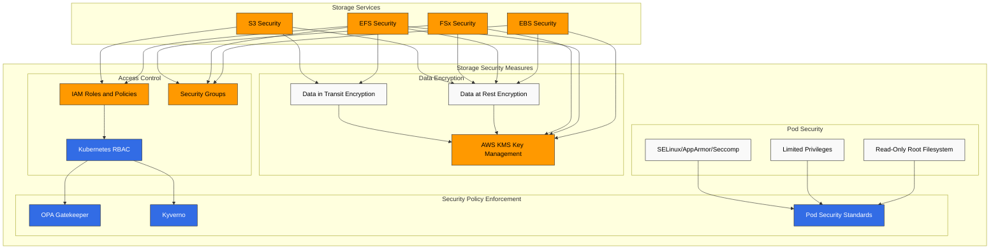
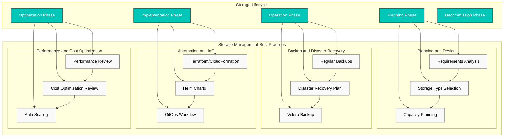

# Amazon EKS Storage - Part 3: Monitoring, Troubleshooting, Cost Optimization, and Security

This document is the third and final part of the Amazon EKS storage series, covering storage monitoring, troubleshooting, cost optimization, and security.

## Table of Contents

1. [Storage Monitoring](#storage-monitoring)
2. [Storage Troubleshooting](#storage-troubleshooting)
3. [Storage Cost Optimization](#storage-cost-optimization)
4. [Storage Security](#storage-security)
5. [Storage Management Best Practices](#storage-management-best-practices)

## Storage Monitoring

Effectively monitoring storage resources in an EKS cluster is important for detecting performance issues early and establishing capacity planning.

```mermaid
flowchart TD
    subgraph Monitoring_Solutions ["Storage Monitoring Solutions"]
        subgraph AWS_CloudWatch ["AWS CloudWatch"]
            EBS_Metrics[EBS Volume Metrics]
            EFS_Metrics[EFS File System Metrics]
            FSx_Metrics[FSx for Lustre Metrics]
            CW_Alarms[CloudWatch Alarms]
            CW_Dashboard[CloudWatch Dashboard]
        end

        subgraph K8s_Monitoring ["Kubernetes Monitoring"]
            Prometheus[Prometheus]
            Grafana[Grafana Dashboard]
            ServiceMonitor[ServiceMonitor]
            PodMonitor[PodMonitor]
            PrometheusRule[Alert Rules]
        end

        subgraph Custom_Solutions ["Custom Solutions"]
            Usage_Exporter[Volume Usage Exporter]
            Custom_Metrics[Custom Metrics]
            Custom_Alerts[Custom Alerts]
        end
    end

    subgraph Key_Metrics ["Key Monitoring Metrics"]
        Volume_Usage[Volume Usage]
        IOPS[IOPS Usage]
        Throughput[Throughput]
        Latency[Latency]
        Queue_Length[Queue Length]
        Burst_Credits[Burst Credits]
    end

    %% Connection relationships
    EBS_Metrics --> Volume_Usage
    EBS_Metrics --> IOPS
    EBS_Metrics --> Throughput
    EBS_Metrics --> Latency
    EBS_Metrics --> Queue_Length
    EBS_Metrics --> Burst_Credits

    EFS_Metrics --> Volume_Usage
    EFS_Metrics --> Throughput
    EFS_Metrics --> Burst_Credits

    FSx_Metrics --> Volume_Usage
    FSx_Metrics --> IOPS
    FSx_Metrics --> Throughput

    Volume_Usage --> CW_Alarms
    IOPS --> CW_Alarms
    Throughput --> CW_Alarms
    Latency --> CW_Alarms
    Queue_Length --> CW_Alarms
    Burst_Credits --> CW_Alarms

    CW_Alarms --> CW_Dashboard

    Prometheus --> ServiceMonitor
    Prometheus --> PodMonitor
    ServiceMonitor --> Grafana
    PodMonitor --> Grafana
    Prometheus --> PrometheusRule

    Usage_Exporter --> Custom_Metrics
    Custom_Metrics --> Custom_Alerts

    %% Class definitions
    classDef awsService fill:#FF9900,stroke:#333,stroke-width:1px,color:black;
    classDef k8sComponent fill:#326CE5,stroke:#333,stroke-width:1px,color:white;
    classDef userApp fill:#00C7B7,stroke:#333,stroke-width:1px,color:white;
    classDef dataStore fill:#3B48CC,stroke:#333,stroke-width:1px,color:white;
    classDef default fill:#f9f9f9,stroke:#333,stroke-width:1px,color:black;

    %% Class application
    class EBS_Metrics,EFS_Metrics,FSx_Metrics,CW_Alarms,CW_Dashboard awsService;
    class Prometheus,Grafana,ServiceMonitor,PodMonitor,PrometheusRule k8sComponent;
    class Usage_Exporter,Custom_Metrics,Custom_Alerts userApp;
    class Volume_Usage,IOPS,Throughput,Latency,Queue_Length,Burst_Credits default;
```



### Monitoring with CloudWatch

You can use AWS CloudWatch to monitor performance metrics for EBS, EFS, and FSx for Lustre volumes:

#### EBS Volume Metrics

Key EBS metrics:
- VolumeReadBytes/VolumeWriteBytes: Read/write throughput
- VolumeReadOps/VolumeWriteOps: Number of read/write operations
- VolumeTotalReadTime/VolumeTotalWriteTime: Read/write latency
- VolumeQueueLength: Number of pending I/O requests
- BurstBalance: Burst credit balance (gp2 volumes)

CloudWatch dashboard example:

```bash
aws cloudwatch get-dashboard --dashboard-name EBSVolumeMonitoring
```

#### EFS File System Metrics

Key EFS metrics:
- TotalIOBytes: Total I/O bytes
- DataReadIOBytes/DataWriteIOBytes: Read/write throughput
- ClientConnections: Number of connected clients
- PermittedThroughput: Permitted throughput
- BurstCreditBalance: Burst credit balance

#### FSx for Lustre Metrics

Key FSx for Lustre metrics:
- DataReadBytes/DataWriteBytes: Read/write throughput
- DataReadOperations/DataWriteOperations: Number of read/write operations
- FreeDataStorageCapacity: Available storage capacity
- NetworkThroughputUtilization: Network throughput utilization

### Monitoring with Prometheus and Grafana

You can use Prometheus and Grafana to monitor storage resources at the Kubernetes level:

1. Install Prometheus and Grafana:

```bash
helm repo add prometheus-community https://prometheus-community.github.io/helm-charts
helm repo update
helm install prometheus prometheus-community/kube-prometheus-stack \
  --namespace monitoring \
  --create-namespace
```

2. Configure ServiceMonitor for storage-related metrics collection:

```yaml
apiVersion: monitoring.coreos.com/v1
kind: ServiceMonitor
metadata:
  name: csi-metrics
  namespace: monitoring
spec:
  selector:
    matchLabels:
      app: ebs-csi-controller
  endpoints:
  - port: metrics
    interval: 30s
```

3. Configure Grafana dashboard:

Create a dashboard in Grafana that includes the following metrics:
- PVC usage and capacity
- Volume provisioning status
- CSI driver operation latency
- Volume mount/unmount operations

### Custom Monitoring Solutions

You can implement custom monitoring solutions for specific requirements:

1. Volume usage monitoring pod:

```yaml
apiVersion: apps/v1
kind: DaemonSet
metadata:
  name: volume-usage-exporter
  namespace: monitoring
spec:
  selector:
    matchLabels:
      app: volume-usage-exporter
  template:
    metadata:
      labels:
        app: volume-usage-exporter
    spec:
      containers:
      - name: exporter
        image: quay.io/prometheus/node-exporter:v1.3.1
        args:
        - --path.procfs=/host/proc
        - --path.sysfs=/host/sys
        - --collector.filesystem
        volumeMounts:
        - name: proc
          mountPath: /host/proc
          readOnly: true
        - name: sys
          mountPath: /host/sys
          readOnly: true
        - name: root
          mountPath: /host/root
          readOnly: true
          mountPropagation: HostToContainer
      volumes:
      - name: proc
        hostPath:
          path: /proc
      - name: sys
        hostPath:
          path: /sys
      - name: root
        hostPath:
          path: /
```

2. Alert rules configuration:

```yaml
apiVersion: monitoring.coreos.com/v1
kind: PrometheusRule
metadata:
  name: storage-alerts
  namespace: monitoring
spec:
  groups:
  - name: storage
    rules:
    - alert: VolumeUsageHigh
      expr: kubelet_volume_stats_used_bytes / kubelet_volume_stats_capacity_bytes > 0.85
      for: 10m
      labels:
        severity: warning
      annotations:
        summary: "Volume usage high ({{ $value | humanizePercentage }})"
        description: "PVC {{ $labels.persistentvolumeclaim }} is using {{ $value | humanizePercentage }} of its capacity."
    - alert: VolumeFullIn24Hours
      expr: predict_linear(kubelet_volume_stats_used_bytes[6h], 24 * 3600) > kubelet_volume_stats_capacity_bytes
      for: 10m
      labels:
        severity: warning
      annotations:
        summary: "Volume will fill in 24 hours"
        description: "PVC {{ $labels.persistentvolumeclaim }} is predicted to fill within 24 hours."
```

## Storage Troubleshooting

Let's explore common storage issues that can occur in EKS clusters and their solutions.

```mermaid
flowchart TD
    subgraph Common_Issues ["Common Storage Issues"]
        PVC_Pending[PVC in Pending State]
        Volume_Provisioning[Volume Provisioning Failure]
        Mount_Issues[Volume Mount Issues]
        Performance_Issues[Performance Issues]
    end

    subgraph Troubleshooting_Steps ["Troubleshooting Steps"]
        Check_PVC[Check PVC Status]
        Check_SC[Check Storage Class]
        Check_CSI[Check CSI Driver Logs]
        Check_IAM[Check IAM Permissions]
        Check_Pod[Check Pod Status]
        Check_Node[Check Node Status]
        Check_SG[Check Security Groups]
        Check_Network[Check Network Connectivity]
        Check_Metrics[Check Performance Metrics]
        Check_FS[Test File System]
    end

    subgraph Resolution_Actions ["Resolution Actions"]
        Fix_SC[Fix Storage Class]
        Fix_CSI[Reinstall CSI Driver]
        Fix_IAM[Add IAM Permissions]
        Fix_Pod[Restart Pod]
        Fix_SG[Add Security Group Rules]
        Fix_Volume[Change Volume Type]
        Fix_Instance[Change Instance Type]
        Fix_FS[Optimize File System]
    end

    %% Issue and troubleshooting step connections
    PVC_Pending --> Check_PVC
    PVC_Pending --> Check_SC
    PVC_Pending --> Check_CSI
    PVC_Pending --> Check_IAM

    Volume_Provisioning --> Check_CSI
    Volume_Provisioning --> Check_IAM
    Volume_Provisioning --> Check_SC

    Mount_Issues --> Check_Pod
    Mount_Issues --> Check_Node
    Mount_Issues --> Check_SG
    Mount_Issues --> Check_Network

    Performance_Issues --> Check_Metrics
    Performance_Issues --> Check_FS
    Performance_Issues --> Check_Node

    %% Troubleshooting steps and action connections
    Check_SC --> Fix_SC
    Check_CSI --> Fix_CSI
    Check_IAM --> Fix_IAM
    Check_Pod --> Fix_Pod
    Check_SG --> Fix_SG
    Check_Metrics --> Fix_Volume
    Check_Metrics --> Fix_Instance
    Check_FS --> Fix_FS

    %% Class definitions
    classDef awsService fill:#FF9900,stroke:#333,stroke-width:1px,color:black;
    classDef k8sComponent fill:#326CE5,stroke:#333,stroke-width:1px,color:white;
    classDef userApp fill:#00C7B7,stroke:#333,stroke-width:1px,color:white;
    classDef dataStore fill:#3B48CC,stroke:#333,stroke-width:1px,color:white;
    classDef default fill:#f9f9f9,stroke:#333,stroke-width:1px,color:black;

    %% Class application
    class PVC_Pending,Volume_Provisioning,Mount_Issues,Performance_Issues k8sComponent;
    class Check_PVC,Check_SC,Check_CSI,Check_IAM,Check_Pod,Check_Node,Check_SG,Check_Network,Check_Metrics,Check_FS default;
    class Fix_SC,Fix_CSI,Fix_IAM,Fix_Pod,Fix_SG,Fix_Volume,Fix_Instance,Fix_FS userApp;
```



### Volume Provisioning Issues

#### Issue: PVC Remains in Pending State

1. Check PVC status:

```bash
kubectl get pvc
kubectl describe pvc <pvc-name>
```

2. Check storage class:

```bash
kubectl get sc
kubectl describe sc <storage-class-name>
```

3. Check provisioner pod logs:

```bash
kubectl -n kube-system get pods | grep csi
kubectl -n kube-system logs <csi-controller-pod-name>
```

4. Common causes and solutions:
   - Storage class doesn't exist: Create the correct storage class
   - CSI driver not installed: Install the driver
   - Insufficient IAM permissions: Grant required IAM permissions
   - Volume limit exceeded: Request service limit increase

#### Issue: Volume Not Provisioned with WaitForFirstConsumer Binding Mode

1. Check pod status:

```bash
kubectl get pods
kubectl describe pod <pod-name>
```

2. Check node availability zones:

```bash
kubectl get nodes -L topology.kubernetes.io/zone
```

3. Solutions:
   - Resolve pod scheduling issues
   - Check node selector and affinity rules
   - Ensure node pool is in the same availability zone as the PVC

### Volume Mount Issues

#### Issue: Pod Stuck in ContainerCreating State

1. Check pod events:

```bash
kubectl describe pod <pod-name>
```

2. Check node kubelet logs:

```bash
kubectl get nodes
ssh ec2-user@<node-ip>
sudo journalctl -u kubelet
```

3. Common causes and solutions:
   - Volume ID not found: Verify volume existence in AWS console
   - Device mount failure: Check device path and file system
   - Permission issues: Check IAM roles and security groups

#### Issue: EFS or FSx Mount Failure

1. Check security groups:
   - EFS: Allow TCP port 2049
   - FSx for Lustre: Allow TCP port 988

2. Check network connectivity:

```bash
kubectl debug node/<node-name> -it --image=amazon/aws-cli
ping <efs-dns-name>
telnet <efs-dns-name> 2049
```

3. Create mount helper pod:

```yaml
apiVersion: v1
kind: Pod
metadata:
  name: mount-helper
spec:
  containers:
  - name: mount-helper
    image: amazonlinux:2
    command: ["sleep", "infinity"]
    securityContext:
      privileged: true
```

4. Test mount manually:

```bash
kubectl exec -it mount-helper -- bash
yum install -y nfs-utils
mkdir -p /mnt/efs
mount -t nfs4 <efs-dns-name>:/ /mnt/efs
```

### Performance Issues

#### Issue: Slow I/O Performance

1. Check volume performance metrics:

```bash
aws cloudwatch get-metric-statistics \
  --namespace AWS/EBS \
  --metric-name VolumeReadOps \
  --dimensions Name=VolumeId,Value=vol-1234567890abcdef0 \
  --start-time $(date -u -v-1H +%Y-%m-%dT%H:%M:%SZ) \
  --end-time $(date -u +%Y-%m-%dT%H:%M:%SZ) \
  --period 300 \
  --statistics Average
```

2. Test file system performance:

```bash
kubectl exec -it <pod-name> -- bash
dd if=/dev/zero of=/data/test bs=1M count=1000 oflag=direct
dd if=/data/test of=/dev/null bs=1M count=1000 iflag=direct
```

3. Common causes and solutions:
   - Inappropriate volume type: Select volume type suitable for workload (e.g., gp3, io2)
   - IOPS or throughput limits: Adjust volume performance parameters
   - Instance limitations: Use EBS-optimized instances
   - File system fragmentation: Optimize or recreate file system

#### Issue: EFS Performance Degradation

1. Check EFS performance mode and throughput mode
2. Optimize client mount options:

```yaml
mountOptions:
  - nfsvers=4.1
  - rsize=1048576
  - wsize=1048576
  - timeo=600
  - retrans=2
  - noresvport
```

3. Optimize access patterns:
   - Use large files instead of small files
   - Use sequential access patterns
   - Minimize metadata operations

## Storage Cost Optimization

Let's explore strategies for optimizing storage costs in EKS clusters.

```mermaid
flowchart TD
    subgraph Cost_Optimization_Strategies ["Cost Optimization Strategies"]
        subgraph Volume_Optimization ["Volume Optimization"]
            Volume_Type[Select Appropriate Volume Type]
            Volume_Size[Optimize Volume Size]
            GP3_Migration[Migrate to gp3 Volumes]
        end

        subgraph Lifecycle_Management ["Lifecycle Management"]
            Data_Tiering[Data Tiering]
            Snapshot_Policy[Automated Snapshot Policy]
            PV_Reclaim[PV Reclaim Policy]
        end

        subgraph EFS_Optimization ["EFS Optimization"]
            Throughput_Mode[Appropriate Throughput Mode]
            IA_Storage[IA Storage Class]
            Access_Points[Access Points]
        end

        subgraph FSx_Optimization ["FSx Optimization"]
            Deployment_Type[Appropriate Deployment Type]
            Data_Compression[Data Compression]
            S3_Integration[S3 Integration]
        end

        subgraph Cost_Monitoring ["Cost Monitoring"]
            Cost_Explorer[AWS Cost Explorer]
            K8s_Cost[Kubernetes Cost Allocation]
            Cost_Anomaly[Cost Anomaly Detection]
        end
    end

    subgraph Storage_Types ["Storage Type Optimization"]
        EBS[Amazon EBS]
        EFS[Amazon EFS]
        FSx[Amazon FSx for Lustre]
        S3[Amazon S3]
    end

    %% Connection relationships
    EBS --> Volume_Type
    EBS --> Volume_Size
    EBS --> GP3_Migration

    EBS --> Snapshot_Policy
    EBS --> PV_Reclaim

    EFS --> Throughput_Mode
    EFS --> IA_Storage
    EFS --> Access_Points

    FSx --> Deployment_Type
    FSx --> Data_Compression
    FSx --> S3_Integration

    S3 --> Data_Tiering

    Volume_Optimization --> Cost_Monitoring
    Lifecycle_Management --> Cost_Monitoring
    EFS_Optimization --> Cost_Monitoring
    FSx_Optimization --> Cost_Monitoring

    %% Class definitions
    classDef awsService fill:#FF9900,stroke:#333,stroke-width:1px,color:black;
    classDef k8sComponent fill:#326CE5,stroke:#333,stroke-width:1px,color:white;
    classDef userApp fill:#00C7B7,stroke:#333,stroke-width:1px,color:white;
    classDef dataStore fill:#3B48CC,stroke:#333,stroke-width:1px,color:white;
    classDef default fill:#f9f9f9,stroke:#333,stroke-width:1px,color:black;

    %% Class application
    class EBS,EFS,FSx,S3 awsService;
    class Volume_Type,Volume_Size,GP3_Migration,Data_Tiering,Snapshot_Policy,PV_Reclaim,Throughput_Mode,IA_Storage,Access_Points,Deployment_Type,Data_Compression,S3_Integration default;
    class Cost_Explorer,K8s_Cost,Cost_Anomaly userApp;
```



### Volume Type and Size Optimization

1. **Select appropriate volume type**:
   - General workloads: gp3 (more cost-effective than gp2)
   - Throughput-intensive workloads: st1
   - Infrequently accessed data: sc1

2. **Optimize volume size**:
   - Provision volumes slightly larger than needed
   - Monitor volume usage and expand as needed
   - Clean up or archive unnecessary data

3. **Migrate to gp3 volumes**:

```yaml
apiVersion: storage.k8s.io/v1
kind: StorageClass
metadata:
  name: ebs-gp3
  annotations:
    storageclass.kubernetes.io/is-default-class: "true"
provisioner: ebs.csi.aws.com
parameters:
  type: gp3
  encrypted: "true"
allowVolumeExpansion: true
```

### Storage Lifecycle Management

1. **Data tiering**:
   - Frequently accessed data: EBS or EFS
   - Infrequently accessed data: S3 or S3 Glacier

2. **Automated snapshot policy**:
   - Create regular snapshots
   - Automatically delete old snapshots

```yaml
apiVersion: snapshot.storage.k8s.io/v1
kind: VolumeSnapshotClass
metadata:
  name: ebs-snapshot-class
driver: ebs.csi.aws.com
deletionPolicy: Delete
```

3. **PV reclaim policy**:
   - Use Delete policy for temporary data
   - Use Retain policy for important data

### EFS Cost Optimization

1. **Select appropriate throughput mode**:
   - Predictable workloads: Provisioned throughput
   - Variable workloads: Bursting mode

2. **Lifecycle management**:
   - Automatically move infrequently accessed files to IA (Infrequent Access) storage class
   - Configure lifecycle policy:

```bash
aws efs put-lifecycle-configuration \
  --file-system-id fs-1234567890abcdef0 \
  --lifecycle-policies '[{"TransitionToIA":"AFTER_30_DAYS"}]'
```

3. **Use access points**:
   - Share file system using application-specific access points

### FSx for Lustre Cost Optimization

1. **Select appropriate deployment type**:
   - Temporary workloads: SCRATCH_2
   - Long-term workloads: PERSISTENT_1 or PERSISTENT_2

2. **Enable data compression**:
   - Use LZ4 data compression to reduce storage costs

3. **Integration with S3**:
   - Connect S3 bucket to FSx for Lustre for data tiering

### Cost Monitoring and Analysis

1. **Use AWS Cost Explorer**:
   - Analyze storage cost trends
   - Analyze costs by resource

2. **Kubernetes cost allocation**:
   - Allocate costs using namespaces and labels
   - Use tools like Kubecost

3. **Cost anomaly detection**:
   - Set up AWS budgets and alerts
   - Configure alerts for abnormal cost increases

## Storage Security

Let's explore security best practices for protecting storage resources in EKS clusters.



### Data Encryption

1. **Data at rest encryption**:
   - EBS volume encryption:

```yaml
apiVersion: storage.k8s.io/v1
kind: StorageClass
metadata:
  name: ebs-encrypted
provisioner: ebs.csi.aws.com
parameters:
  type: gp3
  encrypted: "true"
  kmsKeyId: arn:aws:kms:us-west-2:111122223333:key/1234abcd-12ab-34cd-56ef-1234567890ab
```

   - EFS file system encryption:

```bash
aws efs create-file-system \
  --encrypted \
  --kms-key-id arn:aws:kms:us-west-2:111122223333:key/1234abcd-12ab-34cd-56ef-1234567890ab
```

   - FSx for Lustre encryption:

```bash
aws fsx create-file-system \
  --file-system-type LUSTRE \
  --storage-capacity 1200 \
  --subnet-ids subnet-1234567890abcdef0 \
  --lustre-configuration DeploymentType=SCRATCH_2 \
  --security-group-ids sg-1234567890abcdef0 \
  --kms-key-id arn:aws:kms:us-west-2:111122223333:key/1234abcd-12ab-34cd-56ef-1234567890ab
```

2. **Data in transit encryption**:
   - EFS in-transit encryption:

```yaml
mountOptions:
  - tls
```

   - S3 in-transit encryption:

```bash
aws s3 cp --sse AES256 file.txt s3://my-bucket/
```

### Access Control

1. **IAM roles and policies**:
   - Apply principle of least privilege
   - Use IAM roles for service accounts

```bash
eksctl create iamserviceaccount \
  --name ebs-csi-controller-sa \
  --namespace kube-system \
  --cluster my-cluster \
  --attach-policy-arn arn:aws:iam::aws:policy/service-role/AmazonEBSCSIDriverPolicy \
  --approve
```

2. **Security groups**:
   - Allow only required ports
   - Restrict source IPs

```bash
aws ec2 authorize-security-group-ingress \
  --group-id sg-1234567890abcdef0 \
  --protocol tcp \
  --port 2049 \
  --source-group sg-0987654321fedcba0
```

3. **Kubernetes RBAC**:
   - Restrict access to PVs and PVCs

```yaml
apiVersion: rbac.authorization.k8s.io/v1
kind: Role
metadata:
  namespace: app-namespace
  name: pvc-manager
rules:
- apiGroups: [""]
  resources: ["persistentvolumeclaims"]
  verbs: ["get", "list", "watch", "create", "update", "patch", "delete"]
---
apiVersion: rbac.authorization.k8s.io/v1
kind: RoleBinding
metadata:
  name: pvc-manager-binding
  namespace: app-namespace
subjects:
- kind: ServiceAccount
  name: app-service-account
  namespace: app-namespace
roleRef:
  kind: Role
  name: pvc-manager
  apiGroup: rbac.authorization.k8s.io
```

### Pod Security Context

1. **Read-only root filesystem**:

```yaml
apiVersion: v1
kind: Pod
metadata:
  name: secure-pod
spec:
  containers:
  - name: app
    image: nginx
    securityContext:
      readOnlyRootFilesystem: true
    volumeMounts:
    - name: data-volume
      mountPath: /data
      readOnly: false
```

2. **Limited privileges**:

```yaml
securityContext:
  runAsUser: 1000
  runAsGroup: 3000
  fsGroup: 2000
  allowPrivilegeEscalation: false
```

3. **SELinux, AppArmor, or seccomp profiles**:

```yaml
securityContext:
  seLinuxOptions:
    level: "s0:c123,c456"
  seccompProfile:
    type: RuntimeDefault
```

### Security Policy Enforcement

1. **OPA Gatekeeper or Kyverno**:
   - Allow only encrypted volumes

```yaml
apiVersion: kyverno.io/v1
kind: ClusterPolicy
metadata:
  name: require-ebs-encryption
spec:
  validationFailureAction: enforce
  rules:
  - name: check-ebs-encryption
    match:
      resources:
        kinds:
        - PersistentVolumeClaim
    validate:
      message: "EBS volumes must be encrypted"
      pattern:
        spec:
          storageClassName: "ebs-*"
          +(storageClassName): "ebs-encrypted"
```

2. **Pod Security Standards**:
   - Apply Pod Security Standards to namespaces

```yaml
apiVersion: v1
kind: Namespace
metadata:
  name: secure-ns
  labels:
    pod-security.kubernetes.io/enforce: restricted
```

## Storage Management Best Practices

Let's explore best practices for effectively managing storage in EKS clusters.



### Storage Planning and Design

1. **Requirements analysis**:
   - Performance requirements (IOPS, throughput)
   - Capacity requirements
   - Access patterns (read/write ratio, concurrency)
   - Availability and durability requirements

2. **Storage type selection**:
   - Block storage (EBS): Databases, stateful applications
   - File storage (EFS): Shared files, web servers, CMS
   - High-performance file storage (FSx for Lustre): HPC, ML training
   - Object storage (S3): Backups, archives, static content

3. **Capacity planning**:
   - Current requirements + growth margin
   - Implement auto-scaling mechanisms
   - Regular capacity reviews

### Backup and Disaster Recovery

1. **Regular backups**:
   - Automate volume snapshots
   - Define backup retention policies

```bash
# Create snapshot daily at midnight
0 0 * * * kubectl create -f snapshot.yaml
```

2. **Disaster recovery plan**:
   - Multi-AZ or cross-region replication
   - Define Recovery Time Objective (RTO) and Recovery Point Objective (RPO)
   - Regular recovery testing

3. **Cluster backup with Velero**:

```bash
velero backup create daily-backup --include-namespaces=default,app-namespace
```

### Automation and IaC (Infrastructure as Code)

1. **Use Terraform or CloudFormation**:
   - Declarative definition of storage resources
   - Version control and change tracking

```hcl
resource "aws_efs_file_system" "example" {
  creation_token = "example"
  performance_mode = "generalPurpose"
  throughput_mode = "bursting"
  encrypted = true

  lifecycle_policy {
    transition_to_ia = "AFTER_30_DAYS"
  }

  tags = {
    Name = "ExampleFileSystem"
  }
}
```

2. **Use Helm charts**:
   - Templatize storage classes and PVCs

```yaml
# values.yaml
storage:
  class: ebs-gp3
  size: 10Gi
  encrypted: true
```

3. **GitOps workflow**:
   - Manage storage configuration with ArgoCD or Flux

### Performance and Cost Optimization

1. **Regular performance review**:
   - Identify and resolve bottlenecks
   - Adjust storage configuration as workloads change

2. **Cost optimization review**:
   - Identify and remove unused volumes
   - Migrate to cost-effective storage types
   - Consider Reserved Instances or Savings Plans

3. **Auto scaling**:
   - Automatically scale storage based on demand
   - Configure usage-based alerts

## Conclusion

In this document, we covered monitoring, troubleshooting, cost optimization, and security for Amazon EKS storage. Effective storage management is critical to ensuring performance, reliability, and cost-effectiveness of your EKS cluster.

Storage requirements vary by application, so it's important to understand the characteristics of your workload and select the appropriate storage solution. Additionally, you should effectively manage storage resources through regular monitoring, troubleshooting, cost optimization, and security reviews.

## References

- [Amazon EKS Storage Best Practices](https://aws.github.io/aws-eks-best-practices/storage/)
- [Kubernetes Storage Troubleshooting](https://kubernetes.io/docs/tasks/debug-application-cluster/debug-application/#debugging-pods)
- [AWS Storage Cost Optimization](https://aws.amazon.com/blogs/storage/cost-optimization-for-amazon-ebs-and-amazon-efs/)
- [Kubernetes Storage Security](https://kubernetes.io/docs/concepts/security/)

## Quiz

To test what you learned in this chapter, try the [topic quiz](../quizzes/eks/04-eks-storage-part3-quiz.md).
