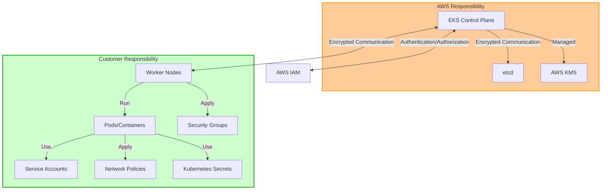
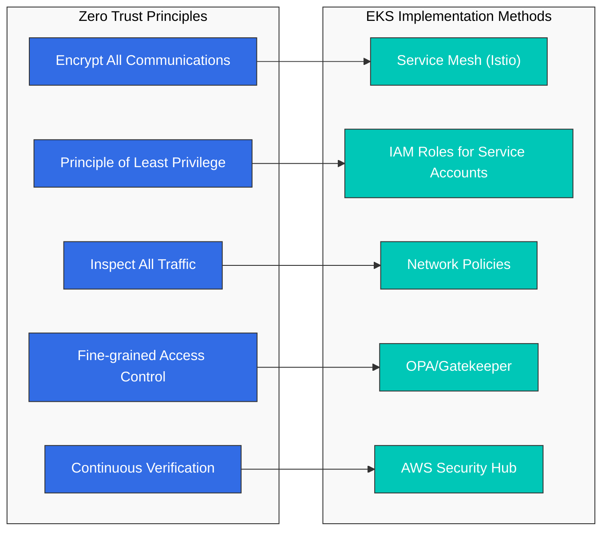
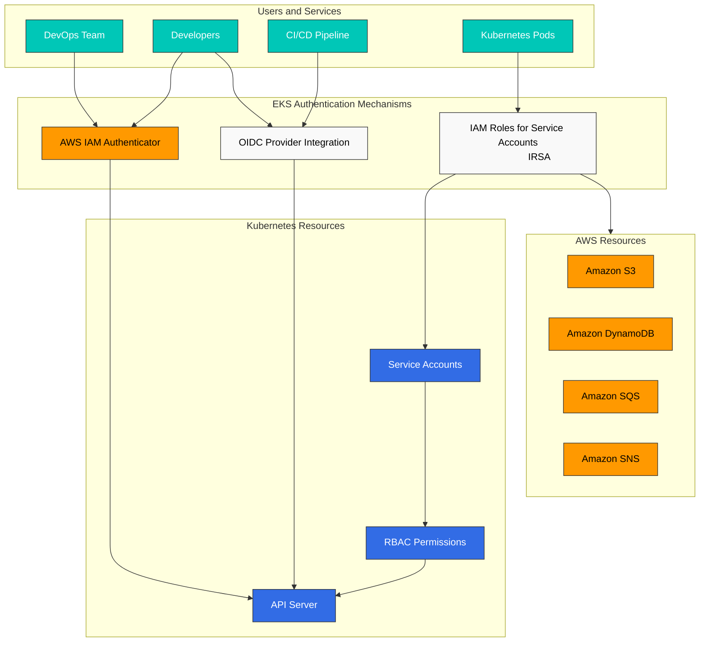
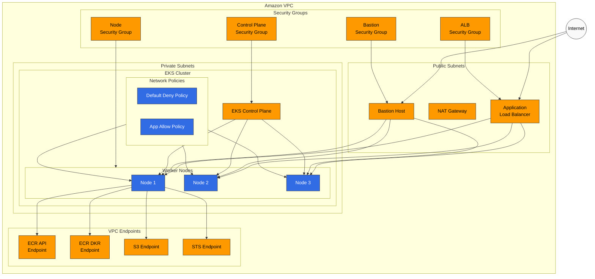
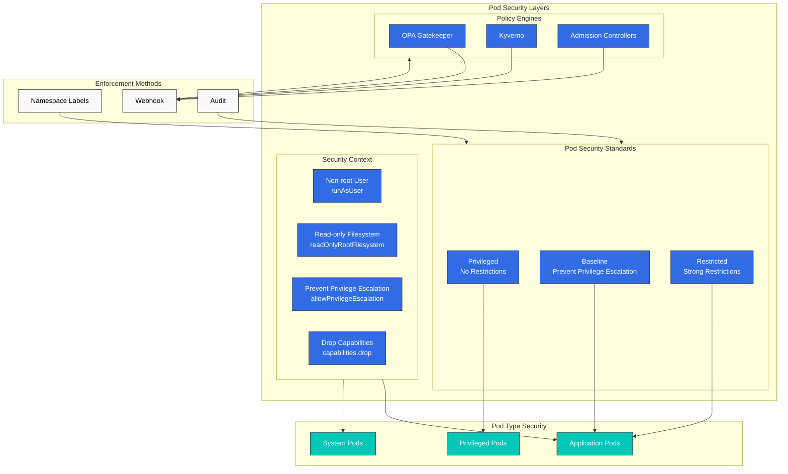
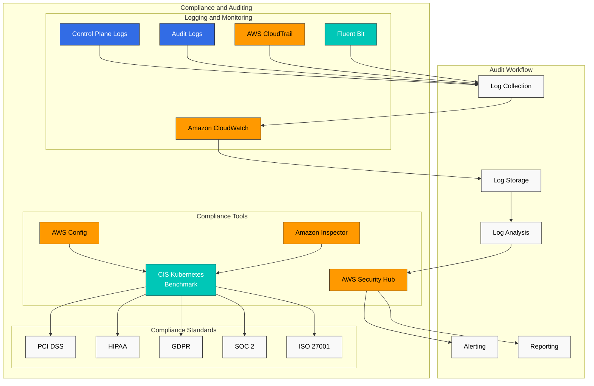
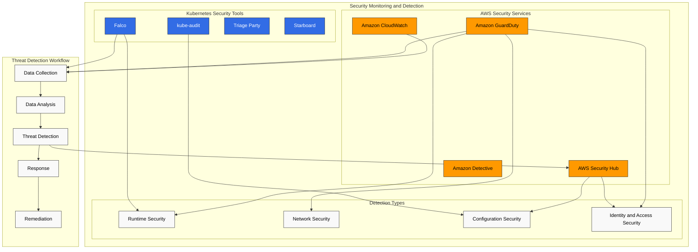
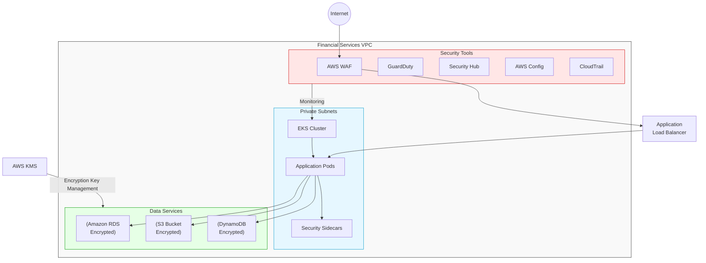

# Amazon EKS Security

> **Supported Versions**: Amazon EKS 1.31, 1.32, 1.33
> **Last Updated**: July 25, 2025

To securely run workloads on Amazon EKS (Elastic Kubernetes Service), you need to understand and implement various security layers and best practices. This document covers key concepts, components, and best practices for strengthening the security of your EKS cluster.

## Table of Contents

1. [EKS Security Overview](#eks-security-overview)
2. [Latest Security Trends (2023)](#latest-security-trends-2023)
3. [IAM and Authentication](#iam-and-authentication)
4. [Network Security](#network-security)
5. [Pod Security](#pod-security)
6. [Encryption and Secrets Management](#encryption-and-secrets-management)
7. [Compliance and Auditing](#compliance-and-auditing)
8. [Security Monitoring and Detection](#security-monitoring-and-detection)
9. [EKS Security Best Practices](#eks-security-best-practices)
10. [EKS Security Considerations for Financial Services](#eks-security-considerations-for-financial-services)

## EKS Security Overview

Amazon EKS combines the security features of AWS and Kubernetes to provide a multi-layered security architecture. EKS security consists of the following key areas:

- **Shared Responsibility Model**: AWS manages the security of the EKS control plane, while customers are responsible for the security of worker nodes, containers, and applications.
- **Infrastructure Security**: Network infrastructure security including VPC, subnets, and security groups
- **Cluster Security**: Kubernetes API server access control, RBAC, and service accounts
- **Workload Security**: Container image security, runtime security, and network policies

### EKS Security Architecture



## Latest Security Trends (2023)

The latest trends and recommendations in the Kubernetes and EKS security domain are as follows:

### 1. Zero Trust Architecture

Moving away from traditional perimeter-based security models, this approach does not trust any access by default and continuously verifies it.



Implementing Zero Trust in EKS:
- **Service Mesh**: mTLS communication between services using Istio or AWS App Mesh
- **IAM Roles for Service Accounts (IRSA)**: Fine-grained permission management
- **Network Policies**: Default deny policies that allow only necessary communication
- **OPA/Gatekeeper**: Policy-based access control
- **AWS Security Hub**: Continuous security posture monitoring

### 2. Supply Chain Security

As software supply chain attacks increase, security of the entire pipeline from container images to deployment has become important.

Key implementation methods:
- Adopt **SLSA (Supply-chain Levels for Software Artifacts)** framework
- **Image signing and verification**: Cosign, Notary v2
- **SBOM (Software Bill of Materials)** generation and management: Syft, Grype
- **Image scanning**: Amazon ECR image scanning, Trivy, Clair
- **GitOps security**: Signed commits, secure pipelines

### 3. Runtime Security and Threat Detection

As container runtime security becomes important, the following technologies are gaining attention:

- **eBPF-based security monitoring**: Cilium, Falco
- **AWS GuardDuty EKS Protection**: Runtime threat detection
- **Kubernetes Audit log analysis**: CloudWatch Logs Insights
- **Anomaly behavior detection**: Amazon Detective
- **Container escape prevention**: gVisor, Kata Containers

### 4. Policy as Code

An approach to managing security policies as code to improve consistency and automation:

- **OPA (Open Policy Agent)**: General-purpose policy engine
- **Kyverno**: Kubernetes-native policy management
- **AWS Config**: Compliance monitoring
- **Terraform Sentinel**: IaC policy enforcement
- **AWS CloudFormation Guard**: IaC policy validation

## IAM and Authentication

### EKS Authentication Mechanisms

Amazon EKS provides the following authentication mechanisms:

1. **AWS IAM Authenticator**: Authenticates to the Kubernetes API server using AWS IAM credentials.
2. **OIDC Provider Integration**: Integrates with external OIDC providers (e.g., Active Directory, Okta, Auth0) to manage user authentication.
3. **IAM Roles for Service Accounts**: Links AWS IAM roles to Kubernetes service accounts so pods can securely access AWS services.



### IAM Roles and Policy Configuration

#### EKS Cluster Role

Minimum permissions required when creating an EKS cluster:

```json
{
  "Version": "2012-10-17",
  "Statement": [
    {
      "Effect": "Allow",
      "Action": [
        "eks:CreateCluster",
        "eks:DescribeCluster",
        "eks:UpdateClusterConfig",
        "eks:DeleteCluster"
      ],
      "Resource": "*"
    },
    {
      "Effect": "Allow",
      "Action": "iam:PassRole",
      "Resource": "*",
      "Condition": {
        "StringEquals": {
          "iam:PassedToService": "eks.amazonaws.com"
        }
      }
    }
  ]
}
```

#### EKS Access Entry

EKS Access Entry is a new method that replaces the aws-auth ConfigMap for managing IAM user and role access to EKS clusters. Access Entry provides the following benefits:

- Improved stability as an AWS-managed solution
- Management through declarative API
- Version control and audit capabilities
- Separation of node IAM role and user/role access management

```bash
# Enable Access Entry for the cluster
aws eks update-cluster-config \
  --name my-cluster \
  --region us-west-2 \
  --access-config authenticationMode=API_AND_CONFIG_MAP

# Create Access Entry for IAM role
aws eks create-access-entry \
  --cluster-name my-cluster \
  --principal-arn arn:aws:iam::123456789012:role/DevTeamRole \
  --username dev-team \
  --kubernetes-groups dev-team

# Create Access Entry for IAM user
aws eks create-access-entry \
  --cluster-name my-cluster \
  --principal-arn arn:aws:iam::123456789012:user/admin \
  --username admin \
  --kubernetes-groups system:masters

# List Access Entries
aws eks list-access-entries --cluster-name my-cluster
```

> **Note**: EKS Access Entry was introduced in 2023 and provides a more stable and easier to manage method than the aws-auth ConfigMap. Existing clusters can migrate to a hybrid mode that supports both methods.

### IRSA (IAM Roles for Service Accounts)

IRSA allows you to link AWS IAM roles to Kubernetes service accounts so pods can securely access AWS services.

#### IRSA Setup Steps

1. Create an OIDC provider for the EKS cluster:

```bash
eksctl utils associate-iam-oidc-provider --cluster my-cluster --approve
```

2. Create IAM role and policy:

```bash
eksctl create iamserviceaccount \
  --name s3-reader \
  --namespace default \
  --cluster my-cluster \
  --attach-policy-arn arn:aws:iam::aws:policy/AmazonS3ReadOnlyAccess \
  --approve
```

3. Associate the service account with a pod:

```yaml
apiVersion: v1
kind: Pod
metadata:
  name: s3-reader
spec:
  serviceAccountName: s3-reader
  containers:
  - name: app
    image: amazonlinux:2
    command: ['sh', '-c', 'aws s3 ls']
```

## Network Security

### Security Groups

You can use AWS security groups to control network traffic to nodes and pods in your EKS cluster.



#### Cluster Security Group

The EKS cluster security group allows communication between the control plane and worker nodes:

- Port 443 (HTTPS): Cluster API server communication
- Port 10250: kubelet API
- Port range 1025-65535: Inter-node communication

#### Node Security Group

Recommended security group configuration for worker nodes:

- Inbound: Allow traffic from cluster security group
- Outbound: Allow all traffic (can be restricted as needed)

### Network Policies

You can use Kubernetes network policies to control communication between pods. In EKS, you can implement network policies through network plugins such as Amazon VPC CNI, Calico, and Cilium.

#### Default Deny Policy Example

```yaml
apiVersion: networking.k8s.io/v1
kind: NetworkPolicy
metadata:
  name: default-deny
  namespace: default
spec:
  podSelector: {}
  policyTypes:
  - Ingress
  - Egress
```

#### Allow Policy Example for Specific Applications

```yaml
apiVersion: networking.k8s.io/v1
kind: NetworkPolicy
metadata:
  name: api-allow
  namespace: default
spec:
  podSelector:
    matchLabels:
      app: api
  policyTypes:
  - Ingress
  ingress:
  - from:
    - podSelector:
        matchLabels:
          app: frontend
    ports:
    - protocol: TCP
      port: 8080
```

### VPC Endpoints

Use VPC endpoints for private access to AWS services to securely access AWS services without going through an internet gateway.

Recommended VPC endpoints for EKS clusters:

- com.amazonaws.region.ecr.api
- com.amazonaws.region.ecr.dkr
- com.amazonaws.region.s3
- com.amazonaws.region.logs
- com.amazonaws.region.sts

## Pod Security

### Pod Security Standards (PSS)

Pod Security Standards, introduced in Kubernetes 1.23, provide a built-in mechanism for restricting the security context of pods. You can apply the following levels of PSS in EKS:

- **Privileged**: No restrictions
- **Baseline**: Prevent known privilege escalation
- **Restricted**: Apply strong security restrictions



Example of applying PSS to a namespace:

```yaml
apiVersion: v1
kind: Namespace
metadata:
  name: secure-ns
  labels:
    pod-security.kubernetes.io/enforce: restricted
    pod-security.kubernetes.io/audit: restricted
    pod-security.kubernetes.io/warn: restricted
```

### Security Context

You can configure security context at the pod and container level to restrict privileges:

```yaml
apiVersion: v1
kind: Pod
metadata:
  name: secure-pod
spec:
  securityContext:
    runAsUser: 1000
    runAsGroup: 3000
    fsGroup: 2000
  containers:
  - name: secure-container
    image: nginx
    securityContext:
      allowPrivilegeEscalation: false
      readOnlyRootFilesystem: true
      capabilities:
        drop:
        - ALL
```

### OPA Gatekeeper and Kyverno

You can apply security policies across the cluster using policy engines like OPA Gatekeeper or Kyverno.

#### Kyverno Policy Example - Prevent Privileged Containers

```yaml
apiVersion: kyverno.io/v1
kind: ClusterPolicy
metadata:
  name: disallow-privileged-containers
spec:
  validationFailureAction: enforce
  rules:
  - name: privileged-containers
    match:
      resources:
        kinds:
        - Pod
    validate:
      message: "Privileged containers are not allowed"
      pattern:
        spec:
          containers:
          - name: "*"
            securityContext:
              privileged: false
```

## Encryption and Secrets Management

### EKS Encryption Options

#### etcd Encryption

EKS encrypts Kubernetes secrets stored in etcd by default. You can use AWS KMS for an additional layer of encryption:

```mermaid
flowchart TD
    subgraph Encryption_Options ["EKS Encryption Options"]
        subgraph ETCD_Encryption ["etcd Encryption"]
            Default[Default Encryption]
            KMS_Encryption[AWS KMS Encryption]
        end

        subgraph Secret_Management ["Secrets Management Solutions"]
            K8s_Secrets[Kubernetes Secrets]
            AWS_SM[AWS Secrets Manager]
            AWS_PS[AWS Parameter Store]
            Vault[HashiCorp Vault]
            SOPS[Mozilla SOPS]
        end

        subgraph Integration_Tools ["Integration Tools"]
            ESO["External Secrets
                Operator"]
            ASCP["AWS Secrets and
                Configuration Provider"]
            CSI_Driver["Secrets Store
                CSI Driver"]
        end
    end

    subgraph Usage_Patterns ["Usage Patterns"]
        subgraph Storage ["Storage"]
            Encrypted_Storage[Encrypted Storage]
            Version_Control[Version Control]
            Access_Control[Access Control]
        end

        subgraph Retrieval ["Retrieval"]
            Pod_Mount[Pod Mount]
            Env_Vars[Environment Variables]
            Init_Container[Init Container]
        end
    end

    KMS_Encryption --> Default

    AWS_SM --> ESO
    AWS_PS --> ESO
    AWS_SM --> ASCP
    AWS_PS --> ASCP
    Vault --> CSI_Driver

    ESO --> K8s_Secrets
    ASCP --> K8s_Secrets
    CSI_Driver --> K8s_Secrets

    K8s_Secrets --> Encrypted_Storage
    AWS_SM --> Encrypted_Storage
    AWS_PS --> Encrypted_Storage
    Vault --> Encrypted_Storage
    SOPS --> Encrypted_Storage

    AWS_SM --> Version_Control
    Vault --> Version_Control

    AWS_SM --> Access_Control
    AWS_PS --> Access_Control
    Vault --> Access_Control

    K8s_Secrets --> Pod_Mount
    K8s_Secrets --> Env_Vars
    K8s_Secrets --> Init_Container

    %% Class definitions
    classDef awsService fill:#FF9900,stroke:#333,stroke-width:1px,color:black;
    classDef k8sComponent fill:#326CE5,stroke:#333,stroke-width:1px,color:white;
    classDef userApp fill:#00C7B7,stroke:#333,stroke-width:1px,color:white;
    classDef dataStore fill:#3B48CC,stroke:#333,stroke-width:1px,color:white;
    classDef default fill:#f9f9f9,stroke:#333,stroke-width:1px,color:black;

    %% Class application
    class KMS_Encryption,AWS_SM,AWS_PS,ASCP awsService;
    class K8s_Secrets,ESO,CSI_Driver k8sComponent;
    class Vault,SOPS userApp;
    class Default,Encrypted_Storage,Version_Control,Access_Control,Pod_Mount,Env_Vars,Init_Container default;
```



```bash
eksctl create cluster --name my-cluster --region us-west-2 --encryption-provider-config-key arn:aws:kms:us-west-2:111122223333:key/1234abcd-12ab-34cd-56ef-1234567890ab
```

### AWS Secrets Manager and Parameter Store Integration

You can use External Secrets Operator or AWS Secrets and Configuration Provider (ASCP) to mount secrets stored in AWS Secrets Manager or Parameter Store to Kubernetes pods.

#### Install External Secrets Operator

```bash
helm repo add external-secrets https://charts.external-secrets.io
helm install external-secrets external-secrets/external-secrets -n external-secrets --create-namespace
```

#### Define SecretStore and ExternalSecret

```yaml
apiVersion: external-secrets.io/v1beta1
kind: SecretStore
metadata:
  name: aws-secretsmanager
spec:
  provider:
    aws:
      service: SecretsManager
      region: us-west-2
      auth:
        jwt:
          serviceAccountRef:
            name: external-secrets-sa
---
apiVersion: external-secrets.io/v1beta1
kind: ExternalSecret
metadata:
  name: db-credentials
spec:
  refreshInterval: 1h
  secretStoreRef:
    name: aws-secretsmanager
    kind: SecretStore
  target:
    name: db-credentials
  data:
  - secretKey: username
    remoteRef:
      key: db-credentials
      property: username
  - secretKey: password
    remoteRef:
      key: db-credentials
      property: password
```

### SOPS (Secrets OPerationS)

You can use Mozilla SOPS to securely store and manage encrypted secrets in Git repositories.

#### SOPS Installation and Usage

```bash
# Install SOPS
brew install sops

# Encrypt secrets using AWS KMS key
sops --encrypt --aws-profile default --kms arn:aws:kms:us-west-2:111122223333:key/1234abcd-12ab-34cd-56ef-1234567890ab secrets.yaml > secrets.enc.yaml

# Decrypt encrypted secrets
sops --decrypt secrets.enc.yaml
```

## Compliance and Auditing

### EKS Audit Logging

You can enable EKS control plane audit logs to record all API calls made in the cluster:



```bash
aws eks update-cluster-config \
  --region us-west-2 \
  --name my-cluster \
  --logging '{"clusterLogging":[{"types":["api","audit","authenticator","controllerManager","scheduler"],"enabled":true}]}'
```

### AWS Config Rules

You can use AWS Config to monitor the compliance status of your EKS cluster:

- eks-cluster-logging-enabled
- eks-cluster-oldest-supported-version
- eks-endpoint-no-public-access
- eks-secrets-encrypted

### AWS Security Hub Integration

You can use AWS Security Hub to centrally manage and monitor the security posture of your EKS cluster. Security Hub checks compliance against industry standards such as the CIS Kubernetes Benchmark.

## Security Monitoring and Detection

### GuardDuty EKS Protection

You can enable Amazon GuardDuty EKS Protection to detect potential security threats in your EKS cluster:



```bash
aws guardduty update-detector \
  --detector-id 12abc34d567e8fa901bc2d34e56789f0 \
  --features '[{"Name": "EKS_RUNTIME_MONITORING", "Status": "ENABLED"}]'
```

### AWS Security Hub

You can use AWS Security Hub to centrally manage and monitor the security posture of your EKS cluster:

```bash
aws securityhub enable-security-hub
aws securityhub batch-enable-standards --standards-subscription-requests '[{"StandardsArn":"arn:aws:securityhub:us-west-2::standards/aws-foundational-security-best-practices/v/1.0.0"}]'
```

### Falco

You can use Falco to perform runtime security monitoring and anomaly detection:

```bash
helm repo add falcosecurity https://falcosecurity.github.io/charts
helm install falco falcosecurity/falco --namespace falco --create-namespace
```

Falco rule example:

```yaml
- rule: Terminal shell in container
  desc: A shell was spawned by a pod in the container
  condition: container and shell_procs and not container_entrypoint
  output: Shell spawned in a container (user=%user.name pod=%k8s.pod.name container=%container.name shell=%proc.name parent=%proc.pname cmdline=%proc.cmdline)
  priority: WARNING
```

## EKS Security Best Practices

### Cluster Security Hardening

1. **Maintain Latest Kubernetes Version**: Regularly upgrade EKS cluster to latest version to apply security patches
2. **Use Private API Endpoint**: Restrict access to API server from public internet
3. **Apply Principle of Least Privilege**: Apply principle of least privilege to IAM roles and RBAC
4. **Restrict Security Groups**: Configure security groups to allow only necessary ports
5. **Implement Network Policies**: Apply network policies to restrict communication between pods

### Node and Container Security

1. **Use Latest AMI**: Use EKS-optimized AMI with latest security patches
2. **Scan Container Images**: Use ECR image scanning or tools like Trivy for vulnerability scanning
3. **Use Immutable Infrastructure**: Create new node groups and delete old node groups when updating nodes
4. **Run Containers as Non-Root User**: Run containers as non-root user to limit privileges
5. **Use Read-Only Filesystem**: Mount container root filesystem as read-only when possible

### Continuous Security Monitoring

1. **Enable Audit Logging**: Enable EKS control plane audit logs
2. **Enable GuardDuty EKS Protection**: Enable GuardDuty EKS Protection for runtime security monitoring
3. **Security Hub Integration**: Use AWS Security Hub for centralized security posture management
4. **Regular Security Assessments**: Perform regular security assessments based on CIS Kubernetes Benchmark
5. **Establish Incident Response Plan**: Establish and test security incident response plan for EKS cluster

## EKS Security Considerations for Financial Services

Additional security requirements to consider when using EKS in the financial services industry:

### Regulatory Compliance

1. **PCI DSS**: PCI DSS requirements compliance for workloads processing card payment data
2. **GDPR/CCPA**: Compliance with data protection regulations for personally identifiable information (PII)
3. **Financial Regulations**: Compliance with domestic financial regulatory requirements (e.g., Financial Supervisory Service guidelines)

### Data Security

1. **Encryption in Transit**: Encrypt all network communications using TLS 1.2 or higher
2. **Data at Rest Encryption**: Encrypt data at rest using AWS KMS
3. **Data Classification**: Classify data by sensitivity and apply appropriate security controls
4. **Data Access Logging**: Detailed logging and monitoring for all sensitive data access

### High Availability and Disaster Recovery

1. **Multi-AZ Deployment**: Deploy EKS cluster across multiple availability zones
2. **Disaster Recovery Plan**: Establish disaster recovery plan including regular backups and recovery testing
3. **Business Continuity**: Define RTO (Recovery Time Objective) and RPO (Recovery Point Objective) appropriate for financial services

### EKS Security Architecture Example for Financial Services



## Conclusion

Amazon EKS security is implemented through a multi-layered defense strategy. You can securely operate your EKS cluster through strong authentication and authorization via IAM and RBAC, network security through network policies and security groups, workload security through Pod Security Standards and security context, and integration with various AWS security services.

In industries with strict regulations such as financial services, additional security controls and compliance requirements should be considered. It is important to maintain the security posture of your EKS environment through regular security assessments, vulnerability scanning, and continuous monitoring.

## References

- [Amazon EKS Security Best Practices](https://aws.github.io/aws-eks-best-practices/security/docs/)
- [Kubernetes Security Best Practices](https://kubernetes.io/docs/concepts/security/overview/)
- [CIS Kubernetes Benchmark](https://www.cisecurity.org/benchmark/kubernetes)
- [AWS Security Hub](https://aws.amazon.com/security-hub/)
- [Amazon GuardDuty](https://aws.amazon.com/guardduty/)

## Quiz

To test what you learned in this chapter, try the [topic quiz](../quizzes/eks/05-eks-security-quiz.md).
