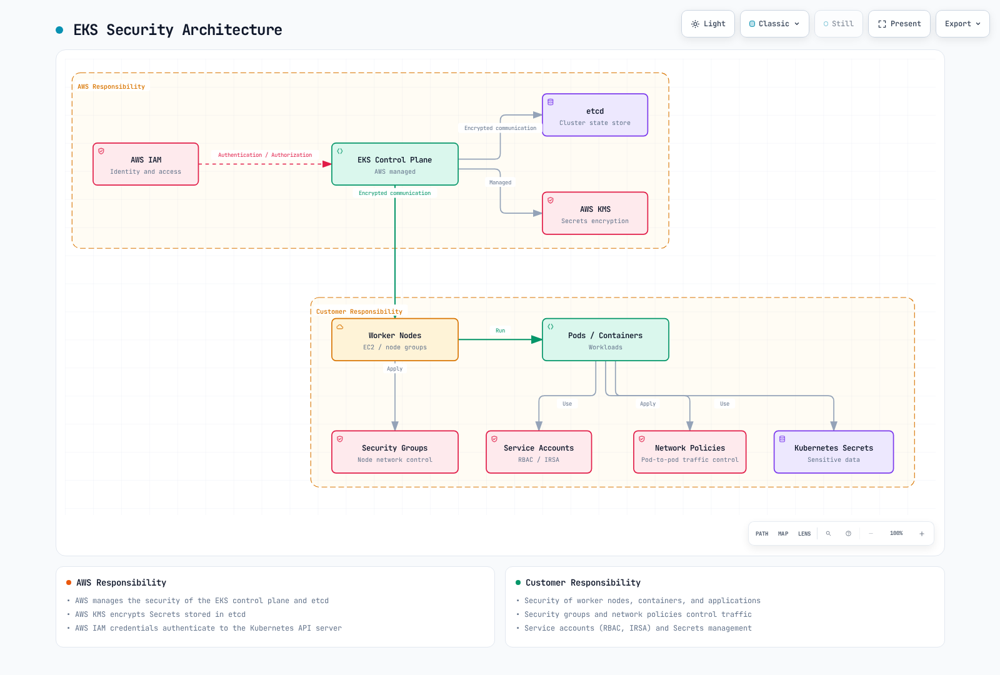
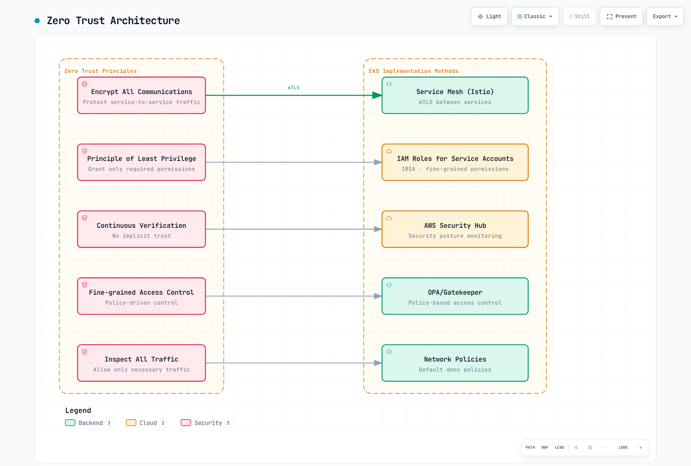
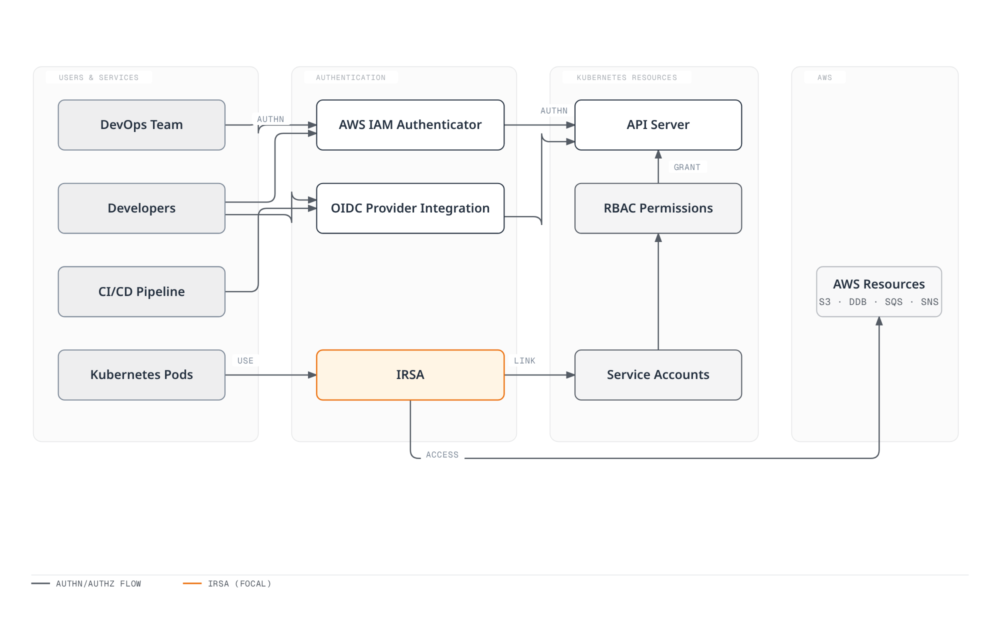
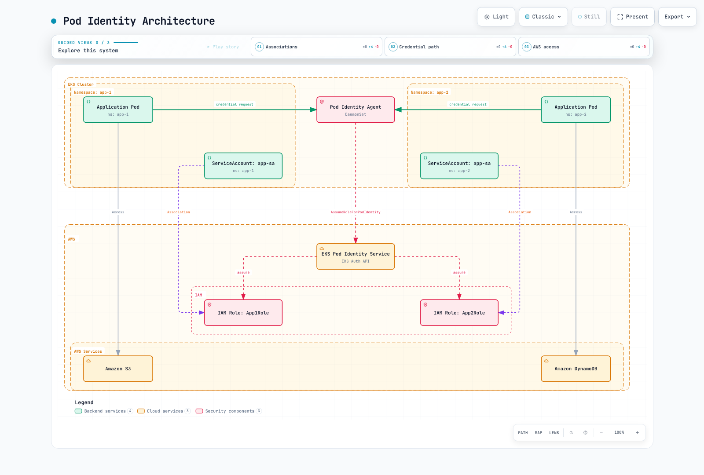
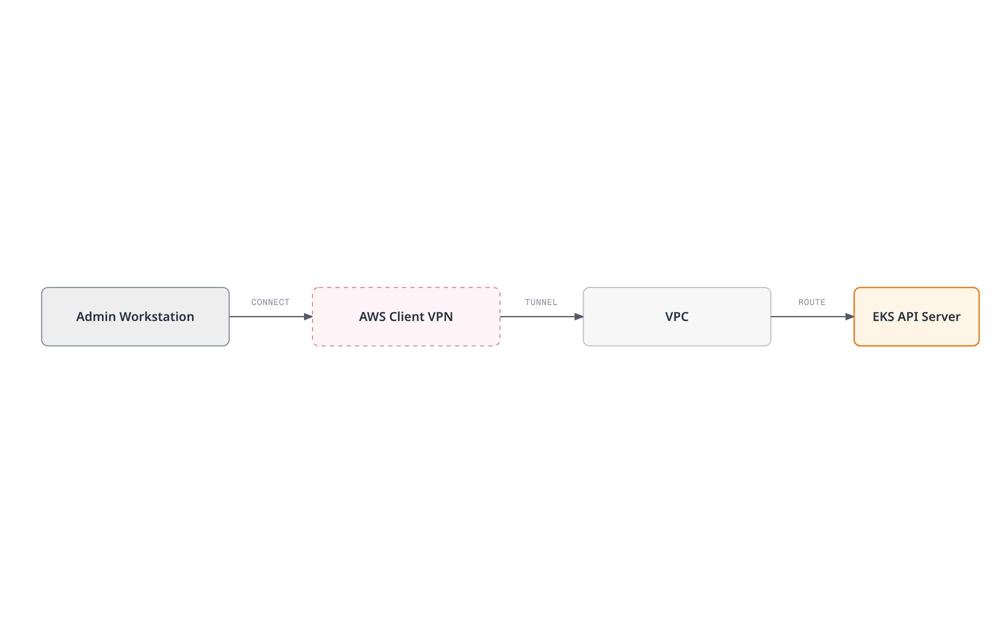
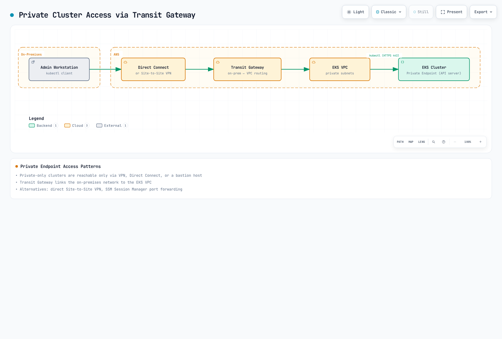
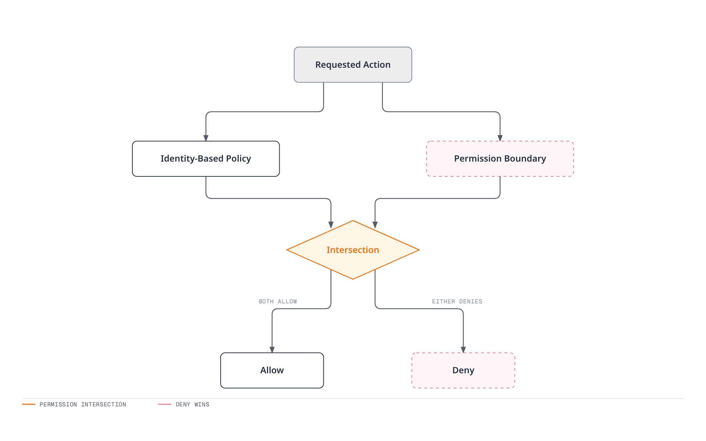

# Amazon EKS Security

> **Supported Versions**: EKS standard support 1.34–1.36; extended support 1.31–1.33 (checked September 11, 2026)
> **Last Updated**: September 11, 2026

To securely run workloads on Amazon EKS (Elastic Kubernetes Service), you need to understand and implement various security layers and best practices. This document covers key concepts, components, and best practices for strengthening the security of your EKS cluster.

## Table of Contents

1. [EKS Security Overview](#eks-security-overview)
2. [Security Practices](#security-practices)
3. [IAM and Authentication](#iam-and-authentication)
4. [OIDC Provider Deep Dive](#oidc-provider-deep-dive)
5. [EKS Pod Identity](#eks-pod-identity)
6. [Cluster Endpoint Access Control](#cluster-endpoint-access-control)
7. [Network Security](#network-security)
8. [Pod Security](#pod-security)
9. [Bottlerocket and Read-Only OS](#bottlerocket-and-read-only-os)
10. [IAM Permission Boundaries](#iam-permission-boundaries)
11. [Encryption and Secrets Management](#encryption-and-secrets-management)
12. [Compliance and Auditing](#compliance-and-auditing)
13. [Security Monitoring and Detection](#security-monitoring-and-detection)
14. [EKS Security Best Practices](#eks-security-best-practices)
15. [EKS Security Considerations for Financial Services](#eks-security-considerations-for-financial-services)

## EKS Security Overview

Separate infrastructure, cluster access and workload controls. AWS manages the control plane; node/OS responsibility depends on EC2 self-managed or managed nodes, Fargate, Auto Mode or Hybrid Nodes. Customers still own application images, identities, data handling and workload policy. A standard EC2 node diagram does not imply that customers patch Auto Mode/Fargate host operating systems.



[🔍 View interactive diagram](https://www.atomai.click/kubernetes-docs/archmaps/en-eks-05-eks-security-0.html)

## Security Practices

Use multiple controls with explicit scope; no single tool establishes zero trust or certifies a workload. Verify caller/workload identity, authorize the intended operation, restrict network paths and collect evidence appropriate to the threat model.

<!-- Diagram repair pending: network policies filter traffic; posture findings are not continuous request authentication or complete zero-trust enforcement.


[🔍 View interactive diagram](https://www.atomai.click/kubernetes-docs/archmaps/en-eks-05-eks-security-1.html)
-->

### Identity and Network Controls

IRSA and Pod Identity provide workload AWS credentials; NetworkPolicy provides supported network filtering; an admission engine checks configured Kubernetes requests. A compatible maintained service mesh can add mTLS and application traffic policy. AWS App Mesh reaches end of support on September30,2026, so an existing deployment needs a migration plan rather than a new default recommendation.

### Supply Chain Security

Use a reviewed build/provenance process such as SLSA, inventory components with an SBOM, scan for relevant vulnerabilities and verify artifact signatures against the intended signer identity. Syft is an SBOM tool; Grype is a vulnerability scanner. ECR/Inspector and other scanners have specific coverage and update requirements. A signed or scanned image is not proof that its code is harmless. Protect the build identity, repository and admission configuration too.

Current ECR supports managed image signing with AWS Signer as well as manual signing through Notation. Signing and admission verification are separate steps; registry filters, signing-profile permissions and verifier trust must match the intended pipeline.

### Runtime Detection and Policy as Code

GuardDuty EKS Protection analyzes an independent EKS audit-log stream. Runtime Monitoring is a separate agent-based capability; current support includes EKS on EC2 and Auto Mode, with platform/agent requirements, and excludes EKS Fargate and Hybrid Nodes. CloudWatch audit-log delivery is a separate configuration. Security Hub CSPM evaluates configured controls; Security Hub can correlate findings. Neither replaces application authorization or an assessment of all regulatory requirements.

Use supported runtime tools and policy engines such as Falco, Gatekeeper or Kyverno with the required kernel, controller, API and metadata integration. Additional sandbox runtimes such as gVisor/Kata require a compatible node/runtime design and are not available on every EKS compute path. Policy, image or OS hardening reduces specific risks; it does not guarantee that every escape or malicious action is impossible.

Policy-as-code tools also operate at different stages: Gatekeeper/Kyverno can evaluate Kubernetes admission, CloudFormation Guard or Sentinel can evaluate infrastructure changes, and AWS Config evaluates supported deployed-resource configuration. Investigation tools such as Detective depend on their configured data sources. Keep these roles distinct from runtime prevention.

## IAM and Authentication

| Identity/control | Purpose |
|---|---|
| Human/automation IAM principal | Authenticate cluster access through the configured IAM mapping/access-entry path |
| Kubernetes RBAC and EKS access policies | Authorize Kubernetes operations; allows are additive |
| External OIDC identity provider | Separately configured Kubernetes API user login with client/claim settings |
| EKS cluster IAM role | Allows the EKS service to call AWS APIs for the cluster |
| EC2 node IAM role | Supports bootstrap and required node-agent AWS operations |
| IRSA or EKS Pod Identity role | Gives an application temporary AWS credentials |
| Kubernetes ServiceAccount token | Authenticates a Pod to Kubernetes APIs under its RBAC permissions |

The IAM OIDC provider used for IRSA is distinct from an external OIDC provider associated for Kubernetes user login. Application AWS permissions do not automatically grant Kubernetes API permissions.

<!-- Diagram repair pending: IRSA/Pod Identity give workload AWS credentials; the ordinary Pod-to-Kubernetes API path uses its Kubernetes ServiceAccount token/RBAC.


[🔍 View interactive diagram](https://www.atomai.click/kubernetes-docs/archmaps/en-eks-05-eks-security-2.html)
-->

### Cluster Role and Provisioning Caller

A standard EKS cluster role trusts the EKS service. This is its trust relationship, not the human developer’s permissions policy:

```json
{
  "Version": "2012-10-17",
  "Statement": [
    {
      "Effect": "Allow",
      "Principal": {
        "Service": "eks.amazonaws.com"
      },
      "Action": "sts:AssumeRole"
    }
  ]
}
```

The role needs AmazonEKSClusterPolicy or a supported custom policy for its service operations. Auto Mode has additional role/policy requirements. The provisioning caller separately needs the actions required by the selected configuration and permission to pass the intended role. The current authorization reference lists CreateCluster without resource-ARN scoping, so use supported request conditions there; scope actions/PassRole that support resource ARNs. Attaching AmazonEKSClusterPolicy to a developer role does not grant Kubernetes application access.

### Access Entries and Namespace Authorization

Prefer the supported access-entry API for IAM cluster access. Inspect the current mode and preserve existing administrator/node mappings before migration. Moving from CONFIG_MAP to API_AND_CONFIG_MAP/API is not a freely reversible switch. Do not overwrite aws-auth with a short sample that omits node roles. Review all identities, policies, nodes and a recovery path before choosing API-only mode.

```bash
set -euo pipefail
: "${CLUSTER_NAME:?Set the existing cluster name}"
: "${AWS_REGION:?Set its Region}"
aws eks describe-cluster --name "$CLUSTER_NAME" --region "$AWS_REGION" \
  --query 'cluster.{Name:name,Status:status,Endpoint:endpoint,Access:accessConfig}' --output json
```

The following example assumes a prepared approved IAM developer role, a cluster that already supports access entries, and the platform operator’s permissions. Prepare the dedicated namespace through its owner. Its Pod Security Admission version matches the reviewed EKS1.36 example; select the appropriate version for the target cluster:

```yaml
apiVersion: v1
kind: Namespace
metadata:
  name: security-demo
  labels:
    pod-security.kubernetes.io/enforce: restricted
    pod-security.kubernetes.io/enforce-version: v1.36
```


```bash
set -euo pipefail
: "${CLUSTER_NAME:?Set the verified cluster name}"
: "${AWS_REGION:?Set its Region}"
: "${DEVELOPER_ROLE_ARN:?Set a prepared IAM role ARN, not an STS session ARN}"
MODE=$(aws eks describe-cluster --name "$CLUSTER_NAME" --region "$AWS_REGION" \
  --query cluster.accessConfig.authenticationMode --output text)
case "$MODE" in
  API|API_AND_CONFIG_MAP) ;;
  *) echo "Access entries are not enabled; review the migration first"; exit 1 ;;
esac
aws eks list-access-entries --cluster-name "$CLUSTER_NAME" --region "$AWS_REGION" \
  --output json > security-access-entries.json
python3 - "$DEVELOPER_ROLE_ARN" <<'PY'
import json, sys
with open("security-access-entries.json") as stream:
    existing = json.load(stream)["accessEntries"]
if sys.argv[1] in existing:
    raise SystemExit("Entry already exists; inspect its groups/policies instead of overwriting")
PY
aws eks create-access-entry --cluster-name "$CLUSTER_NAME" --region "$AWS_REGION" \
  --principal-arn "$DEVELOPER_ROLE_ARN" --type STANDARD \
  --kubernetes-groups security-demo-developers
```


```yaml
apiVersion: rbac.authorization.k8s.io/v1
kind: Role
metadata:
  name: developer
  namespace: security-demo
rules:
- apiGroups:
  - ''
  resources:
  - pods
  verbs:
  - get
  - list
  - watch
- apiGroups:
  - apps
  resources:
  - deployments
  verbs:
  - get
  - list
  - watch
  - create
  - update
  - patch
- apiGroups:
  - batch
  resources:
  - jobs
  verbs:
  - get
  - list
  - watch
  - create
  - update
  - patch
---
apiVersion: rbac.authorization.k8s.io/v1
kind: RoleBinding
metadata:
  name: developer
  namespace: security-demo
subjects:
- kind: Group
  name: security-demo-developers
  apiGroup: rbac.authorization.k8s.io
roleRef:
  kind: Role
  name: developer
  apiGroup: rbac.authorization.k8s.io
```

The entry maps the IAM principal to a group, and RoleBinding gives that group the shown namespace permissions. Group names alone do not establish namespace boundaries. Permission to create workload controllers can produce Pods that use ServiceAccounts, Secrets and PVCs in the namespace. Separate tenants and constrain workload/service-account use through appropriate admission and ownership controls.

For a separately reviewed viewer entry, an EKS access policy is an alternative to custom RBAC. Inspect the entry’s current groups and associated policies before adding this namespace view grant:

```bash
set -euo pipefail
: "${CLUSTER_NAME:?Set the verified cluster name}"
: "${AWS_REGION:?Set its Region}"
: "${VIEWER_ROLE_ARN:?Set the IAM principal of a prepared, reviewed access entry}"
aws eks list-associated-access-policies --cluster-name "$CLUSTER_NAME" --region "$AWS_REGION" \
  --principal-arn "$VIEWER_ROLE_ARN"
aws eks associate-access-policy --cluster-name "$CLUSTER_NAME" --region "$AWS_REGION" \
  --principal-arn "$VIEWER_ROLE_ARN" \
  --policy-arn arn:aws:eks::aws:cluster-access-policy/AmazonEKSViewPolicy \
  --access-scope type=namespace,namespaces=security-demo
```

Adding View does not revoke broader RBAC/access-policy grants. Updates can take time to propagate. Test with the actual intended IAM login; kubectl --as tests Kubernetes impersonation/RBAC rather than proving the IAM access-policy path. A kubeconfig points the client to a cluster and credential mechanism; it grants no permissions by itself.

IAM eks:DescribeCluster/ListClusters support AWS management/discovery operations. eks:AccessKubernetesApi is a console-view permission. The eks:namespaces condition filters access-policy association requests; it is not a general namespace filter on kubectl API calls.

## OIDC Provider Deep Dive

EKS publishes a cluster OIDC issuer and public signing keys. That endpoint alone does not create an IAM OIDC provider or authorize role assumption. For IRSA, the role account must have the intended IAM OIDC provider, the role must trust it with the correct issuer/subject/audience conditions, and the workload must use a compatible SDK.


[🔍 View interactive diagram](https://www.atomai.click/kubernetes-docs/archmaps/en-eks-05-eks-security-3.html)

### IRSA Token and Role Exchange

The IRSA webhook adds a projected token/role configuration to an eligible Pod. The SDK exchanges the web-identity token with STS using AssumeRoleWithWebIdentity. STS validates the issuer/signature/token and role trust, then returns temporary AWS credentials. The application uses those credentials for its permitted AWS operations. Kubernetes rotates the projected token; the SDK refreshes AWS credentials. These are different lifetimes.

This is an illustrative **decoded payload shape**, with deliberately old/expired timestamps and placeholder identities. It is not a signed token or an authentication test. The STS audience is for the IRSA path; Pod Identity uses a different audience:

```json
{
  "aud": [
    "sts.amazonaws.com"
  ],
  "exp": 1234567890,
  "iat": 1234567800,
  "iss": "https://oidc.eks.us-west-2.amazonaws.com/id/REPLACE_WITH_CLUSTER_ISSUER_ID",
  "kubernetes.io": {
    "namespace": "security-demo",
    "pod": {
      "name": "irsa-read-check-example",
      "uid": "example-pod-uid"
    },
    "serviceaccount": {
      "name": "irsa-reader",
      "uid": "example-serviceaccount-uid"
    }
  },
  "sub": "system:serviceaccount:security-demo:irsa-reader"
}
```

Validate issuer, audience, expiration and the expected subject, not only whether JSON can be decoded. Keep raw tokens, AWS secret access keys and session tokens out of examples/logs. A role can trust multiple explicitly permitted service accounts or issuers; IRSA does not require exactly one role per ServiceAccount.

### Discovery and JWKS Inspection

Use the issuer returned for the actual cluster. This diagnostic retrieves public discovery/JWKS documents and checks the discovery issuer/HTTPS scheme. It does not validate a workload token or IAM permissions:

```bash
set -euo pipefail
: "${CLUSTER_NAME:?Set the verified cluster}"
: "${AWS_REGION:?Set its Region}"
OIDC_URL=$(aws eks describe-cluster --name "$CLUSTER_NAME" --region "$AWS_REGION" \
  --query cluster.identity.oidc.issuer --output text)
case "$OIDC_URL" in https://*) ;; *) echo "Unexpected issuer URL"; exit 1 ;; esac
curl --fail --silent --show-error --proto '=https' --connect-timeout 5 --max-time 20 \
  "${OIDC_URL%/}/.well-known/openid-configuration" > oidc-discovery.json
JWKS_URI=$(python3 - "$OIDC_URL" <<'PY'
import json, sys, urllib.parse
with open("oidc-discovery.json") as stream:
    doc = json.load(stream)
if doc["issuer"] != sys.argv[1]:
    raise SystemExit("Discovery issuer does not match the cluster issuer")
uri = doc["jwks_uri"]
parsed = urllib.parse.urlparse(uri)
if parsed.scheme != "https" or not parsed.hostname or parsed.username or parsed.password:
    raise SystemExit("JWKS must be an HTTPS URL without embedded credentials")
print(uri)
PY
)
curl --fail --silent --show-error --proto '=https' --connect-timeout 5 --max-time 20 \
  "$JWKS_URI" > oidc-jwks.json
python3 - <<'PY'
import json
with open("oidc-jwks.json") as stream:
    keys = json.load(stream).get("keys")
if not isinstance(keys, list) or not keys or not all(isinstance(k, dict) and "kty" in k for k in keys):
    raise SystemExit("Unexpected JWKS response")
print("Fetched", len(keys), "public keys; no token signature was validated")
PY
```

Automated validators must cache keys according to Cache-Control and handle signing-key rotation/unknown kid using a reviewed JWT library. EKS rotates its OIDC signing key every seven days. Current EKS also supports a PrivateLink interface endpoint for cluster OIDC discovery/JWKS, `com.amazonaws.region-code.oidc-eks`, for validators without internet egress. Verify that endpoint’s region/DNS requirements; an EKS management API endpoint is a different service.

### A Scoped IRSA Example

Prepare the IAM OIDC provider, role and bucket through their owners. Replace the account, complete issuer hostname/path and role ARN consistently; IPv6 clusters can use the dual-stack issuer hostname. This example binds only security-demo/irsa-reader and the STS audience; it is a new role trust example, not a replacement for an existing role’s other trust statements:

```json
{
  "Version": "2012-10-17",
  "Statement": [
    {
      "Effect": "Allow",
      "Principal": {
        "Federated": "arn:aws:iam::111122223333:oidc-provider/oidc.eks.us-west-2.amazonaws.com/id/REPLACE_WITH_CLUSTER_ISSUER_ID"
      },
      "Action": "sts:AssumeRoleWithWebIdentity",
      "Condition": {
        "StringEquals": {
          "oidc.eks.us-west-2.amazonaws.com/id/REPLACE_WITH_CLUSTER_ISSUER_ID:sub": "system:serviceaccount:security-demo:irsa-reader",
          "oidc.eks.us-west-2.amazonaws.com/id/REPLACE_WITH_CLUSTER_ISSUER_ID:aud": "sts.amazonaws.com"
        }
      }
    }
  ]
}
```

The read policy allows a specific bucket prefix. Add only the required KMS permissions when objects use a customer managed encryption key, and review bucket/endpoint policies. No account-wide AmazonS3ReadOnlyAccess policy is required for this one-prefix example:

```json
{
  "Version": "2012-10-17",
  "Statement": [
    {
      "Effect": "Allow",
      "Action": [
        "s3:ListBucket"
      ],
      "Resource": "arn:aws:s3:::replace-with-owned-security-bucket",
      "Condition": {
        "StringLike": {
          "s3:prefix": [
            "security-demo/",
            "security-demo/*"
          ]
        }
      }
    },
    {
      "Effect": "Allow",
      "Action": [
        "s3:GetObject"
      ],
      "Resource": "arn:aws:s3:::replace-with-owned-security-bucket/security-demo/*"
    }
  ]
}
```

After preparing the security-demo namespace and role, create the ServiceAccount and bounded listing Job below. The official AWS CLI image includes the client; an arbitrary amazonlinux:2 image does not guarantee that. Replace bucket/Region/role values. The Job lists a prefix without printing secret values; success of this operation is not proof of every application GetObject/KMS permission.

```yaml
apiVersion: v1
kind: ServiceAccount
metadata:
  name: irsa-reader
  namespace: security-demo
  annotations:
    eks.amazonaws.com/role-arn: arn:aws:iam::111122223333:role/SecurityDemoIRSAReader
---
apiVersion: batch/v1
kind: Job
metadata:
  name: irsa-read-check
  namespace: security-demo
spec:
  backoffLimit: 0
  activeDeadlineSeconds: 120
  template:
    spec:
      serviceAccountName: irsa-reader
      restartPolicy: Never
      securityContext:
        runAsNonRoot: true
        runAsUser: 1000
        runAsGroup: 1000
        fsGroup: 1000
        seccompProfile:
          type: RuntimeDefault
      containers:
      - name: reader
        image: public.ecr.aws/aws-cli/aws-cli:2.36.43
        command:
        - aws
        args:
        - s3api
        - list-objects-v2
        - --bucket
        - replace-with-owned-security-bucket
        - --prefix
        - security-demo/
        - --max-items
        - '5'
        env:
        - name: AWS_REGION
          value: us-west-2
        - name: AWS_EC2_METADATA_DISABLED
          value: 'true'
        securityContext:
          allowPrivilegeEscalation: false
          readOnlyRootFilesystem: true
          capabilities:
            drop:
            - ALL
        resources:
          requests:
            cpu: 100m
            memory: 128Mi
          limits:
            cpu: 500m
            memory: 256Mi
        volumeMounts:
        - name: private-home
          mountPath: /root
        - name: tmp
          mountPath: /tmp
      volumes:
      - name: private-home
        emptyDir: {}
      - name: tmp
        emptyDir: {}
      nodeSelector:
        kubernetes.io/os: linux
```

## EKS Pod Identity

EKS Pod Identity supplies temporary AWS credentials through the SDK’s container credential provider and EKS Auth. A Pod Identity association is a mapping of cluster/namespace/ServiceAccount to an IAM role; it neither creates the ServiceAccount nor grants Kubernetes RBAC permissions.

### Comparison with IRSA

| Property | IRSA | EKS Pod Identity |
|---|---|---|
| Trust | IAM OIDC provider and issuer/subject/audience trust | pods.eks.amazonaws.com role trust and association |
| Role reuse | Multiple allowed subjects/issuers are possible, within IAM policy limits | Reuse is possible with appropriate association/trust conditions |
| Built-in Kubernetes session tags | Not automatically supplied by the standard EKS IRSA path | Enabled by default; may be disabled deliberately |
| Credential provider | Web identity exchange with STS | Container credential endpoint backed by EKS Auth |
| Cross-account | Direct OIDC trust in the role account or role chaining | Same-account association role, with optional target-role chaining |
| Refresh | Kubernetes rotates token; SDK refreshes AWS credentials | Kubernetes rotates projected token; agent/service cache and SDK handle AWS credentials |

Session tags label the assumed-role session; they do not automatically tag every AWS resource an application creates. Simpler setup does not remove IAM, network, SDK or application validation requirements.

### Agent and Credential Flow

<!-- Diagram repair pending: SDK calls container credential endpoint; agent calls EKS Auth AssumeRoleForPodIdentity, not STS directly or arbitrary request interception.


[🔍 View interactive diagram](https://www.atomai.click/kubernetes-docs/archmaps/en-eks-05-eks-security-4.html)
-->

For an associated newly created Pod, EKS injects a token with audience pods.eks.amazonaws.com, a token-file environment variable and a container credentials URI. The SDK calls the agent’s endpoint, commonly169.254.170.23/v1/credentials. The agent calls **AssumeRoleForPodIdentity on EKS Auth** and makes the returned credentials available to the SDK. It is not a transparent interceptor for all application requests, and the application still calls AWS services directly with its credentials.

Standard supported EC2 nodes use the Pod Identity Agent add-on/DaemonSet. Auto Mode provides the capability as part of its managed nodes. Hybrid Nodes support it with the documented OS, agent and node credential configuration; do not reuse a standard EC2 agent configuration blindly. EKS Fargate does not support this Pod Identity agent path. Verify the actual compute support and the node’s EKS Auth permissions/network access.

### Prepared Role and Association

For a standard managed-agent installation, inspect the actual cluster version and compatible add-on catalog through the owner. Do not hard-code the oldv1.0.0 build or install a duplicate agent over Auto Mode/another owner:

```bash
set -euo pipefail
: "${CLUSTER_NAME:?Set the existing cluster}"
: "${AWS_REGION:?Set its Region}"
EKS_VERSION=$(aws eks describe-cluster --name "$CLUSTER_NAME" --region "$AWS_REGION" \
  --query cluster.version --output text)
aws eks describe-addon-versions --addon-name eks-pod-identity-agent \
  --kubernetes-version "$EKS_VERSION" --region "$AWS_REGION" --output json
```

Prepare a same-account IAM role with the earlier scoped S3 read policy and this trust relationship. Replace account/cluster values together. This example relies on the default session tags; disabling tags requires reviewing these conditions. The caller needs appropriate association permissions and iam:PassRole for the intended role:

```json
{
  "Version": "2012-10-17",
  "Statement": [
    {
      "Effect": "Allow",
      "Principal": {
        "Service": "pods.eks.amazonaws.com"
      },
      "Action": [
        "sts:AssumeRole",
        "sts:TagSession"
      ],
      "Condition": {
        "StringEquals": {
          "aws:RequestTag/eks-cluster-arn": "arn:aws:eks:us-west-2:111122223333:cluster/my-cluster",
          "aws:RequestTag/kubernetes-namespace": "security-demo",
          "aws:RequestTag/kubernetes-service-account": "podid-reader"
        }
      }
    }
  ]
}
```

The following new-association example refuses to overwrite an existing association. It does not create the IAM role, install the agent or create a Kubernetes account:

```bash
set -euo pipefail
: "${CLUSTER_NAME:?Set the verified cluster}"
: "${AWS_REGION:?Set its Region}"
: "${POD_ID_ROLE_ARN:?Set the prepared same-account role matching the trust example}"
aws eks list-pod-identity-associations --cluster-name "$CLUSTER_NAME" --region "$AWS_REGION" \
  --namespace security-demo --service-account podid-reader --output json > podid-associations-before.json
python3 - <<'PY'
import json
with open("podid-associations-before.json") as stream:
    existing = json.load(stream)["associations"]
if existing:
    raise SystemExit("Association exists; review its owner/configuration before changing it")
PY
aws eks create-pod-identity-association --cluster-name "$CLUSTER_NAME" --region "$AWS_REGION" \
  --namespace security-demo --service-account podid-reader --role-arn "$POD_ID_ROLE_ARN"
```

After the association has propagated, create the ServiceAccount and a fresh bounded test Job. The IAM role trust, namespace, account name and bucket prefix must match. A Pod created before the association may need recreation to receive the injected configuration. Check the provider actually selected and representative permissions; do not print credential/token files.

```yaml
apiVersion: v1
kind: ServiceAccount
metadata:
  name: podid-reader
  namespace: security-demo
---
apiVersion: batch/v1
kind: Job
metadata:
  name: podid-read-check
  namespace: security-demo
spec:
  backoffLimit: 0
  activeDeadlineSeconds: 120
  template:
    spec:
      serviceAccountName: podid-reader
      restartPolicy: Never
      securityContext:
        runAsNonRoot: true
        runAsUser: 1000
        runAsGroup: 1000
        fsGroup: 1000
        seccompProfile:
          type: RuntimeDefault
      containers:
      - name: reader
        image: public.ecr.aws/aws-cli/aws-cli:2.36.43
        command:
        - aws
        args:
        - s3api
        - list-objects-v2
        - --bucket
        - replace-with-owned-security-bucket
        - --prefix
        - security-demo/
        - --max-items
        - '5'
        env:
        - name: AWS_REGION
          value: us-west-2
        - name: AWS_EC2_METADATA_DISABLED
          value: 'true'
        securityContext:
          allowPrivilegeEscalation: false
          readOnlyRootFilesystem: true
          capabilities:
            drop:
            - ALL
        resources:
          requests:
            cpu: 100m
            memory: 128Mi
          limits:
            cpu: 500m
            memory: 256Mi
        volumeMounts:
        - name: private-home
          mountPath: /root
        - name: tmp
          mountPath: /tmp
      volumes:
      - name: private-home
        emptyDir: {}
      - name: tmp
        emptyDir: {}
      nodeSelector:
        kubernetes.io/os: linux
```




[🔍 View interactive diagram](https://www.atomai.click/kubernetes-docs/archmaps/en-eks-05-eks-security-5.html)

### Cross-Account and Cache Considerations

The association role must be in the EKS cluster account. An optional target IAM role can be in another account; Pod Identity chains from the same-account role to that target, with both trust and assume-role permissions configured. This is not permission to attach an arbitrary foreign role directly as the association role.

The current target-role guide documents cached credentials lasting6hours without a target role and59minutes with a target role. Association changes do not reset that cache; recreating Pods can obtain the new configuration sooner. Check actual refresh/revocation behavior in the application. The newer association session-policy option requires disabled session tags and constrains the target role when one is configured; do not combine it unreviewed with trust conditions that require those tags.

### IRSA to Pod Identity Migration Procedure

Preserve the existing IRSA trust and ServiceAccount configuration before preparing a migration. Replacing the role trust with only the Pod Identity service principal can break existing consumers when their credentials refresh. The following records configuration only:

```bash
set -euo pipefail
: "${IRSA_ROLE_NAME:?Set the existing role whose trust must be preserved}"
: "${WORKLOAD_NAMESPACE:?Set the workload namespace}"
: "${SERVICE_ACCOUNT:?Set the existing application ServiceAccount}"
aws iam get-role --role-name "$IRSA_ROLE_NAME" \
  --query Role.AssumeRolePolicyDocument --output json > irsa-trust-before.json
kubectl -n "$WORKLOAD_NAMESPACE" get serviceaccount "$SERVICE_ACCOUNT" \
  -o yaml > irsa-serviceaccount-before.yaml
```

1. Verify the actual compute support, compatible SDK/container credential provider, Pod Identity agent or built-in capability, and the prepared IAM role permissions.
2. Merge the reviewed Pod Identity trust statement into the existing trust policy through its owner; keep the IRSA issuer, subject and audience conditions and unrelated valid statements until all consumers are migrated.
3. Create a scoped association and a canary using a separate ServiceAccount with only the intended Pod Identity credential path. Do not remove the production IRSA annotation or restart the production deployment before this validation.
4. Verify the credential provider actually used and the intended AWS access without printing tokens or secret values. Credentials earlier in the SDK chain can remain in use after an association is created. A successful get-caller-identity showing the same IAM role alone does not distinguish IRSA from Pod Identity.
5. Migrate the intended workload through a controlled rollout, recreate Pods as required for injected configuration, and verify application behavior and refresh. ServiceAccount annotation changes do not rewrite existing Pod environments.
6. Keep a tested reversal path for the workload configuration. Remove the old IRSA trust only after inventorying every remaining consumer and verifying the completed migration.

This is a migration procedure to validate in the target environment, not a claim that the migration was executed during this documentation review.

## Cluster Endpoint Access Control

Endpoint configuration determines network reachability, while authentication and authorization still govern API operations. Choose the access path from operational requirements and inspect actual settings rather than assuming a tool’s defaults.

| Public | Private | Network behavior |
|---|---|---|
| Enabled | Disabled | Clients and nodes need a route to the public address; restricted CIDRs must include actual public egress sources |
| Disabled | Enabled | Access needs the VPC/private route, DNS and security-group rules, including approved connected networks |
| Enabled | Enabled | Requests originating in the cluster VPC use the private path; permitted external clients can use public access |

Public addressing does not by itself prove that EC2-to-EKS traffic leaves the AWS network. Private access does not automatically authorize callers, configure VPN/DNS, or provide a recovery path. EKS requires at least one access mode.

### Inspect and Preserve the Existing Configuration

Run the related blocks in the same shell and retain the new review directory. Use an AWS management identity able to inspect/recover endpoint settings, separately from the Kubernetes login. This records only the mutable endpoint-access fields for recovery; it does not attempt to restore unrelated VPC settings or the one-way egress mode described below.

```bash
set -euo pipefail
umask 077
: "${CLUSTER_NAME:?Set the existing cluster name}"
: "${AWS_REGION:?Set its Region}"
ENDPOINT_REVIEW_DIR=$(mktemp -d -t eks-endpoint-review.XXXXXX)
printf 'Review records: %s\n' "$ENDPOINT_REVIEW_DIR"
aws eks describe-cluster --name "$CLUSTER_NAME" --region "$AWS_REGION" \
  --query cluster --output json > "$ENDPOINT_REVIEW_DIR/cluster-before.json"
python3 - "$ENDPOINT_REVIEW_DIR" "$CLUSTER_NAME" <<'PY'
import json, pathlib, sys, urllib.parse
root = pathlib.Path(sys.argv[1])
cluster = json.loads((root / "cluster-before.json").read_text())
if cluster["name"] != sys.argv[2] or cluster["status"] != "ACTIVE":
    raise SystemExit("Unexpected cluster or cluster is not ACTIVE")
endpoint = urllib.parse.urlparse(cluster["endpoint"])
if endpoint.scheme != "https" or not endpoint.hostname or endpoint.username or endpoint.password:
    raise SystemExit("Unexpected Kubernetes endpoint")
(root / "endpoint-host.txt").write_text(endpoint.hostname + "\n")
config = cluster["resourcesVpcConfig"]
before = {k: config[k] for k in ["endpointPublicAccess", "endpointPrivateAccess", "publicAccessCidrs"] if k in config}
(root / "endpoint-before.json").write_text(json.dumps(before, indent=2) + "\n")
(root / "endpoint-private.json").write_text(json.dumps({"endpointPublicAccess": False, "endpointPrivateAccess": True}, indent=2) + "\n")
(root / "ssm-remote-host.json").write_text(json.dumps({"host": [endpoint.hostname], "portNumber": ["443"], "localPortNumber": ["6443"]}, indent=2) + "\n")
print(json.dumps(before, indent=2))
PY
```

### Restrict the Public Address Path

A public allowlist must contain the actual approved public NAT/VPN/office egress addresses. Private ranges such as10.0.0.0/8 do not describe a public-source address. Documentation ranges such as203.0.113.0/24 are placeholders, not working office networks.

Set PUBLIC_EGRESS_CIDRS to a JSON array supplied by the network owner. This bounded example accepts IPv4 CIDRs and rejects obvious private/default/documentation ranges; it does not prove ownership or that the current client is included. Review scope, quota and the cluster’s IP-family support. Dual-stack/IPv6 settings need their own verified allowlist.

```bash
set -euo pipefail
: "${ENDPOINT_REVIEW_DIR:?Run the inspection step in this shell first}"
: "${PUBLIC_EGRESS_CIDRS:?Set a JSON array of approved actual public IPv4 egress CIDRs}"
python3 - "$ENDPOINT_REVIEW_DIR" "$PUBLIC_EGRESS_CIDRS" <<'PY'
import ipaddress, json, pathlib, sys
values = json.loads(sys.argv[2])
if not isinstance(values, list) or not values:
    raise SystemExit("Provide a nonempty reviewed CIDR list")
cidrs = []
for value in values:
    network = ipaddress.ip_network(value, strict=True)
    if network.version != 4 or network.prefixlen == 0 or not network.is_global or network.is_multicast or network.is_reserved:
        raise SystemExit("This IPv4 example requires actual public egress CIDRs, not private/default/documentation ranges")
    cidrs.append(str(network))
if len(cidrs) != len(set(cidrs)):
    raise SystemExit("Remove duplicate CIDRs")
desired = {"endpointPublicAccess": True, "endpointPrivateAccess": True, "publicAccessCidrs": cidrs}
path = pathlib.Path(sys.argv[1]) / "endpoint-public-restricted.json"
path.write_text(json.dumps(desired, indent=2) + "\n")
print(json.dumps(desired, indent=2))
PY
```

The planned public-restricted configuration also enables private access. Without private access, node/Fargate public egress addresses must remain permitted or node-to-API communication can fail. Review the generated JSON before selecting ENDPOINT_CHANGE=public-restricted.

### Private Connection Paths



[🔍 View interactive diagram](https://www.atomai.click/kubernetes-docs/archmaps/en-eks-05-eks-security-6.html)



[🔍 View interactive diagram](https://www.atomai.click/kubernetes-docs/archmaps/en-eks-05-eks-security-7.html)

VPN, Direct Connect/TGW and an approved management host are possible paths, provided routes, DNS, security groups and authorization are configured. A single Client VPN create command does not set up subnet associations, authorization rules, routes, certificates and connection logging. A Deployment running an AWS CLI image does not create an SSM-managed bastion or install kubectl/SSM Agent.

For SSM remote-host forwarding, prepare a managed host with SSM Agent3.1.1374.0 or later, Session Manager IAM/network access, the local Session Manager plugin, and DNS/routing to the private EKS endpoint. Verify private endpoint access is enabled and the host actually resolves/reaches its private path. Keep the forwarding session running in the first terminal:

```bash
set -euo pipefail
: "${AWS_REGION:?Set the cluster/managed-instance Region for this example}"
: "${MANAGED_INSTANCE_ID:?Set the prepared SSM-managed instance with a private route to EKS}"
: "${ENDPOINT_REVIEW_DIR:?Use the endpoint inspection directory}"
aws ssm start-session --region "$AWS_REGION" --target "$MANAGED_INSTANCE_ID" \
  --document-name AWS-StartPortForwardingSessionToRemoteHost \
  --parameters "file://$ENDPOINT_REVIEW_DIR/ssm-remote-host.json"
```

Use the same cluster’s kubeconfig in a second terminal, preserving its CA and intended IAM exec authentication. Connect locally while retaining the real TLS server name. Do not disable certificate validation to conceal a hostname mismatch:

```bash
set -euo pipefail
: "${ENDPOINT_REVIEW_DIR:?Set the same review directory in this second terminal}"
: "${CLUSTER_KUBECONFIG:?Set the kubeconfig for this same EKS cluster and intended IAM identity}"
EKS_ENDPOINT_HOST=$(cat "$ENDPOINT_REVIEW_DIR/endpoint-host.txt")
kubectl --kubeconfig "$CLUSTER_KUBECONFIG" \
  --server https://127.0.0.1:6443 --tls-server-name "$EKS_ENDPOINT_HOST" \
  --request-timeout=10s -n security-demo get pods
```

The remote-host document forwards to the supplied EKS host. The older AWS-StartPortForwardingSession document forwards a port on the managed instance itself; forwarding its port443 does not make that instance the EKS API server. A successful tunnel/health check alone is not an authorization or private-route test. Verify the intended API operation, DNS/private addresses and the actual route before removing public access.

### Apply a Reviewed Endpoint Change

After private access is enabled and the intended private client path has been verified, take a fresh inspection snapshot before choosing ENDPOINT_CHANGE=private. The following refuses a different cluster/account, changed endpoint settings or a private-only transition before private access was enabled. The read/check is not an atomic transaction; coordinate changes with the owner.

```bash
set -euo pipefail
: "${CLUSTER_NAME:?Use the inspected cluster}"
: "${AWS_REGION:?Use its Region}"
: "${ENDPOINT_REVIEW_DIR:?Use the review directory}"
: "${ENDPOINT_CHANGE:?Choose public-restricted or private after validating the intended route}"
case "$ENDPOINT_CHANGE" in
  public-restricted|private) ;;
  *) echo "Unexpected endpoint change"; exit 1 ;;
esac
test -f "$ENDPOINT_REVIEW_DIR/endpoint-$ENDPOINT_CHANGE.json"
aws eks describe-cluster --name "$CLUSTER_NAME" --region "$AWS_REGION" \
  --query cluster --output json > "$ENDPOINT_REVIEW_DIR/cluster-current.json"
python3 - "$ENDPOINT_REVIEW_DIR" "$CLUSTER_NAME" "$ENDPOINT_CHANGE" <<'PY'
import json, pathlib, sys
root = pathlib.Path(sys.argv[1])
before = json.loads((root / "cluster-before.json").read_text())
current = json.loads((root / "cluster-current.json").read_text())
keys = ["endpointPublicAccess", "endpointPrivateAccess", "publicAccessCidrs"]
if current["name"] != sys.argv[2] or current["arn"] != before["arn"] or current["status"] != "ACTIVE":
    raise SystemExit("Cluster identity/state differs from the reviewed target")
if any(current["resourcesVpcConfig"].get(k) != before["resourcesVpcConfig"].get(k) for k in keys):
    raise SystemExit("Endpoint configuration changed; inspect and review again")
if sys.argv[3] == "private" and current["resourcesVpcConfig"].get("endpointPrivateAccess") is not True:
    raise SystemExit("Enable and verify private access before disabling public access")
PY
aws eks update-cluster-config --name "$CLUSTER_NAME" --region "$AWS_REGION" \
  --resources-vpc-config "file://$ENDPOINT_REVIEW_DIR/endpoint-$ENDPOINT_CHANGE.json" \
  --output json > "$ENDPOINT_REVIEW_DIR/update-response.json"
EKS_UPDATE_ID=$(python3 - "$ENDPOINT_REVIEW_DIR/update-response.json" <<'PY'
import json, sys
with open(sys.argv[1]) as stream:
    print(json.load(stream)["update"]["id"])
PY
)
UPDATE_DONE=false
for ((attempt=0; attempt<60; attempt++)); do
  STATE=$(aws eks describe-update --name "$CLUSTER_NAME" --region "$AWS_REGION" \
    --update-id "$EKS_UPDATE_ID" --query update.status --output text)
  case "$STATE" in
    Successful) UPDATE_DONE=true; break ;;
    InProgress) sleep 10 ;;
    *) echo "Update $EKS_UPDATE_ID status: $STATE; inspect before further changes"; exit 1 ;;
  esac
done
test "$UPDATE_DONE" = true || { echo "Update still pending; inspect $EKS_UPDATE_ID"; exit 1; }
aws eks describe-cluster --name "$CLUSTER_NAME" --region "$AWS_REGION" \
  --query cluster.resourcesVpcConfig --output json
```

Use the returned update ID and Successful status, not only cluster ACTIVE, to confirm the update. A timeout means inspect the existing operation; do not blindly submit another change. Recheck the actual API path afterward. Keep the prior endpoint fields and AWS management recovery access available; this review did not perform a live endpoint change.

### Private AWS Service Dependencies

| Path | Relevant endpoint/dependency |
|---|---|
| Kubernetes API | Cluster endpoint private access and its routes/DNS/security groups |
| AWS EKS management API | eks interface endpoint when private management access is required |
| Pod Identity agent | eks-auth interface endpoint when the node cannot use public egress |
| OIDC discovery/JWKS tools | oidc-eks interface endpoint; anonymous public key data, default endpoint policy only |
| IRSA credential exchange | Regional STS endpoint, separately from OIDC key retrieval |
| ECR image pulls | ecr.api/ecr.dkr interfaces plus a working S3 layer-download path |
| Other controllers/apps | Only their actual EC2, Logs, Secrets Manager, SSM or other service dependencies |

An EKS interface endpoint is not the Kubernetes API endpoint. S3 gateway endpoints use route tables; interface endpoints use subnets/security groups/private DNS. Do not create every service through one loop with an omitted endpoint type. OIDC PrivateLink does not change STS token validation or authorize IRSA roles. Prepare the complete owned network/identity/compute configuration using the creation chapters; the endpoint excerpts here are not a production-ready cluster deployment.

### Customer-Routed Control Plane Egress (June 2026)

Announced June18,2026, CUSTOMER_ROUTED is a supported EKS control-plane egress mode. It uses the existing cross-account cluster network interfaces in your subnets rather than creating a separate egress ENI. It applies to customer-facing API-server calls such as admission webhooks, OIDC discovery and aggregated API servers.

**The switch is one-way: after enabling CUSTOMER_ROUTED, the cluster cannot revert to AWS_MANAGED.** Do not present a saved configuration or Kubernetes version rollback as a way to undo this mode. Correct routing/connectivity if the new path fails.

```bash
set -euo pipefail
: "${CLUSTER_NAME:?Set the existing cluster}"
: "${AWS_REGION:?Set its Region}"
aws eks describe-cluster --name "$CLUSTER_NAME" --region "$AWS_REGION" \
  --query 'cluster.{Status:status,Vpc:resourcesVpcConfig,IPFamily:kubernetesNetworkConfig.ipFamily}' --output json
```

Before switching, inventory webhook/OIDC/aggregated API destinations and ports. Verify routes from the cluster ENI subnets, outbound SG rules, NACL return traffic and DNS. The VPC DHCP options must include AmazonProvidedDNS; Route53 private zones/Resolver forwarding and external DNS resolution must work for the actual destinations. An egress path may use NAT, a firewall or centralized routing, depending on the destinations. IPv6 clusters require the documented IPv4 and IPv6 paths; an IPv4-only dependency still needs a working IPv4 path.

After completing that review, the following is the actual API option. It was syntax-checked offline, not executed against an AWS cluster in this audit:

```bash
set -euo pipefail
: "${CLUSTER_NAME:?Set the reviewed cluster}"
: "${AWS_REGION:?Set its Region}"
# One-way change: complete subnet route/SG/NACL/DNS and dependency checks first.
aws eks update-cluster-config --name "$CLUSTER_NAME" --region "$AWS_REGION" \
  --resources-vpc-config controlPlaneEgressMode=CUSTOMER_ROUTED --output json
```

Record the returned update ID and inspect DescribeUpdate until Successful; ACTIVE alone is insufficient. Then test the actual configured webhook, user-OIDC and aggregated API paths. Do not claim that a local CLI parser test proves VPC connectivity.

| Traffic | Effect of this setting |
|---|---|
| Customer-facing API-server egress | Uses the configured customer VPC path |
| Kubelet API on10250 | Uses the cluster ENI/node path; not the external egress device |
| etcd, CloudWatch Logs, internal EKS traffic | Continues on EKS-managed paths |
| EKS Capabilities controllers, such as managed ArgoCD/ACK/KRO | Run in separate managed infrastructure; not rerouted by this feature |
| Application calls to STS/EKS Auth/S3 | Follow workload/node networking; not controlled by this API-server mode |

The feature is available at no extra feature charge in EKS Regions, but NAT/firewall/PrivateLink/logging resources have their own charges. Flow Logs must be configured if network-flow evidence is required; they do not automatically expose encrypted payloads or prove application authorization.

#### Request-Scoped SCP Example

The eks:controlPlaneEgressMode key evaluates the mode specified in CreateCluster/UpdateClusterConfig requests. A StringNotEquals deny without a presence condition also matches an omitted key. The following example requires the mode for new clusters and rejects an explicitly different mode during updates, while allowing unrelated update requests that omit the mode:

```json
{
  "Version": "2012-10-17",
  "Statement": [
    {
      "Sid": "RequireCustomerRoutedForNewClusters",
      "Effect": "Deny",
      "Action": "eks:CreateCluster",
      "Resource": "*",
      "Condition": {
        "StringNotEquals": {
          "eks:controlPlaneEgressMode": "CUSTOMER_ROUTED"
        }
      }
    },
    {
      "Sid": "RejectExplicitOtherEgressMode",
      "Effect": "Deny",
      "Action": "eks:UpdateClusterConfig",
      "Resource": "*",
      "Condition": {
        "Null": {
          "eks:controlPlaneEgressMode": "false"
        },
        "StringNotEquals": {
          "eks:controlPlaneEgressMode": "CUSTOMER_ROUTED"
        }
      }
    }
  ]
}
```

This is a deliberate request guard, not an automatic migration of existing clusters. Existing AWS_MANAGED clusters can still receive unrelated updates under this example. An organization that requires a different rollout policy must model that separately. SCPs do not grant IAM permissions or configure routing/DNS. Review policy inheritance and test representative allowed/denied requests with the organization owner before deployment.

## Network Security

Use security groups, routing, NetworkPolicy and application authentication for their respective layers. The diagram illustrates a traditional network layout; a public bastion and private AWS endpoints are optional components that must actually be configured, not inherent properties of every EKS cluster.


[🔍 View interactive diagram](https://www.atomai.click/kubernetes-docs/archmaps/en-eks-05-eks-security-8.html)

### Security Groups and Required Paths

For the API/node path, permit the required node-to-API TCP443 and control-plane-to-kubelet TCP10250 flows. DNS, webhooks and workloads can need additional actual destination ports. There is no universal requirement to open TCP1025–65535 as “inter-node communication”. Security groups are stateful; NACLs and their return-path rules are separate.

Inspect the security groups attached to the actual ENIs/nodes. A custom launch-template SG configuration does not automatically inherit every EKS default rule. Security Groups for Pods and Auto Mode NodeClass pod-security-group selectors are distinct mechanisms with their own support/behavior; SGs are not limited to an abstract instance-only layer. Review the selected compute/CNI and actual source interface.

### NetworkPolicy Semantics

NetworkPolicy needs a supporting, configured enforcement implementation. Creating YAML alone does not filter packets. Use the existing network owner’s supported EKS VPC CNI policy capability or the deliberately selected compatible networking stack. Do not install a floating Calico manifest or an unrelated Cilium configuration over an existing cluster. Auto Mode manages networking itself; it is not a target for arbitrary replacement CNI installation.

Policies are additive. For an isolated connection, both source egress and destination ingress must allow it. Rule order is not a deny/allow priority system. A podSelector alone selects peers in the policy namespace; namespaceSelector plus podSelector in the same peer is an AND condition. Separate peer entries combine as alternatives.

### Isolated Policy Exercise

This example uses new demonstration namespaces, Linux EC2 networking with an enforcing CNI, and a traditional CoreDNS Deployment labelled k8s-app=kube-dns in kube-system. It assumes prepared frontend/API/database Pods labelled app=frontend/api/database; API listens on8080 and exposes demo metrics on9090, and the database listens on5432. These policies do not deploy those applications.

Default deny includes both directions. DNS and each intended source/destination flow are supplied explicitly. Do not apply these assumptions to an existing production namespace without inventorying all dependencies:

```yaml
apiVersion: v1
kind: Namespace
metadata:
  name: security-network-demo
  labels:
    pod-security.kubernetes.io/enforce: restricted
    pod-security.kubernetes.io/enforce-version: v1.36
---
apiVersion: v1
kind: Namespace
metadata:
  name: security-monitoring-demo
---
apiVersion: networking.k8s.io/v1
kind: NetworkPolicy
metadata:
  name: default-deny
  namespace: security-network-demo
spec:
  podSelector: {}
  policyTypes:
  - Ingress
  - Egress
---
apiVersion: networking.k8s.io/v1
kind: NetworkPolicy
metadata:
  name: allow-dns
  namespace: security-network-demo
spec:
  podSelector: {}
  policyTypes:
  - Egress
  egress:
  - to:
    - namespaceSelector:
        matchLabels:
          kubernetes.io/metadata.name: kube-system
      podSelector:
        matchLabels:
          k8s-app: kube-dns
    ports:
    - protocol: UDP
      port: 53
    - protocol: TCP
      port: 53
---
apiVersion: networking.k8s.io/v1
kind: NetworkPolicy
metadata:
  name: frontend-to-api
  namespace: security-network-demo
spec:
  podSelector:
    matchLabels:
      app: frontend
  policyTypes:
  - Egress
  egress:
  - to:
    - podSelector:
        matchLabels:
          app: api
    ports:
    - protocol: TCP
      port: 8080
---
apiVersion: networking.k8s.io/v1
kind: NetworkPolicy
metadata:
  name: api-ingress
  namespace: security-network-demo
spec:
  podSelector:
    matchLabels:
      app: api
  policyTypes:
  - Ingress
  ingress:
  - from:
    - podSelector:
        matchLabels:
          app: frontend
    ports:
    - protocol: TCP
      port: 8080
---
apiVersion: networking.k8s.io/v1
kind: NetworkPolicy
metadata:
  name: api-to-database
  namespace: security-network-demo
spec:
  podSelector:
    matchLabels:
      app: api
  policyTypes:
  - Egress
  egress:
  - to:
    - podSelector:
        matchLabels:
          app: database
    ports:
    - protocol: TCP
      port: 5432
---
apiVersion: networking.k8s.io/v1
kind: NetworkPolicy
metadata:
  name: database-ingress
  namespace: security-network-demo
spec:
  podSelector:
    matchLabels:
      app: database
  policyTypes:
  - Ingress
  ingress:
  - from:
    - podSelector:
        matchLabels:
          app: api
    ports:
    - protocol: TCP
      port: 5432
---
apiVersion: networking.k8s.io/v1
kind: NetworkPolicy
metadata:
  name: monitor-api
  namespace: security-network-demo
spec:
  podSelector:
    matchLabels:
      app: api
  policyTypes:
  - Ingress
  ingress:
  - from:
    - namespaceSelector:
        matchLabels:
          kubernetes.io/metadata.name: security-monitoring-demo
      podSelector:
        matchLabels:
          app: prometheus
    ports:
    - protocol: TCP
      port: 9090
```

The monitoring Pod also needs egress permission. This separate demonstration policy allows its API metrics and traditional DNS paths; it is not a complete production Prometheus network policy:

```yaml
apiVersion: networking.k8s.io/v1
kind: NetworkPolicy
metadata:
  name: prometheus-to-demo-api
  namespace: security-monitoring-demo
spec:
  podSelector:
    matchLabels:
      app: prometheus
  policyTypes:
  - Egress
  egress:
  - to:
    - namespaceSelector:
        matchLabels:
          kubernetes.io/metadata.name: security-network-demo
      podSelector:
        matchLabels:
          app: api
    ports:
    - protocol: TCP
      port: 9090
  - to:
    - namespaceSelector:
        matchLabels:
          kubernetes.io/metadata.name: kube-system
      podSelector:
        matchLabels:
          k8s-app: kube-dns
    ports:
    - protocol: UDP
      port: 53
    - protocol: TCP
      port: 53
```

Pure Auto Mode uses node-local CoreDNS rather than the traditional Deployment, and NodeLocal DNS/custom resolver paths can also differ. Inspect the real resolver path before adapting the DNS rule. Labels are selectors, not cryptographic workload identities; control who can create/relabel workloads and use application authorization where needed.

### External Destinations and Validation Limits

The following documentation-only address must be replaced with an approved real destination before a connectivity exercise. It illustrates one IP/port permission, not an AWS service/FQDN allowlist:

```yaml
apiVersion: networking.k8s.io/v1
kind: NetworkPolicy
metadata:
  name: approved-https-example
  namespace: security-network-demo
spec:
  podSelector:
    matchLabels:
      app: external-client
  policyTypes:
  - Egress
  egress:
  - to:
    - ipBlock:
        cidr: 203.0.113.10/32
    ports:
    - protocol: TCP
      port: 443
```

Allowing0.0.0.0/0 on443 permits a broad public destination set; excluding private/link-local ranges does not identify a trusted service. Native NetworkPolicy does not resolve a domain into a durable allowlist or provide IAM authorization. Node/hostNetwork exceptions, NAT ordering and implementation-specific behavior also mean it is not the sole IMDS isolation mechanism.

Test positive and negative new connections on the actual CNI. Policy changes can propagate asynchronously, and handling of existing connections is implementation-defined. The source examples were checked with synthetic selector/port cases; no packet filtering, DNS resolution or live traffic was executed in this review.

## Pod Security

Pod Security Standards define profiles; Pod Security Admission (PSA) enforces the selected namespace policy. PSA is stable since Kubernetes1.25. PodSecurityPolicy was deprecated in1.21 and **removed in1.25**; it is not an API to deploy on a current EKS cluster. A Gatekeeper constraint with PSP in its name is a separate custom resource, not the removed API.


[🔍 View interactive diagram](https://www.atomai.click/kubernetes-docs/archmaps/en-eks-05-eks-security-9.html)

### Versioned Profiles and Enforcement

| Profile | Meaning |
|---|---|
| Privileged | No restrictions from this PSS profile; other authorization/admission controls still apply |
| Baseline | A baseline set of restrictions on known privilege-expanding configuration |
| Restricted | Adds tighter restrictions, including supported non-root/capability/seccomp requirements |

Namespace enforce rejects violating Pod requests. Audit and warn record/report violations; they do not turn a successful controller apply into proof that its Pods can run. For Deployment/Job templates, audit/warn can report issues, while enforcement applies to the resulting Pods. Check rollout/events, not only kubectl apply success. Changing namespace policy does not retroactively evict existing Pods.

### A Complete Linux Security Context Example

The following is a small Linux identity/security-context demonstration using a real image and no writable application runtime paths. It is not an nginx application deployment. Use the PSS version appropriate to the actual cluster; this example is pinned to the reviewed EKS1.36 policy.

```yaml
apiVersion: v1
kind: Namespace
metadata:
  name: security-demo
  labels:
    pod-security.kubernetes.io/enforce: restricted
    pod-security.kubernetes.io/enforce-version: v1.36
    pod-security.kubernetes.io/audit: restricted
    pod-security.kubernetes.io/audit-version: v1.36
    pod-security.kubernetes.io/warn: restricted
    pod-security.kubernetes.io/warn-version: v1.36
---
apiVersion: v1
kind: Pod
metadata:
  name: security-context-demo
  namespace: security-demo
spec:
  automountServiceAccountToken: false
  nodeSelector:
    kubernetes.io/os: linux
  securityContext:
    runAsNonRoot: true
    runAsUser: 1000
    runAsGroup: 1000
    seccompProfile:
      type: RuntimeDefault
  containers:
  - name: app
    image: busybox:1.37.0
    command:
    - sh
    - -c
    args:
    - id && sleep 3600
    securityContext:
      allowPrivilegeEscalation: false
      readOnlyRootFilesystem: true
      capabilities:
        drop:
        - ALL
    resources:
      requests:
        cpu: 10m
        memory: 16Mi
      limits:
        cpu: 100m
        memory: 64Mi
```

Pod-level runAsUser/runAsGroup/runAsNonRoot/seccomp settings are distinct from container-level allowPrivilegeEscalation and capabilities. fsGroup is a Pod-level volume ownership setting with driver/filesystem-specific behavior; it is not a container capability. readOnlyRootFilesystem is additional application-compatible hardening, not a universal PSS Restricted requirement, and does not make every mounted PVC read-only.

For a real application, prepare the image’s UID/GID, writable tmp/cache/socket volumes and probe ports. Do not assume a root-oriented nginx image starts under an arbitrary UID and read-only root without those paths. Standard controls reduce risks but do not prove that every kernel/runtime escape is impossible.

### Admission Policy Example

Use a compatible, owned policy-engine installation and its actual CRDs. Kyverno1.19.1 serves the policies.kyverno.io/v1 ValidatingPolicy API; the older ClusterPolicy format is deprecated in that release. The following narrow example applies only to security-demo and checks regular, init and ephemeral containers. Omitted privileged defaults to false and is accepted; privileged:true is rejected.

```yaml
apiVersion: policies.kyverno.io/v1
kind: ValidatingPolicy
metadata:
  name: demo-disallow-privileged
spec:
  validationActions:
  - Deny
  failurePolicy: Fail
  matchConstraints:
    resourceRules:
    - apiGroups:
      - ''
      apiVersions:
      - v1
      resources:
      - pods
      - pods/ephemeralcontainers
      operations:
      - CREATE
      - UPDATE
      scope: Namespaced
  matchConditions:
  - name: demo-namespace
    expression: has(object.metadata.namespace) && object.metadata.namespace == 'security-demo'
  validations:
  - expression: object.spec.containers.all(c, !has(c.securityContext) || !has(c.securityContext.privileged)
      || c.securityContext.privileged == false) && (!has(object.spec.initContainers)
      || object.spec.initContainers.all(c, !has(c.securityContext) || !has(c.securityContext.privileged)
      || c.securityContext.privileged == false)) && (!has(object.spec.ephemeralContainers)
      || object.spec.ephemeralContainers.all(c, !has(c.securityContext) || !has(c.securityContext.privileged)
      || c.securityContext.privileged == false))
    message: Privileged containers, including init and ephemeral containers, are not
      allowed in security-demo.
```

This one rule is not a complete replacement for a PSS profile or image signature verification. Keep platform CSI/monitoring agents and deliberate exceptions under separately reviewed ownership; do not apply a blanket demo policy to kube-system. A Gatekeeper alternative also requires the matching ConstraintTemplate, constraint schema and tested behavior, not just a guessed constraint kind.

The CEL policy was checked against the released CRD and actual Kyverno CLI using omitted/false, regular/init/ephemeral true and other-namespace cases. No live admission webhook, Pod deployment or policy enforcement was executed. Review existing resources and the controller rollout before production enforcement.

## Bottlerocket and Read-Only OS

Bottlerocket is a Linux container host with a small host software surface, API-managed settings and image-based updates. Its read-only root filesystem does not make all storage immutable or eliminate kernel/runtime vulnerabilities.

### API-Based Configuration

The host is normally managed through its API rather than an installed SSH server or package manager. Control/admin host containers have distinct access and privileges. Protect SSM/SSH entry paths, node IAM and access to the local API socket; access to that socket can change the host configuration. Enabling the control container alone does not configure SSM registration, permissions or network connectivity.

```bash
# Run inside an authorized Bottlerocket control container.
apiclient get settings.host-containers.admin
apiclient get settings.updates
apiclient get settings.motd
```

A deliberately approved setting change can use `apiclient set motd="EKS Bottlerocket node"`. The `set` command **commits and applies automatically**, potentially restarting affected services. There is no standalone `apiclient commit` command. Low-level staged transactions instead use the API transaction commit-and-apply operation.

User data uses TOML, not Bash. This is a settings fragment to merge with the bootstrap configuration generated for the actual cluster; it does not supply the cluster endpoint, CA or every bootstrap requirement:

```toml
[settings]
motd = "EKS Bottlerocket node"

[settings.host-containers.admin]
enabled = false
```

### SELinux and Filesystem Integrity

SELinux runs in enforcing mode and restricts access according to process and file labels. Intended host services still need privileged access, and sufficiently privileged users can change some labels. These controls reduce risk; they are not proof against every container escape.

The root filesystem uses dm-verity: protected blocks are verified against the hash tree when read. This is not an assertion that every file has been scanned at boot. Logs, container images, application volumes and settings include mutable storage; parts of `/etc` are ephemeral and must be configured through supported mechanisms.



[🔍 View interactive diagram](https://www.atomai.click/kubernetes-docs/archmaps/en-eks-05-eks-security-11.html)

### Updates: In-Place or Node Replacement

Bottlerocket **supports in-place image updates**. `apiclient update check` discovers an eligible update; `apiclient update apply` writes the alternate partition and selects it for the next boot. Reboot is a separate disruptive step unless explicitly combined with the update. Raw apiclient/SSM update commands do not drain Kubernetes workloads.

For Kubernetes, the Bottlerocket documentation recommends Brupop to orchestrate in-place updates. EKS managed node group updates can instead replace instances. Choose one coordinated owner for a fleet, review version/variant compatibility, capacity, PDBs, local data and workload health, and validate a small rollout before continuing. A/B partitions support recovery mechanisms but do not guarantee automatic recovery from every application or bootstrap failure.

`settings.updates.version-lock` accepts a full version such as `1.64.0`, or `latest`; `1.15.%` is not a supported wildcard lock. A lock controls update selection, not the schedule or successful completion of an automatic update. Keep the variant’s update repository settings unless intentionally operating a verified custom repository. Do not substitute a generic updates URL.

### EKS Managed Node Group Example

Save the following as `bottlerocket-nodegroup.yaml` after replacing the cluster name/Region/version and sizing for an owned existing cluster. It uses eksctl’s managed node group configuration and generated bootstrap settings. Verify the Bottlerocket AMI variant supports the cluster version and instance architecture, private subnet egress/endpoints, node role and separate workload/CNI identities before creating resources. The OS release number used above is a syntax example, not an instruction to upgrade every node to that release.

```yaml
apiVersion: eksctl.io/v1alpha5
kind: ClusterConfig
metadata:
  name: secure-cluster
  region: us-west-2
  version: "1.36"
managedNodeGroups:
  - name: bottlerocket-ng
    amiFamily: Bottlerocket
    instanceType: m5.large
    privateNetworking: true
    minSize: 2
    desiredCapacity: 3
    maxSize: 5
    volumeSize: 100
    volumeType: gp3
    volumeEncrypted: true
    updateConfig:
      maxUnavailable: 1
    bottlerocket:
      enableAdminContainer: false
      settings:
        motd: "EKS Bottlerocket node"
        host-containers:
          control:
            enabled: true
```

For a reviewed deployment, the creation command is `eksctl create nodegroup --config-file bottlerocket-nodegroup.yaml`. Do not put application Secrets Manager permissions or CSI controller volume-management permissions on every node merely to complete a node boundary example. Give those workloads their own supported identity. Review node-required EKS Auth/registry/SSM permissions according to the enabled features.

Before changing a fleet, inspect its managed node group and the OS actually reported by nodes. Ensure the kubectl context refers to the same owned cluster:

```bash
set -euo pipefail
: "${CLUSTER_NAME:?Set the owned cluster name}"
: "${NODEGROUP_NAME:?Set the owned managed node group name}"
: "${AWS_REGION:?Set the cluster Region}"
aws eks describe-nodegroup --region "$AWS_REGION" \
  --cluster-name "$CLUSTER_NAME" --nodegroup-name "$NODEGROUP_NAME" \
  --query 'nodegroup.{Name:nodegroupName,Status:status,AMIType:amiType,Release:releaseVersion,Kubernetes:version,Role:nodeRole,Update:updateConfig,Health:health.issues}'
kubectl get nodes -l "eks.amazonaws.com/nodegroup=$NODEGROUP_NAME" \
  -o custom-columns='NAME:.metadata.name,OS:.status.nodeInfo.osImage,KUBELET:.status.nodeInfo.kubeletVersion'
```

An AMI release is not a complete audit trail for subsequent API setting changes or in-place OS updates. Keep desired settings, update results and the running node inventory. Node replacement needs an explicit health/rollback plan; do not chain an unchecked drain with emptyDir deletion and node group deletion.

Validation here covered TOML syntax, the released eksctl configuration schema and shell syntax. No Bottlerocket node, update, SSM session or node group was created or exercised.

Primary references: [Bottlerocket API client](https://github.com/bottlerocket-os/bottlerocket-core-kit/tree/v15.0.0/sources/api/apiclient), [in-place updates](https://bottlerocket.dev/en/os/1.64.x/update/methods/in-place/), [node replacement](https://bottlerocket.dev/en/os/1.64.x/update/methods/node-replacement/), [version locks](https://bottlerocket.dev/en/os/1.64.x/update/locking-to-a-specific-release/), [dm-verity](https://docs.kernel.org/admin-guide/device-mapper/verity.html).

## IAM Permission Boundaries

A permissions boundary limits what identity-based policies can grant an IAM user or role; it does not grant permissions by itself. For the identity-policy path, the allowed actions are the intersection of identity policy and boundary, subject to applicable session/Organizations policies and explicit denies.


[🔍 View interactive diagram](https://www.atomai.click/kubernetes-docs/archmaps/en-eks-05-eks-security-12.html)

The diagram illustrates that identity-policy path, not every IAM authorization case. Same-account resource policies granting directly to a user ARN or role-session ARN can behave differently with respect to implicit denies. An explicit deny still matters. Review the exact principal and resource policy; do not assume a boundary is an unconditional ceiling on every possible resource-based grant. Avoid a resource-policy `NotPrincipal` plus `Deny` against principals with boundaries; use the documented principal-ARN condition pattern instead.

### A Scoped Workload Boundary

This illustrative boundary permits only listing one bucket and reading its objects. Replace the bucket with an owned resource and supply a separate identity policy and the correct IRSA/Pod Identity trust. For SSE-KMS objects, review the specific KMS key permissions and key policy as well; this S3-only boundary intentionally does not grant or permit KMS actions.

```json
{
  "Version": "2012-10-17",
  "Statement": [
    {
      "Sid": "ListOwnedBucket",
      "Effect": "Allow",
      "Action": "s3:ListBucket",
      "Resource": "arn:aws:s3:::amzn-s3-demo-app-bucket"
    },
    {
      "Sid": "ReadOwnedObjects",
      "Effect": "Allow",
      "Action": "s3:GetObject",
      "Resource": "arn:aws:s3:::amzn-s3-demo-app-bucket/*"
    }
  ]
}
```

Apply a reviewed boundary through the role’s existing IaC/ownership process and verify both allowed and denied use cases. A Pod role can use a boundary, but it must still satisfy association, trust and session requirements. Prevent delegated administrators from replacing/removing their required boundary or changing its policy version.

Do not attach this boundary to an EKS node role. Node requirements depend on enabled features and can include EKS node discovery, registry pulls, `eks-auth:AssumeRoleForPodIdentity` and SSM operations. A hand-written incomplete allowlist can stop nodes or credentials from working. Inventory actual node policies and feature dependencies before testing a node boundary on a canary. Keep application secret permissions and CSI/CNI controller permissions on their supported workload identities instead of adding them to every node.

### Least Privilege Patterns

**Kubernetes namespace access:** use the access entry with namespace-scoped EKS access policies, or an RBAC Role/RoleBinding, as shown in the authentication section. `eks:AccessKubernetesApi` permits viewing Kubernetes objects through the EKS console; it is not a general namespace RBAC permission for kubectl. `eks:namespaces` is an ArrayOfString condition on `AssociateAccessPolicy`/`DisassociateAccessPolicy` requests, not on `AccessKubernetesApi`. IAM `DescribeCluster`/`ListClusters` alone do not authorize Kubernetes operations. Multiple grants are additive; a narrow association does not remove an existing cluster-wide grant.

**Repository-scoped pulls:** the image-reading actions can be limited to approved repository ARNs. `GetAuthorizationToken` requires `Resource: "*"`; that authentication permission alone does not grant image access.

```json
{
  "Version": "2012-10-17",
  "Statement": [
    {
      "Sid": "PullApprovedRepository",
      "Effect": "Allow",
      "Action": [
        "ecr:GetDownloadUrlForLayer",
        "ecr:BatchGetImage",
        "ecr:BatchCheckLayerAvailability"
      ],
      "Resource": "arn:aws:ecr:us-west-2:123456789012:repository/approved-*"
    },
    {
      "Sid": "RegistryAuthentication",
      "Effect": "Allow",
      "Action": "ecr:GetAuthorizationToken",
      "Resource": "*"
    }
  ]
}
```

**S3 bucket ABAC:** current S3 general purpose buckets support bucket-tag conditions for operations including ListBucket/GetObject, but **ABAC must first be enabled on that bucket**. It is disabled by default. The following IAM policy uses the bucket’s Environment tag, not an object tag:

```json
{
  "Version": "2012-10-17",
  "Statement": [
    {
      "Sid": "ListMatchingEnvironment",
      "Effect": "Allow",
      "Action": "s3:ListBucket",
      "Resource": "arn:aws:s3:::amzn-s3-demo-app-bucket",
      "Condition": {
        "StringEquals": {
          "aws:ResourceTag/Environment": "${aws:PrincipalTag/Environment}"
        }
      }
    },
    {
      "Sid": "ReadMatchingEnvironment",
      "Effect": "Allow",
      "Action": "s3:GetObject",
      "Resource": "arn:aws:s3:::amzn-s3-demo-app-bucket/*",
      "Condition": {
        "StringEquals": {
          "aws:ResourceTag/Environment": "${aws:PrincipalTag/Environment}"
        }
      }
    }
  ]
}
```

A separately governed principal/session must actually have the matching Environment tag. Tagging a Kubernetes object or Pod Identity association resource does not automatically supply that arbitrary principal tag. Audit existing bucket policies before enabling ABAC, and restrict who can change tags or ABAC status. After enablement, use S3 `TagResource`/`UntagResource` for bucket tag changes; `PutBucketTagging`/`DeleteBucketTagging` no longer work. Read status with `aws s3api get-bucket-abac --bucket YOUR_OWNED_BUCKET --region YOUR_REGION`. This example does not enable ABAC or modify a bucket.

### Organizations SCP Guardrails

SCPs constrain applicable principals in member accounts; they do not grant permissions, and do not apply to the management account or service-linked roles. An SCP is not a substitute for Kubernetes RBAC or network controls. Test in a limited OU/account and keep an owned recovery path before broader attachment. A deny-only example assumes the Organizations hierarchy still has the required Allow policies.

For example, this deletion guardrail leaves one explicitly named operator role outside this Deny. Replace its account/role with the reviewed recovery principal; the exception itself grants no deletion permission:

```json
{
  "Version": "2012-10-17",
  "Statement": [
    {
      "Sid": "RestrictClusterDeletion",
      "Effect": "Deny",
      "Action": "eks:DeleteCluster",
      "Resource": "*",
      "Condition": {
        "ArnNotEquals": {
          "aws:PrincipalArn": "arn:aws:iam::123456789012:role/EKSDeletionOperator"
        }
      }
    }
  ]
}
```

### Seven New EKS IAM Condition Keys (April 2026)

The April 20, 2026 announcement is valid. Use each condition only with the actions that expose it in the current service authorization reference:

| Key | Type | Supported action scope |
|---|---|---|
| `eks:endpointPublicAccess`, `eks:endpointPrivateAccess` | Bool | CreateCluster, UpdateClusterConfig |
| `eks:encryptionConfigProviderKeyArns` | ArrayOfARN | CreateCluster, AssociateEncryptionConfig |
| `eks:kubernetesVersion` | String | CreateCluster, UpdateClusterVersion |
| `eks:controlPlaneScalingTier` | String | CreateCluster, UpdateClusterConfig |
| `eks:deletionProtection` | Bool | CreateCluster, UpdateClusterConfig |
| `eks:zonalShiftEnabled` | Bool | CreateCluster, UpdateClusterConfig |

The following is a **request guardrail example**, not a complete organization policy. It requires explicit private-only endpoint settings and a customer-managed key on creation, rejects explicit endpoint weakening on updates, and uses an illustrative approved version list from this review. Maintain that list as organizational policy and support windows change; it is not a command to upgrade existing clusters.

```json
{
  "Version": "2012-10-17",
  "Statement": [
    {
      "Sid": "RequireExplicitPrivateOnlyCreation",
      "Effect": "Deny",
      "Action": "eks:CreateCluster",
      "Resource": "*",
      "Condition": {
        "BoolIfExists": {
          "eks:endpointPublicAccess": "true"
        }
      }
    },
    {
      "Sid": "RequireExplicitPrivateEndpointCreation",
      "Effect": "Deny",
      "Action": "eks:CreateCluster",
      "Resource": "*",
      "Condition": {
        "BoolIfExists": {
          "eks:endpointPrivateAccess": "false"
        }
      }
    },
    {
      "Sid": "DenyEnablingPublicEndpoint",
      "Effect": "Deny",
      "Action": "eks:UpdateClusterConfig",
      "Resource": "*",
      "Condition": {
        "Bool": {
          "eks:endpointPublicAccess": "true"
        }
      }
    },
    {
      "Sid": "DenyDisablingPrivateEndpoint",
      "Effect": "Deny",
      "Action": "eks:UpdateClusterConfig",
      "Resource": "*",
      "Condition": {
        "Bool": {
          "eks:endpointPrivateAccess": "false"
        }
      }
    },
    {
      "Sid": "RequireCustomerKeyAtCreation",
      "Effect": "Deny",
      "Action": "eks:CreateCluster",
      "Resource": "*",
      "Condition": {
        "Null": {
          "eks:encryptionConfigProviderKeyArns": "true"
        }
      }
    },
    {
      "Sid": "RequireReviewedVersion",
      "Effect": "Deny",
      "Action": [
        "eks:CreateCluster",
        "eks:UpdateClusterVersion"
      ],
      "Resource": "*",
      "Condition": {
        "StringNotEquals": {
          "eks:kubernetesVersion": [
            "1.34",
            "1.35",
            "1.36"
          ]
        }
      }
    }
  ]
}
```

Creation statements deliberately deny omitted endpoint fields, even when an API default could otherwise apply. Update statements use Bool without IfExists so an unrelated update that omits those fields is not denied by these statements. These conditions inspect the request, not the full current cluster state, and do not remediate existing clusters.

The customer-key condition checks presence only; an approved-key allowlist needs appropriate set/ARN operators and missing-value handling for the ArrayOfARN key. It is not valid on UpdateClusterConfig. Requiring a customer key is an ownership/control requirement: EKS 1.28+ already encrypts all Kubernetes API data by default with the AWS-owned KMS v2 mechanism. CreateCluster does not support cluster resource-ARN scoping, so its statement uses `Resource: "*"` with request conditions.

JSON and focused condition truth-table checks were performed locally. No SCP attachment, IAM role change or AWS policy authorization simulation was executed; validate the complete organization/resource-policy context before rollout.

Primary references: [IAM boundaries](https://docs.aws.amazon.com/IAM/latest/UserGuide/access_policies_boundaries.html), [SCP effects](https://docs.aws.amazon.com/organizations/latest/userguide/orgs_manage_policies_scps.html), [EKS authorization reference](https://docs.aws.amazon.com/service-authorization/latest/reference/list_eks.html), [EKS condition key announcement](https://aws.amazon.com/about-aws/whats-new/2026/04/amazon-eks-iam-condition-keys/), [S3 ABAC enablement](https://docs.aws.amazon.com/AmazonS3/latest/userguide/buckets-tagging-enable-abac.html), [bucket tag conditions](https://docs.aws.amazon.com/AmazonS3/latest/userguide/buckets-tagging.html).

## Encryption and Secrets Management

### Default Encryption and Customer Key Ownership

EKS clusters running Kubernetes 1.28+ encrypt **all Kubernetes API data**, including Secrets and ConfigMaps, with default KMS v2 envelope encryption using an AWS-owned key. This is separate from the existing etcd disk encryption. A customer-managed KMS key changes key ownership/control; it does not turn an otherwise plaintext current EKS cluster into an encrypted one. Review grants, key availability, rotation and deletion protection before choosing a customer key. This control does not encrypt application data on nodes, EBS/EFS volumes or network connections.

Base64 encoding in a Secret manifest is not encryption. API authorization, admission permissions, backups, node access and workload access remain relevant: a principal allowed to read the Secret through the API receives its contents despite encryption at rest.

<!-- Audit: parent diagram repair needed: KMS v2 AWS-owned default versus customer key; ESO sync versus ASCP file mount are distinct paths.


[🔍 View interactive diagram](https://www.atomai.click/kubernetes-docs/archmaps/en-eks-05-eks-security-13.html)
-->

### Choose One Secret Delivery Path

| Integration | Result and operational boundary |
|---|---|
| External Secrets Operator (ESO) | Reads the configured backend and writes a Kubernetes Secret; applications then use normal Secret volumes or environment references |
| ASCP with Secrets Store CSI Driver | Mounts backend values as files; optional Kubernetes Secret synchronization is a separately enabled driver feature |
| SOPS | Encrypts files for storage/review; a controlled deployment process must decrypt them before applying usable Kubernetes Secret data |

Do not let ESO and CSI synchronization both own the same target Secret. Verify the selected provider/driver’s current node support and identity mechanism; CSI node plugins are not universally available on Fargate or every hybrid configuration.

### ESO with a Namespaced IRSA Identity

For a **new, owned installation**, this example pins chart/application 2.10.0 and its `external-secrets.io/v1` API. Inspect existing Helm releases and CRD ownership first; review the migration procedure for an existing installation rather than running a second controller. The chart was rendered locally for Kubernetes 1.36, not deployed to EKS.

```bash
helm repo add external-secrets https://charts.external-secrets.io
helm repo update external-secrets
helm install external-secrets external-secrets/external-secrets \
  --version 2.10.0 --namespace external-secrets --create-namespace \
  --set installCRDs=true --wait --timeout 5m
```

Prepare a Secrets Manager JSON secret with `username` and `password` properties through the approved secret-input process. Substitute its exact ARN, account, Region and role in all examples. The role’s IRSA trust must use the actual IAM OIDC provider and exact namespace/service-account subject. Replace the **entire issuer hostname/path**, including any dual-stack issuer form:

```json
{
  "Version": "2012-10-17",
  "Statement": [
    {
      "Effect": "Allow",
      "Principal": {
        "Federated": "arn:aws:iam::123456789012:oidc-provider/oidc.eks.us-west-2.amazonaws.com/id/EXAMPLEOIDCID"
      },
      "Action": "sts:AssumeRoleWithWebIdentity",
      "Condition": {
        "StringEquals": {
          "oidc.eks.us-west-2.amazonaws.com/id/EXAMPLEOIDCID:aud": "sts.amazonaws.com",
          "oidc.eks.us-west-2.amazonaws.com/id/EXAMPLEOIDCID:sub": "system:serviceaccount:security-secrets-demo:eso-reader"
        }
      }
    }
  ]
}
```

The read policy for the explicit remote keys below can be scoped to that secret. If it uses a customer-managed KMS key, add the appropriate `kms:Decrypt` permission on that key and satisfy the key policy; the following example contains no KMS grant:

```json
{
  "Version": "2012-10-17",
  "Statement": [
    {
      "Effect": "Allow",
      "Action": [
        "secretsmanager:GetSecretValue",
        "secretsmanager:DescribeSecret"
      ],
      "Resource": "arn:aws:secretsmanager:us-west-2:123456789012:secret:training/db-credentials-ABC123"
    }
  ]
}
```

The ServiceAccount, SecretStore and ExternalSecret share one namespace. ESO requests a short-lived token for the referenced ServiceAccount; disabling automatic token mounting on that account does not prevent the TokenRequest operation. The controller needs the chart’s required Kubernetes RBAC and network access to the Kubernetes API, regional STS and Secrets Manager.

```yaml
apiVersion: v1
kind: Namespace
metadata:
  name: security-secrets-demo
  labels:
    pod-security.kubernetes.io/enforce: restricted
    pod-security.kubernetes.io/enforce-version: v1.36
---
apiVersion: v1
kind: ServiceAccount
metadata:
  name: eso-reader
  namespace: security-secrets-demo
  annotations:
    eks.amazonaws.com/role-arn: arn:aws:iam::123456789012:role/EKSSecretReader
automountServiceAccountToken: false
---
apiVersion: external-secrets.io/v1
kind: SecretStore
metadata:
  name: aws-secretsmanager
  namespace: security-secrets-demo
spec:
  provider:
    aws:
      service: SecretsManager
      region: us-west-2
      auth:
        jwt:
          serviceAccountRef:
            name: eso-reader
---
apiVersion: external-secrets.io/v1
kind: ExternalSecret
metadata:
  name: db-credentials
  namespace: security-secrets-demo
spec:
  refreshPolicy: Periodic
  refreshInterval: 1h
  secretStoreRef:
    name: aws-secretsmanager
    kind: SecretStore
  target:
    name: eso-db-credentials
    creationPolicy: Owner
    deletionPolicy: Retain
  data:
    - secretKey: username
      remoteRef:
        key: arn:aws:secretsmanager:us-west-2:123456789012:secret:training/db-credentials-ABC123
        property: username
    - secretKey: password
      remoteRef:
        key: arn:aws:secretsmanager:us-west-2:123456789012:secret:training/db-credentials-ABC123
        property: password
```

Here `creationPolicy: Owner` gives the ExternalSecret ownership of `eso-db-credentials`; deleting the ExternalSecret can garbage-collect that Secret. `deletionPolicy: Retain` concerns a missing backend secret, not immunity from owner garbage collection. Check SecretStore/ExternalSecret Ready conditions and events without printing Secret data.

**Pod Identity alternative:** associate the ESO controller’s own ServiceAccount with its role and omit the store’s `auth` block so the controller credential chain is used. Do not keep `auth.jwt.serviceAccountRef` and expect ESO to impersonate an arbitrary Pod Identity-associated account. Per-store IRSA and controller Pod Identity are different authentication paths; review the resulting controller-wide trust boundary.

### Rotation and Application Reload

Backend rotation, synchronization and application reload are separate steps. Secrets Manager supports configured rotation for supported secrets; Parameter Store does not provide the same built-in credential-rotation workflow. ESO’s one-hour interval here is not an immediate refresh guarantee. A Secret volume normally updates eventually, but a subPath mount does not receive those updates and existing environment variables do not change. The application must reopen/reload files or use a controlled rollout, with overlap/rollback appropriate to the credential.

`aws secretsmanager rotate-secret` rotates immediately by default. `--no-rotate-immediately` still tests Lambda rotation configuration and can create/remove an AWSPENDING version; a previously scheduled rate/day-based rotation may still occur. It is not a read-only validation command. Review the configured rotation function, permissions, network path and schedule before invoking it. No secret rotation was performed in this review.

### SOPS for Encrypted Files

SOPS is maintained by the getsops project; “Mozilla SOPS” is its historical origin. Use a verified release/tool installation. The following SOPS 3.13.3 syntax encrypts a Kubernetes Secret’s data/stringData fields with a reviewed AWS KMS key. Keep plaintext outside Git, do not pass secret values as command arguments, and do not enable shell tracing:

```bash
set -euo pipefail
umask 077
: "${SOPS_KMS_ARN:?Set the reviewed KMS key ARN}"
: "${PLAINTEXT_FILE:?Set a protected YAML file outside the Git working tree}"
: "${ENCRYPTED_FILE:?Set a new output path for the encrypted YAML}"
test -f "$PLAINTEXT_FILE"
test ! -e "$ENCRYPTED_FILE"
sops encrypt --kms "$SOPS_KMS_ARN" \
  --input-type yaml --output-type yaml \
  --encrypted-regex '^(data|stringData)$' \
  --output "$ENCRYPTED_FILE" "$PLAINTEXT_FILE"
```

This regex leaves metadata and other fields visible; it is specific to Kubernetes Secret files, not arbitrary YAML. If using `.sops.yaml` creation rules, `path_regex` matches the input path (or `--filename-override`), not a shell redirection destination. Inspect the encrypted output before staging it. KMS access still requires the actual caller’s permissions and key policy.

For an authorized local check, decrypt to a private temporary file and remove it on exit; do not print plaintext to CI logs:

```bash
set -euo pipefail
umask 077
: "${ENCRYPTED_FILE:?Set the reviewed encrypted YAML path}"
review_dir=$(mktemp -d "${TMPDIR:-/tmp}/eks-secret-review.XXXXXXXX")
trap 'rm -rf -- "$review_dir"' EXIT
sops decrypt --output "$review_dir/secret.yaml" "$ENCRYPTED_FILE"
# Use this private file only in an authorized local validation step.
# Do not print it, commit it, or enable shell tracing.
test -s "$review_dir/secret.yaml"
```

Deleting a temporary file is not a secure-erasure guarantee on every filesystem. Protect the execution environment and backups. Terraform `sensitive` hides selected display output but does not by itself keep a secret value out of state; avoid putting real secret values in example Terraform resources or unprotected plan/state artifacts.

Validation uses the released ESO CRDs/chart, native Kubernetes schema and synthetic local age-backed SOPS data. AWS KMS encryption/decryption, secret retrieval, controller reconciliation and application rotation remain environment-specific checks that were not executed.

Primary references: [EKS envelope encryption](https://docs.aws.amazon.com/eks/latest/userguide/envelope-encryption.html), [ESO 2.10 AWS authentication](https://github.com/external-secrets/external-secrets/blob/v2.10.0/docs/provider/aws-access.md), [ESO release](https://github.com/external-secrets/external-secrets/releases/tag/helm-chart-2.10.0), [Kubernetes Secrets](https://kubernetes.io/docs/concepts/configuration/secret/), [Secrets Manager rotation CLI](https://docs.aws.amazon.com/cli/latest/reference/secretsmanager/rotate-secret.html), [SOPS](https://getsops.io/docs/).

## Compliance and Auditing

### EKS Control Plane Audit Logs

Kubernetes audit logs record requests selected by the audit policy and level; they are not an unconditional record of every request body or every action in a workload. CloudTrail records AWS API activity, while application data access may need application/service-specific logging. These sources complement one another.

Inspect the actual cluster logging configuration first. EKS control plane log delivery to CloudWatch is best effort, typically within minutes, and has ingestion/storage costs. Configure retention, access controls, downstream delivery and detection of missing logs. Enabling export does not create a retrospective record of events that were not exported.

```bash
set -euo pipefail
: "${CLUSTER_NAME:?Set the owned cluster name}"
: "${AWS_REGION:?Set the cluster Region}"
aws eks describe-cluster --name "$CLUSTER_NAME" --region "$AWS_REGION" \
  --query 'cluster.{ARN:arn,Status:status,Logging:logging}'
```

<!-- Audit: parent diagram repair needed: Security Hub receives findings, not all raw logs; Config/Inspector checks do not certify CIS Kubernetes or regulatory compliance.


[🔍 View interactive diagram](https://www.atomai.click/kubernetes-docs/archmaps/en-eks-05-eks-security-14.html)
-->

For an approved logging change, the following enables the five log types and inspects the returned update. The subnet IP requirements, account/cluster identity and existing update state must be reviewed first:

```bash
set -euo pipefail
: "${CLUSTER_NAME:?Set the reviewed cluster name}"
: "${AWS_REGION:?Set the cluster Region}"
UPDATE_ID=$(aws eks update-cluster-config \
  --name "$CLUSTER_NAME" --region "$AWS_REGION" \
  --logging '{"clusterLogging":[{"types":["api","audit","authenticator","controllerManager","scheduler"],"enabled":true}]}' \
  --query 'update.id' --output text)
if [[ -z "$UPDATE_ID" || "$UPDATE_ID" == None ]]; then
  printf '%s\n' 'No update ID returned; inspect the request result.' >&2
  exit 1
fi
aws eks describe-update --name "$CLUSTER_NAME" --region "$AWS_REGION" \
  --update-id "$UPDATE_ID" \
  --query 'update.{ID:id,Status:status,Errors:errors}'
```

The final DescribeUpdate call is a status check, not a waiter. Repeat it until Successful or a terminal failure, then confirm the configured types and actual log arrival in `/aws/eks/CLUSTER_NAME/cluster`. Do not report a successful rollout merely because UpdateClusterConfig returned an ID.

### AWS Config and Security Hub CSPM

Use the exact managed rule and its parameters/Region availability. The two similarly named logging rules are both valid:

| Rule | What it checks |
|---|---|
| `eks-cluster-logging-enabled` | Periodically checks that all control plane log types are enabled; no parameters |
| `eks-cluster-log-enabled` | Configuration-change check; optional `logTypes` CSV selects log types |
| `eks-cluster-oldest-supported-version` | Compares with the supplied `oldestVersionSupported`; maintain that parameter, not a self-updating support catalog |
| `eks-endpoint-no-public-access` | Checks whether the endpoint is publicly accessible |
| `eks-secrets-encrypted` | Checks explicit encryptionConfig/secrets and optional `kmsKeyArns`; a finding does not prove current EKS API data is stored in plaintext |

Security Hub CSPM evaluates supported controls in enabled standards such as AWS Foundational Security Best Practices (FSBP) and supported CIS AWS Foundations standards. FSBP is not the CIS Kubernetes Benchmark. A passing control or score is not certification of an application, a complete Kubernetes hardening audit, or proof of PCI DSS/HIPAA/privacy-law compliance. AWS Config recording, supported resource/Region coverage, control status and centrally managed configuration affect results.

For an already enabled, owned CSPM account/Region, inspect `aws securityhub describe-hub --region YOUR_REGION` and `aws securityhub get-enabled-standards --region YOUR_REGION`. The FSBP subscription ARN ends in `standards/aws-foundational-security-best-practices/v/1.0.0`; do not label that subscription as CIS. Coordinate enablement and standards changes with the delegated administrator when central configuration is used.

The current Security Hub OCSF finding workflow and CSPM ASFF events have different schemas. For EventBridge, CSPM uses `Security Hub Findings - Imported`; the V2 event is `Findings Imported V2`. Match the actual schema and test a representative event. Neither integration means all CloudWatch raw logs are automatically ingested as findings.

## Security Monitoring and Detection

Use separate controls for audit-based threat detection, agent-based runtime telemetry, posture assessment and incident response. A service being enabled does not prove complete cluster/node coverage or successful notification delivery.


[🔍 View interactive diagram](https://www.atomai.click/kubernetes-docs/archmaps/en-eks-05-eks-security-15.html)

### GuardDuty Audit and Runtime Coverage

**EKS Protection** analyzes Kubernetes audit logs through GuardDuty’s independent stream. Enabling customer CloudWatch audit log export is useful for your investigation but is not a prerequisite for GuardDuty’s EKS audit analysis.

**Runtime Monitoring** uses the GuardDuty security agent and its data endpoint. Current EKS runtime coverage supports EC2-backed nodes and EKS Auto Mode, but not EKS Fargate or Hybrid Nodes. Verify the published agent/OS/Kubernetes matrix and the coverage status of the actual resources. Technical entries for an older OS in an agent matrix do not extend that OS’s support lifecycle.

```bash
set -euo pipefail
: "${AWS_REGION:?Set the reviewed Region}"
: "${DETECTOR_ID:?Select the owned regional detector; do not pick an arbitrary first result}"
aws guardduty get-detector --region "$AWS_REGION" --detector-id "$DETECTOR_ID" \
  --query '{Status:Status,Features:Features}'
aws guardduty list-coverage --region "$AWS_REGION" --detector-id "$DETECTOR_ID"
```

For reviewed feature configuration, the current names are distinct:

```json
[
  {
    "Name": "EKS_AUDIT_LOGS",
    "Status": "ENABLED"
  },
  {
    "Name": "RUNTIME_MONITORING",
    "Status": "ENABLED"
  }
]
```

This is an example feature payload, not a complete account rollout. Inventory the existing regional detector and organization policy first. If legacy `EKS_RUNTIME_MONITORING` is enabled, follow the documented migration to `RUNTIME_MONITORING`; do not enable incompatible old/new modes together.

Choose manual versus automated agent management deliberately. Automated management can deploy agents and create GuardDuty data endpoints/security groups; inclusion/exclusion tags and their edit permissions affect coverage. Manual management needs the supported agent and reachable data endpoint. Test coverage and a controlled finding/notification path; do not infer working protection from an API success response.

### Falco Runtime Rules

Falco evaluates runtime events against rules. The following training values use stable chart 9.1.0 / Falco 0.44.1, a compatible Linux EC2 node with modern eBPF support, and the chart’s container metadata plugin. This is not a validated deployment for Fargate, Hybrid Nodes or every Auto Mode configuration. Inspect the rendered privileged/host access, runtime sockets, kernel/BTF requirements, scheduling and namespace admission exceptions before installation.

Save as `falco-demo-values.yaml`. This adds a uniquely named shell audit rule, rather than redefining the shipped Terminal shell in container rule. It includes successful exec events and a terminal check; legitimate administrative shells can match. The output avoids command-line arguments and does not assume Kubernetes metadata enrichment is enabled:

```yaml
driver:
  kind: modern_ebpf
  loader:
    enabled: false
falcoctl:
  artifact:
    follow:
      enabled: false
customRules:
  eks-shell-demo.yaml: |
    - rule: Interactive shell in container - EKS demo
      desc: Audit successful shell execution with a terminal; tune expected administrative use.
      condition: evt.type in (execve, execveat) and evt.rawres=0 and container.id != host and proc.name in (bash,
        sh, dash, ash, zsh, ksh) and proc.tty != 0
      output: Interactive container shell | container_id=%container.id user_uid=%user.uid process=%proc.name parent=%proc.pname
        terminal=%proc.tty
      priority: NOTICE
      source: syscall
      tags:
      - container
      - audit
```

For a new owned installation after those checks, use `helm install falco falcosecurity/falco --version 9.1.0 --namespace falco --create-namespace -f falco-demo-values.yaml --wait --timeout 5m`, with the `falcosecurity` repository configured as `https://falcosecurity.github.io/charts`. Existing releases need their owner’s upgrade procedure.

Disabling artifact follow stops periodic rule updates; the chart still installs its configured rule/plugin artifacts at Pod startup. Its default `falco-rules:5` reference is a major-version tag, so chart pinning alone is not an immutable rule bundle. Review/pin the actual OCI artifacts for a production rollout. Pod/namespace output requires the compatible Kubernetes metadata collector/plugin and RBAC; it is not supplied merely by writing `%k8s.pod.name` in a rule.

The custom rule and an undefined-macro negative control were checked using actual Falco 0.44.1 with container plugin 0.7.1, in `--validate` mode with all runtime collectors disabled. The obsolete `evt.dir` condition was removed after the parser warning. Helm rendering was checked; no syscall capture, kernel driver, BPF attachment, cluster installation or real alert was executed.

Primary references: [EKS logs](https://docs.aws.amazon.com/eks/latest/userguide/control-plane-logs.html), [all-type Config rule](https://docs.aws.amazon.com/config/latest/developerguide/eks-cluster-logging-enabled.html), [selected-type Config rule](https://docs.aws.amazon.com/config/latest/developerguide/eks-cluster-log-enabled.html), [CSPM standards](https://docs.aws.amazon.com/securityhub/latest/userguide/standards-view-manage.html), [ASFF events](https://docs.aws.amazon.com/securityhub/latest/userguide/securityhub-cwe-event-formats.html), [V2 events](https://docs.aws.amazon.com/securityhub/latest/userguide/securityhub-v2-cwe-event-formats.html), [GuardDuty EKS Protection](https://docs.aws.amazon.com/guardduty/latest/ug/kubernetes-protection.html), [GuardDuty runtime](https://docs.aws.amazon.com/guardduty/latest/ug/how-runtime-monitoring-works-eks.html), [Falco chart 9.1.0](https://github.com/falcosecurity/charts/releases/tag/falco-9.1.0).

## EKS Security Best Practices

### Cluster Security Hardening

1. **Maintain a Supported, Compatible Version**: Plan EKS upgrades within AWS support windows after checking workload, node, CNI/CSI and add-on compatibility; do not select the newest upstream Kubernetes version automatically
2. **Use Private API Endpoint**: Restrict access to API server from public internet
3. **Apply Principle of Least Privilege**: Apply principle of least privilege to IAM roles and RBAC
4. **Restrict Security Groups**: Configure security groups to allow only necessary ports
5. **Implement Network Policies**: Apply network policies to restrict communication between pods

### Node and Container Security

1. **Maintain Patched Node Images**: Select a supported OS/AMI for the cluster and architecture, then validate the update on a canary
2. **Scan and Verify Images**: Use the configured ECR/Inspector or other scanner and verify image provenance/signatures at the required gates; no scan proves the absence of every backdoor or vulnerability
3. **Coordinate Node Updates**: Use controlled instance replacement or supported Bottlerocket in-place orchestration; verify capacity, PDBs, local data and workload health before retiring old capacity
4. **Run Containers as Non-Root User**: Run containers as non-root user to limit privileges
5. **Use Read-Only Filesystem**: Mount container root filesystem as read-only when possible

### Continuous Security Monitoring

1. **Enable Audit Logging**: Enable EKS control plane audit logs
2. **Verify GuardDuty Coverage**: Distinguish EKS Protection audit analysis from agent-based Runtime Monitoring and verify the actual node coverage
3. **Security Hub Integration**: Review CSPM controls and finding ingestion/schema, then test the incident routing and response ownership
4. **Regular Security Assessments**: Use the applicable CIS/EKS benchmark and version, recording managed-service exceptions and manual checks
5. **Establish Incident Response Plan**: Establish and test security incident response plan for EKS cluster

## EKS Security Considerations for Financial Services

The following are design considerations for a scoped financial workload, not a certification checklist or a claim that this example has been tested for production. Determine the applicable jurisdiction, data types, contractual requirements and control evidence with the responsible security/compliance owners.

### Regulatory Compliance

1. **PCI DSS**: PCI DSS requirements compliance for workloads processing card payment data
2. **GDPR/CCPA**: Compliance with data protection regulations for personally identifiable information (PII)
3. **Financial Regulations**: Compliance with domestic financial regulatory requirements (e.g., Financial Supervisory Service guidelines)

### Data Security

1. **Encryption in Transit**: Select current approved TLS protocols/ciphers and verify each hop; TLS at an ALB listener alone does not encrypt a plaintext ALB-to-Pod connection
2. **Data at Rest Encryption**: Configure and verify encryption/key ownership for each datastore, volume, backup and API-data path
3. **Data Classification**: Classify data by sensitivity and apply appropriate security controls
4. **Data Access Logging**: Define required audit coverage and retention, verify delivery, and protect logs from exposing credentials or sensitive payloads

### High Availability and Disaster Recovery

1. **Multi-AZ Deployment**: Distribute workload replicas and verify storage/database/AZ failure behavior; a managed multi-AZ control plane alone does not make every application highly available
2. **Disaster Recovery Plan**: Establish disaster recovery plan including regular backups and recovery testing
3. **Business Continuity**: Define RTO (Recovery Time Objective) and RPO (Recovery Point Objective) appropriate for financial services

### EKS Security Architecture Example for Financial Services


[🔍 View interactive diagram](https://www.atomai.click/kubernetes-docs/archmaps/en-eks-05-eks-security-16.html)

This is a logical control-placement diagram: WAF is associated with the supported ingress resource, not a separate routed network hop. Define actual TLS termination/re-encryption, network paths, data-service permissions, findings coverage and response procedures. The diagram does not establish regulatory compliance or tested production readiness.

## Conclusion

EKS security combines IAM and Kubernetes authorization, workload admission, network controls, encryption, maintained node images and observable incident response. Each control has its own scope and failure modes; verify the deployed behavior and exceptions rather than treating an enabled feature or a sample manifest as proof of protection.

In industries with strict regulations such as financial services, additional security controls and compliance requirements should be considered. It is important to maintain the security posture of your EKS environment through regular security assessments, vulnerability scanning, and continuous monitoring.

## References

- [Amazon EKS Security Best Practices](https://docs.aws.amazon.com/eks/latest/best-practices/security.html)
- [Kubernetes Security Best Practices](https://kubernetes.io/docs/concepts/security/overview/)
- [CIS Kubernetes Benchmark](https://www.cisecurity.org/benchmark/kubernetes)
- [AWS Security Hub](https://aws.amazon.com/security-hub/)
- [Amazon GuardDuty](https://aws.amazon.com/guardduty/)
- [Amazon EKS Customer-Routed Control Plane Egress (2026-06-18)](https://aws.amazon.com/about-aws/whats-new/2026/06/amazon-eks-customer-routed-control-plane-egress/)
- [Amazon EKS New IAM Condition Keys (2026-04-20)](https://aws.amazon.com/about-aws/whats-new/2026/04/amazon-eks-iam-condition-keys/)

## Quiz

To test what you learned in this chapter, try the [topic quiz](../quizzes/eks/05-eks-security-quiz.md).
