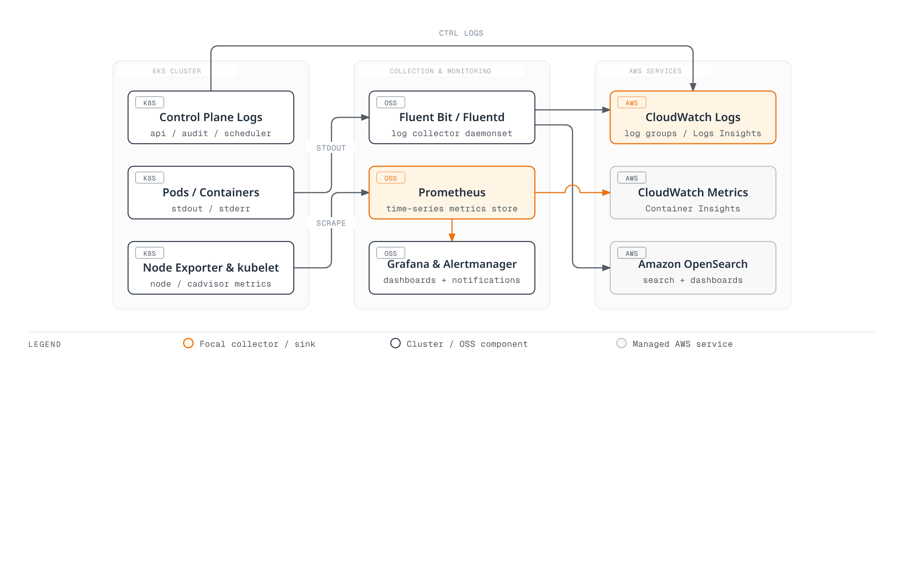
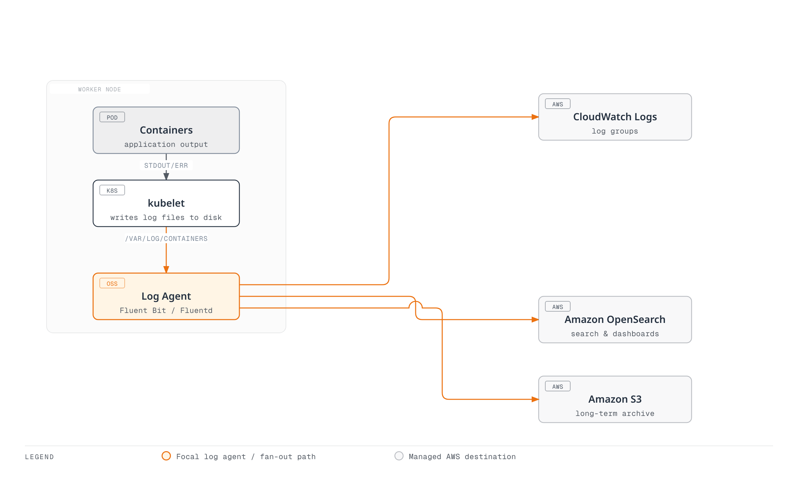

# Amazon EKS Monitoring and Logging

> **Last Updated**: September 12, 2026

Effective monitoring and logging are essential for maintaining the reliability, availability, and performance of Amazon EKS clusters. This document covers various tools, techniques, and best practices for implementing monitoring and logging in EKS clusters.

## Table of Contents

1. [Monitoring and Logging Overview](#monitoring-and-logging-overview)
2. [EKS Control Plane Logging](#eks-control-plane-logging)
3. [Container Logging](#container-logging)
4. [Cluster Monitoring](#cluster-monitoring)
5. [Alerting and Event Management](#alerting-and-event-management)
6. [Log Analysis and Visualization](#log-analysis-and-visualization)
7. [Monitoring and Logging Best Practices](#monitoring-and-logging-best-practices)
8. [Troubleshooting and Debugging](#troubleshooting-and-debugging)

## Monitoring and Logging Overview

### Importance of Monitoring and Logging

Monitoring and logging in Amazon EKS clusters are important for the following reasons:

1. **Visibility**: Provides visibility into cluster status, performance, and behavior
2. **Issue Detection**: Detects issues early before they become critical
3. **Trend Analysis**: Identifies performance and resource usage trends over time
4. **Capacity Planning**: Forecasts and plans for resource requirements
5. **Security and Auditing**: Supports investigation and the evidence required for applicable controls
6. **Troubleshooting**: Enables rapid diagnosis and resolution when issues occur

### Monitoring and Logging Architecture

A comprehensive monitoring and logging architecture for an EKS cluster consists of the following components:

Managed control-plane logs are delivered by AWS to CloudWatch Logs. Container runtimes write CRI log files; kubelet manages rotation and log access, while a node collector reads the files. Metrics and traces use their configured collection/export paths.

<!-- Audit: parent diagram repair needed for direct control-plane delivery and runtime-versus-kubelet log responsibilities.


[🔍 View interactive diagram](https://www.atomai.click/kubernetes-docs/archmaps/en-eks-06-eks-monitoring-logging-0.html)
-->

### Monitoring and Logging Strategy

Follow these steps to develop an effective monitoring and logging strategy:

1. **Define Objectives**: Define monitoring and logging objectives and requirements
2. **Identify Metrics and Logs**: Identify key metrics and logs to collect
3. **Select Tools**: Select monitoring and logging tools that meet requirements
4. **Establish Baselines**: Establish baselines for normal behavior
5. **Configure Alerts**: Configure alerts for important events and thresholds
6. **Automate**: Automate monitoring and logging processes as much as possible
7. **Regular Review**: Regularly review and improve monitoring and logging strategy

## EKS Control Plane Logging

EKS exports selected managed control plane log types to CloudWatch Logs. A node-side collector does not scrape the managed control plane’s filesystem. Log delivery is best effort; configure access, retention and missing-log detection, then verify actual arrival.

### Control Plane Log Types

| Type | Purpose |
|---|---|
| `api` | API server component diagnostics |
| `audit` | Kubernetes requests selected by the audit policy and level |
| `authenticator` | EKS IAM authentication diagnostics |
| `controllerManager` | Core controller-manager operations |
| `scheduler` | Scheduler decisions and diagnostics |

Audit logging is not an unconditional record of every request body or every application action. Secret-related records can be metadata-only, and the policy excludes some events. CloudTrail AWS API records and application data-access logs are separate evidence sources.

### Inspect and Enable Logging

Check the owned cluster’s Region, ARN, current logging settings and update state before a change. Logging changes require the documented subnet IP capacity and incur CloudWatch ingestion/storage charges.

```bash
set -euo pipefail
: "${CLUSTER_NAME:?Set the owned cluster name}"
: "${AWS_REGION:?Set the cluster Region}"
aws eks describe-cluster --name "$CLUSTER_NAME" --region "$AWS_REGION" \
  --query 'cluster.{ARN:arn,Status:status,Logging:logging}'
```

For an approved change, this enables the five log types and inspects the returned update:

```bash
set -euo pipefail
: "${CLUSTER_NAME:?Set the reviewed cluster name}"
: "${AWS_REGION:?Set the cluster Region}"
UPDATE_ID=$(aws eks update-cluster-config \
  --name "$CLUSTER_NAME" --region "$AWS_REGION" \
  --logging '{"clusterLogging":[{"types":["api","audit","authenticator","controllerManager","scheduler"],"enabled":true}]}' \
  --query 'update.id' --output text)
if [[ -z "$UPDATE_ID" || "$UPDATE_ID" == None ]]; then
  printf '%s\n' 'No update ID returned; inspect the request result.' >&2
  exit 1
fi
aws eks describe-update --name "$CLUSTER_NAME" --region "$AWS_REGION" \
  --update-id "$UPDATE_ID" \
  --query 'update.{ID:id,Status:status,Errors:errors}'
```

The final command is a status check, not a waiter. Repeat DescribeUpdate until Successful or a terminal failure, then confirm the effective settings and log arrival. An update ID is not proof of completion. Enabling only selected types need not disable unrelated existing types; any explicit disable is a separate retention/visibility decision.

With the reviewed eksctl CLI, omitting --approve previews the change. Set CLUSTER_NAME and AWS_REGION to the same verified cluster and inspect the preview:

```bash
set -euo pipefail
: "${CLUSTER_NAME:?Set the verified cluster name}"
: "${AWS_REGION:?Set the cluster Region}"
eksctl utils update-cluster-logging \
  --region "$AWS_REGION" --cluster "$CLUSTER_NAME" \
  --enable-types api,audit,authenticator,controllerManager,scheduler
```

After reviewing that plan, use the separate apply command:

```bash
set -euo pipefail
: "${CLUSTER_NAME:?Set the verified cluster name}"
: "${AWS_REGION:?Set the cluster Region}"
eksctl utils update-cluster-logging \
  --region "$AWS_REGION" --cluster "$CLUSTER_NAME" \
  --enable-types api,audit,authenticator,controllerManager,scheduler --approve
```

### Query Control Plane Logs

Use the actual `/aws/eks/CLUSTER_NAME/cluster` group. The first two examples are text-search heuristics for the selected component streams, not complete error-rate measurements.

**API diagnostics:**

```text
fields @timestamp, @message
| filter @logStream like /kube-apiserver-/ and @logStream not like /audit/
| filter @message like /[Ee]rror/
| sort @timestamp desc
| limit 20
```

**IAM authentication diagnostics:**

```text
fields @timestamp, @message
| filter @logStream like /authenticator/
| filter @message like /[Ff]ailed|[Dd]enied|[Uu]nauthorized/
| sort @timestamp desc
| limit 20
```

**Audit denials:** use the discovered JSON fields instead of searching for a literal responseStatus.code string in the raw JSON text. Confirm the field shape in a sample event.

```text
fields @timestamp, user.username, verb, objectRef.resource, objectRef.namespace, responseStatus.code
| filter @logStream like /kube-apiserver-audit/
| filter responseStatus.code in [401, 403]
| sort @timestamp desc
| limit 20
```

### Retention and Cost Management

Inspect the exact group entry in the returned prefix search:

```bash
set -euo pipefail
: "${CLUSTER_NAME:?Set the owned cluster name}"
: "${AWS_REGION:?Set the cluster Region}"
aws logs describe-log-groups --region "$AWS_REGION" \
  --log-group-name-prefix "/aws/eks/$CLUSTER_NAME/cluster" \
  --query 'logGroups[].{Name:logGroupName,RetentionDays:retentionInDays,KmsKey:kmsKeyId}'
```

If an approved policy requires 30 days, the change is `aws logs put-retention-policy --region "$AWS_REGION" --log-group-name "/aws/eks/$CLUSTER_NAME/cluster" --retention-in-days 30`. Thirty days is an example policy, not a universal compliance requirement. Reducing retention can expire older evidence; increasing it does not recover deleted logs. Retention alone does not prove archival delivery, integrity or compliance.

### EKS Capabilities Logging (GitOps, ACK, kro)

The June 4, 2026 feature is supported: ACK, kro and Argo CD capability controllers run in AWS-managed infrastructure **outside your cluster**, and can deliver structured controller logs through CloudWatch Vended Logs. This uses per-capability delivery configuration, separate from the five standard control plane log types.

| Capability | Log types |
|---|---|
| ACK | `EKS_CAPABILITY_ACK_LOGS` |
| kro | `EKS_CAPABILITY_KRO_LOGS` |
| Argo CD | `EKS_CAPABILITY_ARGOCD_APPLICATION_LOGS`, `EKS_CAPABILITY_ARGOCD_APPLICATIONSET_LOGS`, `EKS_CAPABILITY_ARGOCD_COMMITSERVER_LOGS`, `EKS_CAPABILITY_ARGOCD_REPOSERVER_LOGS`, `EKS_CAPABILITY_ARGOCD_SERVER_LOGS` |

Retrieve the actual capability ARN before configuring its delivery source:

```bash
set -euo pipefail
: "${CLUSTER_NAME:?Set the owned cluster name}"
: "${AWS_REGION:?Set the cluster Region}"
: "${CAPABILITY_NAME:?Set the actual capability name}"
aws eks describe-capability --region "$AWS_REGION" \
  --cluster-name "$CLUSTER_NAME" --capability-name "$CAPABILITY_NAME" \
  --query 'capability.capabilityArn' --output text
```

The owner configures PutDeliverySource with that ARN/log type, PutDeliveryDestination with the approved destination, and CreateDelivery to connect them. Review destination policies, encryption, cross-account permissions and retention before enabling delivery.

CloudWatch Logs destinations support Logs Insights queries. S3 destinations are objects for the selected S3/Athena workflow, and Firehose sends records to its configured target; they are not automatically queried through CloudWatch Logs Insights. ACK records include controllerGroup for service-controller filtering. Confirm actual delivery and query fields, and account for Vended Logs charges.

References: [EKS control plane logging](https://docs.aws.amazon.com/eks/latest/userguide/control-plane-logs.html), [audit policy and query examples](https://docs.aws.amazon.com/eks/latest/best-practices/auditing-and-logging.html), [capability controller logs](https://docs.aws.amazon.com/eks/latest/userguide/capabilities-controller-logs.html).

## Container Logging

Container runtimes write stdout/stderr into the node’s CRI log files. Kubelet manages rotation and serves Pod log access; a collector tails the files and forwards records to the selected backend. A JSON application message is still inside the CRI wrapper and must not be parsed as if the whole container log line were Docker JSON.

<!-- Audit: parent diagram repair needed for direct control-plane delivery and runtime-versus-kubelet log responsibilities.


[🔍 View interactive diagram](https://www.atomai.click/kubernetes-docs/archmaps/en-eks-06-eks-monitoring-logging-1.html)
-->

### Choose the Collector Owner

The CloudWatch Observability add-on includes a container-log collector; use its owned configuration when that is your selected stack. The standalone Fluent Bit example below is an alternative for an independently managed log pipeline. Do not install overlapping collectors on the same files/destinations without an explicit duplication and cost plan.

### A Wired Fluent Bit Example

This example uses AWS chart 0.2.0 with image 3.4.14 (Fluent Bit 5.0.9), whose published release and configuration were checked. It targets owned Linux/containerd EC2 nodes; the affinity intentionally excludes Fargate, Auto Mode and Hybrid labels from this example. Those modes need their own supported collection/identity design. The collector tolerates taints on the selected nodes, so review its placement and platform-agent admission permissions.

Prepare namespace logging, a least-privilege IRSA role EKSLogWriter for service account logging/eks-log-collector, and the owned CloudWatch log group. Replace the account, role, Region and cluster-specific group consistently. Configure the IAM OIDC provider/trust audience/subject as described in the security chapter. The collector needs CloudWatch stream/write permissions and regional STS/backend connectivity. These IAM prerequisites are separate from Kubernetes metadata RBAC.

Save as fluent-bit-values.yaml:

```yaml
fullnameOverride: eks-log-collector
image:
  tag: 3.4.14
serviceAccount:
  create: true
  name: eks-log-collector
  annotations:
    eks.amazonaws.com/role-arn: arn:aws:iam::123456789012:role/EKSLogWriter
nodeSelector:
  kubernetes.io/os: linux
affinity:
  nodeAffinity:
    requiredDuringSchedulingIgnoredDuringExecution:
      nodeSelectorTerms:
      - matchExpressions:
        - key: eks.amazonaws.com/compute-type
          operator: NotIn
          values:
          - fargate
          - auto
          - hybrid
tolerations:
- operator: Exists
service:
  extraService: 'Flush 5

    Log_Level info

    Daemon Off

    HTTP_Server On

    HTTP_Listen 0.0.0.0

    HTTP_Port 2020

    Health_Check On

    storage.path /var/fluent-bit/state/storage

    storage.sync normal

    storage.checksum On

    storage.backlog.mem_limit 20M

    '
input:
  path: /var/log/containers/*.log
  db: /var/fluent-bit/state/tail.db
  multilineParser: cri
  skipLongLines: 'On'
  extraInputs: 'storage.type filesystem

    Read_from_Head On

    '
filter:
  kubeURL: https://kubernetes.default.svc:443
  mergeLog: 'On'
  mergeLogKey: data
  keepLog: 'On'
  k8sLoggingParser: 'Off'
  k8sLoggingExclude: 'Off'
  extraFilters: 'Use_Kubelet Off

    '
cloudWatch:
  enabled: false
cloudWatchLogs:
  enabled: true
  region: us-west-2
  logGroupName: /aws/eks/my-cluster/application
  logStreamPrefix: unmatched-
  logStreamTemplate: $kubernetes['namespace_name'].$kubernetes['pod_name'].$kubernetes['container_name']
  autoCreateGroup: false
  extraOutputs: 'auto_create_group false

    storage.total_limit_size 512M

    '
volumes:
- name: varlog
  hostPath:
    path: /var/log
    type: Directory
- name: state
  hostPath:
    path: /var/lib/eks-log-collector
    type: DirectoryOrCreate
volumeMounts:
- name: varlog
  mountPath: /var/log
  readOnly: true
- name: state
  mountPath: /var/fluent-bit/state
```

Chart 0.2.0 enables the native cloudWatchLogs output by default and disables the older cloudWatch output. Setting cloudWatch.region alone therefore does not configure the active native output. The values above set the actual output’s Region/group and preserve the complete record; log_key would send only the selected value and could remove Kubernetes context.

logStreamTemplate uses record-accessor syntax with a fallback prefix. logStreamPrefix is a literal prefix, not a per-record Kubernetes expression. The CRI multiline parser handles the container wrapper, while Merge_Log places JSON application fields under data and keeps log. Workload annotations cannot choose a parser or opt out of this example’s collection.

### Limit Metadata RBAC During Rendering

The published chart’s broad ClusterRole includes nodes/proxy and a legacy PodSecurityPolicy rule. This API-server metadata mode explicitly sets Use_Kubelet Off and needs the selected Pod/Namespace read permissions, not kubelet proxy access. Save this Python 3 + PyYAML post-renderer as fluent-bit-rbac.py. It rejects unexpected chart identities instead of silently leaving a different broad role in place:

```python
#!/usr/bin/env python3
"""Helm post-renderer for this pinned, owned metadata-only Fluent Bit setup."""
import sys
import yaml

objects = [obj for obj in yaml.safe_load_all(sys.stdin) if obj is not None]
roles = [obj for obj in objects if obj.get("kind") == "ClusterRole"]
bindings = [obj for obj in objects if obj.get("kind") == "ClusterRoleBinding"]
if len(roles) != 1 or roles[0].get("metadata", {}).get("name") != "eks-log-collector":
    raise SystemExit("Unexpected chart RBAC; review this renderer before proceeding")
if len(bindings) != 1 or bindings[0].get("roleRef", {}).get("name") != "eks-log-collector":
    raise SystemExit("Unexpected chart role binding")
subjects = bindings[0].get("subjects", [])
if len(subjects) != 1 or any(
    subjects[0].get(key) != value
    for key, value in {
        "kind": "ServiceAccount", "name": "eks-log-collector", "namespace": "logging"
    }.items()
):
    raise SystemExit("Unexpected collector identity")
if any(obj.get("kind") == "PodSecurityPolicy" for obj in objects):
    raise SystemExit("Obsolete PodSecurityPolicy output is not supported by this example")
roles[0]["rules"] = [{
    "apiGroups": [""],
    "resources": ["namespaces", "pods"],
    "verbs": ["get", "list", "watch"],
}]
yaml.safe_dump_all(objects, sys.stdout, sort_keys=False)
```

For a new owned release, install with the values and renderer together:

```bash
helm repo add eks https://aws.github.io/eks-charts
helm repo update eks
chmod +x fluent-bit-rbac.py
helm install eks-log-collector eks/aws-for-fluent-bit \
  --version 0.2.0 --namespace logging --create-namespace \
  -f fluent-bit-values.yaml --post-renderer ./fluent-bit-rbac.py \
  --wait --timeout 5m
```

Keep the same reviewed post-renderer on every upgrade, and revalidate it when changing chart version, release identity, namespace or metadata mode. The rendered ConfigMap is mounted by the actual DaemonSet; applying an unrelated ConfigMap alone would not change its configuration. The account/IRSA role and log group are prerequisites, not resources created by this chart example.

### Buffering, Rotation and Failure Behavior

Host logs are read-only; checkpoint and filesystem-buffer state uses a separate node-local directory. The tail database records offsets and is not itself a durable backend archive. Node replacement can remove that state. Read_from_Head On reads retained file content when no checkpoint exists, so plan for backfill and duplicate handling.

The 512M output-queue limits and backlog memory setting are example allocations. When an output queue reaches storage.total_limit_size, Fluent Bit can discard its oldest chunks. Skip_Long_Lines On also deliberately skips oversized records. Finite buffers, retries and node-local state do not guarantee lossless or exactly-once delivery. Monitor retries, dropped records, disk capacity and destination failures; validate limits against the actual log rate and outage window.

### Optional OpenSearch Fan-out

After preparing the owned VPC domain and the collector’s IAM/FGAC mapping, save this overlay as fluent-bit-opensearch-values.yaml and replace the endpoint hostname. Add `-f fluent-bit-opensearch-values.yaml` to the same reviewed Helm operation. Keeping CloudWatch enabled sends copies to both destinations; set cloudWatchLogs.enabled=false only when intentionally choosing OpenSearch alone.

```yaml
opensearch:
  enabled: true
  host: vpc-eks-logs-EXAMPLE.us-west-2.es.amazonaws.com
  port: '443'
  tls: 'On'
  awsAuth: 'On'
  awsRegion: us-west-2
  index: eks-logs
  generateId: 'On'
  suppressTypeName: 'On'
  extraOutputs: 'tls.verify On

    storage.total_limit_size 512M

    '
```

Use TLS certificate/hostname verification and a fixed, governed index/rollover design. A per-Pod index pattern can create excessive index/shard counts. Generate_ID reduces duplicate indexing on retries; independent outputs and failure recovery still require validation. A successful write to one destination is not proof of delivery to the other.

### Other Logging Stacks

Fluentd remains an option when an owned deployment supplies the required parser/output plugins, host mounts, identity and TLS configuration. A generic JSON parser does not decode a CRI wrapper, and disabling ssl_verify is not a remedy for certificate errors. The legacy Elastic Helm chart repository is archived; use the maintained product/operator installation path for an Elastic deployment.

The loki-stack chart is marked deprecated, and the Promtail agent reached EOL on March 2, 2026. For Loki, use a supported current deployment and a supported client such as Alloy, with explicit storage, access control and retention. See the [Loki guide](../observability/logging/01-loki.md) and [collector guide](../observability/logging/05-collectors.md) for their dedicated setup. The Promtail agent retirement does not include the separately maintained lambda-promtail client.

### Structured Application Logs

The following retained example is synthetic application data, not a new measurement or a record from this audit. Its timestamp remains the original illustrative value:

```json
{
  "timestamp": "2025-07-11T13:00:00Z",
  "level": "INFO",
  "message": "Request processed successfully",
  "request_id": "12345",
  "user_id": "user-789",
  "duration_ms": 45,
  "status_code": 200
}
```

In the configured pipeline, the CRI record supplies the transport timestamp and application JSON is under data. Verify timezone and clock behavior before overriding timestamps with an application field. User/session identifiers can still be sensitive or linkable; minimize them and never log credentials or raw session tokens.

The example below assumes this collector’s record shape. Other collectors may use different field paths:

```text
fields @timestamp, kubernetes.namespace_name, kubernetes.pod_name, data.level, log
| filter kubernetes.namespace_name = "production"
| filter data.level in ["ERROR", "error"]
| sort @timestamp desc
| limit 100
```

Validation covered published chart/image metadata, actual Helm ConfigMap/DaemonSet wiring, native Kubernetes schemas and post-renderer failure cases. No image was installed, collector process started, AWS log sent or production filesystem access tested. Validate the actual node permissions, IRSA credentials and end-to-end delivery before rollout.

References: [AWS image release 3.4.14](https://github.com/aws/aws-for-fluent-bit/releases/tag/v3.4.14), [CloudWatch output](https://docs.fluentbit.io/manual/data-pipeline/outputs/cloudwatch), [Fluent Bit buffering](https://docs.fluentbit.io/manual/data-pipeline/buffering), [Promtail lifecycle](https://grafana.com/docs/loki/latest/send-data/promtail/).

## Cluster Monitoring

Effective cluster monitoring is essential for tracking the status, performance, and resource usage of your EKS cluster. This section explores various tools and techniques for monitoring EKS clusters.


[🔍 View interactive diagram](https://www.atomai.click/kubernetes-docs/archmaps/en-eks-06-eks-monitoring-logging-2.html)

### CloudWatch Container Insights

The CloudWatch Observability add-on combines Container Insights, container-log collection and Application Signals capabilities. Use one owned installation and avoid overlapping its Fluent Bit collector with another collector reading the same files. Configure identity, supported node access and backend connectivity before expecting data.

#### Inspect the Cluster and Compatible Add-on Builds

For this standard Linux EC2 example, prepare the appropriate EKS Pod Identity agent and a dedicated CloudWatch role, with trust scoped to this cluster and amazon-cloudwatch/cloudwatch-agent. The operator needs the required add-on/association permissions and permission to pass the approved role. Check existing Helm releases, ServiceAccount annotations and associations as well as the EKS add-on list; an existing collector needs its owner’s migration/upgrade process.

```bash
set -euo pipefail
: "${CLUSTER_NAME:?Set the owned cluster name}"
: "${AWS_REGION:?Set the cluster Region}"
CLUSTER_VERSION=$(aws eks describe-cluster --name "$CLUSTER_NAME" --region "$AWS_REGION" \
  --query cluster.version --output text)
aws eks list-addons --cluster-name "$CLUSTER_NAME" --region "$AWS_REGION"
aws eks describe-addon-versions --region "$AWS_REGION" \
  --addon-name amazon-cloudwatch-observability --kubernetes-version "$CLUSTER_VERSION"
```

Select a compatible, reviewed build from the catalog rather than downgrading to a hardcoded v5.0.0 example. Add-on configuration schemas are version-specific. The local reference render here used Helm chart 6.6.0, whose Fluent Bit DaemonSet uses the same cloudwatch-agent ServiceAccount as the agent identity path.

#### Explicit Auto Monitor Configuration

Save this as cloudwatch-config.json for the new-installation example. It retains the default container-log configuration while disabling broad automatic workload selection and automatic restarts until the application rollout is reviewed:

```json
{
  "manager": {
    "applicationSignals": {
      "autoMonitor": {
        "monitorAllServices": false,
        "restartPods": false
      }
    }
  }
}
```

This controls Auto Monitor selection/restarts, not every possible telemetry source. Existing annotations, custom selectors or manually instrumented applications require separate review. With Python 3 and jsonschema available locally, retrieve the selected build’s schema and check the configuration:

```bash
set -euo pipefail
: "${AWS_REGION:?Set the cluster Region}"
: "${CLOUDWATCH_ADDON_VERSION:?Choose a reviewed compatible add-on build}"
aws eks describe-addon-configuration --region "$AWS_REGION" \
  --addon-name amazon-cloudwatch-observability --addon-version "$CLOUDWATCH_ADDON_VERSION" \
  --output json > cloudwatch-addon-review.json
python3 - "$CLOUDWATCH_ADDON_VERSION" <<'PY'
import json
import sys
import jsonschema
with open("cloudwatch-addon-review.json") as stream:
    review = json.load(stream)
if review["addonName"] != "amazon-cloudwatch-observability" or review["addonVersion"] != sys.argv[1]:
    raise SystemExit("Returned schema does not match the selected add-on build")
schema = json.loads(review["configurationSchema"])
with open("cloudwatch-config.json") as stream:
    config = json.load(stream)
validator = jsonschema.validators.validator_for(schema)
validator.check_schema(schema)
validator(schema).validate(config)
PY
```

#### Create a New Owned Installation

The CloudWatch role must already have the required CloudWatch/trace permissions for the chosen features. The following rechecks the reviewed schema/build, refuses an existing add-on or collector association, and avoids taking over conflicting resources:

```bash
set -euo pipefail
: "${CLUSTER_NAME:?Set the reviewed cluster name}"
: "${AWS_REGION:?Set the cluster Region}"
: "${CLOUDWATCH_ADDON_VERSION:?Set the reviewed, schema-checked compatible build}"
: "${CLOUDWATCH_ROLE_ARN:?Set the prepared CloudWatch Pod Identity role ARN}"
python3 - "$CLOUDWATCH_ADDON_VERSION" <<'PY'
import json
import sys
import jsonschema
with open("cloudwatch-addon-review.json") as stream:
    review = json.load(stream)
if review["addonName"] != "amazon-cloudwatch-observability" or review["addonVersion"] != sys.argv[1]:
    raise SystemExit("Selected add-on build changed; review its schema again")
schema = json.loads(review["configurationSchema"])
with open("cloudwatch-config.json") as stream:
    config = json.load(stream)
jsonschema.validators.validator_for(schema)(schema).validate(config)
PY
EXISTING_ADDONS=$(aws eks list-addons --cluster-name "$CLUSTER_NAME" --region "$AWS_REGION" --output json)
python3 - "$EXISTING_ADDONS" <<'PY'
import json, sys
if "amazon-cloudwatch-observability" in json.loads(sys.argv[1])["addons"]:
    raise SystemExit("Add-on already exists; use its owner's reviewed upgrade procedure")
PY
EXISTING_ASSOCIATIONS=$(aws eks list-pod-identity-associations \
  --cluster-name "$CLUSTER_NAME" --region "$AWS_REGION" \
  --namespace amazon-cloudwatch --service-account cloudwatch-agent --output json)
python3 - "$EXISTING_ASSOCIATIONS" <<'PY'
import json, sys
if json.loads(sys.argv[1])["associations"]:
    raise SystemExit("Collector association already exists; inspect its owner before installation")
PY
ASSOCIATIONS=$(python3 - "$CLOUDWATCH_ROLE_ARN" <<'PY'
import json, sys
print(json.dumps([{"serviceAccount": "cloudwatch-agent", "roleArn": sys.argv[1]}]))
PY
)
aws eks create-addon --cluster-name "$CLUSTER_NAME" --region "$AWS_REGION" \
  --addon-name amazon-cloudwatch-observability --addon-version "$CLOUDWATCH_ADDON_VERSION" \
  --pod-identity-associations "$ASSOCIATIONS" \
  --configuration-values file://cloudwatch-config.json --resolve-conflicts NONE
aws eks describe-addon --cluster-name "$CLUSTER_NAME" --region "$AWS_REGION" \
  --addon-name amazon-cloudwatch-observability \
  --query 'addon.{Status:status,Version:addonVersion,Health:health.issues}'
```

CreateAddon is asynchronous. Inspect status/health until the add-on is ACTIVE, then verify agent/collector Pods, actual ContainerInsights datapoints and the intended log groups. A successful request, ACTIVE status or a dashboard alone is not proof of complete ingestion. The final DescribeAddon command above is a check, not a waiter. Validate failures and permissions before retrying; do not use an unreviewed overwrite or erase existing configuration to force installation.

#### What Changed in Version 5.0.0

The February 26, 2026 default-APM change is real: version 5.0.0+ enables Application Signals Auto Monitor by default on new installations and upgrades. monitorAllServices defaults to true; restartPods defaults to false. The scope is supported service-mapped Deployments, DaemonSets and StatefulSets, excluding kube-system and amazon-cloudwatch by default. New or restarted workloads in scope can be instrumented without per-workload annotations; already running Pods are not guaranteed to be immediately reinstrumented.

Choose supported languages/workloads, review existing OpenTelemetry/APM integrations, sampling and cost, and control any restart rollout. Explicit exclusions take precedence. Container Insights supports Linux and Windows configurations, but Application Signals is not supported on EKS Windows nodes. Fargate and Hybrid node collection/identity need their documented platform-specific paths; do not infer support from a generic DaemonSet example.

#### Metrics, Dashboards and Alarms

Select the actual cluster in the Container Insights console views, and inspect the published metric names, dimensions and recent data. Node CPU/memory/filesystem metrics describe node usage. Pod CPU/memory utilization uses node limits as denominators, not Pod requests. Namespace/service/cluster rollups are available for documented metrics, but an aggregate percentage is not automatically a capacity-weighted utilization value for a heterogeneous cluster.

Dashboards help inspect data; they do not create every alarm or guarantee notification delivery. The CloudWatch Alarms examples later use node metrics and Maximum with explicitly selected dimensions. Verify metric availability and configure the appropriate alarm and delivery path for the workload.

Validation used the existing published chart, its rendered default log configuration and Auto Monitor arguments, plus nine mocked schema/ownership/failure-flow cases. The synthetic test schema checks the helper’s behavior and is not a substitute for the live build-specific schema above. No add-on, workload instrumentation, telemetry export or AWS resource was exercised during this audit.

References: [CloudWatch add-on installation and Auto Monitor](https://docs.aws.amazon.com/AmazonCloudWatch/latest/monitoring/install-CloudWatch-Observability-EKS-addon.html), [default APM announcement](https://aws.amazon.com/about-aws/whats-new/2026/02/application-performance-monitoring-cloudwatch-eks/), [Container Insights metrics](https://docs.aws.amazon.com/AmazonCloudWatch/latest/monitoring/Container-Insights-metrics-EKS.html).

### EKS Node Monitoring Agent

The EKS Node Monitoring Agent publishes node-level system, storage, networking and accelerator health conditions. It was made open source on February 24, 2026 and is included in EKS Auto Mode. For a separately managed add-on installation, inspect the cluster’s actual version, existing add-ons and compatible agent versions before choosing a release:

```bash
set -euo pipefail
: "${CLUSTER_NAME:?Set the owned cluster name}"
: "${AWS_REGION:?Set the cluster Region}"
KUBERNETES_VERSION=$(aws eks describe-cluster --name "$CLUSTER_NAME" --region "$AWS_REGION" \
  --query cluster.version --output text)
aws eks list-addons --cluster-name "$CLUSTER_NAME" --region "$AWS_REGION"
aws eks describe-addon-versions --addon-name eks-node-monitoring-agent \
  --kubernetes-version "$KUBERNETES_VERSION" --region "$AWS_REGION"
```

Install or update through the existing add-on owner with a reviewed version and supported node configuration. An add-on create command is not an upgrade procedure for an existing installation.

Condition names alone do not indicate whether a node is unhealthy. Read status and reason, interpreting each condition’s meaning: Ready=False differs from MemoryPressure=False.

```bash
kubectl get nodes -o jsonpath='{range .items[*]}{.metadata.name}{"\n"}{range .status.conditions[*]}{"  "}{.type}{"="}{.status}{" reason="}{.reason}{"\n"}{end}{end}'
```

Monitoring and repair enablement are separate. Auto Mode has automatic node repair enabled; managed node groups use nodeRepairConfig, and Karpenter uses its NodeRepair feature gate. Inspect an actual managed node group before attributing repair behavior to the agent:

```bash
set -euo pipefail
: "${CLUSTER_NAME:?Set the owned cluster name}"
: "${NODEGROUP_NAME:?Set an actual managed node group name}"
: "${AWS_REGION:?Set the cluster Region}"
aws eks describe-nodegroup --region "$AWS_REGION" \
  --cluster-name "$CLUSTER_NAME" --nodegroup-name "$NODEGROUP_NAME" \
  --query 'nodegroup.{Name:nodegroupName,Repair:nodeRepairConfig,Health:health.issues}'
```

Repair eligibility depends on the condition, reason, wait time and applicable safeguards. MemoryPressure and DiskPressure have no automatic repair action in the documented defaults. Do not treat every reported condition or an agent installation as proof that a node will be replaced. Customizing an open-source agent also requires testing its condition semantics against the selected repair configuration.

References: [open-source announcement](https://aws.amazon.com/about-aws/whats-new/2026/02/amazon-eks-node-monitoring-agent-open-source/), [automatic node repair](https://docs.aws.amazon.com/eks/latest/userguide/node-repair.html).

### Prometheus and Grafana

Prometheus is a time-series database and monitoring system, and Grafana is a dashboard tool for visualizing metrics. You can use these two tools together for comprehensive monitoring of your EKS cluster.

#### Amazon Managed Service for Prometheus and Grafana

AMP stores and queries ingested Prometheus metrics; AMG queries configured data sources and presents dashboards. Creating either workspace does not automatically deploy a scraper, grant its AWS identity or connect the data source. This example inspects existing owned workspaces and extends the kube-prometheus-stack release below, avoiding a second Prometheus installation.

**AMP ingestion identity and values**

Prepare an IRSA role for ServiceAccount monitoring/amp-writer. Its trust policy must use this cluster’s OIDC provider and exact sub=system:serviceaccount:monitoring:amp-writer and aud=sts.amazonaws.com conditions. Grant aps:RemoteWrite on the intended workspace ARN. The Prometheus process must receive the projected token and reach STS and the AMP endpoint; Kubernetes RBAC is a separate permission path. Do not also attach an unrelated Pod Identity association or static AWS keys to this example.

The following reads the workspace and writes an overlay for the reviewed chart 90.1.1. It accepts the documented endpoint forms with or without /api/v1/ and appends remote_write exactly once. Python 3 is required; no workspace is created:

```bash
set -euo pipefail
: "${AWS_REGION:?Set the AMP workspace Region}"
: "${AMP_WORKSPACE_ID:?Set the owned AMP workspace ID}"
: "${AMP_WRITE_ROLE_ARN:?Set the prepared IRSA writer role ARN}"
: "${CLUSTER_NAME:?Set the source cluster name}"
aws amp describe-workspace --region "$AWS_REGION" \
  --workspace-id "$AMP_WORKSPACE_ID" --output json > amp-workspace.json
python3 - "$AWS_REGION" "$AMP_WORKSPACE_ID" "$AMP_WRITE_ROLE_ARN" "$CLUSTER_NAME" <<'PY'
import json
import sys
from urllib.parse import urlsplit, urlunsplit

region, workspace_id, role_arn, cluster = sys.argv[1:]
with open("amp-workspace.json") as stream:
    workspace = json.load(stream)["workspace"]
if workspace["workspaceId"] != workspace_id or workspace["status"]["statusCode"] != "ACTIVE":
    raise SystemExit("Review the workspace identity and ACTIVE status")
arn = workspace["arn"].split(":", 5)
if len(arn) != 6 or arn[2] != "aps" or arn[3] != region or arn[5] != "workspace/" + workspace_id:
    raise SystemExit("Workspace ARN does not match the selected Region/ID")
endpoint = urlsplit(workspace["prometheusEndpoint"])
path = endpoint.path.rstrip("/")
if path.endswith("/api/v1"):
    path = path[:-7]
if (endpoint.scheme != "https" or not endpoint.hostname or endpoint.username
        or endpoint.password or endpoint.query or endpoint.fragment
        or path != "/workspaces/" + workspace_id):
    raise SystemExit("Inspect the workspace endpoint before configuring remote write")
remote_write = urlunsplit((endpoint.scheme, endpoint.netloc, path + "/api/v1/remote_write", "", ""))
values = {
    "prometheus": {
        "serviceAccount": {
            "create": True, "name": "amp-writer", "createTokenSecret": True,
            "annotations": {"eks.amazonaws.com/role-arn": role_arn},
        },
        "prometheusSpec": {
            "externalLabels": {"cluster": cluster},
            "remoteWrite": [{"url": remote_write, "sigv4": {"region": region}}],
        },
    },
}
with open("amp-values.json", "w") as stream:
    json.dump(values, stream, indent=2)
    stream.write("\n")
print("Wrote amp-values.json; review it with all existing release values")
PY
```

Combine amp-values.json with monitoring-values.yaml in the owner’s reviewed installation/upgrade values. The overlay replaces the remoteWrite list; preserve any existing destinations and external labels intentionally. For a new release, add -f amp-values.json to the installation command below. For an existing release, retain all current settings and review the rendered diff and rollout before applying the owner’s upgrade procedure. Changing the ServiceAccount changes the Prometheus Pod identity. Chart 90.1.1 uses an explicit ServiceAccount token Secret for its default API-server/kubelet ServiceMonitor authorization. Keep that Secret protected and follow its rotation/revocation procedure; it is distinct from the short-lived, audience-bound IRSA token. Disabling createTokenSecret without replacing every dependent monitor credential breaks the render or authentication.

For multiple replicas, configure AMP’s documented HA deduplication labels and replica topology rather than assuming duplicate scrapes are free. Set cardinality, retention and ingestion budgets from the actual workload. Check remote-write failures/backlog and query recent data in the intended workspace; a successful Helm rollout is not ingestion proof.

**AMG authentication and data-source connection**

```bash
set -euo pipefail
: "${AMG_REGION:?Set the Grafana workspace Region}"
: "${AMG_WORKSPACE_ID:?Set the owned Grafana workspace ID}"
aws grafana describe-workspace --region "$AMG_REGION" \
  --workspace-id "$AMG_WORKSPACE_ID" \
  --query 'workspace.{ID:id,Status:status,Version:grafanaVersion,Endpoint:endpoint,Role:workspaceRoleArn,Authentication:authentication,PermissionType:permissionType}'
```

Workspace user authentication (IAM Identity Center/SAML), Grafana user permissions and the workspace’s AWS data-source IAM role are different controls. A Grafana service account is an identity for the Grafana HTTP API; creating an ADMIN service account does not create an AMP data source or grant aps:QueryMetrics. Avoid provisioning a broad API identity merely to view metrics.

In AMG 12+, select the Amazon Managed Service for Prometheus data-source plugin. SigV4 support was removed from the Core Prometheus plugin in that AMG version, and existing AMP data sources migrate to the AMP plugin. Use the documentation matching the workspace’s actual version. Through the approved workspace configuration, select the intended account/Region/workspace, configure its query identity and test a known series. The documented AWS data-source configuration flow uses service-managed permissions; a customer-managed workspace needs its own reviewed IAM configuration, not an automatic ownership change.

The query role normally needs workspace-scoped aps:QueryMetrics, aps:GetSeries, aps:GetLabels and aps:GetMetricMetadata; discovery or other enabled features may require additional actions. Its query endpoint is not the remote_write ingestion URL. If provisioning a workspace separately, the CLI uses --workspace-name and requires --account-access-type, authentication and permission configuration; service-managed IAM automation is tied to the documented console workflow. Complete identity, user assignment and network-access setup before treating a workspace as usable.

References: [AMP remote write](https://docs.aws.amazon.com/prometheus/latest/userguide/AMP-onboard-ingest-metrics-existing-Prometheus.html), [AMG AMP plugin](https://docs.aws.amazon.com/grafana/latest/userguide/amazon-prometheus-data-source.html), [AWS data-source configuration](https://docs.aws.amazon.com/grafana/latest/userguide/amazon-AMP-adding-AWS-config.html). No workspace, authentication flow or telemetry ingestion was exercised during this audit.

#### Self-Managed Prometheus and Grafana

This example uses one owned kube-prometheus-stack release, which includes the Prometheus Operator required by the ServiceMonitor and PrometheusRule examples. A standalone Prometheus chart does not automatically provide those CRDs/controllers. Inspect existing operators, releases and CRD ownership before installing; use the owner’s upgrade procedure for an existing stack.

The reviewed baseline is chart 90.1.1 / Operator 0.93.1, rendered for EKS 1.36. It assumes standard Linux EC2 nodes and a prepared encrypted ebs-gp3 StorageClass with working EBS CSI permissions. For Auto Mode or another storage implementation, select its actual supported class and node placement. Retention and PVC sizes below are example allocations, not measured capacity guarantees.

Prepare namespace monitoring and Secret grafana-admin with admin-user/admin-password keys through the approved secret-management process. The values reference that Secret rather than placing a shared password in Helm values or command arguments. Save the following as monitoring-values.yaml:

```yaml
grafana:
  admin:
    existingSecret: grafana-admin
    userKey: admin-user
    passwordKey: admin-password
  service:
    type: ClusterIP
  rbac:
    namespaced: true
  sidecar:
    dashboards:
      searchNamespace: monitoring
    datasources:
      searchNamespace: monitoring
  persistence:
    enabled: true
    storageClassName: ebs-gp3
    size: 10Gi
    accessModes:
    - ReadWriteOnce
  deploymentStrategy:
    type: Recreate
prometheus:
  prometheusSpec:
    retention: 14d
    storageSpec:
      volumeClaimTemplate:
        spec:
          storageClassName: ebs-gp3
          accessModes:
          - ReadWriteOnce
          resources:
            requests:
              storage: 20Gi
kubeEtcd:
  enabled: false
kubeControllerManager:
  enabled: false
kubeScheduler:
  enabled: false
kubeProxy:
  enabled: false
kubelet:
  serviceMonitor:
    tlsConfig:
      insecureSkipVerify: false
      ca:
        configMap:
          name: kubelet-serving-ca
          key: ca.crt
```

Grafana’s dashboard/data-source sidecars watch only monitoring with a namespaced role. Its ClusterIP service is accessed locally through port-forwarding. The single-replica PVC example uses Recreate to avoid overlapping writers during rollout, so plan for UI downtime during replacement; this is not a highly available Grafana design.

The chart defaults to skipping kubelet server-certificate verification. These values instead require a prepared monitoring/kubelet-serving-ca ConfigMap with ca.crt containing the trusted kubelet serving CA chain, and certificates whose SANs match the scraped endpoints. Verify that trust through the node owner’s certificate-management process; the EKS API-server CA is not automatically the kubelet serving CA. If that prerequisite is unavailable, resolve the certificate configuration before enabling collection. Do not silently restore insecureSkipVerify to make a failed target appear healthy. No kubelet TLS handshake was tested in this audit.

The etcd/controller-manager/scheduler/kube-proxy scrape jobs are disabled in this example because their direct endpoints are not provided by the setup. Enable a job only after configuring its actual reachable, authorized endpoint; API-server or CloudWatch metrics are separate sources and do not make an absent component ServiceMonitor target work.

For a new owned release:

```bash
helm repo add prometheus-community https://prometheus-community.github.io/helm-charts
helm repo update prometheus-community
helm install monitoring prometheus-community/kube-prometheus-stack \
  --version 90.1.1 --namespace monitoring --create-namespace \
  -f monitoring-values.yaml --wait --timeout 10m
```

Helm waiting is not proof that every operator-created resource, target and notification route works. Inspect the generated resources, PVC binding, Prometheus target health and metric data:

```bash
kubectl get pods,svc,pvc -n monitoring
kubectl get prometheus,alertmanager -n monitoring
```

Access Grafana at `http://127.0.0.1:3000` while this command runs, using the credentials from the approved secret store:

```bash
kubectl port-forward --address 127.0.0.1 -n monitoring \
  svc/monitoring-grafana 3000:80
```

Protect the Grafana database/PVC and exported dashboard definitions. Use Grafana’s supported credential-rotation process; changing a bootstrap Secret alone does not prove an existing database user’s password changed. Do not publish the UI with a shared sample password.

The chart render confirms the actual Prometheus service monitoring-kube-prometheus-prometheus, Grafana service monitoring-grafana and data-source UID prometheus. Custom ServiceMonitors/PrometheusRules must match the release=monitoring selectors used by this release. Rendered manifests and schema checks are local evidence; no stack, PVC or login was exercised in a live cluster.

Reference: [kube-prometheus-stack chart and upgrade guidance](https://github.com/prometheus-community/helm-charts/tree/kube-prometheus-stack-90.1.1/charts/kube-prometheus-stack).

#### Key Prometheus Metrics

Metric availability follows the actual scrape target and permissions, not just the dashboard name:

- Node exporter supplies node CPU, memory, filesystem and network series on supported nodes.
- Kubelet/cAdvisor supplies container resource metrics; kube-state-metrics supplies Kubernetes object state such as restarts and readiness.
- The API server exposes authorized API metrics. Direct etcd/controller-manager/scheduler metrics require their own reachable endpoints; the setup above does not enable those targets.

A missing series may indicate an absent exporter, failed scrape, unsupported platform or changed metric. It is not automatically zero usage or a healthy system.

#### Useful Grafana Dashboards

Start with the Kubernetes, node-exporter and API-server dashboards bundled with the reviewed kube-prometheus-stack release, selecting its prometheus data-source UID. Community dashboard IDs alone do not establish a compatible metric/label contract. Inspect each imported dashboard’s queries, units, required recording rules and data-source references. A graph with no data is not evidence that the monitored component is healthy.

The previously listed community IDs still exist, but several titles and implied purposes were inaccurate. Catalog verification gives the following references; import/runtime compatibility was not tested:

| ID | Actual catalog title | Scope note |
| --- | --- | --- |
| [15661](https://grafana.com/grafana/dashboards/15661-k8s-dashboard-en-20250125/) | K8S Dashboard | General K8S resource overview |
| [1860](https://grafana.com/grafana/dashboards/1860-node-exporter-full/) | Node Exporter Full | Requires matching node-exporter series |
| [6417](https://grafana.com/grafana/dashboards/6417-kubernetes-cluster-prometheus/) | Kubernetes Cluster (Prometheus) | Cluster/container overview; last catalog update 2018 |
| [12006](https://grafana.com/grafana/dashboards/12006-kubernetes-apiserver/) | Kubernetes apiserver | API-server latency/cache dashboard; last catalog update 2020 |
| [13770](https://grafana.com/grafana/dashboards/13770-1-kubernetes-all-in-one-cluster-monitoring-kr/) | 1 Kubernetes All-in-one Cluster Monitoring KR | Korean all-in-one dashboard optimized for its book’s VM environment |

#### PromQL Query Examples

These examples match the reviewed stack’s job and metrics_path labels. Preserve namespace identity for Pods and the cluster label where it exists, especially in a shared AMP workspace. Prometheus external labels are attached when sending data externally; they do not automatically appear on every locally stored series. The max aggregations collapse duplicate observations of the same identified object, not distinct workloads. Review labels before adapting this pattern.

Node CPU non-idle percentage, averaged across CPUs:

```promql
100 * (1 - avg by (cluster, instance) (max by (cluster, instance, cpu) (rate(node_cpu_seconds_total{job="node-exporter",mode="idle"}[5m]))))
```

Top ten Pods by container memory working-set bytes:

```promql
topk(10, sum by (cluster, namespace, pod) (max by (cluster, namespace, pod, container) (container_memory_working_set_bytes{job="kubelet",metrics_path="/metrics/cadvisor",container!="",container!="POD"})))
```

Current restart counters per Pod UID; this is not a CrashLoopBackOff detector:

```promql
sum by (cluster, namespace, pod, uid) (max by (cluster, namespace, pod, uid, container) (kube_pod_container_status_restarts_total{job="kube-state-metrics"}))
```

Root filesystem unavailable percentage, excluding zero-sized filesystems:

```promql
(100 * (1 - max by (cluster, instance, device, mountpoint, fstype) (node_filesystem_avail_bytes{job="node-exporter",mountpoint="/"}) / max by (cluster, instance, device, mountpoint, fstype) (node_filesystem_size_bytes{job="node-exporter",mountpoint="/"}))) and on (cluster, instance, device, mountpoint, fstype) (max by (cluster, instance, device, mountpoint, fstype) (node_filesystem_size_bytes{job="node-exporter",mountpoint="/"}) > 0)
```

CPU percentages here describe non-idle time, memory is bytes, and restarts are counters for the current Pod/container lifetime. Use rate/increase over a chosen window when asking about counter changes. The filesystem calculation uses available space and can include space reserved from ordinary users. These are examples for investigation, not universal alert thresholds.

### Distributed Tracing with AWS X-Ray

X-Ray remains a supported trace backend. Its SDKs and daemon entered security-fix-only maintenance on February 25, 2026; the current AWS timeline does not publish an end date for that phase. For new instrumentation, use supported OpenTelemetry/ADOT integration. An X-Ray daemon or collector does not need Kubernetes cluster-admin to submit traces, and that Kubernetes role does not grant AWS write permissions.

#### Collector Ownership and Prerequisites

Choose one instrumentation/collection owner. The CloudWatch add-on’s Application Signals path above is an alternative; do not add another SDK agent to an already instrumented process without reviewing duplicate spans and conflicts. The explicit example below uses OpenTelemetry Operator 0.158.0 with ADOT Collector 0.50.0 and a traces-only pipeline.

Prepare these dependencies through their owners before applying the collector:

- A working Operator with the matching CRDs/webhooks. The upstream published manifest uses cert-manager; use its documented installation/upgrade path. The EKS ADOT add-on is another ownership path with a build-specific schema. The Collector release does not contain an Operator installation manifest.
- A dedicated tracing-demo namespace and ServiceAccount adot-traces with prepared IRSA trust for this cluster, sub=system:serviceaccount:tracing-demo:adot-traces and aud=sts.amazonaws.com. Grant the required X-Ray write actions (PutTraceSegments for this pipeline) and provide STS/X-Ray connectivity. This OTLP-only collector does not discover Kubernetes objects or require cluster-wide RBAC.
- Secret tracing-demo/otel-receiver-tls with tls.crt/tls.key and a server certificate valid for adot-traces-collector.tracing-demo.svc. Mount its trusted CA in the application. Certificate issuance, renewal and collector reload/restart remain operational responsibilities.
- A NetworkPolicy-enforcing CNI and reviewed application egress. The example permits ingress from default Pods labeled app=my-app; it applies to every Pod in the dedicated tracing-demo namespace. Labels select traffic and do not authenticate a workload or replace RBAC controls on who can create Pods.

Review the published [Operator release](https://github.com/open-telemetry/opentelemetry-operator/releases/tag/v0.158.0) and [ADOT release](https://github.com/aws-observability/aws-otel-collector/releases/tag/v0.50.0) rather than applying a Collector URL as an Operator manifest. The v1beta1 CRD uses an object-valued spec.config. Change the example Region in both env/exporter fields together:

```yaml
apiVersion: opentelemetry.io/v1beta1
kind: OpenTelemetryCollector
metadata:
  name: adot-traces
  namespace: tracing-demo
spec:
  mode: deployment
  replicas: 1
  image: public.ecr.aws/aws-observability/aws-otel-collector:v0.50.0
  serviceAccount: adot-traces
  env:
  - name: AWS_REGION
    value: us-west-2
  - name: AWS_EC2_METADATA_DISABLED
    value: "true"
  resources:
    requests:
      cpu: 100m
      memory: 128Mi
    limits:
      cpu: "1"
      memory: 512Mi
  volumes:
  - name: receiver-tls
    secret:
      secretName: otel-receiver-tls
  volumeMounts:
  - name: receiver-tls
    mountPath: /etc/otel/tls
    readOnly: true
  config:
    receivers:
      otlp:
        protocols:
          http:
            endpoint: 0.0.0.0:4318
            tls:
              cert_file: /etc/otel/tls/tls.crt
              key_file: /etc/otel/tls/tls.key
    processors:
      memory_limiter:
        check_interval: 1s
        limit_percentage: 75
        spike_limit_percentage: 15
      batch: {}
    exporters:
      awsxray:
        region: us-west-2
        local_mode: true
        no_verify_ssl: false
        index_all_attributes: false
        telemetry:
          enabled: false
    extensions:
      health_check:
        endpoint: 0.0.0.0:13133
    service:
      extensions: [health_check]
      pipelines:
        traces:
          receivers: [otlp]
          processors: [memory_limiter, batch]
          exporters: [awsxray]
---
apiVersion: networking.k8s.io/v1
kind: NetworkPolicy
metadata:
  name: tracing-ingress
  namespace: tracing-demo
spec:
  podSelector: {}
  policyTypes: [Ingress]
  ingress:
  - from:
    - namespaceSelector:
        matchLabels:
          kubernetes.io/metadata.name: default
      podSelector:
        matchLabels:
          app: my-app
    ports:
    - protocol: TCP
      port: 4318
```

The Operator derives the ClusterIP receiver Service from the OTLP/HTTP port: adot-traces-collector in tracing-demo, TCP 4318. The receiver validates neither a user identity nor a business authorization claim; this example uses server TLS and the selected network boundary. Stronger isolation can require mTLS or a supported receiver authenticator. Configure those consistently at both ends before expanding access.

Collector acceptance is not storage confirmation. Check the generated Deployment/Service, TLS handshake, AWS credential selection, exporter failures and a known trace in X-Ray. The one-replica, in-memory example is not a lossless or highly available pipeline; size and test buffers, backpressure, retry behavior and failure handling for the workload. A CRD schema check does not validate all component configuration or prove that the collector starts.

#### Instrument the Application and Propagate Context

For a Python 3.10+ application, align opentelemetry-sdk==1.44.0 and opentelemetry-exporter-otlp-proto-http==1.44.0 in the application dependency lock. Configure each service separately; a shared collector must not overwrite every incoming service.name with one global value. The HTTP exporter endpoint includes /v1/traces; a gRPC endpoint on 4317 is a different protocol/configuration.

```bash
export OTEL_SERVICE_NAME=my-app
export CLUSTER_NAME=my-owned-cluster
export OTEL_EXPORTER_OTLP_TRACES_ENDPOINT=https://adot-traces-collector.tracing-demo.svc:4318/v1/traces
export OTEL_EXPORTER_OTLP_TRACES_CERTIFICATE=/etc/otel/ca.crt
```

The CA file must be mounted in the application container. Create one RequestTracing instance at application startup, call handle_request from the real server handler with normalized incoming header names and an operation that uses the supplied outgoing headers, and call close during graceful shutdown. Framework/client auto-instrumentation can handle these boundaries instead; avoid instrumenting the same operation twice:

```python
import os
from urllib.parse import urlsplit

from opentelemetry.exporter.otlp.proto.http.trace_exporter import OTLPSpanExporter
from opentelemetry.sdk.resources import Resource
from opentelemetry.sdk.trace import TracerProvider
from opentelemetry.sdk.trace.export import BatchSpanProcessor
from opentelemetry.sdk.trace.sampling import ParentBased, TraceIdRatioBased
from opentelemetry.trace import SpanKind
from opentelemetry.trace.propagation.tracecontext import TraceContextTextMapPropagator


class RequestTracing:
    def __init__(self):
        endpoint = os.environ["OTEL_EXPORTER_OTLP_TRACES_ENDPOINT"]
        parsed = urlsplit(endpoint)
        if parsed.scheme != "https" or parsed.path != "/v1/traces":
            raise ValueError("Set the HTTPS OTLP/HTTP traces endpoint including /v1/traces")
        self.provider = TracerProvider(
            resource=Resource.create({
                "service.name": os.environ["OTEL_SERVICE_NAME"],
                "k8s.cluster.name": os.environ["CLUSTER_NAME"],
            }),
            sampler=ParentBased(TraceIdRatioBased(0.1)),
        )
        exporter = OTLPSpanExporter(
            endpoint=endpoint,
            certificate_file=os.environ["OTEL_EXPORTER_OTLP_TRACES_CERTIFICATE"],
            timeout=10,
        )
        self.provider.add_span_processor(BatchSpanProcessor(exporter))
        self.tracer = self.provider.get_tracer("example.request-handler")
        self.propagator = TraceContextTextMapPropagator()

    def handle_request(self, incoming_headers, operation):
        parent = self.propagator.extract(incoming_headers)
        with self.tracer.start_as_current_span("request", context=parent, kind=SpanKind.SERVER):
            outgoing_headers = {}
            self.propagator.inject(outgoing_headers)
            return operation(outgoing_headers)

    def close(self):
        self.provider.shutdown()
```

This adapter shows W3C tracecontext propagation and one server span; it does not implement an HTTP server or all client spans. AWS edge integrations using X-Amzn-Trace-Id need their supported propagator/bridge rather than assuming that W3C-only extraction reads that header. Head sampling at 10% is an example for new roots, with parent decisions preserved; it cannot guarantee retention of every later error or slow request. Tail sampling needs a separate design that routes all spans of a trace together and has adequate buffering.

#### Trace Maps and Investigation

Inspect trace maps, latency distributions and error/fault details in the X-Ray/CloudWatch tracing views available for the account. A map reflects instrumented, sampled and successfully delivered spans; an absent edge does not prove that services never communicate. Correlate trace IDs with appropriately retained logs and metrics, while excluding credentials, personal data and unbounded request attributes.

This audit validates published APIs/schema and synthetic local behavior only. It does not claim a deployed collector, live instrumentation, trace export or production capacity test. References: [X-Ray maintenance timeline](https://aws.amazon.com/blogs/mt/aws-x-ray-sdks-daemon-migration-to-opentelemetry/), [EKS ADOT ownership](https://docs.aws.amazon.com/eks/latest/userguide/opentelemetry.html), [AWS X-Ray exporter](https://github.com/open-telemetry/opentelemetry-collector-contrib/tree/v0.158.0/exporter/awsxrayexporter).

### Kubernetes Dashboard

The [Kubernetes Dashboard project](https://github.com/kubernetes-retired/dashboard) is archived and no longer maintained. Its maintainers point to Headlamp under Kubernetes SIG UI for current UI needs. The old Dashboard v2.7 raw-manifest and cluster-admin-token recipe should not be used as a current installation path.

Choose a maintained UI and review its actual authentication, TLS, authorization and upgrade requirements. Use the intended IAM/RBAC identity and namespace scope, following the access-entry/RBAC examples in the security chapter. A UI does not need an unrestricted cluster-admin ServiceAccount as its default user; exposing an administrator bearer token is not a substitute for an access design.

### Custom Metrics and Monitoring

You can implement custom solutions for collecting and monitoring application-specific metrics:

#### Prometheus Client Library Integration

For the Prometheus Java client 1.8.0 API, use the current io.prometheus.metrics packages and aligned dependencies. In an existing Gradle Java project:

```groovy
dependencies {
    implementation(platform("io.prometheus:prometheus-metrics-bom:1.8.0"))
    implementation("io.prometheus:prometheus-metrics-core")
    implementation("io.prometheus:prometheus-metrics-exporter-httpserver")
}
```

Save the example as App.java. The main method exposes metrics on port 9400 and waits; the application’s real request handler must call processRequest with its operation. Starting a metrics endpoint alone does not count business requests. No synthetic request count is presented as measured traffic:

```java
import io.prometheus.metrics.core.metrics.Counter;
import io.prometheus.metrics.core.metrics.Histogram;
import io.prometheus.metrics.exporter.httpserver.HTTPServer;
import java.io.IOException;

public class App {
    private static final Counter requests = Counter.builder()
        .name("app_requests_total").help("Requests processed by this application.")
        .register();
    private static final Histogram latency = Histogram.builder()
        .name("app_request_latency_seconds").help("Request processing time in seconds.")
        .register();

    public static void processRequest(Runnable operation) {
        requests.inc();
        long started = System.nanoTime();
        try {
            operation.run();
        } finally {
            latency.observe((System.nanoTime() - started) / 1_000_000_000.0);
        }
    }

    public static void main(String[] args) throws IOException, InterruptedException {
        HTTPServer server = HTTPServer.builder().port(9400).buildAndStart();
        Runtime.getRuntime().addShutdownHook(new Thread(server::close));
        Thread.currentThread().join();
    }
}
```

The source APIs and dependency coordinates were checked against the published client; a Java compiler/runtime was not available in this audit environment, so this example was not compiled or executed. Integrate it with the application build, lifecycle and request path before deployment. Keep labels bounded; request IDs, user IDs and raw URLs are unsuitable default metric dimensions.

#### Collecting Custom Metrics

Assume the owned application Pods are in default, carry app=my-app and actually serve /metrics on TCP 9400. The Service selects Pods; the ServiceMonitor selects the Service’s labels and named port. Its release=monitoring label and namespaceSelector connect it to the stack above:

```yaml
apiVersion: v1
kind: Service
metadata:
  name: my-app-metrics
  namespace: default
  labels:
    app: my-app
spec:
  type: ClusterIP
  selector:
    app: my-app
  ports:
  - name: metrics
    port: 9400
    targetPort: 9400
---
apiVersion: monitoring.coreos.com/v1
kind: ServiceMonitor
metadata:
  name: app-monitor
  namespace: monitoring
  labels:
    release: monitoring
spec:
  namespaceSelector:
    matchNames:
    - default
  selector:
    matchLabels:
      app: my-app
  endpoints:
  - port: metrics
    interval: 30s
    path: /metrics
```

Verify the Service’s EndpointSlices and Prometheus target status, allowing only the intended collector through the applicable network policy/security controls. This in-cluster HTTP metrics example needs a reviewed network boundary; configure TLS/authentication if the metrics endpoint requires it. A ServiceMonitor does not instrument the application or create a missing metrics server.

References: [Java client quickstart](https://prometheus.github.io/client_java/getting-started/quickstart/), [Prometheus configuration](https://prometheus.io/docs/prometheus/latest/configuration/configuration/).

#### Custom Dashboards

Create custom dashboards in Grafana to visualize application metrics:

1. Log in to Grafana
2. Click the "+" icon and select "Dashboard"
3. Click "Add panel"
4. Select "Prometheus" as the data source
5. Write a PromQL query (e.g., `rate(app_requests_total[5m])`)
6. Configure panel title, description, and visualization type
7. Click "Save"
## Alerting and Event Management

Effective alerting and event management are essential for rapidly detecting and responding to issues in your EKS cluster. This section explores various tools and techniques for managing alerts and events in EKS clusters.


[🔍 View interactive diagram](https://www.atomai.click/kubernetes-docs/archmaps/en-eks-06-eks-monitoring-logging-3.html)

### CloudWatch Alarms

Confirm recent datapoints and the exact metric namespace, name and dimension set before creating an alarm. These examples use the documented ClusterName-only ContainerInsights node aggregates and Maximum. This can reveal a node hotspot; it is not a capacity-weighted utilization measure for the whole cluster. Use node-specific dimensions to identify the affected node.

The 80/80/85 percent thresholds and two five-minute evaluation periods are illustrative policy choices. Maximum above the threshold in two periods does not mean continuous saturation for every second of ten minutes. Missing data remains missing, not evidence of healthy utilization. Review the existing alarm definition before reusing its name because PutMetricAlarm updates an existing alarm. Notification permissions, subscriptions and delivery tests are separate prerequisites.

#### Node CPU


```bash
set -euo pipefail
: "${CLUSTER_NAME:?Set the verified cluster name}"
: "${AWS_REGION:?Set the metric Region}"
: "${ALARM_PREFIX:?Set a reviewed alarm-name prefix owned by this workflow}"
: "${SNS_TOPIC_ARN:?Set the approved notification topic ARN}"
aws cloudwatch put-metric-alarm --region "$AWS_REGION" \
  --alarm-name "${ALARM_PREFIX}-node-cpu" \
  --alarm-description "Example: maximum reported node cpu utilization exceeds 80 percent" \
  --metric-name node_cpu_utilization --namespace ContainerInsights \
  --statistic Maximum --period 300 --threshold 80 \
  --comparison-operator GreaterThanThreshold \
  --dimensions "Name=ClusterName,Value=$CLUSTER_NAME" \
  --evaluation-periods 2 --datapoints-to-alarm 2 --treat-missing-data missing \
  --alarm-actions "$SNS_TOPIC_ARN"
```

#### Node Memory


```bash
set -euo pipefail
: "${CLUSTER_NAME:?Set the verified cluster name}"
: "${AWS_REGION:?Set the metric Region}"
: "${ALARM_PREFIX:?Set a reviewed alarm-name prefix owned by this workflow}"
: "${SNS_TOPIC_ARN:?Set the approved notification topic ARN}"
aws cloudwatch put-metric-alarm --region "$AWS_REGION" \
  --alarm-name "${ALARM_PREFIX}-node-memory" \
  --alarm-description "Example: maximum reported node memory utilization exceeds 80 percent" \
  --metric-name node_memory_utilization --namespace ContainerInsights \
  --statistic Maximum --period 300 --threshold 80 \
  --comparison-operator GreaterThanThreshold \
  --dimensions "Name=ClusterName,Value=$CLUSTER_NAME" \
  --evaluation-periods 2 --datapoints-to-alarm 2 --treat-missing-data missing \
  --alarm-actions "$SNS_TOPIC_ARN"
```

#### Node Filesystem


```bash
set -euo pipefail
: "${CLUSTER_NAME:?Set the verified cluster name}"
: "${AWS_REGION:?Set the metric Region}"
: "${ALARM_PREFIX:?Set a reviewed alarm-name prefix owned by this workflow}"
: "${SNS_TOPIC_ARN:?Set the approved notification topic ARN}"
aws cloudwatch put-metric-alarm --region "$AWS_REGION" \
  --alarm-name "${ALARM_PREFIX}-node-disk" \
  --alarm-description "Example: maximum reported node disk utilization exceeds 85 percent" \
  --metric-name node_filesystem_utilization --namespace ContainerInsights \
  --statistic Maximum --period 300 --threshold 85 \
  --comparison-operator GreaterThanThreshold \
  --dimensions "Name=ClusterName,Value=$CLUSTER_NAME" \
  --evaluation-periods 2 --datapoints-to-alarm 2 --treat-missing-data missing \
  --alarm-actions "$SNS_TOPIC_ARN"
```

These alarm commands were not executed against AWS. Reference: [Container Insights metrics and dimensions](https://docs.aws.amazon.com/AmazonCloudWatch/latest/monitoring/Container-Insights-metrics-EKS.html).

### Prometheus Alertmanager

Prometheus evaluates alert rules; Alertmanager groups, deduplicates and routes the resulting alerts. A ConfigMap with an arbitrary name is not automatically consumed by the Operator-managed Alertmanager. The reviewed stack uses Alertmanager 0.34.0; connect its configuration and credential files explicitly.

#### Alertmanager Configuration

For the Slack example, prepare monitoring/notification-credentials through the approved secret-management process with a slack-url key containing the real webhook URL. Keep credentials out of ConfigMaps, repository text and Helm command arguments. Save this non-secret routing definition as alertmanager-config.yaml:

```yaml
global:
  resolve_timeout: 5m
route:
  group_by: [cluster, namespace, alertname]
  group_wait: 30s
  group_interval: 5m
  repeat_interval: 4h
  receiver: slack-notifications
  routes:
  - matchers:
    - alertname="Watchdog"
    receiver: discard
receivers:
- name: discard
- name: slack-notifications
  slack_configs:
  - api_url_file: /etc/alertmanager/secrets/notification-credentials/slack-url
    channel: "#eks-alerts"
    send_resolved: true
    title: '[{{ .Status | toUpper }}] {{ .CommonLabels.alertname }}'
    text: '{{ range .Alerts }}{{ .Annotations.summary }} — {{ .Annotations.description }}{{ "\n" }}{{ end }}'
```

The webhook must be authorized for the intended Slack destination; a channel field does not override Slack app permissions. This example discards the bundled always-firing Watchdog alert to avoid sending periodic messages to Slack. A real dead-man/heartbeat monitor needs a separate configured receiver and external absence detection; discarding Watchdog does not test alert delivery.

Validate the file locally with the matching amtool, then create the configuration Secret only for a new owned installation. An existing Secret/release needs its owner’s reviewed update procedure:

```bash
amtool --no-version-check check-config alertmanager-config.yaml
kubectl create secret generic alertmanager-routing -n monitoring \
  --from-file=alertmanager.yaml=alertmanager-config.yaml
```

Save the following as alertmanager-values.yaml and combine it with all reviewed values of the monitoring release. configSecret selects the Secret and the Operator expects its alertmanager.yaml key; secrets mounts notification-credentials at /etc/alertmanager/secrets/notification-credentials. Review any additional AlertmanagerConfig resources selected in monitoring with release=monitoring before deployment:

```yaml
alertmanager:
  alertmanagerSpec:
    useExistingSecret: true
    configSecret: alertmanager-routing
    secrets:
    - notification-credentials
    alertmanagerConfigSelector:
      matchLabels:
        release: monitoring
    alertmanagerConfigNamespaceSelector:
      matchLabels:
        kubernetes.io/metadata.name: monitoring
```

Check generated configuration/reload status and notification failures, and use a labeled test alert through an approved test destination before relying on paging. Local parsing and route tests do not prove Secret availability, webhook permissions, SMTP connectivity or actual delivery. The one-replica chart example also needs a separate availability design.

#### Alert Rules Configuration

The rule release label matches the Prometheus selector. Check for equivalent bundled rules to avoid duplicate alerts. CrashLoopBackOff is a Kubernetes waiting reason; a restart-rate threshold alone does not establish that condition. These examples require the indicated kube-state-metrics series and use namespace/Pod UID/container or node identity:

```yaml
apiVersion: monitoring.coreos.com/v1
kind: PrometheusRule
metadata:
  name: kubernetes-alerts
  namespace: monitoring
  labels:
    release: monitoring
spec:
  groups:
  - name: kubernetes-example
    rules:
    - alert: KubernetesPodCrashLooping
      expr: max by (cluster, namespace, pod, uid, container) (max_over_time(kube_pod_container_status_waiting_reason{job="kube-state-metrics",reason="CrashLoopBackOff"}[5m])) >= 1
      for: 5m
      labels:
        severity: critical
      annotations:
        summary: "CrashLoopBackOff observed for {{ $labels.namespace }}/{{ $labels.pod }}"
        description: "Inspect container {{ $labels.container }} logs and events; the rule tracks recent waiting reasons, not a restart-count guarantee."
    - alert: KubernetesNodeMemoryPressure
      expr: max by (cluster, node) (kube_node_status_condition{job="kube-state-metrics",condition="MemoryPressure",status="true"}) == 1
      for: 5m
      labels:
        severity: warning
      annotations:
        summary: "Node {{ $labels.node }} reports MemoryPressure"
        description: "Inspect node capacity and workloads; the observed condition has matched for five minutes."
    - alert: KubernetesNodeDiskPressure
      expr: max by (cluster, node) (kube_node_status_condition{job="kube-state-metrics",condition="DiskPressure",status="true"}) == 1
      for: 5m
      labels:
        severity: warning
      annotations:
        summary: "Node {{ $labels.node }} reports DiskPressure"
        description: "Inspect disk space and inodes; the observed condition has matched for five minutes."
```

The CrashLoopBackOff rule examines repeated recent five-minute windows; it is not a count of restarts. Node pressure is an observed kubelet condition, distinct from a generic utilization percentage. Missing/stale series can suppress an alert, so monitor scrape health and metric availability separately. Thresholds and hold times are examples, not incident-response guarantees.

### EventBridge Event Rules

Use event names and payload fields published by the emitting service. The EKS direct-event catalog includes add-on creation/update/deletion outcomes, add-on health degraded/restored events and Fargate scheduled termination. It does not publish the generic EKS Cluster State Change or EKS Node Group State Change names used in the old examples. EKS API activity delivered through CloudTrail uses a different detail-type and payload.

#### Direct Add-on Health Events and CloudTrail API Activity

The following writes two alternatives scoped to the selected account and Region. They cover matching activity across that account/Region, not one cluster. To narrow a rule further, inspect a captured event for that specific event type and test its documented fields; do not assume every event contains detail.clusterName.

```bash
set -euo pipefail
: "${AWS_REGION:?Set the owned Region}"
: "${ACCOUNT_ID:?Set the owned 12-digit AWS account ID}"
python3 - "$AWS_REGION" "$ACCOUNT_ID" <<'PY'
import json
import re
import sys
region, account = sys.argv[1:]
if not re.fullmatch(r"[0-9]{12}", account):
    raise SystemExit("ACCOUNT_ID must contain 12 digits")
base = {"source": ["aws.eks"], "account": [account], "region": [region]}
patterns = {
    "eks-addon-health-pattern.json": dict(base, **{
        "detail-type": ["EKS Addon Health Degraded", "EKS Addon Health Restored"],
    }),
    "eks-update-api-pattern.json": dict(base, **{
        "detail-type": ["AWS API Call via CloudTrail"],
        "detail": {
            "eventSource": ["eks.amazonaws.com"],
            "eventName": ["UpdateClusterVersion", "UpdateNodegroupVersion"],
        },
    }),
}
for filename, pattern in patterns.items():
    with open(filename, "w") as stream:
        json.dump(pattern, stream, indent=2)
        stream.write("\n")
PY
```

The CloudTrail pattern matches UpdateClusterVersion and UpdateNodegroupVersion API events, including applicable upgrade/rollback requests. An API call event records an attempt or accepted request, not the completion of an asynchronous update. Inspect error fields and correlate successful requests with the update ID and DescribeUpdate status. Ensure the relevant CloudTrail management-event delivery is configured. Direct and CloudTrail-derived delivery are best effort, so use service-state checks and failure monitoring as well.

#### Wire an Owned SNS Target

Prepare a standard SNS topic, its confirmed subscriptions and an EventBridge target execution role in the same account/Region. The role must trust EventBridge and allow sns:Publish on the intended topic, with applicable KMS permissions for encryption. The operator needs the corresponding rule/target permissions and permission to pass the approved role. Current EventBridge supports an execution role for SNS targets; resource-based policies are an alternative, not an automatic consequence of adding a target.

Choose one generated pattern file and a new owned rule name. The precheck refuses a name already present, but PutRule is an upsert, so coordinate ownership and concurrent changes. The rule is created disabled, and a partial PutTargets failure stops the workflow:

```bash
set -euo pipefail
: "${AWS_REGION:?Set the reviewed Region}"
: "${ACCOUNT_ID:?Set the reviewed account ID}"
: "${RULE_NAME:?Set a new owned rule name}"
: "${PATTERN_FILE:?Select one reviewed pattern JSON file}"
: "${SNS_TOPIC_ARN:?Set the prepared standard SNS topic ARN}"
: "${EVENTBRIDGE_ROLE_ARN:?Set the prepared EventBridge target execution role ARN}"
python3 - "$AWS_REGION" "$ACCOUNT_ID" "$RULE_NAME" "$PATTERN_FILE" \
  "$SNS_TOPIC_ARN" "$EVENTBRIDGE_ROLE_ARN" <<'PY'
import json
import re
import sys
region, account, name, path, topic, role = sys.argv[1:]
if not re.fullmatch(r"[0-9]{12}", account) or not re.fullmatch(r"[A-Za-z0-9._-]{1,64}", name):
    raise SystemExit("Review the account ID and rule name")
with open(path) as stream:
    pattern = json.load(stream)
if pattern.get("account") != [account] or pattern.get("region") != [region] or pattern.get("source") != ["aws.eks"]:
    raise SystemExit("Pattern scope differs from the selected account/Region/service")
t, r = topic.split(":", 5), role.split(":", 5)
if (len(t) != 6 or len(r) != 6 or t[0] != "arn" or r[0] != "arn"
        or t[1] != r[1] or t[2:5] != ["sns", region, account]
        or r[2:5] != ["iam", "", account] or not r[5].startswith("role/")
        or not t[5] or t[5].endswith(".fifo")):
    raise SystemExit("Use the reviewed same-account standard topic and target role")
with open("eks-event-targets.json", "w") as stream:
    json.dump([{"Id": "ops-sns", "Arn": topic, "RoleArn": role}], stream)
PY
EXISTING=$(aws events list-rules --region "$AWS_REGION" --event-bus-name default \
  --name-prefix "$RULE_NAME" --query 'Rules[].Name' --output json)
python3 - "$RULE_NAME" "$EXISTING" <<'PY'
import json
import sys
if sys.argv[1] in json.loads(sys.argv[2]):
    raise SystemExit("Rule already exists; use its owner's reviewed update procedure")
PY
aws events put-rule --region "$AWS_REGION" --event-bus-name default \
  --name "$RULE_NAME" --state DISABLED --event-pattern "file://$PATTERN_FILE"
aws events put-targets --region "$AWS_REGION" --event-bus-name default \
  --rule "$RULE_NAME" --targets file://eks-event-targets.json \
  --output json > eks-event-targets-result.json
python3 - <<'PY'
import json
with open("eks-event-targets-result.json") as stream:
    result = json.load(stream)
if result["FailedEntryCount"] != 0:
    raise SystemExit("Target configuration failed; inspect FailedEntries before retrying")
print("Rule remains DISABLED; review the target and pattern before enabling")
PY
```

Review the complete target response, role, subscriptions, delivery retry/dead-letter policy and a representative captured event. Pattern matching can be checked with TestEventPattern; it does not test target permissions or delivery. Enable only after that review:

```bash
aws events enable-rule --region "$AWS_REGION" --event-bus-name default --name "$RULE_NAME"
```

Monitor matched/failed invocations and verify an approved end-to-end event after activation. A rule, target or successful API response alone is not an alert-delivery guarantee. No EventBridge/SNS resources, events or notifications were created during this audit.

References: [EKS EventBridge event catalog](https://docs.aws.amazon.com/eventbridge/latest/ref/events-ref-eks.html), [target permissions](https://docs.aws.amazon.com/eventbridge/latest/userguide/eb-use-resource-based.html).

### Kubernetes Event Monitoring

Kubernetes Events help investigate scheduling, image pulls, restarts and other object activity. They are short-lived, best-effort observations and can aggregate repeated occurrences; they are not a complete, durable audit trail. Inspect the intended namespace first:

```bash
kubectl events -n default --types=Warning
kubectl events -n default --types=Warning --watch
```

#### Collector Version and Ownership

The original Opsgenie exporter is unmaintained. Its active fork moved from resmoio to mustafaakin/kubernetes-event-exporter. The latest published release inspected here is v1.7 from February 2024, even though the repository has later development. An active repository or an old latest tag does not establish a current patched production image.

The following reference was checked against the v1.7 configuration/watcher source. It requires an owned image reviewed and patched through your build process that retains this configuration/CLI contract, runs as UID 65532 and can read the mounted configuration with a read-only root filesystem. Set its immutable digest during rendering; no public latest image or invented digest is provided. Image build, vulnerability review and runtime compatibility were not executed in this audit.

#### Namespace Scope, RBAC and Configuration

This example runs in the existing monitoring namespace but watches only core/v1 Events in default. omitLookup=true disables the separate GET requests used to enrich involved-object labels/annotations; therefore the Role grants only event reads in default, not wildcard reads of Secrets or every API resource. Leader election is disabled for the single replica, so lease-write permissions are not granted. Keep the namespace, Role and RoleBinding aligned when adapting the scope.

Save this as event-exporter-template.yaml. It contains an image marker and must be rendered before use. The match rule points to a named receiver; that receiver emits JSON to stdout, which the existing owned container-log pipeline can collect. This configuration exports Warning events only:

```yaml
apiVersion: v1
kind: ServiceAccount
metadata:
  name: event-exporter
  namespace: monitoring
---
apiVersion: rbac.authorization.k8s.io/v1
kind: Role
metadata:
  name: event-exporter-read
  namespace: default
rules:
- apiGroups: [""]
  resources: [events]
  verbs: [get, list, watch]
---
apiVersion: rbac.authorization.k8s.io/v1
kind: RoleBinding
metadata:
  name: event-exporter-read
  namespace: default
subjects:
- kind: ServiceAccount
  name: event-exporter
  namespace: monitoring
roleRef:
  apiGroup: rbac.authorization.k8s.io
  kind: Role
  name: event-exporter-read
---
apiVersion: v1
kind: ConfigMap
metadata:
  name: event-exporter-config
  namespace: monitoring
data:
  config.yaml: |
    logLevel: warn
    logFormat: json
    namespace: default
    omitLookup: true
    maxEventAgeSeconds: 60
    metricsNamePrefix: event_exporter_
    leaderElection:
      enabled: false
    route:
      routes:
      - match:
        - type: Warning
          receiver: event-log
    receivers:
    - name: event-log
      stdout:
        deDot: false
---
apiVersion: apps/v1
kind: Deployment
metadata:
  name: event-exporter
  namespace: monitoring
spec:
  replicas: 1
  strategy:
    type: Recreate
  selector:
    matchLabels:
      app: event-exporter
  template:
    metadata:
      labels:
        app: event-exporter
    spec:
      serviceAccountName: event-exporter
      securityContext:
        runAsNonRoot: true
        runAsUser: 65532
        runAsGroup: 65532
        seccompProfile:
          type: RuntimeDefault
      containers:
      - name: event-exporter
        image: REVIEWED_EVENT_EXPORTER_IMAGE
        args:
        - -conf=/etc/event-exporter/config.yaml
        - -metrics-address=127.0.0.1:2112
        resources:
          requests:
            cpu: 50m
            memory: 64Mi
          limits:
            cpu: 250m
            memory: 128Mi
        securityContext:
          allowPrivilegeEscalation: false
          readOnlyRootFilesystem: true
          capabilities:
            drop: [ALL]
        volumeMounts:
        - name: config
          mountPath: /etc/event-exporter
          readOnly: true
      volumes:
      - name: config
        configMap:
          name: event-exporter-config
```

Python 3 and PyYAML are required for rendering. Inspect existing event-exporter resources and their owner first; use the owner’s upgrade procedure for an existing installation:

```bash
set -euo pipefail
: "${EVENT_EXPORTER_IMAGE:?Set the reviewed, patched image reference including @sha256 digest}"
python3 - "$EVENT_EXPORTER_IMAGE" <<'PY'
import re
import sys
import yaml
image = sys.argv[1]
if not re.fullmatch(r"[A-Za-z0-9][A-Za-z0-9._:/-]*@sha256:[a-f0-9]{64}", image):
    raise SystemExit("Use a reviewed image pinned by SHA256 digest")
with open("event-exporter-template.yaml") as stream:
    objects = list(yaml.safe_load_all(stream))
deployment = next(obj for obj in objects if obj["kind"] == "Deployment")
container = deployment["spec"]["template"]["spec"]["containers"][0]
if container["image"] != "REVIEWED_EVENT_EXPORTER_IMAGE":
    raise SystemExit("Review the template before replacing its image")
container["image"] = image
with open("event-exporter-rendered.yaml", "w") as stream:
    yaml.safe_dump_all(objects, stream, sort_keys=False)
PY
```

For a new owned installation, review the rendered manifest, image-pull identity and API connectivity before applying it. Recreate avoids overlapping replicas during rollout but introduces downtime; it is not a highly available collector:

```bash
kubectl apply -f event-exporter-rendered.yaml
kubectl rollout status deployment/event-exporter -n monitoring --timeout=120s
kubectl logs -n monitoring deployment/event-exporter --tail=100
```

#### Loss, Repeated Events and Alert Payloads

The inspected v1.7 watcher handles add notifications and ignores update/delete callbacks. Repeated Event count/series updates are therefore not a reliable exported occurrence counter. maxEventAgeSeconds=60 is an illustrative admission cutoff, not backend retention: older events can be discarded during startup, throttling or downtime. Re-listing/restarts can also repeat observations. Select and test the required update handling, buffering and durable destination before using event counts for operational decisions.

Inspect watch/discard counters as well as logs. This example binds the exporter’s metrics listener to loopback; an authorized operator can inspect it through a local port-forward. It does not automatically add the endpoint to Prometheus:

```bash
kubectl port-forward --address 127.0.0.1 -n monitoring \
  deployment/event-exporter 2112:2112
```

Read /metrics at `http://127.0.0.1:2112/metrics` while forwarding. A rollout or stdout record alone is not confirmation of CloudWatch/OpenSearch storage; verify the existing log collector and intended destination. Event messages may contain sensitive operational details, so review access, filtering and retention.

Do not send a raw Kubernetes Event object to Alertmanager by changing only a webhook URL. Alertmanager’s current /api/v2/alerts endpoint expects its alert-array schema; the old /api/v1/alerts path is not the current API. A deliberate adapter must translate identity, labels, annotations and resolution semantics. The stdout/log path above does not pretend to implement that adapter.

References: [maintained exporter repository](https://github.com/mustafaakin/kubernetes-event-exporter), [v1.7 watcher](https://github.com/mustafaakin/kubernetes-event-exporter/blob/v1.7/pkg/kube/watcher.go), [Alertmanager v2 API](https://github.com/prometheus/alertmanager/blob/v0.34.0/api/v2/openapi.yaml).

### Notification Channel Integration

Use receivers supported by the actual Alertmanager version. The fragments below are entries under receivers in alertmanager-config.yaml, not Kubernetes resources. To choose one, add its receiver and change route.receiver or a matching child route to its exact name, then validate the complete configuration and update the selected Secret. An unused receiver entry alone does not route any alerts.

#### Slack Integration

The wired Slack example above uses a mounted webhook file. Confirm the permitted channel and avoid publishing complete alert labels/annotations without reviewing sensitive data. Never put a real Slack token or webhook in a Provider/ConfigMap example committed to the repository.

#### PagerDuty Integration

For an Events API v2 integration, prepare the pagerduty-routing-key key in notification-credentials. routing_key_file refers to that integration key, not a generic PagerDuty REST API token. Connect critical alerts through a reviewed child route if only critical alerts should page:

```yaml
name: pagerduty-notifications
pagerduty_configs:
- routing_key_file: /etc/alertmanager/secrets/notification-credentials/pagerduty-routing-key
  send_resolved: true
  severity: '{{ if eq .CommonLabels.severity "critical" }}critical{{ else }}warning{{ end }}'
  description: '{{ .CommonLabels.alertname }}'
```

#### Email Integration

Replace the reserved example SMTP host/address/user with the approved mail service settings and prepare smtp-password in the same credential Secret. Keep TLS required and verify server trust, sender authorization and delivery. This is an Alertmanager email receiver, not a Flux Provider:

```yaml
name: email-notifications
email_configs:
- to: oncall@example.com
  from: alerts@example.com
  smarthost: smtp.example.com:587
  auth_username: alerting-user
  auth_password_file: /etc/alertmanager/secrets/notification-credentials/smtp-password
  require_tls: true
  send_resolved: true
```

#### Native Amazon SNS Integration

Alertmanager 0.34.0 has a native SNS receiver; an undefined sns-forwarder webhook service is unnecessary for that path. Replace the example Region/account/topic with the owned standard topic. Give the actual Alertmanager ServiceAccount a supported AWS identity with sns:Publish on that topic, plus any applicable encrypted-topic KMS permissions and network connectivity. The Prometheus or application role is not automatically the Alertmanager role. No static AWS access keys are embedded here:

```yaml
name: sns-notifications
sns_configs:
- sigv4:
    region: us-west-2
  topic_arn: arn:aws:sns:us-west-2:123456789012:eks-alerts
  send_resolved: true
  subject: 'EKS {{ .CommonLabels.alertname }}'
```

Confirm topic subscriptions and destination policies and test delivery separately. FIFO topics have additional deduplication/grouping considerations; this fragment targets a standard topic. Receiver parsing does not exercise IAM or SNS publishing.

Flux notification Providers route Flux reconciliation events together with Flux Alert resources and selected event sources. They do not, merely by existing, receive arbitrary Prometheus alerts or Kubernetes Events. Keep that workflow separate from the Alertmanager receiver configuration shown here.

Reference: [Alertmanager configuration and receivers](https://prometheus.io/docs/alerting/latest/configuration/).

### Alert Management and Escalation

Implement strategies for effectively managing and escalating alerts:

#### Alert Severity Levels

Classify alerts into the following severity levels:

- **Critical**: Severe issues requiring immediate action
- **Warning**: Issues requiring attention but not immediate action
- **Info**: Informational alerts

#### Alert Escalation Policy

Implement alert escalation policies using tools like PagerDuty:

1. **First Response**: Alert on-call engineer
2. **Escalation 1**: Alert backup engineer if no response after 15 minutes
3. **Escalation 2**: Alert team lead if no response after 30 minutes
4. **Escalation 3**: Alert manager if no response after 45 minutes

#### Reducing Alert Fatigue

Implement strategies to reduce alert fatigue:

1. **Alert Grouping**: Group related alerts to reduce duplicate notifications
2. **Alert Filtering**: Filter to deliver only important alerts
3. **Alert Throttling**: Limit frequency of repeated alerts
4. **Alert Time Windows**: Deliver non-business-critical alerts only during business hours
## Log Analysis and Visualization

Log analysis and visualization play an important role in diagnosing and resolving issues occurring in your EKS cluster. This section explores various tools and techniques for analyzing and visualizing logs in EKS clusters.


[🔍 View interactive diagram](https://www.atomai.click/kubernetes-docs/archmaps/en-eks-06-eks-monitoring-logging-4.html)

### CloudWatch Logs Insights

Select the actual log groups and a bounded time window before querying. Container, API/audit and authenticator streams have different schemas. With the standalone Fluent Bit values above, parsed application JSON is under data, Kubernetes metadata is under kubernetes and the original log field is retained. Other collectors/configurations may use different field paths; inspect a stored event first.

#### Container Log Query

For structured application records with a string level field:

```
fields @timestamp, @log, kubernetes.pod_name, data.level, data.message, log
| filter kubernetes.namespace_name = "default"
| filter kubernetes.container_name = "app"
| filter toupper(data.level) = "ERROR"
| sort @timestamp desc
| limit 20
```

Plain-text or failed JSON parses will not have data.level. Inspect their log field separately instead of interpreting an empty result as “no errors.”

#### API Error Responses in Audit Logs

When audit logging is enabled and the records contain responseStatus, use the numeric response code rather than searching all API-server text for the word Error:

```
fields @timestamp, verb, objectRef.resource, responseStatus.code, user.username
| filter @logStream like /kube-apiserver-audit/
| filter responseStatus.code >= 400
| sort @timestamp desc
| limit 20
```

This finds recorded responses in the selected audit streams/window, not every attempted API request. A 4xx response can be a caller/authorization problem; it is not automatically a control-plane outage. Audit policy, stages, ingestion and retention affect coverage.

#### Inspect Authenticator Events

Inspect the current authenticator message format before adding a failure filter:

```
fields @timestamp, @message
| filter @logStream like /authenticator/
| sort @timestamp desc
| limit 50
```

A fixed “authentication failed” substring can miss real failures or match unrelated text. Compare observed message/status fields and correlate with audit 401/403 responses. Authentication and Kubernetes authorization are separate checks; one stream is not complete evidence for both.

#### Log Counts by Level

For the same structured application schema:

```
fields toupper(data.level) as level, kubernetes.namespace_name
| filter ispresent(data.level)
| stats count(*) as log_records by @log, level, kubernetes.namespace_name
| sort log_records desc
```

These are log-record counts, not unique requests or an error rate. Retries, repeated messages and collector duplicates can change the count. Parsing an assumed space-delimited format cannot reliably classify arbitrary JSON/container/control-plane logs.

References: [JSON field discovery](https://docs.aws.amazon.com/AmazonCloudWatch/latest/logs/CWL_AnalyzeLogData-discoverable-fields.html), [query functions](https://docs.aws.amazon.com/AmazonCloudWatch/latest/logs/CWL_QuerySyntax-operations-functions.html).

### Amazon OpenSearch Service

Use Amazon OpenSearch Service (formerly Amazon Elasticsearch Service) to store, analyze, and visualize logs from your EKS cluster:

#### Prepare an Owned OpenSearch Domain

Use a domain prepared through the platform owner’s reviewed provisioning process. Choose its supported engine/version, capacity and retention policy for the workload. For this logging example, use a VPC domain with an approved network path, HTTPS, encryption at rest, node-to-node encryption and fine-grained access control (FGAC). Inspect the actual domain before configuring the collector:

```bash
set -euo pipefail
: "${AWS_REGION:?Set the owned domain Region}"
: "${OPENSEARCH_DOMAIN:?Set the owned domain name}"
aws opensearch describe-domain --region "$AWS_REGION" \
  --domain-name "$OPENSEARCH_DOMAIN" \
  --query 'DomainStatus.{ARN:ARN,Engine:EngineVersion,Endpoint:Endpoint,EndpointV2:EndpointV2,Endpoints:Endpoints,VPC:VPCOptions,HTTPS:DomainEndpointOptions.EnforceHTTPS,AtRest:EncryptionAtRestOptions.Enabled,NodeToNode:NodeToNodeEncryptionOptions.Enabled,FGAC:AdvancedSecurityOptions.Enabled}'
```

Network reachability, the domain access policy and FGAC are separate layers. The SigV4 collector identity must be allowed by the domain/IAM policies and mapped to a limited OpenSearch ingestion role. Keep administration separate from ingestion. An internal-user-database configuration can also map IAM identities; do not combine HTTP basic credentials and SigV4 credentials on the same request.

Provide credentials through the approved identity/secret-management path. A shared published administrator password and a wildcard public access policy are not an appropriate logging setup. Moving an existing public domain into a VPC requires a new domain and data migration; it is not an in-place endpoint toggle. Changing an existing Terraform resource type/address also requires an ownership/state migration plan.

Use the returned endpoint hostname in the collector configuration and validate its CA/hostname and authorized ingestion. Domain inspection alone is not an ingestion or production-readiness test.

References: [OpenSearch FGAC](https://docs.aws.amazon.com/opensearch-service/latest/developerguide/fgac.html), [VPC domains and migration](https://docs.aws.amazon.com/opensearch-service/latest/developerguide/vpc.html).

#### Sending Logs to OpenSearch Using Fluent Bit

Use the wired Fluent Bit values, RBAC post-renderer and OpenSearch overlay from the Container Logging section. Supply the actual owned endpoint, SigV4 permissions and FGAC ingestion mapping. Applying an unrelated fluent-bit-config ConfigMap does not alter a Helm release that mounts a differently named ConfigMap.

#### Log Visualization with OpenSearch Dashboards

Create the following visualizations in OpenSearch Dashboards:

1. **Log Explorer**: Log search and filtering
2. **Dashboards**: Create dashboards based on log data
3. **Visualizations**: Create charts and graphs based on log data
4. **Alerts**: Configure alerts based on log patterns

### Grafana Loki

Grafana Loki is a log aggregation system that uses a label-based approach similar to Prometheus:

#### Installing Loki

Use the [current Loki setup guide](../observability/logging/01-loki.md) for an owned deployment and supported client such as Alloy. The deprecated loki-stack/Promtail combination is not the current installation path. Configure storage, authentication and label/retention policies before sending production logs.

#### LogQL Query Examples

These queries assume the collector creates namespace and pod stream labels and stores application JSON with a top-level level field. Labels and JSON extraction are not automatically identical to the CloudWatch/Fluent Bit data wrapper:

```logql
{namespace="default"} |= "ERROR"

{namespace="default", pod=~"app-.*"} | json | __error__=""

sum by (level) (
  count_over_time(
    {namespace="default"} | json | __error__="" | level=~"INFO|WARN|ERROR" [5m]
  )
)
```

The JSON parser error filter comes after parsing. Metric queries must exclude pipeline errors; separately investigate rejected/malformed records so that filtering does not conceal collection problems. The example levels match the uppercase structured-log sample; adapt the field/case to the actual data. Stream labels should be bounded; request IDs and user IDs belong in controlled log fields rather than default high-cardinality stream labels.

#### Creating Grafana Dashboards

Create log dashboards in Grafana using the Loki data source:

1. Log in to Grafana
2. Click the "+" icon and select "Dashboard"
3. Click "Add panel"
4. Select "Loki" as the data source
5. Write a LogQL query
6. Configure panel title, description, and visualization type
7. Click "Save"

### AWS CloudTrail

CloudTrail records supported AWS API activity, such as EKS cluster/add-on/node-group management. It does not replace Kubernetes API audit logs or application request logs. First inspect the account’s existing organization/account trails instead of creating a duplicate trail against an unprepared bucket:

```bash
set -euo pipefail
: "${AWS_REGION:?Set the Region to inspect}"
aws cloudtrail describe-trails --region "$AWS_REGION" --include-shadow-trails \
  --query 'trailList[].{Name:Name,ARN:TrailARN,HomeRegion:HomeRegion,Organization:IsOrganizationTrail,MultiRegion:IsMultiRegionTrail}'
```

After selecting the owned trail and its home Region:

```bash
set -euo pipefail
: "${TRAIL_ARN:?Choose the existing owned trail ARN}"
: "${TRAIL_HOME_REGION:?Use the home Region of the selected trail}"
aws cloudtrail get-trail-status --region "$TRAIL_HOME_REGION" --name "$TRAIL_ARN"
aws cloudtrail get-event-selectors --region "$TRAIL_HOME_REGION" --trail-name "$TRAIL_ARN"
```

Check logging/delivery errors and event selectors. A new trail needs its own reviewed bucket/delivery policy, encryption/key permissions, retention and ownership configuration. A trail resource alone does not prove that logs reach storage; creating a trail and starting logging are distinct operations.

#### Recent Management Events

CloudTrail Event history is available without creating a trail and covers the past 90 days of management events in the selected Region. This read-only example requests the last hour and caps the displayed batch at 50 items:

```bash
set -euo pipefail
: "${AWS_REGION:?Set the Region to query}"
python3 - <<'PY'
import datetime
import json
end = datetime.datetime.now(datetime.timezone.utc)
request = {
    "LookupAttributes": [{"AttributeKey": "EventSource", "AttributeValue": "eks.amazonaws.com"}],
    "StartTime": (end - datetime.timedelta(hours=1)).isoformat(),
    "EndTime": end.isoformat(),
}
with open("cloudtrail-lookup.json", "w") as stream:
    json.dump(request, stream, indent=2)
PY
aws cloudtrail lookup-events --region "$AWS_REGION" \
  --cli-input-json file://cloudtrail-lookup.json --max-items 50 --output json
```

If the CLI returns a NextToken, continue with --starting-token and the same request/window to inspect the rest. Parse the CloudTrailEvent JSON string for full identity/request/error fields; Username alone is not complete caller attribution. Event history is not a long-term retention plan and does not include every data-event category.

#### CloudTrail Lake for Eligible Existing Customers

CloudTrail Lake closed to new customers on May 31, 2026 and now receives critical bug/security updates. Existing customers can continue under the documented conditions. Organization event data stores can cover new member accounts; existing account-level stores do not automatically extend Lake ingestion to newly added accounts. CloudTrail Trails, Insights and Aggregated Events remain supported. For new analytics designs, review AWS’s current CloudWatch migration/ingestion guidance rather than requiring a new Lake signup.

For an eligible existing store, replace EVENT_DATA_STORE_ID with the actual ID selected in the Lake query editor. It is not an arbitrary table alias such as eks_events. The following preserves the original illustrative July 1–11, 2025 window; it is not a query executed during this audit, and the store must actually retain that period:

```sql
SELECT eventTime, eventName, userIdentity.arn, requestParameters
FROM EVENT_DATA_STORE_ID
WHERE eventSource = 'eks.amazonaws.com'
  AND eventTime >= '2025-07-01 00:00:00'
  AND eventTime < '2025-07-12 00:00:00'
ORDER BY eventTime DESC
```

The exclusive upper bound includes the full final day without assuming timestamps have only whole-second precision. The query returns the available EKS AWS management activity; individual identity fields may differ by caller type. Query execution can incur service costs.

References: [CloudTrail Event history](https://aws.amazon.com/cloudtrail/features/), [Lake availability change](https://docs.aws.amazon.com/awscloudtrail/latest/userguide/cloudtrail-lake-service-availability-change.html), [choosing the event data store](https://docs.aws.amazon.com/help-panel/awscloudtrail/latest/console/query-editor-eds.html).

### Log Analysis Best Practices

Best practices for effectively analyzing logs from your EKS cluster:

#### Structured Logging

Use structured log formats (e.g., JSON) in your applications:

```json
{
  "timestamp": "2025-07-11T13:00:00Z",
  "level": "INFO",
  "message": "Request processed successfully",
  "request_id": "12345",
  "user_id": "user-789",
  "duration_ms": 45,
  "status_code": 200
}
```

#### Correlation IDs

The 2025 JSON example above is illustrative, including its duration and made-up identifiers; it is not a new measurement. User/session identifiers can still be sensitive even when pseudonymous. Include only needed fields with appropriate access and retention.

For a Java application with SLF4J and an MDC-capable logging backend, use a bounded identifier and restore the previous context for nested calls. This framework-independent helper removes the undefined Request type and includes the UUID import:

```java
import java.util.UUID;
import java.util.regex.Pattern;
import org.slf4j.MDC;

public final class CorrelationContext {
    private static final Pattern SAFE_ID = Pattern.compile("[A-Za-z0-9._-]{1,128}");

    public static void run(String suppliedId, Runnable operation) {
        String correlationId = suppliedId != null && SAFE_ID.matcher(suppliedId).matches()
            ? suppliedId : UUID.randomUUID().toString();
        String previous = MDC.get("correlation_id");
        MDC.put("correlation_id", correlationId);
        try {
            operation.run();
        } finally {
            if (previous == null) {
                MDC.remove("correlation_id");
            } else {
                MDC.put("correlation_id", previous);
            }
        }
    }
}
```

Call CorrelationContext.run with the extracted request header and actual operation. Configure the encoder/pattern to include correlation_id; putting a value in MDC does not automatically change the log format. A caller-supplied correlation ID is tracing metadata, not authentication. MDC context is thread-bound: propagate and restore it across executor/reactive boundaries using the backend/framework’s supported mechanism. The helper was source-reviewed; no Java compiler/runtime was available here.

References: [SLF4J MDC API](https://www.slf4j.org/apidocs/org/slf4j/MDC.html), [Logback MDC and thread pools](https://logback.qos.ch/manual/mdc.html).

#### Using Log Levels

Use appropriate log levels to indicate the importance of logs:

- **ERROR**: Application errors and exceptions
- **WARN**: Potential problems or unexpected situations
- **INFO**: General application events
- **DEBUG**: Detailed information useful for debugging
- **TRACE**: Very detailed debugging information

#### Log Retention Policy

Choose retention from the approved operational, data-access and preservation requirements. Shortening retention can expire already stored data; a duration is not a compliance guarantee or an immutable hold. For an owned CloudWatch log group, the following changes retention rather than merely inspecting logs:

```bash
set -euo pipefail
: "${AWS_REGION:?Set the log group Region}"
: "${LOG_GROUP:?Set the reviewed owned log group}"
: "${RETENTION_DAYS:?Choose a supported approved retention value such as 30}"
aws logs put-retention-policy --region "$AWS_REGION" \
  --log-group-name "$LOG_GROUP" --retention-in-days "$RETENTION_DAYS"
```

For an S3 general purpose bucket, PutBucketLifecycleConfiguration replaces the entire lifecycle configuration. Inspect and preserve all unrelated rules, versioning/Object Lock requirements and the transition minimum-size setting. Use the expected account owner to reduce wrong-bucket mistakes:

```bash
set -euo pipefail
: "${LOG_BUCKET:?Set the owned general purpose S3 bucket}"
: "${ACCOUNT_ID:?Set its expected AWS account ID}"
aws s3api get-bucket-versioning --bucket "$LOG_BUCKET" --expected-bucket-owner "$ACCOUNT_ID"
aws s3api get-bucket-lifecycle-configuration --bucket "$LOG_BUCKET" \
  --expected-bucket-owner "$ACCOUNT_ID" --output json > current-lifecycle.json
```

If the service specifically returns NoSuchLifecycleConfiguration, confirm the absence and initialize current-lifecycle.json with {"Rules":[]} for the new-policy case. Do not treat AccessDenied or another failed lookup as an empty policy. Review existing rules before adding the example below.

Save this illustrative 90-day current-object policy as log-lifecycle-example.json. It transitions eligible logs to Standard-IA after 30 days and expires current objects after 90 days. The original Glacier-at-day-60/expiration-at-day-90 combination gives only a nominal 30 days in Glacier Flexible Retrieval, whose minimum storage charge is 90 days; that transition is omitted from this 90-day example.

```json
{
  "Rules": [
    {
      "ID": "example-logs-expiry-90d",
      "Status": "Enabled",
      "Filter": {
        "Prefix": "logs/"
      },
      "Expiration": {
        "Days": 90
      }
    },
    {
      "ID": "example-logs-standard-ia-30d",
      "Status": "Enabled",
      "Filter": {
        "Prefix": "logs/"
      },
      "Transitions": [
        {
          "Days": 30,
          "StorageClass": "STANDARD_IA"
        }
      ]
    }
  ]
}
```

These are object-age rules, including already existing objects, and actions are asynchronous. Actual transition timing, early manual deletion or overwrite can still cause minimum-duration charges. Standard-IA has a 30-day minimum charge; Glacier Flexible Retrieval has 90 days and Deep Archive 180 days. Choose any longer archive schedule with those constraints and the actual access/retrieval costs in mind; these numbers are service rules, not measured savings.

For a reviewed addition, save and run the following as merge-log-lifecycle.py. It preserves existing Rules and refuses colliding example IDs; it does not resolve overlapping filters or approve the combined retention policy:

```python
import json

with open("current-lifecycle.json") as stream:
    current = json.load(stream)
with open("log-lifecycle-example.json") as stream:
    example = json.load(stream)
if not isinstance(current.get("Rules"), list) or not isinstance(example.get("Rules"), list):
    raise SystemExit("Both files must contain an explicitly reviewed Rules array")
existing_ids = {rule.get("ID") for rule in current["Rules"] if rule.get("ID")}
new_ids = [rule.get("ID") for rule in example["Rules"]]
if any(not name for name in new_ids) or len(new_ids) != len(set(new_ids)):
    raise SystemExit("Example rules need distinct nonempty IDs")
if existing_ids.intersection(new_ids):
    raise SystemExit("A rule ID already exists; review its owner and changes instead of replacing it")
merged = {"Rules": current["Rules"] + example["Rules"]}
if len(merged["Rules"]) > 1000:
    raise SystemExit("The merged configuration exceeds the lifecycle rule limit")
with open("reviewed-full-lifecycle.json", "w") as stream:
    json.dump(merged, stream, indent=2)
    stream.write("\n")
print("Wrote a candidate preserving existing Rules; review overlaps, retention impact and minimum-size setting")
```


```bash
python3 merge-log-lifecycle.py
```

Inspect the complete candidate and compare it with a fresh bucket configuration, coordinating other writers because this API has replacement semantics. Since September 2024, newly created/modified configurations default to preventing transitions of objects smaller than 128 KB. Unmodified older configurations can retain the former behavior. A size filter can override the default, and this setting can affect unrelated preserved rules too. Explicitly choose the reviewed all_storage_classes_128K or varies_by_storage_class value; the GET response exposes TransitionDefaultMinimumObjectSize when available.

Only after reviewing the full configuration and its effect on existing data, submit the complete file:

```bash
set -euo pipefail
: "${LOG_BUCKET:?Set the reviewed owned bucket}"
: "${ACCOUNT_ID:?Set its expected AWS account ID}"
: "${TRANSITION_MINIMUM_OBJECT_SIZE:?Choose the reviewed minimum-size behavior}"
aws s3api put-bucket-lifecycle-configuration --bucket "$LOG_BUCKET" \
  --expected-bucket-owner "$ACCOUNT_ID" \
  --transition-default-minimum-object-size "$TRANSITION_MINIMUM_OBJECT_SIZE" \
  --lifecycle-configuration file://reviewed-full-lifecycle.json
```

In a versioning-enabled bucket, current-version expiration normally creates a delete marker and leaves noncurrent versions. Noncurrent-version expiration, delete-marker cleanup and Object Lock/replication restrictions need their own review; this example does not claim to erase every version or empty the bucket. Small objects that do not transition can still match the expiration rule.

No retention policy or object lifecycle action was applied during this audit. References: [lifecycle replacement API](https://docs.aws.amazon.com/AmazonS3/latest/API/API_PutBucketLifecycleConfiguration.html), [transition constraints](https://docs.aws.amazon.com/AmazonS3/latest/userguide/lifecycle-transition-general-considerations.html), [expiration/versioning/minimum duration](https://docs.aws.amazon.com/AmazonS3/latest/userguide/lifecycle-expire-general-considerations.html).

## Monitoring and Logging Best Practices

Let's explore best practices for effectively implementing monitoring and logging in EKS clusters.

### Monitoring Best Practices

#### Multi-Layer Monitoring

Monitor all layers of your EKS cluster:

1. **Infrastructure Layer**: EC2 instances, VPC, subnets, security groups
2. **Cluster Layer**: Control plane, nodes, pods, services
3. **Application Layer**: Application performance, user experience

#### Golden Signals Monitoring

Focus on the "4 Golden Signals" suggested in Google's SRE book:

1. **Latency**: Time taken to process requests
2. **Traffic**: Number of requests to the system
3. **Errors**: Rate of failed requests
4. **Saturation**: How "full" the system is (e.g., memory usage)

#### Proactive Monitoring

Use trends and anomalies to identify developing risks. Forecasts are estimates and do not guarantee that an incident will be predicted:

1. **Trend Analysis**: Analyze resource usage trends over time
2. **Anomaly Detection**: Detect abnormal patterns
3. **Predictive Analysis**: Forecast future resource requirements

#### Automated Scaling

This illustrative HPA assumes an owned default/my-app Deployment, a working resource-metrics API and appropriate CPU/memory requests. Utilization targets are percentages of requests, not node capacity or container limits. With multiple metrics, HPA selects the largest replica recommendation; metric failures can prevent a downscale. Inspect HPA conditions and test whether the workload actually benefits from horizontal scaling:

```yaml
apiVersion: autoscaling/v2
kind: HorizontalPodAutoscaler
metadata:
  name: app-hpa
  namespace: default
spec:
  scaleTargetRef:
    apiVersion: apps/v1
    kind: Deployment
    name: my-app
  minReplicas: 2
  maxReplicas: 10
  metrics:
  - type: Resource
    resource:
      name: cpu
      target:
        type: Utilization
        averageUtilization: 70
  - type: Resource
    resource:
      name: memory
      target:
        type: Utilization
        averageUtilization: 80
```

#### Business Metrics Monitoring

Monitor business metrics in addition to technical metrics:

1. **User Activity**: Number of active users, session length
2. **Transactions**: Transaction count, transaction value
3. **Conversion Rate**: User conversion rate, churn rate
4. **SLI/SLO Attainment**: Measure the indicator and its defined objective. An SLA is an agreement that may include consequences; meeting an internal SLO alone is not proof of contractual compliance.

### Logging Best Practices

#### Centralized Logging

Collect the required logs in approved destinations with explicit access, retention and ingestion-failure monitoring:

1. **Consistent Format**: Use consistent log format across all applications
2. **Central Repository**: Use central log repository like CloudWatch Logs, OpenSearch, or Loki
3. **Log Forwarding**: Use log forwarding agents like Fluent Bit or Fluentd

#### Include Context Information

Include sufficient context information in logs:

1. **Timestamp**: Accurate timestamp (ISO 8601 format recommended)
2. **Request ID**: Unique ID for request tracking in distributed systems
3. **Approved Identifiers**: User/session IDs may still be sensitive or identifying. Include only necessary identifiers with appropriate access and retention.
4. **Service Information**: Service name, version, instance ID
5. **Error Details**: Error code, error message, stack trace

#### Log Level Filtering

Set appropriate log levels based on environment:

1. **Development Environment**: Use DEBUG/TRACE deliberately for the investigation, with secret filtering even in tests.
2. **Staging Environment**: INFO level
3. **Production Environment**: Choose useful INFO/WARN coverage; any temporary DEBUG period needs bounded volume/duration and sensitive-data filtering.

#### Protecting Sensitive Information

Protect sensitive information in logs:

1. **PII Masking**: Mask personally identifiable information (PII)
2. **Exclude Credentials**: Exclude credentials like passwords, tokens, API keys
3. **Encryption**: Encrypt logs at rest and in transit

### Alerting Best Practices

#### Alert Priority

Prioritize alerts to reduce alert fatigue:

1. **P1 (Critical)**: Severe issues requiring immediate action
2. **P2 (High)**: Important issues handled within the service’s agreed response window; high urgency does not automatically wait for business hours.
3. **P3 (Medium)**: Issues requiring action during scheduled maintenance
4. **P4 (Low)**: Informational alerts

#### Alert Grouping

Merge the following route fields into the complete Alertmanager configuration above, retaining its receiver and child routes. Group by service context rather than automatically creating a separate group per instance:

```yaml
route:
  group_by: ['cluster', 'namespace', 'alertname']
  group_wait: 30s
  group_interval: 5m
  repeat_interval: 4h
```

#### Actionable Alerts

Include sufficient information in alerts for troubleshooting:

1. **Clear Title**: Title that clearly describes the issue
2. **Evidence and Impact**: Describe observed symptoms and impact; label suspected causes as hypotheses until verified.
3. **Troubleshooting Steps**: Steps or links for troubleshooting
4. **Related Metrics and Logs**: Links to metrics and logs useful for diagnosis

#### Alert Testing

Regularly test your alerting system:

1. **Alert Simulation**: Generate test alerts
2. **Escalation Testing**: Test escalation paths
3. **Fault Injection**: Inject faults in controlled environments

### Cost Optimization Best Practices

#### Log Volume Optimization

Optimize log volume to reduce costs:

1. **Sampling**: Sample only where the required coverage allows it, and document the gaps; preserve required audit/error evidence.
2. **Filtering**: Filter unnecessary logs
3. **Compression**: Compress logs

#### Metric Cardinality Management

Manage metric cardinality to reduce costs:

1. **Bounded Label Values**: Control distinct values and label combinations, not merely the number of label names.
2. **Aggregation**: Aggregate detailed metrics to higher levels
3. **Collection Resolution**: Choose scrape intervals and aggregation to retain the required signal; coarse collection can hide peaks.

#### Storage Tiering

Implement cost-effective storage tiering:

1. **Hot Storage**: Recent logs and frequently accessed logs
2. **Warm Storage**: Less frequently accessed logs
3. **Cold Storage**: Archived logs

## Troubleshooting and Debugging

Let's explore various techniques for troubleshooting and debugging issues in EKS clusters.


[🔍 View interactive diagram](https://www.atomai.click/kubernetes-docs/archmaps/en-eks-06-eks-monitoring-logging-5.html)

### Cluster Troubleshooting

#### Checking Cluster Status

```bash
set -euo pipefail
: "${CLUSTER_NAME:?Set the owned cluster name}"
: "${AWS_REGION:?Set the cluster Region}"
LOG_GROUP="/aws/eks/$CLUSTER_NAME/cluster"
aws eks describe-cluster --name "$CLUSTER_NAME" --region "$AWS_REGION" \
  --query 'cluster.{ARN:arn,Status:status,Endpoint:endpoint,Logging:logging}'
aws logs describe-log-streams --region "$AWS_REGION" \
  --log-group-name "$LOG_GROUP" --order-by LastEventTime --descending \
  --max-items 10 --query 'logStreams[].{Name:logStreamName,LastEvent:lastEventTimestamp}'
```

Choose an actual returned stream for bounded GetLogEvents reads, or use the queries above. This inspection does not enable or disable logging. If logging is absent, use the separately reviewed configuration procedure and verify update completion.

#### Node Troubleshooting

Confirm the Kubernetes context and select the actual node before interpreting a node condition. Node Ready, scheduling eligibility and application health are different signals:

```bash
kubectl config current-context
kubectl get nodes
: "${NODE_NAME:?Choose the node to inspect}"
kubectl describe node "$NODE_NAME"
kubectl get node "$NODE_NAME" -o jsonpath='{.spec.providerID}{"\n"}{.status.nodeInfo.kubeletVersion}{"\n"}{.status.nodeInfo.containerRuntimeVersion}{"\n"}'
```

For a managed node group, select its actual name and inspect its status/health. This does not apply to every Auto Mode, Fargate or self-managed node:

```bash
set -euo pipefail
: "${CLUSTER_NAME:?Set the owned cluster}"
: "${AWS_REGION:?Set its Region}"
: "${NODEGROUP_NAME:?Choose the actual managed node group}"
aws eks describe-nodegroup --region "$AWS_REGION" --cluster-name "$CLUSTER_NAME" \
  --nodegroup-name "$NODEGROUP_NAME" \
  --query 'nodegroup.{Status:status,Version:version,Health:health.issues,Resources:resources}'
```

Use the node owner’s approved access/diagnostic path. SSH availability, login user and systemd tools depend on the node OS and configuration; they are not universal EKS features. Auto Mode, Fargate and Bottlerocket require their applicable managed/platform procedures. For an already authorized session on a standard Linux EC2 node with systemd, inspect bounded kubelet logs, space and inodes:

```bash
sudo journalctl -u kubelet --since "30 minutes ago" --no-pager
df -h
df -i
```

EC2 console output can help with boot problems on an accessible owned instance, but it is not a complete kubelet/application log stream. Use the reported runtime and its documented diagnostics instead of assuming every node runs Docker.

#### Pod Troubleshooting

```bash
set -euo pipefail
: "${NAMESPACE:?Set the owned namespace}"
: "${POD_NAME:?Choose the actual Pod}"
: "${CONTAINER_NAME:?Choose its application container}"
kubectl get pod "$POD_NAME" -n "$NAMESPACE" -o wide
kubectl describe pod "$POD_NAME" -n "$NAMESPACE"
kubectl events -n "$NAMESPACE" --for="pod/$POD_NAME"
kubectl logs "$POD_NAME" -n "$NAMESPACE" -c "$CONTAINER_NAME" --tail=100
```

If a previous terminated instance of that container is available, also inspect its logs:

```bash
kubectl logs "$POD_NAME" -n "$NAMESPACE" -c "$CONTAINER_NAME" --previous --tail=100
```

The previous-log command applies only when a previous terminated container instance is available. It does not recover arbitrary older Pods or logs lost with a node. Read exit codes, last termination reasons, probes and resource events together; a restart count alone does not prove OOM or a particular root cause. A shell command such as /bin/bash is not available in every application image.

### Networking Troubleshooting

#### Service Troubleshooting

```bash
set -euo pipefail
: "${NAMESPACE:?Set the service namespace}"
: "${SERVICE_NAME:?Choose the actual Service}"
kubectl get service "$SERVICE_NAME" -n "$NAMESPACE" -o yaml
kubectl get endpointslices.discovery.k8s.io -n "$NAMESPACE" \
  -l "kubernetes.io/service-name=$SERVICE_NAME" -o yaml
kubectl get pods -n "$NAMESPACE" --show-labels
kubectl get networkpolicies -n "$NAMESPACE"
```

Use EndpointSlices for current endpoint inspection; the legacy Endpoints API is deprecated, not universally removed. Check the selector, ready endpoint addresses, Service port/targetPort and protocol. DNS resolution, endpoint readiness and network reachability are separate checks.

A local port-forward can inspect a selected Service port, but it follows a diagnostic path and does not prove that ordinary Pod-to-Service traffic or a load balancer works. Set the actual Service port:

```bash
set -euo pipefail
: "${NAMESPACE:?Set the service namespace}"
: "${SERVICE_NAME:?Choose the Service}"
: "${SERVICE_PORT:?Choose its service port number}"
kubectl port-forward --address 127.0.0.1 -n "$NAMESPACE" \
  "svc/$SERVICE_NAME" "8080:$SERVICE_PORT"
```

#### Network Policy and Diagnostic Context

Inspect both source egress and destination ingress, namespace/Pod selectors, DNS access and the enforcing CNI. Security groups, routes, network ACLs, service-mesh policy and TLS can be additional layers. A probe from an arbitrary temporary Pod may have different labels, ServiceAccount, security groups or sidecars from the failing workload.

For an authorized investigation, add an ephemeral diagnostic container to the selected Pod using a reviewed non-root image compatible with the restricted profile. Set DEBUG_IMAGE to an approved digest, not an old BusyBox tag or an unreviewed latest image:

```bash
set -euo pipefail
: "${NAMESPACE:?Set the owned Pod namespace}"
: "${POD_NAME:?Choose the Pod}"
: "${CONTAINER_NAME:?Choose the target container}"
: "${DEBUG_IMAGE:?Set the reviewed non-root diagnostic image digest}"
kubectl debug "$POD_NAME" -n "$NAMESPACE" -it \
  --image="$DEBUG_IMAGE" --profile=restricted --target="$CONTAINER_NAME" -- sh
```

This mutates the Pod by adding an ephemeral container and requires the corresponding RBAC/admission permission. The record remains until the Pod is removed; exiting the shell does not delete the ephemeral-container entry. Process-namespace targeting depends on runtime support. The image must contain the intended tools and run without capabilities prohibited by the profile. Do not silently switch to a privileged profile to bypass a denied diagnostic.

Inside the diagnostic shell, set the target values there as well; the host shell’s variables are not automatically inherited. With the chosen image’s tools available:

```bash
: "${SERVICE_DNS:?Set the intended service DNS name inside this shell}"
: "${SERVICE_PORT:?Set its port inside this shell}"
nslookup "$SERVICE_DNS"
nc -zv "$SERVICE_DNS" "$SERVICE_PORT"
```

Use the real cluster DNS suffix when an FQDN is required. TCP connection success does not validate HTTP, application authentication or TLS. Packet capture and node debugging need a separately reviewed privilege/context and bounded capture filters, duration and storage; a generic unprivileged tcpdump command is not universally usable. Captures can contain credentials or user data, even when truncated. No diagnostic Pod, ephemeral container, packet capture or node session was started in this audit.

### Logging and Monitoring Troubleshooting

#### Fluent Bit Troubleshooting

For the standalone collector installed in this chapter, the rendered DaemonSet and ConfigMap are both eks-log-collector in logging:

```bash
kubectl get daemonset eks-log-collector -n logging
kubectl get pods -n logging -l app.kubernetes.io/instance=eks-log-collector
kubectl logs -n logging -l app.kubernetes.io/instance=eks-log-collector \
  -c aws-for-fluent-bit --prefix --tail=100
kubectl get configmap eks-log-collector -n logging -o yaml
```

If the CloudWatch add-on owns collection instead, inspect amazon-cloudwatch and its actual resources. Verify mounted configuration, node-file access, IRSA/Pod Identity selection, RBAC, output connectivity and buffer/backlog/drop indicators. Do not create an unrelated kube-system/fluent-bit-config and assume the collector reads it. Review configuration/log output for sensitive data before sharing it.

#### Prometheus Troubleshooting

```bash
kubectl get prometheus,alertmanager -n monitoring
kubectl get pods,pvc -n monitoring
kubectl get servicemonitors,prometheusrules -n monitoring
kubectl port-forward --address 127.0.0.1 -n monitoring \
  svc/monitoring-kube-prometheus-prometheus 9090:9090
```

Inspect `http://127.0.0.1:9090/targets` while forwarding. Check the actual Pod logs, target error, certificate trust, named Service port, namespace/label selectors, rules and recent samples. A ServiceMonitor object alone does not prove that Prometheus selects it or that its endpoint is reachable. For AMP, inspect remote-write failures/backlog and the intended workspace separately.

#### Grafana Troubleshooting

```bash
kubectl get deployment monitoring-grafana -n monitoring
kubectl logs deployment/monitoring-grafana -n monitoring -c grafana --tail=100
kubectl port-forward --address 127.0.0.1 -n monitoring \
  svc/monitoring-grafana 3000:80
```

Open `http://127.0.0.1:3000` and inspect the configured data source, credentials, time range and query. The local stack’s Prometheus data-source UID is prometheus; AMG/AMP has its separate plugin and IAM requirements. A blank dashboard can result from a wrong data source/label/time range or failed ingestion, not zero usage.

### Common Issues and Solutions

#### ImagePullBackOff Error

Inspect the pull error, image repository/digest, architecture, registry authorization and the node’s network path. Internet access is not universally required when the appropriate private endpoints/routes are available. For ECR, validate the EC2 node or Fargate Pod execution identity and repository policy; application IRSA/Pod Identity is not the kubelet image-pull identity.

For a private registry that uses a pull Secret, prepare a protected self-contained Docker auth JSON file through the approved credential process. A file containing only credential-helper references is not sufficient for a Kubernetes imagePullSecret. For a new owned Secret, pass the file path rather than a password in command arguments:

```bash
set -euo pipefail
: "${NAMESPACE:?Set the owned workload namespace}"
: "${DOCKER_CONFIG_JSON:?Set the protected self-contained registry auth JSON file}"
kubectl create secret generic regcred -n "$NAMESPACE" \
  --type=kubernetes.io/dockerconfigjson \
  --from-file=".dockerconfigjson=$DOCKER_CONFIG_JSON"
```

Attach it only to the intended owned workload. For a Deployment, this strategic patch merges the named imagePullSecrets entry with existing entries. It changes the Pod template and triggers a rollout; inspect the owner’s deployment procedure first:

```bash
set -euo pipefail
: "${NAMESPACE:?Set the owned workload namespace}"
: "${DEPLOYMENT:?Set the owned Deployment name}"
kubectl patch deployment "$DEPLOYMENT" -n "$NAMESPACE" --type=strategic \
  -p '{"spec":{"template":{"spec":{"imagePullSecrets":[{"name":"regcred"}]}}}}'
```

Use the owner’s rotation procedure for an existing Secret and preserve other registry references. Do not patch the namespace’s default ServiceAccount as a blanket fix. Secret creation alone does not verify registry login, image existence or pull success.

#### CrashLoopBackOff Error

Correlate the selected container’s current/previous logs, exit code, termination reason, startup/liveness probes, configuration and resource events. OOMKilled, probe failure and application exit are different causes. A missing startup dependency or incorrect command can also restart a container. Use the scoped diagnostic procedure above when the normal image lacks tools; do not restart/delete evidence before collecting it.

#### Node NotReady State

Inspect Ready status/reason, node/lease freshness, pressure conditions and actual runtime/kubelet diagnostics through the appropriate platform access path. Disk bytes, inode exhaustion, network/API reachability and runtime failure require different remediation. Do not infer an automatic-repair trigger or safe drain merely from the NotReady status display.

#### Service Connection Issues

Follow the Service-to-EndpointSlice-to-Pod path above, then examine source/destination network controls and the application’s listening port/protocol. Test from a representative workload context. A successful port-forward, DNS lookup or TCP handshake alone does not establish an end-to-end healthy service.

### Debugging Tools

Use kubectl for Kubernetes state/events, the AWS CLI for the corresponding managed-service state, and approved in-context network tools for connectivity. Preserve evidence and separate inspection from actions that create a Pod, change a template, drain a node or alter logging.

#### Retrieve a CloudWatch Logs Insights Result

StartQuery returns an asynchronous query ID, not the final results. This Bash/Python example uses UTC epoch seconds without the macOS-only date -v option, polls a bounded number of times and prints results only after Complete:

```bash
set -euo pipefail
: "${AWS_REGION:?Set the log group Region}"
: "${LOG_GROUP:?Set the owned log group to query}"
python3 - "$LOG_GROUP" <<'PY'
import datetime
import json
import sys
end = datetime.datetime.now(datetime.timezone.utc)
request = {
    "logGroupName": sys.argv[1],
    "startTime": int((end - datetime.timedelta(hours=1)).timestamp()),
    "endTime": int(end.timestamp()),
    "queryString": "fields @timestamp, @message | sort @timestamp desc | limit 50",
}
with open("logs-query-request.json", "w") as stream:
    json.dump(request, stream, indent=2)
PY
STARTED=$(aws logs start-query --region "$AWS_REGION" \
  --cli-input-json file://logs-query-request.json --output json)
QUERY_ID=$(python3 - "$STARTED" <<'PY'
import json
import sys
value = json.loads(sys.argv[1]).get("queryId")
if not isinstance(value, str) or not value:
    raise SystemExit("StartQuery did not return a query ID")
print(value)
PY
)
printf 'Started query %s\n' "$QUERY_ID" >&2
for ((query_attempt = 1; query_attempt <= 20; query_attempt++)); do
  aws logs get-query-results --region "$AWS_REGION" --query-id "$QUERY_ID" \
    --output json > logs-query-result.json
  QUERY_STATE=$(python3 - <<'PY'
import json
with open("logs-query-result.json") as stream:
    print(json.load(stream)["status"])
PY
)
  case "$QUERY_STATE" in
    Complete)
      cat logs-query-result.json
      exit 0
      ;;
    Scheduled|Running)
      if (( query_attempt < 20 )); then sleep 3; fi
      ;;
    *)
      printf 'Query %s ended with status %s; inspect logs-query-result.json\n' "$QUERY_ID" "$QUERY_STATE" >&2
      exit 1
      ;;
  esac
done
printf 'Query %s is still %s; inspect it again or stop it explicitly if no longer needed\n' "$QUERY_ID" "$QUERY_STATE" >&2
exit 2
```

The polling limit is not a service timeout. A still-running query remains active; inspect it again, or explicitly use StopQuery if abandoning it. Scope the log group/time range and required IAM permissions, and account for query costs. No CloudWatch query or cluster debugging operation was executed during this audit.

## Conclusion

In this document, we explored various tools, techniques, and best practices for monitoring and logging in Amazon EKS clusters. Implementing an effective monitoring and logging strategy allows you to continuously understand the state of your cluster, detect issues early, and respond quickly when problems occur.

Key topics covered:

1. **Monitoring and Logging Overview**: Importance and architecture of monitoring and logging
2. **EKS Control Plane Logging**: Control plane log types and how to enable them
3. **Container Logging**: Container log collection using Fluent Bit and CloudWatch Container Insights
4. **Cluster Monitoring**: Cluster monitoring using CloudWatch, Prometheus, and Grafana
5. **Alerting and Event Management**: Alert configuration using CloudWatch alarms and Prometheus Alertmanager
6. **Log Analysis and Visualization**: Log analysis using CloudWatch Logs Insights, OpenSearch, and Grafana Loki
7. **Monitoring and Logging Best Practices**: Best practices for effective monitoring and logging
8. **Troubleshooting and Debugging**: Common issues and solutions

Monitoring and logging in EKS clusters is an ongoing process that should be continuously improved to meet the requirements of your cluster and applications.

## References

- [Amazon EKS Monitoring Best Practices](https://docs.aws.amazon.com/eks/latest/userguide/eks-observe.html)
- [Amazon EKS Logging Best Practices](https://docs.aws.amazon.com/prescriptive-guidance/latest/amazon-eks-observability-best-practices/logging-best-practices.html)
- [Kubernetes Monitoring Architecture](https://kubernetes.io/docs/tasks/debug-application-cluster/resource-usage-monitoring/)
- [Prometheus Documentation](https://prometheus.io/docs/introduction/overview/)
- [Grafana Documentation](https://grafana.com/docs/grafana/latest/)
- [Fluent Bit Documentation](https://docs.fluentbit.io/manual/)
- [Amazon CloudWatch Documentation](https://docs.aws.amazon.com/cloudwatch/)
- [Amazon OpenSearch Service Documentation](https://docs.aws.amazon.com/opensearch-service/)

## Quiz

To test what you learned in this chapter, try the [topic quiz](../quizzes/eks/06-eks-monitoring-logging-quiz.md).
