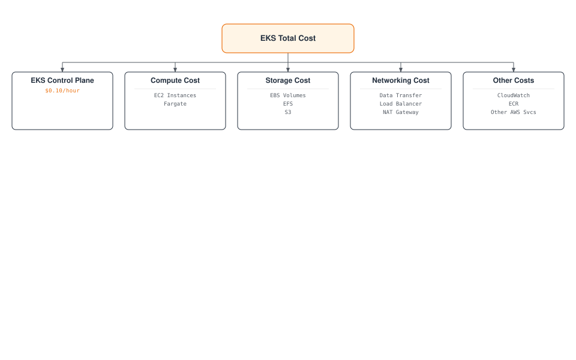
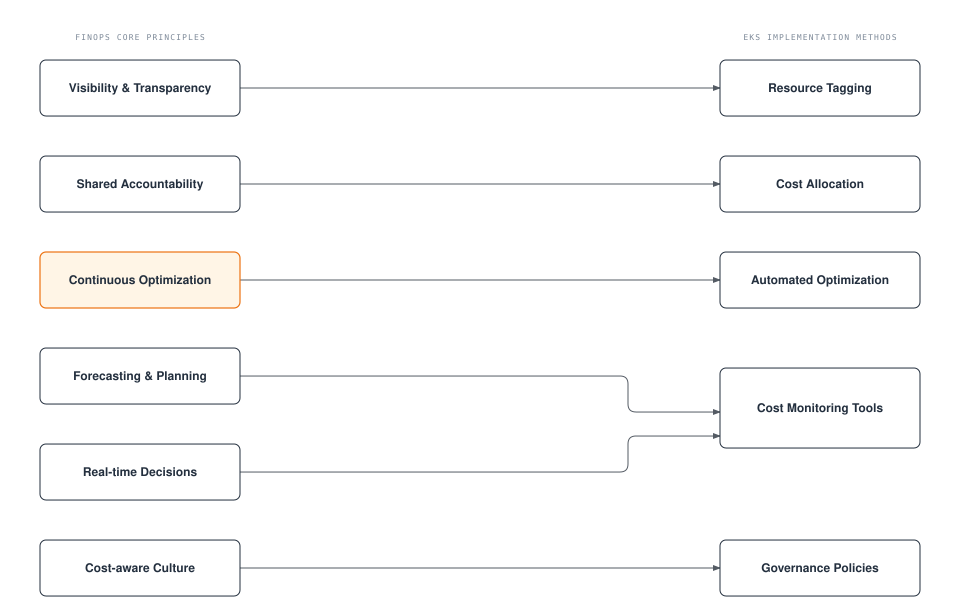
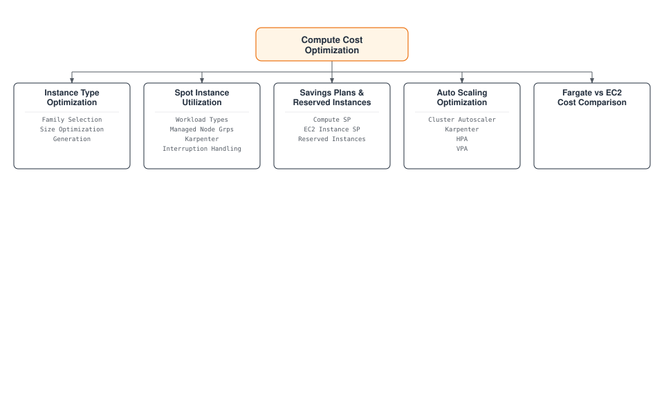
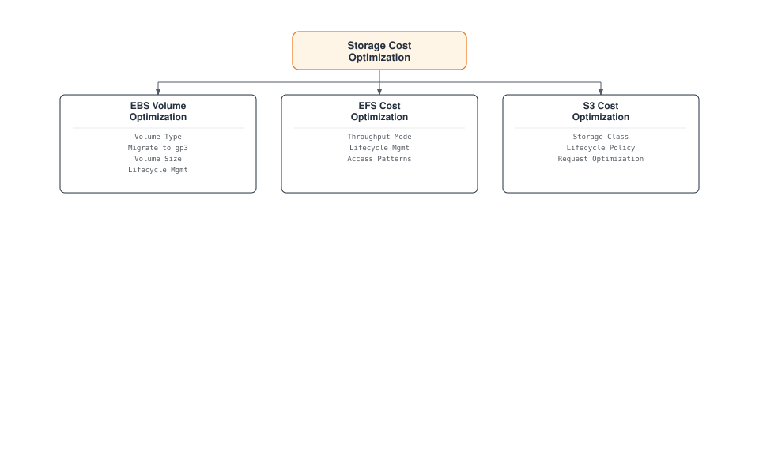
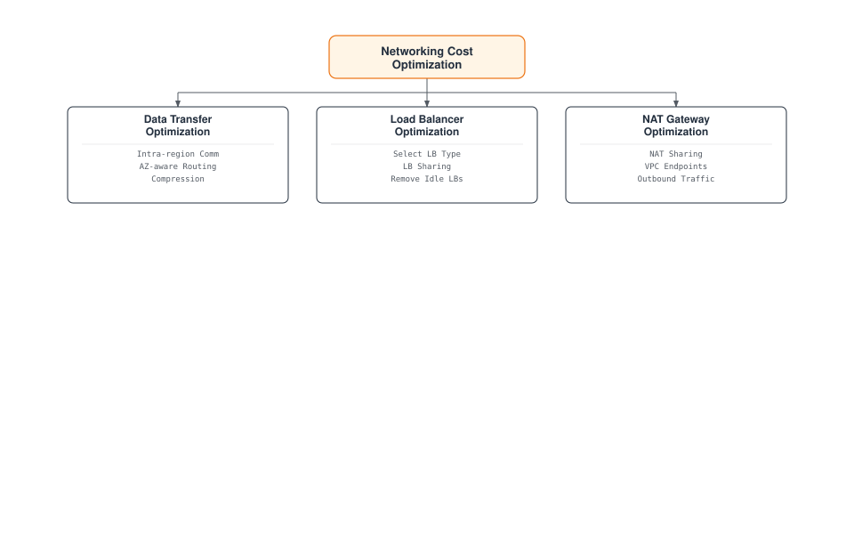
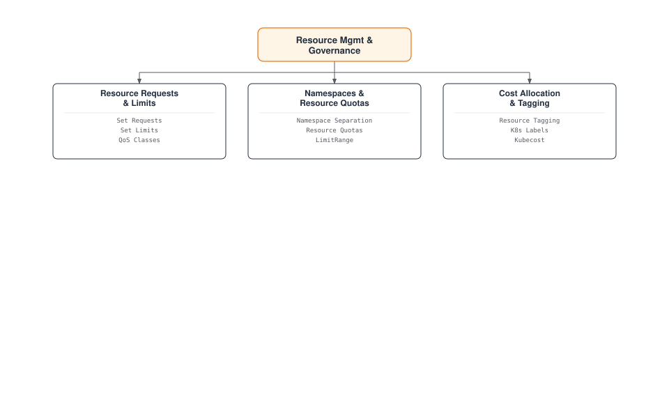
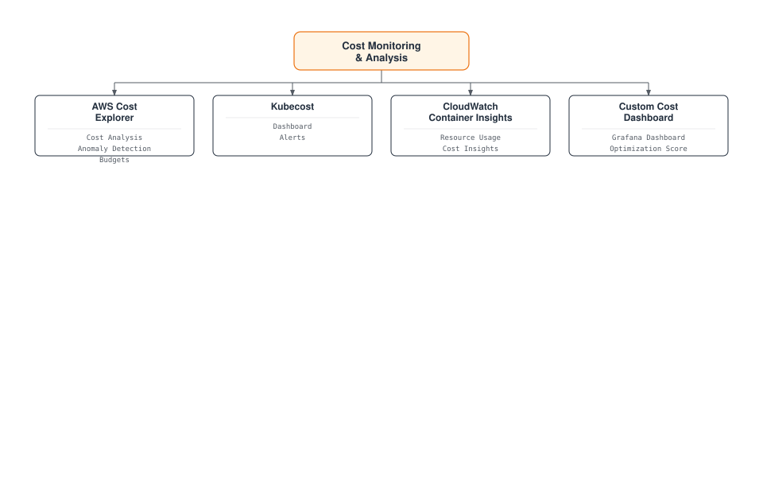
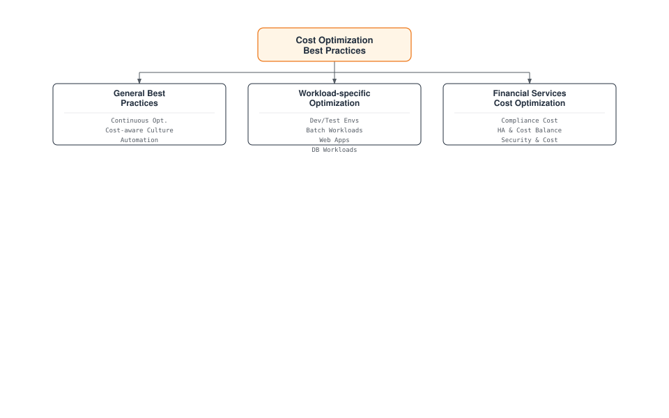

# Amazon EKS Cost Optimization

> **Supported Versions**: Amazon EKS 1.31, 1.32, 1.33
> **Last Updated**: February 22, 2026

Amazon EKS (Elastic Kubernetes Service) makes it easy to deploy, manage, and scale containerized applications, but managing costs effectively is important. This document covers various strategies and best practices for optimizing the costs of your EKS cluster.

## Table of Contents

1. [EKS Cost Components](#eks-cost-components)
2. [FinOps Principles and EKS](#finops-principles-and-eks)
3. [Compute Cost Optimization](#compute-cost-optimization)
4. [Storage Cost Optimization](#storage-cost-optimization)
5. [Networking Cost Optimization](#networking-cost-optimization)
6. [Resource Management and Governance](#resource-management-and-governance)
7. [Cost Monitoring and Analysis](#cost-monitoring-and-analysis)
8. [Cost Optimization Best Practices](#cost-optimization-best-practices)

## EKS Cost Components

The costs incurred when using Amazon EKS consist of the following components:



## FinOps Principles and EKS

FinOps (Financial Operations) is an operational model for cloud cost management where finance, technology, and business teams collaborate to share responsibility for cloud spending and make cost optimization decisions.

### Core Principles of the FinOps Framework



### Applying FinOps to EKS

1. **Achieving Cost Visibility**
   - Cost allocation using Kubernetes namespaces, labels, and annotations
   - Detailed cost analysis by integrating tools like AWS Cost Explorer and Kubecost
   - Cost analysis by team, application, and environment

2. **Implementing Shared Accountability Model**
   - Cost allocation and reporting by team
   - Setting and tracking cost optimization goals
   - Providing incentives for cost savings

3. **Automating Continuous Optimization**
   - Implementing auto-scaling policies
   - Automating spot instance utilization
   - Detecting and removing idle resources

4. **Cost Forecasting and Planning**
   - Cost forecasting through workload pattern analysis
   - Utilizing Reserved Instances and Savings Plans
   - Cost anomaly detection and alerting

### Latest FinOps Tools and Technologies

1. **Kubecost**: Kubernetes cost monitoring and optimization tool
2. **AWS Cost Anomaly Detection**: Detecting abnormal cost increases
3. **Karpenter**: Efficient node provisioning and cost optimization
4. **Goldilocks**: Resource requests and limits optimization
5. **Vertical Pod Autoscaler**: Automatic adjustment of pod resource requests

### EKS Cluster Cost

Cost for the EKS cluster itself:

- **EKS Control Plane**: $0.10 per hour (may vary by region)
- **EKS Extended Cluster**: $0.10 per hour (may vary by region)

### Compute Cost

Cost for worker nodes running in the EKS cluster:

- **EC2 Instances**: Cost of EC2 instances used for node groups
- **Fargate**: Cost based on vCPU and memory usage when using Fargate profiles

### Storage Cost

Cost for storage used in the EKS cluster:

- **EBS Volumes**: Cost of EBS volumes used for persistent volumes
- **EFS**: Cost of EFS used for shared file systems
- **S3**: Cost of S3 used for object storage

### Networking Cost

Cost related to networking for the EKS cluster:

- **Data Transfer**: Cost of data transfer between regions or to the internet
- **Load Balancer**: Cost of load balancers used for services
- **NAT Gateway**: Cost of NAT gateway for outbound traffic from private subnets

### Other Costs

- **CloudWatch**: Cost of CloudWatch used for monitoring and logging
- **ECR**: Cost of ECR used for container image storage
- **Other AWS Services**: Cost of other AWS services used with the EKS cluster

## Compute Cost Optimization

Compute cost is typically the largest cost component of an EKS cluster. You can optimize compute costs using the following strategies.



### Selecting the Right Instance Type

Selecting the right instance type for your workload is important:

#### Instance Family Selection

Select the appropriate instance family based on workload characteristics:

- **General Purpose (T3, M5, M6)**: Workloads requiring balanced compute, memory, and networking resources
- **Compute Optimized (C5, C6)**: Compute-intensive workloads requiring high-performance processors
- **Memory Optimized (R5, R6, X1)**: Memory-intensive workloads such as large in-memory databases, caches
- **Storage Optimized (I3, D2)**: Workloads requiring high disk I/O
- **Accelerated Computing (P3, G4, Inf1)**: Workloads requiring GPU or machine learning accelerators

#### Instance Size Optimization

Select the appropriate instance size for your workload requirements:

- Instances that are too large can lead to resource waste.
- Instances that are too small can cause performance issues.
- Use CloudWatch Container Insights or Kubernetes metrics to monitor actual resource usage and select the appropriate size.

#### Instance Generation Consideration

Newer generation instances generally offer better performance and cost efficiency than previous generations:

- Use M6i or M6g instead of M5
- Use C6i or C6g instead of C5
- Use R6i or R6g instead of R5

### Spot Instance Utilization

Using spot instances allows you to use EC2 instances at up to 90% less than on-demand prices:

#### Workloads Suitable for Spot Instances

- **Stateless Applications**: Applications that do not store state
- **Fault-tolerant Applications**: Applications that can handle instance interruptions
- **Batch Processing Jobs**: Jobs that can be restarted if interrupted
- **CI/CD Pipelines**: Build and test jobs

#### Using Spot Instances in Managed Node Groups

```bash
eksctl create nodegroup \
  --cluster my-cluster \
  --name my-spot-ng \
  --node-type m5.large \
  --nodes-min 2 \
  --nodes-max 5 \
  --spot
```

#### Spot Instance Provisioning with Karpenter

```yaml
apiVersion: karpenter.sh/v1
kind: NodePool
metadata:
  name: spot
spec:
  template:
    spec:
      requirements:
      - key: karpenter.sh/capacity-type
        operator: In
        values: ["spot"]
      - key: kubernetes.io/arch
        operator: In
        values: ["amd64"]
      - key: node.kubernetes.io/instance-type
        operator: In
        values: ["m5.large", "m5.xlarge", "m5.2xlarge"]
      nodeClassRef:
        group: karpenter.k8s.aws
        kind: EC2NodeClass
        name: spot-class
  limits:
    cpu: 1000
    memory: 1000Gi
  disruption:
    consolidationPolicy: WhenEmpty
    consolidateAfter: 30s
---
apiVersion: karpenter.k8s.aws/v1
kind: EC2NodeClass
metadata:
  name: spot-class
spec:
  subnetSelectorTerms:
    - tags:
        karpenter.sh/discovery: my-cluster
  securityGroupSelectorTerms:
    - tags:
        karpenter.sh/discovery: my-cluster
```

#### Spot Instance Interruption Handling

Best practices for handling spot instance interruptions:

1. **Use Multiple Instance Types**: Distribute interruption risk by using various instance types
2. **Use Multiple Availability Zones**: Deploy instances across multiple availability zones
3. **Use Spot Instance Interruption Handler**: Use AWS Node Termination Handler to handle interruption notifications

```bash
helm repo add eks https://aws.github.io/eks-charts
helm install aws-node-termination-handler \
  --namespace kube-system \
  eks/aws-node-termination-handler \
  --set enableSpotInterruptionDraining=true
```

### Savings Plans and Reserved Instances

For predictable workloads, you can reduce costs by using Savings Plans or Reserved Instances:

#### Compute Savings Plans

Compute Savings Plans offer up to 66% discount from on-demand rates with a 1-year or 3-year commitment:

- **Flexibility**: Applies regardless of instance family, size, OS, tenancy, and region
- **Includes EC2, Fargate, and Lambda**: Applies across multiple compute services

#### EC2 Instance Savings Plans

EC2 Instance Savings Plans offer up to 72% discount for instance families in a specific region:

- **Moderate Flexibility**: Applies across sizes and OS within an instance family in a specific region
- **Higher Discount Rate**: Offers higher discount rate than Compute Savings Plans

#### Reserved Instances

Reserved Instances offer up to 75% discount for specific instance types and regions:

- **Low Flexibility**: Tied to specific instance types, regions, and availability zones
- **Highest Discount Rate**: Offers the highest discount rate

### Fargate vs EC2 Cost Comparison

When choosing between Fargate and EC2, consider costs:

#### Fargate Advantages

- **Reduced Operational Overhead**: No node management required
- **Precise Resource Provisioning**: Resource allocation at pod level
- **No Idle Capacity**: Pay only for running pods

#### EC2 Advantages

- **More Cost-efficient for Large Workloads**: For high resource utilization cases
- **More Instance Type Options**: Can select instance types for various workloads
- **Spot Instance Support**: Additional cost savings possible using spot instances

#### Cost Comparison Example

**Scenario**: Application using 2vCPU, 4GB memory

**Fargate Cost**:
- vCPU: $0.04048 per vCPU-hour × 2 = $0.08096 per hour
- Memory: $0.004445 per GB-hour × 4 = $0.01778 per hour
- Total Cost: $0.09874 per hour

**EC2 Cost (t3.medium)**:
- On-demand: $0.0416 per hour
- Spot: ~$0.0125 per hour (assuming 70% discount)

In this example, EC2 is more cost-efficient, but node management overhead and cluster utilization should be considered.

### Auto Scaling Optimization

You can optimize costs by implementing effective auto-scaling strategies:

#### Cluster Autoscaler

Cluster Autoscaler automatically adds nodes when pods cannot be scheduled and removes nodes when they are not sufficiently utilized:

```bash
# Install Cluster Autoscaler
kubectl apply -f https://raw.githubusercontent.com/kubernetes/autoscaler/master/cluster-autoscaler/cloudprovider/aws/examples/cluster-autoscaler-autodiscover.yaml

# Configure Cluster Autoscaler
kubectl -n kube-system set env deployment.apps/cluster-autoscaler \
  CLUSTER_NAME=my-cluster \
  AWS_REGION=us-west-2
```

Cluster Autoscaler configuration optimization:

- **scale-down-delay-after-add**: Delay before scale down after node addition (default: 10 minutes)
- **scale-down-unneeded-time**: Time before a node is considered unnecessary (default: 10 minutes)
- **max-node-provision-time**: Maximum wait time for node provisioning (default: 15 minutes)

```bash
kubectl -n kube-system set env deployment.apps/cluster-autoscaler \
  CLUSTER_AUTOSCALER_EXPANDER=least-waste \
  CLUSTER_AUTOSCALER_SCALE_DOWN_DELAY_AFTER_ADD=5m \
  CLUSTER_AUTOSCALER_SCALE_DOWN_UNNEEDED_TIME=5m
```

#### Karpenter

Karpenter is an alternative to Cluster Autoscaler, providing faster and more flexible node provisioning:

```yaml
apiVersion: karpenter.sh/v1
kind: NodePool
metadata:
  name: default
spec:
  template:
    spec:
      requirements:
      - key: kubernetes.io/arch
        operator: In
        values: ["amd64"]
      - key: node.kubernetes.io/instance-type
        operator: In
        values: ["m5.large", "m5.xlarge", "m5.2xlarge"]
      nodeClassRef:
        group: karpenter.k8s.aws
        kind: EC2NodeClass
        name: default-class
  limits:
    cpu: 1000
    memory: 1000Gi
  disruption:
    consolidationPolicy: WhenEmpty
    consolidateAfter: 30s
---
apiVersion: karpenter.k8s.aws/v1
kind: EC2NodeClass
metadata:
  name: default-class
spec:
  subnetSelectorTerms:
    - tags:
        karpenter.sh/discovery: my-cluster
  securityGroupSelectorTerms:
    - tags:
        karpenter.sh/discovery: my-cluster
```

Karpenter cost optimization settings:

- **ttlSecondsAfterEmpty**: Time until termination after node is empty (e.g., 30 seconds)
- **consolidation.enabled**: Enable node consolidation (default: true)
- **instance-types**: Specify cost-efficient instance types

#### Horizontal Pod Autoscaler (HPA)

HPA automatically adjusts the number of pods based on CPU utilization or custom metrics:

```yaml
apiVersion: autoscaling/v2
kind: HorizontalPodAutoscaler
metadata:
  name: app-hpa
spec:
  scaleTargetRef:
    apiVersion: apps/v1
    kind: Deployment
    name: app
  minReplicas: 2
  maxReplicas: 10
  metrics:
  - type: Resource
    resource:
      name: cpu
      target:
        type: Utilization
        averageUtilization: 70
  - type: Resource
    resource:
      name: memory
      target:
        type: Utilization
        averageUtilization: 80
```

HPA optimization settings:

- **--horizontal-pod-autoscaler-downscale-stabilization**: Scale down stabilization period (default: 5 minutes)
- **--horizontal-pod-autoscaler-cpu-initialization-period**: CPU initialization period (default: 5 minutes)
- **--horizontal-pod-autoscaler-initial-readiness-delay**: Initial readiness delay (default: 30 seconds)

#### Vertical Pod Autoscaler (VPA)

VPA automatically adjusts pod CPU and memory requests to optimize resource utilization:

```yaml
apiVersion: autoscaling.k8s.io/v1
kind: VerticalPodAutoscaler
metadata:
  name: app-vpa
spec:
  targetRef:
    apiVersion: apps/v1
    kind: Deployment
    name: app
  updatePolicy:
    updateMode: Auto
  resourcePolicy:
    containerPolicies:
    - containerName: '*'
      minAllowed:
        cpu: 50m
        memory: 100Mi
      maxAllowed:
        cpu: 1
        memory: 1Gi
```

VPA Modes:

- **Auto**: Automatically restarts pods to update resource requests
- **Initial**: Sets resource requests only for new pods
- **Off**: Provides recommendations only, no automatic updates
## Storage Cost Optimization

Storage is an important cost component of EKS clusters. You can optimize storage costs using the following strategies.



### EBS Volume Optimization

EBS volumes are primarily used for persistent storage in EKS clusters:

#### Select Appropriate Volume Type

Select the EBS volume type appropriate for your workload:

- **gp3**: General purpose SSD recommended for most workloads
- **gp2**: Previous generation general purpose SSD, migration to gp3 recommended
- **io1/io2**: Provisioned IOPS SSD for high-performance workloads
- **st1**: Throughput optimized HDD for throughput-intensive workloads
- **sc1**: Cold HDD for infrequently accessed data

gp3 is more cost-efficient than gp2 and has higher baseline performance:

| Volume Type | Baseline IOPS | Max IOPS | Baseline Throughput | Max Throughput | Price per GB |
|------------|--------------|----------|---------------------|----------------|--------------|
| gp3        | 3,000        | 16,000   | 125 MiB/s           | 1,000 MiB/s    | $0.08/GB-month |
| gp2        | 3 IOPS/GB    | 16,000   | Up to 250 MiB/s     | 250 MiB/s      | $0.10/GB-month |

#### Migrate to gp3

Migrate existing gp2 volumes to gp3 to reduce costs:

```yaml
apiVersion: storage.k8s.io/v1
kind: StorageClass
metadata:
  name: gp3
  annotations:
    storageclass.kubernetes.io/is-default-class: "true"
provisioner: ebs.csi.aws.com
parameters:
  type: gp3
  encrypted: "true"
allowVolumeExpansion: true
```

Migrating existing PVC to gp3:

1. Create volume snapshot
2. Create new PVC with gp3 volume from snapshot
3. Migrate application to new PVC

#### Volume Size Optimization

Provision only the volume size needed:

- Over-provisioned volumes incur unnecessary costs.
- Monitor volume usage and adjust size as needed.
- Consider auto-expansion solutions to automatically adjust volume size as needed.

#### Volume Lifecycle Management

Identify and remove unnecessary volumes:

- Regularly review unused PVCs and PVs
- Clean up volumes from terminated pods
- Set appropriate PV reclaim policies (Delete or Retain)

### EFS Cost Optimization

EFS is useful for workloads requiring shared access across multiple nodes:

#### Select Appropriate Throughput Mode

Select the EFS throughput mode appropriate for your workload:

- **Bursting Throughput**: Suitable for intermittent access patterns
- **Provisioned Throughput**: Suitable for workloads requiring predictable performance
- **Elastic Throughput**: Suitable for highly variable workloads

#### Lifecycle Management

Use EFS lifecycle management to automatically move infrequently accessed files to the IA (Infrequent Access) storage class:

```bash
aws efs put-lifecycle-configuration \
  --file-system-id fs-1234567890abcdef0 \
  --lifecycle-policies '[{"TransitionToIA":"AFTER_30_DAYS"}]'
```

#### Access Pattern Optimization

Optimize EFS access patterns to reduce costs:

- Use larger files rather than small files
- Minimize metadata operations
- Use sequential access patterns

### S3 Cost Optimization

S3 is a cost-efficient option for storing logs, backups, static content, etc.:

#### Storage Class Optimization

Select the S3 storage class appropriate for your workload:

- **S3 Standard**: Frequently accessed data
- **S3 Intelligent-Tiering**: Data with changing access patterns
- **S3 Standard-IA**: Infrequently accessed data
- **S3 One Zone-IA**: Infrequently accessed, non-critical data
- **S3 Glacier**: Archive data

#### Lifecycle Policy

Use S3 lifecycle policies to automatically move objects to cheaper storage classes or expire them:

```json
{
  "Rules": [
    {
      "ID": "Move to IA after 30 days, Glacier after 90 days",
      "Status": "Enabled",
      "Prefix": "logs/",
      "Transitions": [
        {
          "Days": 30,
          "StorageClass": "STANDARD_IA"
        },
        {
          "Days": 90,
          "StorageClass": "GLACIER"
        }
      ],
      "Expiration": {
        "Days": 365
      }
    }
  ]
}
```

#### S3 Request Optimization

Optimize S3 request costs:

- Combine small objects into larger objects
- Minimize unnecessary LIST operations
- Consider using S3 Transfer Acceleration or multipart uploads

## Networking Cost Optimization

Networking costs can be significant, especially with large data transfers. You can optimize networking costs using the following strategies.



### Data Transfer Optimization

#### Utilize Intra-region Communication

Reduce inter-region data transfer costs by communicating within the same region whenever possible:

- Place EKS cluster and related AWS services in the same region
- Minimize inter-region data transfer when spanning multiple regions

#### Availability Zone Aware Routing

Implement availability zone aware routing to reduce inter-AZ data transfer costs:

- Use topology-aware service routing
- Configure availability zone affinity

```yaml
apiVersion: v1
kind: Service
metadata:
  name: my-service
  annotations:
    service.kubernetes.io/topology-aware-hints: "auto"
spec:
  selector:
    app: my-app
  ports:
  - port: 80
    targetPort: 8080
  type: ClusterIP
```

#### Use Compression

Reduce the amount of data transferred by using compression before data transfer:

- API response compression
- Log and metric compression
- Image and static asset optimization

### Load Balancer Optimization

#### Select Appropriate Load Balancer Type

Select the load balancer type appropriate for your workload:

- **Network Load Balancer (NLB)**: TCP/UDP traffic, when low latency is needed
- **Application Load Balancer (ALB)**: HTTP/HTTPS traffic, when path-based routing is needed
- **Classic Load Balancer (CLB)**: Legacy workloads

#### Load Balancer Sharing

Reduce costs by sharing load balancers across multiple services:

- Use ALB Ingress Controller
- Expose multiple services using Ingress resources

```bash
# Install ALB Ingress Controller
helm repo add eks https://aws.github.io/eks-charts
helm install aws-load-balancer-controller \
  eks/aws-load-balancer-controller \
  -n kube-system \
  --set clusterName=my-cluster
```

```yaml
apiVersion: networking.k8s.io/v1
kind: Ingress
metadata:
  name: shared-ingress
  annotations:
    kubernetes.io/ingress.class: alb
    alb.ingress.kubernetes.io/scheme: internet-facing
spec:
  rules:
  - host: service1.example.com
    http:
      paths:
      - path: /
        pathType: Prefix
        backend:
          service:
            name: service1
            port:
              number: 80
  - host: service2.example.com
    http:
      paths:
      - path: /
        pathType: Prefix
        backend:
          service:
            name: service2
            port:
              number: 80
```

#### Remove Idle Load Balancers

Identify and remove unused load balancers:

- Monitor load balancers with no traffic
- Remove unnecessary load balancers in test or development environments

### NAT Gateway Optimization

NAT gateways incur hourly charges and data processing charges:

#### NAT Gateway Sharing

Reduce costs by sharing NAT gateways across multiple subnets:

- Use one NAT gateway per availability zone
- Use the same NAT gateway for multiple private subnets

#### Use VPC Endpoints

Reduce NAT gateway costs by using VPC endpoints for private access to AWS services:

```bash
# Create S3 VPC Endpoint
aws ec2 create-vpc-endpoint \
  --vpc-id vpc-1234567890abcdef0 \
  --service-name com.amazonaws.us-west-2.s3 \
  --route-table-ids rtb-1234567890abcdef0

# Create DynamoDB VPC Endpoint
aws ec2 create-vpc-endpoint \
  --vpc-id vpc-1234567890abcdef0 \
  --service-name com.amazonaws.us-west-2.dynamodb \
  --route-table-ids rtb-1234567890abcdef0
```

Commonly used VPC endpoints:

- S3
- DynamoDB
- ECR
- CloudWatch Logs
- STS

#### Outbound Traffic Optimization

Optimize outbound traffic passing through NAT gateway:

- Minimize unnecessary external API calls
- Schedule large data transfers to off-peak hours
- Use data compression

## Resource Management and Governance

Effective resource management and governance is important for controlling EKS cluster costs. You can effectively manage resources using the following strategies.



### Resource Requests and Limits Optimization

#### Set Appropriate Resource Requests

Set resource requests that match your application's actual resource requirements:

- Requests that are too high lead to resource waste.
- Requests that are too low can cause performance issues.
- Use VPA (Vertical Pod Autoscaler) to optimize resource requests

```yaml
apiVersion: v1
kind: Pod
metadata:
  name: app
spec:
  containers:
  - name: app
    image: app:latest
    resources:
      requests:
        cpu: 100m
        memory: 256Mi
      limits:
        cpu: 500m
        memory: 512Mi
```

#### Set Resource Limits

Set resource limits to prevent containers from using excessive resources:

- CPU Limit: Maximum CPU a container can use
- Memory Limit: Maximum memory a container can use

#### Understanding QoS Classes

Understand and utilize Kubernetes QoS (Quality of Service) classes:

- **Guaranteed**: Request = Limit (highest priority)
- **Burstable**: Request < Limit
- **BestEffort**: No request and limit (lowest priority)

When resources are scarce, BestEffort pods are evicted first, then Burstable pods.

### Namespaces and Resource Quotas

#### Namespace-based Separation

Use namespaces to logically separate resources:

- Create namespaces by team, environment, or application
- Monitor resource usage by namespace

#### Set Resource Quotas

Use ResourceQuota to limit resource usage per namespace:

```yaml
apiVersion: v1
kind: ResourceQuota
metadata:
  name: team-quota
  namespace: team-a
spec:
  hard:
    requests.cpu: "10"
    requests.memory: 20Gi
    limits.cpu: "20"
    limits.memory: 40Gi
    pods: "20"
    services: "10"
    persistentvolumeclaims: "5"
```

#### Set LimitRange

Use LimitRange to set default resource limits for containers within a namespace:

```yaml
apiVersion: v1
kind: LimitRange
metadata:
  name: default-limits
  namespace: team-a
spec:
  limits:
  - default:
      cpu: 500m
      memory: 512Mi
    defaultRequest:
      cpu: 100m
      memory: 256Mi
    type: Container
```

### Cost Allocation and Tagging

#### Resource Tagging

Tag AWS resources to track and allocate costs:

- Tag by team, project, environment, cost center, etc.
- Implement consistent tagging strategy

```bash
# Tag EKS cluster
aws eks tag-resource \
  --resource-arn arn:aws:eks:us-west-2:123456789012:cluster/my-cluster \
  --tags Team=DevOps,Environment=Production,CostCenter=123456

# Tag EC2 instance
aws ec2 create-tags \
  --resources i-1234567890abcdef0 \
  --tags Key=Team,Value=DevOps Key=Environment,Value=Production Key=CostCenter,Value=123456
```

#### Kubernetes Labels and Annotations

Tag Kubernetes resources with labels and annotations to track and allocate costs:

```yaml
apiVersion: apps/v1
kind: Deployment
metadata:
  name: app
  labels:
    app: app
    team: team-a
    environment: production
    cost-center: "123456"
spec:
  replicas: 3
  selector:
    matchLabels:
      app: app
  template:
    metadata:
      labels:
        app: app
        team: team-a
        environment: production
        cost-center: "123456"
    spec:
      containers:
      - name: app
        image: app:latest
```

#### Using Kubecost

Use Kubecost to track and optimize Kubernetes resource costs:

```bash
# Install Kubecost
helm repo add kubecost https://kubecost.github.io/cost-analyzer/
helm install kubecost kubecost/cost-analyzer \
  --namespace kubecost \
  --create-namespace \
  --set kubecostToken="<your-token>"
```

Kubecost provides the following features:

- Cost analysis by namespace, deployment, service, label
- Cost optimization recommendations
- Cost allocation and chargeback reports
## Cost Monitoring and Analysis

To effectively optimize costs, you need to continuously monitor and analyze costs. You can monitor and analyze EKS cluster costs using the following tools and strategies.



### AWS Cost Explorer

AWS Cost Explorer is a tool that helps visualize, understand, and manage AWS costs and usage:

#### Cost Analysis

Analyze EKS cluster costs using AWS Cost Explorer:

- Cost analysis by service
- Cost analysis by tag
- Cost trend analysis over time

```bash
# Get cost data using AWS CLI
aws ce get-cost-and-usage \
  --time-period Start=2025-06-01,End=2025-07-01 \
  --granularity MONTHLY \
  --metrics "BlendedCost" "UnblendedCost" "UsageQuantity" \
  --group-by Type=DIMENSION,Key=SERVICE Type=TAG,Key=Environment
```

#### Cost Anomaly Detection

Use AWS Cost Anomaly Detection to detect abnormal cost increases:

1. Log in to AWS Management Console
2. Navigate to AWS Cost Management service
3. Select "Cost Anomaly Detection"
4. Click "Create anomaly monitor"
5. Configure monitor type and notification preferences

#### Cost Budget Setting

Use AWS Budgets to set cost budgets and receive alerts when exceeded:

```bash
# Create budget using AWS CLI
aws budgets create-budget \
  --account-id 123456789012 \
  --budget file://budget.json \
  --notifications-with-subscribers file://notifications.json
```

budget.json:
```json
{
  "BudgetName": "EKS Cluster Budget",
  "BudgetLimit": {
    "Amount": "1000",
    "Unit": "USD"
  },
  "BudgetType": "COST",
  "CostFilters": {
    "TagKeyValue": [
      "user:Environment$Production"
    ],
    "Service": [
      "Amazon Elastic Kubernetes Service"
    ]
  },
  "TimePeriod": {
    "Start": 1625097600,
    "End": 1627776000
  },
  "TimeUnit": "MONTHLY"
}
```

notifications.json:
```json
[
  {
    "Notification": {
      "ComparisonOperator": "GREATER_THAN",
      "NotificationType": "ACTUAL",
      "Threshold": 80,
      "ThresholdType": "PERCENTAGE"
    },
    "Subscribers": [
      {
        "Address": "email@example.com",
        "SubscriptionType": "EMAIL"
      }
    ]
  }
]
```

### Kubecost

Kubecost is a dedicated tool for monitoring and optimizing Kubernetes cluster costs:

#### Kubecost Installation

```bash
helm repo add kubecost https://kubecost.github.io/cost-analyzer/
helm install kubecost kubecost/cost-analyzer \
  --namespace kubecost \
  --create-namespace \
  --set kubecostToken="<your-token>"
```

#### Kubecost Dashboard

The Kubecost dashboard provides the following information:

- Cost by namespace, deployment, service, node
- Resource efficiency and utilization
- Cost optimization recommendations
- Cost allocation and chargeback reports

#### Kubecost Alerts

Configure Kubecost alerts to receive notifications for cost anomalies or budget overruns:

```yaml
apiVersion: v1
kind: ConfigMap
metadata:
  name: cost-analyzer-alerts
  namespace: kubecost
data:
  alerts.json: |
    {
      "alerts": [
        {
          "name": "Budget Warning",
          "description": "Monthly spend is approaching budget",
          "type": "budget",
          "threshold": 0.8,
          "window": "month",
          "aggregation": "namespace",
          "filter": {
            "namespace": "team-a"
          },
          "budget": 1000
        }
      ]
    }
```

### CloudWatch Container Insights

Use CloudWatch Container Insights to monitor EKS cluster resource usage:

#### Enable Container Insights

```bash
# Enable Container Insights
eksctl utils update-cluster-logging \
  --enable-types containerinsights \
  --cluster my-cluster \
  --region us-west-2
```

#### Resource Usage Monitoring

The CloudWatch dashboard lets you monitor the following metrics:

- CPU and memory usage
- Disk and network I/O
- Container restart count
- Node status

#### Cost Optimization Insights

Analyze CloudWatch Container Insights data to identify cost optimization opportunities:

- Identify over-provisioned resources
- Identify nodes with low resource utilization
- Analyze differences between resource requests and actual usage

### Custom Cost Dashboard

You can create custom cost dashboards to comprehensively monitor EKS cluster costs:

#### Grafana Dashboard

Create custom cost dashboards using Prometheus and Grafana:

1. Collect resource usage metrics in Prometheus
2. Create cost dashboard in Grafana
3. Integrate with AWS Cost Explorer API to display actual cost data

#### Cost Optimization Score

Calculate cost optimization scores to track cluster cost efficiency:

- Resource request to usage ratio
- Node utilization
- Spot instance usage ratio
- Idle resource ratio

## Cost Optimization Best Practices

Let's look at best practices for optimizing EKS cluster costs.



### General Best Practices

#### Continuous Cost Optimization

Cost optimization is a continuous process, not a one-time task:

1. **Measure**: Measure current costs and resource usage
2. **Analyze**: Analyze cost drivers and optimization opportunities
3. **Optimize**: Implement cost optimization strategies
4. **Monitor**: Monitor results and adjust as needed
5. **Iterate**: Repeat the process

#### Building Cost-aware Culture

Build a cost-aware culture within the organization:

- Provide cost visibility to teams
- Set cost optimization goals
- Recognize and reward cost optimization achievements
- Share cost optimization best practices

#### Utilizing Automation

Utilize automation to optimize costs:

- Implement auto-scaling
- Usage-based resource provisioning
- Automate cost anomaly detection and alerting
- Automatically identify and remove idle resources

### Workload-specific Optimization

#### Development and Test Environments

Optimize costs for development and test environments:

- Auto shutdown environments when not in use
- Use spot instances
- Set resource limits
- Consider using shared environments

```bash
# CronJob for auto-shutdown of dev environment
kubectl apply -f - <<EOF
apiVersion: batch/v1
kind: CronJob
metadata:
  name: dev-env-shutdown
  namespace: kube-system
spec:
  schedule: "0 20 * * 1-5"  # Weekdays at 8 PM
  jobTemplate:
    spec:
      template:
        spec:
          serviceAccountName: cluster-admin
          containers:
          - name: kubectl
            image: bitnami/kubectl:latest
            command:
            - /bin/sh
            - -c
            - kubectl scale deployment -n dev --all --replicas=0
          restartPolicy: OnFailure
EOF
```

#### Batch Workloads

Optimize costs for batch workloads:

- Use spot instances
- Schedule runs during off-peak hours
- Optimize resource requests
- Release resources after job completion

```yaml
apiVersion: batch/v1
kind: Job
metadata:
  name: batch-job
spec:
  template:
    spec:
      nodeSelector:
        kubernetes.io/lifecycle: spot
      containers:
      - name: batch-processor
        image: batch-processor:latest
        resources:
          requests:
            cpu: 2
            memory: 4Gi
          limits:
            cpu: 4
            memory: 8Gi
      restartPolicy: Never
  backoffLimit: 4
```

#### Web Applications

Optimize costs for web applications:

- Implement auto-scaling
- Use CDN to reduce traffic
- Implement caching strategy
- Consider serverless architecture

```yaml
apiVersion: autoscaling/v2
kind: HorizontalPodAutoscaler
metadata:
  name: web-app-hpa
spec:
  scaleTargetRef:
    apiVersion: apps/v1
    kind: Deployment
    name: web-app
  minReplicas: 2
  maxReplicas: 10
  metrics:
  - type: Resource
    resource:
      name: cpu
      target:
        type: Utilization
        averageUtilization: 70
  - type: Resource
    resource:
      name: memory
      target:
        type: Utilization
        averageUtilization: 80
```

#### Database Workloads

Optimize costs for database workloads:

- Select appropriate instance type
- Configure storage auto-scaling
- Consider using read replicas
- Consider adding caching layer

### Cost Optimization for Financial Services

Additional cost optimization strategies to consider when using EKS in the financial services industry:

#### Regulatory Compliance Cost Management

Optimize costs while meeting regulatory compliance requirements:

- Provision minimum resources to meet regulatory requirements
- Reduce operational costs through compliance automation
- Separate regulated and non-regulated environments

#### High Availability and Cost Balance

Maintain balance between high availability requirements and costs:

- Multi-AZ deployment for critical workloads
- Consider single-AZ deployment for non-critical workloads
- Implement cost-efficient approach for disaster recovery environments

#### Security Requirements and Cost Balance

Maintain balance between security requirements and costs:

- Implement security controls using risk-based approach
- Reduce operational costs through security automation
- Select cost-efficient security tools and services

## Conclusion

Effectively optimizing Amazon EKS cluster costs requires a comprehensive approach covering compute, storage, networking, and operational costs. Implementing the strategies and best practices covered in this document can significantly reduce EKS costs without sacrificing performance or stability.

Key Points:

1. **EKS Cost Components**: EKS cluster cost, compute cost, storage cost, networking cost, and other costs
2. **Compute Cost Optimization**: Selecting appropriate instance types, utilizing spot instances, using Savings Plans and Reserved Instances, optimizing auto-scaling
3. **Storage Cost Optimization**: EBS volume optimization, EFS cost optimization, S3 cost optimization
4. **Networking Cost Optimization**: Data transfer optimization, load balancer optimization, NAT gateway optimization
5. **Resource Management and Governance**: Resource requests and limits optimization, namespaces and resource quotas, cost allocation and tagging
6. **Cost Monitoring and Analysis**: AWS Cost Explorer, Kubecost, CloudWatch Container Insights, custom cost dashboards
7. **Cost Optimization Best Practices**: General best practices, workload-specific optimization, cost optimization for financial services

Cost optimization is a continuous process, and you should regularly review and adjust cost optimization strategies as your cluster and workloads evolve.

## References

- [Amazon EKS Pricing](https://aws.amazon.com/eks/pricing/)
- [AWS Cost Optimization Resources](https://aws.amazon.com/aws-cost-management/)
- [Kubernetes Resource Management](https://kubernetes.io/docs/concepts/configuration/manage-resources-containers/)
- [AWS Well-Architected Framework - Cost Optimization Pillar](https://docs.aws.amazon.com/wellarchitected/latest/cost-optimization-pillar/welcome.html)
- [Kubecost Documentation](https://www.kubecost.com/kubernetes-cost-optimization/kubernetes-cost-optimization-best-practices/)
- [EKS Best Practices - Cost Optimization](https://aws.github.io/aws-eks-best-practices/cost-optimization/)

## Quiz

To test what you've learned in this chapter, try the [topic quiz](../quizzes/eks/07-eks-cost-optimization-quiz.md).
