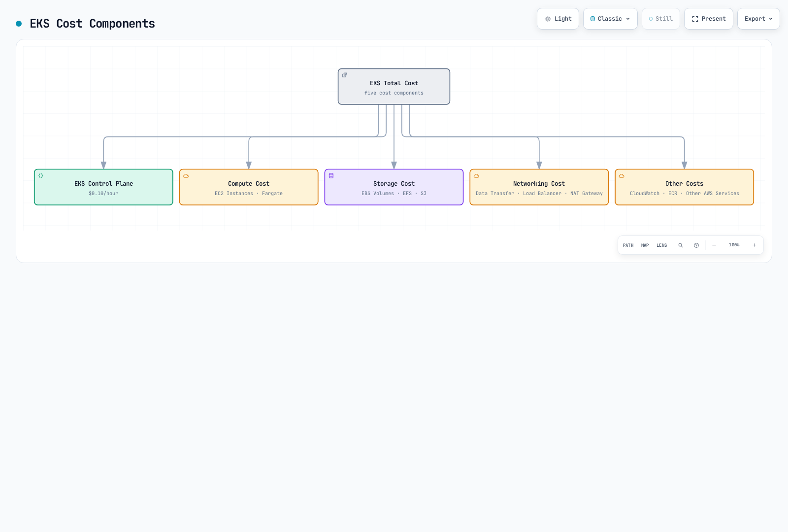
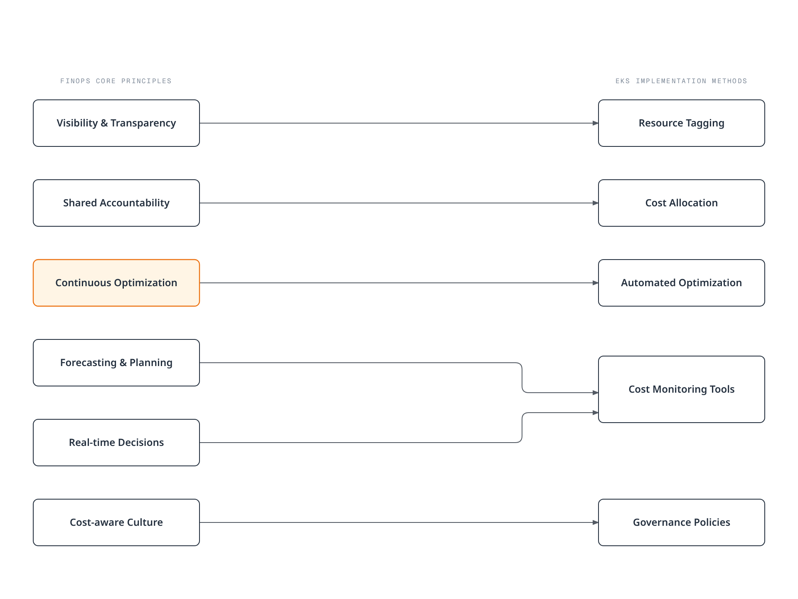

# Amazon EKS Cost Optimization

> **Verification Scope**: Current AWS pricing/support documentation; Kubernetes manifests checked against 1.36. Select the actual EKS version and add-ons from the AWS support catalog.
> **Last Updated**: September 12, 2026

Amazon EKS (Elastic Kubernetes Service) makes it easy to deploy, manage, and scale containerized applications, but managing costs effectively is important. This document covers various strategies and best practices for optimizing the costs of your EKS cluster.

The commands are configuration examples, not recorded deployments or measured savings. Verify the account, Region, existing resource owner, workload requirements, and supported tool versions before applying them. Historical price assumptions below are explicitly separated from current service behavior.

## Table of Contents

1. [EKS Cost Components](#eks-cost-components)
2. [FinOps Principles and EKS](#finops-principles-and-eks)
3. [Compute Cost Optimization](#compute-cost-optimization)
4. [Storage Cost Optimization](#storage-cost-optimization)
5. [Networking Cost Optimization](#networking-cost-optimization)
6. [Resource Management and Governance](#resource-management-and-governance)
7. [Cost Monitoring and Analysis](#cost-monitoring-and-analysis)
8. [Cost Optimization Best Practices](#cost-optimization-best-practices)

## EKS Cost Components

The costs incurred when using Amazon EKS consist of the following components:



[🔍 View interactive diagram](https://www.atomai.click/kubernetes-docs/archmaps/en-eks-07-eks-cost-optimization-0.html)

## FinOps Principles and EKS

FinOps is an operational framework and cultural practice for maximizing the business value of technology. Engineering, finance, and business teams collaborate using timely, data-driven decisions and financial accountability; this chapter applies that approach to EKS.

### Core Principles of the FinOps Framework

The FinOps Foundation emphasizes collaboration across teams, business value in decisions, ownership of usage, timely and accurate accessible data, central enablement, and deliberate use of cloud's variable-cost model. The EKS practices below apply those principles; they are not a separate official six-principle framework.

<!-- Pending parent diagram repair: see /tmp/eks-cost-optimization-audit/diagram-review.json


[🔍 View interactive diagram](https://www.atomai.click/kubernetes-docs/archmaps/en-eks-07-eks-cost-optimization-1.html)
-->

### Applying FinOps to EKS

1. **Achieving Cost Visibility**
   - Cost allocation using Kubernetes namespaces, labels, and annotations
   - Detailed cost analysis by integrating tools like AWS Cost Explorer and Kubecost
   - Cost analysis by team, application, and environment

2. **Implementing Shared Accountability Model**
   - Cost allocation and reporting by team
   - Setting and tracking cost optimization goals
   - Providing incentives for cost savings

3. **Automating Continuous Optimization**
   - Implementing auto-scaling policies
   - Automating spot instance utilization
   - Detecting waste candidates and removing resources only after owner/retention review

4. **Cost Forecasting and Planning**
   - Cost forecasting through workload pattern analysis
   - Utilizing Reserved Instances and Savings Plans
   - Cost anomaly detection and alerting

### Latest FinOps Tools and Technologies

1. **Kubecost**: Kubernetes cost monitoring and optimization tool
2. **AWS Cost Anomaly Detection**: Detecting abnormal cost increases
3. **Karpenter**: Efficient node provisioning and cost optimization
4. **Goldilocks**: Resource requests and limits optimization
5. **Vertical Pod Autoscaler**: Automatic adjustment of pod resource requests

### EKS Cluster Cost

The published version-support charge is:

- **Standard support**: $0.10 per cluster-hour.
- **Extended support**: **$0.60 total per cluster-hour** ($0.10 base + $0.50 extended-support charge), not a separate “extended cluster” at $0.10.

Standard support lasts 14 months from the EKS version release, followed by 12 months of extended support. Check the [EKS release calendar](https://docs.aws.amazon.com/eks/latest/userguide/kubernetes-versions.html) for the exact version dates and support policy. Provisioned Control Plane tiers, Auto Mode, Hybrid Nodes, and EKS Capabilities can add separate charges; EC2/Fargate, storage, networking, and observability remain separate. The overview diagram's $0.10 label describes standard version support only. See [current EKS pricing](https://aws.amazon.com/eks/pricing/).

### Compute Cost

Cost for worker nodes running in the EKS cluster:

- **EC2 Instances**: Cost of EC2 instances used for node groups
- **Fargate**: Charges for provisioned Pod vCPU/memory configurations and duration, not sampled utilization; include applicable storage charges

### Storage Cost

Cost for storage used in the EKS cluster:

- **EBS Volumes**: Cost of EBS volumes used for persistent volumes
- **EFS**: Cost of EFS used for shared file systems
- **S3**: Cost of S3 used for object storage

### Networking Cost

Cost related to networking for the EKS cluster:

- **Data Transfer**: Applicable cross-AZ, cross-Region, and internet transfer charges; the exact direction/service path matters
- **Load Balancer**: Cost of load balancers used for services
- **NAT Gateway**: Cost of NAT gateway for outbound traffic from private subnets

### Other Costs

- **CloudWatch**: Cost of CloudWatch used for monitoring and logging
- **ECR**: Cost of ECR used for container image storage
- **Other AWS Services**: Cost of other AWS services used with the EKS cluster

## Compute Cost Optimization

Compute cost is typically the largest cost component of an EKS cluster. You can optimize compute costs using the following strategies.


[🔍 View interactive diagram](https://www.atomai.click/kubernetes-docs/archmaps/en-eks-07-eks-cost-optimization-2.html)

### Selecting the Right Instance Type

Selecting the right instance type for your workload is important:

#### Instance Family Selection

Select by workload characteristics. The families below are illustrative older generations, not a current-generation recommendation; check Region availability, processor architecture, AMIs, and pricing.

- **General Purpose (T3, M5, M6)**: Workloads requiring balanced compute, memory, and networking resources
- **Compute Optimized (C5, C6)**: Compute-intensive workloads requiring high-performance processors
- **Memory Optimized (R5, R6, X1)**: Memory-intensive workloads such as large in-memory databases, caches
- **Storage Optimized (I3, D2)**: Workloads requiring high disk I/O
- **Accelerated Computing (P3, G4, Inf1)**: Workloads requiring GPU or machine learning accelerators

#### Instance Size Optimization

Select the appropriate instance size for your workload requirements:

- Instances that are too large can lead to resource waste.
- Instances that are too small can cause performance issues.
- Use CloudWatch Container Insights or Kubernetes metrics to monitor actual resource usage and select the appropriate size.

#### Instance Generation Consideration

Compare newer generations with your own workload measurements and regional prices. These are examples of earlier migration paths; moving from x86 (`i`) to Graviton (`g`) also requires compatible arm64 images and dependencies:

- Use M6i or M6g instead of M5
- Use C6i or C6g instead of C5
- Use R6i or R6g instead of R5

### Spot Instance Utilization

AWS advertises Spot discounts of up to 90% versus On-Demand; actual prices, available capacity, and interruption exposure vary. Statelessness alone does not establish interruption tolerance:

#### Workloads Suitable for Spot Instances

- **Stateless Applications**: Applications that do not store state
- **Fault-tolerant Applications**: Applications that can handle instance interruptions
- **Batch Processing Jobs**: Jobs that can be restarted if interrupted
- **CI/CD Pipelines**: Build and test jobs

#### Using Spot Instances in Managed Node Groups

This creates a managed node group in an existing cluster; it does not install Cluster Autoscaler. Review the private subnets, IAM role, AMI, and instance diversity in the owning configuration. Add explicit scaling/IAM configuration through the controller owner, not broad node-role add-on permissions.

```bash
eksctl create nodegroup \
  --cluster my-cluster \
  --name my-spot-ng \
  --managed \
  --node-type m5.large \
  --nodes-min 2 \
  --nodes-max 5 \
  --spot
```

#### Spot Instance Provisioning with Karpenter

Prerequisites: installed Karpenter/CRDs, scoped controller IAM, an authorized node role, discovery-tagged subnets/security groups, and its interruption queue. For EKS 1.36, the current compatibility matrix requires Karpenter >=1.13. These resources do not install the controller. Instance lists and limits are examples, not a cost cap. Review the resolved AMIs: `al2023@latest` is a moving selector that can cause drift/replacement; production changes should pin a tested alias version or AMI ID.

```yaml
apiVersion: karpenter.sh/v1
kind: NodePool
metadata:
  name: spot
spec:
  template:
    spec:
      requirements:
      - key: karpenter.sh/capacity-type
        operator: In
        values: ["spot"]
      - key: kubernetes.io/arch
        operator: In
        values: ["amd64"]
      - key: node.kubernetes.io/instance-type
        operator: In
        values: ["m5.large", "m5.xlarge", "m5.2xlarge"]
      nodeClassRef:
        group: karpenter.k8s.aws
        kind: EC2NodeClass
        name: spot-class
  limits:
    cpu: 1000
    memory: 1000Gi
  disruption:
    consolidationPolicy: WhenEmpty
    consolidateAfter: 30s
---
apiVersion: karpenter.k8s.aws/v1
kind: EC2NodeClass
metadata:
  name: spot-class
spec:
  role: KarpenterNodeRole-my-cluster
  amiSelectorTerms:
    - alias: al2023@latest
  subnetSelectorTerms:
    - tags:
        karpenter.sh/discovery: my-cluster
  securityGroupSelectorTerms:
    - tags:
        karpenter.sh/discovery: my-cluster
```

#### Spot Instance Interruption Handling

Best practices for handling spot instance interruptions:

1. **Use Multiple Instance Types**: Distribute interruption risk by using various instance types
2. **Use Multiple Availability Zones**: Deploy instances across multiple availability zones
3. **Choose one interruption owner for each node set**: managed node groups already handle Spot interruptions/rebalancing. Configure Karpenter's native interruption queue for Karpenter nodes; do not install Node Termination Handler over the same nodes. Self-managed ASGs can use [AWS Node Termination Handler](https://github.com/aws/aws-node-termination-handler) with an explicitly chosen IMDS or queue mode and the corresponding permissions/event wiring.
4. **Design application recovery**: replacement capacity is not guaranteed. Graceful termination, retries/checkpointing, and replicas across failure domains must fit the available interruption window. A PDB cannot prevent EC2 from reclaiming a Spot instance.

### Savings Plans and Reserved Instances

For predictable workloads, you can reduce costs by using Savings Plans or Reserved Instances:

#### Compute Savings Plans

Compute Savings Plans offer up to 66% discount from on-demand rates with a 1-year or 3-year commitment:

- **Flexibility**: Applies regardless of instance family, size, OS, tenancy, and region
- **Includes EC2, Fargate, and Lambda**: Applies across multiple compute services

#### EC2 Instance Savings Plans

EC2 Instance Savings Plans offer up to 72% discount for instance families in a specific region:

- **Moderate Flexibility**: Applies across sizes and OS within an instance family in a specific region
- **Higher Discount Rate**: Offers higher discount rate than Compute Savings Plans

#### Reserved Instances

AWS currently advertises RI savings of up to **72%**. Standard and Convertible RIs have different modification/exchange rules; Regional and Zonal scope also differ. A Zonal RI includes a capacity reservation in its AZ, while a Regional RI does not. RIs are billing benefits applied to matching usage, not a Kubernetes scheduler or a guarantee of the highest discount.

Savings Plans commit to eligible spend per hour for one or three years; RIs commit to eligible instance usage. Size commitments from the stable baseline after rightsizing, and review unused-commitment risk. Neither applies an extra discount to Spot usage, and the advertised maxima are not measured savings for this cluster.

### Fargate vs EC2 Cost Comparison

When choosing between Fargate and EC2, consider costs:

#### Fargate Advantages

- **Reduced Operational Overhead**: No node management required
- **Precise Resource Provisioning**: Resource allocation at pod level
- **No separately managed idle worker nodes**: charges still follow provisioned Pod capacity and duration, including rounding and the billing minimum

#### EC2 Advantages

- **More Cost-efficient for Large Workloads**: For high resource utilization cases
- **More Instance Type Options**: Can select instance types for various workloads
- **Spot Instance Support**: Additional cost savings possible using spot instances

#### Cost Comparison Example

**Legacy illustrative assumptions (price source/Region not recorded; not a current quote or benchmark)**: application requesting 2 vCPU and 4 GB memory. The original unit prices and arithmetic are preserved below; they omit EKS-specific reservation and node overhead.

**Fargate Cost**:
- vCPU: $0.04048 per vCPU-hour × 2 = $0.08096 per hour
- Memory: $0.004445 per GB-hour × 4 = $0.01778 per hour
- Total Cost: $0.09874 per hour

**EC2 Cost (t3.medium)**:
- On-demand: $0.0416 per hour
- Spot: ~$0.0125 per hour (assuming 70% discount)

**Allocation correction:** EKS Fargate adds 256 MB for Kubernetes components and rounds up to a supported configuration. Under these assumptions, 2 vCPU/4 GB requests require **2 vCPU/5 GB** provisioned capacity: `2 × 0.04048 + 5 × 0.004445 = 0.103185 USD/hour` using the same historical rates. This is arithmetic, not a new price quote. Linux Fargate billing starts with image download and has a one-minute minimum. An EC2 `t3.medium` has nominal 2 vCPU/4 GiB capacity, but its allocatable resources are smaller after OS/Kubernetes/DaemonSet reservations; it cannot be assumed to fit this Pod, and sustained CPU can incur T3 credit charges. Compare a capacity plan that actually schedules the workload, including EBS, networking, cluster fees, utilization, and operations. This table does not establish an equivalent-service winner.

### Auto Scaling Optimization

You can optimize costs by implementing effective auto-scaling strategies:

#### Cluster Autoscaler

Cluster Autoscaler scales ASGs for unschedulable Pods and removes eligible nodes based on requested resources and rescheduling/disruption checks, not simply low measured CPU. Match its Kubernetes minor version to the cluster; configure discovery tags on the actual ASGs and a dedicated workload IAM role. EKS/node-group tags do not automatically propagate to every underlying resource. Use the [upstream AWS setup](https://github.com/kubernetes/autoscaler/tree/master/cluster-autoscaler/cloudprovider/aws) and [EKS recommendations](https://docs.aws.amazon.com/eks/latest/best-practices/cas.html) to prepare the owned release.

These chart values become CLI arguments. Setting invented `CLUSTER_AUTOSCALER_*` environment variables does not configure them, and applying an unedited `master` example does not provide the cluster-specific IAM/discovery setup. The durations below are illustrative tuning inputs; shorter delays can increase churn.

```yaml
# Values fragment for the upstream cluster-autoscaler Helm chart.
# Merge into the existing release's reviewed values, including workload IAM.
autoDiscovery:
  clusterName: my-cluster
awsRegion: us-west-2
extraArgs:
  expander: least-waste
  scale-down-delay-after-add: 10m
  scale-down-unneeded-time: 10m
  max-node-provision-time: 15m
```

#### Karpenter

Karpenter provisions from NodePool/EC2NodeClass constraints rather than resizing a fixed ASG. Provisioning latency and cost depend on the workload and available capacity; the earlier controller/IAM/AMI prerequisites also apply here. Keep its node ownership separate from Cluster Autoscaler-managed ASGs:

```yaml
apiVersion: karpenter.sh/v1
kind: NodePool
metadata:
  name: default
spec:
  template:
    spec:
      requirements:
      - key: kubernetes.io/arch
        operator: In
        values: ["amd64"]
      - key: node.kubernetes.io/instance-type
        operator: In
        values: ["m5.large", "m5.xlarge", "m5.2xlarge"]
      nodeClassRef:
        group: karpenter.k8s.aws
        kind: EC2NodeClass
        name: default-class
  limits:
    cpu: 1000
    memory: 1000Gi
  disruption:
    consolidationPolicy: WhenEmpty
    consolidateAfter: 30s
---
apiVersion: karpenter.k8s.aws/v1
kind: EC2NodeClass
metadata:
  name: default-class
spec:
  role: KarpenterNodeRole-my-cluster
  amiSelectorTerms:
    - alias: al2023@latest
  subnetSelectorTerms:
    - tags:
        karpenter.sh/discovery: my-cluster
  securityGroupSelectorTerms:
    - tags:
        karpenter.sh/discovery: my-cluster
```

Karpenter cost optimization settings:

- **disruption.consolidateAfter**: Delay after Pods are added/removed before considering consolidation, subject to policy and disruption checks (e.g., `30s`; replaces the legacy `ttlSecondsAfterEmpty`)
- **disruption.consolidationPolicy**: Node consolidation policy — `WhenEmpty` (remove only empty nodes) or `WhenEmptyOrUnderutilized` (also consolidate underutilized nodes; the equivalent of the legacy `consolidation.enabled: true`)
- **template.spec.requirements** (`node.kubernetes.io/instance-type`): Specify cost-efficient instance types

#### Horizontal Pod Autoscaler (HPA)

HPA automatically adjusts the number of pods based on CPU utilization or custom metrics:

```yaml
apiVersion: autoscaling/v2
kind: HorizontalPodAutoscaler
metadata:
  name: app-hpa
spec:
  scaleTargetRef:
    apiVersion: apps/v1
    kind: Deployment
    name: app
  minReplicas: 2
  maxReplicas: 10
  metrics:
  - type: Resource
    resource:
      name: cpu
      target:
        type: Utilization
        averageUtilization: 70
  - type: Resource
    resource:
      name: memory
      target:
        type: Utilization
        averageUtilization: 80
```

CPU/memory utilization targets are percentages of requests and need the resource metrics API and requests on the relevant containers. With multiple metrics HPA selects the largest desired replica count; unavailable metrics can prevent scale-down. Memory may not fall when replicas are added, so validate application behavior. EKS owns the controller-manager flags: configure per-HPA `spec.behavior.scaleDown.stabilizationWindowSeconds` rather than assuming you can edit its global flags. Do not automatically change the same CPU/memory requests with VPA while HPA uses their utilization denominator.

#### Vertical Pod Autoscaler (VPA)

VPA automatically adjusts pod CPU and memory requests to optimize resource utilization:

```yaml
apiVersion: autoscaling.k8s.io/v1
kind: VerticalPodAutoscaler
metadata:
  name: app-vpa
spec:
  targetRef:
    apiVersion: apps/v1
    kind: Deployment
    name: app
  updatePolicy:
    updateMode: "Off"
  resourcePolicy:
    containerPolicies:
    - containerName: '*'
      minAllowed:
        cpu: 50m
        memory: 100Mi
      maxAllowed:
        cpu: 1
        memory: 1Gi
```

This example uses **Off** to collect recommendations without competing with the HPA above. Install the VPA components/CRD and metrics dependencies first.

- **Off**: recommendations only.
- **Initial**: admission sets requests on newly created Pods.
- **Recreate**: the updater may evict Pods so controllers recreate them with recommended resources, subject to eviction policy/PDBs.
- **Auto**: deprecated alias for Recreate; choose the explicit mode for new configurations.
- In-place modes require a compatible VPA/Kubernetes release and their documented feature gates. Read the selected mode contract: `InPlaceOrRecreate` can fall back to eviction, while `InPlace` does not use that recreation fallback. Review bounds, disruption, and peak demand before enabling automatic updates.

## Storage Cost Optimization

Storage is an important cost component of EKS clusters. You can optimize storage costs using the following strategies.


[🔍 View interactive diagram](https://www.atomai.click/kubernetes-docs/archmaps/en-eks-07-eks-cost-optimization-3.html)

### EBS Volume Optimization

EBS volumes are primarily used for persistent storage in EKS clusters:

#### Select Appropriate Volume Type

Select the EBS volume type appropriate for your workload:

- **gp3**: General purpose SSD recommended for most workloads
- **gp2**: Previous generation general purpose SSD, migration to gp3 recommended
- **io1/io2**: Provisioned IOPS SSD for high-performance workloads
- **st1**: Throughput optimized HDD for throughput-intensive workloads
- **sc1**: Cold HDD for infrequently accessed data

gp3 separates size, IOPS, and throughput pricing; its 3,000 IOPS baseline is not higher than every gp2 volume. The limits below are current for general AWS Region volumes, subject to size/IOPS ratios and instance limits. Outposts has different limits. The $0.08/$0.10 storage rates are preserved illustrative assumptions without a recorded Region/date; obtain a current quote including provisioned IOPS/throughput.

| Volume Type | Baseline IOPS | Max IOPS | Baseline Throughput | Max Throughput | Price per GB |
|------------|--------------|----------|---------------------|----------------|--------------|
| gp3 | 3,000 | 80,000 | 125 MiB/s | 2,000 MiB/s | $0.08/GB-month (illustrative) |
| gp2 | 3 IOPS/GiB, minimum 100; eligible small volumes can burst | 16,000 | Size/I/O dependent | 250 MiB/s | $0.10/GB-month (illustrative) |

#### Migrate to gp3

This class creates new gp3 volumes through the standard EBS CSI driver (`ebs.csi.aws.com`); it does not migrate existing volumes or change the cluster default. Auto Mode uses a different provisioner (`ebs.csi.eks.amazonaws.com`) and an appropriate node/storage migration path. Verify the installed driver, IAM/KMS permissions, existing class ownership, and topology. `Retain` keeps released storage for owner review and can continue incurring charges:

```yaml
apiVersion: storage.k8s.io/v1
kind: StorageClass
metadata:
  name: gp3
provisioner: ebs.csi.aws.com
parameters:
  type: gp3
  encrypted: "true"
volumeBindingMode: WaitForFirstConsumer
reclaimPolicy: Retain
allowVolumeExpansion: true
```

Migrating existing PVC to gp3:

1. Obtain an application-consistent backup/snapshot using the installed CSI snapshot components and verify readiness/restore access.
2. Restore a **new** PVC using the gp3 class; a bound PVC does not switch StorageClass in place.
3. Test the restore and switch the workload during a reviewed cutover; retain the original until recovery is verified.

An in-place EBS Elastic Volumes type change may be an alternative for supported configurations. Coordinate it with the CSI/IaC owner rather than creating configuration drift. See the [storage guide](04-eks-storage-part1.md).

#### Volume Size Optimization

Provision only the volume size needed:

- Over-provisioned volumes incur unnecessary costs.
- Monitor filesystem usage and expand supported volumes when needed. EBS volumes and Kubernetes PVCs cannot be shrunk in place; reducing capacity requires a new smaller volume and an application-aware data migration.
- `allowVolumeExpansion` permits supported expansion requests; it does not monitor usage or automatically resize. Any automatic expander needs a separately configured controller, bounds, and failure handling.

#### Volume Lifecycle Management

Identify and remove unnecessary volumes:

- Regularly review unused PVCs and PVs
- A terminated Pod does not make its PVC/PV disposable. Check StatefulSet retention, pending consumers, backups, and ownership before deleting a claim or volume
- Set appropriate PV reclaim policies (Delete or Retain)

### EFS Cost Optimization

EFS is useful for workloads requiring shared access across multiple nodes:

#### Select Appropriate Throughput Mode

Select the EFS throughput mode appropriate for your workload:

- **Bursting Throughput**: Suitable for intermittent access patterns
- **Provisioned Throughput**: Suitable for workloads requiring predictable performance
- **Elastic Throughput**: Suitable for highly variable workloads

#### Lifecycle Management

EFS lifecycle policies can move eligible infrequently accessed files to IA/Archive and optionally back to primary storage on access. Access charges, minimum billable sizes/durations, throughput mode, and access patterns affect savings. The example exports the existing policy array for review. Edit the IA rule within that array and preserve required Archive/return-to-primary entries before submitting the complete desired configuration:

```bash
aws efs describe-lifecycle-configuration \
  --file-system-id fs-1234567890abcdef0 \
  --query LifecyclePolicies --output json > efs-lifecycle-policies.json
# Edit the exported array; an IA rule is {"TransitionToIA":"AFTER_30_DAYS"}.
# Preserve required Archive/return-to-primary rules and review the complete array.
aws efs put-lifecycle-configuration \
  --file-system-id fs-1234567890abcdef0 \
  --lifecycle-policies file://efs-lifecycle-policies.json
```

#### Access Pattern Optimization

Optimize EFS access patterns to reduce costs:

- Use larger files rather than small files
- Minimize metadata operations
- Use sequential access patterns

### S3 Cost Optimization

S3 is a cost-efficient option for storing logs, backups, static content, etc.:

#### Storage Class Optimization

Select the S3 storage class appropriate for your workload:

- **S3 Standard**: Frequently accessed data
- **S3 Intelligent-Tiering**: Data with changing access patterns
- **S3 Standard-IA**: Infrequently accessed data
- **S3 One Zone-IA**: Infrequently accessed, non-critical data
- **S3 Glacier**: Archive data

#### Lifecycle Policy

This illustrative rule transitions current objects at 30/90 days and expires them at 365 days. Validate recovery latency, retention/Object Lock requirements, transition/request charges, minimum storage durations, and the default exclusion of objects smaller than 128 KB from transitions in new/modified configurations. Versioned buckets need separate noncurrent-version management; current-version expiry can create a delete marker while old data remains billable. A put-bucket-lifecycle-configuration call replaces the bucket lifecycle configuration, so merge/preserve unrelated rules:

```json
{
  "Rules": [
    {
      "ID": "Move to IA after 30 days, Glacier after 90 days",
      "Status": "Enabled",
      "Filter": {"Prefix": "logs/"},
      "Transitions": [
        {
          "Days": 30,
          "StorageClass": "STANDARD_IA"
        },
        {
          "Days": 90,
          "StorageClass": "GLACIER"
        }
      ],
      "Expiration": {
        "Days": 365
      }
    }
  ]
}
```

#### S3 Request Optimization

Optimize S3 request costs:

- Combine small objects into larger objects
- Minimize unnecessary LIST operations
- Multipart upload can improve transfer/retry behavior but adds request and incomplete-part storage charges; configure abort/cleanup for abandoned uploads. Transfer Acceleration can add charges and is a latency/throughput option, not an automatic request-cost saving

## Networking Cost Optimization

Networking costs can be significant, especially with large data transfers. You can optimize networking costs using the following strategies.

<!-- Pending parent diagram repair: see /tmp/eks-cost-optimization-audit/diagram-review.json


[🔍 View interactive diagram](https://www.atomai.click/kubernetes-docs/archmaps/en-eks-07-eks-cost-optimization-4.html)
-->

### Data Transfer Optimization

#### Utilize Intra-region Communication

Reduce inter-region data transfer costs by communicating within the same region whenever possible:

- Place EKS cluster and related AWS services in the same region
- Minimize inter-region data transfer when spanning multiple regions

#### Availability Zone Aware Routing

Implement availability zone aware routing to reduce inter-AZ data transfer costs:

- Use topology-aware service routing
- Prefer local endpoints where supported while preserving multi-AZ availability. `trafficDistribution: PreferSameZone` is stable in Kubernetes 1.35+; validate the cluster/proxy implementation. It is a preference, with fallback when local endpoints are unavailable, not a guarantee of zero cross-AZ traffic. Placement affinity alone does not route Service traffic

```yaml
apiVersion: v1
kind: Service
metadata:
  name: my-service
spec:
  trafficDistribution: PreferSameZone
  selector:
    app: my-app
  ports:
  - port: 80
    targetPort: 8080
  type: ClusterIP
```

#### Use Compression

Reduce the amount of data transferred by using compression before data transfer:

- API response compression
- Log and metric compression
- Image and static asset optimization

### Load Balancer Optimization

#### Select Appropriate Load Balancer Type

Select the load balancer type appropriate for your workload:

- **Network Load Balancer (NLB)**: TCP/UDP traffic, when low latency is needed
- **Application Load Balancer (ALB)**: HTTP/HTTPS traffic, when path-based routing is needed
- **Classic Load Balancer (CLB)**: Legacy workloads

#### Load Balancer Sharing

Reduce costs by sharing load balancers across multiple services:

- Use AWS Load Balancer Controller
- Expose multiple services using Ingress resources

Use the [networking guide](03-eks-networking-part1.md) to install the standard AWS Load Balancer Controller with the correct chart, IAM/service account, subnets, and security groups. Reuse the existing controller owner. Auto Mode has a different built-in integration; do not assume these installation/class settings apply to it. Both backend Services below must exist in the Ingress namespace and expose port 80; the IP target mode requires reachable Pod IPs. This is an HTTP routing example; public production use also needs reviewed TLS, DNS, and access controls.

```yaml
apiVersion: networking.k8s.io/v1
kind: Ingress
metadata:
  name: shared-ingress
  annotations:
    alb.ingress.kubernetes.io/scheme: internet-facing
    alb.ingress.kubernetes.io/target-type: ip
spec:
  ingressClassName: alb
  rules:
  - host: service1.example.com
    http:
      paths:
      - path: /
        pathType: Prefix
        backend:
          service:
            name: service1
            port:
              number: 80
  - host: service2.example.com
    http:
      paths:
      - path: /
        pathType: Prefix
        backend:
          service:
            name: service2
            port:
              number: 80
```

#### Remove Idle Load Balancers

Identify and remove unused load balancers:

- Monitor load balancers with no traffic
- Remove unnecessary load balancers in test or development environments

### NAT Gateway Optimization

NAT gateways incur hourly charges and data processing charges:

#### NAT Gateway Sharing

Reduce costs by sharing NAT gateways across multiple subnets:

- With zonal NAT gateways, private subnets in the same AZ can share their local gateway. Evaluate per-AZ availability and the fixed hourly cost.
- A single zonal gateway shared across AZs adds cross-AZ dependency and potentially transfer charges; it is a deliberate tradeoff, not a universally cheaper HA design. Evaluate the current regional NAT option separately using its documented availability/pricing model.

#### Use VPC Endpoints

Compare endpoint charges against the NAT path for actual traffic. S3/DynamoDB gateway endpoints have no additional endpoint hourly/data-processing charge; interface endpoints (such as ECR/Logs/STS) have their own charges and need DNS/security-group configuration. The following creates gateway endpoints in existing reviewed route tables; apply a suitable endpoint policy. An ECR image-pull path generally needs both `ecr.api`/`ecr.dkr` interface endpoints and S3 access, not just the ECR API endpoint:

```bash
# Create S3 VPC Endpoint
aws ec2 create-vpc-endpoint \
  --vpc-id vpc-1234567890abcdef0 \
  --service-name com.amazonaws.us-west-2.s3 \
  --route-table-ids rtb-1234567890abcdef0

# Create DynamoDB VPC Endpoint
aws ec2 create-vpc-endpoint \
  --vpc-id vpc-1234567890abcdef0 \
  --service-name com.amazonaws.us-west-2.dynamodb \
  --route-table-ids rtb-1234567890abcdef0
```

Commonly used VPC endpoints:

- S3
- DynamoDB
- ECR
- CloudWatch Logs
- STS

#### Outbound Traffic Optimization

Optimize outbound traffic passing through NAT gateway:

- Minimize unnecessary external API calls
- Scheduling can reduce contention, but normal NAT/data-transfer prices do not have a general off-peak discount; reduce billed bytes or provisioned duration instead
- Use data compression

## Resource Management and Governance

Effective resource management and governance is important for controlling EKS cluster costs. You can effectively manage resources using the following strategies.


[🔍 View interactive diagram](https://www.atomai.click/kubernetes-docs/archmaps/en-eks-07-eks-cost-optimization-5.html)

### Resource Requests and Limits Optimization

#### Set Appropriate Resource Requests

Set resource requests that match your application's actual resource requirements:

- Requests that are too high lead to resource waste.
- Requests that are too low can cause performance issues.
- Use VPA (Vertical Pod Autoscaler) to optimize resource requests

```yaml
apiVersion: v1
kind: Pod
metadata:
  name: app
spec:
  containers:
  - name: app
    image: app:latest
    resources:
      requests:
        cpu: 100m
        memory: 256Mi
      limits:
        cpu: 500m
        memory: 512Mi
```

#### Set Resource Limits

Set resource limits to prevent containers from using excessive resources:

- CPU limits normally enforce throttling; excessively low limits can hurt latency even when the node has spare CPU.
- Memory limits are enforced reactively and can cause OOM termination; they are not a guarantee that usage never briefly exceeds a value. Size requests/limits from measured workload behavior, not a universal ratio.

#### Understanding QoS Classes

Understand and utilize Kubernetes QoS (Quality of Service) classes:

For the container-level resource configuration shown here:

- **Guaranteed**: every container has nonzero CPU and memory requests equal to its corresponding limits.
- **Burstable**: some CPU/memory request or limit is configured, but the Guaranteed criteria are not met.
- **BestEffort**: no container has CPU/memory requests or limits.

QoS is not Pod Priority and does not provide an absolute eviction order. Under node pressure, kubelet considers whether usage exceeds requests, Pod Priority, and relative excess usage. Disk-pressure eviction also differs because CPU/memory QoS does not classify ephemeral-storage requests. Check [current QoS rules](https://kubernetes.io/docs/concepts/workloads/pods/pod-qos/) when using Pod-level resources.

### Namespaces and Resource Quotas

#### Namespace-based Separation

Use namespaces to logically separate resources:

- Create namespaces by team, environment, or application
- Monitor resource usage by namespace

#### Set Resource Quotas

ResourceQuota constrains admitted resource requests/limits and object counts within an existing namespace; it is not a spending limit or runtime CPU meter. Create the `team-a` namespace first. CPU/memory quota can require requests/limits on incoming containers, so coordinate the LimitRange defaults with workloads:

```yaml
apiVersion: v1
kind: ResourceQuota
metadata:
  name: team-quota
  namespace: team-a
spec:
  hard:
    requests.cpu: "10"
    requests.memory: 20Gi
    limits.cpu: "20"
    limits.memory: 40Gi
    pods: "20"
    services: "10"
    persistentvolumeclaims: "5"
```

#### Set LimitRange

Use LimitRange to set default resource limits for containers within a namespace:

```yaml
apiVersion: v1
kind: LimitRange
metadata:
  name: default-limits
  namespace: team-a
spec:
  limits:
  - default:
      cpu: 500m
      memory: 512Mi
    defaultRequest:
      cpu: 100m
      memory: 256Mi
    type: Container
```

### Cost Allocation and Tagging

#### Resource Tagging

Apply AWS resource tags and activate eligible billing keys through the billing owner. An EKS cluster tag does not automatically propagate to its EC2 instances, ASGs, EBS volumes, or load balancers. Verify actual tag coverage and billing processing delays; these explicit tagging examples do not establish complete cluster cost attribution:

- Tag by team, project, environment, cost center, etc.
- Implement consistent tagging strategy

```bash
# Tag EKS cluster
aws eks tag-resource \
  --resource-arn arn:aws:eks:us-west-2:123456789012:cluster/my-cluster \
  --tags Team=DevOps,Environment=Production,CostCenter=123456

# Tag EC2 instance
aws ec2 create-tags \
  --resources i-1234567890abcdef0 \
  --tags Key=Team,Value=DevOps Key=Environment,Value=Production Key=CostCenter,Value=123456
```

#### Kubernetes Labels and Annotations

Kubernetes labels/annotations are a separate metadata system. Cost tools can group by selected workload labels; Deployment labels must also appear on its Pod template when Pod-level grouping is intended. Namespace labels are not automatically inherited by Pods or AWS resources. AWS split cost allocation and generated EKS Pod cost attributes require separate billing configuration:

```yaml
apiVersion: apps/v1
kind: Deployment
metadata:
  name: app
  labels:
    app: app
    team: team-a
    environment: production
    cost-center: "123456"
spec:
  replicas: 3
  selector:
    matchLabels:
      app: app
  template:
    metadata:
      labels:
        app: app
        team: team-a
        environment: production
        cost-center: "123456"
    spec:
      containers:
      - name: app
        image: app:latest
```

#### Using Kubecost

Use Kubecost to track and optimize Kubernetes resource costs:

Follow the installation section below; choose one owned Kubecost/OpenCost deployment instead of installing duplicate collectors. Resource-based allocation remains an estimate until reconciled with the billing dataset and the agreed shared-cost policy.

Kubecost provides the following features:

- Cost analysis by namespace, deployment, service, label
- Cost optimization recommendations
- Cost allocation and chargeback reports
## Cost Monitoring and Analysis

To effectively optimize costs, you need to continuously monitor and analyze costs. You can monitor and analyze EKS cluster costs using the following tools and strategies.


[🔍 View interactive diagram](https://www.atomai.click/kubernetes-docs/archmaps/en-eks-07-eks-cost-optimization-6.html)

### AWS Cost Explorer

AWS Cost Explorer is a tool that helps visualize, understand, and manage AWS costs and usage:

#### Cost Analysis

Analyze EKS cluster costs using AWS Cost Explorer:

- Cost analysis by service
- Cost analysis by tag
- Cost trend analysis over time

```bash
# Get cost data using AWS CLI
aws ce get-cost-and-usage \
  --time-period Start=2025-06-01,End=2025-07-01 \
  --granularity MONTHLY \
  --metrics "UnblendedCost" "AmortizedCost" \
  --group-by Type=DIMENSION,Key=SERVICE Type=TAG,Key=Environment
```

The 2025 dates are historical syntax examples, not a current cost report; choose an available UTC billing period with an exclusive end date. Respect any `NextPageToken` rather than treating the first response as complete. Compare cost bases separately; do not sum different bases or aggregate `UsageQuantity` across incompatible units. A service/tag grouping includes untagged values and is not automatically cluster-specific.

#### Cost Anomaly Detection

Use AWS Cost Anomaly Detection to detect abnormal cost increases:

1. Log in to AWS Management Console
2. Navigate to AWS Cost Management service
3. Select "Cost Anomaly Detection"
4. Click "Create anomaly monitor"
5. Configure monitor type and notification preferences

#### Cost Budget Setting

This 1,000 USD/80% example creates a real monthly budget notification; replace the account and email with approved values. Verify the canonical Budgets tag filter (for example `user:Environment$Production`) against your billing configuration. The filter selects tagged costs across services; restricting Service to EKS would omit EC2, storage, and other cluster costs. Untagged/shared costs still need separate allocation. Budgets process delayed billing data and are not a hard spending cap. Existing budgets must be reconciled with their owner; no past fixed expiry is set here:

```bash
# Create budget using AWS CLI
aws budgets create-budget \
  --account-id 123456789012 \
  --budget file://budget.json \
  --notifications-with-subscribers file://notifications.json
```

budget.json:
```json
{
  "BudgetName": "Tagged Production Workloads",
  "BudgetLimit": {
    "Amount": "1000",
    "Unit": "USD"
  },
  "BudgetType": "COST",
  "CostFilters": {
    "TagKeyValue": [
      "user:Environment$Production"
    ]
  },
  "TimeUnit": "MONTHLY"
}
```

notifications.json:
```json
[
  {
    "Notification": {
      "ComparisonOperator": "GREATER_THAN",
      "NotificationType": "ACTUAL",
      "Threshold": 80,
      "ThresholdType": "PERCENTAGE"
    },
    "Subscribers": [
      {
        "Address": "email@example.com",
        "SubscriptionType": "EMAIL"
      }
    ]
  }
]
```

### Kubecost

Kubecost is a dedicated tool for monitoring and optimizing Kubernetes cluster costs:

#### Kubecost Installation

The checked chart/application is **3.2.4** from the current repository below. Kubecost 3.x uses ClickHouse and direct finops-agent collection; do not reuse a 2.x `cost-analyzer` install or its bundled Prometheus/node-exporter values. Before applying, review licensing, Kubernetes compatibility, storage classes/PVC sizing, cluster ID, network collection, and access control in the [chart documentation](https://github.com/kubecost/cost-analyzer-helm-chart). Follow the documented migration for an existing 2.x release; this is not an in-place upgrade procedure. No live installation or production readiness is claimed. The [FinOps platform guide](../ops/13-finops-cost-platform.md) also covers OpenCost and billing reconciliation.

```bash
helm repo add kubecost https://kubecost.github.io/kubecost/
helm repo update kubecost
helm show values kubecost/kubecost --version 3.2.4 > kubecost-values.yaml
# Edit this file for the reviewed cluster ID, storage, license, and collection settings.
helm template kubecost kubecost/kubecost --version 3.2.4 \
  --namespace kubecost -f kubecost-values.yaml > kubecost-rendered.yaml
# Install a NEW release only after reviewing the rendered resources and prerequisites.
helm install kubecost kubecost/kubecost --version 3.2.4 \
  --namespace kubecost --create-namespace -f kubecost-values.yaml
```

#### Kubecost Dashboard

The Kubecost dashboard provides the following information:

- Cost by namespace, deployment, service, node
- Resource efficiency and utilization
- Cost optimization recommendations
- Cost allocation and chargeback reports

#### Kubecost Alerts

Use the alert mechanism documented for the installed Kubecost edition/version and explicitly configure recipients, credentials, budget period, aggregation, and delivery. An arbitrary `cost-analyzer-alerts` ConfigMap with `alerts.json` is not automatically consumed and the former example did not establish a valid schema or mount. The AWS Budgets example above is a separate, concrete billing alert; the [FinOps guide](../ops/13-finops-cost-platform.md) provides an explicit allocation-reporting workflow. Validate delivery with a synthetic test before depending on alerts, and monitor missing/stale data as well as threshold breaches.

### CloudWatch Container Insights

Use CloudWatch Container Insights to monitor EKS cluster resource usage:

#### Enable Container Insights

Container Insights is node/workload telemetry collected by the CloudWatch agent/observability add-on; `containerinsights` is not an EKS control-plane log type for `eksctl utils update-cluster-logging`. Follow the [monitoring guide](06-eks-monitoring-logging.md) to select the compatible add-on, IAM association, configuration, and platform-specific collection path. Retain a single collector owner and verify actual metrics/log delivery. Add-on/agent telemetry can itself incur charges.

#### Resource Usage Monitoring

The CloudWatch dashboard lets you monitor the following metrics:

- CPU and memory usage
- Disk and network I/O
- Container restart count
- Node status

#### Cost Optimization Insights

Analyze CloudWatch Container Insights data to identify cost optimization opportunities:

- Identify over-provisioned resources
- Identify nodes with low resource utilization
- Analyze differences between resource requests and actual usage

### Custom Cost Dashboard

You can create custom cost dashboards to comprehensively monitor EKS cluster costs:

#### Grafana Dashboard

Create custom cost dashboards using Prometheus and Grafana:

1. Collect resource usage metrics in Prometheus
2. Create cost dashboard in Grafana
3. Use a separately implemented, authenticated billing-data pipeline or supported data source for Cost Explorer/CUR results; Prometheus usage metrics do not become actual billing data by adding a panel. Do not expose billing credentials in browser dashboard JSON

#### Cost Optimization Score

Track these as separate indicators with documented formulas, coverage, and time windows. There is no universal cost-optimization score, and none of these ratios alone proves waste or monetary savings:

- Resource request to usage ratio
- Node utilization
- Spot instance usage ratio
- Idle resource ratio

## Cost Optimization Best Practices

Let's look at best practices for optimizing EKS cluster costs.


[🔍 View interactive diagram](https://www.atomai.click/kubernetes-docs/archmaps/en-eks-07-eks-cost-optimization-7.html)

### General Best Practices

#### Continuous Cost Optimization

Cost optimization is a continuous process, not a one-time task:

1. **Measure**: Measure current costs and resource usage
2. **Analyze**: Analyze cost drivers and optimization opportunities
3. **Optimize**: Implement cost optimization strategies
4. **Monitor**: Monitor results and adjust as needed
5. **Iterate**: Repeat the process

#### Building Cost-aware Culture

Build a cost-aware culture within the organization:

- Provide cost visibility to teams
- Set cost optimization goals
- Recognize and reward cost optimization achievements
- Share cost optimization best practices

#### Utilizing Automation

Utilize automation to optimize costs:

- Implement auto-scaling
- Usage-based resource provisioning
- Automate cost anomaly detection and alerting
- Automatically identify candidates; remove only after ownership, retention, dependency, and recovery checks

### Workload-specific Optimization

#### Development and Test Environments

Optimize costs for development and test environments:

- Auto shutdown environments when not in use
- Use spot instances
- Set resource limits
- Consider using shared environments

```yaml
apiVersion: v1
kind: ServiceAccount
metadata:
  name: dev-app-scaler
  namespace: dev
---
apiVersion: rbac.authorization.k8s.io/v1
kind: Role
metadata:
  name: dev-app-scaler
  namespace: dev
rules:
- apiGroups: ["apps"]
  resources: ["deployments"]
  resourceNames: ["dev-app"]
  verbs: ["get"]
- apiGroups: ["apps"]
  resources: ["deployments/scale"]
  resourceNames: ["dev-app"]
  verbs: ["get", "patch", "update"]
---
apiVersion: rbac.authorization.k8s.io/v1
kind: RoleBinding
metadata:
  name: dev-app-scaler
  namespace: dev
subjects:
- kind: ServiceAccount
  name: dev-app-scaler
  namespace: dev
roleRef:
  apiGroup: rbac.authorization.k8s.io
  kind: Role
  name: dev-app-scaler
---
apiVersion: batch/v1
kind: CronJob
metadata:
  name: dev-app-shutdown
  namespace: dev
spec:
  suspend: true
  schedule: "0 20 * * 1-5"
  timeZone: Etc/UTC
  concurrencyPolicy: Forbid
  startingDeadlineSeconds: 1800
  successfulJobsHistoryLimit: 1
  failedJobsHistoryLimit: 2
  jobTemplate:
    spec:
      backoffLimit: 0
      activeDeadlineSeconds: 120
      template:
        spec:
          serviceAccountName: dev-app-scaler
          restartPolicy: Never
          securityContext:
            runAsNonRoot: true
            runAsUser: 65532
            seccompProfile:
              type: RuntimeDefault
          containers:
          - name: kubectl
            image: registry.k8s.io/kubectl:v1.36.2
            command: ["kubectl"]
            args: ["scale", "deployment/dev-app", "--namespace=dev", "--current-replicas=3", "--replicas=0"]
            env:
            - name: HOME
              value: /tmp
            securityContext:
              allowPrivilegeEscalation: false
              readOnlyRootFilesystem: true
              capabilities:
                drop: ["ALL"]
            resources:
              requests:
                cpu: 10m
                memory: 32Mi
              limits:
                memory: 128Mi
            volumeMounts:
            - name: tmp
              mountPath: /tmp
          volumes:
          - name: tmp
            emptyDir: {}
```

The CronJob is **suspended by default**, targets only the existing `dev/dev-app` Deployment, and expects three replicas. Use a kubectl version within the supported server skew. Agree the UTC schedule and a restore procedure before enabling it; adjust the name and precondition deliberately. If HPA or GitOps owns replicas, coordinate the schedule through that owner instead of competing with it. Direct Deployment scale-down does not use PDB eviction admission; reserve this for the approved development shutdown. Stopping Pods does not stop the EKS control-plane charge, retained storage, or nodes that cannot scale down.

#### Batch Workloads

Optimize costs for batch workloads:

- Use spot instances
- Schedule within job deadlines and capacity availability; there is no general time-of-day discount for On-Demand compute
- Optimize resource requests
- Release resources after job completion

```yaml
apiVersion: batch/v1
kind: Job
metadata:
  name: batch-job
spec:
  template:
    spec:
      nodeSelector:
        eks.amazonaws.com/capacityType: SPOT
      containers:
      - name: batch-processor
        image: batch-processor:latest
        resources:
          requests:
            cpu: 2
            memory: 4Gi
          limits:
            cpu: 4
            memory: 8Gi
      restartPolicy: Never
  backoffLimit: 4
```

This Job selects **managed-node-group Spot nodes**. Karpenter uses `karpenter.sh/capacity-type: spot` instead; select the label actually present on the intended nodes. The application image is a placeholder. Implement idempotent retry/checkpointing and ensure any node taints are tolerated. Job completion/TTL cleans Kubernetes objects, not necessarily PVCs, volumes, or billable nodes.

#### Web Applications

Optimize costs for web applications:

- Implement auto-scaling
- Use CDN to reduce traffic
- Implement caching strategy
- Consider serverless architecture

```yaml
apiVersion: autoscaling/v2
kind: HorizontalPodAutoscaler
metadata:
  name: web-app-hpa
spec:
  scaleTargetRef:
    apiVersion: apps/v1
    kind: Deployment
    name: web-app
  minReplicas: 2
  maxReplicas: 10
  metrics:
  - type: Resource
    resource:
      name: cpu
      target:
        type: Utilization
        averageUtilization: 70
  - type: Resource
    resource:
      name: memory
      target:
        type: Utilization
        averageUtilization: 80
```

#### Database Workloads

Optimize costs for database workloads:

- Select appropriate instance type
- Configure storage auto-scaling
- Consider using read replicas
- Consider adding caching layer

### Cost Optimization for Financial Services

Additional cost optimization strategies to consider when using EKS in the financial services industry:

#### Regulatory Compliance Cost Management

Optimize costs while meeting regulatory compliance requirements:

- Provision minimum resources to meet regulatory requirements
- Reduce operational costs through compliance automation
- Separate regulated and non-regulated environments

#### High Availability and Cost Balance

Maintain balance between high availability requirements and costs:

- Multi-AZ deployment for critical workloads
- Consider single-AZ deployment for non-critical workloads
- Implement cost-efficient approach for disaster recovery environments

#### Security Requirements and Cost Balance

Maintain balance between security requirements and costs:

- Implement security controls using risk-based approach
- Reduce operational costs through security automation
- Select cost-efficient security tools and services

## Conclusion

Effectively optimizing Amazon EKS cluster costs requires a comprehensive approach covering compute, storage, networking, and operational costs. Evaluate each change against measured billing and workload SLOs; savings and unchanged performance/stability are not guaranteed.

Key Points:

1. **EKS Cost Components**: EKS cluster cost, compute cost, storage cost, networking cost, and other costs
2. **Compute Cost Optimization**: Selecting appropriate instance types, utilizing spot instances, using Savings Plans and Reserved Instances, optimizing auto-scaling
3. **Storage Cost Optimization**: EBS volume optimization, EFS cost optimization, S3 cost optimization
4. **Networking Cost Optimization**: Data transfer optimization, load balancer optimization, NAT gateway optimization
5. **Resource Management and Governance**: Resource requests and limits optimization, namespaces and resource quotas, cost allocation and tagging
6. **Cost Monitoring and Analysis**: AWS Cost Explorer, Kubecost, CloudWatch Container Insights, custom cost dashboards
7. **Cost Optimization Best Practices**: General best practices, workload-specific optimization, cost optimization for financial services

Cost optimization is a continuous process, and you should regularly review and adjust cost optimization strategies as your cluster and workloads evolve.

## References

- [Amazon EKS Pricing](https://aws.amazon.com/eks/pricing/)
- [AWS Cost Optimization Resources](https://aws.amazon.com/aws-cost-management/)
- [Kubernetes Resource Management](https://kubernetes.io/docs/concepts/configuration/manage-resources-containers/)
- [AWS Well-Architected Framework - Cost Optimization Pillar](https://docs.aws.amazon.com/wellarchitected/latest/cost-optimization-pillar/welcome.html)
- [Kubecost Documentation](https://www.kubecost.com/kubernetes-cost-optimization/kubernetes-cost-optimization-best-practices/)
- [EKS Best Practices - Cost Optimization](https://docs.aws.amazon.com/eks/latest/best-practices/cost-opt.html)

- [FinOps principles](https://www.finops.org/framework/principles/)
- [Karpenter compatibility](https://karpenter.sh/docs/upgrading/compatibility/)
- [EKS Fargate allocation](https://docs.aws.amazon.com/eks/latest/userguide/fargate-pod-configuration.html)
- [EBS gp3 limits](https://docs.aws.amazon.com/ebs/latest/userguide/general-purpose.html)
- [Regional NAT gateways](https://docs.aws.amazon.com/vpc/latest/userguide/nat-gateways-regional.html)

## Quiz

To test what you've learned in this chapter, try the [topic quiz](../quizzes/eks/07-eks-cost-optimization-quiz.md).
