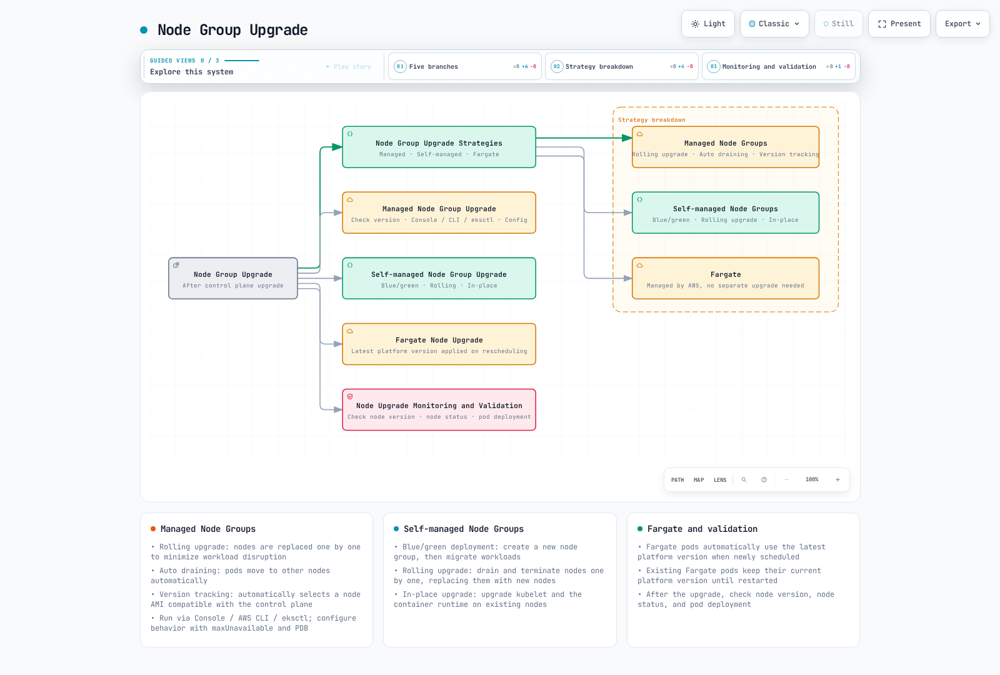
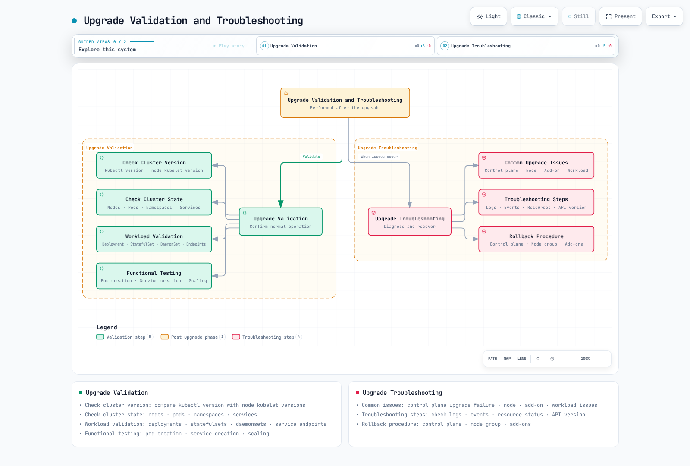
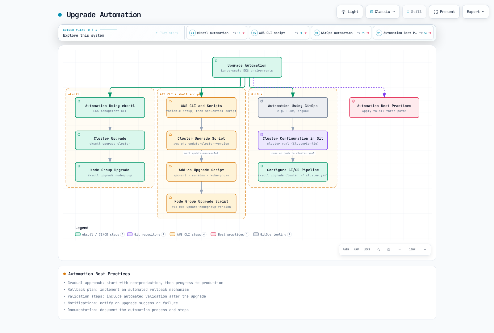
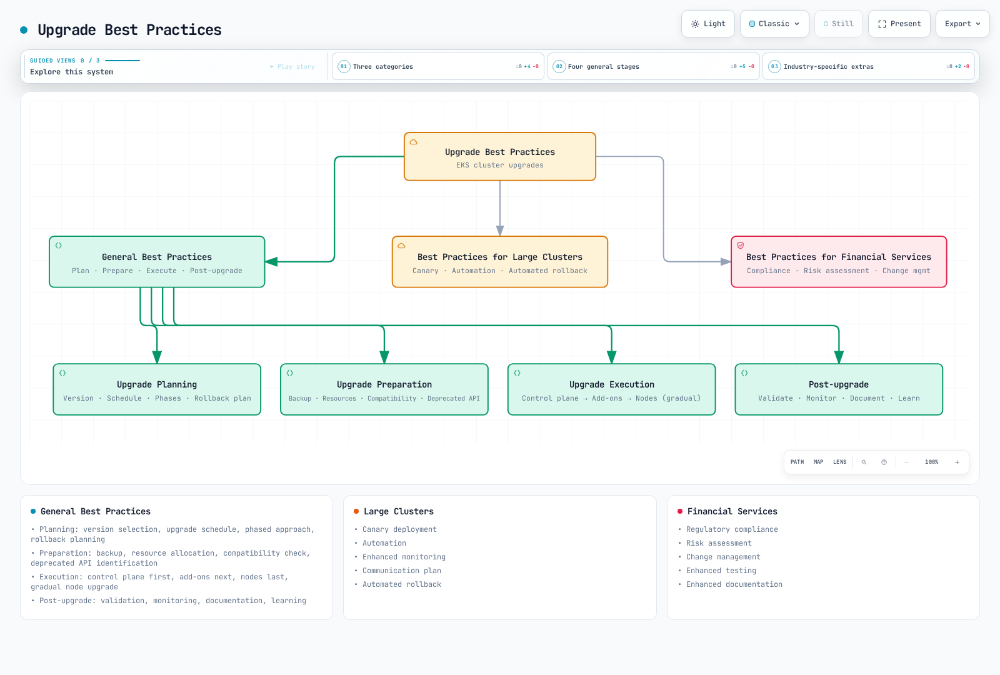

# Amazon EKS Upgrades

> **Last Updated**: July 3, 2026

Keeping your Amazon EKS cluster up to date is important for security, stability, and leveraging new features. This document provides strategies, best practices, and step-by-step guides for safely upgrading EKS clusters.

## Table of Contents

1. [EKS Upgrade Overview](#eks-upgrade-overview)
2. [Upgrade Planning and Preparation](#upgrade-planning-and-preparation)
3. [EKS Control Plane Upgrade](#eks-control-plane-upgrade)
4. [Node Group Upgrade](#node-group-upgrade)
5. [Add-on Upgrade](#add-on-upgrade)
6. [Upgrade Validation and Troubleshooting](#upgrade-validation-and-troubleshooting)
7. [Upgrade Automation](#upgrade-automation)
8. [Upgrade Best Practices](#upgrade-best-practices)

## EKS Upgrade Overview


[🔍 View interactive diagram](https://www.atomai.click/kubernetes-docs/archmaps/en-eks-08-eks-upgrades-0.html)

### EKS Version Management

Amazon EKS follows Kubernetes version management policy:

- **Version Support**: EKS supports a minimum of 4 Kubernetes versions simultaneously.
- **Support Period**: Each Kubernetes version is supported for approximately 14 months after release on EKS.
- **Version Deprecation**: A minimum of 60 days notice is provided before a version is deprecated.

### Recent EKS Upgrade Announcements (2026)

- **Kubernetes version rollback support (July 1, 2026)**: If an upgrade causes problems, you can now roll the control plane back to the previous minor version within 7 days. EKS runs an automated Rollback Readiness check beforehand, covering API compatibility, version skew, add-on compatibility, and cluster health. EKS Auto Mode clusters roll back automatically -- worker nodes revert on their own and the control plane is restored in sequence. There is no additional charge, and it's available in all regions. See [Rollback Procedure](#rollback-procedure) below for details. (Source: [Amazon EKS announces Kubernetes version rollback](https://aws.amazon.com/about-aws/whats-new/2026/07/amazon-eks-version-rollback))
- **99.99% SLA and 8XL control plane tier (March 20, 2026)**: The SLA for Provisioned Control Plane clusters increased from 99.95% to 99.99%, measured at one-minute granularity. A new 8XL scaling tier doubles the API request-handling capacity of the previous 4XL tier, targeting very large clusters and AI/ML/HPC workloads. (Source: [Amazon EKS announces SLA and 8XL scaling tier](https://aws.amazon.com/about-aws/whats-new/2026/03/amazon-eks-announces-sla-8xl-scaling-tier/))

### Upgrade Components

EKS cluster upgrades include the following components:

1. **EKS Control Plane**: Kubernetes API server, etcd, controller manager, etc.
2. **Node Groups**: Worker nodes and node AMIs
3. **Add-ons**: AWS managed add-ons (e.g., CoreDNS, kube-proxy, VPC CNI)
4. **Self-managed Components**: Helm charts, custom resources, etc.

### Upgrade Path

EKS clusters must be upgraded one minor version at a time:

- 1.24 → 1.25 → 1.26 → 1.27 (correct path)
- 1.24 → 1.26 (not supported)

### Upgrade Order

The general upgrade order is as follows:

1. Upgrade planning and preparation
2. EKS control plane upgrade
3. Add-on upgrade
4. Node group upgrade
5. Upgrade validation

## Upgrade Planning and Preparation


[🔍 View interactive diagram](https://www.atomai.click/kubernetes-docs/archmaps/en-eks-08-eks-upgrades-1.html)

### Upgrade Assessment

Before starting an upgrade, you should assess the following:

#### Version Compatibility Check

Check compatibility with the target Kubernetes version:

- **API Deprecation**: Identify workloads using deprecated APIs
- **Feature Changes**: Review feature changes in the new version
- **Add-on Compatibility**: Verify add-ons are compatible with the target version

```bash
# Check deprecated API usage
kubectl get -l k8s-app!=kube-dns deployments --all-namespaces -o json | jq '.items[].spec.template.spec.containers[].image' | sort | uniq

# Check deprecated API usage
kubectl get $(kubectl api-resources --verbs=list -o name | paste -sd, -) \
  --all-namespaces -o json | jq '.items[] | select(.apiVersion | contains("beta"))' | jq -r '.kind,.apiVersion,.metadata.name' | sort | uniq
```

#### Resource Requirements Assessment

Assess the resources needed for the upgrade:

- **Cluster Capacity**: Sufficient capacity to accommodate additional nodes during upgrade
- **Downtime Tolerance**: Whether workloads can tolerate downtime
- **Rollback Plan**: Rollback plan in case of issues

#### Upgrade Schedule Planning

Plan the upgrade schedule:

- **Maintenance Window**: Schedule upgrade during low traffic periods
- **Phased Approach**: Start with non-production environments and progress to production
- **Rollback Window**: Plan time needed for rollback in case of issues

### Pre-upgrade Preparation

#### Check Cluster State

Check cluster state before upgrade:

```bash
# Check node status
kubectl get nodes

# Check pod status
kubectl get pods --all-namespaces

# Check component status
kubectl get componentstatuses

# Check events
kubectl get events --all-namespaces
```

#### Create Backup

Back up important data before upgrade:

```bash
# etcd backup
kubectl -n kube-system exec -it etcd-pod -- etcdctl snapshot save /tmp/etcd-backup.db

# Backup using Velero
velero backup create pre-upgrade-backup --include-namespaces=default,app-namespace
```

#### Test Upgrade

Test the upgrade in a non-production environment:

1. Create a test cluster similar to production environment
2. Perform upgrade on test cluster
3. Test workloads and features
4. Identify and resolve issues

#### Create Upgrade Documentation

Document the upgrade process:

- Upgrade steps
- Responsible parties and contacts
- Rollback procedures
- Troubleshooting guide

## EKS Control Plane Upgrade


[🔍 View interactive diagram](https://www.atomai.click/kubernetes-docs/archmaps/en-eks-08-eks-upgrades-2.html)

### Control Plane Upgrade Preparation

#### Check Current Version

Check the current EKS cluster version:

```bash
aws eks describe-cluster --name my-cluster --query "cluster.version"
```

#### Check Available Versions

Check available Kubernetes versions:

```bash
aws eks describe-addon-versions --kubernetes-version 1.27
```

#### Create Upgrade Plan

Create a control plane upgrade plan:

- Upgrade time: Select low traffic periods
- Monitoring setup: Monitor cluster state during upgrade
- Rollback plan: Rollback procedure in case of issues

### Control Plane Upgrade Execution

#### Upgrade Using AWS Management Console

1. Log in to AWS Management Console
2. Navigate to Amazon EKS service
3. Select the cluster to upgrade from the cluster list
4. Select "Cluster configuration" tab
5. Click "Update Kubernetes version"
6. Select target version and click "Update"

#### Upgrade Using AWS CLI

```bash
aws eks update-cluster-version \
  --name my-cluster \
  --kubernetes-version 1.27
```

#### Upgrade Using eksctl

```bash
eksctl upgrade cluster \
  --name my-cluster \
  --version 1.27 \
  --approve
```

### Control Plane Upgrade Monitoring

#### Check Upgrade Status

Check the upgrade status:

```bash
# Check status using AWS CLI
aws eks describe-update \
  --name my-cluster \
  --update-id <update-id>

# Check status using eksctl
eksctl get clusters
eksctl get nodegroup --cluster my-cluster
```

#### Monitor Cluster State

Monitor cluster state during upgrade:

```bash
# Check node status
kubectl get nodes

# Check pod status
kubectl get pods --all-namespaces

# Check events
kubectl get events --all-namespaces --sort-by='.lastTimestamp'
```

#### Monitor CloudWatch Metrics

Monitor cluster metrics in CloudWatch:

- API server latency
- etcd latency
- Controller manager latency
- Scheduler latency

### Control Plane Upgrade Troubleshooting

#### Common Issues

Common issues that may occur during control plane upgrade:

- **Upgrade Failure**: Upgrade process fails or is interrupted
- **API Server Availability**: API server availability issues during upgrade
- **Compatibility Issues**: Compatibility issues between workloads and new version

#### Troubleshooting Steps

1. Check upgrade status
2. Review CloudTrail logs
3. Review EKS control plane logs
4. Contact AWS Support
## Node Group Upgrade

After upgrading the control plane, you need to upgrade the node groups. There are several strategies for node group upgrades, each with advantages and disadvantages.



[🔍 View interactive diagram](https://www.atomai.click/kubernetes-docs/archmaps/en-eks-08-eks-upgrades-3.html)

### Node Group Upgrade Strategies

#### Managed Node Group Upgrade

Managed node groups are a node group management feature provided by AWS that automates node upgrades:

- **Rolling Upgrade**: Nodes are replaced one by one to minimize workload disruption
- **Auto Draining**: Nodes are automatically drained so pods move to other nodes
- **Version Tracking**: Automatically selects node AMI compatible with control plane version

#### Self-managed Node Group Upgrade

For self-managed node groups, you must manually upgrade nodes:

- **Blue/Green Deployment**: Create new node group and migrate workloads
- **Rolling Upgrade**: Drain and terminate nodes one by one and replace with new nodes
- **In-place Upgrade**: Upgrade kubelet and container runtime on existing nodes

#### Fargate Node Upgrade

Fargate nodes are managed by AWS, so no separate upgrade is needed:

- Fargate pods automatically use the latest platform version when newly scheduled.
- Existing Fargate pods maintain the current platform version until restarted.

### Managed Node Group Upgrade

#### Check Managed Node Group Version

Check the current managed node group version:

```bash
aws eks describe-nodegroup \
  --cluster-name my-cluster \
  --nodegroup-name my-nodegroup \
  --query "nodegroup.version"
```

#### Upgrade Using AWS Management Console

1. Log in to AWS Management Console
2. Navigate to Amazon EKS service
3. Select the cluster to upgrade from the cluster list
4. Select "Compute" tab
5. Select the node group to upgrade
6. Click "Update node group"
7. Select target version and click "Update"

#### Upgrade Using AWS CLI

```bash
aws eks update-nodegroup-version \
  --cluster-name my-cluster \
  --nodegroup-name my-nodegroup \
  --kubernetes-version 1.27
```

#### Upgrade Using eksctl

```bash
eksctl upgrade nodegroup \
  --cluster my-cluster \
  --name my-nodegroup \
  --kubernetes-version 1.27
```

#### Managed Node Group Upgrade Configuration

You can configure managed node group upgrade behavior:

- **Max Unavailable**: Maximum number of nodes unavailable during upgrade
- **Pod Disruption Budget**: Maintain service availability by respecting Pod Disruption Budgets (PDB)

```bash
aws eks update-nodegroup-config \
  --cluster-name my-cluster \
  --nodegroup-name my-nodegroup \
  --update-config maxUnavailable=1
```

### Self-managed Node Group Upgrade

#### Blue/Green Deployment

Blue/green deployment creates a new node group and then migrates workloads:

1. Create new node group:

```bash
eksctl create nodegroup \
  --cluster my-cluster \
  --name my-nodegroup-new \
  --node-type m5.large \
  --nodes 3 \
  --nodes-min 3 \
  --nodes-max 6 \
  --node-ami auto
```

2. Migrate workloads:

```bash
# Apply taint to existing nodes
kubectl taint nodes -l alpha.eksctl.io/nodegroup-name=my-nodegroup-old \
  node-group=old:NoSchedule

# Verify new pods are scheduled on new nodes
kubectl get pods -o wide

# Drain existing nodes
for node in $(kubectl get nodes -l alpha.eksctl.io/nodegroup-name=my-nodegroup-old -o name); do
  kubectl drain --ignore-daemonsets --delete-emptydir-data $node
done
```

3. Delete existing node group:

```bash
eksctl delete nodegroup \
  --cluster my-cluster \
  --name my-nodegroup-old
```

#### Rolling Upgrade

Rolling upgrade drains and terminates nodes one by one and replaces them with new nodes:

```bash
# Get node list
NODES=$(kubectl get nodes -l alpha.eksctl.io/nodegroup-name=my-nodegroup -o name)

# Perform draining and termination for each node
for node in $NODES; do
  echo "Draining node $node..."
  kubectl drain --ignore-daemonsets --delete-emptydir-data $node

  # Get node ID
  INSTANCE_ID=$(aws ec2 describe-instances \
    --filters "Name=private-dns-name,Values=$(echo $node | cut -d'/' -f2)" \
    --query "Reservations[0].Instances[0].InstanceId" \
    --output text)

  # Terminate node
  aws ec2 terminate-instances --instance-ids $INSTANCE_ID

  # Wait for new node to be ready
  echo "Waiting for new node to be ready..."
  sleep 60

  # Check node status
  kubectl get nodes
done
```

#### In-place Upgrade

In-place upgrade upgrades kubelet and container runtime on existing nodes:

```bash
# Get node list
NODES=$(kubectl get nodes -l alpha.eksctl.io/nodegroup-name=my-nodegroup -o name)

# Perform in-place upgrade for each node
for node in $NODES; do
  echo "Cordoning node $node..."
  kubectl cordon $node

  echo "Draining node $node..."
  kubectl drain --ignore-daemonsets --delete-emptydir-data $node

  # SSH to node and perform upgrade
  # This part may vary depending on node access method
  INSTANCE_ID=$(aws ec2 describe-instances \
    --filters "Name=private-dns-name,Values=$(echo $node | cut -d'/' -f2)" \
    --query "Reservations[0].Instances[0].InstanceId" \
    --output text)

  # Execute command using SSM
  aws ssm send-command \
    --instance-ids $INSTANCE_ID \
    --document-name "AWS-RunShellScript" \
    --parameters commands=["sudo yum update -y kubelet kubectl"]

  # Uncordon node
  echo "Uncordoning node $node..."
  kubectl uncordon $node
done
```

### Node Upgrade Monitoring and Validation

#### Check Node Version

Check node Kubernetes version:

```bash
kubectl get nodes -o custom-columns=NAME:.metadata.name,VERSION:.status.nodeInfo.kubeletVersion
```

#### Check Node Status

Check node status:

```bash
kubectl get nodes
kubectl describe nodes
```

#### Check Pod Deployment

Verify pods are deployed normally:

```bash
kubectl get pods --all-namespaces -o wide
kubectl get pods --all-namespaces -o wide | grep -v Running
```

## Add-on Upgrade

EKS clusters include several add-ons that also need to be upgraded.


[🔍 View interactive diagram](https://www.atomai.click/kubernetes-docs/archmaps/en-eks-08-eks-upgrades-4.html)

### AWS Managed Add-ons

#### Check Managed Add-on List

Check managed add-ons installed in the cluster:

```bash
aws eks list-addons --cluster-name my-cluster
```

#### Check Managed Add-on Version

Check the current version of managed add-ons:

```bash
aws eks describe-addon \
  --cluster-name my-cluster \
  --addon-name vpc-cni \
  --query "addon.addonVersion"
```

#### Check Available Add-on Versions

Check available add-on versions:

```bash
aws eks describe-addon-versions \
  --addon-name vpc-cni \
  --kubernetes-version 1.27
```

#### Upgrade Managed Add-ons

You can upgrade managed add-ons using AWS Management Console, AWS CLI, or eksctl:

```bash
# Upgrade using AWS CLI
aws eks update-addon \
  --cluster-name my-cluster \
  --addon-name vpc-cni \
  --addon-version v1.12.0-eksbuild.1 \
  --resolve-conflicts PRESERVE

# Upgrade using eksctl
eksctl update addon \
  --cluster my-cluster \
  --name vpc-cni \
  --version v1.12.0-eksbuild.1 \
  --preserve
```

### Self-managed Add-ons

#### Upgrade Self-managed Add-ons

Upgrade self-managed add-ons using Helm or kubectl:

```bash
# Upgrade using Helm
helm repo update
helm upgrade metrics-server metrics-server/metrics-server \
  --namespace kube-system \
  --version 3.8.2

# Upgrade using kubectl
kubectl apply -f https://raw.githubusercontent.com/kubernetes-sigs/metrics-server/v0.6.1/deploy/kubernetes/metrics-server-deployment.yaml
```

### Key Add-on Upgrade Guides

#### CoreDNS Upgrade

CoreDNS provides DNS service for the Kubernetes cluster:

```bash
# Check CoreDNS version
kubectl get deployment coredns -n kube-system -o jsonpath="{.spec.template.spec.containers[0].image}"

# Upgrade CoreDNS
aws eks update-addon \
  --cluster-name my-cluster \
  --addon-name coredns \
  --addon-version v1.9.3-eksbuild.2 \
  --resolve-conflicts PRESERVE
```

#### kube-proxy Upgrade

kube-proxy handles Kubernetes service networking:

```bash
# Check kube-proxy version
kubectl get daemonset kube-proxy -n kube-system -o jsonpath="{.spec.template.spec.containers[0].image}"

# Upgrade kube-proxy
aws eks update-addon \
  --cluster-name my-cluster \
  --addon-name kube-proxy \
  --addon-version v1.27.1-eksbuild.1 \
  --resolve-conflicts PRESERVE
```

#### VPC CNI Upgrade

Amazon VPC CNI handles pod networking:

```bash
# Check VPC CNI version
kubectl describe daemonset aws-node -n kube-system | grep Image

# Upgrade VPC CNI
aws eks update-addon \
  --cluster-name my-cluster \
  --addon-name vpc-cni \
  --addon-version v1.12.0-eksbuild.1 \
  --resolve-conflicts PRESERVE
```

### Add-on Upgrade Troubleshooting

#### Common Issues

Common issues that may occur during add-on upgrade:

- **Configuration Conflicts**: Conflicts between custom configuration and new version
- **Compatibility Issues**: Compatibility issues between add-on and Kubernetes version
- **Resource Constraints**: Insufficient resources for upgrade

#### Troubleshooting Steps

1. Check add-on status:

```bash
aws eks describe-addon \
  --cluster-name my-cluster \
  --addon-name vpc-cni
```

2. Check add-on logs:

```bash
kubectl logs -n kube-system -l k8s-app=kube-dns
kubectl logs -n kube-system -l k8s-app=kube-proxy
kubectl logs -n kube-system -l k8s-app=aws-node
```

3. Check add-on events:

```bash
kubectl get events -n kube-system --sort-by='.lastTimestamp'
```
## Upgrade Validation and Troubleshooting

After the upgrade is complete, you need to validate that the cluster is operating normally and resolve any issues that may occur.



[🔍 View interactive diagram](https://www.atomai.click/kubernetes-docs/archmaps/en-eks-08-eks-upgrades-5.html)

### Upgrade Validation

#### Check Cluster Version

Check cluster and node versions:

```bash
# Check cluster version
kubectl version --short

# Check node version
kubectl get nodes -o custom-columns=NAME:.metadata.name,VERSION:.status.nodeInfo.kubeletVersion
```

#### Check Cluster State

Check the status of cluster components:

```bash
# Check node status
kubectl get nodes

# Check pod status
kubectl get pods --all-namespaces

# Check namespace status
kubectl get namespaces

# Check service status
kubectl get services --all-namespaces
```

#### Workload Validation

Verify application workloads are operating normally:

```bash
# Check deployment status
kubectl get deployments --all-namespaces

# Check statefulset status
kubectl get statefulsets --all-namespaces

# Check daemonset status
kubectl get daemonsets --all-namespaces

# Check service endpoints
kubectl get endpoints --all-namespaces
```

#### Functional Testing

Test that key features are operating normally:

1. **Pod Creation Test**:

```bash
kubectl run nginx --image=nginx
kubectl get pod nginx
kubectl delete pod nginx
```

2. **Service Creation Test**:

```bash
kubectl create deployment nginx --image=nginx --replicas=2
kubectl expose deployment nginx --port=80 --type=ClusterIP
kubectl get service nginx
kubectl delete service nginx
kubectl delete deployment nginx
```

3. **Scaling Test**:

```bash
kubectl create deployment nginx --image=nginx
kubectl scale deployment nginx --replicas=3
kubectl get deployment nginx
kubectl delete deployment nginx
```

### Upgrade Troubleshooting

#### Common Upgrade Issues

Common issues that may occur during upgrade:

1. **Control Plane Upgrade Failure**:
   - API server availability issues
   - etcd database issues
   - IAM permission issues

2. **Node Upgrade Issues**:
   - Node draining failure
   - New node startup failure
   - kubelet version mismatch

3. **Add-on Upgrade Issues**:
   - Configuration conflicts
   - Compatibility issues
   - Resource constraints

4. **Workload Issues**:
   - Workload failure due to API deprecation
   - Pod scheduling failure due to resource constraints
   - Networking issues

#### Troubleshooting Steps

1. **Check Logs**:

```bash
# Check control plane logs
aws eks update-cluster-config \
  --region us-west-2 \
  --name my-cluster \
  --logging '{"clusterLogging":[{"types":["api","audit","authenticator","controllerManager","scheduler"],"enabled":true}]}'

# Check node logs
kubectl logs -n kube-system -l component=kube-proxy
kubectl logs -n kube-system -l k8s-app=aws-node
```

2. **Check Events**:

```bash
kubectl get events --all-namespaces --sort-by='.lastTimestamp'
```

3. **Check Resource Status**:

```bash
kubectl describe nodes
kubectl describe pods --all-namespaces | grep -A 10 "Events:"
```

4. **Check API Version**:

```bash
kubectl api-versions
```

#### Rollback Procedure

If upgrade issues cannot be resolved, consider rollback:

1. **Control Plane Rollback**:
   - As of July 2026, Amazon EKS supports rolling the control plane back to the previous minor version within 7 days of an upgrade. An automated Rollback Readiness check runs beforehand, covering API compatibility, version skew, add-on compatibility, and cluster health. EKS Auto Mode clusters roll back automatically -- worker nodes revert on their own and the control plane is restored in sequence. There is no additional charge, and it's available in all regions. (Source: [Amazon EKS announces Kubernetes version rollback](https://aws.amazon.com/about-aws/whats-new/2026/07/amazon-eks-version-rollback))
   - If more than 7 days have passed or this feature isn't available, and the issue is serious, you must create a new cluster and migrate workloads.

2. **Node Group Rollback**:
   - Rollback to previous version node group:

```bash
# Create new node group with previous version
eksctl create nodegroup \
  --cluster my-cluster \
  --name my-nodegroup-old-version \
  --node-type m5.large \
  --nodes 3 \
  --nodes-min 3 \
  --nodes-max 6 \
  --node-ami-family AmazonLinux2 \
  --node-ami auto \
  --kubernetes-version 1.26

# Delete previous node group once new node group is ready
eksctl delete nodegroup \
  --cluster my-cluster \
  --name my-nodegroup-new-version
```

3. **Add-on Rollback**:
   - Rollback to previous version of add-on:

```bash
aws eks update-addon \
  --cluster-name my-cluster \
  --addon-name vpc-cni \
  --addon-version <previous-version> \
  --resolve-conflicts PRESERVE
```

## Upgrade Automation

In large-scale environments, automating the upgrade process is important. You can automate EKS upgrades using the following tools and methods.



[🔍 View interactive diagram](https://www.atomai.click/kubernetes-docs/archmaps/en-eks-08-eks-upgrades-6.html)

### Automation Using eksctl

eksctl is a command-line tool for EKS cluster management that can be used for upgrade automation:

```bash
# Cluster upgrade
eksctl upgrade cluster \
  --name my-cluster \
  --version 1.27 \
  --approve

# Node group upgrade
eksctl upgrade nodegroup \
  --cluster my-cluster \
  --name my-nodegroup \
  --kubernetes-version 1.27
```

### Automation Using AWS CLI and Scripts

You can automate the upgrade process using AWS CLI and shell scripts:

```bash
#!/bin/bash

# Variable setup
CLUSTER_NAME="my-cluster"
TARGET_VERSION="1.27"
REGION="us-west-2"

# Cluster upgrade
echo "Upgrading cluster $CLUSTER_NAME to version $TARGET_VERSION..."
UPDATE_ID=$(aws eks update-cluster-version \
  --region $REGION \
  --name $CLUSTER_NAME \
  --kubernetes-version $TARGET_VERSION \
  --query "update.id" \
  --output text)

# Wait for upgrade completion
echo "Waiting for cluster upgrade to complete..."
aws eks wait update-successful \
  --region $REGION \
  --name $CLUSTER_NAME \
  --update-id $UPDATE_ID

# Add-on upgrade
echo "Upgrading addons..."
for ADDON in vpc-cni coredns kube-proxy; do
  LATEST_VERSION=$(aws eks describe-addon-versions \
    --region $REGION \
    --addon-name $ADDON \
    --kubernetes-version $TARGET_VERSION \
    --query "addons[0].addonVersions[0].addonVersion" \
    --output text)

  echo "Upgrading $ADDON to version $LATEST_VERSION..."
  aws eks update-addon \
    --region $REGION \
    --cluster-name $CLUSTER_NAME \
    --addon-name $ADDON \
    --addon-version $LATEST_VERSION \
    --resolve-conflicts PRESERVE
done

# Managed node group upgrade
echo "Upgrading managed nodegroups..."
NODEGROUPS=$(aws eks list-nodegroups \
  --region $REGION \
  --cluster-name $CLUSTER_NAME \
  --query "nodegroups[]" \
  --output text)

for NG in $NODEGROUPS; do
  echo "Upgrading nodegroup $NG..."
  aws eks update-nodegroup-version \
    --region $REGION \
    --cluster-name $CLUSTER_NAME \
    --nodegroup-name $NG

  # Wait for node group upgrade completion
  echo "Waiting for nodegroup $NG upgrade to complete..."
  aws eks wait nodegroup-active \
    --region $REGION \
    --cluster-name $CLUSTER_NAME \
    --nodegroup-name $NG
done

echo "Upgrade process completed successfully!"
```

### Automation Using GitOps

You can automate EKS cluster upgrades using GitOps tools (e.g., Flux, ArgoCD):

1. **Store Cluster Configuration in Git Repository**:

```yaml
# cluster.yaml
apiVersion: eksctl.io/v1alpha5
kind: ClusterConfig
metadata:
  name: my-cluster
  region: us-west-2
  version: "1.27"
managedNodeGroups:
  - name: my-nodegroup
    instanceType: m5.large
    desiredCapacity: 3
    minSize: 3
    maxSize: 6
```

2. **Configure CI/CD Pipeline**:

```yaml
# .github/workflows/upgrade-eks.yml
name: Upgrade EKS Cluster

on:
  push:
    branches: [ main ]
    paths:
      - 'cluster.yaml'

jobs:
  upgrade:
    runs-on: ubuntu-latest
    steps:
      - name: Checkout code
        uses: actions/checkout@v2

      - name: Configure AWS credentials
        uses: aws-actions/configure-aws-credentials@v1
        with:
          aws-access-key-id: ${{ secrets.AWS_ACCESS_KEY_ID }}
          aws-secret-access-key: ${{ secrets.AWS_SECRET_ACCESS_KEY }}
          aws-region: us-west-2

      - name: Install eksctl
        run: |
          curl --silent --location "https://github.com/weaveworks/eksctl/releases/latest/download/eksctl_$(uname -s)_amd64.tar.gz" | tar xz -C /tmp
          sudo mv /tmp/eksctl /usr/local/bin

      - name: Upgrade EKS cluster
        run: |
          eksctl upgrade cluster -f cluster.yaml
```

### Automation Best Practices

Best practices for EKS upgrade automation:

1. **Gradual Approach**: Start with non-production environments and progress to production
2. **Rollback Plan**: Implement automated rollback mechanism
3. **Validation Steps**: Include automated validation steps after upgrade
4. **Notifications**: Configure notifications for upgrade success or failure
5. **Documentation**: Document automation process and steps

## Upgrade Best Practices

Let's look at best practices for EKS cluster upgrades.



[🔍 View interactive diagram](https://www.atomai.click/kubernetes-docs/archmaps/en-eks-08-eks-upgrades-7.html)

### General Best Practices

#### Upgrade Planning

1. **Version Selection**: Select stable version and review release notes
2. **Upgrade Schedule**: Schedule upgrade during low traffic periods
3. **Phased Approach**: Start with non-production environments and progress to production
4. **Rollback Planning**: Create rollback plan in case of issues

#### Upgrade Preparation

1. **Backup**: Back up important data
2. **Resource Allocation**: Secure sufficient resources for upgrade
3. **Compatibility Check**: Verify workload and add-on compatibility
4. **Deprecated API Identification**: Identify and update workloads using deprecated APIs

#### Upgrade Execution

1. **Control Plane First**: Upgrade control plane first
2. **Add-ons Next**: Upgrade add-ons after control plane upgrade
3. **Nodes Last**: Upgrade nodes after control plane and add-on upgrade
4. **Gradual Node Upgrade**: Gradually upgrade nodes to minimize workload disruption

#### Post-upgrade

1. **Validation**: Validate cluster and workload status
2. **Monitoring**: Monitor cluster after upgrade
3. **Documentation**: Document upgrade process and results
4. **Learning**: Learn from issues encountered during upgrade and their solutions

### Best Practices for Large Clusters

Additional best practices for large EKS cluster upgrades:

1. **Canary Deployment**: Start with some nodes or workloads and gradually expand
2. **Automation**: Automate upgrade process
3. **Enhanced Monitoring**: Continuously monitor cluster state during upgrade
4. **Communication Plan**: Regularly communicate upgrade status to stakeholders
5. **Automated Rollback**: Implement automated rollback mechanism in case of issues

### Best Practices for Financial Services

Additional best practices for EKS cluster upgrades in the financial services industry:

1. **Regulatory Compliance**: Ensure upgrade meets regulatory requirements
2. **Risk Assessment**: Perform risk assessment before upgrade
3. **Change Management**: Follow strict change management processes
4. **Enhanced Testing**: Perform thorough testing before upgrade
5. **Enhanced Documentation**: Detailed documentation of upgrade process and results

## Conclusion

Successfully upgrading an Amazon EKS cluster requires thorough planning, preparation, and validation. This document covered strategies, steps, and best practices for safely upgrading EKS cluster control planes, node groups, and add-ons.

Key Points:

1. **EKS Upgrade Overview**: EKS version management, upgrade components and path
2. **Upgrade Planning and Preparation**: Upgrade assessment, preparation, and testing
3. **EKS Control Plane Upgrade**: Control plane upgrade methods and monitoring
4. **Node Group Upgrade**: Managed and self-managed node group upgrade strategies
5. **Add-on Upgrade**: AWS managed and self-managed add-on upgrades
6. **Upgrade Validation and Troubleshooting**: Upgrade validation and common issue resolution
7. **Upgrade Automation**: Upgrade automation using eksctl, AWS CLI, and GitOps
8. **Upgrade Best Practices**: General best practices and industry-specific best practices

Keeping your EKS cluster up to date allows you to leverage security patches, bug fixes, and new features, improving the overall security, stability, and performance of your cluster.

## References

- [Amazon EKS Upgrade Documentation](https://docs.aws.amazon.com/eks/latest/userguide/update-cluster.html)
- [Kubernetes Versions and Version Skew](https://kubernetes.io/docs/setup/release/version-skew-policy/)
- [EKS Managed Node Group Upgrade](https://docs.aws.amazon.com/eks/latest/userguide/update-managed-node-group.html)
- [EKS Add-on Upgrade](https://docs.aws.amazon.com/eks/latest/userguide/managing-add-ons.html)
- [eksctl Documentation](https://eksctl.io/usage/cluster-upgrade/)
- [Kubernetes Upgrade Best Practices](https://kubernetes.io/docs/tasks/administer-cluster/cluster-upgrade/)

## Quiz

To test what you've learned in this chapter, try the [topic quiz](../quizzes/eks/08-eks-upgrades-quiz.md).
