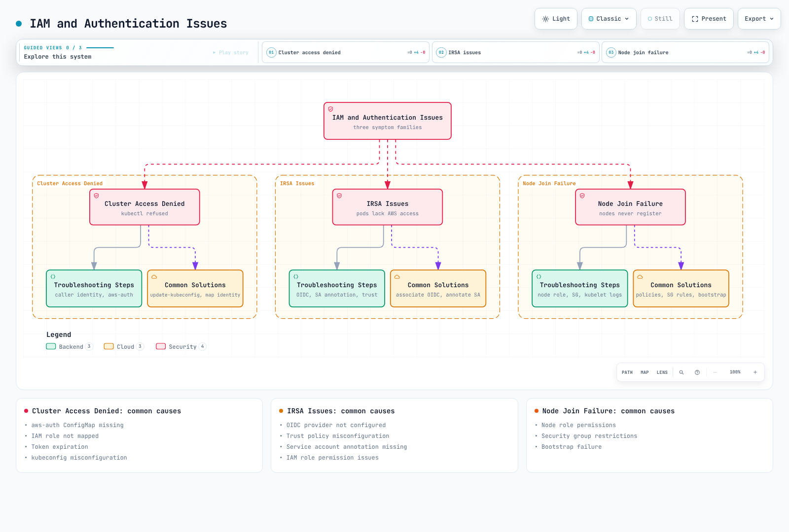

# Amazon EKS Troubleshooting

> **Last Updated**: September 12, 2026

When operating Amazon EKS clusters, various issues can arise. This document provides common problems that can occur in EKS clusters and their solutions.

## Table of Contents

1. [Troubleshooting Basics](#troubleshooting-basics)
2. [Cluster Creation and Management Issues](#cluster-creation-and-management-issues)
3. [Networking Issues](#networking-issues)
4. [Node and Pod Issues](#node-and-pod-issues)
5. [IAM and Authentication Issues](#iam-and-authentication-issues)
6. [Storage Issues](#storage-issues)
7. [Logging and Monitoring Issues](#logging-and-monitoring-issues)
8. [Performance Issues](#performance-issues)
9. [Upgrade Issues](#upgrade-issues)
10. [Common Error Messages and Solutions](#common-error-messages-and-solutions)

## Troubleshooting Basics


[🔍 View interactive diagram](https://www.atomai.click/kubernetes-docs/archmaps/en-eks-09-eks-troubleshooting-0.html)

### Troubleshooting Approach

1. Identify the symptom, affected users/workloads and incident window.
2. Collect relevant state, logs, events and metrics before changing resources.
3. Compare competing hypotheses with evidence; do not treat a generic error as a proven cause.
4. Apply an owned, targeted correction with known data/availability effects.
5. Verify recovery with application behavior and metrics, not just command exit status.
6. Record the cause, changes, results, remaining uncertainty and prevention measures.

Commands in this chapter are templates for a reviewed environment, not a single script to run top to bottom. Querying a resource, creating a debug workload, restarting a component and deleting infrastructure have different effects. No live AWS/Kubernetes operations were performed for this review.

### Essential Tools and Commands

For an **existing** cluster, set the intended account, Region, cluster and kubectl context, then check they agree. Do not derive a cluster name from an arbitrary context alias. When creation failed before a usable cluster exists, use the account/Region and original request/stack evidence in the creation section instead.

```bash
set -euo pipefail
: "${AWS_REGION:?Set the intended Region}"
: "${CLUSTER_NAME:?Set the existing cluster name}"
: "${EXPECTED_ACCOUNT_ID:?Set the intended 12-digit account ID}"
: "${KUBE_CONTEXT:?Set the explicit kubectl context}"
ACTUAL_ACCOUNT_ID=$(aws sts get-caller-identity --query Account --output text)
if [ "$ACTUAL_ACCOUNT_ID" != "$EXPECTED_ACCOUNT_ID" ]; then
  echo "Account mismatch" >&2; exit 1
fi
CLUSTER_ENDPOINT=$(aws eks describe-cluster --name "$CLUSTER_NAME" --region "$AWS_REGION" \
  --query cluster.endpoint --output text)
KUBE_ENDPOINT=$(kubectl config view --context "$KUBE_CONTEXT" --minify \
  -o jsonpath='{.clusters[0].cluster.server}')
if [ "$CLUSTER_ENDPOINT" != "$KUBE_ENDPOINT" ]; then
  echo "kubectl context does not match the selected EKS cluster" >&2; exit 1
fi
export AWS_REGION CLUSTER_NAME EXPECTED_ACCOUNT_ID KUBE_CONTEXT
```

#### AWS CLI and eksctl

```bash
aws eks describe-cluster --name "$CLUSTER_NAME" --region "$AWS_REGION" \
  --query 'cluster.{arn:arn,status:status,version:version,health:health,access:accessConfig}'
aws eks list-nodegroups --cluster-name "$CLUSTER_NAME" --region "$AWS_REGION"
aws eks list-addons --cluster-name "$CLUSTER_NAME" --region "$AWS_REGION"
eksctl get nodegroup --cluster "$CLUSTER_NAME" --region "$AWS_REGION"
```

These list managed node groups and installed EKS add-ons, not every self-managed controller or compute resource. Record the actual owner and compute type before choosing a procedure.

#### kubectl

```bash
kubectl --context "$KUBE_CONTEXT" get nodes -o wide
kubectl --context "$KUBE_CONTEXT" get pods -A -o wide
kubectl --context "$KUBE_CONTEXT" get services -A
kubectl --context "$KUBE_CONTEXT" get events -A --sort-by='.metadata.creationTimestamp'
: "${NAMESPACE:?}"; : "${POD_NAME:?}"
kubectl --context "$KUBE_CONTEXT" -n "$NAMESPACE" describe pod "$POD_NAME"
```

Specify the affected namespace, Pod, container and node explicitly. `describe` output and application logs can include sensitive operational information. `kubectl auth can-i` checks authorization for a particular action; `aws sts get-caller-identity` identifies AWS credentials, and neither alone proves network access or all Kubernetes permissions.

### Log Collection and Analysis

#### EKS Control Plane Logs

Check the existing logging configuration and a bounded incident window:

```bash
set -euo pipefail
: "${CLUSTER_NAME:?}"; : "${AWS_REGION:?}"
: "${START_TIME_MS:?Set the incident-window start in epoch milliseconds}"
: "${END_TIME_MS:?Set the incident-window end in epoch milliseconds}"
aws eks describe-cluster --name "$CLUSTER_NAME" --region "$AWS_REGION" \
  --query cluster.logging --output json
aws logs filter-log-events --region "$AWS_REGION" \
  --log-group-name "/aws/eks/$CLUSTER_NAME/cluster" \
  --start-time "$START_TIME_MS" --end-time "$END_TIME_MS" \
  --max-items 200 --output json --no-cli-pager
```

Enabling control-plane logging is a separate `UpdateClusterConfig` change with its own update ID, permissions and CloudWatch charges. It does not recover earlier logs and does not enable application/host log collection. An absent group, denied request or empty window is a visibility limitation. Use `/aws/containerinsights/<cluster>/...` or the actual collector destination for application/host logs.

#### Node Logs

On an operator-accessible standard Linux EC2 node, verify the node's `spec.providerID`, account/Region and SSM prerequisites before opening a session:

```bash
: "${INSTANCE_ID:?Verify the node EC2 ProviderID and account/Region first}"
aws ssm start-session --target "$INSTANCE_ID" --region "$AWS_REGION"
```

Run the following **inside that node session**, not in the local terminal. These systemd/containerd examples assume the node image provides those tools; Bottlerocket, Fargate and Auto Mode require their supported diagnostic paths.

```bash
sudo journalctl -u kubelet --since "15 minutes ago" --no-pager
sudo journalctl -u containerd --since "15 minutes ago" --no-pager
df -h
df -i
free -m
```

Current EKS-optimized Linux nodes use containerd. Docker's daemon log is not the kubelet runtime log on those nodes. Preserve logs and disk/inode evidence before pruning images, vacuuming journals or restarting anything. Missing `kubectl top` metrics on an unhealthy node do not by themselves establish CPU/memory exhaustion.

#### Pod Logs

```bash
set -euo pipefail
: "${KUBE_CONTEXT:?}"; : "${NAMESPACE:?}"; : "${POD_NAME:?}"; : "${CONTAINER_NAME:?}"
kubectl --context "$KUBE_CONTEXT" -n "$NAMESPACE" logs "$POD_NAME" \
  -c "$CONTAINER_NAME" --since=15m --tail=200 --timestamps=true
# Run only when a previous container instance exists in this same Pod.
kubectl --context "$KUBE_CONTEXT" -n "$NAMESPACE" logs "$POD_NAME" \
  -c "$CONTAINER_NAME" --previous --tail=200 --timestamps=true
```

`--previous` refers to the previous terminated instance of the named container in the **same Pod**. It does not retrieve a deleted predecessor Pod's logs; use the log backend for retained history. Inspect both regular and init-container statuses, readiness and exit reasons.

### Diagnostic Information Collection

```bash
set -euo pipefail
: "${EVIDENCE_PARENT:?Set an existing private directory}"
: "${KUBE_CONTEXT:?}"; : "${NAMESPACE:?}"
umask 077
EVIDENCE_DIR=$(mktemp -d "$EVIDENCE_PARENT/eks-diagnosis.XXXXXXXX")
kubectl --context "$KUBE_CONTEXT" get nodes -o wide > "$EVIDENCE_DIR/nodes.txt"
kubectl --context "$KUBE_CONTEXT" -n "$NAMESPACE" get pods -o wide > "$EVIDENCE_DIR/pods.txt"
kubectl --context "$KUBE_CONTEXT" -n "$NAMESPACE" get services -o wide > "$EVIDENCE_DIR/services.txt"
kubectl --context "$KUBE_CONTEXT" -n "$NAMESPACE" get events \
  --sort-by='.metadata.creationTimestamp' > "$EVIDENCE_DIR/events.txt"
printf 'Evidence saved to %s; assess the findings before remediation.\n' "$EVIDENCE_DIR"
```

A failed query stops this example; existing files are partial evidence. Avoid blanket `cluster-info dump` or all-Pod descriptions when a scoped inventory suffices, and review/redact evidence before sharing it.

For resource pressure, compare requests/limits, node allocatable resources and `kubectl top` where Metrics Server is available. On accessible nodes, check both `df -h` and `df -i`; free bytes do not rule out inode exhaustion. A node debug Pod has its own root filesystem, while the host root is mounted at `/host`; `df -h` without the intended path can inspect the wrong filesystem. Creating such a Pod requires reviewed namespace, image, debug profile, permissions and cleanup.

For network diagnosis, identify source Pod/namespace/node, destination, protocol and port. Inspect applicable policies and the source's resolver first. A newly created debug Pod may have different labels, identity, DNS or routing than the affected workload. ICMP ping does not establish TCP/UDP application reachability. Use a bounded test on the actual permitted path; prepare tools and cleanup through the owner rather than repeatedly creating unpinned `dnsutils`/`netshoot` Pods with common names.

Sources: [EKS troubleshooting](https://docs.aws.amazon.com/eks/latest/userguide/troubleshooting.html), [Kubernetes logs](https://kubernetes.io/docs/reference/kubectl/generated/kubectl_logs/), [node debugging](https://kubernetes.io/docs/tasks/debug/debug-cluster/kubectl-node-debug/).

## Cluster Creation and Management Issues


[🔍 View interactive diagram](https://www.atomai.click/kubernetes-docs/archmaps/en-eks-09-eks-troubleshooting-1.html)

### Cluster Creation Failure

#### Common Causes

Review the exact failed request or CloudFormation event for caller permissions, cluster service-role trust/policies, service quotas, supported subnet/AZ selection, IP capacity, name conflicts or service availability. These are hypotheses; their likelihood depends on the actual error.

#### Troubleshooting Steps

```bash
set -euo pipefail
: "${AWS_REGION:?}"; : "${CLUSTER_ROLE_NAME:?}"; : "${VPC_ID:?}"
aws sts get-caller-identity
aws iam get-role --role-name "$CLUSTER_ROLE_NAME" \
  --query 'Role.{Arn:Arn,Trust:AssumeRolePolicyDocument}'
aws iam list-attached-role-policies --role-name "$CLUSTER_ROLE_NAME"
aws iam list-role-policies --role-name "$CLUSTER_ROLE_NAME"
aws ec2 describe-subnets --region "$AWS_REGION" --filters "Name=vpc-id,Values=$VPC_ID" \
  --query 'Subnets[].{Id:SubnetId,AZ:AvailabilityZone,AZId:AvailabilityZoneId,AvailableIPs:AvailableIpAddressCount,CIDR:CidrBlock}'
aws service-quotas list-service-quotas --service-code eks --region "$AWS_REGION"
aws cloudtrail lookup-events --region "$AWS_REGION" \
  --lookup-attributes AttributeKey=EventName,AttributeValue=CreateCluster \
  --max-items 20 --output json
```

Attached policies alone do not show effective caller permissions: include inline policies, permissions boundaries, session policies and Organizations controls. `AmazonEKSClusterPolicy` belongs to the EKS cluster service role; attaching it to a human user does not grant the required `eks:CreateCluster`/`iam:PassRole` permissions or Kubernetes access. Service-linked role creation also has its own permission and lifecycle.

For network checks, use the selected cluster subnets and exact route/security-group/NACL configuration. Cluster subnet requirements and node/Pod/LB address capacity are separate planning concerns. Private clusters can use the required service endpoints without a NAT gateway or general internet access. A `kubernetes.io/cluster/...` subnet tag is not a universal fix for control-plane creation.

For quota errors, identify the service/quota from the error and query the current applied value before requesting an increase. EKS cluster quotas, EC2 vCPU/instance-family quotas and VPC limits are different. Historical messages such as “limit is 5” are examples, not current account limits.

#### Common Solutions

Correct the specific permission, service-role trust, subnet selection, IP allocation or quota issue through the infrastructure owner, then review a retry. `UnsupportedAvailabilityZoneException` means a specified cluster subnet is in an AZ that does not support EKS for the account; use the supported AZs reported by the exception. It is not diagnosed solely by EC2 instance-type offerings.

Check AWS Health for a service event. Changing Regions creates a separate placement/data/network design and potentially another cluster; it is not a default troubleshooting retry. `eksctl create cluster --verbose ...` and AWS CLI debug flags still execute creation. Use the existing stack events and request ID before making a new provisioning request.

### Cluster Endpoint Access Issues

#### Diagnose DNS, transport, TLS, authentication and authorization separately

Inspect endpoint mode, allowed public CIDRs and cluster security group, then test with the cluster CA and a timeout:

```bash
set -euo pipefail
: "${CLUSTER_NAME:?}"; : "${AWS_REGION:?}"; : "${EVIDENCE_PARENT:?}"
umask 077
ENDPOINT_DIR=$(mktemp -d "$EVIDENCE_PARENT/eks-endpoint.XXXXXXXX")
aws eks describe-cluster --name "$CLUSTER_NAME" --region "$AWS_REGION" \
  --output json > "$ENDPOINT_DIR/cluster.json"
jq -er '.cluster.certificateAuthority.data' "$ENDPOINT_DIR/cluster.json" \
  | base64 --decode > "$ENDPOINT_DIR/cluster-ca.crt"
ENDPOINT=$(jq -er '.cluster.endpoint' "$ENDPOINT_DIR/cluster.json")
jq '.cluster.resourcesVpcConfig | {endpointPublicAccess,endpointPrivateAccess,publicAccessCidrs,clusterSecurityGroupId,vpcId}' \
  "$ENDPOINT_DIR/cluster.json"
curl --silent --show-error --connect-timeout 5 --max-time 10 \
  --cacert "$ENDPOINT_DIR/cluster-ca.crt" --output /dev/null \
  --write-out 'HTTP status: %{http_code}\n' "$ENDPOINT"
```

This sends no Kubernetes bearer token. A 401/403 response can demonstrate successful DNS/TCP/TLS reachability while access is denied; a successful HTTP response is not proof of application health. `curl -k` would hide certificate validation failures. If DNS lookup is needed, use the hostname from the endpoint URL rather than passing an `https://` URL to `nslookup`.

For a public endpoint, check the client's actual egress/NAT address against the allowed CIDRs. For a private endpoint, check the VPC/connected-network path, DNS resolution and security-group access. The interface endpoint `com.amazonaws.<region>.eks` serves **EKS management APIs**, not the Kubernetes API server. Enabling it alone does not fix kubectl access. The cluster's Kubernetes private endpoint is separate.

#### kubeconfig and permissions

Inspect the context name/server without printing raw credentials. To create a separate diagnostic kubeconfig, use an explicit path and alias; set `NAMESPACE` to the intended authorization scope:

```bash
set -euo pipefail
: "${CLUSTER_NAME:?}"; : "${AWS_REGION:?}"
: "${NAMESPACE:?Set the namespace for the authorization check}"
: "${DIAGNOSTIC_KUBECONFIG:?Set a separate writable kubeconfig path}"
: "${KUBE_CONTEXT:?Choose an explicit alias for this cluster}"
umask 077
aws eks update-kubeconfig --name "$CLUSTER_NAME" --region "$AWS_REGION" \
  --kubeconfig "$DIAGNOSTIC_KUBECONFIG" --alias "$KUBE_CONTEXT"
export KUBECONFIG="$DIAGNOSTIC_KUBECONFIG"
kubectl --context "$KUBE_CONTEXT" auth can-i get pods --namespace "$NAMESPACE"
```

Creating kubeconfig requires `eks:DescribeCluster`; Kubernetes authentication/authorization is a separate requirement. If assuming a role, use the reviewed `--role-arn` and its trust/STS permissions. Renew credentials through the actual credential provider (for example the configured SSO session), rather than printing session tokens.

```bash
set -euo pipefail
: "${CLUSTER_NAME:?}"; : "${AWS_REGION:?}"
aws eks describe-cluster --name "$CLUSTER_NAME" --region "$AWS_REGION" \
  --query 'cluster.accessConfig'
# Use the next command when API or API_AND_CONFIG_MAP authentication is enabled.
aws eks list-access-entries --cluster-name "$CLUSTER_NAME" --region "$AWS_REGION"
```

Inspect the relevant entry and associated policy scope when access-entry authentication is enabled. Legacy `CONFIG_MAP` or mixed clusters may also use `aws-auth`; preserve existing node mappings and use a planned migration. Do not grant `system:masters` or overwrite the whole ConfigMap as a generic access fix. IRSA's IAM OIDC provider is for workload AWS credentials, not the mapping that authorizes a human IAM principal to Kubernetes.

#### Correct the access path

Use a connected private administrative path or a reviewed public CIDR allow-list appropriate to the endpoint mode. Do not open `0.0.0.0/0` merely to make a diagnostic command work. Test the private path before removing public access, preserve current unrelated VPC settings and track the configuration update ID. Follow the [security chapter's endpoint procedure](./05-eks-security.md) for a planned change.

#### One-click CloudShell access

The April 30, 2026 one-click feature is supported. Choose **Connect** on the cluster details page to open CloudShell with kubectl configured. Both public and private API endpoints are supported; a private endpoint automatically launches a CloudShell VPC environment and prompts for its name. The feature is available at no additional feature charge in EKS Regions.

The console path still requires the relevant IAM/CloudShell/VPC-environment permissions, Kubernetes access and working network configuration. It removes local setup, not authorization checks. Review applicable resource/data-transfer charges and the session's identity before running commands.

Sources: [kubeconfig and CloudShell](https://docs.aws.amazon.com/eks/latest/userguide/create-kubeconfig.html), [one-click announcement](https://aws.amazon.com/about-aws/whats-new/2026/04/amazon-eks-one-click-cluster-access/), [EKS PrivateLink distinction](https://docs.aws.amazon.com/eks/latest/userguide/vpc-interface-endpoints.html), [cluster troubleshooting](https://docs.aws.amazon.com/eks/latest/userguide/troubleshooting.html).

### Cluster Deletion Issues

#### Identify the blocking dependency

Cluster deletion is deliberate teardown, not a general troubleshooting remedy. Read the exact EKS/CloudFormation error, cluster ARN/account/Region, update state and deletion-protection setting. Deletion protection and installed EKS Capabilities can block deletion in addition to managed node groups and Fargate profiles. Preserve the cluster's IAM/service roles until deletion finishes.

Inventory the selected cluster and compare its endpoint with the explicit kubectl context. The following commands are read-only and do not select resources for deletion automatically:

```bash
set -euo pipefail
: "${CLUSTER_NAME:?Set the cluster being deliberately retired}"
: "${AWS_REGION:?}"; : "${KUBE_CONTEXT:?}"; : "${EXPECTED_ACCOUNT_ID:?}"
ACTUAL_ACCOUNT_ID=$(aws sts get-caller-identity --query Account --output text)
if [ "$ACTUAL_ACCOUNT_ID" != "$EXPECTED_ACCOUNT_ID" ]; then
  echo "Account mismatch; stop" >&2
  exit 1
fi
aws eks describe-cluster --name "$CLUSTER_NAME" --region "$AWS_REGION" \
  --query 'cluster.{arn:arn,status:status,deletionProtection:deletionProtection,endpoint:endpoint}'
kubectl config view --context "$KUBE_CONTEXT" --minify \
  -o jsonpath='{.clusters[0].cluster.server}{"\n"}'
# Compare the endpoints before inspecting Kubernetes resources.
kubectl --context "$KUBE_CONTEXT" get services -A \
  -o custom-columns='NAMESPACE:.metadata.namespace,NAME:.metadata.name,TYPE:.spec.type,CLASS:.spec.loadBalancerClass,ADDRESS:.status.loadBalancer.ingress'
kubectl --context "$KUBE_CONTEXT" get ingress -A
kubectl --context "$KUBE_CONTEXT" get pvc -A
kubectl --context "$KUBE_CONTEXT" get pv \
  -o custom-columns='NAME:.metadata.name,CLAIM_NS:.spec.claimRef.namespace,CLAIM:.spec.claimRef.name,RECLAIM:.spec.persistentVolumeReclaimPolicy,DRIVER:.spec.csi.driver,HANDLE:.spec.csi.volumeHandle'
aws eks list-nodegroups --cluster-name "$CLUSTER_NAME" --region "$AWS_REGION"
aws eks list-fargate-profiles --cluster-name "$CLUSTER_NAME" --region "$AWS_REGION"
aws eks list-capabilities --cluster-name "$CLUSTER_NAME" --region "$AWS_REGION"
aws eks list-addons --cluster-name "$CLUSTER_NAME" --region "$AWS_REGION"
```

Service `EXTERNAL-IP` output alone is not proof of ownership: distinguish controller-managed `LoadBalancer` Services, manually configured external IPs and other Service types. Record namespace/name/UID, controller ownership, AWS resource ARN and relevant tags. Include Ingress, Gateway/TargetGroupBinding resources where their controllers are installed, and determine whether targets or load balancers are shared.

#### Retire resources in the owner's sequence

1. Migrate traffic and workloads, and verify application-consistent backups/restoration and data-retention requirements. Saving PVC YAML is not a data backup. A `Delete` reclaim policy can remove backing storage when its claim is deleted; `Retain` needs a separate data/storage disposition.
2. While the required load-balancer controllers are still running, remove only reviewed Kubernetes resources that own load balancers. Wait for finalizers and verify the corresponding AWS resources were released. Resolve controller IAM or dependency failures before deleting its nodes. Do not remove finalizers merely to hide a failed cleanup.
3. Remove EKS Capabilities using their documented ownership/resource-deletion semantics. Delete managed node groups and Fargate profiles in a reviewed order and wait for completion. Self-managed nodes/stacks need their own teardown. Add-on deletion can also remove Kubernetes components; retain networking/storage controllers until their dependent cleanup is finished.
4. Disable deletion protection only as an explicit teardown decision, then delete the cluster through its original infrastructure owner. Auto Mode cluster deletion also deletes its managed nodes and load balancers; account for that scope and the built-in TargetGroupBinding target-group lifecycle.
5. Review remaining resources by exact ownership: dedicated stacks/VPCs, volumes/snapshots, load balancers, IAM resources, logs and Prometheus scrapers. Shared resources and retained data have independent lifecycles and may continue incurring charges.

For example, the following is **one** explicitly selected Service deletion after the preceding traffic/data review. It is not a discovery-and-delete loop:

```bash
set -euo pipefail
: "${KUBE_CONTEXT:?}"; : "${SERVICE_NAMESPACE:?}"; : "${SERVICE_NAME:?}"
# Separate approved teardown step after traffic/data migration and owner review.
kubectl --context "$KUBE_CONTEXT" -n "$SERVICE_NAMESPACE" get service "$SERVICE_NAME" -o yaml
kubectl --context "$KUBE_CONTEXT" -n "$SERVICE_NAMESPACE" delete service "$SERVICE_NAME" \
  --wait=true --timeout=10m
```

A timeout is not proof that the AWS load balancer was retained or deleted; inspect finalizers, controller events and the exact AWS ARN. Kubernetes and AWS resource cleanup can finish at different times.

#### Deletion errors and force behavior

Use the EKS update details and CloudFormation stack events to identify dependency, authorization and in-progress-operation failures. In eksctl 0.229, `delete cluster --force` is a valid option that allows deletion to continue when errors occur. It does not prove complete cleanup or safely identify orphan ownership. `--disable-nodegroup-eviction` separately bypasses PDB checks by using deletion. Neither is a default incident response.

Do not pipe an account/Region-wide ELB/ELBv2 listing into delete commands, or delete all Services, PVCs or namespaces to clear a dependency error. If an orphan must be removed manually, first establish its exact cluster/stack owner and data/traffic impact, then use the relevant service's reviewed teardown procedure.

Sources: [EKS cluster deletion](https://docs.aws.amazon.com/eks/latest/userguide/delete-cluster.html), [deletion troubleshooting](https://repost.aws/knowledge-center/eks-delete-cluster-issues), [persistent-volume lifecycle](https://kubernetes.io/docs/concepts/storage/persistent-volumes/).

## Networking Issues


[🔍 View interactive diagram](https://www.atomai.click/kubernetes-docs/archmaps/en-eks-09-eks-troubleshooting-2.html)

Identify the actual compute/data plane first. Standard EC2 nodes using the open-source VPC CNI, Fargate and Auto Mode do not have identical agents or configuration. For Auto Mode, use its `NodeClass` networking controls; changing an `aws-node` DaemonSet or `ENIConfig` does not configure Auto Mode nodes.

### Pod-to-Pod Communication Issues

#### Trace the failing path

Record source/destination Pod, namespace, node/AZ, IP family, protocol and destination port. Compare same-node and cross-node behavior when an approved test can isolate the difference. Check policy, security groups, routes/NACLs, CNI state, IP allocation and path MTU against that path.

```bash
set -euo pipefail
: "${KUBE_CONTEXT:?}"; : "${NAMESPACE:?}"; : "${POD_NAME:?}"
kubectl --context "$KUBE_CONTEXT" -n "$NAMESPACE" get pod "$POD_NAME" -o wide
kubectl --context "$KUBE_CONTEXT" -n "$NAMESPACE" get pod "$POD_NAME" \
  -o jsonpath='{.metadata.labels}{"\n"}{.spec.nodeName}{"\n"}{.spec.hostNetwork}{"\n"}'
kubectl --context "$KUBE_CONTEXT" get namespace "$NAMESPACE" --show-labels
kubectl --context "$KUBE_CONTEXT" -n "$NAMESPACE" get networkpolicies
kubectl --context "$KUBE_CONTEXT" -n "$NAMESPACE" get events \
  --sort-by='.metadata.creationTimestamp'
```

Standard `networking.k8s.io/v1` NetworkPolicies combine allowed traffic additively; they have no rule priority or “last policy wins.” When both peers are isolated, source egress and destination ingress must allow the flow. Admin/cluster-wide policy APIs and vendor-specific policy engines have separate semantics. Check namespace labels and whether `namespaceSelector` and `podSelector` belong to the same peer (AND) or separate peers (OR).

VPC CNI supports native network-policy enforcement; do not install Calico/Cilium merely because no third-party policy Pod is present. Verify the supported CNI/platform/kernel and enabled policy-agent configuration. In standard startup mode a new Pod initially allows traffic until its policies are configured; strict mode starts with deny and needs the required DNS/dependency policies. Host-network behavior and other coverage limits require the applicable implementation's documentation.

For a standard VPC CNI installation, inspect the actual `aws-node` Pod's `aws-network-policy-agent` logs if that container is present. A successful `kubectl get pods -l ...` with an empty list does not prove a plugin is installed. Auto Mode uses its built-in policy controls instead.

#### Correct only the intended flow

Review the full allowed-flow matrix rather than adding namespace-wide allow-all ingress/egress or deleting policies. This example selects backend API Pods and allows only frontend web Pods on TCP 8080:

```yaml
# Example ingress policy only: review both peers and the complete allowed-flow matrix.
apiVersion: networking.k8s.io/v1
kind: NetworkPolicy
metadata:
  name: api-from-web
  namespace: backend
spec:
  podSelector:
    matchLabels:
      app: api
  policyTypes:
    - Ingress
  ingress:
    - from:
        - namespaceSelector:
            matchLabels:
              kubernetes.io/metadata.name: frontend
          podSelector:
            matchLabels:
              app: web
      ports:
        - protocol: TCP
          port: 8080
```

Applying it can isolate other ingress to the selected backend Pods unless other policies allow it. It does not configure client egress, DNS or every dependency. Verify those separately with positive and negative tests. Use the actual workload namespaces/labels rather than copying the example's names.

For security groups, inspect the source and destination ENIs' groups, including Pod groups/custom Pod subnets where applicable. Permit the required source/port through the owner; do not add all protocols or broad CIDRs as a generic fix. MTU values such as 1500 or 9001 are path-dependent; measure the failure and account for encapsulation before changing CNI configuration or replacing Pods.

### Service Access Issues

Check the Service selector, actual Pod readiness, endpoint conditions and port mapping together:

```bash
set -euo pipefail
: "${KUBE_CONTEXT:?}"; : "${NAMESPACE:?}"; : "${SERVICE_NAME:?}"
SERVICE_JSON=$(kubectl --context "$KUBE_CONTEXT" -n "$NAMESPACE" get service "$SERVICE_NAME" -o json)
printf '%s\n' "$SERVICE_JSON" | jq '{metadata: {name: .metadata.name, namespace: .metadata.namespace}, spec: .spec, status: .status}'
SELECTOR=$(printf '%s\n' "$SERVICE_JSON" | jq -r '(.spec.selector // {}) | to_entries | map("\(.key)=\(.value)") | join(",")')
if [ -n "$SELECTOR" ]; then
  kubectl --context "$KUBE_CONTEXT" -n "$NAMESPACE" get pods -l "$SELECTOR" -o wide
  kubectl --context "$KUBE_CONTEXT" -n "$NAMESPACE" get pods -l "$SELECTOR" -o json \
    | jq '.items[] | {name:.metadata.name,phase:.status.phase,ready:[.status.conditions[]? | select(.type=="Ready")],containers:.status.containerStatuses}'
else
  printf 'No selector: inspect ExternalName or explicitly managed EndpointSlices as applicable.\n'
fi
kubectl --context "$KUBE_CONTEXT" -n "$NAMESPACE" get endpointslices \
  -l "kubernetes.io/service-name=$SERVICE_NAME" -o yaml
```

Use EndpointSlices rather than relying on the deprecated Endpoints API. Inspect `ready`, `serving` and `terminating` conditions and Service options such as `publishNotReadyAddresses`, `externalTrafficPolicy` and `internalTrafficPolicy`. A Running Pod need not be Ready.

For an `ExternalName` Service, diagnose the DNS alias rather than expecting selected Pods. For a headless Service, `clusterIP: None` is intentional. Selectorless Services may use owner-managed EndpointSlices. A Service's `port` may differ from `targetPort`; a declared container port does not make an application listen there.

If labels or ports are wrong, update the owning Service/Pod template through its release configuration. Relabeling one controller-owned Pod is not a durable fix. Review the entire port list and immutable fields before patching. Avoid deleting/recreating the Service, changing ClusterIP or restarting every kube-proxy Pod without diagnosing the cause.

Compare direct Pod and Service connectivity using the same source and protocol, only where policy permits. Confirm whether the data plane is kube-proxy, an alternative implementation or Auto Mode before inspecting iptables/nftables/eBPF behavior. A missing kube-proxy Pod is not universally a fault.

### Load Balancer Issues

Identify the controller from Service/Ingress class, annotations and ownership. Standard AWS Load Balancer Controller and EKS Auto Mode use different classes/APIs and lifecycle rules. Check controller events, subnet selection, IAM, security groups, target registration and health checks for that owner.

Use the exact load-balancer and target-group ARNs associated with the workload:

```bash
set -euo pipefail
: "${AWS_REGION:?}"; : "${LOAD_BALANCER_ARN:?}"; : "${TARGET_GROUP_ARN:?}"
aws elbv2 describe-load-balancers --region "$AWS_REGION" \
  --load-balancer-arns "$LOAD_BALANCER_ARN"
aws elbv2 describe-tags --region "$AWS_REGION" \
  --resource-arns "$LOAD_BALANCER_ARN" "$TARGET_GROUP_ARN"
aws elbv2 describe-load-balancer-attributes --region "$AWS_REGION" \
  --load-balancer-arn "$LOAD_BALANCER_ARN"
aws elbv2 describe-target-groups --region "$AWS_REGION" \
  --target-group-arns "$TARGET_GROUP_ARN"
aws elbv2 describe-target-health --region "$AWS_REGION" \
  --target-group-arn "$TARGET_GROUP_ARN"
```

`describe-load-balancer-attributes` shows attributes, not operational state; `describe-load-balancers` includes state. Check target health reason codes, health-check protocol/port/path, listener/rule routing and application response. Instance targets generally reach a node/NodePort; IP targets reach the Pod target port. Security-group rules must match the actual path.

Subnet role tags affect automatic discovery; check public/internal scheme, route tables, free IPs and AZ coverage. Adding both public and private role tags to the same subnets is not a fix. Explicit subnet selection and controller versions can change tag requirements. Do not open frontend/backend security groups to `0.0.0.0/0` to bypass a failed health check.

Use the owner's current scheme/type configuration. Legacy `aws-load-balancer-internal` or `aws-load-balancer-type: nlb` examples are not interchangeable with current controller classes. Changing controller ownership or LB scheme can require a planned replacement and traffic migration; editing an annotation does not guarantee an in-place conversion. Auto Mode does not adopt load balancers already managed by the self-managed controller.

Deleting a Service can delete its load balancer, and raw exported Service YAML is not a complete traffic/data rollback plan. Creating an ALB manually does not automatically connect it to a Kubernetes Service. Review the [networking guides](./03-eks-networking-part2.md) for the selected owner before a change.

### DNS Issues

#### Inspect the resolver used by the affected Pod

```bash
set -euo pipefail
: "${KUBE_CONTEXT:?}"; : "${NAMESPACE:?}"; : "${POD_NAME:?}"; : "${CONTAINER_NAME:?}"
kubectl --context "$KUBE_CONTEXT" -n "$NAMESPACE" get pod "$POD_NAME" \
  -o jsonpath='{.spec.dnsPolicy}{"\n"}{.spec.dnsConfig}{"\n"}{.spec.hostNetwork}{"\n"}'
kubectl --context "$KUBE_CONTEXT" -n "$NAMESPACE" exec "$POD_NAME" \
  -c "$CONTAINER_NAME" -- cat /etc/resolv.conf
# Where this container actually includes nslookup, test the intended name.
: "${DNS_TEST_NAME:?Set the intended Service FQDN or reviewed external hostname}"
kubectl --context "$KUBE_CONTEXT" -n "$NAMESPACE" exec "$POD_NAME" \
  -c "$CONTAINER_NAME" -- nslookup "$DNS_TEST_NAME"
```

If the image lacks a shell or DNS tool, that is a tooling limitation, not a failed DNS query. Prepare a reviewed debug method that preserves the relevant network/identity context. A new debug Pod can use different DNS/policy settings.

On standard non-Auto nodes, inspect the installed CoreDNS Deployment/Service, config and EndpointSlices:

```bash
kubectl --context "$KUBE_CONTEXT" -n kube-system get deployment coredns
kubectl --context "$KUBE_CONTEXT" -n kube-system get pods -l k8s-app=kube-dns -o wide
kubectl --context "$KUBE_CONTEXT" -n kube-system get service kube-dns
kubectl --context "$KUBE_CONTEXT" -n kube-system get endpointslices \
  -l kubernetes.io/service-name=kube-dns
kubectl --context "$KUBE_CONTEXT" -n kube-system get configmap coredns -o yaml
kubectl --context "$KUBE_CONTEXT" -n kube-system logs -l k8s-app=kube-dns \
  --all-containers=true --prefix=true --since=15m --tail=100
```

On **Auto Mode nodes**, CoreDNS runs as a node system service. A pure Auto Mode cluster can operate without the traditional CoreDNS Deployment. A mixed Auto/non-Auto cluster must retain the Deployment for non-Auto nodes. Do not install NodeLocal DNSCache or restart a nonexistent Deployment as an Auto Mode remedy.

Distinguish the Pod's nameserver, CoreDNS/NodeLocal upstream and VPC resolver. `169.254.20.10` is a commonly chosen NodeLocal DNSCache address, not the universal VPC DNS server. A public resolver such as `8.8.8.8` is not a fallback for Kubernetes Service zones or private AWS DNS.

```bash
set -euo pipefail
: "${AWS_REGION:?}"; : "${VPC_ID:?}"
aws ec2 describe-vpc-attribute --region "$AWS_REGION" --vpc-id "$VPC_ID" \
  --attribute enableDnsSupport
aws ec2 describe-vpc-attribute --region "$AWS_REGION" --vpc-id "$VPC_ID" \
  --attribute enableDnsHostnames
aws ec2 describe-vpcs --region "$AWS_REGION" --vpc-ids "$VPC_ID" \
  --query 'Vpcs[].{VpcId:VpcId,DhcpOptionsId:DhcpOptionsId}'
```

Use `describe-vpc-attribute` for DNS attributes; they are not fields returned by `describe-vpcs`. Query any DHCP options using the returned ID. Do not replace a shared VPC's DHCP settings without reviewing other workloads.

#### Apply a targeted DNS correction

Check UDP and TCP 53 where required, actual CoreDNS readiness/configuration, upstream reachability, DNS policy and custom search settings. `hostNetwork` Pods generally need `ClusterFirstWithHostNet` when cluster DNS is intended; `dnsPolicy: None` requires a complete deliberate resolver configuration. A DNS-only egress policy also isolates other egress for selected Pods unless other policies permit it.

Preserve owned Corefile customizations and use the add-on's supported configuration schema. Review replica/resources/PDB/scheduling and any autoscaling owner before scaling or restarting CoreDNS. Keep an update ID and functional DNS checks; do not delete all DNS Pods or install a guessed “latest” image as a first step.

### VPC CNI Issues

The following inspection applies to **standard EC2 nodes using the open-source VPC CNI**. Select the Pod on the affected node explicitly; `kubectl exec` does not accept a label selector.

```bash
set -euo pipefail
: "${KUBE_CONTEXT:?}"; : "${NODE_NAME:?}"
kubectl --context "$KUBE_CONTEXT" get node "$NODE_NAME" \
  -o jsonpath='{.spec.providerID}{"\n"}{.status.nodeInfo}{"\n"}{.status.allocatable.pods}{"\n"}'
kubectl --context "$KUBE_CONTEXT" -n kube-system get daemonset aws-node -o json \
  | jq '.spec.template.spec | {containers:[.containers[] | {name,image,args,env}],initContainers:[.initContainers[]? | {name,image,args,env}]}'
kubectl --context "$KUBE_CONTEXT" -n kube-system get pods \
  -l k8s-app=aws-node --field-selector "spec.nodeName=$NODE_NAME" -o wide
kubectl --context "$KUBE_CONTEXT" get pods -A \
  --field-selector "spec.nodeName=$NODE_NAME" -o wide
: "${AWS_NODE_POD:?Select the aws-node Pod on that exact node}"
kubectl --context "$KUBE_CONTEXT" -n kube-system logs "$AWS_NODE_POD" \
  -c aws-node --since=15m --tail=200
```

Inspect add-on `configurationValues`, DaemonSet environment and relevant custom resources. Do not assume an `aws-node` ConfigMap contains all settings. The node's `.spec.podCIDR` is not a reliable inventory of VPC CNI Pod addresses; inspect actual Pod IPs, EC2 ENIs, prefixes and subnets.

```bash
set -euo pipefail
: "${AWS_REGION:?}"; : "${INSTANCE_ID:?Verify it from the selected node ProviderID}"
aws ec2 describe-instances --region "$AWS_REGION" --instance-ids "$INSTANCE_ID" \
  --query 'Reservations[].Instances[].{Id:InstanceId,Type:InstanceType,Subnet:SubnetId,SGs:SecurityGroups,ENIs:NetworkInterfaces}'
: "${SUBNET_ID:?Set the actual node or custom Pod subnet being investigated}"
aws ec2 describe-subnets --region "$AWS_REGION" --subnet-ids "$SUBNET_ID" \
  --query 'Subnets[].{Id:SubnetId,CIDR:CidrBlock,AvailableIPs:AvailableIpAddressCount}'
: "${INSTANCE_TYPE:?Set the selected instance type}"
aws ec2 describe-instance-types --region "$AWS_REGION" --instance-types "$INSTANCE_TYPE" \
  --query 'InstanceTypes[].{Type:InstanceType,Network:NetworkInfo}'
```

IPAMD introspection, when enabled, is on the node's configured introspection endpoint (normally loopback port 61679). Use a permitted node/agent diagnostic method with the necessary tool available; absence of curl in the CNI image is not an IPAM fault.

#### Distinguish allocation constraints

- **Subnet exhaustion/fragmentation:** compare free addresses and prefixes. Prefix delegation needs supported instances/configuration and available contiguous prefix blocks; a count of free IPs alone does not prove a /28 is allocatable.
- **Instance ENI/IP limits:** inspect `NetworkInfo` and the existing ENIs. Scaling node-group desired/min/max changes node count, not instance type or per-instance limits. Use a reviewed new group or supported original launch-template update path to change the instance configuration.
- **Custom networking:** prepare matching `ENIConfig`, Pod subnets/security groups and node selection before enabling it. It changes where secondary ENIs/Pod IPs come from; it does not create unlimited capacity.
- **Warm targets:** `WARM_IP_TARGET` controls free IP headroom; `MINIMUM_IP_TARGET` is a floor for total allocated IPs. These override warm-ENI behavior as documented, and IP/minimum targets affect warm-prefix behavior in prefix mode. A minimum without positive warm headroom can prevent later allocation. Derive values from workload/IP budgets instead of copying arbitrary 1/2/5 settings.
- **Identity/ownership:** inspect the actual CNI IRSA/Pod Identity or applicable node role and IPv4/IPv6 policy. Attaching an IPv4 CNI policy to every node role is not a universal fix.

Auto Mode uses `NodeClass` subnet/security-group/policy controls and does not accept these warm-IP/ENI or `ENIConfig` settings. Preserve its managed networking model.

Apply a reviewed CNI version/configuration through its owner, following supported intermediate versions and configuration schema. Use the [upgrade guide](./08-eks-upgrades.md) to monitor the exact add-on update and validate networking afterward. Do not replace only one container image, overwrite configuration blindly, or restart all workloads to hide allocation failures.

Sources: [VPC CNI policy configuration](https://docs.aws.amazon.com/eks/latest/userguide/cni-network-policy-configure.html), [Auto Mode networking](https://docs.aws.amazon.com/eks/latest/userguide/auto-networking.html), [custom networking](https://docs.aws.amazon.com/eks/latest/best-practices/custom-networking.html), [CNI configuration](https://github.com/aws/amazon-vpc-cni-k8s), [Kubernetes NetworkPolicy](https://kubernetes.io/docs/concepts/services-networking/network-policies/), [EndpointSlices](https://kubernetes.io/docs/concepts/services-networking/endpoint-slices/).

## Node and Pod Issues


[🔍 View interactive diagram](https://www.atomai.click/kubernetes-docs/archmaps/en-eks-09-eks-troubleshooting-3.html)

### Node NotReady Issues

#### Inspect conditions and the actual node

`Ready=False` and `Ready=Unknown` need different evidence: an unhealthy kubelet/runtime may report failure, while missing heartbeats can reflect lost connectivity or a stopped node. Memory, disk and PID pressure are separate conditions and do not always mean `NotReady`. Inspect condition reasons/times and leases/events rather than inferring the cause from one label.

```bash
set -euo pipefail
: "${KUBE_CONTEXT:?}"; : "${NODE_NAME:?}"
NODE_JSON=$(kubectl --context "$KUBE_CONTEXT" get node "$NODE_NAME" -o json)
printf '%s\n' "$NODE_JSON" | jq '{name:.metadata.name,uid:.metadata.uid,labels:.metadata.labels,providerID:.spec.providerID,taints:.spec.taints,unschedulable:.spec.unschedulable,nodeInfo:.status.nodeInfo,conditions:.status.conditions,capacity:.status.capacity,allocatable:.status.allocatable}'
NODE_UID=$(printf '%s\n' "$NODE_JSON" | jq -er '.metadata.uid')
kubectl --context "$KUBE_CONTEXT" get events -A --field-selector "involvedObject.uid=$NODE_UID" \
  --sort-by='.metadata.creationTimestamp'
kubectl --context "$KUBE_CONTEXT" get pods -A --field-selector "spec.nodeName=$NODE_NAME" -o wide
```

Use the exact ProviderID for EC2 checks; matching a node IP with `grep` can select the wrong resource. For managed node groups, inspect health, image/release and repair configuration:

```bash
set -euo pipefail
: "${CLUSTER_NAME:?}"; : "${AWS_REGION:?}"; : "${NODEGROUP_NAME:?}"
aws eks describe-nodegroup --cluster-name "$CLUSTER_NAME" --nodegroup-name "$NODEGROUP_NAME" \
  --region "$AWS_REGION" \
  --query 'nodegroup.{status:status,health:health,version:version,releaseVersion:releaseVersion,amiType:amiType,nodeRepairConfig:nodeRepairConfig,updateConfig:updateConfig,scalingConfig:scalingConfig}'
```

Where node access is supported, use the remote-session procedure in the basics section to inspect kubelet/containerd journals, networking, disk bytes/inodes and memory. Inspect the actual configured certificate/kubeconfig paths without printing private keys. `kubeadm certs renew` is not an EKS managed-control-plane repair, and `eksctl replace nodegroup` is not a supported eksctl command. AL2023 uses nodeadm configuration; do not rerun the AL2 `/etc/eks/bootstrap.sh` recipe on every image.

#### Recovery and automatic repair

Choose an owned recovery action after preserving evidence. Restarting kubelet/containerd, rebooting or replacing a node affects workloads and may not resolve a persistent IAM/network/bootstrap problem. A reboot API response does not mean the instance or kubelet is ready; verify the same node/instance and workloads before uncordoning it.

For a planned replacement, check capacity, stateful data, PDBs and replacement ownership, then drain one selected node with a timeout:

```bash
set -euo pipefail
: "${KUBE_CONTEXT:?Set the reviewed cluster context}"
: "${NODE_NAME:?Set one reviewed old node}"
kubectl --context "$KUBE_CONTEXT" get node "$NODE_NAME" -o wide
kubectl --context "$KUBE_CONTEXT" get node "$NODE_NAME" \
  -o jsonpath='{.spec.providerID}{"\n"}'
kubectl --context "$KUBE_CONTEXT" get pods --all-namespaces \
  --field-selector "spec.nodeName=$NODE_NAME" -o wide
# Stop on failure. Do not terminate the instance or delete the node group here.
kubectl --context "$KUBE_CONTEXT" drain "$NODE_NAME" --ignore-daemonsets --timeout=10m
```

Do not continue to EC2 termination after a failed drain or discard `emptyDir` data by default. A partially drained node can remain cordoned. PDBs cover the eviction path, not every infrastructure failure, termination or controller scale-down. Follow the [node upgrade procedure](./08-eks-upgrades.md) for a managed replacement rather than changing packages in place.

EKS automatic node repair is a real, separate mechanism. Auto Mode enables it by default; managed node groups can enable `nodeRepairConfig`, and Karpenter has its own feature/configuration requirements. Node monitoring reports additional conditions but detection alone does not enable repair. The current default table includes replacement for persistent `Ready`, runtime, kernel, networking and storage failures; `MemoryPressure` and `DiskPressure` have **no default repair action**. Repair thresholds/parallelism and unhealthy-fleet/ARC controls can stop new actions while in-progress actions continue. Do not promise that a custom Lambda, an ASG tag or `maxUnavailable` automatically provides this behavior.

### Pod Not Running Issues

#### Read state, events and the owning controller

```bash
set -euo pipefail
: "${KUBE_CONTEXT:?}"; : "${NAMESPACE:?}"; : "${POD_NAME:?}"
POD_JSON=$(kubectl --context "$KUBE_CONTEXT" -n "$NAMESPACE" get pod "$POD_NAME" -o json)
printf '%s\n' "$POD_JSON" | jq '{
  name:.metadata.name,uid:.metadata.uid,owners:.metadata.ownerReferences,
  node:.spec.nodeName,serviceAccount:.spec.serviceAccountName,
  imagePullSecrets:.spec.imagePullSecrets,
  containers:[.spec.containers[] | {name,image,imagePullPolicy,resources}],
  initContainers:[.spec.initContainers[]? | {name,image,resources}],
  phase:.status.phase,reason:.status.reason,message:.status.message,
  conditions:.status.conditions,containerStatuses:.status.containerStatuses,
  initContainerStatuses:.status.initContainerStatuses
}'
POD_UID=$(printf '%s\n' "$POD_JSON" | jq -er '.metadata.uid')
kubectl --context "$KUBE_CONTEXT" -n "$NAMESPACE" get events \
  --field-selector "involvedObject.uid=$POD_UID" --sort-by='.metadata.creationTimestamp'
```

Use the container-specific log procedure from the basics section. `Pending`, `ContainerCreating`, image-pull waiting, init-container failure, readiness failure, `OOMKilled` and restart backoff describe different problems. `CrashLoopBackOff` is backoff after repeated container failure; it is not a root cause.

| Evidence | Next checks |
| --- | --- |
| Image pull error | Registry/name/tag/digest/architecture, node-side DNS/TLS/routes, rate limits and the actual pull identity |
| FailedScheduling | Requests versus allocatable capacity, Pod count, taints/affinity/topology, quota and PVC consumer constraints |
| FailedMount / attach | PVC/PV/StorageClass, CSI/identity, AZ and current attachment; see storage section |
| OOMKilled / Evicted | Container termination state, limits, node pressure and usage history; do not assume a memory leak |
| Forbidden / admission failure | Exact API actor, RBAC or admission policy; adding Pod-list permissions does not fix unrelated registry/filesystem access |

Changing `imagePullPolicy` to `Always` does not fix a missing image or invalid credentials. Pulling an image with Docker on a laptop does not verify the node's path/identity, and loading it into Docker does not populate a containerd runtime automatically.

#### Registry credentials and workload changes

For private ECR, review the actual node/Fargate execution identity and repository policy. Application IRSA/Pod Identity is not the identity that pulls its image before startup. Private ECR networking can require ECR API/DKR and S3 access; an ECR endpoint does not provide private access to arbitrary registries.

For a registry that requires an image-pull Secret, use a protected, self-contained Docker auth JSON file with the correct registry credentials. Do not print `.dockerconfigjson` or passwords in logs/command arguments; desktop credential-helper references alone are not credentials that kubelet can use.

```bash
set -euo pipefail
: "${KUBE_CONTEXT:?}"; : "${NAMESPACE:?}"; : "${DEPLOYMENT_NAME:?}"
: "${PULL_SECRET_NAME:?Choose an application-specific secret name}"
: "${DOCKER_CONFIG_JSON:?Provide a protected registry auth JSON file}"
# Separate reviewed change; an existing Secret causes create to fail rather than replacing it.
kubectl --context "$KUBE_CONTEXT" -n "$NAMESPACE" create secret generic "$PULL_SECRET_NAME" \
  --type=kubernetes.io/dockerconfigjson \
  --from-file=".dockerconfigjson=$DOCKER_CONFIG_JSON"
PATCH=$(jq -n --arg name "$PULL_SECRET_NAME" \
  '{spec:{template:{spec:{imagePullSecrets:[{name:$name}]}}}}')
kubectl --context "$KUBE_CONTEXT" -n "$NAMESPACE" patch deployment "$DEPLOYMENT_NAME" \
  --type=strategic --patch "$PATCH"
kubectl --context "$KUBE_CONTEXT" -n "$NAMESPACE" rollout status \
  "deployment/$DEPLOYMENT_NAME" --timeout=5m
```

The Secret must be in the Pod's namespace. The strategic Pod-template patch merges pull-secret entries by name and starts a controlled Deployment rollout; preserve release ownership and other settings. An existing Pod's `imagePullSecrets` is not generally an editable field. ServiceAccount defaults affect newly admitted Pods; changing the default ServiceAccount for an entire namespace can affect unrelated workloads. Renew expiring credentials through their owner rather than deleting/recreating a shared Secret on a timer.

For other configuration changes, fix the controller's declared template and observe rollout/readiness. Deleting a Pod only recreates it if an appropriate controller exists, and can remove useful evidence. A debug `--copy-to` Pod can duplicate application side effects; use a reviewed diagnostic method and image with explicit permissions and cleanup instead of installing packages into a live application.

### Resource Constraint Issues

```bash
kubectl --context "$KUBE_CONTEXT" -n "$NAMESPACE" get resourcequotas,limitranges
kubectl --context "$KUBE_CONTEXT" -n "$NAMESPACE" get pods -o wide
kubectl --context "$KUBE_CONTEXT" -n "$NAMESPACE" top pods --containers
kubectl --context "$KUBE_CONTEXT" top nodes
```

The metrics commands require Metrics Server and working kubelet access. Scheduling uses resource requests and node allocatable capacity, not current `kubectl top` utilization. Include init containers, Pod overhead, ephemeral storage, extended resources and Pod-count limits as applicable. Namespace quotas and LimitRanges are separate constraints.

Reduce requests only when measured workload needs justify it; lowering a memory request does not fix `Insufficient pods` or guarantee that a container fits its limit. Higher limits may move pressure to the node. Resolve disk/inode and image/filesystem use before deleting logs or caches, and preserve incident evidence.

Increasing node count does not change per-instance capacity. For managed groups, coordinate desired/min/max with their autoscaler; shrinking the scaling configuration does not honor PDBs. To change instance type, use an appropriate new group or supported original launch-template/version path. Do not remove taints, affinity or topology restrictions merely to make a Pod schedule.

### Autoscaling Issues

Separate replica scaling (HPA), resource recommendations/updates (VPA), node provisioning (CA, Karpenter or Auto Mode), and application bottlenecks. An absent CA Pod is normal when another node provisioner owns capacity.

```bash
set -euo pipefail
: "${KUBE_CONTEXT:?}"; : "${NAMESPACE:?}"
kubectl --context "$KUBE_CONTEXT" -n "$NAMESPACE" get hpa -o json \
  | jq '.items[] | {name:.metadata.name,target:.spec.scaleTargetRef,min:.spec.minReplicas,max:.spec.maxReplicas,current:.status.currentReplicas,desired:.status.desiredReplicas,metrics:.status.currentMetrics,conditions:.status.conditions}'
kubectl --context "$KUBE_CONTEXT" get apiservice v1beta1.metrics.k8s.io
kubectl --context "$KUBE_CONTEXT" get --raw "/apis/metrics.k8s.io/v1beta1/namespaces/$NAMESPACE/pods"
kubectl --context "$KUBE_CONTEXT" -n "$NAMESPACE" get events \
  --sort-by='.metadata.creationTimestamp'
```

Inspect HPA conditions such as `AbleToScale`, `ScalingActive` and `ScalingLimited`, current metrics and behavior. A temporary difference between desired and current replicas is not automatically a fault. CPU/memory utilization targets require resource requests; custom/external metrics use their own API adapter or KEDA integration. Metric errors can prevent scale-down.

For CA, inspect the installed release, supported Kubernetes minor, identity, discovery tags, unschedulable Pod constraints and node-group maximum/quotas. CA does not add nodes just because average node CPU is high. For Karpenter/Auto Mode, inspect the corresponding NodePool/NodeClaim/provider limits and events; do not install CA as a blanket fix.

For VPA, distinguish recommendation-only `Off`, creation-time `Initial`, and deliberate update modes. `Auto` is deprecated in favor of `Recreate`; changing modes may disrupt workloads and conflict with HPA using the same CPU/memory signals. A failed API query is not proof that the VPA CRD is absent.

This is a **resource-metrics** HPA example, not a custom-metrics configuration:

```yaml
# Resource metrics example, not a custom/external-metrics adapter configuration.
apiVersion: autoscaling/v2
kind: HorizontalPodAutoscaler
metadata:
  name: app-hpa
  namespace: applications
spec:
  scaleTargetRef:
    apiVersion: apps/v1
    kind: Deployment
    name: app
  minReplicas: 2
  maxReplicas: 10
  metrics:
    - type: Resource
      resource:
        name: cpu
        target:
          type: Utilization
          averageUtilization: 70
    - type: Resource
      resource:
        name: memory
        target:
          type: Utilization
          averageUtilization: 80
  behavior:
    scaleDown:
      stabilizationWindowSeconds: 300
```

The 70%/80%, replica bounds and stabilization window are illustrative settings, not measured recommendations. The target Deployment must exist with suitable requests and capacity. HPA chooses the largest replica recommendation across metrics; memory behavior and adapter failures need workload-specific testing. Preserve one replica-scaling owner and avoid having Terraform/GitOps continually reset `.spec.replicas`.

Use the [autoscaling concepts](../core/09-cluster-administration.md) and the installed controller's documented configuration. Verify the actual Helm values/identity and signed/pinned release rather than applying an unreviewed `master` manifest or giving the node role `AutoScalingFullAccess`.

Sources: [EKS node repair](https://docs.aws.amazon.com/eks/latest/userguide/node-repair.html), [Pod lifecycle](https://kubernetes.io/docs/concepts/workloads/pods/pod-lifecycle/), [private image pulls](https://kubernetes.io/docs/tasks/configure-pod-container/pull-image-private-registry/), [HPA](https://kubernetes.io/docs/tasks/run-application/horizontal-pod-autoscale/), [VPA](https://github.com/kubernetes/autoscaler/tree/master/vertical-pod-autoscaler).

## IAM and Authentication Issues

<!-- Audit 2026-09-11: parent diagram repair pending; see core-audit/eks-troubleshooting/diagram-review.json.


[🔍 View interactive diagram](https://www.atomai.click/kubernetes-docs/archmaps/en-eks-09-eks-troubleshooting-4.html)
-->

### Cluster Access Denied

Separate the AWS caller, EKS API permissions, kubeconfig/STS authentication, cluster identity mapping and Kubernetes authorization. The IAM role used by the EKS control plane is not the human operator's role. A successful AWS `DescribeCluster` does not grant Kubernetes access.

```bash
set -euo pipefail
: "${CLUSTER_NAME:?}"; : "${AWS_REGION:?}"; : "${KUBE_CONTEXT:?}"; : "${NAMESPACE:?}"
aws sts get-caller-identity
aws eks describe-cluster --name "$CLUSTER_NAME" --region "$AWS_REGION" \
  --query 'cluster.{arn:arn,endpoint:endpoint,access:accessConfig}'
kubectl config view --context "$KUBE_CONTEXT" --minify \
  -o jsonpath='{.contexts[0].name}{"\n"}{.clusters[0].cluster.server}{"\n"}'
kubectl --context "$KUBE_CONTEXT" auth can-i get pods -n "$NAMESPACE"
```

Use the endpoint/CA checks in the access section for transport errors. For expired credentials, renew the configured SSO/federated/assumed-role session and confirm the selected profile/role. `sts get-session-token` is not a universal refresh command, and printing its output can expose credentials.

Inspect the cluster's authentication mode before deciding how identity mapping works:

```bash
set -euo pipefail
: "${CLUSTER_NAME:?}"; : "${AWS_REGION:?}"; : "${PRINCIPAL_ARN:?Set the exact IAM principal}"
# These APIs apply to clusters with API or API_AND_CONFIG_MAP authentication.
aws eks list-access-entries --cluster-name "$CLUSTER_NAME" --region "$AWS_REGION"
aws eks describe-access-entry --cluster-name "$CLUSTER_NAME" --region "$AWS_REGION" \
  --principal-arn "$PRINCIPAL_ARN"
aws eks list-associated-access-policies --cluster-name "$CLUSTER_NAME" --region "$AWS_REGION" \
  --principal-arn "$PRINCIPAL_ARN"
```

For API-based access, inspect the exact principal, entry type, Kubernetes groups and associated access-policy namespace/cluster scope. `aws-auth` is relevant to `CONFIG_MAP` and the legacy side of mixed mode; do not assume its absence means all access is broken. Preserve node mappings and follow the documented migration direction before changing authentication mode.

Do not replace `aws-auth` with a short example or grant `system:masters` as a generic fix. Namespace-scoped grants do not revoke broader grants that already exist through another binding/access policy. Fix the intended access path through the access owner.

### RBAC Issues

An authentication failure, a Kubernetes `Forbidden` response and a failed impersonation request are different evidence. Check the exact API verb, resource/subresource, namespace and subject kind.

```bash
set -euo pipefail
: "${KUBE_CONTEXT:?}"; : "${NAMESPACE:?}"
kubectl --context "$KUBE_CONTEXT" -n "$NAMESPACE" get roles,rolebindings
kubectl --context "$KUBE_CONTEXT" get clusterroles,clusterrolebindings
: "${SUBJECT_NAME:?Set the exact subject name}"
kubectl --context "$KUBE_CONTEXT" get rolebindings -A -o json \
  | jq --arg name "$SUBJECT_NAME" '.items[] | select(any(.subjects[]?; .name == $name)) | {namespace:.metadata.namespace,name:.metadata.name,roleRef,subjects}'
kubectl --context "$KUBE_CONTEXT" get clusterrolebindings -o json \
  | jq --arg name "$SUBJECT_NAME" '.items[] | select(any(.subjects[]?; .name == $name)) | {name:.metadata.name,roleRef,subjects}'
```

The queries find candidate subject names; review `kind`, ServiceAccount namespace and `roleRef`, because the same string can identify different subjects. `kubectl auth can-i --as=...` requires impersonation permission. Impersonated RBAC checks and `--list` output do not reproduce every grant from EKS access policies; test using the intended authenticated principal as well.

For example, after deliberately mapping a standard IAM access entry to `eks-troubleshoot-readers`, the following Role grants only namespaced Pod/Service/event/EndpointSlice reads and Pod logs:

```yaml
# Example for a deliberately mapped Kubernetes group in an existing namespace.
apiVersion: rbac.authorization.k8s.io/v1
kind: Role
metadata:
  name: troubleshooting-reader
  namespace: applications
rules:
  - apiGroups: [""]
    resources: [pods, services, events]
    verbs: [get, list, watch]
  - apiGroups: [""]
    resources: [pods/log]
    verbs: [get]
  - apiGroups: [discovery.k8s.io]
    resources: [endpointslices]
    verbs: [get, list, watch]
---
apiVersion: rbac.authorization.k8s.io/v1
kind: RoleBinding
metadata:
  name: troubleshooting-readers
  namespace: applications
subjects:
  - kind: Group
    name: eks-troubleshoot-readers
    apiGroup: rbac.authorization.k8s.io
roleRef:
  kind: Role
  name: troubleshooting-reader
  apiGroup: rbac.authorization.k8s.io
```

The namespace must already exist and the group mapping must be reviewed separately. For an application ServiceAccount, use a distinct binding with `kind: ServiceAccount`, its exact name and namespace. Node/namespace reads are cluster-scoped and need an explicitly reviewed ClusterRole; do not widen every diagnostic user to cluster-admin. Log access can disclose application data even though this Role does not grant Secret reads.

### IRSA and Pod Identity Issues

IRSA supplies **workload AWS credentials**; its cluster IAM OIDC provider is not how a human IAM principal obtains Kubernetes RBAC access. Inspect the actual Pod ServiceAccount, trust and permission policies, SDK credential chain and service endpoint reachability:

```bash
set -euo pipefail
: "${CLUSTER_NAME:?}"; : "${AWS_REGION:?}"; : "${KUBE_CONTEXT:?}"
: "${NAMESPACE:?}"; : "${SERVICE_ACCOUNT:?}"; : "${POD_NAME:?}"; : "${ROLE_NAME:?}"
aws eks describe-cluster --name "$CLUSTER_NAME" --region "$AWS_REGION" \
  --query cluster.identity.oidc.issuer --output text
aws iam get-role --role-name "$ROLE_NAME" --query 'Role.{Arn:Arn,Trust:AssumeRolePolicyDocument}'
aws iam list-attached-role-policies --role-name "$ROLE_NAME"
aws iam list-role-policies --role-name "$ROLE_NAME"
kubectl --context "$KUBE_CONTEXT" -n "$NAMESPACE" get serviceaccount "$SERVICE_ACCOUNT" -o json \
  | jq '{name:.metadata.name,namespace:.metadata.namespace,annotations:.metadata.annotations}'
kubectl --context "$KUBE_CONTEXT" -n "$NAMESPACE" get pod "$POD_NAME" -o json \
  | jq '{serviceAccount:.spec.serviceAccountName,containers:[.spec.containers[] | {name,awsEnvironmentNames:[.env[]? | select(.name | startswith("AWS_")) | .name]}]}'
```

Only AWS environment-variable names are shown here. Do not dump all Pod environment values or projected tokens to troubleshoot identity. With IRSA, confirm the projected web-identity token and configured role are used by a supported SDK; an earlier static/default credential source can take precedence.

This illustrative trust statement binds one ServiceAccount subject and the STS audience. Replace account, partition, Region, issuer ID and subject with verified values; it is not a policy to overwrite a shared role with:

```json
{
  "Version": "2012-10-17",
  "Statement": [
    {
      "Effect": "Allow",
      "Principal": {
        "Federated": "arn:aws:iam::123456789012:oidc-provider/oidc.eks.us-west-2.amazonaws.com/id/EXAMPLE"
      },
      "Action": "sts:AssumeRoleWithWebIdentity",
      "Condition": {
        "StringEquals": {
          "oidc.eks.us-west-2.amazonaws.com/id/EXAMPLE:aud": "sts.amazonaws.com",
          "oidc.eks.us-west-2.amazonaws.com/id/EXAMPLE:sub": "system:serviceaccount:applications:app"
        }
      }
    }
  ]
}
```

Preserve other legitimate trust statements when changing the owned role. IAM permission policies, resource policies, KMS grants and organization controls can still deny the AWS action after role assumption succeeds. Updating a ServiceAccount annotation does not retroactively inject environment/volume configuration into an existing Pod; coordinate a rollout through the workload owner.

The current EKS guide supports a separate `com.amazonaws.<region>.oidc-eks` PrivateLink endpoint for OIDC discovery/JWKS. It is distinct from the EKS management endpoint, `eks-auth` for Pod Identity and STS. Private OIDC access does not itself create the IAM provider, grant role trust or make STS reachable.

For EKS Pod Identity, inspect the association for the exact namespace/ServiceAccount:

```bash
set -euo pipefail
: "${CLUSTER_NAME:?}"; : "${AWS_REGION:?}"; : "${NAMESPACE:?}"; : "${SERVICE_ACCOUNT:?}"
aws eks list-pod-identity-associations --cluster-name "$CLUSTER_NAME" --region "$AWS_REGION" \
  --namespace "$NAMESPACE" --service-account "$SERVICE_ACCOUNT"
```

Then inspect the returned association ID, role trust/permissions and supported agent/SDK/compute requirements. A missing IRSA annotation is not a Pod Identity failure. Association updates, credential caching and earlier SDK credential providers matter; do not switch identity mechanisms or remove existing IRSA trust before validating all consumers. See the [security chapter](./05-eks-security.md) for the current setup/migration paths.

### Node Join Failure

```bash
set -euo pipefail
: "${CLUSTER_NAME:?}"; : "${AWS_REGION:?}"; : "${NODEGROUP_NAME:?}"
aws eks describe-nodegroup --cluster-name "$CLUSTER_NAME" --nodegroup-name "$NODEGROUP_NAME" \
  --region "$AWS_REGION" \
  --query 'nodegroup.{name:nodegroupName,status:status,health:health,nodeRole:nodeRole,subnets:subnets,amiType:amiType,release:releaseVersion,launchTemplate:launchTemplate}'
aws eks describe-cluster --name "$CLUSTER_NAME" --region "$AWS_REGION" \
  --query 'cluster.{endpoint:endpoint,access:accessConfig,vpc:resourcesVpcConfig}'
```

For a managed group, use `health.issues`, launch-template/AMI/bootstrap details and actual EC2 instance status. For self-managed/hybrid nodes, inspect their own bootstrap and registration mechanism rather than assuming a managed-node API describes them.

Confirm the IAM **role ARN**, not an instance-profile ARN, and the appropriate node authentication mapping/access entry. Managed node groups and Fargate have service-managed identity behavior; do not overwrite their mappings. Node access entries have different types/semantics from standard human entries. Role paths and legacy `aws-auth` constraints also require the relevant authentication-mode guidance.

Inspect required node policies and ECR pull permissions, while keeping CNI/CSI/application permissions on their actual identities where supported. Adding `AmazonEKSClusterPolicy` or all CNI/storage permissions to a node role is not a general registration fix.

Check node-to-API-server HTTPS, API-server-to-kubelet port 10250 and any actual webhook/dependency paths, including DNS, route/NACL and security-group direction. Rules for a backend webhook do not imply every node needs inbound 443 from everywhere.

Use the AMI's bootstrap model: AL2023/nodeadm, Bottlerocket settings and custom AMIs have different prerequisites. Re-running an AL2 script or replacing only kubelet cannot repair every image. Preserve evidence and follow the owned node replacement procedure after addressing the verified cause.

Sources: [EKS access entries](https://docs.aws.amazon.com/eks/latest/userguide/access-entries.html), [RBAC](https://kubernetes.io/docs/reference/access-authn-authz/rbac/), [IRSA](https://docs.aws.amazon.com/eks/latest/userguide/iam-roles-for-service-accounts.html), [OIDC PrivateLink](https://docs.aws.amazon.com/eks/latest/userguide/irsa-fetch-keys.html), [EKS Pod Identity](https://docs.aws.amazon.com/eks/latest/userguide/pod-identities.html).

## Storage Issues

### PVC, PV and Consumer Diagnosis

Start with the exact namespace/claim/UID, provisioner and consumer. `Pending` with `WaitForFirstConsumer` can be expected until a suitable consuming Pod is scheduled. Inspect that Pod's scheduling/zone/capacity constraints as well as the storage controller.

```bash
set -euo pipefail
: "${KUBE_CONTEXT:?}"; : "${NAMESPACE:?}"; : "${PVC_NAME:?}"
PVC_JSON=$(kubectl --context "$KUBE_CONTEXT" -n "$NAMESPACE" get pvc "$PVC_NAME" -o json)
printf '%s\n' "$PVC_JSON" | jq '{name:.metadata.name,uid:.metadata.uid,status:.status,spec:.spec,storageClassFieldPresent:(.spec | has("storageClassName"))}'
PVC_UID=$(printf '%s\n' "$PVC_JSON" | jq -er '.metadata.uid')
kubectl --context "$KUBE_CONTEXT" -n "$NAMESPACE" get events \
  --field-selector "involvedObject.uid=$PVC_UID" --sort-by='.metadata.creationTimestamp'
SC_NAME=$(printf '%s\n' "$PVC_JSON" | jq -r '.spec.storageClassName // empty')
if [ -n "$SC_NAME" ]; then
  kubectl --context "$KUBE_CONTEXT" get storageclass "$SC_NAME" -o yaml
else
  printf 'Inspect absent versus explicitly empty storageClassName and default/static binding intent.\n'
fi
PV_NAME=$(printf '%s\n' "$PVC_JSON" | jq -r '.spec.volumeName // empty')
if [ -n "$PV_NAME" ]; then
  kubectl --context "$KUBE_CONTEXT" get pv "$PV_NAME" -o yaml
  kubectl --context "$KUBE_CONTEXT" get volumeattachments -o json \
    | jq --arg pv "$PV_NAME" '.items[] | select(.spec.source.persistentVolumeName == $pv) | {name:.metadata.name,spec,status}'
fi
kubectl --context "$KUBE_CONTEXT" -n "$NAMESPACE" get pods -o json \
  | jq --arg pvc "$PVC_NAME" '.items[] | select(any(.spec.volumes[]?; .persistentVolumeClaim.claimName == $pvc)) | {name:.metadata.name,node:.spec.nodeName,phase:.status.phase,conditions:.status.conditions}'
```

There is no supported Pod field selector for `spec.volumes.persistentVolumeClaim.claimName`; the JSON query above selects consumers without that invalid API filter. Absent `storageClassName` and an explicitly empty string have different default/static-binding intent. Do not query a literal `<default>` class.

PVC YAML is object configuration, not a backup of its contents. Deleting/recreating a claim can delete backing storage under `Delete`, or leave a retained PV requiring deliberate rebinding. Do not use it as a general fix for Pending/FailedMount. Check reclaim policy, snapshots/backups and workload/data ownership before any lifecycle change. A Bound claim is not proof that an application can mount or read it.

### EBS Volume Issues

#### Check the driver and actual volume

Distinguish standard `ebs.csi.aws.com`, Auto Mode `ebs.csi.eks.amazonaws.com`, legacy/migrated volumes and their owners. Standard EBS CSI controller permissions normally come from its configured IAM identity; inspecting only the node IAM role is insufficient. Include KMS permissions for the actual key and controller/node component health.

Auto Mode node root/data-volume encryption does not establish the encryption setting of every workload PVC. The current [Auto Mode StorageClass reference](https://docs.aws.amazon.com/eks/latest/userguide/create-storage-class.html) lists `encrypted` with a default of `false`; request `encrypted: "true"` explicitly for either EBS provisioner and verify the actual EBS volume/key. Account encryption defaults and snapshot properties can also affect the result.

Auto Mode does not need a separately installed standard EBS CSI controller for its own volumes. EBS volumes cannot mount into Fargate Pods, and the EBS CSI driver/volumes are not supported with EKS Hybrid Nodes. Running a controller on Fargate does not make EBS mounts available to Fargate workloads.

```bash
set -euo pipefail
: "${AWS_REGION:?}"; : "${VOLUME_ID:?Verify it from the selected PV CSI volumeHandle}"
aws ec2 describe-volumes --region "$AWS_REGION" --volume-ids "$VOLUME_ID" \
  --query 'Volumes[].{Id:VolumeId,State:State,AZ:AvailabilityZone,Type:VolumeType,Size:Size,Encrypted:Encrypted,KmsKey:KmsKeyId,Attachments:Attachments}'
aws ec2 describe-volume-status --region "$AWS_REGION" --volume-ids "$VOLUME_ID"
```

Verify that the selected Pod/node and EBS volume can use the same AZ, and inspect attachment limits, CSI errors and current VolumeAttachment/EC2 state. PVC names alone are not unique across namespaces or old volumes; identify the exact volume through its PV.

#### Attachment and mount recovery

For Multi-Attach, determine whether an old consumer still runs or writes, whether its node is reachable/fenced, and whether a rollout placed a second consumer on another node. `ReadWriteOnce` is a single-node access mode, not a single-Pod lock. Coordinate workload shutdown and CSI unmount/detach; do not simply delete a Pod object and assume its process has stopped.

Manual attach/detach is not a substitute for CSI reconciliation. If recovery requires manual intervention, establish that writers are stopped, protect data and follow the EBS recovery procedure; detaching a mounted volume can corrupt data. Do not bypass attachment errors by repeatedly rebooting nodes or forcing detach.

#### StorageClass and provisioning

For a **new** standard-driver class, an example with explicit encryption, delayed binding and retention is:

```yaml
# New, explicitly selected StorageClass for standard EBS CSI, not an in-place edit.
apiVersion: storage.k8s.io/v1
kind: StorageClass
metadata:
  name: diagnostic-ebs-gp3
provisioner: ebs.csi.aws.com
parameters:
  type: gp3
  encrypted: "true"
  csi.storage.k8s.io/fstype: ext4
volumeBindingMode: WaitForFirstConsumer
allowVolumeExpansion: true
reclaimPolicy: Retain
```

This does not modify an existing PVC's class. Provisioner/parameters/binding mode are not freely mutable on an existing StorageClass, and switching the default class affects other claims. `Retain` intentionally leaves storage for a separate cleanup decision and can incur ongoing charges. Expansion requires driver/class/filesystem support and does not allow shrinking a PVC by editing its requested size.

Choose and configure a compatible CSI add-on through its existing owner, including its actual IRSA/Pod Identity and complete configuration. `eksctl create iamserviceaccount --role-only` creates a role; it does not itself associate that role with an add-on. Use the inspected add-on identity and update procedure rather than `--force` reinstalling it.

For Auto Mode migration, the [EBS guide](https://docs.aws.amazon.com/eks/latest/userguide/ebs-csi.html) documents snapshot migration, while the [Auto Mode migration guide](https://docs.aws.amazon.com/eks/latest/userguide/migrate-auto.html) also describes a stopped-workload Retain/static-PV path. Validate the applicable driver, tags/IAM, claim/finalizer lifecycle and recovery plan before choosing a path. Changing a provisioner string on a bound claim is not migration. Snapshot use also requires the CSI snapshot controller/CRDs and appropriate classes/permissions.

### EFS Volume Issues

#### Trace provisioning and mount access separately

Inspect the filesystem/access point from the PV, the consumer node/AZ, mount-target availability, DNS and NFS path. Controller API permissions to create access points and client permissions to mount/access files are different. Review filesystem policies, TLS/IAM requirements, access-point POSIX identity/root-directory ownership and application UID/GID.

```bash
set -euo pipefail
: "${AWS_REGION:?}"; : "${FILE_SYSTEM_ID:?Verify the filesystem from the PV}"
aws efs describe-file-systems --region "$AWS_REGION" --file-system-id "$FILE_SYSTEM_ID"
aws efs describe-mount-targets --region "$AWS_REGION" --file-system-id "$FILE_SYSTEM_ID"
aws efs describe-access-points --region "$AWS_REGION" --file-system-id "$FILE_SYSTEM_ID"
: "${MOUNT_TARGET_ID:?Choose the mount target on the affected path}"
aws efs describe-mount-target-security-groups --region "$AWS_REGION" \
  --mount-target-id "$MOUNT_TARGET_ID"
```

Check NFS TCP 2049 between the actual client network identity and the mount target, including routing/NACL and security groups. Do not infer node subnets from control-plane subnets. Use an appropriate mount target for the workload's AZ/topology; creating another mount target is a separate infrastructure change.

On supported EC2 setups, inspect the installed EFS CSI controller/node plugin and its current compatible version. Fargate has built-in EFS mounting with the documented static-provisioning path; the current EKS guide does not support dynamic provisioning on Fargate nodes. The EFS CSI driver is not supported for Windows containers or EKS Hybrid Nodes. Do not blindly install an old `release-1.5` manifest or duplicate a managed add-on.

#### Dynamic and static provisioning are alternatives

Dynamic provisioning creates access points in an **existing** EFS filesystem; it does not create that filesystem or its mount targets. Replace the illustrative ID and review access-point ownership/permissions, quota and retention:

```yaml
# Dynamic EFS access-point provisioning example for a supported EC2-node setup.
apiVersion: storage.k8s.io/v1
kind: StorageClass
metadata:
  name: diagnostic-efs-ap
provisioner: efs.csi.aws.com
parameters:
  provisioningMode: efs-ap
  fileSystemId: fs-0123456789abcdef0
  directoryPerms: "700"
mountOptions:
  - tls
reclaimPolicy: Retain
```

Alternatively, a deliberately prepared existing access point can be referenced by a static PV:

```yaml
# Alternative static provisioning: replace the filesystem/access-point IDs.
apiVersion: v1
kind: PersistentVolume
metadata:
  name: diagnostic-efs-static
spec:
  capacity:
    storage: 5Gi
  volumeMode: Filesystem
  accessModes:
    - ReadWriteMany
  persistentVolumeReclaimPolicy: Retain
  storageClassName: ""
  mountOptions:
    - tls
  csi:
    driver: efs.csi.aws.com
    volumeHandle: fs-0123456789abcdef0::fsap-0123456789abcdef0
```

Pair the static PV with a reviewed claim specifying `storageClassName: ""` and the intended `volumeName`; preserve binding/claimRef semantics. Do not combine this with the dynamic class and unintentionally bind a new claim to the filesystem root. The `5Gi` capacity field is Kubernetes binding metadata, not an enforced EFS directory or filesystem size quota.

For mount diagnostics, first use existing Pod/CSI events and logs. A diagnostic Pod must use the claim's namespace and compatible node/identity; mounting an application PVC read-write just to run `df` can introduce another writer. If a probe is necessary, use an explicitly reviewed read-only mount, prepared image, bounded lifetime and ownership-aware cleanup. Do not create unrelated EBS volumes or manually attach a device as a storage “test.”

Sources: [EBS CSI](https://docs.aws.amazon.com/eks/latest/userguide/ebs-csi.html), [EFS CSI](https://docs.aws.amazon.com/eks/latest/userguide/efs-csi.html), [persistent volumes](https://kubernetes.io/docs/concepts/storage/persistent-volumes/), [StorageClasses](https://kubernetes.io/docs/concepts/storage/storage-classes/).

## Logging and Monitoring Issues

### CloudWatch Logs and Container Insights

Separate EKS control-plane log delivery, application/host collection by Fluent Bit or another collector, CloudWatch agent metrics and application instrumentation. Enabling cluster logging does not install an application collector, and a running collector does not prove data arrived at the intended account/Region/group.

```bash
set -euo pipefail
: "${CLUSTER_NAME:?}"; : "${AWS_REGION:?}"; : "${KUBE_CONTEXT:?}"
aws eks describe-cluster --name "$CLUSTER_NAME" --region "$AWS_REGION" \
  --query cluster.logging
aws logs describe-log-groups --region "$AWS_REGION" \
  --log-group-name-prefix "/aws/eks/$CLUSTER_NAME/"
aws logs describe-log-groups --region "$AWS_REGION" \
  --log-group-name-prefix "/aws/containerinsights/$CLUSTER_NAME/"
: "${COLLECTOR_NAMESPACE:?}"; : "${COLLECTOR_POD:?}"; : "${COLLECTOR_CONTAINER:?}"
kubectl --context "$KUBE_CONTEXT" -n "$COLLECTOR_NAMESPACE" get pod "$COLLECTOR_POD" -o wide
kubectl --context "$KUBE_CONTEXT" -n "$COLLECTOR_NAMESPACE" logs "$COLLECTOR_POD" \
  -c "$COLLECTOR_CONTAINER" --since=15m --tail=200 --timestamps=true
```

Use the installed collector's namespace, Pod, container, configuration and destination rather than assuming label/name conventions. Check input paths, parsers, filters, buffering/backpressure, filesystem capacity, timestamps, output errors, DNS/TLS/endpoints and quotas. Missing log groups can indicate no delivery, a different destination or insufficient query permissions; blindly creating a group does not fix the producer.

Inspect the actual IRSA/Pod Identity or other supported identity. A node policy or ServiceAccount annotation alone is not proof of the credentials the collector uses. For the CloudWatch Observability EKS add-on, inspect its own identity/health where it is installed:

```bash
set -euo pipefail
: "${CLUSTER_NAME:?}"; : "${AWS_REGION:?}"
# Only for an installation actually owned by this EKS add-on.
aws eks describe-addon --cluster-name "$CLUSTER_NAME" --region "$AWS_REGION" \
  --addon-name amazon-cloudwatch-observability \
  --query 'addon.{status:status,version:addonVersion,health:health,role:serviceAccountRoleArn,podIdentity:podIdentityAssociations}'
```

An API error is not proof that an add-on is absent; check the error and actual Helm/add-on owner. Preserve that owner and custom configuration when updating. Do not apply an old unrendered Fluentd/Fluent Bit quickstart or overwrite an existing ServiceAccount as a generic recovery step. Windows, Fargate, Auto Mode and EC2 collection paths differ.

For Container Insights, query the actual metric namespace, dimensions and time window. A metric listing is metadata, not a current datapoint or evidence that an alarm/notification works. Use bounded data queries and compare with collector logs. Protect configuration and log evidence; apply retention/KMS changes only through the log group's owner.

### Metrics Server and Resource Metrics

```bash
set -euo pipefail
: "${KUBE_CONTEXT:?}"; : "${NAMESPACE:?}"
kubectl --context "$KUBE_CONTEXT" get apiservice v1beta1.metrics.k8s.io -o yaml
kubectl --context "$KUBE_CONTEXT" get --raw "/apis/metrics.k8s.io/v1beta1/namespaces/$NAMESPACE/pods"
kubectl --context "$KUBE_CONTEXT" -n "$NAMESPACE" top pods --containers
kubectl --context "$KUBE_CONTEXT" top nodes
```

The resource Metrics API, kube-state-metrics object metrics and Prometheus/cAdvisor samples are different data sources. Inspect APIService conditions, aggregator/RBAC access, Metrics Server logs and its connection to each kubelet.

For `Unauthorized`, identify which caller and endpoint rejected credentials. For `Forbidden`, examine the exact RBAC verb/resource. Scrape failure can come from routing, kubelet address/port, certificate validation, authentication or an unhealthy kubelet. Do not enable the old unauthenticated port 10255 or use `--kubelet-insecure-tls` as a blanket fix.

A `v1.Pod` resource-not-found error does not by itself prove an EKS API-server configuration defect. Confirm kubeconfig/URL, API discovery, client compatibility and proxy responses. Reinstalling the latest Metrics Server or restarting all its Pods before collecting evidence can hide the problem.

### Prometheus and Grafana

```bash
set -euo pipefail
: "${KUBE_CONTEXT:?}"; : "${MONITORING_NAMESPACE:?}"; : "${MONITORING_RELEASE:?}"
helm status "$MONITORING_RELEASE" --namespace "$MONITORING_NAMESPACE" --kube-context "$KUBE_CONTEXT"
helm history "$MONITORING_RELEASE" --namespace "$MONITORING_NAMESPACE" --kube-context "$KUBE_CONTEXT"
kubectl --context "$KUBE_CONTEXT" -n "$MONITORING_NAMESPACE" get pods,services,pvc
kubectl --context "$KUBE_CONTEXT" -n "$MONITORING_NAMESPACE" get events \
  --sort-by='.metadata.creationTimestamp'
```

Identify the actual chart/operator, release namespace, service ports, storage and selectors. `prometheus-community/prometheus` is a standalone chart; installing it does not provide Prometheus Operator reconciliation for ServiceMonitor resources. An Operator-based stack has additional CRDs, Prometheus custom resources and selector/RBAC requirements.

To inspect an existing Prometheus endpoint, keep this loopback-only port-forward open in one terminal:

```bash
: "${KUBE_CONTEXT:?}"; : "${MONITORING_NAMESPACE:?}"
: "${PROMETHEUS_SERVICE:?Select the actual Prometheus Service}"
: "${PROMETHEUS_SERVICE_PORT:?Select its Service port}"
kubectl --context "$KUBE_CONTEXT" -n "$MONITORING_NAMESPACE" port-forward \
  --address 127.0.0.1 "service/$PROMETHEUS_SERVICE" "9090:$PROMETHEUS_SERVICE_PORT"
```

In a second local terminal, for an endpoint that permits this access:

```bash
set -euo pipefail
curl --fail --silent --show-error --max-time 10 \
  http://127.0.0.1:9090/api/v1/targets \
  | jq '.data.activeTargets[] | {scrapePool,health,lastError,lastScrape}'
```

Adapt the scheme and authentication to the actual endpoint; do not bypass its access controls. Check scrape errors, relabeling, target discovery, query windows and retention. An empty query can mean missing labels/data, not healthy zero usage.

#### ServiceMonitor selection

This example links an existing application's named metrics port to an Operator ServiceMonitor:

```yaml
# Requires an existing application exporting metrics on a named container port "metrics".
apiVersion: v1
kind: Service
metadata:
  name: app-metrics
  namespace: applications
  labels:
    app: metrics-demo
spec:
  selector:
    app: metrics-demo
  ports:
    - name: metrics
      port: 9090
      targetPort: metrics
---
# Requires Prometheus Operator and a Prometheus CR selecting this namespace/label.
apiVersion: monitoring.coreos.com/v1
kind: ServiceMonitor
metadata:
  name: app-metrics
  namespace: monitoring
  labels:
    release: observability
spec:
  namespaceSelector:
    matchNames:
      - applications
  selector:
    matchLabels:
      app: metrics-demo
  endpoints:
    - port: metrics
      path: /metrics
      interval: 30s
```

Replace the namespaces, labels and release selector with the actual installation. Three selections matter: Prometheus selects ServiceMonitor namespaces; its `serviceMonitorSelector` selects monitor labels; the monitor's `namespaceSelector` and `selector` select Services. `endpoints.port` names the **Service port**, not an arbitrary container port. The application must actually listen and expose the expected metrics path. Prometheus also needs discovery permissions and network/TLS/auth access.

#### Preserve configuration and verify the change

```bash
set -euo pipefail
: "${KUBE_CONTEXT:?}"; : "${MONITORING_NAMESPACE:?}"; : "${MONITORING_RELEASE:?}"
: "${EVIDENCE_PARENT:?Set an existing private directory}"
umask 077
MONITORING_EVIDENCE=$(mktemp -d "$EVIDENCE_PARENT/monitoring-config.XXXXXXXX")
helm get values "$MONITORING_RELEASE" --namespace "$MONITORING_NAMESPACE" \
  --kube-context "$KUBE_CONTEXT" --all > "$MONITORING_EVIDENCE/values.yaml"
printf 'Protected configuration snapshot: %s\n' "$MONITORING_EVIDENCE"
```

Values can contain sensitive data even when written to a protected file; redact before sharing. Review target chart/version defaults, CRD migration, custom values, workload resources and PVC capacity. Apply updates through the existing owner and validate scrape/alert behavior afterward. Installing a second stack or blindly patching resource limits is not a diagnosis.

For Grafana, verify datasource UID/URL/authentication, network access, query labels/time ranges and dashboard provisioning/sidecar selection. A ConfigMap without the expected sidecar label/namespace will not automatically become a dashboard. Use the existing login/SSO flow; avoid printing administrator passwords in troubleshooting logs.

See [EKS monitoring and logging](./06-eks-monitoring-logging.md) for the reviewed installation, queries and alerting procedures. The examples above are diagnostic/configuration templates; they do not claim live log delivery, monitoring coverage or tested production readiness.

Sources: [CloudWatch EKS add-on](https://docs.aws.amazon.com/AmazonCloudWatch/latest/monitoring/Container-Insights-setup-EKS-addon.html), [Metrics Server](https://github.com/kubernetes-sigs/metrics-server), [Prometheus Operator troubleshooting](https://prometheus-operator.dev/docs/platform/troubleshooting/).

## Performance Issues

### Establish a Comparable Baseline

Record the affected workload, request rate, latency/error distribution, resource requests/limits, node/AMI/runtime, placement and time window. Current usage is not the same as reserved capacity or saturation, and a memory rise alone does not prove a leak. Separate node, Pod, storage, network and application bottlenecks.

```bash
set -euo pipefail
: "${KUBE_CONTEXT:?}"; : "${NAMESPACE:?}"; : "${POD_NAME:?}"; : "${NODE_NAME:?}"
kubectl --context "$KUBE_CONTEXT" top nodes
kubectl --context "$KUBE_CONTEXT" -n "$NAMESPACE" top pods --containers
kubectl --context "$KUBE_CONTEXT" get node "$NODE_NAME" -o json \
  | jq '{nodeInfo:.status.nodeInfo,allocatable:.status.allocatable,conditions:.status.conditions}'
kubectl --context "$KUBE_CONTEXT" -n "$NAMESPACE" get pod "$POD_NAME" -o json \
  | jq '{containers:[.spec.containers[] | {name,resources}],status:.status}'
```

Metrics require their collection path to work. Include CPU throttling, working set/RSS/heap behavior, OOM termination state, disk latency/queueing and network drops as relevant. Correlate with application load; do not prescribe the same 100m/128Mi resource values for unrelated workloads.

### Node Performance Issues

On the verified remote Linux node session, with the relevant tools available, collect bounded observations:

```bash
top -b -n 1
free -m
df -h
df -i
iostat -x 1 5
ip -s link
ss -s
```

Do not install tools into a production application container merely to run these commands. Use a prepared diagnostic image or the supported node access method, and preserve evidence before changing the host.

Adding nodes helps schedulable capacity but does not change per-node network/ENI/EBS limits. Changing instance type requires the node group's supported replacement/launch-template path; `update-nodegroup-config --launch-template` is not a valid command. Coordinate with autoscaling and workload placement rather than resizing behind the owner.

#### Kernel settings

Inspect the relevant settings in the intended host or Pod namespace before considering tuning:

```bash
sysctl net.ipv4.ip_local_port_range net.ipv4.tcp_fin_timeout
sysctl net.core.somaxconn net.ipv4.tcp_max_syn_backlog fs.file-max
```

Many network sysctls are namespaced. `hostPID: true` alone does not put a container in the host network namespace; a privileged DaemonSet can therefore change a different network namespace while also changing node-global settings. Use supported Pod `securityContext.sysctls` for permitted namespaced settings and the owned node configuration for node-level settings. Check kernel/Kubernetes policy support, isolation and effects before changing them. Arbitrary cluster-wide privileged sysctl tuning is not a performance diagnosis.

#### EBS performance changes

Inspect the actual volume's type/IOPS/throughput and the instance's EBS bandwidth before changing either. EC2 `modify-instance-attribute` block-device mappings do not accept volume type/IOPS/throughput as an EBS tuning interface; the EBS operation is `ModifyVolume`. For CSI-managed storage, use the supported storage-owner workflow and reconcile configuration rather than creating drift.

The following optional **mutation** assumes the volume owner has reviewed supported limits/ratios, instance capability, cost, current modification state and application/data impact:

```bash
set -euo pipefail
: "${AWS_REGION:?}"; : "${VOLUME_ID:?Verify the owned EBS volume}"
: "${TARGET_IOPS:?Set a reviewed supported gp3 IOPS value}"
: "${TARGET_THROUGHPUT:?Set a reviewed supported gp3 MiB/s value}"
: "${EVIDENCE_PARENT:?Set an existing private directory}"
umask 077
EBS_CHANGE_DIR=$(mktemp -d "$EVIDENCE_PARENT/ebs-performance.XXXXXXXX")
aws ec2 describe-volumes --region "$AWS_REGION" --volume-ids "$VOLUME_ID" \
  --output json > "$EBS_CHANGE_DIR/before.json"
# Separate approved volume change; this is not a diagnostic read.
aws ec2 modify-volume --region "$AWS_REGION" --volume-id "$VOLUME_ID" \
  --volume-type gp3 --iops "$TARGET_IOPS" --throughput "$TARGET_THROUGHPUT" \
  --output json > "$EBS_CHANGE_DIR/request.json"
aws ec2 describe-volumes-modifications --region "$AWS_REGION" --volume-ids "$VOLUME_ID" \
  --output json
```

The request is asynchronous. Track `modifying`, `optimizing`, `completed` or `failed`; the first response is not completion. Observe applicable modification-rate limits and wait for the previous modification to finish before another request. If capacity is increased, filesystem expansion is a separate consideration. The old 16000 IOPS/1000 MiB/s example was a configuration illustration, not a measured universal optimum; no EBS change was executed in this review.

### Pod Performance and Memory Issues

Correlate per-container usage/limits and restart/termination reasons with request load. `OOMKilled` is found in container status and may not appear as a literal Event reason. A cgroup limit can cause OOM while the node still has free memory. Cache growth, allocator behavior, workload bursts and reachable retained objects require different investigations; periodic garbage collection or node reboots are not generic leak fixes.

Select a profiler for the actual runtime/version and attach to the intended process through a reviewed procedure. Starting `node --inspect` starts a new process rather than automatically attaching to the existing application. JVM/Python/Go profilers have tool, symbol, code or endpoint prerequisites. Heap dumps can pause workloads, exhaust disk and contain secrets; bound their collection and protect the artifact. No profile or benchmark was executed for this chapter.

Adjust requests/limits from measured requirements and include runtime overhead. Check resource quotas, rollout and HPA/VPA ownership. Preferred anti-affinity and `ScheduleAnyway` topology spread are preferences, not guarantees; strict rules can leave Pods Pending without enough eligible nodes. Replica scaling cannot necessarily fix a single-threaded, storage or downstream-service bottleneck.

### Network Performance Issues

Inspect actual CNI/policy/SG paths, instance bandwidth/PPS/connection limits, MTU, DNS behavior and source/destination placement. Changing MTU to 9001, enabling ENA or replacing a launch-template version is not a universal live fix; follow platform/state prerequisites and an owned rollout. Auto Mode already provides node DNS and its own networking configuration.

For a scheduled test, prepare compatible client/server images, resources, node/AZ placement and allowed TCP 5201 access in an isolated test scope. Record the image/version, direction and topology. This bounded example retains the original 30-second duration and limits one stream's target bitrate:

```bash
set -euo pipefail
: "${KUBE_CONTEXT:?Set the approved test context}"
: "${TEST_NAMESPACE:?}"; : "${CLIENT_POD:?}"; : "${CLIENT_CONTAINER:?}"
: "${SERVER_IP:?Set the prepared test server IP}"
# Existing prepared test client/server only: one stream, 30 seconds, 10 Mbit/s target.
kubectl --context "$KUBE_CONTEXT" -n "$TEST_NAMESPACE" exec "$CLIENT_POD" \
  -c "$CLIENT_CONTAINER" -- iperf3 -c "$SERVER_IP" -P 1 -t 30 -b 10M -J
```

The 10 Mbit/s target is test pacing, not expected performance or proof of a network ceiling. Multiple streams would each receive the bitrate limit. Wait for server/client readiness before the command and clean up only the prepared test resources afterward. DNS timing should distinguish cache hits, upstream lookup and command/exec overhead. Do not claim production throughput, latency or a successful benchmark without actual evidence.

Sources: [Kubernetes sysctls](https://kubernetes.io/docs/tasks/administer-cluster/sysctl-cluster/), [EBS ModifyVolume](https://docs.aws.amazon.com/botocore/latest/reference/services/ec2/client/modify_volume.html), [iperf manual](https://software.es.net/iperf/invoking.html).

## Upgrade Issues

### Identify the Exact Operation

An `ACTIVE` cluster/node-group state is not a substitute for the result of a particular request. Record the update ID, operation scope, intended version/configuration, last successful stage and errors:

```bash
set -euo pipefail
: "${CLUSTER_NAME:?}"; : "${AWS_REGION:?}"; : "${UPDATE_ID:?}"
: "${UPDATE_KIND:?Set control-plane, nodegroup, or addon}"
args=(--name "$CLUSTER_NAME" --region "$AWS_REGION" --update-id "$UPDATE_ID")
case "$UPDATE_KIND" in
  control-plane) ;;
  nodegroup) : "${NODEGROUP_NAME:?}"; args+=(--nodegroup-name "$NODEGROUP_NAME") ;;
  addon) : "${ADDON_NAME:?}"; args+=(--addon-name "$ADDON_NAME") ;;
  *) echo "Invalid UPDATE_KIND" >&2; exit 2 ;;
esac
aws eks describe-update "${args[@]}" --output json --no-cli-pager
```

For ongoing work, use the bounded exact-ID poller in [EKS upgrades](./08-eks-upgrades.md). Only `Successful` is success; failure/cancellation/unknown state or query errors require investigation. A local timeout does not cancel an AWS operation.

### Control Plane and API Compatibility

```bash
set -euo pipefail
: "${CLUSTER_NAME:?}"; : "${AWS_REGION:?}"; : "${TARGET_VERSION:?}"
FILTER=$(jq -n --arg target "$TARGET_VERSION" \
  '{categories:["UPGRADE_READINESS"],kubernetesVersions:[$target]}')
aws eks list-insights --cluster-name "$CLUSTER_NAME" --region "$AWS_REGION" \
  --filter "$FILTER" --output json
aws eks describe-addon-versions --kubernetes-version "$TARGET_VERSION" --region "$AWS_REGION" \
  --output json
```

The add-on catalog is not the cluster-version catalog. Select the next supported EKS minor from the cluster catalog and the actual current version; do not infer EKS support from an upstream release. Align nodes to the current control-plane version as conservative preparation and distinguish that from the supported skew boundary. Some add-ons require bridge versions before the control-plane change.

Inspect original manifests/Helm metadata, runtime API callers, upgrade insights and admission/conversion webhooks. Container image lists or the `.apiVersion` representation of currently returned objects cannot prove that clients no longer use a removed API. Use the migration guide and the source upgrade chapter's verified Pluto commands; `kubectl convert` is a separate plugin, not a universal built-in migration/test.

Normal upgrade-insight `--force` enforcement is temporarily rolled back in the current EKS guide; that is separate from `ROLLBACK_READINESS` blocking conditions. Do not resubmit an upgrade merely because an earlier command timed out, and do not assume a started normal control-plane upgrade can be cancelled.

### Node Group and Add-on Recovery

Inspect PDB allowed disruptions, replicas/readiness, replacement EC2/IP capacity, AMI/bootstrap and the actual managed-node update errors. `kubectl drain --force` permits removal of unmanaged Pods; it does **not** bypass PDB eviction checks. `--disable-eviction` and a managed-node force update have different disruptive semantics. Do not set `minAvailable: 0` or discard `emptyDir` data just to clear an error.

For an EKS-optimized AMI, review both Kubernetes version and AMI release. A custom-AMI group uses a reviewed new version of its original launch template with the correct API/options. Failed updates do not guarantee automatic fleet rollback. Use the current node/Pod section and staged upgrade procedure rather than immediately creating and deleting groups.

For add-ons, preserve version/configuration/schema, IAM/Pod Identity and owner. `PRESERVE` is not a complete configuration merge or a functionality guarantee; `OVERWRITE` can discard customizations. Deleting/recreating a networking/storage add-on can interrupt dependent cleanup and workload access. A generic `{"key":"value"}` payload or a VPC CNI manifest mislabeled as CoreDNS is not a valid repair.

### Rollback Is a Separate Decision

Current EKS supports a conditional rollback to the immediately previous minor within seven days of a completed in-place upgrade. Eligibility, support policy, feature prerequisites, compute-type ordering and `ROLLBACK_READINESS` still apply. Managed-node rollback precedes the control plane; Auto Mode coordinates nodes first. Its timeout/cancellation/disruption rules differ from a normal upgrade.

`--force` bypasses rollback insights, not prerequisite validation or Auto Mode disruption controls. Version rollback preserves workload/data state rather than restoring a backup, and does not automatically revert add-ons. Use the [full rollback procedure](./08-eks-upgrades.md) for Fargate, hybrid/custom nodes, support policy and recovery conditions; a Git/CloudFormation rollback is not the service operation.

Sources: [EKS updates](https://docs.aws.amazon.com/eks/latest/userguide/update-cluster.html), [managed-node updates](https://docs.aws.amazon.com/eks/latest/userguide/update-managed-node-group.html), [EKS rollback](https://docs.aws.amazon.com/eks/latest/userguide/rollback-cluster.html), [Auto Mode rollback](https://docs.aws.amazon.com/eks/latest/userguide/rollback-automode.html).

## Common Error Messages and Solutions

These are illustrative messages or patterns, not a claim that every current controller emits exactly the same string. Use the actual error code, resource UID, request ID and conditions. A proposed cause remains a hypothesis until evidence supports it.

| Message / pattern | Evidence and appropriate next step |
| --- | --- |
| `UnsupportedAvailabilityZoneException` | A selected cluster subnet/AZ is unsupported for EKS in the account; inspect the supported AZs in the error rather than only EC2 instance offerings |
| `ResourceLimitExceeded` / quota error | Identify the specific service/quota and current applied limit; historical “limit 5” text is not a current limit |
| `InvalidParameterException: Error in role params` | Check role existence/trust, caller `iam:PassRole`, required permissions and exact request; do not create a new shared role blindly |
| `ClusterUnreachable` | Check endpoint DNS, routes, SG/NACL and TLS; regenerating kubeconfig alone does not repair transport |
| `You must be logged in ... (Unauthorized)` / `the server has asked for the client to provide credentials` | Check credential provider, role/profile, exec authentication and cluster authentication mode/access entry or legacy mapping |
| `Forbidden` | Check the authenticated subject, verb/resource/subresource/namespace and all applicable grants; distinguish failed impersonation |
| `error loading ... .kube/config ... permission denied` | Check the selected file, owner and parent-directory permissions; mode 600 only helps when ownership/path are correct |
| `dial tcp: lookup ... no such host` | Resolve the endpoint hostname and inspect the actual resolver/private path; do not pass the full HTTPS URL to a DNS lookup |
| `FailedScheduling ... Insufficient memory` | Compare requests/overhead and eligible-node allocatable capacity, placement and quota; current free-memory/top data alone is not the scheduler calculation |
| `Insufficient pods` | Check node allocatable Pod slots and current allocation; lowering memory requests does not create Pod slots |
| `CrashLoopBackOff` | Inspect container/init-container current and last termination state, previous-instance logs, configuration and probes |
| `ImagePullBackOff` | Read the pull error for image/digest/platform, node-side registry route/TLS/rate limit and actual pull identity; never expose credentials to debug it |
| `Evicted` | Read Pod reason/message and node pressure/timing; use the relevant data/availability recovery path |
| `FailedCreateServiceEndpoints` / EndpointSlice update error | Inspect Service selector/type, Pod Ready/endpoint conditions, named ports and controller events |
| `EniLimitExceeded` / IPAM allocation error | Check actual ENI/IP/subnet/prefix constraints and quota/error context; prefix/custom networking does not remove all limits |
| `FailedLoadBalancerCreation` / controller provisioning error | Inspect exact controller ownership, subnet selection, IAM, target health and SG path; do not blanket-tag subnets or open all traffic |
| `FailedAttachVolume: Multi-Attach ...` | Establish actual consumers and attachment/fencing state; coordinate CSI unmount/detach and data safety instead of forcing detach |
| `FailedMount ... timeout ...` | Check CSI controller/node plugin, identity/KMS, topology, filesystem and attachment events; a node restart is not an automatic fix |
| `PersistentVolumeClaim is not bound` | Distinguish expected delayed binding from class/provisioner/identity/consumer-scheduling problems; do not delete the claim |
| `Failed to list *v1.Pod: Unauthorized` | Identify the rejecting endpoint/caller and token/identity; a Metrics Server restart does not restore missing credentials |
| `Failed to scrape node` | Inspect the authenticated kubelet scrape path, certificates, address/port, networking and node health |
| `Failed to list *v1.Pod: the server could not find the requested resource` | Verify API URL/context/discovery and client/proxy response before attributing it to EKS control-plane configuration |

Use the relevant section above to collect scoped evidence and choose an owned correction. Preserve results and unresolved assumptions; none of these example messages proves a diagnosis or a tested recovery.

## Quiz

Test your understanding with the [topic quiz](../quizzes/eks/09-eks-troubleshooting-quiz.md).
