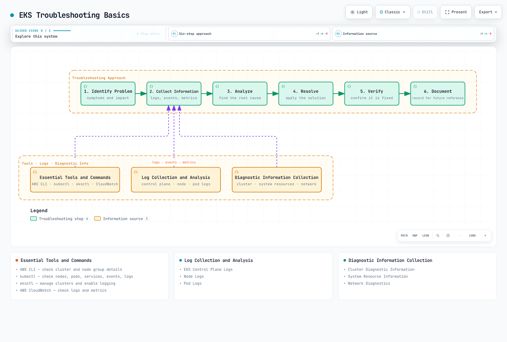
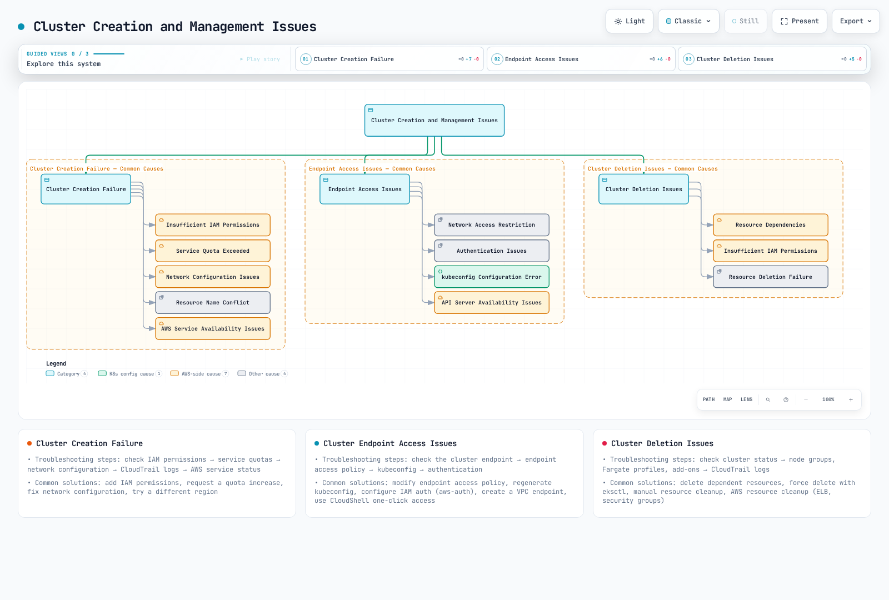
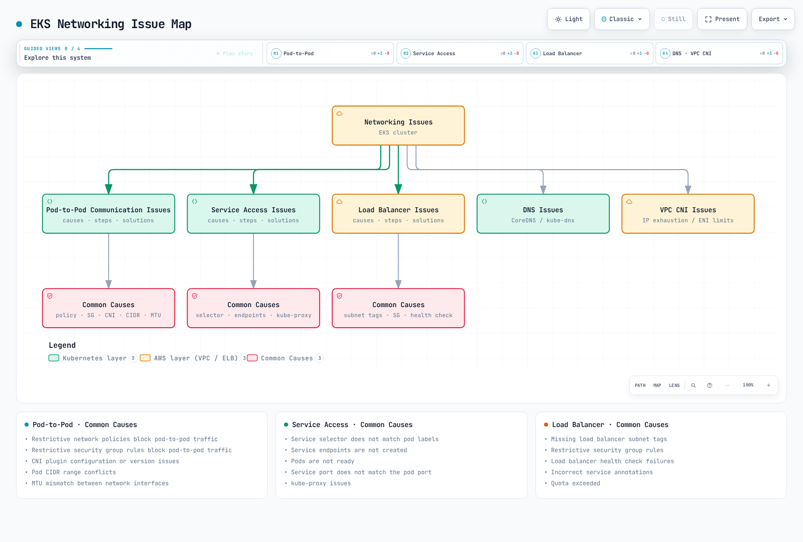
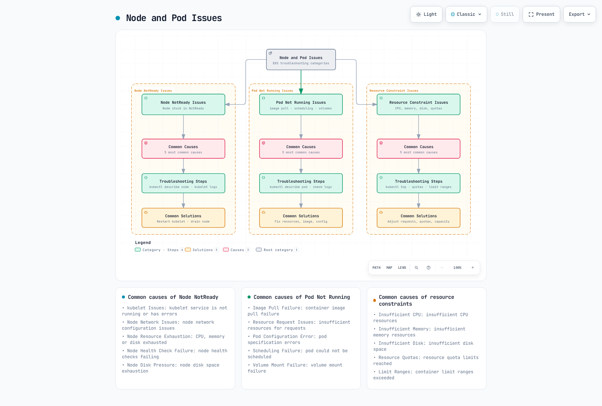
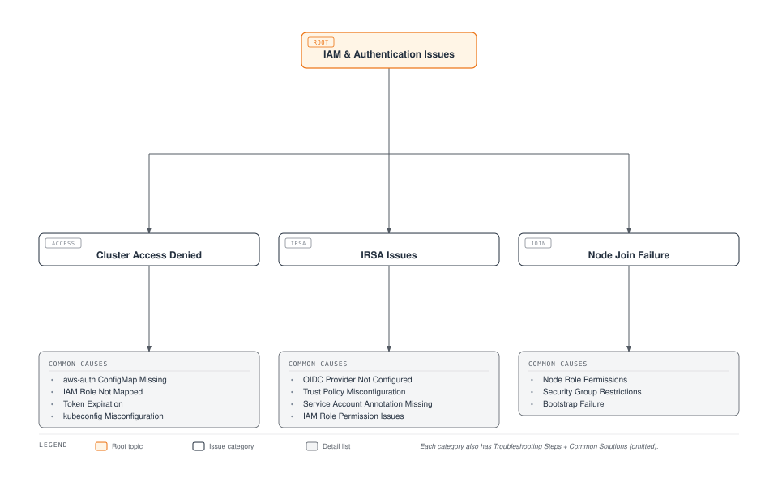

# Amazon EKS Troubleshooting

> **Last Updated**: July 3, 2026

When operating Amazon EKS clusters, various issues can arise. This document provides common problems that can occur in EKS clusters and their solutions.

## Table of Contents

1. [Troubleshooting Basics](#troubleshooting-basics)
2. [Cluster Creation and Management Issues](#cluster-creation-and-management-issues)
3. [Networking Issues](#networking-issues)
4. [Node and Pod Issues](#node-and-pod-issues)
5. [IAM and Authentication Issues](#iam-and-authentication-issues)
6. [Storage Issues](#storage-issues)
7. [Logging and Monitoring Issues](#logging-and-monitoring-issues)
8. [Performance Issues](#performance-issues)
9. [Upgrade Issues](#upgrade-issues)
10. [Common Error Messages and Solutions](#common-error-messages-and-solutions)

## Troubleshooting Basics



[🔍 View interactive diagram](https://www.atomai.click/kubernetes-docs/archmaps/en-eks-09-eks-troubleshooting-0.html)

### Troubleshooting Approach

A systematic approach for effectively troubleshooting EKS cluster issues:

1. **Identify Problem**: Clearly identify the symptoms and impact of the problem.
2. **Collect Information**: Gather relevant logs, events, and metrics.
3. **Analyze**: Analyze the collected information to identify the root cause.
4. **Resolve**: Apply appropriate solutions.
5. **Verify**: Confirm that the problem has been resolved.
6. **Document**: Document the problem and solution for future reference.

### Essential Tools and Commands

Essential tools and commands for EKS troubleshooting:

#### AWS CLI

Use AWS CLI to check EKS cluster information:

```bash
# List EKS clusters
aws eks list-clusters

# Check cluster details
aws eks describe-cluster --name my-cluster

# List node groups
aws eks list-nodegroups --cluster-name my-cluster

# Check node group details
aws eks describe-nodegroup --cluster-name my-cluster --nodegroup-name my-nodegroup
```

#### kubectl

Use kubectl to check Kubernetes resources:

```bash
# Check node status
kubectl get nodes
kubectl describe node <node-name>

# Check pod status
kubectl get pods --all-namespaces
kubectl describe pod <pod-name> -n <namespace>

# Check service status
kubectl get services --all-namespaces
kubectl describe service <service-name> -n <namespace>

# Check events
kubectl get events --all-namespaces --sort-by='.lastTimestamp'

# Check logs
kubectl logs <pod-name> -n <namespace>
kubectl logs <pod-name> -n <namespace> -c <container-name>
```

#### eksctl

Use eksctl to manage EKS clusters:

```bash
# List clusters
eksctl get clusters

# List node groups
eksctl get nodegroup --cluster my-cluster

# Enable cluster logging
eksctl utils update-cluster-logging --enable-types all --cluster my-cluster --approve
```

#### AWS CloudWatch

Use CloudWatch to check EKS cluster logs and metrics:

```bash
# Check CloudWatch log groups
aws logs describe-log-groups --log-group-name-prefix /aws/eks/my-cluster

# Check CloudWatch log streams
aws logs describe-log-streams --log-group-name /aws/eks/my-cluster/cluster

# Check CloudWatch log events
aws logs get-log-events --log-group-name /aws/eks/my-cluster/cluster --log-stream-name <log-stream-name>
```

### Log Collection and Analysis

#### EKS Control Plane Logs

Enable and check EKS control plane logs:

```bash
# Enable control plane logs
aws eks update-cluster-config \
  --name my-cluster \
  --logging '{"clusterLogging":[{"types":["api","audit","authenticator","controllerManager","scheduler"],"enabled":true}]}'

# Check logs in CloudWatch
aws logs get-log-events \
  --log-group-name /aws/eks/my-cluster/cluster \
  --log-stream-name kube-apiserver-<timestamp>
```

#### Node Logs

Check node logs:

```bash
# Connect to node using SSM
aws ssm start-session --target <instance-id>

# Check node logs
sudo journalctl -u kubelet

# Check container runtime logs
sudo journalctl -u docker
sudo journalctl -u containerd
```

#### Pod Logs

Check pod logs:

```bash
# Check pod logs
kubectl logs <pod-name> -n <namespace>

# Check previous pod logs
kubectl logs <pod-name> -n <namespace> --previous

# Check specific container logs
kubectl logs <pod-name> -n <namespace> -c <container-name>

# Stream logs
kubectl logs -f <pod-name> -n <namespace>
```

### Diagnostic Information Collection

#### Cluster Diagnostic Information

Collect cluster diagnostic information:

```bash
# Collect cluster info
kubectl cluster-info dump > cluster-info.txt

# Collect node info
kubectl describe nodes > nodes-info.txt

# Collect pod info
kubectl get pods --all-namespaces -o wide > pods-info.txt
kubectl describe pods --all-namespaces > pods-desc-info.txt

# Collect service info
kubectl get services --all-namespaces -o wide > services-info.txt
kubectl describe services --all-namespaces > services-desc-info.txt
```

#### System Resource Information

Collect system resource information:

```bash
# Check node resource usage
kubectl top nodes

# Check pod resource usage
kubectl top pods --all-namespaces

# Check node disk usage
kubectl debug node/<node-name> -it --image=busybox -- df -h
```

#### Network Diagnostics

Collect network diagnostic information:

```bash
# Check network policies
kubectl get networkpolicies --all-namespaces

# Check DNS
kubectl run dnsutils --image=tutum/dnsutils --restart=Never -- sleep 3600
kubectl exec -it dnsutils -- nslookup kubernetes.default

# Check network connectivity
kubectl run netshoot --image=nicolaka/netshoot --restart=Never -- sleep 3600
kubectl exec -it netshoot -- ping <target-ip>
kubectl exec -it netshoot -- traceroute <target-ip>
```

## Cluster Creation and Management Issues



[🔍 View interactive diagram](https://www.atomai.click/kubernetes-docs/archmaps/en-eks-09-eks-troubleshooting-1.html)

### Cluster Creation Failure

#### Common Causes

Common causes of EKS cluster creation failure:

1. **Insufficient IAM Permissions**: The IAM user or role creating the cluster lacks required permissions
2. **Service Quota Exceeded**: Quota exceeded for EKS clusters or related resources (e.g., VPC, subnets)
3. **Network Configuration Issues**: VPC, subnet, or security group configuration errors
4. **Resource Name Conflict**: Using cluster names or resource names already in use
5. **AWS Service Availability Issues**: Availability issues with EKS or related services

#### Troubleshooting Steps

1. **Check IAM Permissions**:

```bash
# Check IAM permissions
aws sts get-caller-identity

# Check required IAM policies
aws iam list-attached-role-policies --role-name <role-name>
```

2. **Check Service Quotas**:

```bash
# Check EKS cluster quota
aws service-quotas get-service-quota --service-code eks --quota-code L-1194D53C

# Check VPC quota
aws service-quotas get-service-quota --service-code vpc --quota-code L-F678F1CE
```

3. **Check Network Configuration**:

```bash
# Check VPC
aws ec2 describe-vpcs --vpc-ids <vpc-id>

# Check subnets
aws ec2 describe-subnets --subnet-ids <subnet-id-1> <subnet-id-2>

# Check routing tables
aws ec2 describe-route-tables --filters "Name=vpc-id,Values=<vpc-id>"

# Check security groups
aws ec2 describe-security-groups --group-ids <security-group-id>
```

4. **Check CloudTrail Logs**:

```bash
# Check CloudTrail events
aws cloudtrail lookup-events --lookup-attributes AttributeKey=EventName,AttributeValue=CreateCluster
```

5. **Check AWS Service Status**:

Check the status of EKS and related services on the AWS Service Status Dashboard (https://status.aws.amazon.com/).

#### Common Solutions

1. **Add IAM Permissions**:

```bash
# Add IAM policy for EKS cluster management
aws iam attach-role-policy \
  --role-name <role-name> \
  --policy-arn arn:aws:iam::aws:policy/AmazonEKSClusterPolicy
```

2. **Request Service Quota Increase**:

```bash
# Request service quota increase
aws service-quotas request-service-quota-increase \
  --service-code eks \
  --quota-code L-1194D53C \
  --desired-value <new-value>
```

3. **Modify Network Configuration**:

```bash
# Add subnet tags
aws ec2 create-tags \
  --resources <subnet-id> \
  --tags Key=kubernetes.io/cluster/<cluster-name>,Value=shared

# Add security group rules
aws ec2 authorize-security-group-ingress \
  --group-id <security-group-id> \
  --protocol tcp \
  --port 443 \
  --cidr <cidr-block>
```

4. **Try in Different Region**:

```bash
# Create cluster in different region
aws eks create-cluster \
  --region <different-region> \
  --name my-cluster \
  --role-arn <role-arn> \
  --resources-vpc-config subnetIds=<subnet-id-1>,<subnet-id-2>,securityGroupIds=<security-group-id>
```

### Cluster Endpoint Access Issues

#### Common Causes

Common causes of EKS cluster endpoint access issues:

1. **Network Access Restriction**: Network access restrictions to cluster endpoint
2. **Authentication Issues**: Authentication issues with the cluster
3. **kubeconfig Configuration Error**: Incorrect kubeconfig configuration
4. **API Server Availability Issues**: API server availability issues

#### Troubleshooting Steps

1. **Check Cluster Endpoint**:

```bash
# Check cluster endpoint
aws eks describe-cluster --name my-cluster --query "cluster.endpoint"

# Test endpoint access
curl -k <cluster-endpoint>
```

2. **Check Cluster Endpoint Access Policy**:

```bash
# Check cluster endpoint access policy
aws eks describe-cluster --name my-cluster --query "cluster.resourcesVpcConfig.endpointPublicAccess"
aws eks describe-cluster --name my-cluster --query "cluster.resourcesVpcConfig.endpointPrivateAccess"
aws eks describe-cluster --name my-cluster --query "cluster.resourcesVpcConfig.publicAccessCidrs"
```

3. **Check kubeconfig Configuration**:

```bash
# Check kubeconfig configuration
cat ~/.kube/config

# Update kubeconfig
aws eks update-kubeconfig --name my-cluster --region <region>
```

4. **Check Authentication**:

```bash
# Check AWS CLI credentials
aws sts get-caller-identity

# Test kubectl authentication
kubectl auth can-i get pods
```

#### Common Solutions

1. **Modify Cluster Endpoint Access Policy**:

```bash
# Enable public endpoint access
aws eks update-cluster-config \
  --name my-cluster \
  --resources-vpc-config endpointPublicAccess=true,publicAccessCidrs=["0.0.0.0/0"]

# Enable private endpoint access
aws eks update-cluster-config \
  --name my-cluster \
  --resources-vpc-config endpointPrivateAccess=true
```

2. **Regenerate kubeconfig**:

```bash
# Regenerate kubeconfig
aws eks update-kubeconfig --name my-cluster --region <region>
```

3. **Configure IAM Authentication**:

```bash
# Check aws-auth ConfigMap
kubectl describe configmap aws-auth -n kube-system

# Update aws-auth ConfigMap
eksctl create iamidentitymapping \
  --cluster my-cluster \
  --arn <iam-role-or-user-arn> \
  --username <username> \
  --group system:masters
```

4. **Create VPC Endpoint**:

```bash
# Create VPC endpoint for EKS
aws ec2 create-vpc-endpoint \
  --vpc-id <vpc-id> \
  --service-name com.amazonaws.<region>.eks \
  --vpc-endpoint-type Interface \
  --subnet-ids <subnet-id-1> <subnet-id-2> \
  --security-group-ids <security-group-id>
```

5. **Use One-Click Cluster Access via CloudShell** (released April 30, 2026):

When local kubeconfig setup or network access issues are blocking cluster access, the EKS console offers a direct alternative. Clicking **Connect** on the cluster list automatically launches AWS CloudShell with kubectl pre-configured for that cluster, so you can start troubleshooting from the browser immediately — no local kubectl install, AWS CLI credential setup, or kubeconfig configuration required. It supports clusters with either public or private API endpoints, is available in all regions, and incurs no additional cost beyond existing CloudShell/EKS charges. (Source: [Amazon EKS one-click cluster access](https://aws.amazon.com/about-aws/whats-new/2026/04/amazon-eks-one-click-cluster-access/))

### Cluster Deletion Issues

#### Common Causes

Common causes of EKS cluster deletion issues:

1. **Resource Dependencies**: Resources that depend on the cluster still exist
2. **Insufficient IAM Permissions**: The IAM user or role deleting the cluster lacks required permissions
3. **Resource Deletion Failure**: Failure to delete cluster resources

#### Troubleshooting Steps

1. **Check Cluster Status**:

```bash
# Check cluster status
aws eks describe-cluster --name my-cluster --query "cluster.status"
```

2. **Check Cluster Resources**:

```bash
# Check node groups
aws eks list-nodegroups --cluster-name my-cluster

# Check Fargate profiles
aws eks list-fargate-profiles --cluster-name my-cluster

# Check add-ons
aws eks list-addons --cluster-name my-cluster
```

3. **Check CloudTrail Logs**:

```bash
# Check CloudTrail events
aws cloudtrail lookup-events --lookup-attributes AttributeKey=EventName,AttributeValue=DeleteCluster
```

#### Common Solutions

1. **Delete Dependent Resources**:

```bash
# Delete node groups
aws eks delete-nodegroup --cluster-name my-cluster --nodegroup-name <nodegroup-name>

# Delete Fargate profiles
aws eks delete-fargate-profile --cluster-name my-cluster --fargate-profile-name <profile-name>

# Delete add-ons
aws eks delete-addon --cluster-name my-cluster --addon-name <addon-name>
```

2. **Force Delete**:

```bash
# Force delete using eksctl
eksctl delete cluster --name my-cluster --force
```

3. **Manual Resource Cleanup**:

```bash
# Delete load balancers
kubectl delete services --all --all-namespaces

# Delete PVCs
kubectl delete pvc --all --all-namespaces

# Delete namespaces
kubectl delete namespaces --all --ignore-not-found=true
```

4. **AWS Resource Cleanup**:

```bash
# Delete ELBs
aws elb describe-load-balancers | jq -r '.LoadBalancerDescriptions[].LoadBalancerName' | xargs -I {} aws elb delete-load-balancer --load-balancer-name {}

# Delete NLB/ALBs
aws elbv2 describe-load-balancers | jq -r '.LoadBalancers[].LoadBalancerArn' | xargs -I {} aws elbv2 delete-load-balancer --load-balancer-arn {}

# Delete security groups
aws ec2 describe-security-groups --filters "Name=tag:kubernetes.io/cluster/<cluster-name>,Values=owned" | jq -r '.SecurityGroups[].GroupId' | xargs -I {} aws ec2 delete-security-group --group-id {}
```

## Networking Issues

Networking issues are among the most common problems in EKS clusters. This section covers common networking issues and their solutions.



[🔍 View interactive diagram](https://www.atomai.click/kubernetes-docs/archmaps/en-eks-09-eks-troubleshooting-2.html)

### Pod-to-Pod Communication Issues

#### Common Causes

Common causes of pod-to-pod communication issues:

1. **Network Policies**: Restrictive network policies blocking pod-to-pod communication
2. **Security Group Rules**: Restrictive security group rules blocking pod-to-pod communication
3. **CNI Plugin Issues**: CNI plugin configuration or version issues
4. **Pod CIDR Conflict**: Pod CIDR range conflicts
5. **MTU Mismatch**: MTU mismatch between network interfaces

#### Troubleshooting Steps

1. **Check Network Policies**:

```bash
# Check network policies
kubectl get networkpolicies --all-namespaces
kubectl describe networkpolicy <networkpolicy-name> -n <namespace>
```

2. **Check Security Group Rules**:

```bash
# Check node security groups
aws ec2 describe-instances \
  --filters "Name=tag:eks:cluster-name,Values=my-cluster" \
  --query "Reservations[*].Instances[*].SecurityGroups[*]" \
  --output text

# Check security group rules
aws ec2 describe-security-group-rules \
  --filters "Name=group-id,Values=<security-group-id>"
```

3. **Check CNI Plugin**:

```bash
# Check CNI plugin version
kubectl describe daemonset aws-node -n kube-system | grep Image

# Check CNI plugin configuration
kubectl describe configmap aws-node -n kube-system
```

4. **Check Pod CIDR**:

```bash
# Check pod CIDR
kubectl get nodes -o jsonpath='{.items[*].spec.podCIDR}'

# Check pod IPs
kubectl get pods -o wide --all-namespaces
```

5. **Check MTU**:

```bash
# Check node MTU
kubectl debug node/<node-name> -it --image=busybox -- ifconfig

# Check CNI MTU
kubectl describe configmap aws-node -n kube-system | grep MTU
```

#### Common Solutions

1. **Modify Network Policies**:

```bash
# Create allow network policy
cat <<EOF | kubectl apply -f -
apiVersion: networking.k8s.io/v1
kind: NetworkPolicy
metadata:
  name: allow-all
  namespace: <namespace>
spec:
  podSelector: {}
  ingress:
  - {}
  egress:
  - {}
  policyTypes:
  - Ingress
  - Egress
EOF
```

2. **Modify Security Group Rules**:

```bash
# Add node-to-node communication rule
aws ec2 authorize-security-group-ingress \
  --group-id <security-group-id> \
  --protocol all \
  --source-group <security-group-id>
```

3. **Update CNI Plugin**:

```bash
# Update CNI plugin
aws eks update-addon \
  --cluster-name my-cluster \
  --addon-name vpc-cni \
  --addon-version <latest-version> \
  --resolve-conflicts PRESERVE
```

4. **Modify CNI Configuration**:

```bash
# Modify CNI MTU configuration
kubectl set env daemonset aws-node -n kube-system AWS_VPC_ENI_MTU=1500
```

5. **Restart Pods**:

```bash
# Restart pods
kubectl delete pod <pod-name> -n <namespace>
```

### Service Access Issues

#### Common Causes

Common causes of service access issues:

1. **Service Selector Mismatch**: Service selector doesn't match pod labels
2. **Endpoint Issues**: Service endpoints are not created
3. **Pod Status Issues**: Pods are not ready
4. **Service Port Mismatch**: Service port doesn't match pod port
5. **kube-proxy Issues**: kube-proxy configuration or status issues

#### Troubleshooting Steps

1. **Check Service and Pods**:

```bash
# Check service
kubectl get services -n <namespace>
kubectl describe service <service-name> -n <namespace>

# Check pods
kubectl get pods -l <service-selector> -n <namespace>
kubectl describe pod <pod-name> -n <namespace>
```

2. **Check Endpoints**:

```bash
# Check endpoints
kubectl get endpoints <service-name> -n <namespace>
kubectl describe endpoints <service-name> -n <namespace>
```

3. **Check Pod Status**:

```bash
# Check pod status
kubectl get pods -l <service-selector> -n <namespace> -o wide
kubectl describe pod <pod-name> -n <namespace>
```

4. **Check Service Ports**:

```bash
# Check service ports
kubectl get service <service-name> -n <namespace> -o jsonpath='{.spec.ports[*]}'

# Check pod ports
kubectl get pod <pod-name> -n <namespace> -o jsonpath='{.spec.containers[*].ports[*]}'
```

5. **Check kube-proxy**:

```bash
# Check kube-proxy status
kubectl get pods -n kube-system -l k8s-app=kube-proxy
kubectl logs -n kube-system -l k8s-app=kube-proxy
```

#### Common Solutions

1. **Modify Service Selector**:

```bash
# Modify service selector
kubectl patch service <service-name> -n <namespace> -p '{"spec":{"selector":{"app":"<app-label>"}}}'
```

2. **Modify Pod Labels**:

```bash
# Modify pod labels
kubectl label pod <pod-name> -n <namespace> app=<app-label> --overwrite
```

3. **Modify Service Ports**:

```bash
# Modify service ports
kubectl patch service <service-name> -n <namespace> -p '{"spec":{"ports":[{"port":80,"targetPort":8080}]}}'
```

4. **Restart kube-proxy**:

```bash
# Restart kube-proxy
kubectl delete pod -n kube-system -l k8s-app=kube-proxy
```

5. **Recreate Service**:

```bash
# Delete service
kubectl delete service <service-name> -n <namespace>

# Create service
kubectl expose deployment <deployment-name> -n <namespace> --port=80 --target-port=8080
```

### Load Balancer Issues

#### Common Causes

Common causes of load balancer issues:

1. **Missing Subnet Tags**: Missing load balancer subnet tags
2. **Security Group Rule Restrictions**: Restrictive security group rules
3. **Health Check Failure**: Load balancer health check failures
4. **Service Annotation Issues**: Incorrect service annotations
5. **Quota Exceeded**: Load balancer quota exceeded

#### Troubleshooting Steps

1. **Check Service Status**:

```bash
# Check service status
kubectl get service <service-name> -n <namespace>
kubectl describe service <service-name> -n <namespace>
```

2. **Check Load Balancer Status**:

```bash
# Check load balancer ARN
aws elbv2 describe-load-balancers \
  --query "LoadBalancers[?contains(DNSName, '<load-balancer-dns>')].LoadBalancerArn" \
  --output text

# Check load balancer status
aws elbv2 describe-load-balancer-attributes \
  --load-balancer-arn <load-balancer-arn>

# Check target group health
aws elbv2 describe-target-health \
  --target-group-arn <target-group-arn>
```

3. **Check Subnet Tags**:

```bash
# Check subnet tags
aws ec2 describe-subnets \
  --subnet-ids <subnet-id-1> <subnet-id-2> \
  --query "Subnets[*].{ID:SubnetId,Tags:Tags}"
```

4. **Check Security Group Rules**:

```bash
# Check security group rules
aws ec2 describe-security-group-rules \
  --filters "Name=group-id,Values=<security-group-id>"
```

5. **Check Service Events**:

```bash
# Check service events
kubectl get events -n <namespace> --field-selector involvedObject.name=<service-name>
```

#### Common Solutions

1. **Add Subnet Tags**:

```bash
# Add public subnet tags
aws ec2 create-tags \
  --resources <subnet-id-1> <subnet-id-2> \
  --tags Key=kubernetes.io/role/elb,Value=1

# Add private subnet tags
aws ec2 create-tags \
  --resources <subnet-id-1> <subnet-id-2> \
  --tags Key=kubernetes.io/role/internal-elb,Value=1
```

2. **Add Security Group Rules**:

```bash
# Add inbound rule
aws ec2 authorize-security-group-ingress \
  --group-id <security-group-id> \
  --protocol tcp \
  --port 80 \
  --cidr 0.0.0.0/0

# Add outbound rule
aws ec2 authorize-security-group-egress \
  --group-id <security-group-id> \
  --protocol tcp \
  --port 80 \
  --cidr 0.0.0.0/0
```

3. **Modify Service Annotations**:

```bash
# Add internal load balancer annotation
kubectl annotate service <service-name> -n <namespace> \
  service.beta.kubernetes.io/aws-load-balancer-internal="true" \
  --overwrite

# Add load balancer type annotation
kubectl annotate service <service-name> -n <namespace> \
  service.beta.kubernetes.io/aws-load-balancer-type="nlb" \
  --overwrite
```

4. **Recreate Service**:

```bash
# Backup service
kubectl get service <service-name> -n <namespace> -o yaml > service-backup.yaml

# Delete service
kubectl delete service <service-name> -n <namespace>

# Create service
kubectl apply -f service-backup.yaml
```

5. **Manually Create Load Balancer**:

```bash
# Create load balancer
aws elbv2 create-load-balancer \
  --name <load-balancer-name> \
  --type application \
  --subnets <subnet-id-1> <subnet-id-2> \
  --security-groups <security-group-id>
```

### DNS Issues

#### Common Causes

Common causes of DNS issues:

1. **CoreDNS Pod Issues**: CoreDNS pods are not running or not ready
2. **kube-dns Service Issues**: kube-dns service is not properly configured
3. **DNS Policy Issues**: Pod DNS policy is not properly configured
4. **Network Policy Restrictions**: Network policies blocking DNS traffic
5. **CoreDNS Configuration Issues**: CoreDNS configuration errors

#### Troubleshooting Steps

1. **Check CoreDNS Pods**:

```bash
# Check CoreDNS pods
kubectl get pods -n kube-system -l k8s-app=kube-dns
kubectl describe pod -n kube-system -l k8s-app=kube-dns
```

2. **Check kube-dns Service**:

```bash
# Check kube-dns service
kubectl get service kube-dns -n kube-system
kubectl describe service kube-dns -n kube-system
```

3. **Check CoreDNS Configuration**:

```bash
# Check CoreDNS configuration
kubectl get configmap coredns -n kube-system -o yaml
```

4. **Test DNS Resolution**:

```bash
# Create DNS resolution test pod
kubectl run dnsutils --image=tutum/dnsutils --restart=Never -- sleep 3600

# Test DNS resolution
kubectl exec -it dnsutils -- nslookup kubernetes.default
kubectl exec -it dnsutils -- nslookup <service-name>.<namespace>.svc.cluster.local
```

5. **DNS Debugging**:

```bash
# Create DNS debugging pod
cat <<EOF | kubectl apply -f -
apiVersion: v1
kind: Pod
metadata:
  name: dnsutils
  namespace: default
spec:
  containers:
  - name: dnsutils
    image: tutum/dnsutils
    command:
      - sleep
      - "3600"
    imagePullPolicy: IfNotPresent
  restartPolicy: Always
EOF

# DNS debugging
kubectl exec -it dnsutils -- cat /etc/resolv.conf
kubectl exec -it dnsutils -- dig kubernetes.default.svc.cluster.local
```

#### Common Solutions

1. **Restart CoreDNS**:

```bash
# Restart CoreDNS pods
kubectl delete pod -n kube-system -l k8s-app=kube-dns
```

2. **Modify CoreDNS Configuration**:

```bash
# Modify CoreDNS configuration
kubectl edit configmap coredns -n kube-system
```

3. **Scale Up CoreDNS**:

```bash
# Scale up CoreDNS
kubectl scale deployment coredns -n kube-system --replicas=3
```

4. **Modify DNS Policy**:

```bash
# Modify DNS policy
kubectl patch deployment <deployment-name> -n <namespace> -p '{"spec":{"template":{"spec":{"dnsPolicy":"ClusterFirst"}}}}'
```

5. **Update CoreDNS**:

```bash
# Update CoreDNS
aws eks update-addon \
  --cluster-name my-cluster \
  --addon-name coredns \
  --addon-version <latest-version> \
  --resolve-conflicts PRESERVE
```

### VPC CNI Issues

#### Common Causes

Common causes of VPC CNI issues:

1. **IP Address Exhaustion**: Insufficient IP addresses allocated to nodes
2. **ENI Limit Reached**: Node ENI (Elastic Network Interface) limit reached
3. **CNI Version Issues**: Outdated or incompatible CNI version
4. **CNI Configuration Errors**: Incorrect CNI configuration
5. **Permission Issues**: Insufficient IAM permissions for CNI

#### Troubleshooting Steps

1. **Check VPC CNI Pods**:

```bash
# Check VPC CNI pods
kubectl get pods -n kube-system -l k8s-app=aws-node
kubectl describe pod -n kube-system -l k8s-app=aws-node
```

2. **Check VPC CNI Logs**:

```bash
# Check VPC CNI logs
kubectl logs -n kube-system -l k8s-app=aws-node
```

3. **Check IP Address Usage**:

```bash
# Check IP address usage
kubectl exec -n kube-system -l k8s-app=aws-node -- curl -s http://localhost:61679/v1/enis | jq
```

4. **Check CNI Configuration**:

```bash
# Check CNI configuration
kubectl describe daemonset aws-node -n kube-system | grep -A 10 Environment
```

5. **Check IAM Permissions**:

```bash
# Check node IAM role
aws eks describe-nodegroup \
  --cluster-name my-cluster \
  --nodegroup-name <nodegroup-name> \
  --query "nodegroup.nodeRole"

# Check IAM policies
aws iam list-attached-role-policies \
  --role-name <node-role-name>
```

#### Common Solutions

1. **Resolve IP Address Exhaustion**:

```bash
# Enable prefix delegation
kubectl set env daemonset aws-node -n kube-system ENABLE_PREFIX_DELEGATION=true

# Enable custom networking
kubectl set env daemonset aws-node -n kube-system AWS_VPC_K8S_CNI_CUSTOM_NETWORK_CFG=true
```

2. **Increase ENI Limit**:

```bash
# Update node group with larger instance type
aws eks update-nodegroup-config \
  --cluster-name my-cluster \
  --nodegroup-name <nodegroup-name> \
  --scaling-config desiredSize=<desired-size>,minSize=<min-size>,maxSize=<max-size> \
  --update-config maxUnavailable=1
```

3. **Update VPC CNI**:

```bash
# Update VPC CNI
aws eks update-addon \
  --cluster-name my-cluster \
  --addon-name vpc-cni \
  --addon-version <latest-version> \
  --resolve-conflicts PRESERVE
```

4. **Modify CNI Configuration**:

```bash
# Modify CNI configuration
kubectl set env daemonset aws-node -n kube-system WARM_IP_TARGET=5
kubectl set env daemonset aws-node -n kube-system MINIMUM_IP_TARGET=2
```

5. **Add IAM Permissions**:

```bash
# Add CNI IAM policy
aws iam attach-role-policy \
  --role-name <node-role-name> \
  --policy-arn arn:aws:iam::aws:policy/AmazonEKS_CNI_Policy
```

## Node and Pod Issues



[🔍 View interactive diagram](https://www.atomai.click/kubernetes-docs/archmaps/en-eks-09-eks-troubleshooting-3.html)

### Node NotReady Issues

#### Common Causes

Common causes of node NotReady issues:

1. **kubelet Issues**: kubelet service is not running or has errors
2. **Node Network Issues**: Node network configuration issues
3. **Node Resource Exhaustion**: Node resource (CPU, memory, disk) exhaustion
4. **Node Health Check Failure**: Node health check failures
5. **Node Disk Pressure**: Node disk space exhaustion

#### Troubleshooting Steps

1. **Check Node Status**:

```bash
# Check node status
kubectl get nodes
kubectl describe node <node-name>
```

2. **Check Node Conditions**:

```bash
# Check node conditions
kubectl get nodes -o jsonpath='{.items[*].status.conditions}' | jq
```

3. **Check kubelet Status**:

```bash
# Connect to node using SSM
aws ssm start-session --target <instance-id>

# Check kubelet status
sudo systemctl status kubelet
sudo journalctl -u kubelet -n 100
```

4. **Check Node Resources**:

```bash
# Check node resources
kubectl top node <node-name>

# Check disk usage
kubectl debug node/<node-name> -it --image=busybox -- df -h
```

5. **Check Node Events**:

```bash
# Check node events
kubectl get events --field-selector involvedObject.name=<node-name>
```

#### Common Solutions

1. **Restart kubelet**:

```bash
# Connect to node
aws ssm start-session --target <instance-id>

# Restart kubelet
sudo systemctl restart kubelet
```

2. **Fix Network Issues**:

```bash
# Check network configuration
aws ssm start-session --target <instance-id>
sudo cat /etc/cni/net.d/*
sudo systemctl restart containerd
```

3. **Free Disk Space**:

```bash
# Connect to node
aws ssm start-session --target <instance-id>

# Clean up unused images
sudo crictl rmi --prune

# Clean up logs
sudo journalctl --vacuum-time=1d
```

4. **Restart Node**:

```bash
# Reboot EC2 instance
aws ec2 reboot-instances --instance-ids <instance-id>
```

5. **Replace Node**:

```bash
# Cordon node
kubectl cordon <node-name>

# Drain node
kubectl drain <node-name> --ignore-daemonsets --delete-emptydir-data

# Terminate instance
aws ec2 terminate-instances --instance-ids <instance-id>
```

### Pod Not Running Issues

#### Common Causes

Common causes of pod not running issues:

1. **Image Pull Failure**: Container image pull failure
2. **Resource Request Issues**: Insufficient resources to meet resource requests
3. **Pod Configuration Error**: Pod specification errors
4. **Scheduling Failure**: Pod scheduling failure
5. **Volume Mount Failure**: Volume mount failure

#### Troubleshooting Steps

1. **Check Pod Status**:

```bash
# Check pod status
kubectl get pod <pod-name> -n <namespace>
kubectl describe pod <pod-name> -n <namespace>
```

2. **Check Pod Events**:

```bash
# Check pod events
kubectl get events -n <namespace> --field-selector involvedObject.name=<pod-name>
```

3. **Check Pod Logs**:

```bash
# Check pod logs
kubectl logs <pod-name> -n <namespace>
kubectl logs <pod-name> -n <namespace> --previous
```

4. **Check Container Status**:

```bash
# Check container status
kubectl get pod <pod-name> -n <namespace> -o jsonpath='{.status.containerStatuses[*]}'
```

5. **Check Scheduling**:

```bash
# Check pod scheduling
kubectl get pod <pod-name> -n <namespace> -o jsonpath='{.status.conditions[?(@.type=="PodScheduled")]}'
```

#### Common Solutions

1. **Fix Image Pull Issues**:

```bash
# Check image availability
docker pull <image-name>

# Create image pull secret
kubectl create secret docker-registry <secret-name> \
  --docker-server=<registry-server> \
  --docker-username=<username> \
  --docker-password=<password> \
  --docker-email=<email> \
  -n <namespace>

# Add image pull secret to pod
kubectl patch serviceaccount default -n <namespace> -p '{"imagePullSecrets":[{"name":"<secret-name>"}]}'
```

2. **Fix Resource Issues**:

```bash
# Reduce resource requests
kubectl patch deployment <deployment-name> -n <namespace> -p '{"spec":{"template":{"spec":{"containers":[{"name":"<container-name>","resources":{"requests":{"memory":"128Mi","cpu":"100m"}}}]}}}}'
```

3. **Fix Configuration Errors**:

```bash
# Check and fix pod specification
kubectl get deployment <deployment-name> -n <namespace> -o yaml > deployment.yaml
# Edit deployment.yaml
kubectl apply -f deployment.yaml
```

4. **Fix Scheduling Issues**:

```bash
# Check schedulable nodes
kubectl get nodes -o jsonpath='{.items[?(@.spec.unschedulable!=true)].metadata.name}'

# Remove node taints
kubectl taint nodes <node-name> <taint-key>-
```

5. **Fix Volume Issues**:

```bash
# Check PVC status
kubectl get pvc -n <namespace>
kubectl describe pvc <pvc-name> -n <namespace>

# Recreate PVC
kubectl delete pvc <pvc-name> -n <namespace>
kubectl apply -f pvc.yaml
```

### Resource Constraint Issues

#### Common Causes

Common causes of resource constraint issues:

1. **Insufficient CPU**: Insufficient CPU resources
2. **Insufficient Memory**: Insufficient memory resources
3. **Insufficient Disk**: Insufficient disk space
4. **Resource Quotas**: Resource quota limits reached
5. **Limit Ranges**: Container limit ranges exceeded

#### Troubleshooting Steps

1. **Check Resource Usage**:

```bash
# Check node resources
kubectl top nodes

# Check pod resources
kubectl top pods -n <namespace>
```

2. **Check Resource Quotas**:

```bash
# Check resource quotas
kubectl get resourcequotas -n <namespace>
kubectl describe resourcequota <quota-name> -n <namespace>
```

3. **Check Limit Ranges**:

```bash
# Check limit ranges
kubectl get limitranges -n <namespace>
kubectl describe limitrange <limitrange-name> -n <namespace>
```

4. **Check Pod Resources**:

```bash
# Check pod resource requests and limits
kubectl get pod <pod-name> -n <namespace> -o jsonpath='{.spec.containers[*].resources}'
```

#### Common Solutions

1. **Adjust Resource Requests and Limits**:

```bash
# Adjust resource requests and limits
kubectl patch deployment <deployment-name> -n <namespace> -p '{"spec":{"template":{"spec":{"containers":[{"name":"<container-name>","resources":{"requests":{"memory":"256Mi","cpu":"200m"},"limits":{"memory":"512Mi","cpu":"500m"}}}]}}}}'
```

2. **Adjust Resource Quotas**:

```bash
# Adjust resource quotas
kubectl patch resourcequota <quota-name> -n <namespace> -p '{"spec":{"hard":{"requests.cpu":"10","requests.memory":"20Gi"}}}'
```

3. **Expand Node Group**:

```bash
# Expand node group
aws eks update-nodegroup-config \
  --cluster-name my-cluster \
  --nodegroup-name <nodegroup-name> \
  --scaling-config desiredSize=<desired-size>,minSize=<min-size>,maxSize=<max-size>
```

4. **Enable Cluster Autoscaler**:

```bash
# Deploy Cluster Autoscaler
kubectl apply -f https://raw.githubusercontent.com/kubernetes/autoscaler/master/cluster-autoscaler/cloudprovider/aws/examples/cluster-autoscaler-autodiscover.yaml
```

## IAM and Authentication Issues



### Cluster Access Denied

#### Common Causes

Common causes of cluster access denied:

1. **aws-auth ConfigMap Missing**: aws-auth ConfigMap is missing or misconfigured
2. **IAM Role Not Mapped**: IAM role or user is not mapped in aws-auth ConfigMap
3. **Token Expiration**: AWS authentication token has expired
4. **kubeconfig Misconfiguration**: kubeconfig is misconfigured

#### Troubleshooting Steps

1. **Check AWS Identity**:

```bash
# Check AWS identity
aws sts get-caller-identity
```

2. **Check aws-auth ConfigMap**:

```bash
# Check aws-auth ConfigMap
kubectl get configmap aws-auth -n kube-system -o yaml
```

3. **Check kubeconfig**:

```bash
# Check kubeconfig
cat ~/.kube/config
kubectl config current-context
```

4. **Check Authentication**:

```bash
# Check authentication
kubectl auth can-i get pods
```

#### Common Solutions

1. **Update kubeconfig**:

```bash
# Update kubeconfig
aws eks update-kubeconfig --name my-cluster --region <region>
```

2. **Add IAM Identity Mapping**:

```bash
# Add IAM identity mapping using eksctl
eksctl create iamidentitymapping \
  --cluster my-cluster \
  --arn <iam-role-or-user-arn> \
  --username <username> \
  --group system:masters

# Or manually edit aws-auth ConfigMap
kubectl edit configmap aws-auth -n kube-system
```

3. **Create aws-auth ConfigMap**:

```bash
# Create aws-auth ConfigMap
cat <<EOF | kubectl apply -f -
apiVersion: v1
kind: ConfigMap
metadata:
  name: aws-auth
  namespace: kube-system
data:
  mapRoles: |
    - rolearn: <node-role-arn>
      username: system:node:{{EC2PrivateDNSName}}
      groups:
        - system:bootstrappers
        - system:nodes
    - rolearn: <admin-role-arn>
      username: admin
      groups:
        - system:masters
EOF
```

4. **Refresh AWS Credentials**:

```bash
# Refresh AWS credentials
aws sts get-session-token
aws eks get-token --cluster-name my-cluster
```

### IRSA Issues

#### Common Causes

Common causes of IRSA issues:

1. **OIDC Provider Not Configured**: OIDC provider is not configured for the cluster
2. **Trust Policy Misconfiguration**: IAM role trust policy is misconfigured
3. **Service Account Annotation Missing**: Service account annotation is missing
4. **IAM Role Permission Issues**: IAM role lacks required permissions

#### Troubleshooting Steps

1. **Check OIDC Provider**:

```bash
# Check OIDC provider
aws eks describe-cluster --name my-cluster --query "cluster.identity.oidc.issuer"

# List OIDC providers
aws iam list-open-id-connect-providers
```

2. **Check Service Account**:

```bash
# Check service account
kubectl get serviceaccount <service-account-name> -n <namespace> -o yaml
```

3. **Check IAM Role**:

```bash
# Check IAM role trust policy
aws iam get-role --role-name <role-name> --query "Role.AssumeRolePolicyDocument"

# Check IAM role policies
aws iam list-attached-role-policies --role-name <role-name>
```

4. **Check Pod Environment Variables**:

```bash
# Check pod environment variables
kubectl exec -it <pod-name> -n <namespace> -- env | grep AWS
```

#### Common Solutions

1. **Configure OIDC Provider**:

```bash
# Associate OIDC provider
eksctl utils associate-iam-oidc-provider --cluster my-cluster --approve
```

2. **Fix Trust Policy**:

```bash
# Get OIDC provider URL
OIDC_PROVIDER=$(aws eks describe-cluster --name my-cluster --query "cluster.identity.oidc.issuer" --output text | sed -e "s/^https:\/\///")

# Update trust policy
cat > trust-policy.json << EOF
{
  "Version": "2012-10-17",
  "Statement": [
    {
      "Effect": "Allow",
      "Principal": {
        "Federated": "arn:aws:iam::<account-id>:oidc-provider/${OIDC_PROVIDER}"
      },
      "Action": "sts:AssumeRoleWithWebIdentity",
      "Condition": {
        "StringEquals": {
          "${OIDC_PROVIDER}:sub": "system:serviceaccount:<namespace>:<service-account-name>"
        }
      }
    }
  ]
}
EOF

aws iam update-assume-role-policy --role-name <role-name> --policy-document file://trust-policy.json
```

3. **Add Service Account Annotation**:

```bash
# Add service account annotation
kubectl annotate serviceaccount <service-account-name> -n <namespace> \
  eks.amazonaws.com/role-arn=<role-arn> \
  --overwrite
```

4. **Add IAM Permissions**:

```bash
# Attach IAM policy
aws iam attach-role-policy \
  --role-name <role-name> \
  --policy-arn <policy-arn>
```

### Node Join Failure

#### Common Causes

Common causes of node join failure:

1. **Node Role Permissions**: Node IAM role lacks required permissions
2. **Security Group Restrictions**: Security group rules prevent node-to-control plane communication
3. **Bootstrap Failure**: Node bootstrap script failure

#### Troubleshooting Steps

1. **Check Node Group Status**:

```bash
# Check node group status
aws eks describe-nodegroup --cluster-name my-cluster --nodegroup-name <nodegroup-name>
```

2. **Check Node IAM Role**:

```bash
# Check node IAM role
aws iam get-role --role-name <node-role-name>
aws iam list-attached-role-policies --role-name <node-role-name>
```

3. **Check Security Groups**:

```bash
# Check security groups
aws ec2 describe-security-groups --group-ids <security-group-id>
```

4. **Check Node Logs**:

```bash
# Connect to node using SSM
aws ssm start-session --target <instance-id>

# Check kubelet logs
sudo journalctl -u kubelet
```

#### Common Solutions

1. **Add Node IAM Permissions**:

```bash
# Attach required policies
aws iam attach-role-policy \
  --role-name <node-role-name> \
  --policy-arn arn:aws:iam::aws:policy/AmazonEKSWorkerNodePolicy

aws iam attach-role-policy \
  --role-name <node-role-name> \
  --policy-arn arn:aws:iam::aws:policy/AmazonEC2ContainerRegistryReadOnly

aws iam attach-role-policy \
  --role-name <node-role-name> \
  --policy-arn arn:aws:iam::aws:policy/AmazonEKS_CNI_Policy
```

2. **Fix Security Group Rules**:

```bash
# Add required inbound rules
aws ec2 authorize-security-group-ingress \
  --group-id <node-security-group-id> \
  --protocol tcp \
  --port 443 \
  --source-group <cluster-security-group-id>

aws ec2 authorize-security-group-ingress \
  --group-id <node-security-group-id> \
  --protocol tcp \
  --port 10250 \
  --source-group <cluster-security-group-id>
```

3. **Fix Bootstrap Script**:

```bash
# Connect to node
aws ssm start-session --target <instance-id>

# Re-run bootstrap script
sudo /etc/eks/bootstrap.sh my-cluster
```

## Storage Issues

### EBS Volume Issues

#### Common Causes

Common causes of EBS volume issues:

1. **CSI Driver Not Installed**: EBS CSI driver is not installed
2. **IAM Permission Issues**: Node IAM role lacks EBS permissions
3. **Volume Attachment Failure**: Volume attachment fails
4. **StorageClass Misconfiguration**: StorageClass is misconfigured

#### Troubleshooting Steps

1. **Check CSI Driver**:

```bash
# Check EBS CSI driver
kubectl get pods -n kube-system -l app=ebs-csi-controller
kubectl describe deployment ebs-csi-controller -n kube-system
```

2. **Check PVC and PV**:

```bash
# Check PVC status
kubectl get pvc -n <namespace>
kubectl describe pvc <pvc-name> -n <namespace>

# Check PV status
kubectl get pv
kubectl describe pv <pv-name>
```

3. **Check StorageClass**:

```bash
# Check StorageClass
kubectl get storageclass
kubectl describe storageclass <storageclass-name>
```

4. **Check IAM Permissions**:

```bash
# Check node IAM role permissions
aws iam list-attached-role-policies --role-name <node-role-name>
```

#### Common Solutions

1. **Install EBS CSI Driver**:

```bash
# Install EBS CSI driver using eksctl
eksctl create addon \
  --cluster my-cluster \
  --name aws-ebs-csi-driver \
  --service-account-role-arn <role-arn>
```

2. **Add IAM Permissions**:

```bash
# Attach EBS CSI driver policy
aws iam attach-role-policy \
  --role-name <role-name> \
  --policy-arn arn:aws:iam::aws:policy/service-role/AmazonEBSCSIDriverPolicy
```

3. **Create StorageClass**:

```bash
# Create StorageClass
cat <<EOF | kubectl apply -f -
apiVersion: storage.k8s.io/v1
kind: StorageClass
metadata:
  name: ebs-sc
provisioner: ebs.csi.aws.com
parameters:
  type: gp3
  fsType: ext4
volumeBindingMode: WaitForFirstConsumer
EOF
```

### EFS Volume Issues

#### Common Causes

Common causes of EFS volume issues:

1. **EFS CSI Driver Not Installed**: EFS CSI driver is not installed
2. **Security Group Issues**: Security group rules prevent EFS access
3. **Mount Target Issues**: EFS mount targets are not configured
4. **IAM Permission Issues**: Node IAM role lacks EFS permissions

#### Troubleshooting Steps

1. **Check EFS CSI Driver**:

```bash
# Check EFS CSI driver
kubectl get pods -n kube-system -l app=efs-csi-controller
```

2. **Check EFS File System**:

```bash
# Check EFS file system
aws efs describe-file-systems --file-system-id <file-system-id>

# Check mount targets
aws efs describe-mount-targets --file-system-id <file-system-id>
```

3. **Check Security Groups**:

```bash
# Check EFS security group
aws ec2 describe-security-groups --group-ids <efs-security-group-id>
```

#### Common Solutions

1. **Install EFS CSI Driver**:

```bash
# Install EFS CSI driver
kubectl apply -k "github.com/kubernetes-sigs/aws-efs-csi-driver/deploy/kubernetes/overlays/stable/?ref=release-1.5"
```

2. **Configure Security Groups**:

```bash
# Allow NFS traffic
aws ec2 authorize-security-group-ingress \
  --group-id <efs-security-group-id> \
  --protocol tcp \
  --port 2049 \
  --source-group <node-security-group-id>
```

3. **Create Mount Targets**:

```bash
# Create mount target
aws efs create-mount-target \
  --file-system-id <file-system-id> \
  --subnet-id <subnet-id> \
  --security-groups <security-group-id>
```

## Logging and Monitoring Issues

### CloudWatch Issues

#### Common Causes

Common causes of CloudWatch issues:

1. **CloudWatch Agent Not Installed**: CloudWatch agent is not installed
2. **IAM Permission Issues**: Node IAM role lacks CloudWatch permissions
3. **Log Group Configuration Issues**: Log group is not configured
4. **Agent Configuration Issues**: CloudWatch agent is misconfigured

#### Troubleshooting Steps

1. **Check CloudWatch Agent**:

```bash
# Check CloudWatch agent pods
kubectl get pods -n amazon-cloudwatch -l name=cloudwatch-agent
```

2. **Check IAM Permissions**:

```bash
# Check node IAM role permissions
aws iam list-attached-role-policies --role-name <node-role-name>
```

3. **Check Log Groups**:

```bash
# Check log groups
aws logs describe-log-groups --log-group-name-prefix /aws/eks/my-cluster
```

#### Common Solutions

1. **Install CloudWatch Agent**:

```bash
# Install CloudWatch Container Insights
kubectl apply -f https://raw.githubusercontent.com/aws-samples/amazon-cloudwatch-container-insights/latest/k8s-deployment-manifest-templates/deployment-mode/daemonset/container-insights-monitoring/quickstart/cwagent-fluentd-quickstart.yaml
```

2. **Add IAM Permissions**:

```bash
# Attach CloudWatch policy
aws iam attach-role-policy \
  --role-name <node-role-name> \
  --policy-arn arn:aws:iam::aws:policy/CloudWatchAgentServerPolicy
```

### Prometheus and Grafana Issues

#### Common Causes

Common causes of Prometheus and Grafana issues:

1. **Prometheus Not Installed**: Prometheus is not properly installed
2. **Scrape Target Issues**: Scrape targets are not configured
3. **Storage Issues**: Prometheus storage issues
4. **Grafana Data Source Issues**: Grafana data source is misconfigured

#### Troubleshooting Steps

1. **Check Prometheus Pods**:

```bash
# Check Prometheus pods
kubectl get pods -n monitoring -l app=prometheus
kubectl logs -n monitoring -l app=prometheus
```

2. **Check Prometheus Targets**:

```bash
# Port forward to Prometheus
kubectl port-forward -n monitoring svc/prometheus-server 9090:80

# Check targets in browser: http://localhost:9090/targets
```

3. **Check Grafana Pods**:

```bash
# Check Grafana pods
kubectl get pods -n monitoring -l app=grafana
kubectl logs -n monitoring -l app=grafana
```

#### Common Solutions

1. **Install Prometheus Using Helm**:

```bash
# Install Prometheus
helm repo add prometheus-community https://prometheus-community.github.io/helm-charts
helm install prometheus prometheus-community/prometheus -n monitoring --create-namespace
```

2. **Configure ServiceMonitor**:

```bash
# Create ServiceMonitor
cat <<EOF | kubectl apply -f -
apiVersion: monitoring.coreos.com/v1
kind: ServiceMonitor
metadata:
  name: my-app
  namespace: monitoring
spec:
  selector:
    matchLabels:
      app: my-app
  endpoints:
  - port: metrics
    interval: 30s
EOF
```

## Performance Issues

### Node Performance Issues

#### Common Causes

Common causes of node performance issues:

1. **Resource Constraints**: Insufficient CPU or memory
2. **Network Bottlenecks**: Network bandwidth limitations
3. **Disk I/O Issues**: Disk I/O bottlenecks
4. **Instance Type Mismatch**: Instance type doesn't match workload requirements

#### Troubleshooting Steps

1. **Check Node Resource Usage**:

```bash
# Check node resources
kubectl top nodes
kubectl describe node <node-name>
```

2. **Check System Performance**:

```bash
# Connect to node
aws ssm start-session --target <instance-id>

# Check CPU usage
top

# Check memory usage
free -m

# Check disk I/O
iostat -x 1
```

#### Common Solutions

1. **Scale Node Group**:

```bash
# Scale node group
aws eks update-nodegroup-config \
  --cluster-name my-cluster \
  --nodegroup-name <nodegroup-name> \
  --scaling-config desiredSize=<size>,minSize=<min>,maxSize=<max>
```

2. **Use Larger Instance Type**:

```bash
# Create new node group with larger instance type
eksctl create nodegroup \
  --cluster my-cluster \
  --name <new-nodegroup-name> \
  --node-type <larger-instance-type> \
  --nodes <node-count>
```

### Pod Performance Issues

#### Common Causes

Common causes of pod performance issues:

1. **Resource Limits**: Resource limits too restrictive
2. **Application Issues**: Application performance issues
3. **Network Issues**: Network latency or bandwidth issues
4. **Storage Issues**: Storage performance issues

#### Troubleshooting Steps

1. **Check Pod Resource Usage**:

```bash
# Check pod resources
kubectl top pods -n <namespace>
kubectl describe pod <pod-name> -n <namespace>
```

2. **Check Application Logs**:

```bash
# Check application logs
kubectl logs <pod-name> -n <namespace>
```

#### Common Solutions

1. **Adjust Resource Limits**:

```bash
# Adjust resource limits
kubectl patch deployment <deployment-name> -n <namespace> -p '{"spec":{"template":{"spec":{"containers":[{"name":"<container-name>","resources":{"limits":{"memory":"1Gi","cpu":"1000m"}}}]}}}}'
```

2. **Enable HPA**:

```bash
# Create HPA
kubectl autoscale deployment <deployment-name> -n <namespace> --cpu-percent=70 --min=2 --max=10
```

## Upgrade Issues

### Cluster Upgrade Issues

#### Common Causes

Common causes of cluster upgrade issues:

1. **Version Compatibility**: Incompatible Kubernetes versions
2. **Add-on Compatibility**: Add-ons incompatible with new version
3. **API Deprecation**: Deprecated APIs in use
4. **Custom Resource Issues**: CRDs incompatible with new version

#### Troubleshooting Steps

1. **Check Current Version**:

```bash
# Check cluster version
aws eks describe-cluster --name my-cluster --query "cluster.version"

# Check node versions
kubectl get nodes -o wide
```

2. **Check Add-on Compatibility**:

```bash
# Check add-on versions
aws eks describe-addon-versions --kubernetes-version <target-version>
```

3. **Check Deprecated APIs**:

```bash
# Install pluto
brew install fairwindsops/tap/pluto

# Check deprecated APIs
pluto detect-files -d .
pluto detect-helm -A
```

#### Common Solutions

1. **Upgrade Cluster Control Plane**:

```bash
# Upgrade cluster
aws eks update-cluster-version \
  --name my-cluster \
  --kubernetes-version <target-version>
```

2. **Upgrade Add-ons**:

```bash
# Upgrade add-ons
aws eks update-addon \
  --cluster-name my-cluster \
  --addon-name vpc-cni \
  --addon-version <target-version> \
  --resolve-conflicts PRESERVE

aws eks update-addon \
  --cluster-name my-cluster \
  --addon-name coredns \
  --addon-version <target-version> \
  --resolve-conflicts PRESERVE

aws eks update-addon \
  --cluster-name my-cluster \
  --addon-name kube-proxy \
  --addon-version <target-version> \
  --resolve-conflicts PRESERVE
```

### Node Group Upgrade Issues

#### Common Causes

Common causes of node group upgrade issues:

1. **AMI Compatibility**: AMI not compatible with cluster version
2. **PodDisruptionBudget**: PDB preventing pod eviction
3. **Node Drain Failure**: Node drain failure
4. **Resource Constraints**: Insufficient resources for new nodes

#### Troubleshooting Steps

1. **Check Node Group Status**:

```bash
# Check node group status
aws eks describe-nodegroup \
  --cluster-name my-cluster \
  --nodegroup-name <nodegroup-name>
```

2. **Check PodDisruptionBudgets**:

```bash
# Check PDBs
kubectl get pdb --all-namespaces
kubectl describe pdb <pdb-name> -n <namespace>
```

3. **Check Node Drain Status**:

```bash
# Check node status
kubectl get nodes
kubectl describe node <node-name>
```

#### Common Solutions

1. **Update Node Group**:

```bash
# Update node group
aws eks update-nodegroup-version \
  --cluster-name my-cluster \
  --nodegroup-name <nodegroup-name>
```

2. **Adjust PodDisruptionBudget**:

```bash
# Temporarily modify PDB
kubectl patch pdb <pdb-name> -n <namespace> -p '{"spec":{"minAvailable":0}}'
```

3. **Force Node Drain**:

```bash
# Force drain node
kubectl drain <node-name> --ignore-daemonsets --delete-emptydir-data --force
```

## Common Error Messages and Solutions

### Cluster Errors

#### `error: You must be logged in to the server (Unauthorized)`

**Cause**: Authentication issues with the cluster.

**Solution**:
- Check AWS CLI credentials
- Regenerate kubeconfig
- Check aws-auth ConfigMap

```bash
# Check AWS CLI credentials
aws sts get-caller-identity

# Regenerate kubeconfig
aws eks update-kubeconfig --name my-cluster --region <region>
```

#### `Unable to connect to the server: dial tcp: lookup xxx: no such host`

**Cause**: DNS resolution issue or cluster endpoint issue.

**Solution**:
- Check cluster endpoint
- Check DNS configuration
- Check network connectivity

```bash
# Check cluster endpoint
aws eks describe-cluster --name my-cluster --query "cluster.endpoint"

# Check DNS resolution
nslookup <cluster-endpoint>
```

### Node and Pod Errors

#### `Insufficient pods`

**Cause**: Node has reached the maximum number of pods.

**Solution**:
- Add more nodes
- Use larger instance types
- Enable prefix delegation

```bash
# Check node pod capacity
kubectl describe node <node-name> | grep -A 5 "Capacity"

# Reduce pod resource requests
kubectl patch deployment <deployment-name> -n <namespace> -p '{"spec":{"template":{"spec":{"containers":[{"name":"<container-name>","resources":{"requests":{"memory":"128Mi"}}}]}}}}'
```

#### `CrashLoopBackOff`

**Cause**: Container is crashing repeatedly and restarting.

**Solution**:
- Check container logs
- Check application configuration
- Check resource constraints

```bash
# Check container logs
kubectl logs <pod-name> -n <namespace>
kubectl logs <pod-name> -n <namespace> --previous
```

#### `ImagePullBackOff`

**Cause**: Unable to pull container image.

**Solution**:
- Check image name and tag
- Check image registry accessibility
- Configure image pull secrets

```bash
# Create image pull secret
kubectl create secret docker-registry <secret-name> \
  --docker-server=<registry-server> \
  --docker-username=<username> \
  --docker-password=<password> \
  --docker-email=<email> \
  -n <namespace>

# Add secret to service account
kubectl patch serviceaccount <service-account-name> -n <namespace> -p '{"imagePullSecrets":[{"name":"<secret-name>"}]}'
```

#### `Evicted`

**Cause**: Pod was evicted due to node resource pressure.

**Solution**:
- Check node resources
- Adjust pod resource requests and limits
- Scale out node group

```bash
# Check node resources
kubectl describe node <node-name> | grep -A 10 "Allocated resources"
```

### Networking Errors

#### `FailedCreateServiceEndpoints`

**Cause**: Unable to create service endpoints.

**Solution**:
- Check service selector
- Check pod labels
- Check pod status

```bash
# Check service selector
kubectl get service <service-name> -n <namespace> -o jsonpath='{.spec.selector}'

# Check pod labels
kubectl get pods -n <namespace> --show-labels
```

#### `EniLimitExceeded`

**Cause**: Node ENI limit has been exceeded.

**Solution**:
- Update node group with larger instance type
- Enable prefix delegation
- Enable custom networking

```bash
# Enable prefix delegation
kubectl set env daemonset aws-node -n kube-system ENABLE_PREFIX_DELEGATION=true
```

#### `FailedLoadBalancerCreation`

**Cause**: Unable to create load balancer.

**Solution**:
- Check subnet tags
- Check security group rules
- Check service annotations

```bash
# Add subnet tags
aws ec2 create-tags \
  --resources <subnet-id-1> <subnet-id-2> \
  --tags Key=kubernetes.io/role/elb,Value=1
```

### IAM and Authentication Errors

#### `error: You must be logged in to the server (Unauthorized)`

**Cause**: Authentication issues with the cluster.

**Solution**:
- Check AWS CLI credentials
- Regenerate kubeconfig
- Check aws-auth ConfigMap

```bash
# Check AWS CLI credentials
aws sts get-caller-identity

# Regenerate kubeconfig
aws eks update-kubeconfig --name my-cluster --region <region>
```

#### `error: You must be logged in to the server (the server has asked for the client to provide credentials)`

**Cause**: IAM authentication issues.

**Solution**:
- Check AWS CLI credentials
- Check aws-auth ConfigMap
- Add IAM role or user mapping

```bash
# Check aws-auth ConfigMap
kubectl get configmap aws-auth -n kube-system -o yaml

# Add IAM role or user mapping
eksctl create iamidentitymapping \
  --cluster my-cluster \
  --arn <iam-role-or-user-arn> \
  --username <username> \
  --group system:masters
```

#### `error: error loading config file "/home/user/.kube/config": open /home/user/.kube/config: permission denied`

**Cause**: kubeconfig file permission issues.

**Solution**:
- Fix kubeconfig file permissions
- Regenerate kubeconfig file

```bash
# Fix kubeconfig file permissions
chmod 600 ~/.kube/config

# Regenerate kubeconfig file
aws eks update-kubeconfig --name my-cluster --region <region>
```

### Storage Errors

#### `FailedAttachVolume: Multi-Attach error for volume`

**Cause**: Volume is already attached to another node.

**Solution**:
- Delete previous pod
- Manually detach volume
- Restart node

```bash
# Delete previous pod
kubectl delete pod <old-pod-name> -n <namespace>

# Manually detach volume
aws ec2 detach-volume --volume-id <volume-id>
```

#### `FailedMount: Unable to mount volumes for pod: timeout expired waiting for volumes to attach or mount`

**Cause**: Unable to mount volume.

**Solution**:
- Check volume status
- Check CSI driver
- Restart node

```bash
# Check volume status
aws ec2 describe-volumes --volume-ids <volume-id>

# Check CSI driver
kubectl get pods -n kube-system -l app=ebs-csi-controller
kubectl logs -n kube-system -l app=ebs-csi-controller -c ebs-plugin
```

#### `PersistentVolumeClaim is not bound`

**Cause**: PVC is not bound to PV.

**Solution**:
- Check PVC and PV status
- Check StorageClass
- Check volume binding mode

```bash
# Check PVC status
kubectl describe pvc <pvc-name> -n <namespace>

# Check PV status
kubectl get pv

# Check StorageClass
kubectl get storageclass
```

### Logging and Monitoring Errors

#### `Failed to list *v1.Pod: Unauthorized`

**Cause**: Authentication issues with the metrics server.

**Solution**:
- Check metrics server service account
- Check RBAC configuration
- Restart metrics server

```bash
# Restart metrics server
kubectl delete pod -n kube-system -l k8s-app=metrics-server
```

#### `Failed to scrape node`

**Cause**: Metrics server cannot collect node metrics.

**Solution**:
- Check kubelet configuration
- Check metrics server configuration
- Check network connectivity

```bash
# Check kubelet configuration
aws ssm start-session --target <instance-id>
sudo cat /etc/kubernetes/kubelet/kubelet-config.json
```

#### `Failed to list *v1.Pod: the server could not find the requested resource`

**Cause**: API server configuration issues.

**Solution**:
- Check API server configuration
- Check cluster version
- Reinstall metrics server

```bash
# Reinstall metrics server
kubectl apply -f https://github.com/kubernetes-sigs/metrics-server/releases/latest/download/components.yaml
```

## Quiz

To test what you learned in this chapter, try the [topic quiz](../quizzes/eks/09-eks-troubleshooting-quiz.md).
