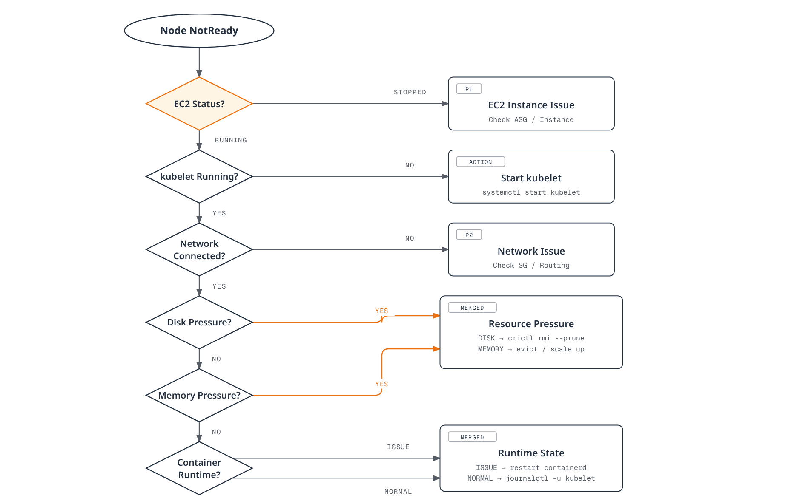

# EKS Advanced Debugging and Incident Response

> **Supported Versions**: EKS 1.28+, kubectl 1.28+
> **Last Updated**: September 9, 2026

For stable operation of Amazon EKS clusters, a systematic incident response framework and advanced debugging skills are essential. This document provides a practical guide for quickly diagnosing and resolving complex issues that occur in production environments.

## Table of Contents

1. [Incident Response Framework](#1-incident-response-framework)
2. [Control Plane Debugging](#2-control-plane-debugging)
3. [Node-Level Troubleshooting](#3-node-level-troubleshooting)
4. [Workload Debugging](#4-workload-debugging)
5. [Networking Diagnostics](#5-networking-diagnostics)
6. [Storage Troubleshooting](#6-storage-troubleshooting)
7. [Observability Architecture](#7-observability-architecture)
8. [Failure Detection Architecture](#8-failure-detection-architecture)
9. [Quick Reference](#9-quick-reference)
10. [Next Steps](#10-next-steps)

---

## 1. Incident Response Framework

### First 5-Minute Checklist (Initial Triage)

Treat the original 30-second steps, two-minute scope check and five-minute total as planning targets, not measured completion times. First establish the customer impact and the exact account, cluster/context, namespace and recent change. An unavailable API client can reflect credentials, authorization, DNS/network or control-plane issues; it does not alone prove that all running applications are down.

Inspect node conditions, Pod/container state, controller rollout status, recent events and resource samples together. `phase!=Running` misses Running-but-NotReady/CrashLooping Pods and includes successfully completed Jobs. A Pod's Running phase does not prove readiness. For Deployments compare desired, updated, ready/available replicas and observed generation, rather than grepping display strings such as `1/1`.

The standard VPC CNI `aws-node` DaemonSet normally runs in `kube-system`; a namespace named `amazon-vpc-cni-system` is not an EKS prerequisite. Pure Auto Mode manages networking and node-system DNS differently, so absence of standard add-on Pods must be interpreted against the node/controller mode. Metrics Server data is a sampled resource view, not a customer-availability signal.

### Initial Diagnostic Script

This script performs bounded API requests and saves private evidence for one selected workload namespace plus cluster nodes/system Pod status. It does not collect Secret data or dump every Pod environment/configuration. Logs, events and error messages can still contain sensitive application data: inspect/redact evidence before sharing it. Review the account/context inputs and existing private evidence directory before running.

```bash
set -euo pipefail
: "${AWS_REGION:?Set the intended Region}"
: "${CLUSTER_NAME:?Set the existing cluster name}"
: "${EXPECTED_ACCOUNT_ID:?Set the intended account ID}"
: "${KUBE_CONTEXT:?Set the explicit kubectl context}"
: "${NAMESPACE:?Set the owned workload namespace}"
: "${EVIDENCE_PARENT:?Set an existing private evidence directory}"
test -d "$EVIDENCE_PARENT"
ACTUAL_ACCOUNT_ID=$(aws sts get-caller-identity --query Account --output text)
test "$ACTUAL_ACCOUNT_ID" = "$EXPECTED_ACCOUNT_ID" || { echo "Account mismatch" >&2; exit 1; }
CLUSTER_ENDPOINT=$(aws eks describe-cluster --name "$CLUSTER_NAME" --region "$AWS_REGION" \
  --query cluster.endpoint --output text)
KUBE_ENDPOINT=$(kubectl config view --context "$KUBE_CONTEXT" --minify \
  -o jsonpath='{.clusters[0].cluster.server}')
test "$CLUSTER_ENDPOINT" = "$KUBE_ENDPOINT" || { echo "Context/cluster mismatch" >&2; exit 1; }

umask 077
TRIAGE_DIR=$(mktemp -d "$EVIDENCE_PARENT/eks-triage.XXXXXXXX")
TRIAGE_FAILED=0
k() { kubectl --context "$KUBE_CONTEXT" --request-timeout=15s "$@"; }
collect() {
  local name=$1
  shift
  if "$@" > "$TRIAGE_DIR/$name.txt" 2> "$TRIAGE_DIR/$name.stderr"; then
    printf '%s\tok\n' "$name" >> "$TRIAGE_DIR/status.tsv"
  else
    local rc=$?
    TRIAGE_FAILED=$((TRIAGE_FAILED + 1))
    printf '%s\tfailed:%s\n' "$name" "$rc" >> "$TRIAGE_DIR/status.tsv"
  fi
}
node_health() {
  k get nodes -o json | jq '[.items[] | {
    name:.metadata.name,uid:.metadata.uid,providerID:.spec.providerID,
    unschedulable:.spec.unschedulable,taints:.spec.taints,conditions:.status.conditions
  }]'
}
pod_health() {
  k -n "$NAMESPACE" get pods -o json | jq '[.items[] | {
    name:.metadata.name,uid:.metadata.uid,node:.spec.nodeName,owners:.metadata.ownerReferences,
    deleting:.metadata.deletionTimestamp,phase:.status.phase,conditions:.status.conditions,
    containers:[.status.containerStatuses[]? | {name,ready,restartCount,state,lastState}],
    initContainers:[.status.initContainerStatuses[]? | {name,ready,restartCount,state,lastState}]
  }]'
}
deployment_health() {
  k -n "$NAMESPACE" get deployments -o json | jq '[.items[] | {
    name:.metadata.name,generation:.metadata.generation,observed:.status.observedGeneration,
    desired:(.spec.replicas // 1),updated:(.status.updatedReplicas // 0),
    ready:(.status.readyReplicas // 0),available:(.status.availableReplicas // 0),
    conditions:.status.conditions
  }]'
}
load_balancers() {
  k -n "$NAMESPACE" get services -o json | jq '[.items[] | select(.spec.type=="LoadBalancer") | {
    name:.metadata.name,class:.spec.loadBalancerClass,selector:.spec.selector,
    ports:.spec.ports,status:.status.loadBalancer
  }]'
}
collect nodes node_health
collect pods pod_health
collect deployments deployment_health
collect load-balancers load_balancers
collect events k -n "$NAMESPACE" get events --sort-by='.metadata.creationTimestamp'
collect system-pods k -n kube-system get pods -o wide
collect node-resources k top nodes
collect pod-resources k -n "$NAMESPACE" top pods --sort-by=memory
printf 'Private evidence: %s; failed collections: %s\n' "$TRIAGE_DIR" "$TRIAGE_FAILED"
test "$TRIAGE_FAILED" -eq 0
```

Inspect `status.tsv` and each failure output. Missing permissions, unavailable metrics and API timeouts remain failed collections; the script exits nonzero if any collection failed and does not claim the incident is resolved. It deliberately leaves completed, pending and Running Pod states visible for interpretation. Selective follow-up logs should use an exact namespace, Pod UID and container, with a bounded time/line range.

The LoadBalancer list filters the Service JSON locally: `spec.type` is not a supported built-in Service field selector. No broad `cluster-info dump`, automatic archive upload, resource restart or deletion is part of this initial collection.

### Severity Matrix

| Severity | Classification | Impact Scope | Response Time | Examples |
|----------|---------------|--------------|---------------|----------|
| **P1** | Critical | Complete service outage | Within 15 minutes | Control plane failure, all nodes NotReady |
| **P2** | High | Major functionality failure | Within 1 hour | Specific workload complete failure, network connectivity issues |
| **P3** | Medium | Partial impact | Within 4 hours | Some pod restarts, performance degradation |
| **P4** | Low | Minor issues | Within 24 hours | Log collection delay, non-critical monitoring alerts |

Response times in this severity table are example organizational targets. Classify actual customer impact; a control-plane-only outage can leave existing workload traffic running.

### Decision Tree for Rapid Problem Identification

<!-- Content audit: diagram prose needs parent repair; see eks-advanced-debugging/diagram-review.json.


[🔍 View interactive diagram](https://www.atomai.click/kubernetes-docs/archmaps/en-eks-11-eks-advanced-debugging-0.html)
-->

---

## 2. Control Plane Debugging

### EKS Control Plane Log Types

EKS offers five control-plane log types. They are sent to the regional CloudWatch log group only when enabled; enabling logging does not reconstruct missing historical logs. Scope log access and retention and account for CloudWatch ingestion/storage/query charges. A missing group/stream can reflect disabled logging, no delivered data, the wrong region or denied access—not necessarily a control-plane failure.

| Type | Evidence |
| --- | --- |
| api | API server operation and error messages |
| audit | API request identity, verb, resource and response status |
| authenticator | IAM-to-Kubernetes authentication evidence |
| controllerManager | Controller reconciliation messages |
| scheduler | Scheduling decisions/errors |

```bash
set -euo pipefail
: "${AWS_REGION:?}"; : "${CLUSTER_NAME:?}"
LOG_GROUP="/aws/eks/$CLUSTER_NAME/cluster"
aws eks describe-cluster --region "$AWS_REGION" --name "$CLUSTER_NAME" \
  --query 'cluster.{ARN:arn,Status:status,Logging:logging}'
aws logs describe-log-streams --region "$AWS_REGION" --log-group-name "$LOG_GROUP" \
  --order-by LastEventTime --descending --max-items 10 \
  --query 'logStreams[].{Name:logStreamName,LastEvent:lastEventTimestamp}'
```
```bash
# MUTATION: review cost, retention, access and available subnet IPs first.
set -euo pipefail
UPDATE_ID=$(aws eks update-cluster-config --region "$AWS_REGION" --name "$CLUSTER_NAME" \
  --logging '{"clusterLogging":[{"types":["api","audit","authenticator","controllerManager","scheduler"],"enabled":true}]}' \
  --query update.id --output text)
test -n "$UPDATE_ID" && test "$UPDATE_ID" != None
aws eks describe-update --region "$AWS_REGION" --name "$CLUSTER_NAME" \
  --update-id "$UPDATE_ID" --query update
```
The change is asynchronous. Track the returned update ID until Successful; Failed/Cancelled or a client timeout is not success. Then verify describe-cluster and new log delivery. Cluster ACTIVE alone does not identify completion of this update. The update can require up to five available IPs in each configured cluster subnet; review the current EKS logging prerequisites.

### CloudWatch Logs Insights Queries

Run each block as a **separate Logs Insights QL query**, not as Bash or SQL. Select the exact log group and time window in the console or StartQuery request. These use EKS JSON audit fields when discovered by CloudWatch; inspect representative records and nested-log parsing if your pipeline changes the format. A query matching no events does not prove that the service was healthy or that logs were delivered.

#### API error messages

```text
fields @timestamp, @message
| filter @logStream like /kube-apiserver/ and @logStream not like /audit/
| filter @message like /error|Error|ERROR/
| sort @timestamp desc
| limit 100
```

#### Error counts within the selected time window

```text
fields @timestamp, @message
| filter @logStream like /kube-apiserver/ and @logStream not like /audit/
| filter @message like /error|Error|ERROR/
| stats count(*) as error_count by bin(5m)
```

#### Authenticator messages requiring inspection

```text
fields @timestamp, @message
| filter @logStream like /authenticator/
| filter @message like /access denied|Unauthorized|unauthorized/
| sort @timestamp desc
| limit 50
```

#### Structured audit authentication/authorization denials

```text
fields @timestamp, user.username, verb, objectRef.resource, objectRef.namespace, responseStatus.code
| filter @logStream like /kube-apiserver-audit/
| filter responseStatus.code in [401, 403]
| sort @timestamp desc
| limit 100
```

#### Structured audit activity for one reviewed identity

```text
fields @timestamp, user.username, verb, objectRef.resource, objectRef.namespace, responseStatus.code
| filter @logStream like /kube-apiserver-audit/
| filter user.username = "REPLACE_WITH_OBSERVED_KUBERNETES_USERNAME"
| sort @timestamp desc
| limit 50
```

#### Audit 429 events by identity and resource

```text
fields user.username, verb, objectRef.resource, responseStatus.code
| filter @logStream like /kube-apiserver-audit/
| filter responseStatus.code = 429
| stats count(*) as request_count by user.username, verb, objectRef.resource
| sort request_count desc
| limit 50
```

#### API request volume, not necessarily throttling

```text
fields user.username, verb, objectRef.resource
| filter @logStream like /kube-apiserver-audit/
| stats count(*) as request_count by user.username, verb, objectRef.resource
| sort request_count desc
| limit 50
```

Audit 401/403 distinguishes request-level denials from authenticator-message searches. A count of API calls is not a count of throttled calls, and an aggregated time-bin result no longer has each event’s @timestamp to sort by. StartQuery returns a query ID: poll GetQueryResults to Complete and preserve Failed/Cancelled/Timeout/missing-data states. The [monitoring chapter](06-eks-monitoring-logging.md) includes the bounded query/polling workflow. No live CloudWatch query was run in this audit.

[EKS control-plane logging](https://docs.aws.amazon.com/eks/latest/userguide/control-plane-logs.html) · [AWS audit-field examples](https://docs.aws.amazon.com/eks/latest/best-practices/auditing-and-logging.html)

### IAM Authentication Troubleshooting

Run the account/context guard from the initial triage first. Distinguish the human/automation IAM identity used by kubectl, node bootstrap identity, and the AWS identity used inside an application Pod. Successful token generation is not proof of Kubernetes authentication or authorization.

The EKS IAM token beginning k8s-aws-v1 is a base64url-encoded presigned STS request, **not a three-part JWT**. Do not decode/print it as JSON or paste it into logs. Kubernetes projected ServiceAccount tokens are a different JWT credential.

```bash
set -euo pipefail
: "${AWS_REGION:?}"; : "${CLUSTER_NAME:?}"; : "${KUBE_CONTEXT:?}"; : "${NAMESPACE:?}"
aws sts get-caller-identity
aws eks describe-cluster --region "$AWS_REGION" --name "$CLUSTER_NAME" \
  --query 'cluster.{ARN:arn,AuthenticationMode:accessConfig.authenticationMode}'
# Print only the credential expiry, not the bearer token.
aws eks get-token --region "$AWS_REGION" --cluster-name "$CLUSTER_NAME" \
  --query status.expirationTimestamp --output text
kubectl --context "$KUBE_CONTEXT" auth whoami
kubectl --context "$KUBE_CONTEXT" -n "$NAMESPACE" auth can-i get pods
```
AuthenticationMode determines where to inspect access. In API/API_AND_CONFIG_MAP mode, inspect the principal’s access entry, associated policy scope and RBAC bindings; in CONFIG_MAP mode inspect the existing legacy mapping. Do not switch authentication mode or replace aws-auth to fix an unclassified 401/403. Access-mode migration has its own prerequisites and irreversible transitions. IAM role paths and STS session ARNs must not be guessed from string substitutions.

```bash
# Run for API or API_AND_CONFIG_MAP authentication mode.
aws eks list-access-entries --region "$AWS_REGION" --cluster-name "$CLUSTER_NAME"
: "${PRINCIPAL_ARN:?Use a reviewed IAM role/user ARN, not an STS assumed-role session ARN}"
aws eks describe-access-entry --region "$AWS_REGION" --cluster-name "$CLUSTER_NAME" \
  --principal-arn "$PRINCIPAL_ARN"
aws eks list-associated-access-policies --region "$AWS_REGION" --cluster-name "$CLUSTER_NAME" \
  --principal-arn "$PRINCIPAL_ARN"
```
```bash
# Read-only legacy mapping inspection for CONFIG_MAP/API_AND_CONFIG_MAP clusters.
kubectl --context "$KUBE_CONTEXT" -n kube-system get configmap aws-auth -o yaml
```
Preserve existing node bootstrap mappings. A group name alone grants no permissions without the relevant binding; use reviewed least-privilege access rather than adding system:masters as a diagnostic step. A 403 indicates an authorization denial, while a 401 can indicate invalid/expired credentials. Network/TLS failures are separate evidence.

### IRSA Troubleshooting

IRSA needs the correct OIDC issuer/provider, role trust policy matching the namespace/ServiceAccount subject and sts.amazonaws.com audience, and a workload SDK that uses and refreshes web-identity credentials. The annotation below is only one part of that configuration. Its namespace/role are placeholders; no role, provider or bucket permission is created by this YAML.

```yaml
apiVersion: v1
kind: ServiceAccount
metadata:
  name: s3-access-sa
  namespace: diagnostics-example
  annotations:
    eks.amazonaws.com/role-arn: arn:aws:iam::123456789012:role/owned-s3-access-role
```
```bash
set -euo pipefail
: "${SERVICE_ACCOUNT:?Set the actual ServiceAccount on the Pod}"
: "${POD_NAME:?Set an owned Pod}"; : "${CONTAINER_NAME:?Set its application container}"
: "${IRSA_ROLE_NAME:?Set the reviewed IAM role name}"
kubectl --context "$KUBE_CONTEXT" -n "$NAMESPACE" get serviceaccount "$SERVICE_ACCOUNT" \
  -o jsonpath='{.metadata.annotations.eks\.amazonaws\.com/role-arn}{"\n"}'
aws eks describe-cluster --name "$CLUSTER_NAME" --region "$AWS_REGION" \
  --query cluster.identity.oidc.issuer --output text
aws iam get-role --role-name "$IRSA_ROLE_NAME" --query Role.AssumeRolePolicyDocument
kubectl --context "$KUBE_CONTEXT" -n "$NAMESPACE" get pod "$POD_NAME" -o json | jq '{
  uid:.metadata.uid,serviceAccount:.spec.serviceAccountName,
  envNames:[.spec.containers[] | {name,envNames:[.env[]?.name]}],
  projectedVolumes:[.spec.volumes[]? | select(.projected) | {name,projected}]
}'
```
Inspect environment **names**, token-file path/mount metadata and the SDK credential chain without printing secret values or token bytes. Static credentials or another provider earlier in the SDK chain can override the intended identity. Use the actual application container; a newly created debug Pod or container can have different identity/configuration.

```bash
# Optional read-only identity request, only if AWS CLI is already in this container.
kubectl --context "$KUBE_CONTEXT" -n "$NAMESPACE" exec "$POD_NAME" -c "$CONTAINER_NAME" \
  -- aws sts get-caller-identity
```
An STS identity response identifies the role in use; it does not prove authorization to list all buckets or access a particular object. Do not run aws s3 ls across the account merely to test identity.

### Pod Identity Troubleshooting

```bash
aws eks list-pod-identity-associations --region "$AWS_REGION" \
  --cluster-name "$CLUSTER_NAME" --namespace "$NAMESPACE" --service-account "$SERVICE_ACCOUNT"
: "${ASSOCIATION_ID:?Use the exact matching association ID}"
aws eks describe-pod-identity-association --region "$AWS_REGION" \
  --cluster-name "$CLUSTER_NAME" --association-id "$ASSOCIATION_ID"
# Standard EC2-node setup only; Auto Mode provides the integration itself.
kubectl --context "$KUBE_CONTEXT" -n kube-system get pods \
  -l app.kubernetes.io/name=eks-pod-identity-agent
```
Check the association, role trust/permissions, supported SDK credential provider and agent/node reachability. Auto Mode has built-in support and does not require installing a duplicate agent; Fargate does not support EKS Pod Identity. Keep association creation/change separate from these diagnostics. IRSA and Pod Identity have different token audiences and credential delivery paths; the operator’s AWS CLI identity is neither by default.

### ServiceAccount Token Lifetime and Rotation

There is no universal “maximum 24 hours” for projected tokens: requested duration and the API server’s configured limit are distinct. Kubelet requests rotation when a token is older than 80% of its TTL or older than 24 hours, and the application must reload the rotated file. EKS documents a 90-day compatibility extension for its Kubernetes API ServiceAccount-token migration and stale-token audit annotations; that is not a safe cache duration or a lifetime promise for IRSA, Pod Identity or arbitrary relying parties.

The following example requests a one-hour custom token for an STS audience. It does not extend the default API token or automatically configure IRSA. The existing namespace/ServiceAccount, reviewed image, role trust and application SDK/token-file configuration must be prepared separately. An STS-audience token must not be assumed valid for the Kubernetes API.

```yaml
apiVersion: v1
kind: Pod
metadata:
  name: audience-token-example
  namespace: diagnostics-example
spec:
  serviceAccountName: owned-app
  automountServiceAccountToken: false
  containers:
  - name: app
    image: registry.example.com/owned/app:replace-with-reviewed-digest
    volumeMounts:
    - name: token
      mountPath: /var/run/secrets/tokens
      readOnly: true
  volumes:
  - name: token
    projected:
      sources:
      - serviceAccountToken:
          path: token
          expirationSeconds: 3600
          audience: sts.amazonaws.com
```
[EKS access entries](https://docs.aws.amazon.com/eks/latest/userguide/access-entries.html) · [EKS token migration/rotation](https://docs.aws.amazon.com/eks/latest/userguide/service-accounts.html) · [Kubernetes projected tokens](https://kubernetes.io/docs/tasks/configure-pod-container/configure-service-account/) · [IRSA](https://docs.aws.amazon.com/eks/latest/userguide/iam-roles-for-service-accounts.html) · [Pod Identity](https://docs.aws.amazon.com/eks/latest/userguide/pod-identities.html)

### EKS Add-on Error Patterns

Read the installed version, ownership, configuration/identity settings and health.issues before changing an add-on. ACTIVE is an add-on status, not proof of all customer traffic working; DEGRADED denotes health issues and does not merely mean slower performance. CREATE_FAILED/UPDATE_FAILED/DELETE_FAILED require the actual issue details. An absent standard add-on can be expected for features managed by Auto Mode.

```bash
set -euo pipefail
: "${AWS_REGION:?}"; : "${CLUSTER_NAME:?}"; : "${ADDON_NAME:?Set the existing owned add-on}"
aws eks describe-addon --region "$AWS_REGION" --cluster-name "$CLUSTER_NAME" \
  --addon-name "$ADDON_NAME" \
  --query 'addon.{Version:addonVersion,Status:status,Issues:health.issues,Configuration:configurationValues,Role:serviceAccountRoleArn,PodIdentity:podIdentityAssociations}'
CLUSTER_VERSION=$(aws eks describe-cluster --region "$AWS_REGION" --name "$CLUSTER_NAME" \
  --query cluster.version --output text)
aws eks describe-addon-versions --region "$AWS_REGION" --addon-name "$ADDON_NAME" \
  --kubernetes-version "$CLUSTER_VERSION" \
  --query 'addons[].addonVersions[].{Version:addonVersion,Architectures:architecture,ComputeTypes:computeTypes,Compatibility:compatibilities}'
```
Do not treat the first version in the response as “latest” or automatically compatible with every node type. Review architecture, compute type, default-version markers, configuration schema, IAM/Pod Identity and the component’s migration sequence. Configuration output may be sensitive; keep it private. A version update is an intentional change, not an initial diagnostic.

```bash
# MUTATION: use a reviewed compatible version and configuration/identity plan.
set -euo pipefail
: "${REVIEWED_ADDON_VERSION:?Choose from the compatible versions after review}"
: "${REVIEWED_ADDON_CONFIG:?Set the path to the reviewed JSON configuration file}"
test -f "$REVIEWED_ADDON_CONFIG"
aws eks describe-addon-configuration --region "$AWS_REGION" --addon-name "$ADDON_NAME" \
  --addon-version "$REVIEWED_ADDON_VERSION" --query configurationSchema --output text
# The configuration file must be checked against this version's schema before this request.
UPDATE_ID=$(aws eks update-addon --region "$AWS_REGION" --cluster-name "$CLUSTER_NAME" \
  --addon-name "$ADDON_NAME" --addon-version "$REVIEWED_ADDON_VERSION" \
  --configuration-values "file://$REVIEWED_ADDON_CONFIG" \
  --resolve-conflicts PRESERVE --query update.id --output text)
test -n "$UPDATE_ID" && test "$UPDATE_ID" != None
aws eks describe-update --region "$AWS_REGION" --name "$CLUSTER_NAME" \
  --addon-name "$ADDON_NAME" --update-id "$UPDATE_ID" --query update
```
PRESERVE asks EKS to retain existing custom settings when resolving conflicts; it is not a backup or a guarantee that arbitrary old settings work with the new release. OVERWRITE can reset conflicting customization and must be separately reviewed. Follow this exact update ID to completion, inspect update errors and verify resulting add-on health. Review configurationValues and identity changes explicitly instead of silently omitting or overwriting them.

[Update an EKS add-on](https://docs.aws.amazon.com/eks/latest/userguide/updating-an-add-on.html)

---

## 3. Node-Level Troubleshooting

<a id="node-join-diagnosis"></a>

### Node Join Failure Diagnosis

These are hypotheses to test against the instance/NodeClaim, bootstrap logs, endpoint reachability and authentication mode—not eight guaranteed root causes.

| Area | What to verify |
| --- | --- |
| Bootstrap and AMI | Correct cluster name/endpoint/CA, OS-specific bootstrap, architecture and compatible kubelet/AMI; not a universal exact-version-equality rule |
| Network/security | Node→API TCP 443, API→kubelet TCP 10250, DNS and workload-specific paths; validate direction, security-group membership and routing |
| VPC DNS | DNS support/hostnames, DHCP resolver/domain configuration and the endpoint actually used |
| Identity | Node IAM role and Kubernetes node access entry/legacy mapping, using a role ARN rather than an instance-profile ARN |
| Ownership/discovery tags | Provisioner-specific node ownership tags; do not confuse them with subnet tags for load-balancer discovery |
| Private access | Required EKS/ECR/S3/STS and other service paths via reviewed endpoints or egress; a NAT gateway is not mandatory in every private-cluster design |
| Launch configuration | Correct role/profile handling for the actual provisioner, launch-template version, capacity and subnet IP availability |
| Initialization | Inspect nodeadm/cloud-init/bootstrap evidence appropriate to the selected AMI; paths are not universal across AL2023, Bottlerocket, Windows or Auto Mode |

```bash
set -euo pipefail
: "${KUBE_CONTEXT:?}"; : "${NODE_NAME:?Set the exact owned node name}"
NODE_JSON=$(kubectl --context "$KUBE_CONTEXT" get node "$NODE_NAME" -o json)
printf '%s\n' "$NODE_JSON" | jq '{
  name:.metadata.name,uid:.metadata.uid,providerID:.spec.providerID,
  os:.status.nodeInfo.osImage,kernel:.status.nodeInfo.kernelVersion,
  kubelet:.status.nodeInfo.kubeletVersion,runtime:.status.nodeInfo.containerRuntimeVersion,
  labels:.metadata.labels,taints:.spec.taints,conditions:.status.conditions
}'
NODE_UID=$(printf '%s\n' "$NODE_JSON" | jq -er '.metadata.uid')
kubectl --context "$KUBE_CONTEXT" get events -A \
  --field-selector "involvedObject.uid=$NODE_UID" --sort-by='.metadata.creationTimestamp'
```
```bash
# EC2-backed nodes only: map the Node providerID to an inspected instance ID/Region.
: "${AWS_REGION:?}"; : "${INSTANCE_ID:?Use the verified EC2 ID, not a guessed node-name conversion}"
aws ec2 describe-instances --region "$AWS_REGION" --instance-ids "$INSTANCE_ID" \
  --query 'Reservations[].Instances[].{ID:InstanceId,State:State.Name,AZ:Placement.AvailabilityZone,Subnet:SubnetId,Profile:IamInstanceProfile,Groups:SecurityGroups,Image:ImageId}'
aws ec2 describe-instance-status --region "$AWS_REGION" --instance-ids "$INSTANCE_ID" \
  --include-all-instances
```
A not-yet-registered instance has no Node object: use the owned managed-node-group/NodeClaim/instance evidence instead. Ready=False and missing heartbeats leading to Ready=Unknown require different evidence. Node pressure can coexist with Ready; do not infer its cause from one display string. New Auto Mode EC2 managed instances can be hidden from generic EC2 list views by default; direct instance-ID queries or explicitly including managed resources are different from changing account-wide visibility settings.

### NotReady Node Decision Tree

<!-- Content audit: diagram prose needs parent repair; see eks-advanced-debugging/diagram-review.json.


[🔍 View interactive diagram](https://www.atomai.click/kubernetes-docs/archmaps/en-eks-11-eks-advanced-debugging-1.html)
-->

### Host and Managed-Node Diagnostics

For customer-accessible Linux nodes, SSM requires the node agent, role/network prerequisites and authorized access to that exact instance. It opens a session. EKS Auto Mode managed instances do not support direct SSH access; use its documented NodeDiagnostic/console-output path or the supported kubectl debug node workflow. The current Auto Mode guide explicitly supports an **explicit sysadmin debug profile** for live logs; this is a privileged Pod creation, not an SSH session or a default debug privilege. NodeDiagnostic collection can upload sensitive logs/captures to S3 and needs its own reviewed scope/storage permissions.

```bash
# Interactive host access: an operational session, not an automatic triage step.
: "${AWS_REGION:?}"; : "${INSTANCE_ID:?Use the reviewed self-managed or managed-node-group instance}"
aws ssm start-session --region "$AWS_REGION" --target "$INSTANCE_ID"
```
```bash
# Read-only Linux/systemd host checks after authorized access.
sudo systemctl show kubelet containerd --no-pager \
  -p Id -p LoadState -p ActiveState -p SubState -p ExecMainStatus
sudo journalctl -u kubelet --since "15 minutes ago" -n 200 --no-pager
sudo journalctl -u containerd --since "15 minutes ago" -n 100 --no-pager
sudo crictl info
sudo crictl ps
sudo crictl ps -a
sudo crictl images
df -h
df -i
sudo journalctl --disk-usage
```
```bash
# Exact container ID only; log content may be sensitive.
: "${CONTAINER_ID:?Use an inspected CRI container ID}"
sudo crictl logs --tail=100 "$CONTAINER_ID"
```
These systemd/CRI commands assume those components/tools exist on the selected host. Configure the correct CRI endpoint for crictl. Use bounded journal reads; journalctl -f piped into tail may never finish. Avoid printing kubeconfig/client keys or indiscriminately deleting logs, exited containers or image caches. They can contain needed evidence or be managed by kubelet garbage collection. A restart, drain, replacement or retention change requires a diagnosed condition and a separate reviewed recovery step.

### Resource Pressure

DiskPressure concerns available bytes/inodes and configured eviction thresholds, not only df capacity. Inspect both df -h and df -i, mount identity and kubelet events. If retention cleanup is approved, the old journalctl --vacuum-size=500M value is only an example policy; collect required evidence first and do not delete /var/log globs. MemoryPressure and a container OOM are distinct signals: correlate memory limits, node availability, working set, logs and pressure metrics. Increasing a limit or adding a node does not prove the root cause is fixed.

```bash
# Read-only host evidence, not remediation.
free -h
awk '/MemTotal|MemFree|MemAvailable|Buffers|Cached/ {print}' /proc/meminfo
cat /proc/sys/kernel/pid_max
cat /proc/sys/kernel/threads-max
ps -eLf --no-headers | wc -l
ps -eo pid,comm,nlwp --sort=-nlwp | head -20
if [ -r /proc/pressure/memory ]; then cat /proc/pressure/memory; fi
if [ -r /proc/pressure/cpu ]; then cat /proc/pressure/cpu; fi
```
The process directory count is not a count of all threads/tasks. ps NLWP and kernel limits are clues; kubelet PID-pressure calculations and cgroup PID limits require their own interpretation. Do not label a generic high-memory percentage as the Kubernetes MemoryPressure condition. Treat missing metrics as unavailable evidence.

### Karpenter Provisioning Issues

```bash
# Self-managed Karpenter; use the actual release namespace and selected objects.
: "${KARPENTER_NAMESPACE:?Set the existing controller namespace}"
: "${NODEPOOL_NAME:?}"; : "${NODECLAIM_NAME:?}"
kubectl --context "$KUBE_CONTEXT" -n "$KARPENTER_NAMESPACE" logs \
  -l app.kubernetes.io/name=karpenter -c controller --since=15m --tail=200 --prefix
kubectl --context "$KUBE_CONTEXT" get nodepool "$NODEPOOL_NAME" -o yaml
kubectl --context "$KUBE_CONTEXT" get nodeclaim "$NODECLAIM_NAME" -o yaml
kubectl --context "$KUBE_CONTEXT" get events -A \
  --field-selector "involvedObject.name=$NODECLAIM_NAME" --sort-by='.metadata.creationTimestamp'
```
Inspect NodePool/NodeClass readiness, NodeClaim conditions/events, constraints, limits, subnet IPs, IAM and EC2 capacity. For Auto Mode, use the included controller’s NodeClaim/NodeClass/events and audit-log evidence; do not expect a self-managed karpenter Deployment/namespace. The following self-managed Karpenter v1 schema pattern is illustrative and requires a compatible release and a reviewed existing EC2NodeClass. It is not a command to replace the cluster’s default pool. CPU/memory limits are ceilings, not reserved capacity; the capacity-type list does not prove Spot-only behavior or AZ balance.

```yaml
apiVersion: karpenter.sh/v1
kind: NodePool
metadata:
  name: reviewed-capacity-example
spec:
  template:
    spec:
      requirements:
      - key: kubernetes.io/arch
        operator: In
        values:
        - amd64
      - key: karpenter.sh/capacity-type
        operator: In
        values:
        - spot
        - on-demand
      - key: karpenter.k8s.aws/instance-category
        operator: In
        values:
        - c
        - m
        - r
      nodeClassRef:
        group: karpenter.k8s.aws
        kind: EC2NodeClass
        name: reviewed-existing-class
  limits:
    cpu: 1000
    memory: 1000Gi
  disruption:
    consolidationPolicy: WhenEmptyOrUnderutilized
    consolidateAfter: 30s
```
### Managed Node Group Error Codes

| Issue | Meaning and evidence |
| --- | --- |
| AccessDenied | Kubernetes API authentication/authorization failure; inspect node access and EKS node-manager RBAC as well as IAM |
| AsgInstanceLaunchFailures | ASG launch failure; inspect the actual activity message, template, capacity and permissions |
| ClusterUnreachable | Kubernetes API connectivity or request-processing timeouts, not automatically a missing VPC endpoint |
| InsufficientFreeAddresses | Selected node subnets lack available IPs; existing subnet IPv4 CIDR cannot be expanded in place |
| NodeCreationFailure | Launched instances failed to register; bootstrap, access and required network paths are common checks |

```bash
set -euo pipefail
: "${AWS_REGION:?}"; : "${CLUSTER_NAME:?}"; : "${NODEGROUP_NAME:?Set the exact managed node group}"
aws eks describe-nodegroup --region "$AWS_REGION" --cluster-name "$CLUSTER_NAME" \
  --nodegroup-name "$NODEGROUP_NAME" \
  --query 'nodegroup.{Status:status,Issues:health.issues,Version:version,Release:releaseVersion,Subnets:subnets,Role:nodeRole,LaunchTemplate:launchTemplate,Repair:nodeRepairConfig}'
# For a Kubernetes authorization issue, inspect rather than blindly replace EKS-managed RBAC.
kubectl --context "$KUBE_CONTEXT" get clusterrole eks:node-manager -o yaml
kubectl --context "$KUBE_CONTEXT" get clusterrolebinding eks:node-manager -o yaml
```
Use each issue’s message/resourceIds and the current AWS repair procedure. The troubleshooting guide describes NodeCreationFailure after managed nodes fail to join within 15 minutes; this is not a guarantee that every boot completes within that time. If subnets need more space, plan new address space/subnets and the provisioner-specific migration instead of editing an existing CIDR. EKS-managed RBAC shapes can evolve: do not paste an old replacement ClusterRole merely because AccessDenied appeared. Node repair/eviction is separate from inspection and must account for workloads, budgets, data and the active node-management mode.

[EKS troubleshooting](https://docs.aws.amazon.com/eks/latest/userguide/troubleshooting.html) · [Auto Mode diagnostic paths](https://docs.aws.amazon.com/eks/latest/userguide/auto-troubleshoot.html) · [Security group paths](https://docs.aws.amazon.com/eks/latest/userguide/sec-group-reqs.html) · [Private clusters](https://docs.aws.amazon.com/eks/latest/userguide/private-clusters.html) · [Karpenter compatibility](https://karpenter.sh/docs/upgrading/compatibility/)

### Node Readiness Controller (Staged Boot Verification)

The Kubernetes SIGs Node Readiness Controller is a real out-of-band controller. The reviewed v0.5.0 release uses the cluster-scoped `readiness.node.x-k8s.io/v1alpha1` `NodeReadinessRule`; it is not a built-in EKS ConfigMap processor or a GA field on the Node API.

The controller reads Node conditions and manages taints. It does **not** execute arbitrary `checks[].probe.exec` entries in a ConfigMap. The original file-existence/containerd checks need a separately implemented, authorized reporter or NPD custom monitor that publishes the corresponding conditions. A CNI configuration file existing does not by itself prove CNI readiness. The project's bundled reporter polls an HTTP endpoint using `CHECK_ENDPOINT`, `CONDITION_TYPE` and `NODE_NAME`; its configuration is not the former exec-probe format.

This rule is an explicit test-scope **taint preview**. Applying it still creates a cluster resource and the controller updates status, but `dryRun: true` does not add/remove node taints. The example condition names and node label are custom prerequisites, not labels/conditions automatically supplied by EKS.

```yaml
apiVersion: readiness.node.x-k8s.io/v1alpha1
kind: NodeReadinessRule
metadata:
  name: reviewed-bootstrap-readiness
spec:
  dryRun: true
  enforcementMode: bootstrap-only
  nodeSelector:
    matchLabels:
      audit.example.com/readiness-demo: 'true'
  conditions:
  - type: audit.example.com/CNIReady
    requiredStatus: 'True'
  - type: audit.example.com/ContainerRuntimeReady
    requiredStatus: 'True'
  taint:
    key: readiness.k8s.io/bootstrap-not-ready
    value: pending
    effect: NoSchedule
```

Inspect `status.dryRunResults`, `status.nodeEvaluations`, failed nodes and the actual selected Node conditions before enabling enforcement.

```bash
# Read-only: the controller and released CRD must already be installed.
: "${KUBE_CONTEXT:?Set the verified context}"
kubectl --context "$KUBE_CONTEXT" get nodereadinessrule reviewed-bootstrap-readiness -o yaml
kubectl --context "$KUBE_CONTEXT" get nodes \
  -l audit.example.com/readiness-demo=true -o json
```

For a bootstrap gate, register new nodes with the matching startup taint before scheduling can race the controller. The reporter and required system DaemonSets must tolerate that taint and be able to reach the API. When all requirements pass, bootstrap-only mode removes the taint and records completion; it does not reapply the gate if those conditions later fail. Continuous mode is a separate policy choice.

`NoSchedule` blocks new Pods that do not tolerate the taint; it does not evict existing Pods. Do not set `defaultStatus` on bootstrap-only rules: the release rejects that combination. Native CRD validation here does not prove reporter health, admission-webhook behavior or operation on every EKS node type. No node labels, taints, controllers or conditions were changed during this audit.

[Release v0.5.0](https://github.com/kubernetes-sigs/node-readiness-controller/releases/tag/v0.5.0) · [Enforcement and dry-run semantics](https://github.com/kubernetes-sigs/node-readiness-controller/blob/v0.5.0/docs/book/src/user-guide/concepts.md) · [Reporter configuration](https://github.com/kubernetes-sigs/node-readiness-controller/blob/v0.5.0/docs/book/src/reference/reporter-configuration.md)

---

## 4. Workload Debugging

### Pod and Container State

Pod phases are Pending, Running, Succeeded, Failed and Unknown. Container states are Waiting, Running and Terminated; ContainerCreating and CrashLoopBackOff are reasons/display information rather than extra Pod phases. Running is not equivalent to Ready. A restart policy can restart a container within a Pod; it does not turn a terminal Failed Pod back into Pending. A controller replacement is a new Pod with a new UID.

<!-- Content audit: diagram prose needs parent repair; see eks-advanced-debugging/diagram-review.json.


[🔍 View interactive diagram](https://www.atomai.click/kubernetes-docs/archmaps/en-eks-11-eks-advanced-debugging-2.html)
-->

```bash
set -euo pipefail
: "${KUBE_CONTEXT:?}"; : "${NAMESPACE:?}"; : "${POD_NAME:?}"; : "${CONTAINER_NAME:?}"
POD_JSON=$(kubectl --context "$KUBE_CONTEXT" -n "$NAMESPACE" get pod "$POD_NAME" -o json)
printf '%s\n' "$POD_JSON" | jq '{
  name:.metadata.name,uid:.metadata.uid,owners:.metadata.ownerReferences,node:.spec.nodeName,
  phase:.status.phase,reason:.status.reason,conditions:.status.conditions,
  containers:.status.containerStatuses,initContainers:.status.initContainerStatuses,
  ephemeralContainers:.status.ephemeralContainerStatuses
}'
POD_UID=$(printf '%s\n' "$POD_JSON" | jq -er '.metadata.uid')
kubectl --context "$KUBE_CONTEXT" -n "$NAMESPACE" get events \
  --field-selector "involvedObject.uid=$POD_UID" --sort-by='.metadata.creationTimestamp'
kubectl --context "$KUBE_CONTEXT" -n "$NAMESPACE" logs "$POD_NAME" -c "$CONTAINER_NAME" \
  --since=15m --tail=200
```
```bash
# Separate read: this can fail when no previous container log exists.
kubectl --context "$KUBE_CONTEXT" -n "$NAMESPACE" logs "$POD_NAME" -c "$CONTAINER_NAME" \
  --previous --tail=200
```
The previous log is for the most recent terminated instance of the selected container, not a complete restart history. Rotation or Pod deletion can make logs unavailable. Record Pod UID/time and check for replacement during collection; init/sidecar/ephemeral containers can have different failures. Logs and state messages can contain sensitive data, so keep collected evidence private. Do not print every environment variable or application config file as a diagnostic shortcut.

### kubectl debug: Three Different Operations

An ephemeral container modifies the existing Pod; --copy-to creates another Pod; node/ creates a diagnostic Pod on a node. All are mutations and need the relevant RBAC/admission permissions. In the checked kubectl 1.36.2, the default profile is general. It does not automatically mean privileged, and host namespace/filesystem access is distinct from privileged=true.

#### Ephemeral container

```bash
# MUTATION: adds a permanent-to-this-Pod-spec ephemeral-container entry.
: "${DEBUG_IMAGE:?Use a reviewed non-root diagnostic image with a compatible shell}"
: "${DEBUG_CONTAINER_NAME:?Choose an unused container name}"
kubectl --context "$KUBE_CONTEXT" -n "$NAMESPACE" debug "$POD_NAME" -it \
  --container="$DEBUG_CONTAINER_NAME" --target="$CONTAINER_NAME" \
  --image="$DEBUG_IMAGE" --profile=restricted -- sh
```
The restricted profile drops capabilities, prevents privilege escalation and requests non-root execution/RuntimeDefault seccomp. The image/user/shell must support this; an arbitrary root-only BusyBox image is not guaranteed to start. --target requests the target process namespace only if the runtime supports it. It does not copy the application’s filesystem/env or bypass permissions. Exiting ends the debug process, but the ephemeral-container entry cannot be removed from the existing Pod spec.

#### Pod copy

```bash
# MUTATION: copy only a reviewed reproduction Pod; inspect all side effects first.
: "${DEBUG_POD_NAME:?Choose a new owned Pod name in the same namespace}"
: "${DEBUG_IMAGE:?Use a reviewed diagnostic image that provides sleep}"
kubectl --context "$KUBE_CONTEXT" -n "$NAMESPACE" debug "$POD_NAME" \
  --copy-to="$DEBUG_POD_NAME" --container="$CONTAINER_NAME" --image="$DEBUG_IMAGE" \
  --keep-init-containers=false --keep-labels=false --keep-annotations=false \
  --share-processes=true --profile=general -- sleep 3600
```
The native CLI check confirmed that this replaces the selected container’s image/command and removes init containers, while retaining the ServiceAccount and enabling shared process namespace. Other regular containers, environment/Secret references and volumes can remain and execute or access the same data. A copy stays in the same namespace, can schedule on another node and is not an isolated data clone. Review admission mutation, side effects, identity, persistent volumes and cleanup before using it. General profile capabilities may be rejected by namespace policy; do not relax policy silently.

#### Node diagnostics

```bash
# MUTATION: privileged host diagnostic Pod, only where this access is authorized.
: "${NODE_NAME:?Use the exact reviewed Node}"
: "${NODE_DEBUG_IMAGE:?Use a reviewed image with nsenter}"
kubectl --context "$KUBE_CONTEXT" -n "$NAMESPACE" debug "node/$NODE_NAME" -it \
  --image="$NODE_DEBUG_IMAGE" --profile=sysadmin \
  -- nsenter -t 1 -m -- journalctl -u kubelet --since "15 minutes ago" -n 200 --no-pager
```
Node debug mounts the host root at /host and uses host namespaces; the explicit sysadmin profile adds privileged execution. This gives broad host access even when the chosen command only reads logs. The image must already contain the needed diagnostic tools. The Auto Mode user guide documents this path; ordinary SSH access remains unavailable there. Other OS/node classes require their supported access method. A new debug Pod cannot be assumed to start if kubelet/runtime/networking is broken.

Record the created debug Pod name/UID from the actual operation. Remove only that separate Pod after evidence review; do not delete the application Pod to “clean up” an ephemeral container.

```bash
# MUTATION: remove only the separately created debug Pod after checking its identity.
: "${DEBUG_POD_NAME:?}"; : "${EXPECTED_DEBUG_UID:?Use the UID recorded at creation}"
ACTUAL_DEBUG_UID=$(kubectl --context "$KUBE_CONTEXT" -n "$NAMESPACE" get pod "$DEBUG_POD_NAME" \
  -o jsonpath='{.metadata.uid}')
test "$ACTUAL_DEBUG_UID" = "$EXPECTED_DEBUG_UID" || { echo "Debug Pod changed; stop" >&2; exit 1; }
kubectl --context "$KUBE_CONTEXT" -n "$NAMESPACE" delete pod "$DEBUG_POD_NAME" --timeout=2m
```
The UID check is a safety check, not an atomic delete precondition; coordinate the operation so the name cannot be reused between check and delete. No debug containers, privileged workloads or node commands were run in this audit. The native CLI tests used only synthetic loopback API responses.

### Deployment Rollout Management

```bash
# Read-only rollout evidence.
: "${DEPLOYMENT_NAME:?Set the owned Deployment}"
kubectl --context "$KUBE_CONTEXT" -n "$NAMESPACE" rollout status \
  "deployment/$DEPLOYMENT_NAME" --timeout=2m
kubectl --context "$KUBE_CONTEXT" -n "$NAMESPACE" rollout history "deployment/$DEPLOYMENT_NAME"
```
```bash
# MUTATION: workload revision rollback, not database/PVC/control-plane rollback.
set -euo pipefail
: "${REVIEWED_REVISION:?Set an inspected compatible revision}"
[[ "$REVIEWED_REVISION" =~ ^[1-9][0-9]*$ ]]
kubectl --context "$KUBE_CONTEXT" -n "$NAMESPACE" rollout undo \
  "deployment/$DEPLOYMENT_NAME" --to-revision="$REVIEWED_REVISION"
kubectl --context "$KUBE_CONTEXT" -n "$NAMESPACE" rollout status \
  "deployment/$DEPLOYMENT_NAME" --timeout=5m
```
A timeout/failure is evidence to inspect, not success. Coordinate GitOps and other reconcilers; rollback does not restore a database or undo schema changes. Deployment pause/resume controls rollout progression, not HPA or all Pod creation. Rollout restart intentionally changes the Pod template and creates replacements even with the same image reference; an unpinned image can resolve differently. Use exact namespace/Deployment and a reviewed update plan rather than combining restart/undo/scale commands into triage.

### HPA/VPA Scaling Issues

```bash
# Read-only: use the actual scaler names and workload namespace.
: "${HPA_NAME:?}"
kubectl --context "$KUBE_CONTEXT" -n "$NAMESPACE" get hpa "$HPA_NAME" -o yaml
kubectl --context "$KUBE_CONTEXT" -n "$NAMESPACE" describe hpa "$HPA_NAME"
kubectl --context "$KUBE_CONTEXT" -n "$NAMESPACE" top pods --containers
```
```yaml
apiVersion: autoscaling/v2
kind: HorizontalPodAutoscaler
metadata:
  name: app-hpa
  namespace: diagnostics-example
spec:
  scaleTargetRef:
    apiVersion: apps/v1
    kind: Deployment
    name: app
  minReplicas: 2
  maxReplicas: 10
  metrics:
  - type: Resource
    resource:
      name: cpu
      target:
        type: Utilization
        averageUtilization: 70
  - type: Resource
    resource:
      name: memory
      target:
        type: Utilization
        averageUtilization: 80
  behavior:
    scaleDown:
      stabilizationWindowSeconds: 300
      policies:
      - type: Percent
        value: 10
        periodSeconds: 60
    scaleUp:
      stabilizationWindowSeconds: 0
      policies:
      - type: Percent
        value: 100
        periodSeconds: 15
```
```bash
# VPA is a separately installed controller/CRD, not built into EKS.
: "${VPA_NAME:?}"
kubectl --context "$KUBE_CONTEXT" -n "$NAMESPACE" get vpa "$VPA_NAME" -o json | jq '{
  target:.spec.targetRef,updatePolicy:.spec.updatePolicy,resourcePolicy:.spec.resourcePolicy,
  recommendation:.status.recommendation,conditions:.status.conditions
}'
```
The HPA example requires an existing Deployment and resource-metrics provider, with relevant CPU/memory requests on the target containers. Utilization targets are relative to requests, not limits. Multiple metrics choose the largest recommended replica count, with missing/error metrics affecting decisions; memory utilization is not a universal leak/OOM fix. Scale-down stabilization and rate policies are not a pause switch.

VPA is separately installed. Inspect its actual recommendation, conditions, update mode and supported release. The legacy Auto update-mode name is deprecated in current guidance; choose a documented mode such as recommendations-only Off or a reviewed update mode. Avoid allowing VPA to change the same request denominator that HPA uses without coordination.

### Probe Configuration

```yaml
apiVersion: v1
kind: Pod
metadata:
  name: app-probe-example
  namespace: diagnostics-example
spec:
  containers:
  - name: app
    image: registry.example.com/owned/app:replace-with-reviewed-digest
    ports:
    - name: http
      containerPort: 8080
    startupProbe:
      httpGet:
        path: /healthz
        port: http
      initialDelaySeconds: 10
      periodSeconds: 5
      failureThreshold: 30
    livenessProbe:
      httpGet:
        path: /healthz
        port: http
      periodSeconds: 10
      timeoutSeconds: 5
      failureThreshold: 3
    readinessProbe:
      httpGet:
        path: /ready
        port: http
      periodSeconds: 5
      timeoutSeconds: 3
      successThreshold: 1
      failureThreshold: 3
    resources:
      requests:
        cpu: 250m
        memory: 256Mi
      limits:
        cpu: 500m
        memory: 512Mi
```
Replace the placeholder image and implement the actual health endpoints; this standalone Pod is a schema example, not a replicated production workload. Startup gates liveness/readiness until it succeeds. Thirty attempts at a five-second period plus initial delay form an approximate startup budget, not a strict 150-second deadline. Readiness failure removes readiness for service routing; it does not restart the container. Liveness should not restart healthy processes simply because an external dependency is slow. Validate shutdown, resource pressure and actual response timing separately.

[Pod lifecycle](https://kubernetes.io/docs/concepts/workloads/pods/pod-lifecycle/) · [Debug running Pods](https://kubernetes.io/docs/tasks/debug/debug-application/debug-running-pod/) · [HPA behavior](https://kubernetes.io/docs/tasks/run-application/horizontal-pod-autoscale/) · [VPA modes](https://github.com/kubernetes/autoscaler/tree/master/vertical-pod-autoscaler)

---

## 5. Networking Diagnostics

### VPC CNI and IP Allocation

Identify the node/network implementation first. The following aws-node settings apply to the standard Amazon VPC CNI path. Auto Mode has its own managed networking/NodeClass controls; changing an aws-node DaemonSet does not configure Auto Mode nodes. Windows, Fargate and Hybrid Nodes have different applicability and diagnostic paths. Keep the initial account/context guard and exact node/namespace scope.

```bash
# Standard Amazon VPC CNI on applicable nodes, not an Auto Mode control interface.
: "${KUBE_CONTEXT:?}"; : "${AWS_REGION:?}"; : "${INSTANCE_ID:?Use the inspected EC2 node ID}"
kubectl --context "$KUBE_CONTEXT" -n kube-system get daemonset aws-node -o json | jq '{
  containers:[.spec.template.spec.containers[] | {name,image,settings:[
    .env[]? | select(.name | IN("ENABLE_PREFIX_DELEGATION","WARM_PREFIX_TARGET","WARM_IP_TARGET",
      "MINIMUM_IP_TARGET","AWS_VPC_K8S_CNI_CUSTOM_NETWORK_CFG","ENI_CONFIG_LABEL_DEF"))
  ]}]
}'
kubectl --context "$KUBE_CONTEXT" -n kube-system get pods -l k8s-app=aws-node -o wide
kubectl --context "$KUBE_CONTEXT" -n kube-system logs -l k8s-app=aws-node \
  -c aws-node --since=15m --tail=100 --prefix
aws ec2 describe-network-interfaces --region "$AWS_REGION" \
  --filters "Name=attachment.instance-id,Values=$INSTANCE_ID" \
  --query 'NetworkInterfaces[].{ID:NetworkInterfaceId,Subnet:SubnetId,Description:Description,IPv4:PrivateIpAddresses[].PrivateIpAddress,IPv4Prefixes:Ipv4Prefixes,IPv6Prefixes:Ipv6Prefixes,Groups:Groups}'
```
```bash
# Read-only: use subnets actually selected by the node/provisioner, not all account subnets.
: "${SUBNET_ID:?Set an inspected subnet ID}"
aws ec2 describe-subnets --region "$AWS_REGION" --subnet-ids "$SUBNET_ID" \
  --query 'Subnets[].{ID:SubnetId,VPC:VpcId,AZ:AvailabilityZone,CIDR:CidrBlock,AvailableIPv4:AvailableIpAddressCount}'
```
ENI descriptions are not an ownership boundary. Use the inspected instance/subnet IDs and include relevant custom-networking or Pod ENIs. A subnet’s free-address count does not prove there is a contiguous prefix available, and adding a VPC CIDR does not by itself configure Pod networking.

### Prefix Delegation

On a supported Linux/Nitro/CNI setup, prefix delegation can improve IP density and allocation behavior. Verify contiguous prefix space/reservations, ENI/prefix limits, node maxPods/allocatable Pods and migration readiness. Do not enable it blindly on running nodes or infer usable capacity solely from free IPv4 count.

The following is a **configuration fragment for review**, to merge with the actual supported add-on/chart configuration—not a complete replacement of existing settings:

```json
{
  "env": {
    "ENABLE_PREFIX_DELEGATION": "true",
    "WARM_PREFIX_TARGET": "1"
  }
}
```
Configured WARM_IP_TARGET/MINIMUM_IP_TARGET override WARM_PREFIX_TARGET. A warm target keeps spare addresses/prefixes; it does not reserve node capacity or fix an exhausted/fragmented subnet. Review stored configuration and ownership before a controlled rollout; verify new Pods and actual IPAM state afterwards.

### Custom Networking

Prepare non-overlapping VPC address space, the actual per-AZ Pod subnets, routing/egress, security groups and enough migration capacity before changing CNI mode. The original two-line CIDR/subnet creation plus environment toggle was not a complete operational recipe. Existing subnet IPv4 CIDR cannot be enlarged in place. The standard ENIConfig approach below is distinct from Auto Mode networking controls.

```json
{
  "env": {
    "AWS_VPC_K8S_CNI_CUSTOM_NETWORK_CFG": "true",
    "ENI_CONFIG_LABEL_DEF": "topology.kubernetes.io/zone"
  }
}
```
```yaml
apiVersion: crd.k8s.amazonaws.com/v1alpha1
kind: ENIConfig
metadata:
  name: ap-northeast-2a
spec:
  securityGroups:
  - sg-0123456789abcdef0
  subnet: subnet-0123456789abcdef0
```
The ENIConfig example covers only one AZ and uses placeholder IDs. With zone-based selection, create the correct configuration for every eligible zone and ensure the node has the matching label. Multiple Pod subnets per AZ need a deliberate custom selection scheme. Security-group-for-Pod settings can change which groups apply; check the installed CNI’s precedence. Validate controller configuration, new-node rollout and Pod placement before retiring old capacity. See the [networking guide](03-eks-networking-part1.md) for the broader setup.

### CoreDNS and Resolver Context

Pure Auto Mode nodes run CoreDNS as a node system service. Mixed clusters must retain the Deployment for non-Auto nodes. Absence of that Deployment on a pure Auto cluster is not itself a DNS outage. For Deployment-based DNS:

```bash
# CoreDNS Deployment on standard/mixed clusters; Auto Mode node-system DNS differs.
kubectl --context "$KUBE_CONTEXT" -n kube-system get pods -l k8s-app=kube-dns -o wide
kubectl --context "$KUBE_CONTEXT" -n kube-system logs -l k8s-app=kube-dns \
  --since=15m --tail=100 --prefix
kubectl --context "$KUBE_CONTEXT" -n kube-system get configmap coredns -o yaml
# Inspect the actual resolver context in an owned application container with these tools.
kubectl --context "$KUBE_CONTEXT" -n "$NAMESPACE" exec "$POD_NAME" -c "$CONTAINER_NAME" \
  -- cat /etc/resolv.conf
kubectl --context "$KUBE_CONTEXT" -n "$NAMESPACE" exec "$POD_NAME" -c "$CONTAINER_NAME" \
  -- nslookup kubernetes.default.svc.cluster.local.
```
CoreDNS does not log every DNS query unless the relevant logging configuration is enabled. A new test Pod can use a different namespace/node/DNS/identity/policy path than the failing workload. Use the workload’s actual resolver context and a trailing-dot FQDN when testing absolute resolution.

The following ndots=2 value is an experiment, not a universal fix for latency. It changes search behavior and can affect partially qualified names. libc, language resolver and application caching behavior differ; glibc-specific options such as single-request-reopen are not portable assumptions.

```yaml
apiVersion: v1
kind: Pod
metadata:
  name: dns-options-example
  namespace: diagnostics-example
spec:
  dnsPolicy: ClusterFirst
  dnsConfig:
    options:
    - name: ndots
      value: '2'
    - name: timeout
      value: '2'
    - name: attempts
      value: '3'
  containers:
  - name: app
    image: registry.example.com/owned/app:replace-with-reviewed-digest
```
An illustrative Corefile follows. Compare it with the installed version, required plugins, custom zones/forwarders and managed add-on configuration; do not overwrite a live ConfigMap wholesale. cache, max_concurrent and lameduck values require traffic/health validation. pods insecure is the Kubernetes plugin’s Pod-record mode, not a switch to disable Kubernetes API TLS/authentication.

```text
.:53 {
    errors
    health {
        lameduck 5s
    }
    ready
    kubernetes cluster.local in-addr.arpa ip6.arpa {
        pods insecure
        fallthrough in-addr.arpa ip6.arpa
        ttl 30
    }
    prometheus :9153
    forward . /etc/resolv.conf {
        max_concurrent 1000
    }
    cache 30
    loop
    reload
    loadbalance
}
```
### Service and EndpointSlice Verification

```bash
set -euo pipefail
: "${KUBE_CONTEXT:?}"; : "${NAMESPACE:?}"; : "${SERVICE_NAME:?}"
kubectl --context "$KUBE_CONTEXT" -n "$NAMESPACE" get service "$SERVICE_NAME" -o json | jq '{
  name:.metadata.name,type:.spec.type,clusterIP:.spec.clusterIP,ipFamilies:.spec.ipFamilies,
  externalName:.spec.externalName,selector:.spec.selector,ports:.spec.ports,
  trafficDistribution:.spec.trafficDistribution,externalTrafficPolicy:.spec.externalTrafficPolicy
}'
kubectl --context "$KUBE_CONTEXT" -n "$NAMESPACE" get endpointslices \
  -l "kubernetes.io/service-name=$SERVICE_NAME" -o json | jq '[.items[] | {
    name:.metadata.name,addressType,ports,
    endpoints:[.endpoints[]? | {addresses,conditions,nodeName,zone,targetRef}]
  }]'
```
Use EndpointSlices for current endpoint inspection; the older Endpoints API is deprecated. Check Service selector/port/targetPort, address family and endpoint ready/serving/terminating conditions. Headless, ExternalName and selectorless Services have different behavior. An endpoint address existing is not proof it can receive the intended traffic, and Service port is not always the application’s container port.

### NetworkPolicy AND/OR Logic

Within one peer, namespaceSelector and podSelector are ANDed; separate peers/rules are alternatives. A podSelector-only peer selects Pods in the policy’s namespace. All applicable NetworkPolicies contribute additive allows; one restrictive policy does not override a broader allow in another. Confirm enforcement support and mode for the actual CNI/node type before treating a manifest as a firewall.

```yaml
apiVersion: networking.k8s.io/v1
kind: NetworkPolicy
metadata:
  name: reviewed-api-policy
  namespace: diagnostics-example
spec:
  podSelector:
    matchLabels:
      app: api-server
  policyTypes:
  - Ingress
  - Egress
  ingress:
  - from:
    - podSelector:
        matchLabels:
          app: frontend
    ports:
    - protocol: TCP
      port: 8080
  - from:
    - namespaceSelector:
        matchLabels:
          kubernetes.io/metadata.name: monitoring
      podSelector:
        matchLabels:
          app.kubernetes.io/name: prometheus
    ports:
    - protocol: TCP
      port: 9090
  egress:
  - to:
    - podSelector:
        matchLabels:
          app: database
    ports:
    - protocol: TCP
      port: 5432
  - to:
    - namespaceSelector:
        matchLabels:
          kubernetes.io/metadata.name: kube-system
      podSelector:
        matchLabels:
          k8s-app: kube-dns
    ports:
    - protocol: UDP
      port: 53
    - protocol: TCP
      port: 53
```
```bash
kubectl --context "$KUBE_CONTEXT" -n "$NAMESPACE" get networkpolicies -o yaml
kubectl --context "$KUBE_CONTEXT" -n "$NAMESPACE" get pods --show-labels
kubectl --context "$KUBE_CONTEXT" get namespaces --show-labels
```
This example adds TCP/UDP DNS for matching CoreDNS Pods; database-only egress would otherwise omit DNS. Node-local/Auto Mode DNS has a different path and requires mode-specific verification. Match the actual monitoring/database labels and ports, and add only reviewed external dependencies. The policy is an illustrative change, not a proven production allowlist.

### Bounded Network Tests

```bash
# An intentional, bounded request from the actual workload context with curl installed.
: "${HEALTH_URL:?Set the owned safe health-check URL}"
kubectl --context "$KUBE_CONTEXT" -n "$NAMESPACE" exec "$POD_NAME" -c "$CONTAINER_NAME" \
  -- curl --silent --show-error --connect-timeout 5 --max-time 10 \
  --output /dev/null --write-out 'HTTP status: %{http_code}\n' "$HEALTH_URL"
```
```bash
# In an approved diagnostic context with the named tools.
: "${SERVICE_FQDN:?Set the exact owned service DNS name}"
dig +time=2 +tries=1 "$SERVICE_FQDN"
# Packet capture needs the appropriate capabilities/privileges and an owned target.
: "${TARGET_IP:?Set one reviewed peer IP}"
umask 077
timeout 30 tcpdump -i any -nn -c 100 -s 96 "host $TARGET_IP and port 443" -w owned-capture.pcap
# Separate deliberate load test: only against an agreed iperf3 server.
: "${IPERF_SERVER:?Set the owned test server}"
iperf3 -c "$IPERF_SERVER" -p 5201 -t 10 -P 1 -b 10M
```
Choose a reviewed diagnostic image/tool implementation using the preceding debug workflow; creating a netshoot Pod is a mutation, not passive observation. Packet capture needs capabilities/privilege, not merely a root username, and even bounded captures can contain sensitive headers/data. Store them privately and review before sharing. dig +trace tests direct iterative DNS paths rather than only the workload’s configured resolver. iperf3 is deliberate traffic generation: its throughput is not network latency and is not a measured result from this audit.

[Prefix mode](https://docs.aws.amazon.com/eks/latest/best-practices/prefix-mode-linux.html) · [Custom networking](https://docs.aws.amazon.com/eks/latest/best-practices/custom-networking.html) · [NetworkPolicy semantics](https://kubernetes.io/docs/concepts/services-networking/network-policies/) · [EndpointSlices](https://kubernetes.io/docs/concepts/services-networking/endpoint-slices/)

---

## 6. Storage Troubleshooting

### Identify the Driver and Permissions

Read the bound PV’s spec.csi.driver and volumeHandle and the StorageClass provisioner. The standard EBS driver is ebs.csi.aws.com; Auto Mode uses ebs.csi.eks.amazonaws.com and its managed controller, so an absent standard controller Deployment can be expected. Standard-driver log commands below require that driver to be installed. EBS cannot be mounted by Fargate Pods or EKS Hybrid Nodes; placing the standard controller on Fargate does not change the data-plane restriction.

```bash
# Read-only: identify the actual installed driver and workload owner first.
kubectl --context "$KUBE_CONTEXT" get csidrivers
: "${CSI_NAMESPACE:?Set the namespace of the installed standard CSI controller}"
kubectl --context "$KUBE_CONTEXT" -n "$CSI_NAMESPACE" get deployments,daemonsets,pods -o wide
: "${CSI_CONTROLLER_NAME:?Use an observed controller Deployment name}"
: "${CSI_CONTAINER_NAME:?Use the CSI plugin container name}"
kubectl --context "$KUBE_CONTEXT" -n "$CSI_NAMESPACE" logs "deployment/$CSI_CONTROLLER_NAME" \
  -c "$CSI_CONTAINER_NAME" --since=15m --tail=100
```
```bash
# Inspect only the role actually used by the standard EBS CSI controller.
: "${CSI_ROLE_NAME:?Set the reviewed role name}"
aws iam get-role --role-name "$CSI_ROLE_NAME" --query Role.AssumeRolePolicyDocument
aws iam list-attached-role-policies --role-name "$CSI_ROLE_NAME"
aws iam list-role-policies --role-name "$CSI_ROLE_NAME"
```
The current EKS guide recommends reviewing AmazonEBSCSIDriverPolicyV2 for standard-driver permissions. It scopes volume/snapshot management using driver ownership tags, with support for CSI-migrated volume tags. Review migration and existing resource tags before replacing an older policy; do not attach an unrestricted Resource:* policy containing every mutation as a generic fix. Some AWS read/list operations require wildcard resources, which is distinct from broad mutation permissions.

Use the actual Pod Identity or IRSA role/trust policy, not an assumed node identity. Customer KMS keys require the relevant key policy/grant/encrypt/decrypt permissions; the documented CreateGrant condition includes kms:GrantIsForAWSResource. Permission to provision a volume does not alone prove permission to use the selected KMS key or attach it to the intended node. No IAM changes are performed by these diagnostic commands.

### EFS Mount Targets and Access Points

```bash
set -euo pipefail
: "${AWS_REGION:?}"; : "${FILE_SYSTEM_ID:?Use the owned EFS filesystem}"
aws efs describe-file-systems --region "$AWS_REGION" --file-system-id "$FILE_SYSTEM_ID"
aws efs describe-mount-targets --region "$AWS_REGION" --file-system-id "$FILE_SYSTEM_ID"
: "${MOUNT_TARGET_ID:?Use the relevant mount target}"
aws efs describe-mount-target-security-groups --region "$AWS_REGION" --mount-target-id "$MOUNT_TARGET_ID"
: "${EFS_SECURITY_GROUP_ID:?Use an observed mount-target security group}"
aws ec2 describe-security-groups --region "$AWS_REGION" --group-ids "$EFS_SECURITY_GROUP_ID"
```
Check filesystem type/Region, reachable mount targets, DNS, TCP 2049 rules and both network directions. Regional EFS and One Zone have different failure-domain behavior. IAM authorization, access-point POSIX identity/directory permissions and Pod security context are separate layers. The following is an existing-filesystem configuration example with placeholder IDs, not a complete filesystem/role/network provisioning recipe.

```yaml
apiVersion: storage.k8s.io/v1
kind: StorageClass
metadata:
  name: reviewed-efs
provisioner: efs.csi.aws.com
parameters:
  provisioningMode: efs-ap
  fileSystemId: fs-0123456789abcdef0
  directoryPerms: '700'
  gidRangeStart: '1000'
  gidRangeEnd: '2000'
  basePath: /diagnostics-example
mountOptions:
- tls
reclaimPolicy: Retain
```
```yaml
apiVersion: v1
kind: PersistentVolumeClaim
metadata:
  name: efs-claim
  namespace: diagnostics-example
spec:
  accessModes:
  - ReadWriteMany
  storageClassName: reviewed-efs
  resources:
    requests:
      storage: 5Gi
```
A 5Gi PVC request is not an enforced EFS capacity quota. Access points can enforce server-side POSIX identity; do not infer access solely from the client Pod UID or fix it with blanket chmod. TLS mount encryption and filesystem at-rest encryption are distinct. Retain requires an explicit access-point/data cleanup plan and may leave billable resources. Fargate EFS has its own static-provisioning path; do not assume this dynamic example applies to every node type.

### PVC/PV State and Deletion Protection

```bash
set -euo pipefail
: "${KUBE_CONTEXT:?}"; : "${NAMESPACE:?}"; : "${PVC_NAME:?Set the owned claim name}"
PVC_JSON=$(kubectl --context "$KUBE_CONTEXT" -n "$NAMESPACE" get pvc "$PVC_NAME" -o json)
printf '%s\n' "$PVC_JSON" | jq '{
  name:.metadata.name,namespace:.metadata.namespace,uid:.metadata.uid,
  deleting:.metadata.deletionTimestamp,finalizers:.metadata.finalizers,
  phase:.status.phase,conditions:.status.conditions,volumeName:.spec.volumeName,
  hasStorageClassName:(.spec | has("storageClassName")),
  storageClassName:.spec.storageClassName,accessModes:.spec.accessModes,resources:.spec.resources
}'
PVC_UID=$(printf '%s\n' "$PVC_JSON" | jq -er '.metadata.uid')
kubectl --context "$KUBE_CONTEXT" -n "$NAMESPACE" get events \
  --field-selector "involvedObject.uid=$PVC_UID" --sort-by='.metadata.creationTimestamp'
kubectl --context "$KUBE_CONTEXT" -n "$NAMESPACE" get pods -o json | jq --arg claim "$PVC_NAME" '[
  .items[] | select(any(.spec.volumes[]?; .persistentVolumeClaim.claimName? == $claim)) |
  {name:.metadata.name,uid:.metadata.uid,owners:.metadata.ownerReferences,
   node:.spec.nodeName,phase:.status.phase,deleting:.metadata.deletionTimestamp}
]'
PV_NAME=$(printf '%s\n' "$PVC_JSON" | jq -r '.spec.volumeName // empty')
if [ -z "$PV_NAME" ]; then
  echo "No bound PV: inspect StorageClass, consumer scheduling and provisioning events."
else
  kubectl --context "$KUBE_CONTEXT" get pv "$PV_NAME" -o json | jq '{
    name:.metadata.name,uid:.metadata.uid,claimRef:.spec.claimRef,
    deleting:.metadata.deletionTimestamp,finalizers:.metadata.finalizers,
    reclaimPolicy:.spec.persistentVolumeReclaimPolicy,csi:.spec.csi,nodeAffinity:.spec.nodeAffinity
  }'
  kubectl --context "$KUBE_CONTEXT" get volumeattachments -o json | jq --arg pv "$PV_NAME" '[
    .items[] | select(.spec.source.persistentVolumeName == $pv) |
    {name:.metadata.name,driver:.spec.attacher,node:.spec.nodeName,status:.status}
  ]'
fi
```
PVC names are namespace-local; the consumer search must use the claim’s namespace. Inspect claim/PV UIDs, controller owners, VolumeAttachments and finalizers. A deletion timestamp produces a Terminating display state; it is not an additional PVC status.phase. Pending can be expected with WaitForFirstConsumer until a schedulable consumer exists. An omitted storageClassName differs from an explicit empty string, which requests no class.

Do not null every PVC/PV finalizer to make deletion finish. PVC protection, CSI detach/delete work and reclaim policy protect different parts of the lifecycle. First identify consumers—including controllers that may recreate them—attachment state, controller errors, backups and data ownership. A last-resort orphan repair requires the driver-specific recovery procedure and verified data/attachment state; removing metadata does not perform a safe detach or restore data. Delete can remove the backing storage, and Retain is not a backup.

### WaitForFirstConsumer, Topology and Encryption

```yaml
apiVersion: storage.k8s.io/v1
kind: StorageClass
metadata:
  name: reviewed-ebs-wffc
provisioner: ebs.csi.aws.com
parameters:
  type: gp3
  encrypted: 'true'
volumeBindingMode: WaitForFirstConsumer
allowVolumeExpansion: true
reclaimPolicy: Retain
```
This is the standard EBS CSI provisioner. WaitForFirstConsumer makes initial provisioning/binding aware of scheduler constraints; it does not make EBS cross-AZ or repair a volume trapped in an impaired AZ. If restricting workloads to zones such as ap-northeast-2a/2c, align their scheduling constraints with actual CSI topology/available capacity. Do not assume the first PV affinity expression is always the zone or that a Pod’s requested affinity is its actual location.

```bash
# Use the actual consumer node, not the Pod's requested node-affinity text.
: "${NODE_NAME:?Set an observed consumer node}"
kubectl --context "$KUBE_CONTEXT" get node "$NODE_NAME" -o json | jq '{
  name:.metadata.name,providerID:.spec.providerID,
  topologyLabels:(.metadata.labels | with_entries(select(.key | contains("topology"))))
}'
kubectl --context "$KUBE_CONTEXT" get csinode "$NODE_NAME" -o json | jq '.spec.drivers'
# For an actual EBS-backed PV, inspect the volume handle and Region before this lookup.
: "${AWS_REGION:?}"; : "${EBS_VOLUME_ID:?Set the inspected EBS volume ID}"
aws ec2 describe-volumes --region "$AWS_REGION" --volume-ids "$EBS_VOLUME_ID" \
  --query 'Volumes[].{ID:VolumeId,AZ:AvailabilityZone,State:State,Encrypted:Encrypted,KMS:KmsKeyId,Attachments:Attachments}'
```
For Auto Mode, use its separate provisioner and node compatibility requirements. **Set encrypted: "true" explicitly and inspect the resulting volume/KMS key.** The current Auto Mode StorageClass parameter table defaults encrypted to false; encryption of Auto Mode node root/data disks does not prove encryption of every workload PVC. Changing a StorageClass does not retroactively change an existing volume.

An existing EBS volume cannot attach across AZs simply because the class uses WaitForFirstConsumer. A migration/recovery needs the documented snapshot or controlled static-volume procedure, correct ownership tags/IAM and application-consistent data handling; it is not a driver-name edit. Snapshot controllers/CRDs are separate prerequisites, and a created snapshot is not proof a restore works. ReadWriteOnce permits access from one node and is not universally “one Pod”; Auto Mode SELinux isolation can add further cross-Pod restrictions. Preserve data and review the intended access/consistency model before changing it.

[EBS CSI/IAM](https://docs.aws.amazon.com/eks/latest/userguide/ebs-csi.html) · [Managed-policy scopes](https://docs.aws.amazon.com/eks/latest/userguide/security-iam-awsmanpol.html) · [Auto Mode parameters](https://docs.aws.amazon.com/eks/latest/userguide/create-storage-class.html) · [PV lifecycle](https://kubernetes.io/docs/concepts/storage/persistent-volumes/) · [EFS CSI](https://github.com/kubernetes-sigs/aws-efs-csi-driver)

---

## 7. Observability Architecture

### Inspect Existing Collection

Do not install the old v1.0.0 add-on as an incident-response shortcut. Select a currently compatible add-on/chart and one owner using the [monitoring setup guide](06-eks-monitoring-logging.md). Inspect IAM/Pod Identity, logging/metrics settings, node applicability and automatic instrumentation/restart options before a change. Recent operator releases can affect application instrumentation and rollout; installing two owners can conflict.

```bash
# Read-only: inspect the installed owner/version rather than installing during triage.
: "${AWS_REGION:?}"; : "${CLUSTER_NAME:?}"; : "${KUBE_CONTEXT:?}"
aws eks describe-addon --region "$AWS_REGION" --cluster-name "$CLUSTER_NAME" \
  --addon-name amazon-cloudwatch-observability \
  --query 'addon.{Version:addonVersion,Status:status,Issues:health.issues,Configuration:configurationValues,Role:serviceAccountRoleArn,PodIdentity:podIdentityAssociations}'
kubectl --context "$KUBE_CONTEXT" -n amazon-cloudwatch get pods,deployments,daemonsets -o wide
# If Helm owns the installation, inspect that existing release instead.
helm list -n amazon-cloudwatch --kube-context "$KUBE_CONTEXT"
```
An absent add-on may mean Helm owns collection or that the component is not installed. Pod Running/add-on ACTIVE does not prove delivery, coverage or user-visible health. Verify scrape targets, IAM/network/TLS, ingestion errors, retention and costs; the examples below assume those prerequisites, not a tested production platform.

### PromQL: Define What Each Metric Measures

Queries assume a **single-cluster, correctly labeled dataset** and the selected diagnostics-example namespace. Add the real cluster/job selectors for a shared backend. cAdvisor and kube-state-metrics must be collected; these series are not created merely by writing a query. Aggregation removes duplicate exporter-instance labels only within that stated scope. Check timestamps, Pod/container identity and version-specific metric availability, including last-termination metrics.

#### Fraction of throttled CFS periods per container

```promql
sum by (namespace,pod,container) (rate(container_cpu_cfs_throttled_periods_total{namespace="diagnostics-example",container!="",container!="POD"}[5m]))
/ on (namespace,pod,container) (sum by (namespace,pod,container) (rate(container_cpu_cfs_periods_total{namespace="diagnostics-example",container!="",container!="POD"}[5m])) > 0)
```

#### Top ten containers by throttled-period fraction

```promql
topk(10, sum by (namespace,pod,container) (rate(container_cpu_cfs_throttled_periods_total{namespace="diagnostics-example",container!="",container!="POD"}[5m]))
/ on (namespace,pod,container) (sum by (namespace,pod,container) (rate(container_cpu_cfs_periods_total{namespace="diagnostics-example",container!="",container!="POD"}[5m])) > 0))
```

#### Last reported termination reason is OOM; not a new-event count

```promql
max by (namespace,pod,container) (kube_pod_container_status_last_terminated_reason{namespace="diagnostics-example",reason="OOMKilled"} == 1)
```

#### Recent restart increase whose last reported reason is OOM; not exact OOM counts

```promql
(max by (namespace,pod,container) (increase(kube_pod_container_status_restarts_total{namespace="diagnostics-example"}[15m])) > 0)
and on (namespace,pod,container) (max by (namespace,pod,container) (kube_pod_container_status_last_terminated_reason{namespace="diagnostics-example",reason="OOMKilled"} == 1))
```

#### Working set / positive configured memory limit per container

```promql
max by (namespace,pod,container) (container_memory_working_set_bytes{namespace="diagnostics-example",container!="",container!="POD"})
/ on (namespace,pod,container)
max by (namespace,pod,container) (kube_pod_container_resource_limits{namespace="diagnostics-example",resource="memory",unit="byte"} > 0)
```

#### Estimated regular-container restart increase per Pod over15minutes

```promql
sum by (namespace,pod) (max by (namespace,pod,container) (increase(kube_pod_container_status_restarts_total{namespace="diagnostics-example"}[15m])))
```

#### Top ten Pods by estimated restart increase

```promql
topk(10, sum by (namespace,pod) (max by (namespace,pod,container) (increase(kube_pod_container_status_restarts_total{namespace="diagnostics-example"}[15m]))))
```

#### Currently reported CrashLoopBackOff waiting reason

```promql
max by (namespace,pod,container) (kube_pod_container_status_waiting_reason{namespace="diagnostics-example",reason="CrashLoopBackOff"} == 1)
```

#### Active non-deleting Pods with Ready=false, including Running Pods

```promql
((1 - max by (namespace,pod) (kube_pod_status_ready{namespace="diagnostics-example",condition="true"})) > 0)
and on (namespace,pod) (max by (namespace,pod) (kube_pod_status_phase{namespace="diagnostics-example",phase=~"Pending|Running|Unknown"} == 1))
unless on (namespace,pod) kube_pod_deletion_timestamp{namespace="diagnostics-example"}
```

Throttled CFS periods are not CPU utilization or a percentage of elapsed CPU time. Memory ratios include only containers with a positive configured limit; missing limits/data are not zero utilization. increase() is a reset-aware, extrapolated counter estimate and can be fractional; changes(restarts_total) counts observed value changes, not OOM events. Last termination reason plus a restart increase is a correlation, not an exact OOM-event count or proof that memory leaked. CrashLoopBackOff is checked through the waiting reason, not inferred from every restart.

The readiness query includes Running-but-NotReady Pods and excludes terminal/deleting Pods. These examples do not replace separate scrape/absent-target monitoring. No returned series must not be interpreted as proof of healthy workloads.

### CloudWatch Logs Insights

Run each block separately against the appropriate log group/time window. The kubernetes.* fields depend on the collector schema; inspect actual records. Error-message counts and OOM keywords are diagnostic clues rather than request-error rates or complete failure histories.

#### Error-message samples, not a request-error rate

```text
fields @timestamp, @message, kubernetes.pod_name, kubernetes.namespace_name
| filter kubernetes.namespace_name = "diagnostics-example"
| filter @message like /error|Error|ERROR|exception|Exception|EXCEPTION/
| sort @timestamp desc
| limit 100
```

#### One Pod in the selected namespace

```text
fields @timestamp, @message
| filter kubernetes.namespace_name = "diagnostics-example" and kubernetes.pod_name = "REPLACE_WITH_OBSERVED_POD"
| sort @timestamp desc
| limit 100
```

#### Application response-time field, only if the log format defines it

```text
fields @timestamp, @message
| filter kubernetes.namespace_name = "diagnostics-example"
| parse @message /response_time=(?<response_time>\d+)ms/
| filter ispresent(response_time)
| stats avg(response_time) as avg_response_ms, max(response_time) as max_response_ms by bin(5m)
```

#### OOM-related log messages requiring correlation

```text
fields @timestamp, @message
| filter @message like /OOMKilled|Out of memory|oom-kill/
| sort @timestamp desc
| limit 50
```

### PrometheusRule Selection and Alerts

Replace the release label with the value required by the intended Prometheus ruleSelector and verify ruleNamespaceSelector. A CRD being accepted does not prove the rule was loaded or notifications work. Thresholds and durations are examples to tune against the workload SLO; alerts do not authorize automatic deletion/restart.

```yaml
apiVersion: monitoring.coreos.com/v1
kind: PrometheusRule
metadata:
  name: reviewed-eks-diagnostics
  namespace: monitoring
  labels:
    release: REPLACE_WITH_SELECTED_PROMETHEUS_RELEASE
spec:
  groups:
  - name: reviewed-eks-diagnostics
    rules:
    - alert: NodeNotReady
      expr: kube_node_status_condition{condition="Ready",status="true"} == 0
      for: 5m
      labels:
        severity: critical
      annotations:
        summary: Node {{ $labels.node }} reports Ready=false/unknown; inspect the
          node condition and heartbeat.
    - alert: NodeMemoryPressure
      expr: kube_node_status_condition{condition="MemoryPressure",status="true"} ==
        1
      for: 5m
      labels:
        severity: warning
      annotations:
        summary: Node {{ $labels.node }} reports MemoryPressure.
    - alert: NodeDiskPressure
      expr: kube_node_status_condition{condition="DiskPressure",status="true"} ==
        1
      for: 5m
      labels:
        severity: warning
      annotations:
        summary: Node {{ $labels.node }} reports DiskPressure.
    - alert: PodCrashLooping
      expr: max by (namespace,pod,container) (kube_pod_container_status_waiting_reason{namespace="diagnostics-example",reason="CrashLoopBackOff"}
        == 1)
      for: 5m
      labels:
        severity: warning
      annotations:
        summary: '{{ $labels.namespace }}/{{ $labels.pod }}/{{ $labels.container }}
          reports CrashLoopBackOff.'
    - alert: ActivePodNotReady
      expr: '((1 - max by (namespace,pod) (kube_pod_status_ready{namespace="diagnostics-example",condition="true"}))
        > 0)

        and on (namespace,pod) (max by (namespace,pod) (kube_pod_status_phase{namespace="diagnostics-example",phase=~"Pending|Running|Unknown"}
        == 1))

        unless on (namespace,pod) kube_pod_deletion_timestamp{namespace="diagnostics-example"}'
      for: 15m
      labels:
        severity: warning
      annotations:
        summary: Active Pod {{ $labels.namespace }}/{{ $labels.pod }} is not Ready.
    - alert: ContainerRecentOOM
      expr: '(max by (namespace,pod,container) (increase(kube_pod_container_status_restarts_total{namespace="diagnostics-example"}[15m]))
        > 0)

        and on (namespace,pod,container) (max by (namespace,pod,container) (kube_pod_container_status_last_terminated_reason{namespace="diagnostics-example",reason="OOMKilled"}
        == 1))'
      for: 0m
      labels:
        severity: warning
      annotations:
        summary: Recent restart and last reported OOM for {{ $labels.namespace }}/{{
          $labels.pod }}/{{ $labels.container }}; verify events.
    - alert: HighCPUThrottling
      expr: '(sum by (namespace,pod,container) (rate(container_cpu_cfs_throttled_periods_total{namespace="diagnostics-example",container!="",container!="POD"}[5m]))

        / on (namespace,pod,container) (sum by (namespace,pod,container) (rate(container_cpu_cfs_periods_total{namespace="diagnostics-example",container!="",container!="POD"}[5m]))
        > 0)) > 0.5'
      for: 10m
      labels:
        severity: warning
      annotations:
        summary: More than50% of CFS periods were throttled for {{ $labels.namespace
          }}/{{ $labels.pod }}/{{ $labels.container }}.
```
```bash
# Read-only: this rule must be selected by the intended Prometheus instance.
kubectl --context "$KUBE_CONTEXT" -n monitoring get prometheus -o json | jq '[
  .items[] | {name:.metadata.name,ruleSelector:.spec.ruleSelector,ruleNamespaceSelector:.spec.ruleNamespaceSelector}
]'
kubectl --context "$KUBE_CONTEXT" -n monitoring get prometheusrule reviewed-eks-diagnostics -o yaml
```
### ADOT Collector: Explicit Pipelines and Prerequisites

The example uses the reviewed Operator0.158.0 v1beta1 object-shaped config and ADOT0.50.0 components. Prepare the namespace, Operator/CRDs, receiver TLS Secret, trusted client CA and an appropriately configured ServiceAccount AWS identity. The Role below grants only Kubernetes Pod discovery; it does not grant X-Ray, CloudWatch Logs or AMP access. Review exporter IAM permissions and real Region/log-group/workspace inputs before deployment. The sample is not executed or claimed production-ready.

```yaml
apiVersion: v1
kind: ServiceAccount
metadata:
  name: adot-diagnostics
  namespace: diagnostics-example
```
```yaml
apiVersion: rbac.authorization.k8s.io/v1
kind: Role
metadata:
  name: adot-pod-discovery
  namespace: diagnostics-example
rules:
- apiGroups:
  - ''
  resources:
  - pods
  verbs:
  - get
  - list
  - watch
```
```yaml
apiVersion: rbac.authorization.k8s.io/v1
kind: RoleBinding
metadata:
  name: adot-pod-discovery
  namespace: diagnostics-example
roleRef:
  apiGroup: rbac.authorization.k8s.io
  kind: Role
  name: adot-pod-discovery
subjects:
- kind: ServiceAccount
  name: adot-diagnostics
  namespace: diagnostics-example
```
```yaml
apiVersion: opentelemetry.io/v1beta1
kind: OpenTelemetryCollector
metadata:
  name: adot-diagnostics
  namespace: diagnostics-example
spec:
  mode: deployment
  replicas: 1
  image: public.ecr.aws/aws-observability/aws-otel-collector:v0.50.0
  serviceAccount: adot-diagnostics
  env:
  - name: AWS_REGION
    value: us-west-2
  - name: AWS_EC2_METADATA_DISABLED
    value: 'true'
  resources:
    requests:
      cpu: 100m
      memory: 128Mi
    limits:
      cpu: '1'
      memory: 512Mi
  volumes:
  - name: receiver-tls
    secret:
      secretName: otel-receiver-tls
  volumeMounts:
  - name: receiver-tls
    mountPath: /etc/otel/tls
    readOnly: true
  config:
    receivers:
      otlp:
        protocols:
          grpc:
            endpoint: 0.0.0.0:4317
            tls:
              cert_file: /etc/otel/tls/tls.crt
              key_file: /etc/otel/tls/tls.key
          http:
            endpoint: 0.0.0.0:4318
            tls:
              cert_file: /etc/otel/tls/tls.crt
              key_file: /etc/otel/tls/tls.key
      prometheus:
        config:
          scrape_configs:
          - job_name: owned-pod-metrics
            scrape_interval: 30s
            kubernetes_sd_configs:
            - role: pod
              namespaces:
                names:
                - diagnostics-example
            relabel_configs:
            - source_labels:
              - __meta_kubernetes_pod_annotation_prometheus_io_scrape
              action: keep
              regex: 'true'
            - source_labels:
              - __meta_kubernetes_pod_phase
              action: keep
              regex: Running
            - source_labels:
              - __meta_kubernetes_pod_container_port_name
              action: keep
              regex: metrics
            - source_labels:
              - __meta_kubernetes_pod_container_port_protocol
              action: keep
              regex: TCP
            - source_labels:
              - __meta_kubernetes_pod_annotation_prometheus_io_path
              action: replace
              target_label: __metrics_path__
              regex: (.+)
            - source_labels:
              - __meta_kubernetes_namespace
              target_label: namespace
            - source_labels:
              - __meta_kubernetes_pod_name
              target_label: pod
            - source_labels:
              - __meta_kubernetes_pod_container_name
              target_label: container
    processors:
      memory_limiter:
        check_interval: 1s
        limit_percentage: 75
        spike_limit_percentage: 15
      batch:
        timeout: 30s
        send_batch_size: 8192
    exporters:
      awsxray:
        region: us-west-2
        local_mode: true
        no_verify_ssl: false
        index_all_attributes: false
        telemetry:
          enabled: false
      awsemf:
        region: us-west-2
        namespace: EKS/DiagnosticsExample
        log_group_name: /aws/eks/REPLACE_WITH_CLUSTER/otel-metrics
        log_stream_name: adot-diagnostics
        dimension_rollup_option: NoDimensionRollup
        resource_to_telemetry_conversion:
          enabled: false
      prometheusremotewrite:
        endpoint: https://aps-workspaces.us-west-2.amazonaws.com/workspaces/REPLACE_WITH_WORKSPACE_ID/api/v1/remote_write
        auth:
          authenticator: sigv4auth
        resource_to_telemetry_conversion:
          enabled: false
    extensions:
      sigv4auth:
        region: us-west-2
        service: aps
      health_check:
        endpoint: 0.0.0.0:13133
    service:
      extensions:
      - sigv4auth
      - health_check
      pipelines:
        traces:
          receivers:
          - otlp
          processors:
          - memory_limiter
          - batch
          exporters:
          - awsxray
        metrics:
          receivers:
          - otlp
          - prometheus
          processors:
          - memory_limiter
          - batch
          exporters:
          - awsemf
          - prometheusremotewrite
```
```yaml
apiVersion: networking.k8s.io/v1
kind: NetworkPolicy
metadata:
  name: adot-otlp-ingress
  namespace: diagnostics-example
spec:
  podSelector:
    matchLabels:
      app.kubernetes.io/managed-by: opentelemetry-operator
      app.kubernetes.io/instance: diagnostics-example.adot-diagnostics
  policyTypes:
  - Ingress
  ingress:
  - from:
    - podSelector:
        matchLabels:
          telemetry-client: 'true'
    ports:
    - protocol: TCP
      port: 4317
    - protocol: TCP
      port: 4318
```
OTLP clients must trust the certificate and use the correct generated Service, protocol and4317/4318 port. NetworkPolicy enforcement must exist; the policy selects only Collector Pods and allows labeled clients in the same namespace. Configure metrics-target TLS/auth and workload ingress policies where required. Prometheus discovery is limited to one namespace and opts in only annotated Running Pods with a TCP port named metrics; the port comes from that endpoint, avoiding an unconfigured annotation-port rewrite.

One replica avoids duplicating every scrape in this example; scaling requires target sharding/allocator design. memory_limiter precedes batch, but memory/batch settings do not guarantee lossless delivery. AWS X-Ray receives traces, awsemf writes metrics through CloudWatch Logs, and AMP receives SigV4-authenticated remote write. Custom EKS/DiagnosticsExample metrics are not automatically the Container Insights schema/dashboard. Fixed log names avoid an unresolved {ClusterName} becoming undefined; exporter resource attributes can still affect routing, so constrain producer data and IAM. Do not convert every resource attribute into a metric label without a cardinality review.

Keep application service identity and propagation intact; a Collector alone does not instrument all requests or defeat sampling gaps. Remove unused exporters and their pipeline references together. No telemetry, requests to AWS, application restart, Collector or Operator installation occurred in this audit.

[CloudWatch setup](https://docs.aws.amazon.com/AmazonCloudWatch/latest/monitoring/install-CloudWatch-Observability-EKS-addon.html) · [Pod metrics](https://github.com/kubernetes/kube-state-metrics/blob/main/docs/metrics/workload/pod-metrics.md) · [Operator API](https://github.com/open-telemetry/opentelemetry-operator/releases/tag/v0.158.0) · [ADOT component versions](https://github.com/aws-observability/aws-otel-collector/blob/v0.50.0/go.mod) · [Prometheus receiver](https://github.com/open-telemetry/opentelemetry-collector-contrib/tree/v0.158.0/receiver/prometheusreceiver) · [EMF exporter](https://github.com/open-telemetry/opentelemetry-collector-contrib/tree/v0.158.0/exporter/awsemfexporter)

---

## 8. Failure Detection Architecture

### Four-Layer Detection Pipeline


[🔍 View interactive diagram](https://www.atomai.click/kubernetes-docs/archmaps/en-eks-11-eks-advanced-debugging-3.html)

The figure shows conceptual alternatives, not a fully connected deployment. Collection, storage/query, alarm evaluation and notification each need configuration, identity, network access and evidence of successful delivery. Trace analysis also needs the configured trace backend; Logs Insights does not turn every trace into an alarm automatically.

### AWS-Native Log Collection: Configuration Contract

The following is a Fluent Bit configuration example for reviewed Linux nodes, not an installed DaemonSet. Use an existing managed owner or the [complete monitoring setup](06-eks-monitoring-logging.md); do not install a second competing collector. The process needs read-only host log mounts, Kubernetes metadata RBAC, an appropriate AWS identity, and writable **separate** checkpoint/buffer directories. Define AWS_REGION, CLUSTER_NAME and NODE_NAME through the deployment/Downward API. Pre-create and authorize the destination log group because auto_create_group is false.

```text
[SERVICE]
    Flush                   5
    Grace                   30
    Log_Level               info
    Daemon                  off
    storage.path            /var/fluent-bit/buffer
    storage.sync            normal
    storage.checksum        on
    storage.max_chunks_up   32

[INPUT]
    Name                    tail
    Tag                     kube.*
    Path                    /var/log/containers/*.log
    Exclude_Path            /var/log/containers/*_amazon-cloudwatch_*.log
    multiline.parser        cri
    DB                      /var/fluent-bit/state/containers.db
    Mem_Buf_Limit           50MB
    Skip_Long_Lines         On
    Refresh_Interval        10
    storage.type            filesystem

[FILTER]
    Name                    kubernetes
    Match                   kube.*
    Kube_URL                https://kubernetes.default.svc:443
    Kube_CA_File            /var/run/secrets/kubernetes.io/serviceaccount/ca.crt
    Kube_Token_File         /var/run/secrets/kubernetes.io/serviceaccount/token
    Kube_Tag_Prefix         kube.var.log.containers.
    Merge_Log               On
    Merge_Log_Key           log_processed
    K8S-Logging.Exclude      Off

[OUTPUT]
    Name                    cloudwatch_logs
    Match                   kube.*
    region                  ${AWS_REGION}
    log_group_name          /aws/eks/${CLUSTER_NAME}/containers
    log_stream_name         ${NODE_NAME}
    auto_create_group       false
    storage.total_limit_size 100M
```
The built-in cri multiline parser handles the CRI stream/partial-record format used by containerd; a Docker JSON parser is a different format. Adjust the self-log exclusion to the actual agent namespace. log_processed contains merged application JSON and informs the metric-filter example below. Filesystem buffering and DB checkpoints solve different problems: they do not guarantee lossless or exactly-once delivery. A full output queue discards oldest chunks, long-line skipping can lose records, and container/node rotation can remove unread data. Size limits, retention, disk availability and IAM/KMS failures need monitoring. Fargate/Auto Mode/Windows have their supported collection paths; this host-mounted example is not universally portable.

### Alertmanager: Loaded Configuration and Secret Files

For Prometheus Operator, use a Secret containing the key alertmanager.yaml and reference it with the existing Alertmanager spec.configSecret. A ConfigMap named alertmanager-config is not automatically consumed. The following is a **spec fragment** to integrate with the reviewed Helm/operator owner, not a new complete Alertmanager deployment. The separate Secrets must supply url/key entries, mounted under `/etc/alertmanager/secrets/<secret-name>/`.

```yaml
spec:
  configSecret: alertmanager-reviewed
  secrets:
  - alertmanager-slack
  - alertmanager-pagerduty
```
```yaml
global:
  resolve_timeout: 5m
  slack_api_url_file: /etc/alertmanager/secrets/alertmanager-slack/url
route:
  receiver: default
  group_by:
  - alertname
  - cluster
  - namespace
  - pod
  - node
  - severity
  group_wait: 30s
  group_interval: 5m
  repeat_interval: 4h
  routes:
  - matchers:
    - severity="critical"
    receiver: critical
  - matchers:
    - severity="warning"
    receiver: warnings
receivers:
- name: default
  slack_configs:
  - channel: '#alerts-default'
    send_resolved: true
- name: critical
  slack_configs:
  - channel: '#incidents'
    send_resolved: true
  pagerduty_configs:
  - routing_key_file: /etc/alertmanager/secrets/alertmanager-pagerduty/key
    severity: critical
- name: warnings
  slack_configs:
  - channel: '#alerts-warnings'
    send_resolved: true
    title: '{{ .Status | toUpper }}: {{ .CommonAnnotations.summary }}'
    text: '{{ .CommonAnnotations.description }}'
inhibit_rules:
- source_matchers:
  - severity="critical"
  target_matchers:
  - severity="warning"
  equal:
  - alertname
  - cluster
  - namespace
  - pod
  - container
  - node
```
This configuration sends critical alerts to both Slack and PagerDuty through one receiver, warnings to Slack, and other alerts to the default receiver. continue:true does not also invoke a parent/default receiver after a child match. Current matchers/source_matchers/target_matchers avoid deprecated mapping syntax. Inhibition equal labels include resource identity; missing labels compare as empty, so review the actual label contract to avoid suppressing a different Pod/node. Validate loaded configuration, routes and transport separately. Parsing and synthetic routing are not proof that Slack/PagerDuty accepted a notification; email/SMS need additional explicit wiring.

### CloudWatch Threshold, Anomaly and Composite Alarms

Use actual metric dimensions, units and statistic. A list-metrics filter can return series with more dimensions than the filter; select one **complete** published dimension set. Container Insights must be configured; the custom ADOT metric namespace in the previous section is not a substitute. node_cpu_utilization is different from a Pod CPU/request/limit ratio. Alarm names, topic ARNs and cluster values below are examples; review existing names before commands that can replace their configuration. Notification topics, access/KMS policies and recipients must be prepared separately.

```bash
# Read-only: select an actual published metric and its complete dimension set.
: "${AWS_REGION:?}"; : "${CLUSTER_NAME:?}"
aws cloudwatch list-metrics --region "$AWS_REGION" --namespace ContainerInsights \
  --metric-name node_cpu_utilization --dimensions "Name=ClusterName,Value=$CLUSTER_NAME" \
  --query 'Metrics[].{Name:MetricName,Namespace:Namespace,Dimensions:Dimensions}'
```
```bash
# MUTATION: creates/replaces this named alarm and can trigger configured notifications.
: "${AWS_REGION:?}"; : "${SNS_TOPIC_ARN:?Use the owned topic ARN}"
: "${METRIC_DIMENSIONS_FILE:?JSON array containing one reviewed complete dimension set}"
aws cloudwatch put-metric-alarm --region "$AWS_REGION" \
  --alarm-name owned-eks-high-cpu --alarm-description "Example node CPU utilization threshold" \
  --namespace ContainerInsights --metric-name node_cpu_utilization \
  --dimensions "file://$METRIC_DIMENSIONS_FILE" --statistic Average \
  --period 300 --evaluation-periods 3 --datapoints-to-alarm 3 \
  --threshold 80 --comparison-operator GreaterThanThreshold \
  --treat-missing-data missing --alarm-actions "$SNS_TOPIC_ARN"
```
The example uses three300-second periods and three breaching datapoints: a15-minute evaluation window, not a guaranteed two-minute detection time. TreatMissingData=missing preserves missing-data state; choose a different policy only for a metric whose semantics justify it. Inspect initial INSUFFICIENT_DATA and state transitions rather than assuming creation means a working alarm.

The anomaly example follows the API’s anomaly-specific metric/band structure: m1 is the measured series and ad1 is the band selected by ThresholdMetricId. The model, period, statistic and dimensions must match. A model needs suitable data/training and is not a guarantee of outage prediction. The JSON’s literal example dimensions must be replaced to match the reviewed dimensions file before use.

```json
{
  "AlarmName": "owned-eks-anomaly-cpu",
  "AlarmDescription": "Example anomaly model for an observed Container Insights metric",
  "Metrics": [
    {
      "Id": "m1",
      "ReturnData": true,
      "MetricStat": {
        "Metric": {
          "Namespace": "ContainerInsights",
          "MetricName": "node_cpu_utilization",
          "Dimensions": [
            {
              "Name": "ClusterName",
              "Value": "REPLACE_WITH_CLUSTER"
            }
          ]
        },
        "Period": 300,
        "Stat": "Average"
      }
    },
    {
      "Id": "ad1",
      "Expression": "ANOMALY_DETECTION_BAND(m1, 2)"
    }
  ],
  "EvaluationPeriods": 3,
  "ThresholdMetricId": "ad1",
  "ComparisonOperator": "LessThanLowerOrGreaterThanUpperThreshold",
  "TreatMissingData": "missing",
  "AlarmActions": [
    "arn:aws:sns:us-west-2:123456789012:owned-eks-alerts"
  ]
}
```
```bash
# MUTATIONS: same observed metric/statistic/dimensions as the reviewed model.
aws cloudwatch put-anomaly-detector --region "$AWS_REGION" \
  --namespace ContainerInsights --metric-name node_cpu_utilization --stat Average \
  --dimensions "file://$METRIC_DIMENSIONS_FILE"
# Replace the example cluster/topic/metric dimensions in the JSON before this request.
aws cloudwatch put-metric-alarm --region "$AWS_REGION" --cli-input-json file://anomaly-alarm-reviewed.json
```
```bash
# Read-only prerequisites: both named alarms must exist and have understood state.
aws cloudwatch describe-alarms --region "$AWS_REGION" \
  --alarm-names owned-eks-high-cpu owned-eks-high-memory
# MUTATION: the AND policy requires both alarms to be ALARM.
aws cloudwatch put-composite-alarm --region "$AWS_REGION" \
  --alarm-name owned-eks-combined-resource \
  --alarm-rule 'ALARM("owned-eks-high-cpu") AND ALARM("owned-eks-high-memory")' \
  --alarm-actions "$SNS_TOPIC_ARN"
```
The composite example assumes both referenced alarms already exist in the appropriate account/Region; it intentionally requires both to be ALARM. AND and OR express different incident policies, not interchangeable resilience guarantees. An anomaly-model alarm cannot have Auto Scaling actions as documented by PutMetricAlarm.

### Log-Based Metrics

The following pattern expects Fluent Bit’s merged JSON at log_processed.level. Adapt it to actual records and a log-group class that supports metric filters; do not copy a space-delimited pattern with multiple ellipses. A filter counts matching log events from its creation onward, not historical requests or unique errors. defaultValue=0 does not prove log delivery when no events arrive.

```bash
# MUTATION: structured JSON must actually contain log_processed.level.
aws logs put-metric-filter --region "$AWS_REGION" \
  --log-group-name "/aws/eks/$CLUSTER_NAME/containers" \
  --filter-name OwnedApplicationErrors \
  --filter-pattern '{ $.log_processed.level = "ERROR" }' \
  --metric-transformations "metricName=ApplicationErrors,metricNamespace=EKS/$CLUSTER_NAME/Application,metricValue=1,defaultValue=0,unit=Count"
```
### Maturity Targets and Automation Boundaries

The original30/15/5/2-minute MTTD values are retained as unverified planning targets. The configurations here do not demonstrate those results; measure occurrence/detection/restoration timestamps consistently across incidents. ML/anomaly detection does not by itself establish predictive accuracy or authorize remediation.

| Level | Original illustrative MTTD target | Capability to verify |
| --- | --- | --- |
| Basic | 30 minutes | Basic metrics and manual log investigation |
| Reactive | 15 minutes | Tuned thresholds, log metrics and dashboards |
| Proactive | 5 minutes | Correlated alarms and reviewed runbooks |
| Predictive design goal | 2 minutes | Validated prediction, bounded automation and controlled exercises |

### EventBridge → Lambda Diagnostic Intake

Use an exact account/Region/alarm rule and explicit target invocation authorization. The example classifies an event and logs a small diagnostic request; it has no Kubernetes/AWS mutation client. An aggregate alarm does not reliably identify a Pod name/namespace/UID, so deleting a guessed Pod is not an appropriate default CrashLoopBackOff repair.

```json
{
  "source": [
    "aws.cloudwatch"
  ],
  "detail-type": [
    "CloudWatch Alarm State Change"
  ],
  "account": [
    "123456789012"
  ],
  "region": [
    "us-west-2"
  ],
  "resources": [
    "arn:aws:cloudwatch:us-west-2:123456789012:alarm:owned-eks-pod-crashlooping"
  ],
  "detail": {
    "alarmName": [
      "owned-eks-pod-crashlooping"
    ],
    "state": {
      "value": [
        "ALARM"
      ]
    }
  }
}
```
```python
"""EventBridge alarm intake example: classification/logging only, no AWS or Kubernetes client."""
import datetime
import json
import os

def classify_alarm(event, expected_alarm_arn, now):
    parts=expected_alarm_arn.split(':',5)
    if len(parts)!=6 or parts[2]!='cloudwatch' or not parts[5].startswith('alarm:'):
        raise ValueError('Configure one exact CloudWatch alarm ARN')
    if not isinstance(event,dict):
        return {'status':'ignored','reason':'invalid event'}
    detail=event.get('detail')
    state=detail.get('state') if isinstance(detail,dict) else None
    resources=event.get('resources')
    if (event.get('source')!='aws.cloudwatch'
        or event.get('detail-type')!='CloudWatch Alarm State Change'
        or event.get('account')!=parts[4] or event.get('region')!=parts[3]
        or not isinstance(resources,list) or expected_alarm_arn not in resources
        or not isinstance(state,dict) or state.get('value')!='ALARM'
        or detail.get('alarmName')!=parts[5][len('alarm:'):]):
        return {'status':'ignored','reason':'outside configured alarm/state'}
    event_id=event.get('id')
    if not isinstance(event_id,str) or not 1<=len(event_id)<=128:
        return {'status':'ignored','reason':'missing or invalid event ID'}
    try:
        changed=datetime.datetime.fromisoformat(state['timestamp'].replace('Z','+00:00'))
        if changed.tzinfo is None or now.tzinfo is None:
            raise ValueError('Timezone required')
        age=(now-changed).total_seconds()
    except (KeyError,TypeError,ValueError,AttributeError):
        return {'status':'ignored','reason':'invalid timestamp'}
    if age < -300 or age > 3600:
        return {'status':'ignored','reason':'outside example event-age window'}
    return {'status':'diagnostic_request','event_id':event_id,
            'alarm_arn':expected_alarm_arn,'state_changed_at':changed.isoformat(),
            'action':'inspect evidence and select a reviewed runbook'}

def lambda_handler(event,context):
    result=classify_alarm(event,os.environ['EXPECTED_ALARM_ARN'],
                          datetime.datetime.now(datetime.timezone.utc))
    print(json.dumps(result))
    return result
```
Set EXPECTED_ALARM_ARN to the exact owned alarm. The one-hour age window/five-minute future tolerance are example policy choices. Restrict real Lambda invokers; checking event fields is not cryptographic origin verification. EventBridge’s asynchronous invocation does not forward the returned dictionary as an action: a real diagnostic queue/workflow must be explicitly connected. Logging this selection is not “auto-remediation executed.”

Before enabling a mutation runbook, implement identity/UID revalidation, durable event-id deduplication, rate limits, least privilege, concurrency control, workload/data/PDB checks, rollback and post-action verification. Retries or duplicate events must not trigger repeated deletion. None of those production mutation controls is claimed implemented by this classifier.

| Example severity | Slack | PagerDuty | Other channels | Mutation policy |
| --- | --- | --- | --- | --- |
| P1 Critical | Incidents | Immediate policy | Team lead/on-call email or SMS if wired | Only a reviewed, scoped runbook |
| P2 High | High alerts | Example15-minute escalation | Team email if wired | Conditional review |
| P3 Medium | Alerts | Optional | Team email if wired | No automatic change by default |
| P4 Low | Low alerts | None | Example daily digest | No automatic change |

This is a routing policy example, not proof that every channel is deployed or will deliver on time. No alarms, topics, policies, Lambda functions, cloud resources or notifications were created/executed in this audit.

[Fluent Bit CRI parsing](https://docs.fluentbit.io/manual/administration/configuring-fluent-bit/multiline-parsing) · [Buffering limits](https://docs.fluentbit.io/manual/administration/buffering-and-storage) · [CloudWatch output](https://docs.fluentbit.io/manual/pipeline/outputs/cloudwatch) · [Alertmanager0.34 configuration](https://github.com/prometheus/alertmanager/blob/v0.34.0/docs/configuration.md) · [PutMetricAlarm examples](https://docs.aws.amazon.com/AmazonCloudWatch/latest/APIReference/API_PutMetricAlarm.html) · [Metric dimensions](https://docs.aws.amazon.com/AmazonCloudWatch/latest/monitoring/Container-Insights-metrics-EKS.html)

---

## 9. Quick Reference

### Error Pattern Lookup Table

| Symptom | Cause | Resolution |
|---------|-------|------------|
| **CrashLoopBackOff** | Application crash, invalid command, missing dependencies | `kubectl logs --previous`, review application code/config |
| **ImagePullBackOff** | Image not found, wrong tag, authentication failure | Verify image name, review `imagePullSecrets` |
| **OOMKilled** | Memory limit exceeded | Increase memory limit, fix memory leak |
| **CreateContainerConfigError** | Missing ConfigMap/Secret, invalid reference | `kubectl describe pod`, verify referenced resources exist |
| **Pending (resources)** | No node with sufficient CPU/memory | Scale up nodes, adjust resource requests |
| **Pending (scheduling)** | nodeSelector, affinity, taint mismatch | Check Events section in `kubectl describe pod` |
| **ContainerCreating (delayed)** | Volume mount failure, network plugin issue | Check PVC status, CNI pod status |
| **ErrImagePull** | Cannot connect to image registry | Check network connectivity, ECR endpoints |
| **RunContainerError** | Invalid container config, securityContext issue | `kubectl describe pod`, review securityContext |
| **PostStartHookError** | postStart hook failed | Review hook command, adjust timeout |
| **PreStopHookError** | preStop hook failed | Review hook command, adjust terminationGracePeriodSeconds |
| **FailedScheduling** | Resource shortage, PVC binding pending | Check node resources, PVC status |
| **FailedMount** | Volume mount failed, CSI driver issue | Check CSI driver logs, PV/PVC status |
| **NetworkNotReady** | CNI plugin not ready | Check aws-node pod status, CNI logs |
| **NodeNotReady** | kubelet issue, network disconnection | Check kubelet logs, node status |
| **Evicted** | Node resource pressure (disk, memory) | Clean node resources, adjust resource limits |
| **BackOff** | Retry backoff state | Check previous error logs, resolve root cause |
| **InvalidImageName** | Invalid image name format | Verify image name syntax |

### Essential kubectl Commands Cheatsheet

```bash
# Cluster status
kubectl cluster-info
kubectl get nodes -o wide
kubectl top nodes

# Pod debugging
kubectl get pods -A -o wide
kubectl describe pod <pod> -n <ns>
kubectl logs <pod> -n <ns> --tail=100 -f
kubectl logs <pod> -n <ns> --previous
kubectl exec -it <pod> -n <ns> -- /bin/sh

# Events
kubectl get events -A --sort-by='.lastTimestamp'
kubectl get events -n <ns> --field-selector type=Warning

# Resource usage
kubectl top pods -A --sort-by=memory
kubectl top pods -A --sort-by=cpu

# Debug containers
kubectl debug -it <pod> --image=busybox --target=<container>
kubectl debug node/<node> -it --image=ubuntu

# Network test
kubectl run test --image=nicolaka/netshoot -it --rm -- /bin/bash

# Force delete
kubectl delete pod <pod> -n <ns> --grace-period=0 --force

# Rollout
kubectl rollout status deployment/<deploy> -n <ns>
kubectl rollout undo deployment/<deploy> -n <ns>
kubectl rollout restart deployment/<deploy> -n <ns>

# Scaling
kubectl scale deployment <deploy> -n <ns> --replicas=3

# ConfigMap/Secret
kubectl get configmap -n <ns> -o yaml
kubectl get secret -n <ns> -o yaml

# Service endpoints
kubectl get endpoints -n <ns>
kubectl describe svc <service> -n <ns>
```

### Tool Recommendations

| Tool | Purpose | Installation/Usage |
|------|---------|-------------------|
| **netshoot** | Network debugging | `kubectl run net --image=nicolaka/netshoot -it --rm` |
| **eks-node-viewer** | Node resource visualization | `go install github.com/awslabs/eks-node-viewer/cmd/eks-node-viewer@latest` |
| **crictl** | Container runtime debugging | On node: `sudo crictl ps`, `sudo crictl logs` |
| **kubeval** | YAML validation | `kubeval deployment.yaml` |
| **stern** | Multi-pod logging | `stern <pod-pattern> -n <namespace>` |
| **k9s** | TUI cluster management | `k9s -n <namespace>` |
| **kubectx/kubens** | Context/namespace switching | `kubectx <context>`, `kubens <namespace>` |

### EKS Log Collector (For AWS Support)

```bash
# Download and run EKS Log Collector
curl -O https://raw.githubusercontent.com/awslabs/amazon-eks-ami/master/log-collector-script/linux/eks-log-collector.sh
chmod +x eks-log-collector.sh

# Run log collection
sudo ./eks-log-collector.sh

# Collected logs are saved to /var/log/eks_i-xxxx_$(date +%Y-%m-%d_%H-%M-%S).tar.gz
# Attach to AWS Support case for submission
```

Information collected:
- System information (OS, kernel, memory, CPU)
- kubelet logs and configuration
- containerd logs and configuration
- CNI plugin logs
- Network configuration (iptables, routing)
- Disk usage

---

## 10. Next Steps

### Quiz

To test your understanding of the content covered in this document, try the [EKS Advanced Debugging Quiz](../quizzes/eks/11-eks-advanced-debugging-quiz.md).

### Next Document

To learn how to integrate EKS clusters with on-premises environments, see [EKS Hybrid Nodes](../eks-hybrid-nodes/README.md).

### Additional Learning Resources

- [AWS EKS Official Documentation - Troubleshooting](https://docs.aws.amazon.com/eks/latest/userguide/troubleshooting.html)
- [Kubernetes Official Documentation - Debugging](https://kubernetes.io/docs/tasks/debug/)
- [AWS Well-Architected Framework - EKS Lens](https://docs.aws.amazon.com/wellarchitected/latest/eks-lens/welcome.html)
