# Kubernetes Version Features and Roadmap

> **Historical coverage**: Kubernetes 1.29–1.36; current EKS support is listed separately
> **Last Updated**: September 12, 2026

Kubernetes evolves rapidly, with three releases per year introducing new features, graduating existing ones, and deprecating old APIs. For enterprise teams running Amazon EKS, understanding the version landscape is essential for planning upgrades, adopting new capabilities at the right time, and avoiding disruptions from deprecations. This document provides a comprehensive, version-by-version reference covering Kubernetes 1.29 through 1.36, with EKS-specific guidance for each release.

## Table of Contents

1. [Overview and Learning Objectives](#1-overview-and-learning-objectives)
2. [Kubernetes Release Cycle](#2-kubernetes-release-cycle)
3. [EKS Version Support Matrix](#3-eks-version-support-matrix)
4. [Version-by-Version Feature Guide](#4-version-by-version-feature-guide)
5. [Key Feature Graduation Timeline](#5-key-feature-graduation-timeline)
6. [Deprecations and Removals](#6-deprecations-and-removals)
7. [EKS-Specific Considerations](#7-eks-specific-considerations)
8. [Version Upgrade Planning](#8-version-upgrade-planning)
9. [Future Outlook](#9-future-outlook)
10. [References](#10-references)

---

<span id="1-overview-and-learning-objectives"></span>

## 1. Overview and Learning Objectives

### Purpose of This Document

This document serves as a centralized reference for:

- **Version-specific new features** introduced in Kubernetes 1.29 through 1.36
- **Feature graduation timelines** tracking the progression from alpha to beta to GA
- **Deprecation schedules** and required migration actions
- **EKS support windows** including standard and extended support dates
- **Upgrade planning guidance** for enterprise teams

### Learning Objectives

After reading this document, you will be able to:

1. Explain the Kubernetes release cycle and feature maturity model
2. Identify which features are available at each Kubernetes version
3. Map feature gates to specific versions and understand their lifecycle
4. Plan version upgrades based on feature availability and deprecation timelines
5. Understand EKS-specific version support policies, including standard vs. extended support
6. Evaluate the cost and risk trade-offs of staying on older versions
7. Distinguish released milestones from proposed timelines when tracking future features

### Who Should Read This

| Audience | Key Sections |
|----------|-------------|
| **Platform Engineers** | Version Feature Guide, Upgrade Planning, Deprecations |
| **Cluster Administrators** | EKS Support Matrix, Upgrade Planning, EKS-Specific Considerations |
| **Application Developers** | Feature Guide (Sidecar Containers, In-Place Resize, DRA), Feature Graduation Timeline |
| **Security Teams** | Deprecations, Security-related features per version, StructuredAuthz, User Namespaces |
| **Engineering Managers** | Overview, Support Matrix, Cost implications of Extended Support |

---

<span id="2-kubernetes-release-cycle"></span>

## 2. Kubernetes Release Cycle

### Cadence and release phases

Kubernetes normally publishes about three **minor** releases each year, roughly four months apart. Patch releases have a separate, usually monthly cadence. Upstream patch branches are supported for roughly 14 months: about 12 months of normal maintenance followed by a two-month maintenance period for CVEs and critical fixes. This is separate from EKS’s 14-month standard support window, which starts on the EKS release date.

The release team publishes deadlines for enhancement inclusion, code freeze, stabilization and release candidates. The original “week 15” diagram is a schematic cycle, not a guaranteed schedule or a universal week-number table. Follow the target release’s schedule and exception process.

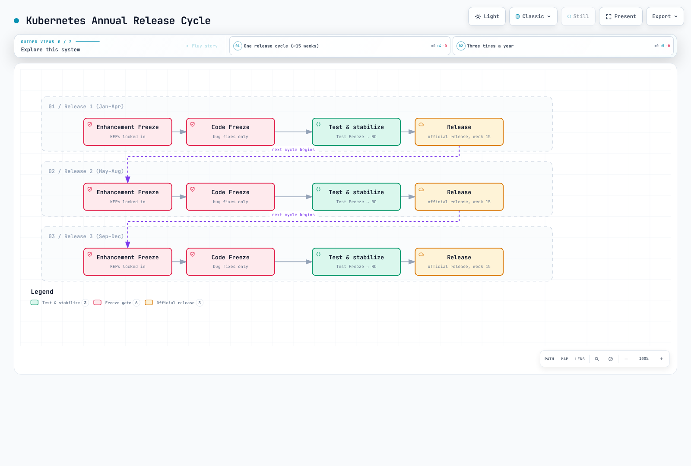

[🔍 View interactive diagram](https://www.atomai.click/kubernetes-docs/archmaps/en-eks-12-kubernetes-version-roadmap-1.html)

### Feature maturity, API stability and feature gates

| Stage | Interpretation |
|---|---|
| Alpha | Usually disabled by default; behavior/API can change or disappear. Check the exact gate and prerequisites. |
| Beta | Tested more broadly, but defaults and compatibility still depend on the feature/version. Some beta gates remain disabled. |
| Stable / GA | API stability commitments apply; this does not certify a particular workload, driver, OS or deployment as safe. |

Since 1.24, **new beta APIs** are disabled by default; previously enabled beta APIs and new versions of existing beta APIs are treated differently. API serving configuration and feature gates are related but distinct. Do not infer that every beta feature requires opt-in or that every stable feature needs no workload configuration.

A GA API version cannot be removed within the same Kubernetes major version. That rule differs from feature-gate removal: a beta-to-GA gate has a minimum deprecation window of six months or two releases, whichever is longer. The actual removal release must be checked. A locked or removed gate cannot be treated as a supported disable switch. For example, the released 1.36.2 source still contains the locked `SidecarContainers` gate; GA in 1.33 does not itself prove removal in 1.35.

The following is a **historical configuration fragment**, not a complete KubeletConfiguration or an EKS control-plane modification. On a current node use its exact version’s supported configuration; do not copy retired gates into a new bootstrap file.

```yaml
# Historical fragment for a self-managed Kubernetes 1.33 test node.
# Merge through the supported node bootstrap/configuration mechanism.
featureGates:
  InPlacePodVerticalScaling: true
  UserNamespacesSupport: true
```

AWS manages EKS control-plane configuration; customers cannot edit an EKS kube-apiserver static Pod or pass arbitrary server flags. The EKS version FAQ says alpha features are unsupported. Changing a gate on a self-managed node cannot enable an unavailable control-plane API. Check AWS’s feature-specific guidance and the node runtime/OS requirements.

The node `configz` endpoint shows configuration for the selected kubelet; omitted defaults and control-plane behavior are not established by that output. `/metrics` requires appropriate non-resource URL authorization, and feature metrics may be unavailable or have additional labels. Neither missing output nor an access error means “disabled.”

```bash
# Authorized, read-only diagnostics; these endpoints may be restricted.
: "${KUBE_CONTEXT:?}"; : "${NODE_NAME:?Choose the actual node}"
kubectl --context "$KUBE_CONTEXT" --request-timeout=15s \
  get --raw="/api/v1/nodes/$NODE_NAME/proxy/configz" | jq '.kubeletconfig.featureGates'
```

```bash
# Run separately; absence of a metric is not proof that a feature is disabled.
: "${KUBE_CONTEXT:?}"
kubectl --context "$KUBE_CONTEXT" --request-timeout=15s get --raw='/metrics' \
  | awk '/^kubernetes_feature_enabled/ { print }'
```

### SIGs and enhancement proposals

SIGs own related areas: Node (runtime/lifecycle), Auth (authentication/authorization), Network (Service routing), Storage (CSI/volumes), Scheduling, Apps, API Machinery, Instrumentation and Autoscaling. Major enhancements use a KEP with motivation, design, graduation criteria, testing and production-readiness review. A planned milestone is not a release commitment; confirm the released API and feature-gate history.

[Upstream patch policy](https://kubernetes.io/releases/patch-releases/) · [Feature gates](https://kubernetes.io/docs/reference/command-line-tools-reference/feature-gates/) · [Deprecation policy](https://kubernetes.io/docs/reference/deprecation-policy/) · [Kubernetes 1.36.2 gate implementation](https://github.com/kubernetes/kubernetes/blob/v1.36.2/pkg/features/kube_features.go)

---

<span id="3-eks-version-support-matrix"></span>

## 3. EKS Version Support Matrix

### Support periods and price basis

| Tier | Period from EKS availability | Version-support fee |
|---|---|---|
| Standard | First 14 months | $0.10 per cluster-hour |
| Extended | Next 12 months | $0.60 total per cluster-hour ($0.10 + $0.50) |

These are the published version-support fees, not total cluster operating costs. Provisioned Control Plane tiers, compute, Auto Mode/Hybrid Nodes, other capabilities, storage and networking can add charges. At a constant rate for 365 days, the corresponding fees are $876 and $5,256 per cluster: an additional $4,380. A 730-hour monthly illustration gives $73 and $438. These are arithmetic examples, not measured bills.

### Verified support calendar — September 12, 2026 (UTC)

| Version | Upstream release | EKS release | Standard support ends | Extended support ends | Status on review date |
|---|---|---|---|---|---|
| 1.31 | 2024-08-13 | 2024-09-26 | 2025-11-26 | 2026-11-26 | Extended |
| 1.32 | 2024-12-11 | 2025-01-23 | 2026-03-23 | 2027-03-23 | Extended |
| 1.33 | 2025-04-23 | 2025-05-29 | 2026-07-29 | 2027-07-29 | Extended |
| 1.34 | 2025-08-27 | 2025-10-02 | 2026-12-02 | 2027-12-02 | Standard |
| 1.35 | 2025-12-17 | 2026-01-27 | 2027-03-27 | 2028-03-27 | Standard |
| 1.36 | 2026-04-22 | 2026-06-02 | 2027-08-02 | 2028-08-02 | Standard |

The current AWS calendar offers 1.31–1.36; 1.29 and 1.30 are retained in this chapter only as historical feature coverage, not supported deployment targets. Upstream 1.37 availability does not establish EKS support. Billing for extended support starts at the beginning of the listed standard-support end date in UTC. Recheck the live calendar/API before a scheduled change; month-only dates in future AWS calendars are estimates.

The calendar dates EKS 1.35 availability to **January 27, 2026**, and 1.36 to **June 2, 2026**. An EKS Distro announcement date is a separate release event, so the earlier January 28 combined label should not replace the EKS calendar. Feature details belong to the corresponding version sections below and retain their runtime/admission prerequisites. EKS version rollback and control-plane scaling/SLA topics are covered in [EKS Upgrades](08-eks-upgrades.md).

```bash
# Read-only when executed with your normal authorized AWS identity.
: "${AWS_REGION:?Choose the intended Region}"
aws eks describe-cluster-versions --region "$AWS_REGION" --no-cli-pager \
  --query clusterVersions --output json
```

This prints the service’s version records rather than assuming the first array element is the newest version or reusing an old example’s status. No AWS query was executed during this audit.

### Upgrade policy and automatic upgrades

`EXTENDED` is the default cluster upgrade policy. A cluster using `STANDARD` can be automatically upgraded after standard support ends; remaining on a version through extended support is a deliberate cost/lifecycle choice. After extended support ends, EKS gradually upgrades remaining control planes to a supported version. AWS does not promise an exact upgrade time and says there is no notification immediately before that automatic update. The at-least-60-day notice describes the announced **end of standard support**, not a new 60-day grace period after extended support or a guaranteed 60/30/7-day notification sequence.

Managed node groups, self-managed nodes, Fargate Pods and Hybrid Nodes require their respective update/replacement workflows. Auto Mode nodes can update automatically; ordinary installed add-ons still need compatibility and ownership review. Maintain matching node/control-plane versions where practical rather than treating the maximum supported skew as a target. Check workload readiness and actual update status, not just the control-plane version string. An end-of-extended-support automatic upgrade cannot be rolled back using EKS’s native seven-day feature; see the upgrade chapter for eligibility and node-first rollback ordering.

[EKS support calendar and FAQ](https://docs.aws.amazon.com/eks/latest/userguide/kubernetes-versions.html) · [EKS pricing](https://aws.amazon.com/eks/pricing/)

<!-- Parent diagram repair pending: stage/default guarantees and support status/notification timing are stale.
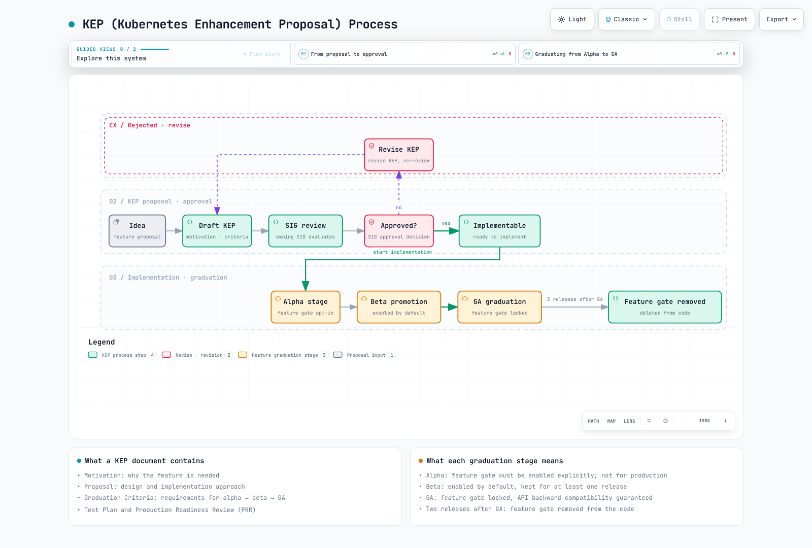

[🔍 View interactive diagram](https://www.atomai.click/kubernetes-docs/archmaps/en-eks-12-kubernetes-version-roadmap-2.html)

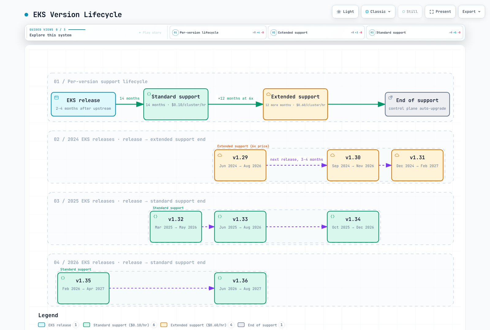

[🔍 View interactive diagram](https://www.atomai.click/kubernetes-docs/archmaps/en-eks-12-kubernetes-version-roadmap-3.html)

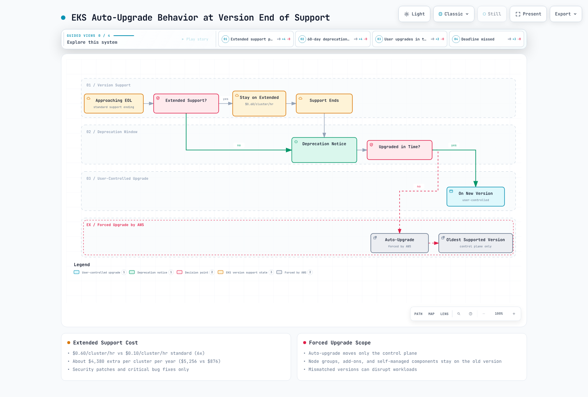

[🔍 View interactive diagram](https://www.atomai.click/kubernetes-docs/archmaps/en-eks-12-kubernetes-version-roadmap-5.html)

-->

---

<span id="4-version-by-version-feature-guide"></span>

## 4. Version-by-Version Feature Guide

This section provides a detailed breakdown of features introduced, graduated, and deprecated in each Kubernetes version from 1.29 through 1.36.

### 4.1 Kubernetes 1.29 "Mandala" (December 2023)

The December 13, 2023 release announcement lists **49 enhancements: 11 stable, 19 beta and 19 alpha**. These are historical release counts, not a claim that 1.29 remains supported by EKS. The diagram’s default/production labels are generalizations; use the per-feature gate history and runtime requirements described above.

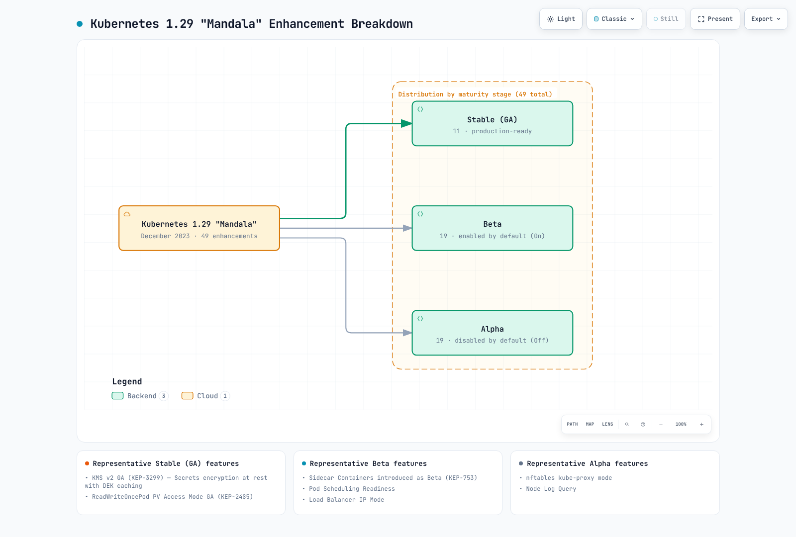

[🔍 View interactive diagram](https://www.atomai.click/kubernetes-docs/archmaps/en-eks-12-kubernetes-version-roadmap-6.html)

#### KMS v2 encryption at rest — GA

KMS v2 improves envelope-encryption performance by deriving single-use data encryption keys from a secret seed and using the KMS plugin when protecting/rotating that seed, rather than requiring a new remote encryption operation for every object write. Both envelope-encryption designs use data-encryption and key-encryption layers; KMS v1 was not a “single-layer” design. The improvement is not a constant-latency guarantee.

KMS v1 was deprecated in 1.28 and disabled by default in 1.29. The current upstream KMS guide still documents its legacy implementation; the old claim that it was removed in 1.31 was incorrect. Prefer the supported v2 migration path.

This configuration is for an administrator-managed upstream API server with a reviewed, installed v2 plugin at the stated socket. It is **not an EKS control-plane manifest**. KMS v2 does not accept `cachesize`. The trailing `identity` provider permits reading existing plaintext during migration; it is not plaintext fallback when the first provider fails to encrypt a write. Review the encryption migration and remove plaintext-read support only after validating the migration.

```yaml
apiVersion: apiserver.config.k8s.io/v1
kind: EncryptionConfiguration
resources:
- resources:
  - secrets
  providers:
  - kms:
      apiVersion: v2
      name: reviewed-kms-provider
      endpoint: unix:///var/run/kmsplugin/socket.sock
      timeout: 3s
  - identity: {}
```

**EKS distinction:** Current AWS guidance provides default KMS v2 envelope encryption for all Kubernetes API data on EKS 1.28 and later, using an AWS-owned key unless a customer-managed key is configured. This covers API data such as Secrets and ConfigMaps, not arbitrary node or EBS volume data. Do not infer it only starts with EKS 1.29 or apply this upstream file to EKS.

#### ReadWriteOncePod — GA

`ReadWriteOncePod` constrains a PVC to one Pod across the cluster. `ReadWriteOnce` instead permits multiple Pods on one node. RWOP requires a compatible CSI volume/driver; the upstream minimum sidecars are csi-provisioner 3.0.0, csi-attacher 3.3.0 and csi-resizer 1.3.0. These are feature minimums, not recommended current releases. Select supported versions for the actual cluster and provisioner.

The example requires the existing `version-lab` namespace and an appropriate `reviewed-csi-class`. Access-mode coordination is not a kernel security boundary against privileged host access, a database leader-election protocol, or a substitute for application fencing and backups.

```yaml
apiVersion: v1
kind: PersistentVolumeClaim
metadata:
  name: database-pvc
  namespace: version-lab
spec:
  accessModes:
  - ReadWriteOncePod
  storageClassName: reviewed-csi-class
  resources:
    requests:
      storage: 100Gi
```

#### Selected beta and alpha features

| Feature | State in 1.29 | Meaning |
|---|---|---|
| SidecarContainers | Beta, enabled by default | Restartable init containers; alpha was 1.28 and GA is 1.33 |
| NFTablesProxyMode | Alpha, disabled by default | A Linux Service-proxy backend; kernel, CNI and NodePort behavior must be checked |
| LoadBalancerIPMode | Alpha | A controller-reported LoadBalancer ingress status mode, not an arbitrary Pod field |
| PodSchedulingReadiness | Beta | Scheduling gates delay consideration by the scheduler |
| NodeLogQuery | Alpha | Node-log query support requires the applicable kubelet configuration/access |
| KubeletTracing | Beta | It did not become GA in 1.29; GA is 1.34 |
| MinDomainsInPodTopologySpread | Beta | GA follows in 1.30 |

A native sidecar uses the following **Pod-spec fragment**. Replace the illustrative image with a reviewed implementation and configure its actual log pipeline. This is not an installed Fluent Bit deployment. Startup proceeds after the sidecar has started (and its startup probe succeeds, if present); readiness and graceful shutdown still require correct probes, application behavior and a sufficient termination budget.

```yaml
initContainers:
- name: log-helper
  image: example.invalid/version-lab/log-helper:reviewed
  restartPolicy: Always
```

The release also graduated CSI `NodeExpandSecret`, allowing a driver’s node-side expansion request to carry the appropriate credentials. The deprecated `flowcontrol.apiserver.k8s.io/v1beta2` endpoint stopped being served in 1.29; use the stable `v1` API and review its field changes. `SecurityContextDeny` was deprecated earlier and removed in 1.30, not newly deprecated in 1.29. No universal “5,000 Services” performance threshold or measured proxy benchmark is established here.

[Kubernetes 1.29 release](https://kubernetes.io/blog/2023/12/13/kubernetes-v1-29-release/) · [KMS provider](https://kubernetes.io/docs/tasks/administer-cluster/kms-provider/) · [EKS envelope encryption](https://docs.aws.amazon.com/eks/latest/userguide/envelope-encryption.html) · [Persistent volumes and RWOP](https://kubernetes.io/docs/concepts/storage/persistent-volumes/) · [API migration guide](https://kubernetes.io/docs/reference/using-api/deprecation-guide/)

---

### 4.2 Kubernetes 1.30 "Uwubernetes" (April 2024)

The April 17 release contains **45 enhancements: 17 stable, 18 beta and 10 alpha**. Maturity labels do not replace the per-feature configuration and runtime checks.

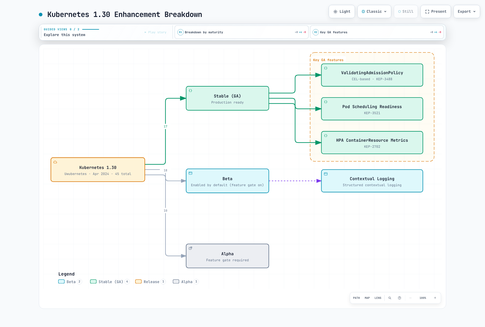

[🔍 View interactive diagram](https://www.atomai.click/kubernetes-docs/archmaps/en-eks-12-kubernetes-version-roadmap-7.html)

#### ValidatingAdmissionPolicy — GA

ValidatingAdmissionPolicy evaluates CEL inside the API server. It can replace many validation webhooks and their network/certificate/server dependencies, but an incorrect policy, evaluation error or fail-closed configuration can still reject requests. The policy, its binding and optional parameter objects have distinct roles; parameters may be built-in resources or custom resources, not necessarily a required third CRD type.

The examples below use current stable `v1` APIs. Their binding is **Audit-only** and selects namespaces labeled `version-lab-policy=enabled`; violations add audit annotations without denial. Configure audit-log collection to observe them. Control who can set that namespace label. Evaluate positive and negative fixtures first, then deliberately select `Deny` if enforcement is intended. These examples are not proof of production admission behavior.

The resource policy checks that regular and init containers declare CPU/memory limit keys. It does not validate appropriate positive sizing: a present zero value is not a useful hard limit. Use suitable LimitRange/resource policies for capacity requirements. Ephemeral containers cannot declare such limits and are excluded. `pods/resize` is included for current clusters; that subresource was introduced after the original 1.30 VAP graduation.

```yaml
apiVersion: admissionregistration.k8s.io/v1
kind: ValidatingAdmissionPolicy
metadata:
  name: version-lab-resource-limits
spec:
  failurePolicy: Fail
  matchConstraints:
    resourceRules:
    - apiGroups:
      - ''
      apiVersions:
      - v1
      operations:
      - CREATE
      - UPDATE
      resources:
      - pods
      - pods/resize
  validations:
  - expression: "object.spec.containers.all(c,\n  has(c.resources) && has(c.resources.limits)\
      \ &&\n  has(c.resources.limits.cpu) && has(c.resources.limits.memory)\n) &&\n\
      (!has(object.spec.initContainers) || object.spec.initContainers.all(c,\n  has(c.resources)\
      \ && has(c.resources.limits) &&\n  has(c.resources.limits.cpu) && has(c.resources.limits.memory)\n\
      ))"
    message: Regular and init containers must declare CPU and memory limits.
    reason: Invalid
---
apiVersion: admissionregistration.k8s.io/v1
kind: ValidatingAdmissionPolicyBinding
metadata:
  name: version-lab-resource-limits
spec:
  policyName: version-lab-resource-limits
  validationActions:
  - Audit
  matchResources:
    namespaceSelector:
      matchLabels:
        version-lab-policy: enabled
```

The image policy uses complete registry/repository prefixes, including the `/` boundary. The old `123456789012.dkr.ecr.` prefix also accepted lookalike domains. Replace the example account, Region and public alias with your approved sources. This checks image references, not signatures, vulnerability status or digest immutability. Optional init/ephemeral lists are guarded, and the ephemeral-container subresource is explicitly matched.

```yaml
apiVersion: admissionregistration.k8s.io/v1
kind: ValidatingAdmissionPolicy
metadata:
  name: version-lab-image-registries
spec:
  failurePolicy: Fail
  matchConstraints:
    resourceRules:
    - apiGroups:
      - ''
      apiVersions:
      - v1
      operations:
      - CREATE
      - UPDATE
      resources:
      - pods
      - pods/ephemeralcontainers
  validations:
  - expression: object.spec.containers.all(c, c.image.startsWith('123456789012.dkr.ecr.us-west-2.amazonaws.com/')
      || c.image.startsWith('public.ecr.aws/approved-alias/'))
    message: Regular container images must use an approved registry/repository prefix.
  - expression: '!has(object.spec.initContainers) || object.spec.initContainers.all(c,
      c.image.startsWith(''123456789012.dkr.ecr.us-west-2.amazonaws.com/'') || c.image.startsWith(''public.ecr.aws/approved-alias/''))'
    message: Init container images must use an approved registry/repository prefix.
  - expression: '!has(object.spec.ephemeralContainers) || object.spec.ephemeralContainers.all(c,
      c.image.startsWith(''123456789012.dkr.ecr.us-west-2.amazonaws.com/'') || c.image.startsWith(''public.ecr.aws/approved-alias/''))'
    message: Ephemeral container images must use an approved registry/repository prefix.
---
apiVersion: admissionregistration.k8s.io/v1
kind: ValidatingAdmissionPolicyBinding
metadata:
  name: version-lab-image-registries
spec:
  policyName: version-lab-image-registries
  validationActions:
  - Audit
  matchResources:
    namespaceSelector:
      matchLabels:
        version-lab-policy: enabled
```

Additional **validation-list fragments** illustrate effective `runAsNonRoot` inheritance for regular containers and nonempty application labels. A container-level setting overrides the Pod setting. These fragments need a policy and binding; they do not validate every Pod Security Standard, init/ephemeral container or image user. Map keys containing `/` use membership tests; `has(map["key"])` is not valid CEL macro syntax.

```yaml
- expression: "object.spec.containers.all(c,\n  has(c.securityContext) && has(c.securityContext.runAsNonRoot)\n\
    \    ? c.securityContext.runAsNonRoot\n    : (has(object.spec.securityContext)\
    \ &&\n       has(object.spec.securityContext.runAsNonRoot) &&\n       object.spec.securityContext.runAsNonRoot)\n\
    )"
  message: Regular containers must effectively set runAsNonRoot.
- expression: 'has(object.metadata.labels) &&

    ''app.kubernetes.io/name'' in object.metadata.labels &&

    ''app.kubernetes.io/version'' in object.metadata.labels &&

    object.metadata.labels[''app.kubernetes.io/name''] != '''' &&

    object.metadata.labels[''app.kubernetes.io/version''] != '''' '
  message: Nonempty application name and version labels are required.
```

#### Pod Scheduling Readiness — GA

Scheduling gates hold a Pod out of scheduling consideration. They can be set during creation/admission and removed afterward, but new gates cannot be added after creation. A gated Pod does not by itself trigger ordinary unschedulable-Pod node provisioning; an external approval/provisioning workflow must satisfy the condition. Gates alone are not atomic gang scheduling.

This example requires an owned namespace, a reviewed replacement for the illustrative image and appropriate GPU capacity/driver. The two gate names represent external quota approval and a security scan; Kubernetes does not perform those actions because a gate has that name.

```yaml
apiVersion: v1
kind: Pod
metadata:
  name: gated-training
  namespace: version-lab
spec:
  schedulingGates:
  - name: example.com/gpu-quota-approved
  - name: example.com/security-scan-passed
  containers:
  - name: trainer
    image: example.invalid/version-lab/training:reviewed
    resources:
      limits:
        nvidia.com/gpu: 4
```

After independently verifying the named condition, this mutation removes only that gate. JSON Patch tests protect the UID, resourceVersion and selected gate name; a concurrent update or replacement causes failure. Re-read and reassess a failed precondition rather than removing a guessed index. The Pod becomes eligible only after all gates are removed, and ordinary placement/capacity constraints still apply.

```bash
# MUTATION: remove only the named gate after independently verifying its condition.
set -euo pipefail
: "${KUBE_CONTEXT:?}"; : "${NAMESPACE:?}"; : "${POD_NAME:?}"; : "${GATE_NAME:?}"
gate_patch=$(kubectl --context "$KUBE_CONTEXT" --request-timeout=15s -n "$NAMESPACE" \
  get pod "$POD_NAME" -o json | jq -ce --arg gate "$GATE_NAME" '
    .metadata as $m |
    [(.spec.schedulingGates // []) | to_entries[] | select(.value.name == $gate)] as $matches |
    if ($matches | length) != 1 then error("Expected exactly one matching gate")
    else ($matches[0].key | tostring) as $i | [
      {op:"test", path:"/metadata/uid", value:$m.uid},
      {op:"test", path:"/metadata/resourceVersion", value:$m.resourceVersion},
      {op:"test", path:("/spec/schedulingGates/" + $i + "/name"), value:$gate},
      {op:"remove", path:("/spec/schedulingGates/" + $i)}
    ] end')
kubectl --context "$KUBE_CONTEXT" --request-timeout=15s -n "$NAMESPACE" \
  patch pod "$POD_NAME" --type=json --patch "$gate_patch"
```

#### HPA ContainerResource metrics — GA (KEP-2702)

ContainerResource targets a named container, so a logging/proxy sidecar need not distort the application’s utilization signal. The target Deployment must exist in `version-lab` and have an `app` container with appropriate requests. A working resource-metrics provider is required. Utilization is relative to requests, not limits. With multiple metrics, HPA uses the largest replica recommendation; missing metrics/readiness and stabilization can affect scaling. The limits of 2–50 replicas are illustrative capacity inputs, not measured optimal settings.

```yaml
apiVersion: autoscaling/v2
kind: HorizontalPodAutoscaler
metadata:
  name: web-app-hpa
  namespace: version-lab
spec:
  scaleTargetRef:
    apiVersion: apps/v1
    kind: Deployment
    name: web-app
  minReplicas: 2
  maxReplicas: 50
  metrics:
  - type: ContainerResource
    containerResource:
      name: cpu
      container: app
      target:
        type: Utilization
        averageUtilization: 70
  - type: ContainerResource
    containerResource:
      name: memory
      container: app
      target:
        type: Utilization
        averageUtilization: 80
```

#### Other selected changes

| Feature | State in 1.30 |
|---|---|
| MinDomainsInPodTopologySpread | GA |
| StableLoadBalancerNodeSet | GA |
| PodDisruptionConditions | Beta; GA follows in 1.31 |
| NodeLogQuery | Beta, disabled by default; GA follows in 1.36 |
| UserNamespacesSupport | Beta, disabled by default |
| ContextualLogging | Beta; call sites must supply/use contextual loggers, not every message automatically gains Pod/node fields |
| RecursiveReadOnlyMounts | Alpha; requires suitable kernel/runtime support |
| RelaxedEnvironmentVariableValidation | Alpha; changes allowed environment-variable **names**, not values |
| ServiceAccountTokenJTI | Beta; the token contains an identifier for tracking |

`SecurityContextDeny` was removed in 1.30; evaluate Pod Security Admission and the policies needed for your environment. Feature maturity alone is not a migration test.

[Kubernetes 1.30 release](https://kubernetes.io/blog/2024/04/17/kubernetes-v1-30-release/) · [ValidatingAdmissionPolicy](https://kubernetes.io/docs/reference/access-authn-authz/validating-admission-policy/) · [Scheduling readiness](https://kubernetes.io/docs/concepts/scheduling-eviction/pod-scheduling-readiness/) · [HPA container metrics](https://kubernetes.io/docs/tasks/run-application/horizontal-pod-autoscale/#container-resource-metrics)

---

### 4.3 Kubernetes 1.31 "Elli" (August 2024)

The August 13 release lists **45 enhancements: 11 stable, 22 beta and 12 alpha**.

<!-- Parent repair: DRA structured parameters remained alpha in1.31, not beta as drawn.
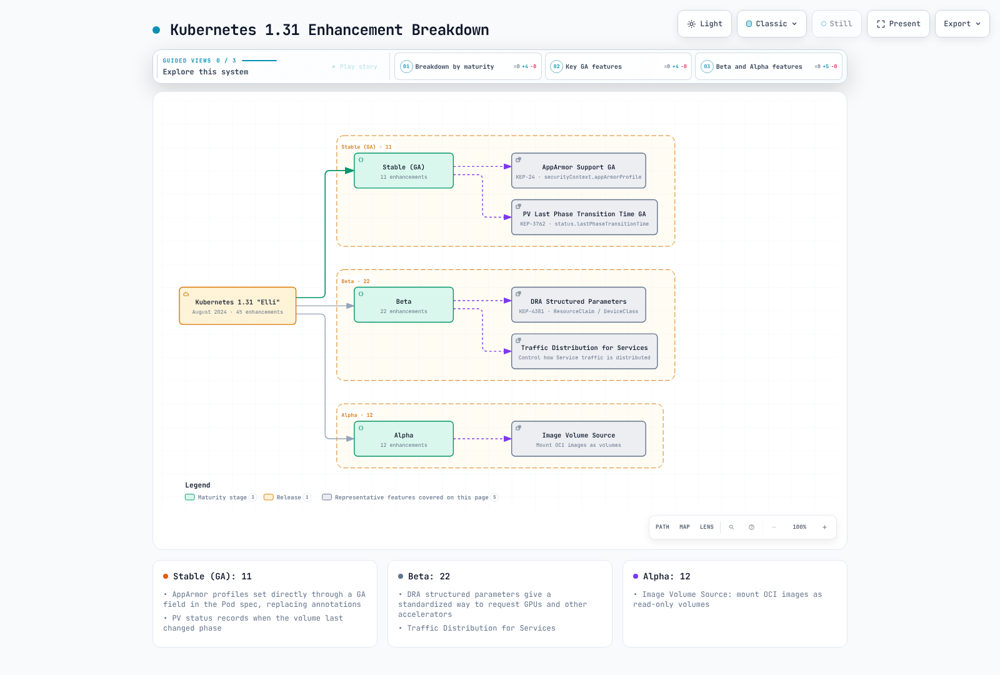

[🔍 View interactive diagram](https://www.atomai.click/kubernetes-docs/archmaps/en-eks-12-kubernetes-version-roadmap-8.html)
-->

#### AppArmor native fields — GA

AppArmor profiles became configurable through native fields in 1.30 and reached GA in 1.31. This replaces the old per-container beta annotations. The host must actually enable AppArmor, the runtime must support it, and a `Localhost` profile must be loaded on each eligible node. A custom node label only records an operator-verified prerequisite; it does not install or enforce the profile.

The first example uses a preinstalled profile; the second supplies the selector and Pod labels missing from the old Deployment example. Replace the illustrative image and prepare the namespace. `RuntimeDefault` means the runtime’s profile, while `Unconfined` disables AppArmor confinement. A configured profile is not universally supported across every EKS OS/compute type. AppArmor, seccomp and SELinux are different controls, not interchangeable names for the same protection.

```yaml
apiVersion: v1
kind: Pod
metadata:
  name: apparmor-local-profile
  namespace: version-lab
spec:
  nodeSelector:
    version-lab.example.com/apparmor-profile: reviewed
  containers:
  - name: app
    image: example.invalid/version-lab/app:reviewed
    securityContext:
      appArmorProfile:
        type: Localhost
        localhostProfile: reviewed-app-profile
```

```yaml
apiVersion: apps/v1
kind: Deployment
metadata:
  name: apparmor-runtime-default
  namespace: version-lab
spec:
  replicas: 1
  selector:
    matchLabels:
      app: apparmor-runtime-default
  template:
    metadata:
      labels:
        app: apparmor-runtime-default
    spec:
      containers:
      - name: app
        image: example.invalid/version-lab/app:reviewed
        securityContext:
          appArmorProfile:
            type: RuntimeDefault
```

#### PersistentVolume last phase transition time — GA

The PV status field `.status.lastPhaseTransitionTime` records the most recent phase transition. Use it with events and backend evidence for lifecycle diagnosis; it is not a complete transition history or a reconstruction of missing older events. The following command does not modify or delete the volume.

```bash
# Read-only, for one owned cluster-scoped PV.
: "${KUBE_CONTEXT:?}"; : "${PV_NAME:?}"
kubectl --context "$KUBE_CONTEXT" --request-timeout=15s get pv "$PV_NAME" -o json | jq '{
  name:.metadata.name,phase:.status.phase,lastPhaseTransitionTime:.status.lastPhaseTransitionTime
}'
```

#### DRA structured parameters — still alpha in 1.31

The DRA redesign made device information and requests visible to Kubernetes through structured APIs and ResourceSlices, enabling scheduler-side allocation. **Classic DRA was still available in 1.31**, behind the separate, disabled-by-default `DRAControlPlaneController` gate. The released 1.31 source contains that gate; the 1.32 source removes it. The old quiz’s claim that classic DRA was already removed in 1.31 is therefore incorrect.

DRA remained alpha in 1.31 and graduated to beta in 1.32, then its core API became stable in 1.34. The former `resource.k8s.io/v1beta1` example was not a valid representation of the 1.31 API generation. Use the stable DRA example in the 1.34 section for current syntax and verify the installed driver’s DeviceClasses, ResourceSlices, attributes and capabilities. A Kubernetes API does not itself install a GPU driver or implement time-slicing/MIG.

#### Service traffic distribution — beta

The core `v1` Service field `trafficDistribution: PreferClose` requests same-zone endpoint preference. It is a routing preference, not a strict locality rule, geographical-distance calculation or guarantee of eliminating cross-AZ charges. Endpoint availability, the implementing proxy and traffic-policy precedence matter. The selector must match real workload Pods; the example does not create those endpoints.

```yaml
apiVersion: v1
kind: Service
metadata:
  name: zone-preference
  namespace: version-lab
spec:
  trafficDistribution: PreferClose
  selector:
    app: web-app
  ports:
  - port: 80
    targetPort: 8080
```

#### Other selected changes

| Feature | State in 1.31 |
|---|---|
| NFTablesProxyMode | Beta, enabled by default; choosing the proxy mode and checking Linux/kernel/CNI compatibility are separate steps |
| MultiCIDRServiceAllocator | Beta, disabled by default |
| VolumeAttributesClass | Beta, disabled by default; driver/controller/API support required |
| ImageVolume | Alpha, disabled by default |
| PodDisruptionConditions | GA |
| JobPodReplacementPolicy | Beta; GA is 1.34 |
| SidecarContainers | Already beta since 1.29, not newly beta in 1.31 |

The nftables backend is not an automatic network migration. NodePort and firewall behavior can differ from iptables; assess the actual implementation before changing a production proxy mode.

[Kubernetes 1.31 release](https://kubernetes.io/blog/2024/08/13/kubernetes-v1-31-release/) · [AppArmor prerequisites](https://kubernetes.io/docs/tutorials/security/apparmor/) · [1.31 feature source](https://github.com/kubernetes/kubernetes/blob/v1.31.0/pkg/features/kube_features.go) · [1.32 feature source](https://github.com/kubernetes/kubernetes/blob/v1.32.0/pkg/features/kube_features.go)

---

### 4.4 Kubernetes 1.32 "Penelope" (December 2024)

The December 11 release lists **44 enhancements: 13 stable, 12 beta and 19 alpha**. The diagram’s default-on labels are a simplified maturity legend; individual beta features below can remain disabled.

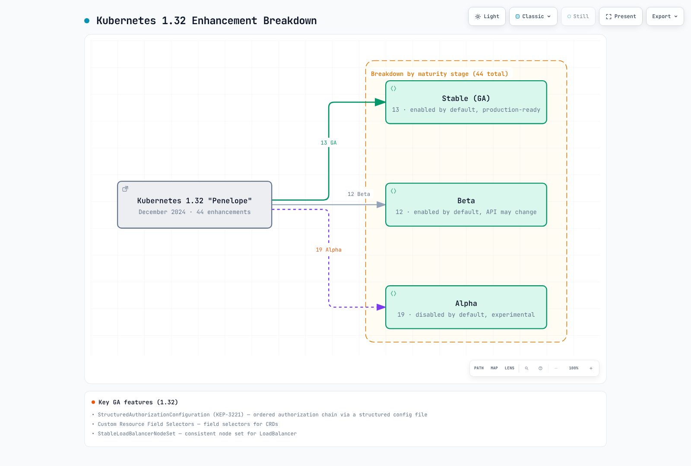

[🔍 View interactive diagram](https://www.atomai.click/kubernetes-docs/archmaps/en-eks-12-kubernetes-version-roadmap-9.html)

#### Structured authorization configuration — GA

`AuthorizationConfiguration` uses `apiserver.config.k8s.io/v1` for stable configuration. It is an alternative to authorization mode flags, not evidence that `--authorization-mode` was removed. Do not combine the flag and configuration-file mechanisms. EKS manages this control-plane configuration; the following file is for an administrator-managed API server, not a resource to apply with kubectl or an EKS customization interface.

Authorizers run in order and a definitive allow/deny ends the chain. In this example, the webhook only sees matching `version-lab` resource requests that Node and RBAC did not already decide. It therefore **does not impose a deny filter on requests already allowed by RBAC**. CEL match conditions select webhook calls; CEL is not another independent authorizer type. The request is a SubjectAccessReview spec, so the namespace is under `request.resourceAttributes`, with a presence guard for non-resource requests.

```yaml
apiVersion: apiserver.config.k8s.io/v1
kind: AuthorizationConfiguration
authorizers:
- type: Node
  name: node
- type: RBAC
  name: rbac
- type: Webhook
  name: reviewed-webhook
  webhook:
    authorizedTTL: 5m
    unauthorizedTTL: 30s
    timeout: 3s
    subjectAccessReviewVersion: v1
    matchConditionSubjectAccessReviewVersion: v1
    failurePolicy: Deny
    connectionInfo:
      type: KubeConfigFile
      kubeConfigFile: /etc/kubernetes/reviewed-authz-webhook.kubeconfig
    matchConditions:
    - expression: has(request.resourceAttributes) && request.resourceAttributes.namespace
        == 'version-lab'
```

Prepare the actual webhook, TLS trust and protected kubeconfig before use. `failurePolicy: Deny` applies to relevant webhook/condition failures, and cached decisions can delay the effect of a backend policy change. Use consistent configuration on all API servers. Configuration reload is supported, but it cannot add or remove Node/RBAC authorizers; validate the complete policy and recovery procedure in a non-production environment.

#### StatefulSet PVC retention policy — GA

The relevant 1.32 graduation is **automatic deletion/retention of PVCs created from StatefulSet volume claim templates**, not a new guarantee that every unused PVC protection finalizer disappears immediately. `whenDeleted` controls StatefulSet deletion and `whenScaled` controls scale-down behavior; each supports `Retain` or `Delete`. The defaults retain data. This is a fragment to review in an existing StatefulSet:

```yaml
spec:
  persistentVolumeClaimRetentionPolicy:
    whenDeleted: Retain
    whenScaled: Retain
```

Choosing `Delete` is a data-lifecycle change: PVC deletion can also delete backend storage depending on PV reclaim policy. Pod ownership, garbage collection, CSI operations and finalizers still affect completion. PVC in-use protection long predates 1.32; a stuck claim requires consumer/UID/attachment/controller investigation, not a blanket finalizer removal or an assumed upgrade fix.

#### VolumeAttributesClass — still beta in 1.32

VAC entered beta in 1.31 and became GA in 1.34. Its beta API is `storage.k8s.io/v1beta1`; current examples should use the stable API from the 1.34 section when the cluster and CSI driver support it. A class’s parameters are immutable; a PVC changes class references to request different driver-supported attributes such as EBS IOPS or throughput.

This is asynchronous storage modification, not a universal zero-downtime guarantee. Confirm the driver/controller version, API availability, IAM/KMS permissions, volume-type limits, modification cooldowns and status. Do not apply an incomplete PVC object as if it were a complete create manifest. The following read compares the desired class with reported progress:

```bash
# Read-only: inspect one existing owned PVC and the CSI modification state.
: "${KUBE_CONTEXT:?}"; : "${NAMESPACE:?}"; : "${PVC_NAME:?}"
kubectl --context "$KUBE_CONTEXT" --request-timeout=15s -n "$NAMESPACE" \
  get pvc "$PVC_NAME" -o json | jq '{
    requestedClass:.spec.volumeAttributesClassName,
    currentClass:.status.currentVolumeAttributesClassName,
    modification:.status.modifyVolumeStatus,
    conditions:.status.conditions
  }'
```

AWS’s 1.34 notes distinguish the stable VAC API from earlier beta sidecar support. An EKS control-plane version alone does not prove that any arbitrary EBS CSI release remains compatible with its VAC API.

#### User namespaces — beta, disabled by default in 1.32

User namespaces entered beta in 1.30 and became enabled by default in 1.33; GA is 1.36. A Pod opts in with `hostUsers: false`. UID 0 inside the container maps to a non-root host UID chosen by the implementation, not a universal `65534 + offset` formula. This requires a compatible kernel, filesystem and CRI/runtime and does not make every workload or host-access pattern compatible.

The example deliberately shows container UID 0 to explain the mapping; replace the illustrative image and use a supported test environment. It is defense in depth, not a guarantee against all kernel/container escape vulnerabilities or a replacement for other security controls.

```yaml
apiVersion: v1
kind: Pod
metadata:
  name: userns-example
  namespace: version-lab
spec:
  hostUsers: false
  containers:
  - name: app
    image: example.invalid/version-lab/app:reviewed
    securityContext:
      runAsUser: 0
```

#### Other selected changes

| Feature | State in 1.32 |
|---|---|
| CustomResourceFieldSelectors | GA; CRD authors must declare supported selectable fields |
| RetryGenerateName | GA; retries name collisions, not a guarantee that creation always succeeds |
| SizeMemoryBackedVolumes | GA; memory-backed emptyDir limits still interact with Pod/node memory |
| ServiceAccountTokenJTI | GA; token identifier, not a new authorization permission |
| JobManagedBy | Beta; GA is 1.35 |
| DynamicResourceAllocation | Beta, disabled by default; stable core API follows in 1.34 |
| MultiCIDRServiceAllocator | Still beta, disabled by default |
| NFTablesProxyMode | Still beta; GA is 1.33 |
| MutatingAdmissionPolicy | Alpha; beta is 1.34 and GA is 1.36 |

`StableLoadBalancerNodeSet` was already GA in 1.30. Keep these historical stages separate from the currently enabled features of a particular EKS cluster.

[Kubernetes 1.32 release](https://kubernetes.io/blog/2024/12/11/kubernetes-v1-32-release/) · [Authorization configuration](https://kubernetes.io/docs/reference/access-authn-authz/authorization/) · [StatefulSet PVC retention](https://kubernetes.io/docs/concepts/workloads/controllers/statefulset/#persistentvolumeclaim-retention) · [EKS version notes](https://docs.aws.amazon.com/eks/latest/userguide/kubernetes-versions-standard.html)

---

### 4.5 Kubernetes 1.33 "Octarine" (April 2025)

The April 23 release lists **64 enhancements: 18 stable, 20 beta, 24 alpha, and 2 deprecated or withdrawn**. The diagram shows the three maturity groups (62 items) as shares of the total 64; the other two items are not drawn. This was a large 2025 release, not proof of greater performance or readiness for every workload.

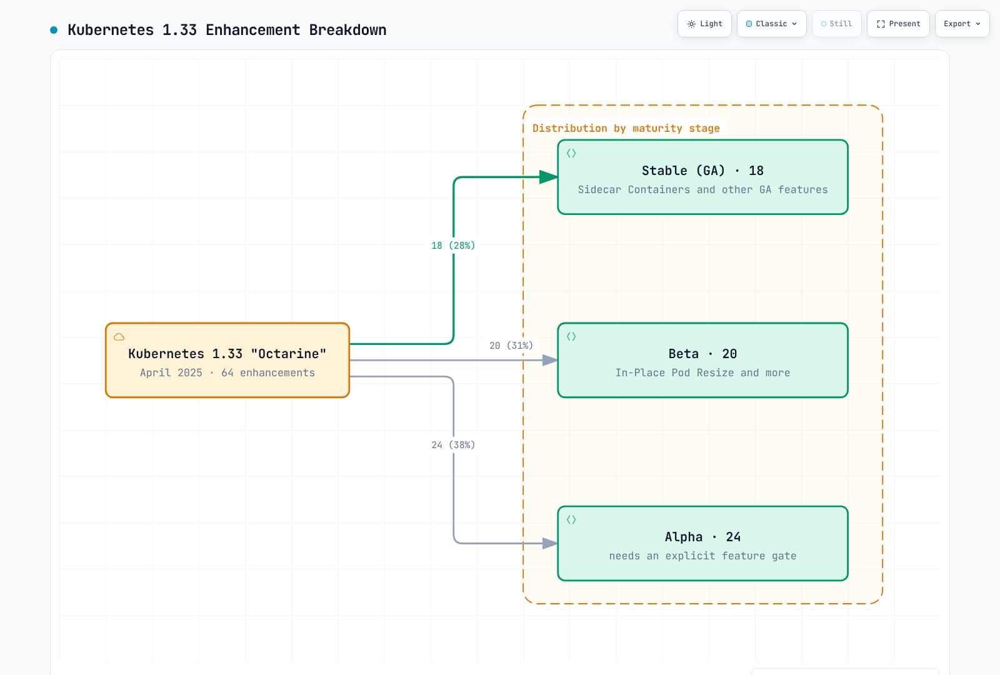

[🔍 View interactive diagram](https://www.atomai.click/kubernetes-docs/archmaps/en-eks-12-kubernetes-version-roadmap-10.html)

#### Native sidecars — GA

The feature progressed from alpha in 1.28 to beta in 1.29 and GA in 1.33. A restartable init container has `restartPolicy: Always`. Kubelet moves to the next init container after that sidecar’s `started` state becomes true: either its process is running without a startup probe, or the startup probe has succeeded. Readiness is a separate signal. The regular init container below runs **after both sidecars have started**, then the application starts.

This is a structural example. All `example.invalid` images must be replaced with reviewed implementations; the proxy must serve its declared readiness endpoint and the log agent needs its actual pipeline configuration. Merely choosing an Envoy/Istio/Fluent Bit image does not configure a service mesh or logging destination. A real database migration also needs coordination/idempotency; it should not be assumed safe to run once per replica.

```yaml
apiVersion: apps/v1
kind: Deployment
metadata:
  name: sidecar-lifecycle
  namespace: version-lab
spec:
  replicas: 2
  selector:
    matchLabels:
      app: sidecar-lifecycle
  template:
    metadata:
      labels:
        app: sidecar-lifecycle
    spec:
      terminationGracePeriodSeconds: 60
      initContainers:
      - name: proxy-helper
        image: example.invalid/version-lab/reviewed-proxy:reviewed
        restartPolicy: Always
        startupProbe:
          httpGet:
            path: /ready
            port: 15021
          periodSeconds: 2
          failureThreshold: 30
        resources:
          requests:
            cpu: 100m
            memory: 128Mi
          limits:
            cpu: 500m
            memory: 256Mi
      - name: log-helper
        image: example.invalid/version-lab/reviewed-log-agent:reviewed
        restartPolicy: Always
        volumeMounts:
        - name: app-logs
          mountPath: /var/log/app
        resources:
          requests:
            cpu: 50m
            memory: 64Mi
          limits:
            cpu: 200m
            memory: 128Mi
      - name: initialize-app
        image: example.invalid/version-lab/reviewed-init:reviewed
        volumeMounts:
        - name: app-logs
          mountPath: /var/log/app
      containers:
      - name: app
        image: example.invalid/version-lab/reviewed-app:reviewed
        volumeMounts:
        - name: app-logs
          mountPath: /var/log/app
      volumes:
      - name: app-logs
        emptyDir: {}
```

During normal graceful termination, main containers stop before sidecars, and sidecars stop in reverse order. The Pod’s shared grace-period budget still applies: a long-running main shutdown can leave sidecars little or no graceful exit time. Native sidecars do not keep a Job incomplete after its main container finishes; this behavior was not first invented at GA. Account for overlapping init/sidecar/application resources and Pod overhead when sizing. No lifecycle timing or application availability was measured here.

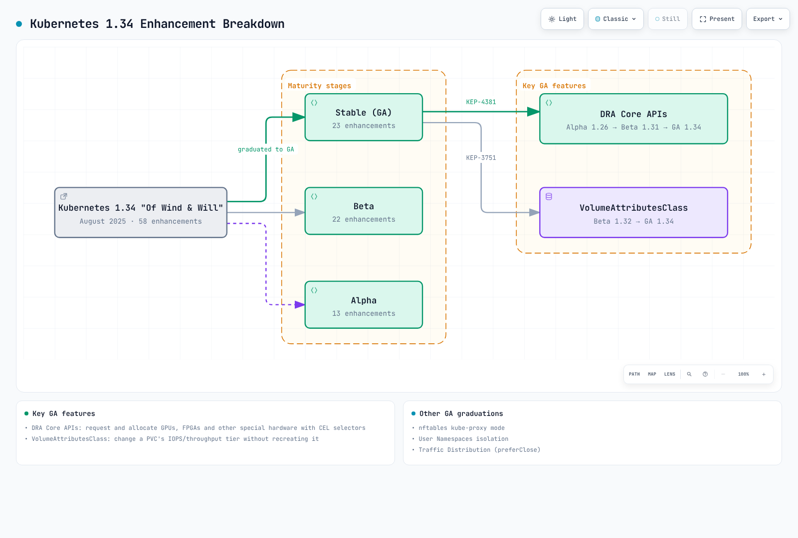

[🔍 View interactive diagram](https://www.atomai.click/kubernetes-docs/archmaps/en-eks-12-kubernetes-version-roadmap-11.html)

#### In-place container resource resize — beta in 1.33

In-place resize changes desired CPU/memory allocations without recreating the Pod, but a container restart can still be required by `resizePolicy`. The feature became stable in 1.35. The following current-schema example keeps `Burstable` QoS and sets CPU to `NotRequired`, memory to `RestartContainer`. A memory change therefore requests a container restart by policy; it is not an intrinsic rule that all memory changes always restart.

Use a compatible Linux runtime and node policy, supported kubectl skew, an owned namespace and reviewed image. The 1.36 guide excludes Windows and default static CPU/Memory-manager cases; separately gated capabilities must be assessed by version. This API does not automatically rewrite Deployment/StatefulSet templates or coordinate with HPA/VPA/GitOps resource owners.

```yaml
apiVersion: v1
kind: Pod
metadata:
  name: resizable-app
  namespace: version-lab
spec:
  containers:
  - name: app
    image: example.invalid/version-lab/app:reviewed
    resources:
      requests:
        cpu: 500m
        memory: 256Mi
      limits:
        cpu: '1'
        memory: 512Mi
    resizePolicy:
    - resourceName: cpu
      restartPolicy: NotRequired
    - resourceName: memory
      restartPolicy: RestartContainer
```

After reviewing capacity and ownership, this CPU-only example requests 1 core with a 2-core limit. It selects the container by name, preserves an existing Burstable class, refuses a restart-required CPU policy, and tests Pod UID/resourceVersion before patching. It does not change memory. A conflict requires re-reading and reassessing the target, not forcing the update.

```bash
# MUTATION: reviewed CPU-only resize; desired request=1 core and limit=2 cores.
set -euo pipefail
: "${KUBE_CONTEXT:?}"; : "${NAMESPACE:?}"; : "${POD_NAME:?}"; : "${CONTAINER_NAME:?}"
resize_patch=$(kubectl --context "$KUBE_CONTEXT" --request-timeout=15s -n "$NAMESPACE" \
  get pod "$POD_NAME" -o json | jq -ce --arg container "$CONTAINER_NAME" '
    . as $pod |
    [(.spec.containers | to_entries[]) | select(.value.name == $container)] as $matches |
    if .status.phase != "Running" or .metadata.deletionTimestamp != null
       or ($matches | length) != 1
    then error("Expected one target container in a non-deleting Running Pod")
    elif .status.qosClass != "Burstable"
    then error("This example preserves an existing Burstable QoS class")
    elif $matches[0].value.resources.requests.cpu == null
         or $matches[0].value.resources.limits.cpu == null
    then error("This example requires existing CPU request and limit keys")
    elif any($matches[0].value.resizePolicy[]?; .resourceName == "cpu" and .restartPolicy == "RestartContainer")
    then error("This example requires CPU resize policy NotRequired")
    elif ([.status.containerStatuses[]? | select(.name == $container and .state.running != null)] | length) != 1
    then error("Target container is not reported running")
    else ($matches[0].key | tostring) as $i | [
      {op:"test",path:"/metadata/uid",value:$pod.metadata.uid},
      {op:"test",path:"/metadata/resourceVersion",value:$pod.metadata.resourceVersion},
      {op:"test",path:("/spec/containers/" + $i + "/name"),value:$container},
      {op:"replace",path:("/spec/containers/" + $i + "/resources/requests/cpu"),value:"1"},
      {op:"replace",path:("/spec/containers/" + $i + "/resources/limits/cpu"),value:"2"}
    ] end')
kubectl --context "$KUBE_CONTEXT" --request-timeout=15s -n "$NAMESPACE" \
  patch pod "$POD_NAME" --subresource=resize --type=json --patch "$resize_patch"
```

Use current status fields, not the former `.status.resize` string. `PodResizePending=True` can report `Deferred` or `Infeasible`; `PodResizeInProgress=True` means actuation is still pending. Compare the desired spec, acknowledged generation and named container’s `status.containerStatuses[].resources`. `allocatedResources` is an advanced allocation field, not the sole proof of applied runtime limits. The absence of a condition or an accepted patch does not establish workload health.

```bash
# Read-only observation; an accepted patch is not proof of completed actuation.
set -euo pipefail
: "${KUBE_CONTEXT:?}"; : "${NAMESPACE:?}"; : "${POD_NAME:?}"; : "${CONTAINER_NAME:?}"
kubectl --context "$KUBE_CONTEXT" --request-timeout=15s -n "$NAMESPACE" \
  get pod "$POD_NAME" -o json | jq --arg container "$CONTAINER_NAME" '{
    uid:.metadata.uid,generation:.metadata.generation,
    observedGeneration:.status.observedGeneration,qosClass:.status.qosClass,
    resizeConditions:[.status.conditions[]? | select(.type == "PodResizePending" or .type == "PodResizeInProgress")],
    desired:[.spec.containers[] | select(.name == $container) | .resources],
    reported:[.status.containerStatuses[]? | select(.name == $container) |
      {name,resources,allocatedResources,containerID,restartCount,ready}]
  }'
```

A resize cannot change the Pod’s QoS class. Guaranteed Pods must retain equal CPU and memory requests/limits; the example above is intentionally Burstable. Memory shrink with `NotRequired` is best effort and can remain in progress when use exceeds the new limit; a race can still cause an OOM kill. Non-restartable init and ephemeral containers cannot be resized. No zero-downtime, latency or successful-resize guarantee follows from the feature’s maturity.

#### Current VPA integration is a separate version decision

This is a **2026 companion-component example**, not a claim that VPA 1.7 existed when Kubernetes 1.33 launched. The released VPA **1.7.1** API supports `InPlace`, introduced as alpha in 1.7.0. It requires the VPA `InPlace` feature gate on both admission-controller and updater, plus Kubernetes 1.33+ in-place-resize support. It avoids VPA Pod eviction fallback; it does not guarantee that a resize will complete or that every container policy is restart-free. Start with `Off` if recommendation-only observation is intended.

The CPU-only policy below uses illustrative bounds for an existing Deployment/container. Review the controller deployment flags and capacity before enabling changes. `InPlaceOrRecreate` is a different mode: it can fall back to recreation, became GA in VPA 1.6, and its old gate was removed in 1.7. Do not enable a removed gate or infer VPA behavior from Kubernetes GA alone.

```yaml
apiVersion: autoscaling.k8s.io/v1
kind: VerticalPodAutoscaler
metadata:
  name: current-in-place-example
  namespace: version-lab
spec:
  targetRef:
    apiVersion: apps/v1
    kind: Deployment
    name: web-app
  updatePolicy:
    updateMode: InPlace
  resourcePolicy:
    containerPolicies:
    - containerName: app
      minAllowed:
        cpu: 100m
      maxAllowed:
        cpu: '4'
      controlledResources:
      - cpu
      controlledValues: RequestsAndLimits
```

#### ServiceCIDR and IPAddress — GA

Upstream Kubernetes can extend its available Service addresses using additional `networking.k8s.io/v1` ServiceCIDR objects when the allocator/API is enabled. The default object named `kubernetes` represents the initial API-server range. Review IPAM, address family and routing overlap before adding ranges; finalizers prevent deletion that would orphan allocated Service IPs. A ServiceCIDR is not a VPC subnet or a Pod-address CIDR.

This IPv4 manifest is an upstream example, not an executed EKS range expansion. EKS’s `serviceIpv4Cidr` creation parameter is immutable after cluster creation. Creating another Kubernetes ServiceCIDR is a different operation; the AWS sources reviewed here do not establish a tested EKS procedure for it. Confirm provider support, admission policy and the intended network before using it on EKS. API discovery alone is not that validation.

```yaml
apiVersion: networking.k8s.io/v1
kind: ServiceCIDR
metadata:
  name: reviewed-extra-service-range
spec:
  cidrs:
  - 10.200.0.0/16
```

```bash
# Read-only discovery; do not interpret availability alone as an approved EKS change.
set -euo pipefail
: "${KUBE_CONTEXT:?}"
kubectl --context "$KUBE_CONTEXT" --request-timeout=15s api-resources --api-group=networking.k8s.io
kubectl --context "$KUBE_CONTEXT" --request-timeout=15s get servicecidrs
kubectl --context "$KUBE_CONTEXT" --request-timeout=15s get ipaddresses
```

#### Topology-aware routing and traffic distribution — GA

Topology-aware endpoint hints and the Service `trafficDistribution` preference are related but distinct mechanisms. The following uses `PreferClose` for same-zone preference; it is not a strict same-zone guarantee, a regional-distance calculation or a declaration that an annotation is universally deprecated. Ready endpoint distribution, proxy implementation and `internalTrafficPolicy`/`externalTrafficPolicy` can affect the route.

Cross-AZ traffic may create charges, but the old flat `$0.01/GB` statement was not a complete pricing model. Charges depend on service, path and metered inbound/outbound sides; some in-Region traffic has exceptions. Compare actual traffic and billing data rather than promising a fixed saving.

```yaml
apiVersion: v1
kind: Service
metadata:
  name: same-zone-preference
  namespace: version-lab
spec:
  trafficDistribution: PreferClose
  selector:
    app: web-app
  ports:
  - port: 80
    targetPort: 8080
```

#### Job success policy — GA

A success policy applies to Indexed Jobs. Here index 0 must succeed; that only represents a leader if the application implements the corresponding protocol. Kubernetes does not infer that the distributed result is complete or durable. Failure policies and termination of remaining Pods still matter. The Job template explicitly sets `restartPolicy: Never`, which was missing from the original examples.

```yaml
apiVersion: batch/v1
kind: Job
metadata:
  name: indexed-success-example
  namespace: version-lab
spec:
  completionMode: Indexed
  completions: 8
  parallelism: 8
  backoffLimit: 2
  successPolicy:
    rules:
    - succeededIndexes: '0'
      succeededCount: 1
  template:
    spec:
      restartPolicy: Never
      containers:
      - name: trainer
        image: example.invalid/version-lab/training:reviewed
        env:
        - name: JOB_COMPLETION_INDEX
          valueFrom:
            fieldRef:
              fieldPath: metadata.annotations['batch.kubernetes.io/job-completion-index']
```

#### OCI image volumes — beta, disabled by default in 1.33

An image volume exposes OCI image content to a Pod, for example model data, without embedding it in the application image. It needs a supporting runtime, appropriate feature configuration and registry pull identity. The mount is read-only; it is not a writable PVC. Review and pin both application and data images. ImageVolume became enabled by default in 1.35 and stable in 1.36, not GA in 1.34.

```yaml
apiVersion: v1
kind: Pod
metadata:
  name: image-volume-example
  namespace: version-lab
spec:
  containers:
  - name: inference
    image: example.invalid/version-lab/inference:reviewed
    volumeMounts:
    - name: model
      mountPath: /models
      readOnly: true
  volumes:
  - name: model
    image:
      reference: example.invalid/version-lab/model:reviewed
      pullPolicy: IfNotPresent
```

#### Other selected stages in 1.33

| Feature | State |
|---|---|
| NFTablesProxyMode, RecursiveReadOnlyMounts | GA |
| CRDValidationRatcheting | GA; not permission to bypass validation of changed invalid fields |
| MatchLabelKeysInPodAffinity, NodeInclusionPolicyInPodTopologySpread | GA |
| PersistentVolume reclaim-policy deletion protection | GA; separate from PVC in-use protection |
| UserNamespacesSupport | Beta, now enabled by default |
| PodLevelResources | Still alpha; beta follows in 1.34 |
| StructuredAuthenticationConfiguration | Beta; GA follows in 1.34 |
| MutatingAdmissionPolicy | Still alpha; beta follows in 1.34 |
| PodLifecycleSleepAction | Beta; GA follows in 1.34 |
| JobManagedBy | Beta; GA follows in 1.35 |

LoadBalancerIPMode and RetryGenerateName had already reached GA in 1.32. KYAML was introduced in 1.34, not 1.33.

[Kubernetes 1.33 release](https://kubernetes.io/blog/2025/04/23/kubernetes-v1-33-release/) · [Versioned 1.36 resize guide](https://github.com/kubernetes/website/blob/release-1.36/content/en/docs/tasks/configure-pod-container/resize-container-resources.md) · [VPA 1.7.1 features](https://github.com/kubernetes/autoscaler/blob/vertical-pod-autoscaler-1.7.1/vertical-pod-autoscaler/docs/features.md) · [Service range extension](https://kubernetes.io/docs/tasks/network/extend-service-ip-ranges/) · [EKS network configuration API](https://docs.aws.amazon.com/eks/latest/APIReference/API_KubernetesNetworkConfigRequest.html) · [Data-transfer charge interpretation](https://docs.aws.amazon.com/cur/latest/userguide/cur-data-transfers-charges.html)

---

### 4.6 Kubernetes 1.34 "Of Wind & Will" (August 2025)

The August 27 release lists **58 enhancements: 23 stable, 22 beta and 13 alpha**. Individual beta defaults differ; the diagram’s generic default-on arrow is not an enablement matrix.

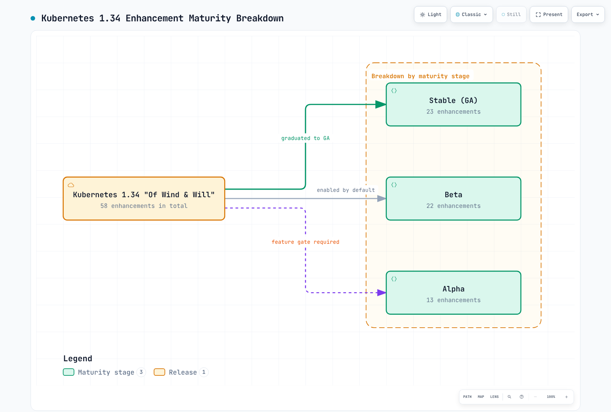

[🔍 View interactive diagram](https://www.atomai.click/kubernetes-docs/archmaps/en-eks-12-kubernetes-version-roadmap-12.html)

#### DRA core APIs — GA

DeviceClass, ResourceClaim, ResourceClaimTemplate and ResourceSlice are built-in `resource.k8s.io/v1` APIs. They are not DRA core CRDs to install. Drivers publish device inventory through ResourceSlices; the scheduler allocates eligible resources and the kubelet coordinates device preparation with the driver. The architecture diagram is a logical flow and omits the API-server/ResourceSlice transport.

DRA does not remove the existing device-plugin model or automatically provide every vendor’s time-slicing, MPS, MIG, NUMA or network feature. Advanced DRA features have separate gates and stages. Do not configure two independent allocators against the same devices without a supported coordination model.


[🔍 View interactive diagram](https://www.atomai.click/kubernetes-docs/archmaps/en-eks-12-kubernetes-version-roadmap-13.html)

The following uses an **explicit synthetic driver contract**: `gpu.example.com` publishes a string `model` attribute and a `numa` attribute. It is not a claim about the actual NVIDIA driver’s attribute names or configuration. Replace the driver/attributes after inspecting the installed driver’s ResourceSlices. In stable requests, `deviceClassName`, `allocationMode` and `count` belong under `exactly`; the old root-level form was incorrect. `matchAttribute` is a hard equality constraint across the requested devices, not a NUMA preference.

```yaml
apiVersion: resource.k8s.io/v1
kind: DeviceClass
metadata:
  name: example-a100
spec:
  selectors:
  - cel:
      expression: 'device.driver == "gpu.example.com" &&

        "gpu.example.com" in device.attributes &&

        "model" in device.attributes["gpu.example.com"] &&

        device.attributes["gpu.example.com"].model == "A100"'
---
apiVersion: resource.k8s.io/v1
kind: ResourceClaim
metadata:
  name: training-gpus
  namespace: version-lab
spec:
  devices:
    requests:
    - name: gpu
      exactly:
        deviceClassName: example-a100
        allocationMode: ExactCount
        count: 4
    constraints:
    - requests:
      - gpu
      matchAttribute: gpu.example.com/numa
---
apiVersion: resource.k8s.io/v1
kind: ResourceClaimTemplate
metadata:
  name: four-gpu-template
  namespace: version-lab
spec:
  spec:
    devices:
      requests:
      - name: gpu
        exactly:
          deviceClassName: example-a100
          allocationMode: ExactCount
          count: 4
      constraints:
      - requests:
        - gpu
        matchAttribute: gpu.example.com/numa
```

Choose either an explicitly managed claim or per-Pod claims from a template according to the intended lifecycle. The next examples illustrate those alternatives. The template requests four devices so it matches `--tensor-parallel-size 4`; the previous one-device template did not. The inference image must implement that argument and all images are placeholders. One replica requires four eligible devices; three such replicas would require twelve. No GPU allocation or model-serving benchmark was run.

```yaml
apiVersion: v1
kind: Pod
metadata:
  name: direct-gpu-claim
  namespace: version-lab
spec:
  resourceClaims:
  - name: accelerators
    resourceClaimName: training-gpus
  containers:
  - name: trainer
    image: example.invalid/version-lab/trainer:reviewed
    resources:
      claims:
      - name: accelerators
        request: gpu
```

```yaml
apiVersion: apps/v1
kind: Deployment
metadata:
  name: four-gpu-serving
  namespace: version-lab
spec:
  replicas: 1
  selector:
    matchLabels:
      app: four-gpu-serving
  template:
    metadata:
      labels:
        app: four-gpu-serving
    spec:
      resourceClaims:
      - name: accelerators
        resourceClaimTemplateName: four-gpu-template
      containers:
      - name: inference
        image: example.invalid/version-lab/inference:reviewed
        args:
        - --tensor-parallel-size
        - '4'
        resources:
          claims:
          - name: accelerators
            request: gpu
```

#### VolumeAttributesClass — GA

VAC uses `storage.k8s.io/v1` from 1.34. These classes target the standard `ebs.csi.aws.com` driver and an existing compatible regional gp3 volume; they are not automatically an Auto Mode storage recipe. Verify driver/sidecar support, API versions, permissions, volume size/type, modification cooldowns and instance EBS limits before changing a PVC’s class.

Current regional gp3 limits are up to **80,000 IOPS and 2,000 MiB/s**, with 500 IOPS/GiB above the 3,000-IOPS baseline and 0.25 MiB/s per provisioned IOPS. Thus the original 64,000 IOPS value can be valid (at least 128 GiB), while 4,000 MiB/s was not a valid gp3 throughput value. The example corrects that value to 2,000 and assumes a verified 500-GiB volume. Outposts has lower limits (16,000 IOPS / 1,000 MiB/s). Provisioned volume limits do not guarantee the application or instance can sustain them.

```yaml
apiVersion: storage.k8s.io/v1
kind: VolumeAttributesClass
metadata:
  name: high-iops
driverName: ebs.csi.aws.com
parameters:
  iops: '16000'
  throughput: '1000'
---
apiVersion: storage.k8s.io/v1
kind: VolumeAttributesClass
metadata:
  name: standard
driverName: ebs.csi.aws.com
parameters:
  iops: '3000'
  throughput: '125'
---
apiVersion: storage.k8s.io/v1
kind: VolumeAttributesClass
metadata:
  name: io-intensive
driverName: ebs.csi.aws.com
parameters:
  iops: '64000'
  throughput: '2000'
---
apiVersion: storage.k8s.io/v1
kind: VolumeAttributesClass
metadata:
  name: throughput-optimized
driverName: ebs.csi.aws.com
parameters:
  iops: '3000'
  throughput: '750'
```

A class’s parameters are immutable; select another class through the existing PVC rather than editing a class in place or creating an incomplete PVC. Confirm `.status.currentVolumeAttributesClassName`, `.status.modifyVolumeStatus`, events and actual EBS state. A request being accepted is not a completed performance change.

The old business-hours CronJobs lacked identity/RBAC and timezone/overlap handling. The complete **suspended skeleton** below is still an unexecuted operational example: prepare `version-lab`, the owned `database-pvc`, the compatible classes and a reviewed image containing kubectl/jq and trusted client configuration. Its ServiceAccount can get/patch only that named PVC in the namespace; RBAC does not restrict which PVC fields a patch can change.

```yaml
apiVersion: v1
kind: ServiceAccount
metadata:
  name: vac-scheduler
  namespace: version-lab
---
apiVersion: rbac.authorization.k8s.io/v1
kind: Role
metadata:
  name: vac-scheduler
  namespace: version-lab
rules:
- apiGroups:
  - ''
  resources:
  - persistentvolumeclaims
  resourceNames:
  - database-pvc
  verbs:
  - get
  - patch
---
apiVersion: rbac.authorization.k8s.io/v1
kind: RoleBinding
metadata:
  name: vac-scheduler
  namespace: version-lab
subjects:
- kind: ServiceAccount
  name: vac-scheduler
  namespace: version-lab
roleRef:
  apiGroup: rbac.authorization.k8s.io
  kind: Role
  name: vac-scheduler
```

```yaml
apiVersion: batch/v1
kind: CronJob
metadata:
  name: vac-business-hours
  namespace: version-lab
spec:
  schedule: 0 8 * * 1-5
  timeZone: Asia/Seoul
  suspend: true
  concurrencyPolicy: Forbid
  startingDeadlineSeconds: 300
  successfulJobsHistoryLimit: 1
  failedJobsHistoryLimit: 3
  jobTemplate:
    spec:
      backoffLimit: 0
      activeDeadlineSeconds: 120
      template:
        spec:
          serviceAccountName: vac-scheduler
          restartPolicy: Never
          containers:
          - name: request-class
            image: example.invalid/version-lab/kubectl-jq:reviewed
            command:
            - /bin/sh
            - -c
            - "set -eu\n: \"${POD_NAMESPACE:?}\"; : \"${TARGET_CLASS:?}\"\ncase \"\
              $TARGET_CLASS\" in high-iops|standard|io-intensive|throughput-optimized)\
              \ ;; *) exit 2 ;; esac\nstate=$(kubectl --request-timeout=15s -n \"\
              $POD_NAMESPACE\" get pvc database-pvc -o json)\npatch=$(printf '%s\\\
              n' \"$state\" | jq -ce --arg class \"$TARGET_CLASS\" '\n  if .metadata.deletionTimestamp\
              \ != null or .status.phase != \"Bound\"\n  then error(\"Expected an\
              \ existing non-deleting Bound PVC\")\n  elif .status.modifyVolumeStatus\
              \ != null\n  then error(\"Existing modification needs review before\
              \ another request\")\n  elif .spec.volumeAttributesClassName == $class\n\
              \  then []\n  else [\n    {op:\"test\",path:\"/metadata/uid\",value:.metadata.uid},\n\
              \    {op:\"test\",path:\"/metadata/resourceVersion\",value:.metadata.resourceVersion},\n\
              \    {op:\"add\",path:\"/spec/volumeAttributesClassName\",value:$class}\n\
              \  ] end')\nif [ \"$patch\" = '[]' ]; then\n  printf '%s\\n' 'Class\
              \ already requested; verify actual modification status separately.'\n\
              else\n  kubectl --request-timeout=15s -n \"$POD_NAMESPACE\" patch pvc\
              \ database-pvc --type=json --patch \"$patch\"\n  printf '%s\\n' 'Class\
              \ change requested; this is not proof of completed EBS modification.'\n\
              fi\n"
            env:
            - name: POD_NAMESPACE
              valueFrom:
                fieldRef:
                  fieldPath: metadata.namespace
            - name: TARGET_CLASS
              value: io-intensive
            resources:
              requests:
                cpu: 50m
                memory: 64Mi
              limits:
                cpu: 200m
                memory: 128Mi
---
apiVersion: batch/v1
kind: CronJob
metadata:
  name: vac-off-hours
  namespace: version-lab
spec:
  schedule: 0 22 * * 1-5
  timeZone: Asia/Seoul
  suspend: true
  concurrencyPolicy: Forbid
  startingDeadlineSeconds: 300
  successfulJobsHistoryLimit: 1
  failedJobsHistoryLimit: 3
  jobTemplate:
    spec:
      backoffLimit: 0
      activeDeadlineSeconds: 120
      template:
        spec:
          serviceAccountName: vac-scheduler
          restartPolicy: Never
          containers:
          - name: request-class
            image: example.invalid/version-lab/kubectl-jq:reviewed
            command:
            - /bin/sh
            - -c
            - "set -eu\n: \"${POD_NAMESPACE:?}\"; : \"${TARGET_CLASS:?}\"\ncase \"\
              $TARGET_CLASS\" in high-iops|standard|io-intensive|throughput-optimized)\
              \ ;; *) exit 2 ;; esac\nstate=$(kubectl --request-timeout=15s -n \"\
              $POD_NAMESPACE\" get pvc database-pvc -o json)\npatch=$(printf '%s\\\
              n' \"$state\" | jq -ce --arg class \"$TARGET_CLASS\" '\n  if .metadata.deletionTimestamp\
              \ != null or .status.phase != \"Bound\"\n  then error(\"Expected an\
              \ existing non-deleting Bound PVC\")\n  elif .status.modifyVolumeStatus\
              \ != null\n  then error(\"Existing modification needs review before\
              \ another request\")\n  elif .spec.volumeAttributesClassName == $class\n\
              \  then []\n  else [\n    {op:\"test\",path:\"/metadata/uid\",value:.metadata.uid},\n\
              \    {op:\"test\",path:\"/metadata/resourceVersion\",value:.metadata.resourceVersion},\n\
              \    {op:\"add\",path:\"/spec/volumeAttributesClassName\",value:$class}\n\
              \  ] end')\nif [ \"$patch\" = '[]' ]; then\n  printf '%s\\n' 'Class\
              \ already requested; verify actual modification status separately.'\n\
              else\n  kubectl --request-timeout=15s -n \"$POD_NAMESPACE\" patch pvc\
              \ database-pvc --type=json --patch \"$patch\"\n  printf '%s\\n' 'Class\
              \ change requested; this is not proof of completed EBS modification.'\n\
              fi\n"
            env:
            - name: POD_NAMESPACE
              valueFrom:
                fieldRef:
                  fieldPath: metadata.namespace
            - name: TARGET_CLASS
              value: throughput-optimized
            resources:
              requests:
                cpu: 50m
                memory: 64Mi
              limits:
                cpu: 200m
                memory: 128Mi
```

Schedules use Asia/Seoul explicitly. `Forbid` applies separately to each CronJob; it is not a shared lock across both schedules or other operators. UID/resourceVersion tests protect the API patch, not the entire asynchronous EBS operation. The command refuses an existing modification and reports only that a class was requested. Keep scheduling suspended until workload impact, backend status checks, coordination and recovery are established; no production readiness is claimed.

#### Ordered namespace deletion — GA

The change deletes Pods before other namespaced resources, helping avoid cases where security controls such as NetworkPolicies disappear while Pods still run. It does not compute an arbitrary dependency graph or guarantee every namespace deletion finishes: unavailable APIs, controllers and finalizers can still block it. Inspect the actual conditions instead of forcing finalizers away or treating an example transcript as a measured fix.

#### KYAML — client output format, alpha in 1.34

KYAML is **KEP-5295**, not KEP-4222. It is a less ambiguous YAML-compatible output format with explicit delimiters and quoted string values. It is not an API-server admission validator, a global YAML 1.2 migration, or a reason every manifest must remove anchors. It became beta/default-enabled in kubectl 1.35, remained beta in 1.36, and was promoted to stable in 1.37.

Save the following ordinary YAML as `format-example.yaml`. The local example was actually checked with kubectl 1.36.2: its anchor is accepted and the output preserves both `"no"` strings. It does not contact a cluster.

```yaml
apiVersion: v1
kind: ConfigMap
metadata:
  name: kyaml-local-example
data:
  first: &string_value "no"
  norway: *string_value
```

```bash
# Local formatting example, checked with kubectl 1.36.2; no cluster request.
kubectl --kubeconfig=/dev/null --server=https://127.0.0.1:1 --request-timeout=1s \
  label --local --dry-run=client -f format-example.yaml \
  audit.example.com/checked=true -o kyaml
```

In kubectl 1.36.2, `KUBECTL_KYAML=false` disables the `-o kyaml` printer, but KYAML-formatted input still parses as YAML with other output formats. It does not change EKS control-plane settings. Schema/admission validation and formatting remain separate checks. The earlier KYAML warning/rejection transcripts were not valid demonstrations of a server feature.

#### MutatingAdmissionPolicy — beta in 1.34

MAP entered alpha in 1.32, beta in 1.34 (disabled by default), and GA in 1.36. The following is the **current 1.36+ stable form**, not a manifest that can be applied unchanged to 1.34; the historical beta API was `v1beta1` and needed the appropriate serving/gate configuration. EKS control-plane gates remain AWS-managed.

This policy adds default Deployment labels while preserving explicit existing values. The namespace-derived cost label is illustrative, not a validated finance allocation rule. A binding selects only opt-in namespaces. `failurePolicy: Fail` can still block matching requests on evaluation errors. This expression was tested with Kubernetes 1.36.2’s native mutation compiler/patcher on synthetic Deployments; the full admission chain and production environment were not exercised. Deterministic CEL does not make every composed policy idempotent or eliminate reinvocation/order considerations.

```yaml
apiVersion: admissionregistration.k8s.io/v1
kind: MutatingAdmissionPolicy
metadata:
  name: version-lab-default-labels
spec:
  failurePolicy: Fail
  reinvocationPolicy: IfNeeded
  matchConstraints:
    resourceRules:
    - apiGroups:
      - apps
      apiVersions:
      - v1
      operations:
      - CREATE
      resources:
      - deployments
  mutations:
  - patchType: ApplyConfiguration
    applyConfiguration:
      expression: "Object{\n  metadata: Object.metadata{\n    labels: {\n      \"\
        app.kubernetes.io/managed-by\":\n        has(object.metadata.labels) && \"\
        app.kubernetes.io/managed-by\" in object.metadata.labels\n        ? object.metadata.labels[\"\
        app.kubernetes.io/managed-by\"] : \"platform-team\",\n      \"cost-center\"\
        :\n        has(object.metadata.labels) && \"cost-center\" in object.metadata.labels\n\
        \        ? object.metadata.labels[\"cost-center\"] : request.namespace\n \
        \   }\n  }\n}"
---
apiVersion: admissionregistration.k8s.io/v1
kind: MutatingAdmissionPolicyBinding
metadata:
  name: version-lab-default-labels
spec:
  policyName: version-lab-default-labels
  matchResources:
    namespaceSelector:
      matchLabels:
        version-lab-policy: enabled
```

#### Other selected stages in 1.34

| Feature | State |
|---|---|
| PodLevelResources | Beta, enabled by default; not GA |
| ImageVolume | Beta, disabled by default until 1.35 |
| UserNamespacesSupport | Beta, enabled by default; GA is 1.36 |
| NFTablesProxyMode, MatchLabelKeysInPodAffinity, CRDValidationRatcheting | Already GA in 1.33 |
| KubeletTracing, PodLifecycleSleepAction | GA; the latter covers the PreStop sleep action |
| JobPodReplacementPolicy, RecoverVolumeExpansionFailure | GA |
| StructuredAuthenticationConfiguration, AnonymousAuthConfigurableEndpoints | GA |
| NodeLogQuery | Still beta; GA is 1.36 |

There is no standard `IfNotPresentOrNewer` image pull policy in these examples; use supported `Always`, `IfNotPresent` or `Never` semantics and review image immutability separately.

[Kubernetes 1.34 release](https://kubernetes.io/blog/2025/08/27/kubernetes-v1-34-release/) · [DRA](https://kubernetes.io/docs/concepts/scheduling-eviction/dynamic-resource-allocation/) · [EBS gp3 limits](https://docs.aws.amazon.com/ebs/latest/userguide/general-purpose.html) · [KYAML KEP-5295](https://github.com/kubernetes/enhancements/tree/master/keps/sig-cli/5295-kyaml) · [Kubernetes 1.37 changelog](https://github.com/kubernetes/kubernetes/blob/v1.37.0/CHANGELOG/CHANGELOG-1.37.md) · [MutatingAdmissionPolicy](https://kubernetes.io/docs/reference/access-authn-authz/mutating-admission-policy/)

---

### 4.7 Kubernetes 1.35 "Timbernetes" (December 2025)

The December 17 announcement reports **60 enhancements**, with **17 stable, 19 beta and 22 alpha** in its headline breakdown. Those three counts total 58; the breakdown does not itemize the other two. The original published totals are retained here without inventing another category or interpreting them as performance measurements.

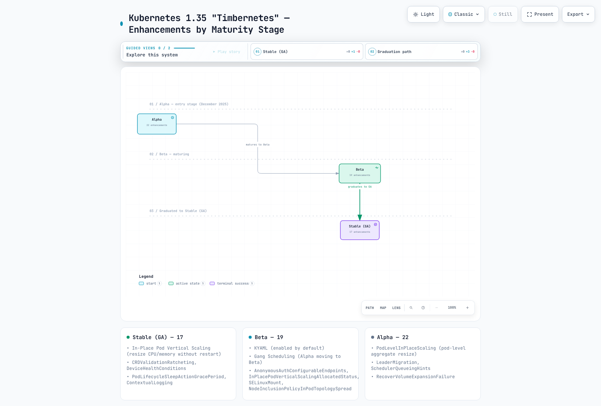

[🔍 View interactive diagram](https://www.atomai.click/kubernetes-docs/archmaps/en-eks-12-kubernetes-version-roadmap-15.html)

#### In-place container resource resize — GA

The feature’s path is alpha 1.27, beta 1.33 and stable 1.35. The original alpha was not simply “CPU-only until 1.33.” GA stabilizes the API; it does not guarantee every memory resize, runtime, node policy or application avoids disruption. Use the preceding resize example’s UID/resourceVersion checks and current status fields, and review the versioned limitations.

A normal Deployment template update still triggers its rollout behavior. There is no automatic “Deployment rolling in-place resize” merely because this Pod API is GA. Resizing a managed Pod and changing its controller template are different actions. Replacement Pods use the template/admission path, so coordinate HPA, VPA, GitOps and any custom resizer rather than allowing competing resource owners.

This Deployment provides the `web-app`/`app` target used by the earlier VPA example. Images and resource values remain review inputs; the application must actually implement any Service endpoint such as port 8080. No rollout, resize or service-availability test was run against EKS.

```yaml
apiVersion: apps/v1
kind: Deployment
metadata:
  name: web-app
  namespace: version-lab
spec:
  replicas: 2
  selector:
    matchLabels:
      app: web-app
  template:
    metadata:
      labels:
        app: web-app
    spec:
      containers:
      - name: app
        image: example.invalid/version-lab/app:reviewed
        resources:
          requests:
            cpu: 500m
            memory: 256Mi
          limits:
            cpu: '1'
            memory: 512Mi
        resizePolicy:
        - resourceName: cpu
          restartPolicy: NotRequired
        - resourceName: memory
          restartPolicy: RestartContainer
```

VPA is separately versioned. `InPlaceOrRecreate` reached GA in VPA 1.6 and may recreate Pods when in-place updates fail; `InPlace` is a VPA 1.7 alpha mode requiring its own gate. Its no-eviction behavior is not a promise that all container resize policies avoid restart or that all recommendations can be applied. The earlier current-VPA example documents those requirements. Kubernetes 1.35 alone does not enable the VPA mode.

#### PreferSameNode traffic distribution — GA

The `PreferSameTrafficDistribution` feature is stable in 1.35. `PreferSameNode` expresses a preference for local-node endpoints when available, with fallback; it is different from a strict `internalTrafficPolicy: Local` rule. Verify the actual Service implementation, ready endpoints and traffic-policy precedence. It is not a universal control over ALB/NLB routing or a guarantee of zero cross-zone traffic.

```yaml
apiVersion: v1
kind: Service
metadata:
  name: prefer-same-node
  namespace: version-lab
spec:
  trafficDistribution: PreferSameNode
  selector:
    app: web-app
  ports:
  - port: 80
    targetPort: 8080
```

#### KYAML — beta, enabled by default in kubectl

KYAML’s beta/default enablement in 1.35 concerns the `-o kyaml` output format. It does not switch all API-server input to a new strict parser, warn on every YAML anchor, or require an EKS support ticket to change a server feature gate. The preceding local formatting example and native 1.36.2 checks show the actual behavior. KYAML becomes stable in 1.37, not 1.36.

#### Native gang scheduling — alpha, KEP-4671

Kubernetes 1.35 introduced native workload-aware/gang scheduling concepts. They remain alpha in 1.36, with `GenericWorkload`/`GangScheduling` and the appropriate API/scheduler enablement required. EKS’s version FAQ does not support alpha features; a self-managed node gate cannot enable an unavailable EKS control-plane API.

The following is a **1.36 `v1alpha2` schema example for an upstream experimental environment**, not the earlier 1.35 schema or a GA EKS recipe. It uses `spec.schedulingPolicy.gang.minCount` and Pod `spec.schedulingGroup.podGroupName`. The old `minMember`/`scheduleTimeoutSeconds` fields and a Pod label/schedulingGate alone do not define this native API. Third-party PodGroup CRDs have their own contracts.

```yaml
apiVersion: scheduling.k8s.io/v1alpha2
kind: PodGroup
metadata:
  name: experimental-training
  namespace: version-lab
spec:
  schedulingPolicy:
    gang:
      minCount: 8
```

```yaml
apiVersion: batch/v1
kind: Job
metadata:
  name: experimental-training
  namespace: version-lab
spec:
  completionMode: Indexed
  completions: 8
  parallelism: 8
  backoffLimit: 0
  template:
    spec:
      restartPolicy: Never
      schedulingGroup:
        podGroupName: experimental-training
      containers:
      - name: worker
        image: example.invalid/version-lab/worker:reviewed
        resources:
          requests:
            cpu: 100m
            memory: 64Mi
          limits:
            cpu: '1'
            memory: 256Mi
```

The minimum group size and Job parallelism/completions are all eight. This is a standalone group illustration: an owner/controller must manage the group lifecycle and keep its association stable while Pods are scheduled. A scheduling decision does not guarantee simultaneous process startup, readiness, successful distributed computation or freedom from every deadlock. The application still needs barriers, timeout/recovery logic and compatible capacity. These objects were schema-checked only; no group-placement experiment was executed.

#### Selected version and upgrade considerations

| Topic | Correct interpretation |
|---|---|
| JobManagedBy | GA in 1.35 |
| ImageVolume | Beta, now enabled by default; GA is 1.36 |
| PodLevelResources | Still beta after its 1.34 graduation to beta |
| UserNamespacesSupport | Still beta; GA is 1.36 |
| ContextualLogging | Still beta, not GA in 1.35 |
| CRDValidationRatcheting | Already GA in 1.33 |
| NodeInclusionPolicyInPodTopologySpread | Already GA in 1.33 |
| RecoverVolumeExpansionFailure / configurable anonymous endpoints | Already GA in 1.34 |

For node upgrades, check cgroup/runtime requirements rather than assuming “GA means production safe.” EKS’s 1.35 notes describe the kubelet’s default refusal of cgroup v1 and provider-specific cases such as Fargate; do not edit managed Fargate host settings. Kubernetes 1.35 is the last release supporting containerd 1.x in that guidance, and the kubelet `--pod-infra-container-image` flag was removed. Use current EKS node/AMI procedures and the upgrade chapter; do not blindly override bootstrap flags.

[Kubernetes 1.35 release](https://kubernetes.io/blog/2025/12/17/kubernetes-v1-35-release/) · [Versioned 1.36 feature gates](https://github.com/kubernetes/kubernetes/blob/v1.36.2/pkg/features/kube_features.go) · [Kubernetes 1.36.2 API schema](https://github.com/kubernetes/kubernetes/blob/v1.36.2/api/openapi-spec/swagger.json) · [EKS version notes](https://docs.aws.amazon.com/eks/latest/userguide/kubernetes-versions-standard.html)

---

### 4.8 Kubernetes 1.36 "Haru" (April 2026)

The April 22 announcement reports **70 enhancements**, including **18 stable, 25 beta and 25 alpha** in its maturity breakdown. The three groups total 68; the original chapter incorrectly used that subtotal as the release total. EKS availability is recorded separately in the support calendar.

<!-- Parent repair: release total is70, not68; verify stage/default/provider labels before restoring.
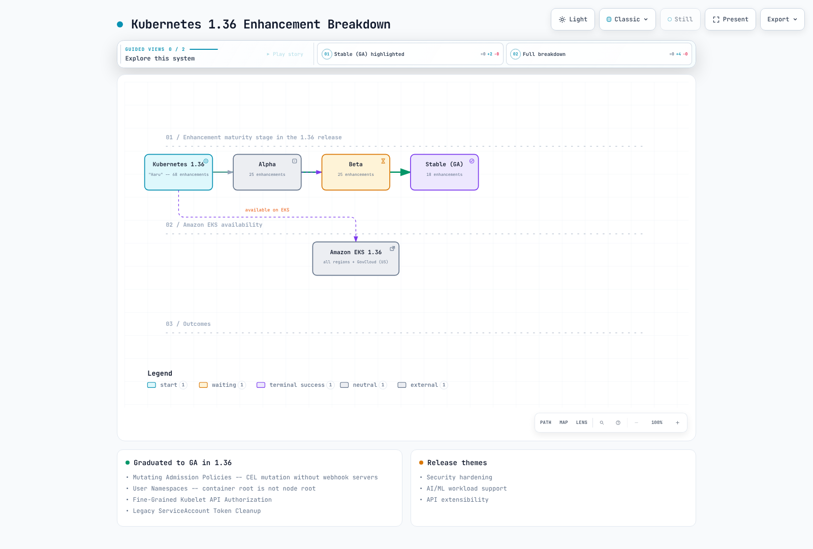

[🔍 View interactive diagram](https://www.atomai.click/kubernetes-docs/archmaps/en-eks-12-kubernetes-version-roadmap-17.html)
-->

#### MutatingAdmissionPolicy — GA

MAP’s stable resources are `MutatingAdmissionPolicy` and `MutatingAdmissionPolicyBinding` in `admissionregistration.k8s.io/v1`. In-process CEL avoids a separate webhook for supported mutations, but does not remove policy failures, cost limits, ordering or reinvocation considerations. Determinism is not a universal idempotency guarantee.

The resize-policy example below is explicitly opt-in. It adds defaults only to containers without a populated `resizePolicy`, preserving existing explicit policies. Kubernetes CEL supports `indexOf()`; the original expression was valid, but it overwrote existing policies. A native Kubernetes 1.36.2 compiler/patcher test verified both the original behavior and this correction. `resizePolicy` is an atomic list, so the ApplyConfiguration patcher rejects mutation of that field; JSONPatch is appropriate here. A JSONPatch `test` failure inside MAP is treated as a no-op by this implementation, not an automatic admission denial.

```yaml
apiVersion: admissionregistration.k8s.io/v1
kind: MutatingAdmissionPolicy
metadata:
  name: inject-resizepolicy
spec:
  failurePolicy: Fail
  reinvocationPolicy: Never
  matchConstraints:
    resourceRules:
    - apiGroups:
      - ''
      apiVersions:
      - v1
      operations:
      - CREATE
      resources:
      - pods
  matchConditions:
  - name: only-resize-enabled
    expression: has(object.metadata.annotations) && ("resize.example.com/enabled"
      in object.metadata.annotations) && object.metadata.annotations["resize.example.com/enabled"]
      == "true"
  mutations:
  - patchType: JSONPatch
    jsonPatch:
      expression: "object.spec.containers.filter(c, !has(c.resizePolicy)).map(c, JSONPatch{\n\
        \  op: \"add\",\n  path: \"/spec/containers/\" + string(object.spec.containers.indexOf(c))\
        \ + \"/resizePolicy\",\n  value: [\n    {\"resourceName\": \"cpu\",    \"\
        restartPolicy\": \"NotRequired\"},\n    {\"resourceName\": \"memory\", \"\
        restartPolicy\": \"RestartContainer\"}\n  ]\n})"
---
apiVersion: admissionregistration.k8s.io/v1
kind: MutatingAdmissionPolicyBinding
metadata:
  name: inject-resizepolicy-binding
spec:
  policyName: inject-resizepolicy
  matchResources:
    namespaceSelector:
      matchLabels:
        map-demo: 'true'
```

Only label owned test namespaces for this binding. `failurePolicy: Fail` can still reject matching Pod creation if evaluation fails. Verify policy readiness, negative cases and the full admission chain before enabling it for workloads; a fixed sleep after policy creation is not a readiness guarantee. Observing an injected field alone does not identify which admission component produced it.

#### In-place resize and Pod-level budgets

Per-container resize was already GA in 1.35. The separate `InPlacePodLevelResourcesVerticalScaling` feature becomes beta/default-enabled in 1.36, alongside the still-beta PodLevelResources feature. Pod-level budgets and container limits require distinct accounting and policy checks. This example is not managed by the CPU-downscale prototype below, which deliberately rejects Pod-level budgets.

```yaml
apiVersion: v1
kind: Pod
metadata:
  name: pod-budget-example
  namespace: version-lab
spec:
  os:
    name: linux
  nodeSelector:
    kubernetes.io/os: linux
  resources:
    requests:
      cpu: '2'
      memory: 4Gi
    limits:
      cpu: '4'
      memory: 8Gi
  containers:
  - name: app
    image: example.invalid/version-lab/app:reviewed
    resources:
      requests:
        cpu: '1'
        memory: 2Gi
  - name: helper
    image: example.invalid/version-lab/helper:reviewed
    resources:
      requests:
        cpu: 500m
        memory: 512Mi
```

CPUManager checkpoint improvements do not establish that every static CPU/Memory-manager workload can resize or preserve a specific NUMA placement. Those paths have separate feature/support requirements. `NotRequired` avoids a policy-mandated restart, not all possible disruption. With `RestartContainer`, a resource change requests a restart; with `NotRequired`, memory shrink is best effort and may stall or race with an OOM. Monitor actual container resources and application behavior.

#### User namespaces, kubelet authorization and device health

UserNamespacesSupport becomes GA in **1.36**; its gate is still present and locked in the released 1.36.2 source. Pods opt in with `hostUsers: false`, with compatible kernel/filesystem/runtime requirements. UID remapping is defense in depth, not proof that every escape is harmless or that all applications need no changes.

KubeletFineGrainedAuthz also becomes GA. It adds finer checks for `/pods`, `/runningPods`, `/configz` and `/healthz` before the broader `nodes/proxy` fallback. `/metrics`, `/stats` and `/logs` already have their own subresource distinctions. Do not confuse this with Node authorizer rules governing a kubelet’s access to the API server; review the caller’s actual permissions and avoid broad proxy access where narrower access suffices.

ResourceHealthStatus becomes beta in 1.36 and can report per-device health for device plugins and DRA. Inspect `status.containerStatuses[].allocatedResourcesStatus`; `status.resourceClaimStatuses` instead maps claim references/generated names. Missing, Unknown or Unhealthy status needs driver/node/application correlation and does not by itself prove root cause or authorize device reset.

```bash
# Read-only per-container resource health; no device reset or Pod deletion.
set -euo pipefail
: "${KUBE_CONTEXT:?}"; : "${NAMESPACE:?}"; : "${POD_NAME:?}"
kubectl --context "$KUBE_CONTEXT" --request-timeout=15s -n "$NAMESPACE" get pod "$POD_NAME" -o json |
  jq '{uid:.metadata.uid,containers:[.status.containerStatuses[]? |
       {name,allocatedResourcesStatus}]}'
```

LegacyServiceAccountTokenCleanUp was already GA in **1.30**, not newly GA in 1.36. Cleanup distinguishes auto-generated legacy token Secrets through ServiceAccount references and other use/mount conditions. The default unused interval is one year before invalidation, with further unused time before deletion. It does not mean all old or manually created tokens are removed. Prefer bounded TokenRequest tokens; never print token values as an audit shortcut.

#### SELinux, networking and other compatibility changes

The released 1.36.2 gate definitions distinguish **SELinuxMountReadWriteOncePod** and **SELinuxChangePolicy** (GA) from **SELinuxMount** (still beta/default-false). Some summary documentation describes this more broadly. Check the actual node and provider configuration, CSI support and volume-sharing patterns instead of claiming that every volume now uses the same mount-label behavior. Shared volumes with different SELinux labels can require explicit review.

`StrictIPCIDRValidation` becomes beta/default-enabled in 1.36. Use canonical IP/CIDR values when creating or changing checked built-in fields; existing stored values may use validation-ratcheting compatibility, and this is not automatic normalization of all CRDs. The `gitRepo` volume driver is permanently disabled in 1.36 even though the API schema can still accept the field: the kubelet refuses to run such volumes. Migrate the workload pattern before upgrading.

Service `externalIPs` is deprecated in 1.36; the published removal target is a future plan, not removal in this release. Upstream 1.36.2 still contains and instantiates the IPVS proxier. The AWS version summary’s removal wording conflicts with that upstream code; do not turn it into a universal upstream-removal claim or assume a particular EKS add-on image remains supported. Check the chosen EKS add-on and migration path separately. No EKS IPVS runtime was tested here.

ImageVolume and NodeLogQuery are GA in 1.36. DRA partitionable devices, consumable capacity and device-binding conditions have their own beta gates. KYAML remains a kubectl beta feature in 1.36 (stable in 1.37), while GenericWorkload/GangScheduling remain alpha in 1.36. Earlier GA features must not be re-labeled as new 1.36 graduations.

#### Phase-aware CPU downscale prototype

A startup-heavy application can benefit from a different steady-state CPU allocation, but the correct floor must be measured for that application. Kubernetes `Running` is not a warmup-complete signal. The following **experimental, unexecuted-in-cluster controller** uses a real startupProbe signal by default and a narrow CPU-only contract. It is not a production-ready controller or an availability guarantee.

Its required inputs are one `WATCH_NAMESPACE` and a reviewed positive `MIN_STEADY_CPU`. It watches only Pods labeled `resize.example.com/managed=true` in that namespace and also requires the opt-in annotation. Label/annotation selection is not an authorization boundary; workload writers in that namespace must be trusted. The example only accepts explicitly selected Linux, container-level Guaranteed Pods whose app/init CPU and memory requests equal limits. It refuses memory changes, upscale, invalid targets, unsupported CPU restart policies, pending resize and unacknowledged/unequal observed resources.

StartupProbePassed requires an actual startupProbe and `started=true` for every target. Ready and Delay are explicit alternative triggers; Ready needs a meaningful readiness signal, while Delay is only a timer and does not prove warmup completion. The 30-second resync and API/reconciliation latency mean none of these are exact timing guarantees.

Use matching dependencies (the audit used Go 1.27.1 with Kubernetes libraries v0.36.2):

```text
module example.com/pod-resizer

go 1.26.0

require (
    k8s.io/api v0.36.2
    k8s.io/apimachinery v0.36.2
    k8s.io/client-go v0.36.2
)
```

```go
// Experimental CPU-downscale controller for Kubernetes 1.36.
// Not a production-readiness or zero-downtime guarantee.
package main

import (
	"context"
	"encoding/json"
	"errors"
	"fmt"
	"io"
	"log"
	"os"
	"os/signal"
	"strconv"
	"strings"
	"sync"
	"syscall"
	"time"

	corev1 "k8s.io/api/core/v1"
	apierrors "k8s.io/apimachinery/pkg/api/errors"
	"k8s.io/apimachinery/pkg/api/resource"
	metav1 "k8s.io/apimachinery/pkg/apis/meta/v1"
	"k8s.io/apimachinery/pkg/types"
	"k8s.io/apimachinery/pkg/util/validation"
	"k8s.io/client-go/informers"
	"k8s.io/client-go/kubernetes"
	"k8s.io/client-go/rest"
	"k8s.io/client-go/tools/cache"
	"k8s.io/client-go/util/workqueue"
)

const (
	managedLabel = "resize.example.com/managed"
	annEnabled   = "resize.example.com/enabled"
	annTrigger   = "resize.example.com/trigger"
	annDelay     = "resize.example.com/delay-seconds"
	annSteady    = "resize.example.com/steady-resources"
)

type config struct {
	namespace string
	minCPU    resource.Quantity
}

type resourceValues struct {
	Requests map[string]string `json:"requests"`
	Limits   map[string]string `json:"limits"`
}

type patchOperation struct {
	Op    string `json:"op"`
	Path  string `json:"path"`
	Value any    `json:"value"`
}

func main() {
	namespace := os.Getenv("WATCH_NAMESPACE")
	minCPU, err := resource.ParseQuantity(os.Getenv("MIN_STEADY_CPU"))
	if len(validation.IsDNS1123Label(namespace)) != 0 || err != nil || minCPU.Sign() <= 0 {
		log.Fatal("Set one valid WATCH_NAMESPACE and a reviewed positive MIN_STEADY_CPU")
	}
	cfg := config{namespace: namespace, minCPU: minCPU}
	ctx, stop := signal.NotifyContext(context.Background(), os.Interrupt, syscall.SIGTERM)
	defer stop()
	clientConfig, err := rest.InClusterConfig()
	if err != nil {
		log.Fatal("In-cluster client configuration unavailable")
	}
	clientConfig.QPS, clientConfig.Burst = 5, 10
	client, err := kubernetes.NewForConfig(clientConfig)
	if err != nil {
		log.Fatal("Client initialization failed")
	}
	factory := informers.NewSharedInformerFactoryWithOptions(client, 30*time.Second,
		informers.WithNamespace(namespace),
		informers.WithTweakListOptions(func(options *metav1.ListOptions) {
			options.LabelSelector = managedLabel + "=true"
		}))
	informer := factory.Core().V1().Pods().Informer()
	queue := workqueue.NewTypedRateLimitingQueue(workqueue.DefaultTypedControllerRateLimiter[string]())
	enqueue := func(obj any) {
		key, err := cache.MetaNamespaceKeyFunc(obj)
		if err == nil {
			queue.Add(key)
		}
	}
	_, err = informer.AddEventHandler(cache.ResourceEventHandlerFuncs{
		AddFunc: enqueue, UpdateFunc: func(_, current any) { enqueue(current) },
	})
	if err != nil {
		log.Fatal("Informer handler registration failed")
	}
	factory.Start(ctx.Done())
	if !cache.WaitForCacheSync(ctx.Done(), informer.HasSynced) {
		queue.ShutDown()
		return
	}
	log.Printf("Cache synchronized; watching one namespace: %s", namespace)
	var workers sync.WaitGroup
	workers.Add(1)
	go func() {
		defer workers.Done()
		for {
			key, shutdown := queue.Get()
			if shutdown {
				return
			}
			obj, exists, err := informer.GetIndexer().GetByKey(key)
			if err == nil && exists {
				pod, ok := obj.(*corev1.Pod)
				if ok {
					err = requestResize(ctx, client, pod, cfg, time.Now())
				}
			}
			if err != nil && ctx.Err() == nil && queue.NumRequeues(key) < 5 {
				queue.AddRateLimited(key)
			} else {
				queue.Forget(key)
				if err != nil {
					log.Printf("Request failed for %s (%s); later events/resync may retry", key, apierrors.ReasonForError(err))
				}
			}
			queue.Done(key)
		}
	}()
	<-ctx.Done()
	queue.ShutDown()
	workers.Wait()
}

func requestResize(ctx context.Context, client kubernetes.Interface, pod *corev1.Pod, cfg config, now time.Time) error {
	patch, err := buildResizePatch(pod, cfg, now)
	if err != nil {
		// Do not log annotation values, credentials or entire Pod objects.
		log.Printf("Configuration needs review for %s/%s: %v", pod.Namespace, pod.Name, err)
		return nil // Retry only on a later event/resync, not a tight error loop.
	}
	if len(patch) == 0 {
		return nil
	}
	requestCtx, cancel := context.WithTimeout(ctx, 10*time.Second)
	defer cancel()
	_, err = client.CoreV1().Pods(pod.Namespace).Patch(requestCtx, pod.Name,
		types.JSONPatchType, patch, metav1.PatchOptions{}, "resize")
	if err == nil {
		log.Printf("RESIZE_REQUESTED %s/%s uid=%s; verify kubelet status separately",
			pod.Namespace, pod.Name, pod.UID)
	}
	return err
}

func buildResizePatch(pod *corev1.Pod, cfg config, now time.Time) ([]byte, error) {
	if pod == nil || pod.Namespace != cfg.namespace || pod.Labels[managedLabel] != "true" ||
		pod.Annotations[annEnabled] != "true" || pod.DeletionTimestamp != nil ||
		pod.Status.Phase != corev1.PodRunning {
		return nil, nil
	}
	if pod.UID == "" || pod.ResourceVersion == "" {
		return nil, errors.New("missing Pod identity/version")
	}
	// This prototype deliberately handles only container-level Guaranteed Linux Pods.
	if pod.Spec.OS == nil || pod.Spec.OS.Name != corev1.Linux ||
		pod.Spec.NodeSelector[corev1.LabelOSStable] != "linux" ||
		pod.Spec.Resources != nil || pod.Status.QOSClass != corev1.PodQOSGuaranteed {
		return nil, errors.New("prototype requires declared Linux, container-level Guaranteed resources")
	}
	for _, c := range append(append([]corev1.Container{}, pod.Spec.Containers...), pod.Spec.InitContainers...) {
		for _, name := range []corev1.ResourceName{corev1.ResourceCPU, corev1.ResourceMemory} {
			request, hasRequest := c.Resources.Requests[name]
			limit, hasLimit := c.Resources.Limits[name]
			if !hasRequest || !hasLimit || request.Sign() <= 0 || request.Cmp(limit) != 0 {
				return nil, errors.New("all app/init resources must satisfy the Guaranteed contract")
			}
		}
	}
	if pod.Status.ObservedGeneration < pod.Generation {
		return nil, nil
	}
	for _, condition := range pod.Status.Conditions {
		if condition.Status == corev1.ConditionTrue &&
			(condition.Type == corev1.PodResizePending || condition.Type == corev1.PodResizeInProgress) {
			return nil, nil
		}
	}
	raw := pod.Annotations[annSteady]
	if len(raw) == 0 || len(raw) > 4096 {
		return nil, errors.New("missing or oversized steady-resources annotation")
	}
	var desired map[string]resourceValues
	decoder := json.NewDecoder(strings.NewReader(raw))
	decoder.DisallowUnknownFields()
	if err := decoder.Decode(&desired); err != nil {
		return nil, errors.New("invalid steady-resources JSON shape")
	}
	if err := decoder.Decode(new(any)); err != io.EOF || len(desired) == 0 {
		return nil, errors.New("expected one nonempty steady-resources object")
	}
	trigger := pod.Annotations[annTrigger]
	if trigger == "" {
		trigger = "StartupProbePassed"
	}
	delay := 0
	switch trigger {
	case "StartupProbePassed", "Ready":
	case "Delay":
		var err error
		delay, err = strconv.Atoi(pod.Annotations[annDelay])
		if err != nil || delay < 1 || delay > 3600 {
			return nil, errors.New("Delay requires an integer from1 to3600 seconds")
		}
	default:
		return nil, errors.New("unknown trigger")
	}
	podReady := false
	for _, condition := range pod.Status.Conditions {
		if condition.Type == corev1.PodReady && condition.Status == corev1.ConditionTrue {
			podReady = true
		}
	}
	statuses := make(map[string]corev1.ContainerStatus, len(pod.Status.ContainerStatuses))
	for _, status := range pod.Status.ContainerStatuses {
		statuses[status.Name] = status
	}
	ops := []patchOperation{
		{Op: "test", Path: "/metadata/uid", Value: string(pod.UID)},
		{Op: "test", Path: "/metadata/resourceVersion", Value: pod.ResourceVersion},
	}
	matched := 0
	for i, container := range pod.Spec.Containers {
		values, selected := desired[container.Name]
		if !selected {
			continue
		}
		matched++
		if len(values.Requests) != 1 || len(values.Limits) != 1 ||
			values.Requests["cpu"] == "" || values.Limits["cpu"] == "" {
			return nil, errors.New("only explicit CPU request and limit are supported")
		}
		request, errRequest := resource.ParseQuantity(values.Requests["cpu"])
		limit, errLimit := resource.ParseQuantity(values.Limits["cpu"])
		current := container.Resources.Requests[corev1.ResourceCPU]
		if errRequest != nil || errLimit != nil || request.Sign() <= 0 ||
			request.Cmp(limit) != 0 || request.Cmp(cfg.minCPU) < 0 || request.Cmp(current) > 0 {
			return nil, errors.New("CPU target must be equal, positive, above the floor and no larger than current")
		}
		for _, policy := range container.ResizePolicy {
			if policy.ResourceName == corev1.ResourceCPU && policy.RestartPolicy == corev1.RestartContainer {
				return nil, errors.New("CPU restart policy is incompatible with this prototype")
			}
		}
		status, exists := statuses[container.Name]
		if !exists || status.State.Running == nil || status.Resources == nil {
			return nil, nil
		}
		observedRequest, rqOK := status.Resources.Requests[corev1.ResourceCPU]
		observedLimit, lmOK := status.Resources.Limits[corev1.ResourceCPU]
		if !rqOK || !lmOK || observedRequest.Cmp(current) != 0 || observedLimit.Cmp(current) != 0 {
			return nil, nil
		}
		switch trigger {
		case "StartupProbePassed":
			if container.StartupProbe == nil {
				return nil, errors.New("StartupProbePassed requires a real startupProbe on every target")
			}
			if status.Started == nil || !*status.Started {
				return nil, nil
			}
		case "Ready":
			if !podReady {
				return nil, nil
			}
		case "Delay":
			if status.State.Running.StartedAt.IsZero() ||
				now.Sub(status.State.Running.StartedAt.Time) < time.Duration(delay)*time.Second {
				return nil, nil
			}
		}
		if request.Cmp(current) == 0 {
			continue
		}
		base := fmt.Sprintf("/spec/containers/%d", i)
		ops = append(ops,
			patchOperation{Op: "test", Path: base + "/name", Value: container.Name},
			patchOperation{Op: "replace", Path: base + "/resources/requests/cpu", Value: request.String()},
			patchOperation{Op: "replace", Path: base + "/resources/limits/cpu", Value: request.String()})
	}
	if matched != len(desired) {
		return nil, errors.New("steady-resources contains an unknown regular container")
	}
	if len(ops) == 2 {
		return nil, nil
	}
	return json.Marshal(ops)
}
```

Successful PATCH is logged as `RESIZE_REQUESTED`; it is not marked completed. UID/resourceVersion tests reject a stale name or changed object. A work queue bounds retries, handles cancellation and avoids the old ever-growing processed-UID map. The prototype does not restore startup CPU for a container restart inside an existing Pod, coordinate another HPA/VPA/GitOps writer, implement deployment packaging/readiness/HA policy, or prove application SLOs. Different workload controllers can create eligible Pods, but their rollout/replacement/storage behavior still requires integration testing.

The ServiceAccount has namespace-scoped Pod reads and only the resize subresource for writes; it has no general Pod patch or Secret-read permission. Prepare the existing namespace/labels, build and review the controller image, run it as this ServiceAccount, and set the two required environment variables. The `50m` demo floor is illustrative, not a generic production recommendation.

```yaml
apiVersion: v1
kind: Namespace
metadata:
  name: version-lab
  labels:
    map-demo: 'true'
---
apiVersion: v1
kind: ServiceAccount
metadata:
  name: pod-resizer
  namespace: version-lab
---
apiVersion: rbac.authorization.k8s.io/v1
kind: Role
metadata:
  name: pod-resizer
  namespace: version-lab
rules:
- apiGroups:
  - ''
  resources:
  - pods
  verbs:
  - get
  - list
  - watch
- apiGroups:
  - ''
  resources:
  - pods/resize
  verbs:
  - patch
---
apiVersion: rbac.authorization.k8s.io/v1
kind: RoleBinding
metadata:
  name: pod-resizer
  namespace: version-lab
subjects:
- kind: ServiceAccount
  name: pod-resizer
  namespace: version-lab
roleRef:
  apiGroup: rbac.authorization.k8s.io
  kind: Role
  name: pod-resizer
```

The workload below aligns with the controller contract. It models warmup using sleep, not real CPU work, and preserves the historical 200m→50m/64Mi demo inputs. Review/pin the image before use. The startup process creates the readiness file; the probe only checks it. This fixes the original probe that slept eight seconds despite a one-second default timeout and relied on a file the main process never created.

```yaml
apiVersion: apps/v1
kind: Deployment
metadata:
  name: phase-aware-demo
  namespace: version-lab
spec:
  replicas: 2
  selector:
    matchLabels:
      app: phase-aware-demo
  template:
    metadata:
      labels:
        app: phase-aware-demo
        resize.example.com/managed: 'true'
      annotations:
        resize.example.com/enabled: 'true'
        resize.example.com/trigger: StartupProbePassed
        resize.example.com/steady-resources: '{"app":{"requests":{"cpu":"50m"},"limits":{"cpu":"50m"}}}'
    spec:
      os:
        name: linux
      nodeSelector:
        kubernetes.io/os: linux
      automountServiceAccountToken: false
      containers:
      - name: app
        image: busybox:1.36
        command:
        - sh
        - -ec
        - 'echo ''starting illustrative warmup''

          sleep 10

          touch "$READY_FILE"

          echo ''readiness file created''

          exec sleep 86400'
        env:
        - name: READY_FILE
          value: /tmp/ready
        resizePolicy:
        - resourceName: cpu
          restartPolicy: NotRequired
        - resourceName: memory
          restartPolicy: RestartContainer
        resources:
          requests:
            cpu: 200m
            memory: 64Mi
          limits:
            cpu: 200m
            memory: 64Mi
        startupProbe:
          exec:
            command:
            - sh
            - -ec
            - test -f "$READY_FILE"
          initialDelaySeconds: 1
          periodSeconds: 2
          timeoutSeconds: 1
          failureThreshold: 30
```

```bash
# Read-only observation for the owned example.
set -euo pipefail
: "${KUBE_CONTEXT:?}"
kubectl --context "$KUBE_CONTEXT" --request-timeout=15s -n version-lab \
  get pods -l app=phase-aware-demo -o json | jq '.items[] | {
    name:.metadata.name,uid:.metadata.uid,generation:.metadata.generation,
    observedGeneration:.status.observedGeneration,qosClass:.status.qosClass,
    desired:[.spec.containers[] | {name,resources}],
    reported:[.status.containerStatuses[]? | {name,started,ready,resources,restartCount,containerID}],
    conditions:.status.conditions
  }'
```

The local audit ran 50 leaf unit tests with fake Kubernetes/RFC6902 behavior plus schema and host-shell probe fixtures. It did not run the informer loop against EKS, launch BusyBox, measure warmup time or validate cgroup/app performance. VPA 1.7 also provides an alpha CPUStartupBoost feature, but its trigger is Pod Ready plus an optional duration, not this StartupProbePassed contract; it has separate flags and operational trade-offs.

#### Original reported EKS snapshots — provenance not verified

The earlier chapter claimed EKS 1.36.1, containerd 2.2.3, AL2023, cgroup v2 and arm64/Graviton. Raw execution artifacts/source were not supplied. The original tables and log lines below are preserved as **unverified reported outcomes**, not reruns, current-controller output or independent proof of zero downtime. The two MAP tables repeat the original claim and are not two independent measurements.

| Case | Annotation | Injected resizePolicy | Result |
|------|-----------|------------------------|--------|
| with-annotation | present | `[{cpu:NotRequired},{memory:RestartContainer}]` | ✅ injected (no webhook) |
| without-annotation | absent | `[]` (none) | ✅ not injected (matchCondition worked) |

```text
2026/06/28 09:12:03 pod-resizer starting; watching pods annotated resize.example.com/enabled=true
2026/06/28 09:12:03 informer cache synced; ready
2026/06/28 09:12:41 RESIZED resize-demo/busybox-resize-demo-7f8b9c6d4-k2xnm [ReplicaSet] trigger=StartupProbePassed patch={"spec":{"containers":[{"name":"busybox","resources":{"limits":{"cpu":"50m"},"requests":{"cpu":"50m"}}}]}}
2026/06/28 09:12:41 RESIZED resize-demo/busybox-resize-demo-7f8b9c6d4-p9wvj [ReplicaSet] trigger=StartupProbePassed patch={"spec":{"containers":[{"name":"busybox","resources":{"limits":{"cpu":"50m"},"requests":{"cpu":"50m"}}}]}}
2026/06/28 09:13:05 RESIZED resize-demo/busybox-resize-ds-xq7zt [DaemonSet] trigger=StartupProbePassed patch={"spec":{"containers":[{"name":"busybox","resources":{"limits":{"cpu":"50m"},"requests":{"cpu":"50m"}}}]}}
2026/06/28 09:13:22 RESIZED resize-demo/busybox-resize-sts-0 [StatefulSet] trigger=StartupProbePassed patch={"spec":{"containers":[{"name":"busybox","resources":{"limits":{"cpu":"50m"},"requests":{"cpu":"50m"}}}]}}
```

| Workload | QoS | CPU (req/lim) | restartCount | containerID |
|----------|-----|---------------|--------------|-------------|
| Deployment (x2) | Guaranteed -> **Guaranteed** | 200m -> **50m** | 0 -> **0** | **Identical** |
| DaemonSet | Guaranteed -> **Guaranteed** | 200m -> **50m** | 0 -> **0** | **Identical** |
| StatefulSet | Guaranteed -> **Guaranteed** | 200m -> **50m** | 0 -> **0** | **Identical** |

| Case | Annotation Present | Injected resizePolicy | Verdict |
|------|-------------------|----------------------|---------|
| with-annotation | Yes | `[{cpu:NotRequired},{memory:RestartContainer}]` | Injected (no webhook needed) |
| without-annotation | No | `[]` (none) | Not injected (matchCondition working) |

The old `RESIZED` log was emitted after API PATCH success. Stable containerID/restartCount and a desired-spec change do not alone prove cgroup actuation, application latency or absence of dropped requests. Verification requires matching Pod UID/time windows, kubelet-reported actual resources/generation and appropriate runtime/application observations. No historical numerical value was upgraded to a new Kubernetes version or presented as newly measured.

[Kubernetes 1.36 release](https://kubernetes.io/blog/2026/04/22/kubernetes-v1-36-release/) · [1.36.2 feature definitions](https://github.com/kubernetes/kubernetes/blob/v1.36.2/pkg/features/kube_features.go) · [Kubelet authorization](https://kubernetes.io/docs/reference/access-authn-authz/kubelet-authn-authz/) · [ServiceAccount administration](https://kubernetes.io/docs/reference/access-authn-authz/service-accounts-admin/) · [SELinux security context](https://kubernetes.io/docs/tasks/configure-pod-container/security-context/) · [Released IPVS selection path](https://github.com/kubernetes/kubernetes/blob/v1.36.2/cmd/kube-proxy/app/server_linux.go) · [VPA 1.7.1 features](https://github.com/kubernetes/autoscaler/blob/vertical-pod-autoscaler-1.7.1/vertical-pod-autoscaler/docs/features.md)

---

<span id="5-key-feature-graduation-timeline"></span>

## 5. Key Feature Graduation Timeline

This table summarizes selected upstream history **through Kubernetes 1.36**, primarily from the released 1.36.2 gate definitions and official removed-gate history. “Beta” means its first beta release, not necessarily default enablement. A dash does not promise a future milestone. API availability, runtime/driver prerequisites and EKS support still require separate checks.

| Feature | First alpha | First beta | Stable by 1.36 |
|---|---|---|---|
| Sidecar containers | 1.28 | 1.29 | 1.33 |
| Container in-place resize | 1.27 | 1.33 | 1.35 |
| Pod scheduling readiness | 1.26 | 1.27 | 1.30 |
| Job success policy | 1.30 | 1.31 | 1.33 |
| Pod-level resources | 1.32 | 1.34 | — |
| ValidatingAdmissionPolicy | 1.26 | 1.28 | 1.30 |
| MutatingAdmissionPolicy | 1.32 | 1.34 | 1.36 |
| Structured authorization | 1.29 | 1.30 | 1.32 |
| AppArmor native fields | — | 1.30 | 1.31 |
| User namespaces | 1.25 | 1.30 | 1.36 |
| ServiceCIDR/IPAddress | 1.27 | 1.31 | 1.33 |
| Topology-aware hints | 1.21 | 1.23 | 1.33 |
| nftables proxy | 1.29 | 1.31 | 1.33 |
| Service traffic distribution | 1.30 | 1.31 | 1.33 |
| Same-node/zone preferences | 1.33 | 1.34 | 1.35 |
| ReadWriteOncePod | 1.22 | 1.27 | 1.29 |
| VolumeAttributesClass | 1.29 | 1.31 | 1.34 |
| PV last phase transition | 1.28 | 1.29 | 1.31 |
| Volume expansion recovery | 1.23 | 1.32 | 1.34 |
| Gang scheduling | 1.35 | — | — |
| Minimum topology domains | 1.24 | 1.25 | 1.30 |
| DRA core | 1.26 | 1.32 | 1.34 |
| HPA container metrics | 1.20 | 1.27 | 1.30 |
| Image volumes | 1.31 | 1.33 | 1.36 |
| Node log query | 1.27 | 1.30 | 1.36 |
| KMS v2 | 1.25 | 1.27 | 1.29 |
| Kubelet tracing | 1.25 | 1.27 | 1.34 |
| KYAML | 1.34 | 1.35 | — |

Important lineage details:

- AppArmor annotations existed as beta from 1.4; the row tracks the newer native fields (beta 1.30, GA 1.31).
- User-namespace work began with earlier limited/stateless support; the released gate history records alpha 1.25, beta 1.30, default enablement 1.33 and GA 1.36. Do not infer gate removal from the GA date.
- DRA’s alpha 1.26 belongs to its original design. The later structured-parameter redesign (KEP-4381) is not an unchanged API lineage; classic DRA remained gated in 1.31 and was removed in 1.32. Current stable request syntax uses `exactly`.
- Native gang scheduling is KEP-4671 and remains alpha through 1.36. KYAML is KEP-5295 and becomes stable in upstream 1.37, outside the table’s coverage; neither was GA in 1.36.
- Beta defaults changed independently: UserNamespacesSupport became default-on in 1.33, ImageVolume in 1.35, and PodLevelResources first entered beta in 1.34.

Gateway API is a separately released API/CRD project. Do not assign its channels, kind versions or feature conformance to Kubernetes “alpha 1.18 / GA 1.26.” Likewise, VPA’s update modes, Karpenter and CSI drivers have their own release/support matrices. A core API graduation does not certify those components or make every example production-ready.

<!-- Parent repair: graduation diagram has stale DRA/Gang and other milestone assertions.
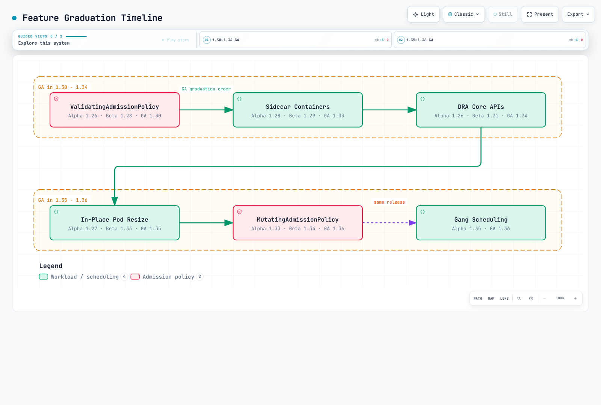

[🔍 View interactive diagram](https://www.atomai.click/kubernetes-docs/archmaps/en-eks-12-kubernetes-version-roadmap-14.html)
-->

[Released Kubernetes 1.36.2 feature history](https://github.com/kubernetes/kubernetes/blob/v1.36.2/pkg/features/kube_features.go) · [Feature gates](https://kubernetes.io/docs/reference/command-line-tools-reference/feature-gates/) · [Removed gates](https://kubernetes.io/docs/reference/command-line-tools-reference/feature-gates-removed/) · [KYAML history](https://github.com/kubernetes/enhancements/tree/master/keps/sig-cli/5295-kyaml)

---

<span id="6-deprecations-and-removals"></span>

## 6. Deprecations and Removals

### Distinguish API versions, fields, implementations and gates

A GA **API version** must not be removed within the same Kubernetes major version. That is not the same as a CLI flag, a feature gate, an individual field or a volume implementation. Beta API retirement has its own minimum timing: nine months or three minor releases after deprecation, whichever is longer. Alpha APIs can change or disappear without that guarantee. The original “GA APIs may be removed after12months/3releases” rule was incorrect.

Gate deprecation/removal follows separate rules, and the actual release must be checked. Do not remove/disable a gate merely by adding two to its GA release number. The earlier version sections and released code distinguish default enablement, locking and actual removal.

### Selected API retirement points

| API and kinds | No longer served from | Current replacement / migration concern |
|---|---|---|
| `autoscaling/v2beta1` HPA | 1.25 | `autoscaling/v2`; inspect metric schema |
| `autoscaling/v2beta2` HPA | 1.26 | `autoscaling/v2` |
| `batch/v1beta1` CronJob | 1.25 | `batch/v1` |
| `policy/v1beta1` PDB | 1.25 | `policy/v1`; empty-selector semantics differ |
| `flowcontrol.apiserver.k8s.io/v1beta2` FlowSchema/PriorityLevelConfiguration | 1.29 | `v1`; review concurrency-share field/default changes |
| `flowcontrol.apiserver.k8s.io/v1beta3` FlowSchema/PriorityLevelConfiguration | 1.32 | `v1` |
| `admissionregistration.k8s.io/v1beta1` ValidatingAdmissionPolicy/Binding | 1.34 | `v1`; do not confuse with MutatingAdmissionPolicy in the same group/version |
| `resource.k8s.io/v1alpha3` ResourceClaim/Template, DeviceClass, ResourceSlice | 1.34 | Stable `v1` for current use; old stored representations need the release-specific migration plan |
| `storage.k8s.io/v1beta1` CSIDriver, CSINode, StorageClass, VolumeAttachment | 1.22 | `storage.k8s.io/v1` |
| `storage.k8s.io/v1beta1` CSIStorageCapacity | 1.27 | `storage.k8s.io/v1` |
| Beta Ingress / CRD / admission-webhook configuration APIs | 1.22 | Stable `v1`; conversion includes schema/field changes |

The resource group still has other `v1alpha3` kinds, so do not declare the entire group/version removed based on the four retired core DRA kinds. The 1.34 changelog also warns about old stored DRA representations. Coordinate backup, workload/claim ownership and the prescribed migration/recreation path; do not blindly delete all claims or only change an `apiVersion` string.

### Beta APIs still represented in the 1.36 implementation

The released 1.36.2 lifecycle metadata and REST storage still distinguish these versions. Future removal values are recorded targets, not a promise that a future release cannot change them or that a managed service enables every API by default.

| API and kinds | Deprecated in metadata | Recorded removal target |
|---|---|---|
| DRA core `resource.k8s.io/v1beta1` | 1.35 | 1.38 |
| DRA core `resource.k8s.io/v1beta2` | 1.36 | 1.39 |
| VAC `storage.k8s.io/v1beta1` | 1.34 | 1.37 |
| MutatingAdmissionPolicy/Binding `admissionregistration.k8s.io/v1beta1` | 1.37 | 1.40 |

A GA graduation did not immediately remove those beta APIs. Conversely, an old alpha removal forecast is not authoritative when a later released changelog changes the implementation.

Other important corrections: KMS v1 is deprecated/default-disabled, not removed in 1.31; `--authorization-mode` remains an alternative to structured authorization configuration; iptables proxy mode was not removed in 1.34; IPVS is deprecated but still implemented upstream in 1.36.2. Legacy ServiceAccount Secret auto-generation changed in 1.24, not 1.33. Do not present old `kubectl --export` removal as a new 1.35 change. For in-tree storage plugins, verify the specific plugin and release, CSI migration state, volume identifiers and driver readiness rather than using a universal timeline.

### Audit stored manifests and actual client usage separately

A GET response uses the requested/preferred API representation and can hide the API version originally used by a client. `kubectl get flowschemas -o json`, API discovery, or a list of CRD conversion webhooks is not proof of deprecated API use. Nor is every `v1beta1` API deprecated. Combine rendered Git/Helm manifests, original applied configuration where available, API usage metrics/audit logs, EKS Insights and target-version tests. Check CRD served/storage versions and conversion behavior independently.

This metric can show deprecated requests observed by the serving API process; it is not a complete historical request count or a guarantee of coverage across every API-server replica. Missing metrics/access errors are not a clean result.

```bash
# Read-only, explicitly selected cluster; metrics access may be restricted.
set -euo pipefail
: "${KUBE_CONTEXT:?}"; : "${EVIDENCE_PARENT:?Existing private directory}"
umask 077
evidence_dir=$(mktemp -d "$EVIDENCE_PARENT/api-usage.XXXXXXXX")
kubectl --context "$KUBE_CONTEXT" --request-timeout=20s get --raw='/metrics' > "$evidence_dir/metrics.prom"
awk '/^apiserver_requested_deprecated_apis/ {print}' "$evidence_dir/metrics.prom"
```

### Limited offline lifecycle checker

The following example requires Python/PyYAML and an owned directory of rendered YAML/JSON manifests. Its finite catalog is pinned to the 1.36.2 review and accepts target versions 1.29–1.36. It distinguishes kinds within the same API version, rejects parse errors/empty directories and never prints resource bodies. It is **not a complete schema, client-usage or runtime compatibility audit**. It does not detect every deprecated API, semantic change or all YAML/schema problems; use a versioned schema validator with the actual CRDs as well. `notInCatalog` must be reviewed.

Exit1 means lifecycle findings, exit2 means an input/parse problem, and exit0 only means no known catalog findings in parsed input. Do not suppress those failures or label a partial scan “compatible.”

```python
"""Limited offline GVK lifecycle audit, snapshot: Kubernetes 1.36.2.
Requires PyYAML. This is not a schema, runtime or complete client-usage audit.
"""
import argparse
import json
import re
from pathlib import Path

import yaml


CATALOG = {}


def add(api, kinds, deprecated, removed, replacement):
    for kind in kinds.split(","):
        CATALOG[(api, kind)] = (deprecated, removed, replacement)


add("autoscaling/v2beta1", "HorizontalPodAutoscaler", 22, 25, "autoscaling/v2")
add("autoscaling/v2beta2", "HorizontalPodAutoscaler", 23, 26, "autoscaling/v2")
add("batch/v1beta1", "CronJob", 21, 25, "batch/v1")
add("policy/v1beta1", "PodDisruptionBudget", 21, 25, "policy/v1")
add("networking.k8s.io/v1beta1", "Ingress", 19, 22, "networking.k8s.io/v1")
add("extensions/v1beta1", "Ingress", 14, 22, "networking.k8s.io/v1")
add("apiextensions.k8s.io/v1beta1", "CustomResourceDefinition", 16, 22, "apiextensions.k8s.io/v1")
add("admissionregistration.k8s.io/v1beta1", "MutatingWebhookConfiguration,ValidatingWebhookConfiguration", 16, 22, "admissionregistration.k8s.io/v1")
add("admissionregistration.k8s.io/v1beta1", "ValidatingAdmissionPolicy,ValidatingAdmissionPolicyBinding", 31, 34, "admissionregistration.k8s.io/v1")
add("admissionregistration.k8s.io/v1beta1", "MutatingAdmissionPolicy,MutatingAdmissionPolicyBinding", 37, 40, "admissionregistration.k8s.io/v1")
add("flowcontrol.apiserver.k8s.io/v1beta1", "FlowSchema,PriorityLevelConfiguration", 23, 26, "flowcontrol.apiserver.k8s.io/v1")
add("flowcontrol.apiserver.k8s.io/v1beta2", "FlowSchema,PriorityLevelConfiguration", 26, 29, "flowcontrol.apiserver.k8s.io/v1")
add("flowcontrol.apiserver.k8s.io/v1beta3", "FlowSchema,PriorityLevelConfiguration", 29, 32, "flowcontrol.apiserver.k8s.io/v1")
add("storage.k8s.io/v1beta1", "CSIDriver", 19, 22, "storage.k8s.io/v1")
add("storage.k8s.io/v1beta1", "CSINode", 17, 22, "storage.k8s.io/v1")
add("storage.k8s.io/v1beta1", "StorageClass", 19, 22, "storage.k8s.io/v1")
add("storage.k8s.io/v1beta1", "VolumeAttachment", 19, 22, "storage.k8s.io/v1")
add("storage.k8s.io/v1beta1", "CSIStorageCapacity", 24, 27, "storage.k8s.io/v1")
add("storage.k8s.io/v1beta1", "VolumeAttributesClass", 34, 37, "storage.k8s.io/v1")
# Alpha core DRA kinds were actually removed in 1.34, overriding older plans.
add("resource.k8s.io/v1alpha3", "ResourceClaim,ResourceClaimTemplate,DeviceClass,ResourceSlice", 34, 34, "resource.k8s.io/v1")
add("resource.k8s.io/v1beta1", "ResourceClaim,ResourceClaimTemplate,DeviceClass,ResourceSlice", 35, 38, "resource.k8s.io/v1")
add("resource.k8s.io/v1beta2", "ResourceClaim,ResourceClaimTemplate,DeviceClass,ResourceSlice", 36, 39, "resource.k8s.io/v1")


def resources(obj, seen=None):
    seen = set() if seen is None else seen
    if obj is None:
        return
    if not isinstance(obj, dict):
        raise ValueError("expected a resource mapping")
    if id(obj) in seen:
        raise ValueError("recursive resource List")
    if len(seen) >= 32:
        raise ValueError("resource List nesting exceeds32")
    seen.add(id(obj))
    try:
        if obj.get("kind") == "List":
            for item in obj.get("items", []):
                yield from resources(item, seen)
        else:
            yield obj
    finally:
        seen.remove(id(obj))


def audit(directory, target_minor):
    findings, errors, skipped = [], [], 0
    files = sorted(p for p in directory.rglob("*") if p.is_file() and p.suffix.lower() in {".yaml", ".yml", ".json"})
    if len(files) > 5000:
        raise ValueError("limit exceeded: 5000 rendered files")
    if not files:
        errors.append({"path": str(directory), "errorType": "NoManifestFiles", "line": None})
    for path in files:
        try:
            if path.is_symlink() or path.stat().st_size > 16 * 1024 * 1024:
                raise ValueError("symlink or file exceeds16MiB")
            for document in yaml.safe_load_all(path.read_text(encoding="utf-8")):
                for obj in resources(document):
                    key = (obj.get("apiVersion"), obj.get("kind"))
                    entry = CATALOG.get(key)
                    if entry is None:
                        skipped += 1
                        continue
                    deprecated, removed, replacement = entry
                    if target_minor < deprecated:
                        continue
                    metadata = obj.get("metadata") or {}
                    if not isinstance(metadata, dict) or any(
                        metadata.get(k) is not None and not isinstance(metadata[k], str)
                        for k in ("name", "namespace")
                    ):
                        raise ValueError("invalid metadata identity fields")
                    findings.append({
                        "path": str(path), "apiVersion": key[0], "kind": key[1],
                        "namespace": metadata.get("namespace"), "name": metadata.get("name"),
                        "state": "removed" if target_minor >= removed else "deprecated",
                        "replacement": replacement,
                    })
        except (OSError, UnicodeError, ValueError, TypeError, yaml.YAMLError) as exc:
            # Do not print parser snippets or resource/Secret bodies.
            mark = getattr(exc, "problem_mark", None)
            errors.append({"path": str(path), "errorType": type(exc).__name__,
                           "line": mark.line + 1 if mark is not None else None})
    return {"snapshot": "Kubernetes1.36.2", "files": len(files), "findings": findings,
            "errors": errors, "notInCatalog": skipped,
            "limit": "Selected GVK lifecycle checks only; no matches do not certify compatibility."}


if __name__ == "__main__":
    parser = argparse.ArgumentParser()
    parser.add_argument("--directory", type=Path, required=True)
    parser.add_argument("--target-version", required=True)
    args = parser.parse_args()
    match = re.fullmatch(r"1\.(\d+)(?:\.\d+)?", args.target_version)
    if not match or not 29 <= int(match[1]) <= 36 or not args.directory.is_dir():
        parser.error("provide a rendered directory and a reviewed target from1.29 through1.36")
    try:
        result = audit(args.directory, int(match[1]))
    except ValueError as exc:
        parser.error(str(exc))
    print(json.dumps(result, indent=2))
    raise SystemExit(2 if result["errors"] else 1 if result["findings"] else 0)
```

```bash
# Save the Python example as api-version-audit.py; requires PyYAML.
: "${MANIFEST_DIR:?Directory containing owned rendered manifests}"
python3 api-version-audit.py --directory "$MANIFEST_DIR" --target-version 1.36.0
```

### Pluto, kubent and Helm boundaries

Pluto is useful as an additional detector, but tool/rule freshness is not proof of correctness. This audit’s native **Pluto5.24.3** fixtures missed the removed VAP beta API, returned exit0 for malformed YAML, and labeled DRA beta1 removed in 1.36 despite the released 1.36.2 lifecycle/storage evidence above. Treat results as leads to reconcile with primary sources. Its default exit2/3/4 statuses mean deprecation/removal/unavailable replacement findings; other failures also require investigation. `--components k8s` avoids silently using unrelated bundled component-version defaults.

```bash
# Advisory only: record the reviewed Pluto version and its rule coverage.
: "${MANIFEST_DIR:?Directory containing owned rendered manifests}"
pluto detect-files --directory "$MANIFEST_DIR" \
  --target-versions k8s=v1.36.0 --components k8s --output json
```

```bash
# Read-only cluster/Helm inspection can require access to release Secrets.
: "${KUBE_CONTEXT:?}"; : "${NAMESPACE:?Owned namespace}"
pluto detect-all-in-cluster --kube-context "$KUBE_CONTEXT" --namespace "$NAMESPACE" \
  --target-versions k8s=v1.36.0 --components k8s --output json
```

```bash
# Inspect names with their namespaces; a Helm release name is not globally unique.
: "${KUBE_CONTEXT:?}"; : "${NAMESPACE:?}"; : "${RELEASE_NAME:?}"
helm list --kube-context "$KUBE_CONTEXT" --namespace "$NAMESPACE" --output json
# If exporting manifests, use a private file: they can contain Secret values.
: "${PRIVATE_MANIFEST_FILE:?Choose a private destination}"
umask 077
helm get manifest --kube-context "$KUBE_CONTEXT" --namespace "$NAMESPACE" \
  "$RELEASE_NAME" > "$PRIVATE_MANIFEST_FILE"
```

Kubent is another original-manifest detector, not an API-server oracle. The latest tagged release observed here was 0.7.3 (August2024); verify rule coverage for newer target APIs. Its documented `--context`, `--target-version` and `--exit-error` flags are relevant, and Helm collection requires release-Secret/ConfigMap permissions. `kubectl convert` converts supported object representations; it is not a deprecated-client-usage scanner. A configured CRD conversion webhook is not inherently deprecated.

[Kubernetes deprecation policy](https://kubernetes.io/docs/reference/deprecation-policy/) · [API migration guide](https://kubernetes.io/docs/reference/using-api/deprecation-guide/) · [1.34 changelog](https://github.com/kubernetes/kubernetes/blob/v1.34.0/CHANGELOG/CHANGELOG-1.34.md) · [1.36.2 DRA REST storage](https://github.com/kubernetes/kubernetes/blob/v1.36.2/pkg/registry/resource/rest/storage_resource.go) · [Pluto](https://github.com/FairwindsOps/pluto) · [Kubent](https://github.com/doitintl/kube-no-trouble)

---

<span id="7-eks-specific-considerations"></span>

## 7. EKS-Specific Considerations

### Release and feature availability

EKS follows its own qualification and support calendar. The dates in section3 are verified release records, not a promise that every future release arrives after a fixed delay. Upstream API maturity, EKS API availability and node/runtime capability are separate questions. AWS manages EKS control-plane flags; editing a kube-apiserver Pod, applying a kubeadm configuration or changing one node gate is not an EKS control-plane configuration mechanism.

EKS’s FAQ supports generally available Kubernetes APIs, states that new beta APIs are not enabled by default and does not support alpha features. Existing beta APIs/new versions of existing beta APIs are treated differently. Check the specific EKS release notes and compute implementation rather than assuming every beta field is available or every GA feature is usable without drivers, configuration or compatible nodes.

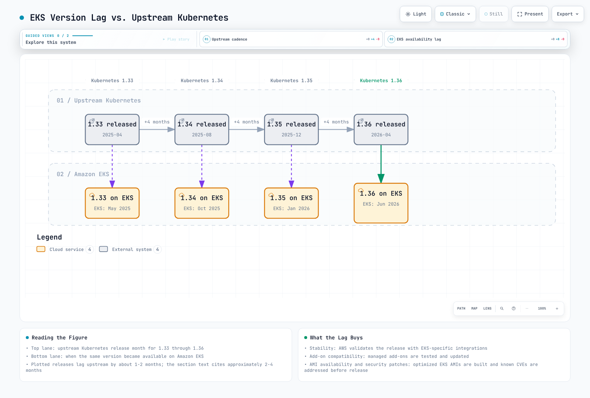

[🔍 View interactive diagram](https://www.atomai.click/kubernetes-docs/archmaps/en-eks-12-kubernetes-version-roadmap-20.html)

### Query compatibility records instead of a guessed minimum-version table

The former `v1.x+` add-on matrix did not establish EKS-build, platform, architecture or compute compatibility and mixed collector/chart/add-on version schemes. First record the owned account, Region, cluster version and installed components. A null IRSA role field does not prove that the add-on lacks AWS access; it may use Pod Identity or a provider-managed identity. Built-in Auto Mode components may not appear as ordinary installed add-ons.

```bash
# Read-only inventory in the explicitly selected account/Region/cluster.
set -euo pipefail
: "${AWS_REGION:?}"; : "${CLUSTER_NAME:?}"; : "${EXPECTED_ACCOUNT_ID:?}"
actual_account=$(aws sts get-caller-identity --region "$AWS_REGION" --query Account --output text)
test "$actual_account" = "$EXPECTED_ACCOUNT_ID" || { printf '%s\n' 'Account mismatch' >&2; exit 1; }
aws eks describe-cluster --region "$AWS_REGION" --name "$CLUSTER_NAME" --no-cli-pager \
  --query 'cluster.{version:version,platform:platformVersion,compute:computeConfig,upgradePolicy:upgradePolicy}' --output json
aws eks list-addons --region "$AWS_REGION" --cluster-name "$CLUSTER_NAME" --no-cli-pager --output json
```

```bash
# Inspect one addon, not a guessed first element or a bare component version.
: "${AWS_REGION:?}"; : "${CLUSTER_NAME:?}"; : "${ADDON_NAME:?}"
aws eks describe-addon --region "$AWS_REGION" --cluster-name "$CLUSTER_NAME" \
  --addon-name "$ADDON_NAME" --no-cli-pager \
  --query 'addon.{name:addonName,version:addonVersion,status:status,issues:health.issues,role:serviceAccountRoleArn,podIdentityAssociations:podIdentityAssociations}' --output json
```

The following candidate query matches the **requested Kubernetes version** inside each compatibility record. It retains architecture, compute types, platform versions, default-selection and configuration/IAM requirements. The first array element and a lexicographically largest version are not “latest compatible.” AWS’s default flag is specific to a compatibility record, not a global ranking.

```bash
# Read-only candidates; no addon is installed or changed.
set -euo pipefail
: "${AWS_REGION:?}"; : "${TARGET_K8S_VERSION:?For example1.36}"; : "${ADDON_NAME:?}"
aws eks describe-addon-versions --region "$AWS_REGION" --no-cli-pager \
  --kubernetes-version "$TARGET_K8S_VERSION" --addon-name "$ADDON_NAME" --output json |
  jq -e --arg target "$TARGET_K8S_VERSION" --arg name "$ADDON_NAME" '
    [.addons[]? | select(.addonName == $name) | . as $addon |
      .addonVersions[]? as $release | $release.compatibilities[]? |
      select(.clusterVersion == $target) |
      {addon:$addon.addonName,version:$release.addonVersion,
       architecture:$release.architecture,computeTypes:$release.computeTypes,
       requiresConfiguration:$release.requiresConfiguration,requiresIamPermissions:$release.requiresIamPermissions,
       platformVersions:.platformVersions,defaultForThisCompatibility:.defaultVersion}] |
    if length == 0 then error("No matching compatibility record; do not infer support")
    else . end'
```

These are candidates, not a deployment decision. Check the target platform, node architectures/compute mix, release notes, required configuration and AWS permissions. An empty result or CLI failure must stop selection. Read the exact add-on configuration schema and preserve intentional existing values before a separately reviewed update. Do not blindly use OVERWRITE, downgrade to an arbitrary previous version, or assume a control-plane update upgrades every add-on. The audit tested these commands with fake responses/current CLI models, not a live AWS catalog.

### Auto Mode and mixed clusters

Auto Mode manages its built-in compute/network/storage components; it does not imply a permanent `n−1` node-version invariant or automatic maintenance of every third-party add-on. Replacement can be delayed by workload constraints and disruption controls. Check actual update status and node versions, and review custom NodePool compatibility. Managed node groups, self-managed/Hybrid nodes and Fargate Pods have their own update/replacement workflows.

Current Auto Mode nodes run CoreDNS as a **node system service**. Once all applicable workloads have moved to Auto Mode nodes, a pure Auto Mode cluster can remove the traditional CoreDNS Deployment. A mixed Auto/non-Auto cluster must retain the Deployment for non-Auto nodes. Absence of ordinary CoreDNS/VPC CNI/kube-proxy Pods is not automatically a failure on Auto Mode, and their presence does not prove the intended mode is healthy.

```bash
# Read-only node inventory; the label is evidence, not an availability check.
set -euo pipefail
: "${KUBE_CONTEXT:?}"
kubectl --context "$KUBE_CONTEXT" --request-timeout=15s get nodes -o json | jq '[
  .items[] | {name:.metadata.name,kubelet:.status.nodeInfo.kubeletVersion,
             computeType:.metadata.labels["eks.amazonaws.com/compute-type"]}]'
```

An eksctl ClusterConfig with a new `metadata.version` is not by itself an upgrade execution. Use the reviewed update workflow and follow its returned update ID. PDBs are not an availability guarantee; understand which replacement operation honors them and which scaling/deletion paths differ. Keep application readiness, storage and rollback preparation in the plan.

### Extended-support cost context

The verified version-support fee difference is $0.50 per cluster-hour. For an illustrative 365-day year, additional fees are $4,380 for1 cluster, $21,900 for5, $43,800 for10, $109,500 for25, and $219,000 for50. These exclude compute, provisioned control-plane tiers, networking and other charges. A 730-hour month is a planning assumption, not every calendar month.

Fleet size is only one planning dimension: one critical cluster can have more operational risk than many simple clusters. Approaching end of standard support should increase planning priority, not justify skipping staging validation or a direct production upgrade with minimal checks. Compare a controlled upgrade with the explicitly accepted cost of extended support where applicable.

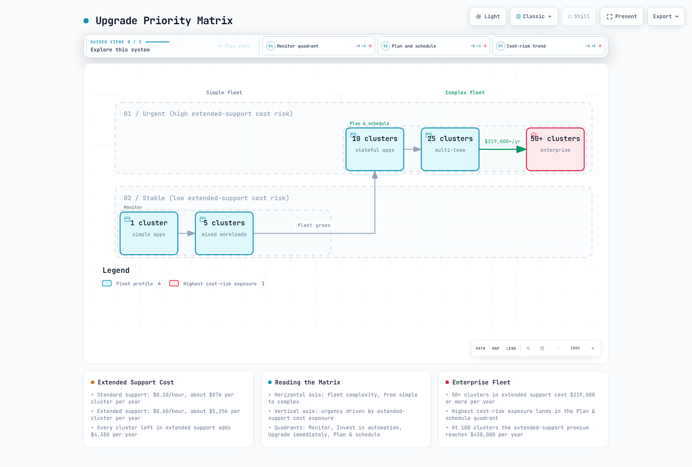

[🔍 View interactive diagram](https://www.atomai.click/kubernetes-docs/archmaps/en-eks-12-kubernetes-version-roadmap-19.html)

<!-- Parent repair: imminent-support-end path must not recommend direct production upgrade with minimal validation.
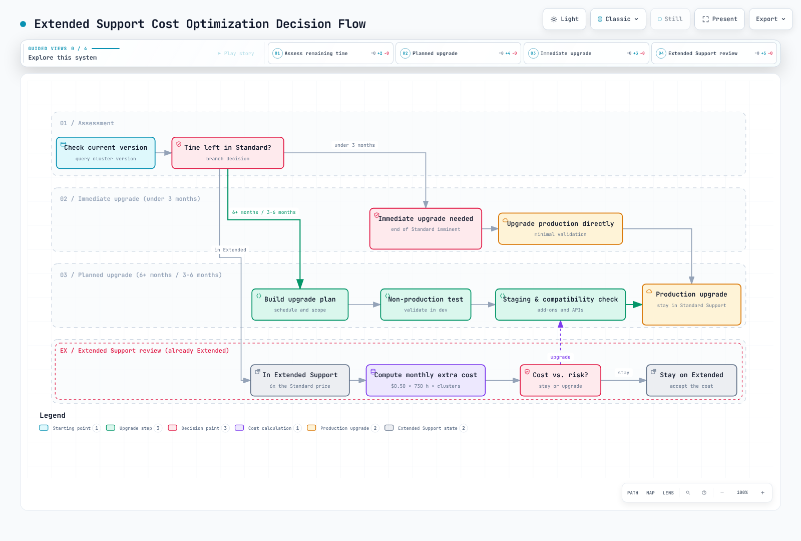

[🔍 View interactive diagram](https://www.atomai.click/kubernetes-docs/archmaps/en-eks-12-kubernetes-version-roadmap-16.html)
-->

[EKS support policy](https://docs.aws.amazon.com/eks/latest/userguide/kubernetes-versions.html) · [DescribeAddonVersions](https://docs.aws.amazon.com/eks/latest/APIReference/API_DescribeAddonVersions.html) · [Auto Mode networking and DNS](https://docs.aws.amazon.com/eks/latest/userguide/auto-networking.html) · [EKS pricing](https://aws.amazon.com/eks/pricing/) · [Reviewed EKS upgrade guide](08-eks-upgrades.md)

---

<span id="8-version-upgrade-planning"></span>

## 8. Version Upgrade Planning

### Build an executable plan for one minor-version step

EKS upgrades proceed one minor version at a time. Use the verified release/support calendar, target-specific compatibility records and current EKS upgrade guide; do not infer eligibility from the upstream latest tag. The original one-to-two-week preparation and one-to-two-day execution estimates are planning examples, not measured durations or deadlines.

1. Record the owned account/Region/cluster, control-plane and node versions, compute modes, add-on builds, API usage, operators and workload owners. Bring nodes to a safe current version before the next control-plane upgrade. Supported skew is a compatibility boundary, not a recommendation to keep nodes three minors behind or a universal assertion about every API enforcement path.
2. Review target release changes, deprecated/removed API and stored-version migration requirements, runtime/OS/AMI support, CRDs and admission policies. A tool exit0, a converted GET response or a GA label is not a complete compatibility test.
3. Back up application state and Kubernetes configuration appropriately and test restoration. EKS manages its etcd; customers cannot inspect a managed etcd backup schedule or run etcd snapshot commands as if they owned the control plane. Git does not replace database/PVC backups.
4. Rehearse the actual version step and component sequence in a representative non-production environment. Validate application readiness, networking/DNS, storage, autoscaling, identity and observability. Decide rollback/data-recovery criteria before production.
5. Execute the approved control-plane update and track the returned update ID to a successful terminal result. Upgrade nodes and applicable components in their documented order. Some compatibility/migration work belongs before the control-plane update; there is no universal “kube-proxy → CoreDNS → VPC CNI → CSI” sequence for every version and compute mode.
6. Verify customer-visible behavior, replica readiness, API/update status and component health after each phase. Running Pods alone do not establish readiness. Preserve evidence and update the runbook.

As of this review, the EKS update guide states that enforcement requiring `--force` for certain **upgrade** insight issues was temporarily rolled back. This is different from rollback-readiness checks. Insights still matter for planning; the enforcement note is not permission to ignore compatibility problems.

### Feature testing and compute ownership

Do not paste obsolete gate names or an unsupported `managedNodeGroups[].kubelet.featureGates` shape into eksctl. Use the node OS/provisioner’s supported bootstrap mechanism and current schema from the [cluster creation guide](02-eks-cluster-creation.md). Managed EKS control-plane flags remain AWS-owned. Use compatible clients and distinguish offline schema checks, server-side dry-run and actual runtime tests.

Auto Mode manages node replacement, but workload readiness/disruption constraints can delay it. Mixed clusters retain the non-Auto DNS/add-on requirements. Managed node-group rolling updates and desired/min/max scaling are different operations; a PDB is not a universal guard for scaling, direct deletion or every recovery path. Fargate and Hybrid Nodes require their own lifecycle procedures.

### Native EKS rollback and recovery alternatives

Version rollback is real EKS functionality. It must be initiated within seven days of a **completed in-place upgrade**, targets only the previous minor version, and requires an eligible supported version/cluster. A cluster created at its current version, a later subsequent upgrade, expired eligibility or an incompatible EKS feature can prevent rollback. End-of-extended-support automatic upgrades are not eligible. Choosing an extended-support target also has upgrade-policy/billing implications.

Auto Mode rolls its nodes back before the control plane after an operator initiates rollback. Managed node groups require a separate UpdateNodegroupVersion rollback first; self-managed/Hybrid nodes require their own preparation. Fargate worker versions cannot be rolled back in place: the official procedure calls for planned removal/redeployment coordination before/after control-plane rollback. Do not treat force-bypassed kubelet skew as a supported configuration or blindly delete live Fargate workloads.

`--force` can bypass ERROR/WARNING/UNKNOWN rollback insight checks, but not eligibility/prerequisite validation or Auto Mode disruption controls. This is not a safe default. Follow the detailed [EKS Upgrades](08-eks-upgrades.md) procedure, including exact update-status tracking and Auto Mode phase/timeout/cancellation limits. A control-plane rollback is not an application/database rollback; EKS preserves etcd/customer data rather than restoring every application to an earlier state.

| Layer | Recovery planning |
|---|---|
| Control plane | Eligible native rollback, or a prepared parallel-cluster recovery path when unavailable |
| Nodes | Compatible versions and controlled replacement/drain; adding a taint does not move existing Pods or traffic by itself |
| Workloads | Reviewed GitOps/Helm revision rollback plus application/data compatibility checks |
| Add-ons | Exact compatible builds, configuration/IAM review and supported downgrade behavior; no blind OVERWRITE |
| Persistent data | Tested backups/restoration and application-consistent recovery, independent of cluster version |

### Terraform upgrade edits in an existing project

These are **attribute fragments for existing, state-managed resources**, not a standalone Terraform deployment. Retain the rest of the project’s IAM, networking, access, encryption, launch-template and scaling configuration. Define the reviewed variables from actual inventory and inspect the plan; copying a minimal replacement resource can reset settings or create a different cluster.

For the existing cluster resource, choose the target one-minor step and support policy deliberately. STANDARD can trigger automatic upgrade after standard support ends; EXTENDED accepts the later paid support period.

```hcl
# Edit these arguments inside the existing aws_eks_cluster.main resource.
version = var.reviewed_target_version

upgrade_policy {
  support_type = var.reviewed_support_type
}
```

A complete managed node-group resource requires `node_role_arn`, `subnet_ids` and `scaling_config`; the old sample omitted the first two. Preserve existing values. The earlier desired3/min2/max10 and the 33% update budget are illustrative inputs, not upgrade defaults or availability guarantees.

```hcl
# Relevant arguments inside the existing aws_eks_node_group.main resource.
# Retain the rest of the existing resource, including its scaling_config.
node_role_arn = var.existing_node_role_arn
subnet_ids    = var.existing_node_subnet_ids
version       = aws_eks_cluster.main.version

update_config {
  max_unavailable_percentage = 33
}
```

For each existing add-on, use the reviewed EKS build and explicit update-conflict policy. PRESERVE is an update option, not a CreateAddon conflict option. It does not eliminate configuration-schema, identity or rollback checks.

```hcl
# Edit one already-managed aws_eks_addon resource after compatibility review.
addon_version               = var.reviewed_addon_version
resolve_conflicts_on_update = "PRESERVE"
```

<!-- Parent repair: execution graphic needs operation-specific ordering and validation gates beyond API-server health.


[🔍 View interactive diagram](https://www.atomai.click/kubernetes-docs/archmaps/en-eks-12-kubernetes-version-roadmap-18.html)
-->

[EKS update procedure](https://docs.aws.amazon.com/eks/latest/userguide/update-cluster.html) · [EKS rollback prerequisites and sequencing](https://docs.aws.amazon.com/eks/latest/userguide/rollback-cluster.html) · [Terraform EKS node-group reference](https://registry.terraform.io/providers/hashicorp/aws/latest/docs/resources/eks_node_group) · [Terraform EKS add-on reference](https://registry.terraform.io/providers/hashicorp/aws/latest/docs/resources/eks_addon)

---

<span id="9-future-outlook"></span>

## 9. Future Outlook

### Separate released upstream changes from EKS availability

As of September12,2026, upstream Kubernetes **1.37.0 was already released on August26**. It is not a future 1.37 promise, and its release does not establish EKS availability; the verified EKS calendar in section3 still governs EKS planning. This chapter’s examples were primarily checked against 1.36.2, not silently upgraded to1.37.

| Verified upstream 1.37 item | Interpretation |
|---|---|
| KYAML | Stable kubectl output format; not a new API-server YAML validator |
| GenericWorkload | Beta, disabled by default; native group scheduling is not GA merely because the separate GangScheduling gate changes |
| DRADeviceTaints / DRAResourceClaimDeviceStatus | Promoted to stable; driver/reporting requirements still apply |
| PodLevelResources / Pod-level in-place resize | Still beta in the released gate history, not the previously forecast GA |
| DRAPartitionableDevices | Still beta; no promised universal GPU-sharing implementation |

Use released code/changelogs and the specific KEP, not an unchecked “expected next release” date. Gate defaults/locking and API/driver availability can differ even when a feature is stable.

### Ecosystem directions are not Kubernetes release commitments

DRA drivers, device sharing, topology-aware placement and batch coordination continue to evolve. GPU time-slicing/MIG/RDMA behavior depends on the actual hardware and driver, not just a core API version. Supply-chain signing/verification, confidential containers, GitOps, platform engineering, OpenTelemetry and Wasm are ecosystem integration topics with their own projects and release policies. They are not all automatically built into Kubernetes or guaranteed for a named future year.

Keep a recurring upgrade/rehearsal cadence that fits support deadlines, compatibility and business risk. “Quarterly” and the upstream roughly four-month release cadence are different schedules. Staying on a suitable standard-supported EKS version can avoid the extra version fee, but there is no universal `latest−1` rule that replaces application validation or no-risk obligation to adopt every GA feature immediately.

### Historical planning template — not a current deployment recommendation

The earlier Korean chapter included the following example inventory and planned months. The version/count/month values are retained as historical illustrative inputs, not a discovered fleet, executed upgrade or verified component combination. In particular the old Istio/Argo CD/chart versions must not be treated as supported with newer Kubernetes versions. Replace them using actual inventory and current compatibility evidence when making a new plan. The review actions below correct the old automatic-nftables/DRA-CRD/KYAML assumptions without inventing a rerun.

```yaml
historical_planning_example:
  provenance: Illustrative prior chapter inputs; no executed upgrade or verified component
    compatibility.
  starting_state:
    cluster_version: '1.33'
    node_count: 50
    workload_count: 200
    component_versions:
    - name: istio
      version: '1.22'
    - name: argocd
      version: '2.11'
    - name: prometheus-stack
      version: '60.0'
  target_version: '1.36'
  upgrade_path:
  - '1.33'
  - '1.34'
  - '1.35'
  - '1.36'
  phases:
  - target: '1.34'
    historical_planned_month: 2025-11
    review:
    - DRA API/driver and VAC compatibility
    - Proxy backend migration only if deliberately selected; not automatic
  - target: '1.35'
    historical_planned_month: 2026-03
    review:
    - In-place resize and the actual VPA release/mode
    - KYAML is a client output format, not a server parsing migration
  - target: '1.36'
    historical_planned_month: 2026-07
    review:
    - Pod-level resource policies and supported compute/runtime
    - Gang scheduling is still alpha in1.36; not a GA EKS prerequisite
```

---

<span id="10-references"></span>

## 10. References

The release-specific source and vendor API documentation take precedence over old summary tables or a tool’s bundled assumptions. For an actual change, recheck the target version, provider, component release and feature configuration.

- [Kubernetes releases](https://kubernetes.io/releases/)
- [Patch support policy](https://kubernetes.io/releases/patch-releases/)
- [Feature gates](https://kubernetes.io/docs/reference/command-line-tools-reference/feature-gates/)
- [Removed feature gates](https://kubernetes.io/docs/reference/command-line-tools-reference/feature-gates-removed/)
- [API deprecation policy](https://kubernetes.io/docs/reference/deprecation-policy/)
- [API migration guide](https://kubernetes.io/docs/reference/using-api/deprecation-guide/)
- [Kubernetes 1.36.2 source](https://github.com/kubernetes/kubernetes/tree/v1.36.2)
- [Kubernetes 1.37 changelog](https://github.com/kubernetes/kubernetes/blob/v1.37.0/CHANGELOG/CHANGELOG-1.37.md)
- [EKS support calendar](https://docs.aws.amazon.com/eks/latest/userguide/kubernetes-versions.html)
- [EKS version notes](https://docs.aws.amazon.com/eks/latest/userguide/kubernetes-versions-standard.html)
- [EKS upgrades](https://docs.aws.amazon.com/eks/latest/userguide/update-cluster.html)
- [EKS rollback](https://docs.aws.amazon.com/eks/latest/userguide/rollback-cluster.html)
- [EKS add-on compatibility API](https://docs.aws.amazon.com/eks/latest/APIReference/API_DescribeAddonVersions.html)
- [EKS Auto Mode networking](https://docs.aws.amazon.com/eks/latest/userguide/auto-networking.html)
- [EKS best practices](https://docs.aws.amazon.com/eks/latest/best-practices/introduction.html)
- [EKS pricing](https://aws.amazon.com/eks/pricing/)
- [VPA 1.7.1 features](https://github.com/kubernetes/autoscaler/blob/vertical-pod-autoscaler-1.7.1/vertical-pod-autoscaler/docs/features.md)
- [Pluto](https://github.com/FairwindsOps/pluto)
- [Kubent](https://github.com/doitintl/kube-no-trouble)

### Official release announcements

- [Kubernetes 1.29](https://kubernetes.io/blog/2023/12/13/kubernetes-v1-29-release/)
- [Kubernetes 1.30](https://kubernetes.io/blog/2024/04/17/kubernetes-v1-30-release/)
- [Kubernetes 1.31](https://kubernetes.io/blog/2024/08/13/kubernetes-v1-31-release/)
- [Kubernetes 1.32](https://kubernetes.io/blog/2024/12/11/kubernetes-v1-32-release/)
- [Kubernetes 1.33](https://kubernetes.io/blog/2025/04/23/kubernetes-v1-33-release/)
- [Kubernetes 1.34](https://kubernetes.io/blog/2025/08/27/kubernetes-v1-34-release/)
- [Kubernetes 1.35](https://kubernetes.io/blog/2025/12/17/kubernetes-v1-35-release/)
- [Kubernetes 1.36](https://kubernetes.io/blog/2026/04/22/kubernetes-v1-36-release/)

## Quiz and Next Steps

- [Version Features and Roadmap Quiz](../quizzes/eks/12-kubernetes-version-roadmap-quiz.md)
- [EKS Upgrades](08-eks-upgrades.md)
- [EKS Advanced Debugging](11-eks-advanced-debugging.md)
- [EKS cluster creation lab](../labs/eks/01-eks-cluster-creation-lab.md)
- [EKS Auto Mode](../eks-auto-mode/README.md)

< [Previous: EKS Advanced Debugging](11-eks-advanced-debugging.md) | [Table of Contents](../README.md) >
