# Kubernetes Version Features and Roadmap

> **Supported Versions**: Kubernetes 1.29 - 1.36
> **Last Updated**: July 3, 2026

Kubernetes evolves rapidly, with three releases per year introducing new features, graduating existing ones, and deprecating old APIs. For enterprise teams running Amazon EKS, understanding the version landscape is essential for planning upgrades, adopting new capabilities at the right time, and avoiding disruptions from deprecations. This document provides a comprehensive, version-by-version reference covering Kubernetes 1.29 through 1.36, with EKS-specific guidance for each release.

## Table of Contents

1. [Overview and Learning Objectives](#1-overview-and-learning-objectives)
2. [Kubernetes Release Cycle](#2-kubernetes-release-cycle)
3. [EKS Version Support Matrix](#3-eks-version-support-matrix)
4. [Version-by-Version Feature Guide](#4-version-by-version-feature-guide)
5. [Key Feature Graduation Timeline](#5-key-feature-graduation-timeline)
6. [Deprecations and Removals](#6-deprecations-and-removals)
7. [EKS-Specific Considerations](#7-eks-specific-considerations)
8. [Version Upgrade Planning](#8-version-upgrade-planning)
9. [Future Outlook](#9-future-outlook)
10. [References](#10-references)

---

## 1. Overview and Learning Objectives

### Purpose of This Document

This document serves as a centralized reference for:

- **Version-specific new features** introduced in Kubernetes 1.29 through 1.36
- **Feature graduation timelines** tracking the progression from alpha to beta to GA
- **Deprecation schedules** and required migration actions
- **EKS support windows** including standard and extended support dates
- **Upgrade planning guidance** for enterprise teams

### Learning Objectives

After reading this document, you will be able to:

1. Explain the Kubernetes release cycle and feature maturity model
2. Identify which features are available at each Kubernetes version
3. Map feature gates to specific versions and understand their lifecycle
4. Plan version upgrades based on feature availability and deprecation timelines
5. Understand EKS-specific version support policies, including standard vs. extended support
6. Evaluate the cost and risk trade-offs of staying on older versions
7. Anticipate upcoming features and their expected graduation timeline

### Who Should Read This

| Audience | Key Sections |
|----------|-------------|
| **Platform Engineers** | Version Feature Guide, Upgrade Planning, Deprecations |
| **Cluster Administrators** | EKS Support Matrix, Upgrade Planning, EKS-Specific Considerations |
| **Application Developers** | Feature Guide (Sidecar Containers, In-Place Resize, DRA), Feature Graduation Timeline |
| **Security Teams** | Deprecations, Security-related features per version, StructuredAuthz, User Namespaces |
| **Engineering Managers** | Overview, Support Matrix, Cost implications of Extended Support |

---

## 2. Kubernetes Release Cycle

### Release Cadence

Kubernetes follows a predictable release cadence with approximately three releases per year, spaced roughly four months apart.

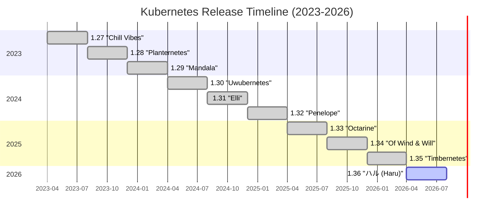
```mermaid
gantt
    title Kubernetes Release Timeline (2023-2026)
    dateFormat  YYYY-MM
    axisFormat  %Y-%m

    section 2023
    1.27 "Chill Vibes"        :done, v127, 2023-04, 2023-08
    1.28 "Planternetes"       :done, v128, 2023-08, 2023-12
    1.29 "Mandala"            :done, v129, 2023-12, 2024-04

    section 2024
    1.30 "Uwubernetes"        :done, v130, 2024-04, 2024-08
    1.31 "Elli"               :done, v131, 2024-08, 2024-12
    1.32 "Penelope"           :done, v132, 2024-12, 2025-04

    section 2025
    1.33 "Octarine"           :done, v133, 2025-04, 2025-08
    1.34 "Of Wind & Will"     :done, v134, 2025-08, 2025-12
    1.35 "Timbernetes"        :done, v135, 2025-12, 2026-04

    section 2026
    1.36 "ハル (Haru)"         :active, v136, 2026-04, 2026-08
```

### Typical Release Timeline

Each release follows a structured timeline spanning approximately 15 weeks:

| Phase | Duration | Description |
|-------|----------|-------------|
| **Enhancements Freeze** | Week 0 | All features must have approved KEPs (Kubernetes Enhancement Proposals) |
| **Code Freeze** | ~Week 10 | No new feature code; focus on bug fixes and tests |
| **Beta Release** | ~Week 11 | Pre-release for testing |
| **RC (Release Candidate)** | ~Week 13 | Final testing phase |
| **General Availability** | ~Week 15 | Official release |

### Feature Maturity Model

Kubernetes uses a three-stage graduation model for all features. Understanding these stages is critical for production planning.

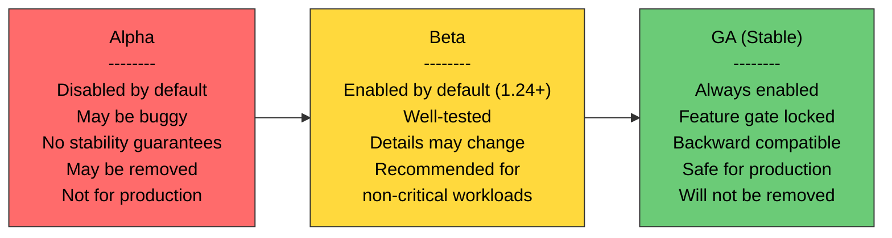
```mermaid
flowchart LR
    Alpha["Alpha
    --------
    Disabled by default
    May be buggy
    No stability guarantees
    May be removed
    Not for production"]
    -->
    Beta["Beta
    --------
    Enabled by default (1.24+)
    Well-tested
    Details may change
    Recommended for
    non-critical workloads"]
    -->
    GA["GA (Stable)
    --------
    Always enabled
    Feature gate locked
    Backward compatible
    Safe for production
    Will not be removed"]

    style Alpha fill:#ff6b6b,stroke:#333,color:black
    style Beta fill:#ffd93d,stroke:#333,color:black
    style GA fill:#6bcb77,stroke:#333,color:black
```

**Key policy changes to be aware of:**

- **Since Kubernetes 1.24**: Beta APIs are no longer enabled by default in new clusters. New beta features require explicit opt-in via feature gates.
- **Since Kubernetes 1.28**: Feature gates for GA features are removed after two releases, meaning the feature becomes permanently enabled.

### Feature Gates

Feature gates are key-value pairs that control whether a feature is enabled or disabled. They are the mechanism through which the alpha/beta/GA maturity model is enforced.

```yaml
# Example: Enabling feature gates on the kubelet
apiVersion: kubelet.config.k8s.io/v1beta1
kind: KubeletConfiguration
featureGates:
  InPlacePodVerticalScaling: true    # Enable in-place pod resize (beta in 1.33)
  UserNamespacesSupport: true         # Enable user namespaces (beta in 1.33)
```

```yaml
# Example: Enabling feature gates on the API server (EKS managed - informational only)
# Note: In EKS, control plane feature gates are managed by AWS.
# You cannot directly modify API server flags on EKS.
apiVersion: kubeadm.k8s.io/v1beta3
kind: ClusterConfiguration
apiServer:
  extraArgs:
    feature-gates: "ValidatingAdmissionPolicy=true,StructuredAuthorizationConfiguration=true"
```

**Checking enabled feature gates in your cluster:**

```bash
# List all feature gates and their status on a node's kubelet
kubectl get --raw /api/v1/nodes/<node-name>/proxy/configz | jq '.kubeletconfig.featureGates'

# Check API server feature gates (requires API server access logs)
kubectl get --raw /metrics | grep kubernetes_feature_enabled

# Check specific feature gate status
kubectl get --raw /metrics | grep 'kubernetes_feature_enabled{name="InPlacePodVerticalScaling"}'
```

### SIG Governance Structure

Kubernetes development is organized into Special Interest Groups (SIGs). Understanding which SIG owns a feature helps you track its progress and find relevant documentation.

| SIG | Scope | Key Features in This Document |
|-----|-------|-------------------------------|
| **SIG Node** | Kubelet, container runtime, pod lifecycle | Sidecar Containers, In-Place Pod Resize, User Namespaces |
| **SIG Auth** | Authentication, authorization, security policy | StructuredAuthorizationConfiguration, CEL Admission |
| **SIG Network** | Networking, Service, Ingress, DNS | Gateway API, ServiceCIDR/IPAddress, Topology Aware Routing |
| **SIG Storage** | PV/PVC, CSI, volume management | VolumeAttributesClass, ReadWriteOncePod |
| **SIG Scheduling** | Scheduler, Pod Scheduling Readiness | Pod Scheduling Readiness, Gang Scheduling |
| **SIG Apps** | Workload controllers (Deployment, StatefulSet, Job) | Job Success Policy, Sidecar Containers |
| **SIG API Machinery** | API server, CRDs, admission control | CEL Admission, KYAML |
| **SIG Autoscaling** | HPA, VPA, cluster autoscaling | HPA Container Resource Metrics |

---

## 3. EKS Version Support Matrix

### Support Tiers

Amazon EKS provides two tiers of version support:

| Tier | Duration | Pricing | Description |
|------|----------|---------|-------------|
| **Standard Support** | 14 months from EKS release | $0.10/cluster/hour | Full feature support, security patches, bug fixes |
| **Extended Support** | Additional 12 months | $0.60/cluster/hour | Security patches and critical bug fixes only |

> **Cost Impact**: Extended support costs 6x the standard support price. For a single cluster running 24/7, this translates to approximately $4,380/year in extended support vs. $730/year in standard support -- an additional $3,650 per cluster per year.

### Version Lifecycle Diagram

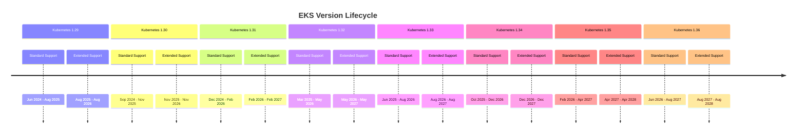
```mermaid
timeline
    title EKS Version Lifecycle
    section Kubernetes 1.29
        Standard Support : Jun 2024 - Aug 2025
        Extended Support : Aug 2025 - Aug 2026
    section Kubernetes 1.30
        Standard Support : Sep 2024 - Nov 2025
        Extended Support : Nov 2025 - Nov 2026
    section Kubernetes 1.31
        Standard Support : Dec 2024 - Feb 2026
        Extended Support : Feb 2026 - Feb 2027
    section Kubernetes 1.32
        Standard Support : Mar 2025 - May 2026
        Extended Support : May 2026 - May 2027
    section Kubernetes 1.33
        Standard Support : Jun 2025 - Aug 2026
        Extended Support : Aug 2026 - Aug 2027
    section Kubernetes 1.34
        Standard Support : Oct 2025 - Dec 2026
        Extended Support : Dec 2026 - Dec 2027
    section Kubernetes 1.35
        Standard Support : Feb 2026 - Apr 2027
        Extended Support : Apr 2027 - Apr 2028
    section Kubernetes 1.36
        Standard Support : Jun 2026 - Aug 2027
        Extended Support : Aug 2027 - Aug 2028
```

### Detailed Version Support Matrix

The table below tracks each Kubernetes version supported by EKS, including upstream release dates, EKS availability, and support end dates.

| K8s Version | Code Name | Upstream Release | EKS Release | Standard Support End | Extended Support End | Current Status |
|-------------|-----------|-----------------|-------------|---------------------|---------------------|----------------|
| **1.29** | Mandala | Dec 2023 | Jun 2024 | Aug 2025 | Aug 2026 | Extended Support |
| **1.30** | Uwubernetes | Apr 2024 | Sep 2024 | Nov 2025 | Nov 2026 | Extended Support |
| **1.31** | Elli | Aug 2024 | Dec 2024 | Feb 2026 | Feb 2027 | Extended Support |
| **1.32** | Penelope | Dec 2024 | Mar 2025 | May 2026 | May 2027 | Standard Support |
| **1.33** | Octarine | Apr 2025 | Jun 2025 | Aug 2026 | Aug 2027 | Standard Support |
| **1.34** | Of Wind & Will | Aug 2025 | Oct 2025 | Dec 2026 | Dec 2027 | Standard Support |
| **1.35** | Timbernetes | Dec 2025 | Feb 2026 | Apr 2027 | Apr 2028 | Standard Support |
| **1.36** | ハル (Haru) | Apr 2026 | Jun 2026 | Aug 2027 | Aug 2028 | Standard Support |

> **Note**: EKS release dates typically lag upstream Kubernetes releases by 2-4 months. AWS uses this time to validate the release, integrate with EKS-managed add-ons, and ensure compatibility with AWS services.

### Auto-Upgrade Behavior

When a Kubernetes version reaches end of support (including extended support), EKS will automatically upgrade your cluster:

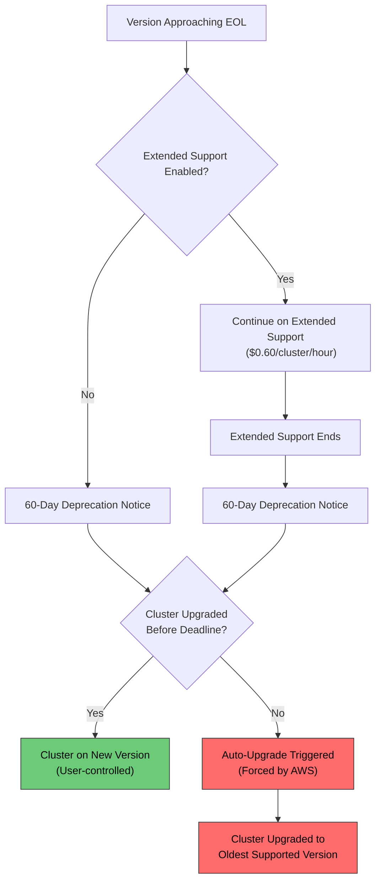
```mermaid
flowchart TD
    A["Version Approaching EOL"] --> B{"Extended Support Enabled?"}
    B -->|Yes| C["Continue on Extended Support
    ($0.60/cluster/hour)"]
    B -->|No| D["60-Day Deprecation Notice"]
    C --> E["Extended Support Ends"]
    E --> F["60-Day Deprecation Notice"]
    D --> G{"Cluster Upgraded
    Before Deadline?"}
    F --> G
    G -->|Yes| H["Cluster on New Version
    (User-controlled)"]
    G -->|No| I["Auto-Upgrade Triggered
    (Forced by AWS)"]
    I --> J["Cluster Upgraded to
    Oldest Supported Version"]

    style I fill:#ff6b6b,stroke:#333,color:black
    style J fill:#ff6b6b,stroke:#333,color:black
    style H fill:#6bcb77,stroke:#333,color:black
```

**Important**: Auto-upgrades only update the control plane. You must still upgrade your node groups, add-ons, and self-managed components manually. A forced control plane upgrade without corresponding node and add-on upgrades can cause workload disruptions.

### Recent EKS Version Support Announcements (2026)

AWS made several announcements in 2026 affecting EKS version support:

| Date | Announcement | Highlights |
|:---:|------|------|
| 2026-06-02 | EKS & EKS Distro begin supporting Kubernetes 1.36 | User Namespaces GA, Mutating Admission Policies, In-Place Pod Vertical Scaling, Resource Health Status, EKS Cluster Insights pre-upgrade checks |
| 2026-01-28 | EKS & EKS Distro begin supporting Kubernetes 1.35 | In-Place Pod Resource Updates, PreferSameNode Traffic Distribution, Node Topology Labels via Downward API, Image Volumes |

#### Kubernetes 1.36 Support (June 2, 2026)

Amazon EKS and EKS Distro began supporting Kubernetes 1.36. The announcement highlighted (see section 4.8 below for implementation detail):

- **User Namespaces (GA)**: Maps the container's root user to an unprivileged host user, strengthening multi-tenant isolation
- **Mutating Admission Policies**: CEL-based mutation with no webhook server required
- **In-Place Pod Vertical Scaling**: Adjust CPU/memory without restarting the pod
- **Resource Health Status**: Surfaces device health and hardware failure conditions in Pod status
- **EKS Cluster Insights**: Pre-upgrade checks for deprecated API usage and add-on compatibility

> Source: [Amazon EKS Distro now supports Kubernetes version 1.36](https://aws.amazon.com/about-aws/whats-new/2026/06/amazon-eks-distro-kubernetes-version-1-36/)

#### Kubernetes 1.35 Support (January 28, 2026)

Amazon EKS and EKS Distro began supporting Kubernetes 1.35, adding:

- **In-Place Pod Resource Updates** -- the same restart-free resource adjustment capability covered as In-Place Pod Vertical Scaling GA in section 4.7
- **PreferSameNode Traffic Distribution** -- prefer routing traffic to endpoints on the same node
- **Node Topology Labels via Downward API** -- expose node topology labels to pods
- **Image Volumes** -- mount OCI images as volumes to deliver data and ML models

> Source: [Amazon EKS Distro now supports Kubernetes version 1.35](https://aws.amazon.com/about-aws/whats-new/2026/01/amazon-eks-distro-kubernetes-version-1-35)

> **Related announcements**: EKS version rollback support (July 1, 2026) and the new control plane 99.99% SLA / 8XL scaling tier (March 20, 2026) are covered in the [EKS Upgrades](08-eks-upgrades.md) document, since they relate directly to the upgrade process rather than Kubernetes version features.

---

## 4. Version-by-Version Feature Guide

This section provides a detailed breakdown of features introduced, graduated, and deprecated in each Kubernetes version from 1.29 through 1.36.

### 4.1 Kubernetes 1.29 "Mandala" (December 2023)

**Theme**: Named after the geometric art form symbolizing the universe, reflecting the community's holistic approach to this release.

**Release Stats**: 49 enhancements -- 11 Stable, 19 Beta, 19 Alpha

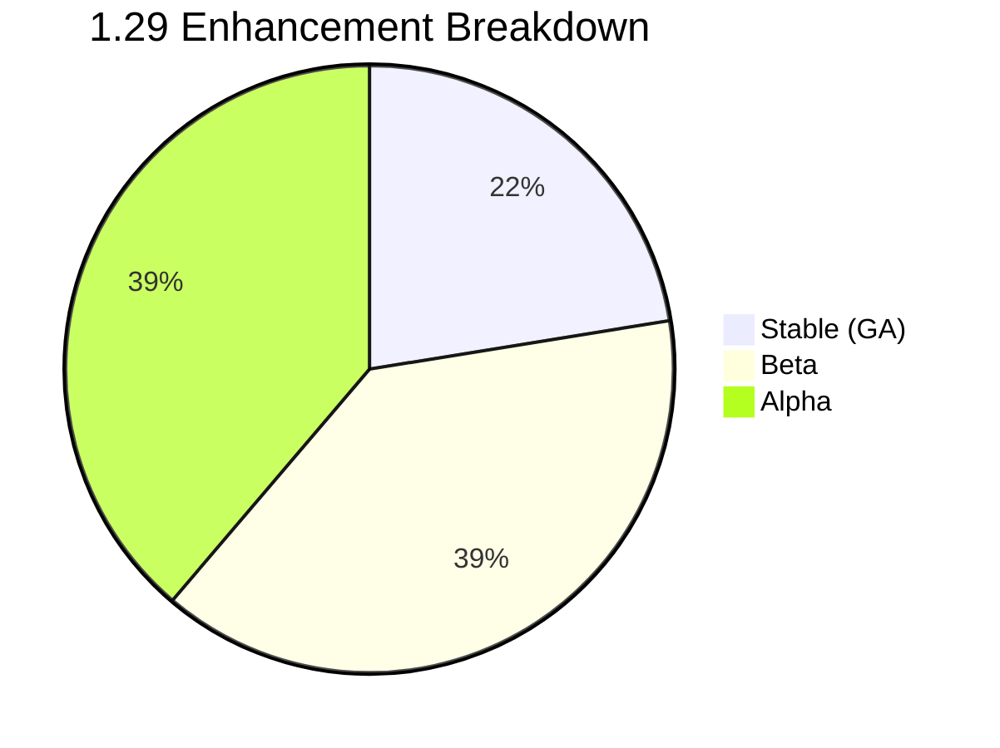
```mermaid
pie title 1.29 Enhancement Breakdown
    "Stable (GA)" : 11
    "Beta" : 19
    "Alpha" : 19
```

#### Key Graduated Features (GA)

**KMS v2 Encryption**

KMS v2 for Kubernetes Secrets encryption at rest reached GA, providing significant performance improvements over KMS v1.

| Aspect | KMS v1 | KMS v2 |
|--------|--------|--------|
| Encryption calls per write | 1 per object | 1 per DEK rotation |
| Performance | High latency at scale | Near-constant latency |
| Key hierarchy | Single layer | Two-layer (KEK + DEK) |
| Status | Deprecated in 1.28 | GA in 1.29 |

```yaml
# KMS v2 EncryptionConfiguration
apiVersion: apiserver.config.k8s.io/v1
kind: EncryptionConfiguration
resources:
  - resources:
      - secrets
    providers:
      - kms:
          apiVersion: v2
          name: aws-encryption-provider
          endpoint: unix:///var/run/kmsplugin/socket.sock
          timeout: 3s
      - identity: {}
```

**ReadWriteOncePod PV Access Mode**

The `ReadWriteOncePod` (RWOP) access mode graduated to GA. This ensures that a PersistentVolume can only be mounted as read-write by a single Pod in the entire cluster, providing stronger data safety guarantees than `ReadWriteOnce` (which allows multiple pods on the same node).

```yaml
apiVersion: v1
kind: PersistentVolumeClaim
metadata:
  name: database-pvc
spec:
  accessModes:
    - ReadWriteOncePod    # Only one pod can mount this volume
  storageClassName: gp3
  resources:
    requests:
      storage: 100Gi
```

**Other GA Features in 1.29**:
- `NodeExpandSecret` for CSI volume expansion with credentials
- `KubeletTracing` for kubelet-level distributed tracing
- `ReadWriteOncePod` PersistentVolume access mode
- `MinDomainsInPodTopologySpread` for topology spread constraints

#### Key Beta Features

**nftables-based kube-proxy (Alpha)**

A new kube-proxy backend using nftables instead of iptables was introduced as alpha. This is significant because nftables offers better performance and scalability than iptables, especially in clusters with thousands of Services.

```bash
# Check current kube-proxy mode
kubectl get configmap kube-proxy-config -n kube-system -o yaml | grep mode

# nftables mode (alpha in 1.29 - requires feature gate)
# mode: nftables
```

| Proxy Mode | Maturity in 1.29 | Rule Complexity | Performance at Scale |
|-----------|-------------------|-----------------|---------------------|
| iptables | Stable (default) | O(n) per packet | Degrades >5000 services |
| IPVS | Stable | O(1) lookup | Good at scale |
| nftables | Alpha | O(1) lookup | Excellent at scale |

**Load Balancer IP Mode**

The `LoadBalancerIPMode` feature (beta) allows Services of type LoadBalancer to specify how the load balancer IP is handled, improving compatibility with cloud provider implementations.

#### Key Alpha Features

- **SidecarContainers** (initContainer with `restartPolicy: Always`) -- a landmark feature beginning its journey
- **PodLifecycleSleepAction** -- adds `sleep` action to pod lifecycle hooks
- **Unknown Version Interoperability Proxy** -- proxy requests for unknown API versions

#### Deprecations in 1.29

- `flowcontrol.apiserver.k8s.io/v1beta2` deprecated (removed in 1.32)
- `SecurityContextDeny` admission plugin deprecated
- In-tree cloud provider integrations continue deprecation path

---

### 4.2 Kubernetes 1.30 "Uwubernetes" (April 2024)

**Theme**: A community-chosen, playful name that embodies the welcoming nature of the Kubernetes community.

**Release Stats**: 45 enhancements -- 17 Stable, 18 Beta, 10 Alpha

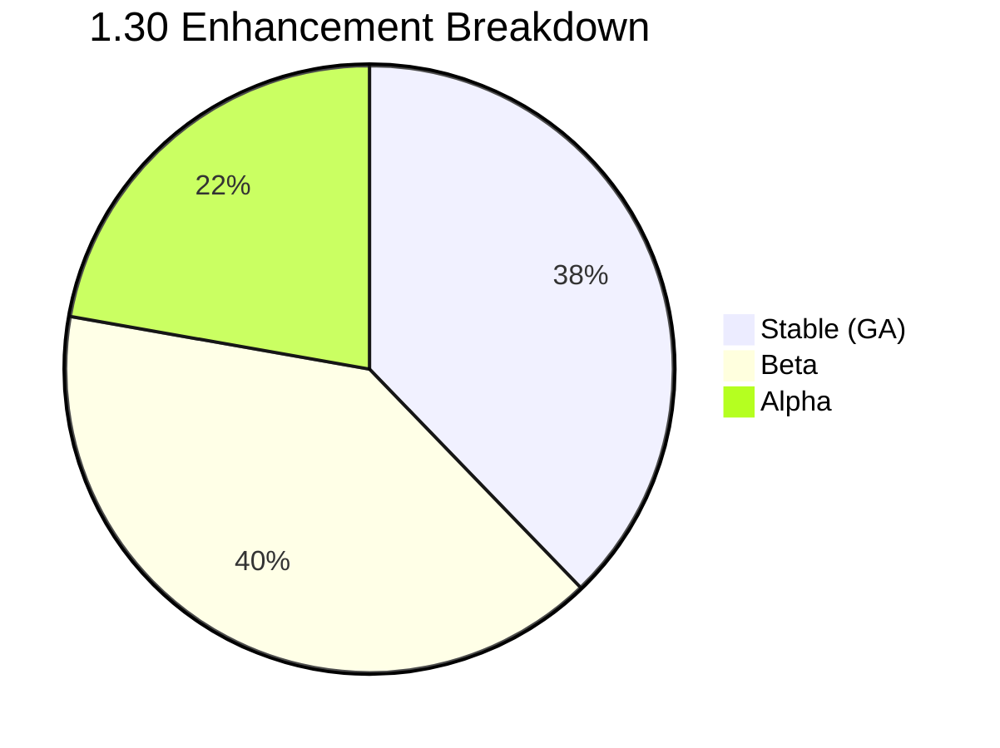
```mermaid
pie title 1.30 Enhancement Breakdown
    "Stable (GA)" : 17
    "Beta" : 18
    "Alpha" : 10
```

#### Key Graduated Features (GA)

**ValidatingAdmissionPolicy with CEL (GA)**

One of the most significant graduating features, ValidatingAdmissionPolicy enables native admission control using Common Expression Language (CEL), eliminating the need for webhook-based admission controllers for many use cases.

| Aspect | Admission Webhooks | ValidatingAdmissionPolicy (CEL) |
|--------|-------------------|-------------------------------|
| Latency | Network round-trip | In-process evaluation |
| Availability risk | Webhook server failure = blocked requests | No external dependency |
| Language | Any (Go, Python, etc.) | CEL |
| Complexity | High (deploy, maintain, scale) | Low (single YAML resource) |
| Feature journey | N/A | Alpha 1.26 -> Beta 1.28 -> GA 1.30 |

```yaml
# ValidatingAdmissionPolicy: Require resource limits on all containers
apiVersion: admissionregistration.k8s.io/v1
kind: ValidatingAdmissionPolicy
metadata:
  name: require-resource-limits
spec:
  failurePolicy: Fail
  matchConstraints:
    resourceRules:
      - apiGroups: [""]
        apiVersions: ["v1"]
        operations: ["CREATE", "UPDATE"]
        resources: ["pods"]
  validations:
    - expression: >-
        object.spec.containers.all(c,
          has(c.resources) &&
          has(c.resources.limits) &&
          has(c.resources.limits.memory) &&
          has(c.resources.limits.cpu)
        )
      message: "All containers must have CPU and memory limits set"
      reason: Invalid
---
apiVersion: admissionregistration.k8s.io/v1
kind: ValidatingAdmissionPolicyBinding
metadata:
  name: require-resource-limits-binding
spec:
  policyName: require-resource-limits
  validationActions:
    - Deny
  matchResources:
    namespaceSelector:
      matchLabels:
        enforce-limits: "true"
```

```yaml
# CEL: Enforce image registry policy
apiVersion: admissionregistration.k8s.io/v1
kind: ValidatingAdmissionPolicy
metadata:
  name: restrict-image-registries
spec:
  failurePolicy: Fail
  matchConstraints:
    resourceRules:
      - apiGroups: [""]
        apiVersions: ["v1"]
        operations: ["CREATE", "UPDATE"]
        resources: ["pods"]
  validations:
    - expression: >-
        object.spec.containers.all(c,
          c.image.startsWith('123456789012.dkr.ecr.') ||
          c.image.startsWith('public.ecr.aws/')
        )
      message: "Images must come from approved ECR registries"
    - expression: >-
        object.spec.initContainers.all(c,
          c.image.startsWith('123456789012.dkr.ecr.') ||
          c.image.startsWith('public.ecr.aws/')
        )
      message: "Init container images must come from approved ECR registries"
```

**Pod Scheduling Readiness (GA)**

Pod Scheduling Readiness allows pods to be created but not scheduled until certain conditions are met. This decouples pod creation from scheduling, enabling advanced workflows like batch scheduling and resource provisioning.

```yaml
# Pod with scheduling gates
apiVersion: v1
kind: Pod
metadata:
  name: ml-training-job
spec:
  schedulingGates:
    - name: "example.com/gpu-provisioned"      # Gate 1: Wait for GPU node
    - name: "example.com/dataset-downloaded"    # Gate 2: Wait for data
  containers:
    - name: trainer
      image: ml-training:v2
      resources:
        limits:
          nvidia.com/gpu: 4
```

```bash
# Remove a scheduling gate when the condition is met
kubectl patch pod ml-training-job --type='json' -p='[
  {"op": "remove", "path": "/spec/schedulingGates/0"}
]'

# Check remaining scheduling gates
kubectl get pod ml-training-job -o jsonpath='{.spec.schedulingGates}'
```

**HPA ContainerResource Metrics (GA)**

HPA can now scale based on individual container metrics rather than total pod metrics. This is crucial for sidecar patterns where the main container's resource usage should drive scaling, not the combined total including sidecars.

```yaml
apiVersion: autoscaling/v2
kind: HorizontalPodAutoscaler
metadata:
  name: web-app-hpa
spec:
  scaleTargetRef:
    apiVersion: apps/v1
    kind: Deployment
    name: web-app
  minReplicas: 2
  maxReplicas: 50
  metrics:
    - type: ContainerResource
      containerResource:
        name: cpu
        container: app              # Scale based only on the 'app' container
        target:
          type: Utilization
          averageUtilization: 70
    - type: ContainerResource
      containerResource:
        name: memory
        container: app              # Ignore sidecar memory usage
        target:
          type: Utilization
          averageUtilization: 80
```

**Other GA Features in 1.30**:
- `MinDomainsInPodTopologySpread` -- minimum domain count for topology spread
- `NodeLogQuery` -- query node-level logs via kubelet API
- `PodDisruptionConditions` -- adds disruption-related conditions to Pod status
- `StableLoadBalancerNodeSet` -- stable set of nodes for load balancer health checks

#### Key Beta Features

**Contextual Logging (Beta, Enabled by Default)**

Contextual logging adds structured context (like pod name, namespace, component) to all Kubernetes log messages, making log analysis and correlation significantly easier.

```bash
# Before contextual logging
I0415 12:00:00.000000       1 controller.go:100] "Reconciling object" name="my-pod"

# With contextual logging (additional context automatically added)
I0415 12:00:00.000000       1 controller.go:100] "Reconciling object" logger="pod-controller" pod="default/my-pod" node="ip-10-0-1-100"
```

**Recursive Read-Only Mounts (Beta)**

Allows making an entire volume mount tree read-only recursively, preventing any writable sub-mounts within a read-only mount path.

#### Key Alpha Features

- **UserNamespacesSupport** -- pod-level user namespaces for improved security isolation
- **RelaxedEnvironmentVariableValidation** -- allow previously invalid characters in env var values
- **SELinuxMountReadWriteOncePod** -- SELinux label support for RWOP volumes

---

### 4.3 Kubernetes 1.31 "Elli" (August 2024)

**Theme**: Named after a dog belonging to a Kubernetes contributor, reflecting the community's personal touch.

**Release Stats**: 45 enhancements -- 11 Stable, 22 Beta, 12 Alpha

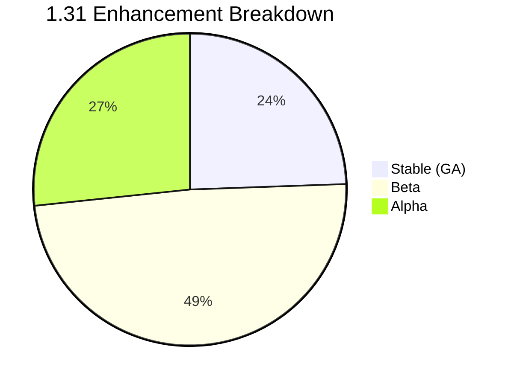
```mermaid
pie title 1.31 Enhancement Breakdown
    "Stable (GA)" : 11
    "Beta" : 22
    "Alpha" : 12
```

#### Key Graduated Features (GA)

**AppArmor Support (GA)**

Native AppArmor support in Kubernetes graduated to GA, replacing the previous annotation-based approach with proper API fields.

```yaml
# Old approach (deprecated annotations)
# metadata:
#   annotations:
#     container.apparmor.security.beta.kubernetes.io/app: localhost/my-profile

# New GA approach: native API field
apiVersion: v1
kind: Pod
metadata:
  name: secure-app
spec:
  containers:
    - name: app
      image: myapp:latest
      securityContext:
        appArmorProfile:
          type: Localhost
          localhostProfile: my-custom-profile
```

```yaml
# AppArmor with RuntimeDefault profile
apiVersion: apps/v1
kind: Deployment
metadata:
  name: web-server
spec:
  template:
    spec:
      containers:
        - name: nginx
          image: nginx:1.27
          securityContext:
            appArmorProfile:
              type: RuntimeDefault    # Uses container runtime's default profile
```

**Persistent Volume Last Phase Transition Time (GA)**

A new `.status.lastPhaseTransitionTime` field on PersistentVolumes tracks when the PV last changed phase (Available, Bound, Released, Failed). This enables better monitoring and automation around volume lifecycle.

```bash
# Check PV phase transition times
kubectl get pv -o custom-columns=\
NAME:.metadata.name,\
PHASE:.status.phase,\
LAST_TRANSITION:.status.lastPhaseTransitionTime

# Example output:
# NAME         PHASE     LAST_TRANSITION
# pv-data-01   Bound     2025-01-15T10:30:00Z
# pv-data-02   Released  2025-01-14T22:15:00Z
```

**Other GA Features in 1.31**:
- `PodDisruptionConditions` -- enriched Pod status with disruption cause information
- `JobPodReplacementPolicy` -- control when failed pods are replaced in Jobs
- `PodHostIPs` -- expose all host IPs (IPv4 and IPv6) to pods via downward API

#### Key Beta Features

**DRA Structured Parameters (Beta)**

Dynamic Resource Allocation (DRA) structured parameters moved to beta, allowing device plugins to advertise hardware capabilities through a standardized API. This is foundational for GPU, FPGA, and other accelerator scheduling.

```yaml
# ResourceClaim for GPU allocation using DRA
apiVersion: resource.k8s.io/v1beta1
kind: ResourceClaim
metadata:
  name: gpu-claim
spec:
  devices:
    requests:
      - name: gpu
        deviceClassName: gpu.nvidia.com
        selectors:
          - cel:
              expression: >-
                device.attributes["gpu.nvidia.com"].model == "A100" &&
                device.capacity["gpu.nvidia.com"].memory.compareTo(quantity("80Gi")) >= 0
```

**Sidecar Containers (Beta)**

The sidecar containers feature advanced to beta (enabled by default in 1.31 after being alpha in 1.29). Init containers with `restartPolicy: Always` now function as true sidecars that:
- Start before regular containers
- Run alongside the main workload
- Are terminated last during pod shutdown

```yaml
apiVersion: v1
kind: Pod
metadata:
  name: app-with-sidecar
spec:
  initContainers:
    - name: log-shipper
      image: fluent-bit:latest
      restartPolicy: Always       # This makes it a sidecar
      volumeMounts:
        - name: log-volume
          mountPath: /var/log/app
  containers:
    - name: app
      image: myapp:latest
      volumeMounts:
        - name: log-volume
          mountPath: /var/log/app
  volumes:
    - name: log-volume
      emptyDir: {}
```

**Traffic Distribution for Services (Beta)**

A new `spec.trafficDistribution` field on Services allows requesting traffic routing preferences, such as preferring same-zone endpoints.

```yaml
apiVersion: v1
kind: Service
metadata:
  name: my-service
spec:
  trafficDistribution: PreferClose    # Route traffic to closest endpoints
  selector:
    app: my-app
  ports:
    - port: 80
      targetPort: 8080
```

**Other Beta Features in 1.31**:
- `PodLifecycleSleepAction` -- `sleep` action in PreStop/PostStart hooks
- `RelaxedDNSSearchValidation` -- relaxed DNS search path validation
- `VolumeAttributesClass` -- mutable volume attributes via CSI

#### Key Alpha Features

- **PortForwardWebsockets** -- WebSocket-based port forwarding
- **ImageVolume** -- mount OCI images as read-only volumes
- **DRAPartitionableDevices** -- partitioning support for DRA devices

---

### 4.4 Kubernetes 1.32 "Penelope" (December 2024)

**Theme**: Named after Penelope, the faithful character from Homer's Odyssey, symbolizing the project's steadfast reliability.

**Release Stats**: 44 enhancements -- 13 Stable, 12 Beta, 19 Alpha

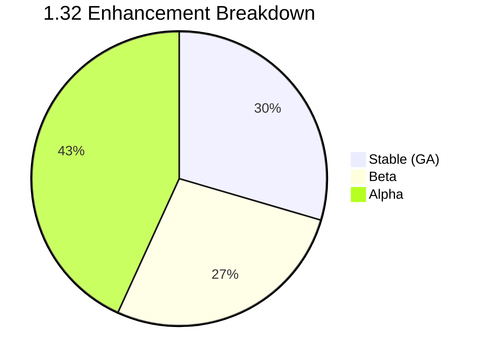
```mermaid
pie title 1.32 Enhancement Breakdown
    "Stable (GA)" : 13
    "Beta" : 12
    "Alpha" : 19
```

#### Key Graduated Features (GA)

**StructuredAuthorizationConfiguration (GA)**

A major security feature that allows defining ordered chains of authorization modules (Node, RBAC, Webhook, CEL) with structured configuration. This replaces the legacy `--authorization-mode` flag approach.

```yaml
# StructuredAuthorizationConfiguration
# (Managed by AWS for EKS control plane; shown for reference)
apiVersion: apiserver.config.k8s.io/v1beta1
kind: AuthorizationConfiguration
authorizers:
  - type: Node
    name: node
  - type: RBAC
    name: rbac
  - type: Webhook
    name: custom-authz
    webhook:
      timeout: 3s
      subjectAccessReviewVersion: v1
      matchConditionSubjectAccessReviewVersion: v1
      failurePolicy: Deny
      connectionInfo:
        type: KubeConfigFile
        kubeConfigFile: /etc/kubernetes/authz-webhook.kubeconfig
      matchConditions:
        - expression: >-
            request.resourceAttributes.namespace == "production"
```

This enables:
- **Ordered evaluation**: Authorization requests evaluated in order through a chain
- **CEL-based filtering**: Use CEL expressions to match only relevant requests to each authorizer
- **Granular webhook routing**: Send only specific requests to external authorization webhooks
- **Feature journey**: Alpha 1.29 -> Beta 1.30 -> GA 1.32

**Auto-Remove PVC Protection Finalizer (GA)**

PersistentVolumeClaim protection finalizers are now automatically cleaned up when the PVC is no longer in use. This eliminates the common issue of orphaned PVCs that cannot be deleted because their protection finalizer was never removed.

```bash
# Before 1.32: Common issue - stuck PVC deletion
$ kubectl delete pvc my-pvc
persistentvolumeclaim "my-pvc" deleted  # ... hangs forever

$ kubectl get pvc my-pvc -o jsonpath='{.metadata.finalizers}'
["kubernetes.io/pvc-protection"]  # Finalizer not removed

# After 1.32 (GA): Automatic cleanup
$ kubectl delete pvc my-pvc
persistentvolumeclaim "my-pvc" deleted  # Completes immediately when no pod references it
```

**Other GA Features in 1.32**:
- `CustomResourceFieldSelectors` -- field selectors for CRDs
- `RetryGenerateName` -- automatic retry with new generated names on conflict
- `SizeMemoryBackedVolumes` -- enforce size limits on memory-backed emptyDir volumes
- `StableLoadBalancerNodeSet` -- consistent node set for LB health checking
- `ServiceAccountTokenJTI` -- unique JTI in SA tokens for audit tracking
- `ServiceAccountTokenNodeBindingValidation` -- bind SA tokens to nodes

#### Key Beta Features

**User Namespaces (Beta)**

User namespaces provide a powerful security boundary by remapping UIDs and GIDs inside containers, so even if a process runs as root inside the container, it maps to an unprivileged user on the host.

```yaml
apiVersion: v1
kind: Pod
metadata:
  name: secure-pod
spec:
  hostUsers: false              # Enable user namespace remapping
  containers:
    - name: app
      image: myapp:latest
      securityContext:
        runAsUser: 0            # Root inside container
        # Maps to unprivileged UID on host (e.g., UID 65534+offset)
```

**VolumeAttributesClass (Beta)**

VolumeAttributesClass allows changing volume attributes (like IOPS, throughput) after provisioning, without recreating the volume.

```yaml
apiVersion: storage.k8s.io/v1beta1
kind: VolumeAttributesClass
metadata:
  name: high-performance
driverName: ebs.csi.aws.com
parameters:
  iops: "10000"
  throughput: "500"
---
apiVersion: v1
kind: PersistentVolumeClaim
metadata:
  name: database-volume
spec:
  accessModes:
    - ReadWriteOnce
  resources:
    requests:
      storage: 500Gi
  storageClassName: gp3
  volumeAttributesClassName: high-performance    # Apply performance attributes
```

```yaml
# Modify volume attributes by changing the class reference
# (triggers a CSI ModifyVolume call)
apiVersion: v1
kind: PersistentVolumeClaim
metadata:
  name: database-volume
spec:
  volumeAttributesClassName: ultra-performance   # Switch to higher tier
```

**nftables kube-proxy (Beta)**

The nftables backend for kube-proxy advanced to beta, bringing production-ready nftables support for Service routing.

#### Key Alpha Features

- **DynamicResourceAllocation (DRA) Core** -- comprehensive GPU/accelerator scheduling framework
- **MultiCIDRServiceAllocator** -- allocate Service IPs from multiple CIDR ranges
- **RelaxedEnvironmentVariableValidation** -- allow expanded character sets in env vars
- **InPlacePodVerticalScalingExtendedStatus** -- extended status reporting for pod resizing

---

### 4.5 Kubernetes 1.33 "Octarine" (April 2025)

**Theme**: Named after the eighth color, visible only to wizards, from Terry Pratchett's Discworld series. A fitting name for a release packed with magical features.

**Release Stats**: 64 enhancements -- 18 Stable, 20 Beta, 24 Alpha (the largest release in this range)

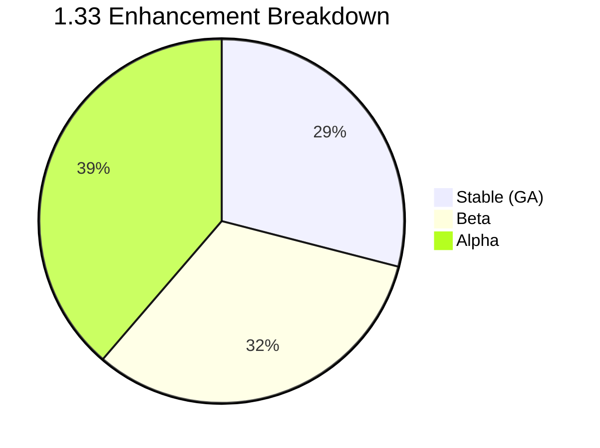
```mermaid
pie title 1.33 Enhancement Breakdown
    "Stable (GA)" : 18
    "Beta" : 20
    "Alpha" : 24
```

#### Key Graduated Features (GA)

**Sidecar Containers (GA)**

The most anticipated GA graduation in this release. Native sidecar containers, implemented as init containers with `restartPolicy: Always`, reached full stability after a multi-version journey.

| Version | Status | Behavior |
|---------|--------|----------|
| 1.28 | Alpha | Feature gate `SidecarContainers` required |
| 1.29 | Alpha | Bug fixes, stability improvements |
| 1.31 | Beta | Enabled by default |
| 1.33 | **GA** | Permanently enabled, feature gate removed |

```yaml
# Production-ready sidecar pattern (GA in 1.33)
apiVersion: apps/v1
kind: Deployment
metadata:
  name: microservice
spec:
  replicas: 3
  selector:
    matchLabels:
      app: microservice
  template:
    metadata:
      labels:
        app: microservice
    spec:
      initContainers:
        # Sidecar 1: Service mesh proxy
        - name: envoy-proxy
          image: envoyproxy/envoy:v1.31
          restartPolicy: Always
          ports:
            - containerPort: 15001
          resources:
            requests:
              cpu: 100m
              memory: 128Mi
            limits:
              cpu: 500m
              memory: 256Mi

        # Sidecar 2: Log collection
        - name: fluent-bit
          image: fluent/fluent-bit:3.2
          restartPolicy: Always
          volumeMounts:
            - name: app-logs
              mountPath: /var/log/app
          resources:
            requests:
              cpu: 50m
              memory: 64Mi

        # Regular init container (runs to completion first)
        - name: db-migration
          image: myapp-migrations:latest
          command: ["./migrate", "--target", "latest"]

      containers:
        - name: app
          image: myapp:v3.2
          ports:
            - containerPort: 8080
          volumeMounts:
            - name: app-logs
              mountPath: /var/log/app

      volumes:
        - name: app-logs
          emptyDir: {}
```

**Sidecar container lifecycle guarantees:**

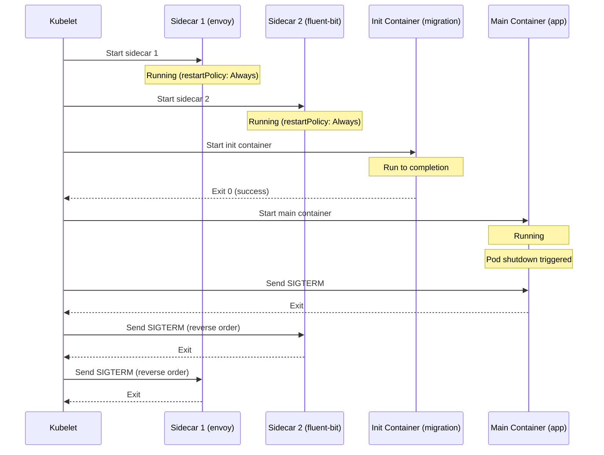
```mermaid
sequenceDiagram
    participant K as Kubelet
    participant S1 as Sidecar 1 (envoy)
    participant S2 as Sidecar 2 (fluent-bit)
    participant I as Init Container (migration)
    participant M as Main Container (app)

    K->>S1: Start sidecar 1
    Note over S1: Running (restartPolicy: Always)
    K->>S2: Start sidecar 2
    Note over S2: Running (restartPolicy: Always)
    K->>I: Start init container
    Note over I: Run to completion
    I-->>K: Exit 0 (success)
    K->>M: Start main container
    Note over M: Running

    Note over M: Pod shutdown triggered
    K->>M: Send SIGTERM
    M-->>K: Exit
    K->>S2: Send SIGTERM (reverse order)
    S2-->>K: Exit
    K->>S1: Send SIGTERM (reverse order)
    S1-->>K: Exit
```

**ServiceCIDR and IPAddress API (GA)**

The ServiceCIDR and IPAddress API allows dynamic management of Service IP ranges without cluster restart. This is particularly useful for large-scale clusters that exhaust their initial Service CIDR.

```yaml
# Define additional Service CIDR ranges
apiVersion: networking.k8s.io/v1
kind: ServiceCIDR
metadata:
  name: secondary-service-range
spec:
  cidrs:
    - "10.200.0.0/16"
```

```bash
# View allocated IP addresses
kubectl get ipaddresses

# Check ServiceCIDR status
kubectl get servicecidrs
NAME                       CIDRS            AGE
kubernetes                 10.96.0.0/12     365d
secondary-service-range    10.200.0.0/16    30d
```

**Topology Aware Routing (GA)**

Previously known as "Topology Aware Hints," this feature graduated to GA with the name "Topology Aware Routing." It enables preferential routing of Service traffic to endpoints in the same availability zone, reducing cross-AZ data transfer costs.

```yaml
apiVersion: v1
kind: Service
metadata:
  name: my-service
  annotations:
    # Legacy hint-based approach (deprecated)
    # service.kubernetes.io/topology-aware-hints: Auto
spec:
  trafficDistribution: PreferClose    # GA approach in 1.33
  selector:
    app: my-app
  ports:
    - port: 80
      targetPort: 8080
```

> **EKS Cost Tip**: Enabling topology-aware routing on high-traffic internal services can significantly reduce cross-AZ data transfer charges, which are $0.01/GB within the same region on AWS.

**Job Success Policy (GA)**

Allows specifying conditions under which a Job is considered successful even if not all pods have completed. This is essential for distributed computing frameworks where a leader pod's success determines overall job success.

```yaml
apiVersion: batch/v1
kind: Job
metadata:
  name: distributed-training
spec:
  completionMode: Indexed
  completions: 8
  parallelism: 8
  successPolicy:
    rules:
      - succeededIndexes: "0"       # Job succeeds when index 0 (leader) succeeds
        succeededCount: 1
  template:
    spec:
      containers:
        - name: trainer
          image: pytorch-training:latest
          env:
            - name: JOB_COMPLETION_INDEX
              valueFrom:
                fieldRef:
                  fieldPath: metadata.annotations['batch.kubernetes.io/job-completion-index']
```

**Other GA Features in 1.33**:
- `PodLifecycleSleepAction` -- `sleep` action in pod lifecycle hooks
- `LoadBalancerIPMode` -- control how LB IP is surfaced to pods
- `JobManagedBy` -- external controller management of Job objects
- `RetryGenerateName` -- automatic name collision retry for generated names

#### Key Beta Features (Enabled by Default)

**In-Place Pod Vertical Scaling (Beta)**

One of the most anticipated features in Kubernetes history. In-place pod resize allows changing CPU and memory resources on a running pod without restarting it.

```yaml
apiVersion: v1
kind: Pod
metadata:
  name: resizable-app
spec:
  containers:
    - name: app
      image: myapp:latest
      resources:
        requests:
          cpu: 500m
          memory: 256Mi
        limits:
          cpu: "1"
          memory: 512Mi
      resizePolicy:
        - resourceName: cpu
          restartPolicy: NotRequired    # CPU resize without restart
        - resourceName: memory
          restartPolicy: RestartContainer  # Memory resize requires restart
```

```bash
# Resize a running pod's CPU (no restart!)
kubectl patch pod resizable-app --subresource resize --patch '{
  "spec": {
    "containers": [{
      "name": "app",
      "resources": {
        "requests": {"cpu": "1"},
        "limits": {"cpu": "2"}
      }
    }]
  }
}'

# Check resize status
kubectl get pod resizable-app -o jsonpath='{.status.resize}'
# "InProgress" -> "Proposed" -> "" (completed)

# View allocated vs requested resources
kubectl get pod resizable-app -o jsonpath='{.status.containerStatuses[0].allocatedResources}'
```

| Feature Journey | Version | Notes |
|----------------|---------|-------|
| Alpha | 1.27 | Initial implementation |
| Beta | 1.33 | Enabled by default |
| GA | 1.35 | Full stability |

**OCI Images as Volumes (Beta)**

Mount OCI (Open Container Initiative) images directly as read-only volumes in pods. This enables sharing data, ML models, and configuration as container images without bundling them into the application image.

```yaml
apiVersion: v1
kind: Pod
metadata:
  name: ml-inference
spec:
  containers:
    - name: inference-server
      image: inference-engine:latest
      volumeMounts:
        - name: model
          mountPath: /models/llama
          readOnly: true
  volumes:
    - name: model
      image:
        reference: 123456789012.dkr.ecr.us-west-2.amazonaws.com/models:llama-7b
        pullPolicy: IfNotPresent
```

**User Namespaces (Beta)**

User namespaces advanced to beta, providing stronger security isolation where container processes map to unprivileged users on the host.

**Other Beta Features in 1.33**:
- `MatchLabelKeysInPodAffinity` -- use label keys for pod affinity matching
- `PodLevelResources` -- set resource limits at the pod level (not just container level)
- `ServiceTrafficDistribution` -- enhanced traffic distribution controls
- `StructuredAuthenticationConfiguration` -- structured authn config matching authz pattern

#### Key Alpha Features

- **KYAML** -- a safer YAML subset that restricts dangerous YAML features
- **PortForwardWebsockets** improvements
- **CRDValidationRatcheting** enhancements -- allow existing invalid fields to pass validation
- **MutatingAdmissionPolicy** -- CEL-based mutating admission (counterpart to ValidatingAdmissionPolicy)

---

### 4.6 Kubernetes 1.34 "Of Wind & Will" (August 2025)

**Theme**: An evocative name that captures the momentum and determination driving the Kubernetes project forward.

**Release Stats**: 58 enhancements -- 23 Stable, 22 Beta, 13 Alpha

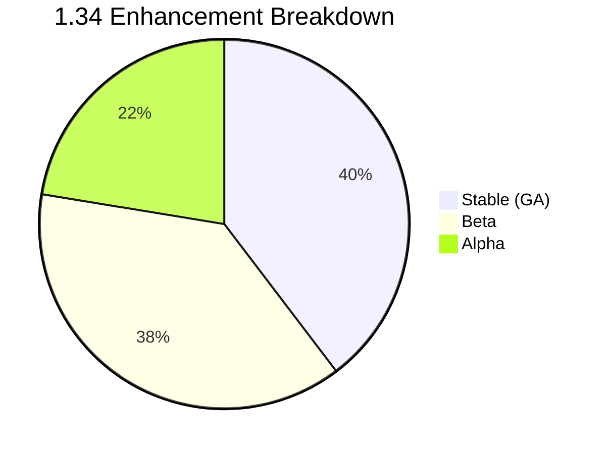
```mermaid
pie title 1.34 Enhancement Breakdown
    "Stable (GA)" : 23
    "Beta" : 22
    "Alpha" : 13
```

#### Key Graduated Features (GA)

**Dynamic Resource Allocation (DRA) Core APIs (GA)**

DRA reached GA, providing a standardized framework for requesting and allocating hardware resources like GPUs, FPGAs, and network devices. This replaces the legacy device plugin model with a more flexible, Kubernetes-native approach.

```yaml
# DeviceClass: Define a class of hardware devices
apiVersion: resource.k8s.io/v1
kind: DeviceClass
metadata:
  name: gpu-a100
spec:
  selectors:
    - cel:
        expression: >-
          device.driver == "gpu.nvidia.com" &&
          device.attributes["model"].stringValue == "A100"
---
# ResourceClaim: Request specific hardware
apiVersion: resource.k8s.io/v1
kind: ResourceClaim
metadata:
  name: training-gpus
  namespace: ml-team
spec:
  devices:
    requests:
      - name: gpu
        deviceClassName: gpu-a100
        count: 4
    constraints:
      - requests: ["gpu"]
        matchAttribute: "gpu.nvidia.com/numa-node"    # All GPUs on same NUMA node
---
# ResourceClaimTemplate: Auto-create claims per pod
apiVersion: resource.k8s.io/v1
kind: ResourceClaimTemplate
metadata:
  name: gpu-claim-template
  namespace: ml-team
spec:
  spec:
    devices:
      requests:
        - name: gpu
          deviceClassName: gpu-a100
          count: 1
---
# Pod using DRA
apiVersion: v1
kind: Pod
metadata:
  name: ml-training
  namespace: ml-team
spec:
  resourceClaims:
    - name: gpu-claim
      resourceClaimName: training-gpus
  containers:
    - name: trainer
      image: pytorch-training:latest
      resources:
        claims:
          - name: gpu-claim
            request: gpu
```

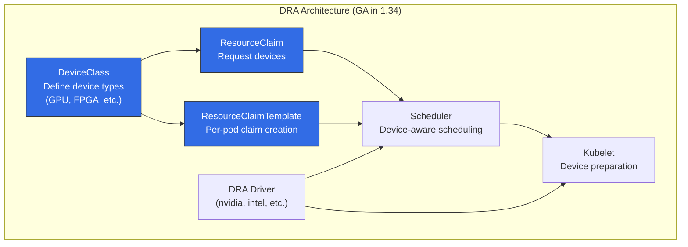
```mermaid
flowchart TD
    subgraph "DRA Architecture (GA in 1.34)"
        DC["DeviceClass
        Define device types
        (GPU, FPGA, etc.)"]
        RC["ResourceClaim
        Request devices"]
        RCT["ResourceClaimTemplate
        Per-pod claim creation"]
        DRI["DRA Driver
        (nvidia, intel, etc.)"]
        SCH["Scheduler
        Device-aware scheduling"]
        KUB["Kubelet
        Device preparation"]
    end

    DC --> RC
    DC --> RCT
    RC --> SCH
    RCT --> SCH
    SCH --> KUB
    DRI --> SCH
    DRI --> KUB

    style DC fill:#326CE5,stroke:#333,color:white
    style RC fill:#326CE5,stroke:#333,color:white
    style RCT fill:#326CE5,stroke:#333,color:white
```

**Namespace Structured Deletion (GA)**

Namespace deletion now follows a well-defined ordering, ensuring that dependent resources are cleaned up before the resources they depend on. This eliminates a long-standing class of stuck-namespace issues.

```bash
# Before 1.34: Namespace deletion could get stuck
$ kubectl delete namespace old-project
# Hangs indefinitely due to finalizer ordering issues

# After 1.34 (GA): Ordered deletion with clear status
$ kubectl delete namespace old-project
$ kubectl get namespace old-project -o jsonpath='{.status.conditions}'
# Shows clear progress through deletion phases
```

**VolumeAttributesClass (GA)**

VolumeAttributesClass graduated to GA, allowing in-place modification of volume attributes like IOPS and throughput.

```yaml
# Change EBS volume performance tier without recreating
apiVersion: storage.k8s.io/v1
kind: VolumeAttributesClass
metadata:
  name: high-iops
driverName: ebs.csi.aws.com
parameters:
  iops: "16000"
  throughput: "1000"
---
apiVersion: storage.k8s.io/v1
kind: VolumeAttributesClass
metadata:
  name: standard
driverName: ebs.csi.aws.com
parameters:
  iops: "3000"
  throughput: "125"
```

```bash
# Switch a PVC's performance tier
kubectl patch pvc database-vol --type='merge' -p '{
  "spec": {"volumeAttributesClassName": "high-iops"}
}'

# Monitor the modification
kubectl get pvc database-vol -o jsonpath='{.status.currentVolumeAttributesClassName}'
kubectl get pvc database-vol -o jsonpath='{.status.modifyVolumeStatus}'
```

**Other GA Features in 1.34**:
- `nftablesProxyMode` -- nftables kube-proxy backend
- `TrafficDistribution` for Services
- `PodLevelResources` -- set aggregate resource limits at pod level
- `MatchLabelKeysInPodAffinity` -- label-key-based affinity matching
- `ImageVolume` -- OCI images as volumes
- `UserNamespacesSupport` -- user namespace isolation

#### Key Beta Features

**KYAML (Beta, Enabled by Default)**

KYAML is a safer subset of YAML designed for Kubernetes manifests. It disallows dangerous YAML features like anchors, aliases, and certain type coercions that can lead to security vulnerabilities or unexpected behavior.

```yaml
# STANDARD YAML: These dangerous patterns are REJECTED by KYAML

# Pattern 1: YAML anchors and aliases (disabled in KYAML)
# defaults: &defaults
#   replicas: 3
# production:
#   <<: *defaults     # REJECTED: anchor/alias

# Pattern 2: Boolean coercion (restricted in KYAML)
# environment: yes    # YAML interprets as boolean True
# environment: "yes"  # KYAML requires explicit quoting

# Pattern 3: Octal notation ambiguity
# fileMode: 0644      # YAML may interpret as octal or decimal
# fileMode: "0644"    # KYAML requires clarity
```

```bash
# Check if KYAML validation is enabled on your cluster
kubectl get --raw /metrics | grep kyaml_validation

# Test a manifest against KYAML rules
kubectl apply --dry-run=server -f manifest.yaml
# Warnings will indicate KYAML violations
```

**MutatingAdmissionPolicy (Beta)**

The CEL-based counterpart to ValidatingAdmissionPolicy, allowing in-line mutation of resources during admission without webhooks.

```yaml
apiVersion: admissionregistration.k8s.io/v1beta1
kind: MutatingAdmissionPolicy
metadata:
  name: inject-default-labels
spec:
  matchConstraints:
    resourceRules:
      - apiGroups: ["apps"]
        apiVersions: ["v1"]
        operations: ["CREATE"]
        resources: ["deployments"]
  mutations:
    - patchType: ApplyConfiguration
      applyConfiguration:
        expression: >-
          Object{
            metadata: Object.metadata{
              labels: {
                "app.kubernetes.io/managed-by": "platform-team",
                "cost-center": string(request.namespace)
              }
            }
          }
```

**Other Beta Features in 1.34**:
- `CRDValidationRatcheting` -- progressive validation of CRD fields
- `DeviceHealthConditions` -- report device health through DRA
- `PodLevelResources` enhancements

#### Key Alpha Features

- **KYAML** moved from alpha to beta in this release
- **GangScheduling** (alpha) -- schedule groups of pods atomically
- **InPlacePodVerticalScaling** extended features
- **DRAPartitionableDevices** improvements

---

### 4.7 Kubernetes 1.35 "Timbernetes" (December 2025)

**Theme**: A lumberjack-themed name reflecting the release's focus on chopping through complexity and building solid foundations.

**Release Stats**: 60 enhancements -- 17 Stable, 19 Beta, 22 Alpha

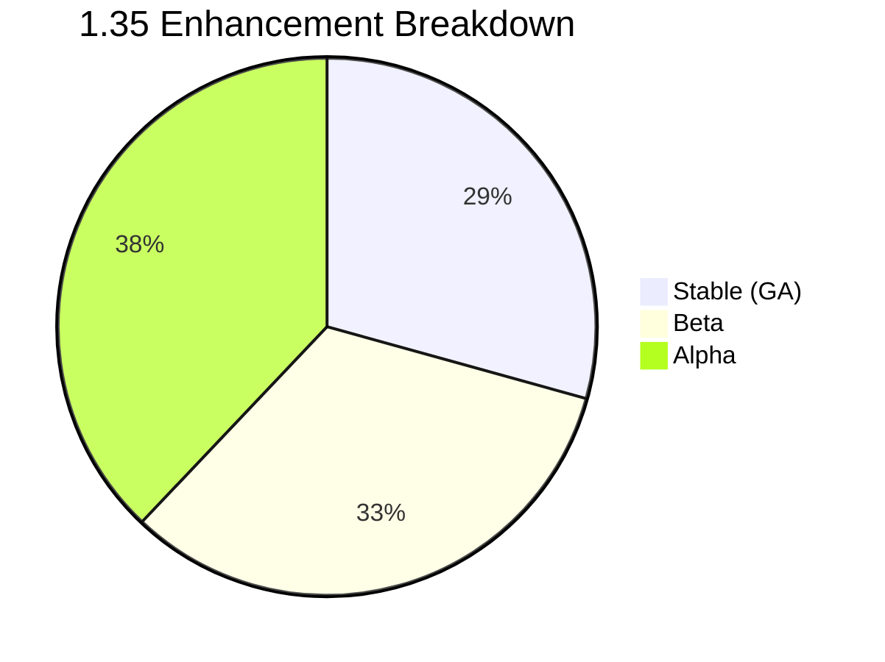
```mermaid
pie title 1.35 Enhancement Breakdown
    "Stable (GA)" : 17
    "Beta" : 19
    "Alpha" : 22
```

#### Key Graduated Features (GA)

**In-Place Pod Vertical Scaling (GA)**

The long-awaited graduation of in-place pod resize. Pods can now be resized (CPU and memory) without restart, with full stability guarantees.

| Version | Status | Key Changes |
|---------|--------|-------------|
| 1.27 | Alpha | Initial implementation, CPU-only resize |
| 1.33 | Beta | Memory resize, resize policies, enabled by default |
| 1.35 | **GA** | Full stability, extended status, production-ready |

```yaml
# Production-ready in-place scaling with VPA integration
apiVersion: autoscaling.k8s.io/v1
kind: VerticalPodAutoscaler
metadata:
  name: app-vpa
spec:
  targetRef:
    apiVersion: apps/v1
    kind: Deployment
    name: web-app
  updatePolicy:
    updateMode: "InPlace"           # Use in-place resize (requires 1.35+)
  resourcePolicy:
    containerPolicies:
      - containerName: app
        minAllowed:
          cpu: 100m
          memory: 128Mi
        maxAllowed:
          cpu: "4"
          memory: 4Gi
        controlledResources:
          - cpu
          - memory
```

```yaml
# Resize policy controlling restart behavior
apiVersion: v1
kind: Pod
metadata:
  name: production-app
spec:
  containers:
    - name: app
      image: myapp:latest
      resources:
        requests:
          cpu: "1"
          memory: 1Gi
        limits:
          cpu: "2"
          memory: 2Gi
      resizePolicy:
        - resourceName: cpu
          restartPolicy: NotRequired       # CPU: resize in-place
        - resourceName: memory
          restartPolicy: NotRequired       # Memory: also in-place (GA!)
```

```bash
# Resize workflow
kubectl patch pod production-app --subresource resize --patch '{
  "spec": {
    "containers": [{
      "name": "app",
      "resources": {
        "requests": {"cpu": "2", "memory": "2Gi"},
        "limits": {"cpu": "4", "memory": "4Gi"}
      }
    }]
  }
}'

# Monitor resize progress
kubectl get pod production-app -o json | jq '{
  resize: .status.resize,
  allocated: .status.containerStatuses[0].allocatedResources,
  requested: .spec.containers[0].resources.requests
}'
```

> **Impact for EKS Users**: In-place pod resize eliminates the need to restart pods for resource adjustments. This is transformative for:
> - **Stateful workloads** (databases, caches) that are expensive to restart
> - **Long-running batch jobs** that need more resources mid-execution
> - **VPA adoption** which previously required pod restarts
> - **Cost optimization** by right-sizing without disruption

**Other GA Features in 1.35**:
- `CRDValidationRatcheting` -- progressive CRD validation
- `DeviceHealthConditions` -- DRA device health reporting
- `PodLifecycleSleepActionGracePeriod` -- configurable grace period for sleep actions
- `ContextualLogging` -- fully graduated structured logging

#### Key Beta Features

**KYAML (Beta, Enabled by Default)**

KYAML reached beta and was enabled by default, meaning all YAML submitted to the API server is validated against the safer subset. Invalid YAML patterns generate warnings (not rejections in beta).

```bash
# With KYAML enabled, these warnings appear on apply:
$ kubectl apply -f deployment.yaml
Warning: KYAML: line 15: implicit boolean coercion; use "true" instead of "yes"
Warning: KYAML: line 23: YAML anchor detected; anchors are not supported in KYAML
deployment.apps/my-app created
```

**Gang Scheduling (Alpha moving to Beta)**

Gang scheduling ensures that a group of pods is scheduled atomically -- either all pods in the group are scheduled, or none are. This is critical for distributed training and tightly-coupled HPC workloads.

```yaml
# PodGroup for gang scheduling
apiVersion: scheduling.k8s.io/v1alpha1
kind: PodGroup
metadata:
  name: distributed-training
  namespace: ml-team
spec:
  minMember: 4                    # All 4 pods must be schedulable
  scheduleTimeoutSeconds: 300     # Timeout if group can't be scheduled
---
apiVersion: batch/v1
kind: Job
metadata:
  name: pytorch-distributed
  namespace: ml-team
spec:
  completions: 4
  parallelism: 4
  template:
    metadata:
      labels:
        pod-group.scheduling.k8s.io/name: distributed-training
    spec:
      schedulerName: default-scheduler
      containers:
        - name: trainer
          image: pytorch-dist:latest
          resources:
            limits:
              nvidia.com/gpu: 8
```

**Other Beta Features in 1.35**:
- `AnonymousAuthConfigurableEndpoints` -- configurable anonymous access per endpoint
- `InPlacePodVerticalScalingAllocatedStatus` -- detailed resize status reporting
- `SELinuxMount` improvements
- `NodeInclusionPolicyInPodTopologySpread` -- node inclusion control for topology spread

#### Key Alpha Features

- **PodLevelInPlaceScaling** -- resize at pod level (aggregate), not just container level
- **LeaderMigration** -- migrate controller-manager leader election
- **SchedulerQueueingHints** improvements
- **RecoverVolumeExpansionFailure** -- recover from failed volume expansion

---

### 4.8 Kubernetes 1.36 "ハル (Haru)" (April 2026)

**Theme**: Named with the Japanese word for "spring" (ハル/Haru), symbolizing new beginnings and growth.

**Release Stats**: 68 enhancements -- 18 Stable, 25 Beta, 25 Alpha. Major themes include security hardening, AI/ML workload support, and API extensibility. EKS supports 1.36 across all available regions including GovCloud (US).

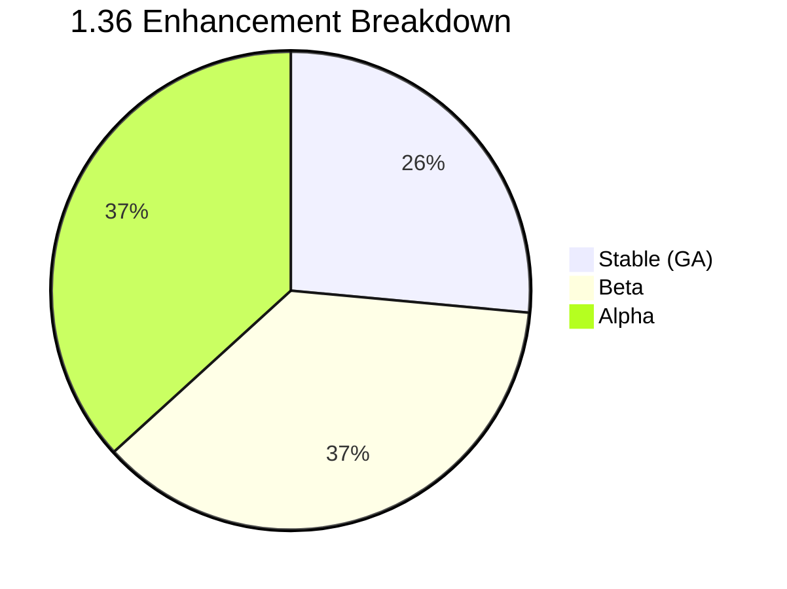
```mermaid
pie title 1.36 Enhancement Breakdown
    "Stable (GA)" : 18
    "Beta" : 25
    "Alpha" : 25
```

**Overview of Key Features**:

| Feature | Stage | Key Value |
|---------|-------|-----------|
| Mutating Admission Policies | **GA** | Eliminate webhook servers -- operational simplicity, performance, availability |
| In-Place Pod Vertical Scaling | **Enhanced** | Zero-downtime resource adjustment -- cost efficiency, SLA protection |
| User Namespaces | **GA** | Container root ≠ node root -- privilege isolation |
| Fine-Grained Kubelet API Authorization | **GA** | Least-privilege kubelet API access |
| Legacy ServiceAccount Token Cleanup | **GA** | Auto-cleanup unused tokens -- reduced attack surface |
| Resource Health Status (DRA) | Improved | GPU device health -- faster failure root-cause identification |

#### Key Graduated Features (GA)

**Mutating Admission Policies (GA)**

Mutating Admission Policies (MAP) bring CEL-based mutation to native Kubernetes objects, eliminating the need for external webhook servers. With MAP, mutation logic is defined declaratively using `MutatingAdmissionPolicy` and `MutatingAdmissionPolicyBinding` resources and evaluated in-process by the API server.

Key characteristics:

- **In-process API server evaluation**: No webhook network round-trips, no external server latency. Mutation executes inside the API server process itself.
- **Operational simplicity**: No certificate management, no high-availability deployment, no scaling concerns for webhook servers. The API server handles everything.
- **Idempotency guaranteed**: CEL expressions produce deterministic results, eliminating ordering and re-invocation edge cases.
- **Limitation**: Mutations that require external data lookups (e.g., consulting an OPA server or image registry) still need traditional webhooks. MAP is for self-contained, policy-driven mutations.

> **Impact**: Webhook servers for admission control have historically been single points of failure in Kubernetes clusters. A misconfigured or unavailable webhook can block all pod creation across the entire cluster. MAP eliminates this class of operational risk for the majority of mutation use cases.

The following example demonstrates a `MutatingAdmissionPolicy` that auto-injects `resizePolicy` into pods annotated for in-place resize. This is a practical pattern that combines MAP (GA in 1.36) with In-Place Pod Vertical Scaling (GA in 1.35):

```yaml
apiVersion: admissionregistration.k8s.io/v1
kind: MutatingAdmissionPolicy
metadata:
  name: inject-resizepolicy
spec:
  failurePolicy: Fail
  reinvocationPolicy: Never
  matchConstraints:
    resourceRules:
      - apiGroups: [""]
        apiVersions: ["v1"]
        operations: ["CREATE"]
        resources: ["pods"]
  matchConditions:
    - name: only-resize-enabled
      expression: >-
        has(object.metadata.annotations) &&
        ("resize.example.com/enabled" in object.metadata.annotations) &&
        object.metadata.annotations["resize.example.com/enabled"] == "true"
  mutations:
    - patchType: JSONPatch
      jsonPatch:
        expression: >-
          object.spec.containers.map(c, JSONPatch{
            op: "add",
            path: "/spec/containers/" + string(object.spec.containers.indexOf(c)) + "/resizePolicy",
            value: [
              {"resourceName": "cpu",    "restartPolicy": "NotRequired"},
              {"resourceName": "memory", "restartPolicy": "RestartContainer"}
            ]
          })
---
apiVersion: admissionregistration.k8s.io/v1
kind: MutatingAdmissionPolicyBinding
metadata:
  name: inject-resizepolicy-binding
spec:
  policyName: inject-resizepolicy
  matchResources:
    namespaceSelector:
      matchLabels:
        map-demo: "true"
```

> **Safety Note**: MAP `matchConstraints` is cluster-wide by default. Always scope mutations using a `namespaceSelector` in the binding to prevent unintended modifications across the cluster.

> **Technical Note**: `resizePolicy` is defined as an atomic list in the Kubernetes API schema. This means you must use `JSONPatch` (as shown above). Attempting to use `ApplyConfiguration` will fail with `"may not mutate atomic arrays"`.

**In-Place Pod Vertical Scaling Enhancements**

Building on the GA graduation of per-container in-place resize in 1.35, Kubernetes 1.36 adds several enhancements:

- **Pod-level shared budget resize**: Pod-level resources can now be resized without restarting the pod, allowing aggregate resource adjustments across all containers in a pod.
- **CPUManager checkpoint tracking**: The CPUManager now tracks checkpoint state during live resize operations, maintaining NUMA alignment for performance-sensitive workloads.
- **CPU resize (NotRequired)**: CPU changes with `restartPolicy: NotRequired` are applied via cgroup updates with zero downtime -- no container restart, no connection drops.
- **Memory shrink behavior**: Memory shrink operations may trigger `RestartContainer` depending on actual memory usage at the time of resize. Per-workload validation is essential before enabling memory resize in production.

**User Namespaces (Feature Gate Removed)**

User Namespaces have reached full production readiness with the feature gate removed in 1.36. Container UID 0 (root inside the container) is mapped to an unprivileged host UID, providing privilege isolation without any application changes.

With the gate removed, user namespaces are available on all clusters running 1.36 without any feature gate configuration. This eliminates the need for third-party solutions to achieve container-to-host privilege isolation.

**KYAML (GA)**

KYAML has reached GA, making the safer YAML subset the standard for all Kubernetes manifests. KYAML validation now rejects (not just warns about) dangerous YAML patterns by default.

| YAML Feature | Allowed in KYAML? | Reason |
|-------------|-------------------|--------|
| Anchors & Aliases | No | Injection risk, confusion |
| Merge Keys (`<<`) | No | Unpredictable behavior |
| Implicit booleans (`yes`/`no`) | No | Type coercion bugs |
| Non-string map keys | No | Ambiguity |
| Duplicate keys | No | Silent override |
| Comments | Yes | Essential for documentation |
| Multi-line strings (`|`, `>`) | Yes | Commonly needed |
| Flow sequences/mappings | Yes | Standard YAML usage |

```bash
# KYAML is now enforced by default
$ kubectl apply -f bad-manifest.yaml
Error from server: error parsing bad-manifest.yaml: KYAML validation failed:
  line 5: YAML anchors are not permitted
  line 12: implicit boolean value "yes" is not permitted; use "true" or "false"
```

**Gang Scheduling (GA)**

Atomic pod group scheduling graduated to GA.

```yaml
# GA-level gang scheduling
apiVersion: scheduling.k8s.io/v1
kind: PodGroup
metadata:
  name: mpi-job
spec:
  minMember: 8
  scheduleTimeoutSeconds: 600
  priorityClassName: high-priority
```

**Other GA Features in 1.36**:
- `AnonymousAuthConfigurableEndpoints` -- per-endpoint anonymous auth control
- `SELinuxMount` -- SELinux label management for volumes
- `NodeInclusionPolicyInPodTopologySpread` -- topology spread node inclusion
- `RecoverVolumeExpansionFailure` -- automated recovery from failed expansions
- `FineGrainedKubeletAPIAuthorization` -- least-privilege kubelet API access, restricting which nodes can access which kubelet endpoints
- `LegacyServiceAccountTokenCleanUp` -- auto-cleanup of unused Secret-based ServiceAccount tokens, reducing attack surface from long-lived credentials

#### Phase-Aware Resource Management Pattern

This section presents a practical pattern that combines In-Place Pod Vertical Scaling (GA in 1.35) with Mutating Admission Policies (GA in 1.36) to implement phase-aware resource management -- automatically adjusting container resources based on application lifecycle phase.

**Problem Definition**

Many containerized workloads have distinct lifecycle phases that demand different resource profiles:

- **Startup (warmup) phase**: High CPU for JVM JIT compilation, LLM model loading, index/cache prefill
- **Steady-state (serving) phase**: Lower CPU sufficient for normal request handling

Both phases show the container as `Running` in Kubernetes. There is no native mechanism to auto-switch resources when the application transitions from warmup to serving. The typical workaround -- over-provisioning for the startup phase -- wastes resources during the much longer steady-state phase.

Target workloads include JVM applications with JIT warmup, ML inference servers loading models into memory, and services that build caches or indexes on startup.

**Flow**:

```
Pod Create (startup: large CPU, req==limit -> Guaranteed QoS)
  -> Controller watches pod.status.containerStatuses[].started
  -> started:true detected (= startup probe passed)
  -> Resize via pods/resize subresource to steady-state CPU (zero-downtime)
```

**Key Insight -- QoS Preservation**

QoS class is determined at Pod creation time and does not change on resize (KEP-1287). By setting `requests == limits` in both the startup and steady-state phases, the pod maintains `Guaranteed` QoS throughout its lifecycle. Memory stays fixed (avoiding restart risk); only CPU changes.

**Annotation-Based Approach (No CRD Required)**

Instead of defining a Custom Resource, this pattern uses annotations on existing workloads. A lightweight controller watches pods and acts on the annotations:

```yaml
apiVersion: apps/v1
kind: Deployment
metadata:
  name: phase-aware-app
spec:
  replicas: 2
  selector:
    matchLabels:
      app: phase-aware-app
  template:
    metadata:
      annotations:
        resize.example.com/enabled:          "true"
        resize.example.com/trigger:          "StartupProbePassed"
        resize.example.com/steady-resources: |
          {"app":{"requests":{"cpu":"50m"},"limits":{"cpu":"50m"}}}
      labels:
        app: phase-aware-app
    spec:
      containers:
        - name: app
          image: myapp:latest
          resizePolicy:
            - resourceName: cpu
              restartPolicy: NotRequired
            - resourceName: memory
              restartPolicy: RestartContainer
          resources:
            requests:
              cpu: "200m"
              memory: 64Mi
            limits:
              cpu: "200m"
              memory: 64Mi
          startupProbe:
            httpGet:
              path: /healthz
              port: 8080
            initialDelaySeconds: 5
            periodSeconds: 3
            failureThreshold: 30
```

**Controller Implementation (Go)**

The following controller watches annotated pods and patches them to steady-state resources when the startup probe passes. It works identically for Deployments, StatefulSets, DaemonSets, and Argo Rollouts because it watches Pods only -- no workload-type branching required.

```go
// pod-resizer — annotation-based zero-downtime in-place downscale controller.
// Watches Pods only — works identically for Deployment/StatefulSet/DaemonSet/Rollout.
// On startup probe pass, patches to steady resources via pods/resize subresource.
// Maintains req==limit on both phases to preserve Guaranteed QoS (KEP-1287).
package main

import (
	"context"
	"encoding/json"
	"fmt"
	"log"
	"strconv"
	"sync"
	"time"

	corev1 "k8s.io/api/core/v1"
	metav1 "k8s.io/apimachinery/pkg/apis/meta/v1"
	"k8s.io/apimachinery/pkg/types"
	"k8s.io/client-go/informers"
	"k8s.io/client-go/kubernetes"
	"k8s.io/client-go/rest"
	"k8s.io/client-go/tools/cache"
)

const (
	annEnabled = "resize.example.com/enabled"
	annTrigger = "resize.example.com/trigger"
	annDelay   = "resize.example.com/delay-seconds"
	annSteady  = "resize.example.com/steady-resources"
	annResized = "resize.example.com/resized"
)

type resVals struct {
	Requests map[string]string `json:"requests,omitempty"`
	Limits   map[string]string `json:"limits,omitempty"`
}

var clientset *kubernetes.Clientset
var processed sync.Map

func main() {
	cfg, err := rest.InClusterConfig()
	if err != nil {
		log.Fatalf("in-cluster config: %v", err)
	}
	clientset, err = kubernetes.NewForConfig(cfg)
	if err != nil {
		log.Fatalf("clientset: %v", err)
	}

	factory := informers.NewSharedInformerFactory(clientset, 15*time.Second)
	podInformer := factory.Core().V1().Pods().Informer()
	podInformer.AddEventHandler(cache.ResourceEventHandlerFuncs{
		AddFunc:    func(obj interface{}) { handle(obj) },
		UpdateFunc: func(_, obj interface{}) { handle(obj) },
	})

	stop := make(chan struct{})
	defer close(stop)
	log.Printf("pod-resizer starting; watching pods annotated %s=true", annEnabled)
	factory.Start(stop)
	factory.WaitForCacheSync(stop)
	log.Printf("informer cache synced; ready")
	select {}
}

func handle(obj interface{}) {
	pod, ok := obj.(*corev1.Pod)
	if !ok {
		return
	}
	a := pod.Annotations
	if a == nil || a[annEnabled] != "true" || a[annResized] == "true" {
		return
	}
	if pod.DeletionTimestamp != nil || pod.Status.Phase != corev1.PodRunning {
		return
	}

	trigger := a[annTrigger]
	if trigger == "" {
		trigger = "StartupProbePassed"
	}
	if !triggerMet(pod, trigger, a[annDelay]) {
		return
	}

	steady := map[string]resVals{}
	if err := json.Unmarshal([]byte(a[annSteady]), &steady); err != nil {
		log.Printf("ERROR %s/%s: bad %s: %v", pod.Namespace, pod.Name, annSteady, err)
		return
	}
	patch := buildResizePatch(steady)
	if patch == nil {
		return
	}
	pb, _ := json.Marshal(patch)

	key := string(pod.UID)
	if _, loaded := processed.LoadOrStore(key, true); loaded {
		return
	}

	if _, err := clientset.CoreV1().Pods(pod.Namespace).Patch(
		context.TODO(), pod.Name, types.StrategicMergePatchType, pb,
		metav1.PatchOptions{}, "resize"); err != nil {
		processed.Delete(key)
		log.Printf("ERROR %s/%s: resize patch failed: %v", pod.Namespace, pod.Name, err)
		return
	}
	log.Printf("RESIZED %s/%s [%s] trigger=%s patch=%s",
		pod.Namespace, pod.Name, ownerKind(pod), trigger, string(pb))

	mark := []byte(fmt.Sprintf(`{"metadata":{"annotations":{%q:"true"}}}`, annResized))
	if _, err := clientset.CoreV1().Pods(pod.Namespace).Patch(
		context.TODO(), pod.Name, types.MergePatchType, mark, metav1.PatchOptions{}); err != nil {
		log.Printf("WARN %s/%s: marker patch failed: %v", pod.Namespace, pod.Name, err)
	}
}

func triggerMet(pod *corev1.Pod, trigger, delayStr string) bool {
	switch trigger {
	case "Ready":
		for _, c := range pod.Status.Conditions {
			if c.Type == corev1.PodReady {
				return c.Status == corev1.ConditionTrue
			}
		}
		return false
	case "Delay":
		delay, _ := strconv.Atoi(delayStr)
		for _, cs := range pod.Status.ContainerStatuses {
			if cs.State.Running != nil {
				return time.Since(cs.State.Running.StartedAt.Time) >= time.Duration(delay)*time.Second
			}
		}
		return false
	default:
		if len(pod.Status.ContainerStatuses) == 0 {
			return false
		}
		for _, cs := range pod.Status.ContainerStatuses {
			if cs.Started == nil || !*cs.Started {
				return false
			}
		}
		return true
	}
}

func buildResizePatch(steady map[string]resVals) map[string]interface{} {
	var containers []map[string]interface{}
	for name, rv := range steady {
		res := map[string]interface{}{}
		if len(rv.Requests) > 0 {
			res["requests"] = rv.Requests
		}
		if len(rv.Limits) > 0 {
			res["limits"] = rv.Limits
		}
		containers = append(containers, map[string]interface{}{"name": name, "resources": res})
	}
	if len(containers) == 0 {
		return nil
	}
	return map[string]interface{}{"spec": map[string]interface{}{"containers": containers}}
}

func ownerKind(pod *corev1.Pod) string {
	if len(pod.OwnerReferences) > 0 {
		return pod.OwnerReferences[0].Kind
	}
	return "Pod"
}
```

**Controller RBAC**

The controller requires access to the `pods/resize` subresource for patching, plus standard pod watch/list permissions:

```yaml
apiVersion: v1
kind: ServiceAccount
metadata:
  name: pod-resizer
  namespace: pod-resizer-system
---
apiVersion: rbac.authorization.k8s.io/v1
kind: ClusterRole
metadata:
  name: pod-resizer
rules:
  - apiGroups: [""]
    resources: ["pods"]
    verbs: ["get", "list", "watch", "patch"]
  - apiGroups: [""]
    resources: ["pods/resize"]          # Required for resize subresource
    verbs: ["patch"]
---
apiVersion: rbac.authorization.k8s.io/v1
kind: ClusterRoleBinding
metadata:
  name: pod-resizer
subjects:
  - kind: ServiceAccount
    name: pod-resizer
    namespace: pod-resizer-system
roleRef:
  apiGroup: rbac.authorization.k8s.io
  kind: ClusterRole
  name: pod-resizer
```

**Demo Workload**

A minimal workload to test the phase-aware resize pattern:

```yaml
apiVersion: v1
kind: Namespace
metadata:
  name: resize-demo
  labels:
    map-demo: "true"        # Enables MAP resizePolicy injection
---
apiVersion: apps/v1
kind: Deployment
metadata:
  name: busybox-resize-demo
  namespace: resize-demo
spec:
  replicas: 2
  selector:
    matchLabels:
      app: busybox-resize-demo
  template:
    metadata:
      labels:
        app: busybox-resize-demo
      annotations:
        resize.example.com/enabled:          "true"
        resize.example.com/trigger:          "StartupProbePassed"
        resize.example.com/steady-resources: |
          {"busybox":{"requests":{"cpu":"50m"},"limits":{"cpu":"50m"}}}
    spec:
      containers:
        - name: busybox
          image: busybox:1.36
          command: ["sh", "-c", "echo 'starting warmup'; sleep 10; echo 'ready'; while true; do sleep 3600; done"]
          resources:
            requests:
              cpu: "200m"
              memory: 64Mi
            limits:
              cpu: "200m"
              memory: 64Mi
          startupProbe:
            exec:
              command: ["sh", "-c", "test -f /tmp/ready || (sleep 8 && touch /tmp/ready)"]
            initialDelaySeconds: 2
            periodSeconds: 3
            failureThreshold: 10
```

**Argo Rollouts Compatibility**

The controller works with Argo Rollouts without modification. The ownership chain is Rollout -> ReplicaSet -> Pod, identical in structure to Deployment -> ReplicaSet -> Pod. Since the controller watches Pods only and does not inspect owner references for type-specific logic, any workload controller that creates pods with the appropriate annotations is supported.

**Test Results (EKS 1.36.1)**

Tested on EKS v1.36.1, containerd 2.2.3, Amazon Linux 2023 (cgroup v2, arm64/Graviton).

Controller log output:

```
2026/06/28 09:12:03 pod-resizer starting; watching pods annotated resize.example.com/enabled=true
2026/06/28 09:12:03 informer cache synced; ready
2026/06/28 09:12:41 RESIZED resize-demo/busybox-resize-demo-7f8b9c6d4-k2xnm [ReplicaSet] trigger=StartupProbePassed patch={"spec":{"containers":[{"name":"busybox","resources":{"limits":{"cpu":"50m"},"requests":{"cpu":"50m"}}}]}}
2026/06/28 09:12:41 RESIZED resize-demo/busybox-resize-demo-7f8b9c6d4-p9wvj [ReplicaSet] trigger=StartupProbePassed patch={"spec":{"containers":[{"name":"busybox","resources":{"limits":{"cpu":"50m"},"requests":{"cpu":"50m"}}}]}}
2026/06/28 09:13:05 RESIZED resize-demo/busybox-resize-ds-xq7zt [DaemonSet] trigger=StartupProbePassed patch={"spec":{"containers":[{"name":"busybox","resources":{"limits":{"cpu":"50m"},"requests":{"cpu":"50m"}}}]}}
2026/06/28 09:13:22 RESIZED resize-demo/busybox-resize-sts-0 [StatefulSet] trigger=StartupProbePassed patch={"spec":{"containers":[{"name":"busybox","resources":{"limits":{"cpu":"50m"},"requests":{"cpu":"50m"}}}]}}
```

In-place resize verification:

| Workload | QoS | CPU (req/lim) | restartCount | containerID |
|----------|-----|---------------|--------------|-------------|
| Deployment (x2) | Guaranteed -> **Guaranteed** | 200m -> **50m** | 0 -> **0** | **Identical** |
| DaemonSet | Guaranteed -> **Guaranteed** | 200m -> **50m** | 0 -> **0** | **Identical** |
| StatefulSet | Guaranteed -> **Guaranteed** | 200m -> **50m** | 0 -> **0** | **Identical** |

> **Key Evidence**: `restartCount=0` AND `containerID` identical before and after resize confirms true in-place cgroup CPU reallocation. No container was recreated. QoS class preserved as `Guaranteed` throughout the resize.

**MAP Injection Test Results**

Verifying that the `MutatingAdmissionPolicy` correctly injects `resizePolicy` based on annotation presence:

| Case | Annotation Present | Injected resizePolicy | Verdict |
|------|-------------------|----------------------|---------|
| with-annotation | Yes | `[{cpu:NotRequired},{memory:RestartContainer}]` | Injected (no webhook needed) |
| without-annotation | No | `[]` (none) | Not injected (matchCondition working) |

**Advantages of the Annotation-Based Approach**

| Aspect | Benefit |
|--------|---------|
| Operational overhead | No CRD/CR -- just add annotations to existing workloads |
| Workload universality | Controller watches Pods only -- identical behavior for Deployment/StatefulSet/DaemonSet/Rollout |
| Code complexity | No type branching, child creation, or owner-reference handling |
| Existing workloads | Apply via annotation patch (no manifest rewrite needed) |
| resizePolicy automation | MAP (GA) auto-injects at pod creation -- fully automated without webhooks |

**Caveats**

- CPU-only zero-downtime resize is safe and verified. Memory shrink may trigger container restart depending on actual usage -- validate per workload before enabling.
- `kubectl` version 1.32 or later is required for `--subresource resize` (debugging only; the controller uses client-go which handles subresources natively).
- Interactions with HPA and CPUManager static NUMA alignment policy need per-workload validation. Concurrent HPA scaling and in-place resize can produce conflicting resource targets.
- For production deployments, add leader election to the controller for multi-replica high availability.

#### Upgrade Checklist

- **Ingress-NGINX retired (2026-03-24)**: Security patches have stopped. Migrate to a Gateway API compatible controller (e.g., Envoy Gateway, Istio Gateway, Cilium Gateway API).
- **IPVS mode / externalIPs service audit**: Review services using IPVS mode or `externalIPs` for compatibility with 1.36 networking changes. Audit recommended before upgrade.
- **EKS Cluster Insights**: Run EKS Cluster Insights before initiating the upgrade to identify deprecated API usage, incompatible add-on versions, and other compatibility issues.

#### Key Beta Features

**Pod-Level In-Place Scaling (Beta)**

Building on the GA of per-container in-place resize in 1.35, pod-level in-place scaling allows setting aggregate resource limits at the pod level and resizing them.

```yaml
apiVersion: v1
kind: Pod
metadata:
  name: multi-container-app
spec:
  resources:                          # Pod-level resource limits
    limits:
      cpu: "4"
      memory: 8Gi
    requests:
      cpu: "2"
      memory: 4Gi
  containers:
    - name: app
      image: myapp:latest
      resources:
        requests:
          cpu: "1"
          memory: 2Gi
    - name: sidecar
      image: sidecar:latest
      resources:
        requests:
          cpu: 500m
          memory: 512Mi
    # Remaining resources available for burst
```

**Improved DRA Partitioning**

DRA partitioning for devices like GPUs reached beta, allowing fine-grained resource sharing.

```yaml
# Request a GPU partition (MIG-like)
apiVersion: resource.k8s.io/v1
kind: ResourceClaim
metadata:
  name: gpu-partition
spec:
  devices:
    requests:
      - name: gpu-slice
        deviceClassName: gpu-partition
        selectors:
          - cel:
              expression: >-
                device.capacity["gpu.nvidia.com"].memory.compareTo(quantity("10Gi")) >= 0
```

#### Key Alpha Features

- **MultipleSCTPAssociations** -- multiple SCTP associations per pod
- **SchedulerFIFO** -- FIFO scheduling queue option
- **CPUManagerPolicyAlpha** enhancements

---

## 5. Key Feature Graduation Timeline

The following table provides a comprehensive cross-version view of major feature graduations. Use this to understand the full lifecycle of features you are planning to adopt.

### Core Features

| Feature | KEP | Alpha | Beta | GA | Description |
|---------|-----|-------|------|-----|-------------|
| Sidecar Containers | KEP-753 | 1.28 | 1.29/1.31 | **1.33** | Native sidecar support via init containers with `restartPolicy: Always` |
| In-Place Pod Vertical Scaling | KEP-1287 | 1.27 | 1.33 | **1.35** | Resize pod CPU/memory without restart |
| Pod Scheduling Readiness | KEP-3521 | 1.26 | 1.27 | **1.30** | Scheduling gates to delay pod scheduling |
| Job Success Policy | KEP-3998 | 1.28 | 1.31 | **1.33** | Custom success criteria for Jobs |
| Pod-Level Resources | KEP-2837 | 1.32 | 1.33 | **1.34** | Aggregate resource limits at pod level |

### Security Features

| Feature | KEP | Alpha | Beta | GA | Description |
|---------|-----|-------|------|-----|-------------|
| ValidatingAdmissionPolicy (CEL) | KEP-3488 | 1.26 | 1.28 | **1.30** | Native admission control with CEL |
| MutatingAdmissionPolicy (CEL) | KEP-3962 | 1.33 | 1.34/1.35 | **1.36** | Native mutation with CEL |
| StructuredAuthorizationConfiguration | KEP-3221 | 1.29 | 1.30 | **1.32** | Ordered authorization chain configuration |
| AppArmor GA | KEP-24 | 1.4 | 1.28 | **1.31** | Native AppArmor profile API field |
| User Namespaces | KEP-127 | 1.25 | 1.30/1.33 | **1.34** | UID/GID remapping for security isolation |
| KYAML | KEP-4222 | 1.33 | 1.34/1.35 | **1.36** | Safer YAML subset for Kubernetes manifests |

### Networking Features

| Feature | KEP | Alpha | Beta | GA | Description |
|---------|-----|-------|------|-----|-------------|
| Gateway API (CRD) | KEP-1897 | 1.18 | 1.22 | **1.26+** | Next-gen Ingress API (CRD-based, version independent) |
| ServiceCIDR / IPAddress API | KEP-1880 | 1.27 | 1.31 | **1.33** | Dynamic Service IP range management |
| Topology Aware Routing | KEP-2433 | 1.21 | 1.23 | **1.33** | Zone-aware traffic routing |
| nftables kube-proxy | KEP-3866 | 1.29 | 1.31 | **1.34** | nftables-based Service routing |
| Traffic Distribution | KEP-4444 | 1.30 | 1.31 | **1.34** | Service traffic distribution preferences |

### Storage Features

| Feature | KEP | Alpha | Beta | GA | Description |
|---------|-----|-------|------|-----|-------------|
| ReadWriteOncePod | KEP-2485 | 1.22 | 1.27 | **1.29** | Single-pod RW access mode |
| VolumeAttributesClass | KEP-3751 | 1.29 | 1.31 | **1.34** | Mutable volume attributes (IOPS, throughput) |
| PV Last Phase Transition | KEP-3762 | 1.28 | 1.29 | **1.31** | Timestamp tracking for PV phase changes |
| RecoverVolumeExpansionFailure | KEP-1790 | 1.23 | 1.35 | **1.36** | Recovery from failed volume expansion |

### Scheduling Features

| Feature | KEP | Alpha | Beta | GA | Description |
|---------|-----|-------|------|-----|-------------|
| Gang Scheduling | KEP-4818 | 1.35 | 1.35 | **1.36** | Atomic group scheduling for distributed workloads |
| Pod Scheduling Readiness | KEP-3521 | 1.26 | 1.27 | **1.30** | Scheduling gates for deferred scheduling |
| MinDomainsInPodTopologySpread | KEP-3022 | 1.24 | 1.25 | **1.30** | Minimum domain count for topology spread |

### Resource Management Features

| Feature | KEP | Alpha | Beta | GA | Description |
|---------|-----|-------|------|-----|-------------|
| DRA Core APIs | KEP-3063 | 1.26 | 1.31 | **1.34** | Dynamic Resource Allocation for accelerators |
| HPA Container Metrics | KEP-2273 | 1.20 | 1.27 | **1.30** | Per-container HPA metrics |
| OCI Images as Volumes | KEP-4639 | 1.31 | 1.33 | **1.34** | Mount OCI images as read-only volumes |

### Comprehensive Timeline Visualization

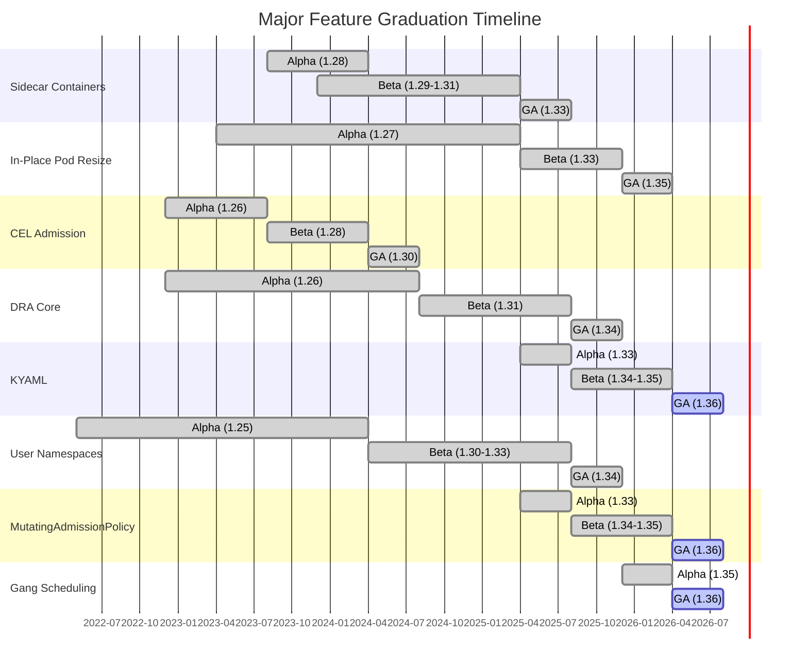
```mermaid
gantt
    title Major Feature Graduation Timeline
    dateFormat  YYYY-MM
    axisFormat  %Y-%m

    section Sidecar Containers
    Alpha (1.28)              :done, s1, 2023-08, 2024-04
    Beta (1.29-1.31)          :done, s2, 2023-12, 2025-04
    GA (1.33)                 :done, s3, 2025-04, 2025-08

    section In-Place Pod Resize
    Alpha (1.27)              :done, r1, 2023-04, 2025-04
    Beta (1.33)               :done, r2, 2025-04, 2025-12
    GA (1.35)                 :done, r3, 2025-12, 2026-04

    section CEL Admission
    Alpha (1.26)              :done, c1, 2022-12, 2023-08
    Beta (1.28)               :done, c2, 2023-08, 2024-04
    GA (1.30)                 :done, c3, 2024-04, 2024-08

    section DRA Core
    Alpha (1.26)              :done, d1, 2022-12, 2024-08
    Beta (1.31)               :done, d2, 2024-08, 2025-08
    GA (1.34)                 :done, d3, 2025-08, 2025-12

    section KYAML
    Alpha (1.33)              :done, k1, 2025-04, 2025-08
    Beta (1.34-1.35)          :done, k2, 2025-08, 2026-04
    GA (1.36)                 :active, k3, 2026-04, 2026-08

    section User Namespaces
    Alpha (1.25)              :done, u1, 2022-05, 2024-04
    Beta (1.30-1.33)          :done, u2, 2024-04, 2025-08
    GA (1.34)                 :done, u3, 2025-08, 2025-12

    section MutatingAdmissionPolicy
    Alpha (1.33)              :done, m1, 2025-04, 2025-08
    Beta (1.34-1.35)          :done, m2, 2025-08, 2026-04
    GA (1.36)                 :active, m3, 2026-04, 2026-08

    section Gang Scheduling
    Alpha (1.35)              :done, g1, 2025-12, 2026-04
    GA (1.36)                 :active, g2, 2026-04, 2026-08
```

---

## 6. Deprecations and Removals

Understanding deprecations and removals is critical for upgrade planning. A deprecation announces that an API or feature will be removed in a future version, giving teams time to migrate. A removal is the actual deletion of the API or feature.

### Kubernetes API Deprecation Policy

- **GA APIs**: Deprecated only when a replacement GA API is available. Minimum 12 months or 3 releases before removal.
- **Beta APIs**: Minimum 9 months or 3 releases before removal after deprecation.
- **Alpha APIs**: May be removed in any release without notice.

### API Deprecations and Removals by Version

#### Removed in 1.29

| API/Feature | Replaced By | Migration Path |
|------------|-------------|----------------|
| `SecurityContextDeny` admission plugin | Pod Security Standards (PSS) | Migrate to `PodSecurity` admission controller |

#### Removed in 1.32

| API/Feature | Replaced By | Migration Path |
|------------|-------------|----------------|
| `flowcontrol.apiserver.k8s.io/v1beta2` | `flowcontrol.apiserver.k8s.io/v1beta3` -> `v1` | Update API version in FlowSchema and PriorityLevelConfiguration resources |
| `autoscaling/v2beta1` HPA API | `autoscaling/v2` | Update all HPA manifests to use `autoscaling/v2` |

#### Removed in 1.34

| API/Feature | Replaced By | Migration Path |
|------------|-------------|----------------|
| Legacy `--authorization-mode` flag patterns | StructuredAuthorizationConfiguration | Migrate to structured authorization config file |
| `flowcontrol.apiserver.k8s.io/v1beta3` | `flowcontrol.apiserver.k8s.io/v1` | Update to stable API version |

#### Deprecated (Not Yet Removed)

| API/Feature | Deprecated In | Expected Removal | Migration Path |
|------------|--------------|-----------------|----------------|
| In-tree cloud provider (AWS, GCP, Azure) | 1.26+ | Ongoing | Migrate to external cloud controller managers |
| Annotation-based AppArmor profiles | 1.31 | 1.35 | Use `securityContext.appArmorProfile` field |
| `batch/v1beta1` CronJob | 1.21 | 1.25 (removed) | Use `batch/v1` |
| `policy/v1beta1` PodDisruptionBudget | 1.21 | 1.25 (removed) | Use `policy/v1` |
| kube-proxy iptables mode | 1.33 (soft) | TBD | Plan migration to nftables or IPVS |

### Removed Feature Gates by Version

When a feature reaches GA, its feature gate is typically removed after 2 releases. This means you cannot disable GA features.

```bash
# Check for feature gates that reference removed gates
# This would cause kubelet startup failure after upgrade

# Feature gates removed in 1.33:
# - SidecarContainers (GA in 1.33, gate removed in 1.35)
# - ServiceCIDR (GA in 1.33, gate removed in 1.35)

# Feature gates removed in 1.34:
# - UserNamespacesSupport (GA in 1.34, gate removed in 1.36)
# - VolumeAttributesClass (GA in 1.34, gate removed in 1.36)

# If you have explicit feature gate overrides, check them:
kubectl get cm kubelet-config -n kube-system -o yaml | grep featureGates -A 20
```

### Migration Checklist for Deprecated APIs

```bash
#!/bin/bash
# deprecation-check.sh - Check for deprecated API usage

echo "=== Kubernetes Deprecation Audit ==="

# Check for deprecated API versions in cluster resources
echo ""
echo "--- Checking for deprecated APIs in running resources ---"

# FlowSchema (v1beta2/v1beta3 deprecated)
echo "FlowSchemas using deprecated API versions:"
kubectl get flowschemas -o json | jq -r '.items[] | select(.apiVersion != "flowcontrol.apiserver.k8s.io/v1") | "\(.metadata.name): \(.apiVersion)"'

# Check for AppArmor annotations (deprecated in 1.31)
echo ""
echo "Pods using deprecated AppArmor annotations:"
kubectl get pods -A -o json | jq -r '.items[] | select(.metadata.annotations // {} | keys[] | test("apparmor.security.beta")) | "\(.metadata.namespace)/\(.metadata.name)"'

# Check for deprecated admission webhooks
echo ""
echo "Admission webhooks using deprecated API versions:"
kubectl get validatingwebhookconfigurations -o json | jq -r '.items[] | select(.apiVersion | test("v1beta1")) | .metadata.name'
kubectl get mutatingwebhookconfigurations -o json | jq -r '.items[] | select(.apiVersion | test("v1beta1")) | .metadata.name'

# Check Helm releases for deprecated APIs
echo ""
echo "Checking Helm releases for deprecated API versions:"
for release in $(helm list -A -q); do
  helm get manifest $release -n $(helm list -A -f "^${release}$" -o json | jq -r '.[0].namespace') 2>/dev/null | \
    grep "apiVersion:" | sort -u | while read line; do
      case "$line" in
        *v1beta1*|*v1beta2*|*v2beta1*)
          echo "  $release: $line (DEPRECATED)"
          ;;
      esac
    done
done

echo ""
echo "=== Audit Complete ==="
```

### API Compatibility Matrix

Use this table to verify that your manifests are compatible with the target Kubernetes version before upgrading.

| Resource | Stable API | Deprecated APIs | Safe Since |
|----------|-----------|-----------------|------------|
| HorizontalPodAutoscaler | `autoscaling/v2` | `v2beta1` (removed 1.26), `v2beta2` (removed 1.26) | 1.23 |
| CronJob | `batch/v1` | `v1beta1` (removed 1.25) | 1.21 |
| PodDisruptionBudget | `policy/v1` | `v1beta1` (removed 1.25) | 1.21 |
| CSIDriver | `storage.k8s.io/v1` | `v1beta1` (removed 1.22) | 1.18 |
| FlowSchema | `flowcontrol.apiserver.k8s.io/v1` | `v1beta2` (removed 1.32), `v1beta3` (removed 1.34) | 1.29 |
| ValidatingAdmissionPolicy | `admissionregistration.k8s.io/v1` | `v1beta1` (deprecated 1.30) | 1.30 |
| ResourceClaim (DRA) | `resource.k8s.io/v1` | `v1alpha3` (removed 1.34), `v1beta1` (removed 1.34) | 1.34 |
| VolumeAttributesClass | `storage.k8s.io/v1` | `v1beta1` (removed 1.36) | 1.34 |

---

## 7. EKS-Specific Considerations

### EKS Version Lag vs. Upstream

EKS releases lag behind upstream Kubernetes by approximately 2-4 months. This lag provides:

| Benefit | Description |
|---------|-------------|
| **Stability** | AWS validates the release with EKS-specific integrations |
| **Add-on Compatibility** | Managed add-ons are tested and updated |
| **AMI Availability** | Optimized EKS AMIs are built and tested |
| **Security Patches** | Known CVEs are addressed before release |

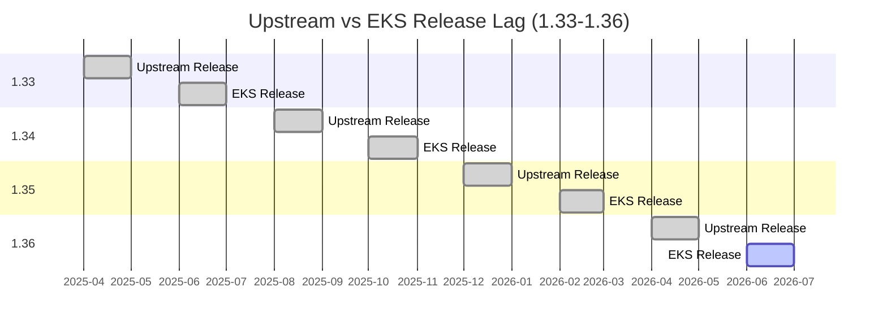
```mermaid
gantt
    title Upstream vs EKS Release Lag (1.33-1.36)
    dateFormat YYYY-MM
    axisFormat %Y-%m

    section 1.33
    Upstream Release    :done, u33, 2025-04, 2025-05
    EKS Release         :done, e33, 2025-06, 2025-07

    section 1.34
    Upstream Release    :done, u34, 2025-08, 2025-09
    EKS Release         :done, e34, 2025-10, 2025-11

    section 1.35
    Upstream Release    :done, u35, 2025-12, 2026-01
    EKS Release         :done, e35, 2026-02, 2026-03

    section 1.36
    Upstream Release    :done, u36, 2026-04, 2026-05
    EKS Release         :active, e36, 2026-06, 2026-07
```

### EKS Feature Gate Availability

Not all upstream Kubernetes feature gates are available on EKS. AWS controls the control plane configuration, so:

- **GA features**: Always enabled (same as upstream)
- **Beta features (enabled by default)**: Generally available on EKS
- **Beta features (disabled by default)**: May require an EKS support ticket or not be available
- **Alpha features**: Not available on EKS (alpha features are never enabled on EKS)

```bash
# Check which feature gates are active on your EKS cluster's nodes
kubectl get --raw "/api/v1/nodes/$(kubectl get nodes -o jsonpath='{.items[0].metadata.name}')/proxy/configz" | \
  jq '.kubeletconfig.featureGates'

# Check API server feature gates via metrics
kubectl get --raw /metrics 2>/dev/null | grep kubernetes_feature_enabled | head -30
```

### EKS Managed Add-on Compatibility Matrix

When upgrading EKS clusters, add-on compatibility is critical. Each Kubernetes version has specific add-on version requirements.

| Add-on | K8s 1.31 | K8s 1.32 | K8s 1.33 | K8s 1.34 | K8s 1.35 | K8s 1.36 |
|--------|----------|----------|----------|----------|----------|----------|
| **VPC CNI** | v1.18+ | v1.19+ | v1.19+ | v1.20+ | v1.20+ | v1.21+ |
| **CoreDNS** | v1.11.1+ | v1.11.3+ | v1.12.0+ | v1.12.0+ | v1.12.1+ | v1.12.1+ |
| **kube-proxy** | v1.31.x | v1.32.x | v1.33.x | v1.34.x | v1.35.x | v1.36.x |
| **EBS CSI** | v1.35+ | v1.36+ | v1.37+ | v1.38+ | v1.39+ | v1.40+ |
| **EFS CSI** | v2.0+ | v2.1+ | v2.1+ | v2.2+ | v2.2+ | v2.3+ |
| **ADOT** | v0.102+ | v0.104+ | v0.106+ | v0.108+ | v0.110+ | v0.112+ |

> **Note**: Always check the latest [EKS add-on version compatibility](https://docs.aws.amazon.com/eks/latest/userguide/managing-add-ons.html) before upgrading, as specific patch versions may be required.

```bash
# Check current add-on versions
aws eks describe-addon-versions --kubernetes-version 1.36 \
  --addon-name vpc-cni --query 'addons[].addonVersions[].addonVersion' --output table

# List all installed add-ons and their versions
aws eks list-addons --cluster-name my-cluster --output table
for addon in $(aws eks list-addons --cluster-name my-cluster --query 'addons[]' --output text); do
  version=$(aws eks describe-addon --cluster-name my-cluster --addon-name $addon \
    --query 'addon.addonVersion' --output text)
  echo "$addon: $version"
done
```

### EKS Auto Mode Version Support

EKS Auto Mode simplifies cluster management by automatically managing node groups, but has its own version considerations:

| Feature | Behavior with Auto Mode |
|---------|------------------------|
| **Control plane upgrades** | Managed by EKS (can be triggered via API/console) |
| **Node upgrades** | Automatically handled by Auto Mode |
| **Version skew** | Auto Mode maintains n-1 skew between control plane and nodes |
| **Add-on updates** | Core add-ons managed automatically |
| **Feature gates** | Node-level feature gates are managed by Auto Mode |

```bash
# Check Auto Mode status
aws eks describe-cluster --name my-cluster \
  --query 'cluster.computeConfig' --output json

# Verify Auto Mode node version alignment
kubectl get nodes -o custom-columns=\
NAME:.metadata.name,\
VERSION:.status.nodeInfo.kubeletVersion,\
INSTANCE_TYPE:.metadata.labels.'node\.kubernetes\.io/instance-type'
```

> **Important**: When using EKS Auto Mode, ensure that any custom NodePool configurations are compatible with the target Kubernetes version. Auto Mode NodePools automatically adopt new AMIs during upgrades, but custom configurations may need manual verification.

### Extended Support Cost Analysis

Understanding the financial impact of extended support helps teams prioritize upgrade planning.

```
Cost Comparison: Standard vs Extended Support (per cluster)

Standard Support:  $0.10/hour  x  24 hours  x  365 days  =  $876/year
Extended Support:  $0.60/hour  x  24 hours  x  365 days  =  $5,256/year

Additional cost per cluster in extended support:  $4,380/year
```

| Clusters in Extended Support | Additional Annual Cost |
|-----------------------------|----------------------|
| 1 cluster | $4,380 |
| 5 clusters | $21,900 |
| 10 clusters | $43,800 |
| 25 clusters | $109,500 |
| 50 clusters | $219,000 |
| 100 clusters | $438,000 |

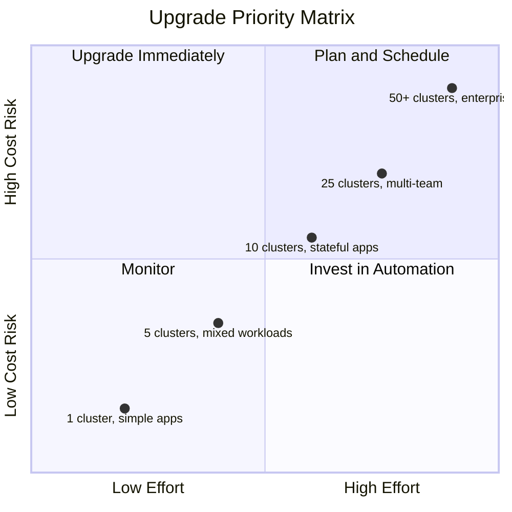
```mermaid
quadrantChart
    title Upgrade Priority Matrix
    x-axis Low Effort --> High Effort
    y-axis Low Cost Risk --> High Cost Risk
    quadrant-1 Plan and Schedule
    quadrant-2 Upgrade Immediately
    quadrant-3 Monitor
    quadrant-4 Invest in Automation
    "1 cluster, simple apps": [0.2, 0.15]
    "5 clusters, mixed workloads": [0.4, 0.35]
    "10 clusters, stateful apps": [0.6, 0.55]
    "25 clusters, multi-team": [0.75, 0.7]
    "50+ clusters, enterprise": [0.9, 0.9]
```

---

## 8. Version Upgrade Planning

### Feature Gate Testing Strategy

Before upgrading, test new feature gates in a staging environment to ensure compatibility.

```yaml
# Step 1: Enable feature gates in staging
# For EKS managed node groups, use a custom launch template
apiVersion: eksctl.io/v1alpha5
kind: ClusterConfig
metadata:
  name: staging-cluster
  region: us-west-2
managedNodeGroups:
  - name: test-nodes
    instanceType: m6i.xlarge
    desiredCapacity: 3
    kubelet:
      featureGates:
        InPlacePodVerticalScaling: true
        UserNamespacesSupport: true
```

```bash
# Step 2: Verify feature gates are active
kubectl get --raw "/api/v1/nodes/$(kubectl get nodes -o jsonpath='{.items[0].metadata.name}')/proxy/configz" | \
  jq '.kubeletconfig.featureGates'

# Step 3: Run feature-specific tests
# Example: Test in-place pod resize
cat <<EOF | kubectl apply -f -
apiVersion: v1
kind: Pod
metadata:
  name: resize-test
spec:
  containers:
    - name: test
      image: nginx:latest
      resources:
        requests:
          cpu: 100m
          memory: 128Mi
        limits:
          cpu: 200m
          memory: 256Mi
      resizePolicy:
        - resourceName: cpu
          restartPolicy: NotRequired
        - resourceName: memory
          restartPolicy: NotRequired
EOF

# Attempt resize
kubectl patch pod resize-test --subresource resize --patch '{
  "spec": {"containers": [{"name": "test", "resources": {"requests": {"cpu": "200m"},"limits": {"cpu": "400m"}}}]}
}'

# Verify resize succeeded
kubectl get pod resize-test -o jsonpath='{.status.resize}'
kubectl get pod resize-test -o jsonpath='{.status.containerStatuses[0].allocatedResources}'
```

### Pre-Upgrade Checklist by Version Jump

Use this checklist framework when planning each version upgrade. Fill in the specific items based on your source and target versions.

#### General Pre-Upgrade Checklist (All Versions)

```markdown
## Pre-Upgrade Checklist: v1.X -> v1.Y

### Phase 1: Assessment (1-2 weeks before)
- [ ] Review Kubernetes changelog for target version
- [ ] Review EKS release notes for target version
- [ ] Check deprecated API usage with `kubectl convert` or Pluto
- [ ] Verify add-on compatibility matrix
- [ ] Check third-party operator compatibility (cert-manager, Istio, ArgoCD, etc.)
- [ ] Review feature gate changes (new, graduated, removed)
- [ ] Test upgrade in staging/dev environment

### Phase 2: Preparation (1 week before)
- [ ] Back up etcd (EKS manages this, but verify backup schedule)
- [ ] Document current cluster state (versions, add-ons, node groups)
- [ ] Update IaC templates (Terraform, CDK, CloudFormation)
- [ ] Prepare rollback plan
- [ ] Schedule maintenance window
- [ ] Notify stakeholders

### Phase 3: Execution
- [ ] Upgrade control plane
- [ ] Verify API server health
- [ ] Upgrade managed add-ons (CoreDNS, kube-proxy, VPC CNI)
- [ ] Upgrade EBS CSI driver
- [ ] Upgrade node groups (rolling update)
- [ ] Verify node health and version
- [ ] Run smoke tests

### Phase 4: Validation
- [ ] Verify all workloads are running
- [ ] Check HPA/VPA functionality
- [ ] Validate ingress/networking
- [ ] Test service mesh (if applicable)
- [ ] Verify monitoring and alerting
- [ ] Check storage operations (PVC create, attach, resize)
- [ ] Run integration tests
```

#### Version-Specific Upgrade Notes

**Upgrading to 1.33 (from 1.32)**:
```markdown
Additional checks:
- [ ] Sidecar containers GA: Verify init containers with restartPolicy: Always work as expected
- [ ] In-Place Pod Resize beta: Test resize behavior with existing VPA configurations
- [ ] ServiceCIDR GA: If using custom Service CIDR, verify compatibility
- [ ] Topology Aware Routing GA: Review Service traffic distribution settings
```

**Upgrading to 1.34 (from 1.33)**:
```markdown
Additional checks:
- [ ] DRA GA: If using device plugins, plan migration to DRA
- [ ] KYAML beta: Audit YAML manifests for anchor/alias usage
- [ ] VolumeAttributesClass GA: Test volume modification workflows
- [ ] Namespace deletion changes: Verify namespace cleanup procedures
- [ ] User Namespaces GA: Test workloads with hostUsers: false
```

**Upgrading to 1.35 (from 1.34)**:
```markdown
Additional checks:
- [ ] In-Place Pod Resize GA: Full production use now safe
- [ ] KYAML enabled by default: Fix any YAML warnings before upgrade
- [ ] Gang Scheduling alpha: Not available on EKS (alpha)
- [ ] Remove deprecated feature gate overrides for 1.33 GA features
- [ ] Verify sidecar container feature gate is not explicitly set (removed in 1.35)
```

**Upgrading to 1.36 (from 1.35)**:
```markdown
Additional checks:
- [ ] KYAML GA: All YAML must pass KYAML validation (strict enforcement)
- [ ] Gang Scheduling GA: Evaluate for distributed workloads
- [ ] Pod-level In-Place Scaling beta: Test pod-level resource limits
- [ ] Remove deprecated feature gate overrides for 1.34 GA features
```

### API Compatibility Verification

```bash
#!/bin/bash
# api-compat-check.sh - Verify API compatibility before upgrade

TARGET_VERSION=${1:-"1.36"}
echo "=== API Compatibility Check for Kubernetes $TARGET_VERSION ==="

# Tool 1: Use kubectl convert (if available)
echo ""
echo "--- Checking with kubectl convert ---"
# Install convert plugin if not present
# kubectl krew install convert

# Tool 2: Use Pluto for deprecated API detection
echo ""
echo "--- Checking with Pluto ---"
if command -v pluto &> /dev/null; then
  echo "Scanning cluster for deprecated APIs..."
  pluto detect-all-in-cluster --target-versions k8s=v${TARGET_VERSION}
  
  echo ""
  echo "Scanning Helm releases..."
  pluto detect-helm --target-versions k8s=v${TARGET_VERSION}
else
  echo "Pluto not installed. Install with:"
  echo "  brew install FairwindsOps/tap/pluto"
  echo "  or: kubectl krew install deprecations"
fi

# Tool 3: Check with kubent (kube-no-trouble)
echo ""
echo "--- Checking with kubent ---"
if command -v kubent &> /dev/null; then
  kubent --target-version ${TARGET_VERSION}
else
  echo "kubent not installed. Install from: https://github.com/doitintl/kube-no-trouble"
fi

# Manual checks
echo ""
echo "--- Manual API Version Checks ---"

# Check for v1beta1 usage
echo "Resources using v1beta1 APIs:"
kubectl api-resources -o wide 2>/dev/null | grep v1beta1

# Check CRDs for deprecated API versions
echo ""
echo "CRDs with deprecated conversion webhooks:"
kubectl get crds -o json | jq -r '.items[] | select(.spec.conversion.webhook != null) | .metadata.name'

echo ""
echo "=== Compatibility Check Complete ==="
```

### Add-on Version Alignment

```bash
#!/bin/bash
# addon-alignment.sh - Verify add-on compatibility for target K8s version

CLUSTER_NAME=${1:-"my-cluster"}
TARGET_K8S_VERSION=${2:-"1.36"}

echo "=== Add-on Alignment Check ==="
echo "Cluster: $CLUSTER_NAME"
echo "Target K8s Version: $TARGET_K8S_VERSION"
echo ""

# Get current add-on versions
echo "--- Current Add-on Versions ---"
for addon in $(aws eks list-addons --cluster-name $CLUSTER_NAME --query 'addons[]' --output text); do
  current_version=$(aws eks describe-addon --cluster-name $CLUSTER_NAME --addon-name $addon \
    --query 'addon.addonVersion' --output text 2>/dev/null)
  echo "$addon: $current_version"
done

# Get compatible versions for target
echo ""
echo "--- Compatible Versions for K8s $TARGET_K8S_VERSION ---"
for addon in vpc-cni coredns kube-proxy aws-ebs-csi-driver; do
  echo ""
  echo "$addon:"
  aws eks describe-addon-versions \
    --addon-name $addon \
    --kubernetes-version $TARGET_K8S_VERSION \
    --query 'addons[].addonVersions[?compatibilities[?defaultVersion==`true`]].addonVersion' \
    --output text 2>/dev/null | head -5
  
  default_version=$(aws eks describe-addon-versions \
    --addon-name $addon \
    --kubernetes-version $TARGET_K8S_VERSION \
    --query 'addons[].addonVersions[?compatibilities[?defaultVersion==`true`]].addonVersion | [0]' \
    --output text 2>/dev/null)
  echo "  Default: $default_version"
done

echo ""
echo "=== Alignment Check Complete ==="
```

### Upgrade Execution Workflow

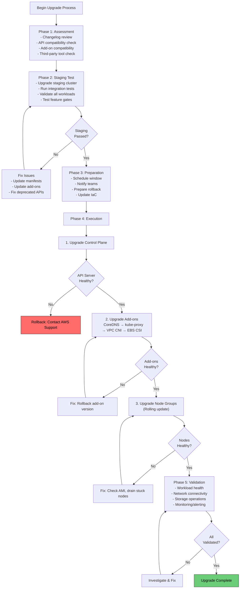
```mermaid
flowchart TD
    Start["Begin Upgrade Process"] --> Assess["Phase 1: Assessment
    - Changelog review
    - API compatibility check
    - Add-on compatibility
    - Third-party tool check"]
    
    Assess --> Staging["Phase 2: Staging Test
    - Upgrade staging cluster
    - Run integration tests
    - Validate all workloads
    - Test feature gates"]
    
    Staging --> StagePass{"Staging
    Passed?"}
    StagePass -->|No| Fix["Fix Issues
    - Update manifests
    - Update add-ons
    - Fix deprecated APIs"]
    Fix --> Staging
    
    StagePass -->|Yes| Prepare["Phase 3: Preparation
    - Schedule window
    - Notify teams
    - Prepare rollback
    - Update IaC"]
    
    Prepare --> Execute["Phase 4: Execution"]
    
    Execute --> CP["1. Upgrade Control Plane"]
    CP --> CPCheck{"API Server
    Healthy?"}
    CPCheck -->|No| CPRollback["Rollback: Contact AWS Support"]
    CPCheck -->|Yes| Addons["2. Upgrade Add-ons
    CoreDNS → kube-proxy → VPC CNI → EBS CSI"]
    
    Addons --> AddonCheck{"Add-ons
    Healthy?"}
    AddonCheck -->|No| AddonFix["Fix: Rollback add-on version"]
    AddonFix --> Addons
    AddonCheck -->|Yes| Nodes["3. Upgrade Node Groups
    (Rolling update)"]
    
    Nodes --> NodeCheck{"Nodes
    Healthy?"}
    NodeCheck -->|No| NodeFix["Fix: Check AMI, drain stuck nodes"]
    NodeFix --> Nodes
    NodeCheck -->|Yes| Validate["Phase 5: Validation
    - Workload health
    - Network connectivity
    - Storage operations
    - Monitoring/alerting"]
    
    Validate --> Pass{"All
    Validated?"}
    Pass -->|No| Investigate["Investigate & Fix"]
    Investigate --> Validate
    Pass -->|Yes| Complete["Upgrade Complete"]

    style Complete fill:#6bcb77,stroke:#333,color:black
    style CPRollback fill:#ff6b6b,stroke:#333,color:black
```

### Rollback Strategy

> **Update (2026-07-01)**: Amazon EKS announced Kubernetes version rollback support. Within 7 days of an upgrade, you can roll the control plane back to the previous minor version. An automated Rollback Readiness check runs first, covering API compatibility, version skew, add-on compatibility, and cluster health. EKS Auto Mode clusters roll back automatically -- worker nodes revert on their own and the control plane is restored in sequence. There's no additional charge, and it's available in all regions. The strategy below is the fallback for cases where more than 7 days have passed or this feature isn't available. (Source: [Amazon EKS announces Kubernetes version rollback](https://aws.amazon.com/about-aws/whats-new/2026/07/amazon-eks-version-rollback))

```yaml
# Upgrade rollback strategy
rollback_strategy:

  control_plane:
    note: "Within 7 days: use EKS native version rollback / Beyond 7 days: blue-green cluster strategy"
    mitigation:
      - "Use EKS version rollback to restore the previous minor version immediately (within 7 days, no additional cost)"
      - "Beyond 7 days, fall back to a blue/green cluster strategy established before the upgrade"
      - "Shift traffic via Route 53 weighted routing"
      - "Migrate workloads to the new cluster"

  node_groups:
    strategy: "Create new node group + retain previous node group"
    steps:
      - "Do not immediately delete the previous version's node group"
      - "If issues arise, remove the taint from the previous node group"
      - "Add a taint to the new node group to shift traffic"

  workloads:
    strategy: "GitOps-based rollback"
    steps:
      - "Roll back to the previous commit in ArgoCD/Flux"
      - "Run a Helm rollback"

  addons:
    strategy: "Downgrade to the previous version"
    command: |
      aws eks update-addon \
        --cluster-name my-cluster \
        --addon-name vpc-cni \
        --addon-version <previous-version> \
        --resolve-conflicts OVERWRITE
```

---

## 9. Future Outlook

### Features in Active Development

The Kubernetes community continues to push the boundaries of container orchestration. Here are key features and trends in active development that may appear in upcoming releases.

#### Near-Term (Expected 1.37 - 1.38)

| Feature | Current State | Expected Timeline | Impact |
|---------|--------------|-------------------|--------|
| **Pod-Level In-Place Scaling GA** | Beta (1.36) | 1.37 | Aggregate pod resource management |
| **MutatingAdmissionPolicy enhancements** | GA (1.36) | Ongoing | Richer CEL mutation patterns |
| **Improved DRA partitioning** | Beta (1.36) | 1.37 | Fine-grained GPU sharing |
| **Scheduler improvements** | Various | Ongoing | Better bin-packing, queue management |

#### Medium-Term Trends

**AI/ML Workload Optimization**

Kubernetes is evolving rapidly to better support AI/ML workloads:

- **DRA ecosystem growth**: More device drivers for specialized hardware (TPUs, custom ASICs)
- **Gang scheduling maturity**: Better support for distributed training with strict co-scheduling requirements
- **GPU time-slicing and MIG**: Native Kubernetes support for GPU partitioning
- **Network-aware scheduling**: Consider network topology for distributed training placement

**Security Hardening**

- **Sigstore integration**: Native supply chain security for container images
- **Policy as Code maturity**: CEL-based admission covering more complex scenarios
- **Confidential containers**: TEE-based container isolation
- **Improved audit logging**: Structured, queryable audit events

**Developer Experience**

- **KYAML ecosystem**: Tooling improvements for the safer YAML subset
- **Improved CRD experience**: Better validation, defaulting, and conversion
- **Enhanced kubectl**: More powerful query, filtering, and formatting options

### CNCF Ecosystem Trends

| Trend | Key Projects | Kubernetes Impact |
|-------|-------------|-------------------|
| **Platform Engineering** | Backstage, Crossplane, KRO | Kubernetes as a platform for building platforms |
| **eBPF Networking** | Cilium, Calico eBPF | Replacing iptables/nftables entirely |
| **Service Mesh Evolution** | Istio Ambient, Cilium SM | Sidecar-free mesh architectures |
| **GitOps Maturity** | ArgoCD, FluxCD | Declarative operations as the default |
| **Observability** | OpenTelemetry | Unified telemetry collection standard |
| **WebAssembly (Wasm)** | SpinKube, wasmCloud | Lighter-weight workload execution |
| **AI Infrastructure** | KubeAI, vLLM operator | Kubernetes-native AI serving |

### Planning for the Future

For teams planning their Kubernetes strategy:

1. **Stay within n-1 of latest**: Target running no more than one version behind the latest EKS release
2. **Upgrade quarterly**: Align with the Kubernetes release cadence (every 4 months)
3. **Test early**: Use staging clusters to validate new versions within weeks of EKS availability
4. **Automate upgrades**: Invest in CI/CD pipelines that include cluster upgrade testing
5. **Monitor deprecations**: Subscribe to Kubernetes release announcements and review changelogs proactively
6. **Adopt GA features promptly**: Features reaching GA are production-ready and will be permanently enabled

---

## 10. References

### Official Kubernetes Resources

- [Kubernetes Release Page](https://kubernetes.io/releases/)
- [Kubernetes Changelog (GitHub)](https://github.com/kubernetes/kubernetes/blob/master/CHANGELOG/)
- [Kubernetes Feature Gates Reference](https://kubernetes.io/docs/reference/command-line-tools-reference/feature-gates/)
- [Kubernetes Enhancement Proposals (KEPs)](https://github.com/kubernetes/enhancements)
- [KEP Tracking Board](https://www.kubernetes.dev/resources/keps/)
- [Kubernetes Deprecation Policy](https://kubernetes.io/docs/reference/using-api/deprecation-policy/)
- [API Migration Guide](https://kubernetes.io/docs/reference/using-api/deprecation-guide/)
- [Kubernetes Blog - Release Announcements](https://kubernetes.io/blog/)
- [SIG Release](https://github.com/kubernetes/sig-release)

### Amazon EKS Resources

- [EKS Kubernetes Versions](https://docs.aws.amazon.com/eks/latest/userguide/kubernetes-versions.html)
- [EKS Release Calendar](https://docs.aws.amazon.com/eks/latest/userguide/kubernetes-versions.html#kubernetes-release-calendar)
- [EKS Extended Support](https://docs.aws.amazon.com/eks/latest/userguide/extended-support-control.html)
- [EKS Add-on Versions](https://docs.aws.amazon.com/eks/latest/userguide/managing-add-ons.html)
- [EKS Auto Mode](https://docs.aws.amazon.com/eks/latest/userguide/automode.html)
- [EKS Best Practices Guide](https://aws.github.io/aws-eks-best-practices/)
- [EKS Upgrade Guide](https://docs.aws.amazon.com/eks/latest/userguide/update-cluster.html)

### Tools for Upgrade Planning

- [Pluto - Deprecated API Detector](https://github.com/FairwindsOps/pluto)
- [kubent (kube-no-trouble)](https://github.com/doitintl/kube-no-trouble)
- [kubectl-convert Plugin](https://kubernetes.io/docs/tasks/tools/install-kubectl-linux/#install-kubectl-convert-plugin)
- [Nova - Helm Chart Version Checker](https://github.com/FairwindsOps/nova)
- [eksctl](https://eksctl.io/)

### Community Resources

- [Kubernetes Slack](https://kubernetes.slack.com) - #sig-release, #eks channels
- [CNCF Calendar](https://www.cncf.io/calendar/) - KubeCon and community events
- [The Kubernetes Podcast](https://kubernetespodcast.com/)
- [Release Team Shadows Program](https://github.com/kubernetes/sig-release/blob/master/release-team/shadows.md)

## Quiz

To test what you've learned in this document, try the [Kubernetes Version Features and Roadmap Quiz](../quizzes/eks/12-kubernetes-version-roadmap-quiz.md).

---

< [Previous: EKS Advanced Debugging](./11-eks-advanced-debugging.md) | [Table of Contents](./README.md) >
