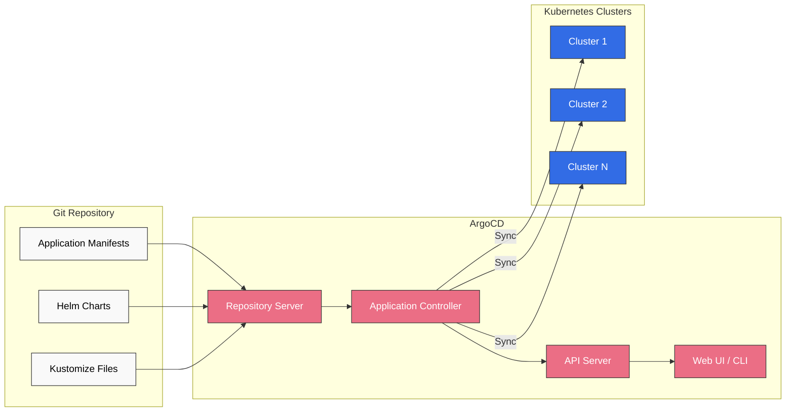
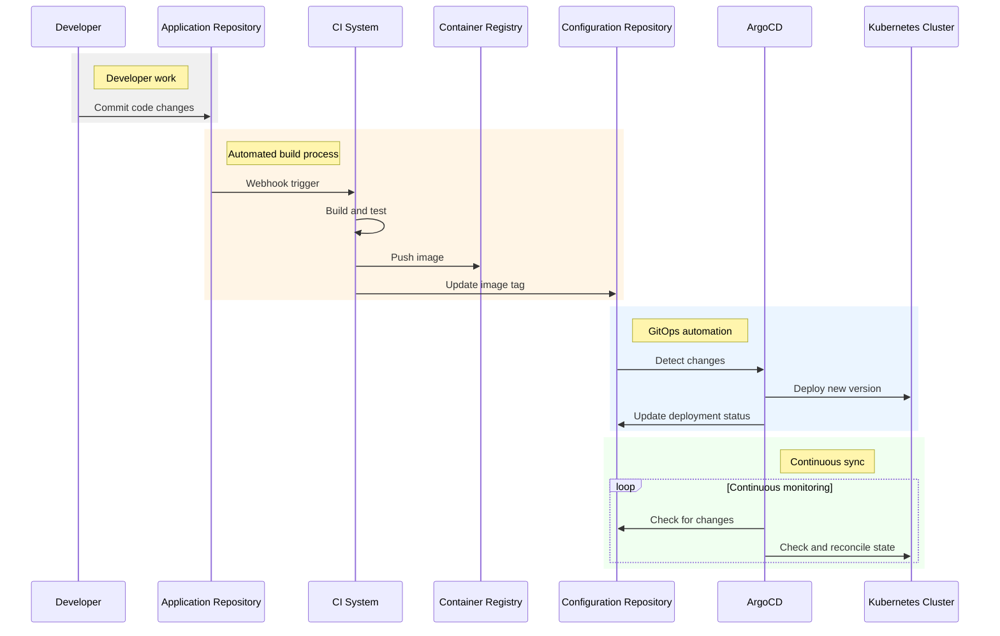

# ArgoCD

> **Supported Versions**: ArgoCD 2.7, 2.8
> **Last Updated**: July 25, 2025

## Table of Contents
- [Introduction](#introduction)
- [Architecture](#architecture)
- [Installation and Configuration](#installation-and-configuration)
- [Application Deployment](#application-deployment)
- [Multi-Cluster Deployment](#multi-cluster-deployment)
- [GitOps Workflow](#gitops-workflow)
- [Security Considerations](#security-considerations)
- [Monitoring and Alerting](#monitoring-and-alerting)
- [Best Practices](#best-practices)
- [Troubleshooting](#troubleshooting)
- [Integration with Amazon EKS](#integration-with-amazon-eks)

## Introduction

ArgoCD is a declarative GitOps continuous deployment tool for Kubernetes. It implements the GitOps methodology to automate application deployment and lifecycle management. It uses Git repositories as the "source of truth" to define application configurations and automatically synchronizes them to Kubernetes clusters.

### What is GitOps?

GitOps is an operational model where infrastructure and application configurations are stored in Git repositories and applied to environments through automated processes. The key principles are:

1. **Declarative Configuration**: Define the desired state of the system as code
2. **Version Control**: Track all changes in Git
3. **Automated Synchronization**: Automatically reconcile differences between repository and runtime environment
4. **Self-Healing**: System automatically recovers to the desired state

### Latest GitOps Trends (2023)

Notable recent trends in the GitOps space include:

1. **Multi-Cluster GitOps**:
   - Consistent configuration management across multiple clusters
   - Automated multi-cluster deployment through ArgoCD ApplicationSets
   - Configuration synchronization and policy enforcement across clusters

2. **Hybrid and Multi-Cloud GitOps**:
   - Consistent deployment strategy spanning on-premises and cloud environments
   - Improved workload portability across different cloud providers
   - Reduced complexity through centralized management

3. **GitOps and Policy Management Integration**:
   - Policy-based deployment through OPA (Open Policy Agent) and Kyverno
   - Automation of compliance and governance
   - Codification and version control of security policies

4. **GitOps and Platform Engineering**:
   - Integration of Internal Developer Platforms (IDP) with GitOps
   - Enhanced self-service developer experience
   - Unified infrastructure provisioning and application deployment

5. **AI/ML Workflows and GitOps**:
   - GitOps pipelines for ML model deployment
   - Model version management and tracking
   - Integration of Kubeflow and ArgoCD

### Key Benefits of ArgoCD

- **Version control of application definitions, configurations, and environments**
- **Automated application deployment**
- **Application deployment across multiple clusters**
- **Implementation of deployment strategies (blue/green, canary, etc.)**
- **Visibility into cluster state**
- **Implementation of self-healing systems**
- **Audit trail and compliance support**

## Architecture

ArgoCD operates as a Kubernetes controller, continuously monitoring application configurations defined in Git repositories. When it detects differences between the repository and cluster, it automatically synchronizes to maintain the cluster state at the desired state.



### Key Components

1. **API Server**: Provides the ArgoCD API and handles user authentication.
2. **Repository Server**: Caches and manages application manifests from Git repositories.
3. **Application Controller**: Monitors application state and synchronizes current state with desired state.
4. **Web UI / CLI**: Provides user interfaces.

## Installation and Configuration

### Prerequisites

- Kubernetes cluster (v1.17 or higher)
- kubectl configured
- Administrator privileges

### Installation Methods

#### 1. Create Namespace

```bash
kubectl create namespace argocd
```

#### 2. Install ArgoCD

```bash
kubectl apply -n argocd -f https://raw.githubusercontent.com/argoproj/argo-cd/stable/manifests/install.yaml
```

#### 3. Install ArgoCD CLI

macOS:
```bash
brew install argocd
```

Linux:
```bash
curl -sSL -o argocd-linux-amd64 https://github.com/argoproj/argo-cd/releases/latest/download/argocd-linux-amd64
sudo install -m 555 argocd-linux-amd64 /usr/local/bin/argocd
rm argocd-linux-amd64
```

#### 4. Access API Server

Port forwarding:
```bash
kubectl port-forward svc/argocd-server -n argocd 8080:443
```

Or expose as LoadBalancer service:
```bash
kubectl patch svc argocd-server -n argocd -p '{"spec": {"type": "LoadBalancer"}}'
```

#### 5. Get Initial Password

```bash
kubectl -n argocd get secret argocd-initial-admin-secret -o jsonpath="{.data.password}" | base64 -d
```

#### 6. Login

```bash
argocd login localhost:8080
```

### Basic Configuration

#### RBAC Setup

ArgoCD supports RBAC (Role-Based Access Control). Here is an example of basic RBAC configuration:

```yaml
apiVersion: v1
kind: ConfigMap
metadata:
  name: argocd-rbac-cm
  namespace: argocd
data:
  policy.csv: |
    p, role:org-admin, applications, *, */*, allow
    p, role:org-admin, clusters, get, *, allow
    p, role:org-admin, repositories, get, *, allow
    p, role:org-admin, repositories, create, *, allow
    p, role:org-admin, repositories, update, *, allow
    p, role:org-admin, repositories, delete, *, allow

    p, role:app-admin, applications, *, */*, allow
    p, role:app-admin, clusters, get, *, allow
    p, role:app-admin, repositories, get, *, allow

    p, role:readonly, applications, get, */*, allow
    p, role:readonly, clusters, get, *, allow
    p, role:readonly, repositories, get, *, allow

    g, admin, role:org-admin
```

#### SSO Integration

ArgoCD can integrate with various SSO providers. Here is an example OIDC configuration:

```yaml
apiVersion: v1
kind: ConfigMap
metadata:
  name: argocd-cm
  namespace: argocd
data:
  url: https://argocd.example.com

  oidc.config: |
    name: Okta
    issuer: https://dev-123456.okta.com
    clientID: 0oabcdefghijklmno0p1
    clientSecret: $oidc.okta.clientSecret
    requestedScopes: ["openid", "profile", "email", "groups"]
```

## Application Deployment

### Application Definition

An ArgoCD Application is a Kubernetes resource that contains the following information:

- Source repository URL
- Target cluster and namespace
- Sync policy
- Path to manifests to deploy

#### Example: Basic Application

```yaml
apiVersion: argoproj.io/v1alpha1
kind: Application
metadata:
  name: guestbook
  namespace: argocd
spec:
  project: default
  source:
    repoURL: https://github.com/argoproj/argocd-example-apps.git
    targetRevision: HEAD
    path: guestbook
  destination:
    server: https://kubernetes.default.svc
    namespace: guestbook
  syncPolicy:
    automated:
      prune: true
      selfHeal: true
```

### Sync Policies

ArgoCD supports various sync policies:

- **Manual Sync**: User must explicitly trigger synchronization
- **Auto Sync**: Automatically synchronize when Git repository changes
- **Self Heal**: Automatically recover when cluster state differs from desired state
- **Pruning**: Automatically delete resources no longer in Git

### Support for Various Manifest Formats

ArgoCD supports various Kubernetes manifest formats:

1. **Kustomize**: Overlay support for environment-specific configurations
2. **Helm**: Chart-based deployment and values file support
3. **Jsonnet**: Programmatic configuration generation
4. **Plain YAML/JSON**: Basic Kubernetes manifests

#### Helm Chart Example

```yaml
apiVersion: argoproj.io/v1alpha1
kind: Application
metadata:
  name: nginx-ingress
  namespace: argocd
spec:
  project: default
  source:
    repoURL: https://charts.helm.sh/stable
    chart: nginx-ingress
    targetRevision: 1.41.3
    helm:
      values: |
        controller:
          service:
            type: LoadBalancer
  destination:
    server: https://kubernetes.default.svc
    namespace: ingress-nginx
```

#### Kustomize Example

```yaml
apiVersion: argoproj.io/v1alpha1
kind: Application
metadata:
  name: myapp-prod
  namespace: argocd
spec:
  project: default
  source:
    repoURL: https://github.com/myorg/myapp.git
    targetRevision: HEAD
    path: overlays/prod
    kustomize:
      namePrefix: prod-
  destination:
    server: https://kubernetes.default.svc
    namespace: myapp-prod
```

## Multi-Cluster Deployment

One of the key strengths of ArgoCD is its ability to deploy applications to multiple Kubernetes clusters. This enables consistent application deployment across multi-cluster environments.

### Cluster Registration

```bash
argocd cluster add <context-name>
```

### Cross-Cluster Deployment Strategies

#### 1. ApplicationSet

ApplicationSet is used to deploy the same application to multiple clusters:

```yaml
apiVersion: argoproj.io/v1alpha1
kind: ApplicationSet
metadata:
  name: guestbook
  namespace: argocd
spec:
  generators:
  - clusters: {}
  template:
    metadata:
      name: '{{name}}-guestbook'
    spec:
      project: default
      source:
        repoURL: https://github.com/argoproj/argocd-example-apps.git
        targetRevision: HEAD
        path: guestbook
      destination:
        server: '{{server}}'
        namespace: guestbook
```

#### 2. Environment-Specific Configuration

Configuration for various environments (development, staging, production):

```yaml
apiVersion: argoproj.io/v1alpha1
kind: ApplicationSet
metadata:
  name: guestbook
  namespace: argocd
spec:
  generators:
  - list:
      elements:
      - cluster: dev
        url: https://kubernetes.dev.svc
        values:
          replicas: 1
      - cluster: staging
        url: https://kubernetes.staging.svc
        values:
          replicas: 2
      - cluster: prod
        url: https://kubernetes.prod.svc
        values:
          replicas: 5
  template:
    metadata:
      name: '{{cluster}}-guestbook'
    spec:
      project: default
      source:
        repoURL: https://github.com/argoproj/argocd-example-apps.git
        targetRevision: HEAD
        path: guestbook
        helm:
          parameters:
          - name: replicaCount
            value: '{{values.replicas}}'
      destination:
        server: '{{url}}'
        namespace: guestbook
```

### Cross-Cluster Sync Order

It's common to test applications in development and staging environments before deploying to production. ArgoCD supports Sync Waves for this:

```yaml
apiVersion: argoproj.io/v1alpha1
kind: Application
metadata:
  name: guestbook
  namespace: argocd
  annotations:
    argocd.argoproj.io/sync-wave: "5"  # Higher numbers sync later
spec:
  # ... application definition
```

## GitOps Workflow

The GitOps workflow with ArgoCD is as follows:

1. Developer commits application code to the development repository
2. CI pipeline builds, tests the code and creates an image
3. Image tag is updated in the configuration repository
4. ArgoCD detects configuration changes and applies them to the cluster



### Configuration Repository Structure

Example configuration repository structure for effective GitOps workflow:

```
├── base/
│   ├── deployment.yaml
│   ├── service.yaml
│   └── kustomization.yaml
├── overlays/
│   ├── dev/
│   │   ├── kustomization.yaml
│   │   └── config.yaml
│   ├── staging/
│   │   ├── kustomization.yaml
│   │   └── config.yaml
│   └── prod/
│       ├── kustomization.yaml
│       └── config.yaml
└── applications/
    ├── dev.yaml
    ├── staging.yaml
    └── prod.yaml
```

## Security Considerations

### Sensitive Information Management

Methods for managing sensitive information in ArgoCD:

1. **Bitnami Sealed Secrets**: Store encrypted secrets in Git
2. **HashiCorp Vault**: Integration with external secret management system
3. **AWS Secrets Manager**: Integration with AWS services
4. **External Secrets Operator**: Generate Kubernetes secrets from external secret sources

#### Bitnami Sealed Secrets Example

```yaml
apiVersion: bitnami.com/v1alpha1
kind: SealedSecret
metadata:
  name: mysecret
  namespace: default
spec:
  encryptedData:
    password: AgBy8hCM8FayQFfixS...
```

### RBAC and Access Control

ArgoCD supports granular RBAC:

```yaml
apiVersion: v1
kind: ConfigMap
metadata:
  name: argocd-rbac-cm
  namespace: argocd
data:
  policy.csv: |
    # Project admins can only manage applications in their project
    p, role:project-admin, applications, *, project-name/*, allow
    p, role:project-admin, projects, get, project-name, allow

    # Developers can only view applications
    p, role:developer, applications, get, */*, allow

    # User group assignment
    g, alice@example.com, role:project-admin
    g, bob@example.com, role:developer
```

## Monitoring and Alerting

### Prometheus Integration

ArgoCD exposes Prometheus metrics for monitoring:

```yaml
apiVersion: monitoring.coreos.com/v1
kind: ServiceMonitor
metadata:
  name: argocd-metrics
  namespace: monitoring
spec:
  selector:
    matchLabels:
      app.kubernetes.io/name: argocd-metrics
  endpoints:
  - port: metrics
```

### Alert Configuration

ArgoCD supports various notification channels:

```yaml
apiVersion: v1
kind: ConfigMap
metadata:
  name: argocd-notifications-cm
  namespace: argocd
data:
  service.slack: |
    token: $slack-token
  template.app-sync-status: |
    message: |
      Application {{.app.metadata.name}} sync status is {{.app.status.sync.status}}
      {{if eq .app.status.sync.status "Synced"}}✅{{else}}❌{{end}}
  trigger.on-sync-status-change: |
    - when: app.status.sync.status != 'Synced'
      send: [app-sync-status]
    - when: app.status.sync.status == 'Synced'
      send: [app-sync-status]
```

## Best Practices

### Application Configuration

1. **Structure Projects**: Group related applications into ArgoCD projects
2. **Set Sync Options**: Enable auto sync, self heal, pruning
3. **State Verification**: Configure health checks and post-sync verification
4. **Ignore Resources**: Exclude specific resources from synchronization

### Performance Optimization

1. **Split Applications**: Split large applications into smaller units
2. **Set Resource Requests/Limits**: Allocate appropriate resources to ArgoCD components
3. **Optimize Cache**: Adjust repository server cache settings
4. **Limit Sync Frequency**: Prevent excessive synchronization

### High Availability Configuration

High availability ArgoCD setup for production environments:

```yaml
apiVersion: v1
kind: ConfigMap
metadata:
  name: argocd-cmd-params-cm
  namespace: argocd
data:
  controller.replicas: "2"
  server.replicas: "2"
  repo.server.replicas: "2"
```

## Troubleshooting

### Common Issues and Solutions

1. **Sync Failure**
   - Cause: Manifest errors, permission issues, resource conflicts
   - Solution: Check application events and logs, analyze differences

2. **Repository Connection Issues**
   - Cause: Authentication errors, network issues
   - Solution: Verify repository credentials, test network connectivity

3. **Performance Issues**
   - Cause: Insufficient resources, large applications
   - Solution: Increase resource allocation, split applications

### Debugging Tools

```bash
# Check application status
argocd app get <app-name>

# Check sync differences
argocd app diff <app-name>

# Check application logs
kubectl logs -n argocd -l app.kubernetes.io/name=argocd-application-controller

# Check repository server logs
kubectl logs -n argocd -l app.kubernetes.io/name=argocd-repo-server
```

## Integration with Amazon EKS

ArgoCD integrates seamlessly with Amazon EKS to implement GitOps workflows.

### EKS Cluster Registration

```bash
# Get EKS cluster context
aws eks update-kubeconfig --name <cluster-name> --region <region>

# Add cluster to ArgoCD
argocd cluster add <context-name>
```

### IAM Role Configuration

Appropriate IAM permissions are required when deploying ArgoCD to an EKS cluster:

```yaml
apiVersion: v1
kind: ServiceAccount
metadata:
  name: argocd-application-controller
  namespace: argocd
  annotations:
    eks.amazonaws.com/role-arn: arn:aws:iam::<account-id>:role/ArgoCD
```

### Managing Multiple EKS Clusters

ApplicationSet example for managing multiple EKS clusters:

```yaml
apiVersion: argoproj.io/v1alpha1
kind: ApplicationSet
metadata:
  name: multi-cluster-apps
  namespace: argocd
spec:
  generators:
  - clusters:
      selector:
        matchLabels:
          environment: production
  template:
    metadata:
      name: '{{name}}-app'
    spec:
      project: default
      source:
        repoURL: https://github.com/myorg/myapp.git
        targetRevision: HEAD
        path: overlays/prod
      destination:
        server: '{{server}}'
        namespace: myapp
```

### Integration with AWS Services

Methods for managing AWS services using ArgoCD:

1. **AWS Controllers for Kubernetes (ACK)**: Manage AWS resources as Kubernetes objects
2. **Crossplane**: Provision cloud resources through the Kubernetes API
3. **Terraform Integration**: Apply Terraform configurations through ArgoCD

#### ACK Controller Example

```yaml
apiVersion: s3.services.k8s.aws/v1alpha1
kind: Bucket
metadata:
  name: my-bucket
spec:
  name: my-unique-bucket-name
```

## Conclusion

ArgoCD is a powerful tool for implementing GitOps workflows in Kubernetes environments. Using Git repositories as the "source of truth", it automates application deployment and maintains consistent configuration across multiple clusters. This document covered basic concepts of ArgoCD, installation methods, application deployment, multi-cluster management, security considerations, monitoring, and troubleshooting.

Adopting GitOps methodology improves deployment process transparency, auditability, and stability, and enhances collaboration between development and operations teams. ArgoCD provides the tools and features needed to implement these GitOps principles.

## References

- [ArgoCD Official Documentation](https://argo-cd.readthedocs.io/)
- [ArgoCD GitHub Repository](https://github.com/argoproj/argo-cd)
- [GitOps Principles](https://www.gitops.tech/)
- [ArgoCD User Guide](https://argo-cd.readthedocs.io/en/stable/user-guide/)
- [ArgoCD Operator Manual](https://argo-cd.readthedocs.io/en/stable/operator-manual/)

## Quiz

To test what you've learned in this chapter, try the [topic quiz](../quizzes/gitops/01-argocd-quiz.md).
