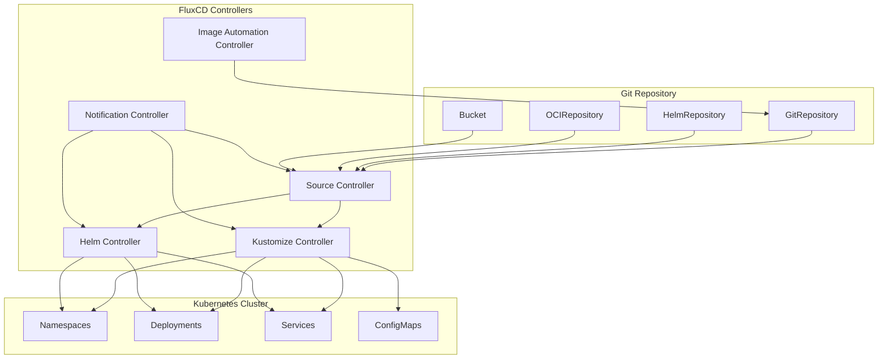

# FluxCD

> **Supported Versions**: FluxCD v2.2+
> **Last Updated**: February 21, 2026

FluxCD is a set of continuous and progressive delivery solutions for Kubernetes that are open and extensible. FluxCD graduated from the CNCF in November 2022, making it one of the most mature GitOps tools in the cloud-native ecosystem.

## Introduction

FluxCD implements the GitOps principles by using Git repositories as the source of truth for defining the desired state of your Kubernetes clusters. It automatically ensures that the state of your clusters matches the configuration in Git.

### Key Features

- **GitOps Native**: Built from the ground up for GitOps workflows
- **Multi-tenancy**: Supports multiple teams with isolated configurations
- **Multi-cluster**: Manage multiple clusters from a single Git repository
- **Extensible**: Modular architecture with specialized controllers
- **Kubernetes Native**: Uses Custom Resource Definitions (CRDs) for configuration

## Architecture Overview

FluxCD consists of a set of specialized controllers that work together to implement GitOps workflows:



## Core Components

### Source Controller

The Source Controller is responsible for acquiring artifacts from external sources. It supports multiple source types:

#### GitRepository

Tracks a Git repository and makes it available for other controllers:

```yaml
apiVersion: source.toolkit.fluxcd.io/v1
kind: GitRepository
metadata:
  name: my-app
  namespace: flux-system
spec:
  interval: 1m
  url: https://github.com/my-org/my-app
  ref:
    branch: main
  secretRef:
    name: git-credentials
```

#### HelmRepository

Tracks a Helm chart repository:

```yaml
apiVersion: source.toolkit.fluxcd.io/v1
kind: HelmRepository
metadata:
  name: bitnami
  namespace: flux-system
spec:
  interval: 1h
  url: https://charts.bitnami.com/bitnami
```

#### OCIRepository

Tracks artifacts stored in OCI-compliant registries (including container registries):

```yaml
apiVersion: source.toolkit.fluxcd.io/v1beta2
kind: OCIRepository
metadata:
  name: my-artifacts
  namespace: flux-system
spec:
  interval: 5m
  url: oci://ghcr.io/my-org/my-artifacts
  ref:
    tag: latest
```

#### Bucket

Tracks artifacts stored in S3-compatible storage:

```yaml
apiVersion: source.toolkit.fluxcd.io/v1beta2
kind: Bucket
metadata:
  name: my-bucket
  namespace: flux-system
spec:
  interval: 5m
  provider: aws
  bucketName: my-flux-bucket
  endpoint: s3.amazonaws.com
  region: us-east-1
  secretRef:
    name: aws-credentials
```

### Kustomize Controller

The Kustomize Controller applies Kustomize overlays and plain Kubernetes manifests from sources.

#### Kustomization CRD

```yaml
apiVersion: kustomize.toolkit.fluxcd.io/v1
kind: Kustomization
metadata:
  name: my-app
  namespace: flux-system
spec:
  interval: 10m
  targetNamespace: production
  sourceRef:
    kind: GitRepository
    name: my-app
  path: ./deploy/production
  prune: true
  healthChecks:
    - apiVersion: apps/v1
      kind: Deployment
      name: my-app
      namespace: production
  timeout: 2m
```

#### Variable Substitution

FluxCD supports variable substitution using `postBuild`:

```yaml
apiVersion: kustomize.toolkit.fluxcd.io/v1
kind: Kustomization
metadata:
  name: my-app
  namespace: flux-system
spec:
  interval: 10m
  sourceRef:
    kind: GitRepository
    name: my-app
  path: ./deploy
  postBuild:
    substitute:
      ENVIRONMENT: production
      REPLICAS: "3"
    substituteFrom:
      - kind: ConfigMap
        name: cluster-config
      - kind: Secret
        name: cluster-secrets
```

#### Health Checks

Define custom health checks for deployed resources:

```yaml
spec:
  healthChecks:
    - apiVersion: apps/v1
      kind: Deployment
      name: frontend
      namespace: production
    - apiVersion: apps/v1
      kind: StatefulSet
      name: database
      namespace: production
  timeout: 5m
```

### Helm Controller

The Helm Controller manages Helm chart releases declaratively.

#### HelmRelease CRD

```yaml
apiVersion: helm.toolkit.fluxcd.io/v2
kind: HelmRelease
metadata:
  name: nginx
  namespace: flux-system
spec:
  interval: 5m
  chart:
    spec:
      chart: nginx
      version: ">=15.0.0"
      sourceRef:
        kind: HelmRepository
        name: bitnami
        namespace: flux-system
  targetNamespace: web
  install:
    createNamespace: true
    remediation:
      retries: 3
  upgrade:
    remediation:
      retries: 3
  values:
    replicaCount: 2
    service:
      type: LoadBalancer
```

#### Values Overrides

Override Helm values from multiple sources:

```yaml
spec:
  valuesFrom:
    - kind: ConfigMap
      name: nginx-values
      valuesKey: values.yaml
    - kind: Secret
      name: nginx-secrets
      valuesKey: credentials.yaml
  values:
    replicaCount: 3
```

#### Drift Detection

Enable drift detection to ensure deployed resources match the desired state:

```yaml
spec:
  driftDetection:
    mode: enabled
    ignore:
      - paths: ["/spec/replicas"]
        target:
          kind: Deployment
```

### Notification Controller

The Notification Controller handles inbound and outbound events.

#### Providers

Configure notification providers for alerts:

```yaml
apiVersion: notification.toolkit.fluxcd.io/v1beta3
kind: Provider
metadata:
  name: slack
  namespace: flux-system
spec:
  type: slack
  channel: flux-alerts
  secretRef:
    name: slack-webhook
```

Supported providers include:
- Slack
- Microsoft Teams
- Discord
- PagerDuty
- Opsgenie
- GitHub
- GitLab
- Grafana
- Generic webhooks

#### Alerts

Define alerts for FluxCD events:

```yaml
apiVersion: notification.toolkit.fluxcd.io/v1beta3
kind: Alert
metadata:
  name: on-call
  namespace: flux-system
spec:
  summary: "Cluster alerts"
  providerRef:
    name: slack
  eventSeverity: error
  eventSources:
    - kind: GitRepository
      name: '*'
    - kind: Kustomization
      name: '*'
    - kind: HelmRelease
      name: '*'
```

#### Receivers (Webhooks)

Configure webhooks for external events:

```yaml
apiVersion: notification.toolkit.fluxcd.io/v1
kind: Receiver
metadata:
  name: github-receiver
  namespace: flux-system
spec:
  type: github
  events:
    - ping
    - push
  secretRef:
    name: github-webhook-token
  resources:
    - kind: GitRepository
      name: my-app
```

### Image Automation

FluxCD can automatically update container image tags in Git repositories.

#### ImageRepository

Scan container registries for new tags:

```yaml
apiVersion: image.toolkit.fluxcd.io/v1beta2
kind: ImageRepository
metadata:
  name: my-app
  namespace: flux-system
spec:
  image: ghcr.io/my-org/my-app
  interval: 1m
  secretRef:
    name: registry-credentials
```

#### ImagePolicy

Define policies for selecting image tags:

```yaml
apiVersion: image.toolkit.fluxcd.io/v1beta2
kind: ImagePolicy
metadata:
  name: my-app
  namespace: flux-system
spec:
  imageRepositoryRef:
    name: my-app
  policy:
    semver:
      range: ">=1.0.0"
```

#### ImageUpdateAutomation

Automate Git commits when new images are detected:

```yaml
apiVersion: image.toolkit.fluxcd.io/v1beta2
kind: ImageUpdateAutomation
metadata:
  name: my-app
  namespace: flux-system
spec:
  interval: 30m
  sourceRef:
    kind: GitRepository
    name: my-app
  git:
    checkout:
      ref:
        branch: main
    commit:
      author:
        email: flux@my-org.com
        name: Flux
      messageTemplate: |
        Automated image update

        Automation: {{ .AutomationObject }}

        Files:
        {{ range $filename, $_ := .Changed.FileChanges -}}
        - {{ $filename }}
        {{ end -}}

        Objects:
        {{ range $resource, $changes := .Changed.Objects -}}
        - {{ $resource.Kind }} {{ $resource.Name }}
          {{- range $_, $change := $changes }}
          {{ $change.OldValue }} -> {{ $change.NewValue }}
          {{- end }}
        {{ end -}}
    push:
      branch: main
  update:
    path: ./deploy
    strategy: Setters
```

## Installation

### Using Flux CLI

Install the Flux CLI:

```bash
# macOS
brew install fluxcd/tap/flux

# Linux
curl -s https://fluxcd.io/install.sh | sudo bash

# Windows (Chocolatey)
choco install flux
```

### Bootstrap

Bootstrap FluxCD on your cluster:

```bash
# Bootstrap with GitHub
flux bootstrap github \
  --owner=my-org \
  --repository=fleet-infra \
  --branch=main \
  --path=clusters/production \
  --personal

# Bootstrap with GitLab
flux bootstrap gitlab \
  --owner=my-org \
  --repository=fleet-infra \
  --branch=main \
  --path=clusters/production
```

### Verify Installation

```bash
# Check Flux components
flux check

# Get all Flux resources
flux get all

# Watch for changes
flux get kustomizations --watch
```

## Multi-Cluster with Flux

FluxCD supports managing multiple clusters from a single repository.

### Fleet Repository Structure

```
fleet-infra/
├── clusters/
│   ├── production/
│   │   ├── flux-system/
│   │   │   └── gotk-sync.yaml
│   │   └── apps.yaml
│   ├── staging/
│   │   ├── flux-system/
│   │   │   └── gotk-sync.yaml
│   │   └── apps.yaml
│   └── development/
│       ├── flux-system/
│       │   └── gotk-sync.yaml
│       └── apps.yaml
├── infrastructure/
│   ├── base/
│   │   ├── cert-manager/
│   │   ├── ingress-nginx/
│   │   └── monitoring/
│   └── overlays/
│       ├── production/
│       └── staging/
└── apps/
    ├── base/
    │   ├── frontend/
    │   └── backend/
    └── overlays/
        ├── production/
        └── staging/
```

### Cross-Cluster Dependencies

```yaml
apiVersion: kustomize.toolkit.fluxcd.io/v1
kind: Kustomization
metadata:
  name: infrastructure
  namespace: flux-system
spec:
  interval: 1h
  sourceRef:
    kind: GitRepository
    name: fleet-infra
  path: ./infrastructure/overlays/production
  prune: true
---
apiVersion: kustomize.toolkit.fluxcd.io/v1
kind: Kustomization
metadata:
  name: apps
  namespace: flux-system
spec:
  dependsOn:
    - name: infrastructure
  interval: 10m
  sourceRef:
    kind: GitRepository
    name: fleet-infra
  path: ./apps/overlays/production
  prune: true
```

## FluxCD on Amazon EKS

### IRSA Integration

Configure IAM Roles for Service Accounts (IRSA) for FluxCD:

```yaml
apiVersion: v1
kind: ServiceAccount
metadata:
  name: source-controller
  namespace: flux-system
  annotations:
    eks.amazonaws.com/role-arn: arn:aws:iam::ACCOUNT_ID:role/flux-source-controller
```

IAM Policy for ECR access:

```json
{
  "Version": "2012-10-17",
  "Statement": [
    {
      "Effect": "Allow",
      "Action": [
        "ecr:GetAuthorizationToken",
        "ecr:BatchCheckLayerAvailability",
        "ecr:GetDownloadUrlForLayer",
        "ecr:BatchGetImage"
      ],
      "Resource": "*"
    }
  ]
}
```

### ECR Integration

Configure FluxCD to pull images from Amazon ECR:

```yaml
apiVersion: source.toolkit.fluxcd.io/v1beta2
kind: OCIRepository
metadata:
  name: my-app
  namespace: flux-system
spec:
  interval: 5m
  url: oci://ACCOUNT_ID.dkr.ecr.us-east-1.amazonaws.com/my-app
  ref:
    tag: latest
  provider: aws
```

### S3 Bucket Source

Use S3 as a source for artifacts:

```yaml
apiVersion: source.toolkit.fluxcd.io/v1beta2
kind: Bucket
metadata:
  name: artifacts
  namespace: flux-system
spec:
  interval: 5m
  provider: aws
  bucketName: my-flux-artifacts
  endpoint: s3.us-east-1.amazonaws.com
  region: us-east-1
```

### CodeCommit Integration

Bootstrap FluxCD with AWS CodeCommit:

```bash
flux bootstrap git \
  --url=ssh://git-codecommit.us-east-1.amazonaws.com/v1/repos/fleet-infra \
  --branch=main \
  --path=clusters/production \
  --ssh-key-algorithm=rsa \
  --ssh-rsa-bits=4096
```

## Best Practices

### Repository Structure

- Use a monorepo for small teams
- Use separate repos for infrastructure and applications in larger organizations
- Implement environment-specific overlays with Kustomize

### Security

- Use sealed secrets or external secret operators
- Implement RBAC for multi-tenant scenarios
- Enable webhook validation for receivers

### Monitoring

- Configure alerts for reconciliation failures
- Export metrics to Prometheus
- Set up dashboards for Flux components

### Performance

- Tune reconciliation intervals based on change frequency
- Use caching for Helm repositories
- Implement health checks with appropriate timeouts

## Quiz

To test what you've learned, try the [FluxCD quiz](../quizzes/gitops/02-fluxcd-quiz.md).
