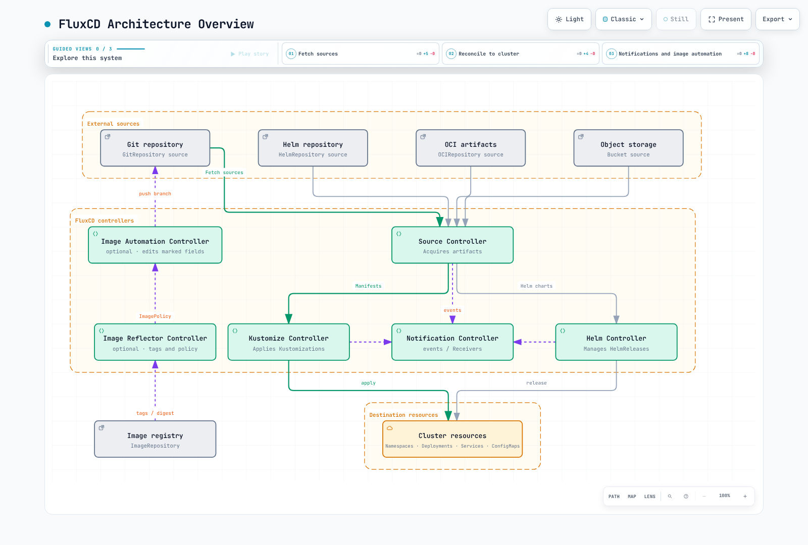

# FluxCD

> **Supported Versions**: Flux 2.9.5
> **Last Updated**: September 11, 2026

FluxCD is a set of continuous and progressive delivery solutions for Kubernetes that are open and extensible. FluxCD graduated from the CNCF in November 2022, making it one of the most mature GitOps tools in the cloud-native ecosystem.

This chapter targets **self-managed Flux 2.9.5**. The CLI precheck requires at least Kubernetes 1.33; also check the distribution’s actual support window. Review the 2.7+ API migration procedure before upgrading from 2.6 or earlier. OCIRepository/Bucket/image APIs below use v1; Notification Provider/Alert remain v1beta3.

Examples use platform-owned, trusted `flux-system` resources. Repeated Kustomizations are alternatives/fragments to compose, not a sequence of replacements. Prepare actual repository URLs, paths, namespaces, and Secrets. Tenant use requires dedicated namespaces, RBAC/impersonation through `spec.serviceAccountName`, and cross-namespace reference restrictions.

## Introduction

FluxCD implements the GitOps principles by using Git repositories as the source of truth for defining the desired state of your Kubernetes clusters. It periodically reconciles source changes and drift. Authorization, availability, and health-check failures can delay or prevent convergence.

### Key Features

- **GitOps Native**: Built from the ground up for GitOps workflows
- **Multi-tenancy**: Supports multiple teams with isolated configurations
- **Multi-cluster**: Manage multiple clusters from a single Git repository
- **Extensible**: Modular architecture with specialized controllers
- **Kubernetes Native**: Uses Custom Resource Definitions (CRDs) for configuration

## Architecture Overview

FluxCD consists of a set of specialized controllers that work together to implement GitOps workflows:



[🔍 View interactive diagram](https://www.atomai.click/kubernetes-docs/archmaps/en-gitops-02-fluxcd-0.html)

## Core Components

Default installation includes source/kustomize/helm/notification controllers. Image automation additionally requires **image-reflector-controller and image-automation-controller**. The optional source-watcher provides source composition through APIs such as ArtifactGenerator.

| Secret | Required content |
|---|---|
| git-credentials | HTTPS Git username/password or matching authentication; image updates also need repository write access |
| registry-credentials | A kubernetes.io/dockerconfigjson Secret for the private ImageRepository |
| slack-bot-token | Slack Bot OAuth token under the `token` key |
| github-webhook-token | The `token` shared with the GitHub webhook |

Prepare referenced ConfigMaps/Secrets in the same namespace as the Flux resource. Supply actual values through protected secret management, not plaintext Git files.

### Source Controller

The Source Controller is responsible for acquiring artifacts from external sources. It supports multiple source types:

#### GitRepository

Tracks a Git repository and makes it available for other controllers:

```yaml
apiVersion: source.toolkit.fluxcd.io/v1
kind: GitRepository
metadata:
  name: my-app
  namespace: flux-system
spec:
  interval: 1m
  url: https://github.com/my-org/my-app
  ref:
    branch: main
  secretRef:
    name: git-credentials
```

#### HelmRepository

Tracks a Helm chart repository:

```yaml
apiVersion: source.toolkit.fluxcd.io/v1
kind: HelmRepository
metadata:
  name: podinfo
  namespace: flux-system
spec:
  interval: 1h
  url: https://stefanprodan.github.io/podinfo
```

#### OCIRepository

This describes an **OCI artifact containing manifests/Helm content for Flux**, not a workload container image. Publish a compatible artifact first and pin its tag/digest.

Tracks artifacts stored in OCI-compliant registries (including container registries):

```yaml
apiVersion: source.toolkit.fluxcd.io/v1
kind: OCIRepository
metadata:
  name: my-artifacts
  namespace: flux-system
spec:
  interval: 5m
  url: oci://ghcr.io/my-org/my-artifacts
  ref:
    tag: v1.0.0
```

#### Bucket

The AWS example assumes a configured default credential chain such as source-controller IRSA/Pod Identity. Prepare the EKS authentication and bucket permissions described below.

Tracks artifacts stored in S3-compatible storage:

```yaml
apiVersion: source.toolkit.fluxcd.io/v1
kind: Bucket
metadata:
  name: my-bucket
  namespace: flux-system
spec:
  interval: 5m
  provider: aws
  bucketName: my-flux-bucket
  endpoint: s3.us-east-1.amazonaws.com
  region: us-east-1
```

### Kustomize Controller

The Kustomize Controller applies Kustomize overlays and plain Kubernetes manifests from sources.

#### Kustomization CRD

`targetNamespace` does not create a namespace. Pre-create it or include its Namespace manifest in the Kustomization. `prune: true` can delete previously managed resources removed from source; review source boundaries and deletion policy.

```yaml
apiVersion: kustomize.toolkit.fluxcd.io/v1
kind: Kustomization
metadata:
  name: my-app
  namespace: flux-system
spec:
  interval: 10m
  targetNamespace: production
  sourceRef:
    kind: GitRepository
    name: my-app
  path: ./deploy/production
  prune: true
  healthChecks:
  - apiVersion: apps/v1
    kind: Deployment
    name: my-app
    namespace: production
  timeout: 2m
```

#### Variable Substitution

`substituteFrom` entries override earlier entries; inline `substitute` takes precedence. Secret substitutions enter rendered manifests, so control their output/access. The bundled kustomize-controller 1.9.5 enables `StrictPostBuildSubstitutions` by default, failing on missing variables without defaults. Check whether an existing deployment explicitly disables that gate. Numeric fields must still render as Kubernetes numeric values.

FluxCD supports variable substitution using `postBuild`:

```yaml
apiVersion: kustomize.toolkit.fluxcd.io/v1
kind: Kustomization
metadata:
  name: my-app
  namespace: flux-system
spec:
  interval: 10m
  sourceRef:
    kind: GitRepository
    name: my-app
  path: ./deploy
  postBuild:
    substitute:
      ENVIRONMENT: production
      REPLICAS: '3'
    substituteFrom:
    - kind: ConfigMap
      name: cluster-config
    - kind: Secret
      name: cluster-secrets
  prune: true
  targetNamespace: production
```

#### Health Checks

Define custom health checks for deployed resources:

```yaml
spec:
  healthChecks:
  - apiVersion: apps/v1
    kind: Deployment
    name: frontend
    namespace: production
  - apiVersion: apps/v1
    kind: StatefulSet
    name: database
    namespace: production
  timeout: 5m
```

### Helm Controller

The Helm Controller manages Helm chart releases declaratively.

#### HelmRelease CRD

```yaml
apiVersion: helm.toolkit.fluxcd.io/v2
kind: HelmRelease
metadata:
  name: podinfo
  namespace: flux-system
spec:
  interval: 5m
  chart:
    spec:
      chart: podinfo
      version: 6.15.0
      sourceRef:
        kind: HelmRepository
        name: podinfo
        namespace: flux-system
  targetNamespace: web
  install:
    createNamespace: true
    remediation:
      retries: 3
  upgrade:
    remediation:
      retries: 3
  values:
    replicaCount: 2
    service:
      type: ClusterIP
  releaseName: podinfo
```

#### Values Overrides

Later valuesFrom entries override earlier ones, followed by inline values. A targetPath reference can override even inline values, so handle that case explicitly.

Override Helm values from multiple sources:

```yaml
spec:
  valuesFrom:
  - kind: ConfigMap
    name: podinfo-values
    valuesKey: values.yaml
  - kind: Secret
    name: podinfo-secrets
    valuesKey: credentials.yaml
  values:
    replicaCount: 3
```

#### Drift Detection

Ignore replicas only when another controller such as HPA owns them. Unnecessary ignore rules can hide manual drift.

Enable drift detection to ensure deployed resources match the desired state:

```yaml
spec:
  driftDetection:
    mode: enabled
    ignore:
    - paths:
      - /spec/replicas
      target:
        kind: Deployment
```

### Notification Controller

The Notification Controller handles inbound and outbound events.

#### Providers

The example uses the Slack Bot API. Configure chat:write, invite the bot to the destination channel, and replace channel with its actual ID. An Incoming Webhook URL is not a Bot token.

Configure notification providers for alerts:

```yaml
apiVersion: notification.toolkit.fluxcd.io/v1beta3
kind: Provider
metadata:
  name: slack
  namespace: flux-system
spec:
  type: slack
  channel: C0123456789
  secretRef:
    name: slack-bot-token
  address: https://slack.com/api/chat.postMessage
```

Supported providers include:
- Slack
- Microsoft Teams Workflows (`msteams`)
- Discord
- PagerDuty
- Opsgenie (existing customers; announced shutdown 2027-04-05)
- GitHub
- GitLab
- Grafana
- Generic webhooks

#### Alerts

Define alerts for FluxCD events:

```yaml
apiVersion: notification.toolkit.fluxcd.io/v1beta3
kind: Alert
metadata:
  name: on-call
  namespace: flux-system
spec:
  providerRef:
    name: slack
  eventSeverity: error
  eventSources:
  - kind: GitRepository
    name: '*'
  - kind: Kustomization
    name: '*'
  - kind: HelmRelease
    name: '*'
  eventMetadata:
    summary: Cluster alerts
```

#### Receivers (Webhooks)

Creating a Receiver does not expose an internet endpoint. Combine a reviewed TLS ingress for the webhook-receiver Service with status.webhookPath, configure the same token in GitHub, and retain signature verification for type: github.

Configure webhooks for external events:

```yaml
apiVersion: notification.toolkit.fluxcd.io/v1
kind: Receiver
metadata:
  name: github-receiver
  namespace: flux-system
spec:
  type: github
  events:
  - ping
  - push
  secretRef:
    name: github-webhook-token
  resources:
  - kind: GitRepository
    name: my-app
```

### Image Automation

FluxCD can automatically update container image tags in Git repositories.

#### ImageRepository

The image-reflector-controller scans tags and evaluates ImagePolicy. It does not build images, scan vulnerabilities, or perform workload image pulls.

Scan container registries for new tags:

```yaml
apiVersion: image.toolkit.fluxcd.io/v1
kind: ImageRepository
metadata:
  name: my-app
  namespace: flux-system
spec:
  image: ghcr.io/my-org/my-app
  interval: 1m
  secretRef:
    name: registry-credentials
```

#### ImagePolicy

Define policies for selecting image tags:

```yaml
apiVersion: image.toolkit.fluxcd.io/v1
kind: ImagePolicy
metadata:
  name: my-app
  namespace: flux-system
  labels:
    app: my-app
spec:
  imageRepositoryRef:
    name: my-app
  policy:
    semver:
      range: '>=1.0.0 <2.0.0'
  digestReflectionPolicy: IfNotPresent
```

#### ImageUpdateAutomation

YAML fields need policy markers to be updated. IfNotPresent reflects a selected tag’s digest; it is not signature/vulnerability validation. This automation pushes to a dedicated flux/image-updates branch. PR creation/approval into main is a separate CI/operator workflow, not automatically supplied by Flux. Reserve the branch for automation and grant its Git credential write access.

```yaml
# Deployment Pod-template fragment; the policy marker is required.
spec:
  template:
    spec:
      containers:
        - name: app
          image: ghcr.io/my-org/my-app:1.0.0 # {"$imagepolicy": "flux-system:my-app"}
```

Automate Git commits when new images are detected:

```yaml
apiVersion: image.toolkit.fluxcd.io/v1
kind: ImageUpdateAutomation
metadata:
  name: my-app
  namespace: flux-system
spec:
  interval: 30m
  sourceRef:
    kind: GitRepository
    name: my-app
  git:
    checkout:
      ref:
        branch: main
    commit:
      author:
        email: flux@my-org.com
        name: Flux
      messageTemplate: |
        Automated image update

        Automation: {{ .AutomationObject }}

        Files:
        {{ range $filename, $_ := .Changed.FileChanges -}}
        - {{ $filename }}
        {{ end -}}

        Objects:
        {{ range $resource, $changes := .Changed.Objects -}}
        - {{ $resource.Kind }} {{ $resource.Name }}
          {{- range $_, $change := $changes }}
          {{ $change.OldValue }} -> {{ $change.NewValue }}
          {{- end }}
        {{ end -}}
    push:
      branch: flux/image-updates
  update:
    path: ./deploy
    strategy: Setters
  policySelector:
    matchLabels:
      app: my-app
```

## Installation

### Using Flux CLI

Example installation of the verified Linux amd64/arm64 release. For other operating systems, follow the [official CLI installation guide](https://fluxcd.io/flux/installation/#install-the-flux-cli) and verify the installed version.

```bash
set -euo pipefail
FLUX_VERSION=2.9.5
case "$(uname -m)" in
  x86_64)
    flux_arch=amd64
    flux_sha=b853df82adfd7736f580692f9f734473d571606307139f8fd20c2a80dd1ff473 ;;
  aarch64|arm64)
    flux_arch=arm64
    flux_sha=f3e159af616ec0b9bd0a405c2185cf09d06b74652c1de3c7f377e8166826651a ;;
  *) echo "Use the official installer for this architecture" >&2; exit 1 ;;
esac
flux_tmp="$(mktemp -d)"
trap 'rm -rf "$flux_tmp"' EXIT
curl -fsSL -o "$flux_tmp/flux.tar.gz" \
  "https://github.com/fluxcd/flux2/releases/download/v${FLUX_VERSION}/flux_${FLUX_VERSION}_linux_${flux_arch}.tar.gz"
printf '%s  %s\n' "$flux_sha" "$flux_tmp/flux.tar.gz" | sha256sum -c -
tar -xzf "$flux_tmp/flux.tar.gz" -C "$flux_tmp" flux
mkdir -p "$HOME/.local/bin"
install -m 0755 "$flux_tmp/flux" "$HOME/.local/bin/flux"
export PATH="$HOME/.local/bin:$PATH"
flux --version
```

### Bootstrap

Bootstrap writes configuration to Git and installs controllers in the cluster. Verify the kubecontext and repository authorization, and choose either GitHub or GitLab. my-org denotes an organization/group; use --personal only for a user account. Supply tokens securely through environment variables. These examples include image automation controllers. If automating the bootstrap repository itself, separately enable write access for its deploy key.

```bash
kubectl config current-context
flux check --pre

# Alternative A: GitHub organization; provide authorized GITHUB_TOKEN securely.
flux bootstrap github \
  --owner=my-org \
  --repository=fleet-infra \
  --branch=main \
  --path=clusters/production \
  --version=v2.9.5 \
  --components-extra=image-reflector-controller,image-automation-controller

# Alternative B: GitLab group; provide authorized GITLAB_TOKEN securely.
flux bootstrap gitlab \
  --owner=my-org \
  --repository=fleet-infra \
  --branch=main \
  --path=clusters/production \
  --version=v2.9.5 \
  --components-extra=image-reflector-controller,image-automation-controller
```

### Verify Installation

```bash
# Check Flux components
flux check --components-extra=image-reflector-controller,image-automation-controller

# Get all Flux resources
flux get all

# Watch for changes
flux get kustomizations --watch
```

## Multi-Cluster with Flux

FluxCD supports managing multiple clusters from a single repository.

### Fleet Repository Structure

```
fleet-infra/
├── clusters/
│   ├── production/
│   │   ├── flux-system/
│   │   │   ├── gotk-components.yaml
│   │   │   ├── gotk-sync.yaml
│   │   │   └── kustomization.yaml
│   │   └── apps.yaml
│   ├── staging/
│   │   ├── flux-system/
│   │   │   ├── gotk-components.yaml
│   │   │   ├── gotk-sync.yaml
│   │   │   └── kustomization.yaml
│   │   └── apps.yaml
│   └── development/
│       ├── flux-system/
│       │   └── gotk-sync.yaml
│       └── apps.yaml
├── infrastructure/
│   ├── base/
│   │   ├── cert-manager/
│   │   ├── envoy-gateway/
│   │   └── monitoring/
│   └── overlays/
│       ├── production/
│       └── staging/
└── apps/
    ├── base/
    │   ├── frontend/
    │   └── backend/
    └── overlays/
        ├── production/
        └── staging/
```

### Kustomization Dependencies in One Control Plane

dependsOn waits for the Ready condition of Kustomization objects observed by this Flux control plane. These are two objects in one cluster, not a cross-cluster barrier. wait: true makes infrastructure readiness include workload health. The default bootstrap GitRepository is named flux-system, used by sourceRef here. Bootstrap each independent cluster with its own context/path, or explicitly configure remote kubeConfig and authorization. In 2.9.5, Secret kubeconfigs reject local file references in certificate-authority/tokenFile/client-certificate/client-key. Supply the required credentials/certificates as protected inline data or use a supported workload identity configuration.

```yaml
apiVersion: kustomize.toolkit.fluxcd.io/v1
kind: Kustomization
metadata:
  name: infrastructure
  namespace: flux-system
spec:
  interval: 1h
  sourceRef:
    kind: GitRepository
    name: flux-system
  path: ./infrastructure/overlays/production
  prune: true
  wait: true
  timeout: 5m
---
apiVersion: kustomize.toolkit.fluxcd.io/v1
kind: Kustomization
metadata:
  name: apps
  namespace: flux-system
spec:
  dependsOn:
  - name: infrastructure
  interval: 10m
  sourceRef:
    kind: GitRepository
    name: flux-system
  path: ./apps/overlays/production
  prune: true
```

## FluxCD on Amazon EKS

### AWS Authentication per Controller

This example uses **controller-level IRSA**. First configure the EKS OIDC provider, role trust for the exact ServiceAccount subject and sts.amazonaws.com audience, and resource permissions. A role-ARN annotation does not create trust or policies. EKS Pod Identity instead requires its association/agent setup; it is not configured by the IRSA annotation.

| Controller | AWS access purpose |
|---|---|
| source-controller | OCI/Helm artifacts, S3 Buckets, CodeCommit Git sources |
| image-reflector-controller | ECR workload image tag/digest scanning |
| image-automation-controller | Git clone/push permissions when directly using CodeCommit |
| kustomize-controller | SOPS KMS decryption or remote EKS reconciliation |
| helm-controller | Helm release reconciliation on remote EKS |

Giving source-controller a role does not authenticate all other controllers. For multi-tenancy, separately review supported object-level workload identity and its feature gate, ServiceAccount, and RBAC configuration.

Merge this patch into flux-system/kustomization.yaml under the bootstrap path and manage it in Git, retaining existing patches/resources. A ServiceAccount change alone does not reinject IRSA into existing Pods; roll out the affected controller after reconciliation.

```yaml
apiVersion: kustomize.config.k8s.io/v1beta1
kind: Kustomization
resources:
- gotk-components.yaml
- gotk-sync.yaml
patches:
- target:
    kind: ServiceAccount
    name: source-controller
  patch: |
    apiVersion: v1
    kind: ServiceAccount
    metadata:
      name: source-controller
      annotations:
        eks.amazonaws.com/role-arn: arn:aws:iam::123456789012:role/flux-source-controller
```

```bash
kubectl rollout restart deployment/source-controller -n flux-system
kubectl rollout status deployment/source-controller -n flux-system --timeout=180s
```

### GitOps Artifacts in ECR

These source-controller permissions read a dedicated gitops-artifacts repository. GetAuthorizationToken does not support repository-ARN scoping, so its resource is * with a requested-region condition. Content-read actions are scoped to the repository ARN. Replace the account/region/repository values.

```json
{
  "Version": "2012-10-17",
  "Statement": [
    {
      "Effect": "Allow",
      "Action": "ecr:GetAuthorizationToken",
      "Resource": "*",
      "Condition": {
        "StringEquals": {
          "aws:RequestedRegion": "us-east-1"
        }
      }
    },
    {
      "Effect": "Allow",
      "Action": [
        "ecr:BatchCheckLayerAvailability",
        "ecr:GetDownloadUrlForLayer",
        "ecr:BatchGetImage"
      ],
      "Resource": "arn:aws:ecr:us-east-1:123456789012:repository/gitops-artifacts"
    }
  ]
}
```

```yaml
apiVersion: source.toolkit.fluxcd.io/v1
kind: OCIRepository
metadata:
  name: gitops-artifacts
  namespace: flux-system
spec:
  interval: 5m
  url: oci://123456789012.dkr.ecr.us-east-1.amazonaws.com/gitops-artifacts
  ref:
    tag: v1.0.0
  provider: aws
```

OCIRepository reads manifest/Helm artifacts for Flux. It does not deploy workload container images or grant EKS node/Fargate image-pull permissions. ECR ImageRepository scanning needs separate image-reflector-controller authentication and registry-read permissions.

### S3 Bucket Source

Use a dedicated artifact bucket and add the following permissions to the controller role. Customer-managed KMS encryption additionally needs the key policy and kms:Decrypt; cross-account access also requires the bucket policy.

```yaml
apiVersion: source.toolkit.fluxcd.io/v1
kind: Bucket
metadata:
  name: artifacts
  namespace: flux-system
spec:
  interval: 5m
  provider: aws
  bucketName: my-flux-artifacts
  endpoint: s3.us-east-1.amazonaws.com
  region: us-east-1
```

```json
{
  "Version": "2012-10-17",
  "Statement": [
    {
      "Effect": "Allow",
      "Action": "s3:ListBucket",
      "Resource": "arn:aws:s3:::my-flux-artifacts"
    },
    {
      "Effect": "Allow",
      "Action": "s3:GetObject",
      "Resource": "arn:aws:s3:::my-flux-artifacts/*"
    }
  ]
}
```

### CodeCommit HTTPS Source

This is a **source integration for an existing Flux installation**, not a bootstrap or IAM-credential creation procedure. source-controller 1.9.5 supports provider: aws with a CodeCommit HTTPS endpoint and IRSA/Pod Identity. Add the read permission to its role and reference this GitRepository from the desired Kustomization.

```yaml
apiVersion: source.toolkit.fluxcd.io/v1
kind: GitRepository
metadata:
  name: codecommit-manifests
  namespace: flux-system
spec:
  interval: 1m
  provider: aws
  url: https://git-codecommit.us-east-1.amazonaws.com/v1/repos/fleet-infra
  ref:
    branch: main
```

```json
{
  "Version": "2012-10-17",
  "Statement": [
    {
      "Effect": "Allow",
      "Action": "codecommit:GitPull",
      "Resource": "arn:aws:codecommit:us-east-1:123456789012:fleet-infra"
    }
  ]
}
```

If ImageUpdateAutomation pushes to CodeCommit, its controller/object identity also needs GitPull/GitPush permissions and a dedicated branch/PR policy. SSH requires an IAM-registered SSH key ID as the username and the matching private key; an ssh:// URL or CLI key-generation option does not register an IAM key.

## Best Practices

### Repository Structure

- Use a monorepo for small teams
- Use separate repos for infrastructure and applications in larger organizations
- Implement environment-specific overlays with Kustomize

### Security

- Manage Secret/key lifecycles with SOPS/Sealed Secrets or External Secrets Operator
- Configure tenant namespaces, spec.serviceAccountName-based RBAC/impersonation, and cross-namespace reference restrictions
- Enable webhook validation for receivers

### Monitoring

- Configure alerts for reconciliation failures
- Export metrics to Prometheus
- Set up dashboards for Flux components

### Performance

- Tune reconciliation intervals based on change frequency
- Use caching for Helm repositories
- Implement health checks with appropriate timeouts

## References

- [Flux 2.9.5 release and migration notice](https://github.com/fluxcd/flux2/releases/tag/v2.9.5)
- [Flux installation](https://fluxcd.io/flux/installation/)
- [AWS integration](https://fluxcd.io/flux/integrations/aws/)
- [GitRepository v1](https://github.com/fluxcd/source-controller/blob/v1.9.5/docs/spec/v1/gitrepositories.md)
- [ImageUpdateAutomation v1](https://github.com/fluxcd/image-automation-controller/blob/v1.2.5/docs/spec/v1/imageupdateautomations.md)
- [Kustomization v1](https://github.com/fluxcd/kustomize-controller/blob/v1.9.5/docs/spec/v1/kustomizations.md)
- [Notification providers](https://github.com/fluxcd/notification-controller/blob/v1.9.4/docs/spec/v1beta3/providers.md)
- [Opsgenie lifecycle](https://www.atlassian.com/software/opsgenie)

## Quiz

To test what you've learned, try the [FluxCD quiz](../quizzes/gitops/02-fluxcd-quiz.md).
