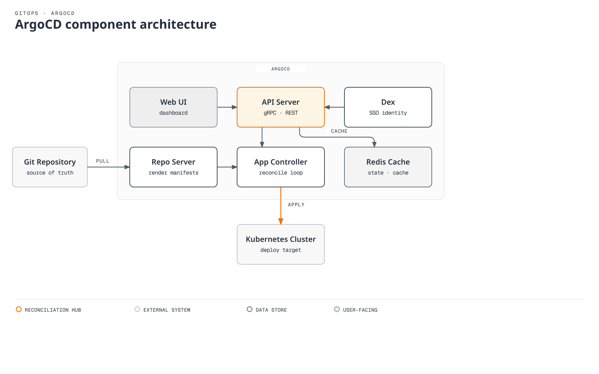

# GitOps Tools Comparison

> **Last Updated**: September 11, 2026

This guide provides a comprehensive comparison of GitOps tools, with a focus on ArgoCD and FluxCD, the two most popular choices in the Kubernetes ecosystem.

## Overview

GitOps is an operational framework that takes DevOps best practices used for application development and applies them to infrastructure automation. The two leading GitOps tools in the CNCF ecosystem are:

- **ArgoCD**: A declarative, GitOps continuous delivery tool for Kubernetes
- **FluxCD**: A set of continuous and progressive delivery solutions for Kubernetes

Both are CNCF graduated projects, indicating maturity and wide adoption.

## ArgoCD vs FluxCD: Head-to-Head Comparison

### Philosophy and Design

| Aspect | ArgoCD | FluxCD |
|--------|--------|--------|
| **Architecture** | Separate API/Repo Servers, Application Controller and supporting components | Modular toolkit of controllers |
| **Configuration** | Application-centric CRDs | Source-centric CRDs |
| **User Interface** | Rich Web UI included | CLI-first, no built-in UI |
| **Learning Focus** | Applications, AppProjects and UI workflows | Source, Kustomization and HelmRelease controller relationships |
| **Deployment Model** | Pull-based GitOps | Pull-based GitOps |

### Feature Comparison

| Feature | ArgoCD | FluxCD |
|---------|--------|--------|
| **Web UI** | Built-in, feature-rich | Not in core; evaluate maintained ecosystem UIs |
| **CLI** | `argocd` CLI | `flux` CLI |
| **Multi-tenancy** | Projects with RBAC | Namespace isolation |
| **Multi-cluster** | Native support | Native support |
| **Helm Support** | helm template; Argo CD owns lifecycle | Helm Controller manages Helm releases |
| **Kustomize Support** | Full support | Full support via Kustomize Controller |
| **OCI Support** | General OCI and OCI Helm sources; check version/media-type requirements | OCIRepository; check layer/verification support |
| **Notifications** | Built-in notification system | Notification Controller |
| **RBAC** | Comprehensive RBAC | Kubernetes native RBAC |
| **SSO Integration** | Direct OIDC or supported Dex connectors | Kubernetes authentication |
| **Health Checks** | Built-in/custom resource health | Controller-specific readiness, health checks and custom conditions |
| **Progressive Delivery** | Via Argo Rollouts | Via Flagger |
| **Image Automation** | Via Argo Image Updater | Optional Image Reflector/Automation |
| **Diff Preview** | Visual diff in UI | CLI diff |
| **Sync Waves** | Native support | Via dependencies |
| **Hooks** | Argo sync hooks | Helm hooks; separately design Kustomization dependencies/Jobs |

### Architecture Comparison

#### ArgoCD Architecture



[🔍 View interactive diagram](https://www.atomai.click/kubernetes-docs/archmaps/en-gitops-03-gitops-comparison-0.html)

#### FluxCD Architecture


[🔍 View interactive diagram](https://www.atomai.click/kubernetes-docs/archmaps/en-gitops-03-gitops-comparison-1.html)

### Community and Ecosystem

| Metric | ArgoCD | FluxCD |
|--------|--------|--------|
| **CNCF Status** | Graduated (Dec 2022) | Graduated (Nov 2022) |
| **First Release** | 2018 | 2016 (v1), 2020 (v2) |
| **Maintenance** | Check current governance and security support | Check current governance and security support |
| **Ecosystem Tools** | Argo Workflows, Rollouts, Events | Flagger, Weave GitOps |

## When to Choose ArgoCD

ArgoCD is ideal when you need:

### Use Cases

1. **Visual Management**: Teams that prefer a graphical interface for managing deployments
2. **Centralized Control**: Organizations wanting a single pane of glass for multiple clusters
3. **Comprehensive RBAC**: Complex access control requirements across teams
4. **SSO Integration**: Enterprise environments requiring OIDC/SAML authentication
5. **Sync Waves and Hooks**: Complex deployment orchestration with ordering requirements

### Advantages

- **Rich Web UI**: Intuitive visual interface for deployment management
- **Application-centric**: Natural mapping to how developers think about deployments
- **Mature Ecosystem**: Tight integration with Argo Workflows, Rollouts, and Events
- **Enterprise Features**: SSO, RBAC, audit logging out of the box
- **Easy Debugging**: Visual diff and sync status in UI

### Example Scenario

```
Scenario: Enterprise with 50+ microservices
- Multiple teams need self-service deployments
- Security team requires audit logs and RBAC
- Developers want visual feedback on sync status
- Need SSO integration with corporate identity provider

Recommendation: ArgoCD
- Projects per team with role-based access
- Application Sets for template-driven deployments
- Web UI for developer self-service
- Dex integration for SSO
```

## When to Choose FluxCD

FluxCD is ideal when you need:

### Use Cases

1. **Modular Architecture**: Pick only the controllers you need
2. **CLI-First Workflows**: GitOps-native workflows without UI dependency
3. **Image Automation**: Automatic container image updates in Git
4. **OCI Artifacts**: Store and deploy from OCI registries
5. **Component Choice**: Select controllers and measure their real workload

### Advantages

- **Modular Design**: Use only what you need
- **Native Image Automation**: Optional controllers for container image updates
- **OCI Support**: First-class support for OCI artifacts
- **Kubernetes Native**: Uses standard Kubernetes RBAC
- **Resource Control**: Measure CPU/memory against installed components, sources, objects and reconcile intervals

### Example Scenario

```
Scenario: Platform team building internal developer platform
- Need automated image updates when CI builds new versions
- Want to store deployment artifacts in container registry
- Prefer CLI-driven GitOps workflows
- Multiple clusters with different configurations

Recommendation: FluxCD
- Image automation for continuous deployment
- OCI repositories for artifact storage
- Kustomize overlays for environment differences
- Multi-cluster management with fleet repo
```

## Can They Work Together?

Separate resource ownership so two reconcilers do not mutate/prune the same objects. Managing a CR together with its operator differs from two tools competing over the same Deployment or Helm release.

Yes, ArgoCD and FluxCD can be used together in complementary patterns:

### Pattern 1: FluxCD for Infrastructure, ArgoCD for Applications

```
Git Repository
├── infrastructure/     # Managed by FluxCD
│   ├── cert-manager/
│   ├── ingress-controller/
│   └── monitoring/
└── applications/       # Managed by ArgoCD
    ├── app-a/
    ├── app-b/
    └── app-c/
```

- FluxCD manages cluster infrastructure (operators, controllers)
- ArgoCD manages application deployments with developer UI

### Pattern 2: FluxCD Image Automation with ArgoCD Deployment

```
1. CI builds new image → pushes to registry
2. FluxCD Image Automation detects new tag
3. FluxCD commits updated manifest to Git
4. ArgoCD syncs the change to cluster
```

### Pattern 3: Different Clusters, Different Tools

- Production clusters: ArgoCD (for UI and audit requirements)
- Development clusters: FluxCD (for rapid iteration)

## Migration Considerations

These are design mappings, not automatic CRD renames. Compare resource inventory, Helm releases, hooks, prune/finalizers, secrets and permissions. Test stopping the old reconciler and transferring ownership without deletion in staging. Argo CD templating does not automatically adopt Flux Helm release history.

### From FluxCD to ArgoCD

1. Export FluxCD Kustomizations as ArgoCD Applications
2. Map FluxCD sources to ArgoCD repositories
3. Convert HelmReleases to ArgoCD Helm Applications
4. Configure RBAC and SSO in ArgoCD

### From ArgoCD to FluxCD

1. Convert ArgoCD Applications to Kustomizations/HelmReleases
2. Set up Source Controller with Git/Helm repositories
3. Configure Notification Controller for alerts
4. Implement Image Automation if needed

## Other GitOps Tools

While ArgoCD and FluxCD dominate the GitOps landscape, other tools exist:

### Jenkins X

- Focuses on CI/CD pipeline automation
- Built-in preview environments
- Tekton-based pipelines
- Best for: Teams wanting integrated CI/CD with GitOps

### Rancher Fleet

- Designed for managing thousands of clusters
- GitOps at scale
- Integrated with Rancher
- Best for: Large-scale edge deployments

### Weave GitOps

- Flux-based OSS UI project; validate commercial support separately
- Adds UI and enterprise features to Flux
- Evaluate: Current releases, Flux compatibility and support owner

## Decision Matrix

| Requirement | Best Choice |
|-------------|-------------|
| Need a Web UI | ArgoCD |
| CLI-first workflow | FluxCD |
| Image automation | Optional Flux controllers or Argo CD Image Updater |
| Complex RBAC | ArgoCD |
| SSO integration | ArgoCD |
| Resource limits | Benchmark the same real workload |
| OCI artifacts | Both; compare format, verification and authentication needs |
| Sync waves/hooks | ArgoCD |
| Visual diff | ArgoCD |
| Modular deployment | FluxCD |
| Enterprise audit | ArgoCD |
| Multi-cluster at scale | Both |

## Conclusion

Both ArgoCD and FluxCD are excellent choices for implementing GitOps. The decision often comes down to:

- **Choose ArgoCD** if you value a rich UI, enterprise features, and application-centric management
- **Choose FluxCD** if you prefer modularity, CLI workflows, and built-in image automation

Many organizations successfully use both tools for different purposes, leveraging each tool's strengths where they matter most.

## Quiz

To test what you've learned, try the [GitOps Tools Comparison quiz](../quizzes/gitops/03-gitops-comparison-quiz.md).

## References

- [Argo CD OCI](https://argo-cd.readthedocs.io/en/stable/user-guide/oci/)
- [Argo CD Helm lifecycle](https://argo-cd.readthedocs.io/en/stable/user-guide/helm/)
- [Flux HelmRelease lifecycle](https://fluxcd.io/flux/components/helm/helmreleases/)
- [Flux multi-tenancy](https://fluxcd.io/flux/installation/configuration/multitenancy/)
- [Flux ecosystem](https://fluxcd.io/ecosystem/)
