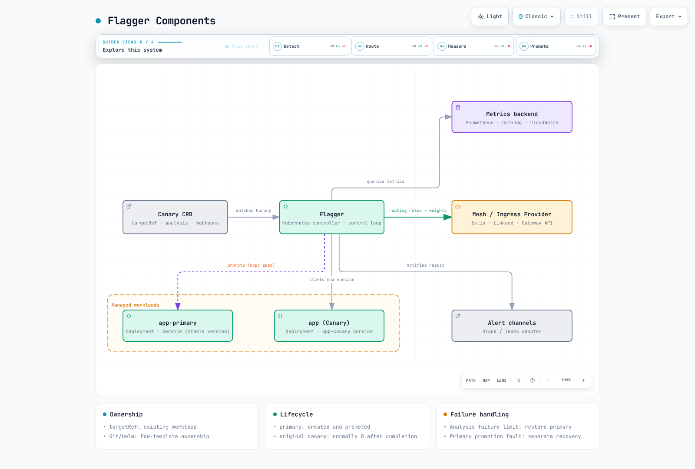
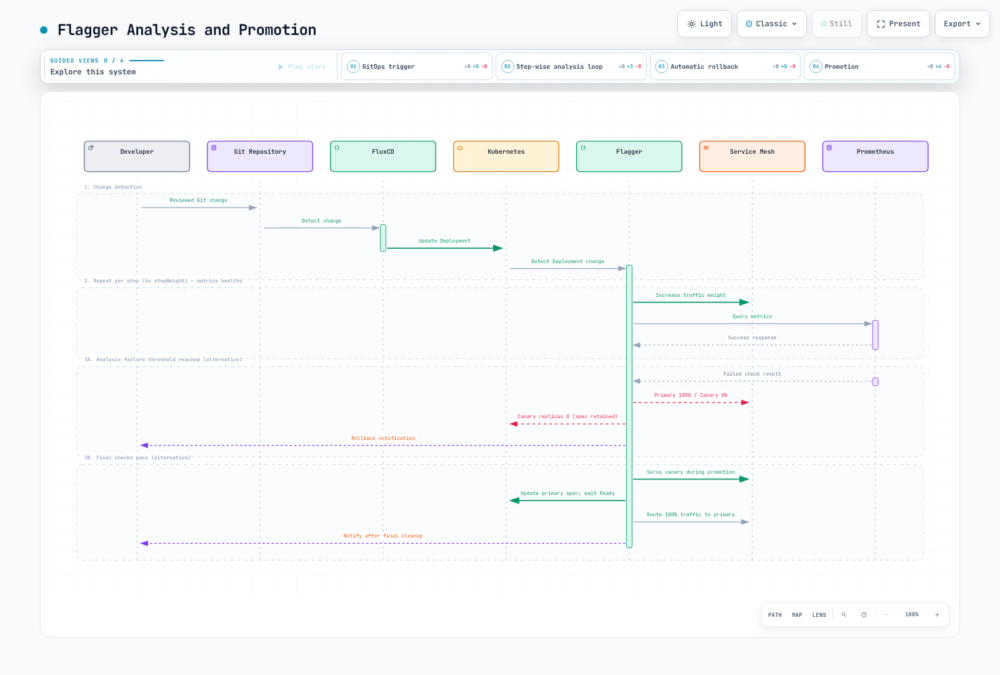
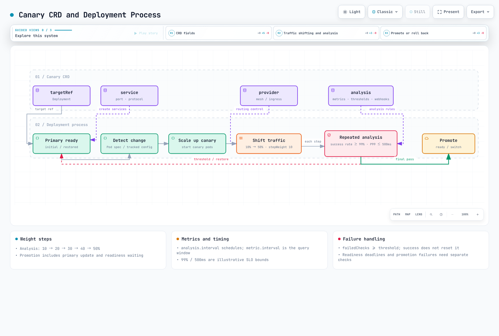
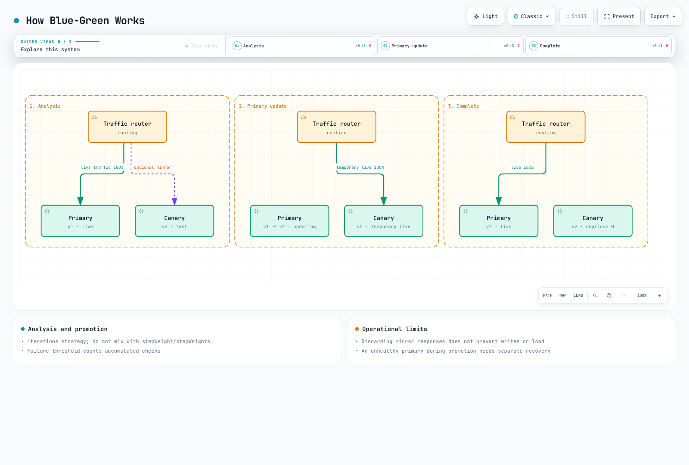
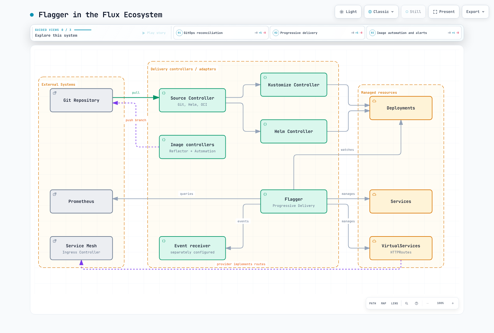
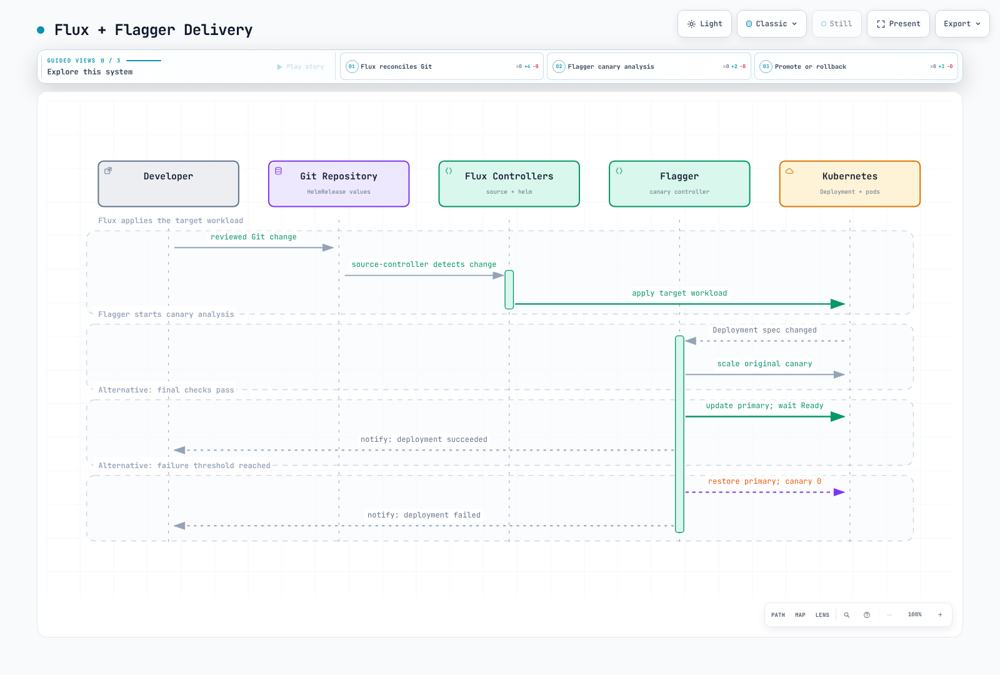
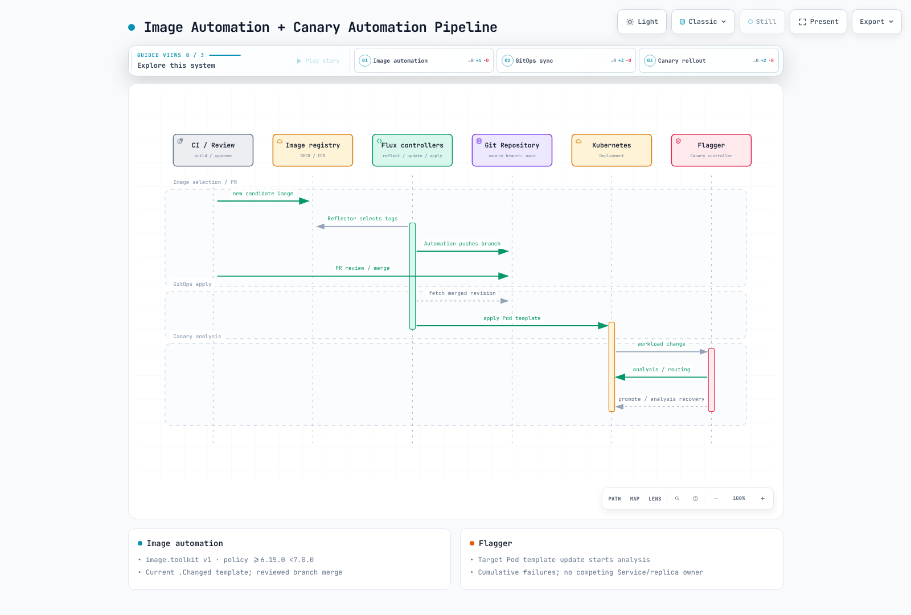
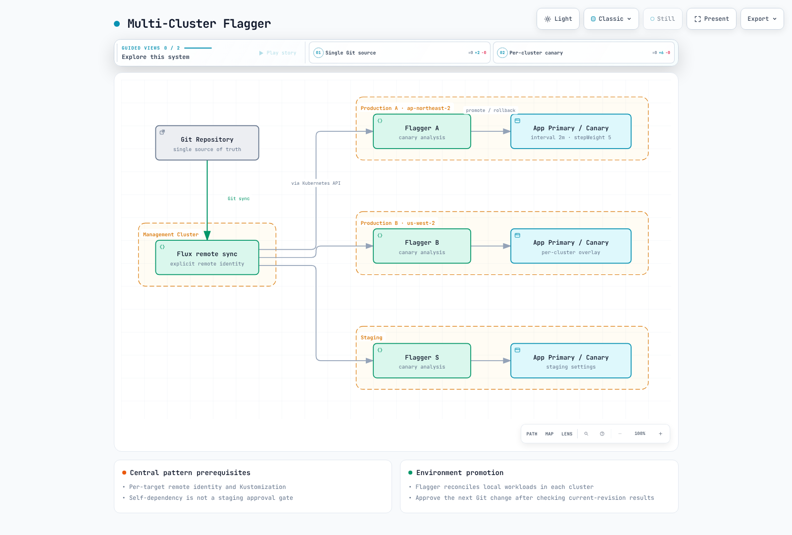

# Flagger Progressive Delivery

> **Review baseline**: Flagger/Chart 1.45.0, Loadtester 0.39.0, Flux 2.9.5, Podinfo 6.15.0
> **Last updated**: September 11, 2026

Flagger manages progressive delivery of Kubernetes workloads through the Canary CRD. It controls traffic and revisions, not transactional rollback of databases or external side effects. These lab examples require matching networking, instrumentation, authorization, and service SLOs.

Code includes full manifests and spec/Helm-values fragments. Merge them into the indicated owner; same-named strategy examples are alternatives, not a sequence of blocks to apply.

## Table of Contents

- [Overview and Learning Objectives](#overview-and-learning-objectives)
- [Flagger Architecture](#flagger-architecture)
- [EKS Installation and Configuration](#eks-installation-and-configuration)
- [Canary Deployment Strategy](#canary-deployment-strategy)
- [Blue-Green Deployment Strategy](#blue-green-deployment-strategy)
- [A/B Testing Strategy](#ab-testing-strategy)
- [Custom Metrics and Webhooks](#custom-metrics-and-webhooks)
- [GitOps Integration (Flux + Flagger)](#gitops-integration-flux--flagger)
- [Observability and Alerting](#observability-and-alerting)
- [Production Best Practices](#production-best-practices)

## Overview and Learning Objectives

Kubernetes Deployment RollingUpdate already replaces Pods gradually. Flagger adds explicit revision traffic control and metric/test-based promotion. This chapter covers resource ownership, three strategies, metrics/gates, GitOps, and observability.

| Strategy | Control | Check |
|---|---|---|
| Canary | Incremental weights | Additional replicas, minimum traffic, failure criteria |
| Blue-Green | Validate a separate revision, then switch | Both workloads plus surge, database compatibility |
| A/B | Supported header/cookie matching | Cohort assignment, statistics, separate authorization |

Blue-Green does not guarantee exactly twice the resources, instant rollback, or zero downtime. Flagger updates primary to the new revision; it does not retain a complete old-version standby afterward.

### Flagger and Argo Rollouts

| Aspect | Flagger | Argo Rollouts |
|---|---|---|
| Resources | Canary references an existing workload | Rollout CRD, including Deployment workloadRef |
| GitOps | Flux and other GitOps tools | Argo CD and other GitOps tools |
| Analysis | MetricTemplate, thresholds, webhooks | AnalysisTemplate/AnalysisRun and Web/Job providers |
| Project family | CNCF Graduated Flux | CNCF Graduated Argo |

Ecosystem integration is not exclusive coupling. Do not let two progressive-delivery controllers manage the same workload.

## Flagger Architecture



[View interactive diagram](https://www.atomai.click/kubernetes-docs/archmaps/en-gitops-04-flagger-1.html)

In the Deployment example, podinfo is the original resource and the canary workload. The new stable workload is podinfo-primary. podinfo-canary is a Service name, not an additional Deployment or CloneSet.

| Resource | Ownership/purpose |
|---|---|
| podinfo Deployment | Git/Helm Pod template, Flagger canary control |
| podinfo-primary Deployment | Stable workload created/promoted by Flagger |
| podinfo / podinfo-primary / podinfo-canary Services | Entry/destination selection managed by Flagger |
| Primary autoscaler | Corresponding autoscaler when autoscalerRef is used |
| VirtualService/DestinationRule/HTTPRoute, etc. | Routing for the selected provider |



[View interactive diagram](https://www.atomai.click/kubernetes-docs/archmaps/en-gitops-04-flagger-2.html)

After initial primary setup, Pod-template or tracked ConfigMap/Secret changes prepare canary. Following pre-rollout checks, analysis, and routing, promotion serves traffic through the ready canary while primary adopts the new spec. After primary readiness, traffic returns to it and canary scales down.

**Analysis failure** normally restores a healthy primary. **Failure while updating primary** differs: during Promoting/Finalising, 1.45.0 can keep/return traffic to the healthy canary while reporting failure. Failed status alone does not prove the old primary is serving traffic.

### Providers and Lifecycle

| Provider | Check |
|---|---|
| Istio | VirtualService/DestinationRule and sidecar HTTP metrics |
| gatewayapi:v1 | Gateway HTTPRoute features and MetricTemplate |
| Linkerd/Contour/Gloo/Traefik/Kuma, etc. | Installed-version capabilities and metric contract |
| kubernetes | Service-switching Blue-Green, not L7 weighted/A/B routing |
| App Mesh / ingress-nginx / OSM | Legacy lifecycle limits below |

AWS App Mesh support is scheduled to end **2026-09-30**, still future at this review date. Community ingress-nginx retired in March 2026, and the OSM repository is archived. Adapter availability is not a maintenance guarantee for new production use. Verify A/B, mirroring, and session-affinity support per implementation.

## EKS Installation and Configuration

The baseline requires supported EKS/Kubernetes, an installed Istio sidecar environment, and Prometheus scraping the required metrics. Replace its URL with the actual Service. Flagger does not install Istio or instrumentation. The chart’s bundled Prometheus image is old 2.41.0, so it is disabled.

Choose one release/management method. Installing independent Flagger instances in different namespaces can make both control the same Canary. Examples use flagger-system for controllers and flagger-demo for workloads. Adapt injection labels to the actual Istio revision.

```yaml
apiVersion: v1
kind: Namespace
metadata:
  name: flagger-system
  labels:
    istio-injection: enabled
---
apiVersion: v1
kind: Namespace
metadata:
  name: flagger-demo
  labels:
    istio-injection: enabled
---
apiVersion: v1
kind: ServiceAccount
metadata:
  name: flagger-loadtester
  namespace: flagger-system
automountServiceAccountToken: false
```

### Flagger Helm Installation

```yaml
fullnameOverride: flagger
meshProvider: istio
namespace: flagger-demo
noCrossNamespaceRefs: true
metricsServer: http://prometheus.monitoring.svc.cluster.local:9090
prometheus:
  install: false
leaderElection:
  enabled: true
  replicaCount: 2
resources:
  requests:
    cpu: 100m
    memory: 128Mi
  limits:
    cpu: '1'
    memory: 512Mi
podDisruptionBudget:
  enabled: true
  minAvailable: 1
```

```bash
helm repo add flagger https://flagger.app
helm repo update flagger
helm upgrade --install flagger flagger/flagger --version 1.45.0 \
  --namespace flagger-system -f flagger-values.yaml --wait --timeout 5m
```

namespace limits watching, not the chart’s ClusterRole permissions. Restrict tenant RBAC separately. leaderElection.replicaCount is a real chart value. Ordinary Helm upgrades do not update crds/ as initial installation does; apply reviewed CRDs separately or use Flux’s CRD policy.

```bash
kubectl apply --server-side -f https://raw.githubusercontent.com/fluxcd/flagger/v1.45.0/artifacts/flagger/crd.yaml
```

### Loadtester and Access Scope

```yaml
fullnameOverride: flagger-loadtester
replicaCount: 1
service:
  type: ClusterIP
  port: 80
serviceAccountName: flagger-loadtester
rbac:
  create: false
cmd:
  timeout: 2m
  namespaceRegexp: ^flagger-demo$
resources:
  requests:
    cpu: 100m
    memory: 64Mi
  limits:
    cpu: 500m
    memory: 256Mi
securityContext:
  enabled: true
  context:
    allowPrivilegeEscalation: false
    capabilities:
      drop:
      - ALL
    readOnlyRootFilesystem: true
    runAsUser: 100
    runAsGroup: 101
volumes:
- name: tmp
  emptyDir: {}
volumeMounts:
- name: tmp
  mountPath: /tmp
```

```bash
helm upgrade --install flagger-loadtester flagger/loadtester --version 0.39.0 \
  --namespace flagger-system -f loadtester-values.yaml --wait --timeout 5m
```

Loadtester executes commands from HTTP requests. namespaceRegexp filters a body string; it is not caller authentication. Keep it off the internet and restrict ingress to controller Pods through CNI policy. Control operator exec/port-forward with RBAC. Use one replica for memory-gate labs.

```yaml
apiVersion: networking.k8s.io/v1
kind: NetworkPolicy
metadata:
  name: flagger-loadtester-ingress
  namespace: flagger-system
spec:
  podSelector:
    matchLabels:
      app.kubernetes.io/name: loadtester
  policyTypes:
  - Ingress
  ingress:
  - from:
    - namespaceSelector:
        matchLabels:
          kubernetes.io/metadata.name: flagger-system
      podSelector:
        matchLabels:
          app.kubernetes.io/name: flagger
    ports:
    - protocol: TCP
      port: 8080
```

Allow required Istio mTLS and scrape paths. This loadtester does not perform API operations, so automatic ServiceAccount-token mounting is disabled. Adding Helm/kubectl tests requires explicit permissions and writable paths.

### Gateway API Alternative

This assumes an existing Istio GatewayClass and compatible Gateway API CRDs. Do not overwrite them with an old bundle. Other implementations need matching instrumentation/queries. Configure Service/LB exposure, DNS, and TLS for the environment.

```yaml
apiVersion: gateway.networking.k8s.io/v1
kind: Gateway
metadata:
  name: podinfo-gateway
  namespace: flagger-demo
spec:
  gatewayClassName: istio
  listeners:
  - name: http
    protocol: HTTP
    port: 80
    allowedRoutes:
      namespaces:
        from: Same
```

Use **gatewayapi:v1** and Canary service.gatewayRefs, not an invented Helm gatewayApi.gateway value. Prepare the three MetricTemplates below and use this Canary as an **alternative** to the Istio approach.

```yaml
apiVersion: flagger.app/v1beta1
kind: Canary
metadata:
  name: podinfo
  namespace: flagger-demo
spec:
  provider: gatewayapi:v1
  targetRef:
    apiVersion: apps/v1
    kind: Deployment
    name: podinfo
  autoscalerRef:
    apiVersion: autoscaling/v2
    kind: HorizontalPodAutoscaler
    name: podinfo
  progressDeadlineSeconds: 120
  service:
    port: 9898
    targetPort: 9898
    hosts:
    - app.example.com
    gatewayRefs:
    - name: podinfo-gateway
      namespace: flagger-demo
      sectionName: http
  analysis:
    interval: 1m
    threshold: 5
    maxWeight: 50
    stepWeight: 10
    metrics:
    - name: error-rate
      templateRef:
        name: istio-error-rate
      thresholdRange:
        min: 0
        max: 1
      interval: 1m
    - name: latency-p99-ms
      templateRef:
        name: istio-latency-ms
      thresholdRange:
        min: 0
        max: 500
      interval: 1m
    - name: request-count
      templateRef:
        name: istio-request-count
      thresholdRange:
        min: 100
      interval: 1m
    webhooks:
    - name: smoke-test
      type: pre-rollout
      url: http://flagger-loadtester.flagger-system.svc.cluster.local/
      timeout: 30s
      metadata:
        type: bash
        cmd: |-
          set -euo pipefail
          curl -fsS --max-time 10 http://podinfo-canary.flagger-demo.svc.cluster.local:9898/healthz >/dev/null
          curl -fsS --max-time 10 http://podinfo-canary.flagger-demo.svc.cluster.local:9898/readyz >/dev/null
    - name: load-test
      type: rollout
      url: http://flagger-loadtester.flagger-system.svc.cluster.local/
      timeout: 5s
      metadata:
        type: cmd
        cmd: hey -z 1m -q 10 -c 2 http://podinfo-canary.flagger-demo.svc.cluster.local:9898/
```

```bash
helm upgrade --install flagger flagger/flagger --version 1.45.0 \
  --namespace flagger-system -f flagger-values.yaml --set meshProvider=gatewayapi:v1
```

## Canary Deployment Strategy

These are the baseline Istio workload and HPA; Metrics Server is required. Omit Deployment replicas from Git so HPA/Flagger can own scaling, and do not create a competing Service. Choose these manifests or the later HelmRelease alternative.

```yaml
apiVersion: apps/v1
kind: Deployment
metadata:
  name: podinfo
  namespace: flagger-demo
spec:
  selector:
    matchLabels:
      app: podinfo
  template:
    metadata:
      labels:
        app: podinfo
    spec:
      containers:
      - name: podinfo
        image: ghcr.io/stefanprodan/podinfo:6.15.0
        ports:
        - name: http
          containerPort: 9898
        readinessProbe:
          httpGet:
            path: /readyz
            port: http
        livenessProbe:
          httpGet:
            path: /healthz
            port: http
        resources:
          requests:
            cpu: 100m
            memory: 64Mi
          limits:
            cpu: 500m
            memory: 256Mi
---
apiVersion: autoscaling/v2
kind: HorizontalPodAutoscaler
metadata:
  name: podinfo
  namespace: flagger-demo
spec:
  scaleTargetRef:
    apiVersion: apps/v1
    kind: Deployment
    name: podinfo
  minReplicas: 2
  maxReplicas: 4
  metrics:
  - type: Resource
    resource:
      name: cpu
      target:
        type: Utilization
        averageUtilization: 80
```



[View interactive diagram](https://www.atomai.click/kubernetes-docs/archmaps/en-gitops-04-flagger-3.html)

```yaml
apiVersion: flagger.app/v1beta1
kind: Canary
metadata:
  name: podinfo
  namespace: flagger-demo
spec:
  provider: istio
  targetRef:
    apiVersion: apps/v1
    kind: Deployment
    name: podinfo
  autoscalerRef:
    apiVersion: autoscaling/v2
    kind: HorizontalPodAutoscaler
    name: podinfo
  progressDeadlineSeconds: 120
  service:
    port: 9898
    targetPort: 9898
    portName: http
    gateways:
    - mesh
    hosts:
    - podinfo
    trafficPolicy:
      tls:
        mode: ISTIO_MUTUAL
  analysis:
    interval: 1m
    threshold: 5
    maxWeight: 50
    stepWeight: 10
    metrics:
    - name: request-success-rate
      thresholdRange:
        min: 99
        max: 100
      interval: 1m
    - name: request-duration
      thresholdRange:
        min: 0
        max: 500
      interval: 1m
    webhooks:
    - name: smoke-test
      type: pre-rollout
      url: http://flagger-loadtester.flagger-system.svc.cluster.local/
      timeout: 30s
      metadata:
        type: bash
        cmd: |-
          set -euo pipefail
          curl -fsS --max-time 10 http://podinfo-canary.flagger-demo.svc.cluster.local:9898/healthz >/dev/null
          curl -fsS --max-time 10 http://podinfo-canary.flagger-demo.svc.cluster.local:9898/readyz >/dev/null
    - name: load-test
      type: rollout
      url: http://flagger-loadtester.flagger-system.svc.cluster.local/
      timeout: 5s
      metadata:
        type: cmd
        cmd: hey -z 1m -q 10 -c 2 http://podinfo-canary.flagger-demo.svc.cluster.local:9898/
```

Iterations select Blue-Green, or A/B when match is present; do not mix them into a weighted Canary. StepWeight 10 and maxWeight 50 describe analysis at 10→20→30→40→50% before promotion. Total time depends on readiness, check latency, failures/approvals, and primary rollout.

Analysis.interval schedules analysis; metric interval supplies its query/aggregation window. Threshold 5 applies to accumulated failed checks for a revision, not a consecutive count reset by every success. Reaching five causes rollback on subsequent reconciliation. Pre-rollout and rollout/metric failures feed this path. ProgressDeadlineSeconds bounds workload progress/readiness, not twice the total rollout time.

For non-linear weights, use stepWeights and remove existing stepWeight/maxWeight. Connections and routing convergence mean configured weights do not guarantee an exact request ratio at every instant.

```yaml
spec:
  analysis:
    stepWeights:
    - 1
    - 2
    - 5
    - 10
    - 25
    - 50
```

```bash
kubectl get canary podinfo -n flagger-demo --watch
kubectl describe canary podinfo -n flagger-demo
kubectl logs -n flagger-system -l app.kubernetes.io/name=flagger -c flagger --prefix --tail=100
```

After initial stable setup, apply a reviewed image/tag/digest or Pod-template change through Git to start analysis. Replacing remote contents behind the same tag does not substitute for a Git change. Do not edit generated primary, Service, or routing resources directly.

## Blue-Green Deployment Strategy



[View interactive diagram](https://www.atomai.click/kubernetes-docs/archmaps/en-gitops-04-flagger-4.html)

```yaml
apiVersion: flagger.app/v1beta1
kind: Canary
metadata:
  name: podinfo
  namespace: flagger-demo
spec:
  provider: istio
  targetRef:
    apiVersion: apps/v1
    kind: Deployment
    name: podinfo
  autoscalerRef:
    apiVersion: autoscaling/v2
    kind: HorizontalPodAutoscaler
    name: podinfo
  progressDeadlineSeconds: 120
  service:
    port: 9898
    targetPort: 9898
    portName: http
    gateways:
    - mesh
    hosts:
    - podinfo
    trafficPolicy:
      tls:
        mode: ISTIO_MUTUAL
  analysis:
    interval: 1m
    threshold: 5
    metrics:
    - name: request-success-rate
      thresholdRange:
        min: 99
        max: 100
      interval: 1m
    - name: request-duration
      thresholdRange:
        min: 0
        max: 500
      interval: 1m
    webhooks:
    - name: smoke-test
      type: pre-rollout
      url: http://flagger-loadtester.flagger-system.svc.cluster.local/
      timeout: 30s
      metadata:
        type: bash
        cmd: |-
          set -euo pipefail
          curl -fsS --max-time 10 http://podinfo-canary.flagger-demo.svc.cluster.local:9898/healthz >/dev/null
          curl -fsS --max-time 10 http://podinfo-canary.flagger-demo.svc.cluster.local:9898/readyz >/dev/null
    - name: load-test
      type: rollout
      url: http://flagger-loadtester.flagger-system.svc.cluster.local/
      timeout: 5s
      metadata:
        type: cmd
        cmd: hey -z 1m -q 10 -c 2 http://podinfo-canary.flagger-demo.svc.cluster.local:9898/
    iterations: 10
```

This example analyzes synthetic traffic while live traffic stays on primary. After passing, traffic moves to canary while primary updates, then returns when primary is ready. Failure thresholds still apply; one failed measurement is not always an immediate rollback. This is not a separate environment retaining a complete old-version standby.

### Optional Traffic Mirroring

```yaml
spec:
  analysis:
    mirror: true
    mirrorWeight: 10
```

Supporting providers can mirror as a Canary pre-stage or for Blue-Green. Verify RequestMirror support for Gateway API. Discarding responses does not prevent database writes, payments, messages, or load; use verified read-only requests or isolation. Mirroring is not database replication or rollback.

<span id="ab-testing-strategy"></span>

## A/B Testing Strategy

```yaml
apiVersion: flagger.app/v1beta1
kind: Canary
metadata:
  name: podinfo
  namespace: flagger-demo
spec:
  provider: istio
  targetRef:
    apiVersion: apps/v1
    kind: Deployment
    name: podinfo
  autoscalerRef:
    apiVersion: autoscaling/v2
    kind: HorizontalPodAutoscaler
    name: podinfo
  progressDeadlineSeconds: 120
  service:
    port: 9898
    targetPort: 9898
    portName: http
    gateways:
    - mesh
    hosts:
    - podinfo
    trafficPolicy:
      tls:
        mode: ISTIO_MUTUAL
  analysis:
    interval: 1m
    threshold: 5
    metrics:
    - name: request-success-rate
      thresholdRange:
        min: 99
        max: 100
      interval: 1m
    - name: request-duration
      thresholdRange:
        min: 0
        max: 500
      interval: 1m
    webhooks:
    - name: smoke-test
      type: pre-rollout
      url: http://flagger-loadtester.flagger-system.svc.cluster.local/
      timeout: 30s
      metadata:
        type: bash
        cmd: |-
          set -euo pipefail
          curl -fsS --max-time 10 http://podinfo-canary.flagger-demo.svc.cluster.local:9898/healthz >/dev/null
          curl -fsS --max-time 10 http://podinfo-canary.flagger-demo.svc.cluster.local:9898/readyz >/dev/null
    - name: load-test
      type: rollout
      url: http://flagger-loadtester.flagger-system.svc.cluster.local/
      timeout: 5s
      metadata:
        type: cmd
        cmd: hey -z 1m -q 10 -c 2 http://podinfo-canary.flagger-demo.svc.cluster.local:9898/
    iterations: 10
    match:
    - headers:
        x-canary:
          exact: insider
    - headers:
        cookie:
          regex: (^|.*;\s*)canary=always(;.*|$)
```

Match entries are OR alternatives; conditions within an entry follow provider rules. The cookie regex handles spaces after semicolons. Istio sourceLabels describe workload labels, not source IPs. Verify matcher support per Gateway implementation/version.

Routing is neither authorization nor a complete statistical experiment. Do not trust client-controlled markers as employee permissions. Assign cohorts at a trusted edge and authorize server-side; meaningful A/B conclusions also require samples, assignment design, and statistical testing.

Verify the baseline mesh route from the injected loadtester Pod. Test external Gateway paths through their actual host/TLS/ingress. Calling -canary directly does not validate routing matches.

```bash
kubectl exec -n flagger-system deployment/flagger-loadtester -- \
  curl -fsS http://podinfo.flagger-demo.svc.cluster.local:9898/
kubectl exec -n flagger-system deployment/flagger-loadtester -- \
  curl -fsS -H 'x-canary: insider' http://podinfo.flagger-demo.svc.cluster.local:9898/
kubectl exec -n flagger-system deployment/flagger-loadtester -- \
  curl -fsS -b 'canary=always' http://podinfo.flagger-demo.svc.cluster.local:9898/
```

## Custom Metrics and Webhooks

### Prometheus MetricTemplate

These queries use an Istio sidecar metric contract. Verify namespace/workload labels, reporter, and scraping. A missing 5xx series becomes a zero numerator; absent traffic or a zero denominator does not become success. The minimum of 100 requests and other bounds are illustrative; choose values from SLOs and sample requirements.

```yaml
apiVersion: flagger.app/v1beta1
kind: MetricTemplate
metadata:
  name: istio-error-rate
  namespace: flagger-demo
spec:
  provider:
    type: prometheus
    address: http://prometheus.monitoring.svc.cluster.local:9090
  query: |
    (sum(rate(istio_requests_total{reporter="destination", destination_workload_namespace="{{ namespace }}", destination_workload="{{ target }}", response_code=~"5.."}[{{ interval }}])) or vector(0)) / sum(rate(istio_requests_total{reporter="destination", destination_workload_namespace="{{ namespace }}", destination_workload="{{ target }}"}[{{ interval }}])) * 100
---
apiVersion: flagger.app/v1beta1
kind: MetricTemplate
metadata:
  name: istio-latency-ms
  namespace: flagger-demo
spec:
  provider:
    type: prometheus
    address: http://prometheus.monitoring.svc.cluster.local:9090
  query: |
    histogram_quantile(0.99, sum(rate(istio_request_duration_milliseconds_bucket{reporter="destination", destination_workload_namespace="{{ namespace }}", destination_workload="{{ target }}"}[{{ interval }}])) by (le))
---
apiVersion: flagger.app/v1beta1
kind: MetricTemplate
metadata:
  name: istio-request-count
  namespace: flagger-demo
spec:
  provider:
    type: prometheus
    address: http://prometheus.monitoring.svc.cluster.local:9090
  query: |
    sum(increase(istio_requests_total{reporter="destination", destination_workload_namespace="{{ namespace }}", destination_workload="{{ target }}"}[{{ interval }}]))
---
spec:
  analysis:
    metrics:
    - name: error-rate
      templateRef:
        name: istio-error-rate
      thresholdRange:
        min: 0
        max: 1
      interval: 1m
    - name: latency-p99-ms
      templateRef:
        name: istio-latency-ms
      thresholdRange:
        min: 0
        max: 500
      interval: 1m
    - name: request-count
      templateRef:
        name: istio-request-count
      thresholdRange:
        min: 100
      interval: 1m
```

MetricTemplate must return one numeric value. The Prometheus provider rejects empty results/NaN. Bound percentages to finite 0–100 ranges and align custom latency units. Bounds are inclusive. Measurements with overlapping query windows are not independent samples.

### Datadog Units and Selected Datapoint

```yaml
apiVersion: flagger.app/v1beta1
kind: MetricTemplate
metadata:
  name: datadog-average-latency-ms
  namespace: flagger-demo
spec:
  provider:
    type: datadog
    address: https://api.datadoghq.com
    secretRef:
      name: datadog-api
  query: |
    avg:myapp.request_duration_ms{kube_deployment:{{ target }},kube_namespace:{{ namespace }}}.rollup(avg, 60)
---
apiVersion: v1
kind: Secret
metadata:
  name: datadog-api
  namespace: flagger-demo
type: Opaque
stringData:
  datadog_api_key: REPLACE_WITH_API_KEY
  datadog_application_key: REPLACE_WITH_APPLICATION_KEY
```

myapp.request_duration_ms is a custom average latency in ms that you must publish; it is not P99. Select the site with provider.address. The client reads the two shown Secret keys, not datadog_site. It queries ten times the metric interval and returns the oldest first point of the first series. Do not use it alone as proof of the current canary’s health; pair it with fresh revision-specific measurements.

Local mock-response testing of the original client also confirmed that a null first datapoint decodes to zero. A latency gate that accepts zero milliseconds can therefore be misleading. Use a bridge validating timestamps/missing values or fresh Prometheus measurements.

### CloudWatch Fields and Limits

```yaml
apiVersion: flagger.app/v1beta1
kind: MetricTemplate
metadata:
  name: cloudwatch-error-percent
  namespace: flagger-demo
spec:
  provider:
    type: cloudwatch
    region: ap-northeast-2
  query: |
    [
      {
        "Id": "errorrate",
        "Expression": "IF(FILL(requests,0)>=100,100*FILL(errors,0)/FILL(requests,0),-1)",
        "Label": "CanaryErrorPercent",
        "ReturnData": true
      },
      {
        "Id": "errors",
        "MetricStat": {
          "Metric": {
            "Namespace": "MyApp",
            "MetricName": "5xxErrors",
            "Dimensions": [
              {
                "Name": "Service",
                "Value": "{{ target }}"
              },
              {
                "Name": "Namespace",
                "Value": "{{ namespace }}"
              }
            ]
          },
          "Period": 60,
          "Stat": "Sum"
        },
        "ReturnData": false
      },
      {
        "Id": "requests",
        "MetricStat": {
          "Metric": {
            "Namespace": "MyApp",
            "MetricName": "TotalRequests",
            "Dimensions": [
              {
                "Name": "Service",
                "Value": "{{ target }}"
              },
              {
                "Name": "Namespace",
                "Value": "{{ namespace }}"
              }
            ]
          },
          "Period": 60,
          "Stat": "Sum"
        },
        "ReturnData": false
      }
    ]
---
spec:
  analysis:
    metrics:
    - name: cw-error-percent
      templateRef:
        name: cloudwatch-error-percent
      thresholdRange:
        min: 0
        max: 1
      interval: 1m
```

Provider.region is supported and required. Publish the MyApp metrics and Service/Namespace dimensions separately. The expression returns -1 for missing/low-volume periods, failing the 0–1% bound. Ingestion delays can reject a rollout; verify actual publishing and aggregation/query windows.

The native provider queries ten times the metric interval and selects the first value of the first result without separately validating timestamp/StatusCode. Supplement it with current-revision Prometheus request/health checks so older points or aggregate ALB metrics are not mistaken for current canary health. Its AWS API permission is GetMetricData.

```json
{
  "Version": "2012-10-17",
  "Statement": [
    {
      "Effect": "Allow",
      "Action": "cloudwatch:GetMetricData",
      "Resource": "*",
      "Condition": {
        "StringEquals": {
          "aws:RequestedRegion": "ap-northeast-2"
        }
      }
    }
  ]
}
```

Configure Flagger ServiceAccount authentication and role trust when CloudWatch is used, and match the region condition. This review did not call AWS APIs or deploy a role.

### Webhook Contract

| Type | Meaning / rejection behavior |
|---|---|
| confirm-rollout | Wait for start approval |
| pre-rollout | Check before initial traffic shift; increments failures |
| rollout | Called during analysis; increments failures |
| confirm-traffic-increase | Wait before increasing weight |
| confirm-promotion | Wait before promotion |
| post-rollout | Notify/clean up after Succeeded or Failed; does not reverse the result |
| rollback | Success during analysis/approval waiting requests rollback |
| event | Forward state-related events |

Normally return HTTP 200. Version 1.45.0 treats codes greater than 202 as errors, so do not assume 204 succeeds. Metadata is copied literally; `{{ .Version }}` is not interpolated. Use name/namespace/phase/checksum from the payload. Non-success bodies can enter logs/events, so do not return sensitive values.

```yaml
name: podinfo
namespace: flagger-demo
phase: Progressing
checksum: example-revision-checksum
metadata:
  gate: promotion
```

Webhook configuration does not supply arbitrary Authorization headers. Implement required authentication through a reviewed mTLS/internal-proxy boundary; do not put secrets in public Git URLs/metadata or disable TLS verification by default.

cmd load tests are accepted asynchronously; HTTP success is not a load-test quality verdict. Bash blocks until completion and must fit its timeout. Image 0.39.0 includes curl/jq/hey/wrk/bash, but not k6. k6 needs a separately verified image and thresholds, because check() alone does not establish a failing exit status.

This script is for a dedicated test image with k6 installed, not a command that works in the default loadtester image.

```javascript
import http from 'k6/http';
import { check, sleep } from 'k6';

export const options = {
  vus: 2,
  duration: '20s',
  thresholds: {
    checks: ['rate==1'],
    http_req_failed: ['rate<0.01'],
    http_req_duration: ['p(99)<500'],
  },
};
export default function () {
  const result = http.get('http://podinfo-canary.flagger-demo.svc.cluster.local:9898/');
  check(result, { 'HTTP 200': (response) => response.status === 200 });
  sleep(0.5);
}
```

### Manual Gating

```yaml
spec:
  analysis:
    webhooks:
    - name: promotion-approval
      type: confirm-promotion
      url: http://flagger-loadtester.flagger-system.svc.cluster.local/gate/check
      timeout: 5s
      metadata:
        gate: promotion
```

Merge this entry into the existing Canary webhook list. /gate/approve always approves; it is not a manual gate. /gate/check reads in-memory name.namespace state. Supply the same JSON body to open/close/check. Closing holds promotion, not rollback.

```bash
# Close before starting a new revision.
kubectl exec -n flagger-system deployment/flagger-loadtester -- \
  curl -fsS -X POST -H 'Content-Type: application/json' \
  -d '{"name":"podinfo","namespace":"flagger-demo"}' http://localhost:8080/gate/close
# Approve the reviewed revision.
kubectl exec -n flagger-system deployment/flagger-loadtester -- \
  curl -fsS -X POST -H 'Content-Type: application/json' \
  -d '{"name":"podinfo","namespace":"flagger-demo"}' http://localhost:8080/gate/open
# A closed gate returns 403.
kubectl exec -n flagger-system deployment/flagger-loadtester -- \
  curl -sS -o /dev/null -w '%{http_code}\n' -X POST -H 'Content-Type: application/json' \
  -d '{"name":"podinfo","namespace":"flagger-demo"}' http://localhost:8080/gate/check
```

The built-in gate is not checksum-specific, resets on Pod restart, and is not shared across replicas. Close it before the next revision. Production approval needs authentication, audit, expiry, and state keyed by name/namespace/checksum/gate. One memory gate shared by start and promotion is not two independent approvals.

### Manual Rollback and Suspend

```yaml
spec:
  analysis:
    webhooks:
    - name: operator-rollback
      type: rollback
      url: http://flagger-loadtester.flagger-system.svc.cluster.local/rollback/check
      timeout: 5s
```

The rollback endpoint normally returns 403 for no signal and 200 when requested. A notification receiver’s success response here can cause unintended rollback. The following requests rollback during normally reconciling analysis/promotion-approval waiting; it is not an instant recovery switch for every phase.

```bash
kubectl get canary podinfo -n flagger-demo -o jsonpath='{.status.phase}{"\n"}'
kubectl exec -n flagger-system deployment/flagger-loadtester -- \
  curl -fsS -X POST -H 'Content-Type: application/json' \
  -d '{"name":"podinfo","namespace":"flagger-demo"}' http://localhost:8080/rollback/open
kubectl get canary podinfo -n flagger-demo --watch
# Reset the request after observing the operation.
kubectl exec -n flagger-system deployment/flagger-loadtester -- \
  curl -fsS -X POST -H 'Content-Type: application/json' \
  -d '{"name":"podinfo","namespace":"flagger-demo"}' http://localhost:8080/rollback/close
```

Controller/readiness failures or a closed confirm-rollout gate can stop reconciliation before this hook. Primary failures during Promoting/Finalising need the separate recovery handling described earlier. Leaving rollback open after completion can affect the next revision.

Do not treat flagger.app/rollback, flagger.app/suspend, or flagger.app/skipAnalysis annotations as control APIs. Suspend/skipAnalysis are spec fields. Suspend stops reconciliation, including rollback hooks, without returning traffic to primary. SkipAnalysis promotes without analysis; it is not rollback. Update the Git owner as well.

```yaml
spec:
  suspend: true
```

<span id="gitops-integration-flux--flagger"></span>

## GitOps Integration (Flux + Flagger)



[View interactive diagram](https://www.atomai.click/kubernetes-docs/archmaps/en-gitops-04-flagger-0.html)



[View interactive diagram](https://www.atomai.click/kubernetes-docs/archmaps/en-gitops-04-flagger-5.html)

Flux bootstrap does not install Flagger as a built-in controller. Install it separately through HelmRelease or Kustomization. Do not manage the same release simultaneously through Helm CLI. Manage the preceding namespaces, ServiceAccount, and NetworkPolicy in Git as well.

```yaml
apiVersion: source.toolkit.fluxcd.io/v1
kind: HelmRepository
metadata:
  name: flagger
  namespace: flagger-system
spec:
  interval: 1h
  url: https://flagger.app
---
apiVersion: helm.toolkit.fluxcd.io/v2
kind: HelmRelease
metadata:
  name: flagger
  namespace: flagger-system
spec:
  interval: 1h
  releaseName: flagger
  chart:
    spec:
      chart: flagger
      version: 1.45.0
      sourceRef:
        kind: HelmRepository
        name: flagger
  install:
    crds: Create
  upgrade:
    crds: CreateReplace
  values:
    fullnameOverride: flagger
    meshProvider: istio
    namespace: flagger-demo
    noCrossNamespaceRefs: true
    metricsServer: http://prometheus.monitoring.svc.cluster.local:9090
    prometheus:
      install: false
    leaderElection:
      enabled: true
      replicaCount: 2
    resources:
      requests:
        cpu: 100m
        memory: 128Mi
      limits:
        cpu: '1'
        memory: 512Mi
    podDisruptionBudget:
      enabled: true
      minAvailable: 1
---
apiVersion: helm.toolkit.fluxcd.io/v2
kind: HelmRelease
metadata:
  name: loadtester
  namespace: flagger-system
spec:
  interval: 1h
  releaseName: flagger-loadtester
  chart:
    spec:
      chart: loadtester
      version: 0.39.0
      sourceRef:
        kind: HelmRepository
        name: flagger
  values:
    fullnameOverride: flagger-loadtester
    replicaCount: 1
    service:
      type: ClusterIP
      port: 80
    serviceAccountName: flagger-loadtester
    rbac:
      create: false
    cmd:
      timeout: 2m
      namespaceRegexp: ^flagger-demo$
    resources:
      requests:
        cpu: 100m
        memory: 64Mi
      limits:
        cpu: 500m
        memory: 256Mi
    securityContext:
      enabled: true
      context:
        allowPrivilegeEscalation: false
        capabilities:
          drop:
          - ALL
        readOnlyRootFilesystem: true
        runAsUser: 100
        runAsGroup: 101
    volumes:
    - name: tmp
      emptyDir: {}
    volumeMounts:
    - name: tmp
      mountPath: /tmp
```

Flux CreateReplace CRD handling is not a guarantee of safe migration. Review CRD changes and stored objects before upgrades. Apply Canary objects after the sources and provider installation are ready.

### Application HelmRelease Alternative

```yaml
apiVersion: source.toolkit.fluxcd.io/v1
kind: HelmRepository
metadata:
  name: podinfo
  namespace: flagger-demo
spec:
  interval: 1h
  url: https://stefanprodan.github.io/podinfo
---
apiVersion: helm.toolkit.fluxcd.io/v2
kind: HelmRelease
metadata:
  name: podinfo
  namespace: flagger-demo
spec:
  interval: 5m
  releaseName: podinfo
  chart:
    spec:
      chart: podinfo
      version: 6.15.0
      sourceRef:
        kind: HelmRepository
        name: podinfo
  values:
    service:
      enabled: false
    hpa:
      enabled: true
      minReplicas: 2
      maxReplicas: 4
    resources:
      requests:
        cpu: 100m
        memory: 64Mi
      limits:
        cpu: 500m
        memory: 256Mi
```

Podinfo 6.15.0 service.enabled=false avoids competing Service ownership. With hpa.enabled=true the chart does not fix Deployment replicas. Do not apply this HelmRelease alongside the native workload manifests. Verify equivalent behavior by rendering other charts rather than assuming identical value names.

Manage the earlier Canary alongside the application. Flux/Helm Ready concerns resource application/readiness; it does not automatically prove Flagger promoted the current revision. Gate the next environment on Canary state/checksum and deployed version matching the intended change.

### Kustomization Alternative

```yaml
apiVersion: kustomize.toolkit.fluxcd.io/v1
kind: Kustomization
metadata:
  name: podinfo
  namespace: flux-system
spec:
  interval: 10m
  targetNamespace: flagger-demo
  sourceRef:
    kind: GitRepository
    name: flux-system
  path: ./apps/podinfo
  prune: true
  timeout: 5m
```

```yaml
apiVersion: kustomize.config.k8s.io/v1beta1
kind: Kustomization
namespace: flagger-demo
resources:
- deployment.yaml
- hpa.yaml
- canary.yaml
```

The sourceRef uses the default bootstrap GitRepository name. Store the native manifests under apps/podinfo and omit Flagger-owned Services/primary resources. Kustomization application success is not promotion completion.

An environment overlay can patch scalar settings explicitly. These are illustrative choices, not a universal production standard. Also check array-replacement behavior when patching CRDs.

```yaml
apiVersion: kustomize.config.k8s.io/v1beta1
kind: Kustomization
resources:
- ../base
patches:
- target:
    group: flagger.app
    version: v1beta1
    kind: Canary
    name: podinfo
  patch: |
    - op: replace
      path: /spec/analysis/threshold
      value: 3
    - op: replace
      path: /spec/analysis/maxWeight
      value: 30
    - op: replace
      path: /spec/analysis/stepWeight
      value: 5
```

### Image Automation and Promotion Branches



[View interactive diagram](https://www.atomai.click/kubernetes-docs/archmaps/en-gitops-04-flagger-6.html)

```yaml
apiVersion: image.toolkit.fluxcd.io/v1
kind: ImageRepository
metadata:
  name: podinfo
  namespace: flux-system
spec:
  image: ghcr.io/stefanprodan/podinfo
  interval: 5m
---
apiVersion: image.toolkit.fluxcd.io/v1
kind: ImagePolicy
metadata:
  name: podinfo
  namespace: flux-system
  labels:
    app: podinfo
spec:
  imageRepositoryRef:
    name: podinfo
  policy:
    semver:
      range: '>=6.15.0 <7.0.0'
  digestReflectionPolicy: IfNotPresent
---
apiVersion: image.toolkit.fluxcd.io/v1
kind: ImageUpdateAutomation
metadata:
  name: podinfo
  namespace: flux-system
spec:
  interval: 5m
  sourceRef:
    kind: GitRepository
    name: flux-system
  policySelector:
    matchLabels:
      app: podinfo
  git:
    checkout:
      ref:
        branch: main
    commit:
      author:
        name: Flux
        email: flux@example.com
      messageTemplate: |-
        Update podinfo image
        {{ range .Changed.Changes }}{{ .OldValue }} -> {{ .NewValue }}
        {{ end }}
    push:
      branch: flux/podinfo-updates
  update:
    path: ./apps/podinfo
    strategy: Setters
```

This requires image-reflector/image-automation controllers, policy markers, and Git write access. It pushes to a dedicated branch, so PR creation/checks/merge are separate. Adapt repository/paths and reserve the branch for automation. Use the current .Changed commit-template model, not a nonexistent .NewTag field.

```yaml
# Native Deployment Pod-template fragment.
spec:
  template:
    spec:
      containers:
      - name: podinfo
        image: ghcr.io/stefanprodan/podinfo:6.15.0 # {"$imagepolicy": "flux-system:podinfo"}
```

```yaml
# Alternative: merge into HelmRelease.spec.values.
image:
  repository: ghcr.io/stefanprodan/podinfo
  tag: "6.15.0" # {"$imagepolicy": "flux-system:podinfo:tag"}
```

A tag-only marker does not pin a digest. Verify chart digest support or registry tag immutability and validation. Do not override one image inconsistently through both Kustomize images and a Deployment marker. ECR needs separate image-reflector AWS authentication and actual Pod image-pull authorization.

## Observability and Alerting

Flagger metrics and Istio/application metrics are different scrape targets. Annotations do not make every Prometheus installation scrape automatically. For Prometheus Operator, align the chart’s serviceMonitor.enabled with actual selectors, namespaces, and mTLS access.

```yaml
serviceMonitor:
  enabled: true
  labels:
    release: prometheus
```

The release label is illustrative and must match the Prometheus serviceMonitorSelector. Installed Operator CRDs are a prerequisite.

| Metric | Type / actual meaning |
|---|---|
| flagger_info | Gauge, version/mesh_provider |
| flagger_canary_total | Gauge, Canary object count per namespace |
| flagger_canary_status | Gauge, 0=Progressing, 2=Failed, other phases map to 1 |
| flagger_canary_weight | Gauge, traffic weight by workload/namespace |
| flagger_canary_metric_analysis | Gauge, actual metric value, not a generic pass/fail boolean |
| flagger_canary_duration_seconds | Histogram, analysis reconciliation processing time, not total rollout duration |
| flagger_canary_successes_total / failures_total | Counter, outcomes with strategy/analysis_status labels |

Do not infer Succeeded from status value 1; approval/promotion and other phases can share it. Check Canary.status.phase and the intended revision. The name label is targetRef.name, not necessarily the Canary object name. Weight uses workload instead of name. Read status.iterations rather than assuming an exported iterations metric exists.

### Grafana Dashboard

Use the following queries in current Grafana Stat/Time series panels. Filter an external cluster label when aggregating centrally. Flagger clusterName affects alerts; it does not automatically add a cluster label to Prometheus metrics.

```promql
flagger_canary_status{namespace="flagger-demo"}
flagger_canary_weight{namespace="flagger-demo",workload="podinfo"}
flagger_canary_metric_analysis{namespace="flagger-demo",name="podinfo",metric="request-success-rate"}
increase(flagger_canary_successes_total{namespace="flagger-demo",analysis_status="completed"}[7d])
increase(flagger_canary_failures_total{namespace="flagger-demo",analysis_status="completed"}[7d])
```

The official Istio dashboard JSON is a reference; validate its datasource names and panel/schema compatibility in current Grafana, then export. Dashboard JSON is not a Kubernetes manifest. Provision the exported dashboard model, not an HTTP API {"dashboard": ...} envelope.

```bash
curl -fsSL -o flagger-istio-reference.json \
  https://raw.githubusercontent.com/fluxcd/flagger/v1.45.0/charts/grafana/dashboards/istio.json
# After reviewing/exporting flagger-dashboard.json in Grafana:
jq -e '.title and (.panels | type == "array")' flagger-dashboard.json >/dev/null
kubectl create configmap flagger-dashboard -n monitoring \
  --from-file=flagger-dashboard.json=./flagger-dashboard.json \
  --dry-run=client -o yaml > flagger-dashboard-cm.yaml
kubectl label --local -f flagger-dashboard-cm.yaml grafana_dashboard=1 \
  -o yaml > flagger-dashboard-ready.yaml
```

Review the generated ConfigMap and place it under GitOps. Configure the Grafana sidecar/provisioner to watch its label and namespace. Do not rely on an unverified dashboard ID as installation guidance.

### Prometheus Alerts

```yaml
apiVersion: monitoring.coreos.com/v1
kind: PrometheusRule
metadata:
  name: flagger-alerts
  namespace: monitoring
spec:
  groups:
  - name: flagger
    rules:
    - alert: FlaggerAnalysisFailed
      expr: flagger_canary_status == 2
      for: 1m
      labels:
        severity: warning
      annotations:
        summary: Flagger analysis failed for {{ $labels.namespace }}/{{ $labels.name }}
        description: Inspect Canary phase, events, and actual routing before assuming the old primary is serving
          traffic.
    - alert: FlaggerAnalysisLongRunning
      expr: flagger_canary_status == 0
      for: 1h
      labels:
        severity: warning
      annotations:
        summary: Flagger analysis remains active for {{ $labels.namespace }}/{{ $labels.name }}
        description: Check approval gates, failed checks and workload readiness; this is not a measurement of rollout
          duration.
```

These rules assume a cluster-local Prometheus. The ==0 condition with for:1h measures a continuously observed Progressing condition, not every active phase or a rollout start timestamp. Assess intentional gate waits separately. Histogram buckets represent short reconciliation processing times; do not use time()-duration or a 600-second rollout P99 alert.

### Slack, Teams, and External Notifications

```yaml
apiVersion: flagger.app/v1beta1
kind: AlertProvider
metadata:
  name: slack
  namespace: flagger-demo
spec:
  type: slack
  channel: C0123456789
  username: flagger
  secretRef:
    name: slack-bot
---
apiVersion: v1
kind: Secret
metadata:
  name: slack-bot
  namespace: flagger-demo
type: Opaque
stringData:
  address: https://slack.com/api/chat.postMessage
  token: REPLACE_WITH_SLACK_BOT_TOKEN
---
spec:
  analysis:
    alerts:
    - name: deployment-alerts
      severity: info
      providerRef:
        name: slack
```

Secret values are placeholders; keep actual tokens out of Git. AlertProvider secretRef requires address in this version, plus token for the Slack Bot API. Configure chat:write and channel membership, and replace channel with the actual ID. For Incoming Webhooks, verify the bound channel and permitted overrides.

Severity is a minimum level, not exclusive routing: info receives all levels, warn receives warn/error, and error receives errors. Duplicate subscriptions can duplicate notifications.

Flagger 1.45.0 native msteams still emits MessageCard. Do not assume swapping its URL for a Workflows Adaptive Card endpoint is sufficient. Configure a compatible converter or event receiver with authentication and payload conversion. This differs from Flux 2.9.5 Teams behavior.

Do not assume a native PagerDuty Events API AlertProvider. Sending type: slack directly to a PagerDuty URL produces the wrong payload. Use an established Slack integration or a verified event adapter.

### Deployment History and Events

```yaml
spec:
  analysis:
    webhooks:
    - name: deployment-events
      type: event
      url: http://deployment-events.flagger-system.svc.cluster.local/events
      timeout: 5s
      metadata:
        environment: demo
```

Deployment-events is an internal receiver you must separately provide. Validate/store name/namespace/phase/checksum and eventMessage/eventType/timestamp. Post-rollout runs for success and failure; do not always record promoted. Flux Notification Alert eventSources does not support Canary and does not automatically collect arbitrary Kubernetes events.

```bash
kubectl get events -n flagger-demo \
  --field-selector involvedObject.kind=Canary,involvedObject.name=podinfo \
  --sort-by='.lastTimestamp'
kubectl get canaries -A -o custom-columns=\
NAME:.metadata.name,NAMESPACE:.metadata.namespace,PHASE:.status.phase,WEIGHT:.status.canaryWeight,LAST:.status.lastTransitionTime
```

Kubernetes events have retention limits; keep durable history externally. changes(status[7d]) counts transitions, not deployments. Interpret outcome counters with skipped/completed and actual revisions in mind.

## Production Best Practices

Start with noncritical/lab workloads and test success, failure, missing data, approval waiting, and primary-promotion failure. A higher failure threshold can delay rollback rather than improve safety. Larger stepWeight exposes more users; longer analysis intervals can delay detection.

| Decision | Evidence |
|---|---|
| Error/latency bounds | Service SLO, real units and normal distribution |
| Minimum requests / query window | Low traffic, ingestion delay, sample size |
| Failure threshold | Allowed exposure time and false alarms |
| Weight steps | Blast radius and spare replicas/nodes |
| Progress deadline | Pod startup, readiness, rolling-update progress |
| Approval / rollback | Authentication, revision identity, recovery procedure |

Do not derive 99.9%, 200ms, or exact rollout durations solely from environment/industry labels. Measure, tune, and regularly verify failure/recovery behavior.

### Configuration Tracking and Autoscaling

ConfigMap/Secret tracking is enabled by default, and referenced configuration changes can trigger analysis. Exclude a selected ConfigMap/Secret with this annotation on that resource. Global configTracking.enabled=false is also possible, but review its effect on detection and primary configuration copies.

```yaml
metadata:
  annotations:
    flagger.app/config-tracking: disabled
```

HPA/supported KEDA scalers need the correct autoscalerRef and Metrics Server/metric provider. Verify that Flux/Helm does not continually override Flagger scaling/service control. PDBs primarily govern voluntary evictions, not guaranteed protection from controller scale-down or Deployment rolling updates. Configure workload rollout strategy and readiness separately.

### Multi-Cluster Flagger



[View interactive diagram](https://www.atomai.click/kubernetes-docs/archmaps/en-gitops-04-flagger-8.html)

Either bootstrap Flux per cluster with distinct Git paths, or configure central Flux with explicit kubeConfig/workload identity for remote reconciliation. Sharing a Git repository does not grant remote access. Flagger controls workloads locally in each cluster.

```yaml
apiVersion: kustomize.toolkit.fluxcd.io/v1
kind: Kustomization
metadata:
  name: podinfo-production-a
  namespace: flux-system
spec:
  interval: 10m
  targetNamespace: flagger-demo
  sourceRef:
    kind: GitRepository
    name: flux-system
  path: ./apps/podinfo/overlays/production-a
  prune: true
```

This object runs in the target cluster’s Flux. Do not make it depend on itself or expect dependsOn to find a same-named object in an independent cluster. Even distinct remote Kustomizations in one control plane do not automatically make Ready prove promotion of the current revision; gate the next environment’s Git change on actual release results.

Configure cluster labels and retention for centralized observability. Namespaced alerts/MetricTemplates alone do not complete tenant isolation; also restrict RBAC, cross-namespace references, networking, and Secret access.

## References

- [Flagger 1.45.0 source](https://github.com/fluxcd/flagger/tree/v1.45.0)
- [Deployment strategies](https://github.com/fluxcd/flagger/blob/v1.45.0/docs/gitbook/usage/deployment-strategies.md)
- [Webhook contract](https://github.com/fluxcd/flagger/blob/v1.45.0/docs/gitbook/usage/webhooks.md)
- [Actual metrics recorder](https://github.com/fluxcd/flagger/blob/v1.45.0/pkg/metrics/recorder.go)
- [Scheduler / rollback behavior](https://github.com/fluxcd/flagger/blob/v1.45.0/pkg/controller/scheduler.go)
- [Gateway API examples](https://github.com/fluxcd/flagger/blob/v1.45.0/docs/gitbook/tutorials/gatewayapi-progressive-delivery.md)
- [AWS App Mesh end of support](https://docs.aws.amazon.com/app-mesh/latest/userguide/what-is-app-mesh.html)
- [Kubernetes disruptions / PDB](https://kubernetes.io/docs/concepts/workloads/pods/disruptions/)
- [FluxCD](02-fluxcd.md)
- [Argo Rollouts traffic management](argocd/05-traffic-management.md)

[Previous: GitOps comparison](03-gitops-comparison.md) · [Next: Feature Flags](05-feature-flags.md) · [Overview](README.md)

## Quiz

Test your understanding with the [Flagger quiz](../quizzes/gitops/04-flagger-quiz.md).
