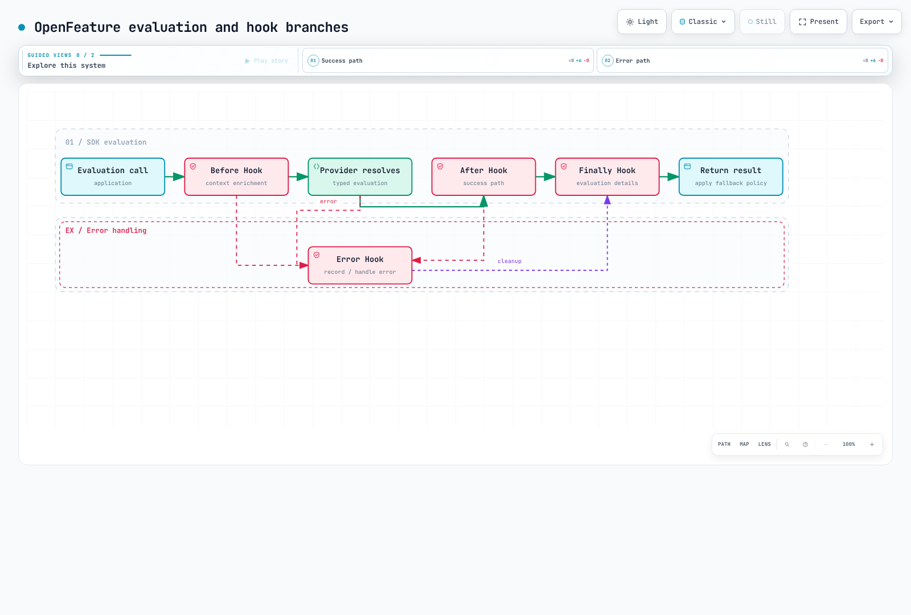
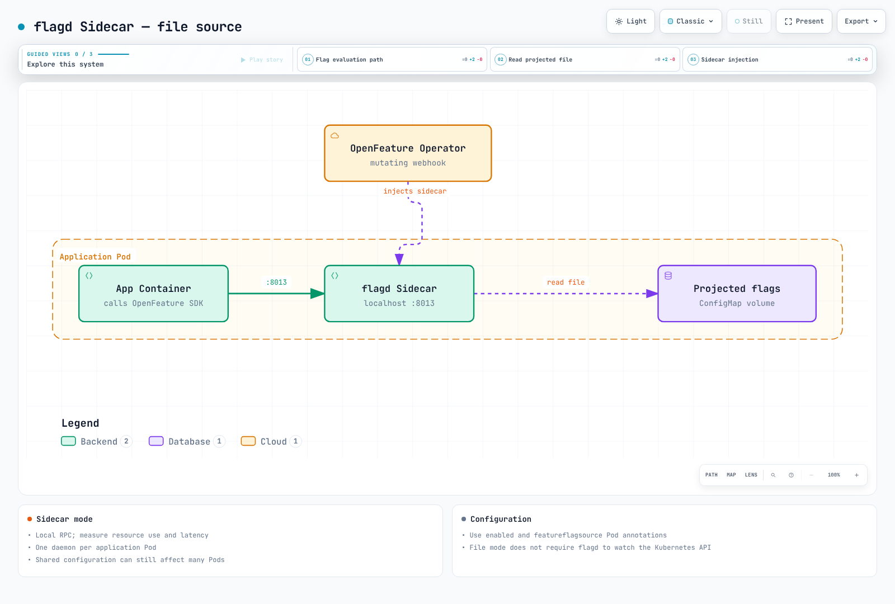
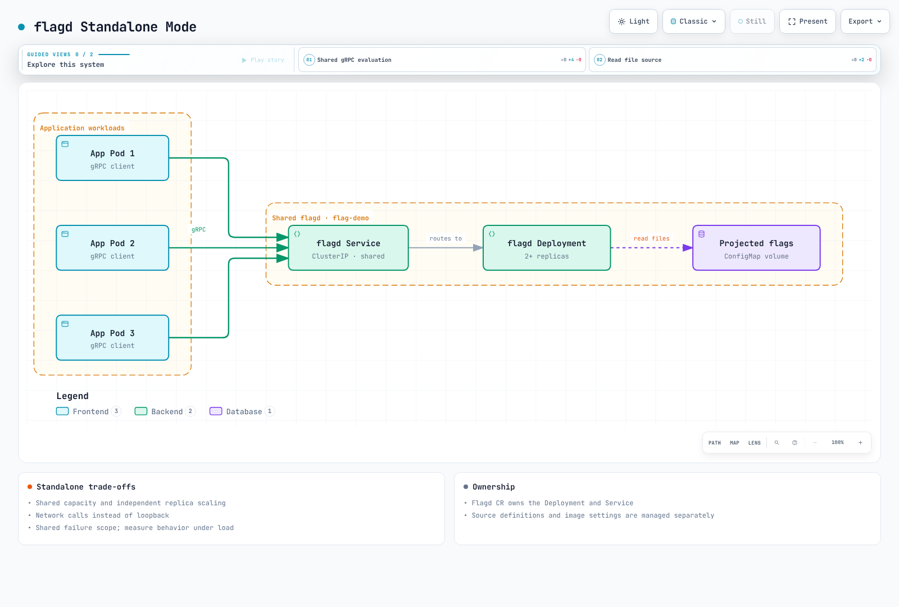
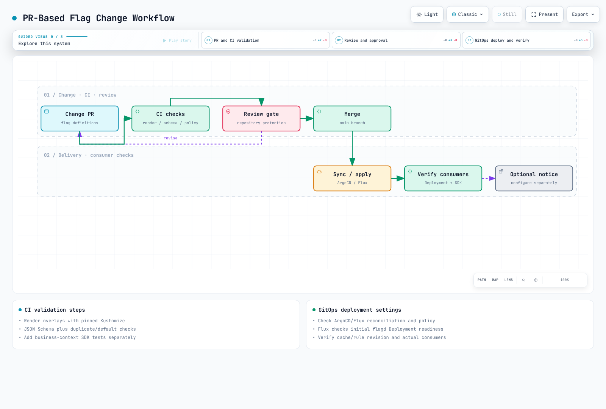

# Feature Flags and OpenFeature

> **Review baseline**: flagd 0.16.3, OpenFeature Operator 0.9.3, Flagger 1.45.0; SDK versions are pinned in their examples
> **Last Updated**: September 11, 2026

Feature flags separate code deployment from runtime feature exposure. This guide covers OpenFeature, flagd, Kubernetes Operator configuration, SDK integration, and GitOps workflows. Changes depend on synchronization and consumer state; they do not guarantee instantaneous rollback.

Validation scope: the four SDK examples were compiled/run in local-file mode. Native flagd
HTTP evaluation and Prometheus metrics were checked in an isolated test network. Helm,
Kustomize, schemas, and scripts were also checked. This does not validate a real EKS deployment,
application images, every RPC/TLS path, or production load. Adapt deployment URLs, images,
and policies to the actual environment.

---

## Table of Contents

- [Overview and Learning Objectives](#overview-and-learning-objectives)
- [OpenFeature Architecture](#openfeature-architecture)
- [flagd on Kubernetes](#flagd-on-kubernetes)
- [OpenFeature Operator](#openfeature-operator)
- [Application Integration](#application-integration)
- [Canary Release and Feature Flag Combination](#canary-release-and-feature-flag-combination)
- [GitOps Integration](#gitops-integration)
- [Observability](#observability)
- [Production Best Practices](#production-best-practices)
- [References](#references)

---

## Overview and Learning Objectives

### Learning Objectives

After completing this section, you will be able to:

- Explain the role of feature flags in progressive delivery and continuous deployment
- Compare feature flag platforms and select the right tool for your environment
- Deploy flagd on Kubernetes using the OpenFeature Operator
- Integrate OpenFeature SDKs in Go, Java, Python, and Node.js applications
- Combine feature flags with canary releases for sophisticated rollout strategies
- Manage feature flag configuration as code through GitOps workflows
- Monitor flag evaluations with Prometheus and Grafana

### What Are Feature Flags?

A feature flag (also called a feature toggle or feature switch) is a mechanism that allows you to enable or disable functionality at runtime without deploying new code. The core idea is simple: wrap a code path in a conditional that checks a flag value, and control that value externally.

```
if featureEnabled("new-checkout"):
    renderNewCheckout()
else:
    renderLegacyCheckout()
```

Feature flags serve several distinct purposes in software delivery:

| Category | Purpose | Lifetime | Example |
|----------|---------|----------|---------|
| **Release Flags** | Decouple deployment from release | Days to weeks | Hide an unfinished feature behind a flag during development |
| **Experiment Flags** | A/B testing and data-driven decisions | Weeks to months | Show variant B of a pricing page to 10% of users |
| **Ops Flags** | Operational control and circuit breakers | Permanent | Kill switch for a non-critical downstream dependency |
| **Permission Flags** | Entitlements and access control | Permanent | Enable a premium feature for paying customers only |

Feature exposure does not replace authentication or authorization. Disabled code can
still be present in an image; flags are not a secret store or an access-control boundary.

### Feature Flags in Progressive Delivery

Progressive delivery extends continuous delivery by adding fine-grained control over which users see new functionality and when. Feature flags are a critical building block in this model:


[🔍 View interactive diagram](https://www.atomai.click/kubernetes-docs/archmaps/en-gitops-05-feature-flags-0.html)

Code still follows the workload deployment strategy, such as a rolling update. Feature flags separately control which application behavior is selected. This is fundamentally different from traffic-splitting approaches (like canary deployments), which control which pod version a request hits. The two techniques complement each other, as described in the [Canary Release and Feature Flag Combination](#canary-release-and-feature-flag-combination) section.

### Feature Flag Tool Comparison

Evaluate management features, runtime evaluation, and language-specific provider support
together. Provider availability does not imply identical hooks, events, or targeting
semantics across languages. Check current vendor documentation for pricing and contract
features; this comparison focuses on integration and operational ownership.

| Tool | Role | Integration and operational checks |
|------|------|------------------------------------|
| flagd | Self-managed evaluation and rule synchronization | Configure sources, RPC/in-process mode, Operator, availability, and observability |
| [LaunchDarkly](https://launchdarkly.com/docs/sdk/openfeature) | Managed feature-flag service | Check each language provider, context/event mapping, and underlying SDK capabilities |
| [Flagsmith](https://docs.flagsmith.com/integrating-with-flagsmith/openfeature) | Managed or self-hosted flag platform | Check server/web provider differences and language coverage |
| [Harness FME](https://github.com/harness/developer-hub/tree/main/docs/feature-management-experimentation) | Feature management and experimentation | Check migration from existing Split setups, providers, and experiment-data integration |
| [Unleash](https://github.com/Unleash/unleash-openfeature-node-provider) | Provider ecosystem backed by Unleash SDKs | Check context translation, stickiness, and optional features; the Node provider does not implement the tracking API |

This guide directly validates the flagd path. It does not test commercial-account
connections or feature equivalence across every provider.

### The OpenFeature Standard

OpenFeature is a CNCF incubating project that provides a vendor-neutral, community-driven API for feature flag evaluation. It solves the problem of vendor lock-in by defining a standard interface that works with any backend provider.

Key benefits of OpenFeature:

- **Vendor-neutral API**: Reduce changes to evaluation calls while migrating provider configuration and rules
- **Consistent evaluation model**: Boolean, string, number, and object flag types with a uniform evaluation API
- **Hooks**: Lifecycle hooks for logging, metrics, validation, and tracing
- **Evaluation context**: Structured context (user attributes, environment info) passed to every evaluation
- **Multi-language support**: Official SDKs for Go, Java, Python, Node.js, .NET, PHP, and more

---

## OpenFeature Architecture

### SDK Structure

The OpenFeature SDK follows a layered architecture that separates the evaluation API from the flag management backend:


[🔍 View interactive diagram](https://www.atomai.click/kubernetes-docs/archmaps/en-gitops-05-feature-flags-1.html)

### Core Components

**Evaluation API**: The primary interface that application code interacts with. It provides typed evaluation methods (`getBooleanValue`, `getStringValue`, `getNumberValue`, `getObjectValue`) and a `Client` abstraction for scoping evaluations.

**Provider**: A provider is a concrete implementation that connects the OpenFeature SDK to a specific flag management backend. Only one provider is active at any time (per domain), and the SDK delegates all flag resolution to it.

**Evaluation Context**: A set of key-value attributes that provide context for flag evaluation. Common attributes include `targetingKey` (user ID), `email`, `region`, `environment`, and custom properties. The context flows through the entire evaluation pipeline.

**Hooks**: Hooks intercept the flag evaluation lifecycle at four stages:

| Stage | Timing | Common Use Cases |
|-------|--------|-----------------|
| `before` | Before evaluation | Enrich context, validate inputs |
| `after` | After successful evaluation | Record metrics, log decisions |
| `error` | On evaluation failure | Error reporting, fallback logic |
| `finally` | Always runs (like try/finally) | Cleanup, span completion |

### Provider Model

The provider abstraction reduces coupling to a backend. The following is a schematic interface, not a language-specific implementation contract; initialization, events, and context-change support vary by SDK:

```
Provider Interface:
  - resolveBooleanValue(flagKey, defaultValue, context) -> ResolutionDetails
  - resolveStringValue(flagKey, defaultValue, context) -> ResolutionDetails
  - resolveNumberValue(flagKey, defaultValue, context) -> ResolutionDetails
  - resolveObjectValue(flagKey, defaultValue, context) -> ResolutionDetails
  - initialize(context) -> void
  - shutdown() -> void
```

Switching providers preserves the evaluation API where supported, but flag keys,
variants, targeting, credentials, context semantics, and operational behavior still
need migration and testing. Check each provider's constructor and await readiness
before reusing a client. See the complete [Go SDK](#go-sdk) example below. The diagram
is an example of provider selection, not a rule that limits flagd to development.


[🔍 View interactive diagram](https://www.atomai.click/kubernetes-docs/archmaps/en-gitops-05-feature-flags-2.html)

### Evaluation Flow

The success path runs Before, provider resolution, After, and Finally. Errors in
Before, provider resolution, or After use the Error path before finalization.
Finally receives evaluation details in the current Go interface.



[🔍 View interactive diagram](https://www.atomai.click/kubernetes-docs/archmaps/en-gitops-05-feature-flags-11.html)

---

## flagd on Kubernetes

### What Is flagd?

flagd is a lightweight, open-source feature flag daemon and the reference implementation of an OpenFeature-compliant flag evaluation engine. It is designed specifically for cloud-native environments and runs natively on Kubernetes.

Key characteristics:

- **Lightweight**: A Go service whose CPU and memory needs depend on flag count, sources, traffic, and enabled telemetry
- **Kubernetes-native**: Reads flag configuration from FeatureFlag CRDs, ConfigMaps, or files
- **gRPC and HTTP**: The evaluation service uses port 8013; the separate OFREP HTTP endpoint uses port 8016. Management/metrics use 8014 and definition sync uses 8015 by default
- **Real-time sync**: Synchronizes definitions from configured sources; updates are asynchronous and consumer freshness must be checked
- **Fractional evaluation**: Built-in support for percentage-based rollouts using consistent hashing
- **Targeting rules**: JSON Logic-based targeting for complex audience segmentation

### flagd Architecture


[🔍 View interactive diagram](https://www.atomai.click/kubernetes-docs/archmaps/en-gitops-05-feature-flags-3.html)

### Helm Installation

The official repository publishes the `open-feature-operator` chart. Do not assume a
separate `openfeature/flagd` chart exists. After installing the Operator, configure
Pod injection or a `Flagd` resource to create an evaluation service. Prepare
[cert-manager](../security/10-cert-manager.md) for the webhook certificates first.

Save `openfeature-values.yaml`. Operator `v0.9.3` defaults to flagd `v0.16.2`; this
example pins both the sidecar and shared-deployment images to `v0.16.3`. Resource
values are a lab starting point, not measured production sizing.

```yaml
sidecarConfiguration:
  image:
    repository: ghcr.io/open-feature/flagd
    tag: v0.16.3
  resources:
    requests:
      cpu: 50m
      memory: 64Mi
    limits:
      cpu: 200m
      memory: 256Mi
flagdConfiguration:
  image:
    repository: ghcr.io/open-feature/flagd
    tag: v0.16.3
```

```bash
helm repo add openfeature https://open-feature.github.io/open-feature-operator/
helm repo update
helm upgrade --install open-feature-operator openfeature/open-feature-operator \
  --version v0.9.3 \
  --namespace open-feature-operator-system --create-namespace \
  -f openfeature-values.yaml --wait --timeout 5m
```

`sidecarConfiguration` and `flagdConfiguration` configure different placements.
The older `sidecarConfig`, `flagdProxyConfig`, and `controllerManager.manager.env`
examples do not use this chart's configuration paths. The webhook defaults to
`failurePolicy: Ignore`, so an unavailable webhook can leave Pods without a sidecar.
Scope the affected workloads and assess failure impact before choosing `Fail`, and
define application provider-initialization and fallback behavior.

### FeatureFlag CRD

The OpenFeature Operator introduces a `FeatureFlag` Custom Resource Definition that allows you to declare feature flags as Kubernetes resources. This is the primary mechanism for managing flag configuration in a Kubernetes-native way.

Here is a complete `FeatureFlag` CR example demonstrating all major flag types and targeting rules:

```yaml
apiVersion: v1
kind: Namespace
metadata:
  name: flag-demo
---
apiVersion: core.openfeature.dev/v1beta1
kind: FeatureFlag
metadata:
  name: product-flags
  namespace: flag-demo
spec:
  flagSpec:
    flags:
      new-checkout:
        state: ENABLED
        variants:
          'on': true
          'off': false
        defaultVariant: 'off'
        targeting:
          if:
          - ==:
            - var: tier
            - internal
          - 'on'
          - fractional:
            - - 'on'
              - 10
            - - 'off'
              - 90
      banner-color:
        state: ENABLED
        variants:
          blue: '#0055ff'
          green: '#008855'
        defaultVariant: blue
        targeting:
          if:
          - ==:
            - var: tier
            - enterprise
          - green
          - blue
      rate-limit:
        state: ENABLED
        variants:
          standard: 100
          premium: 500
        defaultVariant: standard
        targeting:
          if:
          - in:
            - var: tier
            - - premium
              - enterprise
          - premium
          - standard
      feature-config:
        state: ENABLED
        variants:
          default:
            maxUploadBytes: 10485760
            enableOCR: false
          enhanced:
            maxUploadBytes: 52428800
            enableOCR: true
        defaultVariant: default
        targeting:
          if:
          - and:
            - ==:
              - var: environment
              - production
            - in:
              - var: tier
              - - premium
                - enterprise
          - enhanced
          - default
```

### Sidecar Injection vs Standalone Deployment

flagd can run in two modes on Kubernetes. The choice depends on your latency requirements, operational model, and resource budget.

**Sidecar Mode** (injected by the OpenFeature Operator):



[🔍 View interactive diagram](https://www.atomai.click/kubernetes-docs/archmaps/en-gitops-05-feature-flags-4.html)

**Standalone Mode** (centralized deployment):



[🔍 View interactive diagram](https://www.atomai.click/kubernetes-docs/archmaps/en-gitops-05-feature-flags-5.html)

| Aspect | Sidecar | Standalone |
|--------|---------|------------|
| **RPC path** | Localhost call | Shared Service call; measure actual latency |
| **Resource Usage** | One flagd per pod | Shared across pods |
| **Failure scope** | Local daemon failure is per Pod; shared configuration can affect many Pods | Shared service failure can affect multiple consumers |
| **Scaling** | Scales with app pods | Independent scaling |
| **Configuration** | Operator Pod admission and source reference | Operator-managed Flagd CR or a separately managed deployment |
| **Tradeoff** | Per-Pod runtime and operational overhead | Shared capacity and a service dependency |

Create the FeatureFlag and the FeatureFlagSource described below before applying
this shared `Flagd`. The Operator owns its Deployment and ClusterIP Service. The
file source does not need an API token mounted into the flagd Pod. Its service is
`flagd.flag-demo.svc.cluster.local`, with RPC on port 8013.

```yaml
apiVersion: v1
kind: ServiceAccount
metadata:
  name: flagd-demo
  namespace: flag-demo
automountServiceAccountToken: false
---
apiVersion: core.openfeature.dev/v1beta1
kind: Flagd
metadata:
  name: flagd
  namespace: flag-demo
spec:
  replicas: 2
  serviceType: ClusterIP
  serviceAccountName: flagd-demo
  featureFlagSource: product-flags-source
```

---

## OpenFeature Operator

The OpenFeature Operator is a Kubernetes operator that manages the lifecycle of flagd instances and synchronizes feature flag configurations. It is the recommended way to run flagd in production Kubernetes environments.

### Installation

Use the pinned Operator installation and image overrides in [Helm Installation](#helm-installation).
Installing the Operator does not automatically deploy a shared flagd service for every application.

### CRDs Introduced by the Operator

The operator introduces several CRDs for managing feature flags:

| CRD | Purpose |
|-----|---------|
| `FeatureFlag` | Declares feature flag definitions inline (flag key, variants, targeting rules) |
| `FeatureFlagSource` | Points to the source(s) of flag configuration for a workload (CRD, file, HTTP) |

### FeatureFlagSource CRD

`FeatureFlagSource` configures sources and settings for injected or shared flagd
instances. This baseline uses the `file` source to reference
`flag-demo/product-flags`. The Operator supplies a ConfigMap volume, so the flagd
container does not need to watch Kubernetes directly. Create that FeatureFlag first.

```yaml
apiVersion: core.openfeature.dev/v1beta1
kind: FeatureFlagSource
metadata:
  name: product-flags-source
  namespace: flag-demo
spec:
  sources:
  - source: flag-demo/product-flags
    provider: file
  port: 8013
  managementPort: 8014
  evaluator: json
  logFormat: json
  probesEnabled: true
```

| Source | `source` form | Prerequisite |
|--------|---------------|--------------|
| `file` | `namespace/FeatureFlag-name` | ConfigMap volume supplied by the Operator |
| `kubernetes` | `namespace/FeatureFlag-name` | Kubernetes API permissions and credentials for flagd |
| `flagd-proxy` | Operator's documented proxy source configuration | Proxy service and access boundary |
| `http` | A real HTTPS JSON endpoint | Connectivity, authentication, and server trust |
| `grpc` | A real `host:port` | Sync server, TLS, and required authentication |

Every configured source must actually exist. These are FeatureFlagSource values,
not flagd CLI auto-detection URIs. The CLI accepts
`core.openfeature.dev/flag-demo/product-flags` for Kubernetes auto-detection. Do not
commit authentication tokens inside a CR. `evaluator: json` selects the evaluation
engine; it does not enable caching or a log of every flag evaluation.

When adding another FeatureFlag CR, reference it in the FeatureFlagSource or merge
its definitions into the existing `product-flags` map. Creating a CR alone does not
make every flagd instance or SDK consume it.

### Pod Auto-Injection

Set both annotations on the Deployment Pod template; a namespace label alone does not enable injection. The following integration template requires a real application image that uses the SDK and serves HTTP on port 8080. With the file source, the sidecar does not need a Kubernetes API token.

```yaml
apiVersion: v1
kind: ServiceAccount
metadata:
  name: order-service
  namespace: flag-demo
automountServiceAccountToken: false
---
apiVersion: apps/v1
kind: Deployment
metadata:
  name: order-service
  namespace: flag-demo
spec:
  replicas: 3
  selector:
    matchLabels:
      app: order-service
  template:
    metadata:
      labels:
        app: order-service
      annotations:
        # This annotation triggers flagd sidecar injection
        openfeature.dev/enabled: "true"
        # Reference the FeatureFlagSource to use
        openfeature.dev/featureflagsource: "product-flags-source"
    spec:
      serviceAccountName: order-service
      automountServiceAccountToken: false
      containers:
        - name: order-service
          image: YOUR_REGISTRY/order-service:YOUR_VERSION
          ports:
            - containerPort: 8080
              name: http
          env:
            # The flagd provider connects to localhost because the sidecar
            # runs in the same pod
            - name: FLAGD_HOST
              value: "localhost"
            - name: FLAGD_PORT
              value: "8013"
```

Inspect the admitted Pod to confirm that injection succeeded and that its image, arguments, and volumes match the intended FeatureFlagSource. A running Pod alone is not proof of successful injection when the webhook failure policy is Ignore.

### ConfigMap and CRD Synchronization

For the file source used here, the Operator supplies FeatureFlag definitions through ConfigMap volumes. Direct Kubernetes and proxy sources follow different paths. The following diagram describes the file-source path:


[🔍 View interactive diagram](https://www.atomai.click/kubernetes-docs/archmaps/en-gitops-05-feature-flags-6.html)

File-source definition changes can be consumed without restarting the Pod, but ConfigMap projection and file reading are asynchronous. Inspect the deployed Pod configuration and required rollout separately when changing an image or source configuration. Initial readiness is not proof that every consumer has the latest definition.

---

## Application Integration

### Go SDK

This example uses Go 1.25+, OpenFeature Go SDK `v1.18.0`, and flagd Provider
`v0.6.0`. `NewProvider` returns both a provider and an error. Select local file
resolution with `WithFileResolver` and `WithOfflineFilePath`; older examples using
`WithResolverType` or `flagd.GRPC` do not match this provider API.

Save the JSON object inside `spec.flagSpec` as `flags.json`, rather than the entire
Kubernetes resource. It must contain the four flag keys read below. When exporting
an existing resource, select its actual namespace.

```bash
kubectl get featureflag product-flags -n flag-demo -o json | jq '.spec.flagSpec' > flags.json
mkdir go-flag-demo
cp flags.json go-flag-demo/
cd go-flag-demo
go mod init example.com/go-flag-demo
go get github.com/open-feature/go-sdk@v1.18.0
go get github.com/open-feature/go-sdk-contrib/providers/flagd@v0.6.0
# Save the code below as main.go, then run it.
go run . flags.json
```

File mode is a local validation path; it does not call Kubernetes or a flagd
server. In production, obtain attributes such as `tier` from authenticated server
state. Untrusted request headers must not determine entitlements or authorization.

```go
package main

import (
    "context"
    "encoding/json"
    "errors"
    "log"
    "os"
    "time"

    "github.com/open-feature/go-sdk/openfeature"
    flagd "github.com/open-feature/go-sdk-contrib/providers/flagd/pkg"
)

func run(flagFile string) error {
    provider, err := flagd.NewProvider(
        flagd.WithFileResolver(),
        flagd.WithOfflineFilePath(flagFile),
    )
    if err != nil {
        return err
    }
    if err := openfeature.SetProviderAndWait(provider); err != nil {
        return err
    }
    defer openfeature.Shutdown()

    client := openfeature.NewClient("docs-demo")
    ctx, cancel := context.WithTimeout(context.Background(), time.Second)
    defer cancel()
    evaluation := openfeature.NewEvaluationContext("synthetic-user", map[string]interface{}{
        "tier": "internal",
        "region": "ap-northeast-2",
        "environment": "development",
    })

    enabled, errBool := client.BooleanValue(ctx, "new-checkout", false, evaluation)
    color, errString := client.StringValue(ctx, "banner-color", "#000000", evaluation)
    limit, errInteger := client.IntValue(ctx, "rate-limit", 10, evaluation)
    config, errObject := client.ObjectValue(ctx, "feature-config", map[string]interface{}{}, evaluation)
    if err := errors.Join(errBool, errString, errInteger, errObject); err != nil {
        return err
    }
    return json.NewEncoder(os.Stdout).Encode(map[string]interface{}{
        "enabled": enabled,
        "color": color,
        "limit": limit,
        "config": config,
    })
}

func main() {
    if len(os.Args) != 2 {
        log.Fatal("usage: go run . flags.json")
    }
    if err := run(os.Args[1]); err != nil {
        log.Fatal(err)
    }
}
```

To use RPC with a flagd sidecar, replace only the constructor with the following.
Keep provider readiness, evaluation error handling, and shutdown. For a shared
`Flagd` deployment, use its Service DNS name instead of loopback, and match the
network and TLS settings to that deployment.

```go
provider, err := flagd.NewProvider(
    flagd.WithHost("127.0.0.1"),
    flagd.WithPort(8013),
)
```

### Java SDK

This example uses JDK 21, Maven 3.9, OpenFeature Java SDK `1.22.1`, and flagd
Provider `0.14.1`. Select the resolver using `Config.Resolver`, not
`FlagdOptions.ResolverType`. `MutableContext.add` has overloads for strings,
integers, booleans, and other supported context values.

Save this `pom.xml` in a new project.

```xml
<project xmlns="http://maven.apache.org/POM/4.0.0" xmlns:xsi="http://www.w3.org/2001/XMLSchema-instance" xsi:schemaLocation="http://maven.apache.org/POM/4.0.0 https://maven.apache.org/xsd/maven-4.0.0.xsd">
  <modelVersion>4.0.0</modelVersion>
  <groupId>example.docs</groupId><artifactId>flag-demo</artifactId><version>1.0.0</version>
  <properties><maven.compiler.release>21</maven.compiler.release><project.build.sourceEncoding>UTF-8</project.build.sourceEncoding></properties>
  <dependencies>
    <dependency><groupId>dev.openfeature</groupId><artifactId>sdk</artifactId><version>1.22.1</version></dependency>
    <dependency><groupId>dev.openfeature.contrib.providers</groupId><artifactId>flagd</artifactId><version>0.14.1</version></dependency>
  </dependencies>
  <build><plugins><plugin><groupId>org.apache.maven.plugins</groupId><artifactId>maven-compiler-plugin</artifactId><version>3.14.1</version></plugin></plugins></build>
</project>
```

Save the following as `src/main/java/FlagDemo.java` and place the same `flags.json`
in the project root. File mode evaluates flags without connecting to a server.

```java
import dev.openfeature.contrib.providers.flagd.Config;
import dev.openfeature.contrib.providers.flagd.FlagdOptions;
import dev.openfeature.contrib.providers.flagd.FlagdProvider;
import dev.openfeature.sdk.Client;
import dev.openfeature.sdk.FlagEvaluationDetails;
import dev.openfeature.sdk.MutableContext;
import dev.openfeature.sdk.MutableStructure;
import dev.openfeature.sdk.OpenFeatureAPI;
import dev.openfeature.sdk.Value;
import java.nio.file.Path;
import java.util.List;

public class FlagDemo {
    public static void main(String[] args) {
        if (args.length != 1) throw new IllegalArgumentException("usage: FlagDemo flags.json");
        OpenFeatureAPI api = OpenFeatureAPI.getInstance();
        FlagdOptions options = FlagdOptions.builder()
                .resolverType(Config.Resolver.FILE)
                .offlineFlagSourcePath(Path.of(args[0]).toAbsolutePath().toString())
                .build();
        try {
            api.setProviderAndWait(new FlagdProvider(options));
            Client client = api.getClient("docs-demo");
            MutableContext context = new MutableContext("synthetic-user");
            context.add("tier", "internal");
            FlagEvaluationDetails<Boolean> enabled = client.getBooleanDetails("new-checkout", false, context);
            FlagEvaluationDetails<String> color = client.getStringDetails("banner-color", "#000000", context);
            FlagEvaluationDetails<Integer> limit = client.getIntegerDetails("rate-limit", 10, context);
            Value fallback = new Value(new MutableStructure().add("maxUploadBytes", 0).add("enableOCR", false));
            FlagEvaluationDetails<Value> config = client.getObjectDetails("feature-config", fallback, context);
            for (FlagEvaluationDetails<?> result : List.of(enabled, color, limit, config)) {
                if (result.getErrorCode() != null) throw new IllegalStateException(result.getErrorCode().toString());
            }
            System.out.printf("enabled=%s color=%s limit=%d config=%s%n", enabled.getValue(), color.getValue(), limit.getValue(), config.getValue().asStructure().asObjectMap());
        } finally {
            api.shutdown();
        }
    }
}
```

```bash
mvn compile org.apache.maven.plugins:maven-dependency-plugin:3.8.1:build-classpath \
  -Dmdep.outputFile=classpath.txt
java -cp "target/classes:$(cat classpath.txt)" FlagDemo flags.json
```

For RPC, choose `Config.Resolver.RPC`, configure `host`, `port`, and `deadline`, and
remove `offlineFlagSourcePath`. Use `setProviderAndWait` against a ready server and
call `shutdown` at application exit. This standalone example does not add a logging
implementation, so SLF4J can report its NOP-logger warning. Use the application's
existing SLF4J logging configuration in a real service.

### Python SDK

This complete local-file example uses Python 3.10+, `openfeature-sdk==0.10.0`,
and `openfeature-provider-flagd==0.5.2`. Reuse the same `flags.json`. The public
constructor parameter is `resolver_type`, with an enum value such as
`ResolverType.FILE`; `ResolverType.GRPC` and a plain `"rpc"` string do not match
this configuration API.

```bash
python -m venv python-flag-demo/.venv
python-flag-demo/.venv/bin/python -m pip install \
  openfeature-sdk==0.10.0 openfeature-provider-flagd==0.5.2
# Save the code below as python-flag-demo/main.py.
python-flag-demo/.venv/bin/python python-flag-demo/main.py flags.json
```

```python
import json
import sys
from pathlib import Path

from openfeature import api
from openfeature.contrib.provider.flagd import FlagdProvider
from openfeature.contrib.provider.flagd.config import ResolverType
from openfeature.evaluation_context import EvaluationContext

if len(sys.argv) != 2:
    raise SystemExit("usage: python main.py flags.json")

provider = FlagdProvider(
    resolver_type=ResolverType.FILE,
    offline_flag_source_path=str(Path(sys.argv[1]).resolve()),
)
try:
    api.set_provider_and_wait(provider)
    client = api.get_client("docs-demo")
    context = EvaluationContext(targeting_key="synthetic-user", attributes={"tier": "internal"})
    results = {
        "enabled": client.get_boolean_details("new-checkout", False, context),
        "color": client.get_string_details("banner-color", "#000000", context),
        "limit": client.get_integer_details("rate-limit", 10, context),
        "config": client.get_object_details("feature-config", {"maxUploadBytes": 0, "enableOCR": False}, context),
    }
    for name, result in results.items():
        if result.error_code is not None:
            raise RuntimeError(f"{name}: {result.error_code}")
    print(json.dumps({name: result.value for name, result in results.items()}))
finally:
    api.shutdown()
```

For RPC, use `FlagdProvider(host="127.0.0.1", port=8013,
resolver_type=ResolverType.RPC, deadline_ms=500)` instead. Remove the offline file
option and initialize against a ready flagd server. Keep `set_provider_and_wait`
and `shutdown`. When a fallback must be distinguished from a successful evaluation,
check the detailed result's `error_code` as shown above.

### Node.js SDK

This TypeScript example uses Node.js 22, `@openfeature/server-sdk@1.23.0`, and
`@openfeature/flagd-provider@0.16.1`. `resolverType` accepts `rpc` or `in-process`,
not `grpc`. In this SDK, adding `offlineFlagSourcePath` to the in-process resolver
selects local files instead of network synchronization.

```bash
mkdir node-flag-demo
cp flags.json node-flag-demo/
cd node-flag-demo
npm init -y
npm pkg set type=module
npm install @openfeature/server-sdk@1.23.0 @openfeature/flagd-provider@0.16.1
npm install --save-dev typescript@5.9.3 @types/node@22.19.0
# Save the code below as main.ts.
npx tsc main.ts --target ES2022 --module NodeNext --moduleResolution NodeNext \
  --strict --skipLibCheck --outDir dist
node dist/main.js flags.json
```

```typescript
import { OpenFeature, type EvaluationContext } from '@openfeature/server-sdk';
import { FlagdProvider } from '@openfeature/flagd-provider';

const flagFile = process.argv[2];
if (!flagFile) throw new Error('usage: node dist/main.js flags.json');
const provider = new FlagdProvider({
  resolverType: 'in-process',
  offlineFlagSourcePath: flagFile,
});
try {
  await OpenFeature.setProviderAndWait(provider);
  const client = OpenFeature.getClient('docs-demo');
  const context: EvaluationContext = {targetingKey: 'synthetic-user', tier: 'internal'};
  const results = {
    enabled: await client.getBooleanDetails('new-checkout', false, context),
    color: await client.getStringDetails('banner-color', '#000000', context),
    limit: await client.getNumberDetails('rate-limit', 10, context),
    config: await client.getObjectDetails('feature-config', {maxUploadBytes: 0, enableOCR: false}, context),
  };
  for (const [name, result] of Object.entries(results)) {
    if (result.errorCode) throw new Error(`${name}: ${result.errorCode}`);
  }
  console.log(JSON.stringify(Object.fromEntries(Object.entries(results).map(([name, result]) => [name, result.value]))));
} finally {
  await OpenFeature.clearProviders();
}
```

For RPC, configure `resolverType: 'rpc'`, the server `host`, and `port: 8013`, and
remove `offlineFlagSourcePath`. Await `setProviderAndWait` before accepting requests,
and await `clearProviders` at application shutdown. Do not construct a provider per
request. This local-file test does not validate an actual RPC connection.

### Targeting Rules Deep Dive

`targeting` must ultimately return a **variant name** present in `variants`.
`fractional` returns a variant name, not a user list, so do not test whether a user
key is `in` that result. Combine an internal-user rule with a rollout as in the
baseline: `if: [internal condition, on, fractional rule]`.

Reference this additional CR in the source or merge its definitions into the
baseline `flags` map. Use trusted attributes and normalize `app_version` as SemVer.

```yaml
apiVersion: core.openfeature.dev/v1beta1
kind: FeatureFlag
metadata:
  name: targeting-examples
  namespace: flag-demo
spec:
  flagSpec:
    flags:
      premium-feature:
        state: ENABLED
        variants:
          'on': true
          'off': false
        defaultVariant: 'off'
        targeting:
          if:
          - and:
            - ==:
              - var: tier
              - enterprise
            - '>=':
              - var: account_age_days
              - 30
          - 'on'
          - 'off'
      new-search-algo:
        state: ENABLED
        variants:
          'on': true
          'off': false
        defaultVariant: 'off'
        targeting:
          fractional:
          - - 'on'
            - 20
          - - 'off'
            - 80
      api-v2:
        state: ENABLED
        variants:
          'on': true
          'off': false
        defaultVariant: 'off'
        targeting:
          if:
          - sem_ver:
            - var: app_version
            - '>='
            - 2.0.0
          - 'on'
          - 'off'
```

Fractional integer weights are relative. The example divides the hash space 20/80;
it does not guarantee exactly 20% of actual users or requests. The default bucket
key combines the flag key and `targetingKey`. Use a stable, non-empty key, and do
not assign every anonymous visitor the same key. Repeated evaluation with the same
rule and key is stable; changing weights, keys, or evaluator implementations can
change assignments.

A flag's `defaultVariant` when targeting produces no result is distinct from the
SDK caller's default. In the tested Go flagd provider, `DISABLED` returns the caller's
default without an error and reports reason `DISABLED`. Disabling a flag does not
necessarily produce false. Design a kill switch to select an explicit off variant
while `ENABLED`, and verify values, errors, reasons, and propagation to consumers.

---

## Canary Release and Feature Flag Combination

This sequence assumes a healthy, initialized v1 primary. Distinguish first-time
Canary initialization from analysis of a subsequent workload revision. Confirm initial
OFF through actual evaluation, including targeting; an off default alone is insufficient.

Feature flags and canary releases are complementary strategies. Canary releases control traffic at the infrastructure level (which pod version serves a request), while feature flags control behavior at the application level (which code path executes). Combining both provides the highest level of release safety.

### Architecture: Flagger + Feature Flags


[🔍 View interactive diagram](https://www.atomai.click/kubernetes-docs/archmaps/en-gitops-05-feature-flags-7.html)

This is an Istio integration template for [Flagger](./04-flagger.md) 1.45. The
controller must watch `flag-demo`, and the Deployment, Istio, and Prometheus metrics
must already exist. The application image must actually integrate the SDK.
`threshold: 5` is the cumulative failed-check limit for an analysis, not a required
success count. These numbers are illustrative policies to adapt to the real SLO.

An application-supplied, trusted `release_id` can scope eligibility for new behavior.
Do not confuse a Pod's canary role with the application release ID. Workload promotion
does not automatically open the feature flag to 100%; flag expansion and restoration
need separate approval, Git changes, or implemented automation.

### Flagger + Feature Flag Workflow

The following workflow uses Flagger for traffic management and feature flags for fine-grained control within the canary pods:

**Phase 1 -- Deploy with flag off**: Ship v2 with a new feature behind a flag (default: off). Flagger begins routing a small percentage of traffic to v2.

**Phase 2 -- Enable a limited cohort**: Use trusted attributes such as `tier: internal` and the intended release ID. Confirm the actual consumer revision and exposure before expanding.

**Phase 3 -- Cohort expansion**: Change the approved flag weights separately and monitor application outcomes alongside the workload analysis.

**Phase 4 -- Separate promotion decisions**: Flagger can promote the workload after its analysis. Opening the feature to 100% is a separate configuration change with its own validation.

Example Flagger Canary resource:

```yaml
apiVersion: flagger.app/v1beta1
kind: Canary
metadata:
  name: order-service
  namespace: flag-demo
spec:
  targetRef:
    apiVersion: apps/v1
    kind: Deployment
    name: order-service
  progressDeadlineSeconds: 600
  service:
    port: 8080
    targetPort: 8080
  analysis:
    interval: 1m
    threshold: 5
    maxWeight: 50
    stepWeight: 10
    metrics:
    - name: request-success-rate
      thresholdRange:
        min: 99
      interval: 1m
    - name: request-duration
      thresholdRange:
        max: 500
      interval: 1m
```

Webhook integration requires a real receiver, authentication, retry handling, and
revision checks. A successful `rollback` hook requests rollback; it is not an
after-rollback notification. `post-rollout` can run on success or failure, so inspect
the outcome. Metadata strings are literal, not Go-template expressions. No external
flag-controller service is installed by this example.

### A/B Testing with Feature Flags

A stable targeting key and unchanged rule produce a stable variant assignment.
Add this CR to the source or merge it into the existing flag map. The 34/33/33
weights are not quotas guaranteeing exact user counts.

```yaml
apiVersion: core.openfeature.dev/v1beta1
kind: FeatureFlag
metadata:
  name: ab-test-checkout
  namespace: flag-demo
spec:
  flagSpec:
    flags:
      checkout-variant:
        state: ENABLED
        variants:
          control: classic
          variant-a: streamlined
          variant-b: one-click
        defaultVariant: control
        targeting:
          fractional:
          - - control
            - 34
          - - variant-a
            - 33
          - - variant-b
            - 33
```

Use string evaluation details to inspect the value, variant, and error. Record
exposure when the selected experience is actually delivered; an evaluation alone
does not prove exposure or conversion. Define conversion events, sample size,
experiment duration, and outcome metrics separately. Stable bucketing does not
guarantee an identical experience across old/new app versions or stale rule sets.

### Dark Launch Pattern

A dark launch deploys new functionality to production but only exposes it to internal users or a shadow pipeline. Feature flags make this straightforward:

```yaml
apiVersion: core.openfeature.dev/v1beta1
kind: FeatureFlag
metadata:
  name: dark-launch-quote-v2
  namespace: flag-demo
spec:
  flagSpec:
    flags:
      shadow-quote-v2:
        state: ENABLED
        variants:
          "on": true
          "off": false
        defaultVariant: "off"
        targeting:
          # Only enable for specific internal test accounts
          if:
            - in:
              - var: targetingKey
              - - "test-user-001"
                - "test-user-002"
                - "qa-bot-001"
            - "on"
            - "off"
```

Shadow execution must not perform the business operation twice. In particular, do not
call two payment processors for the same order. Compare a read-only calculation, or
replay sanitized inputs in an isolated environment that cannot charge, write business
records, or send notifications. The caller still receives the existing implementation's
result.

The following is an integration fragment: `calculateLegacyQuote`,
`calculateCandidateQuote`, and `compareQuotes` are application functions. Both
calculators must be side-effect free and honor context cancellation. This synchronous
example can add up to the candidate's timeout to the request; an asynchronous
implementation needs a bounded queue and its own timeout.

```go
func quoteOrder(ctx context.Context, order Order,
    evalCtx openfeature.EvaluationContext) (Quote, error) {
    original, err := calculateLegacyQuote(ctx, order)
    if err != nil {
        return original, err
    }

    shadowEnabled, flagErr := client.BooleanValue(
        ctx, "shadow-quote-v2", false, evalCtx,
    )
    if flagErr == nil && shadowEnabled {
        shadowCtx, cancel := context.WithTimeout(ctx, 50*time.Millisecond)
        defer cancel()
        candidate, err := calculateCandidateQuote(shadowCtx, order)
        if err == nil {
            compareQuotes(original, candidate)
        }
    }
    return original, nil
}
```

### Metrics-Based Auto-Rollout

The following templates require the application instrumentation and PodMonitor shown
in [Observability](#observability). The `app` label must identify the target Deployment
and exclude primary. Replace the Prometheus URL with the real service address.
Shared flagd server metrics cannot identify one canary's evaluation failures reliably.

```yaml
apiVersion: flagger.app/v1beta1
kind: MetricTemplate
metadata:
  name: app-flag-errors
  namespace: flag-demo
spec:
  provider:
    type: prometheus
    address: http://prometheus.monitoring.svc:9090
  query: |-
    100 * (
      sum(rate(app_feature_flag_evaluations_total{namespace="{{ namespace }}",app="{{ target }}",flag_key="new-checkout",reason="ERROR"}[{{ interval }}]))
      or vector(0)
    ) / sum(rate(app_feature_flag_evaluations_total{namespace="{{ namespace }}",app="{{ target }}",flag_key="new-checkout"}[{{ interval }}]))
---
apiVersion: flagger.app/v1beta1
kind: MetricTemplate
metadata:
  name: app-flag-samples
  namespace: flag-demo
spec:
  provider:
    type: prometheus
    address: http://prometheus.monitoring.svc:9090
  query: sum(increase(app_feature_flag_evaluations_total{namespace="{{ namespace }}",app="{{
    target }}",flag_key="new-checkout"}[{{ interval }}]))
```

Append these items to the Canary's existing `spec.analysis.metrics` list after
confirming the series exist. These illustrative policies require at least 100 SDK
evaluations in a minute and at most 1% errors; they do not count distinct users or
prove business correctness. DISABLED/default results need separate monitoring.

```yaml
- name: app-flag-error-rate
  templateRef:
    name: app-flag-errors
  thresholdRange:
    max: 1
  interval: 1m
- name: app-flag-evaluation-count
  templateRef:
    name: app-flag-samples
  thresholdRange:
    min: 100
  interval: 1m
```

A successful Flagger analysis only permits workload promotion. Feature-flag changes
remain a separate decision. Missing observations and NaN must not be treated as success.

---

## GitOps Integration

### Feature Flags as Code

Use the resources verified above: `product-flags.yaml` contains the Namespace and
FeatureFlag; `feature-source.yaml` contains the file-mode FeatureFlagSource; and
`flagd.yaml` contains the shared service's ServiceAccount and Flagd. Install the
Operator and cert-manager first. Replace the repository URL and configure repository
authentication where required.

```text
gitops-config/
├── base/feature-flags/
│   ├── kustomization.yaml
│   ├── product-flags.yaml
│   ├── feature-source.yaml
│   └── flagd.yaml
├── overlays/dev/feature-flags/kustomization.yaml
├── overlays/production/feature-flags/kustomization.yaml
├── validate-flags.py
└── .github/workflows/feature-flags.yml
```

`base/feature-flags/kustomization.yaml`:

```yaml
apiVersion: kustomize.config.k8s.io/v1beta1
kind: Kustomization
resources:
- product-flags.yaml
- feature-source.yaml
- flagd.yaml
```

### Environment-Specific Overrides with Kustomize

These are **patches within a Kustomization**, not incomplete FeatureFlags to apply
directly. To enable every development user, remove the existing targeting rule as
well as setting the default variant to on. Targeting can take precedence over a
changed default. The other three flags remain intact.

`overlays/dev/feature-flags/kustomization.yaml`:

```yaml
apiVersion: kustomize.config.k8s.io/v1beta1
kind: Kustomization
resources:
- ../../../base/feature-flags
patches:
- target:
    group: core.openfeature.dev
    version: v1beta1
    kind: FeatureFlag
    name: product-flags
  patch: |
    - op: remove
      path: /spec/flagSpec/flags/new-checkout/targeting
    - op: replace
      path: /spec/flagSpec/flags/new-checkout/defaultVariant
      value: 'on'
```

`overlays/production/feature-flags/kustomization.yaml`:

```yaml
apiVersion: kustomize.config.k8s.io/v1beta1
kind: Kustomization
resources:
- ../../../base/feature-flags
patches:
- target:
    group: core.openfeature.dev
    version: v1beta1
    kind: FeatureFlag
    name: product-flags
  patch: |
    - op: replace
      path: /spec/flagSpec/flags/new-checkout/targeting
      value:
        if:
        - ==:
          - var: tier
          - internal
        - 'on'
        - fractional:
          - - 'on'
            - 5
          - - 'off'
            - 95
```

Render both configurations with Kustomize 5.8.1 and review the complete output before deployment.

```bash
kustomize build overlays/dev/feature-flags
kustomize build overlays/production/feature-flags
```

### ArgoCD FeatureFlag CR Deployment

The existing `platform` AppProject must allow the actual repository, the `flag-demo`
destination, and the Namespace, ServiceAccount, and OpenFeature resource kinds in
this path. A successful sync does not prove that the Operator-created Deployment
or every SDK has consumed the latest flag definitions.

```yaml
apiVersion: argoproj.io/v1alpha1
kind: Application
metadata:
  name: feature-flags
  namespace: argocd
spec:
  project: platform
  source:
    repoURL: https://github.com/YOUR_ORG/gitops-config.git
    targetRevision: main
    path: overlays/production/feature-flags
  destination:
    server: https://kubernetes.default.svc
    namespace: flag-demo
  syncPolicy:
    automated:
      prune: true
      selfHeal: true
    retry:
      limit: 3
      backoff:
        duration: 5s
        factor: 2
        maxDuration: 1m
```

### Flux FeatureFlag CR Deployment

This assumes an existing Operator installation, so it does not reference a nonexistent
Kustomization through `dependsOn`. If Flux manages the Operator too, use its actual
dependency name. The health check observes the Operator-created `flagd` Deployment's
initial readiness; it is not continuous proof of flag freshness.

```yaml
apiVersion: source.toolkit.fluxcd.io/v1
kind: GitRepository
metadata:
  name: feature-flags
  namespace: flux-system
spec:
  interval: 1m
  url: https://github.com/YOUR_ORG/gitops-config.git
  ref:
    branch: main
---
apiVersion: kustomize.toolkit.fluxcd.io/v1
kind: Kustomization
metadata:
  name: feature-flags-production
  namespace: flux-system
spec:
  interval: 5m
  sourceRef:
    kind: GitRepository
    name: feature-flags
  path: ./overlays/production/feature-flags
  prune: true
  timeout: 3m
  healthChecks:
  - apiVersion: apps/v1
    kind: Deployment
    name: flagd
    namespace: flag-demo
```

### PR-Based Flag Change Workflow



[🔍 View interactive diagram](https://www.atomai.click/kubernetes-docs/archmaps/en-gitops-05-feature-flags-8.html)

The following `.github/workflows/feature-flags.yml` validates rendered definitions.
It pins tools and schemas and verifies checksums. It uses no cluster access, secrets,
or permission to write PR comments. Configure CODEOWNERS and required reviews through
repository protection separately.

```yaml
name: Validate Feature Flags
'on':
  pull_request:
    paths:
    - base/feature-flags/**
    - overlays/**/feature-flags/**
    - validate-flags.py
    - .github/workflows/feature-flags.yml
permissions:
  contents: read
jobs:
  validate:
    runs-on: ubuntu-24.04
    steps:
    - uses: actions/checkout@3d3c42e5aac5ba805825da76410c181273ba90b1
    - uses: actions/setup-python@ece7cb06caefa5fff74198d8649806c4678c61a1
      with:
        python-version: '3.12'
    - name: Install pinned tools and schemas
      run: |
        curl -fsSL https://github.com/kubernetes-sigs/kustomize/releases/download/kustomize%2Fv5.8.1/kustomize_v5.8.1_linux_amd64.tar.gz -o kustomize.tgz
        echo '029a7f0f4e1932c52a0476cf02a0fd855c0bb85694b82c338fc648dcb53a819d  kustomize.tgz' | sha256sum --check
        tar -xzf kustomize.tgz kustomize
        mkdir -p .flag-schemas rendered
        curl -fsSL https://raw.githubusercontent.com/open-feature/flagd-schemas/58d732724359b272001ee6a5b8b7a96c549397e4/json/flags.json -o .flag-schemas/flags.json
        curl -fsSL https://raw.githubusercontent.com/open-feature/flagd-schemas/58d732724359b272001ee6a5b8b7a96c549397e4/json/targeting.json -o .flag-schemas/targeting.json
        echo 'a9b065cc3e140d10a5e139a3f2bbd2f24d4fe8a728ce824a5f2a1231ed60680b  .flag-schemas/flags.json' | sha256sum --check
        echo 'fb94d3d24f0edab22b28d1895ee045c698eed0ff8d4c151c791a92a07738a605  .flag-schemas/targeting.json' | sha256sum --check
        python -m pip install PyYAML==6.0.3 jsonschema==4.26.0
    - name: Validate rendered definitions
      run: |
        for environment in dev production; do
          ./kustomize build "overlays/${environment}/feature-flags" > "rendered/${environment}.yaml"
        done
        python validate-flags.py rendered .flag-schemas
```

Save this complete `validate-flags.py` in the repository root. It rejects duplicate
YAML keys, missing default variants, malformed definitions, and an empty set of
checked resources. Kebab-case is this example's team policy, not an OpenFeature-wide
requirement. This does not replace Kubernetes admission/CEL, reference checks, or
business-intent tests. Add SDK evaluations for representative contexts and verify
consumers after deployment.

```python
import json
import re
import sys
from pathlib import Path
from urllib.parse import urljoin

import jsonschema
import yaml
from referencing import Registry, Resource


class UniqueKeys(yaml.SafeLoader):
    pass


def unique_mapping(loader, node, deep=False):
    loader.flatten_mapping(node)
    result = {}
    for key_node, value_node in node.value:
        key = loader.construct_object(key_node, deep=deep)
        if key in result:
            raise ValueError(f"duplicate YAML key: {key}")
        result[key] = loader.construct_object(value_node, deep=deep)
    return result


UniqueKeys.add_constructor(yaml.resolver.BaseResolver.DEFAULT_MAPPING_TAG, unique_mapping)
rendered, schema_dir = map(Path, sys.argv[1:3])
registry, schemas = Registry(), {}
for name in ("flags.json", "targeting.json"):
    uri = f"https://flagd.dev/schema/v0/{name}"
    schema = json.loads((schema_dir / name).read_text())
    schema["$id"] = uri

    def normalize_refs(value):
        if isinstance(value, dict):
            for key, item in list(value.items()):
                if key == "$ref" and isinstance(item, str) and not item.startswith("#"):
                    value[key] = urljoin(uri, item)
                else:
                    normalize_refs(item)
        elif isinstance(value, list):
            for item in value:
                normalize_refs(item)

    normalize_refs(schema)
    schemas[name] = schema
    registry = registry.with_resource(uri, Resource.from_contents(schema))
validator = jsonschema.Draft7Validator(schemas["flags.json"], registry=registry)
checked = 0
for path in sorted(rendered.glob("*.yaml")):
    for resource in yaml.load_all(path.read_text(), Loader=UniqueKeys):
        if not isinstance(resource, dict) or resource.get("kind") != "FeatureFlag":
            continue
        definition = resource["spec"]["flagSpec"]
        validator.validate(definition)
        for key, flag in definition["flags"].items():
            if not re.fullmatch(r"[a-z0-9]+(?:-[a-z0-9]+)*", key):
                raise ValueError(f"example naming policy failed: {key}")
            if flag["defaultVariant"] not in flag["variants"]:
                raise ValueError(f"default variant missing: {key}")
        checked += 1
if checked == 0:
    raise ValueError("no rendered FeatureFlag resources were checked")
print(f"validated {checked} rendered FeatureFlag resources")
```
---

## Observability

### Flag Evaluation Metrics (Prometheus)

These names were verified with synthetic requests against flagd 0.16.3's default
Prometheus exporter at port 8014, `/metrics`. Do not mix OTLP and Prometheus naming.

| Metric | Meaning and limit |
|--------|-------------------|
| `feature_flag_flagd_impression_total` | Successful flag/variant evaluations; not the denominator for all errors |
| `feature_flag_flagd_result_reason_total` | Evaluation reasons including errors; error samples can omit `feature_flag_key` |
| `http_server_request_duration_seconds` | HTTP processing histogram, not end-to-end latency for every SDK/transport |

In the probe, a missing flag returned HTTP 404 but the HTTP-duration status label
recorded 200. Do not use that label to decide flag-evaluation success in this version.
Successful variant information and error reasons can appear in different counters.

The shared Flagd Service uses `app: flagd` and a Service port named `metrics`.
Prometheus Operator must already exist, and its release-label/namespace selectors
must include this ServiceMonitor.

```yaml
apiVersion: monitoring.coreos.com/v1
kind: ServiceMonitor
metadata:
  name: flagd
  namespace: flag-demo
  labels:
    release: prometheus
spec:
  selector:
    matchLabels:
      app: flagd
  namespaceSelector:
    matchNames:
    - flag-demo
  endpoints:
  - port: metrics
    path: /metrics
    interval: 15s
```

For a sidecar PodMonitor, inspect the admitted Pod and refer to its named
`management` port. A string `"8014"` can be interpreted as a port name, not a numeric
port. In-process SDK evaluations do not automatically increment a remote flagd
server's evaluation counters.

### Application Evaluation Metrics

This code was validated with Go SDK 1.18.0 and
`github.com/prometheus/client_golang@v1.24.1`. Call through this wrapper and expose
its registry through the application's HTTP server. Installing an SDK or declaring
counters does not automatically instrument evaluations. Do not label metrics with
user IDs or flag values; control the set of flag keys used by the application.

```go
package main

import (
    "context"
    "time"
    "github.com/open-feature/go-sdk/openfeature"
    "github.com/prometheus/client_golang/prometheus"
)

type FlagMetrics struct {
    evaluations *prometheus.CounterVec
    duration *prometheus.HistogramVec
}

func NewFlagMetrics(reg prometheus.Registerer) *FlagMetrics {
    m := &FlagMetrics{
        evaluations: prometheus.NewCounterVec(prometheus.CounterOpts{
            Name: "app_feature_flag_evaluations_total",
            Help: "SDK evaluations, including explicit fallback reasons.",
        }, []string{"flag_key", "variant", "reason"}),
        duration: prometheus.NewHistogramVec(prometheus.HistogramOpts{
            Name: "app_feature_flag_evaluation_duration_seconds",
            Help: "SDK evaluation duration including local or remote resolution.",
            Buckets: prometheus.DefBuckets,
        }, []string{"flag_key"}),
    }
    reg.MustRegister(m.evaluations, m.duration)
    return m
}

func (m *FlagMetrics) Boolean(ctx context.Context, client *openfeature.Client,
    key string, fallback bool, evaluation openfeature.EvaluationContext) (bool, error) {
    start := time.Now()
    result, err := client.BooleanValueDetails(ctx, key, fallback, evaluation)
    reason, variant := string(result.Reason), result.Variant
    if err != nil { reason = "ERROR" }
    if variant == "" { variant = "fallback" }
    m.evaluations.WithLabelValues(key, variant, reason).Inc()
    m.duration.WithLabelValues(key).Observe(time.Since(start).Seconds())
    return result.Value, err
}
```

Wire the following fragment into application initialization and evaluation.
`promhttp` is part of the same Prometheus client module. The application's existing
lifecycle owns the HTTP server.

```go
registry := prometheus.NewRegistry()
flagMetrics := NewFlagMetrics(registry)
http.Handle("/metrics", promhttp.HandlerFor(registry, promhttp.HandlerOpts{}))
value, err := flagMetrics.Boolean(ctx, client, "new-checkout", false, evaluation)
```

Track success, ERROR, and DISABLED separately. DISABLED can use the SDK caller's
default without an error. The histogram measures SDK-call duration, not the complete
user request.

This PodMonitor assumes the application exposes metrics on a port named `http`.
It copies the Pod's `app` label to distinguish the Flagger target from primary.
Confirm `namespace` and `app` labels in actual Prometheus series before using the queries.

```yaml
apiVersion: monitoring.coreos.com/v1
kind: PodMonitor
metadata:
  name: order-service-flags
  namespace: flag-demo
  labels:
    release: prometheus
spec:
  namespaceSelector:
    matchNames:
    - flag-demo
  selector:
    matchExpressions:
    - key: app
      operator: In
      values:
      - order-service
      - order-service-primary
  podTargetLabels:
  - app
  podMetricsEndpoints:
  - port: http
    path: /metrics
    interval: 15s
```

### Grafana Dashboard

Build panels from these queries, configuring time range, units, and data sources.
A shared flagd server's error rate is not a particular canary application's error
rate. Export a dashboard verified in Grafana for provisioning. Do not use an API
request's `{"dashboard": ...}` envelope as the dashboard file itself.

Server-wide evaluation error rate (%):

```promql
100 * (
  sum(rate(feature_flag_flagd_result_reason_total{namespace="flag-demo",feature_flag_reason="ERROR"}[5m]))
  or vector(0)
) / sum(rate(feature_flag_flagd_result_reason_total{namespace="flag-demo"}[5m]))
```

Variant share among successful evaluations (%), distinct from exposure/conversion:

```promql
100 * sum by (feature_flag_result_variant) (
  rate(feature_flag_flagd_impression_total{namespace="flag-demo",feature_flag_key="new-checkout"}[5m])
) / scalar(sum(rate(feature_flag_flagd_impression_total{namespace="flag-demo",feature_flag_key="new-checkout"}[5m])))
```

Application-target flag error rate (%):

```promql
100 * (
  sum(rate(app_feature_flag_evaluations_total{namespace="flag-demo",app="order-service",flag_key="new-checkout",reason="ERROR"}[5m]))
  or vector(0)
) / sum(rate(app_feature_flag_evaluations_total{namespace="flag-demo",app="order-service",flag_key="new-checkout"}[5m]))
```

Application SDK evaluation P99 (seconds):

```promql
histogram_quantile(0.99, sum by (le) (
  rate(app_feature_flag_evaluation_duration_seconds_bucket{namespace="flag-demo",app="order-service",flag_key="new-checkout"}[5m])
))
```

Missing observations or zero evaluations can produce no result or NaN. Do not
convert that into a healthy 0% error rate. Deployment decisions also need sufficient
samples, actual exposure, and business outcomes.

### Change History Tracking

The Git author, Kubernetes API actor, and ArgoCD/Flux reconciler can be different
identities. Correlate Git history, deployed revisions, and API audit logs. Do not
assume an undocumented `FlagConfigurationUpdated` event is always emitted.

```bash
kubectl get events -n flag-demo --sort-by='.metadata.creationTimestamp'
```

Kubernetes Events are short-lived operational signals, not a durable audit trail.
`/readyz` also remains 200 after every source has synchronized once; it does not prove
later freshness. Verify metadata revisions, actual SDK responses, and source/provider
state separately.

### Audit Logging

A self-managed Kubernetes audit-policy file configures the API server; it is not a
regular resource to apply. On EKS, use supported control-plane audit logging. Choose
retention and access through team policy. `evaluator: json` or `logFormat: json` does
not guarantee an audit record of every evaluation.

Use the validated services, triggers, and templates in [ArgoCD notifications](./argocd/08-notifications.md).
Do not overwrite an existing notifications ConfigMap with a separate abbreviated example.
---

## Production Best Practices

### Flag Lifecycle Management

Give release/experiment flags owners and review dates, while distinguishing long-lived
operational switches. Check all application versions, other consumers, and the rollback
window before removing branches and definitions. Do not delete a definition while code
still depends on that key.


[🔍 View interactive diagram](https://www.atomai.click/kubernetes-docs/archmaps/en-gitops-05-feature-flags-9.html)

### Technical Debt Prevention

This is a **metadata fragment to add to an existing FeatureFlag**. When one CR holds
multiple flags, these annotations apply to the whole resource. The review date is team
policy; the Operator does not automatically delete or disable flags on that date.

```yaml
metadata:
  annotations:
    example.com/owner: checkout-team
    example.com/review-on: "2026-12-31"
```

This read-only CronJob reports resources due for review through today in UTC and invalid
dates. It can only list FeatureFlags in its namespace and follows pagination. Its service
account token authenticates the API request. It does not change or delete flags, and a
successful Job is not proof that reviews are complete. Log review/alerting is separate.

```yaml
apiVersion: v1
kind: ServiceAccount
metadata:
  name: flag-review
  namespace: flag-demo
---
apiVersion: rbac.authorization.k8s.io/v1
kind: Role
metadata:
  name: flag-review
  namespace: flag-demo
rules:
- apiGroups:
  - core.openfeature.dev
  resources:
  - featureflags
  verbs:
  - list
---
apiVersion: rbac.authorization.k8s.io/v1
kind: RoleBinding
metadata:
  name: flag-review
  namespace: flag-demo
subjects:
- kind: ServiceAccount
  name: flag-review
  namespace: flag-demo
roleRef:
  apiGroup: rbac.authorization.k8s.io
  kind: Role
  name: flag-review
---
apiVersion: batch/v1
kind: CronJob
metadata:
  name: flag-review
  namespace: flag-demo
spec:
  schedule: 0 9 * * 1
  timeZone: Etc/UTC
  concurrencyPolicy: Forbid
  successfulJobsHistoryLimit: 1
  failedJobsHistoryLimit: 1
  jobTemplate:
    spec:
      backoffLimit: 1
      activeDeadlineSeconds: 60
      template:
        spec:
          serviceAccountName: flag-review
          restartPolicy: Never
          securityContext:
            runAsNonRoot: true
            runAsUser: 65532
            seccompProfile:
              type: RuntimeDefault
          containers:
          - name: review
            image: python:3.12.13-slim@sha256:229a2c5bfa27522db7815ea81f9bed70af17ccb9de9fc7ad142b1877b5830d36
            command:
            - python
            - -I
            - -B
            - -c
            - |
              import datetime
              import json
              import re
              import ssl
              import urllib.parse
              import urllib.request
              from pathlib import Path

              ANNOTATION = "example.com/review-on"


              def review_dates(items, today):
                  results = []
                  for item in items:
                      metadata = item.get("metadata", {})
                      value = metadata.get("annotations", {}).get(ANNOTATION)
                      if value is None:
                          continue
                      identity = {"namespace": metadata.get("namespace"), "name": metadata.get("name")}
                      try:
                          if not re.fullmatch(r"\d{4}-\d{2}-\d{2}", value):
                              raise ValueError("expected YYYY-MM-DD")
                          due = datetime.date.fromisoformat(value)
                      except (ValueError, TypeError):
                          results.append({**identity, "status": "invalid-review-date"})
                          continue
                      if due <= today:
                          results.append({**identity, "status": "review-due", "reviewOn": due.isoformat()})
                  return results


              def fetch_flags(namespace, token, tls_context, open_url=urllib.request.urlopen):
                  endpoint = (
                      "https://kubernetes.default.svc/apis/core.openfeature.dev/v1beta1/namespaces/"
                      + urllib.parse.quote(namespace, safe="") + "/featureflags"
                  )
                  items, cursor = [], ""
                  while True:
                      query = urllib.parse.urlencode({"limit": 500, "continue": cursor})
                      request = urllib.request.Request(endpoint + "?" + query, headers={
                          "Authorization": "Bearer " + token, "Accept": "application/json"
                      })
                      with open_url(request, context=tls_context, timeout=10) as response:
                          page = json.load(response)
                      items.extend(page.get("items", []))
                      cursor = page.get("metadata", {}).get("continue", "")
                      if not cursor:
                          return items


              if __name__ == "__main__":
                  service_account = Path("/var/run/secrets/kubernetes.io/serviceaccount")
                  namespace = (service_account / "namespace").read_text().strip()
                  token = (service_account / "token").read_text().strip()
                  tls_context = ssl.create_default_context(cafile=str(service_account / "ca.crt"))
                  today = datetime.datetime.now(datetime.timezone.utc).date()
                  for result in review_dates(fetch_flags(namespace, token, tls_context), today):
                      print(json.dumps(result))
            resources:
              requests:
                cpu: 50m
                memory: 64Mi
              limits:
                cpu: 200m
                memory: 128Mi
            securityContext:
              allowPrivilegeEscalation: false
              readOnlyRootFilesystem: true
              capabilities:
                drop:
                - ALL
        metadata:
          annotations:
            sidecar.istio.io/inject: 'false'
```

### Emergency Kill Switch

Design switches to select an explicit Boolean value. This example stays `ENABLED` and
changes `defaultVariant` between on/off without targeting. `DISABLED` can return the
SDK caller's default, so it is not a way to guarantee false.

```yaml
apiVersion: core.openfeature.dev/v1beta1
kind: FeatureFlag
metadata:
  name: kill-switches
  namespace: flag-demo
spec:
  flagSpec:
    flags:
      external-payment-enabled:
        state: ENABLED
        variants:
          'on': true
          'off': false
        defaultVariant: 'on'
      recommendation-enabled:
        state: ENABLED
        variants:
          'on': true
          'off': false
        defaultVariant: 'on'
      notification-enabled:
        state: ENABLED
        variants:
          'on': true
          'off': false
        defaultVariant: 'on'
```

Reference this additional CR in the FeatureFlagSource or merge its flags into the existing
map. Before a manual change, coordinate GitOps ownership/self-healing for that resource
and prepare the matching Git update. Do not suspend unrelated applications globally.

This Bash/jq script rejects invalid actions, targeted flags, and incorrect Boolean variants.
A resourceVersion test in the same JSON Patch prevents overwriting a concurrent change.
On conflict, re-read the state and confirm the intended change.

```bash
#!/usr/bin/env bash
set -euo pipefail
FLAG_NAME="${1:?usage: emergency-kill-switch.sh FLAG on|off}"
FLAG_ACTION="${2:?usage: emergency-kill-switch.sh FLAG on|off}"
case "$FLAG_ACTION" in on|off) ;; *) echo 'action must be on or off' >&2; exit 2 ;; esac
[[ "$FLAG_NAME" =~ ^[a-z0-9]+(-[a-z0-9]+)*$ ]] || { echo 'invalid flag name' >&2; exit 2; }
FLAG_OBJECT_JSON="$(kubectl get featureflag kill-switches -n flag-demo -o json)"
jq -e --arg flag "$FLAG_NAME" '
  .spec.flagSpec.flags[$flag] as $f |
  ($f != null) and ($f.state == "ENABLED") and
  ($f.variants.on == true) and ($f.variants.off == false) and
  (($f | has("targeting")) | not)
' <<< "$FLAG_OBJECT_JSON" >/dev/null || { echo 'expected an ENABLED boolean kill switch without targeting' >&2; exit 2; }
FLAG_RESOURCE_VERSION="$(jq -er '.metadata.resourceVersion' <<< "$FLAG_OBJECT_JSON")"
FLAG_PATCH="$(jq -nc --arg version "$FLAG_RESOURCE_VERSION" --arg flag "$FLAG_NAME" --arg action "$FLAG_ACTION" '
  [ {op:"test", path:"/metadata/resourceVersion", value:$version},
    {op:"replace", path:("/spec/flagSpec/flags/" + $flag + "/defaultVariant"), value:$action} ]
')"
kubectl patch featureflag kill-switches -n flag-demo --type=json -p "$FLAG_PATCH"
echo 'Configuration updated; verify GitOps reconciliation and actual consumer behavior.'
```

A successful Kubernetes response proves the configuration update. Verify consumer behavior
and revision too: synchronization/caches can lag, and some providers retain older rules.
A flag change and workload rollback do not automatically form a single transaction.

### Gradual Rollout Strategies

Choose audience, observation window, and promotion criteria from the SLO and sample size.
The following is an example sequence, not universal timing or percentage requirements.

| Stage | Main checks |
|-------|-------------|
| Internal audience | Behavior, compatibility, SDK readiness/default policy |
| Limited cohort | Errors, latency, actual exposure and conversion |
| Expansion | Sufficient samples, capacity, and business outcomes |
| Full audience | Actual flag/workload propagation and rollback plan |
| Cleanup | Remaining consumers and rollback window before deleting code/definitions |

Change weights through the validated Kustomize/Git path. Hash allocation is not an exact
traffic percentage, and evaluation counts are not unique-user counts.

### Performance Impact Minimization

- Measure RPC/in-process latency, CPU, memory, and synchronization delay in the actual
  environment. There is no universal 20MB memory or 5ms latency guarantee.
- Use documented provider caching/invalidation behavior. Reuse results within a request
  when context is unchanged. A long-lived cache keyed only by flag and user ID can miss
  other attributes, rule updates, provider changes, and fallback values.
- In-process evaluation uses local rules. Whether disconnection retains old rules or
  returns errors/defaults depends on provider state/configuration; verify switch freshness.
- Set deadlines and application default policies. Observe DISABLED/DEFAULT and other
  reasons as well as errors. Initial readiness does not prove rule freshness.
- Bulk evaluation and network optimizations are product/provider capabilities, not one
  universally supported OpenFeature SDK API.
---

## References

### Official Documentation

- [flagd definitions and targeting](https://flagd.dev/reference/flag-definitions/)
- [flagd monitoring and initial readiness](https://flagd.dev/reference/monitoring/)
- [Operator 0.9.3 configuration and CRDs](https://github.com/open-feature/open-feature-operator/tree/v0.9.3/docs)

- [OpenFeature Specification](https://openfeature.dev/specification/)
- [OpenFeature SDK Documentation](https://openfeature.dev/docs/reference/intro/)
- [flagd Documentation](https://flagd.dev/)
- [OpenFeature Operator](https://github.com/open-feature/open-feature-operator)
- [CNCF OpenFeature Project](https://www.cncf.io/projects/openfeature/)

### Provider Documentation

- [flagd Provider (Go)](https://github.com/open-feature/go-sdk-contrib/tree/main/providers/flagd)
- [flagd Provider (Java)](https://github.com/open-feature/java-sdk-contrib/tree/main/providers/flagd)
- [flagd Provider (Python)](https://github.com/open-feature/python-sdk-contrib/tree/main/providers/openfeature-provider-flagd)
- [flagd Provider (Node.js)](https://github.com/open-feature/js-sdk-contrib/tree/main/libs/providers/flagd)
- [LaunchDarkly OpenFeature Providers](https://launchdarkly.com/docs/sdk/openfeature)
- [Flagsmith OpenFeature Providers](https://docs.flagsmith.com/integrating-with-flagsmith/openfeature)

### Related Internal Documentation

- [GitOps Overview](./README.md) -- GitOps principles and tool selection
- [ArgoCD](./argocd/README.md) -- ArgoCD installation, applications, and sync strategies
- [FluxCD](./02-fluxcd.md) -- FluxCD controllers and image automation
- [ArgoCD Traffic Management](./argocd/05-traffic-management.md) -- Argo Rollouts and progressive delivery
- [Istio Traffic Splitting](../service-mesh/istio/traffic-management/04-traffic-splitting.md) -- Service mesh traffic management
- [Prometheus](../observability/metrics/01-prometheus.md) -- Metrics collection and alerting
- [Grafana](../observability/grafana/README.md) -- Dashboard creation and visualization

### Community Resources

- [OpenFeature GitHub Organization](https://github.com/open-feature)
- [OpenFeature Ecosystem](https://openfeature.dev/ecosystem/) -- Complete list of providers, hooks, and integrations
- [Feature Flag Best Practices (Martin Fowler)](https://martinfowler.com/articles/feature-toggles.html)
