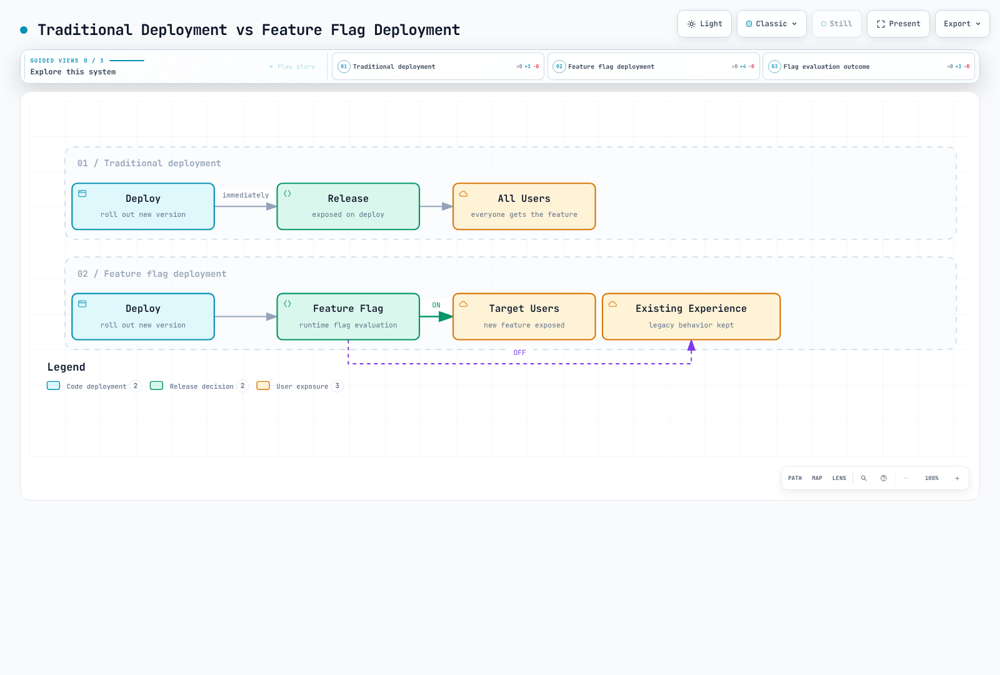
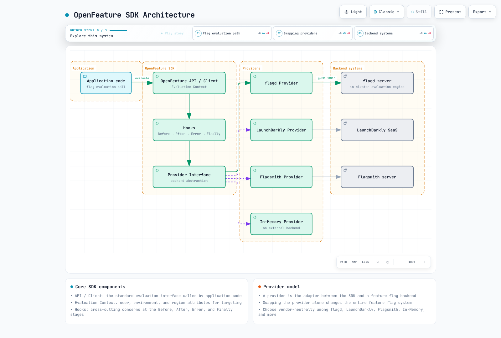
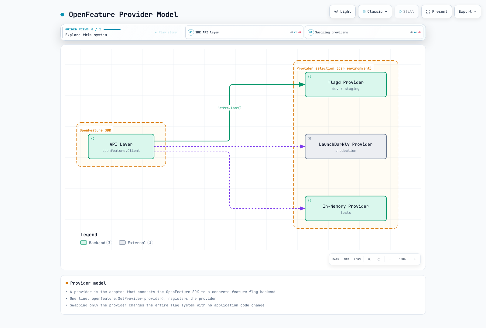
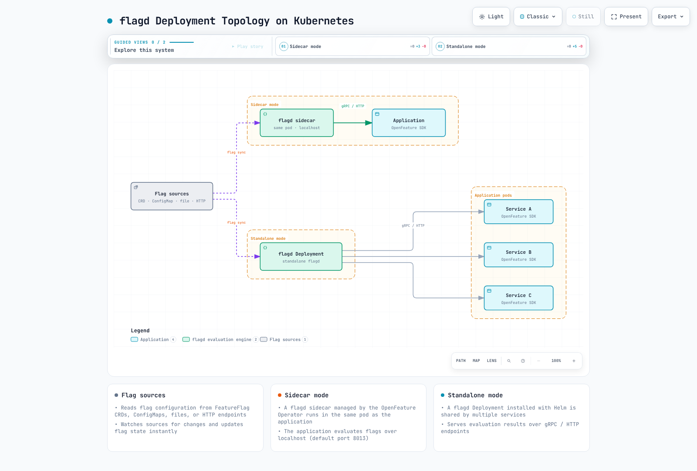
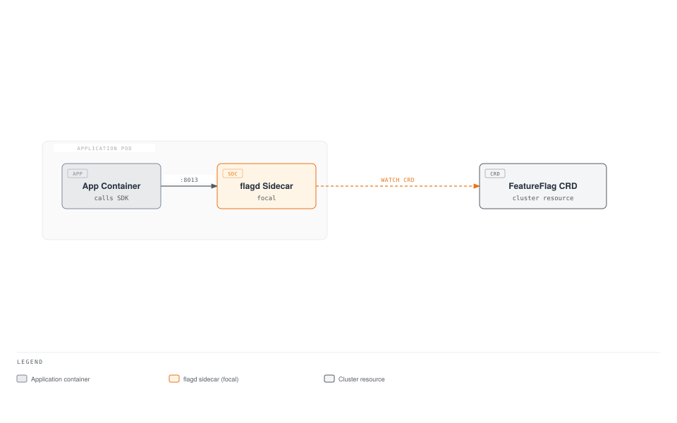
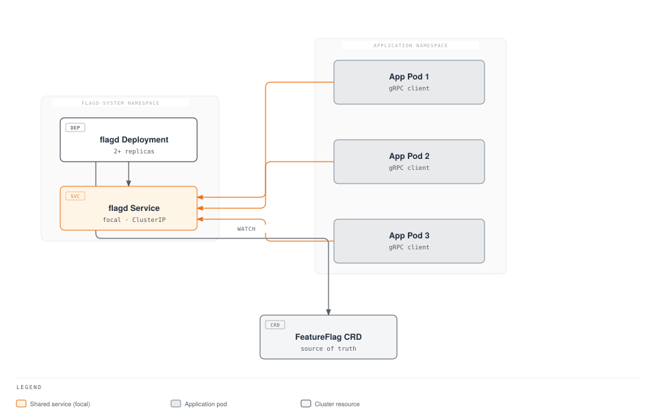
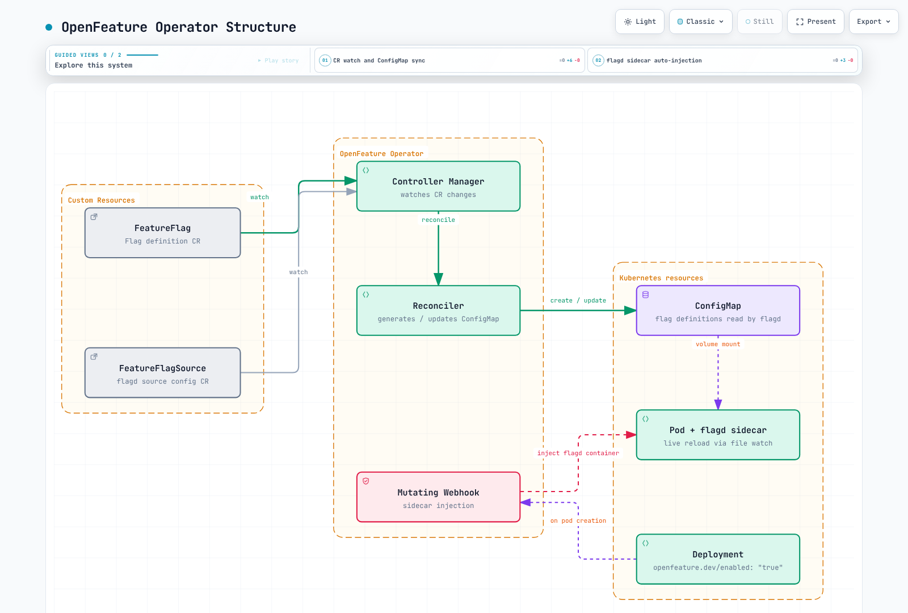
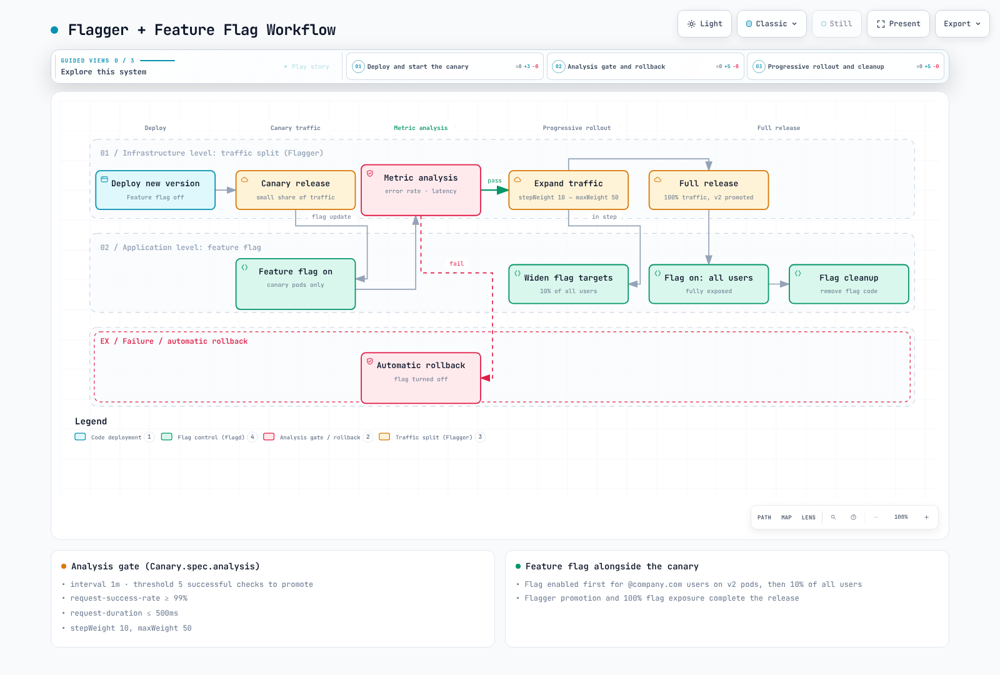
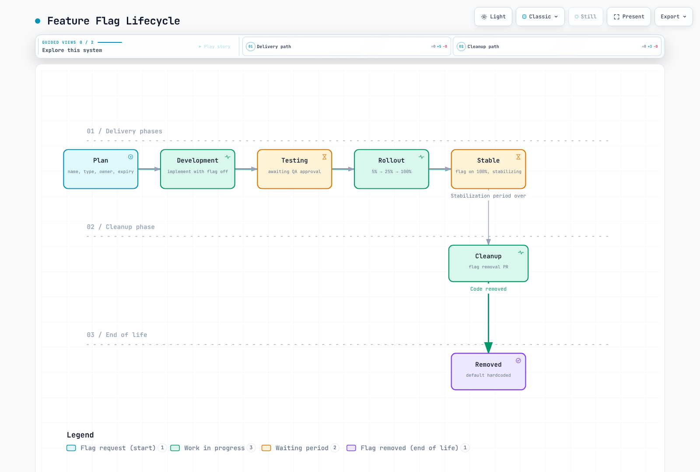

# Feature Flags and OpenFeature

> **Supported Versions**: OpenFeature SDK v1.x, flagd v0.11+
> **Last Updated**: June 2025

Feature flags are a foundational technique for modern progressive delivery on Kubernetes. They allow engineering teams to decouple deployment from release, enabling safe rollouts, targeted experiments, and instant rollbacks without redeploying code. This guide covers the OpenFeature standard, the flagd reference implementation, the OpenFeature Operator for Kubernetes, and production-grade integration patterns for GitOps workflows.

---

## Table of Contents

- [Overview and Learning Objectives](#overview-and-learning-objectives)
- [OpenFeature Architecture](#openfeature-architecture)
- [flagd on Kubernetes](#flagd-on-kubernetes)
- [OpenFeature Operator](#openfeature-operator)
- [Application Integration](#application-integration)
- [Canary Release and Feature Flag Combination](#canary-release-and-feature-flag-combination)
- [GitOps Integration](#gitops-integration)
- [Observability](#observability)
- [Production Best Practices](#production-best-practices)
- [References](#references)

---

## Overview and Learning Objectives

### Learning Objectives

After completing this section, you will be able to:

- Explain the role of feature flags in progressive delivery and continuous deployment
- Compare feature flag platforms and select the right tool for your environment
- Deploy flagd on Kubernetes using the OpenFeature Operator
- Integrate OpenFeature SDKs in Go, Java, Python, and Node.js applications
- Combine feature flags with canary releases for sophisticated rollout strategies
- Manage feature flag configuration as code through GitOps workflows
- Monitor flag evaluations with Prometheus and Grafana

### What Are Feature Flags?

A feature flag (also called a feature toggle or feature switch) is a mechanism that allows you to enable or disable functionality at runtime without deploying new code. The core idea is simple: wrap a code path in a conditional that checks a flag value, and control that value externally.

```
if featureEnabled("new-checkout-flow"):
    renderNewCheckout()
else:
    renderLegacyCheckout()
```

Feature flags serve several distinct purposes in software delivery:

| Category | Purpose | Lifetime | Example |
|----------|---------|----------|---------|
| **Release Flags** | Decouple deployment from release | Days to weeks | Hide an unfinished feature behind a flag during development |
| **Experiment Flags** | A/B testing and data-driven decisions | Weeks to months | Show variant B of a pricing page to 10% of users |
| **Ops Flags** | Operational control and circuit breakers | Permanent | Kill switch for a non-critical downstream dependency |
| **Permission Flags** | Entitlements and access control | Permanent | Enable a premium feature for paying customers only |

### Feature Flags in Progressive Delivery

Progressive delivery extends continuous delivery by adding fine-grained control over which users see new functionality and when. Feature flags are a critical building block in this model:



[🔍 View interactive diagram](https://www.atomai.click/kubernetes-docs/archmaps/en-gitops-05-feature-flags-0.html)

With feature flags, you deploy the code to all pods simultaneously but control who sees the new behavior at the application level. This is fundamentally different from traffic-splitting approaches (like canary deployments), which control which pod version a request hits. The two techniques complement each other, as described in the [Canary Release and Feature Flag Combination](#canary-release-and-feature-flag-combination) section.

### Feature Flag Tool Comparison

The following table compares the most widely used feature flag platforms in the Kubernetes ecosystem:

| Feature | LaunchDarkly | Flagsmith | flagd | Split.io | Unleash |
|---------|-------------|-----------|-------|----------|---------|
| **Deployment Model** | SaaS (Relay Proxy for on-prem) | SaaS or Self-hosted | Self-hosted (K8s native) | SaaS (hybrid available) | Self-hosted or SaaS |
| **OpenFeature Support** | Official Provider | Official Provider | Reference Implementation | Official Provider | Official Provider |
| **Kubernetes Operator** | No (uses Relay Proxy) | No | Yes (OpenFeature Operator) | No | No |
| **CRD-Based Config** | No | No | Yes (FeatureFlag CR) | No | No |
| **Targeting Rules** | Advanced (segments, rules) | Advanced (segments, rules) | JSON-based rules | Advanced (attributes) | Strategy-based |
| **Audit Logging** | Built-in | Built-in | Via Kubernetes + OTel | Built-in | Built-in |
| **Real-Time Updates** | Streaming (SSE) | Streaming (SSE/WS) | gRPC sync / K8s watch | Streaming (SSE) | Polling or webhook |
| **Pricing** | Commercial | Free tier + Commercial | Free (OSS, CNCF) | Commercial | Free (OSS) + Commercial |
| **Best For** | Enterprise at scale | Self-hosted flexibility | Cloud-native K8s workloads | Experimentation focus | Simple self-hosted needs |

### The OpenFeature Standard

OpenFeature is a CNCF incubating project that provides a vendor-neutral, community-driven API for feature flag evaluation. It solves the problem of vendor lock-in by defining a standard interface that works with any backend provider.

Key benefits of OpenFeature:

- **Vendor-neutral API**: Switch providers without changing application code
- **Consistent evaluation model**: Boolean, string, number, and object flag types with a uniform evaluation API
- **Hooks**: Lifecycle hooks for logging, metrics, validation, and tracing
- **Evaluation context**: Structured context (user attributes, environment info) passed to every evaluation
- **Multi-language support**: Official SDKs for Go, Java, Python, Node.js, .NET, PHP, and more

---

## OpenFeature Architecture

### SDK Structure

The OpenFeature SDK follows a layered architecture that separates the evaluation API from the flag management backend:



[🔍 View interactive diagram](https://www.atomai.click/kubernetes-docs/archmaps/en-gitops-05-feature-flags-1.html)

### Core Components

**Evaluation API**: The primary interface that application code interacts with. It provides typed evaluation methods (`getBooleanValue`, `getStringValue`, `getNumberValue`, `getObjectValue`) and a `Client` abstraction for scoping evaluations.

**Provider**: A provider is a concrete implementation that connects the OpenFeature SDK to a specific flag management backend. Only one provider is active at any time (per domain), and the SDK delegates all flag resolution to it.

**Evaluation Context**: A set of key-value attributes that provide context for flag evaluation. Common attributes include `targetingKey` (user ID), `email`, `region`, `environment`, and custom properties. The context flows through the entire evaluation pipeline.

**Hooks**: Hooks intercept the flag evaluation lifecycle at four stages:

| Stage | Timing | Common Use Cases |
|-------|--------|-----------------|
| `before` | Before evaluation | Enrich context, validate inputs |
| `after` | After successful evaluation | Record metrics, log decisions |
| `error` | On evaluation failure | Error reporting, fallback logic |
| `finally` | Always runs (like try/finally) | Cleanup, span completion |

### Provider Model

The provider abstraction is what makes OpenFeature vendor-neutral. Each provider implements a standard interface:

```
Provider Interface:
  - resolveBooleanValue(flagKey, defaultValue, context) -> ResolutionDetails
  - resolveStringValue(flagKey, defaultValue, context) -> ResolutionDetails
  - resolveNumberValue(flagKey, defaultValue, context) -> ResolutionDetails
  - resolveObjectValue(flagKey, defaultValue, context) -> ResolutionDetails
  - initialize(context) -> void
  - shutdown() -> void
  - onContextChange(oldCtx, newCtx) -> void
```

Switching from one provider to another requires changing a single line of configuration code:

```go
// Switch from flagd to LaunchDarkly by changing only the provider
openfeature.SetProvider(flagd.NewProvider())        // Option A: flagd
openfeature.SetProvider(launchdarkly.NewProvider())  // Option B: LaunchDarkly
```

### Evaluation Flow

A complete flag evaluation follows this sequence:



[🔍 View interactive diagram](https://www.atomai.click/kubernetes-docs/archmaps/en-gitops-05-feature-flags-2.html)

---

## flagd on Kubernetes

### What Is flagd?

flagd is a lightweight, open-source feature flag daemon and the reference implementation of an OpenFeature-compliant flag evaluation engine. It is designed specifically for cloud-native environments and runs natively on Kubernetes.

Key characteristics:

- **Lightweight**: Single Go binary, minimal resource footprint (~20 MB memory idle)
- **Kubernetes-native**: Reads flag configuration from FeatureFlag CRDs, ConfigMaps, or files
- **gRPC and HTTP**: Exposes evaluation endpoints over gRPC (port 8013) and HTTP (port 8016)
- **Real-time sync**: Watches Kubernetes resources for changes and updates flag state instantly
- **Fractional evaluation**: Built-in support for percentage-based rollouts using consistent hashing
- **Targeting rules**: JSON Logic-based targeting for complex audience segmentation

### flagd Architecture



[🔍 View interactive diagram](https://www.atomai.click/kubernetes-docs/archmaps/en-gitops-05-feature-flags-3.html)

### Helm Installation

Install flagd as a standalone deployment using Helm:

```bash
# Add the OpenFeature Helm repository
helm repo add openfeature https://open-feature.github.io/open-feature-operator/
helm repo update

# Install flagd standalone (without the operator)
helm install flagd openfeature/flagd \
  --namespace flagd-system \
  --create-namespace \
  --set replicas=2 \
  --set resources.requests.cpu=100m \
  --set resources.requests.memory=64Mi \
  --set resources.limits.cpu=500m \
  --set resources.limits.memory=256Mi \
  --set metrics.enabled=true
```

For most production environments, the recommended approach is to install the OpenFeature Operator (see the next section), which manages flagd instances automatically.

### FeatureFlag CRD

The OpenFeature Operator introduces a `FeatureFlag` Custom Resource Definition that allows you to declare feature flags as Kubernetes resources. This is the primary mechanism for managing flag configuration in a Kubernetes-native way.

Here is a complete `FeatureFlag` CR example demonstrating all major flag types and targeting rules:

```yaml
apiVersion: core.openfeature.dev/v1beta1
kind: FeatureFlag
metadata:
  name: product-flags
  namespace: default
  labels:
    app: product-service
    environment: production
spec:
  flagSpec:
    # --- Boolean flag: simple on/off toggle ---
    flags:
      new-checkout-flow:
        state: ENABLED
        variants:
          "on": true
          "off": false
        defaultVariant: "off"
        targeting:
          # Enable for internal users and 10% of external users
          if:
            - or:
              - in:
                - "@company.com"
                - var: email
              - in:
                - var: targetingKey
                - fractional:
                  - - "on"
                    - 10
                  - - "off"
                    - 90
            - "on"
            - "off"

      # --- String flag: multi-variant feature ---
      checkout-theme:
        state: ENABLED
        variants:
          classic: "classic-v1"
          modern: "modern-v2"
          experimental: "modern-v3-beta"
        defaultVariant: classic
        targeting:
          if:
            - in:
              - var: region
              - - "us-east-1"
                - "eu-west-1"
            - "modern"
            - "classic"

      # --- Number flag: configuration tuning ---
      api-rate-limit:
        state: ENABLED
        variants:
          low: 100
          standard: 500
          high: 2000
          unlimited: 10000
        defaultVariant: standard
        targeting:
          if:
            - "=="
              - var: tier
              - "premium"
            - "high"
            - "standard"

      # --- Object flag: complex configuration ---
      recommendation-config:
        state: ENABLED
        variants:
          default:
            algorithm: "collaborative-filtering"
            maxResults: 10
            includeSponsored: false
          enhanced:
            algorithm: "deep-learning-v2"
            maxResults: 20
            includeSponsored: true
            modelVersion: "2025-06"
        defaultVariant: default
        targeting:
          if:
            - in:
              - var: targetingKey
              - fractional:
                - - "enhanced"
                  - 25
                - - "default"
                  - 75
            - "enhanced"
            - "default"

      # --- Ops flag: emergency kill switch ---
      enable-external-recommendations:
        state: ENABLED
        variants:
          "on": true
          "off": false
        defaultVariant: "on"
        # No targeting rules: controlled purely by defaultVariant.
        # Set defaultVariant to "off" to disable the feature globally.
```

### Sidecar Injection vs Standalone Deployment

flagd can run in two modes on Kubernetes. The choice depends on your latency requirements, operational model, and resource budget.

**Sidecar Mode** (injected by the OpenFeature Operator):



**Standalone Mode** (centralized deployment):



| Aspect | Sidecar | Standalone |
|--------|---------|------------|
| **Latency** | Lowest (localhost) | Slightly higher (network hop) |
| **Resource Usage** | One flagd per pod | Shared across pods |
| **Blast Radius** | Per-pod isolation | Shared; outage affects all consumers |
| **Scaling** | Scales with app pods | Independent scaling |
| **Configuration** | Automatic via Operator annotation | Manual Helm/YAML management |
| **Best For** | Latency-sensitive, critical workloads | Cost-sensitive, many small services |

---

## OpenFeature Operator

The OpenFeature Operator is a Kubernetes operator that manages the lifecycle of flagd instances and synchronizes feature flag configurations. It is the recommended way to run flagd in production Kubernetes environments.

### Installation

```bash
# Install the OpenFeature Operator via Helm
helm repo add openfeature https://open-feature.github.io/open-feature-operator/
helm repo update

helm install open-feature-operator openfeature/open-feature-operator \
  --namespace open-feature-operator-system \
  --create-namespace \
  --set sidecarConfiguration.resources.requests.cpu=50m \
  --set sidecarConfiguration.resources.requests.memory=32Mi \
  --set sidecarConfiguration.resources.limits.cpu=200m \
  --set sidecarConfiguration.resources.limits.memory=128Mi
```

### CRDs Introduced by the Operator

The operator introduces several CRDs for managing feature flags:

| CRD | Purpose |
|-----|---------|
| `FeatureFlag` | Declares feature flag definitions inline (flag key, variants, targeting rules) |
| `FeatureFlagSource` | Points to the source(s) of flag configuration for a workload (CRD, file, HTTP) |

### FeatureFlagSource CRD

The `FeatureFlagSource` resource tells the operator where flagd should read its configuration from. A single `FeatureFlagSource` can reference multiple sources, and the operator merges them.

```yaml
apiVersion: core.openfeature.dev/v1beta1
kind: FeatureFlagSource
metadata:
  name: product-service-flags
  namespace: default
spec:
  sources:
    # Source 1: FeatureFlag CR in the same namespace
    - source: product-flags          # Name of the FeatureFlag CR
      provider: kubernetes           # Read from Kubernetes CRD
    # Source 2: Shared flags from another namespace
    - source: global-flags
      provider: kubernetes
    # Source 3: External HTTP source (for third-party flag data)
    - source: https://flags.internal.company.com/api/v1/flags
      provider: http
      httpSyncBearerToken: "flag-sync-token"  # Token for auth
  # Port configuration for the injected flagd sidecar
  port: 8013
  metricsPort: 8014
  # flagd management port
  managementPort: 8015
  # Evaluation log format
  evaluator: json
  # Default sync provider
  defaultSyncProvider: kubernetes
```

### Pod Auto-Injection

The operator uses an annotation to inject a flagd sidecar container into application pods. When the operator's mutating webhook detects the annotation, it automatically adds the flagd container to the pod spec.

```yaml
apiVersion: apps/v1
kind: Deployment
metadata:
  name: product-service
  namespace: default
spec:
  replicas: 3
  selector:
    matchLabels:
      app: product-service
  template:
    metadata:
      labels:
        app: product-service
      annotations:
        # This annotation triggers flagd sidecar injection
        openfeature.dev/enabled: "true"
        # Reference the FeatureFlagSource to use
        openfeature.dev/flagsourcename: "product-service-flags"
    spec:
      containers:
        - name: product-service
          image: myregistry/product-service:v1.4.0
          ports:
            - containerPort: 8080
          env:
            # The flagd provider connects to localhost because the sidecar
            # runs in the same pod
            - name: FLAGD_HOST
              value: "localhost"
            - name: FLAGD_PORT
              value: "8013"
```

After the operator processes this Deployment, the resulting pod will contain two containers: the application container and the flagd sidecar, with flag configuration sourced from the referenced `FeatureFlagSource`.

### ConfigMap and CRD Synchronization

The operator watches `FeatureFlag` CRs for changes and generates or updates the corresponding ConfigMaps that flagd reads. This synchronization flow works as follows:



[🔍 View interactive diagram](https://www.atomai.click/kubernetes-docs/archmaps/en-gitops-05-feature-flags-6.html)

When you update a `FeatureFlag` CR, the operator detects the change through the Kubernetes watch API, regenerates the ConfigMap containing the flag specification, and flagd picks up the change through its file watcher -- all without pod restarts.

---

## Application Integration

### Go SDK

```go
package main

import (
    "context"
    "fmt"
    "log"

    "github.com/open-feature/go-sdk/openfeature"
    flagd "github.com/open-feature/go-sdk-contrib/providers/flagd/pkg"
)

func main() {
    // Initialize the flagd provider
    provider := flagd.NewProvider(
        flagd.WithHost("localhost"),
        flagd.WithPort(8013),
        flagd.WithResolverType(flagd.GRPC),
    )
    openfeature.SetProvider(provider)

    // Create a client scoped to a domain
    client := openfeature.NewClient("product-service")

    // Build evaluation context with user and environment attributes
    ctx := openfeature.NewEvaluationContext(
        "user-12345",  // targetingKey
        map[string]interface{}{
            "email":   "alice@company.com",
            "region":  "us-east-1",
            "tier":    "premium",
            "env":     "production",
        },
    )

    // Boolean flag evaluation
    newCheckout, _ := client.BooleanValue(
        context.Background(), "new-checkout-flow", false, ctx,
    )
    fmt.Printf("New checkout enabled: %v\n", newCheckout)

    // String flag evaluation
    theme, _ := client.StringValue(
        context.Background(), "checkout-theme", "classic-v1", ctx,
    )
    fmt.Printf("Theme: %s\n", theme)

    // Number flag evaluation
    rateLimit, _ := client.FloatValue(
        context.Background(), "api-rate-limit", 500, ctx,
    )
    fmt.Printf("Rate limit: %.0f\n", rateLimit)

    // Object flag evaluation (returns interface{})
    recoConfig, _ := client.ObjectValue(
        context.Background(), "recommendation-config",
        map[string]interface{}{"algorithm": "collaborative-filtering", "maxResults": 10},
        ctx,
    )
    fmt.Printf("Recommendation config: %v\n", recoConfig)

    // Detailed evaluation (includes reason, variant, metadata)
    details, _ := client.BooleanValueDetails(
        context.Background(), "new-checkout-flow", false, ctx,
    )
    fmt.Printf("Value: %v, Variant: %s, Reason: %s\n",
        details.Value, details.Variant, details.Reason)
}
```

### Java SDK

```java
import dev.openfeature.sdk.*;
import dev.openfeature.contrib.providers.flagd.FlagdProvider;
import dev.openfeature.contrib.providers.flagd.FlagdOptions;

public class ProductService {

    private final Client featureClient;

    public ProductService() {
        // Configure the flagd provider
        FlagdOptions options = FlagdOptions.builder()
            .host("localhost")
            .port(8013)
            .resolverType(FlagdOptions.ResolverType.GRPC)
            .deadline(500)  // evaluation timeout in ms
            .build();

        OpenFeatureAPI api = OpenFeatureAPI.getInstance();
        api.setProvider(new FlagdProvider(options));
        this.featureClient = api.getClient("product-service");
    }

    public void handleCheckout(User user) {
        // Build evaluation context
        MutableContext ctx = new MutableContext(user.getId());
        ctx.add("email", user.getEmail());
        ctx.add("region", user.getRegion());
        ctx.add("tier", user.getTier());

        // Boolean evaluation
        boolean newCheckout = featureClient.getBooleanValue(
            "new-checkout-flow", false, ctx
        );

        if (newCheckout) {
            processNewCheckout(user);
        } else {
            processLegacyCheckout(user);
        }

        // String evaluation
        String theme = featureClient.getStringValue(
            "checkout-theme", "classic-v1", ctx
        );
        renderWithTheme(theme);

        // Number evaluation
        int rateLimit = featureClient.getIntegerValue(
            "api-rate-limit", 500, ctx
        );
        applyRateLimit(rateLimit);

        // Object evaluation
        Value recoConfig = featureClient.getObjectValue(
            "recommendation-config",
            new Value(Structure.mapToStructure(
                Map.of("algorithm", new Value("collaborative-filtering"))
            )),
            ctx
        );
        configureRecommendations(recoConfig.asStructure());
    }

    // Detailed evaluation with reason and variant
    public void logFlagDecision(String flagKey, User user) {
        MutableContext ctx = new MutableContext(user.getId());
        FlagEvaluationDetails<Boolean> details =
            featureClient.getBooleanDetails(flagKey, false, ctx);

        logger.info("Flag: {}, Value: {}, Variant: {}, Reason: {}",
            flagKey, details.getValue(),
            details.getVariant(), details.getReason());
    }
}
```

### Python SDK

```python
from openfeature import api
from openfeature.evaluation_context import EvaluationContext
from openfeature.contrib.provider.flagd import FlagdProvider
from openfeature.contrib.provider.flagd.config import ResolverType

# Initialize the provider
provider = FlagdProvider(
    host="localhost",
    port=8013,
    resolver_type=ResolverType.GRPC,
    deadline_ms=500,
)
api.set_provider(provider)

# Create a client
client = api.get_client("product-service")


def handle_request(user: dict):
    """Handle an incoming request with feature flag evaluation."""

    # Build evaluation context
    ctx = EvaluationContext(
        targeting_key=user["id"],
        attributes={
            "email": user["email"],
            "region": user.get("region", "us-east-1"),
            "tier": user.get("tier", "free"),
            "env": "production",
        },
    )

    # Boolean flag
    new_checkout = client.get_boolean_value("new-checkout-flow", False, ctx)
    if new_checkout:
        return render_new_checkout(user)

    # String flag
    theme = client.get_string_value("checkout-theme", "classic-v1", ctx)

    # Number flag
    rate_limit = client.get_integer_value("api-rate-limit", 500, ctx)

    # Object flag
    reco_config = client.get_object_value(
        "recommendation-config",
        {"algorithm": "collaborative-filtering", "maxResults": 10},
        ctx,
    )

    # Detailed evaluation
    details = client.get_boolean_details("new-checkout-flow", False, ctx)
    print(
        f"Flag: new-checkout-flow, Value: {details.value}, "
        f"Variant: {details.variant}, Reason: {details.reason}"
    )

    return render_legacy_checkout(user, theme, rate_limit, reco_config)
```

### Node.js SDK

```typescript
import { OpenFeature, EvaluationContext } from '@openfeature/server-sdk';
import { FlagdProvider } from '@openfeature/flagd-provider';

// Initialize the provider
const provider = new FlagdProvider({
  host: 'localhost',
  port: 8013,
  resolverType: 'grpc',
  deadlineMs: 500,
});

OpenFeature.setProvider(provider);

// Create a client
const client = OpenFeature.getClient('product-service');

interface User {
  id: string;
  email: string;
  region: string;
  tier: string;
}

async function handleCheckout(user: User): Promise<void> {
  // Build evaluation context
  const ctx: EvaluationContext = {
    targetingKey: user.id,
    email: user.email,
    region: user.region,
    tier: user.tier,
    env: 'production',
  };

  // Boolean flag
  const newCheckout = await client.getBooleanValue(
    'new-checkout-flow',
    false,
    ctx,
  );

  if (newCheckout) {
    await processNewCheckout(user);
  } else {
    await processLegacyCheckout(user);
  }

  // String flag
  const theme = await client.getStringValue(
    'checkout-theme',
    'classic-v1',
    ctx,
  );

  // Number flag
  const rateLimit = await client.getNumberValue(
    'api-rate-limit',
    500,
    ctx,
  );

  // Object flag
  const recoConfig = await client.getObjectValue(
    'recommendation-config',
    { algorithm: 'collaborative-filtering', maxResults: 10 },
    ctx,
  );

  // Detailed evaluation with metadata
  const details = await client.getBooleanDetails(
    'new-checkout-flow',
    false,
    ctx,
  );
  console.log(
    `Flag: new-checkout-flow, Value: ${details.value}, ` +
    `Variant: ${details.variant}, Reason: ${details.reason}`,
  );
}
```

### Targeting Rules Deep Dive

flagd uses JSON Logic for targeting rules. Here are common targeting patterns:

**Percentage-based rollout (consistent hashing)**:

The `fractional` operator uses the `targetingKey` as input to a hash function, ensuring the same user always sees the same variant:

```yaml
targeting:
  if:
    - in:
      - var: targetingKey
      - fractional:
        - - "on"
          - 20    # 20% of users
        - - "off"
          - 80    # 80% of users
    - "on"
    - "off"
```

**Attribute-based targeting (region, tier, etc.)**:

```yaml
targeting:
  if:
    - and:
      - "=="
        - var: region
        - "us-east-1"
      - in:
        - var: tier
        - - "premium"
          - "enterprise"
    - "enhanced"
    - "default"
```

**Combined targeting (internal users OR percentage)**:

```yaml
targeting:
  if:
    - or:
      - ends_with:
        - var: email
        - "@company.com"
      - in:
        - var: targetingKey
        - fractional:
          - - "on"
            - 5
          - - "off"
            - 95
    - "on"
    - "off"
```

---

## Canary Release and Feature Flag Combination

Feature flags and canary releases are complementary strategies. Canary releases control traffic at the infrastructure level (which pod version serves a request), while feature flags control behavior at the application level (which code path executes). Combining both provides the highest level of release safety.

### Architecture: Flagger + Feature Flags



[🔍 View interactive diagram](https://www.atomai.click/kubernetes-docs/archmaps/en-gitops-05-feature-flags-7.html)

### Flagger + Feature Flag Workflow

The following workflow uses Flagger for traffic management and feature flags for fine-grained control within the canary pods:

**Phase 1 -- Deploy with flag off**: Ship v2 with a new feature behind a flag (default: off). Flagger begins routing a small percentage of traffic to v2.

**Phase 2 -- Enable flag for internal users**: Update the `FeatureFlag` CR to enable the feature for users matching `@company.com`. Internal users hitting v2 pods see the new feature; all other users on v2 see the old behavior.

**Phase 3 -- Percentage rollout**: Expand the targeting rule to 10% of all users. Monitor error rates and latency through Flagger's analysis.

**Phase 4 -- Full rollout**: If metrics are healthy, Flagger promotes v2 to primary and the feature flag is opened to 100%.

Example Flagger Canary resource:

```yaml
apiVersion: flagger.app/v1beta1
kind: Canary
metadata:
  name: product-service
  namespace: default
spec:
  targetRef:
    apiVersion: apps/v1
    kind: Deployment
    name: product-service
  service:
    port: 8080
  analysis:
    interval: 1m
    threshold: 5
    maxWeight: 50
    stepWeight: 10
    metrics:
      - name: request-success-rate
        thresholdRange:
          min: 99
        interval: 1m
      - name: request-duration
        thresholdRange:
          max: 500
        interval: 1m
      # Custom metric: feature flag error rate
      - name: feature-flag-error-rate
        templateRef:
          name: feature-flag-errors
          namespace: flagger-system
        thresholdRange:
          max: 1
        interval: 1m
```

### A/B Testing with Feature Flags

Feature flags enable true A/B testing where user assignment is deterministic and independent of infrastructure routing:

```yaml
apiVersion: core.openfeature.dev/v1beta1
kind: FeatureFlag
metadata:
  name: ab-test-pricing
  namespace: default
spec:
  flagSpec:
    flags:
      pricing-page-variant:
        state: ENABLED
        variants:
          control: "pricing-v1"
          variant-a: "pricing-v2-annual-first"
          variant-b: "pricing-v2-monthly-first"
        defaultVariant: control
        targeting:
          if:
            - in:
              - var: targetingKey
              - fractional:
                - - "control"
                  - 34
                - - "variant-a"
                  - 33
                - - "variant-b"
                  - 33
            - fractional:
              - - "control"
                - 34
              - - "variant-a"
                - 33
              - - "variant-b"
                - 33
```

Because `fractional` uses consistent hashing on the `targetingKey`, each user always sees the same variant across sessions, which is essential for valid A/B test results.

### Dark Launch Pattern

A dark launch deploys new functionality to production but only exposes it to internal users or a shadow pipeline. Feature flags make this straightforward:

```yaml
apiVersion: core.openfeature.dev/v1beta1
kind: FeatureFlag
metadata:
  name: dark-launch-payment-v2
  namespace: default
spec:
  flagSpec:
    flags:
      payment-engine-v2:
        state: ENABLED
        variants:
          "on": true
          "off": false
        defaultVariant: "off"
        targeting:
          # Only enable for specific internal test accounts
          if:
            - in:
              - var: targetingKey
              - - "test-user-001"
                - "test-user-002"
                - "qa-bot-001"
            - "on"
            - "off"
```

Application code processes both old and new paths simultaneously but only returns the new path's result when the flag is on:

```go
func processPayment(order Order, ctx openfeature.EvaluationContext) Result {
    // Always run the legacy path
    legacyResult := legacyPaymentEngine.Process(order)

    // Check if the new engine should be used
    useV2, _ := client.BooleanValue(context.Background(), "payment-engine-v2", false, ctx)

    if useV2 {
        newResult := paymentEngineV2.Process(order)
        // Compare results for validation (optional)
        compareResults(legacyResult, newResult)
        return newResult
    }

    return legacyResult
}
```

### Metrics-Based Auto-Rollout

Combine Flagger analysis with feature flag metrics to automatically advance or abort rollouts:

```yaml
apiVersion: flagger.app/v1beta1
kind: MetricTemplate
metadata:
  name: feature-flag-errors
  namespace: flagger-system
spec:
  provider:
    type: prometheus
    address: http://prometheus.monitoring:9090
  query: |
    100 - (
      sum(rate(
        flagd_impression_total{
          key="new-checkout-flow",
          reason!="ERROR"
        }[1m]
      )) /
      sum(rate(
        flagd_impression_total{
          key="new-checkout-flow"
        }[1m]
      )) * 100
    )
```

---

## GitOps Integration

### Feature Flags as Code

Managing feature flags through Git brings the same benefits as GitOps for infrastructure: version history, pull request reviews, automated deployment, and audit trails. The `FeatureFlag` CRD makes this natural -- flag configuration is just another Kubernetes manifest stored in Git.

Recommended repository layout:

```
gitops-repo/
├── base/
│   ├── namespaces.yaml
│   └── ...
├── apps/
│   ├── product-service/
│   │   ├── deployment.yaml
│   │   ├── service.yaml
│   │   ├── feature-flags/
│   │   │   ├── product-flags.yaml       # FeatureFlag CR
│   │   │   └── flag-source.yaml         # FeatureFlagSource CR
│   │   └── kustomization.yaml
│   └── checkout-service/
│       ├── deployment.yaml
│       ├── feature-flags/
│       │   └── checkout-flags.yaml
│       └── kustomization.yaml
├── platform/
│   └── open-feature-operator/
│       ├── helmrelease.yaml
│       └── values.yaml
└── environments/
    ├── dev/
    │   └── patches/
    │       └── feature-flags-dev.yaml    # Dev-specific flag overrides
    ├── staging/
    │   └── patches/
    │       └── feature-flags-staging.yaml
    └── production/
        └── patches/
            └── feature-flags-prod.yaml
```

### ArgoCD FeatureFlag CR Deployment

Define an ArgoCD Application that manages feature flag resources:

```yaml
apiVersion: argoproj.io/v1alpha1
kind: Application
metadata:
  name: product-service-flags
  namespace: argocd
spec:
  project: default
  source:
    repoURL: https://github.com/org/gitops-repo.git
    targetRevision: main
    path: apps/product-service/feature-flags
  destination:
    server: https://kubernetes.default.svc
    namespace: default
  syncPolicy:
    automated:
      prune: true
      selfHeal: true
    syncOptions:
      - CreateNamespace=true
    retry:
      limit: 3
      backoff:
        duration: 5s
        factor: 2
        maxDuration: 1m
```

### Flux FeatureFlag CR Deployment

For FluxCD, use a Kustomization resource:

```yaml
apiVersion: kustomize.toolkit.fluxcd.io/v1
kind: Kustomization
metadata:
  name: product-service-flags
  namespace: flux-system
spec:
  interval: 5m
  sourceRef:
    kind: GitRepository
    name: gitops-repo
  path: ./apps/product-service/feature-flags
  prune: true
  targetNamespace: default
  healthChecks:
    - apiVersion: core.openfeature.dev/v1beta1
      kind: FeatureFlag
      name: product-flags
      namespace: default
```

### PR-Based Flag Change Workflow

The pull request workflow for feature flag changes provides safety and traceability:


[🔍 View interactive diagram](https://www.atomai.click/kubernetes-docs/archmaps/en-gitops-05-feature-flags-8.html)

**CI validation example** (GitHub Actions):

```yaml
name: Validate Feature Flags
on:
  pull_request:
    paths:
      - '**/feature-flags/**'

jobs:
  validate:
    runs-on: ubuntu-latest
    steps:
      - uses: actions/checkout@v4

      - name: Validate YAML syntax
        run: |
          find . -path '*/feature-flags/*.yaml' -exec yamllint -d relaxed {} +

      - name: Validate FeatureFlag schema
        run: |
          # Use kubeconform with the OpenFeature CRD schema
          find . -path '*/feature-flags/*.yaml' \
            -exec kubeconform \
              -schema-location 'https://raw.githubusercontent.com/open-feature/open-feature-operator/main/config/crd/bases/core.openfeature.dev_featureflags.yaml' \
              {} +

      - name: Check targeting rules
        run: |
          # Custom script to validate JSON Logic targeting rules
          python scripts/validate-targeting-rules.py \
            --flags-dir apps/*/feature-flags/
```

### Environment-Specific Overrides with Kustomize

Use Kustomize patches to maintain different flag states per environment:

```yaml
# environments/production/patches/feature-flags-prod.yaml
apiVersion: core.openfeature.dev/v1beta1
kind: FeatureFlag
metadata:
  name: product-flags
spec:
  flagSpec:
    flags:
      new-checkout-flow:
        # Production: conservative 5% rollout
        defaultVariant: "off"
        targeting:
          if:
            - in:
              - var: targetingKey
              - fractional:
                - - "on"
                  - 5
                - - "off"
                  - 95
            - "on"
            - "off"
```

```yaml
# environments/dev/patches/feature-flags-dev.yaml
apiVersion: core.openfeature.dev/v1beta1
kind: FeatureFlag
metadata:
  name: product-flags
spec:
  flagSpec:
    flags:
      new-checkout-flow:
        # Dev: always on
        defaultVariant: "on"
```

---

## Observability

### Flag Evaluation Metrics (Prometheus)

flagd exposes Prometheus metrics on its metrics port (default: 8014). The key metrics for monitoring feature flag behavior are:

| Metric | Type | Description |
|--------|------|-------------|
| `flagd_impression_total` | Counter | Total number of flag evaluations, labeled by `key`, `variant`, and `reason` |
| `flagd_evaluation_error_total` | Counter | Total evaluation errors, labeled by `key` and `error_code` |
| `flagd_evaluation_duration_seconds` | Histogram | Latency distribution of flag evaluations |
| `flagd_flag_syncs_total` | Counter | Number of flag configuration syncs from sources |

Prometheus scrape configuration:

```yaml
apiVersion: monitoring.coreos.com/v1
kind: ServiceMonitor
metadata:
  name: flagd-metrics
  namespace: monitoring
  labels:
    release: prometheus
spec:
  namespaceSelector:
    any: true
  selector:
    matchLabels:
      app.kubernetes.io/name: flagd
  endpoints:
    - port: metrics
      interval: 15s
      path: /metrics
```

If using sidecar mode, configure pod-level scraping:

```yaml
apiVersion: monitoring.coreos.com/v1
kind: PodMonitor
metadata:
  name: flagd-sidecar-metrics
  namespace: monitoring
spec:
  namespaceSelector:
    any: true
  selector:
    matchLabels:
      openfeature.dev/enabled: "true"
  podMetricsEndpoints:
    - port: "8014"
      interval: 15s
      path: /metrics
```

### Grafana Dashboard

Key panels for a feature flag Grafana dashboard:

**Panel 1 -- Flag evaluation rate by variant**:

```promql
sum by (key, variant) (
  rate(flagd_impression_total[5m])
)
```

**Panel 2 -- Error rate per flag**:

```promql
sum by (key) (rate(flagd_evaluation_error_total[5m]))
/
sum by (key) (rate(flagd_impression_total[5m]))
* 100
```

**Panel 3 -- Evaluation latency (p99)**:

```promql
histogram_quantile(0.99,
  sum by (le) (
    rate(flagd_evaluation_duration_seconds_bucket[5m])
  )
)
```

**Panel 4 -- Rollout progress (percentage of "on" evaluations)**:

```promql
sum(rate(flagd_impression_total{key="new-checkout-flow", variant="on"}[5m]))
/
sum(rate(flagd_impression_total{key="new-checkout-flow"}[5m]))
* 100
```

**Panel 5 -- Configuration sync status**:

```promql
sum by (source) (rate(flagd_flag_syncs_total[5m]))
```

### Change History Tracking

Because feature flags are managed as Kubernetes resources through GitOps, every change is tracked in two places:

1. **Git history**: Full commit log with diffs, author, timestamp, and PR links
2. **Kubernetes events**: The OpenFeature Operator emits events when flag configurations change

Query Kubernetes events for flag changes:

```bash
kubectl get events --field-selector reason=FlagConfigurationUpdated \
  --sort-by='.metadata.creationTimestamp' -n default
```

### Audit Logging

For compliance and security auditing, combine multiple data sources:

| Data Source | What It Captures | Retention Strategy |
|-------------|-----------------|-------------------|
| Git commits | Who changed what, when, and why (PR description) | Permanent (Git history) |
| Kubernetes audit logs | API server calls to FeatureFlag resources | Centralized logging (90+ days) |
| flagd evaluation logs | Every flag evaluation with context and result | Sampling-based (high-volume flags) |
| Prometheus metrics | Aggregate evaluation counts and error rates | Time-series retention (15-30 days) |

Enable evaluation logging in flagd for detailed audit trails:

```yaml
apiVersion: core.openfeature.dev/v1beta1
kind: FeatureFlagSource
metadata:
  name: audited-flags
spec:
  sources:
    - source: product-flags
      provider: kubernetes
  # Enable structured evaluation logging
  evaluator: json
  logFormat: json
```

---

## Production Best Practices

### Flag Lifecycle Management

Every feature flag should have a defined lifecycle. Flags that persist beyond their intended purpose become technical debt that increases code complexity, test surface, and cognitive load.



[🔍 View interactive diagram](https://www.atomai.click/kubernetes-docs/archmaps/en-gitops-05-feature-flags-9.html)

Recommended lifecycle rules:

| Flag Type | Maximum Lifetime | Action at Expiry |
|-----------|-----------------|-----------------|
| Release flag | 30 days after 100% rollout | Remove flag, delete old code path |
| Experiment flag | 90 days | Analyze results, pick winner, remove flag |
| Ops flag | No expiry (permanent) | Review quarterly |
| Permission flag | No expiry (permanent) | Review quarterly |

### Technical Debt Prevention

Stale feature flags are a significant source of technical debt. Implement these safeguards:

**1. Flag metadata with expiration dates**:

```yaml
apiVersion: core.openfeature.dev/v1beta1
kind: FeatureFlag
metadata:
  name: product-flags
  annotations:
    # Metadata for lifecycle tracking
    openfeature.dev/owner: "checkout-team"
    openfeature.dev/created: "2025-06-01"
    openfeature.dev/expires: "2025-07-15"
    openfeature.dev/jira: "CHECKOUT-1234"
    openfeature.dev/type: "release"
spec:
  flagSpec:
    flags:
      new-checkout-flow:
        state: ENABLED
        # ...
```

**2. Automated stale flag detection** (CronJob):

```yaml
apiVersion: batch/v1
kind: CronJob
metadata:
  name: stale-flag-detector
  namespace: open-feature-operator-system
spec:
  schedule: "0 9 * * 1"  # Every Monday at 9 AM
  jobTemplate:
    spec:
      template:
        spec:
          containers:
            - name: detector
              image: bitnami/kubectl:latest
              command:
                - /bin/sh
                - -c
                - |
                  echo "Checking for expired feature flags..."
                  TODAY=$(date +%Y-%m-%d)
                  kubectl get featureflags --all-namespaces -o json | \
                    jq -r --arg today "$TODAY" \
                    '.items[] |
                     select(.metadata.annotations["openfeature.dev/expires"] != null) |
                     select(.metadata.annotations["openfeature.dev/expires"] < $today) |
                     "\(.metadata.namespace)/\(.metadata.name) expired on \(.metadata.annotations["openfeature.dev/expires"])"'
          restartPolicy: OnFailure
```

**3. Code-level linting**: Use static analysis to detect flag references in code and cross-reference them against the live flag definitions. Flags referenced in code but absent from the CRD (or vice versa) indicate stale artifacts.

### Emergency Kill Switch

Design critical feature flags as kill switches that can instantly disable problematic functionality:

```yaml
apiVersion: core.openfeature.dev/v1beta1
kind: FeatureFlag
metadata:
  name: kill-switches
  namespace: default
  labels:
    openfeature.dev/type: ops
spec:
  flagSpec:
    flags:
      # Kill switch for external payment provider
      enable-stripe-payments:
        state: ENABLED
        variants:
          "on": true
          "off": false
        defaultVariant: "on"   # Change to "off" to disable Stripe globally

      # Kill switch for recommendation engine
      enable-recommendations:
        state: ENABLED
        variants:
          "on": true
          "off": false
        defaultVariant: "on"

      # Kill switch for real-time notifications
      enable-push-notifications:
        state: ENABLED
        variants:
          "on": true
          "off": false
        defaultVariant: "on"
```

For emergency scenarios, use `kubectl` to flip a kill switch immediately without waiting for the GitOps pipeline:

```bash
# Emergency: disable Stripe payments
kubectl patch featureflag kill-switches -n default --type='json' \
  -p='[{
    "op": "replace",
    "path": "/spec/flagSpec/flags/enable-stripe-payments/defaultVariant",
    "value": "off"
  }]'
```

After the emergency is resolved, commit the change to Git to keep the source of truth in sync, or revert the manual patch and let GitOps restore the original state.

### Gradual Rollout Strategies

Use the `fractional` operator for safe, incremental rollouts:

| Stage | Percentage | Duration | Gate Criteria |
|-------|-----------|----------|---------------|
| Internal | 0.1% (company emails only) | 1-2 days | No P0/P1 bugs |
| Early Adopters | 5% | 2-3 days | Error rate < 0.1%, latency p99 < 500ms |
| Canary | 25% | 3-5 days | No degradation in business metrics |
| Broad | 50% | 2-3 days | Stable conversion rates |
| General Availability | 100% | -- | Remove flag within 30 days |

Update the targeting rule at each stage:

```bash
# Stage: Canary (25%)
kubectl patch featureflag product-flags -n default --type='json' \
  -p='[{
    "op": "replace",
    "path": "/spec/flagSpec/flags/new-checkout-flow/targeting",
    "value": {
      "if": [
        {"in": [{"var": "targetingKey"},
          {"fractional": [["on", 25], ["off", 75]]}]},
        "on", "off"
      ]
    }
  }]'
```

### Performance Impact Minimization

Feature flag evaluation adds latency to every request. Minimize the impact with these techniques:

**1. Use gRPC streaming with the flagd provider**: The flagd provider supports gRPC streaming, where flag values are pushed to the SDK and cached locally. Evaluations are resolved from the in-process cache with sub-millisecond latency.

```go
provider := flagd.NewProvider(
    flagd.WithResolverType(flagd.IN_PROCESS), // In-process evaluation
)
```

**2. Bulk evaluation**: When you need multiple flags for a single request, evaluate them together to reduce round trips (relevant for non-streaming providers).

**3. Avoid flags in hot loops**: Feature flags should be evaluated at the request boundary, not inside tight loops. Cache the result in a request-scoped variable.

```go
// Good: evaluate once per request
newCheckout, _ := client.BooleanValue(ctx, "new-checkout-flow", false, evalCtx)
for _, item := range cart.Items {
    if newCheckout {
        processItemV2(item)
    } else {
        processItemV1(item)
    }
}

// Bad: evaluate inside the loop
for _, item := range cart.Items {
    newCheckout, _ := client.BooleanValue(ctx, "new-checkout-flow", false, evalCtx)
    // ...
}
```

**4. Set evaluation deadlines**: Configure timeouts so that flag evaluation failures do not cascade into request failures. The default value is always returned on timeout.

**5. Resource limits for flagd sidecars**: Set appropriate CPU and memory limits to prevent the sidecar from contending with the application container:

```yaml
# Recommended resource settings for flagd sidecar
resources:
  requests:
    cpu: 50m
    memory: 32Mi
  limits:
    cpu: 200m
    memory: 128Mi
```

---

## References

### Official Documentation

- [OpenFeature Specification](https://openfeature.dev/specification/)
- [OpenFeature SDK Documentation](https://openfeature.dev/docs/reference/intro)
- [flagd Documentation](https://flagd.dev/)
- [OpenFeature Operator](https://github.com/open-feature/open-feature-operator)
- [CNCF OpenFeature Project](https://www.cncf.io/projects/openfeature/)

### Provider Documentation

- [flagd Provider (Go)](https://github.com/open-feature/go-sdk-contrib/tree/main/providers/flagd)
- [flagd Provider (Java)](https://github.com/open-feature/java-sdk-contrib/tree/main/providers/flagd)
- [flagd Provider (Python)](https://github.com/open-feature/python-sdk-contrib/tree/main/providers/openfeature-provider-flagd)
- [flagd Provider (Node.js)](https://github.com/open-feature/js-sdk-contrib/tree/main/libs/providers/flagd)
- [LaunchDarkly OpenFeature Providers](https://docs.launchdarkly.com/sdk/openfeature)
- [Flagsmith OpenFeature Providers](https://docs.flagsmith.com/clients/openfeature)

### Related Internal Documentation

- [GitOps Overview](./README.md) -- GitOps principles and tool selection
- [ArgoCD](./argocd/README.md) -- ArgoCD installation, applications, and sync strategies
- [FluxCD](./02-fluxcd.md) -- FluxCD controllers and image automation
- [ArgoCD Traffic Management](./argocd/05-traffic-management.md) -- Argo Rollouts and progressive delivery
- [Istio Traffic Splitting](../service-mesh/istio/traffic-management/04-traffic-splitting.md) -- Service mesh traffic management
- [Prometheus](../observability/metrics/01-prometheus.md) -- Metrics collection and alerting
- [Grafana](../observability/grafana/README.md) -- Dashboard creation and visualization

### Community Resources

- [OpenFeature GitHub Organization](https://github.com/open-feature)
- [OpenFeature Ecosystem](https://openfeature.dev/ecosystem) -- Complete list of providers, hooks, and integrations
- [Feature Flag Best Practices (Martin Fowler)](https://martinfowler.com/articles/feature-toggles.html)
- [Progressive Delivery with Feature Flags (CNCF)](https://www.cncf.io/blog/2023/01/31/progressive-delivery/)
