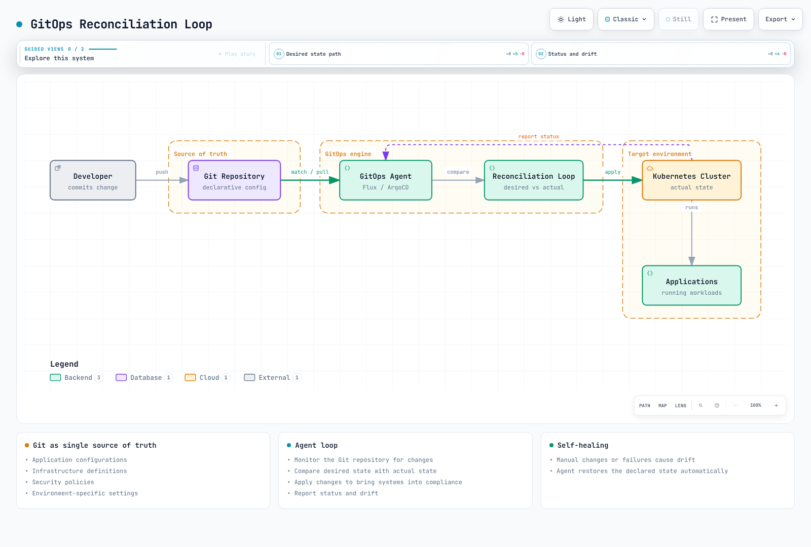
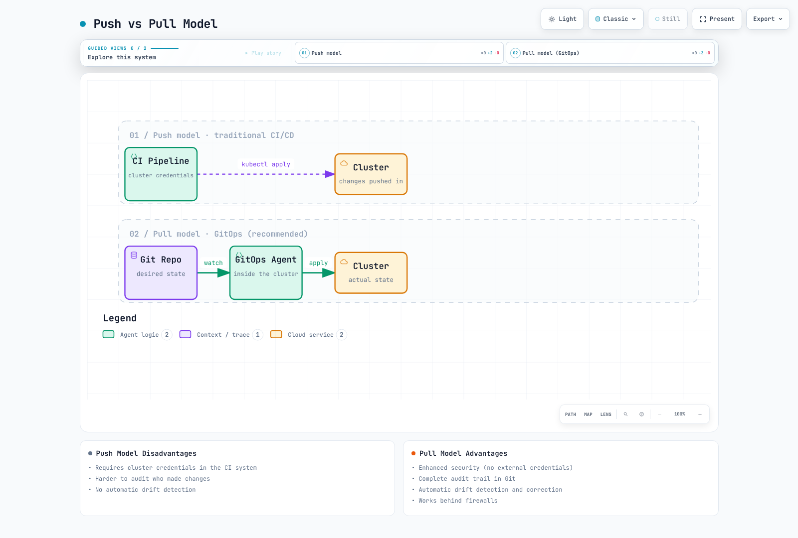
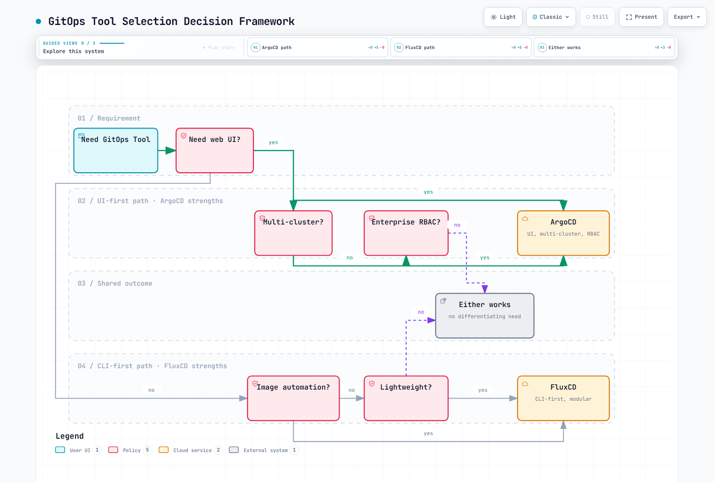
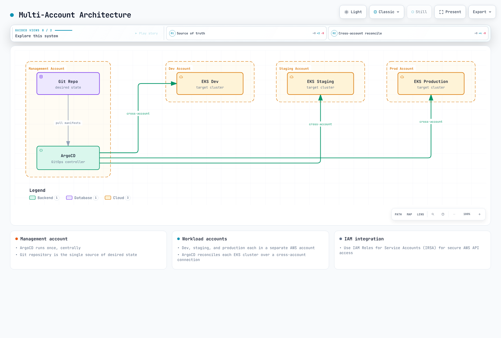

# GitOps

> **Last Updated**: September 11, 2026

## Table of Contents
- [What is GitOps?](#what-is-gitops)
- [Core Principles](#core-principles)
- [Push vs Pull Model](#push-vs-pull-model)
- [GitOps Tools Overview](#gitops-tools-overview)
- [Tool Selection Guide](#tool-selection-guide)
- [GitOps on Amazon EKS](#gitops-on-amazon-eks)
- [Getting Started](#getting-started)

## What is GitOps?

GitOps is an operational framework that applies DevOps best practices for infrastructure automation—such as version control, collaboration, compliance, and CI/CD—to infrastructure management. The term was coined by Weaveworks in 2017 and has since become a CNCF-recognized methodology for cloud-native application deployment.

At its core, GitOps uses Git repositories as the single source of truth for declarative infrastructure and application configurations. Changes to the desired state are made through Git commits, and automated processes ensure the actual system state matches the declared state.



[🔍 View interactive diagram](https://www.atomai.click/kubernetes-docs/archmaps/en-gitops-readme-10.html)

### History and Evolution

| Milestone | Verified project history |
|---|---|
| Flux | CNCF Sandbox July 2019; Incubating March 2021; Graduated November 30, 2022 |
| Argo project | CNCF Incubating March 2020; Graduated December 6, 2022 |
| OpenGitOps | Publishes versioned principles; distinguish released documents from the working main branch |

### CNCF OpenGitOps Definition

The OpenGitOps project defines GitOps through four principles:

1. **Declarative**: A system managed by GitOps must have its desired state expressed declaratively
2. **Versioned and Immutable**: Desired state is stored in a way that enforces immutability, versioning, and retains a complete version history
3. **Pulled Automatically**: Software agents automatically pull the desired state declarations from the source
4. **Continuously Reconciled**: Software agents continuously observe actual system state and attempt to apply the desired state

## Core Principles

Git history records desired configuration. A Git revert does not restore database migrations, deleted data or external state. Argo CD automated sync, prune and selfHeal are separate settings; GitOps describes a control loop attempting reconciliation.

### Declarative Configuration

Everything is defined as code—infrastructure, applications, policies, and configurations. This enables:

- **Reproducibility**: Versioned configuration plus available artifacts, secrets and data enable recreation
- **Auditability**: Retained configuration history; runtime/API audit logs still need collection
- **Consistency**: Shared bases with explicit, reviewed environment differences

```yaml
# Example: Declarative application state
apiVersion: apps/v1
kind: Deployment
metadata:
  name: web-app
  labels:
    app: web-app
    version: v1.2.3
spec:
  replicas: 3
  selector:
    matchLabels:
      app: web-app
  template:
    metadata:
      labels:
        app: web-app
    spec:
      containers:
      - name: web-app
        image: myregistry/web-app:v1.2.3
        ports:
        - containerPort: 8080
```

### Git as Single Source of Truth

Git repositories store the desired state of your entire system:

- **Application configurations**
- **Infrastructure definitions**
- **Security policies**
- **Environment-specific settings**

### Automated Reconciliation

GitOps agents continuously:

1. Monitor the Git repository for changes
2. Compare desired state with actual state
3. Apply changes to bring systems into compliance
4. Report status and drift

### Self-Healing Systems

Reconciliation attempts depend on sync/self-heal policy, permissions and health. For example, Argo CD automated sync and selfHeal require configuration; installation alone does not revert every manual change or recover lost data.

## Push vs Pull Model

Compare traditional push deployment with pull-based GitOps. A CI-only `kubectl apply` pipeline does not by itself satisfy OpenGitOps automatic-pull and continuous-reconciliation principles:



[🔍 View interactive diagram](https://www.atomai.click/kubernetes-docs/archmaps/en-gitops-readme-11.html)

### Push Model

In the traditional push model:
- CI/CD pipeline has direct access to the cluster
- Credentials stored in CI system
- Changes pushed from outside the cluster

**Disadvantages:**
- Requires cluster credentials in CI system
- Harder to audit who made changes
- No automatic drift detection

### Pull Model (Recommended)

In the GitOps pull model:
- Agent runs in the target cluster or a separate management cluster
- Agent pulls changes from Git
- Management-cluster agents still require authorized network/API access to remote targets

**Advantages:**
- Can reduce target-cluster credentials in CI; agents still hold source/API access rights
- Complete audit trail in Git
- Automatic drift detection and correction
- Works behind firewalls

## GitOps Tools Overview

### ArgoCD

[ArgoCD](argocd/README.md) is a declarative, GitOps continuous delivery tool for Kubernetes.

**Key Features:**
- Web UI for visualization
- Multi-cluster support
- SSO integration
- Rollback capabilities
- Health status monitoring
- ApplicationSet for fleet management

**Best For:** Teams wanting visual management, multi-cluster deployments, enterprise features

### FluxCD

FluxCD is a set of continuous delivery solutions for Kubernetes that are open and extensible.

**Key Features:**
- Lightweight and modular
- Native Helm and Kustomize support
- Image automation
- Multi-tenancy
- Notification controllers

**Best For:** Teams preferring CLI-first, lightweight solutions, image automation workflows

### Jenkins X / JayeX

Jenkins X / JayeX provides CI/CD for cloud-native applications on Kubernetes.

**Key Features:**
- Automated CI/CD pipelines
- Preview environments
- GitOps promotion
- Tekton-based pipelines

**Evaluate for:** Integrated CI/CD and preview-environment workflows; JayeX/Jenkins X / JayeX is not simply Jenkins with GitOps enabled

### Comparison Matrix

| Requirement | Argo CD | Flux |
|---|---|---|
| Default UI | Built-in Web UI and CLI | Core controllers/CLI; optional ecosystem UIs |
| Helm behavior | helm template; Argo CD owns resource lifecycle | Helm Controller owns Helm release lifecycle |
| Image updates | Separate Argo CD Image Updater | Optional Image Reflector/Automation controllers |
| Multi-tenancy | AppProjects, RBAC, destination/source restrictions | Kubernetes RBAC, ServiceAccount impersonation, cross-namespace restrictions |
| OCI sources | General OCI/Helm sources; validate layers/media types | OCIRepository/Helm sources; validate verification/layer settings |
| Capacity | Measure application/cluster count and reconcile load | Measure installed controllers, sources and reconcile load |

## Tool Selection Guide

### Choose ArgoCD When:

- You need a visual dashboard for operations
- Multi-cluster management is required
- Enterprise SSO/RBAC is important
- Team prefers UI-based workflows
- You need ApplicationSet for fleet management

### Choose FluxCD When:

- You prefer lightweight, modular architecture
- Image automation is a primary requirement
- CLI-first workflow is preferred
- Resource constraints are a concern
- You need tight Helm controller integration

### Decision Framework

The diagram illustrates selection questions, not exclusive capabilities. Compare current features, authorization boundaries and operational cost with the table and a representative trial.



[🔍 View interactive diagram](https://www.atomai.click/kubernetes-docs/archmaps/en-gitops-readme-12.html)

## GitOps on Amazon EKS

### EKS-Specific Considerations

When implementing GitOps on Amazon EKS:

#### IAM Integration

A ServiceAccount annotation alone does not establish IAM access. Configure the IRSA OIDC provider/trust policy/SDK support or an EKS Pod Identity association. AWS API permissions and target Kubernetes API authentication/RBAC are separate.

Use IAM Roles for Service Accounts (IRSA) for secure AWS API access:

```yaml
apiVersion: v1
kind: ServiceAccount
metadata:
  name: gitops-controller
  annotations:
    eks.amazonaws.com/role-arn: arn:aws:iam::123456789012:role/GitOpsRole
```

#### Multi-Account Architecture



[🔍 View interactive diagram](https://www.atomai.click/kubernetes-docs/archmaps/en-gitops-readme-13.html)

#### AWS Service Integration

GitOps can manage AWS resources through:

- **AWS Controllers for Kubernetes (ACK)**: Native K8s CRDs for AWS services
- **Crossplane**: Multi-cloud resource provisioning
- **Terraform Controller**: Terraform state management via GitOps

### Recommended Architecture

```
├── infrastructure/
│   ├── base/                    # Shared infrastructure
│   │   ├── vpc/
│   │   ├── eks/
│   │   └── iam/
│   └── environments/
│       ├── dev/
│       ├── staging/
│       └── production/
├── applications/
│   ├── base/                    # Application base configs
│   └── overlays/
│       ├── dev/
│       ├── staging/
│       └── production/
└── platform/
    ├── argocd/                  # GitOps tooling
    ├── monitoring/              # Observability stack
    └── security/                # Security policies
```

## Getting Started

### ArgoCD Quick Start

Use a compatible Kubernetes version, an empty dedicated namespace and cluster permissions for CRDs/RBAC. This non-HA installation example pins Argo CD 3.5.2; review the full [installation guide](argocd/01-installation.md) before production. Initial admin credentials must be changed and the bootstrap Secret removed after use.

1. **Install ArgoCD:**
   ```bash
   kubectl create namespace argocd
   kubectl apply --server-side -n argocd -f https://raw.githubusercontent.com/argoproj/argo-cd/v3.5.2/manifests/install.yaml
   ```

2. **Access the UI:**
   ```bash
   kubectl port-forward svc/argocd-server -n argocd 8080:443
   ```

3. **Get initial password:**
   ```bash
   kubectl -n argocd get secret argocd-initial-admin-secret -o jsonpath="{.data.password}" | base64 -d
   ```

For detailed ArgoCD setup, see the [ArgoCD documentation](argocd/README.md).

### FluxCD Quick Start

Prepare `GITHUB_ORG`/`GITOPS_REPOSITORY`, the documented GitHub authentication and Kubernetes permissions. Bootstrap writes to Git and installs cluster controllers. Add `--personal` only for a personal owner and explicitly select optional image-automation controllers when needed.

1. **Install Flux CLI:**
   ```bash
   curl --fail --location https://fluxcd.io/install.sh -o install-flux.sh
   # Review the script and select a supported version before running it.
   sudo bash install-flux.sh
   ```

2. **Bootstrap Flux:**
   ```bash
   flux bootstrap github \
     --owner="$GITHUB_ORG" \
     --repository="$GITOPS_REPOSITORY" \
     --path=clusters/my-cluster
   ```

For detailed FluxCD setup, see the FluxCD documentation.

## Section Navigation

| Topic | Description |
|-------|-------------|
| [ArgoCD](argocd/README.md) | Complete ArgoCD guide with installation, applications, sync strategies, and more |
| [FluxCD](02-fluxcd.md) | FluxCD setup, source controllers, and image automation |

## Further Reading

- [CNCF GitOps Working Group](https://github.com/cncf/tag-app-delivery/tree/main/gitops-wg)
- [OpenGitOps Project](https://opengitops.dev/)
- [GitOps Principles](https://www.gitops.tech/)

## Quiz

To test what you've learned, try the following quizzes:
- [ArgoCD Quiz](../quizzes/gitops/01-argocd-quiz.md)
- [FluxCD Quiz](../quizzes/gitops/02-fluxcd-quiz.md)
- [GitOps Comparison Quiz](../quizzes/gitops/03-gitops-comparison-quiz.md)

### Review Sources

- [OpenGitOps principles](https://github.com/open-gitops/documents/blob/v1.0.0/PRINCIPLES.md)
- [Argo project maturity](https://www.cncf.io/projects/argo/)
- [Flux project maturity](https://www.cncf.io/projects/flux/)
- [Argo CD OCI sources](https://argo-cd.readthedocs.io/en/stable/user-guide/oci/)
- [Argo CD automated sync](https://argo-cd.readthedocs.io/en/stable/user-guide/auto_sync/)
- [Flux multi-tenancy](https://fluxcd.io/flux/installation/configuration/multitenancy/)
- [Flux ecosystem](https://fluxcd.io/ecosystem/)
- [JayeX project](https://jayex.io/v3/about/)
