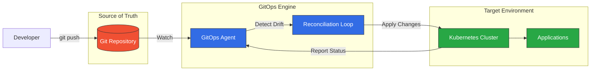
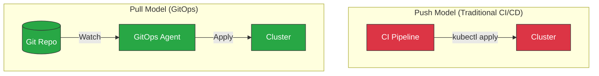
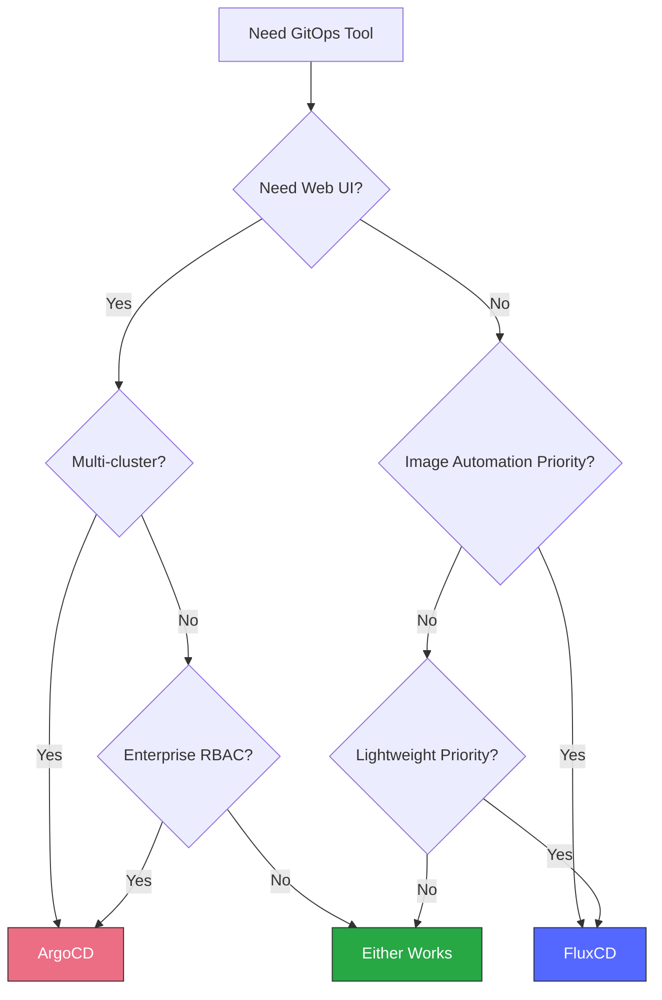
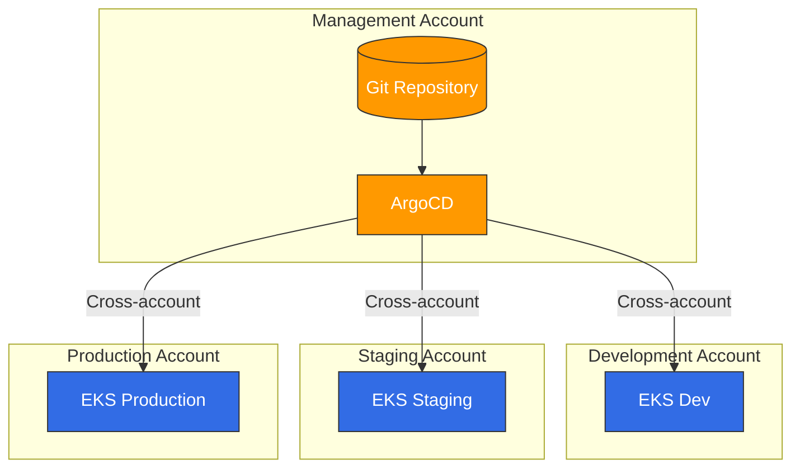

# GitOps

> **Last Updated**: February 21, 2025

## Table of Contents
- [What is GitOps?](#what-is-gitops)
- [Core Principles](#core-principles)
- [Push vs Pull Model](#push-vs-pull-model)
- [GitOps Tools Overview](#gitops-tools-overview)
- [Tool Selection Guide](#tool-selection-guide)
- [GitOps on Amazon EKS](#gitops-on-amazon-eks)
- [Getting Started](#getting-started)

## What is GitOps?

GitOps is an operational framework that applies DevOps best practices for infrastructure automation—such as version control, collaboration, compliance, and CI/CD—to infrastructure management. The term was coined by Weaveworks in 2017 and has since become a CNCF-recognized methodology for cloud-native application deployment.

At its core, GitOps uses Git repositories as the single source of truth for declarative infrastructure and application configurations. Changes to the desired state are made through Git commits, and automated processes ensure the actual system state matches the declared state.



### History and Evolution

| Year | Milestone |
|------|-----------|
| 2017 | Weaveworks coins "GitOps" term |
| 2019 | Flux v1 released, ArgoCD gains popularity |
| 2020 | CNCF accepts Flux as incubating project |
| 2021 | ArgoCD becomes CNCF graduated project |
| 2022 | GitOps Working Group publishes principles |
| 2023 | OpenGitOps project formalizes standards |
| 2024 | GitOps becomes dominant K8s deployment pattern |

### CNCF OpenGitOps Definition

The OpenGitOps project defines GitOps through four principles:

1. **Declarative**: A system managed by GitOps must have its desired state expressed declaratively
2. **Versioned and Immutable**: Desired state is stored in a way that enforces immutability, versioning, and retains a complete version history
3. **Pulled Automatically**: Software agents automatically pull the desired state declarations from the source
4. **Continuously Reconciled**: Software agents continuously observe actual system state and attempt to apply the desired state

## Core Principles

### Declarative Configuration

Everything is defined as code—infrastructure, applications, policies, and configurations. This enables:

- **Reproducibility**: Any environment can be recreated from the Git repository
- **Auditability**: Complete history of all changes with who, what, when, and why
- **Consistency**: Identical configurations across environments

```yaml
# Example: Declarative application state
apiVersion: apps/v1
kind: Deployment
metadata:
  name: web-app
  labels:
    app: web-app
    version: v1.2.3
spec:
  replicas: 3
  selector:
    matchLabels:
      app: web-app
  template:
    metadata:
      labels:
        app: web-app
    spec:
      containers:
      - name: web-app
        image: myregistry/web-app:v1.2.3
        ports:
        - containerPort: 8080
```

### Git as Single Source of Truth

Git repositories store the desired state of your entire system:

- **Application configurations**
- **Infrastructure definitions**
- **Security policies**
- **Environment-specific settings**

### Automated Reconciliation

GitOps agents continuously:

1. Monitor the Git repository for changes
2. Compare desired state with actual state
3. Apply changes to bring systems into compliance
4. Report status and drift

### Self-Healing Systems

When the actual state drifts from the desired state (manual changes, failures, etc.), GitOps agents automatically restore the correct state.

## Push vs Pull Model

GitOps supports two deployment models:



### Push Model

In the traditional push model:
- CI/CD pipeline has direct access to the cluster
- Credentials stored in CI system
- Changes pushed from outside the cluster

**Disadvantages:**
- Requires cluster credentials in CI system
- Harder to audit who made changes
- No automatic drift detection

### Pull Model (Recommended)

In the GitOps pull model:
- Agent runs inside the cluster
- Agent pulls changes from Git
- No external cluster access required

**Advantages:**
- Enhanced security (no external credentials)
- Complete audit trail in Git
- Automatic drift detection and correction
- Works behind firewalls

## GitOps Tools Overview

### ArgoCD

[ArgoCD](argocd/README.md) is a declarative, GitOps continuous delivery tool for Kubernetes.

**Key Features:**
- Web UI for visualization
- Multi-cluster support
- SSO integration
- Rollback capabilities
- Health status monitoring
- ApplicationSet for fleet management

**Best For:** Teams wanting visual management, multi-cluster deployments, enterprise features

### FluxCD

FluxCD is a set of continuous delivery solutions for Kubernetes that are open and extensible.

**Key Features:**
- Lightweight and modular
- Native Helm and Kustomize support
- Image automation
- Multi-tenancy
- Notification controllers

**Best For:** Teams preferring CLI-first, lightweight solutions, image automation workflows

### Jenkins X

Jenkins X provides CI/CD for cloud-native applications on Kubernetes.

**Key Features:**
- Automated CI/CD pipelines
- Preview environments
- GitOps promotion
- Tekton-based pipelines

**Best For:** Teams heavily invested in Jenkins ecosystem

### Comparison Matrix

| Feature | ArgoCD | FluxCD | Jenkins X |
|---------|--------|--------|-----------|
| Web UI | ✅ Rich | ❌ CLI only | ✅ Basic |
| Multi-cluster | ✅ Native | ✅ Via Flux | ✅ Limited |
| Helm Support | ✅ Full | ✅ Full | ✅ Full |
| Kustomize | ✅ Full | ✅ Full | ✅ Limited |
| Image Automation | ⚠️ Limited | ✅ Native | ✅ Native |
| RBAC | ✅ Granular | ⚠️ Basic | ⚠️ Basic |
| Notifications | ✅ Rich | ✅ Rich | ✅ Basic |
| Learning Curve | Medium | Low | High |
| Resource Usage | Medium | Low | High |
| CNCF Status | Graduated | Graduated | Sandbox |

## Tool Selection Guide

### Choose ArgoCD When:

- You need a visual dashboard for operations
- Multi-cluster management is required
- Enterprise SSO/RBAC is important
- Team prefers UI-based workflows
- You need ApplicationSet for fleet management

### Choose FluxCD When:

- You prefer lightweight, modular architecture
- Image automation is a primary requirement
- CLI-first workflow is preferred
- Resource constraints are a concern
- You need tight Helm controller integration

### Decision Framework



## GitOps on Amazon EKS

### EKS-Specific Considerations

When implementing GitOps on Amazon EKS:

#### IAM Integration

Use IAM Roles for Service Accounts (IRSA) for secure AWS API access:

```yaml
apiVersion: v1
kind: ServiceAccount
metadata:
  name: gitops-controller
  annotations:
    eks.amazonaws.com/role-arn: arn:aws:iam::123456789012:role/GitOpsRole
```

#### Multi-Account Architecture



#### AWS Service Integration

GitOps can manage AWS resources through:

- **AWS Controllers for Kubernetes (ACK)**: Native K8s CRDs for AWS services
- **Crossplane**: Multi-cloud resource provisioning
- **Terraform Controller**: Terraform state management via GitOps

### Recommended Architecture

```
├── infrastructure/
│   ├── base/                    # Shared infrastructure
│   │   ├── vpc/
│   │   ├── eks/
│   │   └── iam/
│   └── environments/
│       ├── dev/
│       ├── staging/
│       └── production/
├── applications/
│   ├── base/                    # Application base configs
│   └── overlays/
│       ├── dev/
│       ├── staging/
│       └── production/
└── platform/
    ├── argocd/                  # GitOps tooling
    ├── monitoring/              # Observability stack
    └── security/                # Security policies
```

## Getting Started

### ArgoCD Quick Start

1. **Install ArgoCD:**
   ```bash
   kubectl create namespace argocd
   kubectl apply -n argocd -f https://raw.githubusercontent.com/argoproj/argo-cd/stable/manifests/install.yaml
   ```

2. **Access the UI:**
   ```bash
   kubectl port-forward svc/argocd-server -n argocd 8080:443
   ```

3. **Get initial password:**
   ```bash
   kubectl -n argocd get secret argocd-initial-admin-secret -o jsonpath="{.data.password}" | base64 -d
   ```

For detailed ArgoCD setup, see the [ArgoCD documentation](argocd/README.md).

### FluxCD Quick Start

1. **Install Flux CLI:**
   ```bash
   curl -s https://fluxcd.io/install.sh | sudo bash
   ```

2. **Bootstrap Flux:**
   ```bash
   flux bootstrap github \
     --owner=<org> \
     --repository=<repo> \
     --path=clusters/my-cluster
   ```

For detailed FluxCD setup, see the FluxCD documentation.

## Section Navigation

| Topic | Description |
|-------|-------------|
| [ArgoCD](argocd/README.md) | Complete ArgoCD guide with installation, applications, sync strategies, and more |
| FluxCD | FluxCD setup, source controllers, and image automation |

## Further Reading

- [CNCF GitOps Working Group](https://github.com/cncf/tag-app-delivery/tree/main/gitops-wg)
- [OpenGitOps Project](https://opengitops.dev/)
- [GitOps Principles](https://www.gitops.tech/)

## Quiz

To test what you've learned, try the [GitOps overview quiz](../quizzes/gitops/README-quiz.md).
