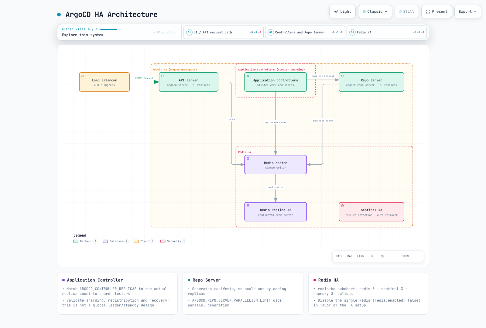

# ArgoCD Installation

> **Supported Versions**: Argo CD 3.5.2 / Helm Chart 10.8.4
> **Last Updated**: September 11, 2026

## Table of Contents
- [Prerequisites](#prerequisites)
- [Installation Methods](#installation-methods)
- [CLI Installation](#cli-installation)
- [Initial Access](#initial-access)
- [High Availability Setup](#high-availability-setup)
- [ArgoCD on Amazon EKS](#argocd-on-amazon-eks)
- [Declarative Setup](#declarative-setup)
- [Upgrading ArgoCD](#upgrading-argocd)

## Prerequisites

This is a self-managed installation guide. EKS managed Argo CD uses separate capability creation, authorization and configuration; do not overlay a self-managed installation there. Check the [overview compatibility table](README.md) and EKS support windows. A chart's minimum kubeVersion is not a tested/support guarantee.

Permission to create a namespace does not prove permissions for CRDs, ClusterRoles and bindings. Check the actual context/authorization. The HA bundle requires at least three nodes for anti-affinity. Measure CPU/memory for application, cluster and repository scale; a fixed 10/50GB Redis PVC is not universally required.

```bash
kubectl version --client
kubectl config current-context
kubectl cluster-info
kubectl auth can-i create customresourcedefinitions.apiextensions.k8s.io
kubectl auth can-i create clusterrolebindings.rbac.authorization.k8s.io
```

## Installation Methods

Choose one installation owner: manifests, Helm or Kustomize. The non-HA/HA commands below are alternatives, not sequential steps. A custom namespace also requires updating ServiceAccount subjects in ClusterRoleBindings.

### Method 1: Plain Manifests (Recommended for Getting Started)

The simplest installation method using official manifests:

```bash
# Create namespace
kubectl create namespace argocd

# Install ArgoCD (non-HA)
kubectl apply --server-side -n argocd -f https://raw.githubusercontent.com/argoproj/argo-cd/v3.5.2/manifests/install.yaml

```

For high availability:

```bash
# Install HA manifests
kubectl apply --server-side -n argocd -f https://raw.githubusercontent.com/argoproj/argo-cd/v3.5.2/manifests/ha/install.yaml
```

### Method 2: Helm Chart (Recommended for Production)

The Helm chart provides more configuration options:

```bash
# Add Argo Helm repository
helm repo add argo https://argoproj.github.io/argo-helm
helm repo update

# Install with default values
helm install argocd argo/argo-cd --version 10.8.4 \
  --namespace argocd \
  --create-namespace

# Install with custom values
helm install argocd argo/argo-cd --version 10.8.4 \
  --namespace argocd \
  --create-namespace \
  --values values.yaml
```

Example `values.yaml` for production:

These are HA starting values to tune under real load. The chart configures controller shard count and ApplicationSet leader election; Dex remains at one replica. Choose either default or custom installation. Review `helm template` output first; enable ServiceMonitor only if Operator CRDs are installed.

```yaml
fullnameOverride: argocd
global:
  domain: argocd.example.com
configs:
  params:
    server.insecure: false
  cm:
    url: https://argocd.example.com
    users.anonymous.enabled: 'false'
    exec.enabled: 'false'
controller:
  replicas: 2
  resources:
    requests:
      cpu: 250m
      memory: 512Mi
    limits:
      cpu: '1'
      memory: 2Gi
  pdb:
    enabled: true
    minAvailable: 1
server:
  replicas: 2
  service:
    type: ClusterIP
  ingress:
    enabled: false
  resources:
    requests:
      cpu: 100m
      memory: 128Mi
    limits:
      cpu: 500m
      memory: 512Mi
  pdb:
    enabled: true
    minAvailable: 1
repoServer:
  replicas: 2
  resources:
    requests:
      cpu: 100m
      memory: 256Mi
    limits:
      cpu: '1'
      memory: 1Gi
  pdb:
    enabled: true
    minAvailable: 1
applicationSet:
  replicas: 2
  pdb:
    enabled: true
    minAvailable: 1
notifications:
  enabled: true
redis:
  enabled: false
redis-ha:
  enabled: true
  replicas: 3
  persistentVolume:
    enabled: false
  haproxy:
    enabled: true
    replicas: 3
```

### Method 3: Kustomize

For GitOps-managed ArgoCD installations:

```yaml
# kustomization.yaml
apiVersion: kustomize.config.k8s.io/v1beta1
kind: Kustomization

namespace: argocd

resources:
  - https://raw.githubusercontent.com/argoproj/argo-cd/v3.5.2/manifests/install.yaml

patches:
  - patch: |-
      - op: replace
        path: /spec/template/spec/containers/0/resources
        value:
          requests:
            cpu: 500m
            memory: 512Mi
          limits:
            cpu: 2000m
            memory: 2Gi
    target:
      kind: Deployment
      name: argocd-server

configMapGenerator:
  - name: argocd-cm
    behavior: merge
    literals:
      - url=https://argocd.example.com
```

Apply with:

```bash
kubectl apply --server-side -k .
```

## CLI Installation

### Linux / macOS

Save the following as a script and run it. Match CPU architecture/server version and verify official release checksums. Homebrew is an alternative on macOS; check its installed version.

```bash
#!/usr/bin/env bash
set -euo pipefail
ARGOCD_VERSION=v3.5.2
case "$(uname -s)" in
  Linux) ARGOCD_OS=linux ;;
  Darwin) ARGOCD_OS=darwin ;;
  *) echo 'Select the release package for your OS' >&2; exit 1 ;;
esac
case "$(uname -m)" in
  x86_64) ARGOCD_ARCH=amd64 ;;
  arm64|aarch64) ARGOCD_ARCH=arm64 ;;
  *) echo 'Select a supported release architecture' >&2; exit 1 ;;
esac
ARGOCD_BINARY="argocd-${ARGOCD_OS}-${ARGOCD_ARCH}"
ARGOCD_INSTALL_TMP=$(mktemp -d)
trap 'rm -rf -- "$ARGOCD_INSTALL_TMP"' EXIT
cd "$ARGOCD_INSTALL_TMP"
curl --fail --location --remote-name \
  "https://github.com/argoproj/argo-cd/releases/download/${ARGOCD_VERSION}/${ARGOCD_BINARY}"
curl --fail --location --remote-name \
  "https://github.com/argoproj/argo-cd/releases/download/${ARGOCD_VERSION}/cli_checksums.txt"
EXPECTED=$(awk -v name="$ARGOCD_BINARY" '$2 == name || $2 == "*" name {print $1}' cli_checksums.txt)
[[ "$EXPECTED" =~ ^[a-f0-9]{64}$ ]]
if command -v sha256sum >/dev/null; then
  ACTUAL=$(sha256sum "$ARGOCD_BINARY" | awk '{print $1}')
else
  ACTUAL=$(shasum -a 256 "$ARGOCD_BINARY" | awk '{print $1}')
fi
[[ "$ACTUAL" == "$EXPECTED" ]]
sudo install -m 0755 "$ARGOCD_BINARY" /usr/local/bin/argocd
argocd version --client
```

### Windows

Download `argocd-windows-amd64.exe` and `cli_checksums.txt` from the v3.5.2 release. Compare `Get-FileHash -Algorithm SHA256` with the matching checksum entry. Install in a user-owned directory and add it to the user PATH instead of using System32 as the default.

### Completion

```bash
# Bash session
source <(argocd completion bash)
# Zsh alternative:
# source <(argocd completion zsh)
```

## Initial Access

### Option 1: Port Forwarding (Development)

```bash
# Forward API server port
kubectl port-forward svc/argocd-server -n argocd 8080:443

# Access at https://localhost:8080
```

### Ingress Access

Use a maintained controller, a valid certificate and an intentional access boundary. Community ingress-nginx retired in March 2026 and is not the new default here. The EKS section below gives a consistent internal ALB/HTTPS-backend example; follow another controller's documentation for passthrough/gRPC.

### Retrieve Initial Password

```bash
# Get the auto-generated admin password
kubectl -n argocd get secret argocd-initial-admin-secret \
  -o jsonpath="{.data.password}" | base64 -d && echo
```

### Login

```bash
# CLI login
argocd login argocd.example.com

# Or with port-forwarding
argocd login localhost:8080

# Use the interactive password prompt
argocd login localhost:8080 --username admin
```

### Change Admin Password

```bash
# Update password interactively
argocd account update-password

# Delete the initial secret after changing password
kubectl -n argocd delete secret argocd-initial-admin-secret
```

## High Availability Setup

### HA Architecture



[🔍 View interactive diagram](https://www.atomai.click/kubernetes-docs/archmaps/en-gitops-argocd-01-installation-0.html)

Check the following in the rendered Helm example.

- Application Controller distributes clusters among shards rather than using one global leader and standbys. The chart aligns replica count with `ARGOCD_CONTROLLER_REPLICAS`. Validate algorithm, redistribution and recovery; dynamic distribution is a separate feature.
- ApplicationSet leader election differs from Application Controller sharding. This chart enables leader election for multiple ApplicationSet replicas.
- Bundled Dex uses in-memory storage; adding replicas can create inconsistent data. Keep its default single replica and validate a supported design for additional HA requirements.
- Redis is a disposable cache; Kubernetes objects persist Argo configuration. Redis HA replica count is `redis-ha.replicas`, not `redis-ha.redis.replicas`. The bundle uses three Redis/Sentinel instances.
- PDBs limit voluntary eviction, not node failures or every rollout. Test distribution, readiness, dependencies and reconciliation recovery.
- Tune Repo Server concurrency, HPA and CPU limits from real manifest-generation/memory load. There is no universal “100 apps means two shards” threshold.

## ArgoCD on Amazon EKS

### ALB and TLS

This example uses an internal ALB. Prepare AWS Load Balancer Controller, subnets/tags/security groups, DNS and a valid same-region ACM certificate. Replace the certificate placeholder/hostname and provide the management client with network access to the ALB.

```yaml
apiVersion: networking.k8s.io/v1
kind: Ingress
metadata:
  name: argocd-server
  namespace: argocd
  annotations:
    alb.ingress.kubernetes.io/scheme: internal
    alb.ingress.kubernetes.io/target-type: ip
    alb.ingress.kubernetes.io/backend-protocol: HTTPS
    alb.ingress.kubernetes.io/healthcheck-protocol: HTTPS
    alb.ingress.kubernetes.io/healthcheck-path: /healthz
    alb.ingress.kubernetes.io/listen-ports: '[{"HTTPS":443}]'
    alb.ingress.kubernetes.io/certificate-arn: REPLACE_WITH_ACM_CERTIFICATE_ARN
    alb.ingress.kubernetes.io/ssl-policy: ELBSecurityPolicy-TLS13-1-2-2021-06
spec:
  ingressClassName: alb
  rules:
  - host: argocd.example.com
    http:
      paths:
      - path: /
        pathType: Prefix
        backend:
          service:
            name: argocd-server
            port:
              number: 443
```

Keep `server.insecure=false` because the backend uses HTTPS. Use `--grpc-web` for CLI traffic through this single HTTP target group. Native gRPC requires a separate gRPC target group and routing conditions as documented upstream.

```bash
argocd login argocd.example.com --grpc-web
```

### IRSA and Function-Specific Permissions

An IAM annotation alone does not configure AWS integrations or token renewal. Distinguish the actual identity for each function.

| Function | Identity |
|---|---|
| Deploy to another EKS API | Controller and required ApplicationSet/Server management role → target AssumeRole → EKS Access Entry/RBAC |
| Read OCI/Helm sources | Actual Repo Server registry authentication, credential provider and token renewal |
| Discover images/update Git | Separate Image Updater |
| Read Secrets Manager | Role of the actual AWS caller, such as External Secrets |
| Pull Pod images | Node role or Fargate execution role |

IRSA needs an OIDC provider and aud/sub-constrained trust; Pod Identity needs the agent, association and supported SDK. Limit target trust and management-role AssumeRole permissions to intended ARNs. Separately configure target EKS access entries, namespace authorization and API connectivity. Recreate affected Pods after changing workload identity where required.

### Declarative EKS Cluster Registration

After establishing roles and permissions, register using the real endpoint and CA. Explicitly select the management-cluster kubeconfig context.

```bash
# IAM roles, trust relationships and target EKS access/RBAC must already exist.
set -euo pipefail
: "${ARGOCD_CONTEXT:?Set the management cluster kubeconfig context}"
: "${TARGET_EKS_NAME:?Set the target EKS cluster name}"
: "${TARGET_AWS_REGION:?Set the target region}"
: "${TARGET_ROLE_ARN:?Set the authorized target-cluster IAM role}"
umask 077
aws eks describe-cluster --name "$TARGET_EKS_NAME" --region "$TARGET_AWS_REGION" \
  --query 'cluster.{name:name,server:endpoint,ca:certificateAuthority.data}' \
  --output json > target-eks.json
jq --arg role "$TARGET_ROLE_ARN" '{
  apiVersion:"v1", kind:"Secret",
  metadata:{name:"target-eks",namespace:"argocd",
    labels:{"argocd.argoproj.io/secret-type":"cluster"}},
  type:"Opaque",
  data:{name:(.name|@base64),server:(.server|@base64),config:({
    awsAuthConfig:{clusterName:.name,roleARN:$role},
    tlsClientConfig:{insecure:false,caData:.ca}
  }|tojson|@base64)}
}' target-eks.json > target-cluster-secret.json
kubectl --context "$ARGOCD_CONTEXT" apply -f target-cluster-secret.json
argocd cluster list
```

Imperative `argocd cluster add` accepts a kubeconfig context name. An EKS default context may be an ARN, but this is not an AWS API accepting arbitrary ARNs. It may create target ServiceAccount/RBAC objects; scope them to the required namespaces and permissions.

## Declarative Setup

For Helm, manage `configs.cm`/`configs.params` in values. For manifests, merge required keys below with existing settings. Avoid Helm and a separate kubectl owner competing over the same fields.

```yaml
apiVersion: v1
kind: ConfigMap
metadata:
  name: argocd-cm
  namespace: argocd
  labels:
    app.kubernetes.io/part-of: argocd
data:
  url: https://argocd.example.com
  users.anonymous.enabled: "false"
  exec.enabled: "false"
---
apiVersion: v1
kind: ConfigMap
metadata:
  name: argocd-cmd-params-cm
  namespace: argocd
  labels:
    app.kubernetes.io/part-of: argocd
data:
  server.insecure: "false"
```

Set admin.enabled=false only after testing SSO authorization and recovery access. Design any /argocd subpath together with ingress routes and server.rootpath/basehref; it is not a default requirement. Command-line/environment settings may require a component rollout.

Prefer built-in health checks for supported resources such as Rollouts. Custom Lua must return a valid state even when status is absent; do not equate unknown with Healthy. Custom Kustomize versions require `kustomize.path.<version>` plus the actual executable. Use repository Secrets below instead of legacy repositories/repository.credentials ConfigMap fields.

### Repository Credentials

These examples bootstrap Secrets from protected files. Supply actual users/repositories/App IDs and only the required read permissions. Do not commit tokens, private keys or base64 Secrets to Git. Use one owner, such as External Secrets, for ongoing rotation.

#### HTTPS credential template

```bash
set -euo pipefail
# Bootstrap one credential method; use an external secret manager for rotation.
# Credential files must contain only their value, without an accidental trailing newline.
kubectl -n argocd create secret generic github-repo-creds \
  --from-literal=url=https://github.com/myorg/ \
  --from-file=username=/secure/path/github-user \
  --from-file=password=/secure/path/github-token
kubectl -n argocd label secret github-repo-creds \
  argocd.argoproj.io/secret-type=repo-creds
```

repo-creds is a URL-prefix credential template; repository registers one repository. Check precedence when a repository already has explicit credentials.

#### SSH

```bash
set -euo pipefail
kubectl -n argocd create secret generic private-repo-ssh \
  --from-literal=type=git \
  --from-literal=url=git@github.com:myorg/private-repo.git \
  --from-file=sshPrivateKey=/secure/path/id_ed25519
kubectl -n argocd label secret private-repo-ssh \
  argocd.argoproj.io/secret-type=repository
```

Verify the SSH server host key through a trusted channel before adding it to known hosts; do not trust an unverified key scan.

#### GitHub App

```bash
set -euo pipefail
kubectl -n argocd create secret generic github-app-creds \
  --from-literal=url=https://github.com/myorg/ \
  --from-literal=githubAppID=123456 \
  --from-literal=githubAppInstallationID=12345678 \
  --from-file=githubAppPrivateKey=/secure/path/github-app.pem
kubectl -n argocd label secret github-app-creds \
  argocd.argoproj.io/secret-type=repo-creds
```

## Upgrading ArgoCD

### Pre-Upgrade Checklist

Review every relevant breaking-change guide from the installed version to the target, and test in staging. Do not assume a direct 2.x-to-3.5 version substitution is sufficient. Keep the same installation owner. Encrypt and restrict access to Secret backups; they are not safe to commit to Git.

1. **Review release notes** for breaking changes
2. **Backup current installation**:
   ```bash
   umask 077
   kubectl get applications,applicationsets -n argocd -o yaml > applications-backup.yaml
   kubectl get appprojects -n argocd -o yaml > projects-backup.yaml
   kubectl get secrets -n argocd -l argocd.argoproj.io/secret-type -o yaml > secrets-backup.yaml
   ```
3. **Check cluster compatibility**, chart values, target-cluster permissions and rollback/restore procedures. Configuration backup does not back up application databases.

### Upgrade via Manifests

```bash
# Apply new version manifests
kubectl apply --server-side -n argocd -f https://raw.githubusercontent.com/argoproj/argo-cd/v3.5.2/manifests/install.yaml

# Wait for rollout
kubectl rollout status deployment argocd-server -n argocd
kubectl rollout status deployment argocd-repo-server -n argocd
kubectl rollout status statefulset/argocd-application-controller -n argocd
```

### Upgrade via Helm

```bash
# Update repo
helm repo update

# Check available versions
helm search repo argo/argo-cd --versions

# Upgrade
helm upgrade argocd argo/argo-cd \
  --namespace argocd \
  --values values.yaml \
  --version 10.8.4
```

### Post-Upgrade Verification

```bash
# Verify versions
argocd version

# Check all applications sync status
argocd app list

# Verify component health
kubectl get pods -n argocd
```

## Troubleshooting Installation

### Common Issues

**Pods not starting:**
```bash
# Check pod events
kubectl describe pod -n argocd -l app.kubernetes.io/name=argocd-server

# Check logs
kubectl logs -n argocd -l app.kubernetes.io/name=argocd-server --tail=100
```

**Repository connection failed:**
```bash
# Test repository access
argocd repo list
argocd repo get https://github.com/myorg/myrepo.git
```

**Certificate issues:**
```bash
# Check TLS certificates
# Select the Secret actually used by the server (argocd-server-tls or its configured fallback).
: "${ARGOCD_TLS_SECRET:?Set the actual TLS Secret name}"
kubectl get secret -n argocd "$ARGOCD_TLS_SECRET" -o jsonpath='{.data.tls\.crt}' \
  | base64 -d | openssl x509 -noout -dates -subject -issuer
# An ALB frontend ACM certificate is a separate TLS layer.
```

## Quiz

To test what you've learned, try the [ArgoCD installation quiz](../../quizzes/gitops/argocd/01-installation-quiz.md).

### Review Sources

- [Argo CD 3.5.2 installation](https://github.com/argoproj/argo-cd/blob/v3.5.2/docs/operator-manual/installation.md)
- [Argo CD HA](https://github.com/argoproj/argo-cd/blob/v3.5.2/docs/operator-manual/high_availability.md)
- [EKS and repository setup](https://github.com/argoproj/argo-cd/blob/v3.5.2/docs/operator-manual/declarative-setup.md)
- [Ingress and gRPC](https://github.com/argoproj/argo-cd/blob/v3.5.2/docs/operator-manual/ingress.md)
- [Chart 10.8.4](https://github.com/argoproj/argo-helm/releases/tag/argo-cd-10.8.4)
- [Ingress NGINX retirement](https://kubernetes.io/blog/2025/11/11/ingress-nginx-retirement/)
