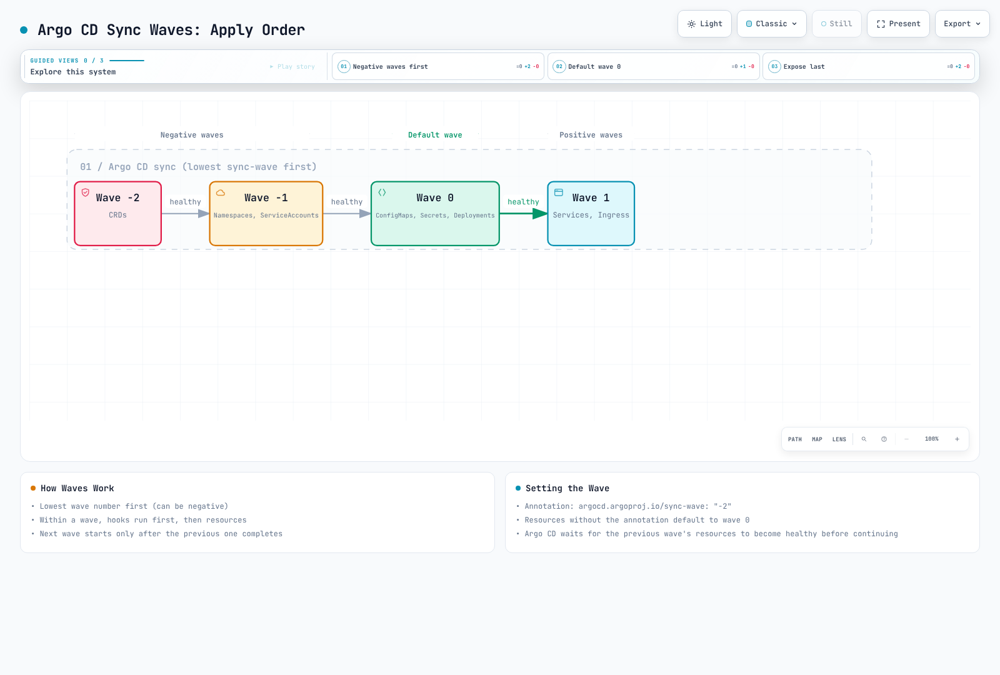
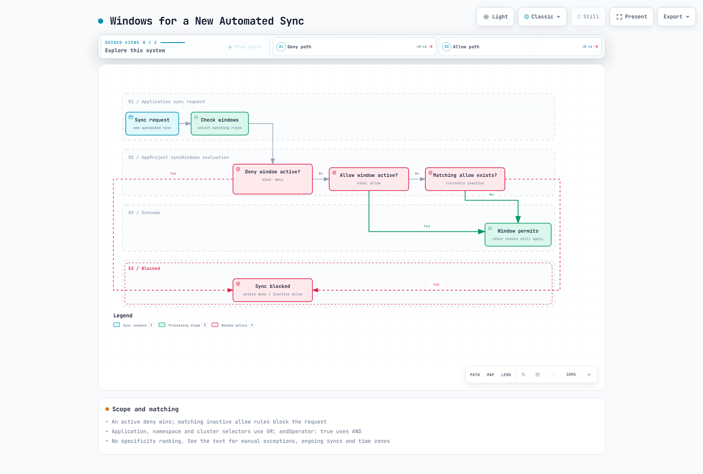

# ArgoCD Sync Strategies

> **Supported Versions**: Argo CD 3.5.2
> **Last Updated**: September 11, 2026

## Table of Contents
- [Manual vs Automated Sync](#manual-vs-automated-sync)
- [Auto-Sync Policies](#auto-sync-policies)
- [Sync Options](#sync-options)
- [Sync Waves and Phases](#sync-waves-and-phases)
- [Sync Windows](#sync-windows)
- [Diffing Customization](#diffing-customization)
- [Retry Policies](#retry-policies)
- [Selective Sync](#selective-sync)

## Manual vs Automated Sync

Examples are independent policy fragments. Keep a real Application's source/destination/project and select only needed options. Sync applies changes; Refresh updates comparison from sources/cache. Synced is separate from health and actual service availability.

ArgoCD supports two synchronization modes: manual and automated.

### Manual Sync

In manual mode, users must explicitly trigger synchronization:

```yaml
apiVersion: argoproj.io/v1alpha1
kind: Application
metadata:
  name: manual-sync-app
  namespace: argocd
spec:
  project: default
  source:
    repoURL: https://github.com/myorg/myrepo.git
    targetRevision: HEAD
    path: manifests
  destination:
    server: https://kubernetes.default.svc
    namespace: my-app
  # No syncPolicy.automated = manual sync
```

Triggering manual sync:

```bash
# Via CLI
argocd app sync my-app

# Sync specific resources only
argocd app sync my-app --resource 'apps:Deployment:my-deployment'

# Preview changes; pruning and force are separate, potentially destructive decisions
argocd app sync my-app --dry-run
```

### Automated Sync

In automated mode, ArgoCD automatically syncs when changes are detected:

```yaml
apiVersion: argoproj.io/v1alpha1
kind: Application
metadata:
  name: auto-sync-app
  namespace: argocd
spec:
  project: default
  source:
    repoURL: https://github.com/myorg/myrepo.git
    targetRevision: HEAD
    path: manifests
  destination:
    server: https://kubernetes.default.svc
    namespace: my-app
  syncPolicy:
    automated: {}  # Enable auto-sync with defaults
```


[🔍 View interactive diagram](https://www.atomai.click/kubernetes-docs/archmaps/en-gitops-argocd-03-sync-strategies-0.html)

## Auto-Sync Policies

automated: {} or an omitted/null enabled flag enables auto-sync; enabled: false disables it. Live-only drift correction requires selfHeal, and prune is separate. Failed identical commit/parameter combinations are not retried forever by default; configure retry policy. Change the owning template for ApplicationSet-managed Applications.

### Prune

Automatically delete resources that no longer exist in Git:

```yaml
syncPolicy:
  automated:
    prune: true
```

**Use case**: Ensure cluster state exactly matches Git repository. Removes orphaned resources.

Prune affects the Application's tracked resources, not every orphan in the cluster. PruneLast changes ordering; it does not protect data or replace review of deletions.

### Self-Heal

Automatically revert manual changes made to the cluster:

```yaml
syncPolicy:
  automated:
    selfHeal: true
```

**Use case**: Prevent configuration drift from manual kubectl changes or other tools.


[🔍 View interactive diagram](https://www.atomai.click/kubernetes-docs/archmaps/en-gitops-argocd-03-sync-strategies-1.html)

### Allow Empty

Allow applications with no resources:

```yaml
syncPolicy:
  automated:
    allowEmpty: true
```

With automated prune enabled, allowEmpty can permit deleting every managed resource when rendering returns an empty set. It is not a generic bootstrap requirement.

### Complete Auto-Sync Configuration

```yaml
apiVersion: argoproj.io/v1alpha1
kind: Application
metadata:
  name: fully-automated-app
  namespace: argocd
spec:
  project: default
  source:
    repoURL: https://github.com/myorg/myrepo.git
    targetRevision: HEAD
    path: manifests
  destination:
    server: https://kubernetes.default.svc
    namespace: my-app
  syncPolicy:
    automated:
      prune: true        # Remove orphaned resources
      selfHeal: true     # Revert manual changes
      allowEmpty: false  # Prevent auto-prune from deleting everything on an empty render
```

## Sync Options

Sync options provide fine-grained control over synchronization behavior.

### Available Sync Options

| Option | Description | Default |
|--------|-------------|---------|
| `Validate` | Validate resources against schema | true |
| `CreateNamespace` | Create namespace if missing | false |
| `PrunePropagationPolicy` | Deletion propagation policy | foreground |
| `PruneLast` | Prune after all other syncs | false |
| `Replace` | Use replace instead of apply | false |
| `FailOnSharedResource` | Fail if another Argo CD Application tracks the resource | false |
| `ApplyOutOfSyncOnly` | Only apply out-of-sync resources | false |
| `ServerSideApply` | Use server-side apply | false |
| `RespectIgnoreDifferences` | Respect ignoreDifferences in sync | false |

`Validate=false` skips apply-time schema validation; it does not install a missing CRD. Argo CD automatically skips a CR's dry run when its CRD is installed in the same sync. Use `SkipDryRunOnMissingResource=true` only for a justified case such as a CRD created by another controller, and verify that the CRD is available.

`PruneLast=true` schedules pruning in a final implicit wave after other resources are deployed and Healthy. `FailOnSharedResource=true` checks tracking by another Argo CD Application; it does not detect every ownership conflict with other Kubernetes controllers or Flux.

### Application-Level Options

```yaml
apiVersion: argoproj.io/v1alpha1
kind: Application
metadata:
  name: my-app
  namespace: argocd
spec:
  project: default
  source:
    repoURL: https://github.com/myorg/myrepo.git
    targetRevision: main
    path: manifests
  destination:
    server: https://kubernetes.default.svc
    namespace: my-app
  syncPolicy:
    syncOptions:
      - CreateNamespace=true
      - PrunePropagationPolicy=foreground
      - PruneLast=true
      - Validate=true
      - ApplyOutOfSyncOnly=true
```

### Resource-Level Options

Apply sync options to specific resources via annotations:

```yaml
# Merge into an existing complete resource manifest.
metadata:
  annotations:
    argocd.argoproj.io/sync-options: ServerSideApply=true
```

### Server-Side Apply

Argo CD 3.5.2 invokes --server-side --force-conflicts. Field ownership is tracked, but this is not a guarantee that conflicts will be rejected; review possible ownership takeover.

Use Kubernetes server-side apply for better conflict detection:

```yaml
syncPolicy:
  syncOptions:
    - ServerSideApply=true
```

Or per resource:

```yaml
metadata:
  annotations:
    argocd.argoproj.io/sync-options: ServerSideApply=true
```

**Benefits**:
- Better field ownership tracking
- Ownership conflicts can be force-resolved by Argo CD; inspect the intended manager boundaries
- Works well with CRDs and webhooks

### Replace and Force

Replace selects kubectl replace/create. It does not automatically make immutable fields editable. Force=true with Replace=true can delete/recreate objects and is a separate destructive choice:

```yaml
metadata:
  annotations:
    argocd.argoproj.io/sync-options: Replace=true
```

Immutable changes need a resource-specific migration/recreation plan. Do not use this as a shortcut for PVC storage-class migration. Review retention/data/availability before deletion. Replace takes precedence over ServerSideApply.

## Sync Waves and Phases

Sync waves control the order in which resources are applied.

### How Waves Work

Resources are grouped by wave number and synced in order:
1. Sort by phase, then wave, kind and name.
2. A negative Sync wave does not run before the PreSync phase.
3. Wave advancement follows sync/health state; do not depend on same-wave physical concurrency for dependencies. Custom resources need meaningful health checks when readiness must block later work.



[🔍 View interactive diagram](https://www.atomai.click/kubernetes-docs/archmaps/en-gitops-argocd-03-sync-strategies-2.html)

### Setting Sync Wave

Merge this fragment into the metadata of a complete resource manifest. A complete example follows.

```yaml
metadata:
  annotations:
    argocd.argoproj.io/sync-wave: "-1"
```

### Combining Waves with Hooks

PreSync runs before every ordinary Sync wave. The existing service, namespace, DB Secret and migration image below must already be prepared; a PreSync cannot assume access to a database created in a later Sync wave.

```yaml
apiVersion: batch/v1
kind: Job
metadata:
  name: dependency-preflight
  annotations:
    argocd.argoproj.io/hook: PreSync
    argocd.argoproj.io/sync-wave: "-5"
    argocd.argoproj.io/hook-delete-policy: BeforeHookCreation,HookSucceeded
spec:
  backoffLimit: 0
  activeDeadlineSeconds: 60
  template:
    spec:
      restartPolicy: Never
      automountServiceAccountToken: false
      containers:
      - name: check
        image: curlimages/curl:8.22.0
        command: ["curl"]
        args: ["--fail", "--show-error", "--silent", "--connect-timeout", "5", "--max-time", "20", "http://existing-data-service:8080/health"]
---
apiVersion: batch/v1
kind: Job
metadata:
  name: db-migration
  annotations:
    argocd.argoproj.io/hook: PreSync
    argocd.argoproj.io/sync-wave: "-3"
    argocd.argoproj.io/hook-delete-policy: BeforeHookCreation,HookSucceeded
spec:
  backoffLimit: 0
  activeDeadlineSeconds: 300
  template:
    spec:
      restartPolicy: Never
      containers:
      - name: migrate
        image: myapp/migrations:v1.0.0
        command: ["./migrate.sh"]
        env:
        - name: DATABASE_URL
          valueFrom:
            secretKeyRef:
              name: existing-db-credentials
              key: url
```

A Job that only prints pg_dump to stdout is not a restorable backup procedure. Use persistent encrypted storage, completion verification and restore testing. Validate migration idempotence/locking/recovery; PostSync failure is not automatic rollback.

### Minimal Working Ordering Example

This minimal example orders Namespace → ConfigMap → Service → a Deployment with readiness within the same Sync phase. A Healthy Service object does not prove ready endpoints; the Deployment probe checks workload readiness. Prepare Argo Project/RBAC and image-registry access.

```yaml
apiVersion: v1
kind: Namespace
metadata:
  name: wave-demo
  annotations:
    argocd.argoproj.io/sync-wave: "-2"
---
apiVersion: v1
kind: ConfigMap
metadata:
  name: wave-demo-config
  namespace: wave-demo
  annotations:
    argocd.argoproj.io/sync-wave: "-1"
data:
  DEMO_ENVIRONMENT: demo
---
apiVersion: v1
kind: Service
metadata:
  name: wave-demo
  namespace: wave-demo
  annotations:
    argocd.argoproj.io/sync-wave: "0"
spec:
  type: ClusterIP
  selector:
    app: wave-demo
  ports:
  - name: http
    port: 80
    targetPort: http
---
apiVersion: apps/v1
kind: Deployment
metadata:
  name: wave-demo
  namespace: wave-demo
  annotations:
    argocd.argoproj.io/sync-wave: "1"
spec:
  replicas: 2
  selector:
    matchLabels:
      app: wave-demo
  template:
    metadata:
      labels:
        app: wave-demo
    spec:
      automountServiceAccountToken: false
      securityContext:
        runAsNonRoot: true
        runAsUser: 10001
        seccompProfile:
          type: RuntimeDefault
      containers:
      - name: podinfo
        image: ghcr.io/stefanprodan/podinfo:6.15.0
        ports:
        - name: http
          containerPort: 9898
        envFrom:
        - configMapRef:
            name: wave-demo-config
        readinessProbe:
          httpGet:
            path: /readyz
            port: http
        resources:
          requests: {cpu: 100m, memory: 64Mi}
          limits: {cpu: 500m, memory: 128Mi}
        securityContext:
          allowPrivilegeEscalation: false
          capabilities:
            drop: [ALL]
```

For a database, prepare authentication, persistence, Service and actual readiness first. HPA needs CPU requests and metrics availability. Do not put a Service/ConfigMap required for readiness in a later wave.

## Sync Windows

This example allows production project prod-* applications on Sunday 02:00–06:00 KST, with a 03:00–04:00 freeze. Replace repository/destination with the actual authorized scope.

```yaml
apiVersion: argoproj.io/v1alpha1
kind: AppProject
metadata:
  name: production
  namespace: argocd
spec:
  sourceRepos:
  - https://github.com/myorg/myapp.git
  destinations:
  - server: https://kubernetes.default.svc
    namespace: production
  syncWindows:
  - kind: allow
    description: Example Sunday maintenance window
    schedule: '0 2 * * 0'
    duration: 4h
    timeZone: Asia/Seoul
    applications: ['prod-*']
    namespaces: [production]
    andOperator: true
    manualSync: false
    syncOverrun: false
  - kind: deny
    description: Example freeze within the maintenance window
    schedule: '0 3 * * 0'
    duration: 1h
    timeZone: Asia/Seoul
    applications: ['prod-*']
    namespaces: [production]
    andOperator: true
    manualSync: false
    syncOverrun: false
```

For a new automated sync request:

1. No matching window means no window restriction.
2. An active matching deny blocks it.
3. Otherwise an active allow permits it.
4. Matching allow windows that are all inactive block it.
5. With no allow window and only inactive denies, it is permitted.

Application/namespace/cluster selectors default to OR; there is no specificity ranking. Use andOperator: true when the supplied selectors must all match. The default timezone is UTC; a KST comment does not change it.

Manual exceptions depend on all relevant blocking windows permitting manualSync and the caller having sync rights. --force is not a bypass. An always-active 24h allow is not a manually activated emergency switch and can permit automated sync too. Continued execution across a window boundary depends on syncOverrun, start time and the relevant windows; it does not guarantee completion or rollback.

```bash
argocd proj windows list production -o yaml
argocd app get my-app
```




[🔍 View interactive diagram](https://www.atomai.click/kubernetes-docs/archmaps/en-gitops-argocd-03-sync-strategies-4.html)

## Diffing Customization

Ignore only actual fields owned by another controller, scoped by name/namespace. For example, exclude one HPA-managed Deployment's replicas. Do not default to broad image, all-annotation/resources or all-manager exclusions.

```yaml
spec:
  ignoreDifferences:
  - group: apps
    kind: Deployment
    name: my-deployment
    namespace: production
    jsonPointers:
    - /spec/replicas
  syncPolicy:
    syncOptions: [RespectIgnoreDifferences=true]
```

ignoreDifferences controls comparison; RespectIgnoreDifferences extends it to synchronization, but initial creation without a live object still uses the desired manifest. Inspect actual managed fields before selecting a manager. Global/status comparison exclusions do not disable health evaluation and should not hide image tampering.

See [Application ignore-difference examples](02-applications.md#ignore-differences) for scoped rules.

## Retry Policies

limit: 5 permits five retries after the initial attempt, up to six attempts total. Delays start at 5s,10s,20s,40s,80s; maxDuration caps an individual backoff, not the entire sync or hook. Application retry and Job backoffLimit/activeDeadlineSeconds are different layers.

Configure automatic retry on sync failures.

### Basic Retry Configuration

```yaml
apiVersion: argoproj.io/v1alpha1
kind: Application
metadata:
  name: my-app
  namespace: argocd
spec:
  project: default
  source:
    repoURL: https://github.com/myorg/myrepo.git
    targetRevision: main
    path: manifests
  destination:
    server: https://kubernetes.default.svc
    namespace: my-app
  syncPolicy:
    retry:
      limit: 5          # Maximum retry attempts
      backoff:
        duration: 5s    # Initial delay
        factor: 2       # Multiplier for each retry
        maxDuration: 3m # Maximum delay
```

### Retry Flow

limit: 5 permits up to five retries after the initial attempt. With duration 5s and factor 2, delays begin 5s, 10s, 20s, 40s, 80s. maxDuration caps an individual backoff delay; it is not an overall sync/hook timeout.

### Bounded Dependency Preflight

A preflight hook can fail with a bounded deadline; it does not add an Argo retry-by-error-code filter. The dependency below must already exist.

```yaml
apiVersion: batch/v1
kind: Job
metadata:
  name: check-prerequisites
  annotations:
    argocd.argoproj.io/hook: PreSync
    argocd.argoproj.io/hook-delete-policy: BeforeHookCreation,HookSucceeded
spec:
  backoffLimit: 0
  activeDeadlineSeconds: 100
  template:
    spec:
      restartPolicy: Never
      automountServiceAccountToken: false
      containers:
      - name: check
        image: curlimages/curl:8.22.0
        command:
        - sh
        - -c
        - |
          for i in 1 2 3 4 5 6; do
            if curl --fail --silent --show-error --connect-timeout 3 --max-time 10 http://existing-service:8080/readyz; then
              exit 0
            fi
            sleep 5
          done
          exit 1
```

## Selective Sync

Explicit --resource/--label selection skips hooks and history. ApplyOutOfSyncOnly/--apply-out-of-sync-only keeps hooks/history in3.5.2. --label selects resources; --selector(-l) selects Applications.

Sync only specific resources within an application.

### Via CLI

```bash
# Sync specific resource by kind and name
argocd app sync my-app --resource 'apps:Deployment:my-deployment'

# Sync resources by group
argocd app sync my-app --resource 'apps:Deployment:*'

# Sync multiple resources
argocd app sync my-app \
  --resource ':ConfigMap:my-config' \
  --resource ':Secret:my-secret' \
  --resource 'apps:Deployment:my-deployment'

# Sync by label
argocd app sync my-app --label 'app.kubernetes.io/component=backend'
```

### Sync Options for Selective Sync

```bash
# Apply only out-of-sync resources
argocd app sync my-app --apply-out-of-sync-only

# Preview what would be synced
argocd app sync my-app --dry-run

# Sync with prune
argocd app sync my-app --prune
```

### Resource Path Format

```
<group>:<kind>:<name>

Examples:
:ConfigMap:my-config                 # Core API group
apps:Deployment:my-deployment        # apps API group
networking.k8s.io:Ingress:my-ingress # networking.k8s.io group
*:*:*                                # All resources
```

## Quiz

To test what you've learned, try the [ArgoCD sync strategies quiz](../../quizzes/gitops/argocd/03-sync-strategies-quiz.md).

## Versioned Review Sources

- [3.5.2 sync options](https://github.com/argoproj/argo-cd/blob/v3.5.2/docs/user-guide/sync-options.md)
- [Sync windows](https://github.com/argoproj/argo-cd/blob/v3.5.2/docs/user-guide/sync_windows.md)
- [Window matching and CanSync](https://github.com/argoproj/argo-cd/blob/v3.5.2/pkg/apis/application/v1alpha1/types.go)
- [Phases and waves](https://github.com/argoproj/argo-cd/blob/v3.5.2/docs/user-guide/sync-waves.md)
- [CLI resource/app selectors](https://github.com/argoproj/argo-cd/blob/v3.5.2/docs/user-guide/commands/argocd_app_sync.md)
