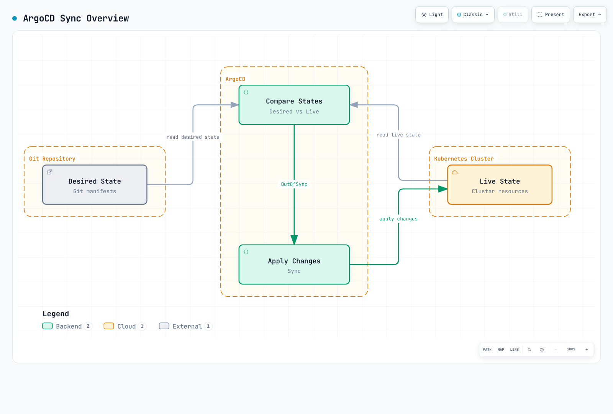
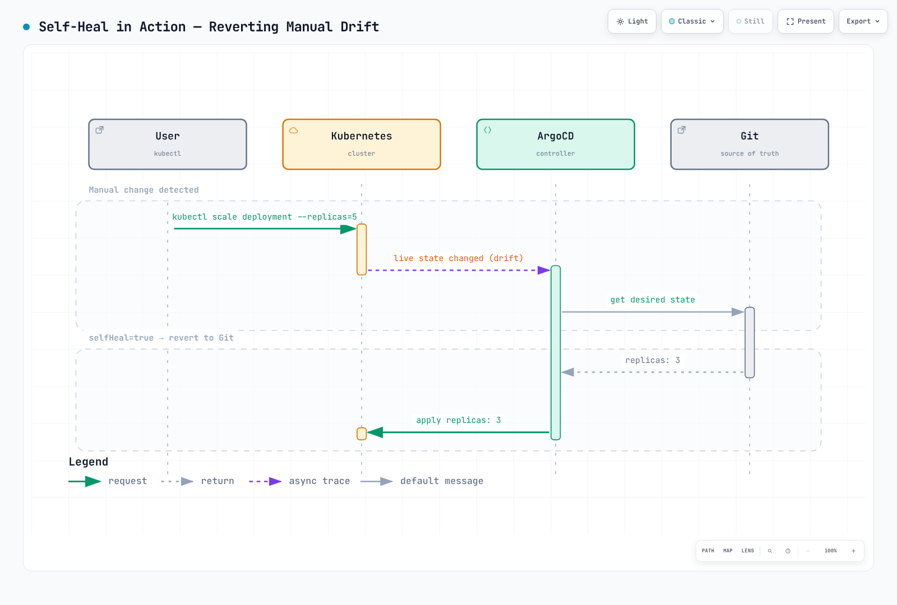
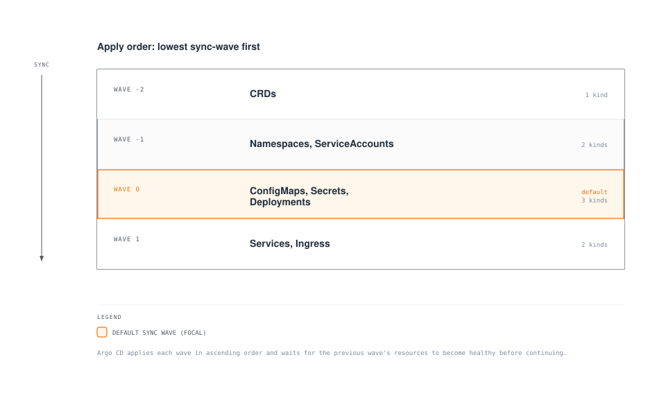

# ArgoCD Sync Strategies

> **Supported Versions**: ArgoCD v2.9+
> **Last Updated**: February 22, 2026

## Table of Contents
- [Manual vs Automated Sync](#manual-vs-automated-sync)
- [Auto-Sync Policies](#auto-sync-policies)
- [Sync Options](#sync-options)
- [Sync Waves and Phases](#sync-waves-and-phases)
- [Sync Windows](#sync-windows)
- [Diffing Customization](#diffing-customization)
- [Retry Policies](#retry-policies)
- [Selective Sync](#selective-sync)

## Manual vs Automated Sync

ArgoCD supports two synchronization modes: manual and automated.

### Manual Sync

In manual mode, users must explicitly trigger synchronization:

```yaml
apiVersion: argoproj.io/v1alpha1
kind: Application
metadata:
  name: manual-sync-app
  namespace: argocd
spec:
  project: default
  source:
    repoURL: https://github.com/myorg/myrepo.git
    targetRevision: HEAD
    path: manifests
  destination:
    server: https://kubernetes.default.svc
    namespace: my-app
  # No syncPolicy.automated = manual sync
```

Triggering manual sync:

```bash
# Via CLI
argocd app sync my-app

# Sync specific resources only
argocd app sync my-app --resource ':Deployment:my-deployment'

# Sync with options
argocd app sync my-app --prune --force
```

### Automated Sync

In automated mode, ArgoCD automatically syncs when changes are detected:

```yaml
apiVersion: argoproj.io/v1alpha1
kind: Application
metadata:
  name: auto-sync-app
  namespace: argocd
spec:
  project: default
  source:
    repoURL: https://github.com/myorg/myrepo.git
    targetRevision: HEAD
    path: manifests
  destination:
    server: https://kubernetes.default.svc
    namespace: my-app
  syncPolicy:
    automated: {}  # Enable auto-sync with defaults
```



[🔍 View interactive diagram](https://www.atomai.click/kubernetes-docs/archmaps/en-gitops-argocd-03-sync-strategies-0.html)

## Auto-Sync Policies

### Prune

Automatically delete resources that no longer exist in Git:

```yaml
syncPolicy:
  automated:
    prune: true
```

**Use case**: Ensure cluster state exactly matches Git repository. Removes orphaned resources.

**Warning**: Be careful with cluster-scoped resources. Use `PruneLast` option for safer pruning.

### Self-Heal

Automatically revert manual changes made to the cluster:

```yaml
syncPolicy:
  automated:
    selfHeal: true
```

**Use case**: Prevent configuration drift from manual kubectl changes or other tools.



[🔍 View interactive diagram](https://www.atomai.click/kubernetes-docs/archmaps/en-gitops-argocd-03-sync-strategies-1.html)

### Allow Empty

Allow applications with no resources:

```yaml
syncPolicy:
  automated:
    allowEmpty: true
```

**Use case**: Applications where resources are conditionally generated or during initial setup.

### Complete Auto-Sync Configuration

```yaml
apiVersion: argoproj.io/v1alpha1
kind: Application
metadata:
  name: fully-automated-app
  namespace: argocd
spec:
  project: default
  source:
    repoURL: https://github.com/myorg/myrepo.git
    targetRevision: HEAD
    path: manifests
  destination:
    server: https://kubernetes.default.svc
    namespace: my-app
  syncPolicy:
    automated:
      prune: true        # Remove orphaned resources
      selfHeal: true     # Revert manual changes
      allowEmpty: false  # Fail if no resources
```

## Sync Options

Sync options provide fine-grained control over synchronization behavior.

### Available Sync Options

| Option | Description | Default |
|--------|-------------|---------|
| `Validate` | Validate resources against schema | true |
| `CreateNamespace` | Create namespace if missing | false |
| `PrunePropagationPolicy` | Deletion propagation policy | foreground |
| `PruneLast` | Prune after all other syncs | false |
| `Replace` | Use replace instead of apply | false |
| `FailOnSharedResource` | Fail if resource managed elsewhere | false |
| `ApplyOutOfSyncOnly` | Only apply out-of-sync resources | false |
| `ServerSideApply` | Use server-side apply | false |
| `RespectIgnoreDifferences` | Respect ignoreDifferences in sync | false |

### Application-Level Options

```yaml
apiVersion: argoproj.io/v1alpha1
kind: Application
metadata:
  name: my-app
  namespace: argocd
spec:
  syncPolicy:
    syncOptions:
      - CreateNamespace=true
      - PrunePropagationPolicy=foreground
      - PruneLast=true
      - Validate=true
      - ApplyOutOfSyncOnly=true
```

### Resource-Level Options

Apply sync options to specific resources via annotations:

```yaml
apiVersion: apps/v1
kind: Deployment
metadata:
  name: my-deployment
  annotations:
    argocd.argoproj.io/sync-options: Replace=true,Validate=false
spec:
  # ...
```

### Server-Side Apply

Use Kubernetes server-side apply for better conflict detection:

```yaml
syncPolicy:
  syncOptions:
    - ServerSideApply=true
```

Or per resource:

```yaml
metadata:
  annotations:
    argocd.argoproj.io/sync-options: ServerSideApply=true
```

**Benefits**:
- Better field ownership tracking
- Merge conflicts detected by API server
- Works well with CRDs and webhooks

### Force Replace

Force replacement of resources (useful for immutable fields):

```yaml
metadata:
  annotations:
    argocd.argoproj.io/sync-options: Replace=true
```

**Use cases**:
- Jobs (immutable spec)
- Changing PVC storage class
- Immutable ConfigMap/Secret fields

## Sync Waves and Phases

Sync waves control the order in which resources are applied.

### How Waves Work

Resources are grouped by wave number and synced in order:
1. Lowest wave number first (can be negative)
2. Within a wave, hooks run first, then resources
3. Next wave starts only after previous completes



### Setting Sync Wave

```yaml
apiVersion: v1
kind: Namespace
metadata:
  name: my-app
  annotations:
    argocd.argoproj.io/sync-wave: "-2"
---
apiVersion: v1
kind: ServiceAccount
metadata:
  name: my-app
  namespace: my-app
  annotations:
    argocd.argoproj.io/sync-wave: "-1"
---
apiVersion: v1
kind: ConfigMap
metadata:
  name: my-config
  namespace: my-app
  annotations:
    argocd.argoproj.io/sync-wave: "0"
---
apiVersion: apps/v1
kind: Deployment
metadata:
  name: my-app
  namespace: my-app
  annotations:
    argocd.argoproj.io/sync-wave: "1"
---
apiVersion: v1
kind: Service
metadata:
  name: my-app
  namespace: my-app
  annotations:
    argocd.argoproj.io/sync-wave: "2"
```

### Combining Waves with Hooks

```yaml
# PreSync hook in wave -5
apiVersion: batch/v1
kind: Job
metadata:
  name: db-init
  annotations:
    argocd.argoproj.io/hook: PreSync
    argocd.argoproj.io/sync-wave: "-5"
    argocd.argoproj.io/hook-delete-policy: HookSucceeded
spec:
  template:
    spec:
      containers:
        - name: init
          image: myapp/db-init:latest
          command: ["./init-db.sh"]
      restartPolicy: Never
---
# PreSync hook in wave -3 (runs after db-init)
apiVersion: batch/v1
kind: Job
metadata:
  name: db-migrate
  annotations:
    argocd.argoproj.io/hook: PreSync
    argocd.argoproj.io/sync-wave: "-3"
    argocd.argoproj.io/hook-delete-policy: HookSucceeded
spec:
  template:
    spec:
      containers:
        - name: migrate
          image: myapp/migrations:latest
          command: ["./migrate.sh"]
      restartPolicy: Never
```

### Complete Ordering Example

```yaml
# Order: CRDs -> Namespaces -> RBAC -> ConfigMaps -> Deployments -> Services -> Ingress

# Wave -5: Custom Resource Definitions
apiVersion: apiextensions.k8s.io/v1
kind: CustomResourceDefinition
metadata:
  name: myresources.example.com
  annotations:
    argocd.argoproj.io/sync-wave: "-5"
spec:
  group: example.com
  names:
    kind: MyResource
    plural: myresources
  scope: Namespaced
  versions:
    - name: v1
      served: true
      storage: true
      schema:
        openAPIV3Schema:
          type: object
---
# Wave -4: Namespace
apiVersion: v1
kind: Namespace
metadata:
  name: my-app
  annotations:
    argocd.argoproj.io/sync-wave: "-4"
---
# Wave -3: RBAC
apiVersion: v1
kind: ServiceAccount
metadata:
  name: my-app
  namespace: my-app
  annotations:
    argocd.argoproj.io/sync-wave: "-3"
---
apiVersion: rbac.authorization.k8s.io/v1
kind: Role
metadata:
  name: my-app
  namespace: my-app
  annotations:
    argocd.argoproj.io/sync-wave: "-3"
rules:
  - apiGroups: [""]
    resources: ["configmaps", "secrets"]
    verbs: ["get", "list", "watch"]
---
# Wave -2: Configuration
apiVersion: v1
kind: ConfigMap
metadata:
  name: my-config
  namespace: my-app
  annotations:
    argocd.argoproj.io/sync-wave: "-2"
data:
  config.yaml: |
    server:
      port: 8080
---
# Wave 0: Application (default)
apiVersion: apps/v1
kind: Deployment
metadata:
  name: my-app
  namespace: my-app
  # No wave annotation = wave 0
spec:
  replicas: 3
  selector:
    matchLabels:
      app: my-app
  template:
    metadata:
      labels:
        app: my-app
    spec:
      serviceAccountName: my-app
      containers:
        - name: app
          image: myapp:v1.0.0
          ports:
            - containerPort: 8080
---
# Wave 1: Networking
apiVersion: v1
kind: Service
metadata:
  name: my-app
  namespace: my-app
  annotations:
    argocd.argoproj.io/sync-wave: "1"
spec:
  selector:
    app: my-app
  ports:
    - port: 80
      targetPort: 8080
---
# Wave 2: External access
apiVersion: networking.k8s.io/v1
kind: Ingress
metadata:
  name: my-app
  namespace: my-app
  annotations:
    argocd.argoproj.io/sync-wave: "2"
spec:
  ingressClassName: nginx
  rules:
    - host: myapp.example.com
      http:
        paths:
          - path: /
            pathType: Prefix
            backend:
              service:
                name: my-app
                port:
                  number: 80
```

## Sync Windows

Sync windows restrict when applications can sync.

### Allow Windows

Permit sync only during specific times:

```yaml
apiVersion: argoproj.io/v1alpha1
kind: AppProject
metadata:
  name: production
  namespace: argocd
spec:
  syncWindows:
    # Allow sync weekdays 9am-5pm UTC
    - kind: allow
      schedule: '0 9 * * 1-5'
      duration: 8h
      applications:
        - '*'
      namespaces:
        - 'production'
      clusters:
        - 'https://production-cluster'

    # Allow emergency sync window (can be manually activated)
    - kind: allow
      schedule: '0 0 * * *'
      duration: 24h
      applications:
        - '*'
      manualSync: true
```

### Deny Windows

Block sync during specific times:

```yaml
apiVersion: argoproj.io/v1alpha1
kind: AppProject
metadata:
  name: production
  namespace: argocd
spec:
  syncWindows:
    # Deny sync during peak hours
    - kind: deny
      schedule: '0 12 * * *'
      duration: 2h
      applications:
        - 'critical-*'

    # Deny sync during weekends
    - kind: deny
      schedule: '0 0 * * 0,6'
      duration: 24h
      applications:
        - '*'
      namespaces:
        - 'production'
```

### Window Configuration

```yaml
syncWindows:
  - kind: allow                    # allow or deny
    schedule: '0 22 * * *'         # Cron expression (UTC)
    duration: 1h                   # Duration: Ns, Nm, Nh
    applications:                  # Application name patterns
      - 'prod-*'
      - 'frontend'
    namespaces:                    # Target namespaces
      - 'production'
    clusters:                      # Target clusters
      - 'https://production.k8s'
    manualSync: false              # Allow manual sync override
    timeZone: 'America/New_York'   # Optional timezone (default UTC)
```

### Override Sync Window

For emergencies, manual sync can override deny windows:

```bash
# Force sync even in deny window (requires manualSync: true in allow window)
argocd app sync my-app --force
```

## Diffing Customization

### Ignore Differences

Configure ArgoCD to ignore specific fields:

```yaml
apiVersion: argoproj.io/v1alpha1
kind: Application
metadata:
  name: my-app
  namespace: argocd
spec:
  ignoreDifferences:
    # Ignore all annotations
    - group: ""
      kind: Service
      jsonPointers:
        - /metadata/annotations

    # Ignore specific field by JQ expression
    - group: apps
      kind: Deployment
      jqPathExpressions:
        - .spec.template.spec.containers[].resources

    # Ignore for specific named resource
    - group: apps
      kind: Deployment
      name: my-deployment
      namespace: production
      jsonPointers:
        - /spec/replicas

    # Ignore managed fields from specific controllers
    - group: "*"
      kind: "*"
      managedFieldsManagers:
        - kube-controller-manager
        - cluster-autoscaler
```

### Global Diffing Configuration

In `argocd-cm`:

```yaml
apiVersion: v1
kind: ConfigMap
metadata:
  name: argocd-cm
  namespace: argocd
data:
  # Ignore aggregated cluster roles
  resource.compareoptions: |
    ignoreAggregatedRoles: true

  # Global ignore patterns
  resource.customizations.ignoreDifferences.all: |
    managedFieldsManagers:
      - kube-controller-manager
    jsonPointers:
      - /metadata/annotations/kubectl.kubernetes.io~1last-applied-configuration

  # Ignore for specific resource type
  resource.customizations.ignoreDifferences.admissionregistration.k8s.io_MutatingWebhookConfiguration: |
    jqPathExpressions:
      - .webhooks[]?.clientConfig.caBundle
```

### Resource Status Ignorance

Ignore all status fields:

```yaml
resource.compareoptions: |
  ignoreResourceStatusField: all
```

Or for specific kinds:

```yaml
resource.compareoptions: |
  ignoreResourceStatusField: crd
```

## Retry Policies

Configure automatic retry on sync failures.

### Basic Retry Configuration

```yaml
apiVersion: argoproj.io/v1alpha1
kind: Application
metadata:
  name: my-app
  namespace: argocd
spec:
  syncPolicy:
    retry:
      limit: 5          # Maximum retry attempts
      backoff:
        duration: 5s    # Initial delay
        factor: 2       # Multiplier for each retry
        maxDuration: 3m # Maximum delay
```

### Retry Flow


[🔍 View interactive diagram](https://www.atomai.click/kubernetes-docs/archmaps/en-gitops-argocd-03-sync-strategies-4.html)

### Retry Only on Specific Errors

Currently, ArgoCD retries on all sync failures. For fine-grained control, use hooks:

```yaml
apiVersion: batch/v1
kind: Job
metadata:
  name: check-prerequisites
  annotations:
    argocd.argoproj.io/hook: PreSync
    argocd.argoproj.io/hook-delete-policy: BeforeHookCreation
spec:
  backoffLimit: 5  # Job-level retries
  template:
    spec:
      containers:
        - name: check
          image: busybox
          command:
            - sh
            - -c
            - |
              # Check if external dependency is ready
              until nc -z external-service 443; do
                echo "Waiting for external-service..."
                sleep 5
              done
              echo "Prerequisites met"
      restartPolicy: Never
```

## Selective Sync

Sync only specific resources within an application.

### Via CLI

```bash
# Sync specific resource by kind and name
argocd app sync my-app --resource ':Deployment:my-deployment'

# Sync resources by group
argocd app sync my-app --resource 'apps:Deployment:*'

# Sync multiple resources
argocd app sync my-app \
  --resource ':ConfigMap:my-config' \
  --resource ':Secret:my-secret' \
  --resource 'apps:Deployment:my-deployment'

# Sync by label
argocd app sync my-app --label 'app.kubernetes.io/component=backend'
```

### Sync Options for Selective Sync

```bash
# Apply only out-of-sync resources
argocd app sync my-app --apply-out-of-sync-only

# Preview what would be synced
argocd app sync my-app --dry-run

# Sync with prune
argocd app sync my-app --prune
```

### Resource Path Format

```
<group>:<kind>:<name>

Examples:
:ConfigMap:my-config                 # Core API group
apps:Deployment:my-deployment        # apps API group
networking.k8s.io:Ingress:my-ingress # networking.k8s.io group
*:*:*                                # All resources
```

## Quiz

To test what you've learned, try the [ArgoCD sync strategies quiz](../../quizzes/gitops/argocd/03-sync-strategies-quiz.md).
