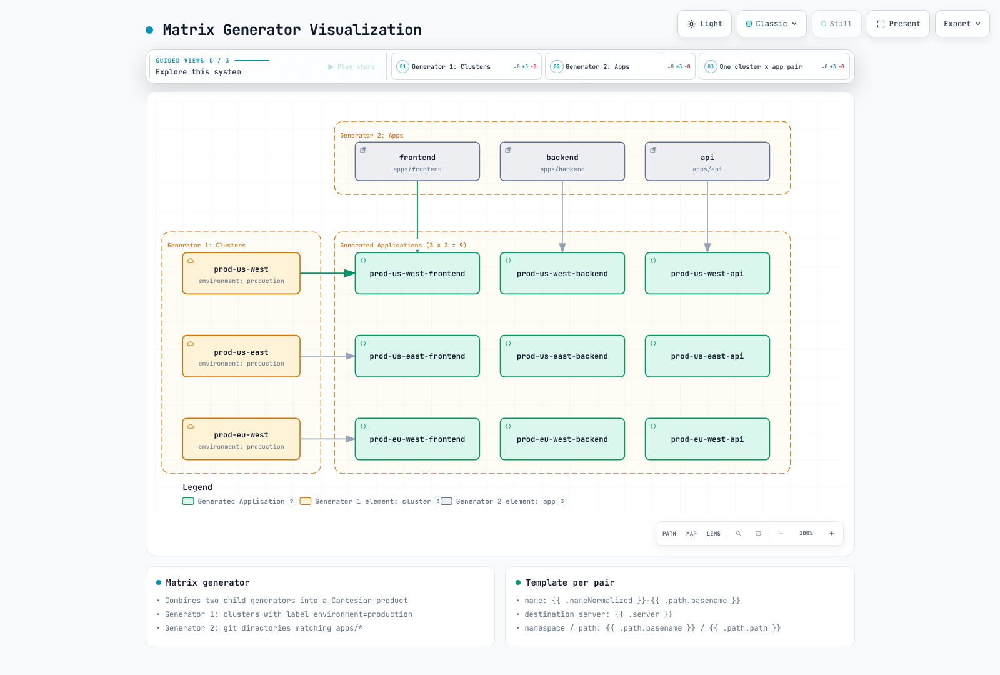
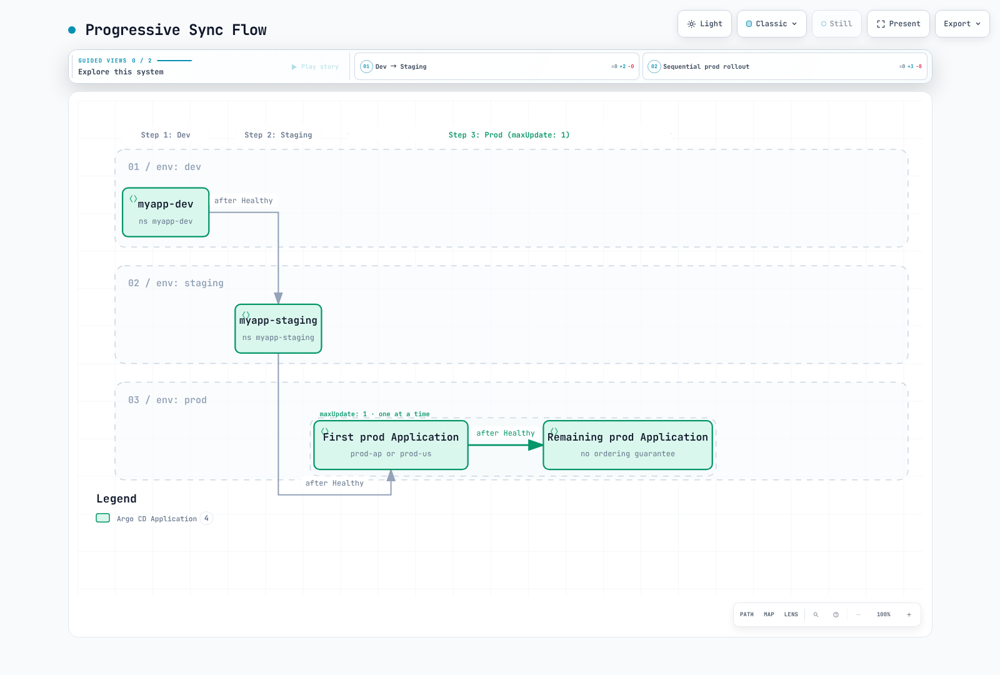

# ArgoCD ApplicationSets

> **Reviewed Against**: Argo CD 3.5.2, including its bundled ApplicationSet controller
> **Last Updated**: September 11, 2026

## Table of Contents
- [ApplicationSet Overview](#applicationset-overview)
- [Generators](#generators)
- [Go Templating](#go-templating)
- [Progressive Sync](#progressive-sync)
- [Multi-Cluster Patterns](#multi-cluster-patterns)
- [Template Patches](#template-patches)

## ApplicationSet Overview

ApplicationSet is a Kubernetes controller that adds support for generating ArgoCD Applications from templates. It enables managing multiple applications with similar configurations across clusters, environments, or repositories.

### When to Use ApplicationSet

| Scenario | Use ApplicationSet? |
|----------|---------------------|
| Same app across multiple clusters | Yes |
| Multiple environments (dev/staging/prod) | Yes |
| Monorepo with many services | Yes |
| Dynamic environments from PRs | Yes |
| Single application deployment | No (use Application) |

`myorg`, `example.com`, cluster URLs and private charts below are placeholders. Supply real repository paths, charts, values files, registered clusters, AppProject permissions and credentials before applying them. ApplicationSet does not register clusters or create AppProjects. `CreateNamespace=true` only creates an authorized destination Namespace. All full examples explicitly enable Go templates.

Restrict ApplicationSet authoring and generator inputs to trusted administrators. A Git/PR input that controls the project, source or destination can expand deployment privileges; use fixed, scoped AppProjects and reviewed inputs.

### Basic Structure

```yaml
apiVersion: argoproj.io/v1alpha1
kind: ApplicationSet
metadata:
  name: my-appset
  namespace: argocd
spec:
  generators:
  - list:
      elements:
      - cluster: dev
        url: https://dev.k8s.local
      - cluster: prod
        url: https://prod.k8s.local
  template:
    metadata:
      name: '{{ .cluster }}-myapp'
    spec:
      project: default
      source:
        repoURL: https://github.com/myorg/myrepo.git
        targetRevision: HEAD
        path: overlays/{{ .cluster }}
      destination:
        server: '{{ .url }}'
        namespace: myapp
      syncPolicy:
        syncOptions:
        - CreateNamespace=true
  goTemplate: true
  goTemplateOptions:
  - missingkey=error
```

## Generators

Generators produce parameters that are substituted into the template to create Applications.

### 1. List Generator

The simplest generator - defines a static list of values:

```yaml
apiVersion: argoproj.io/v1alpha1
kind: ApplicationSet
metadata:
  name: list-example
  namespace: argocd
spec:
  generators:
  - list:
      elements:
      - cluster: dev
        url: https://kubernetes.default.svc
        namespace: dev
        values:
          replicas: '1'
          logLevel: debug
      - cluster: staging
        url: https://staging.k8s.local
        namespace: staging
        values:
          replicas: '2'
          logLevel: info
      - cluster: production
        url: https://production.k8s.local
        namespace: production
        values:
          replicas: '5'
          logLevel: warn
  template:
    metadata:
      name: myapp-{{ .cluster }}
      labels:
        environment: '{{ .cluster }}'
    spec:
      project: default
      source:
        repoURL: https://github.com/myorg/myapp.git
        targetRevision: HEAD
        path: charts/myapp
        helm:
          parameters:
          - name: replicaCount
            value: '{{ .values.replicas }}'
          - name: logging.level
            value: '{{ .values.logLevel }}'
      destination:
        server: '{{ .url }}'
        namespace: '{{ .namespace }}'
      syncPolicy:
        automated:
          prune: true
          selfHeal: true
        syncOptions:
        - CreateNamespace=true
  goTemplate: true
  goTemplateOptions:
  - missingkey=error
```

### 2. Cluster Generator

Automatically targets registered ArgoCD clusters:

```yaml
apiVersion: argoproj.io/v1alpha1
kind: ApplicationSet
metadata:
  name: cluster-example
  namespace: argocd
spec:
  generators:
  - clusters:
      selector: {}
      values:
        clusterName: '{{ .name }}'
  template:
    metadata:
      name: '{{ .nameNormalized }}-guestbook'
    spec:
      project: default
      source:
        repoURL: https://github.com/argoproj/argocd-example-apps.git
        targetRevision: HEAD
        path: guestbook
      destination:
        server: '{{ .server }}'
        namespace: guestbook
      syncPolicy:
        syncOptions:
        - CreateNamespace=true
  goTemplate: true
  goTemplateOptions:
  - missingkey=error
```

#### Cluster Labels for Targeting

First, add labels to your cluster secrets:

```yaml
apiVersion: v1
kind: Secret
metadata:
  name: production-cluster
  namespace: argocd
  labels:
    argocd.argoproj.io/secret-type: cluster
    environment: production
    region: us-west-2
    tier: critical
type: Opaque
stringData:
  name: production
  server: https://production.k8s.local
  config: |
    {
      "tlsClientConfig": {
        "insecure": false,
        "caData": "..."
      }
    }
```

Then select clusters by label:

```yaml
generators:
  - clusters:
      selector:
        matchLabels:
          environment: production
        matchExpressions:
          - key: tier
            operator: In
            values:
              - critical
              - high
```

An empty Cluster selector can include the local cluster. The default local cluster has no Secret and may not match label selectors; create/configure its cluster Secret when label selection is needed. Use `nameNormalized` for Application names, and separately respect Namespace/Label limits. Secret snippets show the shape only: `...` is not a valid CA or credential.

### 3. Git Generator - Directories

Scan a Git repository for directories:

```yaml
apiVersion: argoproj.io/v1alpha1
kind: ApplicationSet
metadata:
  name: git-directories
  namespace: argocd
spec:
  generators:
  - git:
      repoURL: https://github.com/myorg/gitops-repo.git
      revision: HEAD
      directories:
      - path: apps/*
      - path: apps/excluded-app
        exclude: true
  template:
    metadata:
      name: '{{ .path.basename }}'
    spec:
      project: default
      source:
        repoURL: https://github.com/myorg/gitops-repo.git
        targetRevision: HEAD
        path: '{{ .path.path }}'
      destination:
        server: https://kubernetes.default.svc
        namespace: '{{ .path.basename }}'
      syncPolicy:
        syncOptions:
        - CreateNamespace=true
  goTemplate: true
  goTemplateOptions:
  - missingkey=error
```

#### Repository Structure for Directory Generator

```
gitops-repo/
├── apps/
│   ├── frontend/
│   │   ├── deployment.yaml
│   │   └── service.yaml
│   ├── backend/
│   │   ├── deployment.yaml
│   │   └── service.yaml
│   ├── database/
│   │   ├── statefulset.yaml
│   │   └── service.yaml
│   └── excluded-app/    # Excluded via generator
│       └── ...
```

### 4. Git Generator - Files

Read configuration from JSON/YAML files in Git:

```yaml
apiVersion: argoproj.io/v1alpha1
kind: ApplicationSet
metadata:
  name: git-files
  namespace: argocd
spec:
  generators:
  - git:
      repoURL: https://github.com/myorg/gitops-repo.git
      revision: HEAD
      files:
      - path: config/**/config.json
  template:
    metadata:
      name: '{{ .cluster.name }}-{{ .app.name }}'
      labels:
        environment: '{{ .cluster.environment }}'
    spec:
      project: default
      source:
        repoURL: '{{ .app.repoURL }}'
        targetRevision: '{{ .app.revision }}'
        path: '{{ .app.path }}'
        helm:
          valueFiles:
          - values.yaml
          - values-{{ .cluster.environment }}.yaml
      destination:
        server: '{{ .cluster.server }}'
        namespace: '{{ .app.namespace }}'
      syncPolicy:
        syncOptions:
        - CreateNamespace=true
  goTemplate: true
  goTemplateOptions:
  - missingkey=error
```

#### Config File Example

```json
{
  "cluster": {
    "name": "prod-us-west-2",
    "server": "https://prod-usw2.k8s.local",
    "environment": "production"
  },
  "app": {
    "name": "myapp",
    "repoURL": "https://github.com/myorg/myapp.git",
    "revision": "v1.2.3",
    "path": "charts/myapp",
    "namespace": "myapp-prod"
  }
}
```

### 5. Matrix Generator

Combine two generators to create a Cartesian product:

```yaml
apiVersion: argoproj.io/v1alpha1
kind: ApplicationSet
metadata:
  name: matrix-example
  namespace: argocd
spec:
  generators:
  - matrix:
      generators:
      - clusters:
          selector:
            matchLabels:
              environment: production
      - git:
          repoURL: https://github.com/myorg/apps.git
          revision: HEAD
          directories:
          - path: apps/*
  template:
    metadata:
      name: '{{ .nameNormalized }}-{{ .path.basename }}'
    spec:
      project: default
      source:
        repoURL: https://github.com/myorg/apps.git
        targetRevision: HEAD
        path: '{{ .path.path }}'
      destination:
        server: '{{ .server }}'
        namespace: '{{ .path.basename }}'
      syncPolicy:
        syncOptions:
        - CreateNamespace=true
  goTemplate: true
  goTemplateOptions:
  - missingkey=error
```

#### Matrix Visualization



[🔍 View interactive diagram](https://www.atomai.click/kubernetes-docs/archmaps/en-gitops-argocd-04-applicationsets-0.html)

Matrix combines exactly two child generators; combination generators support only one nesting level. Use `pathParamPrefix` when two Git generators would produce conflicting path parameters.

### 6. Merge Generator

Merge outputs from multiple generators, combining parameters:

```yaml
apiVersion: argoproj.io/v1alpha1
kind: ApplicationSet
metadata:
  name: merge-example
  namespace: argocd
spec:
  generators:
  - merge:
      mergeKeys:
      - cluster
      generators:
      - list:
          elements:
          - cluster: dev
            replicas: '1'
            enableHA: 'false'
          - cluster: staging
            replicas: '2'
            enableHA: 'false'
          - cluster: production
            replicas: '5'
            enableHA: 'false'
      - list:
          elements:
          - cluster: production
            replicas: '10'
            enableHA: 'true'
  template:
    metadata:
      name: myapp-{{ .cluster }}
    spec:
      project: default
      source:
        repoURL: https://github.com/myorg/myapp.git
        targetRevision: HEAD
        path: charts/myapp
        helm:
          parameters:
          - name: replicas
            value: '{{ .replicas }}'
          - name: highAvailability
            value: '{{ .enableHA }}'
      destination:
        server: https://kubernetes.default.svc
        namespace: '{{ .cluster }}'
      syncPolicy:
        syncOptions:
        - CreateNamespace=true
  goTemplate: true
  goTemplateOptions:
  - missingkey=error
```

Merge keeps the base generator's entries and applies matching overrides by `mergeKeys`; later generators take precedence, and unmatched override entries are discarded. Nested merge keys are unsupported with Go templates.

### 7. SCM Provider Generator

Scan GitHub/GitLab organizations for repositories:

#### GitHub

```yaml
apiVersion: argoproj.io/v1alpha1
kind: ApplicationSet
metadata:
  name: github-org-apps
  namespace: argocd
spec:
  generators:
  - scmProvider:
      github:
        organization: myorg
      filters:
      - repositoryMatch: ^service-.*
        pathsExist:
        - kubernetes/
        labelMatch: ^deploy-to-k8s$
  template:
    metadata:
      name: '{{ .repository }}'
    spec:
      project: default
      source:
        repoURL: '{{ .url }}'
        targetRevision: '{{ .branch }}'
        path: kubernetes
      destination:
        server: https://kubernetes.default.svc
        namespace: '{{ .repository }}'
      syncPolicy:
        syncOptions:
        - CreateNamespace=true
  goTemplate: true
  goTemplateOptions:
  - missingkey=error
```

#### GitLab

```yaml
apiVersion: argoproj.io/v1alpha1
kind: ApplicationSet
metadata:
  name: gitlab-group-apps
  namespace: argocd
spec:
  generators:
  - scmProvider:
      gitlab:
        group: mygroup
        includeSubgroups: true
      filters:
      - pathsExist:
        - deploy/
  template:
    metadata:
      name: '{{ .repository }}'
    spec:
      project: default
      source:
        repoURL: '{{ .url }}'
        targetRevision: '{{ .branch }}'
        path: deploy
      destination:
        server: https://kubernetes.default.svc
        namespace: '{{ .repository }}'
      syncPolicy:
        syncOptions:
        - CreateNamespace=true
  goTemplate: true
  goTemplateOptions:
  - missingkey=error
```

`scmProvider.filters` sits beside the provider object. Conditions within one filter are AND; separate filter entries are OR. The example combines name, path and label requirements into one filter. Private repositories and API rate limits require an appropriately scoped token or GitHub App.

### 8. Pull Request Generator

Create environments for pull requests:

```yaml
apiVersion: argoproj.io/v1alpha1
kind: ApplicationSet
metadata:
  name: pr-environments
  namespace: argocd
spec:
  generators:
  - pullRequest:
      github:
        owner: myorg
        repo: myapp
        tokenRef:
          secretName: github-token
          key: token
        labels:
        - preview
      requeueAfterSeconds: 180
  template:
    metadata:
      name: pr-{{ .number }}-{{ .branch_slug }}
      labels:
        preview: 'true'
        pr-number: '{{ .number }}'
    spec:
      project: previews
      source:
        repoURL: https://github.com/myorg/myapp.git
        targetRevision: '{{ .head_sha }}'
        path: kubernetes
        kustomize:
          nameSuffix: -pr-{{ .number }}
          images:
          - myapp:pr-{{ .number }}
      destination:
        server: https://kubernetes.default.svc
        namespace: preview-{{ .number }}
      syncPolicy:
        automated:
          prune: true
          selfHeal: true
        syncOptions:
        - CreateNamespace=true
  goTemplate: true
  goTemplateOptions:
  - missingkey=error
```

Use the PR example only with a pre-created `previews` AppProject restricting the preview cluster/namespaces. GitHub requires all listed labels; a label does not make untrusted PR code safe. Do not expose production secrets or cluster-admin credentials to preview workloads. Under the default deletion policy, closed/unmatched PR Applications are removed on reconciliation; resource cleanup follows finalizers/preservation settings, and a Namespace created only through `CreateNamespace=true` is not automatically a tracked cleanup target.

### 9. Cluster Decision Resource Generator

Defer cluster selection to an external resource:

```yaml
apiVersion: argoproj.io/v1alpha1
kind: ApplicationSet
metadata:
  name: cluster-decision
  namespace: argocd
spec:
  generators:
  - clusterDecisionResource:
      configMapRef: cluster-decisions
      labelSelector:
        matchLabels:
          cluster.open-cluster-management.io/placement: production
      requeueAfterSeconds: 180
  template:
    metadata:
      name: '{{ normalize .name }}-addon'
    spec:
      project: default
      source:
        repoURL: https://github.com/myorg/myapp.git
        targetRevision: HEAD
        path: manifests
      destination:
        server: '{{ .server }}'
        namespace: myapp
      syncPolicy:
        syncOptions:
        - CreateNamespace=true
  goTemplate: true
  goTemplateOptions:
  - missingkey=error
```

Decision resource configuration:

```yaml
apiVersion: v1
kind: ConfigMap
metadata:
  name: cluster-decisions
  namespace: argocd
data:
  apiVersion: cluster.open-cluster-management.io/v1beta1
  kind: placementdecisions
  statusListKey: decisions
  matchKey: clusterName
```

This requires an existing Open Cluster Management installation and a `production` Placement generating PlacementDecision objects. Grant the ApplicationSet controller read access to those objects in the `argocd` namespace. Each `status.decisions[].clusterName` must match an Argo CD registered cluster; use the generated `server` value for its API endpoint. Select decisions by either name or labelSelector.

### 10. Plugin Generator

Execute custom generator logic via ConfigMap:

```yaml
apiVersion: argoproj.io/v1alpha1
kind: ApplicationSet
metadata:
  name: plugin-example
  namespace: argocd
spec:
  generators:
  - plugin:
      configMapRef:
        name: my-plugin
      input:
        parameters:
          environment: production
          region: us-west-2
      requeueAfterSeconds: 300
  template:
    metadata:
      name: '{{ .name }}'
    spec:
      project: default
      source:
        repoURL: '{{ .repoURL }}'
        targetRevision: '{{ .revision }}'
        path: '{{ .path }}'
      destination:
        server: '{{ .server }}'
        namespace: '{{ .namespace }}'
      syncPolicy:
        syncOptions:
        - CreateNamespace=true
  goTemplate: true
  goTemplateOptions:
  - missingkey=error
```

Plugin connection configuration:

```yaml
apiVersion: v1
kind: ConfigMap
metadata:
  name: my-plugin
  namespace: argocd
data:
  token: "$appset-plugin-token:token"
  baseUrl: "https://appset-plugin.example.com"
  requestTimeout: "30"
```

The ConfigMap does not execute code. A separately deployed HTTP service must handle POST `/api/v1/getparams.execute` and return an `output.parameters` array. Replace the example domain with a TLS-validated endpoint. Provision Secret `appset-plugin-token` in `argocd`, with key `token` and label `app.kubernetes.io/part-of: argocd`; keep its value out of Git. Implement authentication, input validation and the documented response schema before connecting it.

## Go Templating

Set `spec.goTemplate: true` to use Go templates; the default engine in 3.5.2 remains fasttemplate. The examples on this page explicitly enable Go templates with `missingkey=error`. Each string field is rendered independently: control statements cannot span YAML fields, and booleans/objects/lists require `templatePatch`. Use `dig` for optional keys because direct access to a missing key fails before `default` can run.

### Basic Syntax

```yaml
template:
  metadata:
    name: '{{ .cluster }}-{{ .app }}'           # Simple substitution
    labels:
      env: '{{ .values.environment }}'       # Nested values
```

### Functions

```yaml
template:
  metadata:
    # Normalize strings
    name: '{{normalize .cluster}}'

    # String manipulation
    labels:
      lower: '{{.cluster | lower}}'
      upper: '{{.cluster | upper}}'
      trimmed: '{{.cluster | trim}}'

    annotations:
      # Conditional
      tier: '{{if eq .env "prod"}}critical{{ else }}standard{{ end }}'
```

### Advanced Templating

```yaml
apiVersion: argoproj.io/v1alpha1
kind: ApplicationSet
metadata:
  name: advanced-template
  namespace: argocd
spec:
  goTemplate: true
  goTemplateOptions:
  - missingkey=error
  generators:
  - list:
      elements:
      - name: app1
        env: prod
        regions:
        - us-west-2
        - us-east-1
  template:
    metadata:
      name: '{{.name}}-{{.env}}'
      annotations:
        regions: '{{range $i, $r := .regions}}{{if $i}},{{ end }}{{$r}}{{ end }}'
    spec:
      project: default
      source:
        repoURL: https://github.com/myorg/myapp.git
        targetRevision: main
        path: manifests
      destination:
        server: https://kubernetes.default.svc
        namespace: '{{ .name }}'
      syncPolicy:
        syncOptions:
        - CreateNamespace=true
```

## Progressive Sync

Progressive Syncs is Beta since 3.3 and must still be explicitly enabled in 3.5.2. Merge `applicationsetcontroller.enable.progressive.syncs: "true"` into the existing `argocd-cmd-params-cm.data`, then restart the ApplicationSet controller. For Helm, manage the corresponding key under `configs.params`.

RollingSync selects **labels on generated Applications** and waits for every Application in a group to become Healthy before proceeding. It disables child autosync and requests syncs through the ApplicationSet controller, respecting sync windows and Application retry settings. Applications matching no step require manual sync.

`maxUpdate: 0` pauses automatic sync for that group; it does not grant approval or advance into a duplicate group. Manually sync the paused group or apply a reviewed strategy change. Positive percentages round down with a minimum of one. Ordering within a group is not guaranteed. The example below uses namespaces in one cluster; `region` is grouping metadata, not a cluster destination.

Control rollout across applications with RollingSync.

### RollingSync Strategy

```yaml
apiVersion: argoproj.io/v1alpha1
kind: ApplicationSet
metadata:
  name: progressive-rollout
  namespace: argocd
spec:
  generators:
  - list:
      elements:
      - name: dev
        env: dev
      - name: staging
        env: staging
      - name: prod-ap
        env: prod
        region: ap-northeast-2
      - name: prod-us
        env: prod
        region: us-west-2
  strategy:
    type: RollingSync
    rollingSync:
      steps:
      - matchExpressions:
        - key: env
          operator: In
          values:
          - dev
        maxUpdate: 100%
      - matchExpressions:
        - key: env
          operator: In
          values:
          - staging
        maxUpdate: 100%
      - matchExpressions:
        - key: env
          operator: In
          values:
          - prod
        maxUpdate: 1
  template:
    metadata:
      name: myapp-{{ .name }}
      labels:
        env: '{{ .env }}'
        region: '{{ dig "region" "global" . }}'
    spec:
      project: default
      source:
        repoURL: https://github.com/myorg/myapp.git
        targetRevision: HEAD
        path: envs/{{ .env }}
      destination:
        server: https://kubernetes.default.svc
        namespace: myapp-{{ .name }}
      syncPolicy:
        syncOptions:
        - CreateNamespace=true
  goTemplate: true
  goTemplateOptions:
  - missingkey=error
```

### Progressive Sync Flow



[🔍 View interactive diagram](https://www.atomai.click/kubernetes-docs/archmaps/en-gitops-argocd-04-applicationsets-1.html)

## Multi-Cluster Patterns

### Hub-and-Spoke Pattern

Central ArgoCD managing multiple clusters:

```yaml
apiVersion: argoproj.io/v1alpha1
kind: ApplicationSet
metadata:
  name: hub-spoke-platform
  namespace: argocd
spec:
  generators:
  - matrix:
      generators:
      - clusters:
          selector:
            matchLabels:
              managed-by: hub
      - list:
          elements:
          - app: monitoring
            chart: kube-prometheus-stack
            repo: https://prometheus-community.github.io/helm-charts
            version: 90.0.0
          - app: logging
            chart: loki
            repo: https://grafana-community.github.io/helm-charts
            version: 18.12.1
          - app: gateway
            chart: gateway-helm
            repo: docker.io/envoyproxy
            version: v1.9.1
  template:
    metadata:
      name: '{{ .nameNormalized }}-{{ .app }}'
    spec:
      project: platform
      destination:
        server: '{{ .server }}'
        namespace: '{{ .app }}'
      syncPolicy:
        automated:
          prune: true
          selfHeal: true
        syncOptions:
        - CreateNamespace=true
      sources:
      - repoURL: '{{ .repo }}'
        chart: '{{ .chart }}'
        targetRevision: '{{ .version }}'
        helm:
          valueFiles:
          - $values/platform/{{ .nameNormalized }}/{{ .app }}/values.yaml
      - repoURL: https://github.com/myorg/platform-config.git
        targetRevision: main
        ref: values
  goTemplate: true
  goTemplateOptions:
  - missingkey=error
```

The hub-and-spoke example requires reviewed values files for **every** cluster/app pair. Prepare Loki object storage/schema/deployment-mode settings, Grafana credentials, persistence and Gateway API prerequisites in that configuration repository. Register `docker.io/envoyproxy` as a Helm repository with OCI enabled as described in the installation chapter. Missing `$values` files intentionally fail rendering; do not replace them with empty values. Loki replaces the retired `loki-stack` bundle, and Envoy Gateway replaces the retired community ingress-nginx example; this is a migration requiring route/value changes, not a drop-in upgrade.

### Environment Promotion Pattern

```yaml
apiVersion: argoproj.io/v1alpha1
kind: ApplicationSet
metadata:
  name: environment-promotion
  namespace: argocd
spec:
  generators:
  - git:
      repoURL: https://github.com/myorg/env-config.git
      revision: HEAD
      files:
      - path: environments/*/config.yaml
  template:
    metadata:
      name: myapp-{{ .environment }}
    spec:
      project: default
      source:
        repoURL: https://github.com/myorg/myapp.git
        targetRevision: '{{ .gitRevision }}'
        path: kubernetes
        kustomize:
          images:
          - myapp:{{ .imageTag }}
      destination:
        server: '{{ .clusterUrl }}'
        namespace: '{{ .namespace }}'
      syncPolicy:
        syncOptions:
        - CreateNamespace=true
  goTemplate: true
  goTemplateOptions:
  - missingkey=error
```

Save each YAML document below as the separately named file; the separators show file boundaries. Promote reviewed, immutable artifact versions through Git. Application annotations such as `sync-wave` alone do not order independently reconciled Applications; use RollingSync and labels when coordinated rollout is required.

Config files:

```yaml
# environments/dev/config.yaml
environment: dev
namespace: myapp-dev
clusterUrl: https://dev.k8s.local
gitRevision: HEAD
imageTag: git-8c9f1a2
---

# environments/staging/config.yaml
environment: staging
namespace: myapp-staging
clusterUrl: https://staging.k8s.local
gitRevision: release-candidate
imageTag: rc-1.2.3
---

# environments/production/config.yaml
environment: production
namespace: myapp-prod
clusterUrl: https://production.k8s.local
gitRevision: v1.2.3
imageTag: v1.2.3

```

## Template Patches

Override template fields based on generator output.

### Basic Patch

```yaml
apiVersion: argoproj.io/v1alpha1
kind: ApplicationSet
metadata:
  name: patched-apps
  namespace: argocd
spec:
  generators:
  - list:
      elements:
      - name: app1
        env: dev
      - name: app2
        env: prod
  template:
    metadata:
      name: '{{ .name }}'
    spec:
      project: default
      source:
        repoURL: https://github.com/myorg/apps.git
        targetRevision: HEAD
        path: '{{ .name }}'
      destination:
        server: https://kubernetes.default.svc
        namespace: '{{ .name }}'
      syncPolicy:
        syncOptions:
        - CreateNamespace=true
  templatePatch: |
    {{- if eq .env "prod" }}
    spec:
      syncPolicy:
        automated:
          prune: true
          selfHeal: true
    {{- end }}
  goTemplate: true
  goTemplateOptions:
  - missingkey=error
```

### Conditional Strategic Merge Patch

```yaml
apiVersion: argoproj.io/v1alpha1
kind: ApplicationSet
metadata:
  name: strategic-patch
  namespace: argocd
spec:
  generators:
  - list:
      elements:
      - cluster: dev
        autoSync: 'false'
      - cluster: prod
        autoSync: 'true'
  template:
    metadata:
      name: app-{{ .cluster }}
    spec:
      project: default
      source:
        repoURL: https://github.com/myorg/apps.git
        targetRevision: HEAD
        path: app
      destination:
        server: https://kubernetes.default.svc
        namespace: app-{{ .cluster }}
      syncPolicy:
        syncOptions:
        - CreateNamespace=true
  templatePatch: |
    spec:
      {{- if eq .autoSync "true" }}
      syncPolicy:
        automated:
          prune: true
          selfHeal: true
      {{- else }}
      syncPolicy: {}
      {{- end }}
  goTemplate: true
  goTemplateOptions:
  - missingkey=error
```

## Deletion and Preservation

Deleting an ApplicationSet normally garbage-collects its generated Applications via ownerReferences. `preserveResourcesOnDeletion: true` prevents adding the resource-deletion finalizer to Applications, preserving their deployed resources; **it does not preserve the Application objects themselves**. Inspect finalizers on existing Applications before changing lifecycle settings.

To remove only the parent, use `kubectl delete applicationset NAME -n argocd --cascade=orphan`. Orphaned Applications retain autosync and any existing finalizer; deleting one later may still delete its deployed resources. `applicationsSync: create-update` restricts reconciliation-driven deletions, not owner-reference garbage collection when the parent is removed.

`templatePatch` requires `goTemplate: true`. In 3.5.2 it uses Kubernetes strategic merge patch with the Application type. Arrays without merge tags in the Application spec, such as Helm valueFiles, are replaced; do not assume the name-based merging used for Pod containers. Avoid a value-less `spec:` (null) that clears existing configuration, do not patch `spec.project`, and escape untrusted inserted strings with functions such as `toJson`.

## References

- [ApplicationSet generators (3.5.2)](https://github.com/argoproj/argo-cd/blob/v3.5.2/docs/operator-manual/applicationset/Generators.md)
- [Go template rules](https://github.com/argoproj/argo-cd/blob/v3.5.2/docs/operator-manual/applicationset/GoTemplate.md)
- [Progressive Syncs](https://github.com/argoproj/argo-cd/blob/v3.5.2/docs/operator-manual/applicationset/Progressive-Syncs.md)
- [Application deletion](https://github.com/argoproj/argo-cd/blob/v3.5.2/docs/operator-manual/applicationset/Application-Deletion.md)
- [Template patch implementation](https://github.com/argoproj/argo-cd/blob/v3.5.2/applicationset/controllers/template/patch.go)

## Quiz

To test what you've learned, try the [ArgoCD ApplicationSets quiz](../../quizzes/gitops/argocd/04-applicationsets-quiz.md).
