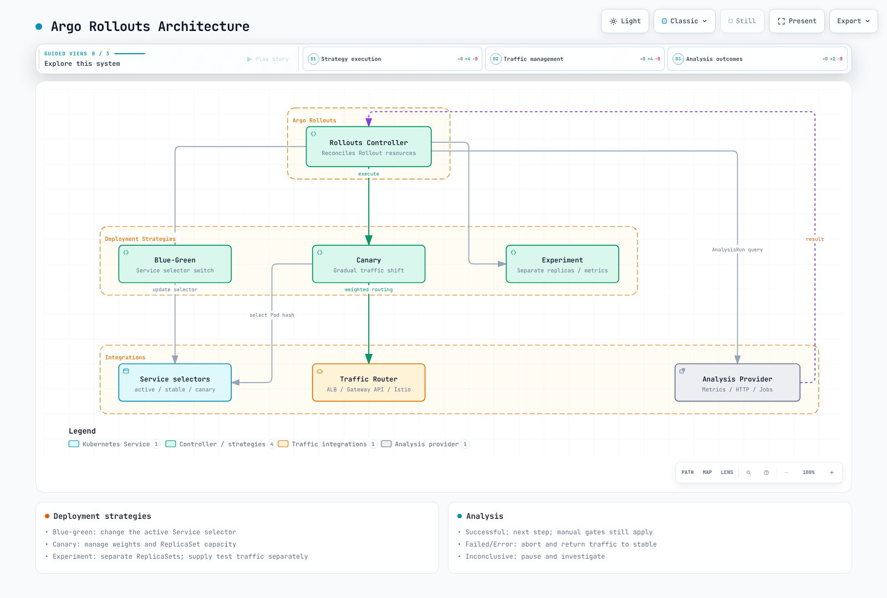
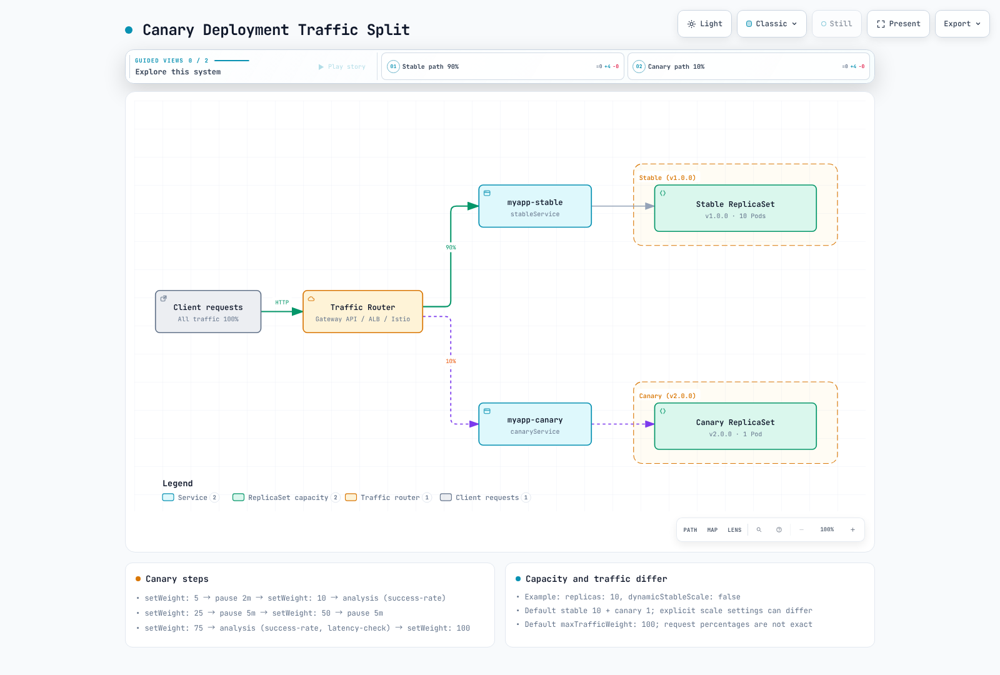

# ArgoCD Traffic Management

> **Reviewed Against**: Argo CD 3.5.2, Argo Rollouts 1.10.0, Helm chart 2.43.1
> **Last Updated**: September 11, 2026

## Table of Contents
- [Argo Rollouts Overview](#argo-rollouts-overview)
- [Installation](#installation)
- [Blue-Green Deployments](#blue-green-deployments)
- [Canary Deployments](#canary-deployments)
- [Analysis and Verification](#analysis-and-verification)
- [Ingress Integration](#ingress-integration)
- [Rollback Strategies](#rollback-strategies)
- [Experiments](#experiments)
- [Notifications](#notifications)

## Argo Rollouts Overview

Argo Rollouts is a Kubernetes controller that provides advanced deployment capabilities including blue-green deployments, canary deployments, and progressive delivery features.

### Why Argo Rollouts?

Kubernetes Deployments support RollingUpdate and Recreate, as well as pause/resume. The table compares native controller behavior; additional controllers or multiple Deployments can implement other patterns:

| Feature | K8s Deployment | Argo Rollouts |
|---------|----------------|---------------|
| Rolling Update | Yes | Yes |
| Blue-Green | No | Yes |
| Canary | No | Yes |
| Traffic Splitting | No | Yes |
| Automated Rollback | No | Yes |
| Analysis/Verification | No | Yes |
| Pause/Resume | Yes | Yes |
| Experiments | No | Yes |

### Architecture



[🔍 View interactive diagram](https://www.atomai.click/kubernetes-docs/archmaps/en-gitops-argocd-05-traffic-management-0.html)

## Installation

### Install Argo Rollouts Controller

```bash
set -euo pipefail
ROLLOUTS_VERSION=v1.10.0
kubectl create namespace argo-rollouts --dry-run=client -o yaml | kubectl apply -f -
kubectl apply --server-side -n argo-rollouts \
  -f "https://github.com/argoproj/argo-rollouts/releases/download/${ROLLOUTS_VERSION}/install.yaml"
kubectl rollout status deployment/argo-rollouts -n argo-rollouts --timeout=180s
```

### Install kubectl Plugin

```bash
set -euo pipefail
ROLLOUTS_VERSION=v1.10.0
case "$(uname -s)" in
  Linux) plugin_os=linux ;;
  Darwin) plugin_os=darwin ;;
  *) echo "Use the Windows release asset for Windows" >&2; exit 1 ;;
esac
case "$(uname -m)" in
  x86_64) plugin_arch=amd64 ;;
  aarch64|arm64) plugin_arch=arm64 ;;
  *) echo "Unsupported architecture" >&2; exit 1 ;;
esac
plugin_asset="kubectl-argo-rollouts-${plugin_os}-${plugin_arch}"
plugin_dir="$(mktemp -d)"
trap 'rm -rf "$plugin_dir"' EXIT
plugin_base="https://github.com/argoproj/argo-rollouts/releases/download/${ROLLOUTS_VERSION}"
curl --fail --location --retry 3 "$plugin_base/$plugin_asset" -o "$plugin_dir/$plugin_asset"
curl --fail --location --retry 3 "$plugin_base/argo-rollouts-checksums.txt" -o "$plugin_dir/checksums.txt"
awk -v artifact="$plugin_asset" '$2 == artifact { print }' "$plugin_dir/checksums.txt" > "$plugin_dir/selected.sha256"
test -s "$plugin_dir/selected.sha256"
(
  cd "$plugin_dir"
  if [ "$plugin_os" = darwin ]; then
    shasum -a 256 -c selected.sha256
  else
    sha256sum -c selected.sha256
  fi
)
install -d "$HOME/.local/bin"
install -m 0755 "$plugin_dir/$plugin_asset" "$HOME/.local/bin/kubectl-argo-rollouts"
export PATH="$HOME/.local/bin:$PATH"
kubectl argo rollouts version
```

### Install via Helm

Choose either the manifest installation above or Helm to manage controller ownership. Save these settings as `rollouts-values.yaml`. `AWS_REGION` belongs to the **Rollouts controller** that queries CloudWatch, and may be omitted when that provider is unused.

```yaml
controller:
  replicas: 2
  metrics:
    enabled: true
    serviceMonitor:
      enabled: false  # Enable after installing/configuring Prometheus Operator
  pdb:
    enabled: true
    minAvailable: 1
  extraEnv:
    - name: AWS_REGION
      value: ap-northeast-2

dashboard:
  enabled: false
```

```bash
helm repo add argo https://argoproj.github.io/argo-helm
helm repo update argo
helm upgrade --install argo-rollouts argo/argo-rollouts \
  --version 2.43.1 --namespace argo-rollouts --create-namespace \
  --values rollouts-values.yaml --wait --timeout 5m
```

Enable ServiceMonitor only after its CRD and Prometheus selectors are configured. A shared Dashboard requires a separate authentication/authorization layer. The 1.10.0 CLI `dashboard` command binds all interfaces and uses your kubeconfig privileges; its printed localhost URL does not restrict access.

### Dashboard Access (Helm Installation)

For Helm installations, enable the read-only ClusterIP Dashboard and port-forward to a loopback address:

```bash
helm upgrade --install argo-rollouts argo/argo-rollouts \
  --version 2.43.1 --namespace argo-rollouts --create-namespace \
  --values rollouts-values.yaml \
  --set dashboard.enabled=true --set dashboard.readonly=true \
  --set dashboard.service.type=ClusterIP --set dashboard.ingress.enabled=false \
  --wait --timeout 5m
kubectl port-forward --address 127.0.0.1 -n argo-rollouts \
  service/argo-rollouts-dashboard 3100:3100
```

Open `http://127.0.0.1:3100/rollouts`. Shared access requires a separate authenticated, authorized proxy.

## Blue-Green Deployments

Replace the example `myapp`/registry images, ECR account/tag and metric names with your application's configuration. Prepare namespaces, image access, readiness responses, metric collection and AnalysisTemplates; run each scenario independently. An initial deployment has no previous stable ReplicaSet. Deploy v1 successfully, then change the image to v2 in Git to observe a rollout.

Argo CD applies the Rollout spec from Git; the separate Rollouts controller manages ReplicaSets and traffic. Aborting and returning traffic to stable does not revert the Git commit or a database migration.

Blue-green retains the previous and new ReplicaSets of a Rollout, then changes the active Service selector. It does not duplicate an entire cluster environment. Data-plane propagation and connection draining take time.

### Basic Blue-Green Rollout

```yaml
apiVersion: argoproj.io/v1alpha1
kind: Rollout
metadata:
  name: myapp
  namespace: myapp
spec:
  replicas: 5
  revisionHistoryLimit: 3
  selector:
    matchLabels:
      app: myapp
  template:
    metadata:
      labels:
        app: myapp
    spec:
      containers:
      - name: myapp
        image: myregistry/myapp:v1.0.0
        ports:
        - containerPort: 8080
        readinessProbe:
          httpGet:
            path: /health
            port: 8080
          initialDelaySeconds: 5
          periodSeconds: 10
        resources:
          requests:
            cpu: 100m
            memory: 128Mi
          limits:
            cpu: 500m
            memory: 512Mi
  strategy:
    blueGreen:
      activeService: myapp-active
      previewService: myapp-preview
      autoPromotionEnabled: false
      previewReplicaCount: 2
      prePromotionAnalysis:
        templates:
        - templateName: smoke-tests
        args:
        - name: service-name
          value: myapp-preview
      postPromotionAnalysis:
        templates:
        - templateName: success-rate
        args:
        - name: service-name
          value: myapp-active
---
apiVersion: v1
kind: Service
metadata:
  name: myapp-active
  namespace: myapp
spec:
  selector:
    app: myapp
  ports:
  - port: 80
    targetPort: 8080
---
apiVersion: v1
kind: Service
metadata:
  name: myapp-preview
  namespace: myapp
spec:
  selector:
    app: myapp
  ports:
  - port: 80
    targetPort: 8080
```

`previewReplicaCount` limits preview capacity; the new ReplicaSet scales to `spec.replicas` before promotion. `autoPromotionSeconds` is ignored when autoPromotionEnabled is false. The required pre-promotion analysis example also omits autoPromotionSeconds, keeping it separate from the time-based auto-promotion example. This example omits scaleDownDelaySeconds so a fixed scale-down deadline does not cancel post-promotion analysis. ALB target registration/deregistration and connection draining can still cause disruption; verify the actual data plane.

### Blue-Green Flow


[🔍 View interactive diagram](https://www.atomai.click/kubernetes-docs/archmaps/en-gitops-argocd-05-traffic-management-1.html)

### Blue-Green with Auto-Promotion

```yaml
strategy:
  blueGreen:
    activeService: myapp-active
    previewService: myapp-preview
    autoPromotionEnabled: true
    autoPromotionSeconds: 60  # Wait 60s before auto-promoting
    previewReplicaCount: 3
```

## Canary Deployments

`setWeight` changes relative router weights when trafficRouting is configured. Without a router it approximates the ratio through ReplicaSet counts; an exact request percentage is not guaranteed. With a router, stable replica capacity is independent of traffic weight.

Canary deployment gradually shifts traffic to the new version.

Traffic-routed canaries retain 100% stable capacity by default, so plan for stable and canary capacity together. maxSurge controls desired replica math for basic canary without trafficRouting; it is not a total-Pod cap in traffic-routed mode. maxUnavailable can still throttle old ReplicaSet scale-down.

### Basic Canary Rollout

This example requires Gateway API plugin 0.17.0, the `myapp-route` HTTPRoute, a ready Gateway and the matching stable/canary Services shown later. Check HTTPRoute Accepted/ResolvedRefs and data-plane readiness.

```yaml
apiVersion: argoproj.io/v1alpha1
kind: Rollout
metadata:
  name: myapp-canary
  namespace: myapp
spec:
  replicas: 10
  selector:
    matchLabels:
      app: myapp
  template:
    metadata:
      labels:
        app: myapp
    spec:
      containers:
      - name: myapp
        image: myregistry/myapp:v1.0.0
        ports:
        - containerPort: 8080
        readinessProbe:
          httpGet:
            path: /health
            port: 8080
  strategy:
    canary:
      canaryService: myapp-canary
      stableService: myapp-stable
      trafficRouting:
        plugins:
          argoproj-labs/gatewayAPI:
            httpRoute: myapp-route
            namespace: myapp
      steps:
      - setWeight: 5
      - pause:
          duration: 2m
      - setWeight: 10
      - analysis:
          templates:
          - templateName: success-rate
          args:
          - name: service-name
            value: myapp-canary
      - setWeight: 25
      - pause:
          duration: 5m
      - setWeight: 50
      - pause:
          duration: 5m
      - setWeight: 75
      - analysis:
          templates:
          - templateName: success-rate
          - templateName: latency-check
          args:
          - name: service-name
            value: myapp-canary
      - setWeight: 100
---
apiVersion: v1
kind: Service
metadata:
  name: myapp-stable
  namespace: myapp
spec:
  selector:
    app: myapp
  ports:
  - port: 80
    targetPort: 8080
---
apiVersion: v1
kind: Service
metadata:
  name: myapp-canary
  namespace: myapp
spec:
  selector:
    app: myapp
  ports:
  - port: 80
    targetPort: 8080
```

### Canary Steps Explained

| Step Type | Description |
|-----------|-------------|
| `setWeight` | Set traffic percentage to canary |
| `pause` | Wait for duration or manual approval |
| `analysis` | Run AnalysisTemplate |
| `setCanaryScale` | Set canary replica count |
| `setHeaderRoute` | Route by header (for traffic routers) |

### Canary with Manual Gates

```yaml
strategy:
  canary:
    steps:
      - setWeight: 10
      - pause: {}  # Indefinite pause - requires manual promotion

      - setWeight: 50
      - pause: {duration: 10m}

      - setWeight: 100
```

Promote manually:

```bash
# Promote to next step
kubectl argo rollouts promote myapp-canary -n myapp

# Promote fully (skip remaining steps)
# Deliberate override only: skips remaining steps and analysis gates
# kubectl argo rollouts promote myapp-canary -n myapp --full
```

### Canary Traffic Flow



[🔍 View interactive diagram](https://www.atomai.click/kubernetes-docs/archmaps/en-gitops-argocd-05-traffic-management-2.html)

## Analysis and Verification

AnalysisTemplates define how to verify deployment health.

The http_requests_total/http_request_duration_seconds_bucket metrics and service/version labels require application instrumentation and scrape configuration. Replace prometheus.monitoring.svc.cluster.local:9090 with the actual Service. Thresholds/windows are illustrative; also define minimum traffic and SLO requirements.

failureLimit counts tolerated **failed measurements**: a value of 3 is exceeded by the fourth failed measurement. Provider errors use consecutiveErrorLimit, and indeterminate results use inconclusiveLimit. The conditions below keep missing values, empty vectors, NaN and Infinity from passing the gate. count is a measurement count, not an HTTP request count; overlapping query windows are not independent samples.

### Prometheus Analysis

```yaml
apiVersion: argoproj.io/v1alpha1
kind: AnalysisTemplate
metadata:
  name: success-rate
  namespace: myapp
spec:
  args:
  - name: service-name
  metrics:
  - name: success-rate
    interval: 1m
    count: 5
    successCondition: result != nil && len(result) == 1 && !isNaN(result[0]) && !isInf(result[0]) && result[0] >=
      0 && result[0] <= 1 && result[0] >= 0.95
    failureLimit: 3
    provider:
      prometheus:
        address: http://prometheus.monitoring.svc.cluster.local:9090
        query: |
          (sum(rate(
            http_requests_total{
              service="{{args.service-name}}",
              status=~"2.."
            }[5m]
          )) or vector(0)) /
          sum(rate(
            http_requests_total{
              service="{{args.service-name}}"
            }[5m]
          ))
    failureCondition: result != nil && len(result) == 1 && !isNaN(result[0]) && !isInf(result[0]) && result[0] >=
      0 && result[0] <= 1 && result[0] < 0.95
    inconclusiveLimit: 0
```

### Latency Analysis

```yaml
apiVersion: argoproj.io/v1alpha1
kind: AnalysisTemplate
metadata:
  name: latency-check
  namespace: myapp
spec:
  args:
  - name: service-name
  metrics:
  - name: p99-latency
    interval: 2m
    count: 3
    successCondition: result != nil && len(result) == 1 && !isNaN(result[0]) && !isInf(result[0]) && result[0] <
      500
    failureLimit: 2
    provider:
      prometheus:
        address: http://prometheus.monitoring.svc.cluster.local:9090
        query: |
          histogram_quantile(0.99,
            sum(rate(
              http_request_duration_seconds_bucket{
                service="{{args.service-name}}"
              }[5m]
            )) by (le)
          ) * 1000
    failureCondition: result != nil && len(result) == 1 && !isNaN(result[0]) && !isInf(result[0]) && result[0] >=
      500
    inconclusiveLimit: 0
```

### Web Analysis (HTTP Endpoint)

The Service must return a successful HTTP response with JSON `{"status":"OK"}`. jsonPath extracts the status string, so compare result itself, not result.status. Adjust the condition to the actual response contract.

```yaml
apiVersion: argoproj.io/v1alpha1
kind: AnalysisTemplate
metadata:
  name: smoke-tests
  namespace: myapp
spec:
  args:
  - name: service-name
  metrics:
  - name: smoke-test
    interval: 30s
    count: 3
    successCondition: result == "OK"
    failureLimit: 1
    provider:
      web:
        url: http://{{ args.service-name }}.myapp.svc.cluster.local/health
        jsonPath: '{$.status}'
        timeoutSeconds: 10
    failureCondition: result != nil && result != "OK"
```

### Datadog Analysis

Datadog v2 formulas use separate queries and formula fields. Provision the datadog Secret with address/api-key/app-key in this AnalysisTemplate namespace. asFloat(default(result, -1)) distinguishes missing data from a valid zero error rate and avoids passing nil to typed functions.

```yaml
apiVersion: argoproj.io/v1alpha1
kind: AnalysisTemplate
metadata:
  name: datadog-success-rate
  namespace: myapp
spec:
  args:
  - name: service-name
  metrics:
  - name: error-rate
    interval: 5m
    count: 3
    successCondition: |
      let rate = asFloat(default(result, -1));
      !isNaN(rate) && !isInf(rate) && rate >= 0 && rate <= 1 && rate < 0.05
    failureLimit: 2
    provider:
      datadog:
        apiVersion: v2
        interval: 5m
        aggregator: sum
        secretRef:
          name: datadog
          namespaced: true
        queries:
          a: sum:http.requests{service:{{args.service-name}},status:5xx}.as_count()
          b: sum:http.requests{service:{{args.service-name}}}.as_count()
        formula: a / b
    failureCondition: |
      let rate = asFloat(default(result, -1));
      !isNaN(rate) && !isInf(rate) && rate >= 0 && rate <= 1 && rate >= 0.05
    inconclusiveLimit: 0
```

### Job-Based Analysis

```yaml
apiVersion: argoproj.io/v1alpha1
kind: AnalysisTemplate
metadata:
  name: integration-tests
  namespace: myapp
spec:
  args:
  - name: service-url
  metrics:
  - name: integration-tests
    provider:
      job:
        spec:
          backoffLimit: 1
          template:
            spec:
              restartPolicy: Never
              containers:
              - name: test-runner
                image: myregistry/integration-tests:v1.0.0
                env:
                - name: TARGET_URL
                  value: '{{args.service-url}}'
                command:
                - /bin/sh
                - -ec
                - exec npm run test:integration
              automountServiceAccountToken: false
          activeDeadlineSeconds: 300
```

### ClusterAnalysisTemplate

Share analysis templates across namespaces:

```yaml
apiVersion: argoproj.io/v1alpha1
kind: ClusterAnalysisTemplate
metadata:
  name: global-success-rate
spec:
  args:
  - name: service-name
  - name: namespace
  metrics:
  - name: success-rate
    interval: 1m
    count: 5
    successCondition: result != nil && len(result) == 1 && !isNaN(result[0]) && !isInf(result[0]) && result[0] >=
      0 && result[0] <= 1 && result[0] >= 0.95
    provider:
      prometheus:
        address: http://prometheus.monitoring.svc.cluster.local:9090
        query: |
          (sum(rate(
            http_requests_total{
              namespace="{{args.namespace}}",
              service="{{args.service-name}}",
              status=~"2.."
            }[5m]
          )) or vector(0)) /
          sum(rate(
            http_requests_total{
              namespace="{{args.namespace}}",
              service="{{args.service-name}}"
            }[5m]
          ))
    failureCondition: result != nil && len(result) == 1 && !isNaN(result[0]) && !isInf(result[0]) && result[0] >=
      0 && result[0] <= 1 && result[0] < 0.95
    inconclusiveLimit: 0
```

## Ingress Integration

Argo Rollouts supports native traffic providers and plugin extensions. Providers with no native integration, such as Kong, are supported through the **Gateway API plugin** instead.

| Provider | Integration | Notes |
|---|---|---|
| NGINX Ingress | Native (`trafficRouting.nginx`) | Manipulates the `canary-weight` annotation directly |
| AWS ALB | Native (`trafficRouting.alb`) | The Ingress backend port must be `use-annotation` — see [verification results](#verification-results-on-eks) |
| Istio | Native (`trafficRouting.istio`) | Manipulates the VirtualService/DestinationRule directly |
| SMI | Native (`trafficRouting.smi`) | The SMI project itself is effectively unmaintained — not recommended for new adoption |
| Ambassador, Apache APISIX, Traefik | Native | Not covered in this document — see the [official docs](https://argo-rollouts.readthedocs.io/en/stable/features/traffic-management/) |
| **Kong** and other Gateway API-compliant implementations (kgateway, etc.) | **Gateway API plugin** (`trafficRouting.plugins`) | There is no native `trafficRouting.kong` field |

### NGINX Ingress (Existing Installations)

Community ingress-nginx retired in March 2026; this is a migration reference for existing installations. New examples use the Gateway API path. Each routing example requires the matching stable/canary Services in its namespace.

```yaml
apiVersion: argoproj.io/v1alpha1
kind: Rollout
metadata:
  name: myapp
  namespace: myapp
spec:
  strategy:
    canary:
      stableService: myapp-stable
      canaryService: myapp-canary
      trafficRouting:
        nginx:
          stableIngress: myapp-ingress
          additionalIngressAnnotations:
            canary-by-header: X-Canary
            canary-by-header-value: 'true'
      steps:
      - setWeight: 10
      - pause:
          duration: 5m
      - setWeight: 50
      - pause:
          duration: 5m
      - setWeight: 100
  replicas: 5
  selector:
    matchLabels:
      app: myapp
  template:
    metadata:
      labels:
        app: myapp
    spec:
      containers:
      - name: app
        image: myregistry/myapp:v2.0.0
        ports:
        - containerPort: 8080
        readinessProbe:
          httpGet:
            path: /health
            port: 8080
        resources:
          requests:
            cpu: 100m
            memory: 128Mi
          limits:
            cpu: 500m
            memory: 512Mi
---
apiVersion: networking.k8s.io/v1
kind: Ingress
metadata:
  name: myapp-ingress
  namespace: myapp
  annotations:
    nginx.ingress.kubernetes.io/rewrite-target: /
spec:
  ingressClassName: nginx
  rules:
  - host: myapp.example.com
    http:
      paths:
      - path: /
        pathType: Prefix
        backend:
          service:
            name: myapp-stable
            port:
              number: 80
```

### AWS ALB Ingress

```yaml
apiVersion: argoproj.io/v1alpha1
kind: Rollout
metadata:
  name: myapp
  namespace: myapp
spec:
  strategy:
    canary:
      stableService: myapp-stable
      canaryService: myapp-canary
      trafficRouting:
        alb:
          ingress: myapp-ingress
          rootService: myapp-root
          servicePort: 80
      steps:
      - setWeight: 10
      - pause:
          duration: 5m
      - setWeight: 50
      - pause:
          duration: 5m
      - setWeight: 100
  replicas: 5
  selector:
    matchLabels:
      app: myapp
  template:
    metadata:
      labels:
        app: myapp
    spec:
      containers:
      - name: app
        image: myregistry/myapp:v2.0.0
        ports:
        - containerPort: 8080
        readinessProbe:
          httpGet:
            path: /health
            port: 8080
        resources:
          requests:
            cpu: 100m
            memory: 128Mi
          limits:
            cpu: 500m
            memory: 512Mi
---
apiVersion: networking.k8s.io/v1
kind: Ingress
metadata:
  name: myapp-ingress
  namespace: myapp
  annotations:
    alb.ingress.kubernetes.io/scheme: internal
    alb.ingress.kubernetes.io/target-type: ip
    alb.ingress.kubernetes.io/actions.myapp-root: |
      {
        "type": "forward",
        "forwardConfig": {
          "targetGroups": [
            {
              "serviceName": "myapp-stable",
              "servicePort": 80,
              "weight": 100
            },
            {
              "serviceName": "myapp-canary",
              "servicePort": 80,
              "weight": 0
            }
          ]
        }
      }
spec:
  rules:
  - host: myapp.example.com
    http:
      paths:
      - path: /
        pathType: Prefix
        backend:
          service:
            name: myapp-root
            port:
              name: use-annotation
  ingressClassName: alb
```

> **ALB configuration check**: The Rollout rootService (or stableService when omitted), action annotation name and Ingress backend name must match. Backend port `name: use-annotation` selects the weighted action. A numeric port selects an ordinary Service backend instead; depending on that Service, reconciliation may fail or produce different routing. Check controller events and the actual ForwardConfig with `aws elbv2 describe-rules`.

### Istio Traffic Splitting

```yaml
apiVersion: argoproj.io/v1alpha1
kind: Rollout
metadata:
  name: myapp
  namespace: myapp
spec:
  strategy:
    canary:
      stableService: myapp-stable
      canaryService: myapp-canary
      trafficRouting:
        istio:
          virtualService:
            name: myapp-vsvc
            routes:
            - primary
      steps:
      - setWeight: 10
      - pause:
          duration: 5m
      - setWeight: 50
      - pause:
          duration: 5m
      - setWeight: 100
  replicas: 5
  selector:
    matchLabels:
      app: myapp
  template:
    metadata:
      labels:
        app: myapp
    spec:
      containers:
      - name: app
        image: myregistry/myapp:v2.0.0
        ports:
        - containerPort: 8080
        readinessProbe:
          httpGet:
            path: /health
            port: 8080
        resources:
          requests:
            cpu: 100m
            memory: 128Mi
          limits:
            cpu: 500m
            memory: 512Mi
---
apiVersion: networking.istio.io/v1
kind: VirtualService
metadata:
  name: myapp-vsvc
  namespace: myapp
spec:
  hosts:
  - myapp.example.com
  gateways:
  - myapp-gateway
  http:
  - name: primary
    route:
    - destination:
        host: myapp-stable
        port:
          number: 80
      weight: 100
    - destination:
        host: myapp-canary
        port:
          number: 80
      weight: 0
```

### Gateway API Plugin (HTTPRoute)

Gateway API paths for Kong, kgateway and other compatible implementations use the [Gateway API plugin](https://github.com/argoproj-labs/rollouts-plugin-trafficrouter-gatewayapi) maintained by argoproj-labs. Traefik also has a native TraefikService integration; its Gateway API path can use this plugin. This chapter uses plugin 0.17.0, released 2026-09-01. It updates HTTPRoute backend weights. Other Route types and header routing depend on installed CRDs and implementation capabilities; verify route status and actual request distribution.

The binary below targets the **Linux amd64 node running the controller Pod**. On arm64, use gatewayapi-plugin-linux-arm64 and SHA256 `5221279f7bf2c9b2c0ff6ed7ff12718ecce1d4892f1ff5e5224bb723cfd0fd92`. For Helm, manage the same entries under controller.trafficRouterPlugins. For manifest installations, merge into existing ConfigMap data and restart the controller. The Role shown scopes HTTPRoute weight updates to one namespace; other Route types/header-route creation need additional permission review.

Install the plugin by registering it in the `argo-rollouts-config` ConfigMap so the controller downloads the binary on startup:

```yaml
apiVersion: v1
kind: ConfigMap
metadata:
  name: argo-rollouts-config
  namespace: argo-rollouts
data:
  trafficRouterPlugins: |
    - name: argoproj-labs/gatewayAPI
      location: https://github.com/argoproj-labs/rollouts-plugin-trafficrouter-gatewayapi/releases/download/v0.17.0/gatewayapi-plugin-linux-amd64
      sha256: 1904ca787d33107c140521899d61fff030ee75d99908bd175fca5a4647759061
---
apiVersion: rbac.authorization.k8s.io/v1
kind: Role
metadata:
  name: argo-rollouts-gateway-api-plugin
  namespace: myapp
rules:
- apiGroups:
  - ''
  resources:
  - services
  verbs:
  - get
- apiGroups:
  - gateway.networking.k8s.io
  resources:
  - httproutes
  verbs:
  - get
  - list
  - update
  - patch
---
apiVersion: rbac.authorization.k8s.io/v1
kind: RoleBinding
metadata:
  name: argo-rollouts-gateway-api-plugin
  namespace: myapp
roleRef:
  apiGroup: rbac.authorization.k8s.io
  kind: Role
  name: argo-rollouts-gateway-api-plugin
subjects:
- kind: ServiceAccount
  name: argo-rollouts
  namespace: argo-rollouts
```

The Rollout references the HTTPRoute through `trafficRouting.plugins`:

```yaml
apiVersion: argoproj.io/v1alpha1
kind: Rollout
metadata:
  name: myapp
  namespace: myapp
spec:
  replicas: 5
  selector:
    matchLabels:
      app: myapp
  template:
    metadata:
      labels:
        app: myapp
    spec:
      containers:
      - name: app
        image: myapp:v2.0.0
        ports:
        - containerPort: 8080
  strategy:
    canary:
      stableService: myapp-stable
      canaryService: myapp-canary
      trafficRouting:
        plugins:
          argoproj-labs/gatewayAPI:
            httpRoute: myapp-route
            namespace: myapp
      steps:
      - setWeight: 20
      - pause:
          duration: 1m
      - setWeight: 50
      - pause:
          duration: 1m
      - setWeight: 100
---
apiVersion: gateway.networking.k8s.io/v1
kind: HTTPRoute
metadata:
  name: myapp-route
  namespace: myapp
spec:
  parentRefs:
  - name: myapp-gateway
  rules:
  - backendRefs:
    - name: myapp-stable
      kind: Service
      port: 80
      weight: 100
    - name: myapp-canary
      kind: Service
      port: 80
      weight: 0
```

At each `setWeight` step, the plugin updates these two `backendRefs[].weight` values directly.

### Kong (via the Gateway API Plugin)

The Kong Ingress Controller (KIC) has no native Argo Rollouts integration — it uses the Gateway API plugin above. The configuration below is for standalone KIC managing an existing Kong Gateway data plane without Kong Operator. That setup uses the unmanaged annotation; Kong Operator-managed Gateways have a different lifecycle:

```yaml
apiVersion: gateway.networking.k8s.io/v1
kind: GatewayClass
metadata:
  name: kong
  annotations:
    konghq.com/gatewayclass-unmanaged: "true"   # required — without it the Gateway stays stuck on "Waiting for controller"
spec:
  controllerName: konghq.com/kic-gateway-controller   # note: different from KIC's IngressClass controller string
```

From here, apply the same [Gateway API plugin](#gateway-api-plugin-httproute) configuration as above — the Rollout and HTTPRoute YAML are identical.

### Verification Results on EKS

The previous document reported these results with EKS 1.36, Rollouts 1.9.0, AWS Load Balancer Controller 3.2.1, Istio 1.30, KIC 3.5 and plugin0.16.0. Raw logs, request counts, measurement duration and executed manifests are not attached, so this static review could not reproduce the report. These are historical observations, not fresh 1.10.0/0.17.0 results or guarantees of instant, zero-downtime transitions.

| Provider | What was checked | Result |
|---|---|---|
| NGINX | `canary-weight` annotation transitioning 20→50→100% | ✅ Confirmed — live curl traffic ratio matched the annotation value |
| Istio | VirtualService weight transitioning 20→50→100%, and immediate revert to 0% on `abort` | ✅ Confirmed — curl ratio matched the weight, and traffic snapped back to the previous stable version right after abort |
| AWS ALB | Listener rule forward weight transition, cross-checked against the live AWS state with `aws elbv2 describe-rules` | ✅ Confirmed (but requires the [`use-annotation` caveat](#aws-alb-ingress) above) |
| Kong (Gateway API plugin) | `HTTPRoute.backendRefs[].weight` transition, and real traffic through Kong's data plane | ✅ Confirmed — though the `gatewayclass-unmanaged` annotation and exact `controllerName` are easy to get wrong (see above) |

When Argo CD manages routing resources, review narrow diff exclusions for fields owned by Rollouts: the relevant ALB action annotation, Istio route weights, HTTPRoute backend weights and Service rollouts-pod-template-hash selector. Avoid ignoring entire specs/managers. Keeping values during sync also requires RespectIgnoreDifferences=true and its existing-resource limitation.

## Rollback Strategies

### Automatic Rollback on Analysis Failure

```yaml
strategy:
  canary:
    steps:
      - setWeight: 10
      - analysis:
          templates:
            - templateName: success-rate
          args:
            - name: service-name
              value: myapp-canary
    # Analysis failure automatically triggers rollback
```

### Manual Rollback

```bash
# Abort current rollout and rollback
kubectl argo rollouts abort myapp -n myapp

# Undo to previous version
kubectl argo rollouts undo myapp -n myapp

# Undo to specific revision
kubectl argo rollouts undo myapp -n myapp --to-revision=2
```

Abort returns traffic to stable but leaves the desired Pod template unchanged. undo changes the live Pod template; an Argo CD-managed workload also requires a reviewed Git change so self-heal does not restore the bad revision. Neither operation rolls back database effects. Inconclusive analysis pauses for investigation; it is not the same as Failed/Error.

### Rollback Configuration

This is a spec fragment for an existing Rollout with trafficRouting. dynamicStableScale reduces stable capacity and may require scaling it back up on abort; it trades recovery capacity for resource use. The inline analysis blocks only this step, whereas background analysis is configured under strategy.canary.analysis.

```yaml
spec:
  strategy:
    canary:
      abortScaleDownDelaySeconds: 30
      dynamicStableScale: true
      steps:
      - setWeight: 10
      - analysis:
          templates:
          - templateName: success-rate
          args:
          - name: service-name
            value: myapp-canary
```

## Experiments

In 1.10.0, all `requiredForCompletion: true` analyses succeeding can finish an Experiment before `duration`. Do not treat duration as a minimum validation window. Explicitly verify Service/router selectors for experiment traffic isolation. See the [deep dive](10-rollouts-experiment.md) for state transitions and cleanup delays.

Run A/B tests with multiple versions simultaneously.

> For the detailed behavior — resource creation chain, naming rules, traffic isolation, and AnalysisRun verdicts — see the [Rollouts Experiments Deep Dive](10-rollouts-experiment.md).

**Prerequisites:** An Experiment does not generate user traffic. Supply test traffic and scraping, and expose the Pod's `rollouts-pod-template-hash` as the metric label `rollouts_pod_template_hash`. The comparison below uses an illustrative one-percentage-point error-rate increase; it does not replace significance testing or minimum-sample validation. Missing data stays Inconclusive. `progressDeadlineSeconds` bounds ReplicaSet availability, not a delay before analysis.

Create the referenced AnalysisTemplate in the same namespace:

```yaml
apiVersion: argoproj.io/v1alpha1
kind: AnalysisTemplate
metadata:
  name: compare-analysis
  namespace: myapp
spec:
  args:
  - name: baseline-hash
  - name: canary-hash
  metrics:
  - name: canary-error-rate-increase
    interval: 30s
    count: 5
    failureLimit: 0
    inconclusiveLimit: 0
    successCondition: result != nil && len(result) == 1 && !isNaN(result[0]) && !isInf(result[0]) && result[0] <=
      0.01
    failureCondition: result != nil && len(result) == 1 && !isNaN(result[0]) && !isInf(result[0]) && result[0] >
      0.01
    provider:
      prometheus:
        address: http://prometheus.monitoring.svc.cluster.local:9090
        query: |
          (
            sum(rate(http_requests_total{rollouts_pod_template_hash="{{ args.canary-hash }}",status=~"5.."}[5m]))
            or vector(0)
          ) / sum(rate(http_requests_total{rollouts_pod_template_hash="{{ args.canary-hash }}"}[5m]))
          -
          (
            sum(rate(http_requests_total{rollouts_pod_template_hash="{{ args.baseline-hash }}",status=~"5.."}[5m]))
            or vector(0)
          ) / sum(rate(http_requests_total{rollouts_pod_template_hash="{{ args.baseline-hash }}"}[5m]))
  - name: canary-absolute-error-rate
    interval: 30s
    count: 5
    failureLimit: 0
    inconclusiveLimit: 0
    successCondition: result != nil && len(result) == 1 && !isNaN(result[0]) && !isInf(result[0]) && result[0] >=
      0 && result[0] < 0.05
    failureCondition: result != nil && len(result) == 1 && !isNaN(result[0]) && !isInf(result[0]) && result[0] >=
      0.05
    provider:
      prometheus:
        address: http://prometheus.monitoring.svc.cluster.local:9090
        query: |
          (
            sum(rate(http_requests_total{rollouts_pod_template_hash="{{ args.canary-hash }}",status=~"5.."}[5m]))
            or vector(0)
          ) / sum(rate(http_requests_total{rollouts_pod_template_hash="{{ args.canary-hash }}"}[5m]))
```

```yaml
apiVersion: argoproj.io/v1alpha1
kind: Experiment
metadata:
  name: myapp-experiment
  namespace: myapp
spec:
  duration: 1h
  progressDeadlineSeconds: 300
  templates:
  - name: baseline
    replicas: 2
    selector:
      matchLabels:
        app: myapp-experiment
        variant: baseline
    template:
      metadata:
        labels:
          app: myapp-experiment
          variant: baseline
      spec:
        containers:
        - name: myapp
          image: myregistry/myapp:v1.0.0
          ports:
          - containerPort: 8080
  - name: canary
    replicas: 2
    selector:
      matchLabels:
        app: myapp-experiment
        variant: canary
    template:
      metadata:
        labels:
          app: myapp-experiment
          variant: canary
      spec:
        containers:
        - name: myapp
          image: myregistry/myapp:v2.0.0
          ports:
          - containerPort: 8080
  analyses:
  - name: compare-metrics
    templateName: compare-analysis
    args:
    - name: baseline-hash
      value: '{{templates.baseline.podTemplateHash}}'
    - name: canary-hash
      value: '{{templates.canary.podTemplateHash}}'
    requiredForCompletion: true
```

## Notifications

Integrate rollout events with notification systems.

### Configure Notifications in an Existing Rollout

The following is a metadata fragment to merge into an existing Rollout, not a complete resource manifest.

```yaml
metadata:
  annotations:
    notifications.argoproj.io/subscribe.on-rollout-completed.slack: deployments
    notifications.argoproj.io/subscribe.on-rollout-aborted.slack: deployments
    notifications.argoproj.io/subscribe.on-analysis-run-failed.slack: alerts
```

### Notification Triggers and Templates

Configure argo-rollouts-notification-secret in the controller namespace with slack-token through your secret management process. Built-in Rollout events select these trigger names; Degraded alone does not prove a rollout was aborted. Configure all referenced triggers/templates, including analysis failure.

```yaml
apiVersion: v1
kind: ConfigMap
metadata:
  name: argo-rollouts-notification-configmap
  namespace: argo-rollouts
data:
  service.slack: |
    token: $slack-token
  trigger.on-rollout-completed: |
    - send: [rollout-completed]
  trigger.on-rollout-aborted: |
    - send: [rollout-aborted]
  template.rollout-completed: |
    message: |
      Rollout {{.rollout.metadata.name}} completed successfully!
      Revision: {{.rollout.status.currentPodHash}}
      Image: {{(index .rollout.spec.template.spec.containers 0).image}}
  template.rollout-aborted: |
    message: |
      Rollout {{.rollout.metadata.name}} was aborted!
      Reason: {{.rollout.status.message}}
  trigger.on-analysis-run-failed: |
    - send: [analysis-run-failed]
  template.analysis-run-failed: |
    message: |
      Analysis failed for Rollout {{.rollout.metadata.name}}. Inspect its AnalysisRun.
```

## References

- [Argo Rollouts 1.10.0](https://github.com/argoproj/argo-rollouts/releases/tag/v1.10.0)
- [Analysis semantics](https://github.com/argoproj/argo-rollouts/blob/v1.10.0/docs/features/analysis.md)
- [Analysis controller thresholds](https://github.com/argoproj/argo-rollouts/blob/v1.10.0/analysis/analysis.go)
- [CloudWatch provider implementation](https://github.com/argoproj/argo-rollouts/blob/v1.10.0/metricproviders/cloudwatch/cloudwatch.go)
- [Gateway API plugin 0.17.0](https://github.com/argoproj-labs/rollouts-plugin-trafficrouter-gatewayapi/releases/tag/v0.17.0)

## Quiz

To test what you've learned, try the [ArgoCD traffic management quiz](../../quizzes/gitops/argocd/05-traffic-management-quiz.md).
