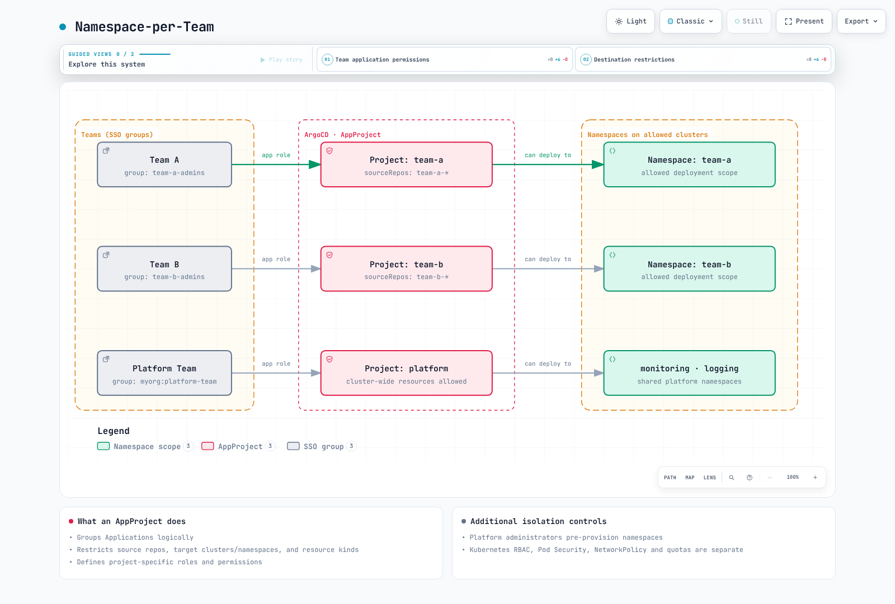

# ArgoCD Projects and RBAC

> **Reviewed Against**: Argo CD 3.5.2
> **Last Updated**: September 11, 2026

## Table of Contents
- [AppProject Overview](#appproject-overview)
- [Default Project](#default-project)
- [Custom Projects](#custom-projects)
- [RBAC Configuration](#rbac-configuration)
- [Multi-Tenancy Patterns](#multi-tenancy-patterns)
- [JWT Tokens for CI/CD](#jwt-tokens-for-cicd)
- [Orphaned Resource Monitoring](#orphaned-resource-monitoring)

## AppProject Overview

AppProjects provide logical grouping of Applications and define access controls for what resources can be deployed, where they can be deployed, and who can manage them.

AppProject restricts sources, destinations, rendered resource kinds and Argo CD API permissions. It does not replace Kubernetes RBAC, Pod Security Admission, NetworkPolicy or ResourceQuota. Denying the Pod kind does not prevent a Deployment from creating privileged Pods.

Supply real repository URLs, groups, registered clusters and namespaces. Platform administrators pre-create application namespaces and own their security/quota policies. Team/environment projects below do not allow cluster-scoped resources; the separate platform project is for trusted administrators. Full project examples are independent alternatives, including those sharing a name.

### Key Capabilities

| Feature | Description |
|---------|-------------|
| Source Restrictions | Limit which Git repositories can be used |
| Destination Restrictions | Limit target clusters and namespaces |
| Resource Allowlist/Denylist | Control which K8s resources can be created |
| Role Definitions | Define project-specific RBAC roles |
| Sync Windows | Define when applications can sync |

### AppProject Configuration Example

```yaml
apiVersion: argoproj.io/v1alpha1
kind: AppProject
metadata:
  name: my-project
  namespace: argocd
  finalizers:
  - resources-finalizer.argocd.argoproj.io
spec:
  description: Project description
  sourceRepos:
  - https://github.com/myorg/*
  - https://stefanprodan.github.io/podinfo
  destinations:
  - namespace: my-app-*
    server: https://kubernetes.default.svc
  - namespace: my-project-*
    server: https://production.k8s.local
  clusterResourceWhitelist: []
  namespaceResourceWhitelist:
  - group: '*'
    kind: '*'
  namespaceResourceBlacklist:
  - group: ''
    kind: LimitRange
  - group: ''
    kind: ResourceQuota
  roles:
  - name: developer
    description: Developer access
    policies:
    - p, proj:my-project:developer, applications, get, my-project/*, allow
    - p, proj:my-project:developer, applications, sync, my-project/*, allow
    groups:
    - my-org:developers
  syncWindows:
  - kind: allow
    schedule: 0 9 * * 1-5
    duration: 8h
    applications:
    - '*'
    timeZone: Asia/Seoul
  orphanedResources:
    warn: true
    ignore:
    - group: ''
      kind: ConfigMap
      name: kube-root-ca.crt
```

## Default Project

ArgoCD creates a default project permitting all sources, destinations and resource kinds. It can be restricted but not deleted.

### Default Project Specification

```yaml
apiVersion: argoproj.io/v1alpha1
kind: AppProject
metadata:
  name: default
  namespace: argocd
spec:
  description: Default project
  sourceRepos:
  - '*'
  destinations:
  - namespace: '*'
    server: '*'
  clusterResourceWhitelist:
  - group: '*'
    kind: '*'
```

### When to Use Default Project

- Development environments
- Quick testing
- Small teams without multi-tenancy requirements

### Restricting the Default Project

For production, restrict the default project:

```yaml
apiVersion: argoproj.io/v1alpha1
kind: AppProject
metadata:
  name: default
  namespace: argocd
spec:
  description: Restricted default project
  sourceRepos: []
  destinations: []
  sourceNamespaces: []
  clusterResourceWhitelist: []
  namespaceResourceBlacklist:
  - group: '*'
    kind: '*'
```

## Custom Projects

### Team-Based Project

```yaml
apiVersion: argoproj.io/v1alpha1
kind: AppProject
metadata:
  name: team-frontend
  namespace: argocd
spec:
  description: Frontend team project
  sourceRepos:
  - https://github.com/myorg/frontend-*
  - https://github.com/myorg/shared-libs
  destinations:
  - namespace: frontend-*
    server: https://kubernetes.default.svc
  - namespace: frontend-*
    server: https://staging.k8s.local
  - namespace: frontend-*
    server: https://production.k8s.local
  clusterResourceWhitelist: []
  roles:
  - name: admin
    description: Project admin
    policies:
    - p, proj:team-frontend:admin, applications, *, team-frontend/*, allow
    - p, proj:team-frontend:admin, repositories, *, team-frontend/*, allow
    groups:
    - myorg:frontend-leads
  - name: developer
    description: Developer access
    policies:
    - p, proj:team-frontend:developer, applications, get, team-frontend/*, allow
    - p, proj:team-frontend:developer, applications, sync, team-frontend/*, allow
    - p, proj:team-frontend:developer, applications, action/apps/Deployment/restart, team-frontend/*, allow
    groups:
    - myorg:frontend-devs
  - name: viewer
    description: Read-only access
    policies:
    - p, proj:team-frontend:viewer, applications, get, team-frontend/*, allow
    groups:
    - myorg:frontend-viewers
```

### Environment-Based Project

```yaml
apiVersion: argoproj.io/v1alpha1
kind: AppProject
metadata:
  name: production
  namespace: argocd
spec:
  description: Production environment project
  sourceRepos:
  - https://github.com/myorg/gitops-prod
  destinations:
  - namespace: prod-*
    server: https://production.k8s.local
  - namespace: prod-*
    server: https://production-dr.k8s.local
  clusterResourceWhitelist: []
  namespaceResourceBlacklist:
  - group: ''
    kind: ResourceQuota
  - group: ''
    kind: LimitRange
  syncWindows:
  - kind: allow
    schedule: 0 9 * * 1-5
    duration: 8h
    applications:
    - '*'
    manualSync: true
    timeZone: Asia/Seoul
  roles:
  - name: sre
    description: SRE team with full access
    policies:
    - p, proj:production:sre, applications, *, production/*, allow
    groups:
    - myorg:sre-team
  - name: deployer
    description: CI/CD deployment access
    policies:
    - p, proj:production:deployer, applications, sync, production/*, allow
    - p, proj:production:deployer, applications, get, production/*, allow
```

### Platform Infrastructure Project

```yaml
apiVersion: argoproj.io/v1alpha1
kind: AppProject
metadata:
  name: platform
  namespace: argocd
spec:
  description: Platform infrastructure components
  sourceRepos:
  - https://github.com/myorg/platform-*
  - https://prometheus-community.github.io/helm-charts
  - https://grafana-community.github.io/helm-charts
  - https://charts.jetstack.io
  - docker.io/envoyproxy
  destinations:
  - namespace: kube-system
    server: https://dev-cluster.example.com
  - namespace: kube-system
    server: https://staging-cluster.example.com
  - namespace: kube-system
    server: https://prod-cluster.example.com
  - namespace: monitoring
    server: https://dev-cluster.example.com
  - namespace: monitoring
    server: https://staging-cluster.example.com
  - namespace: monitoring
    server: https://prod-cluster.example.com
  - namespace: logging
    server: https://dev-cluster.example.com
  - namespace: logging
    server: https://staging-cluster.example.com
  - namespace: logging
    server: https://prod-cluster.example.com
  - namespace: envoy-gateway-system
    server: https://dev-cluster.example.com
  - namespace: envoy-gateway-system
    server: https://staging-cluster.example.com
  - namespace: envoy-gateway-system
    server: https://prod-cluster.example.com
  - namespace: cert-manager
    server: https://dev-cluster.example.com
  - namespace: cert-manager
    server: https://staging-cluster.example.com
  - namespace: cert-manager
    server: https://prod-cluster.example.com
  clusterResourceWhitelist:
  - group: '*'
    kind: '*'
  roles:
  - name: platform-admin
    description: Platform team admin
    policies:
    - p, proj:platform:platform-admin, applications, *, platform/*, allow
    - p, proj:platform:platform-admin, clusters, *, platform/*, allow
    - p, proj:platform:platform-admin, repositories, *, platform/*, allow
    groups:
    - myorg:platform-team
```

### Interpreting Scope and Verification

- An AppProject destination matches `(server OR registered name) AND namespace`; specifying both cluster identifiers does not add an AND constraint. These examples use server only. An Application's destination instead requires choosing server or name.
- ResourceQuota and LimitRange are namespaced; clusterResourceBlacklist cannot block them. Use namespaceResourceBlacklist for the Argo CD deployment path.
- Omitting namespaceResourceWhitelist permits namespaced kinds by default; explicit allow/deny lists are evaluated together. Cluster-scoped kinds require an allowlist. Argo CD 3.5.2 also supports name patterns in cluster resource lists.
- If delegating Namespace management, restrict its name too (group:'', kind:Namespace, name:team-a-*). This still permits Namespace label changes; pre-provisioning and admission controls are safer for tenant boundaries.
- manualSync permits manual exceptions outside an allow window; it does not disable automated sync or limit the exception to an on-call role. Review overlapping deny windows and explicit time zones in the sync chapter.
- Move existing Applications to explicit projects and verify access before restricting default.

## RBAC Configuration

ArgoCD RBAC is configured in the `argocd-rbac-cm` ConfigMap.

### RBAC Policy Syntax

```
p, <subject>, <resource>, <action>, <object>, <effect>
g, <subject>, <role>
```

| Field | Description |
|-------|-------------|
| `subject` | User, group, or role |
| `resource` | applications, clusters, repositories, etc. |
| `action` | get, create, update, delete, sync, etc. |
| `object` | Resource identifier (project/app or *) |
| `effect` | allow or deny |

### Built-in Roles

| Role | Description |
|------|-------------|
| `role:readonly` | Read-only access to all resources |
| `role:admin` | Full access to all resources |

### Complete RBAC Configuration

This example grants no implicit application access and assigns explicit group permissions. Developers are scoped to team-frontend. Leave role:authenticated without policy entries. Permissions granted by the default policy cannot be removed by a user deny; defaulting to role:readonly exposes cross-project reads. Do not copy/redefine built-in role rules in policy.csv.

```yaml
apiVersion: v1
kind: ConfigMap
metadata:
  name: argocd-rbac-cm
  namespace: argocd
  labels:
    app.kubernetes.io/part-of: argocd
data:
  policy.default: role:authenticated
  policy.matchMode: glob
  scopes: '[groups]'
  policy.csv: |
    # Built-in role:admin and role:readonly are already provided by Argo CD.
    p, role:developer, applications, get, team-frontend/*, allow
    p, role:developer, applications, sync, team-frontend/*, allow
    p, role:developer, applications, action/apps/Deployment/restart, team-frontend/*, allow
    p, role:developer, logs, get, team-frontend/*, allow
    p, role:viewer, applications, get, team-frontend/*, allow
    p, role:frontend-admin, applications, *, team-frontend/*, allow
    p, role:frontend-admin, logs, get, team-frontend/*, allow
    p, role:backend-admin, applications, *, team-b/*, allow
    p, role:backend-admin, logs, get, team-b/*, allow
    p, role:sre, applications, get, production/*, allow
    p, role:sre, applications, sync, production/*, allow
    p, role:sre, applications, action/apps/Deployment/restart, production/*, allow
    p, role:sre, logs, get, production/*, allow
    p, role:sre, exec, create, production/*, allow
    p, role:security-auditor, applications, get, */*, allow
    p, role:security-auditor, projects, get, *, allow
    p, role:security-auditor, repositories, get, *, allow
    g, platform-team, role:admin
    g, developers, role:developer
    g, frontend-team, role:frontend-admin
    g, backend-team, role:backend-admin
    g, viewers, role:viewer
    g, sre-team, role:sre
    g, security-team, role:security-auditor
    p, role:developer, projects, get, team-frontend, allow
    p, role:viewer, projects, get, team-frontend, allow
    p, role:frontend-admin, projects, get, team-frontend, allow
    p, role:backend-admin, projects, get, team-b, allow
    p, role:sre, projects, get, production, allow
```

Compose additional policy fragments into the existing ConfigMap data using Kustomize/Helm. Argo CD appends policy.example-N.csv keys to policy.csv. Do not apply each fragment as a replacement for the whole ConfigMap, and do not accumulate unrelated broad allow examples.

Argo CD API RBAC is separate from Kubernetes RBAC. The object project/app does not identify a destination namespace; Applications outside the control-plane namespace also use project/application-namespace/app. Glob matching does not treat slash as a separator, so include complete resource-action paths.

With the 3.x default, Application update/delete permissions do not automatically grant the same operation on child Kubernetes resources. Use update/<group>/<kind>/<namespace>/<name> or delete/... for those operations, considering server.rbac.disableApplicationFineGrainedRBACInheritance.

sync can create, update and prune deployed resources. Denying Application deletion does not prevent deletion through sync/prune. The rollback API also checks sync; there is no separate action/rollback or rollback-only permission. override allows source replacement such as local manifests, not simply force sync. application.sync.requireOverridePrivilegeForRevisionSync can require override when a revision is supplied.

### Resource-Specific Permissions

```yaml
policy.example-1.csv: |
  # Applications - fine-grained permissions
  p, role:deployer, applications, get, production/*, allow
  p, role:deployer, applications, sync, production/*, allow
  p, role:deployer, applications, update, production/*, deny
  p, role:deployer, applications, delete, production/*, deny

  # Cluster management
  p, role:cluster-admin, clusters, *, *, allow
  p, role:cluster-viewer, clusters, get, *, allow

  # Repository management
  p, role:repo-admin, repositories, *, *, allow
  p, role:repo-viewer, repositories, get, *, allow

  # Project-specific permissions
  p, role:team-a-admin, applications, *, team-a/*, allow
  p, role:team-a-admin, projects, get, team-a, allow

  # Exec into running pods (debugging)
  p, role:debugger, exec, create, production/*, allow
  p, role:debugger, applications, get, production/*, allow
```

### Application-Specific Actions

```yaml
policy.example-2.csv: |
  # Sync-only role (for CI/CD)
  p, role:sync-only, applications, get, production/*, allow
  p, role:sync-only, applications, sync, production/*, allow

  # Explicit Deployment restart resource action
  p, role:operator, applications, action/apps/Deployment/restart, production/*, allow

  # Rollback API requires sync; update is for changing the Application
  p, role:operator, applications, sync, production/*, allow
  p, role:operator, applications, get, production/*, allow
```

## Multi-Tenancy Patterns

### Namespace-per-Team



[🔍 View interactive diagram](https://www.atomai.click/kubernetes-docs/archmaps/en-gitops-argocd-06-projects-rbac-0.html)

Implementation:

```yaml
apiVersion: argoproj.io/v1alpha1
kind: AppProject
metadata:
  name: team-a
  namespace: argocd
spec:
  sourceRepos:
  - https://github.com/myorg/team-a-*
  destinations:
  - namespace: team-a
    server: https://kubernetes.default.svc
  - namespace: team-a-*
    server: https://kubernetes.default.svc
  clusterResourceWhitelist: []
  roles:
  - name: admin
    policies:
    - p, proj:team-a:admin, applications, *, team-a/*, allow
    groups:
    - team-a-admins
---
apiVersion: argoproj.io/v1alpha1
kind: AppProject
metadata:
  name: team-b
  namespace: argocd
spec:
  sourceRepos:
  - https://github.com/myorg/team-b-*
  destinations:
  - namespace: team-b
    server: https://kubernetes.default.svc
  - namespace: team-b-*
    server: https://kubernetes.default.svc
  clusterResourceWhitelist: []
  roles:
  - name: admin
    policies:
    - p, proj:team-b:admin, applications, *, team-b/*, allow
    groups:
    - team-b-admins
```

### Cluster-per-Environment

```yaml
apiVersion: argoproj.io/v1alpha1
kind: AppProject
metadata:
  name: development
  namespace: argocd
spec:
  sourceRepos:
  - https://github.com/myorg/dev-*
  destinations:
  - namespace: dev-*
    server: https://dev.k8s.local
  clusterResourceWhitelist: []
---
apiVersion: argoproj.io/v1alpha1
kind: AppProject
metadata:
  name: production
  namespace: argocd
spec:
  sourceRepos:
  - https://github.com/myorg/gitops-prod
  destinations:
  - namespace: prod-*
    server: https://prod.k8s.local
  clusterResourceWhitelist: []
  syncWindows:
  - kind: deny
    schedule: 0 0 * * 6
    duration: 48h
    applications:
    - '*'
    timeZone: Asia/Seoul
  namespaceResourceBlacklist:
  - group: ''
    kind: ResourceQuota
  - group: ''
    kind: LimitRange
```

## JWT Tokens for CI/CD

Create project-scoped tokens for automation.

### Create JWT Token

An operator authorized to update the project issues/revokes tokens; the CI role itself has get/sync only. Prepare my-project, its ci-deployer role and the my-app Application first. Rotate before expiration; the CLI default is no expiration.

```bash
set -euo pipefail
umask 077
# Run as an operator authorized to update my-project.
argocd proj role create-token my-project ci-deployer \
  --expires-in 24h --token-only > ./argocd-ci.token
# Store this file's value in the approved CI secret store; do not commit or print it.
```

Use `--id UNIQUE_ID` when an explicit identifier is needed; --token-id is not a 3.5.2 flag. expires-in accepts a duration such as 24h. The signed token value is returned at issuance, not stored for later retrieval.

### Use Token in CI/CD

Merge this role into the existing my-project AppProject; it does not create source/destination permissions or an Application by itself:

```yaml
spec:
  roles:
  - name: ci-deployer
    policies:
    - p, proj:my-project:ci-deployer, applications, get, my-project/*, allow
    - p, proj:my-project:ci-deployer, applications, sync, my-project/*, allow
```

The workflow syncs the revision declared by the Application, rather than forcing the workflow SHA. Pin targetRevision in Git when immutable revisions are required. Review the server override setting before using --revision. Configure the production Environment's approval/protection rules separately.

```yaml
name: Sync declared Argo CD application
'on':
  push:
    branches:
    - main
  workflow_dispatch: {}
permissions: {}
concurrency:
  group: argocd-my-project-my-app
  cancel-in-progress: false
jobs:
  sync:
    runs-on: ubuntu-24.04
    timeout-minutes: 15
    environment: production
    steps:
    - name: Install verified CLI
      shell: bash
      run: |
        set -euo pipefail
        ARGOCD_VERSION=v3.5.2
        case "$(uname -m)" in
          x86_64) cli_arch=amd64 ;;
          aarch64|arm64) cli_arch=arm64 ;;
          *) echo "Unsupported runner architecture" >&2; exit 1 ;;
        esac
        cli_asset="argocd-linux-${cli_arch}"
        cli_dir="$(mktemp -d)"
        trap 'rm -rf "$cli_dir"' EXIT
        cli_base="https://github.com/argoproj/argo-cd/releases/download/${ARGOCD_VERSION}"
        curl --fail --location --retry 3 "$cli_base/$cli_asset" -o "$cli_dir/$cli_asset"
        curl --fail --location --retry 3 "$cli_base/cli_checksums.txt" -o "$cli_dir/checksums.txt"
        awk -v artifact="$cli_asset" '$2 == artifact { print }' "$cli_dir/checksums.txt" > "$cli_dir/selected.sha256"
        test -s "$cli_dir/selected.sha256"
        (cd "$cli_dir" && sha256sum --check selected.sha256)
        install -m 0755 "$cli_dir/$cli_asset" "$RUNNER_TEMP/argocd"
    - name: Sync and wait
      shell: bash
      env:
        ARGOCD_SERVER: ${{ secrets.ARGOCD_SERVER }}
        ARGOCD_AUTH_TOKEN: ${{ secrets.ARGOCD_TOKEN }}
      run: |
        set -euo pipefail
        "$RUNNER_TEMP/argocd" app sync my-app --server "$ARGOCD_SERVER" --grpc-web --timeout 300
        "$RUNNER_TEMP/argocd" app wait my-app --server "$ARGOCD_SERVER" --grpc-web --sync --health --timeout 300
```

### Token Management

Token metadata is stored/normalized in the project's role/status records. Manually declaring iat/exp/id does not issue a signed token. Role-policy changes affect already-issued tokens. Use operator credentials to revoke one token by its ISSUED AT integer, not its ID label:

```bash
argocd proj role list-tokens my-project ci-deployer --unixtime

# Select one token's ISSUED AT value from the list, using operator credentials.
: "${SELECTED_ISSUED_AT:?Set the selected integer ISSUED AT value}"
argocd proj role delete-token my-project ci-deployer "$SELECTED_ISSUED_AT"
```

### Token Storage for In-Cluster CI

A Kubernetes Secret can store a previously issued token for a CI job. It is not an Argo CD token issuer, and there is no special argocd-token Secret type. Use the CI job's namespace and secure file input, for example:

```bash
kubectl create secret generic argocd-ci-token -n ci \
  --from-file=token=./argocd-ci.token
```

Provision the ci namespace and job RBAC first. Mount/read the Secret only in the authorized CI job, and rotate its value before token expiration. Do not put the token value in Git.

## Orphaned Resource Monitoring

Detect resources in target namespaces not managed by ArgoCD.

### Enable Orphaned Resource Monitoring

```yaml
apiVersion: argoproj.io/v1alpha1
kind: AppProject
metadata:
  name: my-project
  namespace: argocd
spec:
  orphanedResources:
    warn: true
    ignore:
    - group: ''
      kind: ConfigMap
      name: kube-root-ca.crt
    - group: ''
      kind: ServiceAccount
      name: default
    - group: ''
      kind: Secret
      name: default-token-*
  clusterResourceWhitelist: []
```

### View Orphaned Resources

```bash
argocd app resources my-app --orphaned

: "${ARGOCD_AUTH_TOKEN:?Provide an authorized token securely}"
curl --fail --silent --show-error --max-time 30 \
  -H "Authorization: Bearer $ARGOCD_AUTH_TOKEN" \
  https://argocd.example.com/api/v1/applications/my-app/resource-tree \
  | jq '.orphanedNodes'
```

Warnings are optional: warn:false still permits viewing orphan candidates. Resources denied by the project and built-in default objects have exceptions; narrow the monitored namespaces to avoid large kube-system scans.

### Review Before Cleanup

Orphan monitoring reports top-level namespaced resources that are not tracked by an Argo CD Application. They can still belong to another operator or be intentionally managed outside GitOps. The label selector `managed-by!=argocd` also matches resources with no such label and does not implement Argo CD tracking. Do not turn that selector into a PostSync deletion job.

Inspect the orphan list, owner references, the actual Argo CD tracking metadata and the owning controller before deciding whether a resource is obsolete. Exclude legitimate resources with narrowly scoped orphan-monitoring ignore rules. Any deletion should use an explicitly reviewed resource list and the appropriate backup/recovery procedure; the examples here only report candidates.

## Policy Validation

Save the base ConfigMap example as argocd-rbac-cm.yaml. The CLI also initializes a valid kubeconfig, but policy-file checks do not modify live settings. Check dynamic AppProject roles, actual SSO claims and Kubernetes admission separately.

```bash
argocd admin settings rbac validate --policy-file ./argocd-rbac-cm.yaml
argocd admin settings rbac can developers sync applications team-frontend/my-app \
  --policy-file ./argocd-rbac-cm.yaml
# Expected: No (exit 1)
argocd admin settings rbac can developers get applications team-b/my-app \
  --policy-file ./argocd-rbac-cm.yaml
```

validate may warn that built-in role:admin is absent from user CSV. can includes built-in policy by default; do not duplicate built-in roles to silence the warning. Check local-user/SSO-group collisions and actual group claims. An exec policy does not itself enable the terminal: also check exec.enabled and underlying Kubernetes permissions.

## References

- [Argo CD 3.5.2 RBAC](https://github.com/argoproj/argo-cd/blob/v3.5.2/docs/operator-manual/rbac.md)
- [Project matching and validation](https://github.com/argoproj/argo-cd/blob/v3.5.2/pkg/apis/application/v1alpha1/app_project_types.go)
- [Source Integrity](https://github.com/argoproj/argo-cd/blob/v3.5.2/docs/user-guide/source-integrity-git-gpg.md)
- [Project token CLI](https://github.com/argoproj/argo-cd/blob/v3.5.2/cmd/argocd/commands/project_role.go)

## Quiz

To test what you've learned, try the [ArgoCD Projects and RBAC quiz](../../quizzes/gitops/argocd/06-projects-rbac-quiz.md).
