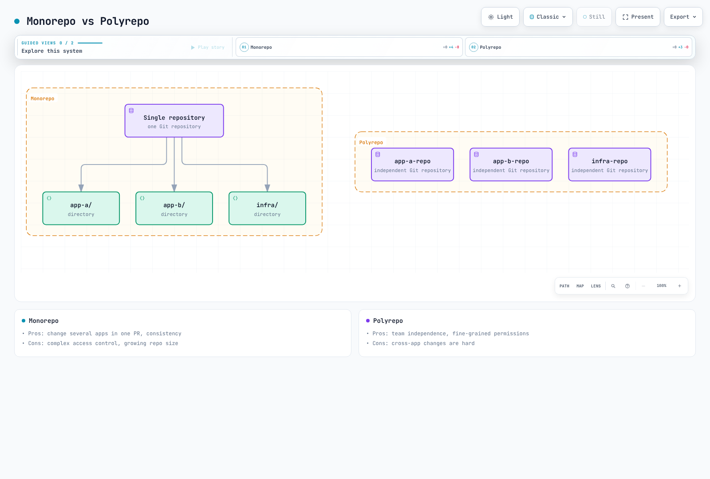

# ArgoCD Best Practices

> **Supported Versions**: Argo CD 3.5.2 / Helm Chart 10.8.4 / Kustomize 5.8.1
> **Last Updated**: September 11, 2026

## Table of Contents

- [Repository Structure](#repository-structure)
- [Environment Promotion](#environment-promotion)
- [Resource Management](#resource-management)
- [Performance Tuning](#performance-tuning)
- [Disaster Recovery](#disaster-recovery)
- [Upgrade Strategies](#upgrade-strategies)
- [Troubleshooting](#troubleshooting)
- [EKS Best Practices](#eks-best-practices)
- [Production Checklist](#production-checklist)

## Repository Structure

### Monorepo Pattern

Single repository for all applications and environments:

```
gitops-repo/
├── apps/
│   ├── app-a/
│   │   ├── base/
│   │   │   ├── deployment.yaml
│   │   │   ├── service.yaml
│   │   │   └── kustomization.yaml
│   │   └── overlays/
│   │       ├── dev/
│   │       │   ├── kustomization.yaml
│   │       │   └── patch.yaml
│   │       ├── staging/
│   │       │   ├── kustomization.yaml
│   │       │   └── patch.yaml
│   │       └── production/
│   │           ├── kustomization.yaml
│   │           └── patch.yaml
│   └── app-b/
│       └── ...
├── platform/
│   ├── argocd/
│   ├── monitoring/
│   └── ingress/
└── clusters/
    ├── dev/
    ├── staging/
    └── production/
```

**Pros:**
- Single source of truth
- Easy cross-application changes
- Simplified CI/CD
- One atomic Git commit can describe multiple apps; their cluster deployments are not one atomic transaction

**Cons:**
- Can become large
- Access control complexity
- Single point of failure



[🔍 View interactive diagram](https://www.atomai.click/kubernetes-docs/archmaps/en-gitops-argocd-09-best-practices-0.html)

### Polyrepo Pattern

Separate repositories per application or team:

```
Organization:
├── gitops-platform/          # Platform team
│   ├── argocd/
│   ├── monitoring/
│   └── ingress/
├── gitops-team-a/            # Team A applications
│   ├── app-a/
│   └── app-b/
├── gitops-team-b/            # Team B applications
│   ├── app-c/
│   └── app-d/
└── gitops-infra/             # Infrastructure
    ├── terraform/
    └── clusters/
```

**Pros:**
- Clear ownership
- Independent deployments
- Fine-grained access control
- Smaller repo sizes

**Cons:**
- Harder to coordinate changes
- More repositories to manage
- Potential for drift

### App of Apps Repository Structure

```
gitops-root/
├── argocd-apps/
│   ├── Chart.yaml
│   ├── values.yaml
│   ├── values-dev.yaml
│   ├── values-staging.yaml
│   ├── values-production.yaml
│   └── templates/
│       ├── _helpers.tpl
│       ├── namespace.yaml
│       ├── project.yaml
│       ├── app-a.yaml
│       ├── app-b.yaml
│       └── platform-apps.yaml
└── bootstrap/
    └── root-app.yaml
```

### Recommended Naming Conventions

| Type | Pattern | Example |
|------|---------|---------|
| Application | `{app}-{env}` | `frontend-production` |
| Project | `{team}` or `{env}` | `platform`, `production` |
| Namespace | `{app}` or `{app}-{env}` | `frontend`, `frontend-prod` |
| Repository | `gitops-{scope}` | `gitops-platform` |

## Environment Promotion

### Git Branch Strategy

Long-lived environment branches are one option; directory-based overlays on a shared main branch often reduce branch divergence. App of Apps is an administrative capability: restrict access to the root repository and child Application creation. A manual production sync is a separate gate from a reviewed Git change.

### Directory-Based Promotion

Promote the same tested artifact without rebuilding it per environment. These examples assume existing bases and registry-enforced immutable tags; prefer digests when tag immutability is not guaranteed. Changing the contents of a mutable tag does not itself update Git or a Deployment Pod template. The base image name is `my-app`; apply name/tag transformations together in the overlay. An overlay matching an old name will not update an image already renamed by the base.

```yaml
# overlays/dev/kustomization.yaml
apiVersion: kustomize.config.k8s.io/v1beta1
kind: Kustomization
resources:
  - ../../base
images:
  - name: my-app
    newName: my-registry/my-app
    newTag: v1.2.3

---
# overlays/staging/kustomization.yaml
apiVersion: kustomize.config.k8s.io/v1beta1
kind: Kustomization
resources:
  - ../../base
images:
  - name: my-app
    newName: my-registry/my-app
    newTag: v1.2.3

---
# overlays/production/kustomization.yaml
apiVersion: kustomize.config.k8s.io/v1beta1
kind: Kustomization
resources:
  - ../../base
images:
  - name: my-app
    newName: my-registry/my-app
    newTag: v1.2.3
```

### Automated Promotion Pipeline

This workflow opens a PR for an **already tested digest**. Adapt the example registry and overlay path. Supply `GITOPS_PR_TOKEN` using a GitHub App token or scoped token with contents/pull requests write access to the target repository. Changes made with the default GITHUB_TOKEN have follow-up workflow trigger restrictions; verify required checks can run. Enforce review, tests, and artifact policies through repository rulesets/branch protection.

```yaml
name: Promote tested image to production
on:
  workflow_dispatch:
    inputs:
      digest:
        description: 'Tested image digest (sha256: followed by 64 hex characters)'
        required: true
        type: string
permissions:
  contents: read
concurrency:
  group: promote-production
  cancel-in-progress: false
jobs:
  promote:
    runs-on: ubuntu-24.04
    steps:
      - uses: actions/checkout@3d3c42e5aac5ba805825da76410c181273ba90b1 # v7.0.1
        with:
          persist-credentials: false
      - name: Install verified Kustomize
        shell: bash
        run: |
          set -euo pipefail
          tool_dir="$RUNNER_TEMP/kustomize-bin"
          mkdir -p "$tool_dir"
          cd "$tool_dir"
          curl -fsSL -o kustomize.tar.gz \
            https://github.com/kubernetes-sigs/kustomize/releases/download/kustomize/v5.8.1/kustomize_v5.8.1_linux_amd64.tar.gz
          echo "029a7f0f4e1932c52a0476cf02a0fd855c0bb85694b82c338fc648dcb53a819d  kustomize.tar.gz" | sha256sum -c -
          tar -xzf kustomize.tar.gz kustomize
          echo "$tool_dir" >> "$GITHUB_PATH"
      - name: Update production overlay
        env:
          IMAGE_DIGEST: ${{ inputs.digest }}
        shell: bash
        run: |
          set -euo pipefail
          [[ "$IMAGE_DIGEST" =~ ^sha256:[a-f0-9]{64}$ ]] || exit 1
          cd overlays/production
          kustomize edit set image "my-app=my-registry/my-app@${IMAGE_DIGEST}"
          kustomize build . > /dev/null
      - name: Create reviewed promotion PR
        uses: peter-evans/create-pull-request@5f6978faf089d4d20b00c7766989d076bb2fc7f1 # v8.1.1
        with:
          token: ${{ secrets.GITOPS_PR_TOKEN }}
          branch: promote-production
          title: 'Promote tested image to production'
          commit-message: 'chore: promote tested image digest'
          add-paths: overlays/production/kustomization.yaml
          body: |
            Promote the already tested image digest: ${{ inputs.digest }}
            Require the repository's validation and approval checks before merging.
```

## Resource Management

### Component Resources

These Chart 10.8.4 values are **measurement starting points**, not a guaranteed sizing table. Merge them into your existing values and retain one deployment owner. The chart supplies the correct container names and workload types; avoid incomplete Deployment patches that accidentally add a container.

```yaml
fullnameOverride: argocd
controller:
  replicas: 1
  resources:
    requests:
      cpu: 500m
      memory: 1Gi
    limits:
      cpu: '2'
      memory: 4Gi
server:
  replicas: 2
  resources:
    requests:
      cpu: 100m
      memory: 256Mi
    limits:
      cpu: 500m
      memory: 512Mi
repoServer:
  replicas: 2
  resources:
    requests:
      cpu: 200m
      memory: 512Mi
    limits:
      cpu: '1'
      memory: 2Gi
```

| Measurement | Tuning direction |
|---|---|
| Manifest time, concurrent requests, repository size | repo-server CPU/memory, parallelism, disk |
| Resource counts per cluster and watch/cache memory | Controller memory and cluster distribution |
| Reconciliation/sync queue delay and API throttling | Processor concurrency together with target API capacity |
| CPU throttling, OOM, and restarts | Requests/limits together with concurrent execution |

Application count alone does not establish a 100/500-app sharding threshold. Redis is a rebuildable cache, but cache loss can cause recomputation load and latency. Apply the node/anti-affinity/PDB prerequisites in the [HA installation section](01-installation.md#high-availability-setup). Do not blindly replicate every component.

### Optional repo-server HPA

This requires Metrics Server and CPU requests. With HPA enabled, it owns the replica count. CPU scaling does not explain every manifest-generation bottleneck; scaling solely on persistent cache memory can keep unnecessary replicas running.

```yaml
repoServer:
  autoscaling:
    enabled: true
    minReplicas: 2
    maxReplicas: 5
    targetCPUUtilizationPercentage: 70
    targetMemoryUtilizationPercentage: null
    behavior:
      scaleDown:
        stabilizationWindowSeconds: 300
```

## Performance Tuning

### Configuration Location and Meaning

Merge these into the same Helm values. `configs.params` produces `argocd-cmd-params-cm`; `configs.cm` produces `argocd-cm`. Values consumed through command-line/environment settings require the affected controller/repo-server/server rollout; verify the rendered Pod and startup logs.

```yaml
configs:
  params:
    controller.status.processors: '20'
    controller.operation.processors: '10'
    controller.repo.server.timeout.seconds: '180'
    server.repo.server.timeout.seconds: '180'
    reposerver.parallelism.limit: '2'
    reposerver.repo.cache.expiration: 24h
    reposerver.git.request.timeout: 30s
    reposerver.git.lsremote.parallelism.limit: '5'
  cm:
    timeout.reconciliation: 300s
    timeout.reconciliation.jitter: 60s
    application.resourceTrackingMethod: annotation
repoServer:
  env:
  - name: ARGOCD_EXEC_TIMEOUT
    value: 2m
```

- Status/operation processors control concurrency, not polling frequency; 20/10 are the default concurrency values.
- The 180-second repo-server RPC timeout, two-minute tool execution timeout, and thirty-second Git request timeout are different limits. Identify the slow stage and cancellation behavior before increasing them.
- `reposerver.parallelism.limit` limits concurrent manifest generation, not cache TTL. Load-test it against memory/process limits.
- Default periodic reconciliation is 120 seconds plus up to 60 seconds of jitter. The example uses 300 + 60 seconds (five–six minutes); webhooks and other refresh causes are separate.
- `application.resourceTrackingMethod` sets resource tracking, not refresh frequency. Review migration effects before changing an existing tracking method.

### Sharding Multiple Destination Clusters

The default sharding unit is the destination **cluster**. Increasing replicas does not evenly distribute all Applications targeting one cluster. The chart coordinates StatefulSet replicas with `ARGOCD_CONTROLLER_REPLICAS`. Round-robin/consistent-hashing and dynamic cluster distribution are experimental in this version; do not present them as universal production defaults.

```yaml
controller:
  replicas: 3
configs:
  params:
    controller.sharding.algorithm: legacy
```

### Application Boundaries and HPA

Split large Applications along ownership and lifecycle boundaries. Arbitrary resource-kind splits complicate Secret/Service/Deployment dependencies and deletion order. Child Applications in App of Apps are not a single atomic deployment.

This example assumes an existing `workloads` project, destination namespace, and HPA controlling Deployment `my-app`. Prefer omitting replicas from Git; where necessary, scope diff/apply exclusions to that resource. Match `ignoreDifferences.name` to the final name after any Kustomize prefix/suffix. `ApplyOutOfSyncOnly` optimizes apply targets; it does not change sync frequency.

```yaml
apiVersion: argoproj.io/v1alpha1
kind: Application
metadata:
  name: large-app
  namespace: argocd
spec:
  project: workloads
  source:
    repoURL: https://github.com/myorg/gitops.git
    targetRevision: main
    path: overlays/production
  destination:
    server: https://kubernetes.default.svc
    namespace: my-app-production
  syncPolicy:
    automated:
      enabled: true
      prune: true
      selfHeal: true
    syncOptions:
    - ApplyOutOfSyncOnly=true
    - RespectIgnoreDifferences=true
  ignoreDifferences:
  - group: apps
    kind: Deployment
    name: my-app
    namespace: my-app-production
    jsonPointers:
    - /spec/replicas
```

## Disaster Recovery

### Backup Scope

`argocd admin export` exports Applications/AppProjects/ApplicationSets, four core ConfigMaps, and selected Argo CD Secrets. It is **not a full namespace backup**. Do not assume cmd-params, Notifications/CMP configuration, and separately managed TLS/notification Secrets are all included. Check configured additional Application/ApplicationSet namespaces as well.

Use the matching CLI version, a verified kubecontext, the `age` tool, and an approved public recipient. Keep private identities separately and test decryption/recovery. The supplemental snapshot encrypts all namespace ConfigMaps/Secrets, potentially including Helm release Secrets. Select the required objects during recovery; do not blindly apply the whole supplemental snapshot.

```bash
#!/usr/bin/env bash
set -euo pipefail
umask 077
: "${ARGO_BACKUP_RECIPIENT:?Set the approved age public recipient}"
ARGO_BACKUP_DIR="./argocd-backup-$(date -u +%Y%m%dT%H%M%SZ)"
mkdir -m 700 "$ARGO_BACKUP_DIR"
kubectl config current-context
kubectl get configmap argocd-cm -n argocd -o name

argocd admin export -n argocd |
  age --recipient "$ARGO_BACKUP_RECIPIENT" --output "$ARGO_BACKUP_DIR/data.yaml.age.tmp"
mv "$ARGO_BACKUP_DIR/data.yaml.age.tmp" "$ARGO_BACKUP_DIR/data.yaml.age"

# Supplement: all namespace ConfigMaps/Secrets, including custom configuration.
kubectl get configmaps,secrets -n argocd -o yaml |
  age --recipient "$ARGO_BACKUP_RECIPIENT" --output "$ARGO_BACKUP_DIR/namespace-config.yaml.age.tmp"
mv "$ARGO_BACKUP_DIR/namespace-config.yaml.age.tmp" "$ARGO_BACKUP_DIR/namespace-config.yaml.age"
```

Also retain pinned installation manifests/Helm values, CRDs and extension controllers, and recovery procedures for external secrets/KMS, SSO, DNS, and certificates. Application databases/PVs need separate backups. Choose backup frequency and retention from your RPO/RTO and access policy.

### Velero Configuration Backup Alternative

This Schedule assumes an installed Velero and an available `aws-s3` BackupStorageLocation. Verify schedule timezone, encryption, and access control. A part-of label selector can omit user-created Applications, so the example has no such filter. CRD/installation/PV recovery remains a separate part of DR.

```yaml
apiVersion: velero.io/v1
kind: Schedule
metadata:
  name: argocd-config-backup
  namespace: velero
spec:
  schedule: 0 2 * * *
  template:
    includedNamespaces:
    - argocd
    includedResources:
    - applications.argoproj.io
    - applicationsets.argoproj.io
    - appprojects.argoproj.io
    - secrets
    - configmaps
    includeClusterResources: false
    storageLocation: aws-s3
    ttl: 720h0m0s
```

### Staged Recovery

First prepare an **isolated recovery installation** using the original version and installation method. Establish one active manager so the primary and recovery instances do not mutate the same workloads concurrently. For the default StatefulSet layout, stop Application and ApplicationSet controllers while inspecting import changes. Adapt the workload type for dynamic distribution.

```bash
set -euo pipefail
umask 077
: "${ARGO_BACKUP_FILE:?Set the encrypted data.yaml.age path}"
: "${ARGO_BACKUP_IDENTITY:?Set the protected age identity file}"

# Fresh, isolated recovery installation: default StatefulSet controller layout.
kubectl config current-context
kubectl scale statefulset/argocd-application-controller -n argocd --replicas=0
kubectl scale deployment/argocd-applicationset-controller -n argocd --replicas=0

ARGO_RESTORE_DIR="$(mktemp -d)"
trap 'rm -rf "$ARGO_RESTORE_DIR"' EXIT
age --decrypt --identity "$ARGO_BACKUP_IDENTITY" "$ARGO_BACKUP_FILE" \
  > "$ARGO_RESTORE_DIR/data.yaml"
argocd admin import -n argocd --dry-run "$ARGO_RESTORE_DIR/data.yaml"
# Keep controllers stopped while reviewing the recovery copy and destinations.
```

Review the protected recovery file in the same shell: destination clusters/namespaces, repository/cluster credentials, deletion finalizers, automated sync policies, and stored `operation` fields. To hold automatic sync, update both Applications and ApplicationSet templates and remove pending operations from the recovery copy. Check whether the Git/Helm source would revert these holds before restarting controllers.

```bash
argocd admin import -n argocd "$ARGO_RESTORE_DIR/data.yaml"
```

Recover the needed supplemental ConfigMaps/Secrets and external dependencies, then restore controller replicas from the reviewed installation configuration. Inspect representative Application diffs/health before resuming deployments individually. An all-app sync, import `--prune`, or namespace deletion is not a default recovery step.

## Upgrade Strategies

### Version and Installation Ownership

The example targets a reviewed 3.5.x patch update to 3.5.2, not an unconditional jump from 2.x or older minors. Review every intervening minor/major migration note, tested Kubernetes combination, and CRD/RBAC/SSO/CMP change in non-production. Preserve the existing manifest/Helm/GitOps owner. Do not apply this self-managed procedure to the EKS managed Argo CD capability.

```bash
# Example: reviewed 3.5.x patch upgrade to 3.5.2, manifest-managed non-HA install.
kubectl config current-context
argocd version
kubectl apply --server-side -n argocd \
  -f https://raw.githubusercontent.com/argoproj/argo-cd/v3.5.2/manifests/install.yaml
kubectl rollout status deployment/argocd-server -n argocd --timeout=5m
kubectl rollout status deployment/argocd-repo-server -n argocd --timeout=5m
kubectl rollout status statefulset/argocd-application-controller -n argocd --timeout=5m
kubectl rollout status deployment/argocd-applicationset-controller -n argocd --timeout=5m
kubectl rollout status deployment/argocd-notifications-controller -n argocd --timeout=5m
argocd version
argocd app list
```

For an HA manifest installation use `manifests/ha/install.yaml`; for custom overlays update and render the pinned base. Server-side apply handles large CRDs. Inspect field-ownership conflicts first; use the official guide’s `--force-conflicts` only for an intended ownership transfer. Successful Pod rollouts do not complete migration, SSO, diff, and sync validation.

### Alternative for Helm-Managed Installations

```bash
helm repo add argo https://argoproj.github.io/argo-helm
helm repo update argo
helm upgrade argocd argo/argo-cd --version 10.8.4 \
  --namespace argocd -f reviewed-values.yaml --dry-run=server --hide-secret
# After reviewing the dry run and the version-specific migration notes:
helm upgrade argocd argo/argo-cd --version 10.8.4 \
  --namespace argocd -f reviewed-values.yaml --wait --timeout 10m
```

`--hide-secret` suppresses Secret manifests in dry-run output; also check for sensitive values embedded elsewhere. CRD, persisted data, and integration changes may not be reversed by an image rollback, so retain a tested backup/recovery plan.

### Limits of Side-by-Side Validation

Two namespaces on one cluster still share CRDs and other cluster-scoped resources. Changing only the installation namespace does not rewrite ClusterRoleBinding subjects. Kubernetes has no `kubectl rename namespace` command. Prefer validating in a separate cluster and explicitly plan credentials, tracking/instance IDs, active controllers, and traffic cutover. Deleting the old namespace can cascade through Application finalizers into managed workloads.

## Troubleshooting

### Inspect Sync and Differences

```bash
argocd app get my-app
argocd app diff my-app
argocd app history my-app
argocd app resources my-app
kubectl describe application my-app -n argocd
kubectl logs -n argocd -l app.kubernetes.io/name=argocd-application-controller --tail=100

# Re-check desired state after identifying the cause; this does not apply resources.
argocd app get my-app --refresh
# Invalidates the cached target manifests for this Application; use sparingly.
argocd app get my-app --hard-refresh
```

`--force` is not a generic troubleshooting option and can recreate resources. Hard refresh does not apply or roll back workloads, but regenerates manifests; avoid repeatedly running it across all apps.

### Repositories and Webhooks

```bash
argocd repo list
argocd repo get https://github.com/myorg/myrepo.git
kubectl logs -n argocd deployment/argocd-repo-server --tail=100
kubectl get secrets -n argocd -l argocd.argoproj.io/secret-type=repository
kubectl logs -n argocd deployment/argocd-server --tail=100 | grep -i webhook
```

Check TLS/SSH trust, credential scope, DNS/egress, and provider webhook signatures, URL, and delivery logs. Listing Secret names does not require printing credential values. `argocd repo update --repo-cache-expiration` is not a valid cache-configuration command.

### OOM and Slow Processing

```bash
kubectl top pods -n argocd
kubectl get pods -n argocd
kubectl describe pods -n argocd -l app.kubernetes.io/name=argocd-repo-server
argocd app get my-app -o json |
  jq '.status.operationState | {phase, startedAt, finishedAt}'
```

Distinguish OOMKilled from CPU throttling, clone-disk pressure, large manifests, Git timeouts, and API throttling. Adjust resources/concurrency through the Helm/Git owner. Deleting all repo-server Pods does not clear Redis manifest cache and adds interruption/clone load.

### Additional Checks

```bash
argocd app manifests my-app
argocd app list -o wide
argocd cluster list
argocd cluster get https://my-target-cluster.example.com
kubectl logs -n argocd statefulset/argocd-application-controller --tail=100
kubectl logs -n argocd deployment/argocd-server --tail=100
kubectl logs -n argocd deployment/argocd-repo-server --tail=100
```

Rendered manifests can include generated Secrets; keep them out of shared logs. The default controller is a StatefulSet; inspect the actual Deployment if dynamic distribution is enabled. Scope temporary debug logging to the affected component and manage its rollout and removal.

## EKS Best Practices

### AWS Credentials

A ServiceAccount role ARN alone does not complete target EKS access. Configure controller/server EKS authentication, assume-role permissions, target EKS access entries or legacy auth mapping, and Kubernetes RBAC. Give repo-server a separate least-privilege role only when S3/OCI/CMP access requires it. IRSA OIDC trust or a Pod Identity association is also required; this is not the same as image-pull authorization. Follow the [EKS installation section](01-installation.md#argocd-on-amazon-eks) for the actual destination and service accounts.

### Internal ALB with HTTPS

This requires AWS Load Balancer Controller, administrator connectivity to the VPC, matching DNS/ACM certificate, restricted security groups, and SSO. Replace the certificate ARN and hostname. The backend remains HTTPS with `server.insecure=false`; CLI access through this single HTTP target group uses `--grpc-web`.

```yaml
apiVersion: networking.k8s.io/v1
kind: Ingress
metadata:
  name: argocd
  namespace: argocd
  annotations:
    alb.ingress.kubernetes.io/scheme: internal
    alb.ingress.kubernetes.io/target-type: ip
    alb.ingress.kubernetes.io/backend-protocol: HTTPS
    alb.ingress.kubernetes.io/healthcheck-protocol: HTTPS
    alb.ingress.kubernetes.io/healthcheck-path: /healthz
    alb.ingress.kubernetes.io/listen-ports: '[{"HTTPS":443}]'
    alb.ingress.kubernetes.io/certificate-arn: arn:aws:acm:ap-northeast-2:123456789012:certificate/REPLACE_WITH_CERTIFICATE_ID
    alb.ingress.kubernetes.io/ssl-policy: ELBSecurityPolicy-TLS13-1-2-2021-06
spec:
  ingressClassName: alb
  rules:
  - host: argocd.example.com
    http:
      paths:
      - path: /
        pathType: Prefix
        backend:
          service:
            name: argocd-server
            port:
              number: 443
```

Attach a reviewed regional WAF Web ACL in the same region through its separate annotation. Verify the ALB access-log bucket policy and region. Do not enable subscription/cost-bearing options such as Shield Advanced by default.

### EKS Version Upgrades

Check the tested current/target EKS and Argo CD combinations, add-on/CRD/node/kubelet compatibility, and removed APIs. Upgrade EKS control planes one minor at a time; node/add-on updates are separate. An in-place version update does not require changing the existing API endpoint. A replacement cluster does require endpoint/CA/access updates.

If holding automatic sync, record the original settings and change their Git/ApplicationSet owner. A CLI-only child Application change can be reverted by its parent. After connectivity, diff, and sample-sync verification, restore the **original** prune/selfHeal/automated policy instead of unconditionally enabling automation.

## Production Checklist

- [ ] Verify SSO/RBAC/TLS and recovery access before disabling the default admin
- [ ] Encrypt/externalize secrets and scope repository/cluster credentials
- [ ] Measure resources, concurrency, and whether cluster sharding is needed
- [ ] Verify HA nodes/anti-affinity/PDBs and component-specific replicas/leader election
- [ ] Validate metrics/ServiceMonitor selection and alert delivery; collect JSON logs and Kubernetes audit/events
- [ ] Enforce AppProject source/destination, sync windows, and reviewed promotion PRs
- [ ] Test encrypted backup decryption, supplemental configuration recovery, and single-manager DR
- [ ] Maintain version-specific upgrade, troubleshooting, and configuration restoration runbooks

## References

- [Best practices](https://argo-cd.readthedocs.io/en/release-3.5/user-guide/best_practices/)
- [High availability and scaling](https://argo-cd.readthedocs.io/en/release-3.5/operator-manual/high_availability/)
- [Backup implementation and scope](https://github.com/argoproj/argo-cd/blob/v3.5.2/cmd/argocd/commands/admin/backup.go)
- [Upgrade guide](https://argo-cd.readthedocs.io/en/release-3.5/operator-manual/upgrading/overview/)
- [Chart 10.8.4 values](https://github.com/argoproj/argo-helm/blob/argo-cd-10.8.4/charts/argo-cd/values.yaml)
- [Kustomize bundled version](https://github.com/argoproj/argo-cd/blob/v3.5.2/hack/tool-versions.sh)
- [Velero schedules](https://velero.io/docs/main/backup-reference/#schedule-a-backup)

## Quiz

Try the [best practices quiz](../../quizzes/gitops/argocd/09-best-practices-quiz.md).
