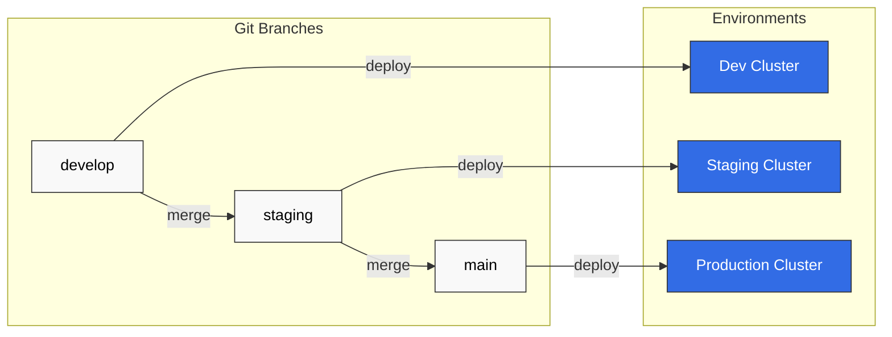

# ArgoCD Best Practices

> **Supported Versions**: ArgoCD v2.9+
> **Last Updated**: February 22, 2026

## Table of Contents
- [Repository Structure](#repository-structure)
- [Environment Promotion](#environment-promotion)
- [Resource Management](#resource-management)
- [Performance Tuning](#performance-tuning)
- [Disaster Recovery](#disaster-recovery)
- [Upgrade Strategies](#upgrade-strategies)
- [Troubleshooting](#troubleshooting)
- [EKS Best Practices](#eks-best-practices)
- [Production Checklist](#production-checklist)

## Repository Structure

### Monorepo Pattern

Single repository for all applications and environments:

```
gitops-repo/
├── apps/
│   ├── app-a/
│   │   ├── base/
│   │   │   ├── deployment.yaml
│   │   │   ├── service.yaml
│   │   │   └── kustomization.yaml
│   │   └── overlays/
│   │       ├── dev/
│   │       │   ├── kustomization.yaml
│   │       │   └── patch.yaml
│   │       ├── staging/
│   │       │   ├── kustomization.yaml
│   │       │   └── patch.yaml
│   │       └── production/
│   │           ├── kustomization.yaml
│   │           └── patch.yaml
│   └── app-b/
│       └── ...
├── platform/
│   ├── argocd/
│   ├── monitoring/
│   └── ingress/
└── clusters/
    ├── dev/
    ├── staging/
    └── production/
```

**Pros:**
- Single source of truth
- Easy cross-application changes
- Simplified CI/CD
- Atomic multi-app updates

**Cons:**
- Can become large
- Access control complexity
- Single point of failure

### Polyrepo Pattern

Separate repositories per application or team:

```
Organization:
├── gitops-platform/          # Platform team
│   ├── argocd/
│   ├── monitoring/
│   └── ingress/
├── gitops-team-a/            # Team A applications
│   ├── app-a/
│   └── app-b/
├── gitops-team-b/            # Team B applications
│   ├── app-c/
│   └── app-d/
└── gitops-infra/             # Infrastructure
    ├── terraform/
    └── clusters/
```

**Pros:**
- Clear ownership
- Independent deployments
- Fine-grained access control
- Smaller repo sizes

**Cons:**
- Harder to coordinate changes
- More repositories to manage
- Potential for drift

### App of Apps Repository Structure

```
gitops-root/
├── argocd-apps/
│   ├── Chart.yaml
│   ├── values.yaml
│   ├── values-dev.yaml
│   ├── values-staging.yaml
│   ├── values-production.yaml
│   └── templates/
│       ├── _helpers.tpl
│       ├── namespace.yaml
│       ├── project.yaml
│       ├── app-a.yaml
│       ├── app-b.yaml
│       └── platform-apps.yaml
└── bootstrap/
    └── root-app.yaml
```

### Recommended Naming Conventions

| Type | Pattern | Example |
|------|---------|---------|
| Application | `{app}-{env}` | `frontend-production` |
| Project | `{team}` or `{env}` | `platform`, `production` |
| Namespace | `{app}` or `{app}-{env}` | `frontend`, `frontend-prod` |
| Repository | `gitops-{scope}` | `gitops-platform` |

## Environment Promotion

### Git Branch Strategy



### Directory-Based Promotion

```yaml
# overlays/dev/kustomization.yaml
apiVersion: kustomize.config.k8s.io/v1beta1
kind: Kustomization
resources:
  - ../../base
images:
  - name: myapp
    newTag: dev-abc1234

# overlays/staging/kustomization.yaml
apiVersion: kustomize.config.k8s.io/v1beta1
kind: Kustomization
resources:
  - ../../base
images:
  - name: myapp
    newTag: v1.2.3-rc1

# overlays/production/kustomization.yaml
apiVersion: kustomize.config.k8s.io/v1beta1
kind: Kustomization
resources:
  - ../../base
images:
  - name: myapp
    newTag: v1.2.3
```

### Automated Promotion Pipeline

```yaml
# .github/workflows/promote.yaml
name: Promote to Production
on:
  workflow_dispatch:
    inputs:
      version:
        description: 'Version to promote'
        required: true

jobs:
  promote:
    runs-on: ubuntu-latest
    steps:
      - uses: actions/checkout@v4

      - name: Update production overlay
        run: |
          cd overlays/production
          kustomize edit set image myapp=myregistry/myapp:${{ github.event.inputs.version }}

      - name: Create Pull Request
        uses: peter-evans/create-pull-request@v5
        with:
          title: "Promote ${{ github.event.inputs.version }} to production"
          branch: promote/${{ github.event.inputs.version }}
          commit-message: "chore: promote ${{ github.event.inputs.version }} to production"
```

## Resource Management

### ArgoCD Component Resources

```yaml
# Helm values for production
controller:
  resources:
    requests:
      cpu: 500m
      memory: 512Mi
    limits:
      cpu: 2000m
      memory: 2Gi

server:
  resources:
    requests:
      cpu: 250m
      memory: 256Mi
    limits:
      cpu: 1000m
      memory: 1Gi

repoServer:
  resources:
    requests:
      cpu: 500m
      memory: 512Mi
    limits:
      cpu: 2000m
      memory: 2Gi

redis:
  resources:
    requests:
      cpu: 100m
      memory: 128Mi
    limits:
      cpu: 500m
      memory: 512Mi
```

### Resource Limits by Scale

| Scale | Applications | Controller CPU | Controller Memory | Repo Server CPU | Repo Server Memory |
|-------|--------------|----------------|-------------------|-----------------|-------------------|
| Small | < 50 | 500m | 512Mi | 500m | 512Mi |
| Medium | 50-200 | 1000m | 1Gi | 1000m | 1Gi |
| Large | 200-500 | 2000m | 2Gi | 2000m | 2Gi |
| X-Large | > 500 | 4000m | 4Gi | 4000m | 4Gi |

### Horizontal Pod Autoscaler

```yaml
apiVersion: autoscaling/v2
kind: HorizontalPodAutoscaler
metadata:
  name: argocd-repo-server
  namespace: argocd
spec:
  scaleTargetRef:
    apiVersion: apps/v1
    kind: Deployment
    name: argocd-repo-server
  minReplicas: 2
  maxReplicas: 10
  metrics:
    - type: Resource
      resource:
        name: cpu
        target:
          type: Utilization
          averageUtilization: 70
    - type: Resource
      resource:
        name: memory
        target:
          type: Utilization
          averageUtilization: 80
```

## Performance Tuning

### Controller Optimization

```yaml
apiVersion: v1
kind: ConfigMap
metadata:
  name: argocd-cmd-params-cm
  namespace: argocd
data:
  # Reduce reconciliation frequency
  controller.status.processors: "50"
  controller.operation.processors: "25"
  controller.self.heal.timeout.seconds: "5"

  # Increase cache TTL
  controller.repo.server.timeout.seconds: "180"

  # Sharding for large deployments
  controller.sharding.algorithm: round-robin
```

### Repo Server Optimization

```yaml
apiVersion: v1
kind: ConfigMap
metadata:
  name: argocd-cmd-params-cm
  namespace: argocd
data:
  # Increase parallelism
  reposerver.parallelism.limit: "10"

  # Cache settings
  reposerver.repo.cache.expiration: "24h"

  # Git optimization
  reposerver.git.request.timeout: "60s"
  reposerver.git.lsremote.parallelism: "5"
```

### Redis Optimization

```yaml
# For high-traffic deployments, use Redis HA
redis-ha:
  enabled: true
  redis:
    config:
      maxmemory: "512mb"
      maxmemory-policy: "allkeys-lru"
  haproxy:
    enabled: true
    replicas: 3
```

### Application-Level Optimization

```yaml
apiVersion: argoproj.io/v1alpha1
kind: Application
metadata:
  name: large-app
  namespace: argocd
spec:
  # Reduce sync frequency for stable apps
  syncPolicy:
    automated:
      prune: true
      selfHeal: true
    syncOptions:
      - ApplyOutOfSyncOnly=true  # Only apply changed resources

  # Ignore frequently changing fields
  ignoreDifferences:
    - group: apps
      kind: Deployment
      jsonPointers:
        - /spec/replicas
    - group: "*"
      kind: "*"
      managedFieldsManagers:
        - kube-controller-manager
```

## Disaster Recovery

### Backup Strategy

```bash
#!/bin/bash
# backup-argocd.sh

BACKUP_DIR="/backups/argocd/$(date +%Y%m%d)"
mkdir -p $BACKUP_DIR

# Backup Applications
kubectl get applications -n argocd -o yaml > $BACKUP_DIR/applications.yaml

# Backup AppProjects
kubectl get appprojects -n argocd -o yaml > $BACKUP_DIR/appprojects.yaml

# Backup Repositories
kubectl get secrets -n argocd -l argocd.argoproj.io/secret-type=repository -o yaml > $BACKUP_DIR/repositories.yaml

# Backup Repo Credentials
kubectl get secrets -n argocd -l argocd.argoproj.io/secret-type=repo-creds -o yaml > $BACKUP_DIR/repo-creds.yaml

# Backup Clusters
kubectl get secrets -n argocd -l argocd.argoproj.io/secret-type=cluster -o yaml > $BACKUP_DIR/clusters.yaml

# Backup ConfigMaps
kubectl get configmaps -n argocd -o yaml > $BACKUP_DIR/configmaps.yaml

# Backup RBAC
kubectl get configmap argocd-rbac-cm -n argocd -o yaml > $BACKUP_DIR/rbac.yaml

echo "Backup completed: $BACKUP_DIR"
```

### Restore Procedure

```bash
#!/bin/bash
# restore-argocd.sh

BACKUP_DIR=$1

if [ -z "$BACKUP_DIR" ]; then
  echo "Usage: restore-argocd.sh <backup-dir>"
  exit 1
fi

# Ensure ArgoCD is installed
kubectl get namespace argocd || kubectl create namespace argocd

# Restore in order
kubectl apply -f $BACKUP_DIR/configmaps.yaml
kubectl apply -f $BACKUP_DIR/rbac.yaml
kubectl apply -f $BACKUP_DIR/repo-creds.yaml
kubectl apply -f $BACKUP_DIR/repositories.yaml
kubectl apply -f $BACKUP_DIR/clusters.yaml
kubectl apply -f $BACKUP_DIR/appprojects.yaml
kubectl apply -f $BACKUP_DIR/applications.yaml

# Restart ArgoCD components
kubectl rollout restart deployment -n argocd

echo "Restore completed"
```

### Multi-Region DR

```yaml
# Primary region ArgoCD manages secondary
apiVersion: argoproj.io/v1alpha1
kind: Application
metadata:
  name: argocd-dr
  namespace: argocd
spec:
  project: platform
  source:
    repoURL: https://github.com/myorg/gitops-platform.git
    targetRevision: HEAD
    path: argocd
  destination:
    server: https://dr-region.k8s.local  # DR cluster
    namespace: argocd
  syncPolicy:
    automated:
      prune: false  # Don't auto-prune in DR
      selfHeal: true
```

## Upgrade Strategies

### Pre-Upgrade Checklist

1. **Review release notes** for breaking changes
2. **Backup current state** (applications, projects, secrets)
3. **Test in non-production** environment first
4. **Schedule maintenance window** if needed
5. **Notify stakeholders**

### Rolling Upgrade

```bash
# 1. Update ArgoCD manifests
kubectl apply -n argocd -f https://raw.githubusercontent.com/argoproj/argo-cd/v2.13.0/manifests/install.yaml

# 2. Wait for rollout
kubectl rollout status deployment argocd-server -n argocd
kubectl rollout status deployment argocd-repo-server -n argocd
kubectl rollout status deployment argocd-application-controller -n argocd

# 3. Verify
argocd version
argocd app list
```

### Blue-Green Upgrade

```bash
# 1. Install new version in separate namespace
kubectl create namespace argocd-new
kubectl apply -n argocd-new -f https://raw.githubusercontent.com/argoproj/argo-cd/v2.13.0/manifests/install.yaml

# 2. Migrate configuration
kubectl get configmap argocd-cm -n argocd -o yaml | sed 's/namespace: argocd/namespace: argocd-new/' | kubectl apply -f -
kubectl get configmap argocd-rbac-cm -n argocd -o yaml | sed 's/namespace: argocd/namespace: argocd-new/' | kubectl apply -f -

# 3. Test new installation
kubectl port-forward svc/argocd-server -n argocd-new 8081:443

# 4. Switch traffic (update ingress/load balancer)
# 5. Decommission old installation
kubectl delete namespace argocd
kubectl rename namespace argocd-new argocd
```

## Troubleshooting

### Common Issues and Solutions

#### Sync Failures

```bash
# Check application events
kubectl describe application my-app -n argocd

# Check application controller logs
kubectl logs -n argocd -l app.kubernetes.io/name=argocd-application-controller --tail=100

# Force refresh
argocd app get my-app --refresh

# Hard refresh (clear cache)
argocd app get my-app --hard-refresh
```

#### Repository Connection Issues

```bash
# Test repository connectivity
argocd repo list
argocd repo get https://github.com/myorg/myrepo.git

# Check repo server logs
kubectl logs -n argocd -l app.kubernetes.io/name=argocd-repo-server --tail=100

# Verify credentials
kubectl get secret -n argocd -l argocd.argoproj.io/secret-type=repository
```

#### Out of Memory (OOM)

```bash
# Check current memory usage
kubectl top pods -n argocd

# Increase limits
kubectl patch deployment argocd-repo-server -n argocd -p '
{
  "spec": {
    "template": {
      "spec": {
        "containers": [{
          "name": "argocd-repo-server",
          "resources": {
            "limits": {"memory": "4Gi"},
            "requests": {"memory": "2Gi"}
          }
        }]
      }
    }
  }
}'
```

#### Slow Sync

```bash
# Check sync duration
argocd app get my-app -o json | jq '.status.operationState.finishedAt, .status.operationState.startedAt'

# Enable debug logging
kubectl patch configmap argocd-cmd-params-cm -n argocd -p '{"data":{"controller.log.level":"debug"}}'

# Check for large manifests
argocd app manifests my-app | wc -l
```

### Debugging Commands Cheat Sheet

```bash
# Application status
argocd app get <app-name>
argocd app get <app-name> -o json | jq '.status'

# Diff between desired and live
argocd app diff <app-name>

# View manifests
argocd app manifests <app-name>

# Sync with debug
argocd app sync <app-name> --debug

# View all applications
argocd app list -o wide

# Check cluster connectivity
argocd cluster list
argocd cluster get <cluster-url>

# View logs
kubectl logs -n argocd deployment/argocd-server --tail=100
kubectl logs -n argocd deployment/argocd-repo-server --tail=100
kubectl logs -n argocd deployment/argocd-application-controller --tail=100

# Clear application cache
argocd app get <app-name> --hard-refresh

# Force reconciliation
kubectl patch application <app-name> -n argocd -p '{"metadata":{"annotations":{"argocd.argoproj.io/refresh":"hard"}}}' --type merge
```

## EKS Best Practices

### IRSA Configuration

```yaml
# Service account with IRSA
apiVersion: v1
kind: ServiceAccount
metadata:
  name: argocd-application-controller
  namespace: argocd
  annotations:
    eks.amazonaws.com/role-arn: arn:aws:iam::123456789012:role/ArgoCD-Controller
---
apiVersion: v1
kind: ServiceAccount
metadata:
  name: argocd-repo-server
  namespace: argocd
  annotations:
    eks.amazonaws.com/role-arn: arn:aws:iam::123456789012:role/ArgoCD-RepoServer
```

### ALB Ingress with WAF

```yaml
apiVersion: networking.k8s.io/v1
kind: Ingress
metadata:
  name: argocd-server
  namespace: argocd
  annotations:
    kubernetes.io/ingress.class: alb
    alb.ingress.kubernetes.io/scheme: internet-facing
    alb.ingress.kubernetes.io/target-type: ip
    alb.ingress.kubernetes.io/certificate-arn: arn:aws:acm:us-west-2:123456789012:certificate/xxx
    alb.ingress.kubernetes.io/wafv2-acl-arn: arn:aws:wafv2:us-west-2:123456789012:regional/webacl/argocd/xxx
    alb.ingress.kubernetes.io/shield-advanced-protection: "true"
    alb.ingress.kubernetes.io/ssl-policy: ELBSecurityPolicy-TLS-1-2-2017-01
spec:
  rules:
    - host: argocd.example.com
      http:
        paths:
          - path: /
            pathType: Prefix
            backend:
              service:
                name: argocd-server
                port:
                  number: 443
```

### EKS Cluster Upgrades

When upgrading EKS clusters managed by ArgoCD:

1. **Update ArgoCD cluster secret** with new API endpoint if changed
2. **Test connectivity** after upgrade
3. **Re-sync applications** to verify compatibility
4. **Update Kubernetes version** in Application manifests if hardcoded

## Production Checklist

### Security

- [ ] SSO configured and tested
- [ ] RBAC policies implemented
- [ ] TLS enabled for all endpoints
- [ ] Secrets stored externally (not in Git)
- [ ] Network policies applied
- [ ] Audit logging enabled
- [ ] Repository credentials secured
- [ ] Admin password changed from default

### High Availability

- [ ] Multiple replicas for all components
- [ ] Redis HA enabled
- [ ] Controller sharding configured (if > 100 apps)
- [ ] Resource limits set appropriately
- [ ] HPA configured for repo-server
- [ ] PodDisruptionBudgets configured

### Monitoring

- [ ] Prometheus metrics enabled
- [ ] ServiceMonitor configured
- [ ] Dashboards created (Grafana)
- [ ] Alerts configured for:
  - [ ] Sync failures
  - [ ] Health degradation
  - [ ] High memory usage
  - [ ] API server errors

### Backup & DR

- [ ] Backup script configured
- [ ] Backup schedule set (daily minimum)
- [ ] Restore procedure documented and tested
- [ ] DR site configured (if required)

### Operations

- [ ] Notification services configured
- [ ] Sync windows defined for production
- [ ] Projects configured per team/environment
- [ ] Repository structure documented
- [ ] Upgrade procedure documented
- [ ] Runbook created for common issues

## Quiz

To test what you've learned, try the [ArgoCD best practices quiz](../../quizzes/gitops/argocd/09-best-practices-quiz.md).
