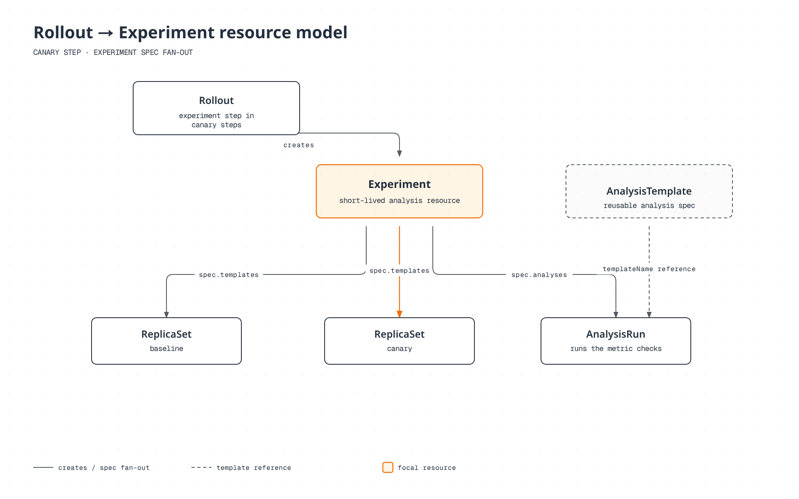
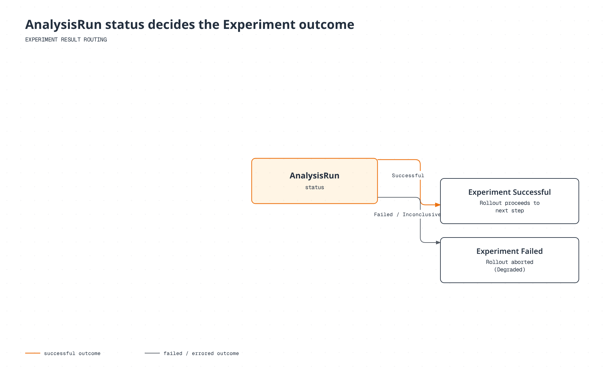

# Argo Rollouts Experiments Deep Dive

> **Supported Versions**: Argo Rollouts v1.8+ (verified on v1.8.3 / Kubernetes v1.33)
> **Last Updated**: July 17, 2026

## Table of Contents

- [What is an Experiment?](#what-is-an-experiment)
- [Resource Hierarchy and Creation Chain](#resource-hierarchy-and-creation-chain)
- [Name Generation Rules](#name-generation-rules)
- [Traffic Routing Behavior](#traffic-routing-behavior)
- [Measurement and Verdict: AnalysisRun](#measurement-and-verdict-analysisrun)
- [Result Propagation and Rollout State Transitions](#result-propagation-and-rollout-state-transitions)
- [Working Example](#working-example)
- [Observing with the kubectl Plugin](#observing-with-the-kubectl-plugin)
- [Verification Results](#verification-results)
- [Next Steps](#next-steps)
- [References](#references)
- [Quiz](#quiz)

## What is an Experiment?

An Experiment is an Argo Rollouts CRD that **launches one or more ephemeral ReplicaSets and scales them back down** when it finishes. Its core purpose is to **validate a new version in isolation from production traffic**. Whereas a canary deployment verifies a new version by sending it a share of real user traffic, an Experiment by default creates a separate set of Pods that receive no service traffic at all, and compares metrics on top of them.

| Aspect | Canary step | Experiment step |
|--------|-------------|-----------------|
| Pods under test | Canary ReplicaSet managed by the Rollout | **Ephemeral ReplicaSets** created by the Experiment |
| Production traffic | Receives it (per setWeight) | None by default |
| Lifetime | Promoted to stable | **Scaled down to 0** when `duration` elapses or analysis completes |
| Typical scenario | Gradual traffic shifting | Baseline vs. canary A/B comparison, pre-canary validation |

An Experiment can be created as a standalone resource, but in practice it is almost always used as an **experiment step** inside a Rollout's canary strategy.

## Resource Hierarchy and Creation Chain

When a Rollout reaches an experiment step, resources are created along this chain:



The sequence is:

1. The Rollout controller **creates an Experiment resource** at the experiment step. The experiment step is a **blocking step** — the Rollout only proceeds to the next step when the Experiment finishes Successful, and the Rollout is **aborted** if it fails.
2. The Experiment controller **creates one ReplicaSet per entry in `spec.templates`** (conventionally baseline/canary) and waits until every ReplicaSet's Pods are **healthy (available)**. The `duration` timer does not start until then.
3. Once all templates are healthy, it **creates one AnalysisRun per entry in `spec.analyses`**. An AnalysisRun is a run instance created by copying the metric definitions of the referenced **AnalysisTemplate**.
4. When `duration` elapses or the analysis finishes, the ReplicaSets are **scaled down to 0** and the result is reported back to the Rollout.

> A standalone Experiment created without a Rollout follows the same chain from step 2 onward.

## Name Generation Rules

Experiment-family resources are named systematically so the owning Rollout, revision, and step can be traced from the name alone.

| Resource | Rule | Measured example |
|----------|------|------------------|
| Experiment | `<rollout-name>-<new-version PodTemplateHash>-<revision>-<step-index>` | `demo-app-74d8d8b4fb-2-0` |
| ReplicaSet | `<experiment-name>-<template-name>` | `demo-app-74d8d8b4fb-2-0-baseline`, `demo-app-74d8d8b4fb-2-0-canary` |
| AnalysisRun | `<experiment-name>-<analysis-name>` | `demo-app-74d8d8b4fb-2-0-success-rate` |

The examples above come from the experiment at step index 0 of the `demo-app` Rollout's revision 2 update. The tree output in [Verification Results](#verification-results) shows the actual hierarchy.

## Traffic Routing Behavior

The default behavior is **label-based isolation**. The Experiment's ReplicaSet Pods carry a different `rollouts-pod-template-hash` label value than the stable Pods, so they are naturally excluded from Services whose selectors target specific ReplicaSets. In other words, with no extra configuration, experiment Pods receive no production traffic.

There are two ways to intentionally route traffic to them:

```yaml
templates:
  - name: canary
    specRef: canary
    # Option 1: create an experiment-scoped Service (routing is up to you)
    service: {}          # creates a Service named <experiment-name>-<template-name>
  - name: baseline
    specRef: stable
weight: 5                # Option 2: route 5% of real traffic to the experiment Pods
```

- **`service` attribute**: creates a Service pointing only at that template's Pods for the lifetime of the Experiment (measured: a `demo-app-74d8d8b4fb-2-0-canary` Service was created and deleted when the experiment ended). A custom name can be set via `service.name`.
- **`weight`**: sends the given percentage of real traffic to the experiment Pods. This **only works on Rollouts with trafficRouting configured** — weighted distribution requires a traffic provider such as Istio or ALB. See [Traffic Management](05-traffic-management.md#ingress-integration) for provider setup.

## Measurement and Verdict: AnalysisRun

An AnalysisRun collects data through a **provider** and judges it with **condition expressions**. Major providers include Prometheus, Datadog, CloudWatch, New Relic, **Web** (arbitrary HTTP endpoint), and **Job** (arbitrary Kubernetes Job). See the [Analysis section of Traffic Management](05-traffic-management.md#analysis-and-verification) for provider details.

### Verdict Conditions (boolean evaluation)

```yaml
metrics:
  - name: success-rate
    interval: 15s          # measurement interval
    count: 3               # total number of measurements (omit to repeat indefinitely)
    # boolean expression over the measurement (result) — true marks it Successful
    successCondition: result.status == 'ok' && result.success_rate >= 0.95
    # failureCondition can be used alongside to define failure explicitly
    failureLimit: 1        # allowed Failed measurements — exceeding fails the whole AnalysisRun
    inconclusiveLimit: 2   # allowed Inconclusive measurements — exceeding marks it Inconclusive
    consecutiveErrorLimit: 2  # allowed consecutive collection errors — exceeding marks it Error
```

Each measurement becomes Successful/Failed/Inconclusive through the boolean evaluation of `successCondition`/`failureCondition`, and the limit fields decide the verdict of the AnalysisRun as a whole.

| Field | Meaning | AnalysisRun status when exceeded |
|-------|---------|----------------------------------|
| `failureLimit` | Allowed number of Failed measurements | Failed |
| `inconclusiveLimit` | Allowed number of Inconclusive measurements | Inconclusive |
| `consecutiveErrorLimit` | Allowed consecutive measurement errors (default 4) | Error |

In our test, a metric with `failureLimit: 1` failed twice and the AnalysisRun was marked Failed with exactly this message:

```
Metric "success-rate" assessed Failed due to failed (2) > failureLimit (1)
```

## Result Propagation and Rollout State Transitions

The AnalysisRun's final status propagates through the Experiment up to the Rollout.



- **Successful**: once both the `duration` has elapsed and the analysis succeeded, the Experiment becomes Successful and the Rollout proceeds to the next step.
- **Failed / Inconclusive**: the Experiment ends as failed and the Rollout is aborted. The Rollout status becomes `Degraded` and the stable version stays in place.
- Either way, on completion the Experiment's ReplicaSets are **scaled down to 0**, and any Service created via the `service` attribute is cleaned up with them.

## Working Example

The manifests below are the ones used for the [verification](#verification-results) and work as-is. The first step of the canary strategy runs one baseline and one canary Pod for 60 seconds, compares success rates, and only proceeds to a 20% canary if the experiment passes.

```yaml
apiVersion: argoproj.io/v1alpha1
kind: AnalysisTemplate
metadata:
  name: success-rate-check
  namespace: demo
spec:
  metrics:
    - name: success-rate
      interval: 15s
      count: 3
      successCondition: result.status == 'ok' && result.success_rate >= 0.95
      failureLimit: 1
      inconclusiveLimit: 2
      consecutiveErrorLimit: 2
      provider:
        web:
          # demo web provider — use Prometheus or similar in production
          url: "http://metrics-mock.demo.svc.cluster.local/metrics.json"
          jsonPath: "{$}"
---
apiVersion: argoproj.io/v1alpha1
kind: Rollout
metadata:
  name: demo-app
  namespace: demo
spec:
  replicas: 3
  revisionHistoryLimit: 3
  selector:
    matchLabels:
      app: demo-app
  strategy:
    canary:
      steps:
        # step 0: experiment isolated from production traffic (blocking — aborts on failure)
        - experiment:
            duration: 60s
            templates:
              - name: baseline
                specRef: stable    # use the current stable Pod spec
              - name: canary
                specRef: canary    # use the new version's Pod spec
                service: {}        # create an experiment-scoped Service
            analyses:
              - name: success-rate
                templateName: success-rate-check
        # steps 1-2: canary only runs after the experiment passes
        - setWeight: 20
        - pause: { duration: 10s }
  template:
    metadata:
      labels:
        app: demo-app
    spec:
      containers:
        - name: app
          image: public.ecr.aws/nginx/nginx:1.27
          ports:
            - containerPort: 8080
```

In production, the common pattern is to replace the web provider with a Prometheus provider that queries baseline and canary metrics separately and compares them. Pass each ReplicaSet's hash into the analysis as arguments via `podTemplateHashValue: Baseline`/`Canary` and use them in label selectors — see the [Experiments section of Traffic Management](05-traffic-management.md#experiments) for a full example.

## Observing with the kubectl Plugin

`kubectl argo rollouts get rollout <name> --watch` shows the entire Experiment hierarchy (Experiment → ReplicaSets → Pods, plus the AnalysisRun) live. Below is actual output captured while the experiment step of the manifest above was running.

```
$ kubectl argo rollouts get rollout demo-app -n demo
Name:            demo-app
Namespace:       demo
Status:          ◌ Progressing
Strategy:        Canary
  Step:          0/3
  SetWeight:     0
  ActualWeight:  0

NAME                                                  KIND         STATUS         AGE  INFO
⟳ demo-app                                            Rollout      ◌ Progressing  51s
├──# revision:2
│  ├──⧉ demo-app-74d8d8b4fb                           ReplicaSet   • ScaledDown   29s  canary
│  └──Σ demo-app-74d8d8b4fb-2-0                       Experiment   ◌ Running      29s
│     ├──⧉ demo-app-74d8d8b4fb-2-0-baseline           ReplicaSet   ✔ Healthy      29s
│     │  └──□ demo-app-74d8d8b4fb-2-0-baseline-gvgnq  Pod          ✔ Running      29s  ready:1/1
│     ├──⧉ demo-app-74d8d8b4fb-2-0-canary             ReplicaSet   ✔ Healthy      29s
│     │  └──□ demo-app-74d8d8b4fb-2-0-canary-jq6lb    Pod          ✔ Running      29s  ready:1/1
│     └──α demo-app-74d8d8b4fb-2-0-success-rate       AnalysisRun  ◌ Running      29s  ✔ 2
└──# revision:1
   └──⧉ demo-app-779c8779bf                           ReplicaSet   ✔ Healthy      51s  stable
```

Note that during the experiment step, revision 2's main ReplicaSet (`demo-app-74d8d8b4fb`) is still `ScaledDown` — the new version is never placed on the production path before validation completes. The AnalysisRun keeps its measurement history in its status for post-hoc analysis:

```
$ kubectl get analysisrun demo-app-74d8d8b4fb-2-0-success-rate -n demo \
    -o jsonpath='{.status.metricResults[0]}' | python3 -m json.tool
{
    "consecutiveSuccess": 2,
    "count": 2,
    "measurements": [
        {
            "finishedAt": "2026-07-17T01:24:09Z",
            "phase": "Successful",
            "value": "{\"error_rate\":0.004,\"status\":\"ok\",\"success_rate\":0.99}"
        },
        ...
    ],
    "name": "success-rate",
    "phase": "Running",
    "successful": 2
}
```

## Verification Results

Verified with the manifests above on a test cluster built from the Argo Rollouts v1.8.3 controller (official source build) and a Kubernetes v1.33 control plane (kwok-based — the API server, controller manager, and scheduler are real binaries; node and Pod lifecycles are simulated). The resource creation chain, naming rules, analysis verdicts, and status propagation are all real controller behavior; **verifying actual traffic split ratios is out of scope for this environment** (for measured traffic behavior, see the [EKS verification in Traffic Management](05-traffic-management.md#verification-results-on-eks)).

| Verified item | Result |
|---------------|--------|
| Experiment auto-created at the experiment step, name = `<rollout>-<PodHash>-<revision>-<step>` | ✅ `demo-app-74d8d8b4fb-2-0` (revision 2, step 0) |
| ReplicaSets created from templates, name = `<experiment>-<template>` | ✅ `...-2-0-baseline`, `...-2-0-canary`, 1 replica each |
| Experiment-scoped Service for the template with `service: {}` created and cleaned up | ✅ `...-2-0-canary` Service created, confirmed deleted after the experiment |
| AnalysisRun created after all templates healthy; repeated measurements at `interval: 15s`/`count: 3` | ✅ 3 measurements recorded 15s apart, `successCondition` evaluated Successful |
| Success path: 60s duration elapsed → Experiment Successful → experiment RSes scaled to 0 → next step (setWeight 20) → Rollout Healthy | ✅ Works |
| Failure path: degraded metrics → AnalysisRun Failed with `failed (2) > failureLimit (1)` → Experiment Failed → Rollout aborted (Degraded), stable preserved | ✅ Works — the abort message names the offending metric verbatim |

## Next Steps

1. **[Traffic Management](05-traffic-management.md)**: combine experiment steps with canary/blue-green strategies and ingress integrations.

2. **[Best Practices](09-best-practices.md)**: learn progressive delivery operational best practices.

## References

- [Experiment official documentation](https://argoproj.github.io/argo-rollouts/features/experiment/)
- [Analysis official documentation](https://argoproj.github.io/argo-rollouts/features/analysis/)
- [Experiment CRD specification](https://argoproj.github.io/argo-rollouts/features/specification/)

## Quiz

Test what you've learned in this chapter with the [Rollouts Experiments Quiz](../../quizzes/gitops/argocd/10-rollouts-experiment-quiz.md).
