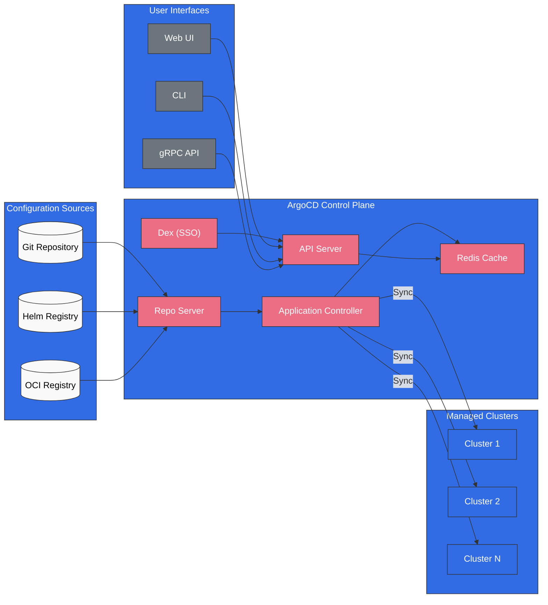
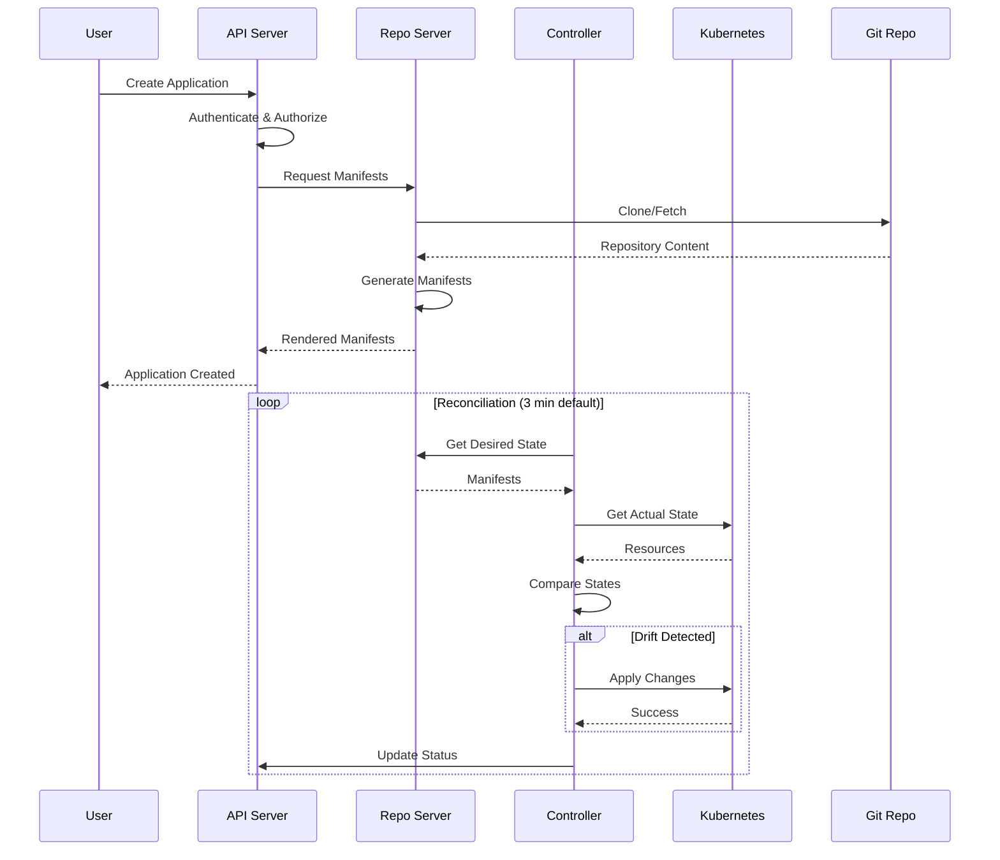

# ArgoCD

> **Supported Versions**: ArgoCD v2.9+, Argo Rollouts v1.6+
> **Last Updated**: August 17, 2026

## Table of Contents
- [What is ArgoCD?](#what-is-argocd)
- [Key Benefits](#key-benefits)
- [Architecture Overview](#architecture-overview)
- [Core Concepts](#core-concepts)
- [Sub-Guide Navigation](#sub-guide-navigation)
- [Quick Start](#quick-start)
- [Version Compatibility](#version-compatibility)

## What is ArgoCD?

ArgoCD is a declarative, GitOps continuous delivery tool for Kubernetes. It automates the deployment of applications to Kubernetes clusters by synchronizing the desired state defined in Git repositories with the actual state in the cluster.

As a CNCF graduated project, ArgoCD has become the de facto standard for GitOps-based Kubernetes deployments, used by thousands of organizations worldwide.



## Key Benefits

### GitOps Native

- **Git as Single Source of Truth**: All application configurations stored in Git
- **Declarative Deployments**: Define desired state, ArgoCD handles the rest
- **Audit Trail**: Complete history of all changes via Git commits
- **Rollback**: Instant rollback to any previous state

### Multi-Cluster Management

- **Centralized Control**: Manage hundreds of clusters from a single ArgoCD instance
- **ApplicationSet**: Template-based multi-cluster deployments
- **Cluster Generator**: Dynamic cluster targeting based on labels

### Enterprise Ready

- **RBAC**: Fine-grained role-based access control
- **SSO Integration**: OIDC, SAML, LDAP support
- **Multi-Tenancy**: Project-based isolation
- **High Availability**: Production-ready HA deployment

### Developer Experience

- **Web UI**: Visual application management and monitoring
- **CLI**: Full-featured command-line interface
- **Notifications**: Slack, Teams, email, webhook integrations
- **Health Monitoring**: Built-in and custom health checks

## Architecture Overview

### Core Components

| Component | Description | Replicas (HA) |
|-----------|-------------|---------------|
| **API Server** | Handles all API requests, authentication, and RBAC | 2+ |
| **Repository Server** | Clones repos, generates manifests, caches results | 2+ |
| **Application Controller** | Monitors applications, reconciles state | 2+ (sharded) |
| **Redis** | Caching layer for repo server and controller | 3 (HA) |
| **Dex** | OIDC provider for SSO integration | 2+ |
| **Notification Controller** | Sends notifications on events | 1+ |
| **ApplicationSet Controller** | Manages ApplicationSet resources | 1+ |

### Data Flow



## Core Concepts

### Application

The Application CRD is the primary resource in ArgoCD. It defines:
- **Source**: Where to get the manifests (Git repo, Helm chart, OCI)
- **Destination**: Where to deploy (cluster and namespace)
- **Sync Policy**: How to handle synchronization

### Project

Projects provide logical grouping and access control:
- Restrict which repositories can be used
- Limit destination clusters and namespaces
- Define allowed/denied resources

### ApplicationSet

ApplicationSet enables managing multiple applications from a single definition using generators:
- **List Generator**: Static list of values
- **Cluster Generator**: Target registered clusters
- **Git Generator**: Scan repository directories/files
- **Matrix/Merge**: Combine multiple generators

### Sync

Synchronization brings the cluster state to match the desired state:
- **Manual Sync**: User-triggered
- **Auto Sync**: Automatic on Git changes
- **Self-Heal**: Correct drift automatically
- **Prune**: Remove orphaned resources

## Sub-Guide Navigation

| Guide | Description |
|-------|-------------|
| [Installation](01-installation.md) | Installation methods, CLI setup, HA configuration, EKS integration |
| [Applications](02-applications.md) | Application CRD, source types, health checks, hooks, App of Apps |
| [Sync Strategies](03-sync-strategies.md) | Sync policies, waves, windows, diffing, retry configuration |
| [ApplicationSets](04-applicationsets.md) | All generators, templating, progressive sync, multi-cluster patterns |
| [Traffic Management](05-traffic-management.md) | Argo Rollouts, blue-green, canary, analysis, ingress integration |
| [Projects & RBAC](06-projects-rbac.md) | AppProject, RBAC policies, multi-tenancy, JWT tokens |
| [Security](07-security.md) | SSO integration, secret management, TLS, audit logging |
| [Notifications](08-notifications.md) | Notification services, triggers, templates, subscriptions |
| [Best Practices](09-best-practices.md) | Repository patterns, performance tuning, troubleshooting, EKS tips |
| [Rollouts Experiments Deep Dive](10-rollouts-experiment.md) | Experiment CRD, ephemeral ReplicaSet validation, AnalysisRun verdicts |

## Quick Start

### 1. Install ArgoCD

```bash
# Create namespace
kubectl create namespace argocd

# Install ArgoCD
kubectl apply -n argocd -f https://raw.githubusercontent.com/argoproj/argo-cd/stable/manifests/install.yaml

# Wait for pods to be ready
kubectl wait --for=condition=Ready pods --all -n argocd --timeout=300s
```

### 2. Access the UI

```bash
# Port forward to access locally
kubectl port-forward svc/argocd-server -n argocd 8080:443
```

### 3. Get Initial Password

```bash
# Retrieve the initial admin password
kubectl -n argocd get secret argocd-initial-admin-secret \
  -o jsonpath="{.data.password}" | base64 -d && echo
```

### 4. Login via CLI

```bash
# Install CLI (macOS)
brew install argocd

# Login
argocd login localhost:8080

# Change password (recommended)
argocd account update-password
```

### 5. Deploy Your First Application

```bash
# Create application via CLI
argocd app create guestbook \
  --repo https://github.com/argoproj/argocd-example-apps.git \
  --path guestbook \
  --dest-server https://kubernetes.default.svc \
  --dest-namespace default

# Sync the application
argocd app sync guestbook
```

Or declaratively:

```yaml
apiVersion: argoproj.io/v1alpha1
kind: Application
metadata:
  name: guestbook
  namespace: argocd
spec:
  project: default
  source:
    repoURL: https://github.com/argoproj/argocd-example-apps.git
    targetRevision: HEAD
    path: guestbook
  destination:
    server: https://kubernetes.default.svc
    namespace: default
  syncPolicy:
    automated:
      prune: true
      selfHeal: true
```

## Version Compatibility

### August 2026 Update: ArgoCD 3.5 GA and Patch Releases

ArgoCD v3.5.0 went GA on August 7, 2026, making 3.5 the current stable release line. It was followed on August 12 by coordinated patches for the three maintained release lines: v3.5.1 / v3.4.7 / v3.3.14. v3.5.1 includes bug fixes such as stopping ApplicationSet progressive sync from reconciling in a tight loop and server-side diff Secret-masking fixes (including hiding secrets in the `last-applied-configuration` annotation). See the [v3.5.1 release notes](https://github.com/argoproj/argo-cd/releases/tag/v3.5.1) for details.

### July 2026 Update: ArgoCD 3.x Patch Releases

ArgoCD v3.4.5 was released on July 9, 2026. The tables below were written against the 2.x era — check the [ArgoCD releases page](https://github.com/argoproj/argo-cd/releases) for up-to-date per-version support information.

At ArgoCon Japan, held July 28, 2026 in Yokohama as a KubeCon + CloudNativeCon Japan colocated event, the Argo CD lead maintainer shared a proposal for the next version (3.5) ([CNCF blog](https://www.cncf.io/blog/2026/07/20/argocon-japan-2026-meeting-the-maintainers-enterprise-insights-and-the-road-to-argo-cd-3-5/)).

### August 2026 Update: ArgoCD v3.5.0 Released

[ArgoCD v3.5.0](https://github.com/argoproj/argo-cd/releases/tag/v3.5.0) went GA on August 4, 2026, making 3.5 the current stable release line. Notable changes include:

- **Helm 3 → Helm 4 migration**: manifest rendering now uses Helm 4
- **Source integrity verification (Alpha)**: opt-in signature verification for dry sources in the source hydrator, plus CLI support for Source Integrity configuration
- **ApplicationSet improvements**: concurrent application management and repository filtering by archived status
- **Webhook jitter**: configurable jitter for webhook-triggered application refreshes to smooth thundering-herd refresh spikes
- **UI**: multi-source application creation in the New App panel, ApplicationSet Preview Apps tab, and AppSet nodes in the resource tree
- **New health checks**: GatewayClass, `BackendTLSPolicy` (Gateway API), VictoriaMetrics, Gardener Shoot, and more

Patch releases v3.4.6 and v3.3.13 also went out on July 31, 2026 for the previous lines.

### Kubernetes Compatibility

| ArgoCD Version | Kubernetes Versions |
|----------------|---------------------|
| 2.13.x | 1.28 - 1.31 |
| 2.12.x | 1.27 - 1.30 |
| 2.11.x | 1.26 - 1.29 |
| 2.10.x | 1.25 - 1.28 |
| 2.9.x | 1.24 - 1.27 |

### Amazon EKS Compatibility

| EKS Version | Recommended ArgoCD |
|-------------|-------------------|
| 1.31 | 2.13.x |
| 1.30 | 2.12.x - 2.13.x |
| 1.29 | 2.11.x - 2.12.x |
| 1.28 | 2.10.x - 2.11.x |

### Argo Rollouts Compatibility

| Rollouts Version | ArgoCD Version | Features |
|------------------|----------------|----------|
| 1.7.x | 2.10+ | Analysis improvements |
| 1.6.x | 2.9+ | Notification integration |
| 1.5.x | 2.8+ | Progressive delivery |

## Next Steps

1. **[Installation Guide](01-installation.md)**: Set up ArgoCD for production
2. **[Applications Guide](02-applications.md)**: Learn about Application CRD
3. **[ApplicationSets Guide](04-applicationsets.md)**: Multi-cluster deployments

## Resources

- [ArgoCD Official Documentation](https://argo-cd.readthedocs.io/)
- [ArgoCD GitHub Repository](https://github.com/argoproj/argo-cd)
- [Argo Rollouts Documentation](https://argoproj.github.io/argo-rollouts/)
- [CNCF ArgoCD Project Page](https://www.cncf.io/projects/argo/)

## Quiz

To test what you've learned, try the [ArgoCD installation quiz](../../quizzes/gitops/argocd/01-installation-quiz.md).
