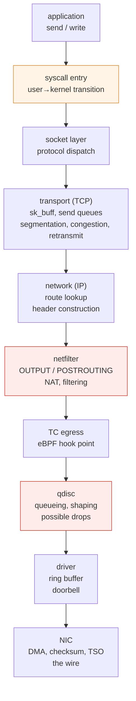
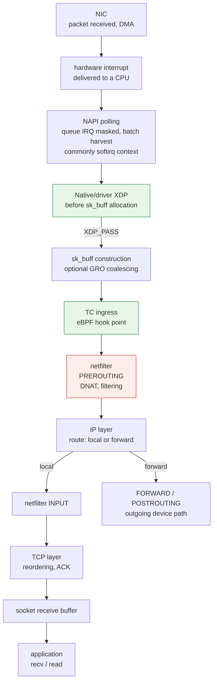

# Kernel Networking Stack

> **Supported Versions**: Linux 6.1 / 6.12 / 6.18 (Amazon Linux 2023)
> **Last Updated**: September 14, 2026

## What This Document Covers

- The path one `send()` travels inside the kernel until it reaches the wire, and what each point does
- How socket file descriptors connect to VFS, and how TCP buffers, windows, and queue observations differ
- Where you can attach hooks — and why the position of XDP, TC, and netfilter creates performance differences
- Why Pod-to-Pod traffic actually takes different paths on the same node, the same AZ, and across AZs

## Why You Need to Know the Path

"The network is slow" is not a diagnosable sentence. The kernel network path has **several points that create latency and loss for different reasons**, and the response differs completely depending on which one it is.

| Symptom | Candidates to investigate |
|---|---|
| Throughput plateaus at some level | Application rate, socket buffers, receive/congestion windows, or path limits |
| Drops only during traffic bursts | qdisc, NIC/driver queues, stack memory pressure, or downstream loss |
| Only one CPU is at 100% | Queue/interrupt distribution, a single flow, or application work on that core |
| Small requests are unusually slow | Fixed overhead (syscalls, context switches) dominating |
| It slowed down as rules grew | netfilter rule evaluation |

Knowing the path lets you read this table backwards to decide where to look.

## Sockets and VFS — from FD to Protocol {#socket-vfs-bridge}

`socket()` returns a file descriptor (FD), an index in the process's descriptor table. For a socket, that entry references a **`struct file`**, whose socket file operations and `private_data` connect it to a **`struct socket`**. An Internet TCP socket in turn has a **`struct sock`** carrying protocol state. Sharing the file abstraction lets sockets participate in `close()`, descriptor duplication, and readiness polling; **a socket is not a disk file**, and ordinary TCP data does not go through the disk page cache or block I/O.

The entry path depends on the API:

```text
FD → struct file → struct socket → struct sock / TCP state

read / write
  → VFS → socket_file_ops.read_iter / write_iter
  → sock_read_iter / sock_write_iter → socket receive/send operations

recv / send / recvmsg / sendmsg
  → socket-specific syscall path → look up the socket through the FD
  → socket receive/send operations
```

Thus `read()`/`write()` use VFS dispatch to socket file operations, while socket-specific APIs also accept flags, addresses, or ancillary data as appropriate. **They do not all pass through `vfs_read()`/`vfs_write()`**. The paths converge on socket/protocol operations. See Linux v6.12 [`net/socket.c`](https://github.com/torvalds/linux/blob/v6.12/net/socket.c) (`sock_alloc_file`, `socket_file_ops`, `__sys_sendto`, `__sys_recvfrom`) and [`fs/read_write.c`](https://github.com/torvalds/linux/blob/v6.12/fs/read_write.c). These are versioned examples, not a promise that internal function names never change.

TCP provides a byte stream: one `write()` need not correspond to one packet or one peer `read()`. A successful `send()` reports bytes accepted locally, not proof that the peer application has consumed them ([socket(7)](https://man7.org/linux/man-pages/man7/socket.7.html), [tcp(7)](https://man7.org/linux/man-pages/man7/tcp.7.html)).

## Transmit Path — from send() to the Wire

This is a simplified **locally generated TCP/IP path toward a physical NIC**, not a mandatory itinerary for every packet. Loopback and virtual devices, forwarding, XDP/AF_XDP or other bypass paths, netfilter flowtable offload, and NIC offloads can skip, move, or combine work. Hooks only do work when configured; NAT can trigger another route lookup.



What actually happens at each stage is the basis for diagnosis.

### ① Syscall entry — the source of fixed overhead

An ordinary `send()` call enters the kernel through a syscall. Entry/exit has a per-call overhead component; total cost also depends on copying, protocol work, scheduling, and whether the call blocks.

That component can matter for many small writes. Requesting 64 bytes ten thousand times versus 640,000 bytes once requests the same payload with ten thousand times as many calls, assuming each call accepts the requested bytes.

Application buffering or `sendmsg()` scatter/gather can combine buffers into one call; `sendmmsg()` batches messages, while `io_uring` can batch submissions. Their semantics differ, and batching does not define TCP packet boundaries.

### ② Socket layer — sk_buff and buffers

Despite its name, **`sk_buff` is not a socket's entire send or receive buffer**. It describes packet data and metadata, including header offsets and references to linear data or page fragments. An skb can be cloned, split, or coalesced; GSO/GRO mean it need not correspond to one wire packet. See the kernel's [`sk_buff` documentation](https://docs.kernel.org/networking/skbuff.html).

| Concept | What it represents |
|---|---|
| Application bytes | TCP stream payload submitted or read by the application |
| Socket send buffer | A memory budget for queued output, including data waiting to be sent and data retained for acknowledgment/retransmission |
| Socket receive buffer | A memory budget for received data, including unread and potentially out-of-order data |
| Kernel memory accounting | Allocation charges such as skb metadata, data storage, and allocation overhead; not just payload length |
| Advertised receive window (`rwnd`) | How much more sequence space the receiver permits the peer to send, based on available receive capacity and TCP's window rules |
| Congestion window (`cwnd`) | A sender-side congestion-control limit on outstanding data; independent of the receiver's buffer budget |

When send space is unavailable, a blocking call can wait, while a non-blocking call that accepts no bytes returns `EAGAIN`/`EWOULDBLOCK`. Either mode can return a short successful write; the application must handle the remaining bytes. A larger buffer permits more local queueing, but does not directly enlarge the peer's window or the sender's `cwnd`.

### TCP Buffer Policy and Per-Socket Settings {#tcp-buffer-policy}

The TCP sysctls describe policy, not current occupancy of every socket:

| Setting | Meaning |
|---|---|
| `net.ipv4.tcp_rmem` / `net.ipv4.tcp_wmem` | Three values in **bytes**: minimum under memory pressure, initial default, and upper bound for automatic receive/send buffer sizing |
| `net.ipv4.tcp_moderate_rcvbuf` | Enables receive-buffer autotuning, subject to its limits and memory pressure |
| `SO_RCVBUF` / `SO_SNDBUF` | Application requests for one socket; explicitly setting either locks that direction's buffer size against normal TCP automatic adjustment |
| `net.core.rmem_max` / `net.core.wmem_max` | Caps for ordinary application `SO_RCVBUF` / `SO_SNDBUF` requests; distinct from the TCP automatic-sizing maxima |

`SO_RCVBUF` sets `SOCK_RCVBUF_LOCK`, disabling receive autotuning for that socket; `SO_SNDBUF` sets `SOCK_SNDBUF_LOCK`, preventing normal send-buffer expansion. These are configuration flags, not mutexes. Raising a TCP sysctl does not undo an application's explicit setting. Linux normally doubles the accepted `SO_*BUF` request for bookkeeping and returns the doubled value through `getsockopt()` (subject to minimums/caps); that value is neither currently allocated memory nor guaranteed payload capacity. Do not treat `tcp_rmem[2]` as the maximum permitted explicit `SO_RCVBUF` request, or double every `tcp_*mem` value. See [IP sysctls](https://docs.kernel.org/networking/ip-sysctl.html), [socket(7)](https://man7.org/linux/man-pages/man7/socket.7.html), and Linux v6.12 [`net/core/sock.c`](https://github.com/torvalds/linux/blob/v6.12/net/core/sock.c) / [`tcp_input.c`](https://github.com/torvalds/linux/blob/v6.12/net/ipv4/tcp_input.c).

### BDP — Reasoning with Units {#tcp-bdp-reasoning}

For a hypothetical **1 Gbit/s** path with **40 ms RTT**, the bandwidth-delay product is:

```text
BDP = 1,000,000,000 bit/s × 0.040 s ÷ 8 bit/byte
    = 5,000,000 bytes = 5 MB ≈ 4.77 MiB
```

This estimates payload in flight to sustain that rate under an idealized steady-state model; use round-trip time, not one-way delay. Both the receive window and congestion window must permit sufficient outstanding data. `ss -i` normally expresses `cwnd` in segments, so compare `cwnd × MSS` with byte quantities. Socket memory needs also include bookkeeping, and a sender may queue bytes that are not yet in flight.

**BDP is a diagnostic scale, not a sysctl recipe.** An application producing data slowly, CPU pressure, loss, pacing, changing RTT, or a path limit can dominate; extra queueing may increase latency and memory use. Compare observations in the [TCP buffer lab](../networking/07-linux-network-diagnostics.md#tcp-buffer-lab) before drawing a conclusion.

### ③ Transport (TCP) — where congestion control lives

TCP coordinates reliability, flow control, and congestion control.

- Limits segment payload by MSS and the path MTU; GSO/TSO can defer actual segmentation
- Limits outstanding data by both the peer's **receive window** and the sender's **congestion window (cwnd)**, with pacing and other constraints
- Maintains a retransmit queue and retransmits when ACKs do not arrive

The congestion control algorithm lives here. Two examples differ in how they control sending:

| Algorithm | Main model | Interpretation |
|---|---|---|
| **cubic** | Window growth and reduction following congestion events such as loss/ECN | Loss has causes beyond congestion; inspect the path |
| **bbr** | Delivery-rate and RTT estimates guide pacing and in-flight data | Estimates and loss/recovery behavior depend on the implementation/version |

Neither model establishes which algorithm will be faster for a workload, and BBR does not make loss or recovery irrelevant. Inspect the active algorithm and RTT/cwnd with `ss -ti`; any comparison must identify the kernel version, load, and path. Versioned implementations: [`tcp_cubic.c`](https://github.com/torvalds/linux/blob/v6.12/net/ipv4/tcp_cubic.c), [`tcp_bbr.c`](https://github.com/torvalds/linux/blob/v6.12/net/ipv4/tcp_bbr.c).

### ④ Network layer (IP) — route lookup

Finds the path to the destination in the routing table. **This lookup is per net namespace**, so the routing table you see inside a Pod is not the node's ([Container Kernel Features](./01-container-primitives.md)).

### ⑤ netfilter — where rules are evaluated

Locally generated traffic can encounter `OUTPUT` and `POSTROUTING`; traffic entering from a Pod's veth can instead take `PREROUTING` → `FORWARD` → `POSTROUTING` in the node namespace. Service DNAT and egress MASQUERADE depend on the configured dataplane and hooks, not one universal path.

Long, linearly evaluated iptables chains can add lookup work as Services grow. The actual cost depends on the rules, lookup structure, and dataplane mode; a rule count alone is not a latency measurement. A configured netfilter flowtable fast path can bypass later forwarding hooks ([netfilter flowtable](https://docs.kernel.org/networking/nf_flowtable.html)).

### ⑥ qdisc — where drops actually happen

A qdisc (queueing discipline) **queues packets before handing them to the NIC and decides order and rate.**

The operationally important fact:

> Qdisc overflow is one possible source of burst drops. Correlate qdisc, NIC/driver, stack and cloud-network counters before assigning a cause.

A qdisc may drop due to queue limits or active queue management before the queue is full. Its drop counter attributes drops to that qdisc; it does not account for all losses along the path. Some devices use `noqueue`, and direct transmission/offload paths need not enqueue every packet.

**Observation**: compare changes in `dropped`, `backlog`, `overlimits`, and `requeues` in `tc -s qdisc show dev <iface>` over the affected interval. `overlimits` can reflect shaping decisions rather than drops; `requeues` records packets queued again. Check interface and driver counters too, without assuming their counts are identical or additive.

qdiscs differ in character.

| qdisc | Character |
|---|---|
| `pfifo_fast` | Simple FIFO (3 priority bands). The old default |
| `fq_codel` | Flow queueing with CoDel delay control; can drop or ECN-mark to signal congestion |
| `fq` | Flow fair queueing with pacing support |
| `mq` | Wrapper placing a qdisc per hardware queue on multi-queue NICs |

**Bufferbloat** is excessive queueing delay: a larger queue can absorb a burst but also hold data longer. `fq_codel` monitors sojourn time and signals congestion through drops or ECN marking when applicable. A larger queue is not automatically an improvement ([tc-fq_codel(8)](https://man7.org/linux/man-pages/man8/tc-fq_codel.8.html)).

### ⑦ Driver and NIC — offloads

On a typical physical NIC path, the driver maps packet data for DMA, prepares descriptors referring to that memory in a transmit ring, and notifies the NIC. The NIC does not consume a C `sk_buff` structure directly; the driver retains bookkeeping until completion.

Offloads change where work occurs and what host observations represent.

| Offload | What it does |
|---|---|
| **TSO / GSO** | TSO delegates segmentation to supported hardware; GSO is the kernel’s generic/software segmentation framework and fallback. They are not both NIC-only operations |
| **GRO** (Generic Receive Offload) | On receive, **coalesces** small packets before handing them up → fewer stack traversals |
| **Checksum offload** | The NIC computes checksums |
| **RSS** (Receive Side Scaling) | Hashes received flows to hardware queues; IRQ affinity and later steering determine CPU placement |

TSO/GRO can reduce per-segment work. **Read-only observation**: `ethtool -k <iface>` reports configured features; it does not prove that every packet uses them. Host captures may show large GSO/GRO units or an unfinished transmit checksum, so a large captured packet or an apparent bad checksum alone does not prove a wire fault ([segmentation offloads](https://docs.kernel.org/networking/segmentation-offloads.html), [checksum offloads](https://docs.kernel.org/networking/checksum-offloads.html)).

## Receive Path — from Interrupt to Application

The diagram shows a common physical-NIC receive path using driver NAPI and optional native XDP, followed by local TCP delivery. `XDP_PASS` continues into the stack; drop, redirect, and transmit actions take other paths. Generic XDP runs with an skb already present. Loopback, virtual devices, hardware offload, busy polling, and threaded NAPI can change this sequence.



### NAPI — the mechanism preventing interrupt storms

Interrupting per packet can lead under high load to a state where **the system does nothing but handle interrupts** (livelock).

In a common interrupt-driven NAPI setup, the driver masks the relevant queue interrupt and schedules polling. A poll processes a bounded amount of work; after polling completes, the driver can unmask that interrupt. This does not disable all CPU interrupts. Busy polling and threaded NAPI are alternative execution modes ([NAPI](https://docs.kernel.org/networking/napi.html)).

Batching can amortize per-packet overhead; high load can still exhaust the poll budget and increase latency or drops.

### Interrupts pinned to one core

Receive interrupts target particular CPUs. A single queue or concentrated processing can saturate one core even when overall CPU use is low. A single flow or application work can also explain that pattern.

Three layers of solution:

| Feature | Layer | What it does |
|---|---|---|
| **RSS** | Hardware | NIC hashes flows to receive queues; IRQ affinity can spread queue processing across CPUs |
| **RPS** | Software | Kernel hands receive processing to another CPU (when RSS is absent or queues are few) |
| **RFS** | Software | Aims to steer receive processing toward the consuming application's CPU for cache locality |

**Diagnosis**: `/proc/interrupts` for even distribution across cores, `mpstat -P ALL` for a spiking `%soft` (softirq) on one core.

RSS, RPS, and RFS do not all move hardware interrupts. A single flow can remain on one queue to preserve ordering ([network-stack scaling](https://docs.kernel.org/networking/scaling.html)).

### Socket receive buffers and backpressure

If the application does not drain received data fast enough, unread bytes accumulate and available receive capacity falls. TCP can advertise a smaller or zero receive window, applying flow-control backpressure. Window calculation, scaling negotiated at connection setup, and reserved memory mean the advertised window is not simply `SO_RCVBUF - Recv-Q`.

A persistently growing `Recv-Q` is a reason to investigate reader progress, CPU scheduling, and downstream application work alongside network evidence. One snapshot does not prove the application is the sole cause. A larger buffer may only postpone backpressure and retain more data.

## Comparing Hook Points — XDP, TC, netfilter

All are "intercept and process a packet," but **position determines performance and what is possible.**

| Item | **XDP** | **TC (eBPF)** | **netfilter** |
|---|---|---|---|
| **Position** | Native/driver XDP: before `sk_buff`; generic XDP: skb-based | After `sk_buff` construction, ingress/egress | Stack hooks |
| **Direction** | Mostly ingress | ingress + egress | All directions |
| **Work avoided or added** | Native early drop can avoid skb allocation and later stack work | Runs after skb construction; program and attachment determine work | Cost depends on hooks, rules, state tracking, and offload |
| **Information available** | Packet data, permitted metadata/helpers/maps | Verifier-permitted `__sk_buff` context/helpers, not unrestricted kernel memory | Connection state when conntrack is active |
| **Main uses** | **DDoS drops**, load balancing, packet redirect | Policy enforcement, observability, redirect | NAT, stateful filtering |
| **Hardware offload** | Some driver/NIC combinations | Some | Selected nftables flowtable offload; not every rule/path |

The early-drop advantage describes **native/driver XDP**, before skb allocation. Generic XDP already has an skb, and actual performance depends on driver support and program work. Do not use one mode’s explanation as a universal benchmark result.

XDP does not automatically receive all socket/stack context, but BPF maps can maintain state and supported helpers can expose additional information. **Stateful processing is not inherently impossible at XDP**; evaluate the actual program, kernel, verifier and driver limits.

A dataplane can combine hooks for different work; Cilium's actual attachment points depend on its configuration and supported features ([Cilium eBPF](../networking/cilium/02-ebpf.md), [Cilium L2-L7 Networking](../networking/cilium/05-l2-l7-networking.md)).

## Pod-to-Pod — Why the Path Differs

In Kubernetes, Pod-to-Pod traffic **actually traverses different kernel paths** depending on placement. This is the cause of the RTT ladder measured in the [Pod Network Benchmark](../networking/06-pod-network-benchmark.md) (same node 0.040 ms → same AZ 0.339 ms → cross AZ 0.544 ms).

### Pods on the same node

```text
Pod A [net ns A] → veth A → (node net ns) → veth B → Pod B [net ns B]
```

In the illustrated ordinary veth/routed same-node path, traffic need not traverse the physical NIC. Other dataplanes, overlays, SR-IOV or policy/service detours can change that path; virtual devices still have kernel driver processing.

That is why same-node single-flow throughput reached **29.97 Gbps** in the benchmark (while cross-node hit the EC2 single-flow limit at 4.96 Gbps). The bottleneck was not the network but **CPU** — one client core at 99.8%.

### Pods on different nodes (VPC CNI)

```text
Pod A → veth → node net ns → ENI → VPC network → target ENI → veth → Pod B
```

With Amazon VPC CNI, Pods receive **real VPC IPs**, so there is no overlay encapsulation. Avoiding encap/decap cost and MTU loss versus overlay CNIs (VXLAN and friends) is VPC CNI's structural advantage ([VPC CNI](../networking/01-vpc-cni.md)).

This ordinary cross-node path uses physical network devices and is subject to **EC2 instance network limits** — single-flow caps, total instance bandwidth, and PPS limits. The exact queueing and hook path still depends on the device and dataplane.

### Crossing an AZ

The cited single-flow experiment observed +0.21 ms RTT and about 4.96 Gbps in both cross-node placements. That result applies to its instances, load and path; it does not prove that every cross-AZ workload has unchanged throughput.

### MTU and fragmentation

**MTU** is an interface's limit for an IP packet, including its IP header; **PMTU** is the smallest effective MTU along the path. **MSS** limits TCP payload per segment, excluding IP/TCP headers. With a 1500-byte IP MTU and no options, 20-byte IPv4 plus 20-byte TCP headers leave 1460 bytes; 40-byte IPv6 plus 20-byte TCP headers leave 1440 bytes. Options and encapsulation consume additional space. A peer's MSS advertisement is not a measurement of the whole path.

IPv4 routers may fragment an oversized packet if DF is clear; with DF set, they drop it and normally return ICMP "fragmentation needed." IPv6 routers do not fragment: they return ICMPv6 "Packet Too Big," leaving size adjustment or source fragmentation to the sender. PMTUD uses this feedback; loss of the relevant ICMP can create a black hole, although packetization-layer probing may sometimes recover. Jumbo MTUs such as 9001 only help where the complete path supports the required size.

"The handshake works but data stalls" is therefore **consistent with** a PMTU problem, not proof of one. Compare interface MTUs, TCP MSS/PMTU information, and captures at appropriate points. GSO/TSO/GRO and checksum offload can make host captures differ from wire packets; do not infer fragmentation or corruption from a large host-captured unit alone. See the [MTU/MSS lab](../networking/07-linux-network-diagnostics.md#mtu-mss-lab), [IPv4 PMTUD](https://www.rfc-editor.org/rfc/rfc1191), and [IPv6 PMTUD](https://www.rfc-editor.org/rfc/rfc8201).

## Observation Tools

Each layer needs different things watched.

| Layer | Tool | What you see |
|---|---|---|
| Socket | `ss -tinm`, `ss -ltn` | TCP state, stream queues versus listener backlog, RTT/cwnd, socket memory |
| TCP global | `nstat` / `netstat -s` | Retransmits, out-of-order, buffer overruns |
| netfilter | `iptables-save`, `nft list ruleset` | Rule count and content |
| conntrack | `conntrack -S` | `insert_failed` — correlate with count/max and logs; not unique to exhaustion |
| qdisc | `tc -s qdisc show dev <if>` | That qdisc's drops, backlog, shaping and requeue counters |
| Interface | `ip -s link`, `ethtool -S <if>` | Interface and NIC counters |
| Offloads | `ethtool -k <if>` | TSO/GRO/checksum state |
| Interrupts | `/proc/interrupts`, `mpstat -P ALL` | Core skew, softirq share |
| Packet trace / flow state | `tcpdump`, `ss`, eBPF tools | Packets or socket/event state at the observation point, subject to offload and attachment |

Start with drop counters, then correlate timing, interface/namespace, traffic and resource pressure. A rising counter is evidence to investigate, not proof of the only cause; missing counters do not rule out loss elsewhere. Use RTT/cwnd, application metrics and packet capture where appropriate.

### Reading TCP Queues by Socket State {#ss-tcp-queues}

For ordinary Linux TCP sockets, `ss` reports different quantities depending on state:

| State | `Recv-Q` | `Send-Q` |
|---|---|---|
| `ESTABLISHED` | In-order stream **bytes** received but not yet copied to the application | Stream **bytes** written but not yet cumulatively acknowledged: includes unsent bytes and sent/unacknowledged bytes |
| `LISTEN` | **Count** of connections queued for `accept()` | Configured maximum accept backlog, a **connection count**, not queued payload |

The listener values are not SYN-queue occupancy or byte-buffer sizes. The accept backlog is constrained by `listen()` and `somaxconn`; incomplete requests and SYN cookies have separate behavior. Linux v6.12 [`tcp_diag_get_info()`](https://github.com/torvalds/linux/blob/v6.12/net/ipv4/tcp_diag.c) exports these state-dependent values; see also [listen(2)](https://man7.org/linux/man-pages/man2/listen.2.html).

`ss -m` adds `skmem` memory accounting: fields such as `r` (receive memory), `rb` (receive budget), `w` (queued send memory), and `tb` (send budget) count kernel bytes, including overhead. They need not equal `Recv-Q`/`Send-Q`. Out-of-order receive data can occupy memory without appearing as readable in-order bytes; a nonzero `Send-Q` alone does not prove loss or a full buffer. `ss -i` adds RTT, MSS, and `cwnd` when available; its `rcv_space` is an internal autotuning helper, not the advertised window ([ss(8)](https://man7.org/linux/man-pages/man8/ss.8.html)).

These commands observe sockets in the current network namespace and read the buffer policy visible to the process:

```bash
ss -tinm
ss -ltn
sysctl net.ipv4.tcp_rmem net.ipv4.tcp_wmem net.ipv4.tcp_moderate_rcvbuf
sysctl net.core.rmem_max net.core.wmem_max net.core.somaxconn
```

Record socket state, units, application read/write progress, and changes over time together. For a controlled example and interpretation, continue to the [TCP buffer lab](../networking/07-linux-network-diagnostics.md#tcp-buffer-lab).

## Summary

- Socket FDs share VFS file abstractions; `read`/`write` dispatch through socket file operations, while `send`/`recv` use socket-specific entry paths.
- skb objects, socket memory budgets, stream bytes, `rwnd`, and `cwnd` describe different quantities. Read `ss` queue columns according to socket state.
- TCP buffer sysctls govern automatic sizing; explicit `SO_*BUF` settings lock the corresponding direction. BDP provides a scale for reasoning, not a universal buffer setting.
- The normal TCP/IP path has multiple observation points; bypass, forwarding, and offloads change it. qdisc drops are one possible source of loss.
- NAPI batches work; RSS/RPS/RFS distribute queues or processing. Native XDP precedes skb construction; generic XDP does not.
- Same-node veth traffic can avoid a physical NIC, but the actual dataplane determines the path. PMTU stalls and host capture artifacts require evidence, not inference from one symptom.

Next: [EKS Node Kernel Tuning](./03-eks-node-tuning.md) covers which parameters on this path to change and when.

## References

- [Linux Networking Documentation — Kernel](https://docs.kernel.org/networking/index.html)
- [NAPI — Linux kernel documentation](https://docs.kernel.org/networking/napi.html)
- [Scaling in the Linux Networking Stack (RSS/RPS/RFS)](https://docs.kernel.org/networking/scaling.html)
- [XDP — eXpress Data Path](https://docs.kernel.org/networking/af_xdp.html)
- [Linux v6.12 socket implementation](https://github.com/torvalds/linux/blob/v6.12/net/socket.c) — FD, VFS operations, and socket API entry points
- [Socket API and options — socket(7)](https://man7.org/linux/man-pages/man7/socket.7.html)
- [TCP — tcp(7)](https://man7.org/linux/man-pages/man7/tcp.7.html)
- [Socket observation — ss(8)](https://man7.org/linux/man-pages/man8/ss.8.html)
- [Pod Network Benchmark](../networking/06-pod-network-benchmark.md)
- [eBPF Fundamentals](../basics/05-ebpf-fundamentals.md)
- [Linux segmentation offloads](https://docs.kernel.org/networking/segmentation-offloads.html) — hardware TSO and software GSO
- [Linux IP sysctls](https://docs.kernel.org/networking/ip-sysctl.html) — TCP buffer sizing and socket overrides
