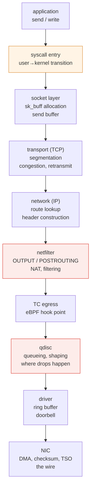
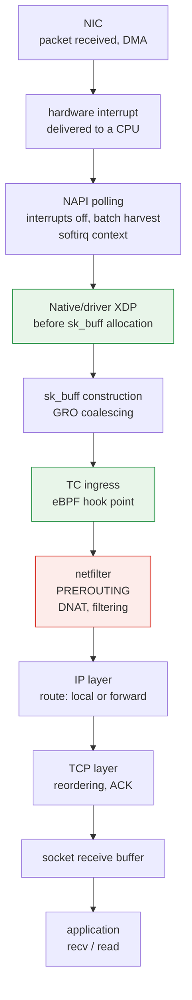

# Kernel Networking Stack

> **Supported Versions**: Linux 6.1 / 6.12 / 6.18 (Amazon Linux 2023)
> **Last Updated**: September 12, 2026

## What This Document Covers

- The path one `send()` travels inside the kernel until it reaches the wire, and what each point does
- Where you can attach hooks — and why the position of XDP, TC, and netfilter creates performance differences
- Why Pod-to-Pod traffic actually takes different paths on the same node, the same AZ, and across AZs

## Why You Need to Know the Path

"The network is slow" is not a diagnosable sentence. The kernel network path has **several points that create latency and loss for different reasons**, and the response differs completely depending on which one it is.

| Symptom | The actual point |
|---|---|
| Throughput plateaus at some level | Socket buffers, or a single-flow limit |
| Drops only during traffic bursts | qdisc queue overflow or NIC ring buffer |
| Only one CPU is at 100% | RSS/RPS not configured — interrupts pinned to one core |
| Small requests are unusually slow | Fixed overhead (syscalls, context switches) dominating |
| It slowed down as rules grew | netfilter rule evaluation |

Knowing the path lets you read this table backwards to decide where to look.

## Transmit Path — from send() to the Wire



What actually happens at each stage is the basis for diagnosis.

### ① Syscall entry — the source of fixed overhead

`send()` is a syscall, so it transitions from user space into the kernel. That transition is a **fixed cost independent of how much data you send.**

So **this cost dominates in workloads with many small requests.** Sending 64 bytes ten thousand times versus 640KB once moves the same data with ten thousand times the syscalls.

The response is batching — `sendmsg`/`sendmmsg` to coalesce, application-level buffering, or `io_uring` to batch submission itself.

### ② Socket layer — sk_buff and buffers

The kernel handles packets as `sk_buff` (socket buffer) structures, holding the data, each layer's header offsets, and metadata. A pointer to this structure is passed along the whole path, and **minimizing copies is the design goal.**

What happens when the send buffer fills splits here:

- **Blocking socket**: `send()` waits
- **Non-blocking socket**: returns `EAGAIN`, and the application must retry

So socket buffer size (`net.ipv4.tcp_wmem`) determines **how far ahead the application can run.** Smaller than the BDP (bandwidth × delay) and you cannot fill the link.

### ③ Transport (TCP) — where congestion control lives

What TCP does has the biggest performance impact.

- Splits data into MSS-sized segments
- Decides how far ahead to send via the **congestion window (cwnd)**
- Maintains a retransmit queue and retransmits when ACKs do not arrive

The congestion control algorithm lives here. `cubic` was the long-standing default, with **`bbr`** as the alternative. The difference is **what they treat as the congestion signal.**

| Algorithm | Congestion signal | Fits |
|---|---|---|
| **cubic** | **Packet loss** | Wired environments where loss means congestion |
| **bbr** | **Bandwidth/RTT estimation** | Environments where loss happens unrelated to congestion (wireless, shallow-buffer paths), long-delay paths |

cubic's premise is "loss = congestion." On paths where loss has other causes, cubic backs off unnecessarily. bbr judges from measured bandwidth and minimum RTT instead, avoiding that.

Intra-VPC traffic is a high-quality path with rare loss, so cubic is usually fine. **bbr's advantage shows on long-delay, lossy paths like cross-region or internet transit.**

### ④ Network layer (IP) — route lookup

Finds the path to the destination in the routing table. **This lookup is per net namespace**, so the routing table you see inside a Pod is not the node's ([Container Kernel Features](./01-container-primitives.md)).

### ⑤ netfilter — where rules are evaluated

Filtering and NAT happen at the `OUTPUT` and `POSTROUTING` hooks. In Kubernetes, Service DNAT and egress MASQUERADE are at this point.

**This is the point that can slow down in proportion to rule count.** With thousands of Services in iptables-mode kube-proxy, chains grow long and linear evaluation costs add up. That is exactly the problem nftables mode and eBPF dataplanes address.

### ⑥ qdisc — where drops actually happen

A qdisc (queueing discipline) **queues packets before handing them to the NIC and decides order and rate.**

The operationally important fact:

> Qdisc overflow is one possible source of burst drops. Correlate qdisc, NIC/driver, stack and cloud-network counters before assigning a cause.

When the qdisc queue fills, packets are discarded. This is not a NIC or network problem — it is **a drop inside the node.** It is easy to lose time looking outside, believing "the network lost packets."

**Observation**: the `dropped` counter in `tc -s qdisc show dev <iface>`. Check transmit drops in `ip -s link` too.

qdiscs differ in character.

| qdisc | Character |
|---|---|
| `pfifo_fast` | Simple FIFO (3 priority bands). The old default |
| `fq_codel` | **Bufferbloat mitigation** — actively drops as the queue lengthens to hold latency down. The modern default on many distributions |
| `fq` | Flow fair queueing plus pacing. Pairs well with bbr |
| `mq` | Wrapper placing a qdisc per hardware queue on multi-queue NICs |

**Bufferbloat** is worth understanding. Large queues reduce drops but **time spent waiting in the queue shows up as latency.** Throughput looks good while latency degrades. `fq_codel` mitigates this by watching queue delay and dropping deliberately, signaling TCP to back off sooner.

### ⑦ Driver and NIC — offloads

The driver places the `sk_buff` in a ring buffer (descriptor ring) and notifies the NIC, which DMAs the memory and transmits.

What the NIC does on the kernel's behalf **substantially reduces CPU use.**

| Offload | What it does |
|---|---|
| **TSO / GSO** | TSO delegates segmentation to supported hardware; GSO is the kernel’s generic/software segmentation framework and fallback. They are not both NIC-only operations |
| **GRO** (Generic Receive Offload) | On receive, **coalesces** small packets before handing them up → fewer stack traversals |
| **Checksum offload** | The NIC computes checksums |
| **RSS** (Receive Side Scaling) | **Distributes** received packets across queues/cores by hash |

TSO/GRO have a big effect — reducing stack traversals is the CPU saving. **Observation**: `ethtool -k <iface>`.

## Receive Path — from Interrupt to Application

Receive is the reverse of transmit, but has **its own structure: interrupt handling.**



### NAPI — the mechanism preventing interrupt storms

Interrupting per packet leads under high load to a state where **the system does nothing but handle interrupts** (livelock).

NAPI prevents that. On the first interrupt it **turns interrupts off and switches to polling**, harvesting many queued packets at once. When the queue empties it re-enables interrupts. Polling mode engages automatically under load.

This is **why efficiency improves under higher load** — larger batches mean lower per-packet overhead.

### Interrupts pinned to one core

Receive interrupts are delivered to a specific CPU. With a single queue or no distribution configured, **that core saturates while the rest idle.** Overall CPU utilization looks low while throughput plateaus.

Three layers of solution:

| Feature | Layer | What it does |
|---|---|---|
| **RSS** | Hardware | NIC distributes across receive queues by hash, each handled by a different CPU |
| **RPS** | Software | Kernel hands receive processing to another CPU (when RSS is absent or queues are few) |
| **RFS** | Software | Sends to **the CPU where the process actually reading that socket runs** → better cache locality |

**Diagnosis**: `/proc/interrupts` for even distribution across cores, `mpstat -P ALL` for a spiking `%soft` (softirq) on one core.

### Socket receive buffers and backpressure

If the application does not call `recv()` fast enough, the receive buffer fills. TCP **shrinks the receive window** to tell the sender to slow down (backpressure).

A frequently misread point: **in this situation the cause of added latency is the application, not the network.** Processing cannot keep up so the queue grows, and enlarging the buffer makes latency worse (the same structure as bufferbloat). The real fix is more processing capacity.

## Comparing Hook Points — XDP, TC, netfilter

All are "intercept and process a packet," but **position determines performance and what is possible.**

| Item | **XDP** | **TC (eBPF)** | **netfilter** |
|---|---|---|---|
| **Position** | Native/driver XDP: before `sk_buff`; generic XDP: skb-based | After `sk_buff` construction, ingress/egress | Stack hooks |
| **Direction** | Mostly ingress | ingress + egress | All directions |
| **Performance** | **Fastest** — can drop/forward immediately without the stack | Fast | Relatively slower (affected by rule count) |
| **Information available** | Raw packet (limited metadata) | Full `sk_buff` metadata | Includes connection state (conntrack) |
| **Main uses** | **DDoS drops**, load balancing, packet redirect | Policy enforcement, observability, redirect | NAT, stateful filtering |
| **Hardware offload** | Some driver/NIC combinations | Some | Selected nftables flowtable offload; not every rule/path |

The early-drop advantage describes **native/driver XDP**, before skb allocation. Generic XDP already has an skb, and actual performance depends on driver support and program work. Do not use one mode’s explanation as a universal benchmark result.

XDP does not automatically receive all socket/stack context, but BPF maps can maintain state and supported helpers can expose additional information. **Stateful processing is not inherently impossible at XDP**; evaluate the actual program, kernel, verifier and driver limits.

This is why Cilium uses both hooks — handling what it can at XDP quickly and deferring anything needing state or L7 information past TC ([Cilium eBPF](../networking/cilium/02-ebpf.md), [Cilium L2-L7 Networking](../networking/cilium/05-l2-l7-networking.md)).

## Pod-to-Pod — Why the Path Differs

In Kubernetes, Pod-to-Pod traffic **actually traverses different kernel paths** depending on placement. This is the cause of the RTT ladder measured in the [Pod Network Benchmark](../networking/06-pod-network-benchmark.md) (same node 0.040 ms → same AZ 0.339 ms → cross AZ 0.544 ms).

### Pods on the same node

```text
Pod A [net ns A] → veth A → (node net ns) → veth B → Pod B [net ns B]
```

In the illustrated ordinary veth/routed same-node path, traffic need not traverse the physical NIC. Other dataplanes, overlays, SR-IOV or policy/service detours can change that path; virtual devices still have kernel driver processing.

That is why same-node single-flow throughput reached **29.97 Gbps** in the benchmark (while cross-node hit the EC2 single-flow limit at 4.96 Gbps). The bottleneck was not the network but **CPU** — one client core at 99.8%.

### Pods on different nodes (VPC CNI)

```text
Pod A → veth → node net ns → ENI → VPC network → target ENI → veth → Pod B
```

With Amazon VPC CNI, Pods receive **real VPC IPs**, so there is no overlay encapsulation. Avoiding encap/decap cost and MTU loss versus overlay CNIs (VXLAN and friends) is VPC CNI's structural advantage ([VPC CNI](../networking/01-vpc-cni.md)).

In exchange, this path traverses the whole transmit chain (qdisc, driver, NIC) and is subject to **EC2 instance network limits** — single-flow caps, total instance bandwidth, PPS limits.

### Crossing an AZ

The cited single-flow experiment observed +0.21 ms RTT and about 4.96 Gbps in both cross-node placements. That result applies to its instances, load and path; it does not prove that every cross-AZ workload has unchanged throughput.

### MTU and fragmentation

Packets larger than the path's minimum MTU are fragmented or dropped. **Jumbo frames (9001)** are usable within a VPC, but become a problem if a smaller MTU appears on the path.

Watch especially for **PMTUD (Path MTU Discovery) failure.** If the ICMP that reports path MTU is blocked, the sender keeps sending large packets, they get dropped in the middle, and **the connection appears to hang.** This is the classic cause of "the handshake works but data transfer stalls" — small packets (handshake) pass while only large packets are dropped.

## Observation Tools

Each layer needs different things watched.

| Layer | Tool | What you see |
|---|---|---|
| Socket | `ss -tin` | Connection state, cwnd, RTT, retransmits |
| TCP global | `nstat` / `netstat -s` | Retransmits, out-of-order, buffer overruns |
| netfilter | `iptables-save`, `nft list ruleset` | Rule count and content |
| conntrack | `conntrack -S` | **`insert_failed`** — exhaustion evidence |
| qdisc | `tc -s qdisc show dev <if>` | **`dropped`** — in-node drops |
| Interface | `ip -s link`, `ethtool -S <if>` | Interface and NIC counters |
| Offloads | `ethtool -k <if>` | TSO/GRO/checksum state |
| Interrupts | `/proc/interrupts`, `mpstat -P ALL` | Core skew, softirq share |
| Packet trace | `tcpdump`, `ss`, eBPF tools | Actual packets |

Start with drop counters, then correlate timing, interface/namespace, traffic and resource pressure. A rising counter is evidence to investigate, not proof of the only cause; missing counters do not rule out loss elsewhere. Use RTT/cwnd, application metrics and packet capture where appropriate.

## Summary

- Transmit runs **syscall → socket → TCP → IP → netfilter → TC → qdisc → driver → NIC**. Each point creates problems for different reasons.
- **Drops during bursts usually happen at the qdisc** — a problem inside the node, though it is easy to waste time looking outside.
- On receive, **NAPI** prevents interrupt storms, and **RSS/RPS/RFS** fix interrupts pinned to one core.
- Hook-point performance differences come from position — **XDP runs before `sk_buff` allocation**, making it fastest but blind to conntrack state.
- Pod-to-Pod traffic takes **different paths** by placement. Same-node traffic only crosses veth and never touches the NIC, so the bottleneck is CPU rather than network.
- **PMTUD failure presents as "the handshake works but data stalls."**

Next: [EKS Node Kernel Tuning](./03-eks-node-tuning.md) covers which parameters on this path to change and when.

## References

- [Linux Networking Documentation — Kernel](https://docs.kernel.org/networking/index.html)
- [NAPI — Linux kernel documentation](https://docs.kernel.org/networking/napi.html)
- [Scaling in the Linux Networking Stack (RSS/RPS/RFS)](https://docs.kernel.org/networking/scaling.html)
- [XDP — eXpress Data Path](https://docs.kernel.org/networking/af_xdp.html)
- [BBR congestion control](https://datatracker.ietf.org/doc/draft-cardwell-iccrg-bbr-congestion-control/)
- [Pod Network Benchmark](../networking/06-pod-network-benchmark.md)
- [eBPF Fundamentals](../basics/05-ebpf-fundamentals.md)


- [Linux segmentation offloads](https://docs.kernel.org/networking/segmentation-offloads.html) — hardware TSO and software GSO
- [Linux IP sysctls](https://docs.kernel.org/networking/ip-sysctl.html) — TCP buffer sizing and socket overrides
