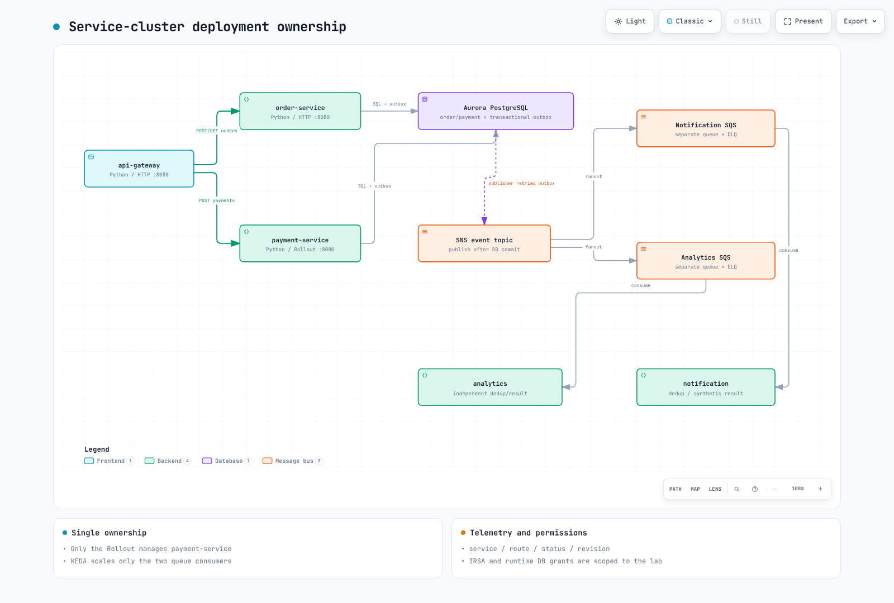
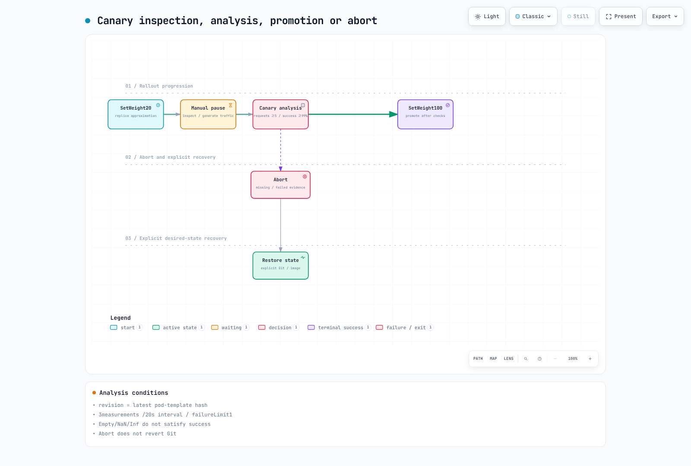

# Part 3: MSA deployment and canary

<span id="application-structure"></span>
<span id="architecture-overview"></span>
<span id="canary-state-diagram"></span>
<span id="cleanup"></span>
<span id="exercise-1-msa-application-overview"></span>
<span id="exercise-2-karpenter-nodepool-configuration"></span>
<span id="exercise-3-keda-scaledobject-configuration"></span>
<span id="exercise-4-argocd-application-deployment"></span>
<span id="exercise-5-opentelemetry-auto-instrumentation"></span>
<span id="exercise-6-argo-rollouts-canary-deployment"></span>
<span id="exercise-7-intentional-failure-and-automatic-rollback"></span>
<span id="learning-objectives"></span>
<span id="next-steps"></span>
<span id="prerequisites"></span>
<span id="references"></span>
<span id="repository-structure"></span>
<span id="sample-code-snippets"></span>
<span id="service-call-flow"></span>
<span id="steps"></span>
<span id="steps-1"></span>
<span id="steps-2"></span>
<span id="steps-3"></span>
<span id="steps-4"></span>
<span id="steps-5"></span>
<span id="summary"></span>
<span id="troubleshooting"></span>
<span id="verification"></span>
<span id="verification-1"></span>
<span id="verification-2"></span>
<span id="verification-3"></span>
<span id="verification-4"></span>
<span id="verification-5"></span>

> **Difficulty**: Advanced
> **Last Updated**: September 13, 2026
Deploy five runnable Python roles as separate workloads. The [application README](https://github.com/Atom-oh/kubernetes-docs/tree/main/examples/labs/observability/application) defines code, DB, image and chart inputs. Payments and notifications are synthetic; no actual charge or email/SMS is sent.


[🔍 View interactive diagram](https://www.atomai.click/kubernetes-docs/archmaps/en-labs-observability-03-msa-deployment-lab-10.html)

## 1. Shared API and persistence contracts {#contracts}

| Request/role | Contract |
|---|---|
| `POST /orders` | 201 + `id`; order and outbox commit together |
| `POST /payments` | 200 + `status: completed`; same order/amount/method is idempotent |
| `GET /orders/{id}` | 200 + same ID, or404 |
| `notification` | Own SQS queue, persisted synthetic notification |
| `analytics` | Separate SQS queue, independent persisted result |

W3C context crosses gateway/service HTTP and producer/consumer boundaries. A crash after outbox publication but before the DB mark causes redelivery, so consumers deduplicate event IDs transactionally. This does not make external email/payment effects exactly once. General Idempotency-Key handling for order POST is not included.

App metrics are `lab_http_requests_total` and `lab_http_request_duration_seconds`, labeled by service/route/status/revision. JSON logs carry service/level/trace_id/span_id; customer/payment payloads are not metric labels.

## 2. Database file and image {#image-database}

Use Part1’s dedicated runtime account/private connection file. Pod paths are `/run/database-ca/global-bundle.pem` and `/run/database/connection.json`; mount the connection file and public RDS CA separately as Secret/ConfigMap.

```bash
cd examples/labs/observability/application
kubectl --context service create namespace msa --dry-run=client -o yaml | kubectl --context service apply -f -
kubectl --context service -n msa create secret generic lab-database --from-file=connection.json="$LAB_STATE/runtime-pod-connection.json"
kubectl --context service -n msa create configmap lab-database-ca --from-file=global-bundle.pem="$LAB_STATE/global-bundle.pem"
docker buildx build --platform linux/amd64 \
  --tag "$IMAGE_REPOSITORY:$IMAGE_TAG" --push .
docker buildx imagetools inspect "$IMAGE_REPOSITORY:$IMAGE_TAG"
```
Use the immutable version selected in Part1. Update existing Secrets through the organization’s rotation procedure without printing values or placing them in chart files. The Dockerfile pins a base digest, UID10001 and a bounded build context.

The generated `m6i.large` nodes use AMD64. Use an AMD64 or cross-platform-capable Buildx builder and verify `linux/amd64` in the pushed manifest before deployment. The audit's local ARM64 smoke test does not validate the AMD64 build.

## 3. Install controllers and chart {#deployment}

```bash
helm repo add kedacore https://kedacore.github.io/charts
helm repo add argo https://argoproj.github.io/argo-helm
helm upgrade --install keda kedacore/keda --version 2.20.2   --kube-context service -n keda --create-namespace -f "$LAB_STATE/helm-inputs/keda.yaml"
helm upgrade --install argo-rollouts argo/argo-rollouts --version 2.43.1   --kube-context service -n argo-rollouts --create-namespace
helm upgrade --install observability-lab ./chart --kube-context service -n msa   -f "$LAB_STATE/helm-inputs/application.yaml"
kubectl --context service -n msa get deployment,rollout,pods,svc,scaledobject
```
Verify all five ServiceAccounts and IRSA subjects. Gateway has no AWS role; publishers access SNS, consumers their own queues, and KEDA only queue attributes. Do not configure duplicate Pod Identity/IRSA paths on a workload. Readiness checks DB/schema, not successful SQS/IAM delivery.

ServiceMonitor labels match the service Prometheus release and `honorLabels` preserves the app service label. Managed node groups can run the baseline; add Karpenter only after its [separate guide](../../autoscaling/02-karpenter.md) verifies IAM/discovery/EC2NodeClass/AMI/taints.



[🔍 View interactive diagram](https://www.atomai.click/kubernetes-docs/archmaps/en-labs-observability-03-msa-deployment-lab-0.html)

## 4. Verify HTTP and asynchronous processing {#verify}

```bash
kubectl --context service -n msa port-forward svc/api-gateway 8080:8080
# Run in another terminal from the repository root:
BASE_URL=http://127.0.0.1:8080 LOAD_PROFILE=smoke   k6 run --no-usage-report examples/labs/observability/load-test/k6-scenario.js
```
Read only created IDs and validate the synthetic payment state. Verify independent queue delivery and increasing consumer `/stats`/DB counts/logs. Notification and analytics use separate queues; competing consumers on one queue would not provide fanout. Failed/poison messages remain unacknowledged for the DLQ policy.

Compare CloudWatch/Loki JSON trace_id, actual Tempo spans and Prometheus exemplar IDs. Installing a collector is not end-to-end verification.

## 5. Canary and GitOps ownership {#canary}




[🔍 View interactive diagram](https://www.atomai.click/kubernetes-docs/archmaps/en-labs-observability-03-msa-deployment-lab-1.html)
A single Rollout owns payment-service. With five replicas, the20% step is replica-based and does not guarantee20% of actual requests. Generate traffic to the new revision during the manual pause before analysis. Queries select `rollouts-pod-template-hash`, require at least five recent requests and99% success, and reject empty/NaN/Inf/multi-series results.

Actual Rollouts1.10.0 condition evaluation and PromQL were tested, but cluster promotion was not executed. Abort is not a Git revert or desired-image restoration. For optional ArgoCD, follow its [installation guide](../../gitops/argocd/01-installation.md), point to this repository’s real chart path/reviewed revision, and avoid simultaneous direct-Helm ownership. Reference existing Secrets rather than committing them. App-of-apps sync waves alone do not guarantee child readiness.

### Exercise the manual pause

These steps use Helm as the desired-state owner. Under GitOps, review image changes and recovery in Git and do not mix direct Helm writes. Install the matching OS/CPU plugin after checking the [Argo Rollouts 1.10.0 release](https://github.com/argoproj/argo-rollouts/releases/tag/v1.10.0) binary and checksum.

```bash
# ROLLOUTS_BINARY: checksum-verified binary for your OS/architecture.
: "${ROLLOUTS_BINARY:?Set the verified Argo Rollouts 1.10.0 binary path}"
mkdir -p "$HOME/.local/bin"
install -m 755 "$ROLLOUTS_BINARY" "$HOME/.local/bin/kubectl-argo-rollouts"
export PATH="$HOME/.local/bin:$PATH"
kubectl argo rollouts version --short
```

Confirm a stable Rollout and retain its complete values before publishing an actually reviewed AMD64 image under a new immutable tag using the Part3 build procedure. Initial installation has no prior stable revision and is not this update exercise. The chart shares one image setting across all roles, so changing it also updates other roles as ordinary Deployments; only payment follows Rollout steps.

```bash
# Run from examples/labs/observability/application.
: "${CANARY_IMAGE_TAG:?Set an actually built and reviewed immutable AMD64 image tag}"
# Keep the original application.yaml as the stable revision's complete values.
CANARY_VALUES="$LAB_STATE/helm-inputs/canary-image.yaml"
python3 - "$CANARY_VALUES" "$CANARY_IMAGE_TAG" <<'PYIMAGE'
import sys, json
with open(sys.argv[1], "w") as output:
    json.dump({"image": {"tag": sys.argv[2]}}, output)
PYIMAGE
helm upgrade observability-lab ./chart --kube-context service -n msa \
  -f "$LAB_STATE/helm-inputs/application.yaml" -f "$CANARY_VALUES"
kubectl argo rollouts get rollout payment-service --context service -n msa --watch
```

Keep the --watch display in a separate terminal and stop it with Ctrl+C when needed. Run traffic and promote/abort commands in another terminal.

While Paused, continue the traffic from section4 and verify that at least five recent requests reached the new rollouts-pod-template-hash revision in Prometheus. Missing traffic/query failures are not success. After inspection, advance the manual pause below so the configured AnalysisRun and subsequent steps execute. Do not use --full: it skips analysis and pauses.

```bash
kubectl argo rollouts promote payment-service --context service -n msa
kubectl argo rollouts get rollout payment-service --context service -n msa --watch
kubectl --context service -n msa get analysisruns
```

If a problem occurs, abort instead of promoting, then restore the desired image through the original complete values. Abort alone does not restore spec.template or Git.

```bash
kubectl argo rollouts abort payment-service --context service -n msa
helm upgrade observability-lab ./chart --kube-context service -n msa \
  -f "$LAB_STATE/helm-inputs/application.yaml"
kubectl argo rollouts get rollout payment-service --context service -n msa --watch
```

After successful promotion, retain the approved image overlay in subsequent Helm commands or incorporate it into your managed desired values. Preserve failure-analysis evidence and inspect the final state. This audit verified CLI checksums/help and chart/analysis logic; it did not execute these cluster update/promote/abort commands.

Continue to [Part4](./04-load-testing-scaling-lab.md). Follow [Part6](./06-distributed-tracing-lab.md#cleanup) for ownership/dependency-aware cleanup.

## Validation scope

Checks covered local SQLite/PostgreSQL, three HTTP services, OTel correlation, SNS/SQS SDK stubs, container smoke, Helm/CRD and PromQL/Argo conditions. Actual AuroraTLS, EKS/IRSA, SNS fanout, KEDA/Karpenter and canary traffic splits were not exercised.
