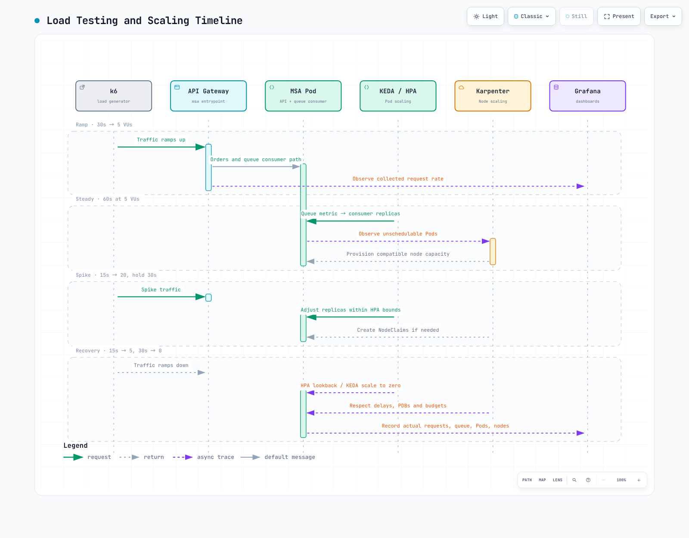

# Part 4: Load Testing and Autoscaling

<span id="exercise-1-k6-load-test-scenario"></span>
<span id="exercise-2-locust-alternative-python-based"></span>
<span id="exercise-3-observe-autoscaling-during-load"></span>
<span id="exercise-4-cool-down-and-scale-in-observation"></span>
<span id="exercise-5-grafana-scaling-dashboard"></span>
<span id="key-observations"></span>
<span id="learning-objectives"></span>
<span id="load-testing-and-scaling-timeline"></span>
<span id="next-steps"></span>
<span id="references"></span>
<span id="steps"></span>
<span id="steps-1"></span>
<span id="steps-2"></span>
<span id="steps-3"></span>
<span id="steps-4"></span>
<span id="summary"></span>
<span id="troubleshooting"></span>
<span id="verification"></span>

> **Difficulty**: Intermediate · **Estimated time**: 45 minutes
> **Last Updated**: September 13, 2026

Run the same order/payment/read flow with k6 and Locust, then explain observed Pod and node changes. Target only your disposable lab API. VU counts and latency thresholds are exercise settings, not measured throughput or scaling results.

## Prerequisites {#prerequisites}

- The [Part 3](./03-msa-deployment-lab.md) API must be ready: `POST /orders` returns `201` and `id`; `POST /payments` returns `200/201` and `status: completed`; `GET /orders/{id}` returns that ID. Change paths, payloads and assertions together for another API.
- The service cluster context is `service`; every command selects it explicitly.
- Examples were checked with k6 **2.2.0** and Locust **2.46.5**/Python **3.12**. Follow the [official installation guide](https://grafana.com/docs/k6/latest/set-up/install-k6/) for your OS/CPU architecture.
- Configure the KEDA ScaledObject and Karpenter NodePool/EC2NodeClass in [Part 3](./03-msa-deployment-lab.md). Infrastructure queries require actual kube-state-metrics/cAdvisor ingestion.



[🔍 View interactive diagram](https://www.atomai.click/kubernetes-docs/archmaps/en-labs-observability-04-load-testing-scaling-lab-0.html)

## 1. Verify the API with a small test {#smoke-test}

Use `k6-scenario.js` from the [runnable examples](https://github.com/Atom-oh/kubernetes-docs/tree/main/examples/labs/observability/load-test). Keep the port-forward running in its terminal.

```bash
# Run from the repository root.
cd examples/labs/observability/load-test
kubectl --context service -n msa port-forward svc/api-gateway 8080:8080
```

```bash
# In another terminal, from the same directory.
BASE_URL=http://127.0.0.1:8080 LOAD_PROFILE=smoke \
  k6 run --no-usage-report k6-scenario.js
```

The default smoke test runs two iterations with one VU. It reads only IDs created by the test and rejects invalid JSON, missing IDs, declined payments and a different order in the response. Thresholds turn failed `check()` results into a nonzero exit. Inspect both `k6-summary.json` and the exit code. `summaryTrendStats` includes `p(99)` because the summary prints it.

## 2. Run continuous load stages {#load-stages}

```bash
BASE_URL=http://127.0.0.1:8080 LOAD_PROFILE=scale \
  k6 run --no-usage-report k6-scenario.js
```

| Stage | Duration | Target VUs |
|---|---|---|
| Ramp | 30s | 5 |
| Steady | 60s | 5 |
| Spike ramp | 15s | 20 |
| Spike hold | 30s | 20 |
| Recovery | 15s | 5 |
| Cool-down | 30s | 0 |

Stages total three minutes, with possible additional graceful-stop time. One `stages` sequence avoids overlapping independent scenarios. VUs are not RPS: response time, requests per iteration and sleep determine throughput. Increase load only after checking NodePool capacity and budget. Controller limits and AWS Budgets notifications are not absolute spending barriers.

`k6-job.yaml` is an in-cluster **smoke-only** alternative. First create the `obs-lab-k6` ConfigMap using its README commands. The Job has zero retries, a 120-second deadline and resource limits. Job creation does not prove test success; inspect logs, Pod exit code and Complete/Failed conditions.

## 3. Locust alternative {#locust}

```bash
python3.12 -m venv .venv
.venv/bin/python -m pip install -r requirements.txt
.venv/bin/locust -f locustfile.py --headless \
  --host http://127.0.0.1:8080 --users 1 --spawn-rate 1 \
  --run-time 10s --stop-timeout 5 --exit-code-on-error 99 \
  --csv locust-results
```

Headless mode avoids exposing a management UI or worker RPC service. Distributed execution requires its own authentication, internal network and worker configuration. Both tools test the same API flow, but their schedulers differ; equal VU/user counts alone do not make experiments equivalent.

## 4. Observe Pods and nodes separately {#observe-scaling}

```bash
kubectl --context service -n msa get scaledobject,hpa
kubectl --context service -n msa describe scaledobject
kubectl --context service -n msa get pods -o wide
kubectl --context service get nodepools,nodeclaims
kubectl --context service get nodes -L karpenter.sh/nodepool,karpenter.sh/capacity-type
kubectl --context service -n msa get events --sort-by=.metadata.creationTimestamp
```

The SQS scaler reads queue attributes; it does not consume messages. Check that the consumer queue and ScaledObject URL match. `queueLength` is a per-Pod target; message counts, in-flight/delayed settings, replica bounds and HPA behavior affect results. Scaling only the API producer does not solve a consumer backlog.

Karpenter provisions capacity for unschedulable Pods whose requirements can be met by its NodePools. Diagnose image pulls, PVCs and taints too: more nodes may not solve them. Select nodes using actual NodePool labels, not hostname substrings.

## 5. Dashboards and queries {#dashboard-queries}

```promql
# Running Pods: phase series also exist with value zero.
sum(kube_pod_status_phase{namespace="msa", phase="Running"} == 1)

# Deployment total/ready replicas are different measurements.
kube_deployment_status_replicas{namespace="msa"}
kube_deployment_status_replicas_ready{namespace="msa"}

# HPA desired/current replicas.
kube_horizontalpodautoscaler_status_desired_replicas{namespace="msa"}
kube_horizontalpodautoscaler_status_current_replicas{namespace="msa"}

# Container resource usage; exclude the empty and Pod infrastructure series.
sum by (pod) (rate(container_cpu_usage_seconds_total{namespace="msa", container!="", container!="POD"}[5m]))
sum by (pod) (container_memory_working_set_bytes{namespace="msa", container!="", container!="POD"})
```

`kube_deployment_status_replicas` is not the ready count. For a Rollout workload, use Rollouts exporter/ReplicaSet/Pod state rather than assuming Deployment metrics exist. Custom node labels appear in `kube_node_labels` only when allowed by kube-state-metrics. `changes(kube_node_created[10m])` observes a constant creation timestamp and does not detect newly created nodes.

Before adding RED panels, inspect actual application metric names, units and labels. OTel HTTP histograms and custom Prometheus counters may differ. Aggregate bounded service/route/status labels; never use order or customer IDs as labels. Calculate error ratios over the same service/route scope and show no-traffic intervals as missing measurements.

## 6. Scale-in and verification record {#scale-in}

| Control | Actual meaning |
|---|---|
| KEDA `cooldownPeriod` | Wait after the last active trigger when scaling **to zero** |
| HPA `scaleDown.stabilizationWindowSeconds` | Consider the highest recommendation in the lookback window for 1→N scaling |
| Karpenter `consolidateAfter` | Delay before considering consolidation after Pod changes |
| PDB/disruption budget/constraints | May delay or block consolidation/termination |

Do not promise instant empty-node deletion or an exact replica count at a fixed minute. Record actual baseline/peak/recovery RPS, errors, p99, queue depth, desired/ready Pods, NodeClaims and Pending reasons. Node count alone cannot quantify total AWS savings.

## Cleanup and next steps {#cleanup}

Confirm the test stopped, remove its `obs-lab-k6-smoke` Job/ConfigMap if used, and stop the port-forward. Continue to [Part 5](./05-alerting-aiops-lab.md) for alert validation. Follow [Part 6](./06-distributed-tracing-lab.md#cleanup) for infrastructure cleanup.

## References and validation scope

- [k6 thresholds](https://grafana.com/docs/k6/latest/using-k6/thresholds/)
- [Locust](https://docs.locust.io/en/stable/running-without-web-ui.html)
- [KEDA ScaledObject](https://keda.sh/docs/2.20/reference/scaledobject-spec/)
- [Karpenter disruption](https://karpenter.sh/docs/concepts/disruption/)
- [Prometheus](../../observability/metrics/01-prometheus.md)

Each real k6/Locust tool was tested against a synthetic loopback HTTP server for six success/failure cases. No cluster, actual MSA, AWS load, node scaling or capacity test was executed.
