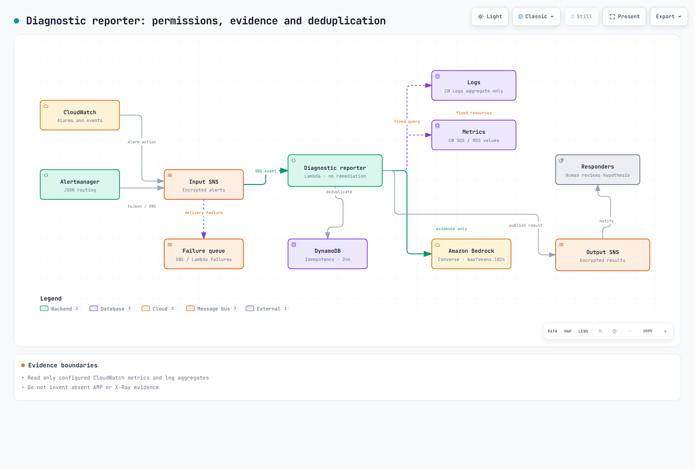

# Part 5: Alerting and AIOps

<span id="architecture-overview"></span>
<span id="cleanup"></span>
<span id="exercise-1-alertmanager-prometheusrules"></span>
<span id="exercise-2-cloudwatch-alarms"></span>
<span id="exercise-3-grafana-oncall-setup"></span>
<span id="exercise-4-sns-topic-and-email-subscription"></span>
<span id="exercise-5-cloudwatch-investigations"></span>
<span id="exercise-6-aiops-agent-with-lambda-and-bedrock"></span>
<span id="exercise-7-load-and-fault-injection"></span>
<span id="exercise-8-verify-aiops-pipeline"></span>
<span id="exercise-9-advanced-a2a-multi-agent-pattern"></span>
<span id="learning-objectives"></span>
<span id="next-steps"></span>
<span id="prerequisites"></span>
<span id="references"></span>
<span id="steps"></span>
<span id="steps-1"></span>
<span id="steps-2"></span>
<span id="steps-3"></span>
<span id="steps-4"></span>
<span id="steps-5"></span>
<span id="steps-6"></span>
<span id="steps-7"></span>
<span id="steps-8"></span>
<span id="summary"></span>
<span id="troubleshooting"></span>
<span id="verification-1"></span>
<span id="verification-checklist"></span>

> **Difficulty**: Advanced · **Estimated time**: 60 minutes
> **Last Updated**: September 13, 2026

Receive an alert, inspect actual metrics and aggregated logs, then produce a diagnostic hypothesis for human review. The [runnable example](https://github.com/Atom-oh/kubernetes-docs/tree/main/examples/labs/observability/aiops) is a Lambda reporter with separate input/output SNS topics. It includes no automatic remediation or anonymous HTTP webhook.

Prerequisites are [Part 2](./02-observability-stack-lab.md) ingestion, [Part 3](./03-msa-deployment-lab.md) services and a successful [Part 4](./04-load-testing-scaling-lab.md) smoke test. Code and templates were checked locally; no AWS deployment, model invocation or notification was executed during this audit.


[🔍 View interactive diagram](https://www.atomai.click/kubernetes-docs/archmaps/en-labs-observability-05-alerting-aiops-lab-0.html)

## 1. Separate evaluation from routing {#rules-and-routing}

**Prometheus evaluates alert rules**; **Alertmanager handles grouping, deduplication, routing, inhibition and notification**. `PrometheusRule` is a Prometheus Operator CRD, not a resource evaluated by Alertmanager itself.

| Setting | Verify |
|---|---|
| Prometheus `for` | Pending while the condition persists across evaluations, then firing |
| Rule selectors | Actual namespace/label selectors in the Prometheus CR select the rule |
| Alertmanager route | `matchers`, route order, children, `continue` and receiver match |
| Metrics | Actual SDK names, units and labels; missing series, no traffic and counter resets |
| Service label | Only services in the reporter catalog are allowed |

`up == 0` detects failure of an already-known scrape target, not every undiscovered target. Restart growth differs from CrashLoopBackOff; an old OOMKilled state differs from a new OOM event. A PromQL SQS metric name cannot create data without its exporter.

```bash
kubectl --context managed -n monitoring get prometheus,alertmanager,prometheusrule
kubectl --context managed -n monitoring get services
# Use the actual Prometheus Service name in the next command.
kubectl --context managed -n monitoring port-forward svc/REPLACE_WITH_PROMETHEUS_SERVICE 9090:9090
```

```bash
curl --fail --silent http://127.0.0.1:9090/api/v1/rules
curl --fail --silent http://127.0.0.1:9090/api/v1/alerts
```

Substitute names from the installed chart release. Do not assume another release name or search a nonexistent ConfigMap. Resource existence and actual Prometheus loading/evaluation are separate checks.

## 2. CloudWatch alarm semantics {#cloudwatch-alarms}

The template backlog alarm uses `AWS/SQS`, `ApproximateNumberOfMessagesVisible`, the exact `QueueName`, `Maximum`, `Period=60`, `EvaluationPeriods=3` and `DatapointsToAlarm=2`. This is **two of three** evaluated datapoints; breaches need not be consecutive. `Period` is aggregation granularity, not a synonym for evaluation frequency.

This lab leaves missing data as `missing`. Do not infer healthy zero from an inactive queue or broken ingestion. When adding RDS CPU, use the actual instance metric dimension `DBInstanceIdentifier`; verify supported dimensions before using cluster aggregates or another statistic.

Alertmanager resends, CloudWatch state transitions, SNS delivery and Lambda asynchronous retries are separate layers. Deduplication at one layer cannot guarantee end-to-end exactly-once delivery.

## 3. Choose a supported on-call path {#oncall}

Grafana OnCall OSS was **archived on March 24, 2026**; Cloud Connection-based SMS, phone and push support ended too. Do not reuse the old new-install path or fictional escalation YAML. Select a currently supported path such as your existing incident/notification system or Grafana Cloud IRM, following the [official maintenance notice](https://grafana.com/docs/oncall/latest/set-up/open-source/).

This example provides an output SNS topic. Configure responders, escalation, acknowledgement and resolution in the chosen system and verify real delivery. The template does not automatically create email, Slack or PagerDuty subscriptions.

## 4. Prepare the diagnostic reporter {#reporter}




[🔍 View interactive diagram](https://www.atomai.click/kubernetes-docs/archmaps/en-labs-observability-05-alerting-aiops-lab-10.html)
| File | Responsibility |
|---|---|
| `alerts.py` | SNS topic/format/allowlists and CloudWatch/Alertmanager normalization |
| `evidence.py` | Configured CloudWatch metrics and aggregated log reads |
| `analysis.py` | Converse only with usable evidence, 1024 output tokens, completion checks |
| `handler.py` | Two-worker collection, Powertools idempotency, output-topic publishing |
| `template.yaml` | Fifteen SAM/CloudFormation resources and scoped IAM |
| `tests/` | Success, failure, duplicates, timeout and missing data |

```bash
cd examples/labs/observability/aiops
python3.12 -m venv .venv
.venv/bin/python -m pip install -r requirements.txt
.venv/bin/python -m unittest discover -s tests -v
```

The code was checked with boto3 **1.43.93**, Powertools **3.34.0** and Python **3.12**. For a real deployment, supply an existing SQS queue/log group, approved service name, currently available Converse model/inference-profile ID and its **exact model/profile ARNs**. Do not hard-code a retired Claude model. Cross-region profiles may also require destination-model ARN permissions.

Logs must contain structured `service` and `level` fields. The reporter queries aggregate error counts, not raw messages, and never executes model-generated resource IDs or queries. Missing/failed sources remain no_data/error and can cause analysis to be skipped. It does not claim to collect AMP values or X-Ray traces that were never configured.

## 5. Deploy and connect Alertmanager {#deploy}

```bash
sam build --template-file template.yaml
sam deploy --guided --capabilities CAPABILITY_IAM
```

An operator runs these in the approved lab account after reviewing the change set. The template creates encrypted input/output SNS topics, Lambda, an idempotency table, failure queue and queue alarm. It does not overwrite reserved Lambda environment variables such as `AWS_REGION`.

Substitute the deployed InputTopicArn and actual Region below. `toJson` serialization was verified with Alertmanager **0.34.0** native templates. Merge the receiver/route into the configuration actually loaded by your installation instead of overwriting it wholesale.

```yaml
receivers:
- name: lab-diagnostics
  sns_configs:
  - topic_arn: REPLACE_WITH_INPUT_TOPIC_ARN
    sigv4:
      region: REPLACE_WITH_REGION
    message: '{{ . | toJson }}'
    send_resolved: true
```

Template Data serialized by `toJson` has capitalized fields (`Alerts`, `Labels`, `Status`), which the parser handles. It also accepts lowercase webhook JSON. The default human-readable SNS message is not this JSON format.

Attach the template AlertmanagerPublishPolicyArn only to the existing **Alertmanager workload role**. Verify the Pod credential path and KMS/SNS permissions; do not broaden the shared node role. Match `service` labels and allowed alert names to the catalog/rules. Never subscribe the reporter to OutputTopicArn.

## 6. Retries, evidence and completion {#execution}


[🔍 View interactive diagram](https://www.atomai.click/kubernetes-docs/archmaps/en-labs-observability-05-alerting-aiops-lab-2.html)
Successful SNS message IDs deduplicate in DynamoDB for **24 hours**. A changed payload under the same ID is rejected. SNS delivery is at least once; failure between publication and idempotency commit can duplicate a notification. This is not exactly-once delivery.

Lambda reserved concurrency is two, async retries are two and maximum event age is one hour after Lambda accepts the event. SNS delivery retries are separate. Inspect results, failure queues and replay procedures. Do not print raw events or credentials.

Reads use at most 15 minutes relative to the current time and report their actual start/end. They do not reconstruct the exact original alarm period. Logs Insights polls with bounds and cancels unfinished queries. Truncated (`max_tokens`), blocked or empty model output is not published as a completed diagnosis.

## 7. Configure CloudWatch Investigations separately {#investigations}


[🔍 View interactive diagram](https://www.atomai.click/kubernetes-docs/archmaps/en-labs-observability-05-alerting-aiops-lab-1.html)
First prepare an investigation group, permissions, retention and encryption for the account. Then add the group ARN as the alarm’s **Investigation action**. Metric or composite alarms can initiate investigations. The ARN shape is:

```text
arn:aws:aiops:REGION:ACCOUNT_ID:investigation-group/GROUP_ID
```

Follow the [official procedure](https://docs.aws.amazon.com/AmazonCloudWatch/latest/monitoring/Investigations-configure-alarm-procedures.html), preserving existing alarm settings when adding the action. `put-anomaly-detector`, `put-insight-rule` and `list-dashboards` are not investigation-group creation/list-investigation APIs. Enabling Application Signals discovery alone does not complete this setup. The sample SAM stack does not create an investigation group.

## 8. Fault injection and operational verification {#verification}

Record a healthy smoke baseline and notification path first. Use only fault controls the application actually implements, on a dedicated canary with a time limit, target and recovery plan. Do not call nonexistent `/admin/chaos` endpoints or unused environment flags. Deleting a Pod does not guarantee CrashLoopBackOff.

Change and recover GitOps-owned workloads through Git/the supported Rollouts flow. Do not confuse Deployments with Rollouts or delete environment variables using negative JSON Patch indices.

1. Confirm Prometheus loads the rule and transitions through pending/firing.
2. Inspect the selected Alertmanager receiver and input SNS message.
3. Check Lambda completion/failure, DLQ and idempotency results.
4. Verify the output topic differs and cannot re-enter the reporter.
5. Compare report time bounds, observations and unknowns with actual responder delivery.
6. Restore the injected change and confirm retries/load tests have stopped.

## 9. Optional extensions and cleanup {#extensions}


[🔍 View interactive diagram](https://www.atomai.click/kubernetes-docs/archmaps/en-labs-observability-05-alerting-aiops-lab-3.html)
Calling several analysis modules does not implement the A2A protocol. Agent discovery, authentication, message/task contracts, timeouts and permissions require separate design. This reporter is a single diagnostic function.

Preserve evidence and stop input alarm actions/subscriptions before cleanup. Reconcile the SAM stack, external workload-role policy attachments and extra subscriptions with ownership records. Do not delete the existing application queue/log group. Follow the dependency order and cost checks in [Part 6](./06-distributed-tracing-lab.md#cleanup).

## Validation scope

Checks covered 24 local tests, actual Powertools with an in-memory store, six botocore Stubber cases, Alertmanager 0.34.0 native JSON templates, CloudFormation lint and fifteen policy statements. They do not constitute live AWS IAM/KMS authorization, SNS delivery, DynamoDB persistence, CloudWatch query execution, Bedrock response-quality or cluster deployment tests.
