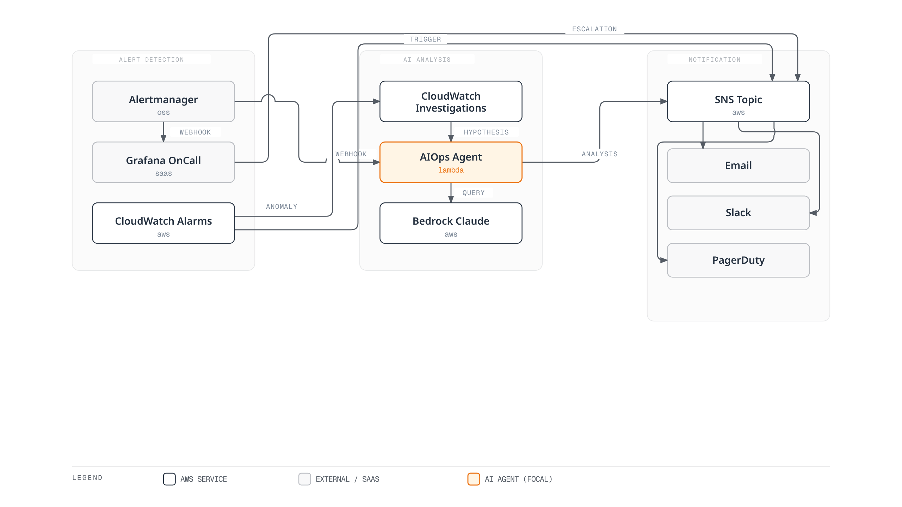
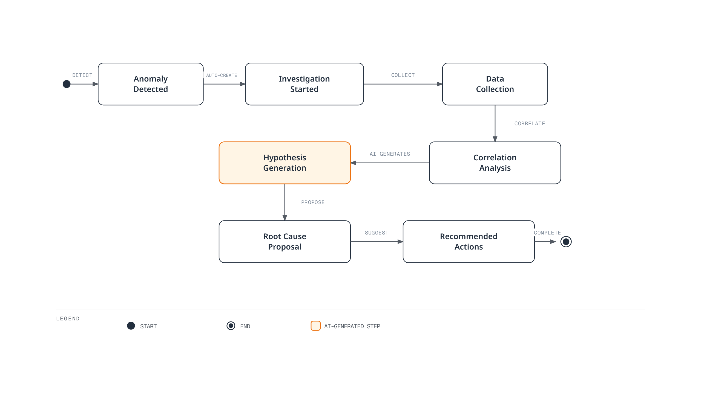
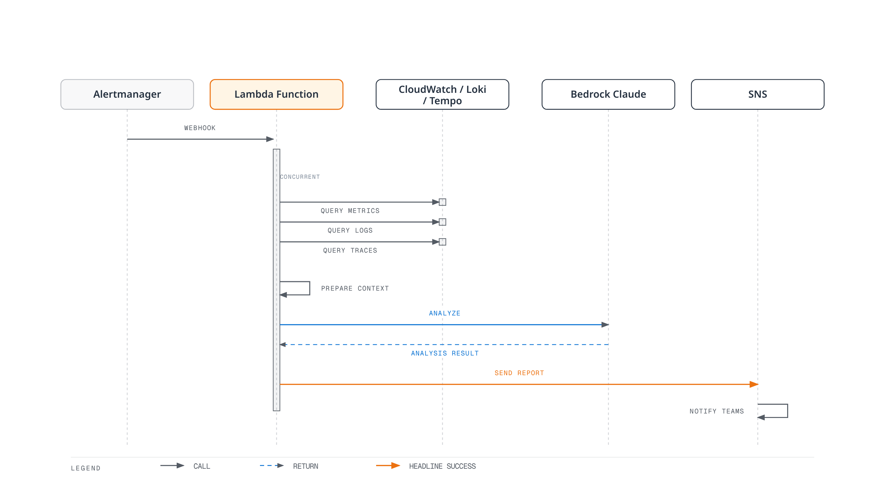

# Part 5: Alerting and AIOps

> **Difficulty**: Advanced **Estimated Time**: 60 minutes **Last Updated**: February 22, 2026

## Learning Objectives

* Configure AlertManager detection rules for common failure patterns
* Set up Grafana OnCall for incident management
* Use CloudWatch Investigations for AI-powered analysis
* Build an AIOps Agent using Lambda and Bedrock Claude for automated incident response

## Prerequisites

* [ ] Completed [Part 4: Load Testing](04-load-testing-scaling-lab.md)
* [ ] Observability stack collecting metrics, logs, and traces
* [ ] SNS Topic configured for notifications
* [ ] AWS Bedrock access enabled (for AIOps section)

***

## Architecture Overview




***

## Exercise 1: AlertManager PrometheusRules

### Steps

**Step 1.1: Create comprehensive alert rules**

```bash
kubectl config use-context $(kubectl config get-contexts -o name | grep obs-managed)

cat <<'EOF' | kubectl apply -f -
apiVersion: monitoring.coreos.com/v1
kind: PrometheusRule
metadata:
  name: msa-alerts
  namespace: monitoring
  labels:
    prometheus: kube-prometheus-stack-prometheus
    role: alert-rules
spec:
  groups:
    - name: msa.availability
      rules:
        - alert: HighErrorRate
          expr: |
            (
              sum(rate(http_server_request_count{namespace="msa",http_status_code=~"5.."}[5m])) by (service)
              /
              sum(rate(http_server_request_count{namespace="msa"}[5m])) by (service)
            ) > 0.05
          for: 2m
          labels:
            severity: critical
            team: platform
          annotations:
            summary: "High error rate on {{ $labels.service }}"
            description: "Service {{ $labels.service }} has error rate of {{ $value | humanizePercentage }} (threshold: 5%)"
            runbook_url: "https://runbooks.obs-lab.io/high-error-rate"
            dashboard_url: "http://grafana.obs-lab.io/d/msa-overview?var-service={{ $labels.service }}"

        - alert: HighLatency
          expr: |
            histogram_quantile(0.99,
              sum(rate(http_server_request_duration_seconds_bucket{namespace="msa"}[5m])) by (le, service)
            ) > 1
          for: 5m
          labels:
            severity: warning
            team: platform
          annotations:
            summary: "High latency on {{ $labels.service }}"
            description: "P99 latency for {{ $labels.service }} is {{ $value | humanizeDuration }} (threshold: 1s)"
            runbook_url: "https://runbooks.obs-lab.io/high-latency"

        - alert: ServiceDown
          expr: |
            up{job=~".*msa.*"} == 0
          for: 1m
          labels:
            severity: critical
            team: platform
          annotations:
            summary: "Service {{ $labels.job }} is down"
            description: "Prometheus target {{ $labels.instance }} for job {{ $labels.job }} has been down for more than 1 minute"

    - name: msa.pods
      rules:
        - alert: PodCrashLoopBackOff
          expr: |
            max_over_time(kube_pod_container_status_waiting_reason{namespace="msa",reason="CrashLoopBackOff"}[5m]) >= 1
          for: 5m
          labels:
            severity: critical
            team: platform
          annotations:
            summary: "Pod {{ $labels.namespace }}/{{ $labels.pod }} is crash looping"
            description: "Container {{ $labels.container }} in pod {{ $labels.pod }} is in CrashLoopBackOff state"
            runbook_url: "https://runbooks.obs-lab.io/crashloop"

        - alert: PodHighMemoryUsage
          expr: |
            (
              container_memory_working_set_bytes{namespace="msa",container!=""}
              /
              container_spec_memory_limit_bytes{namespace="msa",container!=""}
            ) > 0.9
          for: 5m
          labels:
            severity: warning
            team: platform
          annotations:
            summary: "High memory usage in {{ $labels.pod }}"
            description: "Container {{ $labels.container }} memory usage is {{ $value | humanizePercentage }} of limit"

        - alert: PodHighCPUUsage
          expr: |
            (
              sum(rate(container_cpu_usage_seconds_total{namespace="msa",container!=""}[5m])) by (pod, container)
              /
              sum(container_spec_cpu_quota{namespace="msa",container!=""}/container_spec_cpu_period{namespace="msa",container!=""}) by (pod, container)
            ) > 0.9
          for: 10m
          labels:
            severity: warning
            team: platform
          annotations:
            summary: "High CPU usage in {{ $labels.pod }}"
            description: "Container {{ $labels.container }} CPU usage is {{ $value | humanizePercentage }} of limit"

    - name: msa.sqs
      rules:
        - alert: SQSQueueBacklog
          expr: |
            aws_sqs_approximate_number_of_messages_visible_average{queue_name="obs-lab-orders"} > 1000
          for: 5m
          labels:
            severity: warning
            team: platform
          annotations:
            summary: "SQS queue backlog detected"
            description: "Queue obs-lab-orders has {{ $value }} messages waiting (threshold: 1000)"
            runbook_url: "https://runbooks.obs-lab.io/sqs-backlog"

        - alert: SQSMessageAge
          expr: |
            aws_sqs_approximate_age_of_oldest_message_seconds_average{queue_name="obs-lab-orders"} > 300
          for: 5m
          labels:
            severity: critical
            team: platform
          annotations:
            summary: "SQS messages are aging"
            description: "Oldest message in obs-lab-orders is {{ $value | humanizeDuration }} old (threshold: 5m)"

    - name: msa.nodes
      rules:
        - alert: NodeNotReady
          expr: |
            kube_node_status_condition{condition="Ready",status="true"} == 0
          for: 5m
          labels:
            severity: critical
            team: infra
          annotations:
            summary: "Node {{ $labels.node }} is not ready"
            description: "Node {{ $labels.node }} has been in NotReady state for more than 5 minutes"

        - alert: NodeHighDiskUsage
          expr: |
            (
              node_filesystem_avail_bytes{fstype!~"tmpfs|overlay",mountpoint="/"}
              /
              node_filesystem_size_bytes{fstype!~"tmpfs|overlay",mountpoint="/"}
            ) < 0.1
          for: 10m
          labels:
            severity: warning
            team: infra
          annotations:
            summary: "Node {{ $labels.instance }} disk space low"
            description: "Node has only {{ $value | humanizePercentage }} disk space available"

    - name: msa.database
      rules:
        - alert: AuroraHighCPU
          expr: |
            aws_rds_cpuutilization_average{dbinstance_identifier=~"obs-lab-aurora.*"} > 80
          for: 10m
          labels:
            severity: warning
            team: database
          annotations:
            summary: "Aurora high CPU usage"
            description: "Aurora instance {{ $labels.dbinstance_identifier }} CPU is {{ $value }}%"

        - alert: AuroraHighConnections
          expr: |
            aws_rds_database_connections_average{dbinstance_identifier=~"obs-lab-aurora.*"} > 100
          for: 5m
          labels:
            severity: warning
            team: database
          annotations:
            summary: "Aurora high connection count"
            description: "Aurora instance {{ $labels.dbinstance_identifier }} has {{ $value }} connections"
EOF
```

**Step 1.2: Alert severity matrix**

| Alert               | Severity | Response Time | Escalation         |
| ------------------- | -------- | ------------- | ------------------ |
| HighErrorRate       | Critical | 5 min         | On-call engineer   |
| HighLatency         | Warning  | 15 min        | Slack notification |
| PodCrashLoopBackOff | Critical | 5 min         | On-call + Lead     |
| SQSQueueBacklog     | Warning  | 15 min        | Slack notification |
| NodeNotReady        | Critical | 5 min         | Infra team         |
| AuroraHighCPU       | Warning  | 15 min        | Database team      |

### Verification

```bash
# Check rules loaded
kubectl get prometheusrules -n monitoring

# Verify rules in Prometheus
kubectl port-forward -n monitoring svc/kube-prometheus-stack-prometheus 9090:9090 &
curl -s http://localhost:9090/api/v1/rules | jq '.data.groups[].name'
```

***

## Exercise 2: CloudWatch Alarms

### Steps

**Step 2.1: Create CloudWatch Alarms for AWS services**

```bash
# Aurora CPU Alarm
aws cloudwatch put-metric-alarm \
  --alarm-name "obs-lab-aurora-cpu-high" \
  --alarm-description "Aurora CPU utilization is high" \
  --metric-name CPUUtilization \
  --namespace AWS/RDS \
  --statistic Average \
  --period 300 \
  --threshold 80 \
  --comparison-operator GreaterThanThreshold \
  --dimensions Name=DBClusterIdentifier,Value=obs-lab-aurora \
  --evaluation-periods 2 \
  --alarm-actions $SNS_TOPIC_ARN \
  --ok-actions $SNS_TOPIC_ARN \
  --region $AWS_REGION

# SQS Message Age Alarm
aws cloudwatch put-metric-alarm \
  --alarm-name "obs-lab-sqs-message-age" \
  --alarm-description "SQS messages are aging" \
  --metric-name ApproximateAgeOfOldestMessage \
  --namespace AWS/SQS \
  --statistic Maximum \
  --period 60 \
  --threshold 300 \
  --comparison-operator GreaterThanThreshold \
  --dimensions Name=QueueName,Value=obs-lab-orders \
  --evaluation-periods 3 \
  --alarm-actions $SNS_TOPIC_ARN \
  --region $AWS_REGION

# OpenSearch Cluster Health Alarm
aws cloudwatch put-metric-alarm \
  --alarm-name "obs-lab-opensearch-health" \
  --alarm-description "OpenSearch cluster health is not green" \
  --metric-name ClusterStatus.green \
  --namespace AWS/ES \
  --statistic Minimum \
  --period 60 \
  --threshold 1 \
  --comparison-operator LessThanThreshold \
  --dimensions Name=DomainName,Value=obs-lab-logs Name=ClientId,Value=$ACCOUNT_ID \
  --evaluation-periods 2 \
  --alarm-actions $SNS_TOPIC_ARN \
  --region $AWS_REGION
```

**Step 2.2: Create composite alarm**

```bash
aws cloudwatch put-composite-alarm \
  --alarm-name "obs-lab-critical-composite" \
  --alarm-description "Critical issues detected across multiple services" \
  --alarm-rule "ALARM(obs-lab-aurora-cpu-high) OR ALARM(obs-lab-sqs-message-age)" \
  --alarm-actions $SNS_TOPIC_ARN \
  --region $AWS_REGION
```

### Verification

```bash
aws cloudwatch describe-alarms \
  --alarm-name-prefix "obs-lab" \
  --query "MetricAlarms[].{Name:AlarmName,State:StateValue}" \
  --output table
```

***

## Exercise 3: Grafana OnCall Setup

### Steps

**Step 3.1: Configure OnCall integration with Alertmanager**

```bash
# Get OnCall webhook URL (from Grafana OnCall UI after setup)
ONCALL_WEBHOOK_URL="http://grafana-oncall-engine.monitoring.svc.cluster.local:8080/integrations/v1/alertmanager/<integration-id>/"

# Update Alertmanager config
cat <<EOF | kubectl apply -f -
apiVersion: v1
kind: Secret
metadata:
  name: alertmanager-kube-prometheus-stack-alertmanager
  namespace: monitoring
stringData:
  alertmanager.yaml: |
    global:
      resolve_timeout: 5m

    route:
      receiver: 'oncall-default'
      group_by: ['alertname', 'namespace', 'severity']
      group_wait: 30s
      group_interval: 5m
      repeat_interval: 4h
      routes:
        - match:
            severity: critical
          receiver: 'oncall-critical'
          continue: true
        - match:
            severity: warning
          receiver: 'oncall-warning'

    receivers:
      - name: 'oncall-default'
        webhook_configs:
          - url: '${ONCALL_WEBHOOK_URL}'
            send_resolved: true

      - name: 'oncall-critical'
        webhook_configs:
          - url: '${ONCALL_WEBHOOK_URL}'
            send_resolved: true
        sns_configs:
          - topic_arn: '${SNS_TOPIC_ARN}'
            sigv4:
              region: '${AWS_REGION}'
            subject: '[CRITICAL] {{ .GroupLabels.alertname }}'

      - name: 'oncall-warning'
        webhook_configs:
          - url: '${ONCALL_WEBHOOK_URL}'
            send_resolved: true

    inhibit_rules:
      - source_match:
          severity: 'critical'
        target_match:
          severity: 'warning'
        equal: ['alertname', 'namespace']
EOF
```

**Step 3.2: Create OnCall escalation chain**

```yaml
# OnCall escalation chain (configure via UI or Terraform)
# Level 1: Slack notification (0 min)
# Level 2: On-call engineer page (5 min)
# Level 3: Team lead page (15 min)
# Level 4: Manager escalation (30 min)
```

***

## Exercise 4: SNS Topic and Email Subscription

### Steps

**Step 4.1: Add email subscription to SNS topic**

```bash
# Add email subscription
aws sns subscribe \
  --topic-arn $SNS_TOPIC_ARN \
  --protocol email \
  --notification-endpoint your-email@example.com \
  --region $AWS_REGION

echo "Check your email and confirm the subscription"
```

**Step 4.2: Add SMS subscription (optional)**

```bash
aws sns subscribe \
  --topic-arn $SNS_TOPIC_ARN \
  --protocol sms \
  --notification-endpoint +1234567890 \
  --region $AWS_REGION
```

***

## Exercise 5: CloudWatch Investigations

### Steps

**Step 5.1: Enable CloudWatch Investigations**

CloudWatch Investigations uses AI to automatically analyze anomalies and provide hypotheses.



**Step 5.2: Create Investigation trigger**

```bash
# Enable automatic investigation on critical alarms
aws cloudwatch put-anomaly-detector \
  --namespace "AWS/ApplicationSignals" \
  --metric-name "ErrorCount" \
  --dimensions Name=Service,Value=order-service \
  --stat "Sum" \
  --region $AWS_REGION

# Configure investigation settings
aws cloudwatch put-insight-rule \
  --rule-name "obs-lab-error-investigation" \
  --rule-state "ENABLED" \
  --rule-definition '{
    "Schema": {
      "Name": "CloudWatchLogRule",
      "Version": 1
    },
    "LogGroupNames": ["/obs-lab/kubernetes"],
    "LogFormat": "JSON",
    "Fields": {
      "level": "$.level",
      "message": "$.message",
      "traceId": "$.traceId",
      "service": "$.kubernetes.labels.app"
    },
    "Contribution": {
      "Keys": ["$.service"],
      "Filters": [
        {
          "Match": "$.level",
          "In": ["ERROR", "FATAL"]
        }
      ]
    },
    "AggregateOn": "Count"
  }' \
  --region $AWS_REGION
```

***

## Exercise 6: AIOps Agent with Lambda and Bedrock

### Steps

**Step 6.1: AIOps Agent architecture**



**Step 6.2: Create Lambda function**

```bash
# Create Lambda execution role
aws iam create-role \
  --role-name obs-lab-aiops-lambda \
  --assume-role-policy-document '{
    "Version": "2012-10-17",
    "Statement": [{
      "Effect": "Allow",
      "Principal": {"Service": "lambda.amazonaws.com"},
      "Action": "sts:AssumeRole"
    }]
  }'

# Attach policies
aws iam attach-role-policy \
  --role-name obs-lab-aiops-lambda \
  --policy-arn arn:aws:iam::aws:policy/service-role/AWSLambdaBasicExecutionRole

aws iam attach-role-policy \
  --role-name obs-lab-aiops-lambda \
  --policy-arn arn:aws:iam::aws:policy/CloudWatchReadOnlyAccess

# Create inline policy for Bedrock and SNS
aws iam put-role-policy \
  --role-name obs-lab-aiops-lambda \
  --policy-name aiops-permissions \
  --policy-document '{
    "Version": "2012-10-17",
    "Statement": [
      {
        "Effect": "Allow",
        "Action": [
          "bedrock:InvokeModel",
          "bedrock:InvokeModelWithResponseStream"
        ],
        "Resource": "arn:aws:bedrock:*::foundation-model/anthropic.claude-3-sonnet*"
      },
      {
        "Effect": "Allow",
        "Action": "sns:Publish",
        "Resource": "'$SNS_TOPIC_ARN'"
      },
      {
        "Effect": "Allow",
        "Action": [
          "logs:GetQueryResults",
          "logs:StartQuery",
          "logs:StopQuery"
        ],
        "Resource": "*"
      }
    ]
  }'
```

**Step 6.3: Lambda function code**

```python
# aiops_handler.py
import json
import boto3
import os
from datetime import datetime, timedelta

bedrock = boto3.client('bedrock-runtime', region_name=os.environ['AWS_REGION'])
cloudwatch = boto3.client('cloudwatch', region_name=os.environ['AWS_REGION'])
logs = boto3.client('logs', region_name=os.environ['AWS_REGION'])
sns = boto3.client('sns', region_name=os.environ['AWS_REGION'])

SNS_TOPIC_ARN = os.environ['SNS_TOPIC_ARN']
GRAFANA_URL = os.environ.get('GRAFANA_URL', 'http://grafana.obs-lab.io')

def lambda_handler(event, context):
    """Process Alertmanager webhook and perform AI analysis."""

    # Parse alert
    alert = json.loads(event['body'])
    alerts = alert.get('alerts', [])

    if not alerts:
        return {'statusCode': 200, 'body': 'No alerts to process'}

    for alert_item in alerts:
        if alert_item.get('status') != 'firing':
            continue

        analysis = analyze_alert(alert_item)
        send_analysis_report(alert_item, analysis)

    return {'statusCode': 200, 'body': 'Analysis complete'}

def analyze_alert(alert):
    """Collect telemetry and analyze with Bedrock Claude."""

    labels = alert.get('labels', {})
    annotations = alert.get('annotations', {})

    service = labels.get('service', 'unknown')
    namespace = labels.get('namespace', 'msa')
    alert_name = labels.get('alertname', 'unknown')

    # Collect metrics
    metrics_data = collect_metrics(service, namespace)

    # Collect logs
    logs_data = collect_logs(service, namespace)

    # Prepare prompt for Claude
    prompt = f"""You are an SRE expert analyzing a Kubernetes alert. Provide a concise root cause analysis and recommended actions.

## Alert Information
- Alert Name: {alert_name}
- Service: {service}
- Namespace: {namespace}
- Summary: {annotations.get('summary', 'N/A')}
- Description: {annotations.get('description', 'N/A')}
- Severity: {labels.get('severity', 'unknown')}

## Recent Metrics
{json.dumps(metrics_data, indent=2)}

## Recent Error Logs
{logs_data[:5000]}

## Analysis Required
1. Identify the most likely root cause
2. List any correlated issues
3. Provide 3-5 specific remediation steps
4. Estimate the blast radius (affected services/users)
5. Suggest preventive measures

Format your response as:
### Root Cause
[Your analysis]

### Correlated Issues
[List any related problems]

### Remediation Steps
1. [Step 1]
2. [Step 2]
...

### Blast Radius
[Impact assessment]

### Prevention
[Future prevention measures]
"""

    # Call Bedrock Claude
    response = bedrock.invoke_model(
        modelId='anthropic.claude-3-sonnet-20240229-v1:0',
        contentType='application/json',
        accept='application/json',
        body=json.dumps({
            'anthropic_version': 'bedrock-2023-05-31',
            'max_tokens': 2000,
            'messages': [
                {'role': 'user', 'content': prompt}
            ]
        })
    )

    result = json.loads(response['body'].read())
    return result['content'][0]['text']

def collect_metrics(service, namespace):
    """Collect relevant metrics from CloudWatch."""

    end_time = datetime.utcnow()
    start_time = end_time - timedelta(minutes=30)

    metrics = {}

    # Request rate
    try:
        response = cloudwatch.get_metric_statistics(
            Namespace='ContainerInsights',
            MetricName='pod_cpu_utilization',
            Dimensions=[
                {'Name': 'Namespace', 'Value': namespace},
                {'Name': 'Service', 'Value': service}
            ],
            StartTime=start_time,
            EndTime=end_time,
            Period=300,
            Statistics=['Average', 'Maximum']
        )
        metrics['cpu_utilization'] = response.get('Datapoints', [])
    except Exception as e:
        metrics['cpu_error'] = str(e)

    return metrics

def collect_logs(service, namespace):
    """Collect recent error logs from CloudWatch Logs."""

    log_group = f'/obs-lab/kubernetes'

    try:
        query = f"""
        fields @timestamp, @message
        | filter kubernetes.labels.app = '{service}'
        | filter level = 'ERROR' or level = 'FATAL'
        | sort @timestamp desc
        | limit 50
        """

        response = logs.start_query(
            logGroupName=log_group,
            startTime=int((datetime.utcnow() - timedelta(hours=1)).timestamp()),
            endTime=int(datetime.utcnow().timestamp()),
            queryString=query
        )

        query_id = response['queryId']

        # Wait for query to complete (simplified)
        import time
        time.sleep(5)

        results = logs.get_query_results(queryId=query_id)

        log_messages = []
        for result in results.get('results', []):
            for field in result:
                if field['field'] == '@message':
                    log_messages.append(field['value'])

        return '\n'.join(log_messages)
    except Exception as e:
        return f"Error collecting logs: {str(e)}"

def send_analysis_report(alert, analysis):
    """Send analysis report via SNS."""

    labels = alert.get('labels', {})
    annotations = alert.get('annotations', {})

    message = f"""
=== AIOps Alert Analysis Report ===

Alert: {labels.get('alertname')}
Service: {labels.get('service')}
Severity: {labels.get('severity')}
Time: {datetime.utcnow().isoformat()}

{analysis}

---
Dashboard: {GRAFANA_URL}/d/msa-overview?var-service={labels.get('service')}
Runbook: {annotations.get('runbook_url', 'N/A')}

Generated by obs-lab AIOps Agent
"""

    sns.publish(
        TopicArn=SNS_TOPIC_ARN,
        Subject=f"[AIOps] Analysis: {labels.get('alertname')} - {labels.get('service')}",
        Message=message
    )
```

**Step 6.4: Deploy Lambda function**

```bash
# Create deployment package
mkdir -p /tmp/aiops-lambda
cat > /tmp/aiops-lambda/aiops_handler.py << 'PYEOF'
# [Insert the Python code from Step 6.3 above]
PYEOF

cd /tmp/aiops-lambda
zip -r function.zip aiops_handler.py

# Create Lambda function
aws lambda create-function \
  --function-name obs-lab-aiops-agent \
  --runtime python3.11 \
  --role arn:aws:iam::${ACCOUNT_ID}:role/obs-lab-aiops-lambda \
  --handler aiops_handler.lambda_handler \
  --zip-file fileb://function.zip \
  --timeout 60 \
  --memory-size 256 \
  --environment "Variables={SNS_TOPIC_ARN=${SNS_TOPIC_ARN},AWS_REGION=${AWS_REGION}}" \
  --region $AWS_REGION

# Create API Gateway trigger
aws apigateway create-rest-api \
  --name obs-lab-aiops-webhook \
  --region $AWS_REGION
```

***

## Exercise 7: Load and Fault Injection

### Steps

**Step 7.1: Inject failures to trigger alerts**

```bash
# Inject high error rate
kubectl exec -n msa deployment/order-service -- \
  curl -X POST localhost:8000/admin/chaos/error-rate -d '{"rate": 0.3}'

# Inject latency
kubectl exec -n msa deployment/order-service -- \
  curl -X POST localhost:8000/admin/chaos/latency -d '{"delay_ms": 2000}'

# Simulate pod crash
kubectl delete pod -n msa -l app=order-service --wait=false
```

**Step 7.2: Monitor alert firing**

```bash
# Watch Alertmanager
kubectl port-forward -n monitoring svc/kube-prometheus-stack-alertmanager 9093:9093 &
curl -s http://localhost:9093/api/v2/alerts | jq '.[].labels.alertname'

# Watch for SNS notifications
# Check email for alerts
```

***

## Exercise 8: Verify AIOps Pipeline

### Steps

**Step 8.1: Check CloudWatch Investigations**

```bash
# List recent investigations
aws cloudwatch list-dashboards --region $AWS_REGION

# In AWS Console:
# 1. Go to CloudWatch > Investigations
# 2. View auto-generated hypotheses
# 3. Check correlated signals
```

**Step 8.2: Check Lambda execution**

```bash
# Get Lambda logs
aws logs tail /aws/lambda/obs-lab-aiops-agent --follow --region $AWS_REGION
```

**Step 8.3: Verify SNS delivery**

Check your email for the AIOps analysis report.

***

## Exercise 9: (Advanced) A2A Multi-Agent Pattern

### Steps

**Step 9.1: Multi-agent architecture for complex incidents**


This advanced pattern uses multiple specialized AI agents that collaborate on complex incidents. Implementation requires:

1. AWS Step Functions for orchestration
2. Multiple Lambda functions (one per specialist)
3. SQS for inter-agent communication
4. DynamoDB for shared context

***

## Summary

In this lab, you have:

| Task                         | Status     |
| ---------------------------- | ---------- |
| PrometheusRules (10+ alerts) | Created    |
| CloudWatch Alarms            | Configured |
| Grafana OnCall               | Set up     |
| SNS Notifications            | Enabled    |
| CloudWatch Investigations    | Configured |
| AIOps Lambda Agent           | Deployed   |
| Fault Injection Test         | Completed  |

## Verification Checklist

* [ ] Alertmanager fires alerts on high error rate
* [ ] OnCall receives and routes alerts
* [ ] CloudWatch Investigations generates hypotheses
* [ ] Lambda AIOps agent analyzes alerts
* [ ] SNS delivers analysis reports to email

## Cleanup

Cleanup will be performed in [Part 6](06-distributed-tracing-lab.md#cleanup).

## Troubleshooting

<details>

<summary>Alerts not firing</summary>

* Check PrometheusRule syntax: `kubectl describe prometheusrules -n monitoring`
* Verify metrics exist: test query in Grafana Explore
* Check Prometheus targets: `curl localhost:9090/api/v1/targets`

</details>

<details>

<summary>Lambda not receiving webhooks</summary>

* Check API Gateway configuration
* Verify Alertmanager webhook config
* Check Lambda CloudWatch logs for errors

</details>

<details>

<summary>Bedrock invocation failing</summary>

* Verify IAM role has bedrock:InvokeModel permission
* Check model ID is correct
* Ensure Bedrock is enabled in your region

</details>

## Next Steps

Continue to [Part 6: Distributed Tracing Analysis](06-distributed-tracing-lab.md) to perform deep trace analysis.

## References

* [Alertmanager Documentation](../../observability/alerting/01-alertmanager.md)
* [Grafana OnCall Documentation](../../observability/alerting/03-grafana-oncall.md)
* [CloudWatch Alarms Documentation](../../observability/alerting/02-cloudwatch-alarms.md)
* [AWS Bedrock Documentation](https://docs.aws.amazon.com/bedrock/)
