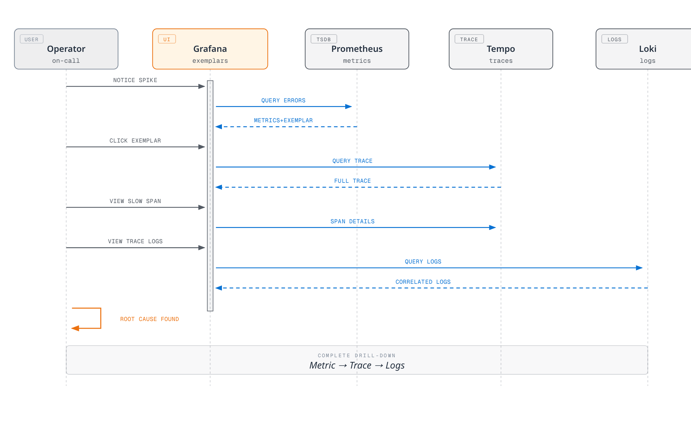

# Part 6: Distributed Tracing Analysis

> **Difficulty**: Advanced
> **Estimated Time**: 45 minutes
> **Last Updated**: February 22, 2026

## Learning Objectives

- Perform end-to-end trace analysis using Tempo and Grafana
- Identify service bottlenecks and performance issues
- Configure Loki-Tempo correlation for log-trace linking
- Use Exemplars for metrics-to-trace drill-down
- Build comprehensive observability dashboards

## Prerequisites

- [ ] Completed [Part 5: Alerting and AIOps](./05-alerting-aiops-lab.md)
- [ ] MSA services running with OTel instrumentation
- [ ] Tempo receiving traces
- [ ] Loki receiving logs with traceId

---

## Drill-Down Analysis Workflow



---

## Exercise 1: TraceQL Trace Search

### Steps

**Step 1.1: Access Grafana Explore with Tempo**

```bash
GRAFANA_URL=$(kubectl -n monitoring get svc grafana \
  -o jsonpath='{.status.loadBalancer.ingress[0].hostname}')

echo "Open: http://$GRAFANA_URL/explore"
echo "Select data source: Tempo"
```

**Step 1.2: Search for server errors (5xx)**

```traceql
{ status = error } | select(span.http.status_code, resource.service.name, duration)
```

**Step 1.3: Find slow requests (> 1 second)**

```traceql
{ duration > 1s && span.http.method = "POST" } | select(resource.service.name, name, duration)
```

**Step 1.4: Search for database slow queries**

```traceql
{ span.db.system = "postgresql" && duration > 100ms }
```

**Step 1.5: Find SQS publishing delays**

```traceql
{ span.messaging.system = "sqs" && span.messaging.operation = "publish" && duration > 500ms }
```

**Step 1.6: Complex query - Error traces with specific service**

```traceql
{ resource.service.name = "order-service" && status = error }
| select(span.http.status_code, span.http.route, duration, span.error.message)
| order by duration desc
| limit 20
```

### TraceQL Query Reference

| Use Case | TraceQL Query |
|----------|---------------|
| All errors | `{ status = error }` |
| Slow traces | `{ duration > 1s }` |
| Specific service | `{ resource.service.name = "order-service" }` |
| HTTP 500s | `{ span.http.status_code >= 500 }` |
| Database queries | `{ span.db.statement =~ "SELECT.*" }` |
| Cross-service | `{ resource.service.name = "api-gateway" } >> { resource.service.name = "order-service" }` |

---

## Exercise 2: Service Graph Visualization

### Steps

**Step 2.1: Enable Service Graph in Grafana**

```bash
# Service Graph is auto-generated from trace data
# Access: Grafana > Explore > Tempo > Service Graph tab
```

**Step 2.2: Analyze service dependencies**

The Service Graph shows:
- Service nodes (circles)
- Request flow (arrows)
- Request rate (arrow thickness)
- Error rate (red color intensity)
- Latency (displayed on hover)

**Step 2.3: Identify bottleneck services**

Look for:
1. Services with high latency (slow response)
2. Services with high error rates (red nodes)
3. Services with many incoming connections (potential hotspots)
4. Services with fan-out patterns (multiple downstream calls)

---

## Exercise 3: Latency Identification Workflow

### Steps

**Step 3.1: Latency analysis workflow table**

| Step | Action | Tool | What to Look For |
|------|--------|------|------------------|
| 1 | Check P99 latency trend | Prometheus/Grafana | Sudden spikes or gradual increase |
| 2 | Identify affected service | Service Graph | Red/slow nodes |
| 3 | Find slow traces | TraceQL | `{ duration > p99 }` |
| 4 | Analyze trace waterfall | Tempo | Long spans, gaps between spans |
| 5 | Check span details | Tempo | db.statement, http.url, error messages |
| 6 | Correlate with logs | Loki | Errors around the same timestamp |
| 7 | Check resource metrics | Prometheus | CPU, memory, connection pool |

**Step 3.2: Practical latency analysis**

```bash
# Step 1: Find P99 latency
# In Grafana Explore with Prometheus:
histogram_quantile(0.99, sum(rate(http_server_request_duration_seconds_bucket{service="order-service"}[5m])) by (le))

# Step 2: Find traces above P99
# In Grafana Explore with Tempo:
{ resource.service.name = "order-service" && duration > 800ms }

# Step 3: Analyze a specific trace
# Click on a trace to see the waterfall view

# Step 4: Identify the slowest span
# Look for spans with longest duration relative to parent
```

**Step 3.3: Common latency patterns**

| Pattern | Symptom | Likely Cause |
|---------|---------|--------------|
| Single slow span | One span takes 90% of trace time | Database query, external API |
| Sequential spans | Multiple spans in sequence | Missing parallelization |
| Gap between spans | Time unaccounted for | GC pause, thread contention |
| Fan-out delay | Many parallel calls, one slow | One downstream service degraded |
| Consistent high latency | All requests slow | Resource exhaustion |

---

## Exercise 4: Loki-Tempo Correlation

### Steps

**Step 4.1: Configure bidirectional linking**

The Grafana datasources configured in Part 2 already have correlation set up. Verify:

```bash
# Check Tempo datasource config
kubectl get configmap -n monitoring grafana -o yaml | grep -A20 "Tempo"
```

**Step 4.2: Trace to Logs (Tempo → Loki)**

1. Open a trace in Grafana Explore (Tempo)
2. Click on a span
3. Click "Logs for this span" button
4. Grafana queries Loki with the traceId

**Step 4.3: Logs to Trace (Loki → Tempo)**

1. In Grafana Explore, select Loki
2. Run a log query:
   ```logql
   {namespace="msa"} | json | level="ERROR"
   ```
3. Find a log line with traceId
4. Click the traceId link to jump to Tempo

**Step 4.4: Verify correlation works**

```bash
# Generate a test request and find it in both systems
curl -X POST "http://$API_URL:8080/api/v1/orders" \
  -H "Content-Type: application/json" \
  -d '{"customer_id":"TEST-001","product_id":"PROD-001","quantity":1}'

# Note the response and search in Tempo:
# { resource.service.name = "api-gateway" && span.http.route = "/api/v1/orders" }

# Find the traceId and search in Loki:
# {namespace="msa"} |= "traceId" | json | traceId = "<your-trace-id>"
```

---

## Exercise 5: Exemplar Usage

### Steps

**Step 5.1: Understanding Exemplars**

Exemplars link metric data points to specific traces, enabling drill-down from anomalous metrics to the actual requests.


**Step 5.2: View Exemplars in Grafana**

1. Open Grafana > Explore > Prometheus
2. Query with exemplars enabled:
   ```promql
   histogram_quantile(0.99, sum(rate(http_server_request_duration_seconds_bucket{service="order-service"}[5m])) by (le))
   ```
3. In the graph, look for diamond markers (exemplars)
4. Hover over a diamond to see the traceId
5. Click to navigate to Tempo

**Step 5.3: Configure Exemplar display**

```bash
# Ensure Prometheus is recording exemplars
kubectl get configmap -n monitoring kube-prometheus-stack-prometheus -o yaml | grep exemplar
```

**Step 5.4: Exemplar query in Grafana**

```promql
# Show request duration with exemplars
http_server_request_duration_seconds_bucket{service="order-service"}

# In Query Options, enable "Exemplars"
```

---

## Exercise 6: Comprehensive Dashboard Setup

### Steps

**Step 6.1: RED Dashboard (Rate, Errors, Duration)**

```bash
cat > /tmp/red-dashboard.json << 'EOF'
{
  "dashboard": {
    "title": "MSA RED Dashboard",
    "tags": ["obs-lab", "red", "sre"],
    "panels": [
      {
        "title": "Request Rate by Service",
        "type": "timeseries",
        "gridPos": {"h": 8, "w": 8, "x": 0, "y": 0},
        "targets": [{
          "expr": "sum(rate(http_server_request_count{namespace=\"msa\"}[5m])) by (service)",
          "legendFormat": "{{service}}"
        }]
      },
      {
        "title": "Error Rate by Service",
        "type": "timeseries",
        "gridPos": {"h": 8, "w": 8, "x": 8, "y": 0},
        "targets": [{
          "expr": "sum(rate(http_server_request_count{namespace=\"msa\",http_status_code=~\"5..\"}[5m])) by (service) / sum(rate(http_server_request_count{namespace=\"msa\"}[5m])) by (service)",
          "legendFormat": "{{service}}"
        }],
        "fieldConfig": {
          "defaults": {
            "unit": "percentunit",
            "thresholds": {
              "steps": [
                {"value": 0, "color": "green"},
                {"value": 0.01, "color": "yellow"},
                {"value": 0.05, "color": "red"}
              ]
            }
          }
        }
      },
      {
        "title": "P99 Latency by Service",
        "type": "timeseries",
        "gridPos": {"h": 8, "w": 8, "x": 16, "y": 0},
        "targets": [{
          "expr": "histogram_quantile(0.99, sum(rate(http_server_request_duration_seconds_bucket{namespace=\"msa\"}[5m])) by (le, service))",
          "legendFormat": "{{service}}"
        }],
        "fieldConfig": {
          "defaults": {
            "unit": "s"
          }
        }
      }
    ]
  }
}
EOF

curl -X POST -H "Content-Type: application/json" \
  -u admin:ObsLab2026! \
  -d @/tmp/red-dashboard.json \
  "http://$GRAFANA_URL/api/dashboards/db"
```

**Step 6.2: SLI/SLO Dashboard**

| SLI | Target (SLO) | Query |
|-----|--------------|-------|
| Availability | 99.9% | `1 - (sum(rate(http_server_request_count{status_code=~"5.."}[30d])) / sum(rate(http_server_request_count[30d])))` |
| Latency P99 | < 500ms | `histogram_quantile(0.99, sum(rate(http_server_request_duration_seconds_bucket[5m])) by (le)) < 0.5` |
| Throughput | > 100 RPS | `sum(rate(http_server_request_count[5m])) > 100` |

**Step 6.3: Infrastructure Dashboard**

| Panel | Metric | Purpose |
|-------|--------|---------|
| Node CPU | `node_cpu_seconds_total` | Node resource usage |
| Node Memory | `node_memory_MemAvailable_bytes` | Memory pressure |
| Pod CPU | `container_cpu_usage_seconds_total` | Pod resource usage |
| Pod Memory | `container_memory_working_set_bytes` | Container memory |
| PVC Usage | `kubelet_volume_stats_used_bytes` | Storage consumption |

**Step 6.4: Tracing Dashboard**

| Panel | Data Source | Purpose |
|-------|-------------|---------|
| Trace Count | Tempo metrics | Trace volume |
| Span Duration Heatmap | Tempo | Duration distribution |
| Service Graph | Tempo | Dependency visualization |
| Error Traces Table | Tempo | Recent errors |

---

## Cleanup

> **Important**: Complete this cleanup section to avoid ongoing AWS costs.

### Cleanup Steps Table

| Resource | Command | Notes |
|----------|---------|-------|
| MSA Applications | `kubectl delete namespace msa` | Deletes all MSA pods/services |
| Observability Stack | `helm uninstall kube-prometheus-stack -n monitoring` | Prometheus, Alertmanager |
| Loki | `helm uninstall loki -n logging` | Log storage |
| Tempo | `helm uninstall tempo -n tracing` | Trace storage |
| Grafana | `helm uninstall grafana -n monitoring` | Dashboards |
| OTel Collector | `kubectl delete namespace opentelemetry` | Telemetry pipeline |
| ArgoCD | `helm uninstall argocd -n argocd` | GitOps |
| KEDA | `helm uninstall keda -n keda` | Autoscaler |
| Locust | `kubectl delete deployment locust-master locust-worker -n msa` | Load testing |

### Full Cleanup Script

```bash
#!/bin/bash
set -e

echo "Starting cleanup..."

# 1. Delete MSA applications
echo "Deleting MSA namespace..."
kubectl delete namespace msa --ignore-not-found

# 2. Delete observability stack (Managed Cluster)
kubectl config use-context $(kubectl config get-contexts -o name | grep obs-managed)

echo "Uninstalling Helm releases..."
helm uninstall grafana -n monitoring --ignore-not-found || true
helm uninstall kube-prometheus-stack -n monitoring --ignore-not-found || true
helm uninstall victoria-metrics -n monitoring --ignore-not-found || true
helm uninstall mimir -n monitoring --ignore-not-found || true
helm uninstall loki -n logging --ignore-not-found || true
helm uninstall tempo -n tracing --ignore-not-found || true
helm uninstall fluent-bit -n logging --ignore-not-found || true
helm uninstall argocd -n argocd --ignore-not-found || true
helm uninstall grafana-oncall -n monitoring --ignore-not-found || true

# 3. Delete namespaces
echo "Deleting namespaces..."
kubectl delete namespace monitoring logging tracing opentelemetry argocd --ignore-not-found

# 4. Delete Service Cluster resources
kubectl config use-context $(kubectl config get-contexts -o name | grep obs-service)
helm uninstall keda -n keda --ignore-not-found || true
helm uninstall argo-rollouts -n argo-rollouts --ignore-not-found || true
kubectl delete namespace keda argo-rollouts msa opentelemetry --ignore-not-found

# 5. Delete EKS clusters
echo "Deleting EKS clusters (this takes 15-20 minutes)..."
eksctl delete cluster -f ~/obs-lab/managed-cluster.yaml --wait || true
eksctl delete cluster -f ~/obs-lab/service-cluster.yaml --wait || true

# 6. Delete AWS resources
echo "Deleting AWS resources..."

# Aurora
aws rds delete-db-instance --db-instance-identifier obs-lab-aurora-1 --skip-final-snapshot --region $AWS_REGION || true
sleep 60
aws rds delete-db-cluster --db-cluster-identifier obs-lab-aurora --skip-final-snapshot --region $AWS_REGION || true

# OpenSearch
aws opensearch delete-domain --domain-name obs-lab-logs --region $AWS_REGION || true

# AMP
AMP_WORKSPACE_ID=$(aws amp list-workspaces --alias obs-lab-prometheus --query "workspaces[0].workspaceId" --output text --region $AWS_REGION)
aws amp delete-workspace --workspace-id $AMP_WORKSPACE_ID --region $AWS_REGION || true

# SQS/SNS
SQS_QUEUE_URL=$(aws sqs get-queue-url --queue-name obs-lab-orders --query QueueUrl --output text --region $AWS_REGION 2>/dev/null)
aws sqs delete-queue --queue-url $SQS_QUEUE_URL --region $AWS_REGION || true

SNS_TOPIC_ARN=$(aws sns list-topics --query "Topics[?contains(TopicArn, 'obs-lab-alerts')].TopicArn" --output text --region $AWS_REGION)
aws sns delete-topic --topic-arn $SNS_TOPIC_ARN --region $AWS_REGION || true

# S3 buckets
aws s3 rb s3://obs-lab-loki-${ACCOUNT_ID} --force --region $AWS_REGION || true
aws s3 rb s3://obs-lab-tempo-${ACCOUNT_ID} --force --region $AWS_REGION || true
aws s3 rb s3://obs-lab-mimir-${ACCOUNT_ID} --force --region $AWS_REGION || true
aws s3 rb s3://obs-lab-mwaa-${ACCOUNT_ID}-${AWS_REGION} --force --region $AWS_REGION || true

# Lambda and API Gateway
aws lambda delete-function --function-name obs-lab-aiops-agent --region $AWS_REGION || true

# IAM policies
aws iam delete-policy --policy-arn arn:aws:iam::${ACCOUNT_ID}:policy/obs-lab-amp-access || true
aws iam delete-policy --policy-arn arn:aws:iam::${ACCOUNT_ID}:policy/obs-lab-logging-access || true

# CloudWatch Alarms
aws cloudwatch delete-alarms --alarm-names obs-lab-aurora-cpu-high obs-lab-sqs-message-age obs-lab-opensearch-health obs-lab-critical-composite --region $AWS_REGION || true

# 7. Cleanup local files
echo "Cleaning up local files..."
rm -rf ~/obs-lab

echo "Cleanup complete!"
echo "Note: Some resources may take additional time to fully delete."
echo "Verify in AWS Console that all resources are removed."
```

### Verification

```bash
# Verify EKS clusters deleted
eksctl get cluster --region $AWS_REGION

# Verify AWS resources deleted
aws rds describe-db-clusters --query "DBClusters[?DBClusterIdentifier=='obs-lab-aurora']" --region $AWS_REGION
aws opensearch describe-domain --domain-name obs-lab-logs --region $AWS_REGION 2>&1 | grep -q "ResourceNotFoundException" && echo "OpenSearch deleted"
aws amp list-workspaces --alias obs-lab-prometheus --region $AWS_REGION
```

---

## Summary

In this lab series, you have built a complete observability platform:

| Part | Topics Covered | Key Skills |
|------|---------------|------------|
| 1 | Infrastructure | EKS, AWS services, ArgoCD multi-cluster |
| 2 | Observability Stack | OTel, Prometheus, Loki, Tempo, Grafana |
| 3 | MSA Deployment | ArgoCD, Argo Rollouts, OTel instrumentation |
| 4 | Load Testing | k6, KEDA, Karpenter autoscaling |
| 5 | Alerting & AIOps | Alertmanager, OnCall, Bedrock Claude |
| 6 | Tracing Analysis | TraceQL, correlation, exemplars |

### Key Takeaways

1. **Three Pillars Integration**: Metrics, logs, and traces work together for complete observability
2. **OTel Standardization**: OpenTelemetry provides vendor-neutral instrumentation
3. **Multi-backend Strategy**: Fan-out to multiple backends for redundancy and flexibility
4. **Observability-Driven Deployment**: Canary releases with automated analysis
5. **AIOps Automation**: AI-powered incident analysis reduces MTTR
6. **Correlation is Key**: TraceID linking enables end-to-end debugging

## Final Verification Checklist

- [ ] Full metrics→exemplar→trace→logs drill-down works
- [ ] Service Graph shows all MSA dependencies
- [ ] Canary rollouts use observability metrics for decisions
- [ ] Alerts fire and reach notification channels
- [ ] AIOps agent provides useful analysis
- [ ] All resources cleaned up to avoid costs

## Next Steps

After completing this lab series:

1. **Production Deployment**: Apply these patterns to production workloads
2. **Custom Instrumentation**: Add business-specific metrics and traces
3. **SLO Implementation**: Define and track SLOs with error budgets
4. **Chaos Engineering**: Introduce controlled failures to test observability
5. **Cost Optimization**: Implement sampling and retention policies

## References

- [Tempo Documentation](../../observability/tracing/01-tempo.md)
- [OpenTelemetry Documentation](../../observability/tracing/03-opentelemetry.md)
- [Loki Documentation](../../observability/logging/01-loki.md)
- [Prometheus Documentation](../../observability/metrics/01-prometheus.md)
- [Grafana Documentation](../../observability/grafana/README.md)
- [TraceQL Documentation](https://grafana.com/docs/tempo/latest/traceql/)
